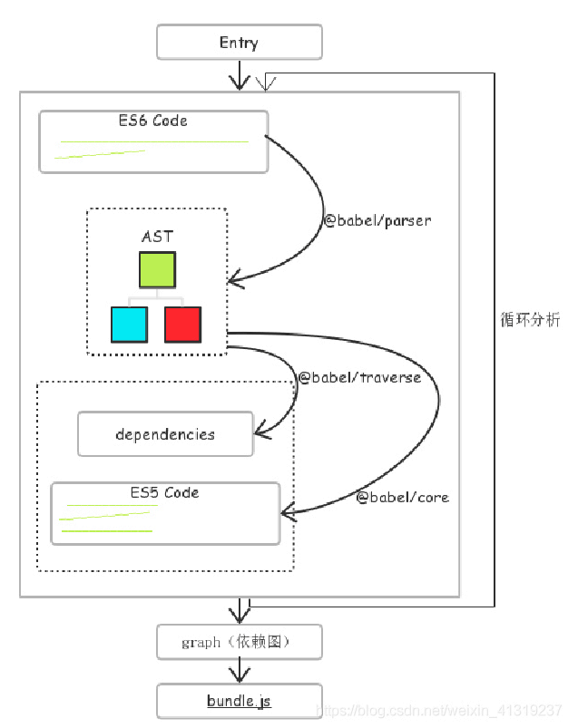
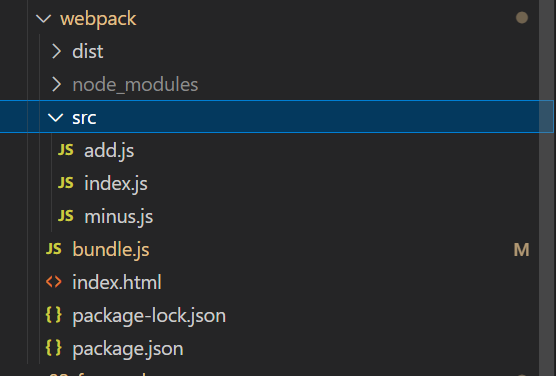
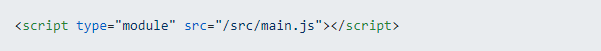
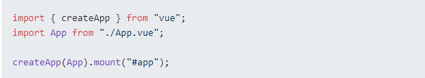
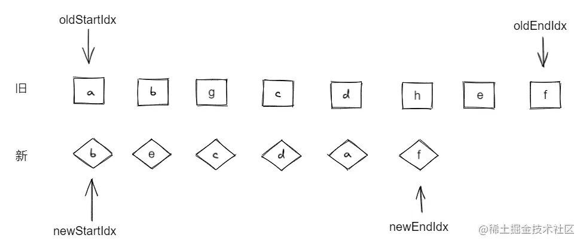
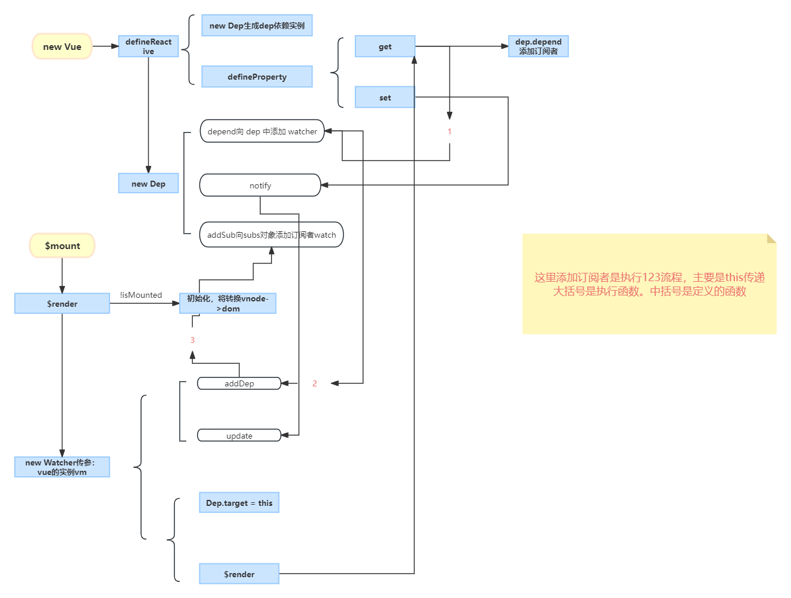
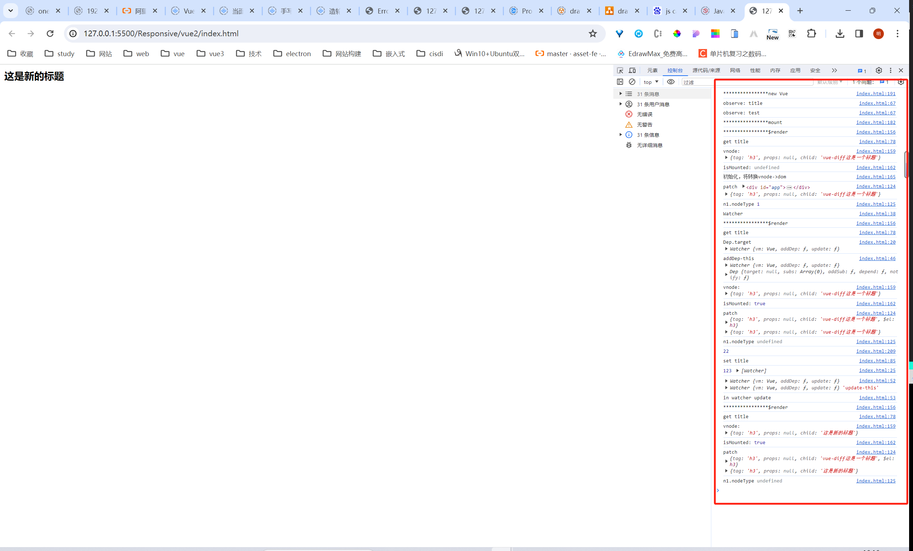

# ES

## promise源码

https://zhuanlan.zhihu.com/p/76811638

# webpack

## webpack执⾏流程

### 简略流程



图示流程理解分析：

1. 读取⼊⼝⽂件；

2. 基于 AST（抽象语法树） 分析⼊⼝⽂件，并产出依赖列表；

3. AST （Abstract Syntax Tree）抽象语法树 在计算机科学中，或简称语法树（Syntax tree），是源代码语法结构的⼀种抽象表示。它以树状的形式表现编程语⾔的语法结构，树上的每个节点都表示源代码中的⼀种结构。
4. 使⽤ Babel 将相关模块编译到 ES5；

5. webpack有⼀个智能解析器（各种babel），⼏乎可以处理任何第三⽅库。⽆论它们的模块形式是CommonJS、AMD还是普通的JS⽂件；甚⾄在加载依赖的时候，允许使⽤动态表require("、/templates/"+name+"、jade")。以下这些⼯具底层依赖了不同的解析器⽣成AST，⽐如eslint使⽤了espree、babel使⽤了acorn

6. 对每个依赖模块产出⼀个唯⼀的 ID，⽅便后续读取模块相关内容；

7. 将每个依赖以及经过 Babel 编译过后的内容，存储在⼀个对象中进⾏维护；

8. 遍历上⼀步中的对象，构建出⼀个依赖图（Dependency Graph）；

9. 将各模块内容 bundle 产出

### 详细流程


流程：

1. 通过命令行和 `webpack.config.js` 来获取参数
2. 创建`compiler`对象，初始化`plugins`
3. 开始编译阶段，`addEntry`添加入口资源
4. `addModule` 创建模块
5. `runLoaders` 执行 `loader`
6. 依赖收集，js 通过`acorn`解析为 `AST`，然后查找依赖，并重复 4 步
7. 构建完**依赖树**后，进入生成阶段，调用`compilation.seal`
8. 经过一系列的`optimize`优化依赖，生成 `chunks`，写入文件

## babel打包原理

⼿写webpack原理 https://juejin.cn/post/6854573217336541192

webpack打包原理 https://blog.csdn.net/weixin_41319237/article/details/116194091

**主要流程**

1. 需要读到入口文件里面的内容
2. 分析入口文件，递归的去读取模块所依赖的文件内容，生成AST语法树。
3. 根据AST语法树，生成浏览器能够运行的代码

**具体细节**

1. 获取主模块内容

2. 分析主模块
   - 安装@babel/parser包（生成AST）

   - 对主模块内容进行处理，生成文件信息对象
   
      ```
      { file, deps, code }
      ```
   
      - 安装@babel/traverse包（遍历AST收集依赖）
   
      - 安装@babel/core和@babel/preset-env包   （es6转ES5）
   
3. 递归所有模块，将所有模块的文件信息对象（主模块和依赖模块）扁平放置在数组中

4. 执行require和exports。生成最终代码

### 基本准备工作

先建一个webpack项目，创建add.js文件和minus.js文件,然后在index.js中引入，再将index.js文件引入index.html。



代码如下:

add.js

```css
export default (a,b)=>{
  return a+b;
}
```

minus.js

```css
export const minus = (a,b)=>{
    return a-b
}
```

index.js

```javascript
import add from "./add.js"
import {minus} from "./minus.js";

const sum = add(1,2);
const division = minus(2,1);

console.log(sum);
console.log(division);
```

index.html

```xml
<!DOCTYPE html>
<html lang="en">
<head>
    <meta charset="UTF-8">
    <title>Title</title>
</head>
<body>
<script src="./src/index.js"></script>
</body>
</html>
复制代码
```

现在我们打开index.html。你猜会发生什么？？？显然会报错，因为浏览器还不能识别import等ES6语法


### 获取主模块内容

bundle.js文件

```javascript
// 获取主入口文件
const fs = require('fs')
const getModuleInfo = (file)=>{
    const body = fs.readFileSync(file,'utf-8')
    console.log(body);
}
getModuleInfo("./src/index.js")
```

执行一下bundle.js：`node bundle.js`


### 分析模块babel/parser

分析模块的主要任务是 将获取到的主模块内容 解析成AST语法树，这个需要用到一个依赖包@babel/parser

```bash
npm install @babel/parser
```

ok,安装完成我们将@babel/parser引入bundle.js,

```javascript
// 获取主入口文件
const fs = require('fs')
const parser = require('@babel/parser')
const getModuleInfo = (file)=>{
    const body = fs.readFileSync(file,'utf-8')
    // 新增代码
    const ast = parser.parse(body,{
        sourceType:'module' //表示我们要解析的是ES模块
    });
    console.log(ast);
//当前我们解析出来的不单单是index.js文件里的内容，它也包括了文件的其他信息。 而它的内容其实是它的属性program里的body里
    console.log(ast.program.body);
}
getModuleInfo("./src/index.js")
```

### 收集依赖babel/traverse

现在我们需要 遍历AST，将用到的依赖收集起来。什么意思呢？其实就是将用import语句引入的文件路径收集起来。我们将收集起来的路径放到deps里。

前面我们提到过，遍历AST要用到@babel/traverse依赖包

```bash
npm install @babel/traverse
```

现在，我们引入。

```js
const fs = require('fs')
const path = require('path')
const parser = require('@babel/parser')
const traverse = require('@babel/traverse').default
const getModuleInfo = (file)=>{
    const body = fs.readFileSync(file,'utf-8')
    const ast = parser.parse(body,{
        sourceType:'module' //表示我们要解析的是ES模块
    });
    
    // 新增代码
    const deps = {}
    traverse(ast,{
         //ImportDeclaration方法代表的是对ast中type类型为ImportDeclaration的节点的处理。
        ImportDeclaration({node}){
            const dirname = path.dirname(file)
            const abspath = './' + path.join(dirname,node.source.value)
            deps[node.source.value] = abspath
        }
    })
    console.log(deps);


}
getModuleInfo("./src/index.js")
```

### ES6的AST转化成ES5

```bash
npm install @babel/core @babel/preset-env
```

我们现在将依赖引入并使用

```js
const fs = require('fs')
const path = require('path')
const parser = require('@babel/parser')
const traverse = require('@babel/traverse').default
const babel = require('@babel/core')
const getModuleInfo = (file)=>{
    const body = fs.readFileSync(file,'utf-8')
    const ast = parser.parse(body,{
        sourceType:'module' //表示我们要解析的是ES模块
    });
    const deps = {}
    traverse(ast,{
        ImportDeclaration({node}){
            const dirname = path.dirname(file)
            const abspath = "./" + path.join(dirname,node.source.value)
            deps[node.source.value] = abspath
        }
    })
    
    新增代码
    const {code} = babel.transformFromAst(ast,null,{
        presets:["@babel/preset-env"]
    })
    console.log(code);

}
getModuleInfo("./src/index.js")
```

### 递归获取所有依赖

经过上面的过程，现在我们知道getModuleInfo是用来获取一个模块的内容，不过我们还没把获取的内容return出来，因此，更改下getModuleInfo方法

```js
const getModuleInfo = (file)=>{
    const body = fs.readFileSync(file,'utf-8')
    const ast = parser.parse(body,{
        sourceType:'module' //表示我们要解析的是ES模块
    });
    const deps = {}
    traverse(ast,{
        ImportDeclaration({node}){
            const dirname = path.dirname(file)
            const abspath = "./" + path.join(dirname,node.source.value)
            deps[node.source.value] = abspath
        }
    })
    const {code} = babel.transformFromAst(ast,null,{
        presets:["@babel/preset-env"]
    })
    // 新增代码
    const moduleInfo = {file,deps,code}
    return moduleInfo
}
```

我们返回了一个对象 ，这个对象包括**主模块的路径（file）**，**主模块的依赖（deps）**，**主模块转化成es5的代码**

该方法只能获取一个模块的的信息，但是我们要怎么获取一个模块里面的依赖模块的信息呢？递归。

```
//递归获取依赖
const parseModules = (file) =>{
    const entry =  getModuleInfo(file)
    const temp = [entry]
    for (let i = 0;i<temp.length;i++){
        const deps = temp[i].deps
        if (deps){
            for (const key in deps){
                if (deps.hasOwnProperty(key)){
                    temp.push(getModuleInfo(deps[key]))
                }
            }
        }
    }
    console.log(temp)
}
```

讲解下parseModules方法：

1. 我们首先传入主模块路径
2. 将获得的模块信息放到temp数组里。
3. 外面的循坏遍历temp数组，此时的temp数组只有主模块
4. 循环里面再获得主模块的依赖deps
5. 遍历deps，通过调用getModuleInfo将获得的依赖模块信息push到temp数组里。

按照目前我们的项目来说执行完，应当是temp 应当是存放了index.js,add.js,minus.js三个模块。 ,执行看看。


不过现在的temp数组里的对象格式不利于后面的操作，我们希望是`以文件的路径为key：{code，deps}为值`的形式存储。因此，我们创建一个新的对象depsGraph。

```js
const parseModules = (file) =>{
    const entry =  getModuleInfo(file)
    const temp = [entry] 
    for (let i = 0;i<temp.length;i++){
        const deps = temp[i].deps
        if (deps){
            for (const key in deps){
                if (deps.hasOwnProperty(key)){
                    temp.push(getModuleInfo(deps[key]))
                }
            }
        }
    }
    // 新增代码
    const depsGraph = {}
    temp.forEach(moduleInfo=>{
        depsGraph[moduleInfo.file] = {
            deps:moduleInfo.deps,
            code:moduleInfo.code
        }
    })
    console.log(depsGraph)
    return depsGraph
}
```


### 处理导入导出

下面生成commonjs源码

```js
// index.js
"use strict"
var _add = _interopRequireDefault(require("./add.js"));
var _minus = require("./minus.js");
function _interopRequireDefault(obj) 
{ 
  return obj && obj.__esModule ? obj : { "default": obj }; 
}
var sum = (0, _add["default"])(1, 2);
var division = (0, _minus.minus)(2, 1);
console.log(sum); 
console.log(division);
```

```js
// add.js
"use strict";
Object.defineProperty(exports, "__esModule", {  value: true});
exports["default"] = void 0;
var _default = function _default(a, b) { return a + b;};
exports["default"] = _default;
```

但是我们现在是不能执行index.js这段代码的，因为浏览器不会识别执行require和exports。

不能识别是为什么？因为没有定义这**require函数，和exports对象**。那我们可以自己定义。

```js
const bundle = (file) => {
  const depsGraph = JSON.stringify(parseModules(file)); //返回一个整合完整的字符串代码
  /**
   * 把保存下来的depsGraph，传入一个立即执行函数。
    将主模块路径传入require函数执行
    执行reuire函数的时候，立即执行一个立即执行函数
    执行eval（code）,也就是执行主模块的code这段代码，这段代码会读取require, exports传参
   */
  return `(function (graph) {
    function require(file) {
      //相对路径转化成绝对路径
      function absRequire(relPath) {
        return require(graph[file].deps[relPath])
      }
      //执行add.js的code时候，会遇到exports这个还没定义的问题.因此我们可以自己定义一个exports对象。
      var exports = {};
      (function (require, exports, code) {
        //code代码执行过程中会执行到require函数。
        //这时会调用这个require，也就是我们传入的absRequire
        eval(code);
      })(absRequire, exports, graph[file].code)
      console.log('exports', exports);
      return exports;
    }
    require('${file}')
  })(${depsGraph})`;
};
const content = bundle("./src/index.js");
// fs.mkdirSync("./dist");
// fs.writeFileSync("./dist/bundle.js", content);
```

- 把保存下来的depsGraph，传入一个立即执行函数。

  - 将主模块路径传入require函数执行

    - reuire函数中立即执行函数

      - require：absRequire，因为code代码中require路径不是绝对路径，需要转化成绝对路径，因此写一个函数absRequire来转化

      - exports：exports

        - 增添了一个空对象 exports，执行add.js代码的时候，会往这个空对象上增加一些属性

          ```js
          // add.js
          "use strict";
          Object.defineProperty(exports, "__esModule", { value: true});
          exports["default"] = void 0;
          var _default = function _default(a, b) {  return a + b;};
          exports["default"] = _default;
          //执行完这段代码后
          exports = {
            __esModule：{  value: true}，
            default：function _default(a, b) {  return a + b;}
          }
          ```

        - 然后我们把exports对象return出去。

          ```js
          var _add = _interopRequireDefault(require("./add.js"));
          ```

          return出去的值，被_interopRequireDefault接收，_interopRequireDefault再返回default这个属性给_add，因此`_add = function _default(a, b) { return a + b;}`

      - code：graph[file].code

        - 执行eval（code）,也就是执行模块的code这段代码
          - 执行eval（code）过程会执行到require函数，这时会调用这个require，也就是我们传入的absRequire，而执行absRequire就执行了`return require(graph[file].deps[relPath])`这段代码，也就是执行了外面这个require。而执行require（"./src/add.js"）之后，又会执行eval，也就是执行add.js文件的代码。

## tree-shaking

https://blog.csdn.net/qq_41887214/article/details/121922348


## ESM

ESM（[ECMAScript modules](http://www.baidu.com/link?url=jkDDSuTWavpZelJPBjx3i0Z5HPdYw6FZmnosWYoVeRanxkK5A0z_kKdVMypcts6dWdFxj9NRfKpgiVUisbMEtDr7Xrgrbg-AltM4yIqa3-u)）: **基于浏览器 ES 模块的构建工具**

`browserify`、`webpack`、`rollup`、`parcel` 这些工具的思想都是递归循环依赖，然后组装成依赖树，优化完依赖树后生成代码。
但是这样做的缺点就是慢，需要遍历完所有依赖，即使 `parcel` 利用了多核，`webpack` 也支持多线程，在打包大型项目的时候依然慢可能会用上几分钟，存在性能瓶颈。所以基于浏览器原生 `ESM` 的运行时打包工具出现：

仅打包屏幕中用到的资源，而不用打包整个项目，开发时的体验相比于 `bundle` 类的工具只能用极速来形容。（实际生产环境打包依然会构建依赖方式打包）


### bundleless 打包原理

**`bundleless` 类运行时打包工具的启动速度是毫秒级的，因为不需要打包任何内容，只需要起两个 `server`，一个用于页面加载，另一个用于 `HMR` 的 `WebSocket`，当浏览器发出原生的 `ES module` 请求，`server` 收到请求只需编译当前文件后返回给浏览器不需要管依赖。**

`bundleless` 工具在 **生产环境** 打包的时候依然 `bundle` 构建所有依赖视图的方式，vite 是利用 `rollup` 打包生产环境的 js 的。

原理拿 `vite` 举例：

`vite` 在启动服务器后，会预先以所有 html 为入口，使用 `esbuild` 编译一遍，把所有的 `node_modules` 下的依赖编译并缓存起来，例如 `vue` 缓存为单个文件。

当打开在浏览器中输入链接，渲染 `index.html` 文件的时候，利用浏览器自带的 `ES module` 来请求文件。



vite 收到一个 `src/main.js` 的 `http` 文件请求，使用 `esbuild` 开始编译 `main.js`，这里不进行 `main.js` 里面的依赖编译。



浏览器获取到并编译 `main.js` 后，再次发出 2 个请求，一个是 `vue` 的请求，因为前面已经说了 vue 被预先缓存下来，直接返回缓存给浏览器，另一个是 `App.vue` 文件，这个需要 `@vitejs/plugin-vue` 来编译，编译完成后返回结果给浏览器（`@vitejs/plugin-vue` 会在脚手架创建模板的时候自动配置）。

因为是基于浏览器的 `ES module`，所以编译过程中需要把一些 `CommonJs`、`UMD` 的模块都转成 `ESM`。

`Vite` 同时利用 `HTTP` 头来加速整个页面的重新加载（再次让浏览器为我们做更多事情）：源码模块的请求会根据 `304 Not Modified` 进行协商缓存，而依赖模块请求则会通过 `Cache-Control: max-age=31536000,immutable` 进行强缓存，因此一旦被缓存它们将不需要再次请求，即使缓存失效只要服务没有被杀死，编译结果依然保存在程序内存中也会很快返回。

上面多次提到了 `esbuild`，`esbuild` 使用 `go` 语言编写，所以在 `i/o` 和运算运行速度上比解释性语言 `NodeJs` 快得多，`esbuild` 号称速度是 `node` 写的其他工具的 10~100 倍。


`ES module` 依赖运行时编译的概念 + `esbuild` + 缓存 让 `vite` 的速度远远甩开其他构建工具。


# 单应用框架

## 软件架构模式

https://www.pianshen.com/article/3716256399/

MVC，MVP和MVVM都是常见的[软件架构设计模式](https://www.zhihu.com/search?q=软件架构设计模式&search_source=Entity&hybrid_search_source=Entity&hybrid_search_extra={"sourceType"%3A"answer"%2C"sourceId"%3A2396493957})（Architectural Pattern），它通过分离关注点来改进代码的组织方式。它们目标都是解耦，解耦好处一个是关注点分离，提升代码可维护和可读性，并且提升代码复用性。

### MVC

MVC全名是Model View Controller，是模型(model)－视图(view)－控制器(controller)的缩写，一种软件设计典范，用一种业务逻辑、数据、界面显示分离的软件设计规范。

- **Model（模型）** ：数据层。通过ajax从服务器获取数据。

- **View（视图）** ：视图层。

- **Controller（控制器）**：交互层。用户对View的操作交给了Controller处理，在Controller中响应View的事件调用Model的接口对数据进行操作，一旦Model发生变化便通知相关视图进行更新


> 1.View传送指令到Controller。
>
> 2.Controller完成业务逻辑后改变Model状态。
>
> 3.Model将新的数据发送至View,用户得到反馈。    

**缺点**

**1.m层和v层直接打交道，导致这两层耦合度高**

**2.因为所有逻辑都写在c层，导致c层特别臃肿**

控制div是否显示：

```html
<body>
    <div id="box">我显示的</div>
    <button id="btn">点击</button>
    
    <script>
        btn.onclick = function() {
            if(box.style.display === 'none') box.style.display = 'block';
            else box.style.display = 'none';
        }
    </script>
</body>
```

用数据驱动模型模型来写：

```js
<body>
    <div id="box">我显示的</div>
    <button id="btn">点击</button>
    
    <script>
        let is_shown = true;
        function render(el, is_shown) {
            if(is_shown) el.style.display = 'block';
            else el.style.display = 'none';
        }
        btn.onclick = function() {
            is_shown = !is_shown;
            render(box, is_shown);
        }
    </script>
</body>
```

看起来好像多了几行代码，但是对于第二种代码来说，简单抽象封装了 `render` 函数，我们只需要修改 `is_shown` 的 `bool` 值，而无需在意 `render` 函数内部的执行，就可以实现通过数据修改来驱动视图的更新。

### MVVM

mvc中Controller演变成mvvm中的viewModel。 **mvvm主要解决了mvc中大量DOM操作使页面首次渲染性能降低，加载速度变慢的问题 。**

**Model-View-ViewModel**即模型-视图-视图模型。

- 模型：数据层。后端传递的数据。

- 视图：视图层。

- 视图模型：mvvm模式的核心，它是连接view和model的桥梁。


**总结**：**在MVVM的框架下视图和模型是不能直接通信的**。它们通过ViewModel来通信，ViewModel通常要实现一个observer观察者，当数据发生变化，ViewModel能够监听到数据的这种变化，然后通知到对应的视图做自动更新，而当用户操作视图，ViewModel也能监听到视图的变化，然后通知数据做改动，这实际上就实现了数据的**双向绑定**。

### 区别

- dom操作方式
  - MVC来讲，MVC操作的是真实dom，对于数据的更新需要找到**对应抽象类**来直接操作真实dom
  - 对于MVVM来讲，它操作的是虚拟dom、在数据的更新后，该框架重新生成一个虚拟dom树，与旧虚拟dom树进行比对，然后替换修改的地方，所以可以将渲染视图抽象成一个函数类
- 视图更新
  - MVVM完全不需要考虑视图更新对dom树的操作，框架会自动响应绑定对视图的更新

- 性能
  - 页面首次渲染，MVVM框架可能会比MVC框架快一些，因为MVVM只会进行一次对真实dom的操作，而MVC可能会进行多次真实dom的操作
  - 在首屏渲染完毕后，用户开始对页面进行直接操作时，MVVM的性能肯定会输MVC的
    - 对于MVC构建的页面来说，用户修改数据，该框架会根据绑定的dom元素直接进行修改
    - 而对于MVVM构建的页面来说，用户修改数据，该框架会重新生成虚拟dom树与原树进行比对，再修改
    - 虽然可以进行diff（新旧虚拟dom树比对算法）优化，但是一个是直接操作，一个需要最少O(n)算法比对在进行真实dom操作

- 框架
  - 常见的MVC框架有：Angular.js

## 框架对比

https://juejin.cn/post/6844903974437388295

https://zhuanlan.zhihu.com/p/100228073

### 渐进式

我们可以通过添加组件系统（components）、客户端路由（vue-router）、大规模状态管理（vuex）来构建一个完整的框架，这都是可选的


### 开发团队

+ React是由FaceBook前端官方团队进行维护和更新的；因此，React的维护开发团队，技术实力比较雄厚；
+ Vue：第一版，主要是有作者 尤雨溪 专门进行维护的，当 Vue更新到 2.x 版本后，也有了一个小团队进行相关的维护和开发；

### 编写语法

#### vue

vue推荐的做法是webpack+vue-loader的单文件组件格式，**vue保留了html、css、js分离的写法**，使得现有的前端开发者在开发的时候能保持原有的习惯，更接近常用的web开发方式，模板就是普通的html，数据绑定使用mustache风格，样式直接使用css。其中<style>标签还提供了一个可选的scoped属性，它会为组件内 CSS 指定作用域，用它来控制仅对当前组件有效还是全局生效。

模板和JSX是各有利弊的东西。模板更贴近我们的HTML，可以让我们更直观地思考语义结构，更好地结合CSS的书写。

同时vue也支持JSX语法，因为是真正的JavaScript，拥有这个语言本身的所有的能力，可以进行复杂的逻辑判断，进行选择性的返回最终要返回的DOM结构，能够实现一些在模板的语法限制下，很难做到的一些事情。

#### react

用过react的开发者可能知道，**react是没有模板的，直接就是一个渲染函数**，它中间返回的就是一个虚拟DOM树，**React推荐的做法是 JSX + inline style, 也就是把HTML和CSS全都写进JavaScript了,即'all in js'**。JSX实际就是一套使用XML语法，用于让我们更简单地去描述树状结构的语法糖。在react中，所有的组件的渲染功能都依靠JSX。你可以在render()中编写类似XML的语法，它最终会被编译成原生JavaScript。不仅仅是 HTML 可以用 JSX 来表达，现在的潮流也越来越多地将 CSS 也纳入到 JavaScript 中来处理。JSX是基于 JS 之上的一套额外语法，学习使用起来有一定的成本。

### 构建工具

#### vue

vue提供了CLI 脚手架，可以帮助你非常容易地构建项目。全局安装之后，我们就可以用 vue create命令创建一个新的项目，vue 的 CLI 跟其他 CLI不同之处在于，有多个可选模板，有简单的也有复杂的，可以让用户自定义选择需要安装的模块，还可以将你的选择保存成模板，便于后续使用。

极简的配置，更快的安装，可以更快的上手。它也有一个更完整的模板，包括单元测试在内的各种内容都涵盖，但是，它的复杂度也更高，这又涉及到根据用例来选择恰当复杂度的问题。

#### react

React 在这方面也提供了 create-react-app，但是现在还存在一些局限性：

- 它不允许在项目生成时进行任何配置，而 Vue CLI 运行于可升级的运行时依赖之上，该运行时可以通过插件进行扩展。
- 它只提供一个构建单页面应用的默认选项，而 Vue 提供了各种用途的模板。
- 它不能用用户自建的预设配置构建项目，这对企业环境下预先建立约定是特别有用的。

而要注意的是这些限制是故意设计的，这有它的优势。例如，如果你的项目需求非常简单，你就不需要自定义生成过程。你能把它作为一个依赖来更新。

### 数据流和数据绑定

**Vue和React均是单向数据流传递**，子组件不能直接改变父组件的状态

#### vue

Vue是双向数据。Vue采用数据劫持&发布-订阅模式的方式，vue在创建vm的时候，会将数据配置在实例当中，然后通过Object.defineProperty对数据进行操作，为数据动态添加了getter与setter方法，当获取数据的时候会触发对应的getter方法，当设置数据的时候会触发对应的setter方法，从而进一步触发vm的watcher方法，然后数据更改，vm则会进一步触发视图更新操作

#### react

在[React](https://so.csdn.net/so/search?q=React&spm=1001.2101.3001.7020)中虽然modal和view之间也是通过ViewMode处理,但是却需要setState去手动刷新渲染view，所以叫单向绑定

### diff算法

相同点

1. 虚拟DOM在比较时只比较同一层级节点，复杂度都为 O(n)，降低了算法复杂度；
2. 都使用key比较是否是相同节点，都是为了尽可能的复用节点
3. 都是操作虚拟DOM，最小化操作真实DOM，提高性能（其实虚拟DOM的优势 并不是在于它操作DOM快）

#### vue

vue中diff算法实现流程

1. 在内存中构建虚拟dom树
2. 将内存中虚拟dom树渲染成真实dom结构
3. 数据改变的时候，将之前的虚拟dom树结合新的数据生成新的虚拟dom树
4. 将此次生成好的虚拟dom树和上一次的虚拟dom树进行一次比对（diff算法进行比对），来更新只需要被替换的DOM，而**不是全部重绘**。在Diff算法中，只平层的比较前后两棵DOM树的节点，没有进行深度的遍历。
5. 会将对比出来的差异进行重新渲染

#### react

react中diff算法实现流程

1. DOM结构发生改变-----直接卸载并重新create
2. DOM结构一样-----不会卸载,但是会update变化的内容
3. 所有同一层级的子节点.他们都可以通过key来区分-----同时遵循1.2两点
    （其实这个key的存在与否只会影响diff算法的复杂度,换言之,你不加key的情况下,diff算法就会以暴力的方式去根据一二的策略更新,但是你加了key,diff算法会引入一些另外的操作）

React会逐个对节点进行更新，转换到目标节点。而最后插入新的节点，涉及到的DOM操作非常多。diff总共就是移动、删除、增加三个操作，而如果给每个节点唯一的标识（key），那么React优先采用移动的方式，能够找到正确的位置去插入新的节点。

vue会跟踪每一个组件的依赖关系，不需要重新渲染整个组件树。**而对于React而言,每当应用的状态被改变时,全部组件都会重新渲染,所以react中会需要shouldComponentUpdate这个生命周期函数方法来进行控制。**

### 性能

#### react

当props或state发生改变的时候会触发shouldComponentUpdate生命周期函数，它是用来控制组件是否被重新渲染的，如果它返回true，则执行render函数，更新组件；如果它返回false，则不会触发重新渲染的过程。

有的时候我们希望它在更新之前，和之前的状态进行一个对比，这个时候我们就需要重写shouldComponentUpdate来避免不必要的dom操作，对比当前的props或state和更新之后的nextProps或nextState，返回true时 ，组件更新；返回false，则不会更新，节省性能。

#### vue

vue里面由于依赖追踪系统的存在，当任意数据变动的时，Vue的每一个组件都精确地知道自己是否需要重绘，所以并不需要shouldComponentUpdate手动优化。但是当数据特别多的时候vue中的watcher也会特别多，从而造成页面卡顿，所以一般数据比较多的大型项目会倾向于使用react。


### 生命周期

#### vue

```
beforeCreate	
组件实例刚刚被创建，组件的el（Vue实例挂载的元素节点，简单来说el的作用就是将当前vue组件生成的实例插入到页面元素中）和data，methods都未被初始化，调用不了
new Vue({
    el: '#app'
})

created			     
实例已经创建完成，data，methods都已经被初始化，可以被调用但是el还处于未被创建状态。如果要调用 methods 中的方法，或者操作 data 中的数据，最早可以在这个阶段中操作

beforeMount		
template模板已经编译完成，el已经创建完成，但是还没有挂载到页面上，而只是放在内存中

mounted			
页面渲染完成初始化完毕。可以在 mounted 内部使用 vm.$nextTick。 如果我们想要通过插件操作页面上的DOM节点，最早可以在和这个阶段中进行

beforeUpdate	组件更新之前
updated			组件更新完毕	
更新前/后：当data变化时，会触发beforeUpdate和updated方法。

beforeDestroy	组件销毁前
destroyed		组件销毁后
销毁前/后：在执行destroy方法后，对data的改变不会再触发周期函数，说明此时vue实例已经解除了事件监听以及和dom的绑定，但是dom结构依然存在。

activated	keep-alive 组件激活时调用。
deactivated	keep-alive 组件停用时调用。
```


#### react

- 初始化阶段（5个）：

  - getDefaultProps：实例化组件之后，组件的getDefaultProps钩子函数会执行

    这个钩子函数的目的是为组件的实例挂载默认的属性

    这个钩子函数只会执行一次，也就是说，只在第一次实例化的时候执行，创建出所有实例共享的默认属性，后面再实例化的时候，不会执行getDefaultProps，直接使用已有的共享的默认属性

    理论上来说，写成函数返回对象的方式，是为了防止实例共享，但是react专门为了让实例共享，只能让这个函数只执行一次

    组件间共享默认属性会减少内存空间的浪费，而且也不需要担心某一个实例更改属性后其他的实例也会更改的问题，因为组件不能自己更改属性，而且默认属性的优先级低。

（2）getInitialState：为实例挂载初始状态，且每次实例化都会执行，也就是说，每一个组件实例都拥有自己独立的状态。

（3）componentWillMount：执行componentWillMount，相当于Vue里的created+beforeMount，这里是在渲染之前最后一次更改数据的机会，在这里更改的话是不会触发render的重新执行。

（4）render：渲染dom

render()方法必须是一个纯函数，他不应该改变

state，也不能直接和浏览器进行交互，应该将事件放在其他生命周期函数中。 如果

shouldComponentUpdate()返回

false，

render()不会被调用。

（5）componentDidMount：相当于Vue里的mounted,多用于操作真实dom

【运行中阶段（5个）】

当组件mount到页面中之后，就进入了运行中阶段，在这里有5个钩子函数，但是这5个函数只有在数据（属性、状态）发送改变的时候才会执行

（1）componentWillReceiveProps(nextProps,nextState)

当父组件给子组件传入的属性改变的时候，子组件的这个函数才会执行。初始化props时候不会主动执行

当执行的时候，函数接收的参数是子组件接收到的新参数，这个时候，新参数还没有同步到this.props上,多用于判断新属性和原有属性的变化后更改组件的状态。

（2）接下来就会执行shouldComponentUpdate(nextProps,nextState),这个函数的作用：当属性或状态发生改变后控制组件是否要更新，提高性能,返回true就更新，否则不更新，默认返回true。

接收nextProp、nextState，根据根据新属性状态和原属性状态作出对比、判断后控制是否更新

如果

shouldComponentUpdate()返回

false，

componentWillUpdate,

render和

componentDidUpdate不会被调用。

（3）componentWillUpdate,在这里，组件马上就要重新render了，多做一些准备工作，千万千万，不要在这里修改状态，否则会死循环 相当于Vue中的beforeUpdate

（4）render，重新渲染dom

（5）componentDidUpdate，在这里，新的dom结构已经诞生了,相当于Vue里的updated

【销毁阶段】

当组件被销毁之前的一刹那，会触发componentWillUnmount，临死前的挣扎

相当于Vue里的beforeDestroy，所以说一般会做一些善后的事情，例如使定时器无效，取消网络请求或清理在

componentDidMount中创建的任何监听。


### 销毁组件

#### vue

vue在调用$destroy方法的时候就会执行beforeDestroy生命周期函数，然后组件被销毁，这个时候组件的dom结构还存在于页面结构中，也就说如果想要对残留的dom结构进行处理必须在destroyed生命周期函数中处理。

#### react

react执行完componentWillUnmount之后把事件、数据、dom都全部处理掉了，也就是说当父组件从渲染这个子组件变成不渲染这个子组件的时候，子组件相当于被销毁，所以根本不需要其他的钩子函数了。react销毁组件的时候，会将组件的dom结构也移除，vue则不然，在调用destory方法销毁组件的时候，组件的dom结构还是存在于页面中的，this.$destory组件结构还是存在的，只是移除了事件监听，所以这就是为什么vue中有destroyed，而react却没有componentDidUnmount。

### 移动APP开发体验方面

+ Vue，结合 Weex 这门技术，提供了 迁移到 移动端App开发的体验（Weex，目前只是一个 小的玩具， 并没有很成功的 大案例；）
+ React，结合 ReactNative，也提供了无缝迁移到 移动App的开发体验（RN用的最多，也是最火最流行的）；


## SPA、SSR、CSR

https://zhuanlan.zhihu.com/p/299598903

https://zhuanlan.zhihu.com/p/138356519

### 一、SPA

single page web application，单页Web应用，就是只有一张Web页面的应用，**与后台仅仅是数据的交互，不会再请求其它页面**。浏览器一开始会加载必需的HTML、CSS和JavaScript，所有的操作都在这张页面上完成，都由JavaScript来控制。

典型编写SPA的前端框架：React、Angular、Vue。

- 概念：
  - 网站的效果都是显示在`一个静态页面`中的
  - 在页面切换时，其实并没有从一个页面中跳转到另一个页面中，只是通过 `js` 动态的将内容进行了修改
  - 在网站的源代码中是看不到任何数据的

**特点：**

- 优点：
  - 用户体验好、快，内容的改变不需要重新加载整个页面，避免了不必要的跳转和重复渲染；
  - 基于上面一点，SPA 相对对服务器压力小；
  - 前后端职责分离，架构清晰，前端进行交互逻辑，后端负责数据处理；
- 缺点：
  - 初次加载耗时多：为实现单页 Web 应用功能及显示效果，需要在加载页面的时候将 JavaScript、CSS 统一加载，部分页面按需加载；
  - 前进后退路由管理：由于单页应用在一个页面中显示所有的内容，所以不能使用浏览器的前进后退功能，所有的页面切换需要自己建立堆栈管理；（vue-router 已经解决了这个问题）
  - SEO 难度较大：由于所有的内容都在一个页面中动态替换显示，所以在 SEO 上其有着天然的弱势。
    - 因为单页应用的所有内容都在 index.html 中，页面的切换是通过 js 动态切换的
    - 由于所有的内容切换都是通过 js 动态切换的，所以在页面的源代码中是看不到任何的数据的
    - 由于源代码中看不到任何数据，这是非常不利于 SEO 的，所以我们说 SPA 在 SEO 上有其天然的弱势。
    - vue 中的 SSR 就可以用来解决这个问题。

### 二、SSR

Server Side Rendering，服务器端渲染，传统的渲染方式，由服务端把渲染的完整的页面吐给客户端。这样减少了一次客户端到服务端的一次http请求，加快相应速度，一般用于首屏的性能优化。

典型服务器端渲染的例子就是jsp、asp、php等各种后台模板生成的页面，前端会直接拿到整张页面，不用自己过多的去拼接DOM。


**渲染流程**：

- 阶段一：浏览器请求url --> 服务器路由分析、执行渲染 --> 服务器返回index.html(实时渲染的内容，字符串) --> 浏览器渲染
- 阶段二：浏览器请求bundle.js --> 服务器返回bundle.js --> 浏览器路由分析、生成虚拟DOM --> 比较DOM变化、绑定事件 --> 二次渲染

尽管服务器渲染第一阶段的流程图很长，但是因为服务器渲染速度很快，因此实际耗时与客户端渲染几乎相同。
第一阶段结束时，服务器端返回渲染结果，用户即可看到首屏。而对于客户端渲染，需要等待一次脚本下载时间，以及在客户端的渲染时间。由于客户端的硬件以及网络条件的差异，这两段时间开销可能十分显著。
客户渲染与服务器渲染第二阶段基本一致。所不同的是，服务器渲染流程中，在客户端生成vdom后，并不会重新渲染，而是比较现有dom的checksum来决定是否重新渲染。

**原理**：基于`Virtual DOM`实现了客户端与服务端的同构渲染。

- 在服务器，我可以操作 JavaScript 对象，判断环境是服务器环境，我们把虚拟 DOM 映射成字符串输出；
- 在客户端，我也可以操作 JavaScript 对象，判断环境是客户端环境，我就直接将虚拟 DOM 映射成真实 DOM，完成页面挂载。

### 三、CSR

客户端渲染(Client Side Render)。渲染过程全部交给浏览器进行处理，服务器不参与任何渲染。页面初始加载的HTML文档中无内容，需要下载执行JS文件，由浏览器动态生成页面，并通过JS进行页面交互事件与状态管理。


**渲染流程**：浏览器请求url --> 服务器返回index.html(空body、白屏) --> 再次请求bundle.js、路由分析 --> 浏览器渲染

bundle.js体积越大，会导致浏览器白屏时间越长。

### 四、SSR与CSR对比

CSR与SSR的区别简而言之，就是数据拼接HTML字符串这件事放在服务端还是客户端。


### 优势

**1. 相比于纯静态网站**

纯静态的网站很难承载动态的内容，内容改动通常都是要直接修改页面的代码，这**对于内容管理人员（很可能是非技术人员）来说非常不友好**。

而 Jamstack 的网站，通常会使用无头 CMS 来将内容管理抽离出去，内容管理人员可以直接在这些 CMS 系统的 UI 界面上进行内容修改，然后触发整个网站的重新预渲染，以及部署。

**2. 相比于传统动态网站**

这里的“传统动态网站”指的是用 PHP、Ruby On Rails、JSP 甚至更古老的 CGI 构建的网站，以及基于这些技术产生的建站工具比如 WordPress、Drupal 等等。

这些传统网站的劣势在于，它们在运行时都需要一个实时在线的服务端，这些服务端负责处理请求、渲染页面，这就很大程度上降低了**服务的可伸缩性和稳定性**（想象一下，你迁移扩容一个在线的 WordPress 网站有多么麻烦）。

Jamstack 由于是直接使用 CDN 分发静态的页面，完全不需要渲染页面的服务，网站的伸缩性、稳定性可以得到最大的保障。

**3. 相比于单页应用（SPA）**

大概五年前，随着各种前端框架的成熟，越来越多的业务逻辑迁移到了前端处理，这也就诞生了 SPA 的概念，也就是整个网站的 UI 层，由浏览器端来完全接管。得益于 HTML5 和现代浏览器的一系列特性，这样的做法可以保证最好的用户体验。

但是 SPA 最大的问题在于它**对 SEO 不友好**，因为 SPA 的页面内容都是靠浏览器异步获取、渲染的，虽然 Google 为首的大多数搜索引擎渐渐地支持爬取 SPA 的内容，但是这依然是一个隐患。另外，由于 SPA 需要异步加载数据，首屏内容需要在在加载、运行 JS 之后才能看到，也给用户打开网站的体验带来影响。

而 Jamstack 的页面本质上都是托管在 CDN 上的静态页面，搜索引擎可以直接爬取这些静态内容，首屏与静态网站一样，可以直接展示内容，而不需要等到加载运行 JS 之后。

**4. 相比于 SSR 应用**

目前市面上的几大前端框架都支持了服务器端渲染，也就是 SSR 的概念，这些 SSR 技术也成为了 Jamstack 的基础之一。但是典型的 SSR 应用和传统动态网站一样，都是需要一个在线的服务来渲染页面，同样**会有运维和安全性上的风险**。

Jamstack 从技术角度上讲，可以认为是 SSR 技术的进阶，也就是提前用 SSR 预渲染大部分页面，然后将这些页面部署在 CDN 上，随后根据网站的数据变化，重复预渲染、部署即可。

当然，Jamstack 也不是万金油，不可能完美适应所有场景，Jamstack 最适合一些**内容更新不太频繁的网站**（比如新闻、电商、文档）。它不适合 Feeds 流、聊天室、论坛、个性化推荐这样高度动态化的网站，以及邮箱、编辑器这样偏重型的 Web 应用。


# 框架原理

## 虚拟DOM和diff算法

https://wanglin2.github.io/VNode_visualization_demo/

### 虚拟DOM

#### 背景

DOM全称`文档对象模型`，本质也是一个JS对象。每操作一次DOM都会对页面进行重新渲染，且新生成一颗DOM树。

**缺点**

- 修改了某个数据，会直接渲染到真实dom上引起整个dom树的重绘和重排
- 原生JS或JQ操作DOM时，浏览器会从构建DOM树开始从头到尾执行一遍流程。在一次操作中，我需要更新10个DOM节点，浏览器收到第一个DOM请求后并不知道还有9次更新操作，因此会马上执行流程，最终执行10次。

前端主流框架 vue 和 react 中都使用了虚拟DOM（virtual DOM）技术，因为渲染真实DOM的开销是很大的，性能代价昂贵，比如有时候我们修改了某个数据，如果直接渲染到真实dom上会引起整个dom树的重绘和重排，而我们只需要更新修改过的那一小块dom而不要更新整个dom，这时使用diff算法能够帮助我们。

#### VDOM

虚拟dom(JS模拟DOM中的真实节点对象)， 通过VDom和真实DOM的比对，再通过特定的render方法将其渲染成真实的DOM节点。

- 只会更新对应的节点。**diff算法**
- 更新10个DOM节点，只会执行最后一次。**例如批处理**

 

### diff策略

#### react

传统 diff 算法通过循环递归对节点进行依次对比，效率低下，算法复杂度达到 O(n^3)，其中 n 是树中节点的总数。O(n^3) 到底有多可怕，这意味着如果要展示1000个节点，就要依次执行上十亿次的比较。

三大策略 将O(n^3)复杂度 转化为 O(n)复杂度

- 策略一（tree diff）：新旧DOM树，逐层对比的方式。DOM节点跨层级的操作不做优化，因为很少这么做

  1.只会对相同层级的节点进行比较； 

  2.只有**删除、创建**操作，没有移动操作； 

  

  如图所示，react发现新树中，R节点下没有了A，那么直接删除A，在D节点下创建A以及下属节点。过程就是删除、创建，直接粗暴。

  3.由于没做性能优化，所以**官方建议少做这样的跨层级操作**；

    

  只会对相同颜色方框内的 DOM 节点进行比较，即同一个父节点下的所有子节点。

  当发现节点已经不存在，则该节点及其子节点会被完全删除掉，不会用于进一步的比较。这样只需要对树进行一次遍历，便能完成整个 DOM 树的比较。

- 策略二（component diff）：

  如果是同一类型的组件，按照原策略继续比较 virtual DOM tree。

  如果不是，那么直接删除旧的，创建新的；

  > tips： 对于同一个类的组件，用户可以控制其不要进行diff运算，具体就是，用户可以使用`shouldComponentUpdate()`来告诉react要不要对此组件进行diff运算。

  

- 策略三（element diff）：

  当节点处于**同一层级**时，拥有同层唯一的key值，来做删除、插入、移动的操作，这是针对element层级的策略；

  - 插入：INSERT_MARKUP，新的组件类型不在旧集合中，即全新的节点，需要对新节点进行插入操作。
  - 删除：REMOVE_NODE，在新集合里也有，但对应的element不同则不能直接复用和更新，需要执行删除操作。或者旧组件不在新集合里的，也需要执行删除操作。
  - 移动：MOVE_EXISTING，旧集合中有新组件类型，且element是可更新的类型，这时候就需要做移动操作，可以复用以前的DOM节点。

### 源码

https://www.jianshu.com/p/af0b398602bc

https://juejin.cn/post/6984939221681176607

#### 创建vNode对象

```js
const h = (tag, data = {}, children) => {
  let text = ''
  let el
  let key
  // 子元素是文本节点
  if (typeof children === 'string' || typeof children === 'number') {
    text = children
    children = undefined
  } else if (!Array.isArray(children)) {
    children = undefined
  }
  if (data && data.key) {
    key = data.key
  }
  return {
    tag, // 元素标签
    children, // 子元素
    text, // 文本节点的文本
    el, // 真实dom
    key,
    data
  }
}
```

#### 打补丁

`patch`函数是我们的主函数，主要用来进行**新旧同级`VNode`的对比**，找到差异来更新实际`DOM`，它接收两个参数，第一个参数可以是`DOM`元素或者是`VNode`，表示旧的`VNode`，第二参数表示新的`VNode`，一般只有第一次调用时才会传`DOM`元素，如果第一个参数为`DOM`元素的话我们直接忽略它的子元素把它转为一个VNode

- 元素标签相同

  - 元素类型相同，那么新元素可以复用旧元素的dom节点
  - 执行class，style，事件的绑定等
  - 节点操作
    - 新节点的子节点是文本节点,那么就直接替换
    - **新旧节点都存在子节点，那么就要进行diff**
    - 新节点存在子节点，旧节点不存在
    - 新节点不存在子节点，那么移除旧节点的所有子节点
    - 新节点啥也没有，旧节点存在文本节点

- 标签不同，根据新的VNode创建新的dom节点，然后插入新节点，移除旧节点

  

```js
//打补丁，针对同级的节点处理
const patchVNode = (oldVNode, newVNode) => {
  console.log('patchVNode', oldVNode, newVNode);
  if (oldVNode === newVNode) {
    return
  }
  // 元素标签相同
  if (oldVNode.tag === newVNode.tag) {
    // 元素类型相同，那么新元素可以复用旧元素的dom节点
    newVNode.el = oldVNode.el;
    let el = newVNode.el;
    console.log(oldVNode, newVNode);
    handleStyle.updateClass(el, newVNode)
    handleStyle.updateStyle(el, oldVNode, newVNode)
    handleStyle.updateAttr(el, oldVNode, newVNode)
    handleEvent.updateEvent(el, oldVNode, newVNode)
    // 新节点的子节点是文本节点,那么就直接替换
    if (newVNode.text) {
      // 移除旧节点的子节点
      if (oldVNode.children) {
        console.log(oldVNode.children);
        oldVNode.children.forEach((item) => {
          console.log(item);
          handleEvent.removeEvent(item)
        })
      }
      // 文本内容不相同则更新文本
      if (oldVNode.text !== newVNode.text) {
        el.textContent = newVNode.text
      }
    } else {
      // 新旧节点都存在子节点，那么就要进行diff
      if (oldVNode.children && newVNode.children) {
        diff(el, oldVNode.children, newVNode.children)
      } else if (newVNode.children) { // 新节点存在子节点，旧节点不存在
        // 旧节点存在文本节点则移除
        if (oldVNode.text) {
          el.textContent = ''
        }
        // 添加新节点的子节点
        newVNode.children.forEach((item, index) => {
          el.appendChild(createEl(newVNode.children[index]))
        })
      } else if (oldVNode.children) { // 新节点不存在子节点，那么移除旧节点的所有子节点
        oldVNode.children.forEach((item) => {
          handleEvent.removeEvent(item)
          el.removeChild(item.el)
        })
      } else if (oldVNode.text) { // 新节点啥也没有，旧节点存在文本节点
        el.textContent = ''
      }
    }
  } else { // 标签不同，根据新的VNode创建新的dom节点，然后插入新节点，移除旧节点
    let newEl = createEl(newVNode)
    updateClass(newEl, newVNode)
    updateStyle(newEl, null, newVNode)
    updateAttr(newEl, null, newVNode)
    handleEvent.removeEvent(oldNode)
    updateEvent(newEl, null, newVNode)
    let parent = oldVNode.el.parentNode
    parent.insertBefore(newEl, oldVNode.el)
    parent.removeChild(oldVNode.el)
  }
}

//入口方法
const patch = (oldVNode, newVNode) => {
  console.log('patch', oldVNode, oldVNode.tag, oldVNode.tagName, 'oldVNode');
  // 初始化的时候，dom元素转换成vnode
  if (!oldVNode.tag) {
    let el = oldVNode
    el.innerHTML = ''
    oldVNode = h(oldVNode.tagName.toLowerCase())
    oldVNode.el = el
  }
  patchVNode(oldVNode, newVNode)
  return newVNode
}
```


#### diff函数



上述四个位置的排列组合：`oldStartIdx`与`newStartIdx`、`oldEndIdx`与`newEndIdx`，每当发现所比较的两个节点可能可以复用的话，那么就对这两个节点进行`patch`和相应操作，并更新指针进入下一轮比较，那怎么判断两个节点是否能复用呢？这就需要使用到`key`了

- **比较首尾节点**：Vue 从新旧虚拟 DOM 树的头和尾进行双端比较：
  - 相同
    - 旧头-新头：只更新指针虚拟节点和指针
    - 旧尾-新尾：只更新指针虚拟节点和指针
    - 旧头-新尾：操作dom把旧指针节点移动到后面，并更新指针虚拟节点和指针
    - 旧尾-新头：操作dom把旧指针节点移动到前面，并更新指针虚拟节点和指针
  - 不同：通过遍历找到中间虚拟节点是否有可复用的
    - 复用：操作dom把旧指针节点移动到前面，并更新指针虚拟节点和指针，并将对应旧虚拟节点置为null
    - 不复用：根据vdom创建dom并移动到前面
- 旧列表里存在新列表里没有的节点，需要删除

```js
const diff = (el, oldChildren, newChildren) => {
  console.log('diff');
  // 指针
  let oldStartIdx = 0
  let oldEndIdx = oldChildren.length - 1
  let newStartIdx = 0
  let newEndIdx = newChildren.length - 1
  // 节点
  let oldStartVNode = oldChildren[oldStartIdx]
  let oldEndVNode = oldChildren[oldEndIdx]
  let newStartVNode = newChildren[newStartIdx]
  let newEndVNode = newChildren[newEndIdx]
  //子节点个数都要大于1
  while (oldStartIdx <= oldEndIdx && newStartIdx <= newEndIdx) {
    if (oldStartVNode === null) {
      oldStartVNode = oldChildren[++oldStartIdx]
    } else if (oldEndVNode === null) {
      oldEndVNode = oldChildren[--oldEndIdx]
    } else if (newStartVNode === null) {
      newStartVNode = oldChildren[++newStartIdx]
    } else if (newEndVNode === null) {
      newEndVNode = oldChildren[--newEndIdx]
    } else if (isSameNode(oldStartVNode, newStartVNode)) { // 头-头
      console.log('头-头', oldStartVNode, newStartVNode);
      // 更新指针
      oldStartVNode = oldChildren[++oldStartIdx]
      newStartVNode = newChildren[++newStartIdx]
    } else if (isSameNode(oldStartVNode, newEndVNode)) { // 头-尾
      console.log('头-尾');
      patchVNode(oldStartVNode, newEndVNode)
      // 把oldStartVNode节点移动到最后
      el.insertBefore(oldStartVNode.el, oldEndVNode.el.nextSibling)
      // 更新指针
      oldStartVNode = oldChildren[++oldStartIdx]
      newEndVNode = newChildren[--newEndIdx]
    } else if (isSameNode(oldEndVNode, newStartVNode)) { // 尾-头
      console.log('尾-头');

      patchVNode(oldEndVNode, newStartVNode)
      // 把oldEndVNode节点移动到oldStartVNode前
      el.insertBefore(oldEndVNode.el, oldStartVNode.el)
      // 更新指针
      oldEndVNode = oldChildren[--oldEndIdx]
      newStartVNode = newChildren[++newStartIdx]
    } else if (isSameNode(oldEndVNode, newEndVNode)) { // 尾-尾
      console.log('尾-尾');

      patchVNode(oldEndVNode, newEndVNode)
      // 更新指针
      oldEndVNode = oldChildren[--oldEndIdx]
      newEndVNode = newChildren[--newEndIdx]
    } else {
      console.log('insertBefore');
      let findIndex = findSameNode(oldChildren, newStartVNode)
      // newStartVNode在旧列表里不存在，那么是新节点，创建插入
      if (findIndex === -1) {
        el.insertBefore(createEl(newStartVNode), oldStartVNode.el)
      } else { // 在旧列表里存在，那么进行patch，并且移动到oldStartVNode前
        let oldVNode = oldChildren[findIndex]
        patchVNode(oldVNode, newStartVNode)
        el.insertBefore(oldVNode.el, oldStartVNode.el)
        oldChildren[findIndex] = null
      }
      newStartVNode = newChildren[++newStartIdx]
    }
  }
  // 旧列表里存在新列表里没有的节点，需要删除
  if (oldStartIdx <= oldEndIdx) {
    for (let i = oldStartIdx; i <= oldEndIdx; i++) {
      handleEvent.removeEvent(oldChildren[i])
      oldChildren[i] && el.removeChild(oldChildren[i].el)
    }
  } else if (newStartIdx <= newEndIdx) {
    let before = newChildren[newEndIdx + 1] ? newChildren[newEndIdx + 1].el : null
    for (let i = newStartIdx; i <= newEndIdx; i++) {
      el.insertBefore(createEl(newChildren[i]), before)
    }
  }
}
```

#### 处理函数

##### 处理样式

```js
//处理样式
const handleStyle = {
  updateClass: (el, newVNode) => {
    el.className = ''
    if (newVNode.data && newVNode.data.class) {
      let className = ''
      Object.keys(newVNode.data.class).forEach((cla) => {
        if (newVNode.data.class[cla]) {
          className += cla + ' '
        }
      })
      el.className = className
    }
  },
  updateStyle: (el, oldVNode, newVNode) => {
    let oldStyle = oldVNode && oldVNode.data && oldVNode.data.style || {}
    let newStyle = newVNode && newVNode.data && newVNode.data.style || {}
    // 移除旧节点里存在新节点里不存在的样式
    Object.keys(oldStyle).forEach((item) => {
      if (newStyle[item] === undefined || newStyle[item] === '') {
        el.style[item] = ''
      }
    })
    // 添加旧节点不存在的新样式
    Object.keys(newStyle).forEach((item) => {
      if (oldStyle[item] !== newStyle[item]) {
        el.style[item] = newStyle[item]
      }
    })
  },
  updateAttr: (el, oldVNode, newVNode) => {
    let oldAttr = oldVNode && oldVNode.data && oldVNode.data.attr ? oldVNode.data.attr : {}
    let newAttr = newVNode && newVNode.data && newVNode.data.attr || {}
    // 移除旧节点里存在新节点里不存在的属性
    Object.keys(oldAttr).forEach((item) => {
      if (newAttr[item] === undefined || newAttr[item] === '') {
        el.removeAttribute(item)
      }
    })
    // 添加旧节点不存在的新属性
    Object.keys(newAttr).forEach((item) => {
      if (oldAttr[item] !== newAttr[item]) {
        el.setAttribute(item, newAttr[item])
      }
    })
  }
}
```

##### 处理事件

```js
//处理事件
const handleEvent = {
  removeEvent: (oldVNode) => {
    console.log();
    if (oldVNode && oldVNode.data && oldVNode.data.event) {
      Object.keys(oldVNode.data.event).forEach((item) => {
        oldVNode.el.removeEventListener(item, oldVNode.data.event[item])
      })
    }
  },
  updateEvent: (el, oldVNode, newVNode) => {
    let oldEvent = oldVNode && oldVNode.data && oldVNode.data.event ? oldVNode.data.event : {}
    let newEvent = newVNode && newVNode.data && newVNode.data.event || {}
    // 移除旧节点里存在新节点里不存在的事件
    Object.keys(oldEvent).forEach((item) => {
      if (newEvent[item] === undefined || oldEvent[item] !== newEvent[item]) {
        el.removeEventListener(item, oldEvent[item])
      }
    })
    // 添加旧节点不存在的新事件
    Object.keys(newEvent).forEach((item) => {
      if (oldEvent[item] !== newEvent[item]) {
        el.addEventListener(item, newEvent[item])
      }
    })
  }
}
```

#### 渲染dom

```js
//渲染dom
const createEl = (vnode) => {
  console.log(vnode);
  let el = document.createElement(vnode.tag)
  vnode.el = el;
  if (Array.isArray(vnode) && vnode.children && vnode.children.length > 0) {
    vnode.children.forEach((item) => {
      el.appendChild(createEl(item))
    })
  } else {//重点：初始化的时候需要给虚拟节点赋值text，children。下次比较新旧节点的时候才是正确的。这里需要优化
    vnode.text = vnode.children
    vnode.children = undefined
  }
  if (vnode.text) {
    el.appendChild(document.createTextNode(vnode.text))
  }
  console.log('createEl:vnode', vnode);
  return el
}
```


#### 调用

```js
//调用
let preVNode = patch(
  document.getElementById("app"),
  h(
    "div",
    {
      class: {
        btn: true,
      },
      style: {
        fontSize: "30px",
      },
      attr: {
        id: "oldId",
      },
      event: {
        mouseover: () => {
          setTimeout(() => {
            let newVNode = h(
              "div",
              {
                class: {//类名改变
                  btn: true,
                  warning: false,
                  bg: true,
                },
                style: {//样式改变
                  fontWeight: "bold",
                  fontStyle: "italic",
                },
                attr: {
                  id: "newId",//id改变
                },
                event: {
                  click: () => {
                    alert("点了我");
                  },
                },
              },
              [//reorder 移动／增加／删除 子节点
                {
                  tag: 'h1',
                  children: '已经移入'//text 文本变了 此时不会触发节点卸载和装载，而是节点更新
                },
                {
                  tag: 'h3',//replace 节点类型变了 直接将旧节点卸载并装载新节点
                  children: 'item3'
                },
              ]
            );
            console.log('preVNode:', preVNode, 'newVNode:', newVNode);
            patch(preVNode, newVNode);
          }, 1000);
        },
      },
    },
    [
      {
        tag: 'h1',
        children: '移入我'
      },
      {
        tag: 'h2',
        children: 'item1'
      },
      {
        tag: 'h2',
        children: 'item2'
      }
    ]
  )
);
```

## 响应式

**1. 脏值检查：** angular是通过脏值检测的方式比对数据是否有变更，来决定是否更新视图，最简单的方式就是通过 setInterval() 定时轮询检测数据变动，当然Google不会这么low，angular只有在指定的事件触发时进入脏值检测，大致如下： DOM事件，譬如用户输入文本，点击按钮等。( ng-click ) XHR响应事件 ( $http ) 浏览器Location变更事件 ( $location ) Timer事件( $timeout , $interval ) 执行 $digest() 或 $apply()在 Angular 中组件是以树的形式组织起来的，相应地，检测器也是一棵树的形状。当一个异步事件发生时，脏检查会从根组件开始，自上而下对树上的所有子组件进行检查，这种检查方式的性能存在很大问题。

**2.观察者-订阅者（数据劫持）：**

- Observer 观察者，把一个普通的 JavaScript 对象传给 Vue 实例的 data 选项，Vue 将遍历此对象所有的属性，并使用Object.defineProperty()方法把这些属性全部转成setter、getter方法。当data中的某个属性被访问时，则会调用getter方法，当data中的属性被改变时，则会调用setter方法。
- Compile指令解析器，它的作用对每个元素节点的指令进行解析，替换模板数据，并绑定对应的更新函数，初始化相应的订阅。
- Watcher ，作为连接 Observer 和 Compile 的桥梁，能够订阅并收到每个属性变动的通知，执行指令绑定的相应回调函数。Dep 消息订阅器，内部维护了一个数组，用来收集订阅者（Watcher），数据变动触发notify 函数，再调用订阅者的 update 方法。执行流程如下：


### vue2-defineProperty

https://juejin.cn/post/6950826293923414047

https://juejin.cn/post/6989106100582744072


#### 背景

##### 观察者模式

<https://juejin.cn/post/7055441354054172709#heading-1>

##### defineProperty

**Object.defineProperty**可以为对象中的每一个属性，设置 get 和 set 方法

- get 值是一个函数，当属性被访问时，会触发 get 函数

- set 值同样是一个函数，当属性被赋值时，会触发 set 函数


```js
var obj = {
  name: ""
}
Object.defineProperty(obj, "name", {
  get() {
    console.log("get 被触发")
    return '神仙'
  },
  set(val) {
    console.log("set 被触发")
    return val;
  }
})
console.log(obj.name);

//当我访问 obj.name 时，会打印 ' get 被触发 '
//当我为 obj.name 赋值时，obj.name = 5，会打印 ' set 被触发 '
```

`vue.js` 则是采用数据劫持结合发布者-订阅者模式的方式，通过`Object.defineProperty()`来劫持各个属性的`setter`，`getter`，在数据变动时发布消息给订阅者，触发相应的监听回调

```js
const data = {};
const input = document.getElementById('input');
Object.defineProperty(data, 'text', {
  set(value) {
    input.value = value;
    this.value = value;
  }
});
input.onChange = function(e) {
  data.text = e.target.value;
}
```

#### 步骤

vue2 中响应式原理主要就是通过数据劫持，依赖收集，派发更新的方式来实现的

- 数据劫持： Vue 2使用Object.defineProperty函数对组件的data对象的属性进行劫持（或称为拦截）。当读取 data 中的属性时触发 get，当修改 data 中的属性时触发 set

- 依赖收集：当模板或者计算属性等引用了data 中的响应式数据时，Vue将这些消费者（观察者）收集起来，建立起数据与消费者之间的关联

- 派发更新：当响应式数据变化时，通过 dep 来执行 watcher 的 update方法进行通知更新

#### 面试说明

- 新建一个vue类
  - 在constructor中创建Observer实例，
    - 在Observer类中将data下的属性转化为响应式。
      - 先遍历data属性，创建Dep实例，执行defineProperty，在get和set属性中设置拦截。
        - 若获取了data的属性值即在get中将观察者watcher实例加入到dep依赖中
        - 若设置了data的属性即在set中触发dep的notify方法
  - 但是此刻并没有获取data属性
    - 在constructor中创建Compiler实例，对template模板进行筛选，比如文本插值，v-text，v-model指令等这些就是获取data下的属性值
      - 在比如处理文本插值的方法中，如果匹配到两个大括号，那么就会创建watcher实例，传递三个参数。vm实例，key属性，cb回调更新函数
        - 在watcher实例constructor中会将watcher实例指向Dep类的target静态属性，并且需要触发getter方法，这样watcher实例就会加入到dep依赖中

#### vue类

```js
/* vue.js */
class Vue {
  constructor(options) {
    // 获取到传入的对象 没有默认为空对象
    this.$options = options || {}
    // 获取 el
    this.$el =
      typeof options.el === 'string'
        ? document.querySelector(options.el)
        : options.el
    // 获取 data
    this.$data = options.data || {}
    // 调用 _proxyData 处理 data中的属性
    this._proxyData(this.$data)
  }
  // 把data 中的属性注册到 Vue
  _proxyData(data) {
    Object.keys(data).forEach((key) => {
      // 进行数据劫持
      // 把每个data的属性 到添加到 Vue 转化为 getter setter方法
      Object.defineProperty(this, key, {
        // 设置可以枚举
        enumerable: true,
        // 设置可以配置
        configurable: true,
        // 获取数据
        get() {
          return data[key]
        },
        // 设置数据
        set(newValue) {
          // 判断新值和旧值是否相等
          if (newValue === data[key]) return
          // 设置新值
          data[key] = newValue
        },
      })
    })
  }
}

```

#### Observer

> 初始化Vue实例的时候执行

Observer递归遍历数据对象，为每个属性创建getter/setter，当数据发生变化时，Observer会通知Dep实例，Dep实例再通知所有的Watcher对象执行更新操作

- defineReactive

  - 创建Dep实例

  - 创建getter/setter

    - getter：收集依赖（观察者）

    - setter：派发更新

```js
  class Observer {
    constructor(data) {
      // 用来遍历 data
      this.walk(data)
    }
    // 遍历 data 转为响应式
    walk(data) {
      // 判断 data是否为空 和 对象
      if (!data || typeof data !== 'object') return
      // 遍历 data
      Object.keys(data).forEach((key) => {
        // 转为响应式
        this.defineReactive(data, key, data[key])
      })
    }
    // 转为响应式
    // 将data中的属性转为getter setter
    defineReactive(obj, key, value) {
      // 如果是对象类型的 也调用walk 变成响应式，不是对象类型的直接在walk会被return
      this.walk(value)
      // 保存一下 this
      const self = this;
      // 创建 Dep 对象
      let dep = new Dep()
      Object.defineProperty(obj, key, {
        // 设置可枚举
        enumerable: true,
        // 设置可配置
        configurable: true,
        // 获取值
        get() {
          // 在这里添加观察者对象 
          // Dep.target 表示观察者
          console.log(Dep.target, 11)
          Dep.target && dep.addSub(Dep.target)
          return value
        },
        // 设置值
        set(newValue) {
          // 判断旧值和新值是否相等
          if (newValue === value) return
          // 设置新值
          value = newValue
          // 赋值的话如果是newValue是对象，对象里面的属性也应该设置为响应式的
          self.walk(newValue)
          // 触发通知 更新视图
          dep.notify()
        },
      })
    }
  }

```


#### Dep类

它相当于观察者中的发布者 ，**每个响应式属性都会创建这么一个 Dep 对象** ，负责收集依赖该属性的**Watcher**对象

当数据发生变化，响应式属性在 **setter** 中会调用 **Dep** 中 **notify** 方法发送更新通知，然后去调用 **Watcher** 中的 **update** 实现视图的更新操作

```js
  /* dep.js */
  class Dep {
    constructor() {
      // 存储观察者
      this.subs = []
    }
    // 添加观察者
    addSub(sub) {
      // 判断观察者是否存在 和 是否拥有update方法
      if (sub && sub.update) {
        this.subs.push(sub)
      }
    }
    // 通知方法
    notify() {
      // 触发每个观察者的更新方法
      this.subs.forEach((sub) => {
        sub.update()
      })
    }
  }
```

#### compiler

**comilper.js**在这个文件里实现**对文本节点 和 元素节点指令编译** ，指令主要实现 **v-text** **v-model**

```js
  /* compiler.js */
  class Compiler {
    // vm 指 Vue 实例
    constructor(vm) {
      // 拿到 vm
      this.vm = vm
      // 拿到 el
      this.el = vm.$el
      // 编译模板
      this.compile(this.el)
    }
    // 编译模板
    compile(el) {
      // 获取子节点 如果使用 forEach遍历就把伪数组转为真的数组
      let childNodes = [...el.childNodes]
      childNodes.forEach((node) => {
        // 根据不同的节点类型进行编译
        // 文本类型的节点
        if (this.isTextNode(node)) {
          // 编译文本节点
          this.compileText(node)
        } else if (this.isElementNode(node)) {
          //元素节点
          this.compileElement(node)
        }
        // 判断是否还存在子节点考虑递归
        if (node.childNodes && node.childNodes.length) {
          // 继续递归编译模板
          this.compile(node)
        }
      })
    }
    // 编译文本节点(简单的实现)
    compileText(node) {
      // 核心思想利用把正则表达式把{{}}去掉找到里面的变量
      // 再去Vue找这个变量赋值给node.textContent
      let reg = /\{\{(.+?)\}\}/
      // 获取节点的文本内容
      let val = node.textContent
      // 判断是否有 {{}}
      if (reg.test(val)) {
        // 获取分组一  也就是 {{}} 里面的内容 去除前后空格
        let key = RegExp.$1.trim()
        // 进行替换再赋值给node
        node.textContent = val.replace(reg, this.vm[key])
        // 创建观察者
        new Watcher(this.vm, key, (newValue) => {
          node.textContent = newValue
        })
      }
    }
    // 编译元素节点这里只处理指令
    compileElement(node) {
      // 获取到元素节点上面的所有属性进行遍历
      ![...node.attributes].forEach((attr) => {
        // 获取属性名
        let attrName = attr.name
        // 判断是否是 v- 开头的指令
        if (this.isDirective(attrName)) {
          // 除去 v- 方便操作
          attrName = attrName.substr(2)
          // 获取 指令的值就是  v-text = "msg"  中msg
          // msg 作为 key 去Vue 找这个变量
          let key = attr.value
          // 指令操作 执行指令方法
          // vue指令很多为了避免大量个 if判断这里就写个 uapdate 方法
          this.update(node, key, attrName)
        }
      })
    }
    // 添加指令方法 并且执行
    update(node, key, attrName) {
      // 比如添加 textUpdater 就是用来处理 v-text 方法
      // 我们应该就内置一个 textUpdater 方法进行调用
      // 加个后缀加什么无所谓但是要定义相应的方法
      let updateFn = this[attrName + 'Updater']
      // 如果存在这个内置方法 就可以调用了
      updateFn && updateFn.call(this, node, key, this.vm[key])
    }
    // 提前写好 相应的指定方法比如这个 v-text
    // 使用的时候 和 Vue 的一样
    textUpdater(node, key, value) {
      node.textContent = value
      // 创建观察者
      new Watcher(this.vm, key, (newValue) => {
        node.textContent = newValue
      })
    }
    // v-model
    modelUpdater(node, key, value) {
      node.value = value
      // 创建观察者
      new Watcher(this.vm, key, (newValue) => {
        node.value = newValue
      })
      // 这里实现双向绑定
      node.addEventListener('input', () => {
        this.vm[key] = node.value
      })
    }

    // 判断元素的属性是否是 vue 指令
    isDirective(attr) {
      return attr.startsWith('v-')
    }
    // 判断是否是元素节点
    isElementNode(node) {
      return node.nodeType === 1
    }
    // 判断是否是 文本 节点
    isTextNode(node) {
      return node.nodeType === 3
    }
  }

```


#### Watcher

```js
  class Watcher {
    constructor(vm, key, cb) {
      // vm 是 Vue 实例
      this.vm = vm
      // key 是 data 中的属性
      this.key = key
      // cb 回调函数 更新视图的具体方法
      this.cb = cb
      // 把观察者的存放在 Dep.target
      Dep.target = this
      // 旧数据 更新视图的时候要进行比较
      // 还有一点就是 vm[key] 这个时候就触发了 get 方法
      // 之前在 get 把 观察者 通过dep.addSub(Dep.target) 添加到了 dep.subs中
      this.oldValue = vm[key]
      // Dep.target 就不用存在了 因为上面的操作已经存好了
      Dep.target = null
    }
    // 观察者中的必备方法 用来更新视图
    update() {
      // 获取新值
      let newValue = this.vm[this.key]
      // 比较旧值和新值
      if (newValue === this.oldValue) return
      // 调用具体的更新方法
      this.cb(newValue)
    }
  }

```


#### 代码

代码梳理流程图







```html
<div id="app">
  {{msg}} <br />
  {{age}} <br />
  <div v-text="msg"></div>
  <input v-model="msg" type="text" />
</div>

<script>
  class Vue {
    constructor(options) {
      // 获取到传入的对象 没有默认为空对象
      this.$options = options || {}
      // 获取 el
      this.$el =
        typeof options.el === 'string'
          ? document.querySelector(options.el)
          : options.el
      // 获取 data
      this.$data = options.data || {}
      // 调用 _proxyData 处理 data中的属性
      this._proxyData(this.$data)
      // 使用 Obsever 把data中的数据转为响应式
      new Observer(this.$data)
      // 编译模板
      new Compiler(this)
    }
    // 把data 中的属性注册到 Vue
    // 在vue.js 中 也把 data的 的所有属性 加到 Vue 上,是为了以后方面操作可以用 Vue 的实例直接访问到 或者在 Vue 中使用 this 访问
    _proxyData(data) {
      Object.keys(data).forEach((key) => {
        // 进行数据劫持
        // 把每个data的属性 到添加到 Vue 转化为 getter setter方法
        Object.defineProperty(this, key, {
          // 设置可以枚举
          enumerable: true,
          // 设置可以配置
          configurable: true,
          // 获取数据
          get() {
            return data[key]
          },
          // 设置数据
          set(newValue) {
            // 判断新值和旧值是否相等
            if (newValue === data[key]) return
            // 设置新值
            data[key] = newValue
          },
        })
      })
    }
  }

  /* observer.js */
  class Observer {
    constructor(data) {
      // 用来遍历 data
      this.walk(data)
    }
    // 遍历 data 转为响应式
    walk(data) {
      // 判断 data是否为空 和 对象
      if (!data || typeof data !== 'object') return
      // 遍历 data
      Object.keys(data).forEach((key) => {
        // 转为响应式
        this.defineReactive(data, key, data[key])
      })
    }
    // 转为响应式
    // 将data中的属性转为getter setter
    defineReactive(obj, key, value) {
      // 如果是对象类型的 也调用walk 变成响应式，不是对象类型的直接在walk会被return
      this.walk(value)
      // 保存一下 this
      const self = this;
      // 创建 Dep 对象
      let dep = new Dep()
      Object.defineProperty(obj, key, {
        // 设置可枚举
        enumerable: true,
        // 设置可配置
        configurable: true,
        // 获取值
        get() {
          // 在这里添加观察者对象 
          // Dep.target 表示观察者
          console.log(Dep.target, 11)
          Dep.target && dep.addSub(Dep.target)
          return value
        },
        // 设置值
        set(newValue) {
          // 判断旧值和新值是否相等
          if (newValue === value) return
          // 设置新值
          value = newValue
          // 赋值的话如果是newValue是对象，对象里面的属性也应该设置为响应式的
          self.walk(newValue)
          // 触发通知 更新视图
          dep.notify()
        },
      })
    }
  }

  /* compiler.js */
  class Compiler {
    // vm 指 Vue 实例
    constructor(vm) {
      // 拿到 vm
      this.vm = vm
      // 拿到 el
      this.el = vm.$el
      // 编译模板
      this.compile(this.el)
    }
    // 编译模板
    compile(el) {
      // 获取子节点 如果使用 forEach遍历就把伪数组转为真的数组
      let childNodes = [...el.childNodes]
      childNodes.forEach((node) => {
        // 根据不同的节点类型进行编译
        // 文本类型的节点
        if (this.isTextNode(node)) {
          // 编译文本节点
          this.compileText(node)
        } else if (this.isElementNode(node)) {
          //元素节点
          this.compileElement(node)
        }
        // 判断是否还存在子节点考虑递归
        if (node.childNodes && node.childNodes.length) {
          // 继续递归编译模板
          this.compile(node)
        }
      })
    }
    // 编译文本节点(简单的实现)
    compileText(node) {
      // 核心思想利用把正则表达式把{{}}去掉找到里面的变量
      // 再去Vue找这个变量赋值给node.textContent
      let reg = /\{\{(.+?)\}\}/
      // 获取节点的文本内容
      let val = node.textContent
      // 判断是否有 {{}}
      if (reg.test(val)) {
        // 获取分组一  也就是 {{}} 里面的内容 去除前后空格
        let key = RegExp.$1.trim()
        // 进行替换再赋值给node
        node.textContent = val.replace(reg, this.vm[key])
        // 创建观察者
        new Watcher(this.vm, key, (newValue) => {
          node.textContent = newValue
        })
      }
    }
    // 编译元素节点这里只处理指令
    compileElement(node) {
      // 获取到元素节点上面的所有属性进行遍历
      ![...node.attributes].forEach((attr) => {
        // 获取属性名
        let attrName = attr.name
        // 判断是否是 v- 开头的指令
        if (this.isDirective(attrName)) {
          // 除去 v- 方便操作
          attrName = attrName.substr(2)
          // 获取 指令的值就是  v-text = "msg"  中msg
          // msg 作为 key 去Vue 找这个变量
          let key = attr.value
          // 指令操作 执行指令方法
          // vue指令很多为了避免大量个 if判断这里就写个 uapdate 方法
          this.update(node, key, attrName)
        }
      })
    }
    // 添加指令方法 并且执行
    update(node, key, attrName) {
      // 比如添加 textUpdater 就是用来处理 v-text 方法
      // 我们应该就内置一个 textUpdater 方法进行调用
      // 加个后缀加什么无所谓但是要定义相应的方法
      let updateFn = this[attrName + 'Updater']
      // 如果存在这个内置方法 就可以调用了
      updateFn && updateFn.call(this, node, key, this.vm[key])
    }
    // 提前写好 相应的指定方法比如这个 v-text
    // 使用的时候 和 Vue 的一样
    textUpdater(node, key, value) {
      node.textContent = value
      // 创建观察者
      new Watcher(this.vm, key, (newValue) => {
        node.textContent = newValue
      })
    }
    // v-model
    modelUpdater(node, key, value) {
      node.value = value
      // 创建观察者
      new Watcher(this.vm, key, (newValue) => {
        node.value = newValue
      })
      // 这里实现双向绑定
      node.addEventListener('input', () => {
        this.vm[key] = node.value
      })
    }

    // 判断元素的属性是否是 vue 指令
    isDirective(attr) {
      return attr.startsWith('v-')
    }
    // 判断是否是元素节点
    isElementNode(node) {
      return node.nodeType === 1
    }
    // 判断是否是 文本 节点
    isTextNode(node) {
      return node.nodeType === 3
    }
  }

  /* dep.js */
  class Dep {
    constructor() {
      // 存储观察者
      this.subs = []
    }
    // 添加观察者
    addSub(sub) {
      // 判断观察者是否存在 和 是否拥有update方法
      if (sub && sub.update) {
        this.subs.push(sub)
      }
    }
    // 通知方法
    notify() {
      // 触发每个观察者的更新方法
      this.subs.forEach((sub) => {
        sub.update()
      })
    }
  }

  /* watcher.js */
  class Watcher {
    constructor(vm, key, cb) {
      // vm 是 Vue 实例
      this.vm = vm
      // key 是 data 中的属性
      this.key = key
      // cb 回调函数 更新视图的具体方法
      this.cb = cb
      // 把观察者的存放在 Dep.target
      Dep.target = this
      // 旧数据 更新视图的时候要进行比较
      // 还有一点就是 vm[key] 这个时候就触发了 get 方法
      // 之前在 get 把 观察者 通过dep.addSub(Dep.target) 添加到了 dep.subs中
      this.oldValue = vm[key]
      // Dep.target 就不用存在了 因为上面的操作已经存好了
      Dep.target = null
    }
    // 观察者中的必备方法 用来更新视图
    update() {
      // 获取新值
      let newValue = this.vm[this.key]
      // 比较旧值和新值
      if (newValue === this.oldValue) return
      // 调用具体的更新方法
      this.cb(newValue)
    }
  }

  let vm = new Vue({
    el: '#app',
    data: {
      msg: '123',
      age: 21,
    },
  })
  console.log(vm)
</script>
```


### vue3-proxy

深度剖析 Vue3 响应式：https://mp.weixin.qq.com/s/W5mc4Lb15ve-oJFiCKQKug

https://cn.vuejs.org/guide/extras/reactivity-in-depth.html

MDN文档中描述的Proxy与Reflect：

- Proxy：https://developer.mozilla.org/zh-CN/docs/Web/JavaScript/Reference/Global_Objects/Proxy

- Reflect：https://developer.mozilla.org/zh-CN/docs/Web/JavaScript/Reference/Global_Objects/Reflect

#### proxy优势

Vue3.0 里为什么要用 Proxy 替代 defineProperty ?

主要是从性能方面考量 

- defineProperty：该 API 存在一些局限性
  - 不能监听数组的变化 无法监控到数组下标的变化，导致通过数组下标添加元素，不能实时响应。为此 Vue 需要专门为数组响应式做一套实现
  - 在v2中由于使用`defineProperty`的形式，不能拦截那些新增、删除属性。
  - 最后 defineProperty 方案在**初始化时需要深度递归遍历待处理的对象才能对它进行完全拦截，明显增加了初始化的时间。**
- Proxy：不仅可以对数组实现拦截，还能对 Map、Set 实现拦截。可以理解成，在目标对象之前架设一层“拦截”，外界对该对象的访问，都必须先通过这层拦截，因此提供了一种机制，可以对外界的访问进行过滤和改写。另外 Proxy 的拦截也是懒处理行为。**Vue的代理也是最开始只代理最外层的对象**，在访问的时候去判断是否为一个 object，然后再去用 proxy 包裹**如果用户没有访问嵌套对象，那么也不会实施拦截，这就让初始化的速度和内存占用都改善了。**
- 当然 Proxy 是有兼容性问题的，IE 完全不支持，所以如果需要 IE 兼容就不合适 


#### reactive

```
const isObject = v => v !== null && typeof v ='object'
const isArray = Array.isArray
//// 检测是否是一个数字类型
const isIntegerKey = v => parseInt(v) + '' === v 

function reactive(target: object) {
    //// 因为reactive函数不能接收基础类型
    //// 所以基础类型直接返回就好了
    if(!isObject(target)) {
        return target
    }
    
    //// 构造proxy
    //// 定义getter和setter
    const proxy = new Proxy(target, {
        get: (target, key, receiver) => {
            //// 采用 Reflect 做属性的映射
            const res = Reflect.get(target, key, receiver)
                        
            //// 如果获取的属性值还是一个对象的话那就也包裹成响应式的对象
            //// 这是默认的深层代理，不过在后面这部分的代码会有变化，不要担心继续看就好了
            if (isObject(res)) {
                return reactive(res)
            }
            
            return res
        },
        set: (target, key, value, receiver) => {
            //// 拿到旧值： 如果value一致那么就没有更新的必要
            const oldValue = target[key]
            //// 如果是一个数组那么检测更改的索引是否大于当前的数组的大小
            //// 如果是个对象检测是否存在当前的属性
            //// hadKey 变量用来标明这个setter是更新还是添加
            const hadKey = 
                isArray(target) && isIntegerKey(key) 
                    ? Number(key) < target.length 
                    : hasOwn(target, key)
            
            //// 修改属性值
            const res = Reflect.set(target, key, value, receiver)
            
            //// 无论是添加属性还是修改属性，在这里我们触发依赖的重新执行
            if(!hadKey) {
                //// ADD Property
                
            } else {
                //// UPDATE Property
            }
            
            return res
        }
    })             
}

```

- 如果传递的内容还是一个proxy怎么办？

  ```
   //// 如果MAP中存在这个则直接返回即可
      const existProxy = targetMap.get(target)
      if(existProxy) {
          return existProxy
      }
  ```

  

##### 依赖模块 -- effect

effect模块被称为副作用，它是一个函数，因此也可以称为副作用函数。如果使用过React的useEffect这个hook，应该就明白啥叫副作用函数了，说白了就当我所依靠的状态发生变化的时候就要重新执行和这个状态有关的这部分函数。

##### 2. 依赖收集

> 存储依赖的数据结构targetMap是存储各个状态对象的一个WeakMap，它的值是一个Map，这个map的值又是一个Set

```
const targetMap = new WeakMap()
funciton track(target, type, key) {
    //// 查找state是否在依赖的缓存中
    let depsMap = targetMap.get(target)
    if(!depsMap) {
        //// 如果不存在则set进去
        targetMap.set(target, (depsMap = new Map()))
    }
    
    //// 查找是否key被缓存过
    let deps = depsMap.get(key)
    if(!dep) {
        depsMap.set(key, (deps = new Set()))
    }
    
    //// 如果依赖集合中没有该effect，就将它添加到集合中
    /*# WARN*/
    if(!deps.has( 依赖 )) {
        deps.add( 依赖 )
    }
}

```


#### ref

接收的数据

- 基本类型的数据：响应式依然是靠``Object.defineProperty()``的```get```与```set```完成的。
- 对象类型的数据：内部 求助了Vue3.0中的一个新函数—— ```reactive```函数。

```
function ref(value) {
  return createRef(value, false);
}
function shallowRef(value) {
  return createRef(value, true);
}
function createRef(rawValue, shallow) {
  if (isRef2(rawValue)) {
    return rawValue;
  }
  return new RefImpl(rawValue, shallow);
}
var RefImpl = class {
  constructor(value, isShallow2) {
    this.dep = new Dep();
    this["__v_isRef"] = true;
    this["__v_isShallow"] = false;
    this._rawValue = isShallow2 ? value : toRaw(value);
    this._value = isShallow2 ? value : toReactive(value);
    this["__v_isShallow"] = isShallow2;
  }
  get value() {
    if (!!(process.env.NODE_ENV !== "production")) {
      this.dep.track({
        target: this,
        type: "get",
        key: "value"
      });
    } else {
      this.dep.track();
    }
    return this._value;
  }
  set value(newValue) {
    const oldValue = this._rawValue;
    const useDirectValue = this["__v_isShallow"] || isShallow(newValue) || isReadonly(newValue);
    newValue = useDirectValue ? newValue : toRaw(newValue);
    if (hasChanged(newValue, oldValue)) {
      this._rawValue = newValue;
      this._value = useDirectValue ? newValue : toReactive(newValue);
      if (!!(process.env.NODE_ENV !== "production")) {
        this.dep.trigger({
          target: this,
          type: "set",
          key: "value",
          newValue,
          oldValue
        });
      } else {
        this.dep.trigger();
      }
    }
  }
};
```


# vue

## install分析

1. 首先会对重复安装进行过滤

2. 全局混入beforeCreate和destroyed 生命钩子，为每个Vue实例设置 _routerRoot属性，并为跟实例设置_router属性

3. 调用Vue中定义的defineReactive对_route进行劫持，其实是执行的依赖收集的过程，执行_route的get就会对当前的组件进行依赖收集，如果对_route进行重新赋值触发setter就会使收集的组件重新渲染，这里也是路由重新渲染的核心所在

   ```
   Vue.mixin({
       beforeCreate () {
         if (isDef(this.$options.router)) { // 设置根路由-根组件实例
           this._routerRoot = this
           this._router = this.$options.router
           this._router.init(this)
           // 定义响应式的 _route 对象
           Vue.util.defineReactive(this, '_route', this._router.history.current)
         } else { // 非根组件设置
           this._routerRoot = (this.$parent && this.$parent._routerRoot) || this
         }
         registerInstance(this, this)
       },
       destroyed () {
         registerInstance(this)
       }
     })
   ```

4. 为Vue原型对象定义router和router和router和route属性，并对两个属性进行了劫持，使我们可以直接通过Vue对象实例访问到

   ```
    Object.defineProperty(Vue.prototype, '$router', {
       get () { return this._routerRoot._router }
     })
   
     Object.defineProperty(Vue.prototype, '$route', {
       get () { return this._routerRoot._route }
     })
   ```

5. 全局注册了Routerview和RouterLink两个组件，所以我们才可以在任何地方使用这两个组件，这两个组件的内容我们稍后分析


## this直接获取data和methods

https://mp.weixin.qq.com/s/Uq-LYSrmn1lOjRuAl4jc2A

```js
const vm = new Vue({
  data: {
      name: '我是pino',
  },
  methods: {
      print(){
          console.log(this.name);
      }
  },
});
console.log(vm.name); // 我是pino
vm.print(); // 我是pino
```

但是我们自己实现一个构造函数却实现不了这种效果呢？

```js
function Super(options){}

const p = new Super({
    data: {
        name: 'pino'
    },
    methods: {
        print(){
            console.log(this.name);
        }
    }
});

console.log(p.name); // undefined
p.print(); // p.print is not a function
```

**总结**

通过`this`直接访问到`methods`里面的函数的原因是：因为`methods`里的方法通过 `bind` 指定了`this`为 `new Vue`的实例(`vm`)

通过 `this` 直接访问到 `data` 里面的数据的原因是：data里的属性最终会存储到`new Vue`的实例（`vm`）上的 `_data`对象中，访问 `this.xxx`，是访问`Object.defineProperty`代理后的 `this._data.xxx`。


## tips

### 刷新

浏览器刷新vue为什么不会走beforeDestroy和destroyed生命周期

- 业务场景:

  需要在页面卸载的时候去处理一些数据,比如清空 localStorage，然后就会把一些业务逻辑写在beforeDestroy或者destroyed的生命周期里

- 浏览器刷新是做了些什么

  浏览器的刷新其实相当于重新访问这个ip地址,包括html和js,css文件都会重新获取(这里会涉及到文件缓存的问题,但与vue的生命周期没有关系)

  浏览器不在乎你之前的页面是什么,相当于把你之前的页面给关了再打开(直接拉闸再接电)

- 这种情况怎么处理

  可以在页面加载的时候添加一个监听事件去监听浏览器刷新,关闭,这样就可以在浏览器刷新或者关闭的时候也能处理对应的业务逻辑

# react

## fiber

https://m.php.cn/article/490176.html

**fiber就是链表结构的虚拟Dom**

Fiber是React新的调度算法，是对核心算法的一次重新实现。React Fiber把更新过程碎片化，每执行完一段更新过程，就把控制权交还给React负责任务协调的模块，看看有没有其他紧急任务要做，如果有紧急任务，就去做紧急任务。

react在进行组件渲染时，从setState开始到渲染完成整个过程是同步的（“一气呵成”）。如果需要渲染的组件比较庞大，js执行会占据主线程时间较长，会导致页面响应度变差，使得react在动画、手势等应用中效果比较差。

为了解决这个问题，react团队经过两年的工作，重写了react中核心算法——reconciliation。并在v16版本中发布了这个新的特性。为了区别之前和之后的reconciler，通常将之前的reconciler称为stack reconciler，重写后的称为fiber reconciler，简称为Fiber。


**卡顿原因**

Stack reconciler的工作流程很像函数的调用过程。父组件里调子组件，可以类比为函数的递归（这也是为什么被称为stack reconciler的原因）。在setState后，react会立即开始reconciliation过程，从父节点（Virtual DOM）开始遍历，以找出不同。将所有的Virtual DOM遍历完成后，reconciler才能给出当前需要修改真实DOM的信息，并传递给renderer，进行渲染，然后屏幕上才会显示此次更新内容。对于特别庞大的vDOM树来说，reconciliation过程会很长(x00ms)，在这期间，主线程是被js占用的，因此任何交互、布局、渲染都会停止，给用户的感觉就是页面被卡住了。

**Scheduler**

scheduling(调度)是fiber reconciliation的一个过程，主要决定应该在何时做什么。?的过程表明在stack reconciler中，reconciliation是“一气呵成”，对于函数来说，这没什么问题，因为我们只想要函数的运行结果，但对于UI来说还需要考虑以下问题：

- 并不是所有的state更新都需要立即显示出来，比如屏幕之外的部分的更新
- 并不是所有的更新优先级都是一样的，比如用户输入的响应优先级要比通过请求填充内容的响应优先级更高
- 理想情况下，对于某些高优先级的操作，应该是可以打断低优先级的操作执行的，比如用户输入时，页面的某个评论还在reconciliation，应该优先响应用户输入

所以理想状况下reconciliation的过程应该是，每次只做一个很小的任务，做完后能够“喘口气儿”，回到主线程看下有没有什么更高优先级的任务需要处理，如果又则先处理更高优先级的任务，没有则继续执行([cooperative scheduling 合作式调度](https://link.juejin.cn/?target=https%3A%2F%2Fwww.w3.org%2FTR%2Frequestidlecallback%2F))。

# 路由

## 概念

https://mp.weixin.qq.com/s/2o7VvwyPISMQ7k0IBNoXmg

https://zhuanlan.zhihu.com/p/37730038

https://www.jianshu.com/p/b6684ef7c9ec

在 Web 开发过程中，经常遇到**路由**的概念。那么到底什么是路由呢？简单来说，**路由就是 URL 到函数的映射。**

路由这个概念本来是由后端提出来的，在以前用模板引擎开发页面的时候，是使用路由返回不同的页面，大致流程是这样的：

1. 浏览器发出请求；
2. 服务器监听到 80 或者 443 端口有请求过来，并解析 UR L路径；
3. 服务端根据路由设置，查询相应的资源，可能是 html 文件，也可能是图片资源......，然后将这些资源处理并返回给浏览器；
4. 浏览器接收到数据，通过`content-type`决定如何解析数据

简单来说，路由就是用来跟后端服务器交互的一种方式，通过不同的路径来请求不同的资源，请求`HTML`页面只是路由的其中一项功能。

- 服务端路由

  当服务端接收到客户端发来的 HTTP 请求时，会根据请求的 URL，找到相应的映射函数，然后执行该函数，并将函数的返回值发送给客户端。

  - 对于最简单的静态资源服务器，可以认为，所有 URL 的映射函数就是一个文件读取操作。

  - 对于动态资源，映射函数可能是一个数据库读取操作，也可能进行一些数据处理，

- 客户端路由

  服务端路由会造成服务器压力比较大，而且用户访问速度也比较慢。在这种情况下，出现了**单页应用**。

  单页应用，就是只有一个页面，用户访问网址，服务器**返回的页面始终只有一个**，不管用户改变了浏览器地址栏的内容或者在页面发生了跳转，服务器不会重新返回新的页面，而是通过相应的js操作来实现页面的更改。

**前端路由的优点：**

- 前端路由可以让前端自己维护路由与页面展示的逻辑，每次页面改动不需要通知服务端。
- 更好的交互体验：不用每次从服务端拉取资源。

## 区别

### 模式的区别

`hash` 模式来说， 它虽然看着是改变了 `url` ，但不会被包括在 `http` 请求中，所以这种模式不利于 `SEO` 优化。即所有页面的跳转都是在客户端进行操作。所以，它算是被用来指导浏览器的动作，并不影响服务器端。


使用 `history` 模式时，在对当前的页面进行刷新时，此时浏览器会重新发起请求。如果 `nginx` 没有匹配得到当前的 `url` ，就会出现 `404` 的页面。

history 模式需要服务端的支持，服务端在接受到所有**页面请求**后，都指向index.html文件，或设置404页面为index.html。不然刷新时页面会出现404。

### router 和 route 的区别

- router 可以理解为一个容器，或者说一种机制，它管理了一组 route。
- route 就是一条路由，它将一个 URL 路径和一个函数进行映射。 

概括为：route 只是进行了 URL 和函数的映射，在当接收到一个 URL 后，需要去路由映射表中查找相应的函数（组件函数），这个过程是由 router 来处理的。


## 实现原理

实现前端路由，需要解决两个核心：

- 如何改变 URL 却不引起页面刷新？

- 如何检测 URL 变化了？

### hash 实现

hash 是 URL 中 hash (#) 及后面的那部分，常用作锚点在页面内进行导航，**改变 URL 中的 hash 部分不会引起页面刷新**

改变 URL 会触发 hashchange 事件：

- 浏览器前进后退改变URL

- 通过a标签锚点方式改变URL。
- 通过window.location.hash改变URL
- 调用history的back、go、forward方法

不能触发事件的方式

- pushState和replaceState

```js
window.addEventListener(
    'hashchange',
    function (event) {
        const oldURL = event.oldURL; // 上一个URL
        const newURL = event.newURL; // 当前的URL
        console.log(newURL, oldURL);
    },
    false
);
```

#### 简单

```js
 <ul>
   <!-- 定义路由 -->
   <li><a href="#/home">home</a></li>
   <li><a href="#/about">about</a></li>

   <!-- 渲染路由对应的 UI -->
   <div id="routeView"></div>
 </ul>


<script>
   // 页面加载完不会触发 hashchange，这里主动触发一次 hashchange 事件
   window.addEventListener('DOMContentLoaded', onLoad)
   // 监听路由变化
   window.addEventListener('hashchange', onHashChange)
   
   // 路由视图
   var routerView = null
   
   function onLoad () {
     routerView = document.querySelector('#routeView')
     onHashChange()
   }
   
   // 路由变化时，根据路由渲染对应 UI
   function onHashChange () {
     switch (location.hash) {
       case '#/home':
         routerView.innerHTML = 'Home'
         return
       case '#/about':
         routerView.innerHTML = 'About'
         return
       default:
         return
     }
   }
</script> 
```

#### 详细

对 oldURL 和 newURL 进行拆分后，就能获取到更详细的 hash 值。我们这里从创建一个 HashRouter 的 class 开始一步步写起：

```js
class HashRouter {
    currentUrl = ''; // 当前的URL
    handlers = {};

    getHashPath(url) {
        const index = url.indexOf('#');
        if (index >= 0) {
            return url.slice(index + 1);
        }
        return '/';
    }
}
```

事件`hashchange`只会在 hash 发生变化时才能触发，而**第一次进入到页面时并不会触发这个事件**，因此我们还需要监听`load`事件。这里要注意的是，两个事件的 event 是不一样的：hashchange 事件中的 event 对象有 oldURL 和 newURL 两个属性，但 load 事件中的 event 没有这两个属性，不过我们可以通过 location.hash 来获取到当前的 hash 路由

```js
class HashRouter {
  currentUrl = ""; // 当前的URL
  handlers = {};

  constructor() {
    this.refresh = this.refresh.bind(this);
    window.addEventListener(
      "load",
      (curURL, oldURL) => {
        console.log("load");
        this.emit("change", curURL, oldURL);
      },
      false
    );
    window.addEventListener(
      "hashchange",
      (curURL, oldURL) => {
        console.log("hashchange");
        this.emit("change", curURL, oldURL);
      },
      false
    );
  }

  getHashPath(url) {
    const index = url.indexOf("#");
    if (index >= 0) {
      return url.slice(index + 1);
    }
    return "/";
  }

  on(evName, listener) {
    this.handlers[evName] = listener;
  }

  emit(evName, ...args) {
    const handler = this.handlers[evName];
    if (handler) {
      handler(...args);
    }
  }

  refresh(event) {
    let curURL = "",
      oldURL = null;
    if (event.newURL) {
      oldURL = this.getHashPath(event.oldURL || "");
      curURL = this.getHashPath(event.newURL || "");
    } else {
      curURL = this.getHashPath(window.location.hash);
    }
    this.currentUrl = curURL;
  }
}

```

**调用**

```js
// 先定义几个路由
const routes = [
  {
    path: "/",
    name: "home",
    component: "<h1>home</h1>",
    // component: <Home />
  },
  {
    path: "/about",
    name: "about",
    // component: <About />
    component: "<h1>1</h1>",
  },
  {
    path: "*",
    name: "404",
    component: "<h1>404</h1>",
    // component: <NotFound404 />
  },
];
const router = new HashRouter();
// 监听change事件
router.on("change", (currentUrl, lastUrl) => {
  let route = null;
  // 匹配路由
  for (let i = 0, len = routes.length; i < len; i++) {
    const item = routes[i];
    if (router.getHashPath(currentUrl.target.location.hash) === item.path) {
      route = item;
      break;
    }
  }
  // 若没有匹配到，则使用最后一个路由
  if (!route) {
    route = routes[routes.length - 1];
  }
  // 渲染当前的组件
  document.getElementById("app").innerHTML = route.component;
});

```


### history实现

history 提供了 pushState 和 replaceState 两个方法，这两个方法改变 URL 的 path 部分不会引起页面刷新。

history 提供类似 hashchange 事件的 popstate 事件，但 popstate 事件有些不同：**a标签改变 URL 不会触发 popstate 事件**

history提供了popstate监听事件，但是只有以下两种情况会触发该事件

- 点击浏览器前进后退的按钮
- 显示调用history的back、go、forward方法

**不能触发事件的方式**

- **pushState和replaceState**（可以使用`window.dispatchEvent`重写事件，实现对popstate监听）

  ```js
  const listener = function (type) {
      var orig = history[type];
      return function () {
          var rv = orig.apply(this, arguments);
          var e = new Event(type);
          e.arguments = arguments;
          window.dispatchEvent(e);
          return rv;
      };
  };
  window.history.pushState = listener('pushState');
  window.history.replaceState = listener('replaceState');
  ```

- a标签不能触发，因为非锚点模式直接跳转了页面。

#### 详细

```js
<!DOCTYPE html>
<html lang="en">
  <head>
    <meta charset="UTF-8" />
    <meta name="viewport" content="width=device-width, initial-scale=1.0" />
    <title>Document</title>
  </head>
  <body>
    <div id="app"></div>
    <a
      href="http://127.0.0.1:5500/front/%E6%BA%90%E7%A0%81demo/router/history.html/"
      >home</a
    >
    <a
      href="http://127.0.0.1:5500/front/%E6%BA%90%E7%A0%81demo/router/history.html/about"
      >about</a
    >
    <a
      href="http://127.0.0.1:5500/front/%E6%BA%90%E7%A0%81demo/router/history.html/404"
      >404</a
    >
    <button>location</button>
    <button>pushState</button>
  </body>
  <script>
    document.getElementsByTagName("button")[0].addEventListener("click", () => {
      location.href =
        "http://127.0.0.1:5500/front/%E6%BA%90%E7%A0%81demo/router/history.html/404";
    });
    document
      .getElementsByTagName("button")[1]
      .addEventListener("click", (e) => {
        window.history.pushState("a", "", "about");
      });
    // 先定义几个路由
    const routes = [
      {
        path: "/",
        name: "home",
        component: "<h1>home</h1>",
        // component: <Home />
      },
      {
        path: "/about",
        name: "about",
        // component: <About />
        component: "<h1>about</h1>",
      },
      {
        path: "*",
        name: "404",
        component: "<h1>404</h1>",
        // component: <NotFound404 />
      },
    ];
    class HistoryRouter {
      currentUrl = "";
      handlers = {};

      constructor() {
        this.refresh = this.refresh.bind(this);
        this.addStateListener();
        window.addEventListener("load", this.refresh, false);
        window.addEventListener("popstate", this.refresh, false);
        window.addEventListener("pushState", this.refresh, false);
        window.addEventListener("replaceState", this.refresh, false);
      }
      addStateListener() {
        const listener = function (type) {
          var orig = history[type];
          return function () {
            console.log(orig, type, arguments);
            var rv = orig.apply(this, arguments);
            var e = new Event(type);
            e.arguments = arguments;
            window.dispatchEvent(e);//使用window.dispatchEvent添加事件
            return rv;
          };
        };
        window.history.pushState = listener("pushState");
        window.history.replaceState = listener("replaceState");
      }
      refresh(event) {
        this.currentUrl = location.pathname;
        console.log(location);
        this.emit("change", location.pathname);
        // document.querySelector("#app span").innerHTML = location.pathname;
      }
      on(evName, listener) {
        this.handlers[evName] = listener;
      }
      emit(evName, ...args) {
        const handler = this.handlers[evName];
        if (handler) {
          handler(...args);
        }
      }
    }

    const router = new HistoryRouter();
    // 监听change事件
    router.on("change", (currentUrl) => {
      let route = null;
      // 匹配路由
      for (let i = 0, len = routes.length; i < len; i++) {
        const item = routes[i];
        console.log("/" + currentUrl.split("/").pop(), item.path);
        if ("/" + currentUrl.split("/").pop() === item.path) {
          route = item;
          break;
        }
      }
      if (currentUrl.split("/").pop().includes("html")) {
        route = routes[0];
      } else if (!route) {
        // 若没有匹配到，则使用最后一个路由
        route = routes[routes.length - 1];
      }
      // 渲染当前的组件
      document.getElementById("app").innerHTML = route.component;
    });
  </script>
</html>

```


## vue和react路由

以 Vue为例，需要有 `<router-link>`链接、`<router-view>`容器、`component`组件和`path`路由路径：

```js
<div id="app">
    <h1>Hello World</h1>
    <p>
        <!-- 使用 router-link 组件进行导航 -->
        <!-- 通过传递 to 来指定链接 -->
        <!-- <router-link> 将呈现一个带有正确 href属性的<a>标签 -->
        <router-link to="/">Go to Home</router-link>
        <router-link to="/about">Go to About</router-link>
    </p>
    <!-- 路由出口 -->
    <!-- 路由匹配到的组件将渲染在这里 -->
    <router-view></router-view>
</div>
复制代码
const routes = [{
    path: '/',
    component: Home
},
{
    path: '/about',
    component: About
}]

```

使用时的步骤

- 通过`import VueRouter from 'vue-router'`引入
- 再 安装插件 `Vue.use(VueRouter)`
- 再实例化 `const router = new VueRouter({...})`,
- 最后将router作为实例化Vue时参数的一个属性值，`new Vue({router})`


以React为例，需要有`<BrowserRouter>`容器、`<Route>`路由、组件和链接：

```js
<BrowserRouter>
    <Routes>
        <Route path="/" element={<App />}>
            <Route index element={<Home />} />
            <Route path="teams" element={<Teams />}>
                <Route path=":teamId" element={<Team />} />
                <Route path="new" element={<NewTeamForm />} />
                <Route index element={<LeagueStandings />} />
            </Route>
        </Route>
    </Routes>
</BrowserRouter>

<div>
    <h1>Home</h1>
    <nav>
        <Link to="/">Home</Link> | {""}
        <Link to="about">About</Link>
    </nav>
</div>

```

**综上，一个简单的 Router 应该具备以下功能：**

- 链接组件（router-link）

- 容器组件（router-view）
- 路由组件（route）

## 纯html实现

#### 注册自定义标签

https://www.ruanyifeng.com/blog/2019/08/web_components.html

1. 使用`CustomElementRegistry.define()`注册自定义元素

   ```
   <my-text></my-text>
   
   <script>
       class MyText extends HTMLElement{
           constructor(){
               super();
               this.append(“我的文本”);
           }
       }
       window.customElements.define("my-text",MyText);
   </script>
   复制代码
   ```

2. Web Components 的生命周期：

   **connectedCallback**：当 custom element 首次被插入文档DOM时，被调用

   **disconnectedCallback**：当 custom element 从文档DOM中删除时，被调用

   **adoptedCallback**：当custom element 被移动到新的文档时，被调用

   **attributeChangedCallback**：当 custom element 增加、删除、修改自身属性时，被调用


#### 组件


##### 容器组件

容器组件 — CustomRouter(c-router)

主要是收集路由信息，监听路由信息的变化，然后加载对应的组件

##### 链接组件

链接组件 — CustomLink(c-link)

当用户点击`<c-link>`标签后，通过`event.preventDefault();`阻止页面默认跳转。根据当前标签的`to`属性获取路由，通过`history.pushState("","",to)`进行路由切换。

```js
//  <c-link to="/" class="c-link">首页</c-link>
class CustomLink extends HTMLElement {
    connectedCallback() {
        this.addEventListener("click", ev => {
            ev.preventDefault();
            const to = this.getAttribute("to");
            // 更新浏览器历史记录
            history.pushState("", "", to)
        })

    }
}
window.customElements.define("c-link", CustomLink);
```

##### 路由组件

路由 — CustomRoute(c-route)

```js
// 优先于c-router注册
//  <c-route path="/" component="home" default></c-route>
class CustomRoute extends HTMLElement {
    #data = null;
    getData() {
        return {
            default: this.hasAttribute("default"),
            path: this.getAttribute("path"),
            component: this.getAttribute("component")
        }
    }
}
window.customElements.define("c-route", CustomRoute);
```

### vue实现

https://juejin.cn/post/7014828838349701134


# 设计模式

## 观察者和发布订阅模式

### 观察者模式

https://juejin.cn/post/7055441354054172709#heading-1

#### 故事背景

前端宗门自从发布了传承方案后，宗门日渐繁荣，弟子们的水平不断提高，但新的问题出现了——高质量任务严重不足。宗门任务大殿每个月发布的五星任务是有限的，想要接取五星任务的弟子却如过江之鲫，于是滋生了**武侠黄牛**，恶意抢任务，坐地起价。

宗门不愿任务被恶意哄抢，决定调整任务市场秩序，因此推出任务订阅功能——观察者模式。

#### 实现

在观察者模式中，只有两种主体：目标对象 (`Object`) 和观察者 (`Observer`)。宗门任务大殿就是目标对象，弟子们就是观察者。

- 目标对象 Subject:
  - 维护观察者列表 `observerList` ———— 维护拥有订阅权限的弟子列表
  - 定义**添加观察者的方法** ———— 提供弟子购买订阅权限的功能
  - 当自身发生变化后，通过调用自己的 `notify` 方法依次通知每个观察者执行 `update` 方法 ———— 发布对应任务后通知有订阅权限的弟子
- 观察者 `Observer` 需要实现 `update` 方法，供目标对象调用。`update`方法中可以执行自定义的业务逻辑 弟子们需要定义接收任务通知后的方法，例如去抢任务或任务不适合，继续等待下一个任务


```js
class Observer {
  constructor(name) {
    this.name = name;
  }
  update({ taskType, taskInfo }) {
    // 假设任务分为日常route和战斗war
    if (taskType === "route") {
      console.log(`${this.name}不需要日常任务`);
      return;
    }
    this.goToTaskHome(taskInfo);
  }
  goToTaskHome(info) {
    console.log(`${this.name}去任务大殿抢${info}任务`);
  }
}

class Subject {
  constructor() {
    this.observerList = []
  }
  addObserver(observer) {
    this.observerList.push(observer);
  }
  notify(task) {
    console.log("发布五星任务");
    this.observerList.forEach(observer => observer.update(task))
  }
}

const subject = new Subject();
const stu1 = new Observer("弟子1");
const stu2 = new Observer("弟子2");

// stu1 stu2 购买五星任务通知权限
subject.addObserver(stu1);
subject.addObserver(stu2);

// 任务殿发布五星战斗任务
const warTask = {
  taskType: 'war',
  taskInfo: "猎杀时刻"
}

// 任务大殿通知购买权限弟子
subject.notify(warTask);

// 任务殿发布五星日常任务
const routeTask = {
  taskType: 'route',
  taskInfo: "种树浇水"
}

subject.notify(routeTask);

// 输出结果:
// 战斗任务
// 发布五星任务
// 弟子1去任务大殿抢猎杀时刻任务
// 弟子2去任务大殿抢猎杀时刻任务

// 日常任务
// 发布五星任务
// 弟子1不需要日常任务
// 弟子2不需要日常任务
```

### 发布订阅模式

https://blog.csdn.net/weixin_52624209/article/details/141231838

发布订阅模式与观察者模式相比，发布订阅模式中有三个角色，发布者 `Publisher` ，事件调度中心 `Event Channel` ，订阅者 `Subscriber` 。

1. 发布者（Publisher）：负责创建消息，但不直接发送给订阅者。
2. 订阅者（Subscriber）：对特定消息感兴趣的对象，只接收感兴趣的消息。
3. 事件通道（Event Channel）：连接发布者和订阅者的中介，管理订阅关系并分发消息。

以目前的**热播剧开端**为例，临近过年，摸鱼的心思越来越重，每天就迫不及待的等开端更新，想在开端更新的第一刻就开始看剧，那你会怎么做那？总不能时时刻刻刷新页面吧。平台提供了消息订阅功能，如果你选择订阅，平台更新开端后，会第一时间发消息通知你，订阅后，你就可以愉快的追剧了。

上面案例中，开端就是发布者 `Publisher`，追剧人就是订阅者 `Subscribe`，平台则承担了事件通道 `Event Channel` 功能。


```js
// 电视剧即将发布，用户订阅，发布后通知用户
class PublisherA {
  name = 'A'
  constructor() {
  }
  //方法一:发布状态,直接监听state变化
  // get state() {
  //   return '未发布';
  // }
  // set state(value) {
  //   console.log('setter: ' + value);
  // }
  // 方法二:调用发布方法
  notify() {
    this.state = '发布';
    this.listenNotify(this.name)
  }
}

// 平台
class Middleware {
  constructor() {
    this.publisherList = {}
    this.observerList = {}
    // this.middleware = { pubSubObserverList: [] };
  }
  //添加发布者
  addPublisher(publisher) {
    console.log('添加发布者', publisher.name)
    this.publisherList[publisher.name] = publisher;
    publisher.listenNotify = this.listenNotify.bind(this) // 发布者发布后调用平台的发布方法
  }
  //添加订阅者
  addObserver(type, observer) {
    console.log('添加订阅者', type, observer)
    if (!this.observerList[type]) this.observerList[type] = []
    this.observerList[type].push(observer);
  }
  // 取消订阅方法
  unsubscribe(type, cb) {
    if (this.events[type]) {
      const cbIndex = this.events[type].findIndex(e => e === cb)
      if (cbIndex != -1) {
        this.events[type].splice(cbIndex, 1);
      }
    }
    if (this.events[type].length === 0) {
      delete this.events[type];
    }
  }
  // 发布方法
  listenNotify(name) {
    console.log('平台触发订阅者更新方法');
    this.observerList[name].forEach(observer => {
      observer.update()
    });
  }
}

class Person {
  constructor(name) {
    this.name = name;
    this.lisent
  }
  update() {
    console.log('订阅者收到通知')
  }
  addObserver(emit, publisherName) {
    emit.addObserver(publisherName, this)
  }
}

// 创建平台
let emit = new Middleware();
// 创建发布者
let publisherA = new PublisherA();
// 创建订阅者
let person1 = new Person("弟子一");
let person2 = new Person("弟子二");
emit.addPublisher(publisherA);//平台添加发布者
person1.addObserver(emit, 'A')//订阅者订阅A
publisherA.notify()//发布者发布


```

```
[ '添加发布者', 'A' ]
[ '添加订阅者', 'A', Person { name: '弟子一' } ]
'平台触发订阅者更新方法'
'订阅者收到通知'
```

#### EventBus 

```js
<body>
  <div id="app"></div>
  <script>
    class Vue {
      constructor() {
        // 用来存储事件
        // 存储的 例子 this.subs = { 'myclick': [fn1, fn2, fn3] ,'inputchange': [fn1, fn2] }
        this.subs = {}
      }
      // 实现 $on 方法 type是任务队列的类型 ,fn是方法
      $on(type, fn) {
        // 判断在 subs是否有当前类型的 方法队列存在
        if (!this.subs[type]) {
          // 没有就新增一个 默认为空数组
          this.subs[type] = []
        }
        // 把方法加到该类型中
        this.subs[type].push(fn)
      }
      // 实现 $emit 方法
      $emit(type) {
        // 首先得判断该方法是否存在
        if (this.subs[type]) {
          // 获取到参数
          const args = Array.prototype.slice.call(arguments, 1)
          // 循环队列调用 fn
          this.subs[type].forEach((fn) => fn(...args))
        }
      }
    }

    // 使用
    const eventHub = new Vue()
    // 使用 $on 添加一个 sum 类型的 方法到 subs['sum']中
    eventHub.$on('sum', function () {
      let count = [...arguments].reduce((x, y) => x + y)
      console.log(count)
    })
    // 触发 sum 方法
    eventHub.$emit('sum', 1, 2, 4, 5, 6, 7, 8, 9, 10)
  </script>
</body>

```


### 总结


- 观察者模式
  - 主体：Object观察者、Subject目标对象
  - 主体关系：定义了一种一对多的依赖关系，目标对象（Subject）持有观察者（Observer）的引用，当目标对象的状态变化时，通知所有观察者进行更新。观察者和目标对象之间是直接的依赖关系
  - 通信方式：观察者和主题对象之间直接进行通信‌
  - 优点：角色明确，适用于一对多的场景。
  - 缺点：紧耦合
  - 案例：**双向数据绑定**
- 发布订阅模式
  - 主体：Publisher发布者、Event Channel事件中心、Subscribe订阅者
  - 主体关系：发布者（Publisher）和订阅者（Subscriber）通过事件中心（Event Center）进行解耦。发布者不需要知道是否有订阅者，订阅者也不需要直接与发布者交互，事件中心负责消息的分发‌
  - 通信方式：发布者和订阅者之间通过事件中心进行通信
  - 优点：
    - 松耦合：发布者和订阅者之间没有直接依赖，提高了系统的调用程度。
    - 异步通信：支持系统组件之间的异步通信，提高了系统的响应性。适用于组件间完全解耦/跨组件通信的场景，特别是在大型、复杂的系统中。
  - 缺点：
    - 维护复杂性/调试困难：在大型系统中，可能难以跟踪和维护所有的订阅关系，事件流程可能变得复杂，增加了调试的难度。
    - 性能上限：间隙地发布和订阅可能导致性能问题，特别是在高并发情况下。
    - 存储头部：需要存储订阅者的回调函数，可能占用分区内存。
    - 补充：如果消息没有正确送达，可能导致系统状态不一致，需要额外的机制来确保消息的可靠发送。
  - 案例：**事件总线EventBus**
