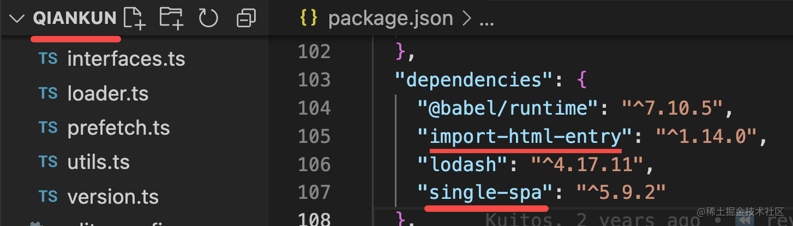
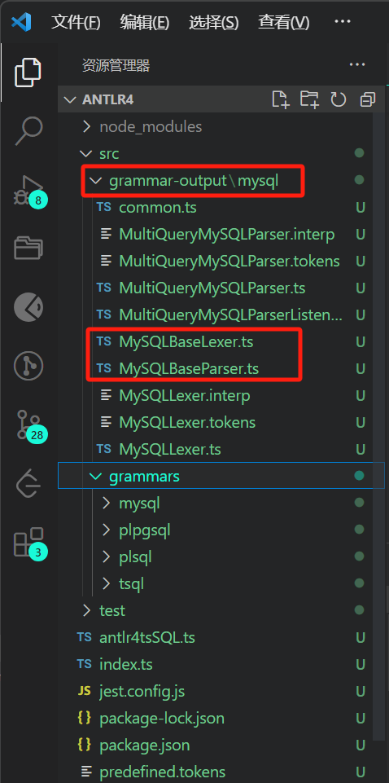

# 网站搭建

## nginx

https://juejin.cn/post/6887135998099062792

https://blog.csdn.net/Charissa2017/article/details/105886521

Nginx 是一款轻量级的 Web 服务器，具有内存占用少，启动极快，高并发能力强的优势，采用事件驱动的异步非阻塞处理方式框架，IO 性能好，时常用于服务端的反向代理和负载均衡。 

### 本地安装

https://blog.csdn.net/qq_20236937/article/details/131654981

https://www.cnblogs.com/blackcat/articles/11724544.html

### 正向代理与反向代理

> 反向代理服务器位于用户与目标服务器之间，但是对于用户而言，反向代理服务器就相当于目标服务器，即用户直接访问反向代理服务器就可以获得目标服务器的资源。同时，**用户不需要知道目标服务器的地址**，也无须在用户端作任何设定。反向代理服务器通常可用来作为 Web 加速，即使用反向代理作为 Web 服务器的前置机来降低网络和服务器的负载，提高访问效率

正向代理是什么东东？反向代理又是啥？
 ***「「正向代理」」***
 **「「举个栗子」」** 因为防火墙的原因， 直接访问谷歌是无法访问的， 这时可以借助梯子，即 vpn，那么这个 vpn(代理)就是代替客户端去访问服务器，然后将数据返回给客户端。服务器并不知道目标客户端，只是与 vpn 建立联系。
 ***「「反向代理」」***
 **「「举个栗子」」** 你（客户端）去租房时，真正的房东（服务器）将房租给二手房东（代理服务器），而你通过二手房东租到的房子，也就是你与二手房东建立联系， 租到房子，并非真正的房东。
 一句话： **正向代理 “代理”客户端， 反向代理“代理”服务器**

### 配置文件

which nginx 查看配置文件地址


「「main」」: nginx 的全局配置，对全局生效。
「「events」」: 配置影响 nginx 服务器或与用户的网络连接。
「「http」」：可以嵌套多个 server，配置代理，缓存，日志定义等绝大多数功能和第三方模块的配置。
「「server」」：配置虚拟主机的相关参数，一个 http 中可以有多个 server。
「「location」」：配置请求的路由，以及各种页面的处理情况。
「「upstream」」：配置后端服务器具体地址，负载均衡配置不可或缺的部分。

####  server 

```bash
server {
  listen 80;
  server_name  localhost;
  root   html;
  index  index.html index.htm;
}
##引入/etc/nginx/conf.d中的server配置
include /etc/nginx/conf.d/*.conf;
```

```bash
## /etc/nginx/conf.d/index.conf
server {
  #端口号
  listen 80;
  #域名或者ip
  #server_name 公网ip;
  server_name tomorrowlm.xyz;
  #文件的路径
  root /root/www;
  #配置默认访问的页面
  index index.html;
  #配置多个项目
  location / {
    index  index.html index.htm;
    try_files $uri $uri/ 404 /qiankun/index.html; #当输入错误路径时，跳转到index.html页面
  }
  location /qiankun {
  try_files $uri $uri/  /qiankun/index.html;
  }
  location /vue2-mobile {
  try_files $uri $uri/ /qiankun/child/vue2-mobile/index.html;
  }
  location /vue-demo {
 	try_files $uri $uri/ /vue-demo/index.html;
  }
  location /react-demo {
  	try_files $uri $uri/ /react-demo/index.html;
  }
   #配置请求代理
  location /api {
  	 proxy_pass http://0.0.0.0:3600;
  }
  location /di-times-management/ {
    proxy_pass   http://localhost:8081/;
    proxy_http_version 1.1;
    # proxy_redirect off;
    # proxy_set_header Host $host;
    # proxy_set_header X-Real-IP $remote_addr;
    # proxy_read_timeout 3600s;
    # proxy_set_header X-Forwarded-For $proxy_add_x_forwarded_for;
    proxy_set_header Upgrade $http_upgrade;
    proxy_set_header Connection $connection_upgrade;
    # if ($request_method = 'OPTIONS') {
    #     add_header Access-Control-Allow-Origin '*' always;
    #     add_header Access-Control-Allow-Credentials 'true';
    #     add_header Access-Control-Allow-Headers 'page,authorization';
    #     add_header Access-Control-Allow-Methods '*';
    #     return 204;
    # }
  }
}
```

- try_files（进行内部重定向）

  ```
  try_files $uri $uri/ /react-demo/index.html;
  #$uri  请求文件的路径
  #$uri/ 请求目录的路径
  
  当用户请求 http://localhost/example 时，这里的 $uri 就是 /example。 try_files 会到硬盘里尝试找这个文件。如果存在名为 /$root/example（其中 $root 是项目代码安装目录）的文件，就直接把这个文件的内容发送给用户。 显然，目录中没有叫 example 的文件。然后就看 $uri/，增加了一个 /，也就是看有没有名为/$root/example/ 的目录。 
  ```

### nginx 命令

- nginx 							#打开 nginx
- nginx -t   				        #测试配置文件是否有语法错误
- nginx -s reopen					#重启 Nginx
- nginx -s reload					#重新加载 Nginx 配置文件，然后以优雅的方式重启 Nginx
- nginx -s stop  					#强制停止 Nginx 服务
- nginx -s quit  					#停止 Nginx 服务（即处理完所有请求后再停止服务）
- systemctl start nginx			#开启防火墙
- service nginx start				#启动 nginx
- nginx [-?hvVtq] [-s signal] [-c filename] [-p prefix] [-g directives]
  - -?,-h           : 打开帮助信息
  - -v              : 显示版本信息并退出
  - -V              : 显示版本和配置选项信息，然后退出
  - -t              : 检测配置文件是否有语法错误，然后退出
  - -q              : 在检测配置文件期间屏蔽非错误信息
  - -s signal       : 给一个 nginx 主进程发送信号：stop（强制停止）, quit（优雅退出）, reopen（重启）, reload（重新加载配置文件）
  - -p prefix       : 设置前缀路径（默认是：/usr/share/nginx/）
  - -c filename     : 设置配置文件（默认是：/etc/nginx/nginx.conf）
  - -g directives   : 设置配置文件外的全局指令

tip:

- nginx: [error] open() "/run/nginx.pid" failed (2: No such file or directory)

  ```
  nginx -c /etc/nginx/nginx.conf
  ```

## PM2

**PM2 是 node 进程管理工具**，可以利用它来简化很多 node 应用管理的繁琐任务，如性能监控、自动重启、负载均衡等，而且使用非常简单。

```
// root/express
pm2 start ./react-back-end/bin/www.js
```

```
用法
$ npm install pm2 -g     # 命令行安装 pm2 
$ pm2 start app.js --name my-api # 命名进程
$ pm2 list               # 显示所有进程状态
$ pm2 monit              # 监视所有进程
$ pm2 logs               #  显示所有进程日志
$ pm2 stop all           # 停止所有进程
$ pm2 restart all        # 重启所有进程
$ pm2 reload all         # 0秒停机重载进程 (用于 NETWORKED 进程)
$ pm2 stop 0             # 停止指定的进程
$ pm2 restart 0          # 重启指定的进程
$ pm2 startup            # 产生 init 脚本 保持进程活着
$ pm2 web                # 运行健壮的 computer API endpoint (http://localhost:9615)
$ pm2 delete 0           # 杀死指定的进程
$ pm2 delete all         # 杀死全部进程
```

查看端口是否启动：列出连接端口列表

```
netstat -nptl
```

## express

### 文档

https://www.cnblogs.com/qinlongqiang/p/11465104.html

https://bbs.huaweicloud.com/blogs/367021

### 部署阿里云

https://www.jianshu.com/p/175558881f19

### 代理服务器

在 Node.js 的 Express 框架中，如果你想要设置一个前端代理前缀，可以使用 `http-proxy-middleware` 模块来实现。以下是一个简单的例子，展示了如何设置一个代理前缀：

首先，安装 `http-proxy-middleware` 模块：

```bash
npm install http-proxy-middleware
```

然后，在你的 Express 应用中使用这个模块来设置代理：

```javascript
const express = require('express');
const { createProxyMiddleware } = require('http-proxy-middleware');
 
const app = express();
 
// 设置代理前缀
const proxyPrefix = '/api';
 
// 创建代理服务器配置
const proxyOptions = {
  target: 'http://backend:3000', // 目标服务器地址
  changeOrigin: true, // 改变源地址
  pathRewrite: {
    [`^${proxyPrefix}`]: '', // 重写路径
  },
};
 
// 使用代理中间件
app.use(proxyPrefix, createProxyMiddleware(proxyOptions));
 
// 其他路由或者中间件配置...
 
app.listen(3000, () => {
  console.log('Server is running on port 3000');
});
```

在这个例子中，当客户端请求以 `/api` 为前缀的路由时，这些请求会被代理到 `http://backend:3000`。`changeOrigin` 选项设置为 `true` 意味着请求头中的 `host` 会被设置为目标服务器的地址，而不是代理服务器的地址。`pathRewrite` 选项用于重写请求路径，去除前缀 `/api`。这样，代理服务器就会将请求转发到后端服务器，并将响应返回给客户端。

## frp

https://www.freebuf.com/articles/network/271719.html

### 背景

- 服务器：阿里云

  ```
  ssh root@公网ip
  ```

- 添加防火墙端口，每个端口通过 frp 去对应本地的端口

  

### 公网

- 执行命令下载太慢，直接去 github 下 linux 版本并迁移到阿里云服务器指定目录（/opt/frp）

  这里用 0.52.3 版本 [frp_0.52.3_linux_amd64.tar.gz](https://github.com/fatedier/frp/releases/download/v0.52.3/frp_0.52.3_linux_amd64.tar.gz)

- frps.toml 代码

  ```
  bindPort = 7000 #服务端与客户端通信端口
  
  auth.token = "public"      # 身份验证令牌，frpc要与frps一致
  transport.tls.force = true # 服务端将只接受 TLS链接
  
  # Server Dashboard，可以查看frp服务状态以及统计信息
  webServer.addr = "0.0.0.0"        # 后台管理地址
  webServer.port = 7500             # 后台管理端口
  webServer.user = "admin"        # 后台登录用户名
  webServer.password = "admin"    # 后台登录密码
  ```

- 执行

  - 命令 `./frps -c frps.toml `

  - 脚本：自启动

    ```
    #!/bin/bash
    # sudo nohup bash -c '/opt/frp/frps -c /opt/frp/frps.toml' > /opt/frp/log.txt 2>&1 &
    
    ./frps -c frps.toml 
    ```

    执行权限问题 `chmod u+x *.sh`

- 展示: 服务器公网+webServer.port

  


### 本地

- github 下载 window 版本

- frpc.toml 代码

  ```
  # frpc.toml
  transport.tls.enable = true        # 从 v0.50.0版本开始，transport.tls.enable的默认值为 true
  serverAddr = "公网"
  serverPort = 7000                 # 公网服务端通信端口
  
  
  [[proxies]]
  name = "test-http"
  type = "tcp"  # 协议类型
  localIP = "127.0.0.1"            # 需要暴露的服务的IP
  localPort = 8080                # 将本地8080端口的服务暴露在公网的4100端口
  remotePort = 4100                 # 暴露服务的公网入口
  
  [[proxies]]
  name = "ssh"
  type = "tcp"
  localIP = "127.0.0.1"
  localPort = 22
  remotePort = 6000
  ```

- 执行代码

  - 命令 `./frpc -c frpc.toml `

# 前端⼯程化

## 构建历史

https://mp.weixin.qq.com/s/vhkAhBJ2mok43lIlHpu8Gg


前端模块化/构建工具从最开始的基于浏览器 **运行时** 加载的 `RequireJs/Sea.js` 到将所有资源组装依赖打包 `webpack`/`rollup`/`parcel` 的 `bundle` 类模块化构建工具，再到现在的 `bundleless` 基于浏览器原生 ES 模块的 `snowpack`/`vite`，前端的模块化/构建工具发展到现在已经快 10 年了。

-  Grunt

- browserify

  `browserify` 致力于在浏览器端使用 `CommonJs`，他使用跟 `NodeJs` 一样的模块化语法，然后将所有依赖文件编译到一个 `bundle` 文件，在浏览器通过 `<script>` 标签使用的，并且支持 npm 库。

- Gulp

- webpack

  `webpack1` 支持 `CommonJs` 和 `AMD` 模块化系统，优化依赖关系，支持分包，支持多种类型 script、image、file、css/less/sass/stylus、mocha/eslint/jshint 的打包，丰富的插件体系。`webpack` 的概念更偏向于工程化

  以上的 3 个库 `Grunt/Gulp/browserify` 都是偏向于工具，而 `webpack` 将以上功能都集成到一起，相比于工具它的功能大而全。

- rollup

  `rollup` 编译 `ES6` 模块，提出了 `Tree-shaking`，根据 `ES module` 静态语法特性，删除未被实际使用的代码，支持导出多种规范语法，并且导出的代码非常简洁，如果看过 `vue` 的 `dist` 目录代码就知道导出的 `vue` 代码完全不影响阅读。

  `rollup` 的插件系统支持：`babel`、`CommonJs`、`terser`、`typescript` 等功能。

  相比于 `browserify` 的 `CommonJs`，`rollup` 专注于 `ES module`。
  相比于 `webpack` 大而全的前端工程化，`rollup` 专注于纯 `javascript`，大多被用作打包 `tool` 工具或 `library` 库。

  react、vue 等库都使用 `rollup` 打包项目，并且下面说到的 `vite` 也依赖 `rollup` 用作生产环境打包 js。

- snowpack 和 vite

  因为 `snowpack` **基于浏览器的模块化** 和 `vite` 比较类似，都是 `bundleless` 所以一起拿来说。`bundleless` 类运行时打包工具的启动速度是毫秒级的，因为不需要打包任何内容，只需要起两个 `server`，一个用于页面加载，另一个用于 `HMR` 的 `WebSocket`，当浏览器发出原生的 `ES module` 请求，`server` 收到请求只需编译当前文件后返回给浏览器不需要管依赖。`bundleless` 工具在 **生产环境** 打包的时候依然 `bundle` 构建所以依赖视图的方式，vite 是利用 `rollup` 打包生产环境的 js 的。

## 模块化语法

https://blog.csdn.net/weixin_45364386/article/details/135112303

https://zhuanlan.zhihu.com/p/462189220

### CommonJS 和 ESModule

https://es6.ruanyifeng.com/#docs/module-loader

#### CommonJS

`CommonJS` 本来叫 ServerJs，**其目标本来是为浏览器之外的 `javascript` 代码制定规范**，在那时 `NodeJs` 还没有出生，有一些零散的应用于服务端的 `JavaScript` 代码，但是没有完整的生态。之后就是 `NodeJs` 从 `CommonJS` 社区的规范中吸取经验创建了本身的模块系统。

CommonJS允许模块通过 `require` 方法来同步加载所要依赖的其他模块，然后通过 `exports` 或 `module.exports` 来导出需要暴露的接口。

```js
// a.js
//本质上是将要导出的对象赋值给module对象的export属性，然后在其他文件中通过require这个方法访问该属性
exports.a = 'Hello world'; // 相当于：module.exports.a = 'Hello world';
module.exports = {
    a: 'Hello world'
  }
}

// b.js
var moduleA = require('./a.js');
console.log(moduleA.a); // 打印出hello world
```

#### ES Module

ECMAScript6 标准增加了 JavaScript 语言层面的模块体系定义。

- 命名导出 

  第一种是单个的变量或函数导出，只需要直接在开头使用 `export` 关键字即可；

  第二种情况是批量地把多个变量或函数导出，只需要把它们储存到一个对象中即可

  ```
  // B.js
  /*--------  单个变量或函数导出  ----------*/
  export function show() { console.log('show方法被调用') }
  
  export let count = 3
  
  /*--------  批量导出  ----------*/
  function show() { console.log('show方法被调用') }
  let count = 3
  export {show, count}
  ```

- 默认导出：在 `export` 关键词后面再跟上一个 `default` 表示导出的该变量或函数是匿名的

  > **注意：** 一个模块只能默认导出一次，否则就会报错
  
  ```
  // B.js
  function show() { console.log('show方法被调用') }
  
  // 默认导出函数show
export default show
  ```

- 导入：ES6 Module 的导入用到的关键字是 `import` ，具体代码如下

  ```js
  // A.js
  import {show, count} from './B.js'
  
  show()   // show方法被调用
  
  console.log(count)  // 3
  ```
  
  ES6 Module 的导入需要用一对 `{}` 大括号来接收我们需要导入的方法或函数

  > **注意：** 大括号中的变量或函数名必须与导出时的名称一模一样

  那么如果我们想修改导入的变量或函数的名称，可以通过 `as` 关键词来命名，代码如下

  ```js
  // A.js
  import {show as print, count as number} from './B.js'
  
  print()   // show方法被调用
  
  console.log(number)  // 3
  ```
  
  如果我们要想将所有的变量或函数都导入，可以通过 `*` 来整体导入，代码如下

  ```js
  import * as bModule from './B.js'
  
  bModule.show()  // show方法被调用
  
  console.log(bModule.count)  // 3
  ```
  
  `*` 表示全部的意思，我们将其全部导入，并赋值给 `bModule`，这样我们就可以通过 `bModule` 获取想要的变量或对象了

  以上所说的都是针对命名导出的变量或函数，那么如何导入一个默认导出的变量或函数呢？

  ```js
  // 将通过 export default 导出的变量导入
  import print from './B.js'
  
  print()  // show方法被调用
  ```
  
  命名导出的变量都是通过 `{}` 来接收的，那么去掉 `{}` ，接收的就是默认导出的变量了，因为导出的变量是匿名的，因此我们可以随意地起个变量名用于接收

#### 区别

- 对于模块的依赖，CommonJS 是 **动态的**，ES6 Module 是 **静态的。**

  - 在ES6模块中，模块的依赖关系在编译时就确定了。这意味着在代码编写完成后、执行之前，所有模块的依赖关系就已经被解析和确定。
    - 编译时解析：ES6模块的依赖关系在编译阶段就被解析，使得编译器能够进行更好的优化。
    - 静态分析：工具可以在**不执行代码的情况下**分析模块的依赖关系，这有助于构建和优化过程。比如引入宏（macro）和类型检验（type system）这些只能靠静态分析实现的功能
    - 值的引用：ES6模块导入的变量是对原值的引用，而不是值的拷贝。**这意味着在模块中修改变量的值会影响到其他导入该模块的变量。**

  - 在CommonJS模块中，模块的依赖关系在运行时才确定。这意味着在代码执行过程中，模块之间的依赖关系才会被解析和建立。

    > 因为在代码执行时是可以动态改变的，所以如果在代码编译阶段就建立各个模块的依赖关系，那么一定是不准确的，只有在代码运行了以后，才可以真正确认模块的依赖关系，因此说 CommonJS 是动态的。
    >
    > ```
    > let lists = ["./index.js", "./config.js"]
    > lists.forEach((url) => require(url)) // 动态导入
    > 
    > if (lists.length) {
    >     require(lists[0]) // 动态导入
    > }
    > ```

    - 运行时解析：CommonJS模块的依赖关系在代码执行阶段才被解析，因此可能会导致一些运行时的开销。
    - 动态特性：由于依赖关系在运行时才确定，这使得静态分析更具挑战性，也限制了一些优化能力。
    - 值的拷贝：CommonJS模块导入的变量是对原值的拷贝，而不是引用。这意味着在模块中修改变量的值不会影响到其他导入该模块的变量。

- 与 CommonJS 不同，ES6 Module 的导入文件是不支持表达式的

  - commonjs：实质是整体加载 `fs` 模块（即加载 `fs` 的所有方法），生成一个对象（`_fs`），然后再从这个对象上面读取 3 个方法。这种加载称为“运行时加载”，因为**只有运行时才能得到这个对象**

    ```
    // CommonJS模块
    let { stat, exists, readfile } = require('fs');
    
    // 等同于
    let _fs = require('fs');
    let stat = _fs.stat;
    let exists = _fs.exists;
    let readfile = _fs.readfile;
    ```

  - es

    ```
    // ES6模块
    import { stat, exists, readFile } from 'fs';
    ```

- 与 CommonJS 不同，ES6 Module 的导入文件路径是不支持表达式的

  - CommonJS

    ```
    // A.js
    let fileName = 'example.js'
    const bModule = require('./' + fileName)
    ```

    `CommonJs` 支持动态导入, 可以在语句中，使用 `require` 语法

    ```
    let lists = ["./index.js", "./config.js"]
    lists.forEach((url) => require(url)) // 动态导入
    
    if (lists.length) {
        require(lists[0]) // 动态导入
    }
    ```

  - Es Module**只能声明在该文件的最顶部，不能动态加载语句**

    ```
    if (true) {
    	import xxx from 'XXX' // 报错
    }
    ```

- CommonJS 导入的是值的 **拷贝**，ES6 Module 导入的是值的 **引用**

  首先来验证 CommonJS，代码如下

  ```js
  // B.js
  let count = 3
  
  function change() {
      count ++    // 变量count + 1
      console.log('原count值为：', count);  // 打印B.js模块中count的值
  }
  
  module.exports = {
      count,
      change
  }
  
  // A.js
  let count = require('./B.js').count 
  let change = require('./B.js').change
  
  console.log('改变前：', count);   
  change()     // 调用模块B.js中的change方法，将原来的count + 1
  console.log('改变后：', count); 
  
  // 运行A.js文件的结果
  改变前：3
  原count值为：4
  改变后：3
  ```

  在上述代码中我们可以看到，在 `A.js` 文件中导入了 `B.js` 文件中的变量 `count` 和 函数 `change`，因为导入的 `count` 只是对原有值的一个拷贝，因此尽管我们调用了函数 `change` 改变了 `B.js` 文件中变量 `count` 的值，也不会影响到 `A.js` 文件中的变量 `count`


##### commonJs

- 优缺点

  - **优点：** 服务器端模块重用，NPM 中模块包多，有将近 20 万个。

    **缺点：** 加载模块是 **同步** 的，只有加载完成后才能执行后面的操作，也就是当要用到该模块了，现加载现用，不仅加载速度慢，而且还会导致性能、可用性、调试和跨域访问等问题。**Node.js 主要用于服务器编程，加载的模块文件一般都存在本地硬盘，加载起来比较快，不用考虑异步加载的方式**，因此, CommonJS 规范比较适用。然而，这并不适合在浏览器环境，同步意味着阻塞加载，浏览器资源是异步加载的，因此有了 AMD CMD 解决方案。

- **环境**：

  - 服务器端的 [Node.js](http://www.nodejs.org/)
  - [Browserify](http://browserify.org/)，浏览器端的 CommonJS 实现，可以使用 NPM 的模块，但是编译打包后的文件体积可能很大
  - [modules-webmake](https://github.com/medikoo/modules-webmake)，类似 Browserify，还不如 Browserify 灵活
  - [wreq](https://github.com/substack/wreq)，Browserify 的前身

##### ES

- [ES6 模块](http://es6.ruanyifeng.com/#docs/module) 的设计思想，是尽量的 **静态化**，使得编译时就能确定模块的依赖关系，以及输入和输出的变量

- 浏览器加载 ES6 模块，也使用 `<script>` 标签，但是要加入 `type="module"` 属性。

  ```html
  <script type="module" src="./foo.js"></script>
  ```

  上面代码在网页中插入一个模块 `foo.js`，由于 `type` 属性设为 `module`，所以浏览器知道这是一个 ES6 模块。

  浏览器对于带有 `type="module"` 的 `<script>`，都是异步加载，不会造成堵塞浏览器，即等到整个页面渲染完，再执行模块脚本，等同于打开了 `<script>` 标签的 `defer` 属性。

  ```html
  <script type="module" src="./foo.js"></script>
  <!-- 等同于 -->
  <script type="module" src="./foo.js" defer></script>
  ```

  如果网页有多个 `<script type="module">`，它们会按照在页面出现的顺序依次执行。

  ```html
  <script type="module" src="./foo.js" async></script>
  ```

  一旦使用了 `async` 属性，`<script type="module">` 就不会按照在页面出现的顺序执行，而是只要该模块加载完成，渲染引擎就会中断渲染立即执行。执行完成后，再恢复渲染

  

#### commonjs与es6混用

https://segmentfault.com/a/1190000010955254

‌**在webpack项目中可以使用CommonJS导入导出模块，主要是因为现代JavaScript构建工具如Webpack具备模块互操作性功能，允许在项目中混合使用CommonJS和ES6模块语法**‌。具体来说，当使用`import`语法引入一个使用CommonJS导出的模块时，构建工具（如Webpack）会在构建过程中自动将CommonJS模块转换为一个可以被ES6 `import`语法识别的格式，从而实现了两种模块系统的无缝集成‌

##### require

https://blog.csdn.net/weixin_45449964/article/details/114856896

webpack进行了如下处理：

- 将模块的内容通过匿名函数封装起来
- 将`require`方法替换成`__webpack_require__`方法，并传递对应的模块路径
- 将模块路径进行了处理，替换成相对于src目录下的相对路径


##### exports

下面用具体代码来解释一下，首先修改m.js和index.js代码如下：

```javascript
// m.js
'use strict';
exports.foo = function () {
    return 1;
}
// index.js
'use strict';
import m from './m';
m.foo();
```

重新执行webpack后生成的代码如下（只截取IIFE的参数部分）：

```javascript
(function(module, __webpack_exports__, __webpack_require__) {
    "use strict";
    Object.defineProperty(__webpack_exports__, "__esModule", { value: true });
    /* harmony import */ 
    var __WEBPACK_IMPORTED_MODULE_0__m__ = __webpack_require__(1);
    /* harmony import */ 
    var __WEBPACK_IMPORTED_MODULE_0__m___default = __webpack_require__.n(__WEBPACK_IMPORTED_MODULE_0__m__);

    __WEBPACK_IMPORTED_MODULE_0__m___default.a.foo();

})
(function(module, exports, __webpack_require__) {

    "use strict";
    exports.foo = function () {
        return 1;
    }

})
```

m.js转换后的代码跟转换前的代码基本没有变化，都是用webpack提供的`exports`进行模块导出。但是index.js有一点不同，主要是多了一行代码：

```asciidoc
var __WEBPACK_IMPORTED_MODULE_0__m___default = __webpack_require__.n(__WEBPACK_IMPORTED_MODULE_0__m__);
```

这段代码作用是什么呢，看一下`__webpack_require__.n`的定义就知道了：

```javascript
// getDefaultExport function for compatibility with non-harmony modules
__webpack_require__.n = function(module) {
    var getter = module && module.__esModule ?
        function getDefault() { return module['default']; } :
        function getModuleExports() { return module; };
    __webpack_require__.d(getter, 'a', getter);
    return getter;
};
```

`__webpack_require__.n`会判断module是否为es模块，当`__esModule`为true的时候，标识module为es模块，那么`module.a`默认返回`module.default`，否则返回`module`。

具体实现则是通过` __webpack_require__.d`将具体操作绑定到属性`a`的getter方法上的。

那么，当通过es模块的方式去`import`一个commonjs规范的模块时，就会把require得到的module进行一层包装，从而兼容两种情况。

至于通过commonjs去`require`一个es模块的情况，原理相同，就不过多解释了。

### UMD 

1. **UMD 是一种通用的模块格式，旨在兼容多种模块系统**。
2. 它可以在不同的环境中（如浏览器、Node.js 等）使用。
3. UMD 模块会根据环境的不同，自动选择合适的加载方式。

### AMD

> `CommonJs` 是一套同步模块导入规范，但是在浏览器上还没法实现同步加载，这一套规范在浏览器上明显行不通，所以基于浏览器的异步模块 `AMD` 规范诞生。

AMD 规范（Asynchronous Module Definition，异步模块定义）

1. **AMD 主要用于浏览器环境中的异步模块加载**。
2. 模块通过定义模块的依赖关系，并在需要时异步加载。
3. 使用`define`函数来定义模块。define(id, 『dependencies』, factory) ，它要在声明模块的时候指定所有的依赖 dependencies ，并且还要当做形参传到 factory 中，对于依赖的模块 **提前执行**，**依赖前置**。

`AMD` 规范采用 **依赖前置**，先把需要用到的依赖提前写在 `dependencies` 数组里，在所有依赖下载完成后再调用 `factory` 回调，通过传参来获取模块，同时也支持 `require("beta")` 的方式来获取模块，但实际上这个 `require` 只是语法糖，模块并非在 `require` 的时候导入，而是跟前面说的一样在调用 `factory` 回调之前就被执行，关于依赖前置和执行时机这点在当时有很大的争议，被 `CommonJs` 社区所不容。

```js
define("module", ["dep1", "dep2"], function(d1, d2) {
  return someExportedValue;
});
require(["module", "../file"], function(module, file) { /* ... */ });
```

**优点：** 在浏览器环境中异步加载模块；并行加载多个模块；

**缺点：** 开发成本高，代码的阅读和书写比较困难，模块定义方式的语义不顺畅；不符合通用的模块化思维方式，是一种妥协的实现；

### CMD

> 在不断给 `RequireJs` 提建议，但不断不被采纳后，玉伯结合 `RequireJs` 和 `module/2.0` 规范写出了基于 CMD（Common Module Definition）规范的 `Sea.js`

CMD 规范（Common Module Definition，通用模块定义）和 AMD 很相似，尽量保持简单，并与 CommonJS 和 Node.js 的 Modules 规范保持了很大的兼容性。

```js
define(function(require, exports, module) {
  var $ = require('jquery');
  var Spinning = require('./spinning');
  exports.doSomething = ...
  module.exports = ...
})
```

**优点：依赖就近，延迟执行**（对于依赖的模块延迟执行，即只在需要用到某个模块的时候再 require） 可以很容易在 Node.js 中运行；
**缺点：** 依赖 SPM 打包，模块的加载逻辑偏重；
**实现：Sea.js** ；coolie


## rollup

### 概念

2015 年，前端的 `ES module` 发布后，`rollup` 应声而出。

`rollup` 编译 `ES6` 模块，提出了 `Tree-shaking`，根据 `ES module` 静态语法特性，删除未被实际使用的代码，支持导出多种规范语法，并且导出的代码非常简洁。react、vue 等库都使用 `rollup` 打包项目，并且下面说到的 `vite` 也依赖 `rollup` 用作生产环境打包 js。

- 相比于 `browserify` 的 `CommonJs`，`rollup` 专注于 `ES module`。

- 相比于 `webpack` 大而全的前端工程化，`rollup` 专注于纯 `javascript`，可以生成轻量、快速以及低复杂度的 library 和应用程序。
- `rollup` 的插件系统支持：`babel`、`CommonJs`、`terser`、`typescript` 等功能。

### Rollup VS Webpack

源码  

webpack 打包后的文件 

rollup 打包后的文件 

webpack 致力于复杂 SPA 的模块化构建，优势在于：

1. 通过 loader 处理各种各样的资源依赖
2. HMR 模块热替换
3. 按需加载
4. 提取公共模块

rollup 致力于打造性能出众的类库，有如下优势：

1. 编译出来的代码 `可读性好`
2. rollup 打包后生成的 bundle 内容十分 `干净`，没有什么多余的代码，只是将各个模块按照依赖顺序拼接起来，所有模块构建在一个函数内（Scope Hoisting）, 执行效率更高。相比 webpack(webpack 打包后会生成 __webpack_require__ 等 runtime 代码)，rollup 拥有无可比拟的性能优势，这是由依赖处理方式决定的，`编译时依赖处理（rollup）自然比运行时依赖处理（webpack）性能更好`
3. 对于 ES 模块依赖库，rollup 会静态分析代码中的 import，并将排除任何未实际使用的代码：[tree-shaking](https://link.juejin.cn?target=https%3A%2F%2Fwww.zhihu.com%2Fsearch%3Fq%3Dtree-shaking%26search_source%3DEntity%26hybrid_search_source%3DEntity%26hybrid_search_extra%3D%7B%22sourceType%22%3A%22article%22%2C%22sourceId%22%3A75717476%7D)
4. 支持程序流分析，能更加正确的判断项目本身的代码是否有副作用(配合 tree-shaking)
5. 支持导出 `es` 模块文件（webpack 不支持导出 es 模块） 但是模块过于静态化，HMR 很难实现

通过以上的对比可以得出，构建 `App应用` 时，webpack 比较合适，如果是 `类库（纯js项目）`，rollup 更加适合。

webpack 构建 App 的优势体现在以下几方面：

1. 强大的 `插件生态`，主流前端框架都有对应的 loader
2. 面向 App 的特性支持，比如之前提到的 `HMR`，`按需加载`，`公共模块` 提取等都是开发 App 应用必要的特性
3. 简化 Web 开发各个环节，包括 `图片自动base64，[资源缓存](https://www.zhihu.com/search?q=%E8%B5%84%E6%BA%90%E7%BC%93%E5%AD%98&search_source=Entity&hybrid_search_source=Entity&hybrid_search_extra=%7B%22sourceType%22%3A%22article%22%2C%22sourceId%22%3A75717476%7D)（chunkId），按路由做代码拆分，懒加载` 等
4. 可靠的依赖模块处理，不像 rollup 那样仅面向 ES module，面临 cjs 的问题（webpack 通过 `__webpack_require__` 实现各种类型的模块依赖问题）

rollup 的优势在于构建 `高性能的bundle`，这正是类库所需要的。

### 副作用

https://blog.csdn.net/zz_jesse/article/details/108289318

### Tree-shaking


以上代码最终打包后 b 的声明就会被删除掉。

**这依赖 `ES module` 的静态语法，在编译阶段就可以确定模块的导入导出有哪些变量。**

**`CommonJs` 因为是基于运行时的模块导入，其导出的是一个整体，并且 `require(variable)` 内容可以为变量，所以在 `ast` 编译阶段没办法识别为被使用的依赖。**

`webpack4` 中也开始支持 `tree-shaking`，但是因为历史原因，有太多的基于 `CommonJS` 代码，需要额外的配置。

### parcel

上面提到过 `webpack` 的两个缺点，而 `parcel` 的诞生就是为了解决这两个缺点，parcel 主打 **极速零配置**。

| 打包工具            | 时间   |
| ------------------- | ------ |
| browserify          | 22.98s |
| webpack             | 20.71s |
| parcel              | 9.98s  |
| parcel - with cache | 2.64s  |

以上是 `parcel` 官方的一个数据，基于一个合理大小的应用，包含 1726 个模块，6.5M 未压缩大小。在一台有 4 个物理核心 CPU 的 2016 MacBook Pro 上构建。

`parcel` 使用 `worker` 进程去启用多核编译，并且使用文件缓存。

`parcel` 支持 0 配置，内置了 `html、babel、typescript、less、sass、vue` 等功能，无需配置，并且不同于 `webpack` 只能将 js 文件作为入口，在 `parcel` 中万物皆资源，所以 `html` 文件 `css` 文件都可以作为入口来打包。

所以不需要 `webpack` 的复杂配置，只需要一个 `parcel index.html` 命令就可以直接起一个自带热更新的 `server` 来开发 `vue/react` 项目。

parcel 也有它的缺点：

- 0 配置的代价，0 配置是好，但是如果想要配置一些复杂的配置就很麻烦。
- 生态，相比于 `webpack` 比较小众，如果遇到错误查找解决方案比较麻烦。

#### 原理

1. `commander` 获取命令
2. 启动 `server` 服务，启动 `watch` 监听文件，启动 `WebSocket` 服务用于 hmr，启动多线程
3. 如果是第一次启动，针对入口文件开始编译
4. 根据扩展名生成对应 `asset` 资源，例如 `jsAsset`、`cssAsset`、`vueAsset`，如果 `parcel` 识别 `less` 文件后项目内如果没有 `less` 库会自动安装
5. 读取缓存，如果有缓存跳到第 7 步
6. 多线程编译文件，调用 `asset` 内方法 `parse -> ast -> 收集依赖 -> transform(转换代码) -> generate(生成代码)`，在这个过程中收集到依赖，编译完结果写入缓存
7. 编译依赖文件，重复第 4 步开始
8. `createBundleTree` 创建依赖树，替换 hash 等，`package` 打包生成最终代码
9. 当 `watch` 文件发生变化，重复第 4 步，并将结果 7 通过 `WebSocket` 发送到浏览器，进行热更新。

一个完整的模块化打包工具就以上功能和流程。

## webpack

### 概念

webpack 是一个前端模块化方案，更侧重模块打包，我们可以把开发中的所有资源（图片、js 文件、css 文件等）都看成模块，通过 loader（加载器）和 plugins（插件）对资源进行处理，打包成符合生产环境部署的前端资源。

**网页中常见的静态资源**

**js**--js，jax，coffee，ts(TypeScript, 需要编译为 js)

**css**-- css, less, sass

**image**--jpg, png, gif, bmp, svg

**字体文件(Fonts)**--svg, ttf, eot, woff, woff2

**模板文件**--ejs, jade, vue(这是在 webpack 中定义的组件的方式)


**特点**：

- 模块化开发

  在没有各个 webpack 搭建的脚手架（create-react-app、vue-cli 等等）之前，我们通过在 HTML5 文件里引入一个个 Javascript 文件来进行开发，这就可能导致并行请求数量过多、存在重复代码等问题。

  而通过 webpack，**我们可以使用 import、require 来进行模块化开发**。

  **在 webpack 中一切皆模块**，js、css、图片、字体都是模块，而且支持 **静态解析、按需打包、动态加载、代码分离** 等功能，帮助我们优化代码，提升性能。

- 新语法

  Javascript、CSS 的语法规范在不断更新，但是浏览器的兼容性却不能同步的更新，开发者可以通过 webpack 预处理器进行编译，**自由的使用 JS、CSS 等语言的新语法**。

  webpack 使用 [loader ](https://webpack.docschina.org/concepts/loaders) 对文件进行预处理。你可以构建包括 JavaScript 在内的任何静态资源，如 Less、Sass、ES6、TypeScript。

- 主流框架脚手架

  Vue 脚手架 `vue-cli`、React 脚手架 `creact-react-app`、Taro 脚手架 `taro-cli` 都是使用 webpack，开发者掌握 webpack 后，可以自由配置脚手架，根据项目需要，调整 webpack 配置，以提高项目性能。


### entry

```
entry: path.resolve(__dirname, "./src/main.js"),
```

### output

```js
output: {
    //指定打包好的文件，输出到哪个目录中去
    path: path.resolve(__dirname, "./dist"),
    //输出文件名
    filename: "js/bundle.[hash].js",//打包同步代码
		chunkFilename："js/bundle.chunk.[hash].js",//打包异步代码，动态导入
    //静态文件打包存放的目录.静态文件是指 img 的src ,link ，script 标签等所指向的文件。静态资源最终访问路径 =output.publicPath + 资源loader或插件等配置路径
    publicPath: '',//配置打包资源基于根路径的访问路径，体现在打包的index.html引用资源路径上
},
```

### mode

webpack5 提供了模式选择，包括开发模式、生产模式、空模式，并对不同模式做了对应的内置优化。可通过配置模式让项目性能更优。

### static

提供开发环境中的一个静态资源目录。静态资源是指在开发中我们不希望被打包的一些资源，一般都是入口 html 引入的内容，是静态资源。

```
static: "./public", //指定静态资源目录
```

### devServer

#### origin

- **`origin`** 主要用于设置开发服务器的源地址，帮助浏览器正确显示当前页面的源地址。

#### proxy

该配置是为了解决前后端联调时出现的跨域问题，将后端域名下的请求代理到本地，从而避免跨域请求；

1、一个基本的代理

```
module.exports = {
  //...
  devServer: {
    proxy: {
      '/api': 'http://localhost:3000'
    }
  }
};
```

`/api/users`将请求代理到的请求`http://localhost:3000/api/users`。

 

2、重写路径代理

如果不想`/api`传递，需要重写路径：

```
module.exports = {
  //...
  devServer: {
    proxy: {
      '/api': {
        target: 'http://localhost:3000',
        pathRewrite: {'^/api' : ''}
      }
    }
  }
};
```

`/api/users`将请求代理到的请求`http://localhost:3000/users`。

 

3、支持https

默认情况下，是不接受在HTTPS上运行且具有无效证书的后端服务器。如果需要，可以像这样修改配置：

```
module.exports = {
  //...
  devServer: {
    proxy: {
      '/api': {
        target: 'https://other-server.example.com',
        secure: false
      }
    }
  }
};
```

 

4、将请求代理到同一目标

如果要将多个特定路径代理到同一目标，则可以使用具有`context`属性的一个或多个对象的数组：

```
module.exports = {
  //...
  devServer: {
    proxy: [{
      context: ['/auth', '/api'],
      target: 'http://localhost:3000',
    }]
  }
};
```

　　

#### historyApiFallback

解决使用 history 模式，SPA 页面在路由跳转之后，访问不到后端资源，返回 404 错误


### devtool

最佳选择是 `eval-cheap-module-source-map` 详细区分可至 [webpack devtool ](https://webpack.docschina.org/configuration/devtool/) 查看。

##### Sourcemap

https://mp.weixin.qq.com/s/g5GcZ10G89Xb9hZ1SibVrA

**`Sourcemap` 本质上是一个信息文件，通过一个个行列号的映射关联编译后的代码和源码的，**。比如编译后代码的第 3 行第 4 列，对应着源码里的第 8 行第 5 列这种，这叫做一个 mapping。

mapping 里面储存着代码转换前后的对应位置信息。它记录了转换压缩后的代码所对应的转换前的源代码位置，是源代码和生产代码的映射。简单说 `Sourcemap` 构建了处理前以及处理后的代码之间的一座桥梁，方便定位生产环境中出现 `bug` 的位置。

sourcemap 的格式如下：

```
{
    version : 3,
    file: "out.js",
    sourceRoot : "",
    sources: ["foo.js", "bar.js"],
    names: ["a", "b"],
    mappings: "AAgBC,SAAQ,CAAEA;AAAEA",
    sourcesContent: ['const a = 1; console.log(a)', 'const b = 2; console.log(b)']
}
```

version 是版本号，file 是文件名，sourceRoot 是源码根目录，names 是转换前的变量名，sources 是源码文件，sourcesContent 是每个 sources 对应的源码的内容，mappings 储存着代码转换前后的对应位置信息

##### 基础配置

https://blog.csdn.net/Magneto7/article/details/115339508

理解了这些基础配置项，根据 `[inline-|hidden-|eval-][nosources-][cheap-[module-]]source-map` 的规律来进行组合，就可以实现各种需求下的 sourcemap 配置。

- eval：浏览器 devtool 支持通过 sourceUrl 来把 eval 的内容单独生成文件，还可以进一步通过 sourceMappingUrl 来映射回源码，webpack 利用这个特性来简化了 sourcemap 的处理，可以直接从模块开始映射，不用从 bundle 级别。
- cheap：只映射到源代码的某一行，不精确到列，可以提升 sourcemap 生成速度
- source-map：**生成 sourcemap 文件**，可以配置 inline，会以 dataURL 的方式内联，可以配置 hidden，只生成 sourcemap，不和生成的文件关联。
- nosources：不生成 sourceContent 内容，可以减小 sourcemap 文件的大小
- module：sourcemap 生成时会关联每一步 loader 生成的 sourcemap，配合 sourcemap-loader 可以映射回最初的源码

| quality                | 含义                                   |
| :--------------------- | :------------------------------------- |
| bundled code           | 模块未分离                             |
| generated code         | 模块分离，未经 loader 处理的代码         |
| transformed code       | 模块分离，经 loader 处理过的代码         |
| original source        | 你自己所写的代码                       |
| without source content | 生成的 Source Map 中不包含 sourcesContent |
| (lines only)           | 包含行信息，不包含列信息               |


### loader 预处理

**webpack 默认只能打包处理 JS 类型的文件，无法处理其他的非 JS 类型的文件，这时候就需要配置对应的 loader 进行文件内容的解析**。

####  loader使用

在你的应用程序中，有两种使用 loader 的方式：

- [配置方式](https://www.webpackjs.com/concepts/loaders/#configuration)（推荐）：在 **webpack.config.js** 文件中指定 loader。
- [内联方式](https://www.webpackjs.com/concepts/loaders/#inline)：在每个 `import` 语句中显式指定 loader。

#### webpack5

##### asset module

使用 [webpack 资源模块 ](https://webpack.docschina.org/guides/asset-modules/)(asset module) 代替旧的 assets loader（如 `file-loader`/`url-loader`/`raw-loader` 等），减少 loader 配置数量。

https://blog.csdn.net/qq_41887214/article/details/121631683

资源模块(asset module)是一种模块类型，它允许使用资源文件（字体，图标等）而 **无需配置额外 loader**。

- asset/resource 发送一个单独的文件并导出 URL。之前通过使用 file-loader 实现。

- asset/inline 导出一个资源的 data URI。之前通过使用 url-loader 实现。

- asset/source 导出资源的源代码。之前通过使用 raw-loader 实现。

- asset 在导出一个 data URI 和发送一个单独的文件之间自动选择。之前通过使用 url-loader，并且配置资源体积限制实现。

##### 自定义输出文件名

1.output.assetModuleFilename

```js
const path = require('path');

module.exports = {
  entry: './src/index.js',
  output: {
    filename: 'bundle.js',
    path: path.resolve(__dirname, 'dist'),
    assetModuleFilename: 'images/[hash][ext][query]'
  },
  module: {
    rules: [
      {
        test: /\.png$/,
        type: 'asset/resource'
      }
    ]
  },
};

```

2.generator

```js
const path = require('path');

module.exports = {
  entry: './src/index.js',
  output: {
    filename: 'bundle.js',
    path: path.resolve(__dirname, 'dist'),
+   assetModuleFilename: 'images/[hash][ext][query]'
  },
  module: {
    rules: [
			{
        test: /\.png$/,
        type: 'asset/resource',
       	generator: {
         filename: 'images/[hash][ext][query]'
       	}
      }
    ]
  },
};

```

使用此配置，所有 png 文件都将被发送到输出目录中的 images 目录中。

Rule.generator.filename 与 output.assetModuleFilename 相同，并且仅适用于 asset 和 asset/resource 模块类型。

但 Rule.generator.filename 优先级高于 output.assetModuleFilename

##### font

```
{
    test: /\.(woff|woff2|eot|ttf|otf)$/i,
    type: 'asset/resource',
    generator: {
    filename: 'fonts/[name]_[hash][ext]'
}
```

#### url-loader

url-loader和file-loader是什么关系呢？url-loader封装了file-loader，即使用url-loader时，只需要安装url-loader即可，不需要安装file-loader，因为url-loader内置了file-loader。

- ‌**file-loader**‌适合于需要确保资源路径正确的场景。它通过复制文件到指定目录并修改引用路径来解决路径问题
- ‌**url-loader**‌适用于需要减少HTTP请求且文件较小的场景。它将小文件转换为base64编码，减少请求次数，但会增加文件大小。适合于图片较小且希望减少请求次数的场景
  - 1.文件大小小于limit参数，url-loader将会把文件转为DataURL（base64编码）；
  - 2.文件大小大于limit，url-loader会调用file-loader进行处理，参数也会直接传给file-loader。因此我们只需要安装url-loader即可。


##### font

#### css

> 具体参考在下面的style构建下

rules：是一个数组的形式，因此我们可以配置很多个 loader

- loader：对应一个对象的形式。**`loader` 在上面配置 `use` 数组中的执行顺序是 `从后往前`**
  - test 为匹配的规则，一般情况为正则表达式
  - use 针对匹配到文件类型，调用对应的 loader 进行处理

```
module.exports = {
  module: {
    rules: [
      {
        test: /\.css$/,
        use: [
          { loader: 'style-loader' },
          {
            loader: 'css-loader',
            options: {
              modules: true,
            },
          },
          { loader: 'sass-loader' },
        ],
      },
    ],
  },
};
```


#### 其他数据

JSON 文件，CSV、TSV 和 XML，可以使用 [csv-loader](https://github.com/theplatapi/csv-loader) 和 [xml-loader](https://github.com/gisikw/xml-loader)

#### 自定义 loader

https://zhuanlan.zhihu.com/p/397174187

背景：项目团队要为每个项目部署监控系统, 一旦生产环境下 `js` 出现异常, 要将报错信息及时上传到后台日志服务器.

在项目文件夹下创建一个文件 `error-loader.js`, 编写下面的测试代码(代码如下).

`loader` 本质上是一个函数, 参数 `content` 是一段字符串, 存储着文件的内容, 最后将 `loader` 函数导出就可以提供给 `webpack` 使用了.

`webpack` 的配置文件在设置 `rules` 时(代码如下), 只需要将 `use` 里的 `loader` 指向上面导出的 `loader` 函数的文件路径, 这样 `webpack` 就能顺利引用 `loader` 了.另外我们还可以添加 `options` 属性给 `loader` 函数传参.

```
//error-loader.js
//loader函数
module.exports = function (content){
  console.log(this.query); // { name: 'hello' }
  return content;
}

//webpack.config.js
//webpack配置
module.exports = {
   module:{
    rules:[
      {
        test:/\.js$/,
        use:[
          {
            loader:path.resolve(__dirname,"./error-loader.js"),
            options:{
              name:"hello"
            }
          }
        ]
      }
    ]
  }
}
```

项目一旦启动打包, `webpack` 检测到 `.js` 文件, 它就会把文件的代码字符串传递给 `error-loader.js` 导出的 `loader` 函数执行.

我们上面编写的 `loader` 函数并没有对代码字符串 `content` 做任何操作, 直接返回了结果.那么我们自定义 `loader` 的目的就是为了对 `content` 源代码做各种数据操作, 再将操作完的结果返回.

比如我们可以使用正则表达式将 `content` 中所有的 `console.log` 语句全部去掉, 那么最后我们生成的打包文件里就不会包含 `console.log`

### externals 外部扩展

`externals` 配置选项提供了「从输出的 bundle 中排除依赖」的方法。相反，所创建的 bundle 依赖于那些存在于用户环境(consumer’s environment)中的依赖。

也就是说，如果我们想引用一个库，但是并不想让 Webpack 打包，就可以使用 webpack 提供的 `externals` ，配置后我们依旧可以提供 CMD、AMD 或者window/global 全局的方式访问。

`externals`会告诉 Webpack 无需打包哪些库文件，然后我们再通过 CDN 引入。

例如，从 CDN 引入 [jQuery](https://jquery.com/)，而不是把它打包


通过 script 方式引入后，在文件中直接使用。这里是没有问题的，如果你使用了 eslint，它会提示你该变量未定义。但是如果你想在文件中使用 import $ from 'jquery'; 不好意思不行，因为你没有 npm install jquery，那么如何让我们像安装了 jquery 一样使用这个东西呢？这就需要配置 externals 配置

### Resolve解析模块路径

resolve 用来解析模块路径，帮助 webpack 找到 bundle 中以 require/import 引入的模块代码

- extensions：extensions 扩展名选项在 resolve 追踪到的文件如果没有扩展名时，会尝试在其提供的扩展名选项里进行匹配

  ```
  import a from '@/com/form' //form.vue - form.js
  ```

- alias：通过 `resolve.alias` 来自定义模块路径的映射

- symlinks：用于配置 npm link 是否生效，禁用可提升编译速度。

```js
// webpack.config.js 
const path = require('path');
module.exports = {
  //... 
  resolve: {
  	extensions: ['.js', '.json', '.wasm'],//
    alias: {
      "@": path.resolve(__dirname, './src')
    },
  },
};

```


### 定义全局变量

##### plugins/ProvidePlugin

```
  // 自动加载模块，而不必到处 import 或 require ，在这里加载模块之后，组件内部就不用inport引入了
  new webpack.ProvidePlugin({
    $_: 'lodash', //会查找'lodash'的依赖包
    moment: 'moment',
  }),
```

##### DefinePlugin

```
const webpack = require("webpack");
module.exports = {
    configureWebpack: {
        plugins: [
            new webpack.DefinePlugin({
                'process.env': {
                    VERSION: '"' + process.env.VERSION + '"',
                  }
            })
        ],
 }
}

```


##### define(vite)

注入全局变量

```
 define: {
    __APP_VERSION__: JSON.stringify('v1.0.0'),
    __API_URL__: 'window.__backend_api_url',
  }
```

注入全局依赖@rollup/plugin-inject

```
plugins: [
  inject({
    $: "jquery",  // 这里会自动载入 node_modules 中的 jquery
    jQuery: "jquery",
    "windows.jQuery": "jquery"								
  }),
]
```


### plugins


##### html-webpack-plugin

**HtmlWebpackPlugin 指定加载页面**

- 开发中，在内存中创建一个 Html 页面。
- 打包中，用来生成 HTML 文件并自动引用打包好的 JS 文件和 CSS 文件

HtmlWebpackPlugin 的主要功能包括以下几个方面：

- 自动生成 HTML 文件：HtmlWebpackPlugin 可以根据指定的模板文件自动生成 HTML 文件，并将打包后的 JavaScript 和 CSS 文件自动引入到 HTML 文件中。
- 自动添加 hash 值：HtmlWebpackPlugin 可以自动为生成的 HTML 文件添加 hash 值，以防止浏览器缓存旧版本的文件。

- 自定义模板：HtmlWebpackPlugin 支持使用自定义的 HTML 模板文件，以满足不同的项目需求。

- 支持多页面应用：HtmlWebpackPlugin 支持多页面应用，可以为每个页面生成独立的 HTML 文件。

```
  plugins: [
      //开发中，创建一个在内存中生成Html页面的插件。打包中，用来生成HTML文件并自动引用打包好的JS文件
      new HtmlWebpackPlugin({
        //模板文件路径
        template: path.join(__dirname, "public/index.html"),
        //模板文件名
        filename: "index.html",
        title: "react app",
        minify: {
          //压缩html文件
          removeComments: true, //移出html中的注释
          collapseWhitespace: false, //删除空白符与换行符
          removeAttributeQuotes: true, //删除双引号,
          collapseWhitespace: true, //压缩成一行，
        },
        hash: true,
        // cdn: assetsCDN
      }),
    ],
```


## babel

https://zhuanlan.zhihu.com/p/498461706

https://juejin.cn/post/7051555571451265038#heading-10

https://mp.weixin.qq.com/s/qT0y0JlDP7bxESRKip-f5w

**Babel 是一个 JavaScript 编译器**

Babel 是一个工具链，主要用于将采用 **es6+语法** 编写的代码转换为浏览器兼容的语法，以便能够运行在当前和旧版本的浏览器或其他环境中。比如在代码中使用了 ES6 的箭头函数，但是这种写法会在 IE 浏览器中报错，为了让代码能在 IE 中运行，就需要将代码编译成 IE 支持的写法，这就是 babel 的主要工作。


### 工作原理

babel 的主要工作流程分为三个阶段，解析(parse)，转换(transform)，生成(generate)

如下图所示:


#### 解析

通过 `@babel/parser` 把源代码字符串转成抽象语法树(AST)，在解析过程中主要是两个阶段：**词法分析** 和 **语法分析**

##### 词法分析

词法分析阶段把字符串形式的代码解析成一个个具有实际意义的语法单元组成的数据，这种数据被称之为 **令牌**（tokens）流。

##### 语法分析

语法解析器把 Tokens 转换为抽象语法树 AST

被解析语法当中具备实际意义的最小单元，举个例子：'2008 年奥运会在北京举行'，这句话不论词性主谓等关系，会把这句话拆分成： 2018 年、奥运会、在、北京、举行，这就是分词，把整句话拆分成有意义的最小颗粒，这些最小颗粒不能再继续拆分，否则会失去表达意义。

JavaScript 中常见的语法单元如下：

- **空白**：JS 中连续的空格、换行、缩进等这些如果不在字符串里，就没有任何实际逻辑意义，所以把连续的空白符直接组合在一起作为一个语法单元。
- **注释**：行注释或块注释，虽然对于人类来说有意义，但是对于计算机来说知道这是个“注释”就行了，并不关心内容，所以直接作为一个不可再拆的语法单元
- **字符串**：对于机器而言，字符串的内容只是会参与计算或展示，里面再细分的内容也是没必要分析的
- **数字**：JS 语言里就有 16、10、8 进制以及科学表达法等数字表达语法，数字也是个具备含义的最小单元
- **标识符**：没有被引号扩起来的连续字符，可包含字母、_、$、及数字（数字不能作为开头）。标识符可能代表一个变量，或者 true、false 这种内置常量、也可能是 if、return、function 这种关键字
- **运算符**：+、-、*、/、>、< 等等
- **括号**：(...)可能表示运算优先级、也可能表示函数调用，分词阶段并不关注是哪种语义，只把“(”或“)”当做一种基本语法单元
- 还有其他：如中括号、大括号、分号、冒号、点等等不再一一列举

##### 什么是 AST（Abstract Syntax Tree）?

抽象语法树 ，它是源代码语法结构的一种抽象表示。它以树状的形式表现编程语言的语法结构，树上的每个节点都表示源代码中的一种结构。

举例：

console.log('你好，babel')解析成 AST 后的 json 格式如下（转换可通过 [https://astexplorer.net/#/KJ8AjD6maa 进行在线转换）](https://link.zhihu.com/?target=https%3A//astexplorer.net/%23/KJ8AjD6maa%E8%BF%9B%E8%A1%8C%E5%9C%A8%E7%BA%BF%E8%BD%AC%E6%8D%A2%EF%BC%89):


类似于

```text
{
    "type": "Program",
    "start": 0,
    "end": 23,
    "body": [...]
}
```

类似于这样的结构叫做节点，一个 AST 是由单个或者多个这样的节点构成的，节点内部还可以有子节点，构成一棵语法树。详细请见：[https://juejin.cn/post/6844904035271573511](https://link.zhihu.com/?target=https%3A//juejin.cn/post/6844904035271573511)

#### 转换

通过 `@babel/traverse` 遍历抽象语法树(AST), 并调用 Babel 配置文件中的插件, 对抽象语法树(AST)进行增删改

#### 生成

通过 `@babel/generator` 把转换后的抽象语法书(AST)生成目标代码

### 配置文件

配置文件一般是.babelrc(静态文件)或 babel.config.js(可编程)

```
{
  "presets": [["@babel/preset-env"]],
  "plugins": ["@babel/plugin-transform-runtime"]
}

```

也可以在webpack.config.js配置

```
  module: {
    rules: [
      {
        test: /\.(jsx|js|ts|tsx)$/,
        exclude: /node_modules/,
        loader: "babel-loader",
        options: {
          cacheDirectory: true, //缓存，第二次打包速度会提高
          cacheCompression: false, //缓存不做压缩，打包速度也会快一点
          // plugins: ["react-refresh/babel"], //使能JS的HMR
          presets: [
            "@babel/preset-env",
            ["@babel/preset-react", { runtime: "automatic" }],
          ],
          // "plugins": ["@babel/plugin-transform-runtime"]
        },
      },
    ],
  },
```

### 插件

#### babel/core

是 babel 的核心，主要作用就是根据我们的配置文件转换代码，，主要作用如下：

- 加载和处理配置(config)
- 加载插件
- 调用 `Parser` 进行语法解析，生成 `AST`
- 调用 `Traverser` 遍历 AST，并使用 `访问者模式` 应用'插件'对 AST 进行转换
- 生成代码，包括 SourceMap 转换和源代码生成

**核心周边**

- **Parser(** `@babel/parser` **)** ： 将源代码解析为 AST 。

- **Traverser(** `@babel/traverse` **)** ： 对 AST 进行遍历，`转换插件` 会通过它获取感兴趣的 AST 节点，对节点继续操作

- **Generator(** `@babel/generator` **)** ： 将 AST 转换为源代码

  - babel-loader: 负责 es6 语法转化

  - babel-preset-env: 包含 es6、7 等版本的语法转化规则


**babel 的插件分类**

- 语法插件：

  语法插件仅允许 babel 解析语法，不做转换操作；当添加语法插件后，使得 babel 能够解析更多的语法

  例如：当我们定义或者调用方法时，最后一个参数之后是不允许增加逗号的，如 func `(param1, param2,)` 就是非法的。如果源码是这种写法，经过 babel 之后就会提示语法错误。

  但最近的 JS 提案中已经允许了这种新的写法(让代码 diff 更加清晰)。为了避免 babel 报错，就需要增加语法插件 `babel-plugin-syntax-trailing-function-commas`

- 转译插件：

  当添加转译插件后，会将源代码进行转译输出。

  例如：箭头函数 `(a) => a` 就会转化为 `function (a) {return a}`。完成这个工作的插件叫做 `babel-plugin-transform-es2015-arrow-functions`。

#### babel-loader

负责 es6 语法转化

#### babel-polyfill

babel 只负责语法转换，比如将 ES6 的语法转换成 ES5。但如果有些对象、方法，浏览器本身不支持，比如：

1. 全局对象：Promise、WeakMap 等。
2. 全局静态函数：Array.from、Object.assign 等。
3. 实例方法：比如 Array.prototype.includes 等。

此时，需要引入@babel/polyfill 来模拟实现这些对象、方法。需要安装在生产依赖中

主要缺点：

1. 使用 babel-polyfill 导致打出来的包体积比较大，因为 babel-polyfill 是一个整体，把所有方法都会加到原型链上。比如使用了 Array.from，但它会把 Object.defineProperty 也给加上，属于一种浪费，要解决这个问题，可以通过单独使用 core-js 的某个类库解决，core-js 是分开的
2. babel-polyfill 会污染全局变量，给很多的原型链上作出修改，所以会比较倾向于使用 babel-plugin-transform-runtime

注意：如果代码中使用了较高版本的 js 实例方法， 比如 [1,2,3].includes(1), 此时还是需要使用 polyfill

#### babel-runtime

提供各种 helper 函数，这些函数就是 `ES6+` 一些语法糖的实现

```
class People {
    constructor() {
    }
}
const person  = new Person();
```

#### babel/plugin-transform-runtime

https://blog.windstone.cc/es6/babel/@babel/plugin-transform-runtime.html

该插件会开启对 Babel 注入的 `helper code`（`helper` 可译为辅助函数）的复用，避免在编译输出文件里的代码重复，以节省代码体积。

当我们使用了一些 ES6+的语法糖时，Babel 会生成一些 **辅助函数** 来编译这些语法糖，并以内联的方式插入到代码中。

那如果我们有 10 个文件都用到了语法糖，那这些辅助函数，是不是会生成 10 次，并内联插入 10 次呢？我们用这个案例 no-use-transform-runtime 来感受一下。

```
// babel.config.js 配置文件
const presets = [
    '@babel/preset-env'
];
module.exports = {presets};

// Animal.js 文件
export default class Animal {
    constructor() {}
};

// Country.js 文件
export default class Country {
    constructor() {}
};

// index.js 文件
import Animal from "./class/Animal";
import Country from "./class/Country";

class People {
    constructor() {
    }
};

const lMC = new People();
const cat = new Animal();
const usa = new Country();

```

每个文件都用了 `class` 这个语法糖。

```
const plugins = [
    '@babel/plugin-transform-runtime'
]
```

### 预设

插件只对单个功能进行转换，当配置插件比较多时，就可以封装成预设（presets）以此来简化插件的使用，预设简单说就是一组原先设定好的插件，**是一组插件的集合**，比如 @babel/preset-react 包含以下插件：

- [@babel/plugin-syntax-jsx](https://link.zhihu.com/?target=https%3A//babel.docschina.org/docs/en/babel-plugin-syntax-jsx)
- [@babel/plugin-transform-react-jsx](https://link.zhihu.com/?target=https%3A//babel.docschina.org/docs/en/babel-plugin-transform-react-jsx)
- [@babel/plugin-transform-react-display-name](https://link.zhihu.com/?target=https%3A//babel.docschina.org/docs/en/babel-plugin-transform-react-display-name)

官网常推荐的 详见：[https://babel.docschina.org/docs/en/babel-preset-env/](https://link.zhihu.com/?target=https%3A//babel.docschina.org/docs/en/babel-preset-env/)

#### 执行顺序

执行顺序原则如下：

- Plugin 会运行在 Preset 之前。
- Plugin 会从前到后顺序执行。
- Preset 的顺序则从后向前。

preset 的逆向顺序主要是为了保证向后兼容，因为大多数用户的编写顺序是 `['es2015', 'stage-0']`。这样必须先执行 `stage-0` 才能确保 babel 不报错。因为低一级的 stage 会包含所有高级 stage 的内容

#### @babel/preset-env

@babel/preset-env的主要作用是根据目标环境自动转换代码，确保代码能够在不同浏览器中正常运行。

[@babel/preset-env](https://www.baidu.com/s?rsv_dl=re_dqa_generate&sa=re_dqa_generate&wd=@babel%2Fpreset-env&rsv_pq=d1bb540b000ceb93&oq=@babel%2Fpreset-env作用&rsv_t=8c63r3ojo4ImhWZO7tvnw+7MFe8gkpbIAyRSy5J42wSru7ITrKfMscu6WkOZ3OcWR9GmWkpvJkJH&tn=62095104_41_oem_dg&ie=utf-8)提供了一些配置选项，如`targets`、`useBuiltIns`、`corejs`等，这些选项可以帮助开发者更精细地控制转换行为：

- ‌**targets**‌：指定目标浏览器或环境，[Babel](https://www.baidu.com/s?rsv_dl=re_dqa_generate&sa=re_dqa_generate&wd=Babel&rsv_pq=d1bb540b000ceb93&oq=@babel%2Fpreset-env作用&rsv_t=8c63r3ojo4ImhWZO7tvnw+7MFe8gkpbIAyRSy5J42wSru7ITrKfMscu6WkOZ3OcWR9GmWkpvJkJH&tn=62095104_41_oem_dg&ie=utf-8)会根据这些信息选择合适的插件进行转换。

  该参数项的写法与 browserslist 是一样的，如果我们对 @babel/preset-env 的 targets 参数项进行了设置，那么就不使用 browserslist 的配置，而是使用 targets 的配置。如不设置 targets ，那么就使用 browserslist 的配置。
  正常情况下，我们推荐使用 browserslist 的配置而很少单独配置 @babel/preset-env 的 targets。

- ‌**useBuiltIns**‌：控制polyfill的引入方式，可以选择`entry`（统一在入口文件引入）或`usage`（按需引入）。

  取值可以是`usage`、 `entry` 或 `false`。如果该项不进行设置，则取默认值 `false`。

  - 设置成 `false` 的时候会把所有的 `polyfill` 都引入到代码中，整个体积会变得很大。
  - 设置成 `entry` 则是会根据目标环境引入所需的 `polyfill`；
  - 设置成 `usage` 则是会根据目标环境和代码的实际使用来引入所需的 `polyfill`。

- ‌**corejs**‌：指定[core-js](https://www.baidu.com/s?rsv_dl=re_dqa_generate&sa=re_dqa_generate&wd=core-js&rsv_pq=d1bb540b000ceb93&oq=@babel%2Fpreset-env作用&rsv_t=8c63r3ojo4ImhWZO7tvnw+7MFe8gkpbIAyRSy5J42wSru7ITrKfMscu6WkOZ3OcWR9GmWkpvJkJH&tn=62095104_41_oem_dg&ie=utf-8)的版本，用于提供polyfill支持‌

#### vue

- 

#### react

- @babel/preset-react

  ```
  {
    test: /\.(jsx|js|ts|tsx)$/,
    exclude: /node_modules/,
    loader: "babel-loader",
    options: {
    cacheDirectory: true, //缓存，第二次打包速度会提高
    cacheCompression: false, //缓存不做压缩，打包速度也会快一点
    presets: [
        "@babel/preset-env",
        ["@babel/preset-react", { runtime: "automatic" }],
      ],
    },
  },
  ```

  


## 编译优化

https://jelly.jd.com/article/61179aa26bea510187770aa3

https://www.psvmc.cn/article/2022-08-25-vue-cli-optimization.html

### 编译分析插件

#### webpack-bundle-analyzer

`webpack-bundle-analyzer` 可以生成代码分析报告，可以直观地分析打包出的文件有哪些，及它们的大小、占比情况、各文件 Gzipped 后的大小、模块包含关系、依赖项等


`npm i -D webpackbar webpack-bundle-analyzer`

```js
const { BundleAnalyzerPlugin } = require('webpack-bundle-analyzer');

module.exports = {
  // ...
  plugins: [
    new BundleAnalyzerPlugin(),
  ]
}
//package.json
"scripts": {
   "analyz": "webpack-bundle-analyzer --port 8888 ./build/stats.json",
}
```

新版的 vue-cli 也内置了 webpack-bundle-analyzer  

```js
"scripts": {
	"analyz": "vue-cli-service build --report",
},
```

配置：

- analyzerMode：server / static / json / disabled

  默认值：server。 在 server 模式下，分析器将启动 HTTP 服务器以显示 bundle 报告。 在 static 模式下，将生成带有 bundle 报告的单个 HTML 文件。 在 json 模式下，将生成带有捆绑报告的单个 JSON 文件。 在 disable 模式下，您可以使用此插件通过将 generateStatsFile 设置为 true 来生成 Webpack Stats JSON 文件。

- analyzerHost：默认值：127.0.0.1。 在 server 模式下用于启动 HTTP 服务器的主机。

- analyzerPort：默认值：8888。在 server 模式下用于启动 HTTP 服务器的端口

- reportFilename：默认值：report.html。 在 static 模式下生成的捆绑报告文件的路径。 它可以是绝对路径，也可以是相对于 bundle 文件输出目录的路径（在 webpack 配置中是 output.path）。

- defaultSizes：stat / parsed / gzip

  默认值：parsed。 默认情况下在报告中显示的模块大小。

  stat：这是文件的“输入”大小，在进行任何转换（如缩小）之前。之所以称为“stat size”，是因为它是从 Webpack 的 stats 对象中获取的。

  parsed：这是文件的“输出”大小。 如果你使用的是 Uglify 之类的 Webpack 插件，那么这个值将反映代码的缩小后的大小。

  gzip：这是通过 gzip 压缩运行解析的包/模块的大小。

- openAnalyzer：默认值：true。 在默认浏览器中自动打开报告。

- genarateStatsFile：默认值：false。 如果为 true，将在 bundle 输出目录中生成 webpack stats JSON 文件

#### rollup-plugin-visualizer(vite)


#### webpackbar

`webpackbar` 提供了友好的编译进度提示

```
const WebpackBar = require('webpackbar');

module.exports = {
  // ...
  plugins: [
    new WebpackBar(),
  ]
}
```

#### speed-measure-webpack-plugin

优化 webpack 构建速度，首先需要知道是哪些插件、哪些 loader 耗时长，方便我们针对性的优化。通过 [speed-measure-webpack-plugin ](https://www.npmjs.com/package/speed-measure-webpack-plugin) 插件进行构建速度分析，可以看到各个 loader、plugin 的构建时长，后续可针对耗时 loader、plugin 进行优化。

```
npm i -D speed-measure-webpack-plugin
```

### 构建速度优化

#### 缓存

##### 缺点

- `cache-loader`
- `hard-source-webpack-plugin`

以上这些缓存方式都有首次启动时的开销，即它们会让 “冷启动” 时间会更长，但是二次启动能够节省很多时间

##### Webpack：cache

通过配置 [webpack 持久化缓存 ](https://webpack.docschina.org/configuration/cache/#root) `cache: filesystem`，来缓存生成的 webpack 模块和 chunk，二次进行构建/打包时，可以直接从缓存中拉取，改善构建速度。

- cache.type

  string: 'memory' | 'filesystem'

  将 cache 类型设置为内存或者文件系统。memory 选项很简单，它告诉 webpack 在内存中存储缓存

  ```
  module.exports = {
      cache: {
        type: 'filesystem', // 使用文件缓存
      },
  }
  ```

##### babel-loader

babel-loader 的 options 设置中增加 cacheDirectory 属性，属性值为 true。表示：开启 babel 缓存，第二次构建时会读取之前的缓存，构建速度会更快一点。

```js
{
    test: /\.js$/,
    loader: 'babel-loader',
    options: {
        cacheDirectory: true
    }
}
```

##### cache-loader

https://webpack.docschina.org/loaders/cache-loader/

在一些性能开销较大的 loader 之前添加 cache-loader，将结果缓存中磁盘中。默认保存在 node_modueles/.cache/cache-loader 目录下。

```
module.exports = {
    //...
    
    module: {
        //我的项目中,babel-loader耗时比较长，所以我给它配置了`cache-loader`
        rules: [
            {
                test: /\.jsx?$/,
                use: ['cache-loader','babel-loader']
            }
        ]
    }
}
```

如果你跟我一样，只打算给 babel-loader 配置 cache 的话，也可以不使用 cache-loader，给 babel-loader 增加选项 cacheDirectory。

##### hard-source-webpack-plugin

> HardSourceWebpackPlugin 和 speed-measure-webpack-plugin 不能一起使用。这个插件能正常使用的版本是 `webpack5` 以下的版本。

`npm install --save-dev hard-source-webpack-plugin`

为模块提供中间缓存，缓存路径是：`node_modules/.cache/hard-source`

```js
const HardSourceWebpackPlugin = require('hard-source-webpack-plugin')
module.exports = {
  configureWebpack: config => {
    config.plugin.push(
      // 为模块提供中间缓存，缓存路径是：node_modules/.cache/hard-source
      new HardSourceWebpackPlugin({
        root: process.cwd(),
        directories: [],
        environmentHash: {
          root: process.cwd(),
          directories: [],
          files: ['package.json', 'yarn.lock']
        }
      })
      // 配置了files的主要原因是解决配置更新，cache不生效了的问题，配置后有包的变化，plugin会重新构建一部分cache
    )
  }
}
```

##### dll

将我们项目中的依赖使用 dll 插件进行动态链接，这样依赖就不会进行编译，从而极大地提高编译速度

>  webpack5 开箱即用的持久缓存是比 dll 更优的解决方案

将 dll 和缓存进行对比可以发现：

| 缓存                           | DLL                                 |
| ------------------------------ | ----------------------------------- |
| 把常用的文件存储到内存或硬盘中 | 把公共代码打包为 dll 文件放到硬盘中   |
| 再次打包时，直接取读取缓存     | 再次打包时，读取 dll 文件，不重新打包 |
| 加载时间减少                   | 打包时间减少                        |

#### 多线程

将文件解析任务分解成多个子进程并发执行，发挥多核 CPU 电脑的威力。子进程处理完任务后再将结果发送给主进程。所以可以大大提升 Webpack 的项目构建速度

##### happypack

[happypack ](https://github.com/amireh/happypack) 同样是用来设置多线程，但是在 webpack5 就不要再使用 [happypack ](https://github.com/amireh/happypack) 了，官方也已经不再维护了，推荐使用 thread-loader。

`npm install happypack -D`

**HappyPack** 参数

- `id: String` 用唯一的标识符 id 来代表当前的 HappyPack 是用来处理一类特定的文件.
- `loaders: Array` 用法和 webpack Loader 配置中一样.
- `threads: Number` 代表开启几个子进程去处理这一类型的文件，默认是 3 个，类型必须是整数。
- `verbose: Boolean` 是否允许 HappyPack 输出日志，默认是 true。
- `threadPool: HappyThreadPool` 代表共享进程池，即多个 HappyPack 实例都使用同一个共享进程池中的子进程去处理任务，以防止资源占用过多。
- `verboseWhenProfiling: Boolean` 开启 `webpack --profile` , 仍然希望 HappyPack 产生输出。
- `debug: Boolean` 启用 debug 用于故障排查。默认 `false`。

```js
//提升 Webpack 构建速度
const HappyPack = require('happypack');
//安装 OS 模块 这个主要是拿到当前电脑的CPU核数
const os = require('os');
//这个是设置共享线程池中的数量 size 控制设置数量 类型 只能是 整数类型
const happyThreadPool = HappyPack.ThreadPool({ size: os.cpus().length });

module.exports = {
  module: {
    rules: [
      {
        test: /\.js$/,
        //把对.js 的文件处理交给id为happyBabel 的HappyPack 的实例执行
        loader: 'happypack/loader?id=happyBabel',
        //排除node_modules 目录下的文件
        exclude: /node_modules/
      },
      {
            test: /\.(css|less)$/,
            use: 'happypack/loader?id=styles'
      },
    ]
  },
plugins: [
    new HappyPack({
       //用id来标识 happypack处理那里类文件
      id: 'happyBabel',
      //用法和loader 的配置一样
      loaders: [{
        loader: 'babel-loader?cacheDirectory=true',
      }],
      //共享进程池
      threadPool: happyThreadPool,
      //允许 HappyPack 输出日志
      verbose: true,
    }),
    new HappyPack({
        id: 'styles',
        loaders: [ 'style-loader', 'css-loader', 'less-loader' ]，
        //共享进程池
        threadPool: happyThreadPool,
    });
  ]
}
```

vue

```
    //把对.js 的文件处理交给id为happyBabel 的HappyPack 的实例执行
    // config.module.rule('js').test(/\.js$/)
    //   .include.add('/src/').end()
    //   .exclude.add('/node_modules/').end()
    //   .use().loader('happypack/loader?id=happyBabel').end()
```

##### thread-loader

- **Webpack**

  npm install --save-dev thread-loader

  ```
  const path = require("path");
  module.exports = {
    module: {
      rules: [
        {
          test: /\.js$/,
          include: path.resolve('src'),
          use: [
            "thread-loader",
            // 耗时的 loader （例如 babel-loader）
          ],
        },
      ],
    },
  };
  ```

- Vue-Cli 已经内置 `thread-loader`，**thread-loader** 会在多核 CPU 的机器上为 `Babel/TypeScript` 转译开启。

  ```
  module.exports = {
    parallel: true,
  }
  ```

  - Type: `boolean`

  - Default: `require('os').cpus().length > 1`

    是否为 Babel 或 TypeScript 使用 `thread-loader`。

    该选项在系统的 CPU 有多于一个内核时自动启用，仅作用于生产构建。

#### 缩小文件检索解析范围

##### Resolve解析模块路径

- alias：为避免无用的检索与递归遍历，可以使用 alias 指定引用时候的模块

- extensions：extensions字段用来在导入模块时，自动带入后缀尝试去匹配对应的文件。由于 webpack 的解析顺序是从左到右，因此要将使用频率高的文件类型放在左侧，如下我将 `tsx` 放在最左侧

  ```
  module.exports = {
      resolve: {
          extensions: ['.tsx', '.js'], // 因为我的项目只有这两种类型的文件，如果有其他类型，需要添加进去。
      }
  }
  ```

##### noParse

一些第三方模块没有使用AMD/CommonJs规范，可以使用`noParse`来标记这个模块，这样Webpack在导入模块时，就不进行解析和转换，提升Webpack的构建速度

```
//可以接受一个正则表达式或者一个函数
{
    module: {
        //noParse: /jquery|lodash|chartjs/,
        noParse: function(content){
            return /jquery|lodash|chartjs/.test(content)
        }
    }
}
```


##### include/exclude

`include`表示哪些目录中的文件需要进行babel-loader，`exclude`表示哪些目录中的文件不要进行babel-loader。这是因为在引入第三方模块的时候，很多模块已经是打包后的，不需要再被处理，比如vue、jQuery等；如果不设置`include/exclude`就会被loader处理，增加打包时间。

```
{
    rules: [{
        test: /\.js$/,
        use: {
            loader: 'babel-loader'
        },
        // exclude: /node_modules/,
        include: [path.resolve(__dirname, 'src')]
    }]
}
```


### 体积优化

#### babel

##### console 移除

babel-plugin-transform-remove-console 插件，配置在 babel.config.js 中，vue-cli5 实测可行，vue-cli3,4 也可行。（尝试后，谷歌浏览器控制台仅 websocket 的打印输出未清除，其他打印输出都是清除干净了的）

下载依赖 npm install babel-plugin-transform-remove-console -D

babel.config.js 中

```
const proPlugins = [];
// 判断环境
if (process.env.NODE_ENV === 'production') {
  proPlugins.push('transform-remove-console');
}
module.exports = {
  plugins: [...proPlugins],
};
```

##### 辅助代码

Babel 为编译的每个文件都插入了辅助代码，使代码体积过大！默认情况下会被添加到每一个需要它的文件中。**可以将这些辅助代码作为一个独立模块，来避免重复引入**。

@babel/plugin-transform-runtime: 禁用了 Babel 自动对每个文件的 runtime 注入，而是引入 @babel/plugin-transform-runtiome 并且使所有辅助代码从这里引用

npm i @babel/plugin-transform-runtime -D


#### 资源压缩

##### js 压缩

使用 TerserPlugin 来压缩和丑化 JavaScript 文件，移除无用代码、空白符等，减少体积

webpack5 自带最新的 `terser-webpack-plugin`，无需手动安装。

`terser-webpack-plugin` 默认开启了 `parallel: true` 配置，并发运行的默认数量： `os.cpus().length - 1` ，使用多进程并发运行压缩以提高构建速度。

```js
const TerserPlugin = require('terser-webpack-plugin');
module.exports = {
  optimization: {
    minimizer: [
      new TerserPlugin({
        test: /\.js(\?.*)?$/i,
        parallel: true,
        extractComments: true,
        sourceMap: config.build.productionSourceMap,
        terserOptions: {
          output: {
            // 是否输出可读性较强的代码，即会保留空格和制表符，默认为输出，为了达到更好的压缩效果，可以设置为false
            beautify: false,
            // 是否保留代码中的注释，默认为保留，为了达到更好的压缩效果，可以设置为false
            comments: false
          },
          compress: {
            // 是否在UglifyJS删除没有用到的代码时输出警告信息，默认为输出，可以设置为false关闭这些作用不大的警告
            warnings: false,
            // 是否删除代码中所有的console语句，默认为不删除，开启后，会删除所有的console语句
            drop_console: true,
            drop_debugger: true,
            // 是否内嵌虽然已经定义了，但是只用到一次的变量，比如将 var x = 1; y = x, 转换成 y = 5, 默认为不转换，为了达到更好的压缩效果，可以设				置为false
            collapse_vars: true,
            // 是否提取出现了多次但是没有定义成变量去引用的静态值，比如将 x = 'xxx'; y = 'xxx'  转换成var a = 'xxxx'; x = a; y = a; 默认为				不转换，为了达到更好的压缩效果，可以设置为false
            reduce_vars: true,
            pure_funcs: ['console.log'] // 移除console
          }
        }
      }),
    ]
  }
}
```

###### vue-cli

```js
config.optimization.minimize(true)// 开启压缩js代码
config.optimization.splitChunks({ // 开启代码分割
    chunks: 'all'
})

const TerserPlugin = require("terser-webpack-plugin")
chainWebpack: config => {
    
    config.optimization.minimize(true);// 开启压缩js代码
    config.optimization.minimize(new TerserPlugin({
                terserOptions:{
                  compress:{
                    warnings: false,
                    drop_console: true,
                    drop_debugger: true,
                    pure_funcs: ["console.log"]
                  }
                }
              }));
    config.optimization.splitChunks({// 开启代码分割
        chunks: 'all',
    });
    
}
```


##### css

https://www.jianshu.com/p/e92b5bccf42a

https://blog.csdn.net/qq_34569497/article/details/133707547


这将仅在 `mode: production` `生产环境` 开启 CSS 优化

如果还想在 `开发环境` 下启用 CSS 优化，`optimization.minimize` 设置为 `true`

```js
const MiniCssExtractPlugin = require("mini-css-extract-plugin");
const CssMinimizerPlugin = require("css-minimizer-webpack-plugin");

module.exports = {
  module: {
    rules: [
      {
        test: /.(css|less)$/,
        use: [MiniCssExtractPlugin.loader, "css-loader", "less-loader"],
      },
    ],
  },
+ optimization: {
+   minimizer: [
+     new CssMinimizerPlugin(),
+   ],
+ },
};
```

##### img 压缩

image-minimizer-webpack-plugin: 用来压缩图片的插件 

npm i image-minimizer-webpack-plugin imagemin -D
还有剩下包需要下载，有两种模式：

无损压缩
npm install imagemin-gifsicle imagemin-jpegtran imagemin-optipng imagemin-svgo -D
有损压缩
npm install imagemin-gifsicle imagemin-mozjpeg imagemin-pngquant imagemin-svgo -D

#### 按需打包

在主文件或者组件文件中引入其他模块中的代码，但实际上我们只用其中的一部分，剩下的代码则不需要引入

##### Tree Shaking

https://cloud.tencent.com/developer/article/1916421

tree shaking ` 是一个术语，用于描述移除 JavaScript 上下文中的未引用代码(dead-code)。它依赖于 ES2015 模块语法的 静态结构 特性，例如 ` import ` 和 ` export

> **Tree Shaking 只支持 ESM 的引入方式，不支持 Common JS 的引入方式。**

 开发环境下的配置

```jsx
// webpack.config.js
module.exports = {
  // ...
  mode: 'development',
  optimization: {
    usedExports: true,
  }
};
```

生产环境下的配置

```jsx
// webpack.config.js
module.exports = {
  // ...
  mode: 'production',
};
```

sideEffects

- sideEffects: 默认为 true， 告诉 Webpack ，所有文件都有副作用，他们不能被 Tree Shaking。

- sideEffects: 为 false 时，告诉 Webpack ，没有文件是有副作用的，他们都可以 Tree Shaking
- sideEffects: 为一个数组时，告诉 Webpack ，数组中那些文件不要进行 Tree Shaking，其他的可以 Tree Shaking

如果你的代码确实有一些副作用，可以改为提供一个数组：

```json
{
  "name": "your-project",
  "sideEffects": ["./src/some-side-effectful-file.js"]
}
```

所有导入文件都会受到 tree shaking 的影响。这意味着，如果在项目中使用类似 `css-loader` 并 import 一个 CSS 文件，则需要将其添加到 side effect 列表中，以免在生产模式中无意中将它删除：

```json
{
  "name": "your-project",
  "sideEffects": ["./src/some-side-effectful-file.js", "*.css"]
}
//或者
 rules: [
     {
         test: /\.css$/i,
         use: ["style-loader", "css-loader"],
         sideEffects: true
     }
 ]
```

##### IgnorePlugin

1. 这是 webpack 内置插件
2. 这个插件的作用是：忽略第三方包指定目录，让这些指定目录不要被打包进去

```
//虽然我设置了语言为中文，但是在打包的时候，是会将所有语言都打包进去的。这样就导致包很大，打包速度又慢
plugins:[
	new Webpack.IgnorePlugin(/\.\/locale/,/moment/),//moment这个库中，如果引用了./locale/目录的内容，就忽略掉，不会打包进去
]
```

##### 优化core-js体积

core-js实际上就是浏览器新API的polyfill，项目是PC端，所以主要是为了兼容IE...

- 调整.browserslistrc
  - 指定项目需要兼容的版本，让babel和auto-prefix少做点兼容性工作，比如移动端不用兼容IE、iOS6.0以下等等

- 调整useBuiltIns

项目中默认是`useBuiltIns: 'entry'`将所有polyfill都引入了，导致包比较大。我们可以使用`useBuiltIns: 'entry'`调整下策略，按需引入，项目中没使用到的API就不做polyfill处理了

```java
java 体验AI代码助手 代码解读复制代码// babel.config.js
module.exports = {
  presets: [
    '@vue/cli-plugin-babel/preset',
    [
      '@babel/preset-env',
      {
        'useBuiltIns': 'usage', // entry，usage
        'corejs': 3
      }
    ]
  ],
  plugins
}
```


#### 优化依赖包体积

##### ui框架的icon按需引入

##### 使用第三方库的精简版本

##### lodash

- 使用时直接访问对应的方法文件。但是有缺点，https://lodash.com/per-method-packages

  ```
  //按需打包
  import trim from 'lodash/trim'
  //  or
  // const trim = require('lodash/trim.js')
  
  console.log(trim(' 123123 '))
  ```

- 通过[lodash-es](https://www.npmjs.com/package/lodash-es)，Lodash 提供 lodash-es 版本以支持 Tree Shaking。

- [babel-plugin-lodash](https://www.npmjs.com/package/babel-plugin-lodash), & [lodash-webpack-plugin](https://www.npmjs.com/package/lodash-webpack-plugin)

  ```
  import _ from 'lodash'
  import { add } from 'lodash/fp'
   
  const addOne = add(1)
  _.map([1, 2, 3], addOne)
  
  //roughly to
  import _add from 'lodash/fp/add'
  import _map from 'lodash/map'
   
  const addOne = _add(1)
  _map([1, 2, 3], addOne)
  ```


#### CDN和OSS托管

##### CDN

线上使用 cdn , 如何库有问题，项目就会有问题，除非公司有自己的 cdn 库。它的配置也很简单，在 externals 中配置

```js
module.exports = {
  configureWebpack: config => {
    if (process.env.NODE_ENV === 'production') {
      // 配置 cdn，这里将 vue，vue-router 和 axios 三个包配置成 cdn 引入
      // 其中 Vue，VueRouter 等名称是该库暴露在全局中的变量名
      config.externals = {
        vue: 'Vue',
        'vue-router': 'VueRouter',
        axios: 'axios'
      }
    }
  }
}
```

然后在 `public/index.html` 模板文件中引入 cdn 地址：

```js
<!DOCTYPE html>
<html>
  <head>
    <meta charset="utf-8" />
    <meta http-equiv="X-UA-Compatible" content="IE=edge" />
    <meta name="viewport" content="width=device-width,initial-scale=1.0" />
    <link rel="icon" href="<%= BASE_URL %>favicon.ico" />
    <title></title>
    <!-- 引入 cdn 地址 -->
    <script src="https://cdn.bootcdn.net/ajax/libs/vue/2.5.10/vue.min.js"></script>
    <script src="https://cdn.bootcdn.net/ajax/libs/vue-router/3.0.1/vue-router.min.js"></script>
    <script src="https://cdn.bootcdn.net/ajax/libs/axios/0.18.0/axios.min.js"></script>
  </head>
  <body>
    <div id="app"></div>
  </body>
</html>
```

我这里使用的是 bootcdn 的地址，需要注意版本问题。

也可以 **借助 HtmlWebpackPlugin 插件** 来方便插入 cdn 的引入。

使用 cdn 引入的方式虽然能极大改善网页加载速度，但我还是不会用这个功能，项目还不需要非得这样的优化，也怕 cdn 不稳定。

借助 HtmlWebpackPlugin 插件来方便插入 cdn 的引入

```js
//生产环境标记
const IS_PRODUCTION = process.env.NODE_ENV === "production";
const path = require("path");
// 生产配置
const cdn_production = {
  js: ["/librarys/vue@2.6.11/vue.min.js"]
};
// 开发配置
const cdn_development = {
  js: ["/librarys/vue@2.6.11/vue.js"]
};

module.exports = {
  configureWebpack: {
    externals: {
      vue: "Vue",
    },
  },
  chainWebpack: config => {
    config.plugin("html").tap(args => {
      args[0].cdn = IS_PRODUCTION ? cdn_production : cdn_development;
      return args;
    });
  }
};
```

index.html 中添加

```
<% for (var i in htmlWebpackPlugin.options.cdn&&htmlWebpackPlugin.options.cdn.js) { %>
  <script src="<%= htmlWebpackPlugin.options.cdn.js[i] %>"></script>
<% } %>
```

###### vite

> 不需要配置 externals，且开发环境还是要下载依赖

- 依赖安装 npm i vite-plugin-cdn-import -D

- 使用方法及引入

  ```
       importToCDN({
          // prodUrl：可选，默认指向 https://cdn.jsdelivr.net/npm/{name}@{version}/{path}
          modules: [
            {
              name: 'jquery',
              var: 'jQuery',
              version: '3.6.4',
              path: 'dist/jquery.min.js'
            }
            // {
            //   name: 'element-plus',
            //   // ElementPlus 为什么不是同下面第二种配置的elementPlus是因为这个配置同CDN资源一致，而下面的配置同需同main.ts的引入名称一致
            //   var: 'ElementPlus', // 外部化的依赖提供一个全局变量 同rollupOptions配置中的globals的值
            //   // https://unpkg.com/element-plus@2.2.32/dist/index.full.js 或者 dist/index.full.js
            //   path: 'dist/index.full.js',
            //   // 可选
            //   css: 'dist/index.css'
            // },
           
          ]
        })
  ```

  

### 传输优化

#### 优化分包策略/代码分离

由于浏览器有单域名下并发请求限制，通常我们会将依赖统一打成一个vendor包（vue-cli默认策略），减少首屏请求数，且依赖不变动的情况下文件指纹不变，可以**有效利用304缓存**。在依赖不多的情况这么处理确实有助于提升加载速度，但一旦依赖多起来，vendor就会特别的大，在弱网条件下，会严重拖慢页面显示。这显然不是我们想要的，所以我们根据情况会对vendor进行拆分，比如拆分到CDN，或者直接拆分到页面中

```
optimization: isProd ? {
  splitChunks: {
    chunks: 'all',
    maxInitialRequests: Infinity, // 默认为3，调整为允许无限入口资源
    minSize: 20000, // 20K以下的依赖不做拆分
    cacheGroups: {
      vendors: {
        // 拆分依赖，避免单文件过大拖慢页面展示
        // 得益于HTTP2多路复用，不用太担心资源请求太多的问题
        name(module) {
          // 拆包
          const packageName = module.context.match(/[\\/]node_modules[\\/](.*?)([\\/]|$)/)[1]
          // 进一步将Ant组件拆分出来,请根据情况来
          // const packageName = module.context.match(/[\\/]node_modules[\\/](?:ant-design-vue[\\/]es[\\/])?(.*?)([\\/]|$)/)[1]
          return `npm.${packageName.replace('@', '')}` // 部分服务器不允许URL带@
        },
        test: /[\\/]node_modules[\\/]/,
        priority: -10,
        chunks: 'initial'
      }
    }
  },
  runtimeChunk: { name: entrypoint => `runtime-${entrypoint.name}` }
} : {}

```


#### 预加载/懒加载

##### 预加载

https://juejin.cn/post/7067189922506997773

需要注意的是，**`Preload和Prefetch`都不是浏览器强制加载资源，而是给浏览器提供了一些提示，让它在空闲时间主动加载一些资源，但不会自动执行。需要在 HTML 中显式引用资源（如通过 `<script>` 标签）才能执行。**这两项技术它们的**兼容性不是很好**

- preload 告诉浏览器立即加载资源;

  ```
  <link rel="preload" href="path/to/resource" as="type"/>
  ```

  href表示需要预加载的资源路径，as属性指定预加载资源的类型

- prefetch 告诉浏览器在空闲时才开始加载资源；

  ```
  <link rel="prefetch" href="path/to/resource"/>
  ```

  下面这个 prefetch 的简单示例中，有一个 `HomePage` 组件，其内部渲染一个 `LoginButton` 组件，然后在点击后按需加载 `LoginModal` 组件。

  ```js
  //...
  import(/* webpackPrefetch: true */ './path/to/LoginModal.js');
  ```

  这会生成 `<link rel="prefetch" href="login-modal-chunk.js">` 并追加到index.html，指示着浏览器在闲置时间预取 `login-modal-chunk.js` 文件

```
<!DOCTYPE html>

<head>
  <link rel="preload" href="/style.css?t=3000" as="style">
  <link rel="preload" href="/main.js?t=3000" as="script">
  <link rel="preload" href="/main.js?t=3000" as="script">
  <link rel="preload" href="/preload.js?t=3000" as="script">

  <link rel="prefetch" href="/prefetch.css?t=1000" as="style">
  <link rel="prefetch" href="/prefetch.js?t=1000" as="script">
  <link rel="prefetch" href="/main.js?t=1000" as="script">

  <!-- 引用脚本 -->
  <!-- 
    当页面中实际用到的资源与 preload、prefetch 加载的资源重复时，
    浏览器不会进行重复请求（这个例子中不会出现第二个 main.js 的请求）
   -->
  <script src="/main.js?t=3000"></script>
</head>

<body>
  <p>hello world</p>
  <p class="preload">preload</p>
  <p class="prefetch">prefetch</p>
</body>

</html>
```


1. preload先加载，prefetch后加载
2. 当页面中实际用到的资源与 `preload`、`prefetch` 加载的资源重复时，浏览器不会进行重复请求（这个例子中不会出现第二个 `main.js` 的请求）；
3. 但是相同的资源重复使用 `preload`、`prefetch` 属性时将会导致重复下载

##### 懒加载

**懒加载也叫延迟加载，指的是在长网页中延迟加载图像，是一种很好优化网页性能的方式**。用户滚动到它们之前，可视区域外的图像不会加载。


##### 图片懒加载和预加载

- 懒加载：首先将页面上的图片的 src ~~属性设为空字符串~~（图片的src不建议设置成空字符串，会增加无效请求。可以设置成javascript:;），而图片的真实路径则设置在data-original属性中， 当页面滚动的时候需要去监听scroll事件，在scroll事件的回调中，判断我们的懒加载的图片是否进入可视区域,如果图片在可视区内将图片的 src 属性设置为data-original 的值，这样就可以实现延迟加载。

  ```
  <html lang="en">
  <head>
      <meta charset="UTF-8">
      <title>Lazyload</title>
      <style>
        .image-item {
  	    display: block;
  	    margin-bottom: 50px;
  	    height: 200px;//一定记得设置图片高度
  	}
      </style>
  </head>
  <body>
  
  
  
  
  
  
  
  
  
  
  
  
  <script>
  var viewHeight =document.documentElement.clientHeight//获取可视区高度
  function lazyload(){
  var eles=document.querySelectorAll（'img[data-original][lazyload]'）
  Array.prototype.forEach.call(eles,function(item,index){
  var rect
  if(item.dataset.original==="")
     return
  rect=item.getBoundingClientRect()// 用于获得页面中某个元素的左，上，右和下分别相对浏览器视窗的位置
  if(rect.bottom>=0 && rect.top < viewHeight){
  !function(){
    var img=new Image()
    img.src=item.dataset.original
    img.onload=function(){
      item.src=img.src
      }
  item.removeAttribute（"data-original"）//移除属性，下次不再遍历
  item.removeAttribute（"lazyload"）
     }()
    }
   })
  }
  lazyload()//刚开始还没滚动屏幕时，要先触发一次函数，初始化首页的页面图片
  document.addEventListener（"scroll"，lazyload)
  </script>
  </body>
  </html>
  
  ```

- 预加载：**提前加载**所需要的图片资源，加载完毕后会**缓存到本地**，当需要时可以**立马显示**出来，以达到**在预览的过程中**，**无需等待**直接预览的良好体验。

  - 使用缓存好的图片资源

    ```
    <!--HTML文件  -->
    <!DOCTYPE html>
    <html lang="en">
    <head>
        <meta charset="UTF-8">
        <title>CSS 预加载</title>
        
        <!-- 引入预加载样式文件 -->
        <link rel="stylesheet" href="./preLoad.css">
        
    </head>
    <body>
        <!-- 点击时显示图片  -->
        <button onclick="show()">显示</button>
        
        <ul>
            <!-- 用来预加载的标签  -->
            <li id="preImg1"/>
            <li  id="preImg2"/>
            <li sid="preImg3"/>
        </ul>
    </body>
    <script>
        var show = function () {
            // 点击 ul 里的标签 ，显示图片
            document.querySelector("ul").innerHTML = `
            <li></li>
            <li></li>
            <li></li>`
        }
    </script>
    </html>
    
    ```

    ```
    /* 预加载样式文件 */
    img {
        width: 200px;
    }
    /* 预加载文件 */
    #preImg1 {
        background-image: url('https://img1.baidu.com/it/u=3263944338,3726722345&fm=26&fmt=auto&gp=0.jpg');
        width: 0;
        height: 0;  /* 隐藏用来预加载的标签 */
    }
    
    #preImg2 {
        background-image: url('https://img2.baidu.com/it/u=2480106139,2144834787&fm=253&fmt=auto&app=120&f=JPEG?w=500&h=552');
        width: 0;
        height: 0;
    }
    
    #preImg3 {
        background-image: url('https://img1.baidu.com/it/u=1904128529,1389594536&fm=26&fmt=auto&gp=0.jpg');
        width: 0;
        height: 0;
    }
    
    ```

    在游览器第一次打开这个文档时，加载 CSS 过程中遇到需要加载的背景图片资源，于是会发送请求到服务器，服务器返回图片资源，游览器本地缓存

    然后点击显示按钮，将填写了 src 的图片标签放到文档中。显示图片。图片里面显示，而 newWork 栏里也没有向服务器发送新的请求，因为服务器就有缓存。即使有 状态码也是 304 (表示本地资源)

  -  通过 JavaScript

    ```
    // 预加载脚本文件
    // 预加载的图片 URL 
    const urlList = [
        'https://img1.baidu.com/it/u=3263944338,3726722345&fm=26&fmt=auto&gp=0.jpg',
        'https://img2.baidu.com/it/u=2480106139,2144834787&fm=253&fmt=auto&app=120&f=JPEG?w=500&h=552',
        'https://img1.baidu.com/it/u=1904128529,1389594536&fm=26&fmt=auto&gp=0.jpg']
    
    // 预加载函数 ，会在加载完毕后隐藏遮罩层
    function preLoad() {
        let process = document.querySelector('#mask'),  // 遮罩层 ，用于修改进度和隐藏
            len = urlList.length,// 提出 URL 数组长度 ，提供性能
            count = 0,  // 计算已加载数量和修改进度
            ul = document.querySelector("ul"), // 将图片放入此
            imgList="";  // img 标签字符串临时存放点，避免刷新DOM的次数。
     
         // 为了模拟多图片资源和将加载过程慢下来，这里使用了计时器 ， 实际情况我们采用遍历 URL 数组。
        let id = setInterval(() => {
            let img = new Image()
            img.src = urlList[count]
            imgList += `<li></li>`
            img.onload = img.onerror = function () {
                count++;
                process.innerText = (count / len * 100).toFixed(2) + '%'; // 设置进度百分比
                if (count === len) {
                    clearInterval(id)
                    ul.innerHTML += imgList;
                    process.style.display = 'none'
                }
            }
        }, 500)
    }
    
    // 调用预加载函数
    preLoad()
    
    ```

    

  - 使用[PreloadJS库](https://link.juejin.cn/?target=https%3A%2F%2Fcreatejs.com%2Fpreloadjs)

#### gzip 压缩

前端将文件打包成 `.gz` 文件，然后通过 `nginx` 的配置，让浏览器直接解析 `.gz` 文件，可以大大提升文件加载的速度，浏览器可以直接解析 `.gz` 文件并解压。

```
启用gzip压缩(需要配置nginx,可以看出压缩后的文件大小明显变化)
highlighter- PHP

const CompressionWebpackPlugin = require('compression-webpack-plugin')
chainWebpack(config) {
  // 生产模式下启用gzip压缩 需要配置nginx支持gzip
    if (process.env.NODE_ENV === 'production') {
      config.plugin('CompressionWebpackPlugin').use(CompressionWebpackPlugin, [
        {
          filename: '[path][base].gz',
          algorithm: 'gzip',
          test: new RegExp('\\.(js|css)$'),
          // 只处理大于xx字节 的文件，默认：0
          threshold: 10240,
          // 示例：一个1024b大小的文件，压缩后大小为768b，minRatio : 0.75
          minRatio: 0.8, // 默认: 0.8
          // 是否删除源文件，默认: false
          deleteOriginalAssets: false
        }
      ])
    }
}
```

#### hash 缓存

**防止编译文件名字重复，部署版本的时候，浏览器使用缓存文件。同时，如果编译时文件未改动，不会改变文件名和文件的**

- hash 是一整个项目，一次打包，只有一个 hash 值，是项目级的

- chunhash 是从入口 entry 出发，到它的依赖，以及依赖的依赖，依赖的依赖的依赖，等等，一直下去，所打包构成的代码块(模块的集合)叫做一个 chunk，也就是说，入口文件和它的依赖的模块构成的一个代码块，被称为一个 chunk。

- contenthash 是哈希只跟内容有关系，内容不变，哈希值不变

- 使用场景

  hash：每改变项目中的任何文件，hash值都会变，导致hash值会经常变化，无法充分利用缓存，不推荐使用

  chunkhash：在一个chunk中的任何一个mdoule有发生改变，chunk的hash就会改变，推荐使用在一些不怎么变化的三方库中，利用缓存

  contenthash：chunk中的js改变，或者css改变时生成的contenthash会改变，推荐使用在css文件中，将css文件从chunkhash中剥离出来

```
output: {
  filename: '[name].[contenthash].js', // contenthash 只有在内容发生改变才会变
  path: path.resolve(__dirname, 'dist'), //输出路径   __dirname 代表当前文件的绝对路径
  clean: true, //在生成文件之前清空 output 目录
},
vue-cli 
configureWebpack -> 
config.output.filename = `js/[name].[contenthash].js`;
config.output.chunkFilename = `js/[name].[contenthash].js`;
```

在提取 css 时我们也可以这么命名文件名

```text
// css 提取
plugins: [
  new MiniCssExtractPlugin({
     filename: 'css/[name].[contenthash:10].css',
  }),
]
```

#### SSR

### 代码分离

https://www.cnblogs.com/Mr-Hou88888/p/16217467.html

https://blog.csdn.net/qq_41887214/article/details/121646392

代码分离 code splitting 把代码分离到不同的 bundle（ Chunk 是打包产物的基本组织单位） 中用于获取更小的 bundle，然后可以按需加载或并行加载这些文件，控制资源加载优先级，提供代码的加载性能

- **「资源冗余」**：客户端必须等待整个应用的代码包都加载完毕才能启动运行，但可能用户当下访问的内容只需要使用其中一部分代码
- **「缓存失效」**：将所有资源达成一个包后，所有改动 —— 即使只是修改了一个字符，客户端都需要重新下载整个代码包，缓存命中率极低

常用的代码分离方法有三种：

- **入口起点**：使用 `entry` 配置手动地分离代码。
- **防止重复**：使用 `Entry dependencies` 或者 `SplitChunksPlugin` 去重和分离 `chunk`。
- **动态导入**：通过模块的 [内联函数](https://so.csdn.net/so/search?q=内联函数&spm=1001.2101.3001.7020) `import` 调用来分离代码。

#### optimization

optimization 用于自定义 webpack 的内置优化配置，一般用于生产模式提升性能，常用配置项如下：

- minimize：是否压缩代码，默认为 true。

- minimizer：配置压缩工具，常用的压缩工具有 UglifyJS、TerserJS 和 CSSMinimizerPlugin 等

- **splitChunks：代码分割，将公共代码提取出来，避免重复打包，同时初始代码包过大，会影响首屏渲染性能，并且能有效使用浏览器缓存（因为有些依赖/代码是没有变动的）**

  - chunks 决定要提取那些模块。

    - 默认是`async`：只提取异步加载的模块出来打包到一个文件中。

    - `initial`：提取同步加载和异步加载模块，如果xxx在项目中异步加载了，也同步加载了，那么xxx这个模块会被提取两次，分别打包到不同的文件中

    - `all`：不管异步加载还是同步加载的模块都提取出来，打包到一个文件中。

  - minChunks：设定最小引用次数，超过设定次数的模块才进行分包

  - cacheGroups：通过 `cacheGroups`，我们可以定义自定义 chunk 组，

    - test:  用来匹配要提取的模块的资源路径或名称。值是正则或函数。

    - name: 打包出来的文件名

    ```
    lodash: { // 针对lodash的特定规则
      test: /[\\/]node_modules[\\/]lodash[\\/]/,
      name: 'lodash', // 自定义文件名
      chunks: 'all',
    },
    ```

- runtimeChunk：除业务代码外，Webpack 编译产物中还需要包含一些**用于支持** webpack 模块化、异步加载等特性的支撑性代码，这类代码在 webpack 中被统称为 `runtime`。虽然每段运行时代码可能都很小，但随着特性的增加，最终结果会越来越大，特别对于**多 entry 应用**，在每个入口都重复打包一份相似的运行时代码显得有点浪费，为此 webpack 5 专门提供了 `entry.runtime` 配置项用于声明如何打包运行时代码。将**运行时代码**单独打包成一个文件，避免重复打包。

  - ‌**模块解析**‌：运行时代码负责解析模块的依赖关系，确定哪些模块需要加载。

  - ‌**模块加载**‌：负责加载模块，包括初始加载和按需加载的模块。
  - ‌**缓存管理**‌：帮助管理浏览器缓存，确保模块在更新后能够正确加载。
  - ‌**热模块替换**‌：在开发环境中，支持[热模块替换](https://www.baidu.com/s?rsv_dl=re_dqa_generate&sa=re_dqa_generate&wd=热模块替换&rsv_pq=b5000c700056acdc&oq=webpack runtimeChunk&rsv_t=5cf8Yk+rI31skBwa+qINAFUB/68L7UuuDG1DzTA4LYmmc8QbpazLbztAyHzwZ8dxf+wvZDKfmKpz&tn=62095104_41_oem_dg&ie=utf-8)（HMR），允许在不刷新页面的情况下更新模块‌1。

  在多 entry 场景中，只要为每个 entry 都设定相同的 runtime 值，webpack 运行时代码最终就会集中写入到同一个 chunk，例如对于如下配置：

  ```
  module.exports = {
    entry: {
      index: { import: "./src/index", runtime: "solid-runtime" },
      home: { import: "./src/home", runtime: "solid-runtime" },
    }
  };
  ```

- usedExports：是否只导出被使用的代码。

- sideEffects：是否开启副作用标记，用于 tree shaking。

- concatenateModules：是否开启模块合并。

- emitOnErrors：是否在编译出错时生成文件

```js
module.exports = {
  optimization: {
    runtimeChunk: 'single',
    minimizer: [
      new CssMinimizerPlugin(),
    ],
    splitChunks: {
      chunks: 'all',
      minSize: 30000,
      maxSize: 0,
      minChunks: 1,
      maxAsyncRequests: 5,
      maxInitialRequests: 3,
      automaticNameDelimiter: '~',
      name: true,
      cacheGroups:{
        vendors:{ //node_modules里的代码
          test: /[\\/]node_modules[\\/]/,
          chunks: "all",
          name: 'vendors', //chunks name
          priority: 10, //优先级
          enforce: true 
        }
      }
    },
  },
}  
```


#### 多入口起点

[入口起点(entry points)](https://webpack.docschina.org/concepts/entry-points/)

**src/index.js**

```
console.log('Hello world!');
```

**src/another-module.js**

```js
import _ from 'lodash'

console.log(_.join(['another', 'module', 'chunk'], ' '));
```

这个模块依赖了 lodash ，需要安装一下：

```bash
npm install lodash
```

**webpack.config.js**

```
module.exports = {
  mode: 'development',
  entry: { // 配置多入口文件
    index: './src/index.js',
    another: './src/another_module.js'
  },
   output: {
      filename: 'bundle.js',
      path: path.resolve(__dirname, './dist'),
    },
}

```

执行 `webpack` 命令，可以看到报错了Error: Entry index depends on common_chunk, but this entry was not found


这个错误表明发生了冲突，多个入口文件打包后出现了相同的 `filename`，所以我们要对多个入口文件设置多个出口不同文件名文件

```
module.exports = {
 mode: 'development',
  entry: {
    index: './src/index.js',
    another: './src/another_module.js'
  },
  output: {
    filename: '[name].bundle.js', // 对应多个出口文件名，name对应的是entry的属性名 对应index和another
    path: path.resolve(__dirname, './dist'),
  },
}
```

执行 `webpack` 命令，可以看到不报错了，并且 `dist` 输出了两个 js 文件


文件 `another.bundle.js` 来源于 `entry.another`，即 `src/another.js`，文件大小为 `554kb`，因为被 `lodash` 被打包进去了

文件 `index.bundle.js` 来源于 `entry.index`，即 `src/index.js`，文件大小为 `1.21kb`


#### 防止重复

如果我们的其他入口也需要使用 `lodash` 呢？

```
src/index.js
import _ from 'lodash'

console.log(_.join(['index', 'module', 'chunk'], ' '));
```


`lodash` 在两个引用文件中都被打包了，我们期望 `lodash` 应该是公用的

配置 `dependOn option` 选项，这样可以在多个 chunk 之间共享模块

```
module.exports = {
 mode: 'development',
  entry: {
    index: {
      import: './src/index.js', // 启动时需加载的模块
      dependOn: 'common_chunk', // 当前入口所依赖的入口
    },
    another: {
      import: './src/another_module.js',
      dependOn: 'common_chunk',
    },
    common_chunk: 'lodash' // 当上面两个模块有lodash这个模块时，就提取出来并命名为common chunk
  },
  output: {
    filename: '[name].bundle.js', // 对应多个出口文件名
    path: path.resolve(__dirname, './dist'),
  },
}

```

执行 `webpack` 命令，可以看到打包结果


已经提取出来 `common_chunk.bundle.js`，即为提取打包了 `lodash` 公用模块。`index.bundle.js` `another.bundle.js` 体积也变小

##### SplitChunksPlugin

> 但是不能每有一个依赖就需要配置common_chunk

[SplitChunksPlugin](https://webpack.docschina.org/plugins/split-chunks-plugin/) 插件可以将公共的依赖模块提取到已有的 chunk 中，或者提取到一个新生成的 chunk。

**webpack.config.js**

```
module.exports = {
  entry: { // 多入口
    index: './src/index.js',
    another: './src/another_module.js',
  },
  output: {
    filename: '[name].bundle.js', // 对应多个出口文件名
    path: path.resolve(__dirname, './dist'),
  },
  optimization: {
    splitChunks: { // 代码分割
      chunks: 'all' 
    }
  },
}

```

使用 [`optimization.splitChunks`](https://webpack.docschina.org/plugins/split-chunks-plugin/#optimization-splitchunks) 配置选项之后，现在应该可以看出，`index.bundle.js` 和 `another.bundle.js` 中已经移除了重复的lodash依赖模块。


#### 动态导入/按需加载

##### 概念

webpack的按需加载是一种优化技术，允许应用在需要某个资源或模块时才进行加载，而不是在初始加载时加载所有资源。这样可以显著提高应用的启动速度，减少初始加载的资源体积，节省带宽和流量。

[import()](https://webpack.docschina.org/api/module-methods/#import) 动态的加载模块。调用 `import` 的之处，被视为分割点，即被请求的模块和它引用的所有子模块，会分割到一个单独的 chunk 中。

注意当调用 ES6 模块的 import() 方法（引入模块）时，必须指向模块的 .default 值，因为它才是 promise 被处理后返回的实际的 module 对象。

```
function(string path):Promise
```

chunk 模块命名

- 设置webpackChunkName: "name"：这是webpack动态导入模块命名的方式，打包会生成对应模块名的文件

  

  

  ```
   //webpack.config.js
   output: {
      filename: "js/[name].bundle.js",
      chunkFilename: "js/[name].chunk-test.js",//打包动态导入代码
      path: path.join(__dirname, 'dist'),
      clean: true,
    },
  ```

  ```
  const useDynamicImport = await import(
  /* webpackChunkName: "dynamicImport" */
  './dynamicImport.js')
  ```

- 如果不设置，加载的脚本将被按数字次序命名

##### 场景

- 路由懒加载

- 封装一个 component.js，返回一个 component 对象；

  

- 按需加载

  ```
  //index.js
  setTimeout(async function () {
    //文件会等5秒后加载
    // webpackChunkName: "name"：这是webpack动态导入模块命名的方式
    const useDynamicImport = await import(
      /* webpackChunkName: "dynamicImport" */
      './dynamicImport.js')
    console.log(useDynamicImport.default(1, 2))
  }, 2000)
  
  
  //dynamicImport.js
  export default function add(a,b){
    return a+b;
  }
  ```

  

#####  babel-plugin-dynamic-import-node

`babel-plugin-dynamic-import-node` 是一个 Babel 插件，它用于将动态 `import()` 语句转换为 CommonJS 的 `require()` 调用。如果你在使用 Node.js 并希望利用动态导入的特性（比如在打包工具中或在某些构建场景下），你可以通过使用此插件

1. **Node.js 环境支持**：
   - 在 Node.js 环境中，动态 `import()` 语法可能不被原生支持（特别是在较旧版本的 Node.js 中）。这个插件可以将动态 `import()` 转换为 Node.js 的 `require()` 调用，从而在 Node.js 环境中正常工作。
2. **开发环境优化**：
   - 在开发环境中，特别是当你需要快速启动服务器或进行热重载时，使用 `require()` 可以减少启动时间，因为 `require()` 是同步加载模块，而动态 `import()` 是异步加载。
3. **代码兼容性**：
   - 如果你的项目需要在不同环境下运行，并且某些环境不支持动态 `import()`，这个插件可以帮助你确保代码在这些环境中也能正常运行。


- 安装：npm install --save-dev babel-plugin-dynamic-import-node

- 配置

  - **vue-cli3**

    修改 babel.config.js 文件

    ```
    module.exports = {
      presets: ["@vue/cli-plugin-babel/preset"],
      env: {
        development: {
          plugins: ["dynamic-import-node"]
        }
      }
    };
    ```

  - **vue.cli2**

    .babelrc 文件

    ```
    "env": {
    "test": {
    "plugins": []
    },
    "development":{
    "presets": ["env", "stage-2"],
    "plugins": ["dynamic-import-node"]
    }
    }
    ```

  

  


#### css 抽离

mini-css-extract-plugin 插件会将 CSS 提取到单独的文件中，为每个包含 CSS 的 JS 文件创建一个 CSS 文件，并且支持 CSS 和 SourceMaps 的按需加载

```js
const MiniCssExtractPlugin = require("mini-css-extract-plugin");

module: {
   rules: [
     {
       test: /\.css$/,
       use: [
         // "style-loader",
         MiniCssExtractPlugin.loader,
         "css-loader",
         // 如果想要启用 CSS 模块化，可以为 css-loader 添加 modules 参数即可
       ],
     },
   ],
  plugins: [
    new MiniCssExtractPlugin({
      filename: "css/[name].[hash].css", // 定义抽离的入口文件的文件名
      chunkFilename: "css/[name].[hash].css", // 定义非入口块文件的名称，如动态导入的文件
    }),
  ],     
},
```


## 比较

### Webpack 与 Vite 对比

Vite 特点： 轻量、按需打包 rollup 、HMR (热渲染依赖）

Webpack：由于需要预先编译打包所以启动速度慢。

对 ⽐

webpack : 强调对 web 开发的 ⽀ 持，尤其是内置了 HMR 的 ⽀ 持，插件系统 ⽐ 较强 ⼤，对各种模块系统兼容性最佳

(amd, cjs, umd, esm 等），有丰富的⽣态，缺

点是产物不够⼲净，产物不 ⽀ 持 ⽣ 成 esm 格式， 插件开发上 ⼿ 较难，不太适合库的开发。

rollup: 强调对库开发的 ⽀ 持，基于 ESM 模块系统，对 tree shaking 有着良好的 ⽀ 持，产物 ⾮ 常 ⼲ 净，⽀ 持多种输出

格式，适合做库的开发，插件 api⽐ 较友好，缺点是对 cjs⽀ 持需要依赖插件，且 ⽀ 持效果不佳需要较多的 hack，不

⽀ 持 HMR，做应 ⽤ 开发时需要依赖各种插件。

esbuild: 强调性能，内置了对 css、图 ⽚、react、typescript 等内置 ⽀ 持，编译速度特别快（是 webpack 和 rollup 速

度的 100 倍+), 缺点是 ⽬ 前插件系统较为简单，⽣ 态不如 webpack 和 rollup 成熟。

## 插件

### 版本依赖

### webpack

一个模块打包器，根据 entry 指示 webpack 应该使用哪个模块，来 **作为构建其内部依赖图的开始**。进入入口起点后，webpack 会找出有哪些模块和库是入口起点（直接和间接）依赖的。
每个依赖项随即被处理，最后输出到 output 字段指定的文件中

### webpack-dev-server

webpack-dev-server：一个服务器插件，相当于 webpack+apache，启动一个 web 服务并实时更新修改
**启动 webpack-dev-server 后，在目标文件夹中是看不到编译后的文件的，实时编译后的文件都保存到了内存当中。**

**区别**

- webpack 不会实时更新修改，就只是一个打包工具，webpack-dev-server 会实时自动更新修改
- webpack 打包输出路径，output 字段为 path，webpack-dev-server 打包输出路径，output 字段为 publicPath(此值为空时默认是项目根目录，  contentBase:'src',//指定托管的根目录)
- webpack 打包输出的文件，是真的存在于物理地址 path 中，而 webpack-dev-server 打包输出的文件，是保存在内存中的，在项目目录中是找不到的。

模块热更新(Hot Module Replacement)是指在浏览器运行过程中，替换、添加或删除模块，而无需重新加载整个页面。

### webpack-manifest-plugin

webpack 通过 manifest，可以追踪所有模块到输出 bundle 之间的映射。通过 [`WebpackManifestPlugin`](https://github.com/shellscape/webpack-manifest-plugin) 插件，可以将 manifest 数据提取为一个 json 文件以供使用。

### rollup-plugin-node-polyfills

`rollup-plugin-node-polyfills` 是一个 Rollup 插件，用于在使用 Rollup 打包时为 Node.js 核心模块提供 polyfill

- **兼容 Node.js 核心模块**
  在浏览器环境中运行的代码可能依赖于某些 Node.js 核心模块（如 `fs`、`path`、`stream` 等）。这些模块在浏览器中并不存在，因此需要通过 polyfill 来模拟它们的行为。
- **解决打包错误**
  如果你的项目依赖了一些库，而这些库内部使用了 Node.js 核心模块，Rollup 默认不会处理这些模块，从而导致打包失败或运行时错误。`rollup-plugin-node-polyfills` 可以帮助解决这些问题。
- **支持旧版依赖**
  某些老旧的库可能直接依赖 Node.js 环境，而没有提供浏览器兼容的版本。通过该插件，可以确保这些依赖在浏览器环境中正常工作。


vite: vite-plugin-node-polyfills

项目使用的第三方库中有使用到 `node` 环境的 `api`，`vite` 本身并不会自动引入这些 polyfills，所以需要自己添加他们


# 配置文件

## package.json

https://es6.ruanyifeng.com/#docs/module-loader#package-json-%E7%9A%84-exports-%E5%AD%97%E6%AE%B5

https://nodejs.cn/api/packages.html

#### name

项目的名称，如果是第三方包的话，其他人可以通过该名称使用 npm install 进行安装。

```
"name": "react"
```

#### type

在 `package.json` 中，`"type"` 字段用于指定该模块的**默认模块系统类型**，它决定了 Node.js 和构建工具如何解析 `.js` 文件中的模块语法。

- ESM

  ```
  json{
    "type": "module"
  }
  ```

  意味着：

  | 行为                                | 说明                                     |
  | :---------------------------------- | :--------------------------------------- |
  | ✅ 使用 ESM（ECMAScript Module）语法 | 即你可以使用 `import` / `export`         |
  | ❌ 禁止使用 CommonJS 语法            | 如 `require()` / `module.exports` 会报错 |
  | 📁 `.js` 文件被视为 ESM 模块         | 即使不加 `.mjs` 扩展名                   |
  | 🔗 自动支持 `import xxx from 'pkg'`  | 而不是强制写完整路径                     |

- commonjs

   `"type": "commonjs"` 或未声明

  如果你没有设置 `"type"` 或设为：

  ```
  json{
    "type": "commonjs"
  }
  ```

  则：

  | 行为                             | 说明                                           |
  | :------------------------------- | :--------------------------------------------- |
  | ✅ 使用 CommonJS 语法             | 支持 `require()` / `module.exports`            |
  | ❌ 不支持 ESM 语法                | `import` / `export` 会报错（除非配合构建工具） |
  | 📁 `.js` 文件被视为 CommonJS 模块 |                                                |
  | 🔄 兼容性好                       | 更适合老项目、Node.js 原生环境                 |


#### version

package 每发布一次就需要一个新的 version，version 一般的格式是 `主版本号.次版本号.修订号`，通常情况下当我们做了比较大的功能性改动时就需要更新 `主版本号`，当新增了一些功能时就修改 `次版本号`，当只是修复了一些问题时就修改 `修订号`。


#### main/module

在 `package.json` 文件中，`main` 字段用于指定包的入口文件。这个字段告诉 Node.js 或其他工具（如打包工具、模块加载器）当通过 `require` 或 `import` 语句引入该包时，默认加载哪个文件。如果不设置 main 字段，那么入口文件就是根目录下的 index.js。

比如 packageA 的 main 字段指定为 index.js。

```
"main": "./index.js"
```

我们引入 packageA 时，实际上引入的就是 node_modules/packageA/index.js。

#### dependencies

dependencies 字段中申明的包是项目生产环境中需要的，这里最需要注重的是依赖包的版本控制，一般我们可以通过三种方式去控制依赖的版本号

- 固定版本号 `"react": "16.0.0"` 就是固定版本，安装时就会安装这个指定的版本。

- 波浪号 (~)一般情况下（存在主版本号和次版本号）只会改变修订号，主版本号和次版本号是不会发生变化的，比如 `～15.5.0`，但是当缺失次版本号时就会改变次版本号，比如 `~0、～15`。

- 插入号 (^)

  插入号一般情况下（主版本号大于 1）只会改变次版本号和修订号，比如 `^17.0.2`，但是一旦主版本号等于 0 时，事情就不是我们想的那样了

#### devDependencies

devDependencies 中保存的是一些只有在开发环境下才会用到的依赖，比如 eslint、babel-loader、webpack 等，我们生产环境的代码是已经经过编译压缩后的代码，不需要这些依赖也能正常运行，如果装上这些依赖反而会增加包的体积

#### files

`files` 属性用于描述你 `npm publish` 后推送到 `npm` 服务器的文件列表，如果指定文件夹，则文件夹内的所有内容都会包含进来。

#### keywords

一组项目的技术关键词，比如 Ant Design 组件库的 keywords 如下：

```
"keywords": [
  "ant",
  "component",
  "components",
  "design",
  "framework",
  "frontend",
  "react",
  "react-component",
  "ui"
 ],
```

#### private

private 属性决定是否将该项目发布到 npm 上，用来放置将私有的包发布出去

#### repository/homepage

repository 项目的仓库地址以及版本控制信息。

homepage 项目主页的链接，通常是项目 github 链接，项目官网或文档首页。

```json
{
  "repository": {
    "type": "git",
    "url": "git+https://github.com/jerrywu001/sandpack-vue3.git"
  },
  "homepage": "https://sandpack-vue3.netlify.app",
}
```

#### bugs

项目 bug 反馈地址，通常是 github issue 页面的链接。

```
"bugs": "http://github.com/vuejs/core/issues"
```

#### license

项目的开源许可证。项目的版权拥有人可以使用开源许可证来限制源码的使用、复制、修改和再发布等行为。常见的开源许可证有 BSD、MIT、Apache 等，它们的区别可以参考：如何选择开源许可证？


#### exports

> 使用 `"exports"` 字段可以防止包的使用者使用包中其他未定义的入口点，指定只能引用包文件的范围
>
> exports 定义了自定义导出规则，***可以理解为路径映射***，**防止其他未被定义的内容被访问**

若 export 不起作用：https://stackoverflow.com/questions/58990498/package-json-exports-field-not-working-with-typescript

##### 子目录别名

`package.json` 文件的 `exports` 字段可以指定脚本或子目录的别名。

```javascript
// ./node_modules/es-module-package/package.json
{
  "exports": {
    "./submodule": "./src/submodule.js"
  }
}
```

上面的代码指定 `src/submodule.js` 别名为 `submodule`，然后就可以从别名加载这个文件。

```javascript
import submodule from 'es-module-package/submodule';
// 加载 ./node_modules/es-module-package/src/submodule.js
```

如果没有指定别名，就不能用“**模块+脚本名**”这种形式加载脚本。

```javascript
// 报错
import submodule from 'es-module-package/private-module.js';

// 不报错
import submodule from './node_modules/es-module-package/private-module.js';
```

##### main 的别名

`exports` 字段的别名如果是 `.`，就代表模块的主入口，**优先级高于 `main` 字段**，并且可以直接简写成 `exports` 字段的值。

```javascript
{
  "exports": {
    ".": "./main.js"
  }
}

// 等同于
{
  "exports": "./main.js"
}
```

由于 `exports` 字段只有支持 ES6 的 Node.js 才认识，所以可以用来兼容旧版本的 Node.js。

```javascript
{
  "main": "./main-legacy.cjs",
  "exports": {
    ".": "./main-modern.cjs"
  }
}
```

上面代码中，老版本的 Node.js （不支持 ES6 模块）的入口文件是 `main-legacy.cjs`，新版本的 Node.js 的入口文件是 `main-modern.cjs`。

##### 条件加载

利用 `.` 这个别名，可以为 ES6 模块和 CommonJS 指定不同的入口。

```javascript
{
  "type": "module",
  "exports": {
    ".": {
      "require": "./main.cjs",
      "default": "./main.js"
    }
  }
}
```

上面代码中，别名 `.` 的 `require` 条件指定 `require()` 命令的入口文件（即 CommonJS 的入口），`default` 条件指定其他情况的入口（即 ES6 的入口）


## ts/js config.json

https://aka.ms/tsconfig.json 

`js/tsconfig.json` 文件是一个用于配置 JavaScript/ts 项目的 JSON 文件，它可以控制 IntelliSense（导航、智能提示等）和模块解析行为。

### 主要作用

- **编译选项配置**：通过 `compilerOptions` 指定编译器的行为，例如目标 JavaScript 版本、模块系统、是否启用严格模式等。
- **文件包含与排除**：使用 `include` 和 `exclude` 字段指定哪些文件应该被包含在编译过程中，哪些文件应该被排除。
- **路径映射**：通过 `paths` 配置模块解析路径，方便项目内部模块的引用。
- **类型声明文件**：通过 `types` 字段指定全局可用的类型声明文件。

### 主要配置

- 继承

  - `extends`
    - **用途**：继承另一个 TypeScript 配置文件中的配置。
    - **作用范围**：整个项目的编译选项（`compilerOptions`）和包含/排除规则（`include`、`exclude`）。
    - **行为**：会将指定的配置文件中的所有配置项合并到当前配置文件中。如果当前配置文件中有相同的配置项，则会覆盖继承来的配置。
    - **适用场景**：当你希望多个项目或模块共享相同的编译选项时，可以使用 `extends` 来避免重复配置。
  - `references`
    - **用途**：定义多个 TypeScript 项目之间的引用关系。
    - **作用范围**：用于组合多个 TypeScript 项目，形成一个多项目构建系统。每个项目可以有自己的 `tsconfig.json` 文件，并且可以通过 `references` 字段相互引用。
    - **行为**：允许你在构建时将多个项目一起编译，确保它们之间的依赖关系正确处理。`references` **不会直接继承配置，而是建立项目间的引用关系。**
    - **适用场景**：用于项目引用，允许你将一个 TypeScript 项目引用到另一个项目中。这对于这对于微前端架构、monorepo 项目或多模块开发非常有用，能够提高开发效率并减少运行时错误。

- compilerOptions指定编译器的行为

  - target：指定编译后的 JavaScript 代码的目标 ECMAScript 版本，不影响模块系统（CommonJS / ESM）。可选值：

    "ES3"，"ES5"，"ES6"，"ES2015"，"ES2016"，"ES2017"或"ESNext"

  - `module` 指定使用的模块系统。默认值：`target === "ES3" or "ES5" ? "CommonJS" : "ES6"`。

    “amd”、“commonJS”、“es2015”、“es6”、“esnext”、“none”、“system”、“umd”

  - declaration：是否从项目中的typeScript和JavaScript文件生成.d.ts声明文件，这些文件包含了类型信息，但不包含实际的实现代码。默认值：false。在构建包时，设置为 true，这样 `TypeScript` 会将生成的声明文件和对应编译后的 `JavaScript` 代码一起导出，以便包可以在 `TypeScript` 和 `JavaScript` 项目中同时使用，允许其他 TypeScript 项目在导入你的库时获得类型检查和智能感知支持。
    - "declarationMap": true,                           /* 为d.ts文件创建源集映射。 */*

    - "emitDeclarationOnly": true,                      /* 只输出d.ts文件，而不输出JavaScript文件。 */

    - "declarationDir": "./",                           /* 为生成的ts声明文件的输出目录。 */

  - paths: 配置模块路径别名


  - outDir：指定输出目录。编译后的 `JavaScript` 代码会在与 `tsconfig.json` 同级的 lib 文件夹中。


  - 环境


    - lib：当前环境编译需要的库文件，`lib` 选项帮助 TypeScript 编译器理解代码运行的环境和可用的全局对象，从而提供更准确的类型检查和智能感知。合理配置 `lib` 可以提高开发体验并减少潜在的类型错误。


    ```
    error TS2584: Cannot find name 'console'  解决："lib": ["dom", "es2015"]
    ```
    
    - type: 指定项目中全局可用的类型声明文件。这些类型声明文件通常来自第三方库或工具，帮助 TypeScript 理解这些库的接口和类型，从而提供更好的类型检查和智能感知。

  - `include` 数组定义了哪些文件或文件夹应该被包括在编译过程中。


  - `exclude` 数组定义了哪些文件或文件夹应该被排除在编译过程之外。
  - allowJs: 允许编译 JavaScript 文件。
  - sourceMap: 生成 source map 文件以便调试
  -  "types":  指定要在源文件中引用的类型包名

### 详细配置

```json
{
  // 编译过程中一些编译的属性或者编译的配置
  "compilerOptions": {
    /* Projects */
    "incremental": true,                              /* 启用增量编译 */
    "composite": true,                                /* 启用允许将类型脚脚本项目与项目引用一起使用的约束 */
    "tsBuildInfoFile": "./",                          /* 指定.tsbuildinfo增量编译文件的文件夹。 */
    "disableSourceOfProjectReferenceRedirect": true,  /* 在引用复合项目时，将禁用首选的源文件，而不是声明文件 */
    "disableSolutionSearching": true,                 /* 在编辑时，选择一个项目退出多项目引用检查。 */
    "disableReferencedProjectLoad": true,             /* 减少通过类型脚本自动加载的项目数量。 */
    /* Language and Environment */
    "target": "es2016", /* 为发出的JavaScript设置JavaScript语言版本，并包含兼容的库声明 */
    "lib": [],                                        /* 指定一组描述目标运行时环境的捆绑库声明文件 */
    "jsx": "preserve",                                /* 指定生成的JSX代码 */
    "experimentalDecorators": true,                   /* 为TC39第二阶段的草稿装饰器提供实验支持。 */
    "emitDecoratorMetadata": true,                    /* 为源文件中的修饰声明的设计类型元数据 */
    "jsxFactory": "",                                 /* 指定针对ReactJSX发射时使用的JSX工厂函数，例如“React.createElement”或“h” */
    "jsxFragmentFactory": "",                         /* 指定用于片段的JSX片段引用例如：React.Fragment' or 'Fragment. */
    "jsxImportSource": "",                            /* 指定用于在使用`jsx时导入JSX工厂函数的模块说明符：反应-jsx*`.`  */
    "reactNamespace": "",                             /* 指定为`创建元素`调用的对象。这只适用于针对`，`JSX emit。*/
    "noLib": true,                                    /* 禁用包括任何库文件，包括默认的lib.d.ts。 */
    "useDefineForClassFields": true,                  /* emit ECMAScript-符合标准的类字段。 */
    /* Modules */
    "module": "commonjs", /* 指定所生成的模块代码。 */
    "rootDir": "./",                                  /* 在源文件中指定根文件夹。 */
    "moduleResolution": "node",                       /* 指定TypeScript如何从给定的模块指定符中查找文件。 */
    "baseUrl": "./",                                  /* 指定要解析非相对模块名称的基本目录。 */
    "paths": {},                                      /* 指定一组将导入重新映射到其他查找位置的条目。 */
    "rootDirs": [],                                   /* 在解析模块时，允许将多个文件夹视为一个文件夹。*/
    "typeRoots": [],                                  /* 指定多个类似于`./node_modules/@的`类型的文件夹。 */
   
    "allowUmdGlobalAccess": true,                     /* 允许从模块访问UMD全局文件。 */
    "resolveJsonModule": true,                        /* 启用导入.json文件 */
    "noResolve": true,                                /* 不允许`import`，`require`或`reference`来扩展类型应该添加到项目的文件数量。*/
    /* JavaScript Support */
    "allowJs": true,                                  /* 允许JavaScript文件成为您的程序的一部分。使用`检查JS`选项从这些文件中获取错误。 */
    "checkJs": true,                                  /* 在已检查类型的JavaScript文件中启用错误报告。 */
    "maxNodeModuleJsDepth": 1,                        /* 指定用于从`node_modules`中检查JavaScript文件的最大文件夹深度。仅适用于`允许的Js`。 */
    /* Emit */


    "sourceMap": true,                                /* 为发出的JavaScript文件创建源映射文件。 */
    "outFile": "./",                                  /* 指定一个将所有输出捆绑到一个JavaScript文件中的文件。如果`声明`为true，则还指定一个捆绑所有.d.ts输出的文件。 */
    "outDir": "./",                                   /* 为所有发出的文件指定一个输出文件夹。 */
    //去除注释
    "removeComments": true,                           /* 禁用注释 */
    "noEmit": true,                                   /* 从编译中禁用emit文件。 */
    "importHelpers": true,                            /* 允许从每个项目的tslib中导入一次助手函数，而不是为每个文件包含它们。 */
    "importsNotUsedAsValues": "remove",               /* 为仅用于类型的导入指定发射/检查行为 */
    "downlevelIteration": true,                       /* Emit 更兼容，但冗长和性能较差的JavaScript的迭代。 */
    "sourceRoot": "",                                 /* 为调试器指定根路径以查找引用源代码的位置。 */
    "mapRoot": "",                                    /* 指定调试器应该定位映射文件的位置，而不是生成的位置。 */
    "inlineSourceMap": true,                          /* 在发出的JavaScript中包含源源映射文件。*/
    "inlineSources": true,                            /* 在发出的JavaScript中的源映射中包含源代码。 */
    "emitBOM": true,                                  /* 在输出文件的开头发出UTF-8字节顺序标记(BOM)。 */
    "newLine": "crlf",                                /* 设置发射文件的换行符。 */
    "stripInternal": true,                            /* 禁用在其JSDoc注释中具有`@internal`的发射声明。 */
    "noEmitHelpers": true,                            /* 禁用在编译输出中生成自定义助手函数。 */
    "noEmitOnError": true,                            /* 如果报告了任何类型检查错误，则禁用发射文件。 */
    "preserveConstEnums": true,                       /* 禁用擦除生成的代码中的`常数枚举`声明。 */
    
    "preserveValueImports": true,                     /* 在JavaScript输出中保留未使用的导入值，否则将被删除。 */
    /* Interop Constraints */
    "isolatedModules": true,                          /* 确保每个文件都可以安全地传输，而不依赖于其他导入。 */
    "esModuleInterop": true, /* 发出额外的JavaScript，以简化对导入CommonJS模块的支持。这使得`允许合成默认导入`以实现类型兼容性。    */
    "preserveSymlinks": true,                         /* 禁用对符号链接到其实际路径的解析。这与节点中的同一标志相关联。 */
    "forceConsistentCasingInFileNames": true, /* 确保进口时外壳正确。 */
    /* Type Checking */
    //strict为true,代表下面的都是true
    "strict": true,
    //                                    /* Enable all strict type-checking options. */
    //不要求必须显示的设置any
    "noImplicitAny": true,                            /*为隐含`任何`类型的表达式和声明启用错误报告  */
    //不强制进行null监测
    "strictNullChecks": true,                         /* 在类型检查时，考虑`null`和`未定义`。 */
    "strictFunctionTypes": true,                      /* 在分配函数时，请检查以确保参数和返回值与子类型兼容 */
    "strictBindCallApply": true,                      /* 检查`绑定`、`调用`和`应用`方法的参数是否与原始函数匹配。 */
    "strictPropertyInitialization": true,             /* 检查在构造函数中已声明但未设置的类属性。 */
    "noImplicitThis": true,                           /* 当`this`具有类型`any`时，启用错误报告。*/
    "useUnknownInCatchVariables": true,               /* 将catch子句变量类型化为“unknown”，而不是“any”。 */
    "alwaysStrict": true,                             /* 确保始终发出“严格使用”信号。 */
    "noUnusedLocals": true,                           /* 在未读取局部变量时启用错误报告。*/
    "noUnusedParameters": true,                       /* 在未读取函数参数时引发错误 */
    "exactOptionalPropertyTypes": true,               /* 将可选的属性类型解释为已写入的，而不是添加“未定义的”。*/
    "noImplicitReturns": true,                        /* 为不在函数中显式返回的代码路径启用错误报告。 */
    "noFallthroughCasesInSwitch": true,               /* 为开关语句中的故障情况启用错误报告。*/
    "noUncheckedIndexedAccess": true,                 /* 在索引签名结果中包含“未定义的”*/
    "noImplicitOverride": true,                       /* 确保在派生类中标记覆盖成员。 */
    "noPropertyAccessFromIndexSignature": true,       /* 对使用索引类型声明的密钥强制使用索引访问器 */
    "allowUnusedLabels": true,                        /* 禁用对未使用的标签的错误报告。 */
    "allowUnreachableCode": true,                     /* 禁用对不可达代码的错误报告。 */
    /* Completeness */
    "skipDefaultLibCheck": true,                      /* 跳过类型检查。d.ts类型脚本中包含的ts文件。 */
    "skipLibCheck": true /* 跳过类型检查所有。d.ts文件。 */
  }
}

```

#### strict

strict：是否启用所有严格类型检查选项，默认值：false。

#### 忽略 this 的类型检查

  "noImplicitThis": false,

#### allowSyntheticDefaultImports

`allowSyntheticDefaultImports` 允许从没有默认导出的模块中默认导入。这对于与某些 JavaScript 模块系统（如 CommonJS）或打包工具（如 Webpack）互操作非常有用，因为这些工具可能会合成默认导出。

假设有一个模块 `moduleA.js`，它只导出了一个命名导出 `namedExport`：

```
javascript// moduleA.js
export const namedExport = 'Hello';
```

如果启用了 `allowSyntheticDefaultImports`，你可以这样导入：

```
typescript// main.ts
import moduleA from './moduleA';

console.log(moduleA.namedExport); // 输出: Hello
```

而不启用此选项时，上述代码会报错，因为你**不能从没有默认导出的模块中进行默认导入**。你需要使用命名导入：

```
typescript// main.ts
import { namedExport } from './moduleA';

console.log(namedExport); // 输出: Hello
```


### 路径提示

- 安装 Path Intellisense 扩展

- js 路径提示

  - 配置 tsconfig.json/jsconfig.json

    ```
    //路径提示
    {
        "compilerOptions": {
            "baseUrl": "./",
            "paths": {
                "@/*": [
                    "src/*"
                ],
                // "components/*": [
                //     "src/components/*"
                // ],
            },
        },
        "exclude": [
            "node_modules",
            "dist"
        ]
    }
    ```

- vue 文件提示

  - 安装 vetur 和 Vue - Official。会从 tsconfig.json/jsconfig.json 拿到别名，在 vue 文件中提示

## babel.config.js

babel 是一个工具链，如今大多数的浏览器都支持 es6+的语法和特性，但难免有些旧版本的浏览器是不支持的，为了兼容这些旧版本的浏览器，就有了 babel 这一个 JavaScript 编译器。它能为我们做一些事情：

- 对更高级的语法进行转换
- 引入第三方 polyfill 模块
- 对旧版本浏览器不支持的特性打补丁（补充缺失的功能）

‌Babel 配置文件（如.babelrc、babel.config.js 等）的主要作用是指导 Babel 如何对 JavaScript 代码进行转换和编译‌。这些配置文件通常包含两个主要部分：‌

- 插件（plugins）
- 预设（presets）‌：集成插件

### js 配置

```
module.exports = {
  presets: [['@babel/preset-env', {
    target: {
      browsers: ['last 2 versions', 'ie >= 7']
    }
  }]]
}
```

- @babel/preset-env

  将常用的 ES6 特性放到一起了，然后添加一个可以配置的 **目标环境**，它自己决定要转换那些 ES6 特性

## .babel和ts作用，区别

Babel 和 TypeScript 都是用于 JavaScript 开发的重要工具，但它们的作用和使用场景有所不同。以下是它们的详细说明和区别：

### Babel

**作用**：

- **转译代码**：将现代 JavaScript 代码（如 ES6+）转换为向后兼容的版本（如 ES5），以便在旧版浏览器或环境中运行。
- **语法扩展**：支持使用实验性 JavaScript 特性（如 JSX、装饰器等），并在生产环境中安全使用。
- **Polyfill**：通过引入 polyfill 来支持新的 JavaScript API，确保代码在不支持这些 API 的环境中也能正常运行。

**主要功能**：

- **语法转换**：将新语法转换为旧语法。
- **Polyfill**：通过 `@babel/polyfill`（已弃用，推荐使用 `core-js` 和 `regenerator-runtime`）提供缺失的 API。
- **插件和预设**：通过插件和预设扩展功能，支持 JSX、TypeScript 等。

**使用场景**：

- 需要支持旧版浏览器或环境的项目。
- 使用现代 JavaScript 特性但需要兼容性支持的项目。
- 需要使用实验性语法的项目。

### TypeScript

**作用**：

- **静态类型检查**：在编译时进行类型检查，帮助开发者捕获类型错误，提高代码的健壮性和可维护性。
- **类型定义**：通过类型注解和接口定义代码结构，增强代码的可读性和可维护性。
- **编译为 JavaScript**：将 TypeScript 代码编译为 JavaScript 代码，以便在浏览器或 Node.js 中运行。

**主要功能**：

- **类型系统**：支持静态类型检查，包括基本类型、接口、类、枚举等。
- **编译选项**：提供丰富的编译选项，如 `target`、`module`、`strict` 等。
- **工具集成**：与编辑器（如 VSCode）集成良好，提供智能提示和错误检查。

**使用场景**：

- 需要静态类型检查和类型安全的项目。
- 大型项目或团队项目，需要提高代码质量和可维护性。
- 需要与现有 JavaScript 代码库集成的项目。

### 区别

1. **主要功能**：
   - **Babel**：主要用于代码转译和语法扩展。
   - **TypeScript**：主要用于静态类型检查和编译为 JavaScript。
2. **类型检查**：
   - **Babel**：不进行类型检查。
   - **TypeScript**：进行静态类型检查。
3. **输出**：
   - **Babel**：输出 JavaScript 代码，不改变代码的结构。
   - **TypeScript**：输出 JavaScript 代码，并移除类型注解。
4. **集成**：
   - **Babel**：通常与其他工具（如 Webpack）结合使用。
   - **TypeScript**：可以独立使用，也可以与 Babel 结合使用以获得更好的兼容性和功能扩展。

### 结合使用

在许多项目中，Babel 和 TypeScript 可以结合使用，以获得最佳的开发体验：

- **TypeScript** 用于提供静态类型检查和更好的代码结构。
- **Babel** 用于转译 TypeScript 代码，**并支持现代 JavaScript 特性和实验性语法。**

**示例配置**：

1. **安装依赖**：

   ```
   bash
   
   npm install --save-dev typescript ts-loader @babel/core @babel/preset-env @babel/preset-typescript babel-loader
   ```

2. **配置 `tsconfig.json`**：

   ```
   json{
     "compilerOptions": {
       "target": "ESNext",
       "module": "ESNext",
       "strict": true,
       "esModuleInterop": true,
       "skipLibCheck": true,
       "forceConsistentCasingInFileNames": true,
       "outDir": "./dist"
     },
     "include": ["src"]
   }
   ```

3. **配置 `babel.config.json`**：

   ```
   json{
     "presets": ["@babel/preset-env", "@babel/preset-typescript"]
   }
   ```

4. **配置 `webpack.config.js`**：

   ```
   javascriptconst path = require('path');
   
   module.exports = {
     entry: './src/index.ts',
     output: {
       filename: 'bundle.js',
       path: path.resolve(__dirname, 'dist')
     },
     module: {
       rules: [
         {
           test: /\.tsx?$/,
           use: 'ts-loader',
           exclude: /node_modules/
         },
         {
           test: /\.tsx?$/,
           use: 'babel-loader',
           exclude: /node_modules/
         }
       ]
     },
     resolve: {
       extensions: ['.tsx', '.ts', '.js']
     }
   };
   ```

通过这种方式，你可以利用 TypeScript 的类型检查功能，同时使用 Babel 进行代码转译和语法扩展。

## browserslistrc

目标环境配置表

```
"browserslist": [
    "> 1%",
    "not ie <= 8"
]

```

上面配置的含义是：目标环境是市场份额大于 `1%` 的浏览器并且不考虑 `IE8` 以下的浏览器。

`browserslist` 可以写在 `package.json` 中，也可以单独写在工程目录下的 `.browserslistrc` 文件里。我们可以用 `browserslist` 来指定代码运行在那些浏览器或者 `Node.js` 环境。

`browserslist` 比较常见的一个作用就是帮助 `Autoprefixer`、`postcss` 判断是否要增加 `CSS` 前缀（例如 `-webkit-`）。我们的 Babel 也会用到 `browserslist`，当我们使用了 `@babel/preset-env` 这个预设，那么在 `Babel` 进行代码转换的过程中，就会读取 `browserslist` 的配置，从而按目标环境进行相应的转换。

如果我们的 `@babel/preset-env` 不设置任何参数，`Babel` 就会完全根据 `browserslist` 的配置来做语法转换。如果没有 `browserslist` ，那么 `Babel` 就会把所有 `ES6` 的语法转换成 `ES5` 版本。

- @babel/preset-env 无配置且不配置 browserslist


如图所示，我们定义了一个箭头函数，`babel` 最后会将其转换为 `ES5` 语法的普通函数。

- 配置 browserslist


我们可以看到，当我们制定了 `chrome 60` 版本以后，babel 并没有转换箭头函数，因为这个版本的 `chrome` 本身就支持箭头函数。

## .commitlintrc.json

## .editorconfig

[EditorConfig](https://link.juejin.cn/?target=https%3A%2F%2Feditorconfig.org%2F) 主要用于统一不同 IDE 编辑器的编码风格。

在项目根目录下添加 `.editorconfig` 文件：

```
# 表示是最顶层的 EditorConfig 配置文件
root = true

# 表示所有文件适用
[*]
# 缩进风格（tab | space）
indent_style = space
# 控制换行类型(lf | cr | crlf)
end_of_line = lf
# 设置文件字符集为 utf-8
charset = utf-8
# 去除行首的任意空白字符
trim_trailing_whitespace = true
# 始终在文件末尾插入一个新行
insert_final_newline = true

# 表示仅 md 文件适用以下规则
[*.md]
max_line_length = off
trim_trailing_whitespace = false

# 表示仅 ts、js、vue、css 文件适用以下规则
[*.{ts,js,vue,css}]
indent_size = 2
```

## .eslintignore

## .eslintrc.js

## .gitignore

## .npmrc

## .prettierrc

## .stylelintrc.json

## stylelint.config.js


# 包管理器

## 总结

每个包管理器都有其独特的优点，比如 PNPM 在磁盘使用和速度上的优势，NPM 在资源和社区支持上的丰富性，Yarn 在性能和安全特性上的改进。选择正确的工具不仅可以提高开发效率，还可以确保项目在长期运行中的稳定性和兼容性。

## lerna

npm install --global lerna

### 命令

https://gitcode.net/mirrors/lerna/lerna?utm_source = csdn_github_accelerator

https://blog.csdn.net/a357951314/article/details/111314875

#### lerna init

```
lerna.json
{
  "lerna": "4.0.0",
  "version": "0.0.0",
  "useWorkspaces": true,
  "npmClient": "yarn",//定义我们需要的包管理工具为yarn
  "command": {
    "run": {
      "stream": true
    }
  }
}
```

```
//package.json
{
  "name": "root",
  //因为mono-repo本身的这个Git仓库并不是一个项目，他是多个项目，所以他自己不能直接发布
  "private": true,
  //用来指定你需要管理的package的目录，默认配置是packages下面的第一级目录下的项目文件夹
  "workspaces": [
    "packages/*"
  ],
  //如果需要添加其他目录，例如前后端一起的monorepo，可以修改为
  "packages": [
    "servers/*", "frontend/*"
  ]
  "devDependencies": {
    "lerna": "^6.6.1"
  }
}

```

#### lerna create

`lerna create` 添加 package

#### lerna add

执行 `lerna add` 为特定 package 或这所有 package 添加依赖

注意默认 lerna add 会在每个子 package 中添加依赖，执行 `lerna bootstrap --hoist` 重新提取公共依赖

#### lerna run

我们可以使用 `lerna run` 指令，去运行每个包中包含有相关 package script 的相关命令

lerna run --parallel start

`--parallel` 参数就是指为项目的中需要一直的进程，打印所有子进程的输出。说得有点绕，理解为需要一直运行的就加上这个参数就可以了

#### lerna bootstrap

使用下面命令，可以安装所有包的 `package.json` 中的 dependencies

#### lerna clean

删除已经安装的子项目 `node_modules`

### 公共的包

我们可以将公共的包安装在根目录下的 `package.json` 下，例如，你是前端微服务的项目而且是使用 react 作为主要技术栈的，可以把 `react`、`react-dom` 等安装在根目录下，packages 都是可以直接引用的

更常用的是一些项目规范的配置，例如 `eslint`、`prettier`、`tsconfig` 之类的，也可以直接安装在根目录下

把公共包提取出来的好处有：

- 所有包用的依赖包版本都是一致的
- 做一些包的升级和像 github 进行包检查时，更方便地进行升级
- 安装依赖包的时间可以更少
- 需要更少的存储空间


### 项目中包与包之间的引用

如果我们 packages 里面需要进行互相引用

我们使用 `lerna add` 命令，可以为指定的包安装第三方的或者本地的包，这个指令和 `yarn add` 或者 `npm install` 实质上是类似的，下面是一些来自文档的一些例子

## yarn

```bash
安装yarn 
npm install -g yarn
安装成功后，查看版本号： 
yarn --version
创建文件夹 yarn 
md yarn
进入yarn文件夹 
cd yarn
初始化项目 
yarn init // 同npm init，执行输入信息后，会生成package.json文件
yarn的配置项： 
yarn config list // 显示所有配置项
yarn config get <key> //显示某配置项
yarn config delete <key> //删除某配置项
yarn config set <key> <value> [-g|--global] //设置配置项
安装包
yarn install //安装package.json里所有包，并将包及它的所有依赖项保存进yarn.lock
yarn install --flat //安装一个包的单一版本
yarn install --force //强制重新下载所有包
yarn install --production //只安装dependencies里的包
yarn install --no-lockfile //不读取或生成yarn.lock
yarn install --pure-lockfile //不生成yarn.lock
添加包（会更新package.json和yarn.lock）
yarn add [package] // 在当前的项目中添加一个依赖包，会自动更新到package.json和yarn.lock文件中
yarn add [package]@[version] // 安装指定版本，这里指的是主要版本，如果需要精确到小版本，使用-E参数
yarn add [package]@[tag] // 安装某个tag（比如beta,next或者latest）
//不指定依赖类型默认安装到dependencies里，你也可以指定依赖类型：

yarn add --dev/-D // 加到 devDependencies
yarn add --peer/-P // 加到 peerDependencies
yarn add --optional/-O // 加到 optionalDependencies
//默认安装包的主要版本里的最新版本，下面两个命令可以指定版本：

yarn add --exact/-E // 安装包的精确版本。例如yarn add foo@1.2.3会接受1.9.1版，但是yarn add foo@1.2.3 --exact只会接受1.2.3版
yarn add --tilde/-T // 安装包的次要版本里的最新版。例如yarn add foo@1.2.3 --tilde会接受1.2.9，但不接受1.3.0
发布包
yarn publish
移除一个包 
yarn remove <packageName>：移除一个包，会自动更新package.json和yarn.lock
查看包的缓存列表
yarn cache list
全局安装包 == npm -g
yarn global
更新一个依赖 yarn upgrade 用于更新包到基于规范范围的最新版本 运行脚本 yarn run 用来执行在 package.json 中 scripts 属性下定义的脚本 显示某个包的信息 
yarn info <packageName> 可以用来查看某个模块的最新版本信息 缓存 yarn cache 

```

### 缓存

1、查看 [yarn](https://so.csdn.net/so/search?q=yarn&spm=1001.2101.3001.7020) 全局缓存目录

```java
yarn cache dir
```

2、清除缓存

```java
yarn cache clean
```

yarn cache list # 列出已缓存的每个包 


## NPM

### npm 历史升级

https://juejin.cn/post/7092397063702315045#heading-14

### npm 基础

#### .npmrc 文件

```
vi ~/.npmrc

registry=https://registry.npm.taobao.org/
registry=https://registry.npmmirror.com/
disturl=https://mirrors.huaweicloud.com/nodejs/
electron_mirror=https://npmmirror.com/mirrors/electron/
strict-ssl=false
python=D:/software/java/pyenv-win-master/pyenv-win/versions/3.9.13/python.exe
msvs_version=2022
VCINSTALLDIR=C:/Program Files/Microsoft Visual Studio/2022/Community/VC
msbuild-path=C:/Program Files/Microsoft Visual Studio/2022/Community/MSBuild/Current/Bin/MSBuild.exe
```


#### npm 镜像

**解决 npm 下载慢的问题**

方法一：使用淘宝定制的 cnpm 命令行工具替代默认安装 npm

```
npm install -g cnpm --registry=https://registry.npm.taobao.org
```

方法二：将 npm 默认的下载地址修改为淘宝镜像

```
npm config set registry https://registry.npm.taobao.org/
```

注意，如果将来你需要发布自己的软件包时，需要将 registry 字段的值修改回来

```
npm config set registry https://registry.npmjs.org/
```

### 命令

#### 依赖

##### 查看

- 用于查看本机的 `npm` 缓存的位置：

  ```bash
  npm config get cache
  npm cache clean -f
  ```

- 查看当前项目安装过的依赖模块

- npm list --depth 0

- 查看全局安装过的依赖模块

- npm list -g --depth 0

##### 缓存

- 清理缓存命令：

  - 局部
    - npm cache clean --force


  - 全局

    ```
    cd ~/.npm
    du -sh * 
    rm -rf _cacache   
    ```

#### 检查版本

你可以使用 `npm list` 命令来查看当前安装的包及其版本：

```txt
npm list --depth=0
```

#### npm-check

[npm-check](https://link.zhihu.com/?target=https%3A//link.jianshu.com/%3Ft%3Dhttps%3A//www.npmjs.com/package/npm-check) 是用来检查 npm 依赖包是否有更新，错误以及不在使用的，我们也可以使用 npm-check 进行包的更新

安装 npm-check：

> npm install -g npm-check

检查 npm 包的状态:

> npm-check -u -g

**升级依赖**

> npm install -g npm-check-updates
>
> ncu -u

**查找未使用的 npm 包**

> npm install -g depcheck
>
> depcheck

#### `npm outdated`

`npm outdated` 命令可以检查哪些包的版本不符合 `package.json` 中的要求：

```txt
npm outdated
```

这将显示哪些包需要更新。

#### npm audit

`npm audit` 命令可以检查项目中的安全漏洞，同时也会显示哪些包的版本不符合要求：

#### 代理

```js
npm config set proxy proxy-url
npm config set https-proxy proxy-url
```

### npm 包的调试/发布流程

https://mp.weixin.qq.com/s/m045lpzwzTAx9O6Xf_wi5Q

#### 调试

1. License 选择 MIT

2. package.json 中指明入口

3. 另外如果发布公有包需要在 package.json 中增加 publishConfig 的配置

   ```
   "publishConfig": {
     "access": "public"
   },
   ```

4. 在本地 npm 包目录中执行 `npm link` 命令：运行 `npm link` 命令，它会将当前目录中的 npm 包注册到全局 npm 模块目录中。

5. 进入本地项目目录

   1. 在项目目录中执行 `npm link` 命令：运行 `npm link 包名` 命令，将全局 npm 模块目录中的本地 npm 包链接到项目中。

6. 在项目中对已链接的本地 npm 包进行调试和修改。当你对本地 npm 包的代码进行了更改时，无需重新运行 `npm link` 命令，修改会立即生效

7. 当完成本地 npm 包调试后，记得将链接断开 npm unlink 包名

#### Yalc vs npm link：深入对比及优势

https://juejin.cn/post/7270912883961298979

## pnpm

> node要大于18
>


‌**[pnpm](https://www.baidu.com/s?rsv_dl=re_dqa_generate&sa=re_dqa_generate&wd=pnpm&rsv_pq=c1b9578b00b29535&oq=pnpm优点&rsv_t=3433Wp13B+DlBIjlScc8d0udFUNeWV2N3FHZoNuxf1aVNJU2Wa15iCIeJfXlFe3SLno1LxQ2epzl&tn=62095104_41_oem_dg&ie=utf-8)相比其他包管理工具（如[npm](https://www.baidu.com/s?rsv_dl=re_dqa_generate&sa=re_dqa_generate&wd=npm&rsv_pq=c1b9578b00b29535&oq=pnpm优点&rsv_t=3433Wp13B+DlBIjlScc8d0udFUNeWV2N3FHZoNuxf1aVNJU2Wa15iCIeJfXlFe3SLno1LxQ2epzl&tn=62095104_41_oem_dg&ie=utf-8)和[yarn](https://www.baidu.com/s?rsv_dl=re_dqa_generate&sa=re_dqa_generate&wd=yarn&rsv_pq=c1b9578b00b29535&oq=pnpm优点&rsv_t=3433Wp13B+DlBIjlScc8d0udFUNeWV2N3FHZoNuxf1aVNJU2Wa15iCIeJfXlFe3SLno1LxQ2epzl&tn=62095104_41_oem_dg&ie=utf-8)）具有多个显著优点，主要包括以下几个方面**‌：

1. ‌**安装速度&磁盘空间‌**‌：由于采用了去重和共享机制，pnpm的依赖安装速度通常比npm和yarn更快。在安装过程中，将所有项目共享的依赖包保存在全局存储区，通过**软链或者符号链接**将依赖连接到项目中，减少了文件复制的时间‌，节省了磁盘空间‌。
2. ‌**依赖管理**‌：pnpm会强制在每个包的node_modules中只包含该包所需要的依赖，避免了不必要的、未声明的依赖，从而减少了依赖冲突并提高了可维护性‌。此外，**pnpm创建的node_modules文件夹结构是扁平的，避免了嵌套结构带来的问题，如深度嵌套和版本冲突‌。**
3. ‌**[工作区](https://www.baidu.com/s?rsv_dl=re_dqa_generate&sa=re_dqa_generate&wd=工作区&rsv_pq=c1b9578b00b29535&oq=pnpm优点&rsv_t=3433Wp13B+DlBIjlScc8d0udFUNeWV2N3FHZoNuxf1aVNJU2Wa15iCIeJfXlFe3SLno1LxQ2epzl&tn=62095104_41_oem_dg&ie=utf-8)（Workspaces）支持**‌：pnpm原生支持工作区，这对于管理[Monorepo](https://www.baidu.com/s?rsv_dl=re_dqa_generate&sa=re_dqa_generate&wd=Monorepo&rsv_pq=c1b9578b00b29535&oq=pnpm优点&rsv_t=3433Wp13B+DlBIjlScc8d0udFUNeWV2N3FHZoNuxf1aVNJU2Wa15iCIeJfXlFe3SLno1LxQ2epzl&tn=62095104_41_oem_dg&ie=utf-8)项目特别有用。工作区内的多个包可以共享相同的依赖项，统一管理版本，简化了开发流程‌。
4. pnpm 本身就预置了对 monorepo 的支持，不需要再额外第三方包的支持
5. ‌**严格一致性**‌：pnpm通过锁文件（pnpm-lock.yaml）确保在不同环境中的依赖版本一致，这对于团队协作和持续集成（CI）非常重要‌。

# Monorepo 

## 背景

**阶段一：单仓库巨石应用，** 一个 Git 仓库维护着项目代码，随着迭代业务复杂度的提升，项目代码会变得越来越多，越来越复杂，大量代码构建效率也会降低，最终导致了单体巨石应用，这种代码管理方式称之为 Monolith。

**阶段二：多仓库多模块应用**，于是将项目拆解成多个业务模块，并在多个 Git 仓库管理，模块解耦，降低了巨石应用的复杂度，每个模块都可以独立编码、测试、发版，代码管理变得简化，构建效率也得以提升，这种代码管理方式称之为 MultiRepo。

**阶段三：单仓库多模块应用**，随着业务复杂度的提升，模块仓库越来越多，MultiRepo这种方式虽然从业务上解耦了，但增加了项目工程管理的难度，随着模块仓库达到一定数量级，会有几个问题：跨仓库代码难共享；分散在单仓库的模块依赖管理复杂（底层模块升级后，其他上层依赖需要及时更新，否则有问题）；增加了构建耗时。于是将多个项目集成到一个仓库下，共享工程配置，同时又快捷地共享模块代码，成为趋势，这种代码管理方式称之为 MonoRepo。


## 概念


| **场景**   | **MultiRepo**                                                | **MonoRepo**                                                 |
| ---------- | ------------------------------------------------------------ | ------------------------------------------------------------ |
| 代码可见性 | ✅ 代码隔离，研发者只需关注自己负责的仓库 ❌ 包管理按照各自owner划分，当出现问题时，需要到依赖包中进行判断并解决。 | ✅ 一个仓库中多个相关项目，很容易看到整个代码库的变化趋势，更好的团队协作。 ❌ 增加了非owner改动代码的风险 |
| 依赖管理   | ❌ 多个仓库都有自己的 node_modules，存在依赖重复安装情况，占用磁盘内存大。 | ✅ 多项目代码都在一个仓库中，相同版本依赖提升到顶层只安装一次，节省磁盘内存， |
| 代码权限   | ✅ 各项目单独仓库，不会出现代码被误改的情况，单个项目出现问题不会影响其他项目。 | ❌ 多个项目代码都在一个仓库中，没有项目粒度的权限管控，一个项目出问题，可能影响所有项目。 |
| 开发迭代   | ✅ 仓库体积小，模块划分清晰，可维护性强。 ❌ 多仓库来回切换（编辑器及命令行），项目多的话效率很低。多仓库见存在依赖时，需要手动 `npm link`，操作繁琐。 ❌ 依赖管理不便，多个依赖可能在多个仓库中存在不同版本，重复安装，npm link 时不同项目的依赖会存在冲突。 | ✅ 多个项目都在一个仓库中，可看到相关项目全貌，编码非常方便。 ✅ 代码复用高，方便进行代码重构。 ❌ 多项目在一个仓库中，代码体积多大几个 G，`git clone`时间较长。 ✅ 依赖调试方便，依赖包迭代场景下，借助工具自动 npm link，直接使用最新版本依赖，简化了操作流程。 |
| 工程配置   | ❌ 各项目构建、打包、代码校验都各自维护，不一致时会导致代码差异或构建差异。 | ✅ 多项目在一个仓库，工程配置一致，代码质量标准及风格也很容易一致。 |
| 构建部署   | ❌ 多个项目间存在依赖，部署时需要手动到不同的仓库根据先后顺序去修改版本及进行部署，操作繁琐效率低。 | ✅ 构建性 Monorepo 工具可以配置依赖项目的构建优先级，可以实现一次命令完成所有的部署。 |

## 教程

包管理器使用 workspaces：https://www.cnblogs.com/wp-leonard/p/17903768.html

## lerna 构建 

https://blog.csdn.net/dennis_jiang/article/details/112181925

```
.
├── lerna.json
├── package.json
└── packages
    ├── vue1
    │   ├── __tests__
    │   ├── lib
    │   ├── README.md
    │   └── package.json
    └── vue2
        ├── __tests__
        ├── lib
        ├── README.md
        └── package.json

```

- lerna init

- packages 目录下创建子项目模块

  > 按照 `mono-repo` 的惯例，这几个子项目的名称最好命名为 `@<主项目名称>/<子项目名称>`，这样当别人引用你的时候，你的这几个项目都可以在 `node_modules` 的同一个目录下面，目录名字就是 `@<主项目名称>`，所以我们手动改下三个子项目 `package.json` 里面的 `name`

  这里我按照 vue 项目流程创建

- lerna bootstrap

  packages/下面的每个子项目有自己的 node_modules，如果将它打开，会发现很多重复的依赖包，这会占用我们大量的硬盘空间。lerna 提供了另一个强大的功能：将子项目的依赖包都提取到最顶层，我们只需要先删除子项目的 node_modules 再跑下面这行命令就行了：lerna bootstrap --hoist

  lerna bootstrap --hoist 虽然可以将子项目的依赖提升到顶层，但是他的方式比较粗暴：先在每个子项目运行 npm install，等所有依赖都安装好后，将他们移动到顶层的 node_modules。这会导致一个问题，如果多个子项目依赖同一个第三方库，但是 **需求的版本不同怎么办**？比如我们三个子项目都依赖 antd，但是他们的版本不完全一样

  > vue1 和 vue2 项目需要的 element 版本都是 3.1.0，但是 common 需要的版本却是 4.9.4，如果使用 lerna bootstrap --hoist 来进行提升，lerna 会提升用的最多的版本，也就是 3.1.0 到顶层，然后把子项目的 node_modules 里面的 antd 都删了。也就是说 common 去访问 element 的话，也会拿到 3.1.0 的版本，这可能会导致 common 项目工作不正常

  yarn workspace 可以解决前面说的版本不一致的问题。`lerna bootstrap --hoist` 会把所有子项目用的最多的版本移动到顶层，而 `yarn workspace` 则会检查每个子项目里面依赖及其版本，如果版本不一样则会留在子项目自己的 `node_modules` 里面，只有完全一样的依赖才会提升到顶层。

  ```
  // 顶层package.json
  {
    "workspaces": [
      "packages/*"
    ]
  }
  ```

  ```
  // lerna.json
  {
    "npmClient": "yarn",
    "useWorkspaces": true
  }
  ```

  使用了 `yarn workspace`，我们就不用 `lerna bootstrap` 来安装依赖了，而是像以前一样 `yarn install` 就行了，他会自动帮我们提升依赖，这里的 `yarn install` 无论在顶层运行还是在任意一个子项目运行效果都是一样的。

- 在顶层运行了 `lerna run start`，这相当于去每个子项目下面都去执行 `yarn run start` 或者 `npm run start`，具体是 `yarn` 还是 `npm`，取决于你在 `lerna.json` 里面的这个设置：

  ```json
  "npmClient": "yarn"    
  ```

  只想在其中一个子项目运行命令

  ```
  // 顶层package.json
  {
    "scripts": {
      "start:vue": "lerna --scope @mono-repo-demo/vue run start"//--scope来指定在管理员子项目下运行
    }
  }
  ```

- 引入公共组件：lerna add @mono-repo-demo/common --scope @mono-repo-demo/vue1


  common 组件写好了，我们就在 vue1 里面引用下他，要引用上面的组件，我们需要先在 vue1 的 package.json 里面将这个依赖加上，我们可以去手动修改他，也可以使用 lerna 命令：

  ```
 //packages\vue\package
 "dependencies": {
 	"@mono-repo-demo/common": "^0.0.0",
 },
  ```

## pnpm 构建

### 模块化

#### CommonJS 的特点

- 使用 `require()` 和 `module.exports`。
- Node.js 原生支持。
- 适用于旧项目、Node.js 环境或 Webpack 构建流程。
- 不利于 Tree-shaking。

#### ✅ ESM 的特点

- 使用 `import` / `export`。
- 支持静态分析，利于 Tree-shaking。
- 更现代，适合浏览器环境和 Vite、Rollup 等构建工具。
- 在 Node.js 中需要配置 `"type": "module"`。

#### 一个包同时支持 ESM 和 CommonJS

> 背景：当前使用的是comjs，需要打包成esm和CommonJS两个包

| 步骤                          | 工具                                              | 说明                                           |
| :---------------------------- | :------------------------------------------------ | :--------------------------------------------- |
| 1. 使用 TypeScript 编译       | `tsc`                                             | 将 `.ts` 编译为 `.js`，支持 `import/export`    |
| 2. 配置双模块输出             | `tsconfig.json`                                   | 支持输出 `cjs` 和 `esm` 两个版本               |
| 3. 自动处理旧的 CommonJS 语法 | [babel](javascript:void(0)) + `@babel/preset-env` | 转换 [require](javascript:void(0)) 为 `import` |
| 4. 构建脚本自动化打包         | `package.json#scripts`                            | 提供一键式构建命令                             |


```
 "main": "./lib/cjs/index.js",
  "module": "./lib/esm/index.js"
```

###  1. 创建 `tsconfig.esm.json`

创建一个新的配置文件用于 ESM 构建：

```
json// tsconfig.esm.json
{
  "extends": "./tsconfig.json",
  "compilerOptions": {
    "outDir": "./lib/esm",
    "module": "ESNext",
    "moduleResolution": "Node",
    "types": ["node"],
    "declaration": true,
    "declarationDir": "./lib/types"
  },
  "include": ["src/**/*"]
}
```

> 注意：确保你的源码中使用的是 `import/export`，否则不会生效。

------

### ✅ 2. 安装 Babel 相关依赖（用于转换旧代码）

如果你的 `index.ts` 中仍然使用了 [require](javascript:void(0))，你需要用 Babel 做一次转换：

```
bash

npm install --save-dev @babel/core @babel/cli @babel/preset-env
```

然后创建 `.babelrc`：

```
json{
  "presets": ["@babel/preset-env"]
}
```

------

### ✅ 3. 添加构建脚本（自动转换 CJS → ESM）

修改 `package.json` 中的 `scripts`：

```
json{
  "scripts": {
    "build": "rm -rf ./lib && tsc && npm run build-styles",
    "build:esm": "rm -rf ./lib/esm && babel src --out-dir lib/esm --extensions .ts && npm run build-styles",
    "build:all": "npm run build && npm run build:esm"
  }
}
```

#### 📌 解释：

- `babel src --out-dir lib/esm --extensions .ts`：将 `src/` 下所有 `.ts` 文件自动转换为 ESM 格式（`import/export`），输出到 `lib/esm/`
- `--extensions .ts`：告诉 Babel 处理 `.ts` 文件

------

### ✅ 4. 修改 `package.json` 支持双模块入口

确保你已有如下字段：

```
json{
  "main": "lib/cjs/index.js",
  "module": "lib/esm/index.js",
  "type": "module"
}
```

> 如果没有 `lib/cjs`，你也需要为 CJS 创建一个 `tsconfig.cjs.json` 并构建它。

------

## 🧪 示例：最终输出结构

```
lib/
├── cjs/
│   └── index.js       # CommonJS 格式（require）
├── esm/
│   └── index.js       # ESM 格式（import）
└── types/
    └── index.d.ts     # 类型定义文件
```

------

## 📦 补充建议

### ✅ 如何让消费端自动识别 ESM？

- 如果你在 Vue/Vite 项目中引用 `@lm/shared`，Vite 会优先使用 `"module"` 字段；
- 如果你在 Webpack 项目中引用，则会使用 `"main"` 字段；
- 这样实现了“按需加载不同模块规范”。

------

## ✅ 总结一句话

> 要自动生成 ESM 包，只需配置 `tsconfig.esm.json` + 使用 `Babel` 转换旧语法，并通过脚本一键构建即可。结合 `package.json` 的 `module` 字段，可让消费端自动识别最佳模块格式。

#### 问题

相同的代码，vue3这个引入$lm失败

✅ 相同代码在 Vue2 中能运行的原因：

- Vue2 项目使用的是 **webpack + Babel** 构建系统，默认支持 CommonJS 模块。
- **Webpack 会自动将 `require()` 转换为浏览器可用的模块格式。**

❌ Vue3 项目使用 Vite 构建，不默认支持 CommonJS：

- Vite 默认使用原生 **ES Module（ESM）** 加载方式，它不支持直接导入 CommonJS 模块（即没有默认导出或依赖 `require()` 的模块）。
- 所以 `import $lm from '@lm/shared/lib/src/utils/index.js'` 失败，因为 `$lm` 可能是一个 CommonJS 模块。


这是由于 Vue 2 和 Vue 3 在构建工具、模块系统和运行环境上的差异导致的。下面我们从多个角度分析这个问题，并提供解决方案。

------

## ✅ 现象总结

| 项目             | 是否支持 `require()` | 模块解析方式  | 支持 CommonJS |
| :--------------- | :------------------- | :------------ | :------------ |
| Vue 2（Webpack） | ✅ 是                 | Webpack 打包  | ✅ 完全支持    |
| Vue 3（Vite）    | ❌ 否                 | 原生 ESM 加载 | ❌ 不直接支持  |

你在 Vue 3 中使用了如下导入方式：

```
ts

import $lm from '@lm/shared/lib/src/utils/index.js';
```

但该文件是 **CommonJS 格式** 输出的 `.js` 文件：

```
js

module.exports = { ... };
```

这就导致了 Vue 3（基于 Vite）无法正确加载模块，表现为：

- `$lm` 为 `undefined`
- 控制台报错：`TypeError: Cannot assign to read only property 'exports' of module`
- 或者路径变成 `/@fs/...`

解决

- 生成esm包

- 使用commjs插件支持CommonJS 模块。

  

### 构建npm:lint 包

#### 背景

某些工具方法或者组件的使用频率很高，好多项目都在用。如何做到这些工具方法或者组件的更优雅地复用而不是用到了就复制粘贴呢？封装为一个 npm 包是一个不错的选择。

#### lint 包配置

- 创建 npm/lint 文件夹

  - pnpm init

    - package.json

      ```
      {
        "name": "@lm/eslint-plugin-lint",
        "version": "1.0.0",
        "main": "./lib",
        "scripts": {
          "test": "echo \"Error: no test specified\" && exit 1",
          "build": "tsc"
        },
        "author": "liming",
        "license": "MIT",
        "description": "",
        "publishConfig": {
          "access": "public"
        },
        "dependencies": {
          "@babel/eslint-parser": "^7.13.14",
          "@typescript-eslint/eslint-plugin": "5.43.0",
          "@typescript-eslint/parser": "^5.30.0",
          "@vue/eslint-config-prettier": "^7.0.0",
          "@vue/eslint-config-typescript": "^11.0.0",
          "eslint": "~8.22.0",
          "eslint-config-prettier": "^8.5.0",
          "eslint-config-standard": "^17.0.0",
          "eslint-config-standard-jsx": "^11.0.0",
          "eslint-config-standard-react": "^11.0.1",
          "eslint-define-config": "^1.7.0",
          "eslint-plugin-import": "^2.22.1",
          "eslint-plugin-jsonc": "^2.3.0",
          "eslint-plugin-markdown": "^3.0.0",
          "eslint-plugin-n": "^15.1.0",
          "eslint-plugin-prettier": "^4.1.0",
          "eslint-plugin-prettier-vue": "^4.2.0",
          "eslint-plugin-promise": "^6.0.0",
          "eslint-plugin-react": "^7.21.5",
          "eslint-plugin-react-hooks": "^4.2.0",
          "eslint-plugin-unicorn": "^42.0.0",
          "eslint-plugin-vue": "^9.3.0",
          "jsonc-eslint-parser": "^2.1.0",
          "prettier": "^2.7.1",
          "typescript": "^5.1.6",
          "yaml-eslint-parser": "^1.0.1"
        },
        "devDependencies": {
          "@types/node": "^22.10.3"
        }
      }
      
      ```

##### 打包

执行tsc/npm run build

#### 根目录配置

##### Workspaces工作区 

###### 概念

`workspaces` 指定哪些目录或项目属于当前的工作空间，使得 pnpm 能够在这些项目之间有效地共享依赖和进行管理。（yarn 很早就支持了，`npm` 在 `7.x` 中开始支持，也就是 Node@15.0.0 新增的功能）。**避免手动的去执行 `npm link` 命令，而是在 `pnpm install` 的时候，会自动把 `workspaces` 下面的本地开发的包，创建符号链接到当前的 `node_modules` 文件夹里。**

- 它会将子包中所有的依赖包都提升到根目录中进行安装，提升包安装的速度；
- 它初始化后会自动将子包之间的依赖进行关联（软链接）；
- 因为同一个项目的关系，从而可以让各个子包共享一些流程，比如：eslint、stylelint、git hooks、publish flow 等；

###### 配置

- 根目录

  - 为了让各个项目之间能够互相引用，需要新建一个 pnpm-workspace.yaml 文件

    ```
    packages:
      - 'npm/**'
    ```

  - 运行 `pnpm install`，`./packages` 内的所有包都将创建符号链接到当前根目录的 `node_modules` 文件夹里

    


#### 使用

- 安装依赖

  pnpm add @lm/eslint-plugin-lint --workspace

  > --workspace`: 表示在工作区的所有包中添加该依赖。
  >
  > 假设你的项目结构如下：
  >
  > ```
  > my-monorepo/
  > ├── packages/
  > │   ├── pkg1/
  > │   │   └── package.json
  > │   ├── pkg2/
  > │   │   └── package.json
  > └── pnpm-workspace.yaml
  > ```
  >
  > 执行 `pnpm add @lm/eslint-plugin-lint --workspace` 后，`@lm/eslint-plugin-lint` 将被安装到 `my-monorepo/node_modules` 目录，并且 `pkg1` 和 `pkg2` 都可以使用 `@lm/eslint-plugin-lint`。

- .eslint 使用


```
module.exports = {
  'extends': [
    'plugin:@lm/eslint-plugin-lint/vue',
  ],
}
```

### 构建npm:shared包

#### shared包配置

##### 文件目录


###### package

```
{
  "name": "@lm/shared",
  "version": "1.0.0",
  "main": "./lib",
  "directories": {
    "lib": "lib"
  },
  "files": [
    "lib"
  ],
  "scripts": {
    "test": "echo \"Error: no test specified\" && exit 1",
    "build": "tsc"
  },
  "author": "liming",
  "license": "MIT",
  "description": "",
  "publishConfig": {
    "access": "public"
  },
  "dependencies": {
    "lodash": "^4.17.21",
    "typescript": "^5.1.6"
  },
  "devDependencies": {
    "moment": "^2.29.1"
  }
}

```

###### tsconfig

这里我在lib只导出js，并没有声明declaration文件。但是引用的时候，依然能智能提示

```
{
  "baseUrl": "./",
  "compilerOptions": {
    "target": "ESNext",
    "module": "CommonJS",
    "outDir": "./lib",
    "lib": ["es6"],
    "strict": true,
    "esModuleInterop": true,
    "skipLibCheck": true,
    "forceConsistentCasingInFileNames": true,
    "allowJs": true,
    // "declaration": true,
    // "declarationDir": "./lib/ts",
    // "declarationMap": true  // 生成类型声明映射文件（可选）
  },
  "include": ["**/*"],
  "exclude": ["lib"]
}

```

##### 打包

执行tsc/npm run build

但是TypeScript 编译器本身不处理样式文件，所以不会打包scss文件，这个后期再处理

#### 根目录配置

已经配置了lint包就不需要了

#### 使用

在项目中执行pnpm add @lm/shared --workspace

- 直接使用

  ```
  import $lm from '@lm/shared';
  console.log($lm.lodash, 222);
  ```

- 全局配置ProvidePlugin

  ```
  new webpack.ProvidePlugin({
  	$: ['@lm/shared/lib/src/utils', 'default'] //shared使用的是 ES6 模块语法（如 `export default`），那么在导入时需要通过 `.default` 来访问默认导出的内容
  }),
  ```

  

#### 问题

- 使用ProvidePlugin配置$全局变量，外层会加default属性

  如果你在 `@lm/shared/lib/src/utils` 中使用的是 ES6 模块语法（如 `export default`），那么在导入时需要通过 `.default` 来访问默认导出的内容。

  如果使用的是 CommonJS 模块系统（如 `module.exports = ...`），则不需要 `.default`

  那么在 `vue.config.js` 中需要通过 `.default` 访问默认导出：

  ```
  new webpack.ProvidePlugin({
    $: ['@lm/shared/lib/src/utils', 'default']
  })
  ```

-  Node.js 默认将 `.js` 文件视为 ES 模块（ESM），而不是 CommonJS 模块。
  - 将需要作为 CommonJS 模块的文件扩展名改为 `.cjs`。这是最直接和推荐的方法。
  - 使用 --input-type 标志（Node.js 16.12.0 及以上版本）
    如果你使用的是 Node.js 16.12.0 或更高版本，可以使用 --input-type 标志来指定文件类型。  "build-styles": "node --input-type=commonjs ./src/node/buildStyles.js" 
  - 

# 微前端

## 背景

优势

- 无技术栈限制：主框架不限制接入应用的技术栈，不论是 React/Vue/Angular/JQuery 还是其他等框架。
- 子应用具备完全自主权
  - 独立开发，独立部署，子应用的仓库独立，部署完成后主框架自动完成同步更新
  - 独立运行时，每个子应用之间状态隔离，运行时状态不共享
    - CSS 样式隔离
    - Javascript 沙箱隔离
- 重复依赖，不同应用之间依赖的包存在很多重复，由于各应用独立开发、编译和发布，难免会存在重复依赖的情况。导致不同应用之间需要重复下载依赖，额外再增加了流量和服务端压力
- 增量升级，在面对各种复杂场景时，我们通常很难对一个已经存在的系统做全量的技术栈升级或重构，而微前端是一种非常好的实施渐进式重构的手段和策略
- 更快交付客户价值，有助于持续集成、持续部署以及持续交付；
- 维护和 bugfix 非常简单，每个团队都熟悉所维护特定的区域；

场景

- 单实例：即同一时刻，只要一个子应用被展示，子应用具备一个完整的应用生命周期，通常基于 url 的变化来做子应用的切换
- 多实例：同一时刻可展示多个子应用。通常使用 web components 方案来做子应用封装，子应用更像是一个业务组件而不是应用

区别

- iframe 的优缺点

  - 优点
    - 完全隔离了 css 和 js，避免了各个系统之间的样式和 js 污染
    - 可以在子系统完全不修改的情况下嵌入进来
    - 不限制使用，页面上可以放多个 `iframe` 来组合业务

  - 缺点

    - 页面加载问题: 影响主页面加载，阻塞 onload 事件，本身加载也很慢，页面缓存过多会导致电脑卡顿。(无法解决)

    - 布局问题：

      - 出现多个滚动条，用户体验不佳。
      - 弹窗及遮罩层问题：只能在 iframe 范围内垂直水平居中，没法在整个页面垂直水平居中。

    - 路由

      - 无法保持路由状态，刷新后路由状态就丢失（这点也不是完全不能解决，可以讲路由作为参数拼接在链接后，刷新时根据参数进行页面跳转）
      - 刷新页面，iframe 会重置（比如说从列表页跳转到详情页，然后刷新，会返回到列表页），因为 iframe 的地址没有变化

    - 跨域

      解决方法：

      后端代理：通过服务器端设置代理，请求目标网页内容，然后将内容返回给前端，实现跨域访问。
      CORS：如果你控制了被嵌入页面的服务器，可以通过设置 CORS（跨源资源共享）策略来允许特定的跨域请求。
      Window.postMessage：使用 window.postMessage 方法进行跨域通信。这是一种安全的方式来实现跨源通信。

    - 子应用的交互变得极其困难，不同源的系统之间的通讯需要通过 postMessage，存在一定的安全性

    - 搜索引擎的检索程序无法解读这种页面，不利于 `SEO`

- single-spa 是一个用于前端微服务化的 javascript 前端解决方案，实现了路由的劫持和应用加载
  - 缺点
    - 无通信机制
    - 不支持 Javascript 沙箱
    - 样式冲突
    - 无法预加载

- qiankun
  - 优点
    - 📦 **基于 [single-spa](https://link.juejin.cn?target=https%3A%2F%2Fgithub.com%2FCanopyTax%2Fsingle-spa)** 封装，提供了更加开箱即用的 API。
    - 💪 **HTML Entry 接入方式**，让你接入微应用像使用 iframe 一样简单。
    - 🛡 **样式隔离**，确保微应用之间样式互相不干扰。
    - 🧳 **JS 沙箱**，确保微应用之间 全局变量/事件 不冲突。
    - ⚡️ **资源预加载**，在浏览器空闲时间预加载未打开的微应用资源，加速微应用打开速度。
    - 🔌 **umi 插件**，提供了 [@umijs/plugin-qiankun](https://link.juejin.cn?target=https%3A%2F%2Fgithub.com%2Fumijs%2Fplugins%2Ftree%2Fmaster%2Fpackages%2Fplugin-qiankun) 供 umi 应用一键切换成微前端架构系统。
    - 🔥 **社区较为活跃**，维护者也较多，有问题会及时得到响应；


## iframe

> 如何知道是 iframe 模块？
>
> 右键点击，出现重新加载框架，点击重新加载框架，就局部加载该 iframe 模块

### 属性

- frameborder
- width
- height
- name
- src
- scrolling
- sandbox 安全限制
- allow-scripts 允许运行脚本
- allow-downlods 允许下载
- allow-same-origin 允许同域请求: ajax
- allow-top-navigation 允许使用顶层上下文的导航: window.top
- allow-popups 允许从 iframe 中弹出新窗口: window.open
- allow-forms 允许 form 表单提交

### onload

iframe 修改子页面样式，父页面通知子页面，但是子页面还没有加载，需要 load。但是就会有延迟，因为必须等子页面加载出来

```
f.onload = function() {
      console.log('iframe loaded');
      f.setAttribute('style','display:block')
      this.visible=true
};
```

### postMessage

https://drylint.com/HTML/iframe%E5%AD%90%E9%A1%B5%E9%9D%A2%E4%B8%8E%E7%88%B6%E9%A1%B5%E9%9D%A2%E9%80%9A%E4%BF%A1.html#postmessage-%E6%96%B9%E6%B3%95

## single-spa

https://mp.weixin.qq.com/s/x9CV_lhBpxW3lL0LZ9gXqg

### 概念

Single-spa 从现代框架组件生命周期中获得灵感，将生命周期应用于整个应用程序。 它脱胎于 Canopy 使用 React + React-router 替换 AngularJS + ui-router 的思考，避免应用程序被束缚。

Single-spa 包括以下内容:

1. [Applications](https://zh-hans.single-spa.js.org/docs/building-applications)，每个应用程序本身就是一个完整的 SPA (某种程度上)。 每个应用程序都可以 **响应 url 路由事件**，并且必须知道如何 **从 DOM 中初始化、挂载和卸载自己**。 传统 SPA 应用程序和 Single SPA 应用程序的主要区别在于，它们必须能够与其他应用程序共存，而且它们 **没有各自的 html 页面**。

   例如，React 或 Angular spa 就是应用程序。 当激活时，它们监听 url 路由事件并将内容放在 DOM 上。 当它们处于非活动状态时，它们不侦听 url 路由事件，并且完全从 DOM 中删除。

2. 一个 [single-spa-config](https://zh-hans.single-spa.js.org/docs/configuration) 配置, 这是 html 页面和向 Single SPA 注册应用程序的 JavaScript。每个应用程序都注册了三件东西

   - A name
   - A function (加载应用程序的代码)
   - A function (确定应用程序何时处于活动状态/非活动状态)


| 主题         | 应用程序               | 沙箱               | 公共模块           |
| ------------ | ---------------------- | ------------------ | ------------------ |
| 路由         | 有多个路由             | 无路由             | 无路由             |
| API          | 声明 API                | 必要的 API          | 没有 single-spa API |
| 渲染 UI       | 渲染 UI                 | 渲染 UI             | 不直接渲染 UI       |
| 生命周期     | single-spa 管理生命周期 | 自定义管理生命周期 | 没有生命周期       |
| 什么时候使用 | 核心构建模块           | 仅在多个框架中需要 | 共享通用逻辑时使用 |

### 创建

#### 创建类型

https://zh-hans.single-spa.js.org/docs/separating-applications

#### 初始化

1. 创建一个 html 文件:

```html
<html>
<body>
    <script src="single-spa-config.js"></script>
</body>
</html>
```

1. 创建一个 single-spa-config。查看 [文档](https://zh-hans.single-spa.js.org/docs/configuration) 以获取更多详细信息。

```js
//main.js

import * as singleSpa from 'single-spa';

const name = 'app1';

/* loading 是一个返回 promise 的函数，用于 加载/解析 应用代码。
 * 它的目的是为延迟加载提供便利 —— single-spa 只有在需要时才会下载应用程序的代码。
 * 在这个示例中，在 webpack 中支持 import ()并返回 Promise，但是 single-spa 可以使用任何返回 Promise 的加载函数。
 */
const app = () => import('./app1/app1.js');

/* Single-spa 配置顶级路由，以确定哪个应用程序对于指定 url 是活动的。
 * 您可以以任何您喜欢的方式实现此路由。
 * 一种有用的约定是在url前面加上活动应用程序的名称，以使顶层路由保持简单。
 */
const activeWhen = '/app1';

singleSpa.registerApplication({ name, app, activeWhen });

singleSpa.start();
```

1. 创建一个应用程序。查看 [文档](https://zh-hans.single-spa.js.org/docs/building-applications) 以获取更多详细信息。

```js
//app1.js

let domEl;

export function bootstrap(props) {
    return Promise
        .resolve()
        .then(() => {
            domEl = document.createElement('div');
            domEl.id = 'app1';
            document.body.appendChild(domEl);
        });
}

export function mount(props) {
    return Promise
        .resolve()
        .then(() => {
            // 在这里通常使用框架将ui组件挂载到dom。请参阅https://single-spa.js.org/docs/ecosystem.html。
            domEl.textContent = 'App 1 is mounted!'
        });
}

export function unmount(props) {
    return Promise
        .resolve()
        .then(() => {
            // 在这里通常是通知框架把ui组件从dom中卸载。参见https://single-spa.js.org/docs/ecosystem.html
            domEl.textContent = '';
        })
}
```

### 注册应用的生命周期

在一个 single-spa 页面，注册的应用会经过下载(loaded)、初始化(initialized)、被挂载(mounted)、卸载(unmounted)和 unloaded（被移除）等过程。single-spa 会通过“生命周期”为这些过程提供钩子函数。

生命周期函数是 single-spa 在注册的应用上调用的一系列函数，single-spa 会在各应用的主文件中，查找对应的函数名并进行调用。

注:

- `bootstrap`, `mount`, and `unmount` 的实现是必须的，`unload` 则是可选的
- 生命周期函数必须有返回值，可以是 Promise 或者 `async` 函数
- 如果导出的是函数数组而不是单个函数，这些函数会被依次调用，对于 promise 函数，会等到 resolve 之后再调用下一个函数
- 如果 single-spa [未启动](https://zh-hans.single-spa.js.org/docs/api#start)，各个应用会被下载，但不会被初始化、挂载或卸载。

> **注**
>
> 在 [single-spa 生态](https://zh-hans.single-spa.js.org/docs/ecosystem) 中有各个主流框架对于生命周期函数的实现，这些文档有助于理解这些 helper 执行的操作，也有助于你自己实现生命周期函数。

####  生命周期参数

生命周期函数使用 "props" 传参，这个对象包含 single-spa 相关信息和其他的自定义属性。

```js
function bootstrap(props) {
  const {
    name,        // 应用名称
    singleSpa,   // singleSpa实例
    mountParcel, // 手动挂载的函数
    customProps  // 自定义属性
  } = props;     // Props 会传给每个生命周期函数
  return Promise.resolve();
}
```

#### 内置参数

每个生命周期函数的入参都会保证有如下参数：

- `name`: 注册到 single-spa 的应用名称
- `singleSpa`: 对 singleSpa 实例的引用, 方便各应用和类库调用 singleSpa 提供的 API 时不再导入它。 可以解决有多个 webpack 配置文件构建时无法保证只引用一个 singleSpa 实例的问题。
- `mountParcel`: [mountParcel 函数](https://zh-hans.single-spa.js.org/docs/parcels-api.html#mountparcel).

#### 自定义参数

除 single-spa 提供的内置参数外，还可以指定自定义参数，在调用各个生命周期函数时传入。指定方法是在调用 `registerApplication` 时，传入第 4 个参数。

root.application.js

```js
singleSpa.registerApplication({
  name: 'app1',
  activeWhen,
  app,
  customProps: { authToken: "d83jD63UdZ6RS6f70D0" }
});

singleSpa.registerApplication({
  name: 'app1',
  activeWhen,
  app,
  customProps: (name, location) => {
    return { authToken: "d83jD63UdZ6RS6f70D0" };
  }
});
```


app1.js

```js
export function mount(props) {
  console.log(props.authToken); // 可以在 app1 中获取到authToken参数
  return reactLifecycles.mount(props);
}
```


可能使用到的场景：

- 各个应用共享一个公共的 access token
- 下发初始化信息，如渲染目标
- 传递对事件总线（event bus）的引用，方便各应用之间进行通信

注意如果没有提供自定义参数，则 `props.customProps` 默认会返回一个空对象。

#### 下载(load)

注册的应用会被懒加载，这指的是该应用的代码会从服务器端下载并执行。注册的应用在 [activity function](https://zh-hans.single-spa.js.org/docs/configuration#activity-function) 第一次返回真值(truthy value)时，下载动作会发生。在下载过程中，建议尽可能执行少的操作，可以在 `bootstrap` 生命周期之后再执行各项操作。若确实有在下载时需要执行的操作，可将代码放入子应用入口文件中，但要放在各导出函数的外部。例如：

```js
console.log("The registered application has been loaded!");

export async function bootstrap(props) {...}
export async function mount(props) {...}
export async function unmount(props) {...}
```

#### 初始化

这个生命周期函数会在应用 **第一次** 挂载前 **执行一次**。

```js
export function bootstrap(props) {
  return Promise
    .resolve()
    .then(() => {
      // One-time initialization code goes here
      console.log('bootstrapped!')
    });
}
```

#### 挂载

每当应用的 [activity function](https://zh-hans.single-spa.js.org/docs/configuration#activity-function) 返回真值，但该应用处于未挂载状态时，挂载的生命周期函数就会被调用。调用时，函数会根据 URL 来确定当前被激活的路由，创建 DOM 元素、监听 DOM 事件等以向用户呈现渲染的内容。任何子路由的改变（如 `hashchange` 或 `popstate` 等）不会再次触发 `mount`，需要各应用自行处理。

```js
export function mount(props) {
  return Promise
    .resolve()
    .then(() => {
      // Do framework UI rendering here
      console.log('mounted!')
    });
}
```

#### 卸载

每当应用的 [activity function](https://zh-hans.single-spa.js.org/docs/configuration#activity-function) 返回假值，但该应用已挂载时，卸载的生命周期函数就会被调用。卸载函数被调用时，会清理在挂载应用时被创建的 DOM 元素、事件监听、内存、全局变量和消息订阅等。

```js
export function unmount(props) {
  return Promise
    .resolve()
    .then(() => {
      // Do framework UI unrendering here
      console.log('unmounted!');
    });
}
```

#### 移除

“移除”生命周期函数的实现是可选的，它只有在 [unloadApplication](https://zh-hans.single-spa.js.org/docs/api#unloadapplication) 被调用时才会触发。如果一个已注册的应用没有实现这个生命周期函数，则假设这个应用无需被移除。

移除的目的是各应用在移除之前执行部分逻辑，一旦应用被移除，它的状态将会变成 NOT_LOADED，下次激活时会被重新初始化。

移除函数的设计动机是对所有注册的应用实现“热下载”，不过在其他场景中也非常有用，比如想要重新初始化一个应用，且在重新初始化之前执行一些逻辑操作时。

```js
export function unload(props) {
  return Promise
    .resolve()
    .then(() => {
      // Hot-reloading implementation goes here
      console.log('unloaded!');
    });
}
```

#### 超时

默认情况下，所有注册的应用遵循 [全局超时配置](https://zh-hans.single-spa.js.org/docs/api#setbootstrapmaxtime)，但对于每个应用，也可以通过在主入口文件导出一个 `timeouts` 对象来重新定义超时时间。如：

app-1.main-entry.js

```js
export function bootstrap(props) {...}
export function mount(props) {...}
export function unmount(props) {...}

export const timeouts = {
  bootstrap: {
    millis: 5000,
    dieOnTimeout: true,
    warningMillis: 2500,
  },
  mount: {
    millis: 5000,
    dieOnTimeout: false,
    warningMillis: 2500,
  },
  unmount: {
    millis: 5000,
    dieOnTimeout: true,
    warningMillis: 2500,
  },
  unload: {
    millis: 5000,
    dieOnTimeout: true,
    warningMillis: 2500,
  },
};
```


注意 `millis` 指的是最终控制台输出警告的毫秒数，`warningMillis` 指的是将警告打印到控制台(间隔)的毫秒数。


#### 切换应用时过渡

如果你想为应用在挂载和卸载时加一些过渡效果(动画效果等)，则需要将其和 `bootstrap`, `mount`, 和 `unmount` 等生命周期函数关联。这个 [single-spa 过渡](https://github.com/frehner/singlespa-transitions) 仓库是个小 demo，展示了生命周期之间切换时如何过渡。

对于已经挂载的应用，各个页面之间的过渡效果可由应用本身自行处理，如基于 React 创建的项目可使用 using [react-transition-group](https://github.com/reactjs/react-transition-group) 实现过渡效果。

[Edit this page](https://github.com/single-spa/zh-hans.single-spa.js.org/blob/master/website/versioned_docs/version-5.x/building-applications.md)

### API

https://zh-hans.single-spa.js.org/docs/api

#### registerApplication 注册

```
singleSpa.registerApplication({
  name: 'myApp',
  app: () => import('src/myApp/main.js'),
  activeWhen: ['/myApp', (location) => location.pathname.startsWith('/some/other/path')],
  customProps: {
    some: 'value',
  },
});
singleSpa.registerApplication({
  name: 'myApp',
  app: () => import('src/myApp/main.js'),
  activeWhen: ['/myApp', (location) => location.pathname.startsWith('/some/other/path')],
  customProps: (name, location) => ({
    some: 'value',
  }),
})
```

###### name

`registerApplication` 的第一个参数表示应用名称，`name` 必须是 string 类型

###### Loading Function or Application

`registerApplication` 的第二个参数可以是一个 Promise 类型的 [加载函数](https://zh-hans.single-spa.js.org/docs/configuration#loading-function)，也可以是一个已经被解析的应用。

**加载函数**

registerApplication 的第二个参数必须是返回 promise 的函数((或 ["async function"](https://ponyfoo.com/articles/understanding-javascript-async-await) 方法)。这个函数没有入参，会在应用第一次被下载时调用。返回的 Promise resolve 之后的结果必须是一个可以被解析的应用。常见的实现方法是使用 import 加载：() => import('/path/to/application.js')

 **Application**

你可以选择将一个已经被解析过的应用作为 `registerApplication` 的第二个参数，这个应用其实是一个 **包含各个生命周期函数的对象**。我们既可以从另外一个文件中引入该对象，也可以在 single-spa 的配置文件中定义这个对象。

```js
const application = {
  bootstrap: () => Promise.resolve(), //bootstrap function
  mount: () => Promise.resolve(), //mount function
  unmount: () => Promise.resolve(), //unmount function
}
registerApplication('applicationName', application, activityFunction)
```

##### 激活函数

`registerApplication` 的第三个参数需要是一个纯函数，`window.location` 会作为第一个参数被调用，当函数返回的值为真(true)值时，应用会被激活。通常情况下，Activity function 会根据 `window.location`/后面的 path 来决定该应用是否需要被激活。

另外一种场景是 single-spa 根据顶级路由查找应用，而每个应用会处理自身的子路由。 在以下场景，single-spa 会调用应用的 activity function

在以下情况下，single-spa 将调用每个应用的活动函数：

- `hashchange` or `popstate` 事件触发时
- `pushState` or `replaceState` 被调用时
- 在 single-spa 上手动调用 [`triggerAppChange`] 方法
- `checkActivityFunctions` 方法被调用时

路径前缀会匹配 url，允许以下每一种前缀：

- '/app1'

  ✅ https://app.com/app1

  ✅ https://app.com/app1/anything/everything

  🚫 https://app.com/app2

- '/users/: userId/profile'

  ✅ https://app.com/users/123/profile

  ✅ https://app.com/users/123/profile/sub-profile/

  🚫 https://app.com/users//profile/sub-profile/

  🚫 https://app.com/users/profile/sub-profile/

- '/pathname/#/hash'

  ✅ https://app.com/pathname/#/hash

  ✅ https://app.com/pathname/#/hash/route/nested

  🚫 https://app.com/pathname#/hash/route/nested

  🚫 https://app.com/pathname#/another-hash

- ['/pathname/#/hash', '/app1']

  ✅ https://app.com/pathname/#/hash/route/nested

  ✅ https://app.com/app1/anything/everything

  🚫 https://app.com/pathname/app1

  🚫 https://app.com/app2

##### 自定义属性

`registerApplication` 函数可选的第四个参数是 [custom props](https://zh-hans.single-spa.js.org/docs/building-applications/#custom-props)。这个参数会传递给 single-spa 的 `lifecycle` 函数。自定义属性可以是一个对象，也可以是一个返回 Object 的函数。如果自定属性是一个函数，函数的参数是应用的名字（application name)和当前 `window.location`。

#### start

[`start()方法`](https://zh-hans.single-spa.js.org/docs/api#start) **必须** 被 single-spa 配置文件的 js 调用，这时应用才会被真正挂载。在 `start` 被调用之前，应用先被下载，但不会初始化/挂载/卸载。`start` 方法可以协助我们更好提升应用的性能。举个例子，我们可能会马上注册一个应用(为了立刻下载代码)，但不能马上就在 DOM 节点上挂载该应用，而是需要等一个 AJAX 请求(可能会获取用户的登录信息)完成后，再根据结果进行挂载。这种情况下，最佳实践是先调用 `registerApplication`，等 AJAX 请求完成后再调用 `start`

```
//single-spa-config.js
import { start } from 'single-spa';
 /*在注册应用之前调用start意味着single-spa可以立即安装应用，无需等待单页应用的任何初始设置。*/
start();
// 注册应用。。。。
```

### tip

#### 公共模块

https://zh-hans.single-spa.js.org/docs/recommended-setup#%E6%A6%82%E8%BF%B0

#### 同时注册两个路由??

emm...也是可以的。 如果你能用正确的方式来实现，这件事并不可怕。一旦你正确实现了，这将非常非常厉害。一种实现方式是为每个 app 创建一个 `<div id="app name"></div>`，这样这两个应用就不会同时修改相同的 DOM 节点了。[考虑一个 path 变动，同时有两个应用被激活的场景，译者注]

<div> 需要一个 id，这个 id 的以 single-spa-application 前缀开头，后面接着你的应用的名字。比如，如果你的应用名字叫做 app-name，就创建一个 id 为 single-spa-application: app-name 的 div。

一个多应用的的例子看着就像这样：

```html
<div id="single-spa-application:app-name"></div>
<div id="single-spa-application:other-app"></div>
```


## qiankun

### 教程

https://juejin.cn/post/6844904185910018062

https://juejin.cn/post/6856569463950639117

https://cloud.tencent.com/developer/article/1694400

https://cloud.tencent.com/developer/article/1880214

### 实现

**当路由切换的时候，去下载对应应用的代码，然后跑在容器里。**

比如 single-spa，它做的就是监听路由变化，路由切换的时候加载、卸载注册的应用的代码。

只不过 single-spa 的入口是一个 js 文件，需要代码里手动指定要加载啥 js、css 等，不方便维护。

qiankun 只是对 single-spa 的升级。

它升级了啥东西呢？

第一个就是入口，改为了 html 作为入口，解析 html，从中分析 js、css，然后再加载，这个是 import-html-entry 这个包实现的。

所以你在 qiankun 的 package.json 里可以看到 single-spa 和 import-html-entry 这俩依赖。



加载之后呢？

自然是放容器里运行呀。

这个容器 single-spa 也没做，qiankun 做了。

它是把 js 代码包裹了一层 function，然后再把内部的 window 用 Proxy 包一层，这样内部的代码就被完全隔离了，这样就实现了一个 JS 沙箱。

这部分代码在 import-html-entry 里，也就是加载后的 js 就被包裹了一层：


原理很容易理解，就是 function 包裹了一层，所以代码放在了单独作用域跑，又用 with 修改了 window，所以 window 也被隔离了。

这是 qiankun 的 JS 沙箱实现方案，其他的微前端方式实现沙箱可能用 iframe、web components 等方式。

微前端方案的功能就那一句话：当路由切换的时候，去下载对应应用的代码，然后跑在容器里。只不过这个容器的实现方案有差异。

### nginx 部署配置

目的：多项目背景下，在根目录创建 qiankun 文件夹

```unknown
└── html/                     # 根文件夹
    |
    ├── qiankun/                # 存放所有qiankun的项目文件夹
    |   |── child/                # 存放所有微应用的文件夹
    |   |   ├── vue-hash/         # 存放微应用 vue-hash 的文件夹
    |   |   ├── vue-history/      # 存放微应用 vue-history 的文件夹
    |   |   ├── react-hash/       # 存放微应用 react-hash 的文件夹
    |   |   ├── react-history/    # 存放微应用 react-history 的文件夹
    |   |   ├── angular-hash/     # 存放微应用 angular-hash 的文件夹
    |   |   ├── angular-history/  # 存放微应用 angular-history 的文件夹
    |   |── index.html            # 主应用的index.html
    |   |── css/                  # 主应用的css文件夹
    |   |── js/                   # 主应用的js文件夹
```

使用 history 路由模式下的 nginx 配置

```
location / {
  root   html;
  index  index.html index.htm;
  try_files $uri $uri/ /qiankun/index.html; //资源重定向
}
location /qiankun {
	try_files $uri $uri/  /qiankun/index.html;//qiankun项目
}
location /vue2-mobile {
	try_files $uri $uri/ /qiankun/child/vue2-mobile/index.html;//这里将qiankun里的微应用作为单一项目
}
```


### 搭建

#### 主应用(react)

- 下载 qiankun

- react 主应用创建：通过 create-react-app 脚手架创建模板

- 注册微应用

  ```js
  //main.js
  registerMicroApps(
    [
      {
        name: "vue2-mobile", 
        entry: isDev ? "//localhost:8001" : '/qiankun/child/vue2-mobile/',//配置微应用访问入口,注意微应用的 entry 路径最后面的 / 不可省略，否则 publicPath 会设置错误
        container: "#vue2-mobile", //容器
        activeRule: "/qiankun/vue2-mobile", //访问路径
        // activeRule: getActiveRule('#/vue2-mobile'),
      },
    ],
    {
      beforeLoad: (app) => {
        console.log("before load app.name====>>>>>", app.name);
      },
      beforeMount: [
        (app) => {
          console.log("[LifeCycle] before mount %c%s", "color: green;", app.name);
        },
      ],
      afterMount: [
        (app) => {
          console.log("[LifeCycle] after mount %c%s", "color: green;", app.name);
        },
      ],
      afterUnmount: [
        (app) => {
          console.log(
            "[LifeCycle] after unmount %c%s",
            "color: green;",
            app.name
          );
        },
      ],
    }
  );
  //当微应用信息注册完之后，一旦浏览器的 url 发生变化，便会自动触发 qiankun 的匹配逻辑，
  //所有 activeRule 规则匹配上的微应用就会被插入到指定的 container 中，同时依次调用微应用暴露出的生命周期钩子。
  start();
  ```
  
- 路由：使用通配符匹配子应用的路由

  ```jsx
  //main.js
  const root = ReactDOM.createRoot(document.getElementById("root"));
  root.render(
    <React.StrictMode>
      <RouterProvider router={router}>
        <App />
      </RouterProvider>
    </React.StrictMode>
  );
  
  //router
  import { createBrowserRouter, RouterProvider } from "react-router-dom";
  import Web1 from "../page/web1.jsx";
  export const router = createBrowserRouter([
    {
      path: "/qiankun",
      element: <Home></Home>,
      children: [
        {
          path: "vue2-mobile/*",
          element: <Web1></Web1>,
        },
        {
          path: "vue2-pc/*",
          element: <Web2></Web2>,
        },
      ]
    },
    // {
    //   path: '/:catchAll(.*)*',
    //   // name: 'error',
    //   // meta: {
    //   //   name: '404',
    //   // },
    //   component: () => import('../page/404.jsx'),
    // }
  ]);
  
  //page/Home
  //TODO:这里容器必须设置在父路径上
  function Home() {
    return (
       <Outlet></Outlet>
    );
  }
  export default Home;
  
  //page/web1.jsx
  function Web1() {
    return (
      <div>
        <div id="vue2-mobile" style={{ width: "100%", height: "100%" }}></div>
      </div>
    );
  }
  
  export default Web1;
  
  ```

#### 微应用

##### vue2

- vue.config.js

  ```js
  devServer: {
    headers: {
    "Access-Control-Allow-Origin": "*",
    },
  },
  configureWebpack: {
    output: {
    library: `${name}-[name]`,
    libraryTarget: "umd", // 把微应用打包成 umd 库格式
    jsonpFunction: `webpackJsonp_${name}`, // webpack 5 需要把 jsonpFunction 替换成 chunkLoadingGlobal
    },
  },
  //
    
  ```

- public-path.js

  ```
  if (window.__POWERED_BY_QIANKUN__) {
    __webpack_public_path__ = window.__INJECTED_PUBLIC_PATH_BY_QIANKUN__;
  }
  ```
  
- main.js

  ```js
  import './public-path';
  
  let instance = null;
  function render(props = {}) {
    const { container } = props;
    instance = new Vue({
      router,
      store,
      render: (h) => h(App),
    }).$mount(container ? container.querySelector("#app") : "#app");
    console.log(instance);
  }
  // 独立运行时
  if (!window.__POWERED_BY_QIANKUN__) {
    render();
  }
  
  /**
   * bootstrap 只会在微应用初始化的时候调用一次，下次微应用重新进入时会直接调用 mount 钩子，不会再重复触发 bootstrap。
   * 通常我们可以在这里做一些全局变量的初始化，比如不会在 unmount 阶段被销毁的应用级别的缓存等。
   */
  export async function bootstrap() {
    console.log("bootstrap");
  }
  
  /**
   * 应用每次进入都会调用 mount 方法，通常我们在这里触发应用的渲染方法
   */
  export async function mount(props) {
    console.log("[vue] props from main framework", props);
    render(props);
  }
  
  /**
   * 应用每次 切出/卸载 会调用的方法，通常在这里我们会卸载微应用的应用实例
   */
  export async function unmount() {
    console.log("bootstrap unmount");
    instance.$destroy();
  }
  
  ```

- 路由

  ```js
  const router = new VueRouter({
    mode: "history",
    base: window.__POWERED_BY_QIANKUN__
      ? "/qiankun/vue2-mobile/" //配置子应用的路由根路径
      : isProd
        ? "/vue2-mobile/"//单一项目下的访问路径
        : process.env.BASE_URL,
    routes,
    scrollBehavior(to, from, savedPosition) {
      if (to.hash) {
        return {
          selector: to.hash,
        };
      }
    },
  });
  ```

##### vue3+vite

参考：https://blog.csdn.net/weixin_47541876/article/details/128662335

> 使用 vite-plugin-qiankun 插件

- 路由

  ```
  import { qiankunWindow } from 'vite-plugin-qiankun/dist/helper'
  const isProd = process.env.NODE_ENV === 'production'
  export const history = createWebHistory(
    qiankunWindow.__POWERED_BY_QIANKUN__
      ? '/qiankun/vue3' //配置子应用的路由根路径
      : isProd
        ? '/vue3/' //单一项目下的访问路径
        : process.env.BASE_URL
  )
  ```

- main.ts

  ```
  import './assets/main.css'
  import './public-path'
  import { createApp } from 'vue'
  import { createPinia } from 'pinia'
  
  import App from './App.vue'
  import router from './router'
  import { history } from './router'
  import {
    renderWithQiankun,
    qiankunWindow,
    type QiankunProps
  } from 'vite-plugin-qiankun/dist/helper'
  
  let instance: any = null
  function render(props: any = {}) {
    const { container } = props
    instance = createApp(App)
    instance.use(createPinia())
    instance.use(router)
    instance.use(router)
    instance.mount(container ? container.querySelector('#vue3-page') : '#vue3-page')
  
  }
  
  // 独立运行时
  if (!qiankunWindow.__POWERED_BY_QIANKUN__) {
    render()
  } else {
    renderWithQiankun({
      mount(props) {
        console.log('viteapp mount')
        render(props)
      },
      bootstrap() {
        console.log('bootstrap')
      },
      unmount(props) {
        console.log('vite被卸载了')
        instance.unmount(document.querySelector('#vue3-page'))
        instance._container.innerHTML = ''
        history.destroy() // 不卸载  router 会导致其他应用路由失败
        instance = null
      },
      update: function (props: QiankunProps): void | Promise<void> {
        throw new Error('Function not implemented.')
      }
    })
  }
  
  ```

  

#### 打包部署

##### 注意事项

部署之后注意三点：

1. `activeRule` 不能和 **微应用的真实访问路径一样**，否则在主应用页面刷新会直接变成微应用页面。
2. 微应用的真实访问路径就是微应用的 `entry`，`entry` 可以为相对路径。
3. 微应用的 `entry` 路径最后面的 `/` 不可省略，否则 `publicPath` 会设置错误，例如子项的访问路径是 `http://localhost:8080/app1`, 那么 `entry` 就是 `http://localhost:8080/app1/`。

##### 打包

###### 主应用

- main.js

  ```js
      {
        name: "vue2-mobile", 
        entry: isDev ? "//localhost:8001" : '/qiankun/child/vue2-mobile/',//配置微应用访问入口,注意微应用的 entry 路径最后面的 / 不可省略，否则 publicPath 会设置错误
        container: "#vue2-mobile", //容器
        activeRule: "/qiankun/vue2-mobile", //访问路径
        // activeRule: getActiveRule('#/vue2-mobile'),
      },
  ```

- webpack

  ```
  output: {
    path: path.resolve(__dirname, "./dist"),
    filename: "js/[name].[hash].js", //输出文件名
    publicPath: isDev ? '/' : '/qiankun', //资源访问根路径
  },
  ```

###### 微应用

1. vue2
   -  publicPath: isProd ? "/qiankun/child/vue2-mobile/" : "/",

- 

### api

#### umd

https://cloud.tencent.com/developer/article/2280975

`UMD` 的全称是 `Universal Module Definition` ，也就是通用模块标准，它的目标是使一个模块能运行在各种环境下，不论是 `CommonJS`、`AMD`、`ES6 Module` 或者非模块化环境都能正确引入到库文件

#### registerMicroApps

参数解析： `registerMicroApps(apps, lifeCycles?)`

- `apps` - `Array` - 微应用的注册信息

1. `name` -`String` - 微应用的名称，必须确保唯一 - **【必选】**
2. `entry` - `String` -  微应用的入口 - **【必选】**
3. `container` - `String | HTMLElement` - 微应用的容器节点的选择器或者 `Element` 实例 - **【必选】**
4. `acticeRule` - `String | (location:Location) => boolean | Array | (location:Location) => boolean` - 微应用的激活规则 - **【必选】**

#### loadMicroApp 手动加载微应用

```
import { loadMicroApp } from 'qiankun';

loadMicroApp({
  name: 'micro-clouds',
  entry: '//localhost:7000',
  activeRule: '/micro-clouds',
  container: '#subapp2', // 子应用挂载的div
  // 传递给子应用的参数
  props: {
    routerBase: '/micro-clouds',
  }
});

```

### qiankun的五种通信方式

https://blog.csdn.net/weixin_43972437/article/details/128154083

##### 总结

- 类似设置全局共享 token 就适合方案1

- 每个页面要设置不同的title，可以用方案2在 url 上带上一个 title，这样父子应用都能监听到

- 方案3则适合一些复杂一点的数据交互

- 一般到方案3，就可以了，如果需要方案4了，就说明应用交流太频繁了，考虑是不是你们的应用拆分的有问题


##### localStorage/sessionStorage

##### 通过路由参数共享

##### 官方提供的 props

##### 官方提供的 actions

就一个 API initGlobalState(state)

- 参数：传入你维护的一个 state，类似 store 中的 state

- 返回：action 实例，并挂载了三个函数

  - 1、onGlobalStateChange: (callback: OnGlobalStateChangeCallback, fireImmediately?: boolean) => void， 在当前应用监听全局状态，有变更触发 callback，fireImmediately = true 立即触发 callback

  - 2、setGlobalState: (state: Recordstring, any>) => boolean， 可以在应用中任何地方调用来修改全局状态，子应用想使用的话可以通过 props 把 action 传给子应用使用

  - 3、offGlobalStateChange: () => boolean，移除当前应用的状态监听，微应用 umount 时会默认调用

##### 使用vuex或redux管理状态，通过shared分享

### 样式隔离

- 通过约定命名规范来实现，比如应用样式以自己的应用名称开头，以应用名构造一个独立的命名空间

- css module

  https://zhuanlan.zhihu.com/p/596349482

  通过为class添加后缀或者添加属性标识来实现

  - vue:scope
  
    
  
  - react:module模块
  
    
  
- 主应用[UI框架](https://so.csdn.net/so/search?q=UI框架&spm=1001.2101.3001.7020)与子应用UI框架分别使用element-ui和element-plus来做示例

  因为element-ui和element-plus前缀相同、命名规则相同，但内部html结构发生变化，从而导致子应用element-plus的样式会被污染

  ```
  @forward 'element-plus/theme-chalk/src/mixins/config.scss' with (
    $namespace: 'xz' // 自己需要的前缀
  );
  @import "element-plus/theme-chalk/src/index.scss";
  ```
  
  ```
  <el-config-provider namespace="xz">  
  </el-config-provider>
  ```

- 使用change-prefix-loader替换js中的class前缀
- 使用postcss-change-css-prefix替换css样式前缀

### 资源加载

#### public-path

这个文件 [public-path.js](vscode-file://vscode-app/d:/software/front/Microsoft VS Code/resources/app/out/vs/code/electron-sandbox/workbench/workbench.html) 的作用是为微前端框架 [Qiankun](vscode-file://vscode-app/d:/software/front/Microsoft VS Code/resources/app/out/vs/code/electron-sandbox/workbench/workbench.html) 配置动态的 `publicPath`，以确保子应用的资源路径能够正确加载。

##### 代码解析

```
//public-path.js
if (window.__POWERED_BY_QIANKUN__) {
 __webpack_public_path__ = window.__INJECTED_PUBLIC_PATH_BY_QIANKUN__;
}
```

- **[window.__POWERED_BY_QIANKUN__](vscode-file://vscode-app/d:/software/front/Microsoft VS Code/resources/app/out/vs/code/electron-sandbox/workbench/workbench.html)**

  - 这是 Qiankun 注入到子应用中的全局变量，用于判断当前应用是否运行在 Qiankun 微前端环境中。

  - 如果这个变量存在，说明当前应用是作为子应用被 Qiankun 加载的。


- **[__webpack_public_path__](vscode-file://vscode-app/d:/software/front/Microsoft VS Code/resources/app/out/vs/code/electron-sandbox/workbench/workbench.html)**

  - 这是 Webpack 提供的全局变量，用于动态设置资源的加载路径的 `publicPath`。

  - `publicPath` 是 Webpack 用来解析静态资源路径的基础路径，通常在构建时会被写死，但在微前端场景中需要动态设置。


- **[window.__INJECTED_PUBLIC_PATH_BY_QIANKUN__](vscode-file://vscode-app/d:/software/front/Microsoft VS Code/resources/app/out/vs/code/electron-sandbox/workbench/workbench.html)**

  - 这是 Qiankun 注入的另一个全局变量，表示当前子应用的资源路径前缀。

  - 当子应用被加载时，Qiankun 会根据主应用的配置动态注入这个路径，确保子应用的静态资源能够正确加载。


------

##### 文件的作用

1. **动态设置资源路径**：
   - 在微前端场景下，子应用的静态资源路径需要根据主应用的配置动态调整。
   - 通过设置 [__webpack_public_path__](vscode-file://vscode-app/d:/software/front/Microsoft VS Code/resources/app/out/vs/code/electron-sandbox/workbench/workbench.html)，可以确保子应用的资源（如 JS、CSS 文件）从正确的路径加载。
2. **支持独立运行和微前端模式**：
   - 如果 [window.__POWERED_BY_QIANKUN__](vscode-file://vscode-app/d:/software/front/Microsoft VS Code/resources/app/out/vs/code/electron-sandbox/workbench/workbench.html) 不存在，说明子应用是独立运行的，此时不会修改 `publicPath`。
   - 如果存在，则动态设置 `publicPath`，以适配微前端环境。
3. **解决资源加载问题**：
   - 在微前端场景中，子应用的资源路径可能会被主应用的路由或部署路径影响。通过动态设置 `publicPath`，可以避免资源加载失败的问题。

------

##### 使用场景

- **微前端架构**：
  - 当子应用被 Qiankun 加载时，主应用会通过 [window.__INJECTED_PUBLIC_PATH_BY_QIANKUN__](vscode-file://vscode-app/d:/software/front/Microsoft VS Code/resources/app/out/vs/code/electron-sandbox/workbench/workbench.html) 注入资源路径前缀。
  - 子应用通过 [public-path.js](vscode-file://vscode-app/d:/software/front/Microsoft VS Code/resources/app/out/vs/code/electron-sandbox/workbench/workbench.html) 动态设置 [__webpack_public_path__](vscode-file://vscode-app/d:/software/front/Microsoft VS Code/resources/app/out/vs/code/electron-sandbox/workbench/workbench.html)，确保资源路径正确。
- **独立运行模式**：
  - 如果子应用单独运行（不在 Qiankun 环境中），[window.__POWERED_BY_QIANKUN__](vscode-file://vscode-app/d:/software/front/Microsoft VS Code/resources/app/out/vs/code/electron-sandbox/workbench/workbench.html) 不存在，`publicPath` 不会被修改，子应用仍然可以正常加载资源。

------

##### 示例

##### 主应用配置

主应用在加载子应用时，会注入 [__INJECTED_PUBLIC_PATH_BY_QIANKUN__](vscode-file://vscode-app/d:/software/front/Microsoft VS Code/resources/app/out/vs/code/electron-sandbox/workbench/workbench.html)，例如：

```
registerMicroApps([

 {

  name: 'vue3-demo',

  entry: '//localhost:8080',

  container: '#subapp-container',

  activeRule: '/vue3-demo',

 },

]);
```


##### 问题

- 在 Vite 中，默认情况下没有 `__webpack_public_path__` 这个概念，因为 Vite 使用的是现代模块化方案。

  - https://github.com/tengmaoqing/vite-plugin-qiankun/issues/9

  - 在 `vite.config.ts` 中，可以通过以下方式动态设置资源路径：

    - **设置 `base` 动态路径**：

      ```
      typescriptconst appPublicPath = isQiankun ? env.VUE_APP_Build_Qiankun_Path : '';
      export default defineConfig(({ mode }) => ({
        base: appPublicPath, // 动态设置 base 路径
        ...
      }));
      ```

  - 在 Vite 中，推荐使用 `import.meta.env.BASE_URL` 来替代 `__webpack_public_path__`。例如：

    - **修改 `public-path.js`**：

      ```
      javascriptif (qiankunWindow.__POWERED_BY_QIANKUN__) {
        import.meta.env.BASE_URL = qiankunWindow.__INJECTED_PUBLIC_PATH_BY_QIANKUN__;
      }
      ```

    - **在代码中使用 `BASE_URL`**：

      ```
      javascript
      
      const assetPath = `${import.meta.env.BASE_URL}s
      ```

#### 子应用的资源路径

假设子应用的资源路径为：

http://localhost:8080/static/js/main.js

当子应用被主应用加载时，[window.__INJECTED_PUBLIC_PATH_BY_QIANKUN__](vscode-file://vscode-app/d:/software/front/Microsoft VS Code/resources/app/out/vs/code/electron-sandbox/workbench/workbench.html) 会被设置为：

http://localhost:8080/

通过 [public-path.js](vscode-file://vscode-app/d:/software/front/Microsoft VS Code/resources/app/out/vs/code/electron-sandbox/workbench/workbench.html)，[__webpack_public_path__](vscode-file://vscode-app/d:/software/front/Microsoft VS Code/resources/app/out/vs/code/electron-sandbox/workbench/workbench.html) 会被动态设置为：

http://localhost:8080/

这样，子应用的资源路径就会正确解析为：

http://localhost:8080/static/js/main.js

------

##### 总结

[public-path.js](vscode-file://vscode-app/d:/software/front/Microsoft VS Code/resources/app/out/vs/code/electron-sandbox/workbench/workbench.html) 是 Qiankun 微前端架构中的一个关键文件，用于动态设置子应用的资源路径。它通过判断 [window.__POWERED_BY_QIANKUN__](vscode-file://vscode-app/d:/software/front/Microsoft VS Code/resources/app/out/vs/code/electron-sandbox/workbench/workbench.html) 是否存在，来决定是否需要调整 [__webpack_public_path__](vscode-file://vscode-app/d:/software/front/Microsoft VS Code/resources/app/out/vs/code/electron-sandbox/workbench/workbench.html)，从而确保子应用的静态资源能够在微前端环境中正确加载。

#### element-ui

使用 qiankun 微前端的子应用中 element-ui 的 icon 图标不显示的问题（单独打开应用 icon 显示没问题，在 qiankun 中打开不显

经过搜索资料，element-ui 图标 icon 使用的 是 .woff .ttf 格式的字体图标，浏览器加载后以 <style> 标签的方式引入的，且 **.woff 的引入方式为相对路径引入**，因为 qiankun 框架的主应用地址和子应用地址不一样，导致加载 .woff 文件地址错误，所以图标不显示


为什么本地开发的时候没问题：因为本地启动的时候url被处理成了全路径


解决：https://blog.csdn.net/liu_liYao/article/details/143951540

https://juejin.cn/post/6976154457100779534#heading-3

https://qiankun.umijs.org/zh/faq#b-%E4%BD%BF%E7%94%A8-webpack-%E9%9D%99%E6%80%81-publicpath-%E9%85%8D%E7%BD%AE


### 问题

https://blog.csdn.net/qq_50909707/article/details/144845943

[qiankun]: Target container with #app not existed while app1 loading!

需要在主应用 配置 子应用的路由页面，配置子应用容器 id 为 web1

```
  {
    name: "Web1", // app name registered
    entry: "//localhost:8088",
    container: "#web1",
    activeRule: "/Web1",
  },
```

You need to export lifecycle functions in Web1 entry

```
devServer: {
  headers: {
  "Access-Control-Allow-Origin": "*",
  },
},
configureWebpack: {
  output: {
  library: `${name}-[name]`,
  libraryTarget: "umd", // 把微应用打包成 umd 库格式
  jsonpFunction: `webpackJsonp_${name}`, // webpack 5 需要把 jsonpFunction 替换成 chunkLoadingGlobal
  },
},
```

#### 页面刷新子应用没有被展示出来

原因：子应用没有正确监听到页面的变化

解决：子应用重定向

#### 接口请求 404

https://juejin.cn/post/6903710697264742413


主应用代理子应用 ip

```
     proxy: [
        {
          context: ['/vue2-mobile/api'],
          target: 'http://localhost:8001',
          // changeOrigin: true,
          // secure: false,
          // xfwd: false,
          // pathRewrite: { '^/api': '' }  //重点：重写资源访问路径，避免转发请求 404问题
        }, {
          context: ['/vue2-pc/api'],
          target: 'http://localhost:8002',
        }
      ]
```

子应用代理后端接口

```
    proxy: {
      '/vue2-px/api': {
        target: 'http://lm-web.top:3600/',
        changeOrigin: true,
        secure: false,
        xfwd: false,
      },
    },
```


#### 如何引入其他项目的文件

- ModuleFederationPlugin 插件

- alias 推荐

  ```js
  //vite.config.js
  const qiankunPath = path.resolve(__dirname, '../').replace(/\\/g, '//');//转义
  css: {
    preprocessorOptions: {
      scss: {
        additionalData: `@use "${qiankunPath}/shared/styles/index.scss" as *;`
        }
      }
    },
  }
  resolve: {
    alias: {
      '@': srcPath,
      '@shared': qiankunPath + '\\shared'
    }
  },
  ```


#### 请求504

是因为需要在主应用中配置代理请求

#### 打开一个APP的特定页面

https://github.com/umijs/qiankun/issues/1404

主应用直接指向子应用的路由上就可以访问指定的路由

# vue 项目搭建

## 项目搭建

### vue 脚手架

https://cli.vuejs.org/zh/guide/

- **CLI**

  CLI (`@vue/cli`) 是一个全局安装的 npm 包，提供了终端里的 `vue` 命令。它可以通过 `vue create` 快速搭建一个新项目，也可以通过 `vue ui` 通过一套图形化界面管理你的所有项目

- **CLI 服务**

  CLI 服务 (`@vue/cli-service`) 是一个开发环境依赖。它是一个 npm 包，局部安装在每个 `@vue/cli` 创建的项目中。

  CLI 服务是构建于 [webpack](http://webpack.js.org/) 和 [webpack-dev-server](https://github.com/webpack/webpack-dev-server) 之上的。它包含了：

  - 加载其它 CLI 插件的核心服务；
  - 一个针对绝大部分应用优化过的内部的 webpack 配置；
  - 项目内部的 `vue-cli-service` 命令，提供 `serve`、`build` 和 `inspect` 命令。

#### 命令

```text
用法：vue-cli-service build [options] [entry|pattern]

选项：

  --mode        指定环境模式 (默认值：production)
  --dest        指定输出目录 (默认值：dist)
  --modern      面向现代浏览器带自动回退地构建应用
  --target      app | lib | wc | wc-async (默认值：app)
  --name        库或 Web Components 模式下的名字 (默认值：package.json 中的 "name" 字段或入口文件名)
  --no-clean    在构建项目之前不清除目标目录
  --report      生成 report.html 以帮助分析包内容
  --report-json 生成 report.json 以帮助分析包内容
  --watch       监听文件变化
```


### vue2

https://blog.csdn.net/weixin_44882488/article/details/124220864

1. 安装脚手架：`npm install -g @vue/cli`，`npm i -g webpack webpack-cli`

2. 生成项目模板-可以自定义

   vue create 文件夹名称
   

#### vue-cli配置项

- transpileDependencies 

  `transpileDependencies` 是 Vue CLI 配置中的一个选项，用于指定需要通过 Babel 转译的依赖项。默认情况下，Vue CLI 会跳过 [node_modules](vscode-file://vscode-app/d:/software/front/Microsoft VS Code/resources/app/out/vs/code/electron-sandbox/workbench/workbench.html) 目录中的所有文件，因为这些文件通常已经被转译过。然而，有些依赖项可能包含未转译的现代 JavaScript 代码，需要通过 Babel 转译以确保兼容性。

  通过在 `vue.config.js` 文件中配置 `transpileDependencies`，你可以指定需要转译的依赖项。例如：

  module.exports = {

   // ...existing code...

   transpileDependencies: [

    'dependency-name-1',

    'dependency-name-2'

   ],

   // ...existing code...

  };

  这样，`dependency-name-1` 和 `dependency-name-2` 这两个依赖项中的代码将会被 Babel 转译，以确保在所有目标浏览器中都能正常运

#### Vue2 引入 TS

- vscode 插件
  - Vue - Official
- node >= 14

- package.json

  ```
  "@typescript-eslint/eslint-plugin": "^5.4.0",
  "@typescript-eslint/parser": "^5.4.0",
  "@vue/cli-plugin-babel": "~5.0.0",
  "@vue/cli-plugin-eslint": "~5.0.0",
  "@vue/cli-plugin-router": "~5.0.0",
  "@vue/cli-plugin-typescript": "~5.0.0",
  "@vue/cli-plugin-vuex": "~5.0.0",
  "@vue/cli-service": "~5.0.0",
  "@vue/eslint-config-typescript": "^9.1.0",
  
  "eslint": "^7.32.0",
  "eslint-config-prettier": "^9.1.0",
  "eslint-plugin-prettier": "^4.1.0",
  "eslint-plugin-vue": "^8.7.1",
  
  "typescript": "^5.5.4",
  "vue-template-compiler": "^2.6.12" //模板编译成ast,vue版本是多少，这里就是多少
  ```

  webpack 可暂时不加

  ```
  "webpack": "5.65.0",
  "webpack-cli": "4.9.1",
  "webpack-dev-server": "4.7.1"
  ```

  

- vue.config.js

  ```
  //如果main是js需要指定入口文件，因为默认指向的是main.ts 
   pages: {
      index: {
        // page 的入口
        entry: 'src/main.js',
        // // 模板来源
        // template: 'public/index.html',
        // // 在 dist/index.html 的输出
        // filename: 'index.html',
        // // 当使用 title 选项时，
        // // template 中的 title 标签需要是 <title><%= htmlWebpackPlugin.options.title %></title>
        // title: 'Index Page',
        // // 在这个页面中包含的块，默认情况下会包含
        // // 提取出来的通用 chunk 和 vendor chunk。
        // chunks: ['chunk-vendors', 'chunk-common', 'index']
      }
    },
    configureWebpack: {
      resolve: {
        extensions: ['.ts', '.js'],
      }, 
      module: {
        rules: [
          {
            test: /\.vue$/,
            loader: 'vue-loader',
          },
          {
            test: /\.ts$/,
            loader: 'ts-loader',
            options: {
              appendTsSuffixTo: [/\.vue$/],
              transpileOnly: true,
            },
          },
        ],
      },
    },
  ```

- tsconfig.json

  ```
  {
    "compilerOptions": {
      "target": "esnext",
      "module": "esnext",
      "strict": true,
      "jsx": "preserve",
      "allowJs": true, //允许js
      "moduleResolution": "node",
      "skipLibCheck": true,
      "esModuleInterop": true,
      "allowSyntheticDefaultImports": true,
      "forceConsistentCasingInFileNames": true,
      "useDefineForClassFields": true,
      "sourceMap": true,
      "baseUrl": ".",
      "types": [
        "webpack-env"
      ],
      "paths": {
        "@/*": [
          "src/*"
        ]
      },
      "lib": [
        "esnext",
        "dom",
        "dom.iterable",
        "scripthost"
      ]
    },
    "include": [
      "src/**/*.ts",
      "src/**/*.tsx",
      "src/**/*.vue",
      "tests/**/*.ts",
      "tests/**/*.tsx",
    ],
    "exclude": [
      "node_modules"
    ]
  }
  
  ```

- .eslintrc.js(可不加)

  ```
  // module.exports = {
  //   root: true, // 在根目录下寻找.eslintrc.js文件，如果当前工作区打开的项目不是在根目录，则查找.eslintrc.js文件会失败，且eslint检查也不会生效
  //   env: {
  //     node: true,
  //   },
  //   extends: [
  //     'plugin:vue/recommended',
  //     'eslint:recommended',
  //     // '@vue/typescript/recommended',
  //     // '@vue/prettier',
  //     // '@vue/prettier/@typescript-eslint'
  //   ],
  //   rules: {
  //     "no-console": process.env.NODE_ENV === "production" ? "error" : "off",
  //     "no-debugger": process.env.NODE_ENV === "production" ? "error" : "off",
  //     "vue/multi-word-component-names": "off", // 不校验组件名
  //     "vue/no-multiple-template-root": 0, // 不需要使用根元素包裹template的内容
  //     "vue/no-mutating-props": 0, //允许子元素通过v-model修改父元素传的props值
  //     "vue/no-use-v-if-with-v-for": 0, //允许v-if和v-for共存
  //     "vue/valid-template-root": 0, //允许只有一个template
  //     "no-empty": 0, //允许代码块为空
  //   },
  // };
  
  ```

  

- src/shims-vue.d.ts(可不加)

  ```
  declare module "*.vue" {
    import Vue from "vue";
    export default Vue;
  }
  
  ```

- src/shims-tsx.d.ts(可不加)

  ```
  // import Vue, { VNode } from "vue";
  // import * as lodash from "lodash";
  // import * as moment from "moment";
  
  // declare global {
  //   namespace JSX {
  //     interface Element extends VNode {}
  //     interface ElementClass extends Vue {}
  //     interface IntrinsicElements {
  //       [elem: string]: any;
  //     }
  //   }
  // }
  
  // declare global {
  //   // 全局变量设置
  //   const $_: typeof lodash;
  //   const moment: typeof import("moment");
  //   const pageSize: number;
  //   const Window:{
  //     imcClient?: any;
  //   }
  // }
  
  // interface window {
  //   imcClient?: any;
  // }
  
  // declare module "vue/types/options" {
  //   interface ComponentOptions<V extends Vue> {
  //     [propName: string]: any;
  //   }
  // }
  
  ```

- *.vue

  ```
  <script lang="ts">
  
  </script>
  ```

  


### vue3

https://juejin.cn/post/7156957907890733063

#### 1.使用 vue-cli 创建

官方文档：https://cli.vuejs.org/zh/guide/creating-a-project.html#vue-create

```bash
## 查看@vue/cli版本，确保@vue/cli版本在4.5.0以上
vue --version
## 安装或者升级你的@vue/cli
npm install -g @vue/cli
## 创建
vue create vue_test
## 启动
cd vue_test
npm run serve
```

#### 2.使用 vite 创建

官方文档：https://v3.cn.vuejs.org/guide/installation.html#vite

vite 官网：https://vitejs.cn

https://zhuanlan.zhihu.com/p/654327710

- 什么是 vite？—— 新一代前端构建工具。
- 优势如下：
  - 开发环境中，无需打包操作，可快速的冷启动。
  - 轻量快速的热重载（HMR）。
  - 真正的按需编译，不再等待整个应用编译完成。
- 传统构建 与 vite 构建对比图

```bash
## 创建工程
npm init vite-app <project-name>
## 进入工程目录
cd <project-name>
## 安装依赖
npm install
## 运行
npm run dev
```

#### vue2到vue3的迁移

- 构建工具链: Vue CLI -> [Vite](https://cn.vitejs.dev/)
- 状态管理: Vuex -> [Pinia](https://pinia.vuejs.org/zh/index.html)
- IDE 支持: Vetur -> [Volar](https://marketplace.visualstudio.com/items?itemName=johnsoncodehk.volar)
- 新的 TypeScript 命令行工具: [vue-tsc](https://github.com/johnsoncodehk/volar/tree/master/vue-language-tools/vue-tsc)
- 静态网站生成: VuePress -> [VitePress](https://vitepress.vuejs.org/)
- JSX: `@vue/babel-preset-jsx` -> [`@vue/babel-plugin-jsx`](https://github.com/vuejs/babel-plugin-jsx)

#### 插件

##### vite-plugin-node-polyfills

"vite-plugin-node-polyfills": "^0.19.0"

`vite-plugin-node-polyfills` 插件的作用如下：

- **提供 Node.js 全局变量和内置模块的 polyfill**：在浏览器环境中使用 Vite 构建时，某些项目依赖于 Node.js 的全局变量（如 `Buffer`, `process`）或内置模块（如 `fs`, `path`）。这个插件为这些变量和模块提供了兼容的实现，使得代码可以在浏览器中正常运行。  
- **解决构建错误**：当你的 Vue 3 项目中有依赖项使用了 Node.js 特定的功能时，可能会导致构建失败。通过配置 `vite-plugin-node-polyfills`，可以避免这些错误，确保项目的顺利构建。
-  -**按需加载 polyfill**：你可以根据需要选择性地引入特定的 polyfill，而不是全部引入，从而减小最终打包文件的体积。 具体到你的代码片段 `nodePolyfills`，它很可能是用于配置该插件的选项，以决定哪些 Node.js 模块需要被 polyfill。

```
// vite.config.js
import nodePolyfillsPlugin from 'vite-plugin-node-polyfills';
 
export default {
  plugins: [
    nodePolyfillsPlugin(),
    // 其他 Vite 插件
  ],
  // 其他 Vite 配置
};
```

```
// 在 Vite 应用中的某个文件中
console.log(process.env.NODE_ENV);
import { readFileSync } from 'fs';
```


### vue和webpack

https://www.jianshu.com/p/d8d819cc607f

```
项目根目录控制台执行 vue inspect > webapck.config.js
（webapck.config.js名字随便起就行）
执行完 ，根目录会多出一个webapck.config.js 的文件，
他就是vue最后生成的webpack配置
```


## 插件

https://blog.csdn.net/hhbbeijing/article/details/131822826

### svg

https://zhuanlan.zhihu.com/p/563217320?utm_id = 0

https://article.juejin.cn/post/7252954798357381175

### 业务工具类

#### 循环滚动列表

- vue-seamless-scroll

#### **图片资源懒加载**

对于图片过多的页面，为了加速页面加载速度，所以很多时候我们需要将页面内未出现在可视区域内的图片先不做加载， 等到滚动到可视区域后再去加载。这样对于页面加载性能上会有很大的提升，也提高了用户体验。我们在项目中使用 Vue 的 vue-lazyload 插件：

（1）安装插件

```css
npm install vue-lazyload --save-dev
```

（2）在入口文件 man.js 中引入并使用

```javascript
import VueLazyload from 'vue-lazyload'
```

然后再 vue 中直接使用

```php
Vue.use(VueLazyload)
```

或者添加自定义选项

```vbnet
Vue.use(VueLazyload, {
preLoad: 1.3,
error: 'dist/error.png',
loading: 'dist/loading.gif',
attempt: 1
})
```

（3）在 vue 文件中将 img 标签的 src 属性直接改为 v-lazy ，从而将图片显示方式更改为懒加载显示：

以上为 vue-lazyload 插件的简单使用，如果要看插件的更多参数选项，可以查看 vue-lazyload 的 github 地址。

#### 展示动态图片

- https://svga.io/index.html

### 框架功能类

- ant-design-vue：vue2.0 使用版本 1，vue3.0 使用版本 2
- Muse https://www.cnblogs.com/randomlee/p/10782710.html
- vue-class-component： **用类的方式编写组件** ， vue2.x 对 TS 的支持并不友好，所以 vue2.x 跟 TS 的整合，通常需要基于 vue-class-component 来用基于 class（类） 的组件书写方式。 

### 存储

- vue-ls: 用于从 Vue 上下文中使用本地 Storage，会话 Storage 和内存 Storage

## tip

- 组件内部引入第三方的 js 文件只在当前组件生效的办法

  https://www.cnblogs.com/qianxiaox/p/13826334.html

- #### 缓存导致编译问题

  `cache-loader` 会默认为 Vue/Babel/TypeScript 编译开启。文件会缓存在 `node_modules/.cache` 中——如果你遇到了编译方面的问题，记得先删掉缓存目录之后再试试看。


# react 项目搭建

## 脚手架create-react-app

全局安装 create-react-app

```bash
npm install -g create-react-app
```

创建 ⼀ 个项 ⽬

```bash
$ create-react-app your-app 注意命名⽅式
cd  your-app
npm i
```

## 文件搭建(react)

> ~~从 0 到 1，基于 create-react-app 脚手架搭建的，改造成 webpack 搭建，可能有一些依赖问题~~

#### 初始化

- 初始化 npm 项目并安装 webpack 和 webpack-cli：

  ```
  npm init
  ```

- 安装 react 和 react-dom：

  ```
  npm install --save react react-dom
  ```

- 在项目的入口文件 `src/index.js` 中写入 React 代码

  ```
  import React from "react";
  import ReactDOM from "react-dom/client";
  import { router } from "./router/index.js";
  const root = ReactDOM.createRoot(document.getElementById("root"));
  root.render(
    <React.StrictMode>
      <RouterProvider router={router}>
        <App />
      </RouterProvider>
    </React.StrictMode>
  );
  ```

- webpack.config.js

  - HtmlWebpackPlugin 指定加载页面

    - npm install --save-dev html-webpack-plugin

    - 确保你的 `public/index.html` 文件中有一个 `<div id="root"></div>` 元素作为 React 挂载点

    - HtmlWebpackPlugin 配置

      ```
      plugins: [
        //开发中，创建一个在内存中生成Html页面的插件。打包中，用来生成HTML文件并自动引用打包好的JS文件
        new HtmlWebpackPlugin({
        //模板文件路径
        template: path.join(__dirname, "./public/index.html"),
        //模板文件名
        filename: "index.html",
        title: "react app",
        minify: {
          //压缩html文件
          removeComments: true, //移出html中的注释
          collapseWhitespace: false, //删除空白符与换行符
          removeAttributeQuotes: true, //删除双引号,
          collapseWhitespace: true, //压缩成一行，
        },
        }),
      ],
      ```

  - loader

    - 转换 css 语法

      ```
      {
        test: /\.css$/,
        use: [
          // "style-loader",
          MiniCssExtractPlugin.loader,
          "css-loader",
          // 如果想要启用 CSS 模块化，可以为 css-loader 添加 modules 参数即可
        ],
      },
      ```

    - 转换 JSX 和 ES6 语法

      npm install --save-dev @babel/core @babel/preset-env @babel/preset-react

      ```
          module: {
            rules: [
              {
                test: /\.(jsx|js|ts|tsx)$/,
                exclude: /node_modules/,
                loader: "babel-loader",
                options: {
                  cacheDirectory: true, //缓存，第二次打包速度会提高
                  cacheCompression: false, //缓存不做压缩，打包速度也会快一点
                  plugins: ["react-refresh/babel"], //使能JS的HMR
                  presets: [
                    "@babel/preset-env",
                    ["@babel/preset-react", { runtime: "automatic" }],
                  ],
                },
              },
            ],
          },
      ```

      问题：ReferenceError: React is not defined

      如果使用的是 Babel 和 React 17，需要添加“运行时”配置，在 .babelrc 配置文件中添加如下代码：

      ```
        ["@babel/preset-react", { runtime: "automatic" }],
      ```

#### 启动

- 配置

  ```
  devServer: {
    /**
    * 解决使用history模式，SPA页面在路由跳转之后，访问不到后端资源，返回404错误
    */  
    historyApiFallback: true,
    /**
    *  配置dev-server命令参数的第二种形式: "dev": "webpack-dev-server --open --port 			 3000 --contentBase src --hot"
    */
    open: true, //自动打开浏览器
    port: 3500,
    // contentBase: "./src", //webpack4指定托管的根目录
    static: "./public", //指定静态资源目录
  },
  ```

- 配置启动脚本

  ```
  "scripts": {
  "start": "webpack-dev-server --mode=development --config webpack.config.js",
  "start": "cross-env NODE_ENV=development webpack serve --config webpack.config.js",
  },
  ```

#### 打包

```
entry: {
	app: path.resolve(__dirname, "./src/main.js"),
},
output: {
  path: path.resolve(__dirname, "./dist"),
  filename: "js/[name].[hash].js", //输出文件名
  // library: `${packageName}-[name]`,
  // libraryTarget: "umd",
  // chunkLoadingGlobal: `webpackJsonp_${packageName}`,
},
optimization: {
	// 代码分割
  splitChunks: {
    chunks: "all",
    maxInitialRequests: Infinity, // 最大并行请求数，为了以防万一，设置无穷大即可
    minSize: 20000, // 引入的模块大于20kb才做代码分割，官方默认20000，这里不用修改了
    maxSize: 60000, // 若引入的模块大于60kb，则告诉webpack尝试再进行拆分
    cacheGroups: {
    vendors: {
      //node_modules里的代码
      test: /[\\/]node_modules[\\/]/,
      chunks: "all",
      name: "vendors", //chunks name
      priority: 10, //优先级
      enforce: true,
    },
  },
},
```

配置启动脚本

```
"scripts": {
    "build": "cross-env NODE_ENV=production webpack --config webpack.config.js",
},
```

#### merge

https://juejin.cn/post/6844903968405979144

webpack.base.conf.js  ==> webpack 基本配置；

webpack.dev.conf.js    ==> webpack 开发环境配置；

webpack.prod.conf.js  ==> webpack 生产环境配置；

```
const { merge } = require("webpack-merge");
const base = require("./webpack.base");
module.exports = merge(base, {})
```


## 路由搭建


## 插件

### 底层编译类

#### react 

 react 这个包，是专门用来创建 React 组件、组件生命周期等这些东西的；
 react-dom 里面主要封装了和 DOM 操作相关的包，要把组件渲染到页面上

```js
import React from 'react'
import ReactDOM from 'react-dom'
```

要使用 JSX 语法，必须先运行 `cnpm i babel-preset-react -D`，然后再 `.babelrc` 中添加 语法配置；

### 框架功能类

- pubsub 利用 JavaScript 进行发布/订阅的库
- React 中保存页面状态 vue/react-> **keep-alive**/**React Activation**

### 样式动画类

#### CSS-in-JS

CSS-in-JS 就是 **将应用的 CSS 样式写在 JavaScript 文件里面**，而不是独立为一些 `.css`，`.scss` 或者 `less` 之类的文件，这样你就可以在 CSS 中使用一些属于 JS 的诸如模块声明，变量定义，函数调用和条件判断等语言特性来提供灵活的可扩展的样式定义。

```sh
// 用 npm 安装
npm install @material-ui/styles
```

```jsx
import React from 'react';
import { makeStyles } from '@material-ui/core/styles';
import Button from '@material-ui/core/Button';

const useStyles = makeStyles({
  root: {
    background: 'linear-gradient(45deg, #FE6B8B 30%, #FF8E53 90%)',
    border: 0,
    borderRadius: 3,
    boxShadow: '0 3px 5px 2px rgba(255, 105, 135, .3)',
    color: 'white',
    height: 48,
    padding: '0 30px',
  },
});

export default function Hook() {
  const classes = useStyles();
  return <Button className={classes.root}>Hook</Button>;
}
```

```jsx
import React from 'react';
import { styled } from '@material-ui/core/styles';
import Button from '@material-ui/core/Button';

const MyButton = styled(Button)({
  background: 'linear-gradient(45deg, #FE6B8B 30%, #FF8E53 90%)',
  border: 0,
  borderRadius: 3,
  boxShadow: '0 3px 5px 2px rgba(255, 105, 135, .3)',
  color: 'white',
  height: 48,
  padding: '0 30px',
});

export default function StyledComponents() {
  return <MyButton>Styled Components</MyButton>;
}
```

```jsx
const useStyles = makeStyles({
  // style rule
  foo: props => ({
    backgroundColor: props.backgroundColor,
  }),
  bar: {
    // CSS property
    color: props => props.color,
  },
});

function MyComponent() {
  // 为了示例，我们模拟了这个属性
  const props = { backgroundColor: 'black', color: 'white' };
  // 将 props 作为 useStyles() 的第一个属性传入
  const classes = useStyles(props);

  return <div className={`${classes.foo} ${classes.bar}`} />
}
```

#### 样式动画库

https://zhuanlan.zhihu.com/p/361065034

- https://react-spring.io/basics
- https://reactcommunity.org/react-transition-group/
- https://motion.ant.design/components/tween-one-cn
- http://textillate.js.org/
- http://react-animations.herokuapp.com/
- https://www.framer.com/docs/

### 工具类

#### 拖拽 react-sortable-hoc

高阶函数（Higher Order Function）=> 参数或返回值为函数组件

`react-sortable-hoc` 提供了两个特别重要的 API ，分别是 `SortableContainer 和 SortableElement` 看英文的意思也知道，`SortableElement` 用来装饰每个要拖拽的组件，相对于 `SortableContainer` 要装饰的组件，`SortableElement` 装饰的组件是子组件。

```jsx
const SortableItem = SortableElement((props: any) => <div>{props.children}</div>);
const SortableList1 = SortableContainer(({ items }: any) => {
    return (
      <div>
        {items.map((item: any, index: number) => (
          <SortableItem key={`item-${item}-${index}`} index={index} value={item} >
            <RuleOne
            ></RuleOne>
          </SortableItem>
        ))}
      </div>
    );
  });
  
<SortableList1 items={submitData['rule1'].ruleGroup} useDragHandle disableAutoscroll
                onSortEnd={({ oldIndex, newIndex }: any) => {
                  if (oldIndex !== newIndex) {
                    saveRules(submitData, () => {
                      submitData['rule1'].ruleGroup = 				 arrayMoveImmutable(submitData['rule1'].ruleGroup, oldIndex, newIndex)
                    })
                  }
                }}
/>
```

`array-move` 就一个 API，它的主要作用就是 **用来交换数组中元素的位置**。我们用 node 进行调试 

```jsx
// 引包
const arrayMove = require('array-move');
// 创建一个数组
const input = ['a', 'b', 'c'];
 
// 以下三个排序实例
console.log(arrayMove(input, 1, 2));
//=> ['a', 'c', 'b']
 
console.log(arrayMove(input, -1, 0));
//=> ['c', 'a', 'b']
 
console.log(arrayMove(input, -2, -3));
//=> ['b', 'a', 'c']
```

## 优化

- react: usememo 减少渲染
- react, lazy 路由懒加载, 代码的分片

## tip

- 打包慢 electron winCodeSign-2.6.0.7z 离线下载

  https://blog.csdn.net/qq_32682301/article/details/105234408


# style 构建

## 概念

### CSS Modules 与 Styled Components

#### CSS Modules

CSS Modules 是一种 CSS 模块化方案，它通过 [本地作用域](https://zhida.zhihu.com/search?content_id=244217854&content_type=Article&match_order=1&q=本地作用域&zhida_source=entity) 来限制 CSS 选择器的范围，避免全局样式冲突。每个 CSS 文件都生成一个唯一的类名，确保了类名的唯一性。

代码示例：

```js
// styles.module.css
.button {
  background-color: blue;
  color: white;
}

.active {
  font-weight: bold;
}

import styles from './styles.module.css';

function MyComponent() {
  return (
    <button className={styles.button}>Click me</button>
    <button className={`${styles.button} ${styles.active}`}>Active</button>
  );
}
```

在上面的例子中，`styles.button` 和 `styles.active` 是本地化的类名，不会污染全局 [命名空间](https://zhida.zhihu.com/search?content_id=244217854&content_type=Article&match_order=1&q=命名空间&zhida_source=entity)。

#### Styled Components

Styled Components 是一种 [CSS-in-JS](https://zhida.zhihu.com/search?content_id=244217854&content_type=Article&match_order=1&q=CSS-in-JS&zhida_source=entity) 库，它允许你直接在 JavaScript 中定义样式，将样式与组件紧密耦合。这种方式提供了组件级别的样式，避免了 CSS 选择器的编写，支持动态样式和变量。

代码示例：

```js
import styled from 'styled-components';

const Button = styled.button`
  background-color: blue;
  color: white;

  &.${props => props.isActive && 'active'} {
    font-weight: bold;
  }
`;

function MyComponent() {
  return (
    <Button isActive={true}>Click me</Button>
  );
}
```

在这个例子中，`Button` 是一个 [自定义组件](https://zhida.zhihu.com/search?content_id=244217854&content_type=Article&match_order=1&q=自定义组件&zhida_source=entity)，样式定义在组件内部，`isActive` 属性用于动态应用额外的样式。

#### 比较

- CSS Modules 更接近传统的 CSS，但提供了局部作用域和导入机制，适合已经习惯 CSS 的 [开发者](https://zhida.zhihu.com/search?content_id=244217854&content_type=Article&match_order=1&q=开发者&zhida_source=entity)。
- Styled Components 利用 JavaScript 的强大功能，提供动态样式和 [组件化](https://zhida.zhihu.com/search?content_id=244217854&content_type=Article&match_order=1&q=组件化&zhida_source=entity)，更适用于需要复杂样式逻辑的场景。

两者都可以提高代码的可维护性，选择哪种取决于项目需求和个人偏好。如果你更倾向于分离样式和逻辑，CSS Modules 可能是好的选择；如果你希望样式和组件更紧密地结合，或者需要 [动态样式](https://zhida.zhihu.com/search?content_id=244217854&content_type=Article&match_order=3&q=动态样式&zhida_source=entity)，那么 Styled Components 可能更适合。

#### Webpack 配置

- 对于 CSS Modules，使用 css-loader 并设置 modules 选项为 true。
- 对于 Styled Components，安装 styled-components 并确保 Babel 正确配置以处理 JSX 和 CSS-in-JS 语法。

#### 主题支持

- 使用 styled-components 的 ThemeProvider 来传递主题对象，以便在组件中访问。
- 对于 CSS Modules，可以创建一个全局 CSS 文件来定义 [主题变量](https://zhida.zhihu.com/search?content_id=244217854&content_type=Article&match_order=1&q=主题变量&zhida_source=entity)，然后在组件中导入和使用

### scoped css

Vue 的 style scoped 是用来限定样式的作用范围的。在一个 Vue 组件中，可以通过在 style 标签上添加 scoped 属性来实现样式的局部化。当使用 scoped 属性时，Vue 会自动生成一个唯一的属性选择器，将样式限定在当前组件的作用域内。这样，组件中的样式只会应用到当前组件的元素上，不会影响到其他组件或全局样式。

```javascript
<style scoped>
h1 {
  color: #f00;
}
</style>
```

使用 scoped 划分本地样式的结果编译结果如下：

```javascript
h1[data-v-4c3b6c1c] {
    color: #f00;
}
```

即在元素中添加了一个唯一属性用来区分。

#### 缺点

一、如果用户在别处定义了相同的类名，也许还是会影响到组件的样式。

二、根据 css 样式优先级的特性，scoped 这种处理会造成每个样式的权重加重了：即理论上我们要去修改这个样式，需要更高的权重去覆盖这个样式。所以在引用包含 scoped 的第三方插件时如若需要修改样式则需要全局修改，而且要注意权重问题，0.0 迫不得已再使用 `!important`。

三、如果组件内部包含有其他组件，只会给其他组件的最外层标签加上当前组件的 data 属性：

所以一般父组件如果加了 scoped，会比已经设置过自己样式的子组件内除最外层标签的内层标签的权重低，影响不到他们的样式。

不过也是可以通过如下方法影响到的：


四、scoped 会使 **标签选择器** 渲染变慢很多倍

官方给了一些注意事项如下：


我们可以看到用标签选择器时 scoped 会严重降低性能，而使用 class 或 id 则不会。

## css 预处理器

### 预处理器的好处

- 提供 CSS 层缺失的样式层复用机制
- 减少冗余代码
- 提高样式代码的可维护性
- less ，scss/sass 是动态样式语言，比 css 多出很多功能（如变量、嵌套、运算, 混入(Mixin)、继承、颜色处理，函数等）

### less、scss/sass 区别

> 旧版 sass，新版 scss
>
> Sass 是缩排语法，对于习惯 css 的 web 开发者来说很不直观，还是有点学习成本，也不能将 css 代码加入到 sass 里面，因此 sass 语法进行了改良，Sass3 就变成了 Scss。与原来的语法兼容，**只是用{}取代了原来的缩进**，更容易阅读。
>

- 编译环境

  - Sass 是在服务端处理的，以前是 **Ruby**，现在是 **Dart-Sass** 或 **Node-Sass**
  - Less 是在客户端处理的，需要引入 `less.js` 来处理 Less 代码输出 CSS 到浏览器，也可以在开发服务器将 Less 语法编译成 CSS 文件，输出 CSS 文件到生产包目录。也有 Less.app、SimpleLess、CodeKit.app 这样的工具，也有在线编译地址。在一般前端项目里面使用 yarn add less yarn add less-loader 添加到对应的项目里面。

- 变量

  less 是@、scss 是$

- 变量作用域不一样

  在 Sass 中，变量的作用域是全局的，一旦定义，就可以在整个文档中使用。而在 Less 中，变量的作用域是局部的，只在定义它的作用域内有效。

  ```
  /** Less-作用域*/
  @color: #00c; /* 蓝色 */
  #header {
    @color: #c00; /* red */
    border: 1px solid @color; /* 红色边框 */
  }
  
  #footer {
    border: 1px solid @color; /* 蓝色边框 */
  }
  
  /** Less-作用域编译后*/
  #header{border:1px solid #c00;}
  #footer{border:1px solid #00c;}
  
  /**scss-作用域*/
  $color: #00c; /* 蓝色 */
  
  #header {
    $color: #c00; /* red */
    border: 1px solid $color; /* 红色边框 */
  }
  
  #footer {
    border: 1px solid $color; /* 蓝色边框 */
  }
  
  /** Sass-作用域编译后*/
  #header{border:1px solid #c00}
  #footer{border:1px solid #c00}
  
  /** 我们可以看出来，less和scss中的变量会随着作用域的变化而不一样。
  */
  
  ```

- less 不支持条件语句，scss 语句支持 if{}else{}、for{}循环语句。Sass 还提供了 4 种输出选项：nested（嵌套缩进的 CSS 代码）、compact（简洁格式的 CSS 代码）、compressed（压缩后的 CSS 代码）和 expanded（展开的多行 CSS 代码），而 Less 没有输出设置。

  ```
  /** if else */
  @if lightness($color) > 30% {
  	/**	do....*/
  } @else {
  	/**	do....*/
  }
  
  
  /**	循环*/
  @for $i from 1 to 10 {
    	.border-#{$i} {
      	border: #{$i}px solid red;
    	}
  }
  ```

- **工具库**：Sass 有工具库 Compass，它封装了一系列有用的模块和模板，补充强化了 Sass 的功能。Less 有 UI 组件库 Bootstrap，它是 web 前端开发中一个比较有名的前端 UI 组件库，Bootstrap 的样式文件部分源码就是采用 Less 语法编写。

- **引用外部 CSS 文件**：Sass 引用的外部文件命名必须以_开头，而 Less 在这方面没有特定的要求。

### 使用场景

> sass 的功能比 less 强大, 基本可以说是一种真正的编程语言了，less 则相对清晰明了, 易于上手, 对编译环境要求比较宽松。如果项目需要服务器端处理、支持条件语句、多种输出选项或特定的工具库支持，Sass 可能是更好的选择。而如果项目更倾向于客户端处理、简洁的语法或与 UI 组件库的集成，Less 可能更适合

- SCSS 的适用场景

1. ‌**大型企业级应用**‌：SCSS 提供了丰富的功能，如条件语句、循环、函数等，非常适合处理复杂项目中的样式需求‌。
2. ‌**需要严格语法规范的项目**‌：SCSS 的语法结构较为严谨，适合对代码规范性要求较高的项目‌。
3. ‌**追求高级功能和社区支持的项目**‌：SCSS 拥有更强大的功能，并且有完善的社区支持和丰富的工具链，适合在大型项目和复杂场景中使用‌。

- LESS 的适用场景

1. ‌**小型项目和快速开发**‌：LESS 的语法更接近原生 CSS，学习曲线较平缓，适合快速开发和轻量级应用‌。
2. ‌**开源项目和框架**‌：许多开源项目和框架（如 [Bootstrap](https://www.baidu.com/s?rsv_dl=re_dqa_generate&sa=re_dqa_generate&wd=Bootstrap&rsv_pq=c23708a90494ed11&oq=scss和less 哪个更适合 场景&rsv_t=72f1bTbP7hbJekdplsCbIMvvaRG97gUMFUE9e0drFq2rnB0AAya+XVHbwWv1Ei/DS3bOELq5Yg5u&tn=62095104_41_oem_dg&ie=utf-8)）使用 LESS，因为它灵活易用‌。
3. ‌**对函数需求不复杂的项目**‌：如果项目对函数需求不高，LESS 可能是一个更好的选择，因为它在一些方面更简洁‌。

具体功能和使用场景的对比

- ‌**变量和嵌套规则**‌：两者都支持变量和嵌套规则，但 SCSS 在功能上更为强大‌。
- ‌**混合宏（Mixins）**‌：SCSS 的混合宏功能更强大，支持带参数的混合和默认参数，而 LESS 在这方面稍显不足‌。
- ‌**编译环境**‌：LESS 可以在客户端或服务器端环境中编译，而 SCSS 通常需要通过服务器端环境（如 Ruby 或 Node.js）来编译‌

## 安装/配置/使用

### 依赖处理

- 'sass-loader'   *// 编译 SCSS 文件到 CSS* 

  scss-loader 是将 scss 格式的样式，先帮我们转换成 css 格式的样式，而 **sass-loader 又依赖于 node-sass**，所以需要安装 node-sass

- 'css-loader',   *// 解析 CSS 文件*

  css-loader 根据各个文件的依赖关系整合成一段 css

  最主要的功能是解析 `css` 语法中的 `@import` 和图片路径, 处理完后导入的 `css` 合并在了一起.

- 'style-loader', *// 将 CSS 注入到 DOM 中*         

  style-loader 帮我们挂载到页面的 header 部分；

### 插件

#### node-sass

| NodeJS  | Supported node-sass version | Node Module |
| ------- | --------------------------- | ----------- |
| Node 20 | 9.0+                        | 115         |
| Node 19 | 8.0+                        | 111         |
| Node 18 | 8.0+                        | 108         |
| Node 17 | 7.0+, < 8.0                  | 102         |
| Node 16 | 6.0+                        | 93          |
| Node 15 | 5.0+, < 7.0                  | 88          |
| Node 14 | 4.14+, < 9.0                 | 83          |
| Node 13 | 4.13+, < 5.0                 | 79          |
| Node 12 | 4.12+, < 8.0                 | 72          |
| Node 11 | 4.10+, < 5.0                 | 67          |
| Node 10 | 4.9+, < 6.0                  | 64          |
| Node 8  | 4.5.3+, < 5.0                | 57          |
| Node < 8 | < 5.0                        | < 57         |

#### sass-loader

```
sass-loader 4.1.1，node-sass 4.3.0

sass-loader 7.0.3，node-sass 4.7.2

sass-loader 7.3.1，node-sass 4.7.2

sass-loader 7.3.1，node-sass 4.14.1

sass-loader 10.0.1，node-sass 6.0.1
```

### vue3:scss

```
    css: {
      preprocessorOptions: {
        scss: {
          additionalData: `@use "@lm/shared/src/styles/index.scss" as *;`
        }
      },
      modules: {
        // 启用 CSS 模块化
        scopeBehaviour: 'local', // 或者 'global'
        generateScopedName: '[name]__[local]___[hash:base64:5]', // 自定义生成的类名格式
        hashPrefix: 'prefix', // 可选，用于生成哈希值的前缀
      }
    },
```

### vue2: less

```
  css: {
    extract: isProd ? true : false,
    sourceMap: false,
    loaderOptions: {
      less: {
        // 若使用 less-loader@5，请移除 lessOptions 这一级，直接配置选项。
        lessOptions: {
          // strictMath: true,
        },
      },
    },
  },
  pluginOptions: {
    "style-resources-loader": {
      preProcessor: "less",
      patterns: [path.resolve(__dirname, "src/global.less")],
    },
  },
```

### react: less

- 安装：npm install style-loader css-loader less less-loader mini-css-extract-plugin --save-dev

- 配置

  ```
         {
            test: /\.less$/i,
            use: [
              // {
              //   loader: 'style-loader', // 从 JS 中创建样式节点
              // },
              { loader: MiniCssExtractPlugin.loader }, // 提取到单独的CSS文件
              {
                loader: 'css-loader', // 转化 CSS 为 CommonJS
                options: {
                  sourceMap: true,
                  modules: {
                    localIdentName: "[local]___[hash:base64:5]", //配置启用了 CSS 模块化
                  },
                  // exclude: [
                  //   path.resolve(__dirname, "node_modules")
                  // ],
                }
              },
              {
                loader: 'less-loader', // 编译 Less 为 CSS
                options: {
                  lessOptions: {
                    javascriptEnabled: true,
                  },
                },
              },
            ],
          },
  ```

- 使用

  启用了 CSS 模块化，意味着 `.less` 文件中的类名会被重写为带有哈希值的形式，例如：

  ```css
  .base-app-color { /* 样式 */ }
  ```

  会被编译为：

  ```css
  .base-app-color___abcde { /* 样式 */ }
  ```

  因此，如果在 JSX 中直接使用 `className="base-app-color"`，它不会匹配到编译后的类名。

  #### 解决方案：

  - 如果需要使用 CSS 模块化，可以通过对象的方式引用样式：

    ```
    import styles from "./qiankun.less";
    
    <h1 className={styles["base-app-color"]}>我是主应用</h1>
    ```


## scss

### 嵌套

SASS 允许选择器嵌套。比如，下面的 CSS 代码：

```
div h1 {
	color : red;
}
```

可以写成：

```
　　div {
　　　　hi {
　　　　　　color:red;
　　　　}
　　}
```

属性也可以嵌套，比如 border-color 属性，可以写成：

```
　　p {
　　　　border: {
　　　　　　color: red;
　　　　}
　　}
```

在嵌套的代码块内，可以 **使用&引用父元素**。比如 a: hover 伪类，可以写成：

```
　　a {
　　　　&:hover { color: #ffb3ff; }
　　}
```

**注释**

SASS 共有两种注释风格。

- 标准的 CSS 注释 /* comment */ ，会保留到编译后的文件。


- 单行注释 // comment，只保留在 SASS 源文件中，编译后被省略。


- 在/*后面加一个感叹号，表示这是 "重要注释"。即使是压缩模式编译，也会保留这行注释，通常可以用于声明版权信息。

  ```
  /*!
  　　　　重要注释！
  */
  ```

  

### 数据类型

- 数字，1, 2, 13, 10px

- 字符串，有引号字符串与无引号字符串，"foo", 'bar', baz

- 颜色，blue, #04a3f9, rgba(255,0,0,0.5)

- 布尔型，true, false    

  \$a: true; $b: false;  只有自身是 false 和 null 才会返回 false，其他一切都将返回 true

- 空值，null     

  $value: null;  由于它代表空，所以不能够使用它与任何类型进行算数运算

- 数组 （list），**用空格或逗号作分隔符**，1.5em 1em 0 2em

- 映射（maps）, 相当于 JavaScript 的 object，(key1: value1, key2: value2)

### 变量

```
$blue : #1875e7;　

div {
  color : $blue;
}
```

### 插值

- 在选择器中使用

  ```
  $name: item;
  .ul-#{$name} { // 使用插值
    width: 200px;
    .li-#{$name} { // 使用插值
      width: 100%;
    }
  }
  ```

  

- 在属性名中使用

  ```
  $name: color;
  $position: top;
  body {
    background-#{$name}: red;
    border-#{$name}: blue;
    padding-#{$position}: 5px;
    margin-#{$position}: 10px;
    #{$position}: 20px;
  }
  ```

  

- 在属性值中使用

  ```
  $one: 20px;
  $two: 2;
  $family: "UaTy";
  div {
    margin: $one / $two; // 除法运算
    margin: #{$one} / #{$two}; // 分隔
    font-family: "MyFo #{$family}"; // 带引号的字符串会转换为不带引号
    width: calc(100% - $one * 2 *$two); // calc函数中内容会被当作字符串处理
    width: calc(100% - #{$one * 2 *$two}); // calc函数中插值的内容会进行运算
  }
  ```

- 在注释中使用

### 作用域

Sass 变量的作用域只能在当前层级上有效果。

```
$fontColor: #EEEEEE;

body {
  $myColor: green;   // 只在 body 里头有用，局部作用域
   color: $fontColor;
}

a {
  color: $fontColor;
}
```

**可以使用! global 关键词来设置变量为全局变量。**

```
// 此时body和a内自涂颜色都为green。
$fontColor: #EEEEEE;

body {
  $myColor: green !global;
  color: $fontColor;
}

a {
  color: $fontColor;
}
```

所有的全局变量我们一般定义在同一个文件，如：globals.scss，然后我们使用 @include 来引入该文件。


### 计算功能

SASS 允许在代码中使用算式：

```
body {
    margin: (14px/2);
    top: 50px + 100px;
    right: $var * 10%;
}
```

### 函数

https://juejin.cn/post/7033786360162942984#heading-77

### 代码的重用

#### @extend 继承

SASS 允许一个选择器，继承另一个选择器。

```
.class1 {
	border: 1px solid #ddd;
}
```

class2 要继承 class1，就要使用@extend 命令：

```
.class2 {
    @extend .class1;
    font-size:120%;
}
```

#### @mixin/@include

Mixin 有点像 C 语言的宏（macro），是可以重用的代码块。

使用@mixin 命令，定义一个代码块。

```
@mixin left {
    float: left;
    margin-left: 10px;
}
```

使用@include 命令，调用这个 mixin。

```
div {
　　@include left;
}
```

mixin 的强大之处，在于可以指定参数和缺省值。

```
@mixin left($value: 10px) {
    float: left;
    margin-right: $value;
}
```

使用的时候，根据需要加入参数：

```
div {
	@include left(20px);
}
```

#### @content

`@content` 用在 `mixin` 里面的，当定义一个 `mixin` 后，并且设置了 `@content`； `@include` 的时候可以传入相应的内容到 `mixin` 里面


### 流程控制

#### @if/else

```
@use "sass:math";

@mixin avatar($size, $circle: false) {
  width: $size;
  height: $size;

  @if $circle {
    border-radius: math.div($size, 2);
  }
}

.square-av {
  @include avatar(100px, $circle: false);
}
.circle-av {
  @include avatar(100px, $circle: true);
}
```


```
$light-background: #f2ece4;
$light-text: #036;
$dark-background: #6b717f;
$dark-text: #d2e1dd;

@mixin theme-colors($light-theme: true) {
  @if $light-theme {
    background-color: $light-background;
    color: $light-text;
  } @else {
    background-color: $dark-background;
    color: $dark-text;
  }
}

.banner {
  @include theme-colors($light-theme: true);
  body.dark & {
    @include theme-colors($light-theme: false);
  }
}
```

#### @each 循环

1.解构一个 list，生成类名为 icon-40px 、icon-50px、icon-80px 写他们的字体大小写法就可以如下：

```
$sizes: 40px, 50px, 80px;

@each $size in $sizes {
  .icon-#{$size} {
    font-size: $size;
  }
}

.icon-40px {
  font-size: 40px;
}

.icon-50px {
  font-size: 50px;
}

.icon-80px {
  font-size: 80px;
}
```

```
$icons:
  "eye" "\f112" 12px,
  "start" "\f12e" 16px,
  "stop" "\f12f" 10px;

@each $name, $glyph, $size in $icons {
  .icon-#{$name}:before {
    font-family: "Icon Font";
    content: $glyph;
    font-size: $size;
  }
}

.icon-eye:before {
  font-family: "Icon Font";
  content: "\f112";
  font-size: 12px;
}

.icon-start:before {
  font-family: "Icon Font";
  content: "\f12e";
  font-size: 16px;
}

.icon-stop:before {
  font-family: "Icon Font";
  content: "\f12f";
  font-size: 10px;
}
```

3.循环一个 map：类名为 icon-primary、icon-success、icon-secondary 等，但是他们的值又都是变量，写法如下：


#### @for

```
$base-color: #036;

@for $i from 1 through 3 {
  ul:nth-child(3n + #{$i}) {
    background-color: lighten($base-color, $i * 5%);
  }
}

ul:nth-child(3n+1) {
  background-color: #004080;
}

ul:nth-child(3n+2) {
  background-color: #004d99;
}

ul:nth-child(3n+3) {
  background-color: #0059b3;
}
```

#### @while

#### @function

```
@function themed($key) {
  @return map-get($theme-map, $key);
}
```


#### map-get

map-get(map, key) 函数的作用是根据 key 参数，返回 key 在 map 中对应的 value 值。如果 key 不存在 map 中，将返回 null 值。此函数包括两个参数：

- map：定义好的 map。 

- key：需要遍历的 key。


假设要获取 facebook 键值对应的值 #3b5998，我们就可以使用 map-get() 函数来实现：


使用&嵌套覆盖原有样式

当一个元素的样式在另一个容器中有其他指定的样式时，可以使用嵌套选择器让他们保持在同一个地方。`.no-opacity &` 相当于 `.no-opacity .foo`。


#### map-merge

合并两个 map 形成一个新的 map 类型，即将 *map2* 添加到 *map1* 的尾部

```scss
$font-sizes: ("small": 12px, "normal": 18px, "large": 24px)
$font-sizes2: ("x-large": 30px, "xx-large": 36px)
map-merge($font-sizes, $font-sizes2)
结果: "small": 12px, "normal": 18px, "large": 24px,"x-large": 30px, "xx-large": 36px
```

### 导入

#### 文件名_前缀

在 SCSS 中，下划线（_）通常用于命名私有（partial）文件。**这些文件不会被单独编译**，除非被导入到其他 SCSS 文件中。这样做的好处是可以将大文件拆分成多个小文件，从而更容易管理和重用代码。

例如，如果你有一个名为 `_variables.scss` 的私有文件，其中包含了一些变量定义，你可以在其他 SCSS 文件中使用 `@import` 指令来导入这个文件。

```scss
// _variables.scss
$primary-color: blue;
$secondary-color: green;
 
// 其他SCSS文件
@import 'variables'; // 不需要写成 _variables 也不需要写成 _variables.scss，因为SCSS会自动寻找匹配的文件
 
body {
  color: $primary-color;
  background-color: $secondary-color;
}
```

当你编译上面的代码时，SCSS 会自动找到并导入 `_variables.scss` 文件，并将其内容包含在最终生成的 CSS 文件中。注意，在导入私有文件时，不需要写文件的扩展名，也不需要前缀下划线。SCSS 会自动寻找匹配的文件名。

#### @import/@use区别

如果你坚持使用 `@use`，需要确保每个文件中都正确导入所需的 SCSS 文件。`@use` 是模块化的导入方式，**不会自动全局注入变量和混合宏。**

| 功能/特性    | @import            | @use                       |
| ------------ | ------------------ | -------------------------- |
| 作用域       | 共享同一个作用域   | 创建命名空间，具有隔离性   |
| 重复加载     | 可能导致重复加载   | 保证每个模块只加载一次     |
| 推荐版本     | 较旧版本的导入方式 | 新版本 Sass 推荐的导入方式 |
| 命名空间     | 无                 | 可以自定义命名空间         |
| 模块化支持   | 较弱               | 提供更好的模块化支持       |
| 性能         | 可能存在性能问题   | 更优化的性能               |
| 避免全局污染 | 不提供隔离性       | 提供隔离性                 |
| 导入方式     | 使用 @import 导入  | 使用 @use 导入             |

#### 重复加载

当使用 `@import` 导入模块时，如果在多个文件中多次导入同一个文件，可能会导致重复加载的问题。这意味着被导入的文件将在每个使用了 `@import` 的文件中都被加载一次，导致样式表中包含多份相同的样式，从而影响性能和增加文件大小。

#### 命名空间

@import是没有命名空间的，我们来介绍一下@use的命名空间是如何作用的。

##### 1. 不使用 as, 则直接将文件名当作命名空间

在 SCSS 中，当在 `@use` 后面直接跟上文件路径，并且没有使用 `as` 关键字指定命名空间，表示将导入的模块内容整体作为一个命名空间，并且使用被导入文件的名称作为命名空间的标识。

假设有以下两个 SCSS 文件：

文件：`_variables.scss`

```scss
scss复制代码// _variables.scss

$primary-color: #007bff;
$secondary-color: #6c757d;
```

文件：`styles.scss`

```scss
scss复制代码// styles.scss

@use 'variables.scss';

body {
  background-color: variables.$primary-color;
}

button {
  background-color: variables.$secondary-color;
}
```

在这个示例中，`styles.scss` 使用 `@use` 直接导入了 `variables.scss` 文件，而没有使用 `as` 关键字指定命名空间。这意味着 `_variables.scss` 中的所有内容将被合并到 `styles.scss` 中，并且使用 `variables` 作为命名空间的标识。

注意，因为 `@use` 创建了命名空间，所以我们在 `styles.scss` 中需要使用 `variables.$primary-color` 和 `variables.$secondary-color` 来访问 `_variables.scss` 中定义的变量。

##### 2. 使用 as xxx，则以后面命名的变量 xxx 作为命名空间

还是用刚刚的例子，假设有以下两个 SCSS 文件：

文件：`_variables.scss`

```scss
scss复制代码// _variables.scss

$primary-color: #007bff;
$secondary-color: #6c757d;
```

文件：`styles.scss`

```scss
scss复制代码// styles.scss

@use 'variables.scss' as customVars;

body {
  background-color: customVars.$primary-color;
}

button {
  background-color: customVars.$secondary-color;
}
```

在这个示例中，`styles.scss` 使用 `@use` 导入了 `_variables.scss` 文件，并使用 `as customVars` 为导入的模块创建了一个命名空间 `customVars`。然后，我们使用 `+` 后面加上 `customVars` 来指定变量名作为命名空间的标识。

在 `styles.scss` 中，我们可以通过 `customVars.$primary-color` 和 `customVars.$secondary-color` 来访问 `_variables.scss` 中定义的变量。这样的用法可以避免变量冲突，并提供更清晰的命名空间标识，增加代码的可读性。

###### 但是有一种特殊情况，就是通过 as  * 来导入

如果在 `@use` 后面使用 `as *`，表示将导入的模块的所有内容直接合并到当前文件中，并且不会创建一个命名空间。这样可以让导入的模块的所有变量、mixin、函数等直接在当前文件中使用，而不需要使用命名空间来访问它们。

让我们继续使用上面的示例：

文件：`_variables.scss`

```scss
scss复制代码// _variables.scss

$primary-color: #007bff;
$secondary-color: #6c757d;
```

文件：`styles.scss`

```scss
scss复制代码// styles.scss

@use 'variables.scss' as *;

body {
  background-color: $primary-color;
}

button {
  background-color: $secondary-color;
}
```

在这个示例中，`styles.scss` 使用 `@use` 导入了 `_variables.scss` 文件，并使用 `as *` 表示导入模块的所有内容，而不为它们创建一个命名空间。


### js 使用 SCSS

#### 使用变量

```
$titleColor: #FF0000;

:export {
  titleColor: $titleColor;
}
```

在 vue 文件的 *script* 中如果要使用上面的变量，先导入该 scss 文件：

```javascript
import config from '@/scss/config.module.scss'
```

*config* 的值就是 scss 文件 *: export* 的对象。输出 config 对象：

```javascript
console.log(config)
```

控制台输出：

```javascript
{titleColor: '#FF0000'}
```

此时便可通过 *config.titleColor* 获取 scss 文件中 *$titleColor* 的值。

vue 代码如下：

```html
<template>
  <div>
    <h1 :style="{color: color}">JS 获取 SCSS 变量值</h1>
  </div>
</template>

<script lang="ts" setup>
import { ref } from 'vue'
import config from '@/scss/config.module.scss'

const color = ref(config.titleColor)
</script>
```

#### css-in-js

```vue
//index.vue

<div :class="styles['api-list']"></div>

import styles from './index.module.scss'
```


```
//index.moudle.scss
.api-list{
	:global { //必须用global设置为全局变量
		.wrap{   color: red;}
	}
}
```

打包完的结果：

```cobol
.api-list__3D0Xe{ width: 100px; }
 
.api-list__3D0Xe .wrap{
    color: red;
}
```

可以看到，api-list 后面自动追加了一串唯一的序列号，而 wrap 则没有

### 问题

- js/ts 引入 scss 文件，只会执行 css 中的样式
- @import 只能在顶层

## less

## tailwind

Tailwind CSS 的工作原理是扫描所有 HTML 文件、JavaScript 组件以及任何模板中的 CSS 类（class）名，然后生成相应的样式代码并写入 到一个静态 CSS 文件中。

https://tailwind.docs.73zls.com/docs/configuration

### 默认单位配置

https://juejin.cn/post/7262975395620618298

不管是`unocss`还是`tailwindcss`和`windicss`，默认的单位都是`rem`，这有一定的设计理念，但其实这对于习惯使用`px`单位的人来说不太友好，有相当一部分人因为这点而放弃使用原子化css

## 换肤

https://segmentfault.com/a/1190000041174897

### 定义全局的 CSS 变量

优点：只需一套 CSS 文件； 换肤不需要延迟等候；对浏览器性能要求低；可自动适配多种主题色；

缺点： 不支持 IE， 2016 年前的 chrome，safari; 兼容性参见 [Can I Use CSS Variables](https://caniuse.com/#feat=css-variables)

可以使用 css-vars-ponyfill 来达到兼容 ie11 的目的。不过限制较大。给大家推荐一个 demo 地址：[segmentfault.com/a/119000002…](https://link.juejin.cn/?target=https%3A%2F%2Fsegmentfault.com%2Fa%2F1190000021093787%3Futm_source%3Dtag-newest)

#### : root

: root 是一个 [伪类](https://so.csdn.net/so/search?q=伪类&spm=1001.2101.3001.7020)，表示文档根元素(html)，所有主流浏览器均支持 : root 选择器，除了 IE8 及更早的版本。

```css
:root {
  background-color: blue;
}

html {
  background-color: yellow;
}
```

最终文档的背景色将会是 `blue`

#### var

var(name, value )函数用于读取自定义的变量:

- name：变量名，必填。变量名带有前缀 `--` 的属性名，比如 `--example--name`

- value: 默认值，可选，如果第一个参数不存在时，就会使用这个默认值。默认值也可以提成变量，但使用是要加 var

##### 作用域

:root是一个伪类，用于表示文档树的根元素，通常是<html>元素‌。它常用于定义全局的CSS变量，这些变量可以在整个样式表中重复使用，从而简化样式管理并实现主题切换等功能‌

**:root:全局作用域， 其余的是局部作用域**

```
<style>
  :root { 
      --color: red;
   }
  div { 
      --color: yellow; 
  }
  #blue { 
        --color: blue; 
   }
  * { 
      color: var(--color); 
   }
</style>
 
<p>p - 红色</p>
<div> div 选择器 - 黄色</div>
<div id="blue"> id="blue"  蓝色 </div>


```

##### 响应式布局

在响应式布局的 media 命令里面声明变量，可以在不同的屏幕宽度使用不同的变量值。

```
body {
  --theme-color: red;
}
 
div{
  color: var(--theme-color);
}
 
@media screen and (min-width: 500px) {
  body {
    --theme-color:  yellow;
}

```

##### js 操作

- 获取变量

  ```
   /* 变量值的函数 */
    var divSty=window.getComputedStyle(divEle);
    
    /* 获取CSS变量的值 */
    var diveleVal=divSty.getPropertyValue('--testcolor');
  ```

- 设置变量

  ```
   // 设置变量
   divEle.style.setProperty('--testcolor', 'yellow');
  ```

- 删除变量

  ```
   // 删除变量
   divEle.style.removeProperty('--testcolor');
  ```

  

##### 缺点

- 兼容性问题、不支持 IE， 2016 年前的 chrome，safari;

- 变量名大小写敏感，--color 和 --Color 是两个不同变量

- 变量值只能用作属性值，不能用作属性名

- 定义的变量不能与数值单位直接连用，会不生效

  ```
  div{
    --gap: 20;
    /* 无效 */
    display:flex；
    margin-top: var(--gap)px;
  }
  /* 如果非要如上写，必须使用calc()函数 连接*/
   
  div{
    --gap: 20;
    /* 无效 */
    display:flex；
    margin-top: calc(var(--gap) * 1px);
  }
  ```

- 变量值带有单位就不能写成字符串

  ```
  /* 无效 */
  div {
    --font-size: '20px';
    font-size: var(--font-size);
  }
  
  /* 有效 */
  div {
    --font-size: 20px;
    font-size: var(--font-size);
  }
  
  ```

  

#### 案例

```html
<!DOCTYPE html>
<html lang="en">
  <head>
    <meta charset="UTF-8" />
    <meta http-equiv="X-UA-Compatible" content="IE=edge" />
    <meta name="viewport" content="width=device-width, initial-scale=1.0" />
    <title>Document</title>
  </head>
  <style>
    :root {
      --bg: #fff;
      --bg-panel: #ebebeb;
      --color-heading: rgb(27, 168, 14);
      --color-text: #333333;
    }/* 可以用 :root代替html */
    :root[data-theme='dark'] {
      --bg: #333333;
      --bg-panel: #434343;
      --color-heading: #0077ff;
      --color-text: #b5b5b5;
    }
    body {
      background-color: var(--bg); /* background color variable */
    }
  </style>
  <body>
    <button class="changeThemeToDark">点击</button>
  </body>
  <script>
    document.getElementsByClassName('changeThemeToDark')[0].addEventListener('click', function() {
      document.documentElement.setAttribute('data-theme', 'dark'); //set theme to light
    });
    //修改变量属性值
    document.documentElement.style.setProperty("--bg", color);
  </script>
</html>

```

### scss-mixin/map-get

> 在:: v-deep 中无法使用

- 设置顶部主题属性

  ```
  document.documentElement.setAttribute('theme', window.localStorage.getItem('skin') || 'light');
  ```

- mixin

  ```
  <style lang="scss" scoped>
  .skin {
     @include themify() {
      color: themed(text);
    }
  }
  </style>
  ```

- map-get

  ```
  // 浅色
  $colors-light: (text: red);
  // 深色
  $colors-dark: (text:blue);
  
  @mixin themify() {
    [theme='light'] & {
      $theme: 'light' !global;
      @content;
    }
  
    [theme='dark'] & {
      $theme: 'dark' !global;
      @content;
    }
  }
  
  @function themed($key) {
    @if $theme=="light" {
      @return map-get($colors-light, $key);
    }
  
    @else {
      @return map-get($colors-dark, $key);
    }
  }
  ```

  

### less-modifyVars 方法


### 切换已定义好的 css 文件

这种实现对于，颜色和主题多了的时候，维护起来就很麻烦，需要同时维护 n 个样式文件，并且使用 JS 改变 href 属性会带来加载延迟，样式切换不流畅，体验也不好。


## element

### 修改 element 的类名前缀

```
@use '../variables.scss' as *; 
$eapNameSpace: custom;

@forward 'element-plus/theme-chalk/src/mixins/config.scss' with ( 
  $namespace: $eapNameSpace, 
);
```


## 业务与插件

### autoprefixer 兼容 css

webpak 引入 autoprefixer，自动加上各种前缀让不同的浏览器得以支持

### 注入全局样式

```
sass-loader v8-，这个选项名是 "data"
sass-loader v8 中，这个选项名是 "prependData"
sass-loader v10+，这个选项名是 "additionalData"
```

```
  css: {
    extract: isProd ? true : false,
    sourceMap: false,
    loaderOptions: {
      sass: {
        additionalData: `@import "@/styles/global.scss";`
      }
    },
  },
```

# 编码规范

## 意义

每个程序员都有自己的编码习惯，最常见的莫过于：

- 有的人写代码一行代码结尾必须加分号 `;`，有的人觉得不加分号 `;` 更好看；
- 有的人写代码一行代码不会超过 80 个字符，认为这样看起来简洁明了，有的人喜欢把所有逻辑都写在一行代码上，觉得别人看不懂的代码很牛逼；
- 有的人使用变量必然会先定义 `var a = 10;`，而粗心的人写变量可能没有定义过就直接使用 `b = 10;`；

如果你写自己的项目怎么折腾都没关系，但是在公司中老板希望每个人写出的代码都要符合一个统一的规则，这样别人看源码就能够看得懂，因为源码是符合统一的编码规范制定的。

那么问题来了，总不能每个人写的代码老板都要一行行代码去检查吧，这是一件很蠢的事情。凡是重复性的工作，都应该被制作成工具来节约成本。这个工具应该做两件事情：

- 提供编码规范；
- 提供自动检验代码的程序，并打印检验结果：告诉你哪一个文件哪一行代码不符合哪一条编码规范，方便你去修改代码。

Lint 因此而诞生。Lint 是检验代码格式工具的一个统称，具体的工具有 `Jslint` 、 `Eslint` 等等

## 检测方式

检测可分为两种方式

- **使用编辑器的扩展**
  - 项目中的 `.vscode/settings.json`
  - 本地环境中的 `settings.json`

- **使用脚本的方式**
  - prettier 
  - eslint
    - eslint 文件搜索
      1. 一般都采用.eslintrc.的配置文件进行配置, 如果放在项目的根目录中，则会作用于整个项目。如果在项目的子目录中也包含着.eslintrc 文件，则对于子目录中文件的检查会忽略掉根目录中的配置，而直接采用子目录中的配置，这就能够在不同的目录范围内应用不同的检查规则，显得比较灵活。ESLint 采用逐级向上查找的方式查找.eslintrc.文件，当找到带有 "root": true 配置项的.eslintrc.文件时，将会停止向上查找。
      2. 在 package.json 文件里的 eslintConfig 字段进行配置。

上面两种方式如果同时存在的话，会有优先级的问题。**.prettierrc 的优先级会高于在 vscode 全局配置 settings.json 中格式化配置的优先级（同理 eslint）**。也就是说，如果你在一个项目中有 .prettierrc 配置文件，然后你又在 settings.json 也配置了格式化规则，那么当你在 vscode 编辑器中对一个文件点击鼠标右键 [格式化文档] 的时候，格式化规则会以 .prettierrc 为准

## Prettier(代码风格)

### 含义

它是 **代码格式化工具**，用来做代码格式化，有了 Prettier 之后，它能去掉原始的代码风格，确保团队的代码使用统一相同的格式

### 配置

```json
{
  // 常用配置相关解释
  printWidth: 100, // 超过最大值换行
  tabWidth: 4, // 缩进字节数
  useTabs: false, // 缩进不使用tab，使用空格
  semi: true, // 句尾添加分号
  singleQuote: true, // 使用单引号代替双引号
  proseWrap: "preserve", // 默认值。因为使用了一些折行敏感型的渲染器（如GitHub comment）而按照markdown文本样式进行折行
  arrowParens: "avoid", //  (x) => {} 箭头函数参数只有一个时是否要有小括号。avoid：省略括号
  bracketSpacing: true, // 在对象，数组括号与文字之间加空格 "{ foo: bar }"
  disableLanguages: ["vue"], // 不格式化vue文件，vue文件的格式化单独设置
  endOfLine: "auto", // 结尾是 \n \r \n\r auto
  eslintIntegration: false, //不让prettier使用eslint的代码格式进行校验
  htmlWhitespaceSensitivity: "ignore", // "指定 HTML 元素是在「内容内换行」还是在「属性与右尖括号内换行」，前者可能导致内联元素渲染出额外的空格。选项：`css`──块级元素采用前者，内联元素采用后者、 `strict`──全部采用后者、 `ignore`──全部采用后者。[参考文档](https://www.wolai.com/make/nfqXcvFSXy6KtnVvD8xrNL)"
  ignorePath: ".prettierignore", // 不使用prettier格式化的文件填写在项目的.prettierignore文件中
  jsxBracketSameLine: true, //多属性htmlproseWrap标签的‘>’折行放置
  bracketSameLine: false, //如果 HTML 元素（包括 JSX 等） 具有多个属性，将其结束标签右尖括号 `>` 放在最后一个属性的末尾，而不是另起一行,
  jsxSingleQuote: false, // 在jsx中使用单引号代替双引号
  parser: "babylon", // 格式化的解析器，默认是babylon
  requirePragma: false, //无需顶部注释即可格式化
  stylelintIntegration: false, //不让prettier使用stylelint的代码格式进行校验
  trailingComma: "es5", // 在对象或数组最后一个元素后面是否加逗号（在ES5中加尾逗号）
  tslintIntegration: false, // 不让prettier使用tslint的代码格式进行校验
  "vetur.format.defaultFormatter.js": "prettier", // vetur 使用 prettier格式化代码
  quoteProps: "as-needed", // 对象的 key 仅在必要时用引号
  // 每个文件格式化的范围是文件的全部内容
  rangeStart: 0,
  rangeEnd: Infinity,
  singleAttributePerLine: false, //如果 HTML 元素（包括 JSX 等）具有多个属性，将其每个属性格式化为单独占一行
  embeddedLanguageFormatting: true, //对引号中代码使用智能格式化
};

```

## Eslint(代码质量)

【eslint 英文文档】https://eslint.org/docs/user-guide/configuring

【eslint 中文文档】 https://zh-hans.eslint.org/

### 含义

ESLint 是什么呢？
是一个开源的 **JavaScript** 的 linting 工具，使用 [espree](https://link.zhihu.com/?target=https%3A//github.com/eslint/espree) 将 JavaScript 代码解析成抽象语法树 (AST)，然后通过 AST 来分析我们代码，从而给予我们两种提示：

1. **代码质量问题**
2. **代码风格问题**（ESLint 之类的 Linters 对于代码格式化的能力是有限的，不如 Prettier 那么专业。通过 Prettier 执行格式化代码的工作，而代码质量的控制由 ESLint 处理）

获得如下收益：

- 在执行代码之前发现并修复语法错误，减少调试耗时和潜在 bug
- 保证项目的编码风格统一，提高可维护性
- 督促团队成员在编码时遵守约定的最佳实践，提高代码质量

ESLint 可以让程序员在编码的过程中发现问题而不是在执行的过程中，还可以让让程序员可以创建自己的检测规则。ESLint 的所有规则都被设计成可插拔的。为了便于人们使用，ESLint 内置了一些规则，当然，你可以在使用过程中自定义规则。所有的规则默认都是禁用的。

### 原理

使用 [espree](https://link.zhihu.com/?target=https%3A//github.com/eslint/espree) 将 JavaScript 代码解析成抽象语法树 (AST)，然后通过 AST 来分析我们代码。遍历语法树然后检验，其核心的 Linter，是不依赖 node 环境的，并且官方也进行了单独的打包输出，具体可以通过 clone [官方代码](https://link.zhihu.com/?target=https%3A//github.com/ESLint/ESLint) 后，执行 npm run webpack 拿到核心的打包后的 ESLint.js。其本质是对 [linter.js](https://link.zhihu.com/?target=https%3A//github.com/ESLint/ESLint/blob/main/lib/linter/linter.js) 文件的打包。同时官方也基于该打包产物，提供了 ESLint 的官方 [demo](https://link.zhihu.com/?target=https%3A//eslint.org/demo)。

### 安装

生成流程：https://blog.csdn.net/shenxianhui1995/article/details/103035013

如果你想你所有项目都使用 eslint，请全局安装；如果你想当前项目使用，请局部安装。

- 全局安装：
  -  `npm install -g eslint`
  -  `eslint --init`

- 项目安装：
  -  `npm install eslint --save-dev`
  -  `./node_modules/.bin/eslint --init `


```
? How would you like to use ESLint? (Use arrow keys) // 你想怎样使用eslint
  To check syntax only 
  //只检查语法
> To check syntax and find problems
  //检查语法、发现问题
  To check syntax, find problems, and enforce code style
  //检查语法、发现问题并执行代码样式
```

### 命令

 "lint": "eslint . --ext .vue,.js,.jsx,.cjs,.mjs,.ts,.tsx,.cts,.mts --fix"


### eslint 配置

https://www.cnblogs.com/jiaoshou/p/11218526.html

#### 跳过检测

eslint 可以具体文件中设置特定代码的规则，常用于跳过某条语句的检测。

```
注销全部规则，在代码前新建一行，添加注销 /* eslint-disable *\/  。如果没有恢复设置的语句，则下列全部代码都会跳过检测。
恢复eslint，在代码前新建一行，添加注销 /* eslint-enable *\/
指定忽略的规则，/* eslint-disable no-alert, no-console *\/
在特定行禁用，// eslint-disable-line
在下一行禁用，// eslint-disable-next-lin
```

#### root

https://zh-hans.eslint.org/docs/latest/use/configure/configuration-files#%E7%BA%A7%E8%81%94%E5%92%8C%E5%B1%82%E6%AC%A1%E7%BB%93%E6%9E%84

**root：是否以当前目录为根目录。** 告诉 ESLint 不要再往上级目录查找，利用此属性配置，项目级和目录级的配置都可以不受上级目录以及祖先目录的配置影响，通常项目根目录应该设置为 `true` 

举个例子，比如这个项目 vue-project1，默认情况下 root 为 false，而且该项目上层目录下还有 eslint 配置文件的话，这个更上一层的配置就会对你的项目文件的代码产生作用，直到到达根目录才会停止。这是我们不愿意看到的，所以就需要我们在当前项目目录下设置 root: true，告诉 ESLint 这里就是根目录了，别再往上查找其他的配置文件了！

#### env 运行环境

`env`，指定要启用的环境，以保证在进行代码检测时不会把 [这些环境](http://eslint.cn/docs/user-guide/configuring#specifying-environments) 预定义的全局变量识别成未定义的变量而报错

http://eslint.cn/docs/user-guide/configuring#specifying-environments

常见的运行环境

  * browser - 浏览器环境中的全局变量。
  * node - Node.js 全局变量和 Node.js 作用域。
  * es6 - 启用除了 modules 以外的所有 ECMAScript 6 特性（该选项会自动设置 ecmaVersion 解析器选项为 6）。
  * amd - 将 require() 和 define() 定义为像 amd 一样的全局变量。
  * commonjs - CommonJS 全局变量和 CommonJS 作用域 (用于 Browserify/WebPack 打包的只在浏览器中运行的代码)。
  * jquery - jQuery 全局变量。
  * mongo - MongoDB 全局变量。
  * worker - Web Workers 全局变量。
  * serviceworker - Service Worker 全局变量。

```
"env": {
  "browser": true,
  "commonjs": true,
  "es6": true,
  "jquery": true
}
```

#### globals 全局变量

ESLint 会检测未声明的额外的全局变量，并发出报错，比如 node 环境中的 process，浏览器环境下的全局变量 console，以及我们通过 cdn 引入的 jQuery 定义的$等；我们可以在`globals`中进行变量声明：

http://eslint.cn/docs/user-guide/configuring#specifying-globals

  * 定义额外的全局，开发者自定义的全局变量，让其跳过 no-undef 规则
  * key 值就是额外添加的全局变量
  * value 值用于标识该变量能否被重写，类似于 const 的作用。true 为允许变量被重写
  * 注意：要启用 no-global-assign 规则来禁止对只读的全局变量进行修改。

```json
{
    "globals": {
        // true表示该变量可读写，false表示变量是只读
        "$": true,
        "console": false,
      	"gTool": true, // 例如定义gTool这个全局变量，且这个变量可以被重写
    }
}
```

但是 node 或者浏览器中的全局变量很多，如果我们一个个进行声明显得繁琐，因此就需要用到我们的 **`env`，这是对环境定义的一组全局变量的预设。**

#### 扩展

多个扩展中有相同的规则，以后面引入的扩展中规则为准。

##### 区别

- **plugins**:

  - **定义**：ESLint 插件是一组预定义的规则和配置，用于**扩展 ESLint 的功能**。插件本身不会启用任何规则，它们只是提供规则，你需要在 `rules` 配置项中手动启用这些规则。

  - **用途**

    - **扩展 ESLint 功能**：插件提供了额外的规则、**解析器选项**和其他工具，以增强 ESLint 的功能。
      - **自定义规则**：插件可以包含一组新的规则，这些规则可以应用于你的代码库。
      - **特定语言或框架支持**：例如，`@typescript-eslint` 插件为 TypeScript 提供了额外的支持和规则，`vue` 插件为 Vue 文件提供了支持。
    
  - **配置**：在 `.eslintrc` 配置文件中通过 `plugins` 字段引入插件。
  
- **extends**:
  - **定义**：`extends` 字段用于共享配置，继承引入别人配置好的规则。
  - **用途**：可以继承社区提供的标准配置，如 `eslint-config-airbnb` 或 `eslint-config-standard`，减少重复配置。
  - **配置**：在 `.eslintrc` 配置文件中通过 `extends` 字段指定要继承的配置。
- plugins+rules=extends，并且，extends会自动加载plugin

##### plugins

http://eslint.cn/docs/user-guide/configuring#configuring-plugins

注意插件名忽略了「eslint-plugin-」前缀，所以在 package.json 中，对应的项目名是「eslint-plugin-vue」

```
plugins: [
 'vue'
],
```

- vue2

  - eslint-plugin-vue：这个插件允许我们使用 ESLint 检查.vue 文件的 ＜template＞ 和 ＜script＞，以及.js 文件中的 vue 代码。

  - `@vue/eslint-config-typescript/recommended`：专门给 Vue 使用的 TS 验证规则（`eslint-config-typescript`）

    `@vue/eslint-config-typescript` 有两套规则集，一个是 `@vue/eslint-config-typescript` ，一个就是 `@vue/eslint-config-typescript/recommended` 。其中，后者更加严格

##### extend

http://eslint.cn/docs/user-guide/configuring#extending-configuration-files

extends 可以使用以下几种类型的扩展：

- eslint 开头： ESLint 官方的扩展，有两个：`eslint:recommended`（推荐规范）和 `eslint:all`（所有规范）。

- plugin 开头：插件类型扩展

- eslint-config 开头：开头的来自 npm 包，使用时可以省略 `eslint-config-`，比如上面的可以直接写成 `standard`

- @开头：开头的扩展和 eslint-config 一样，是在 npm 包上面加了一层作用域 scope。一个执行配置文件的相对路径或绝对路径；

  '@typescript-eslint'通过 npm 安装的@typescript-eslint/eslint-plugin 插件。

`extends` 属性值可以是：

- 指定配置的字符串(**配置文件的路径**、可共享配置的名称、`eslint:recommended` 或 `eslint:all`)

- 字符串数组：每个配置继承它前面的配置

  ```
  {
      "extends": [
          "eslint:recommended",
          "plugin:vue/essential",
          "@vue/prettier",
          "eslint-config-standard"
      ]
  }
  ```

#### parser解析器

ESLint 解析器将代码转换为 ESLint 可以评估的抽象语法树（AST, abstract syntax tree），使 ESLint 能够识别和检查代码中的问题。

- 默认情况下，ESLint 使用内置的与标准 JavaScript 运行时和版本兼容的 [Espree](https://github.com/eslint/espree) 解析器。
- **自定义解析器让 ESLint 可以解析非标准的 JavaScript 语法。通常自定义解析器会被包含在可共享配置或插件中，这样你就不需要直接使用它们了。**
  - 比如用于让 ESLint 可以解析 TypeScript 代码的 [@typescript-eslint/parser](https://www.npmjs.com/package/@typescript-eslint/parser) 解析器就被包含在 [typescript-eslint](https://github.com/typescript-eslint/typescript-eslint) 项目中。
  - 比如用于让 ESLint 可以解析较新的语法 javaScript 代码的@babel/eslint-parser 解析器就被包含在 babel-eslint 项目中。**如果您使用 Babel 转换 JavaScript 代码，并且希望使用 ESLint 检查代码质量，则可以使用 babel-eslint 插件来确保 ESLint 正确识别转换后的语法。**

##### parserOptions

http://eslint.cn/docs/user-guide/configuring#specifying-parser

##### parser 和 parserOptions.parser 的区别

- **`parser`**：顶级配置，指定整个项目使用的解析器，优先级最高。
- **`parserOptions.parser`**：嵌套配置，用于指定特定解析器中的子解析器，优先级较低。

1. vue2：解析 Vue 文件时，外层使用 `vue-eslint-parser`，内层的 JavaScript 使用 `babel-eslint` 解析。

   ```
   module.exports = {
     parser: 'vue-eslint-parser', // 使用 Vue 的解析器
     parserOptions: {
       parser: 'babel-eslint', // 在 Vue 解析器中使用 Babel 解析器
       ecmaVersion: 2021 // 支持最新的 ECMAScript 特性
     }
   }
   ```

2. vue3：解析 Vue 文件时，外层使用 `vue-eslint-parser`，内层的 Typescript使用 `@typescript-eslint/parser` 解析。

   ```
     parser: 'vue-eslint-parser',
     extends: [
       'eslint:recommended',
       'plugin:vue/vue3-essential',
       'plugin:@typescript-eslint/recommended'
     ],
   ```

##### 插件

vue-eslint-parser，`vue-eslint-parser` 是一个专为 Vue.js 单文件组件（SFC）设计的 ESLint 自定义解析器。它允许我们对 `.vue` 文件中的 `<template>` 部分进行语法检查，帮助捕获模板、脚本以及样式中可能存在的错误和潜在问题。

#### overrides 覆盖

overrides：用指定配置覆盖指定后缀的文件的规则配置

```
  overrides: [
    {
      files: ["*.vue"],
      rules: {
        ...
        'max-len': 'off' // disables line length check
      }
    }
  ]
```


### rule

```
'vue/no-v-model-argument': 0,
    'semi': 0, // 去掉结尾的分号
    'singleQuote': 0, // 单引号替代双引号
    'trailingComma': 0, // 末尾禁止添加逗号
    'no-alert': 0,//禁止使用alert confirm prompt
    'no-array-constructor': 2,//禁止使用数组构造器
    'no-bitwise': 0,//禁止使用按位运算符
    'no-caller': 1,//禁止使用arguments.caller或arguments.callee
    'no-catch-shadow': 2,//禁止catch子句参数与外部作用域变量同名
    'no-class-assign': 2,//禁止给类赋值
    'no-cond-assign': 2,//禁止在条件表达式中使用赋值语句
    // "no-console": 2,//禁止使用console
    'no-const-assign': 2,//禁止修改const声明的变量
    'no-constant-condition': 2,//禁止在条件中使用常量表达式 if(true) if(1)
    'no-continue': 0,//禁止使用continue
    'no-control-regex': 2,//禁止在正则表达式中使用控制字符
    // "no-debugger": 2,//禁止使用debugger
    'no-delete-var': 2,//不能对var声明的变量使用delete操作符
    'no-div-regex': 1,//不能使用看起来像除法的正则表达式/=foo/
    'no-dupe-keys': 2,//在创建对象字面量时不允许键重复 {a:1,a:1}
    'no-dupe-args': 2,//函数参数不能重复
    'no-duplicate-case': 2,//switch中的case标签不能重复
    'no-else-return': 2,//如果if语句里面有return,后面不能跟else语句
    'no-empty': 2,//块语句中的内容不能为空
    'no-empty-character-class': 2,//正则表达式中的[]内容不能为空
    'no-empty-label': 0,//禁止使用空label
    'no-eq-null': 2,//禁止对null使用==或!=运算符
    'no-eval': 1,//禁止使用eval
    'no-ex-assign': 2,//禁止给catch语句中的异常参数赋值
    'no-extend-native': 2,//禁止扩展native对象
    'no-extra-bind': 2,//禁止不必要的函数绑定
    'no-extra-boolean-cast': 2,//禁止不必要的bool转换
    'no-extra-parens': 2,//禁止非必要的括号
    'no-extra-semi': 2,//禁止多余的冒号
    'no-fallthrough': 1,//禁止switch穿透
    'no-floating-decimal': 2,//禁止省略浮点数中的0 .5 3.
    'no-func-assign': 2,//禁止重复的函数声明
    'no-implicit-coercion': 1,//禁止隐式转换
    'no-implied-eval': 2,//禁止使用隐式eval
    'no-inline-comments': 0,//禁止行内备注
    'no-inner-declarations': [2, 'functions'],//禁止在块语句中使用声明（变量或函数）
    'no-invalid-regexp': 2,//禁止无效的正则表达式
    'no-invalid-this': 2,//禁止无效的this，只能用在构造器，类，对象字面量
    'no-irregular-whitespace': 2,//不能有不规则的空格
    'no-iterator': 2,//禁止使用__iterator__ 属性
    'no-label-var': 2,//label名不能与var声明的变量名相同
    'no-labels': 2,//禁止标签声明
    'no-lone-blocks': 2,//禁止不必要的嵌套块
    'no-lonely-if': 0,//禁止else语句内只有if语句
    'no-loop-func': 1,//禁止在循环中使用函数（如果没有引用外部变量不形成闭包就可以）
    'no-mixed-requires': [0, false],//声明时不能混用声明类型
    'no-mixed-spaces-and-tabs': [2, false],//禁止混用tab和空格
    'linebreak-style': [0, 'windows'],//换行风格
    'no-multi-spaces': 1,//不能用多余的空格
    'no-multi-str': 2,//字符串不能用换行
    'no-multiple-empty-lines': [1, { 'max': 2 }],//空行最多不能超过2行
    'no-native-reassign': 2,//不能重写native对象
    'no-negated-in-lhs': 2,//in 操作符的左边不能有!
    'no-nested-ternary': 0,//禁止使用嵌套的三目运算
    'no-new': 1,//禁止在使用new构造一个实例后不赋值
    'no-new-func': 1,//禁止使用new Function
    'no-new-object': 2,//禁止使用new Object()
    'no-new-require': 2,//禁止使用new require
    'no-new-wrappers': 2,//禁止使用new创建包装实例，new String new Boolean new Number
    'no-obj-calls': 2,//不能调用内置的全局对象，比如Math() JSON()
    'no-octal': 2,//禁止使用八进制数字
    'no-octal-escape': 2,//禁止使用八进制转义序列
    'no-param-reassign': 2,//禁止给参数重新赋值
    'no-path-concat': 0,//node中不能使用__dirname或__filename做路径拼接
    'no-plusplus': 0,//禁止使用++，--
    'no-process-env': 0,//禁止使用process.env
    'no-process-exit': 0,//禁止使用process.exit()
    'no-proto': 2,//禁止使用__proto__属性
    'no-redeclare': 2,//禁止重复声明变量
    'no-regex-spaces': 2,//禁止在正则表达式字面量中使用多个空格 /foo bar/
    'no-restricted-modules': 0,//如果禁用了指定模块，使用就会报错
    'no-return-assign': 1,//return 语句中不能有赋值表达式
    'no-script-url': 0,//禁止使用javascript:void(0)
    'no-self-compare': 2,//不能比较自身
    'no-sequences': 0,//禁止使用逗号运算符
    'no-shadow': 0,//外部作用域中的变量不能与它所包含的作用域中的变量或参数同名
    'no-shadow-restricted-names': 2,//严格模式中规定的限制标识符不能作为声明时的变量名使用
    'no-spaced-func': 2,//函数调用时 函数名与()之间不能有空格
    'no-sparse-arrays': 2,//禁止稀疏数组， [1,,2]
    'no-sync': 0,//nodejs 禁止同步方法
    'no-ternary': 0,//禁止使用三目运算符
    'no-trailing-spaces': 0,//一行结束后面不要有空格
    'no-this-before-super': 0,//在调用super()之前不能使用this或super
    'no-throw-literal': 2,//禁止抛出字面量错误 throw "error";
    'no-undef': 2,//不能有未定义的变量
    'no-undef-init': 2,//变量初始化时不能直接给它赋值为undefined
    'no-undefined': 2,//不能使用undefined
    'no-unexpected-multiline': 2,//避免多行表达式
    'no-underscore-dangle': 1,//标识符不能以_开头或结尾
    'no-unneeded-ternary': 2,//禁止不必要的嵌套 var isYes = answer === 1 ? true : false;
    'no-unreachable': 2,//不能有无法执行的代码
    'no-unused-expressions': 2,//禁止无用的表达式
    'no-unused-vars': [1, { 'vars': 'all', 'args': 'after-used' }],//不能有声明后未被使用的变量或参数
    'no-use-before-define': 2,//未定义前不能使用
    'no-useless-call': 2,//禁止不必要的call和apply
    'no-void': 2,//禁用void操作符
    'no-var': 0,//禁用var，用let和const代替
    'no-warning-comments': [1, { 'terms': ['todo', 'fixme', 'xxx'], 'location': 'start' }],//不能有警告备注
    'no-with': 2,//禁用with

    'array-bracket-spacing': [2, 'never'],//是否允许非空数组里面有多余的空格
    'arrow-parens': 0,//箭头函数用小括号括起来
    'arrow-spacing': 0,//=>的前/后括号
    'accessor-pairs': 0,//在对象中使用getter/setter
    'block-scoped-var': 0,//块语句中使用var
    'brace-style': [1, '1tbs'],//大括号风格
    'callback-return': 0,//避免多次调用回调什么的
    'camelcase': 2,//强制驼峰法命名
    'comma-dangle': [0, 'never'],//对象字面量项尾不能有逗号
    'comma-spacing': 0,//逗号前后的空格
    'comma-style': [2, 'last'],//逗号风格，换行时在行首还是行尾
    'complexity': [0, 11],//循环复杂度
    'computed-property-spacing': [0, 'never'],//是否允许计算后的键名什么的
    'consistent-return': 0,//return 后面是否允许省略
    'consistent-this': [2, 'that'],//this别名
    'constructor-super': 0,//非派生类不能调用super，派生类必须调用super
    'curly': [2, 'all'],//必须使用 if(){} 中的{}
    'default-case': 2,//switch语句最后必须有default
    'dot-location': 0,//对象访问符的位置，换行的时候在行首还是行尾
    'dot-notation': [0, { 'allowKeywords': true }],//避免不必要的方括号
    'eol-last': 0,//文件以单一的换行符结束
    'eqeqeq': 2,//必须使用全等
    'func-names': 0,//函数表达式必须有名字
    'func-style': [0, 'declaration'],//函数风格，规定只能使用函数声明/函数表达式
    'generator-star-spacing': 0,//生成器函数*的前后空格
    'guard-for-in': 0,//for in循环要用if语句过滤
    'handle-callback-err': 0,//nodejs 处理错误
    'id-length': 0,//变量名长度
    'indent': [0, 2],//缩进风格
    'init-declarations': 0,//声明时必须赋初值
    'key-spacing': [0, { 'beforeColon': false, 'afterColon': true }],//对象字面量中冒号的前后空格
    'lines-around-comment': 0,//行前/行后备注
    'max-depth': [0, 4],//嵌套块深度
    'max-len': [0, 80, 4],//字符串最大长度
    'max-nested-callbacks': [0, 2],//回调嵌套深度
    'max-params': [0, 3],//函数最多只能有3个参数
    'max-statements': [0, 10],//函数内最多有几个声明
    'new-cap': 2,//函数名首行大写必须使用new方式调用，首行小写必须用不带new方式调用
    'new-parens': 2,//new时必须加小括号
    'newline-after-var': 0,//变量声明后是否需要空一行
    'object-curly-spacing': [0, 'never'],//大括号内是否允许不必要的空格
    'object-shorthand': 0,//强制对象字面量缩写语法
    'one-var': 1,//连续声明
    'operator-assignment': [0, 'always'],//赋值运算符 += -=什么的
    'operator-linebreak': [0, 'after'],//换行时运算符在行尾还是行首
    'padded-blocks': 0,//块语句内行首行尾是否要空行
    'prefer-const': 0,//首选const
    'prefer-spread': 0,//首选展开运算
    'prefer-reflect': 0,//首选Reflect的方法
    'quotes': [0, 'single'],//引号类型 `` "" ''
    'quote-props': [0, 'always'],//对象字面量中的属性名是否强制双引号
    'radix': 2,//parseInt必须指定第二个参数
    'id-match': 0,//命名检测
    'require-yield': 0,//生成器函数必须有yield
    // 'semi': [2, 'always'],//语句强制分号结尾
    'semi-spacing': [0, { 'before': false, 'after': true }],//分号前后空格
    'sort-vars': 0,//变量声明时排序
    'space-after-keywords': [0, 'always'],//关键字后面是否要空一格
    'space-before-blocks': [0, 'always'],//不以新行开始的块{前面要不要有空格
    'space-before-function-paren': [0, 'always'],//函数定义时括号前面要不要有空格
    'space-in-parens': [0, 'never'],//小括号里面要不要有空格
    'space-infix-ops': 0,//中缀操作符周围要不要有空格
    'space-return-throw-case': 0,//return throw case后面要不要加空格
    'space-unary-ops': [0, { 'words': true, 'nonwords': false }],//一元运算符的前/后要不要加空格
    'spaced-comment': 0,//注释风格要不要有空格什么的
    'strict': 2,//使用严格模式
    'use-isnan': 2,//禁止比较时使用NaN，只能用isNaN()
    'valid-jsdoc': 0,//jsdoc规则
    'valid-typeof': 2,//必须使用合法的typeof的值
    'vars-on-top': 2,//var必须放在作用域顶部
    'wrap-iife': [2, 'inside'],//立即执行函数表达式的小括号风格
    'wrap-regex': 0,//正则表达式字面量用小括号包起来
    'yoda': [2, 'never']//禁止尤达条件
```

    // "indent": ['off', 4],
    // 'no-console': 'off',
    // 'no-debugger': 'off',
    "no-unused-vars": [0, { "vars": "all", "args": "none" }],
    'vue/no-unused-vars': 'off'

 


#### 规则配置

 `"extends": "eslint:recommended"` 选项表示启用推荐规则，在推荐规则的基础上我们还可以根据需要使用 `rules` 新增自定义规则，每个规则的第一个值都是代表该规则检测后显示的错误级别：

- 规则参数：
  - `"off"` 或 `0` - 关闭规则
  - `"warn"` 或 `1` - 将规则视为一个警告
  - `"error"` 或 `2` - 将规则视为一个错误

- 
  要求/禁用参数：
  - always：要求规则 
  - never：禁止规则

```
"no-console": process.env.NODE_ENV === "production" ? "warn" : "off",
"no-debugger": process.env.NODE_ENV === "production" ? "warn" : "off",
"vue/no-v-model-argument": 0,
semi: 0, // 去掉结尾的分号
singleQuote: 0, // 单引号替代双引号
trailingComma: 0, // 末尾禁止添加逗号
"no-alert": 0, //禁止使用alert confirm prompt
"no-array-constructor": 2, //禁止使用数组构造器
"no-bitwise": 0, //禁止使用按位运算符
"no-caller": 1, //禁止使用arguments.caller或arguments.callee
"no-catch-shadow": 2, //禁止catch子句参数与外部作用域变量同名
"no-class-assign": 2, //禁止给类赋值
"no-cond-assign": 2, //禁止在条件表达式中使用赋值语句
// "no-console": 2,//禁止使用console
"no-const-assign": 2, //禁止修改const声明的变量
"no-constant-condition": 2, //禁止在条件中使用常量表达式 if(true) if(1)
"no-continue": 0, //禁止使用continue
"no-control-regex": 2, //禁止在正则表达式中使用控制字符
// "no-debugger": 2,//禁止使用debugger
"no-delete-var": 2, //不能对var声明的变量使用delete操作符"never"
"no-div-regex": 1, //不能使用看起来像除法的正则表达式/=foo/
"no-dupe-keys": 2, //在创建对象字面量时不允许键重复 {a:1,a:1}
"no-dupe-args": 2, //函数参数不能重复
"no-duplicate-case": 2, //switch中的case标签不能重复
"no-else-return": 2, //如果if语句里面有return,后面不能跟else语句
"no-empty": 2, //块语句中的内容不能为空
"no-empty-character-class": 2, //正则表达式中的[]内容不能为空
"no-empty-label": 0, //禁止使用空label
"no-eq-null": 2, //禁止对null使用==或!=运算符
"no-eval": 1, //禁止使用eval
"no-ex-assign": 2, //禁止给catch语句中的异常参数赋值
"no-extend-native": 2, //禁止扩展native对象
"no-extra-bind": 2, //禁止不必要的函数绑定
"no-extra-boolean-cast": 2, //禁止不必要的bool转换
"no-extra-parens": 2, //禁止非必要的括号
"no-extra-semi": 2, //禁止多余的冒号
"no-fallthrough": 1, //禁止switch穿透
"no-floating-decimal": 2, //禁止省略浮点数中的0 .5 3.
"no-func-assign": 2, //禁止重复的函数声明
"no-implicit-coercion": 1, //禁止隐式转换
"no-implied-eval": 2, //禁止使用隐式eval
"no-inline-comments": 0, //禁止行内备注
"no-inner-declarations": [2, "functions"], //禁止在块语句中使用声明（变量或函数）
"no-invalid-regexp": 2, //禁止无效的正则表达式
"no-invalid-this": 2, //禁止无效的this，只能用在构造器，类，对象字面量
"no-irregular-whitespace": 2, //不能有不规则的空格
"no-iterator": 2, //禁止使用__iterator__ 属性
"no-label-var": 2, //label名不能与var声明的变量名相同
"no-labels": 2, //禁止标签声明
"no-lone-blocks": 2, //禁止不必要的嵌套块
"no-lonely-if": 0, //禁止else语句内只有if语句
"no-loop-func": 1, //禁止在循环中使用函数（如果没有引用外部变量不形成闭包就可以）
"no-mixed-requires": [0, false], //声明时不能混用声明类型
"no-mixed-spaces-and-tabs": [2, false], //禁止混用tab和空格
"linebreak-style": [0, "windows"], //换行风格
"no-multi-spaces": 1, //不能用多余的空格
"no-multi-str": 2, //字符串不能用换行
"no-multiple-empty-lines": [1, { max: 2 }], //空行最多不能超过2行
"no-native-reassign": 2, //不能重写native对象
"no-negated-in-lhs": 2, //in 操作符的左边不能有!
"no-nested-ternary": 0, //禁止使用嵌套的三目运算
"no-new": 1, //禁止在使用new构造一个实例后不赋值
"no-new-func": 1, //禁止使用new Function
"no-new-object": 2, //禁止使用new Object()
"no-new-require": 2, //禁止使用new require
"no-new-wrappers": 2, //禁止使用new创建包装实例，new String new Boolean new Number
"no-obj-calls": 2, //不能调用内置的全局对象，比如Math() JSON()
"no-octal": 2, //禁止使用八进制数字
"no-octal-escape": 2, //禁止使用八进制转义序列
"no-param-reassign": 2, //禁止给参数重新赋值
"no-path-concat": 0, //node中不能使用__dirname或__filename做路径拼接
"no-plusplus": 0, //禁止使用++，--
"no-process-env": 0, //禁止使用process.env
"no-process-exit": 0, //禁止使用process.exit()
"no-proto": 2, //禁止使用__proto__属性
"no-redeclare": 2, //禁止重复声明变量
"no-regex-spaces": 2, //禁止在正则表达式字面量中使用多个空格 /foo bar/
"no-restricted-modules": 0, //如果禁用了指定模块，使用就会报错
"no-return-assign": 1, //return 语句中不能有赋值表达式
"no-script-url": 0, //禁止使用javascript:void(0)
"no-self-compare": 2, //不能比较自身
"no-sequences": 0, //禁止使用逗号运算符
"no-shadow": 0, //外部作用域中的变量不能与它所包含的作用域中的变量或参数同名
"no-shadow-restricted-names": 2, //严格模式中规定的限制标识符不能作为声明时的变量名使用
"no-spaced-func": 2, //函数调用时 函数名与()之间不能有空格
"no-sparse-arrays": 2, //禁止稀疏数组， [1,,2]
"no-sync": 0, //nodejs 禁止同步方法
"no-ternary": 0, //禁止使用三目运算符
"no-trailing-spaces": 0, //一行结束后面不要有空格
"no-this-before-super": 0, //在调用super()之前不能使用this或super
"no-throw-literal": 2, //禁止抛出字面量错误 throw "error";
"no-undef": 1, //不能有未定义的变量
"no-undef-init": 2, //变量初始化时不能直接给它赋值为undefined
"no-undefined": 2, //不能使用undefined
"no-unexpected-multiline": 2, //避免多行表达式
"no-underscore-dangle": 1, //标识符不能以_开头或结尾
"no-unneeded-ternary": 2, //禁止不必要的嵌套 var isYes = answer === 1 ? true : false;
"no-unreachable": 2, //不能有无法执行的代码
"no-unused-expressions": 2, //禁止无用的表达式
"no-unused-vars": [1, { vars: "all", args: "after-used" }], //不能有声明后未被使用的变量或参数
"no-use-before-define": 2, //未定义前不能使用
"no-useless-call": 2, //禁止不必要的call和apply
"no-void": 2, //禁用void操作符
"no-var": 0, //禁用var，用let和const代替
"no-warning-comments": [
1,
{ terms: ["todo", "fixme", "xxx"], location: "start" },
], //不能有警告备注
"no-with": 2, //禁用with

"array-bracket-spacing": [2, "never"], //是否允许非空数组里面有多余的空格
"arrow-parens": 0, //箭头函数用小括号括起来
"arrow-spacing": 0, //=>的前/后括号
"accessor-pairs": 0, //在对象中使用getter/setter
"block-scoped-var": 0, //块语句中使用var
"brace-style": [1, "1tbs"], //大括号风格
"callback-return": 0, //避免多次调用回调什么的
camelcase: 2, //强制驼峰法命名
"comma-dangle": [0, "never"], //对象字面量项尾不能有逗号
"comma-spacing": 0, //逗号前后的空格
"comma-style": [2, "last"], //逗号风格，换行时在行首还是行尾
complexity: [0, 11], //循环复杂度
"computed-property-spacing": [0, "never"], //是否允许计算后的键名什么的
"consistent-return": 0, //return 后面是否允许省略
"consistent-this": [2, "that"], //this别名
"constructor-super": 0, //非派生类不能调用super，派生类必须调用super
curly: [2, "all"], //必须使用 if(){} 中的{}
"default-case": 2, //switch语句最后必须有default
"dot-location": 0, //对象访问符的位置，换行的时候在行首还是行尾
"dot-notation": [0, { allowKeywords: true }], //避免不必要的方括号
"eol-last": 0, //文件以单一的换行符结束
eqeqeq: 2, //必须使用全等
"func-names": 0, //函数表达式必须有名字
"func-style": [0, "declaration"], //函数风格，规定只能使用函数声明/函数表达式
"generator-star-spacing": 0, //生成器函数*的前后空格
"guard-for-in": 0, //for in循环要用if语句过滤
"handle-callback-err": 0, //nodejs 处理错误
"id-length": 0, //变量名长度
indent: [0, 2], //缩进风格
"init-declarations": 0, //声明时必须赋初值
"key-spacing": [0, { beforeColon: false, afterColon: true }], //对象字面量中冒号的前后空格
"lines-around-comment": 0, //行前/行后备注
"max-depth": [0, 4], //嵌套块深度
"max-len": [0, 80, 4], //字符串最大长度
"max-nested-callbacks": [0, 2], //回调嵌套深度
"max-params": [0, 3], //函数最多只能有3个参数
"max-statements": [0, 10], //函数内最多有几个声明
"max-lines-per-function": [1, { max: 200, skipBlankLines: true }], // 函数最大行数
"new-cap": 2, //函数名首行大写必须使用new方式调用，首行小写必须用不带new方式调用
"new-parens": 2, //new时必须加小括号
"newline-after-var": 0, //变量声明后是否需要空一行
"object-curly-spacing": [0, "never"], //大括号内是否允许不必要的空格
"object-shorthand": 0, //强制对象字面量缩写语法
"one-var": 1, //连续声明
"operator-assignment": [0, "always"], //赋值运算符 += -=什么的
"operator-linebreak": [0, "after"], //换行时运算符在行尾还是行首
"padded-blocks": 0, //块语句内行首行尾是否要空行
"prefer-const": 0, //首选const
"prefer-spread": 0, //首选展开运算
"prefer-reflect": 0, //首选Reflect的方法
quotes: [0, "single"], //引号类型 `` "" ''
"quote-props": [0, "always"], //对象字面量中的属性名是否强制双引号
radix: 2, //parseInt必须指定第二个参数
"id-match": 0, //命名检测
"require-yield": 0, //生成器函数必须有yield
// 'semi': [2, 'always'],//语句强制分号结尾
"semi-spacing": [0, { before: false, after: true }], //分号前后空格
"sort-vars": 0, //变量声明时排序
"space-after-keywords": [0, "always"], //关键字后面是否要空一格
"space-before-blocks": [0, "always"], //不以新行开始的块{前面要不要有空格
"space-before-function-paren": [0, "always"], //函数定义时括号前面要不要有空格
"space-in-parens": [0, "never"], //小括号里面要不要有空格
"space-infix-ops": 0, //中缀操作符周围要不要有空格
"space-return-throw-case": 0, //return throw case后面要不要加空格
"space-unary-ops": [0, { words: true, nonwords: false }], //一元运算符的前/后要不要加空格
"spaced-comment": 0, //注释风格要不要有空格什么的
strict: 2, //使用严格模式
"use-isnan": 2, //禁止比较时使用NaN，只能用isNaN()
"valid-jsdoc": 0, //jsdoc规则
"valid-typeof": 2, //必须使用合法的typeof的值
"vars-on-top": 2, //var必须放在作用域顶部
"wrap-iife": [2, "inside"], //立即执行函数表达式的小括号风格
"wrap-regex": 0, //正则表达式字面量用小括号包起来
yoda: [2, "never"], //禁止尤达条件
"vue/attribute-hyphenation": 0, // 忽略属性连字
"vue/max-attributes-per-line": [
2,
{ singleline: 10, multiline: { max: 1, allowFirstLine: false } },
], // 每行最大属性
"vue/singleline-html-element-content-newline": "off", // 单行html元素内容在新的一行
"vue/multiline-html-element-content-newline": "off", // 多行html元素内容在新的一行
"vue/html-closing-bracket-newline": "off", // html右括号在新的一行
"vue/no-v-html": "off", // 不使用v-html
"vue/html-self-closing": 0, // 忽略html标签自闭合
"vue/require-default-prop": 0, // 不检查默认属性
"vue/require-prop-types": 0, // 不检查默认类型
"block-spacing": [2, "always"], // 块间距
"global-require": 1, // 所有调用require()都位于模块的顶层
"keyword-spacing": [2, { before: true, after: true }], // 关键字如if/function等的间距
"no-dupe-class-members": 2, // 不允许在类成员中使用重复的参数名称
"no-empty-pattern": 2, // 不允许空块语句
"no-new-symbol": 2, // 防止Symbol与new 同时使用的意外错误
"no-self-assign": 2, // 消除自我分配
"no-unmodified-loop-condition": 2, // 查找循环条件内的引用，然后检查这些引用的变量是否在循环中被修改
"no-unsafe-finally": 2, // 不允许return，throw，break，和continue里面的语句finally块
// 消除未使用的变量，函数和函数的参数
// vars: 'all' 检查所有变量的使用情况，包括全局范围内的变量。这是默认设置。 args: 'after-used' 只有最后一个参数必须使用。例如，这允许您为函数使用两个命名参数，并且只要您使用第二个参数，ESLint 就不会警告您第一个参数。这是默认设置。
"no-useless-computed-key": 2, // 禁止不必要地使用计算属性键
"no-useless-constructor": 2, // 在不改变类的工作方式的情况下安全地移除的类构造函数
"no-useless-escape": 0, // 禁用不必要的转义字符
"no-whitespace-before-property": 2, // 如果对象的属性位于同一行上，不允许围绕点或在开头括号之前留出空白
"prefer-destructuring": ["error", { object: false, array: false }], // 此规则强制使用解构而不是通过成员表达式访问属性。
"template-curly-spacing": [2, "never"], // 不允许大括号内的空格
"yield-star-spacing": [2, "both"], // 强制执行*周围 yield*表达式的间距，两侧都必须有空格
```


#### 风格指南

##### max-len

http://www.verydoc.net/eslint/00003371.html

```
// 指定数组的元素之间要以空格隔开(, 后面)， never参数：[ 之前和 ] 之后不能带空格，always参数：[ 之前和 ] 之后必须带空格
"array-bracket-spacing": [2, "never"],
// 禁止或强制在单行代码块中使用空格(禁用)
"block-spacing":[1, "never"],
//强制使用一致的缩进 第二个参数为 "tab" 时，会使用tab，
// if while function 后面的{必须与if在同一行，java风格。
"brace-style": [2, "1tbs", {"allowSingleLine": true}],
// 双峰驼命名格式
"camelcase": 2,
// 控制逗号前后的空格
"comma-spacing": [2, {"before": false, "after": true}],
// 控制逗号在行尾出现还是在行首出现 (默认行尾)
// http://eslint.org/docs/rules/comma-style
"comma-style": [2, "last"],
//"SwitchCase" (默认：0) 强制 switch 语句中的 case 子句的缩进水平
// 以方括号取对象属性时，[ 后面和 ] 前面是否需要空格, 可选参数 never, always
"computed-property-spacing": [2, "never"],
// 用于指统一在回调函数中指向this的变量名，箭头函数中的this已经可以指向外层调用者，应该没卵用了
// e.g [0,"that"] 指定只能 var that = this. that不能指向其他任何值，this也不能赋值给that以外的其他值
"consistent-this": [1, "that"],
// 强制使用命名的 function 表达式
"func-names": 0,
// 文件末尾强制换行
"eol-last": 2,
"indent": [2, 4, {"SwitchCase": 1}],
// 强制在对象字面量的属性中键和值之间使用一致的间距
"key-spacing": [2, {"beforeColon": false, "afterColon": true}],
// 强制使用一致的换行风格
"linebreak-style": [1, "unix"],
// 要求在注释周围有空行 ( 要求在块级注释之前有一空行)
"lines-around-comment": [1, {"beforeBlockComment": true}],
// 强制一致地使用函数声明或函数表达式，方法定义风格，参数：
// declaration: 强制使用方法声明的方式，function f(){} e.g [2, "declaration"]
// expression：强制使用方法表达式的方式，var f = function() {} e.g [2, "expression"]
// allowArrowFunctions: declaration风格中允许箭头函数。 e.g [2, "declaration", { "allowArrowFunctions": true }]
"func-style": 0,
// 强制回调函数最大嵌套深度 5层
"max-nested-callbacks": [1, 5],
// 禁止使用指定的标识符
"id-blacklist": 0,
// 强制标识符的最新和最大长度
"id-length": 0,
// 要求标识符匹配一个指定的正则表达式
"id-match": 0,
// 强制在 JSX 属性中一致地使用双引号或单引号
"jsx-quotes": 0,
// 强制在关键字前后使用一致的空格 (前后腰需要)
"keyword-spacing": 2,
// 强制一行的最大长度
"max-len":[1, 200],
// 强制最大行数
"max-lines": 0,
// 强制 function 定义中最多允许的参数数量
"max-params":[1, 7],
// 强制 function 块最多允许的的语句数量
"max-statements":[1, 200],
// 强制每一行中所允许的最大语句数量
"max-statements-per-line": 0,
// 要求构造函数首字母大写 （要求调用 new 操作符时有首字母大小的函数，允许调用首字母大写的函数时没有 new 操作符。）
"new-cap": [2, {"newIsCap": true, "capIsNew": false}],
// 要求调用无参构造函数时有圆括号
"new-parens": 2,
// 要求或禁止 var 声明语句后有一行空行
"newline-after-var": 0,
// 禁止使用 Array 构造函数
"no-array-constructor": 2,
// 禁用按位运算符
"no-bitwise": 0,
// 要求 return 语句之前有一空行
"newline-before-return": 0,
// 要求方法链中每个调用都有一个换行符
"newline-per-chained-call": 1,
// 禁用 continue 语句
"no-continue": 0,
// 禁止在代码行后使用内联注释
"no-inline-comments": 0,
// 禁止 if 作为唯一的语句出现在 else 语句中
"no-lonely-if": 0,
// 禁止混合使用不同的操作符
"no-mixed-operators": 0,
// 不允许空格和 tab 混合缩进
"no-mixed-spaces-and-tabs": 2,
// 不允许多个空行
"no-multiple-empty-lines": [2, {"max": 2}],
// 不允许否定的表达式
"no-negated-condition": 0,
// 不允许使用嵌套的三元表达式
"no-nested-ternary": 0,
// 禁止使用 Object 的构造函数
"no-new-object": 2,
// 禁止使用一元操作符 ++ 和 --
"no-plusplus": 0,
// 禁止使用特定的语法
"no-restricted-syntax": 0,
// 禁止 function 标识符和括号之间出现空格
"no-spaced-func": 2,
// 不允许使用三元操作符
"no-ternary": 0,
// 禁用行尾空格
"no-trailing-spaces": 2,
// 禁止标识符中有悬空下划线_bar
"no-underscore-dangle": 0,
// 禁止可以在有更简单的可替代的表达式时使用三元操作符
"no-unneeded-ternary": 2,
// 禁止属性前有空白
"no-whitespace-before-property": 0,
// 强制花括号内换行符的一致性
"object-curly-newline": 0,
// 强制在花括号中使用一致的空格
"object-curly-spacing": 0,
// 强制将对象的属性放在不同的行上
"object-property-newline": 0,
// 强制函数中的变量要么一起声明要么分开声明
"one-var": [2, {"initialized": "never"}],
// 要求或禁止在 var 声明周围换行
"one-var-declaration-per-line": 0,
// 要求或禁止在可能的情况下要求使用简化的赋值操作符
"operator-assignment": 0,
// 强制操作符使用一致的换行符
"operator-linebreak": [2, "after", {"overrides": {"?":"before", ":": "before"}}],
// 要求或禁止块内填充
"padded-blocks": 0,
// 要求对象字面量属性名称用引号括起来
"quote-props": 0,
// 强制使用一致的反勾号、双引号或单引号
"quotes": [2, "single", "avoid-escape"],
// 要求使用 JSDoc 注释
"require-jsdoc": 1,
// 要求或禁止使用分号而不是 ASI（这个才是控制行尾部分号的，）
"semi": [2, "always"],
// 强制分号之前和之后使用一致的空格
"semi-spacing": 0,
// 要求同一个声明块中的变量按顺序排列
"sort-vars": 0,
// 强制在块之前使用一致的空格
"space-before-blocks": [2, "always"],
// 强制在 function的左括号之前使用一致的空格
"space-before-function-paren": [2, "always"],
// 强制在圆括号内使用一致的空格
"space-in-parens": [2, "never"],
// 要求操作符周围有空格
"space-infix-ops": 2,
// 强制在一元操作符前后使用一致的空格
"space-unary-ops": [2, {"words": true, "nonwords": false}],
// 强制在注释中 // 或 /* 使用一致的空格
"spaced-comment": [2, "always", {"markers": ["global", "globals", "eslint", "eslint-disable", "*package","!"] }],
// 要求或禁止 Unicode BOM
"unicode-bom": 0,
// 要求正则表达式被括号括起来
"wrap-regex": 0,
```

#### ES6 相关

```
// 要求箭头函数体使用大括号
"arrow-body-style": 2,
// 要求箭头函数的参数使用圆括号
"arrow-parens": 2,
"arrow-spacing":[2, {"before": true, "after": true}],
// 强制在子类构造函数中用super()调用父类构造函数，TypeScrip的编译器也会提示
"constructor-super": 0,
// 强制 generator 函数中 * 号周围使用一致的空格
"generator-star-spacing": [2, {"before": true, "after": true}],
// 禁止修改类声明的变量
"no-class-assign": 2,
// 不允许箭头功能，在那里他们可以混淆的比较
"no-confusing-arrow": 0,
// 禁止修改 const 声明的变量
"no-const-assign": 2,
// 禁止类成员中出现重复的名称
"no-dupe-class-members": 2,
// 不允许复制模块的进口
"no-duplicate-imports": 0,
// 禁止 Symbol 的构造函数
"no-new-symbol": 2,
// 允许指定模块加载时的进口
"no-restricted-imports": 0,
// 禁止在构造函数中，在调用 super() 之前使用 this 或 super
"no-this-before-super": 2,
// 禁止不必要的计算性能键对象的文字
"no-useless-computed-key": 0,
// 要求使用 let 或 const 而不是 var
"no-var": 0,
// 要求或禁止对象字面量中方法和属性使用简写语法
"object-shorthand": 0,
// 要求使用箭头函数作为回调
"prefer-arrow-callback": 0,
// 要求使用 const 声明那些声明后不再被修改的变量
"prefer-const": 0,
// 要求在合适的地方使用 Reflect 方法
"prefer-reflect": 0,
// 要求使用扩展运算符而非 .apply()
"prefer-spread": 0,
// 要求使用模板字面量而非字符串连接
"prefer-template": 0,
// Suggest using the rest parameters instead of arguments
"prefer-rest-params": 0,
// 要求generator 函数内有 yield
"require-yield": 0,
// enforce spacing between rest and spread operators and their expressions
"rest-spread-spacing": 0,
// 强制模块内的 import 排序
"sort-imports": 0,
// 要求或禁止模板字符串中的嵌入表达式周围空格的使用
"template-curly-spacing": 1,
// 强制在 yield* 表达式中 * 周围使用空格
"yield-star-spacing": 2
```


#### 可能的错误

```
// 禁止条件表达式中出现赋值操作符
"no-cond-assign": 2,
// 禁用 console
"no-console": 0,
// 禁止在条件中使用常量表达式
// if (false) {
// doSomethingUnfinished();
// } //cuowu
"no-constant-condition": 2,
// 禁止在正则表达式中使用控制字符 ：new RegExp("\x1f")
"no-control-regex": 2,
// 数组和对象键值对最后一个逗号， never参数：不能带末尾的逗号, always参数：必须带末尾的逗号，
// always-multiline：多行模式必须带逗号，单行模式不能带逗号
"comma-dangle": [1, "always-multiline"],
// 禁用 debugger
"no-debugger": 2,
// 禁止 function 定义中出现重名参数
"no-dupe-args": 2,
// 禁止对象字面量中出现重复的 key
"no-dupe-keys": 2,
// 禁止重复的 case 标签
"no-duplicate-case": 2,
// 禁止空语句块
"no-empty": 2,
// 禁止在正则表达式中使用空字符集 (/^abc[]/)
"no-empty-character-class": 2,
// 禁止对 catch 子句的参数重新赋值
"no-ex-assign": 2,
// 禁止不必要的布尔转换
"no-extra-boolean-cast": 2,
// 禁止不必要的括号 //(a * b) + c;//报错
"no-extra-parens": 0,
// 禁止不必要的分号
"no-extra-semi": 2,
// 禁止对 function 声明重新赋值
"no-func-assign": 2,
// 禁止在嵌套的块中出现 function 或 var 声明
"no-inner-declarations": [2, "functions"],
// 禁止 RegExp 构造函数中无效的正则表达式字符串
"no-invalid-regexp": 2,
// 禁止在字符串和注释之外不规则的空白
"no-irregular-whitespace": 2,
// 禁止在 in 表达式中出现否定的左操作数
"no-negated-in-lhs": 2,
// 禁止把全局对象 (Math 和 JSON) 作为函数调用 错误：var math = Math();
"no-obj-calls": 2,
// 禁止直接使用 Object.prototypes 的内置属性
"no-prototype-builtins": 0,
// 禁止正则表达式字面量中出现多个空格
"no-regex-spaces": 2,
// 禁用稀疏数组
"no-sparse-arrays": 2,
// 禁止出现令人困惑的多行表达式
"no-unexpected-multiline": 2,
// 禁止在return、throw、continue 和 break语句之后出现不可达代码
/*
 function foo() {
 return true;
 console.log("done");
 }//错误
 */
"no-unreachable": 2,
// 要求使用 isNaN() 检查 NaN
"use-isnan": 2,
// 强制使用有效的 JSDoc 注释
"valid-jsdoc": 1,
// 强制 typeof 表达式与有效的字符串进行比较
// typeof foo === "undefimed" 错误
"valid-typeof": 2,
```

#### 最佳实践

```
// 定义对象的set存取器属性时，强制定义get
"accessor-pairs": 2,
// 强制数组方法的回调函数中有 return 语句
"array-callback-return": 0,
// 强制把变量的使用限制在其定义的作用域范围内
"block-scoped-var": 0,
// 限制圈复杂度，也就是类似if else能连续接多少个
"complexity": [2, 9],
// 要求 return 语句要么总是指定返回的值，要么不指定
"consistent-return": 0,
// 强制所有控制语句使用一致的括号风格
"curly": [2, "all"],
// switch 语句强制 default 分支，也可添加 // no default 注释取消此次警告
"default-case": 2,
// 强制object.key 中 . 的位置，参数:
// property，'.'号应与属性在同一行
// object, '.' 号应与对象名在同一行
"dot-location": [2, "property"],
// 强制使用.号取属性
// 参数： allowKeywords：true 使用保留字做属性名时，只能使用.方式取属性
// false 使用保留字做属性名时, 只能使用[]方式取属性 e.g [2, {"allowKeywords": false}]
// allowPattern: 当属性名匹配提供的正则表达式时，允许使用[]方式取值,否则只能用.号取值 e.g [2, {"allowPattern": "^[a-z]+(_[a-z]+)+$"}]
"dot-notation": [2, {"allowKeywords": false}],
// 使用 === 替代 == allow-null允许null和undefined==
"eqeqeq": [2, "allow-null"],
// 要求 for-in 循环中有一个 if 语句
"guard-for-in": 2,
// 禁用 alert、confirm 和 prompt
"no-alert": 0,
// 禁用 arguments.caller 或 arguments.callee
"no-caller": 2,
// 不允许在 case 子句中使用词法声明
"no-case-declarations": 2,
// 禁止除法操作符显式的出现在正则表达式开始的位置
"no-div-regex": 2,
// 禁止 if 语句中有 return 之后有 else
"no-else-return": 0,
// 禁止出现空函数.如果一个函数包含了一条注释，它将不会被认为有问题。
"no-empty-function": 2,
// 禁止使用空解构模式no-empty-pattern
"no-empty-pattern": 2,
// 禁止在没有类型检查操作符的情况下与 null 进行比较
"no-eq-null": 1,
// 禁用 eval()
"no-eval": 2,
// 禁止扩展原生类型
"no-extend-native": 2,
// 禁止不必要的 .bind() 调用
"no-extra-bind": 2,
// 禁用不必要的标签
"no-extra-label:": 0,
// 禁止 case 语句落空
"no-fallthrough": 2,
// 禁止数字字面量中使用前导和末尾小数点
"no-floating-decimal": 2,
// 禁止使用短符号进行类型转换(!!fOO)
"no-implicit-coercion": 0,
// 禁止在全局范围内使用 var 和命名的 function 声明
"no-implicit-globals": 1,
// 禁止使用类似 eval() 的方法
"no-implied-eval": 2,
// 禁止 this 关键字出现在类和类对象之外
"no-invalid-this": 0,
// 禁用 __iterator__ 属性
"no-iterator": 2,
// 禁用标签语句
"no-labels": 2,
// 禁用不必要的嵌套块
"no-lone-blocks": 2,
// 禁止在循环中出现 function 声明和表达式
"no-loop-func": 1,
// 禁用魔术数字(3.14什么的用常量代替)
"no-magic-numbers":[1, {"ignore": [0, -1, 1] }],
// 禁止使用多个空格
"no-multi-spaces": 2,
// 禁止使用多行字符串，在 JavaScript 中，可以在新行之前使用斜线创建多行字符串
"no-multi-str": 2,
// 禁止对原生对象赋值
"no-native-reassign": 2,
// 禁止在非赋值或条件语句中使用 new 操作符
"no-new": 2,
// 禁止对 Function 对象使用 new 操作符
"no-new-func": 0,
// 禁止对 String，Number 和 Boolean 使用 new 操作符
"no-new-wrappers": 2,
// 禁用八进制字面量
"no-octal": 2,
// 禁止在字符串中使用八进制转义序列
"no-octal-escape": 2,
// 不允许对 function 的参数进行重新赋值
"no-param-reassign": 0,
// 禁用 __proto__ 属性
"no-proto": 2,
// 禁止使用 var 多次声明同一变量
"no-redeclare": 2,
// 禁用指定的通过 require 加载的模块
"no-return-assign": 0,
// 禁止使用 javascript: url
"no-script-url": 0,
// 禁止自我赋值
"no-self-assign": 2,
// 禁止自身比较
"no-self-compare": 2,
// 禁用逗号操作符
"no-sequences": 2,
// 禁止抛出非异常字面量
"no-throw-literal": 2,
// 禁用一成不变的循环条件
"no-unmodified-loop-condition": 2,
// 禁止出现未使用过的表达式
"no-unused-expressions": 0,
// 禁用未使用过的标签
"no-unused-labels": 2,
// 禁止不必要的 .call() 和 .apply()
"no-useless-call": 2,
// 禁止不必要的字符串字面量或模板字面量的连接
"no-useless-concat": 2,
// 禁用不必要的转义字符
"no-useless-escape": 0,
// 禁用 void 操作符
"no-void": 0,
// 禁止在注释中使用特定的警告术语
"no-warning-comments": 0,
// 禁用 with 语句
"no-with": 2,
// 强制在parseInt()使用基数参数
"radix": 2,
// 要求所有的 var 声明出现在它们所在的作用域顶部
"vars-on-top": 0,
// 要求 IIFE 使用括号括起来
"wrap-iife": [2, "any"],
// 要求或禁止 “Yoda” 条件
"yoda": [2, "never"],
// 要求或禁止使用严格模式指令
"strict": 0,
```

#### 变量声明

```
// 要求或禁止 var 声明中的初始化(初值)
"init-declarations": 0,
// 不允许 catch 子句的参数与外层作用域中的变量同名
"no-catch-shadow": 0,
// 禁止删除变量
"no-delete-var": 2,
// 不允许标签与变量同名
"no-label-var": 2,
// 禁用特定的全局变量
"no-restricted-globals": 0,
// 禁止 var 声明 与外层作用域的变量同名
"no-shadow": 0,
// 禁止覆盖受限制的标识符
"no-shadow-restricted-names": 2,
// 禁用未声明的变量，除非它们在 /*global */ 注释中被提到
"no-undef": 2,
// 禁止将变量初始化为 undefined
"no-undef-init": 2,
// 禁止将 undefined 作为标识符
"no-undefined": 0,
// 禁止出现未使用过的变量
"no-unused-vars": [2, {"vars": "all", "args": "none"}],
// 不允许在变量定义之前使用它们
"no-use-before-define": 0,
```

#### Node.js

```
// require return statements after callbacks
"callback-return": 0,
// 要求 require() 出现在顶层模块作用域中
"global-require": 1,
// 要求回调函数中有容错处理
"handle-callback-err": [2, "^(err|error)$"],
// 禁止混合常规 var 声明和 require 调用
"no-mixed-requires": 0,
// 禁止调用 require 时使用 new 操作符
"no-new-require": 2,
// 禁止对 __dirname 和 __filename进行字符串连接
"no-path-concat": 0,
// 禁用 process.env
"no-process-env": 0,
// 禁用 process.exit()
"no-process-exit": 0,
// 禁用同步方法
"no-sync": 0,
```


#### Prettier

eslint-plugin-prettier 插件

```
 rules: {
    "prettier/prettier": [
      "off",
      {
        useTabs: false, // 不使用tab
        singleQuote: false, // 不使用单引号
        printWidth: 150, // 换行字符串阈值
        semi: true, // 句末加分号
        trailingComma: "none", // 最后一个对象元素加逗号
        bracketSpacing: true, // 对象，数组加空格
        jsxBracketSameLine: true, // jsx > 是否另起一行
        arrowParens: "avoid", // (x) => {} 是否要有小括号
        requirePragma: false, // 是否要注释来决定是否格式化代码
        proseWrap: "preserve" // 是否要换行
      }
    ],
}
```

### 插件

```
"eslint-plugin-import": "^2.25.3",
"eslint-plugin-node": "^11.1.0",
"eslint-plugin-promise": "^5.1.0",
"eslint-plugin-vue": "^8.0.3",

"@typescript-eslint/eslint-plugin": "^5.4.0",
"@typescript-eslint/parser": "^5.4.0",
"@vue/cli-plugin-babel": "~5.0.0",
"@vue/cli-plugin-eslint": "~5.0.0",
"@vue/cli-plugin-router": "~5.0.0",
"@vue/cli-plugin-typescript": "~5.0.0",
"@vue/cli-plugin-vuex": "~5.0.0",
"@vue/cli-service": "~5.0.0",
"@vue/eslint-config-standard": "^6.1.0",
"@vue/eslint-config-typescript": "^9.1.0",
```

### demo

#### js

#### vue3

```
module.exports = {
  root: true,
  env: {
    browser: true,
    es2021: true,
    node: true
  },
  globals:{},
  extends: [
    'eslint:recommended',
    'plugin:vue/vue3-essential',
    'plugin:@typescript-eslint/recommended'
    // 'plugin:vue/vue3-recommended',
    // '@element-plus/eslint-config'
    // './.eslintrc-auto-import.json', // auto-import rules
    // '@vue/eslint-config-airbnb-with-typescript',
    // '@vue/eslint-config-airbnb-with-typescript/allow-js-in-vue',
  ],
  parser: 'vue-eslint-parser',
  // parser: 'babel-eslint',
  parserOptions: {
    ecmaVersion: 'latest',
    parser: '@typescript-eslint/parser'
    sourceType: 'module'
  },
  plugins: ['vue', '@typescript-eslint'],
  globals: {
    useTableHeight: 'readonly',
    computed: 'readonly',
  },
  rules: {
    quotes: [2, 'single'],
    'no-var': 2, // 禁用var，用let和const代替
    'vue/multi-word-component-names': 'off',
    '@typescript-eslint/no-empty-function': 'off',
    '@typescript-eslint/no-var-requires': 'off',
    'no-param-reassign': 'off', // param reassign
    'no-plusplus': 'off', // ++
    'vue/require-default-prop': 'off', // default prop todo
    'vuejs-accessibility/click-events-have-key-events': 'off',
    'linebreak-style': [0, 'error', 'windows'],
    'no-console': process.env.NODE_ENV === 'production' || process.env.NODE_ENV === 'elecPro' ? 'warn' : 'off',
    'no-debugger': process.env.NODE_ENV === 'production' || process.env.NODE_ENV === 'elecPro' ? 'warn' : 'off',
    'vue/html-self-closing': [
      'error',
      {
        html: {
          void: 'never',
          normal: 'never',
          component: 'always'
        },
        svg: 'always',
        math: 'always'
      }
    ],
    'max-len': [1, 200],
    'vue/max-len': [
      'error',
      {
        code: 200,
        template: 200,
        tabWidth: 2,
        comments: 80,
        ignoreUrls: true,
        ignoreComments: false,
        ignoreRegExpLiterals: true,
        ignoreStrings: true,
        ignoreTemplateLiterals: true,

        // 1. it's like `ignoreStrings`
        // 2. SVG `path`s should be ignored
        ignoreHTMLAttributeValues: true,
        // Because spaces in HTML are insignificant,
        // it shouldn't be hard to start a new line for text content
        ignoreHTMLTextContents: false
      }
    ],
    // 'prettier/prettier': [
    //   'error',
    //   {
    //     useTabs: false, // 不使用tab
    //     singleQuote: false, // 不使用单引号
    //     printWidth: 150, // 换行字符串阈值
    //     semi: true, // 句末加分号
    //     trailingComma: 'none', // 最后一个对象元素加逗号
    //     bracketSpacing: true, // 对象，数组加空格
    //     jsxBracketSameLine: true, // jsx > 是否另起一行
    //     arrowParens: 'avoid', // (x) => {} 是否要有小括号
    //     requirePragma: false, // 是否要注释来决定是否格式化代码
    //     proseWrap: 'preserve' // 是否要换行
    //   }
    // ]
  }
};

```

### 格式化文档与eslint冲突

VS Code: 你可以通过以下步骤解决格式化文档与ESLint的冲突：

1. **启用ESLint作为格式化程序** - 在你的设置中启用ESLint作为默认的格式化程序。

```json
{
  "type": "setting",
  "settings": {
    "eslint.format.enable": true,
    "[javascript]": {
      "editor.defaultFormatter": "dbaeumer.vscode-eslint"
    },
    "[typescript]": {
      "editor.defaultFormatter": "dbaeumer.vscode-eslint"
    },
    "[vue]": {
      "editor.defaultFormatter": "dbaeumer.vscode-eslint"
    }
  }
}
```
1. `"eslint.format.enable": true` - 启用ESLint作为格式化程序。
2. `"[javascript]": { "editor.defaultFormatter": "dbaeumer.vscode-eslint" }` - 将ESLint设置为JavaScript文件的默认格式化程序。
3. `"[typescript]": { "editor.defaultFormatter": "dbaeumer.vscode-eslint" }` - 将ESLint设置为TypeScript文件的默认格式化程序。
4. `"[vue]": { "editor.defaultFormatter": "dbaeumer.vscode-eslint" }` - 将ESLint设置为Vue文件的默认格式化程序。

这样设置后，VS Code将在保存文件时使用ESLint进行格式化，从而避免与其他格式化工具的冲突。


VS Code: 你可以通过以下步骤配置ESLint作为格式化程序，并确保它能够格式化Vue文件：

1. **启用ESLint作为格式化程序** - 在你的设置中启用ESLint作为默认的格式化程序。
2. **安装Volar扩展** - 确保你已经安装了Volar扩展，它提供了Vue 3的支持。

以下是具体的设置步骤：


```json
{
  "type": "setting",
  "settings": {
    "eslint.format.enable": true,
    "[javascript]": {
      "editor.defaultFormatter": "dbaeumer.vscode-eslint"
    },
    "[typescript]": {
      "editor.defaultFormatter": "dbaeumer.vscode-eslint"
    },
    "[vue]": {
      "editor.defaultFormatter": "dbaeumer.vscode-eslint"
    }
  }
}
```
1. `"eslint.format.enable": true` - 启用ESLint作为格式化程序。
2. `"[javascript]": { "editor.defaultFormatter": "dbaeumer.vscode-eslint" }` - 将ESLint设置为JavaScript文件的默认格式化程序。
3. `"[typescript]": { "editor.defaultFormatter": "dbaeumer.vscode-eslint" }` - 将ESLint设置为TypeScript文件的默认格式化程序。
4. `"[vue]": { "editor.defaultFormatter": "dbaeumer.vscode-eslint" }` - 将ESLint设置为Vue文件的默认格式化程序。

这样设置后，VS Code将在保存文件时使用ESLint进行格式化，从而避免与其他格式化工具的冲突。


TomorrowLM: 使用vue-official格式化不满足eslint

GitHub Copilot: 为了确保使用`vue-official`格式化器格式化Vue文件时满足ESLint规则，你可以按照以下步骤进行配置：

1. **安装必要的扩展和依赖**：
   - 确保你已经安装了`Volar`和`ESLint`扩展。
   - 安装`prettier`和`eslint-config-prettier`来禁用所有不必要或可能与Prettier冲突的ESLint规则。

   你可以在终端中运行以下命令来安装这些依赖：
   ```bash
   npm install --save-dev prettier eslint-config-prettier
   ```

2. **配置`.prettierrc`文件**：
   在项目根目录下创建或更新`.prettierrc`文件，添加你想要的Prettier配置。例如：
   ```json
   {
     "singleQuote": true,
     "semi": false,
     "printWidth": 120
   }
   ```

3. **更新`.eslintrc.js`文件**：
   在你的`.eslintrc.js`文件中，扩展`prettier`配置，并确保`prettier`配置在最后一个扩展中，以覆盖其他配置。
   ```javascript
   module.exports = {
     env: {
       browser: true,
       es2021: true,
       node: true
     },
     globals: {
       defineProps: 'readonly',
       defineEmits: 'readonly',
       defineExpose: 'readonly'
     },
     parser: 'vue-eslint-parser',
     extends: [
       'eslint:recommended',
       'plugin:vue/vue3-essential',
       'plugin:@typescript-eslint/recommended',
       'prettier'
     ],
     parserOptions: {
       ecmaVersion: 'latest',
       parser: '@typescript-eslint/parser',
       sourceType: 'module'
     },
     plugins: ['vue', '@typescript-eslint'],
     rules: {
       'vue/multi-word-component-names': 'off',
       '@typescript-eslint/no-empty-function': 'off',
       '@typescript-eslint/no-explicit-any': 'off',
       '@typescript-eslint/no-non-null-assertion': 'off',
       'vue/no-v-model-argument': 'off',
       'no-extra-boolean-cast': 'off',
       'no-console': process.env.NODE_ENV === 'production' ? 'warn' : 'off',
       'no-debugger': process.env.NODE_ENV === 'production' ? 'warn' : 'off',
       'no-unused-vars': 'off',
       'vue/no-unused-vars': 'off',
       'vue/valid-template-root': 'off',
       'vue/no-mutating-props': 'off',
       'vue/max-len': [
         'error',
         {
           code: 120,
           template: 150,
           tabWidth: 4,
           comments: 80
         }
       ]
     }
   }
   ```

4. **配置VS Code设置**：
   在VS Code的设置中，配置默认格式化程序和保存时自动格式化。
   ```json
   {
     "editor.formatOnSave": true,
     "editor.defaultFormatter": "esbenp.prettier-vscode",
     "[vue]": {
       "editor.defaultFormatter": "esbenp.prettier-vscode"
     }
   }
   ```

通过以上步骤，你可以确保在使用`vue-official`格式化器格式化Vue文件时，满足ESLint的规则。


## ESLint-Prettier 冲突

ESLint 是用于发现并修复代码问题（包括代码风格格式化），这和 Prettier 美化代码风格显得很矛盾，因为它们存在重叠的部分，那么业界为什么要将二者结合在一起使用呢？

ESLint 之类的 Linters 对于代码格式化的能力是有限的，不如 Prettier 那么专业。所以使用 **Prettier 进行格式化**，使用 linter **来捕捉错误！**

所以，怎么处理重叠部分的冲突？Prettier 提供了两个插件：

- `eslint-config-prettier`：

  - [github.com/prettier/es…](https://link.juejin.cn?target=https%3A%2F%2Fgithub.com%2Fprettier%2Feslint-config-prettier)

  - 解决 ESLint 中的样式规范（即代码风格）和 Prettier 中样式规范的冲突，**以 Prettier 的样式规范为准，使 ESLint 中的样式规范自动失效**。对应 .eslintrc 配置 `extends-"prettier"`

    ```
    extends: ["plugin:vue/essential", "@vue/prettier", "@vue/typescript", 'prettier'], 
    // 覆盖eslint格式配置,写在最后
    ```

- `eslint-plugin-prettier`：由于冲突的配置项被关闭, 相关的编码风格将不在检测, 为了继续检测这些风格, Prettier 提供 ESLint 插件 [eslint-plugin-prettier](https://github.com/prettier/eslint-plugin-prettier) 注册规则(rule) `prettier/prettier` 到 ESLint, 开启这个规则后即可通过 ESLint 检测 Prettier 风格问题

  - [github.com/prettier/es…](https://link.juejin.cn?target=https%3A%2F%2Fgithub.com%2Fprettier%2Feslint-plugin-prettier)
  - **将 Prettier 样式规范作为 ESLint 代码质量规范来使用，同样将格式问题以 error 的形式抛出**

  > 虽然可以通过 ESLint 配置文件将选项传递给 Pretier，但不建议这样做，因为编辑器扩展名（如 `prettier-atom` and `prettier-vscode` ）将读取 [`.prettierrc`](https://prettier.io/docs/en/configuration.html)，但不会从 ESLint 读取设置，这可能会导致不一致的体验。

  ```
   rules: {
      "prettier/prettier": [
        "off",
        {
          useTabs: false, // 不使用tab
          singleQuote: false, // 不使用单引号
          printWidth: 150, // 换行字符串阈值
          semi: true, // 句末加分号
          trailingComma: "none", // 最后一个对象元素加逗号
          bracketSpacing: true, // 对象，数组加空格
          jsxBracketSameLine: true, // jsx > 是否另起一行
          arrowParens: "avoid", // (x) => {} 是否要有小括号
          requirePragma: false, // 是否要注释来决定是否格式化代码
          proseWrap: "preserve" // 是否要换行
        }
      ],
  }
  ```

## TS

### 配置

https://blog.csdn.net/weixin_50763257/article/details/125755802

https://zhuanlan.zhihu.com/p/285270177

- npm install -g typescript

- tsc --init  *//生成 tsconfig.json*

  ```json
  {
      "compilerOptions": {
          "outDir": "./built/",
          "sourceMap": true,
          "strict": true,
          "noImplicitReturns": true,
          "module": "es2015",
          "moduleResolution": "node",
          "target": "es5",
      },
      "include": ["src/**/*.ts", "src/**/*.d.ts", "src/**/*.tsx", "src/**/*.vue"]
  }
  ```

### .d.ts 声明文件

声明文件也叫做描述文件，以 d.ts 结尾的文件名，比如 xxx.d.ts。声明文件主要给 ts 编译器用的。

开发中不可避免要引用其它第三方的 js 库。这时 TS 就对引入变量的具体类型不明确了，为了告诉 TS 变量的类型，因此就有了.d.ts (d 即 declare)，ts 的声明文件。

#### 顶级声明 declare

1. `.d.ts` 的顶级声明必须以 `declare` 开头

2. 以 declare 声明的变量和模块后，其他地方不需要引入，就可以直接使用了

   注意我们需要在配置文件下，引入声明文件

   ```
   {
     "compilerOptions": {
     ...
     "include": ["src/**/*.ts", "src/**/*.d.ts", "src/**/*.tsx", "src/**/*.vue"]
     ...
   }
   ```

##### 普通类型声明

```
declare let age: number;
declare function getAge(): number | string;
declare class Person { };

使用普通类型声明
console.log(age);
getAge();
new Person()
```

##### 声明类型

```
declare type Asd {
    name: string;
}
```

在 include 包含的文件范围内可以直接使用 Asd 这个 type

##### 外部枚举

```
declare enum Seasons {
  Spring,
  Summer,
  Autumn,
  Winter
}
使用枚举 Seasons
let seasons = [
  Seasons.Spring,
  Seasons.Summer,
  Seasons.Autumn,
  Seasons.Winter
]
```

##### 命名空间

- 如果一个全局变量有很多子属性，就可以使用 namespace。
- 声明文件里的 namespace 表示一个全局变量，包含很多个子属性
- 在命名空间内部不需要再使用 declare

```
// 模拟 jQuery 的 $
declare namespace $ {
  function ajax(url: string, method: string, data: object): void;
  let userName: string;
  namespace getName {
    function onClick(): void;
  }
}

使用 $
$.ajax('/login', 'post', {});
$.userName;
$.getName.onClick();
```

##### declare 声明模块

```
declare module '*.css';
declare module '*.less';
declare module '*.png';
```

这样，我们可以在 ts 中引入相关的文件而不报错了

##### 注意

- `declare` 与 `export` 不要同级使用，不然的话，声明文件就需要导入了
- 在声明文件中 `type` 与 `interface` 也可以不用加 `declare` ，效果相同

#### 给 Window 增加自定义属性

##### 给 Window 增加一个简单的类型声明

创建一个 `xxx.d.ts` 文件， 使用 `declare` 声明类型 <注意：**此文件中不可以具有 `import` 等导入方法**>

```typescript
<env.d.ts>

/// <reference types="vite/client" />

declare module '*.vue' {
  import { DefineComponent } from 'vue'
  const component: DefineComponent<{}, {}, any>
  export default component
}

declare interface Window {
  canvas: {
    e: boolean[],
    x: number,
    y: string
  }
}
```

##### 给 Window 增加一个复杂的类型声明

因为在声明文件中使用 `import` 会导致被当作一个模块导致类型声明失效，如果我们要给 Window 增加一个已经声明好的类型就需要先创建一个文件用于 **定义全局命名空间，我们可以在命名空间中引入类型**

创建  `xxx.d.ts` 文件 -> 创建命名空间 -> 在 Window 声明文件中使用命名空间定义的类型

```typescript
<window.d.ts>

import { CanvasPlus, Canvas } from '@/declare'

declare namespace WindowCanvas {
  interface CanvasInterface extends Canvas {
    canvas: CanvasPlus
  }
}

export = WindowCanvas
export as namespace WindowCanvas

<env.d.ts>
/// <reference types="vite/client" />

declare module '*.vue' {
  import { DefineComponent } from 'vue'
  const component: DefineComponent<{}, {}, any>
  export default component
}

declare interface Window {
  windowCanvas: WindowCanvas.CanvasInterface
}
```

### tip

- 在 script 标签中引入 ts 后，会产生 JSX 语法错误

  "jsx": "preserve",  

- 找不到模块“XXX.vue”或其相应的类型声明

  - 在根目录中创建 shims.d.ts 文件

    ```
    declare module '*.vue' {
        import { ComponentOptions } from 'vue'
        const componentOptions: ComponentOptions
        export default componentOptions
    }
    declare module '*'   
    ```

  - 也可以修改 tsconfig.json 中替换 declare module ‘*’ 

    ```
    "noImplicitAny": false,
    "allowJs": true,
    ```


## husky + lint-staged

使用 `husky` + `lint-staged` 助力团队编码规范, husky&lint-staged 安装推荐使用 `mrm`, 它将根据 `package.json` 依赖项中的代码质量工具来安装和配置 husky 和 lint-staged，因此请确保在此之前安装并配置所有代码质量工具，如 `Prettier 和 ESlint`

### 首先安装 mrm

```bash
npm i mrm -D --registry=https://registry.npm.taobao.org
```

`husky` 是一个为 git 客户端增加 `hook` 的工具。安装后，它会自动在仓库中的 `.git/` 目录下增加相应的钩子；比如 `pre-commit` 钩子就会在你执行 `git commit` 的触发。

那么我们可以在 `pre-commit` 中实现一些比如 `lint 检查`、`单元测试`、`代码美化` 等操作。当然，`pre-commit` 阶段执行的命令当然要保证其速度不要太慢，每次 commit 都等很久也不是什么好的体验。

`lint-staged`，一个仅仅过滤出 Git 代码暂存区文件(被 `git add` 的文件)的工具；这个很实用，因为我们如果对整个项目的代码做一个检查，可能耗时很长，如果是老项目，要对之前的代码做一个代码规范检查并修改的话，这可能就麻烦了呀，可能导致项目改动很大。

所以这个 `lint-staged`，对团队项目和开源项目来说，是一个很好的工具，它是对个人要提交的代码的一个规范和约束

### 安装 lint-staged

> `mrm` 安装 `lint-staged` 会 `自动` 把 `husky` 一起安装下来

```bash
npx mrm lint-staged
```


## vscode

### .vscode 项目配置

#### settings.json

```
{
    "commentTranslate.source": "Bing",
    /* eslint */
    "eslint.run": "onSave",
    "editor.formatOnSave": false,
    // 要格式化的文件类型
    "eslint.validate": [
        "typescript",
        "typescriptreact",
        "javascript",
        "tsx",
        "vue",
        "html"
    ],
    "editor.tabSize": 4,
    "eslint.alwaysShowStatus": true,
    "stylelint.validate": [
        "css",
        "less",
        "postcss",
        "scss",
        "vue",
        "sass"
    ],
    //不索引一些不必要索引的大文件夹以减少内存和CPU消耗
    "search.exclude": {
        "**/.git/objects/**": true,
        "**/node_modules/**": true,
        "**/dist/**": true
    }
}

```

#### extensions.json

```
{
  "recommendations": [
    "dbaeumer.vscode-eslint",
    "lokalise.i18n-ally",
    "stylelint.vscode-stylelint",
    "vue.vscode-typescript-vue-plugin",
    "vue.volar",
    "redjue.git-commit-plugin",
    "antfu.iconify"
  ]
}

```


### vscode 本地配置

vscode 中打开设置输入 `@tag:sync`，点击 setting.json 配置

```json
{
  // ----------------  prettier  ----------------
  "prettier.jsxSingleQuote": true,
  "prettier.printWidth": 800, //换行数
  "prettier.vueIndentScriptAndStyle": true,
  "prettier.singleQuote": true, // 用单引号
  "prettier.semi": true,

  // ----------------  vetur  ----------------
  "vetur.validation.template": false,
  "vetur.format.defaultFormatterOptions": {
    "js-beautify-html": {
      "wrap_line_length": 150, //换行长度
      "wrap_attributes": "auto", //属性换行
      "end_with_newline": false
    },
    "prettyhtml": {
      "printWidth": 300,
      "singleQuote": false,
      "wrapAttributes": false,
      "sortAttributes": false
    },
    "prettier": {
      // Prettier option here
      "printWidth": 180 // 超过最大值换行
    }
  },
  "vetur.format.defaultFormatter.html": "js-beautify-html",
  //让vue中的js按编辑器prettier格式进行格式化
  "vetur.format.defaultFormatter.js": "prettier"
  // 让vue中的js按编辑器自带的ts格式进行格式化
  // "vetur.format.defaultFormatter.js": "vscode-typescript"
}

```

### vscode 扩展

#### prettier

保存代码自动修复

#### eslint

安装插件：ESLint，这样代码不规范的时候底部才有波浪线出现。

#### Vetur 和 Volar

给 Vue 提供代码高亮和语法提示

vue2: Vetur

vue3: Volar

# 项目构建

## 环境配置

### webpack

https://blog.csdn.net/sinat_17775997/article/details/123305622

####  cross-env

- **什么是 cross-env?**

  它是跨平台设置和使用环境变量的脚本

- **为什么需要 cross-env?**

  针对相同的语句和命令，我们希望这条语句能够同时在 Windows 和 Linux 上使用。

  这个问题主要是因为不同的操作系统平台对 Shell 脚本的支持情况不一样导致的。

  例如，如果你希望在 Windows 中使用命令 `NODE_ENV=production` 来设置环境变量的话，大多数 Windows 命令提示符都没有办法进行操作。

  同样的，Windows 和 POSIX 命令使用环境变量的方式也有所不同。

  对于 POSIX，您可以使用：`$ENV_VAR` ，但是在 Windows 上需要使用 `%ENV_VAR%` 来设置环境变量。

  上面的情况就是针对不同的操作系统平台，设置环境变量中使用的变量引用是不同的。

  例如，我们常常用到的设置环境变量，针对不同的操作系统环境

  ```
  windows
  set NODE_ENV=production
  linux
  export NODE_ENV=production
  ```

- cross-env 添加自定义变量

  https://blog.csdn.net/qq_43277404/article/details/120902111

  - npm i cross-env --save

  - NODE_ENV: 一般用于区分生产和开发环境

    "serve: test": "cross-env NODE_ENV = development webpack serve "

    只能访问 NODE_ENV，不能访问自定义变量

#### dotenv

https://blog.csdn.net/AlgorithmHero/article/details/132255439

### vue2

#### 模式Mode

`vue-cli-service serve --mode 【mode】`

- development
- test
- production
- 自定义模式

#### vue环境变量

> 只有 `NODE_ENV`，`BASE_URL` 和以 `VUE_APP_` 开头的变量将通过 `webpack.DefinePlugin` 静态地嵌入到 客户端的代码中

通过脚手架vue-cli-service serve/build --mode 【mode】命令 会去加载不同的.env.[mode]环境文件下的环境变量

项目根目录中放置下列 **环境文件** 来指定环境变量：

```bash
.env                # 在所有的环境中被载入
.env.local          # 在所有的环境中被载入，但会被 git 忽略
.env.[mode]         # 只在指定的模式中被载入
.env.[mode].local   # 只在指定的模式中被载入，但会被 git 忽略
```

使用环境变量: `console.log(process.env.VUE_APP_SECRET)`

### process

- process

  在 node 中，全局变量 process 表示的是当前的 node 进程。


- process.env

  process.env 属性返回的是一个包含用户环境信息的对象，它是区分开发环境或正式环境的依据。**打开终端，输入 node, 输入 process，就可以看到对应的描述信息**


## scp2 自动化部署

https://blog.csdn.net/weixin_41305441/article/details/107108429

```js
const client = require('scp2');
// const ora = require('ora');

// console.log(123,ora);
const server = {
  host: '', //服务器IP
  port: 22, //服务器端口
  username: 'root', //服务器ssh登录用户名
  password: '', //服务器ssh登录密码
  path: '', //服务器web目录
};

// const loading = ora('正在部署至 ' + server.host)
// loading.start()
client.scp('dist/', server, err => {
  // loading.stop()
  if (err) {
    console.log('部署失败');
    throw err;
  } else {
    console.log('部署成功');
  }
});

```


## axios

### 概念

- 增 post	
- 删 delete	
- 改 put	
- 查 get

OPTIONS 请求方法的主要用途有两个：

1、获取服务器支持的 HTTP 请求方法；也是黑客经常使用的方法。

2、当发起跨域请求时，由于安全原因，触发一定条件时浏览器会在正式请求之前自动先发起 OPTIONS 请求，即 CORS 预检请求，服务器若接受该跨域请求，浏览器才继续发起正式请求。


### 业务场景(vue)

#### 文件下载处理

```
config: { responseType: 'arraybuffer' }
```

```js
/**
 * 从ResponseHeader中获取文件名字
 */
export function getFileNameFromResponseHeader(header: any) {
  if (header && header['content-disposition']) {
    let name = '';
    const contentDisposition = header['content-disposition'] || '';
    const arr = contentDisposition.split(';');
    arr.forEach((item: string) => {
      let str = item.trim();
      const pref = 'filename=';
      if (str.indexOf(pref) === 0) {
        str = str.slice(pref.length);
        if (str.indexOf('"') === 0) {
          str = str.slice(1, str.length - 1);
        }
        if (str) {
          name = str;
        }
      }
    });
    return decodeURIComponent(name);
  }
  return '';
}

export function handleExport(data: any, name: string) {
  const blob = new Blob([data]);
  const downloadElement = document.createElement('a');
  const href = window.URL.createObjectURL(blob); // 创建下载的链接
  downloadElement.href = href;
  downloadElement.download = name; // 下载后文件名
  document.body.appendChild(downloadElement);
  downloadElement.click(); // 点击下载
  document.body.removeChild(downloadElement); // 下载完成移除元素
  window.URL.revokeObjectURL(href); // 释放掉blob对象
}


export function downloadExcel(blobParts: BlobPart, fileName = `${Date.now()}.xlsx`) {
  const blob = new Blob([blobParts], {
    type: 'application/vnd.openxmlformats-officedocument.spreadsheetml.sheet',
  });
  const elink = document.createElement('a');
  elink.download = fileName;
  elink.style.display = 'none';
  elink.href = window.URL.createObjectURL(blob);
  document.body.appendChild(elink);
  elink.click();
  window.URL.revokeObjectURL(elink.href);
  document.body.removeChild(elink);
}
```


### 重复请求

- https://juejin.cn/post/6955610207036801031#heading-0

### 为何不用防抖

一个input输入发请求筛选的功能，由于前一次的请求耗时远大于后一次请求，导致页面渲染内容错误，本应该渲染最后一次的结果却被第一次请求的结果覆盖，用防抖节流可以在一定程度缓解这个问题，但不能完全解决，请求时间过长还是会出现这个问题，这时候用取消重复请求可能更好一点；

### 如何取消请求

http://axios-js.com/zh-cn/docs/index.html#%E5%8F%96%E6%B6%88

- 可以通过 Axios 内部提供的 `CancelToken` 来取消请求

  ```js
  import axios from 'axios';
   // 创建一个 CancelToken 对象
  const source = axios.CancelToken.source();
   // 发送请求
  axios.get('/api/data', {
    // 将 cancelToken 属性设置为上面创建的 CancelToken 实例
    cancelToken: source.token
  }).then(response => {
    console.log(response.data);
  }).catch(error => {
    // 如果请求被取消则进入该方法判断
    if (axios.isCancel(error)) {
      console.log("已取消的重复请求：" + error.message);
    } else {
      // 添加异常处理
    }
    console.error(error);
  });
   // 取消之前的请求
  source.cancel('Duplicate request');
  ```

- 通过调用 `CancelToken` 的构造函数来创建 `CancelToken`

  ```js
  const CancelToken = axios.CancelToken;
  let cancel;
  
  axios.get('/user/12345', {
    // 在options中直接创建一个cancelToken对象
    cancelToken: new CancelToken(function executor(c) {
      cancel = c;
    })
  });
  
  // 取消上面的请求
  cancel();
  
  
  ```

- 通过在请求拦截器中reject取消

#### 如何判断重复请求

当请求方式、请求 URL 地址和请求参数都一样时，我们就可以认为请求是一样的。因此在每次发起请求时，我们就可以根据当前请求的请求方式、请求 URL 地址和请求参数来生成一个唯一的 key

#### 实现

##### 重复请求代码

```
import qs from "qs";
import md5 from 'js-md5';
import axios from 'axios';
// 缓存请求的接口信息
const requestMap = new Map();
// 防止重复请求的时间
const repeatTime = 5000
/**
 * 检查是不是重复请求
 * @param {Object} config
 */
const checkRepeatRequest = config => {
  const requestInfo = getRequestKey(config)
  return requestMap.has(requestInfo) && new Date().valueOf() - getRequestMapInfo(config).triggerTime < repeatTime
}

/**
 * 添加请求
 * @param {Object} config
 */
const addRequest = ({ config, triggerTime }) => {
  // 获取当前请求信息
  const requestInfo = getRequestKey(config)
  requestMap.set(requestInfo, { config, triggerTime })
}
/**
 * 移除请求
 * @param {Object} config
 */
const removeRequest = config => {
  const requestInfo = getRequestKey(config)
  requestMap.delete(requestInfo)
}

/**
 * 生成标识
 * @param {Object} config
 */
function getRequestKey(config) {
  const { url, data, method, param } = config
  const obj = {
    data,
    param,
    url,
    method
  }
  const sign = md5(qs.stringify(obj)).toUpperCase(); // 这样才能区分是不是同接口且同参数
  return sign
}

// 获取请求信息
function getRequestMapInfo(config) {
  const requestInfo = getRequestKey(config)
  return requestMap.get(requestInfo)
}
/**
 * 清空请求数组
 */
function clearRequestMap() {
  requestMap.clear()
}

const preventRequest = {
  checkRepeatRequest,
  addRequest,
  removeRequest,
  clearRequestMap,
  getRequestMapInfo,
  getRequestKey
}
```

##### 在axios中实现

```
/**
 * 处理参数
 * @param {*} config
 */
const handleRequest = (config: any) => {
  const token = window.localStorage.getItem('token');
  config.headers.authorization = `Bearer ${token}`;
  // 检查是否存在重复请求，若存在则取消当前的请求
  if (preventRequest.checkRepeatRequest(config)) {
    preventRequest.getRequestMapInfo(config).cancel('重复请求')
  }
  let cancel = null
  config.cancelToken = new CancelToken((c) => {
    cancel = c
  });
  preventRequest.addRequest({ config, triggerTime: new Date().valueOf(), cancel: cancel }); // 把当前请求信息添加到pendingRequest对象中
  return config;
};
/**
 * 处理参数
 * @param {*} config
 */
const handleResponse = async (response: any) => {
  if (response.data.code !== 200) {
    return Promise.reject(response.data);
  }
  response.data && (preventRequest.getRequestMapInfo(response.config).data = response?.data)
  return Promise.resolve(response.data);
};
```

###### 使用

```
request
  .get('/common/setTimeOut', {
    params: { a: 1 },
    isCache: true,
  })
  .then(res => {
    console.log(res);
  })
  .catch(err => {
  	console.log(123, err);
  });
```


##### 二次封装+数据缓存

将在axios中实现的代码提取出来并加入数据缓存

```
function useRequest<reqProp>(requestBody, config: CutomConfigProp) {
  // 创建一个 CancelToken 对象
  const { params, request } = requestBody
  let resData = {}
  console.log(123123, requestBody, params, request)
  const requestFn = (data: reqProp) => {
    const source = axios.CancelToken.source();
    const preventRequestConfig = {
      ...params,
      param: params.method === 'get' && data,
      data: params.method !== 'get' && data,
      triggerTime: new Date().valueOf(),
      cancel: source.cancel
    }
    // 检查是否存在重复请求，若存在则取消上次的请求
    if (preventRequest.checkRepeatRequest(preventRequestConfig)) {
      preventRequest.getRequestMapInfo(preventRequestConfig).cancel('重复请求');
    }
    preventRequest.addRequest(preventRequestConfig);
    return request({
      ...params,
      url: params.url,
      param: params.method === 'get' && data,
      data: params.method !== 'get' && data,
      // 将 cancelToken 属性设置为上面创建的 CancelToken 实例
      cancelToken: source.token
    }).then(res => {
      console.log(res, 'res');
      res.data && (preventRequest.getRequestMapInfo(preventRequestConfig).data = res)
      return res
    })
  }
  const cacheRequest = async (data: reqProp) => {
    const preventRequestConfig = {
      ...params,
      param: params.method === 'get' && data,
      data: params.method !== 'get' && data,
      triggerTime: new Date().valueOf(),
    }
    const triggerTime = preventRequest.getRequestMapInfo(preventRequestConfig)?.triggerTime
    resData = preventRequest.getRequestMapInfo(preventRequestConfig)?.data
    console.log(preventRequest.getRequestMapInfo(preventRequestConfig), 123123)
    if (new Date().valueOf() - triggerTime < cacheTime && triggerTime && resData) {
      return resData
    } else {
      return requestFn(data)
    }
  }
  return {
    resData, //vue2并不能双向绑定，适合vue3
    // loading,
    // error,
    requestFn: config.isCache ? cacheRequest : requestFn,
  }
}


module.exports = useRequest
```

###### 使用

```
const request = $lm.service(process.env.VUE_APP_PROXY_API); //axios
const useRequest = $lm.useRequest; 
function setTimeOutApi() {
  const params = { url: '/common/setTimeOut', method: 'get' };
  return {
    params,
    request,
  };
}
const { resData, requestFn } = useRequest(setTimeOutApi(), { isCache: true });

const data = await requestFn({ a: 1 });
console.log(data, 'data');
```


#### loading

- 成功/报错需要置 false，需要将 loading 作为响应式变量，放置到封装的 axios 中

### 搭建

```js
import Vue from 'vue'
import axios from 'axios'
import { Toast, Dialog } from 'vant'
import { VueAxios } from './axios'

//单例模式，即同一时间只会存在一个 Toast
Toast.allowMultiple();

// 创建 axios 实例
const service = axios.create({
  baseURL: process.env.VUE_APP_API_BASE_URL, // api base_url
  //代理
  // baseURL: '/dev',
  timeout: 6000 // 请求超时时间
})

//code信息
const codeMessage = {
  200: "服务器成功返回请求的数据。",
  201: "新建或修改数据成功。",
  202: "一个请求已经进入后台排队（异步任务）。",
  204: "删除数据成功。",
  400: "发出的请求有错误，服务器没有进行新建或修改数据的操作。",
  401: "用户没有权限（令牌、用户名、密码错误）。",
  403: "用户得到授权，但是访问是被禁止的。",
  404: "发出的请求针对的是不存在的记录，服务器没有进行操作。",
  405: "请求方法不被允许。",
  406: "请求的格式不可得。",
  410: "请求的资源被永久删除，且不会再得到的。",
  422: "当创建一个对象时，发生一个验证错误。",
  500: "服务器发生错误，请检查服务器。",
  502: "网关错误。",
  503: "服务不可用，服务器暂时过载或维护。",
  504: "网关超时。",
};

let showLoading = null
const failToast = (msg) => {
  Toast.fail({
    duration: 2000,
    message: msg
  })
}
const err = (error) => {
  console.log(error);
  if (error.response) {
    const data = error.response.data
    if (error.response.status === 403) {
      failToast('Forbidden')
    }
    if (error.response.status === 401 && !(data.result && data.result.isLogin)) {
      failToast('Unauthorized')
    }
  } else {
    // 请求超时状态
    if (error.message.includes('timeout')) {
      console.log('超时了')
      failToast('请求超时，请检查网络是否连接正常')
    } else {
      // 可以展示断网组件
      console.log('断网了')
      failToast('请求失败，请检查网络是否已连接')
    }
  }
  showLoading && showLoading.clear()
  showLoading = null
  return Promise.reject(error)
}
/**
 * 处理参数
 * @param {*} config
 */
const handleParams = (config) => {
  console.log(config);
  const token = Vue.ls.get('token')
  const { method } = config
  config.headers.authorization =
    "Bearer " + token;
  return config
}
// request interceptor
service.interceptors.request.use(config => {
  return handleParams(config)
}, err)
// response interceptor
service.interceptors.response.use((response) => {
  console.log(response);
  return response.data
}, err)

// Vue.prototype.service = service
// export { service as axios }

const installer = {
  vm: {},
  install(Vue) {
    Vue.use(VueAxios, service)
  }
}

export {
  installer as VueAxios,
  service as axios
}
```


## 国际化 i18n

https://mp.weixin.qq.com/s/NcKVhpKNTnX6E8Ei3Y5LAw

## 图片

https://shengchangwei.github.io/optimizing-images/

### 概念

- 有损(`Lossless`)和无损(`Lossy`)：一般我们聊到图片的时候经常会听到别人提到有损或者无损的字眼，那么什么是有损和无损呢？无损就是图片在压缩保存后虽然占用的存储更小了，但是图像的呈现质量依然如旧；而有损则是相反，图像随着一次又一次的压缩后，质量会变得越来越差。
- 索引色(`Indexed color`)和直接色(`Direct color`)：按照不同的颜色深度可以将颜色分为索引色和直接色。索引色就是图像作者指定图片的用色总共不超过 256 种；而直接色则是对颜色使用没有限制，可以存在成千上万的颜色值。
- 光栅格式(`raster`)和矢量格式(`vector`)：图像根据信息的表示方式可以分为光栅图和矢量图。光栅图也叫作位图，点阵图或者像素图，图的最小单位是由一个个带颜色的像素组合而成，在 `Photoshop` 里把图片放到最大，将看到许许多多的像素方块，所以光栅图在伸缩的时候图像可能会失真；而矢量图则是以由点、线和一些几何图形为基础，通过数学计算来排列组合而成，这种图在伸缩的时候能完好的保护质量。

##### JPEG/JPG

- 关键字

  有损压缩、体积小、加载快、不支持透明

- 优点

  优点：JPG 最大的特点是有损压缩。这种高效的压缩算法使它成为了一种非常轻巧的图片格式。另一方面，即使被称为“有损”压缩，JPG 的压缩方式仍然是一种高质量的压缩方式：当我们把图片体积压缩至原有体积的 50% 以下时，JPG 仍然可以保持住 60% 的品质。此外，JPG 格式以 24 位存储单个图，可以呈现多达 1600 万种颜色，足以应对大多数场景下对色彩的要求，这一点决定了它压缩前后的质量损耗并不容易被我们人类的肉眼所察觉——前提是你用对了业务场景。

- 缺点

  有损压缩在在大图，如背景图、轮播图确实很难露出马脚，但当它处理矢量图形和 Logo 等线条感较强、颜色对比强烈的图像时，人为压缩导致的图片模糊会相当明显。

  此外，JPEG 图像不支持透明度处理，透明图片需要召唤 PNG 来呈现。

- 应用场景

  JPG 适用于呈现色彩丰富的图片，在我们日常开发中，JPG 图片经常作为大的背景图、轮播图或 Banner 图出现。使用 JPG 呈现大图，既可以保住图片的质量，又不会带来令人头疼的图片体积，是当下比较推崇的一种方案。

##### PNG

- 关键字

  无损压缩、质量高、体积大、**支持透明**

- 优点

  PNG（可移植网络图形格式）是一种无损压缩的高保真的图片格式。

  PNG 图片具有比 JPG 更强的色彩表现力，对线条的处理更加细腻，对透明度有良好的支持。它弥补了上文我们提到的 JPG 的局限性，唯一的 BUG 就是体积太大。

- 缺点

  PNG 体积较大，较旧的浏览器和程序可能不支持 PNG 文件。

- 应用场景

  复杂的、色彩层次丰富的图片，用 PNG 来处理的话，成本会比较高，我们一般会交给 JPG 去存储。考虑到 PNG 在处理线条和颜色对比度方面的优势，我们主要用它来呈现小的 Logo、颜色简单且对比强烈的图片或背景等。

- 扩展

  - PNG-8 与 PNG-24 的选择题

    什么时候用 PNG-8，什么时候用 PNG-24，这是一个问题。

    理论上来说，当你追求最佳的显示效果、并且不在意文件体积大小时，是推荐使用 PNG-24 的。

    但实践当中，为了规避体积的问题，我们一般不用 PNG 去处理较复杂的图像。当我们遇到适合 PNG 的场景时，也会优先选择更为小巧的 PNG-8。

    如何确定一张图片是该用 PNG-8 还是 PNG-24 去呈现呢？好的做法是把图片先按照这两种格式分别输出，看 PNG-8 输出的结果是否会带来肉眼可见的质量损耗，并且确认这种损耗是否在我们（尤其是你的 UI 设计师）可接受的范围内，基于对比的结果去做判断。

##### SVG

- 关键字

  文本文件、体积小、不失真、兼容性好

- 优点

  和性能关系最密切的一点就是：SVG 与 PNG 和 JPG 相比，文件体积更小，可压缩性更强。 当然, 作为矢量图，它最显著的优势还是在于图片可无限放大而不失真这一点上。这使得 SVG 即使是被放到视网膜屏幕上，也可以一如既往地展现出较好的成像品质——1 张 SVG 足以适配 n 种分辨率。此外，SVG 是文本文件。我们既可以像写代码一样定义 SVG，把它写在 HTML 里、成为 DOM 的一部分，也可以把对图形的描述写入以 .svg 为后缀的独立文件（SVG 文件在使用上与普通图片文件无异）。这使得 SVG 文件可以被非常多的工具读取和修改，具有较强的灵活性。

- 缺点

  一方面是它的渲染成本比较高，这点对性能来说是很不利的。另一方面，SVG 存在着其它图片格式所没有的学习成本（它是可编程的）。

- 应用场景

  SVG 是可编程的，因此可以在 WEB 项目中的平面图绘制，如需要绘制线，多边形，图片等。 SVG 也可作为 iocn 图标，个人认为作为图标使用的话, 在线矢量图形库已经满足大部分的业务需求了。

svg 改颜色

##### Base64

- 关键字

  文本文件、依赖编码、小图标解决方案

- 优点

  base64 就是一串字符串码表示的图片，在加载页面和 js 时一块加载出来，减少了加载图片时的 http 请求。加载一张图片时会发起一次 http 请求，http 请求每次建立都会需要一定的时间，对于加载一张小图来说，下载图片所需的时间会比建立 http 请求的时间要短。

- 缺点

  既然 Base64 这么棒，我们何不把大图也换成 Base64 呢？

  这是因为，Base64 编码后，图片大小会膨胀为原文件的 4/3（这是由 Base64 的编码原理决定的）。如果我们把大图也编码到 HTML 或 CSS 文件中，后者的体积会明显增加，即便我们减少了 HTTP 请求，也无法弥补这庞大的体积带来的性能开销，得不偿失。 在传输非常小的图片的时候，Base64 带来的文件体积膨胀、以及浏览器解析 Base64 的时间开销，与它节省掉的 HTTP 请求开销相比，可以忽略不计，这时候才能真正体现出它在性能方面的优势。 因此，Base64 并非万全之策，我们往往在一张图片满足以下条件时会对它应用 Base64 编码：

  - 图片的实际尺寸很小（大家可以观察一下掘金页面的 Base64 图，几乎没有超过 2kb 的）

  - 图片无法以雪碧图的形式与其它小图结合（合成雪碧图仍是主要的减少 HTTP 请求的途径，Base64 是雪碧图的补充）

  - 图片的更新频率非常低（不需我们重复编码和修改文件内容，维护成本较低）

- 应用场景

  Base64 应用场景往往是比较小的图片，如：页面的 Logo。对于一些体积较大的图片, 由于 Base64 的缺点不建议转成 Base64 的格式。

  如果你使用 vue 框架，就应该知道， vue-cli 创建的 webpack 模板默认会将 10K 以下的图片和字体文件转为 base64。好处带来了更快的渲染，不会因为页面切换时还有加载图片的延迟感。

##### WebP

- 关键字

  年轻的全能型选手

  WebP 是今天在座各类图片格式中最年轻的一位，它于 2010 年被提出， 是 Google 专为 Web 开发的一种旨在加快图片加载速度的图片格式，它支持有损压缩和无损压缩。

- 优点

  WebP 像 JPEG 一样对细节丰富的图片信手拈来，像 PNG 一样支持透明，像 GIF 一样可以显示动态图片——它集多种图片文件格式的优点于一身。WebP 的官方介绍：

  与 PNG 相比，WebP 无损图像的尺寸缩小了 26％。在等效的 SSIM 质量指数下，WebP 有损图像比同类 
  JPEG 图像小 25-34％。 无损 WebP 支持透明度（也称为 alpha 通道），仅需 22％ 的额外字节。
  对于有损 RGB 压缩可接受的情况，有损 WebP 也支持透明度，与 PNG 相比，通常提供 3 倍的文件大小。图片优化是质量与性能的博弈，从这个角度看，WebP 无疑是真正的赢家。

- 缺点

  WebP 纵有千般好，但它毕竟太年轻。我们知道，任何新生事物，都逃不开兼容性的大坑。此外，WebP 还会增加服务器的负担——和编码 JPG 文件相比，编码同样质量的 WebP 文件会占用更多的计算资源。

- 应用场景

  现在限制我们使用 WebP 的最大问题不是“这个图片是否适合用 WebP 呈现”的问题，而是“浏览器是否允许 WebP”的问题，即我们上文谈到的兼容性问题。具体来说，一旦我们选择了 WebP，就要考虑在 Safari 等浏览器下它无法显示的问题，也就是说我们需要准备方案 B，准备降级方案。

### svg

```

```

## PWA/ServiceWorker

https://www.jianshu.com/p/7845a13a67d7

https://carljin.com/how-to-add-pwa-on-existed-project

https://zhuanlan.zhihu.com/p/470482474

> **安全限制，只能在 https, 或者本地生产环境使用**

Service Worker 是 Web 应用程序的背景服务，可以用来实现离线缓存、消息推送等功能。

PWA 化主要解决了两大问题： 

1）使 web app 有沉浸式体验，也就是更靠近原生体验。如：去掉浏览器的地址栏和底部工具栏；在桌面上生成图标，方便再次进入。 

2）提供独立于浏览器的缓存，并且可以接收服务器的推送。如：在没有网络，或者网络状态较差的时候，仍可访问缓存在本地的数据.

### vue

- vue/cli-plugin-pwa 只能在 https, 或者本地生产环境使用


## 多页面

## 浏览器兼容

https://juejin.cn/post/6972937716660961317

### 工具

- **Can I Use**
  - **作用**：查询浏览器对特定功能的支持情况。
  - **网站**：[Can I Use](https://caniuse.com/)

- 使用跨浏览器测试平台

  - **BrowserStack**

    - **作用**：在线跨浏览器测试工具，支持多种浏览器和设备。
    - **网站**：[BrowserStack](https://www.browserstack.com/)

  - **Sauce Labs**
  - **作用**：提供自动化测试支持，支持多种浏览器和设备。
    
  - **网站**：[Sauce Labs](https://saucelabs.com/)
  - 移动端 H5 兼容性测试
    - 使用**真实设备**：将网页加载到不同类型的设备上进行测试，例如桌面电脑、笔记本电脑、平板电脑和智能手机等。
    - 使用**模拟器和仿真器**：利用模拟器或仿真器来模拟不同设备的环境，并进行测试。常用的模拟器包括 [Android Studio](https://link.juejin.cn?target=https%3A%2F%2Fdeveloper.android.com%2Fstudio%3Fhl%3Dzh-cn) 自带的模拟器和 [Xcode](https://link.juejin.cn?target=https%3A%2F%2Fdeveloper.apple.com%2Fcn%2Fxcode%2Fresources%2F) 中的 iOS 模拟器，以及[微信开发者工具](https://link.juejin.cn?target=https%3A%2F%2Fdevelopers.weixin.qq.com%2Fminiprogram%2Fdev%2Fdevtools%2Fdownload.html)里的多设备模拟器。
  
- 使用自动化测试工具

  通过使用自动化测试工具和框架（如 [Selenium](https://link.juejin.cn/?target=https%3A%2F%2Fwww.selenium.dev%2F)，[Cypress](https://link.juejin.cn/?target=https%3A%2F%2Fwww.cypress.io%2F)，[Puppeteer](https://link.juejin.cn/?target=https%3A%2F%2Fpptr.dev%2F)），可以自动地在各种环境下运行测试用例，

  从而提高测试效率

### ES

#### Polyfill填充

[babel](https://so.csdn.net/so/search?q=babel&spm=1001.2101.3001.7020)和polyfill的区别在于

1. babel只转化新的语法，不负责实现新版本js中新增的api
2. polyfill 负责实现新版本js中新增的api
3. 所以在兼容的时候一般是 babel + polyfill都用到，所以babel-polyfill 一步到位

#### modernizr引入

https://modernizr.com/

Modernizr 会告诉您用户浏览器提供哪些 HTML、CSS 和 JavaScript 功能。如果浏览器不支持，Modernizr会使用其他的解决方法来进行模拟。


```
//文件内容
.no-es5array .box { color: red; }
.es5array .box { color: green; }
JS
if (Modernizr.es5array) {
  // supported
} else {
  // not-supported
}
```


```
<!DOCTYPE html>
<html lang="en">
<head>
  <meta charset="UTF-8">
  <title>20.css兼容性</title>
  <style>
    header,
    footer {
      height: 50px;
    }

    header {
      background-color: red;

    }

	 /* 注意这里 */
    .flexbox header {
      display: flex;
      justify-content: center;
      align-items: center;
    }

	/* 还有这里 */
    .no-flexbox header {
      text-align: center;
      line-height: 50px;
    }

    footer {
      background-color: #007fff;
    }
  </style>
</head>
<body>
<header>header</header>
<footer>footer</footer>

<!--引入JS文件-->
<script src="./js/modernizr-custom.js"></script>
</body>
</html>

```

#### 常见细节

冒泡和捕获

```js
function pauseEvent(e) {
    if (e.stopPropagation) e.stopPropagation();
    e.cancelBubble = true;
}
//防止冒泡和捕获
w3c的方法是e.stopPropagation()，IE则是使用e.cancelBubble = true
```

取消默认事件

```js
function pauseEvent(e) {
    if (e.preventDefault) e.preventDefault();
    e.returnValue = false;
    return false;
}
//取消默认事件
w3c的方法是e.preventDefault()，IE则是使用e.returnValue = false;
//return false
javascript的return false只会阻止默认行为，而是用jQuery的话则既阻止默认行为又防止对象冒泡。
```

event事件对象

```js
var ev = ev || window.event 
document.documentElement.clientWidth || document.body.clientWidth 
var target = ev.srcElement||ev.target
```

设备像素比

```js
//获取设备像素比
var getPixelRatio = function (context) {
var backingStore =
context.backingStorePixelRatio ||
context.webkitBackingStorePixelRatio ||
context.mozBackingStorePixelRatio ||
context.msBackingStorePixelRatio ||
context.oBackingStorePixelRatio ||
context.backingStorePixelRatio ||
return (window.devicePixelRatio || 1) / backingStore;
};
var pixelRatio = getPixelRatio(canvas);
```


### css

#### [normalize.css](https://github.com/necolas/normalize.css)


#### [Autoprefixer](https://autoprefixer.github.io/)

Autoprefixer是一款基于PostCSS插件，用于解析CSS并使用Can I Use中的值向CSS规则添加供应商前缀 。它是 Google 推荐的，并在Twitter和阿里巴巴中使用。可以实现css3代码自动补全，也可以运用到sass、less中

| 内核    | 主要代表的浏览器 | 前缀    |
| ------- | ---------------- | ------- |
| Trident | IE浏览器         | -ms     |
| Gecko   | Firefox          | -moz    |
| Presto  | Opera            | -o      |
| Webkit  | Chrome和Safari   | -webkit |

#### Flexibility

- **作用**：为旧版浏览器（如 IE10/11）提供 Flexbox 布局支持。

- 集成方式：

  ```
  html<!--[if IE]>
    <script src="https://cdn.jsdelivr.net/npm/flexibility@2.0.1/dist/flexibility.js"></script>
  <![endif]-->
  ```

#### css-grid-polyfill

- **作用**：为不支持 CSS Grid 的浏览器提供兼容性支持。

- 集成方式：

  ```
  html
  
  <script src="https://cdn.jsdelivr.net/npm/css-grid-polyfill@0.16.2/dist/css-grid-polyfill.min.js"></script>
  ```

#### 屏幕尺寸兼容

- 视口

- 媒体查询 @media

  ```
  /* iPhone SE */
  @media screen and (max-width: 374px) {
      .container {
          font-size: 14px;
      }
  }
  
  /* iPhone 6/7/8/X */
  @media screen and (min-width: 375px) and (max-width: 413px) {
      .container {
          font-size: 16px;
      }
  }
  
  /* iPhone 6/7/8 Plus */
  @media screen and (min-width: 414px) {
      .container {
          font-size: 18px;
      }
  }
  ```

- 自适应单位

  - rem
  - vw/vh
  - %

- px-to-rem


### html

#### HTML5 Shiv

- **作用**：使旧版浏览器（如 IE8）认识 HTML5 新标签。

  集成方式：

  ```html
  <!--[if lt IE 9]>
    <script src="https://cdn.jsdelivr.net/npm/html5shiv@3.7.3/dist/html5shiv.min.js"></script>
  <![endif]-->
  ```

# 业务

## 插件

### 工具

- 将 DOM 转化成 canvas 对象

  http://html2canvas.hertzen.com/dist/html2canvas.min.js

- 将 canvas 生成照片

  HTTP://github.com/randreucetti/canvas2image

- 一个用于将文本复制到剪贴板的 JS 库

  https://github.com/zenorocha/clipboard.js

- QRCode: 生成二维码

  https://www.npmjs.com/package/qrcode#api

  https://zh.qr-code-generator.com/

  ```
  QRCode.toDataURL(url.basePage + "/common/share/#/homeshare")
  .then(url => {
  this.qrcodeImg = url
  })
  .catch(err => {
  console.error(err);
  });
  ```

### 数据处理

- moment 时间处理：http://momentjs.cn/

- qs: 序列化

  将 URL 解析成对象

  - qs.parse() 方法

  ```js
  const Qs = require('qs'); 
  let url = 'method=one&projectId=85&appToken=abc';
  Qs.parse(url);
  
  //输出结果
  {
      method:'one',
      projectId:'85',
      appToken:'abc'
  }
  ```

  ##### 将对象 [序列化](https://so.csdn.net/so/search?q=序列化&spm=1001.2101.3001.7020) 为 URL

  - qs.stringify()

  ```js
  const Qs = require('qs'); 
  let obj= { method: "one", projectId: "85", appToken: "abc"};
  Qs.stringify(obj);
  //结果
  method=one&projectId=85&appToken=abc
  ```

### APP

**H5 页面唤起指定 app 或跳转到应用市场**

https://suanmei.github.io/2018/08/23/h5_call_app/

github 插件：https://github.com/suanmei/callapp-lib

### 加密

#### js-md5

### 存储

#### js-cookie

```
npm install js-cookie --save
import Cookies from 'js-cookie'
```

```js
// Create a cookie, valid across the entire site:  
Cookies.set('name', 'value');  
   
// Create a cookie that expires 7 days from now, valid across the entire site:  
Cookies.set('name', 'value', { expires: 7 });  
   
// Create an expiring cookie, valid to the path of the current page:  
Cookies.set('name', 'value', { expires: 7, path: '' }); 

// Read cookie:  
Cookies.get('name'); // => 'value'  
Cookies.get('nothing'); // => undefined  
   
// Read all visible cookies:  
Cookies.get(); // => { name: 'value' }  

// Delete cookie:  
Cookies.remove('name');  
   
// Delete a cookie valid to the path of the current page:  
Cookies.set('name', 'value', { path: '' });  
Cookies.remove('name'); // fail!  
Cookies.remove('name', { path: '' }); // removed!  
Cookies.remove('name', { path: '', domain: '' }); // removed! 
```


## 权限

### vue

#### 注意

扁平化路由`'/travel/china'`，会没有travel父级节点的，就不会展示TravelPage组件

```
// 嵌套路由
const routes = [
  {
    path: '/travel', component: TravelPage,
    children: [
      { path: '/travel/america', component: TravelAmericaPage },
    ]
  },
  {
    path: '/travel/china', component: AboutPage
  }
];
```


#### 路由接口

后端采用node-express，这里配置的接口包括用户信息，路由信息

```
const express = require('express');
const router = express.Router();

/* GET users listing. */
router.get('/', (req, res, next) => {
  console.log(req.cookies);
  const data = req.cookies.USER === 'admin'
    ? {
        name: 'admin',
        role: 'admin',
        routes: [{
          path: '/',
          children: [
            {
              path: 'demo',
              name: 'demo',

              meta: {
                sidebar: true,
                menuName: 'demo'
              },
              component: 'demo/index.vue',
              children: [
                {
                  path: 'access',
                  name: 'access',

                  component: 'demo/Access/index.vue',
                  meta: {
                    sidebar: true,
                    menuName: '权限',
                    button: {
                      'btn:createUser': 2, // 显示
                      'btn:editUser': 2, // 显示
                      'module:module1': 2// 显示
                    },
                    roles: ['admin', 'liming']
                  }
                }
              ]
            }
          ]
        }]
      }
    : req.cookies.USER === 'liming' ? {
      name: 'liming',
      role: 'second',
      routes: [{
        path: '/',
        children: [
          {
            path: 'demo',
            name: 'demo',

            meta: {
              sidebar: true,
              menuName: 'demo'
            },
            component: 'demo/index.vue',
            children: [
              {
                path: 'access',
                name: 'access',

                component: 'demo/Access/index.vue',
                meta: {
                  sidebar: true,
                  menuName: '权限',
                  button: {
                    'btn:createUser': 1, // 禁用
                    'btn:editUser': 0, // 隐藏
                    'module:module1': 2// 显示
                  },
                  roles: ['admin', 'liming']
                }
              }
            ]
          }
        ]
      }]
    }
      : {
          name: 'third',
          role: 'third',
          routes: []
        }
  res.send({
    code: 200,
    message: 'success',
    data: {
      ...data
    }
  });
});

module.exports = router;

```

#### 路由权限

- 静态路由（路由白名单）：固定的路由。如 login 页面

- 动态路由/权限路由

  1. 要求少可以通过用户角色筛选路由表

  1. 要求多可以直接返回路由表

##### store

- state

  ```
    state: {
      commonMenu: [], // 菜单栏
      whiteRoutes, // 静态路由
      asyncRoutes: [], // 动态路由
      flatAsyncRoutes: [], // 扁平化动态路由
      routes: whiteRoutes, // 静态路由+动态路由
      registerRouteFresh: true // 动态路由注册状态，账号切换，路由需要更新
    }
  ```
  
- mutations

  ```
    mutations: {
      SET_ROUTES: (state, routes) => {
        console.log('SET_ROUTES：', routes)
        state.routes = routes
      },
      // SET_PERMISSION会在登录成功的时候触发，更新路由表
      SET_PERMISSION: (state, data) => {
        state[data.type] = data.data
      }
    },
  ```

  ```
  //login.vue
  //登录成功后，改变动态路由注册状态
  store.commit('SET_PERMISSION', { type: 'registerRouteFresh', data: true });
  ```

  

- actions

  这里配置的接口包括用户信息，路由信息
  
  ```
    actions: {
      async generateRoutes({ commit, state }) {
        return new Promise((resolve) => {
          (async () => {
            const { data: { role, name, routes: asyncRoutes } } = await userInfoApi()
            commit('change_role', {
              role
            })// 修改角色
            commit('SET_USER_INFO', {
              type: 'name',
              data: name
            })// 修改用户信息
            console.log(state.whiteRoutes, 'state.whiteRoutes')
            state.routes = $lm.lodash.cloneDeep(state.whiteRoutes) // 初始化routes为静态路由，同时深拷贝防止影响静态路由
            filterAsyncRoutes(whiteRoutes, asyncRoutes, state.flatAsyncRoutes, state.routes, '')
            state.asyncRoutes = asyncRoutes
            state.commonMenu = state.routes[0].children // 配置菜单栏
            console.log('routes----', state.routes, state.whiteRoutes, asyncRoutes, commonMenu)
            resolve(state.routes)
          })()
        })
      }
    }
  ```
  
  ```
  //网上说后端给的动态路由组件地址不能包含@/views/
  export const loadView = (view) => {
    return () => import(`@/views/${view}`)
  }
  /**
   * 合并静态路和动态路由，并构建最终的路由列表。
   * @param {*} whiteRoutes 静态路由
   * @param {*} asyncRoutes 动态路由
   * @param {*} flatAsyncRoutes 扁平化动态路由
   * @param {*} routes 静态路由+动态路由
   * @param {*} path 扁平化动态路由父级路径
   * @returns
   */
  export function filterAsyncRoutes(whiteRoutes, asyncRoutes, flatAsyncRoutes, routes, path) {
    asyncRoutes.forEach((element, index) => {
      let pos = -1 // 静态和动态路由匹配索引
      const whiteRoutesItem = whiteRoutes.find((item, index) => {
        if (item.path === element.path) {
          pos = index
        }
        return item.path === element.path
      })
      if (pos === -1) {
        // TODO: 优化element还可能有children
        const componentPath = element.component
        const urlPath = `${path}/${element.path}`.replace('//', '') // 处理路径
        routes.push({ ...element, component: loadView(componentPath) })
        flatAsyncRoutes.push({ ...element, path: urlPath, component: loadView(componentPath) })
      } else if (whiteRoutesItem && whiteRoutesItem.children && element.children) {
        filterAsyncRoutes(whiteRoutesItem.children, element.children, flatAsyncRoutes, routes[pos].children, `${path}/${element.path}`)
      }
    })
    return routes
  }
  ```
  
  

##### router

- 加载基础路由

  ```
  import Vue from 'vue';
  import VueRouter, { RouteConfig } from 'vue-router';
  import $lm from '@lm/shared/lib/src/utils';
  import store from '@/store';
  Vue.use(VueRouter); // 安装路由功能
  const isProd = process.env.NODE_ENV === 'production';
  // 基础路由
  const whiteRoutes: Array<RouteConfig> = store.getters.whiteRoutes;
  console.log(whiteRoutes, 'router:whiteRoutes');
  const createRouter = () =>
    new VueRouter({
      mode: 'history',
      base: window.__POWERED_BY_QIANKUN__
        ? '/qiankun/vue2-pc/' // 配置子应用的路由根路径
        : isProd
        ? '/vue2-pc/' // 单一项目下的访问路径
        : '/',
      routes: whiteRoutes,
    });
  const router: any = createRouter();
  ```

- 解决编程式路由往同一地址跳转时会报错的情况

  ```
  // 解决编程式路由往同一地址跳转时会报错的情况
  const originalPush = VueRouter.prototype.push;
  const originalReplace = VueRouter.prototype.replace;
  
  // push
  // @ts-ignore
  VueRouter.prototype.push = function push(location: any, onResolve: any, onReject: any) {
    if (onResolve || onReject) return originalPush.call(this, location, onResolve, onReject);
    // @ts-ignore
    return originalPush.call(this, location).catch((err: any) => console.log(err));
  };
  
  // replace
  // @ts-ignore
  VueRouter.prototype.replace = function push(location: any, onResolve: any, onReject: any) {
    if (onResolve || onReject) return originalReplace.call(this, location, onResolve, onReject);
    // @ts-ignore
    return originalReplace.call(this, location).catch((err: any) => err);
  };
  ```
  
- 登录

  - 点击登录执行事件：更改 **动态路由注册状态**

    ```
    login(this.ruleForm).then(
      res => {
        Vue.ls.set('token', res.token);
        //路由表状态刷新
        this.$store.commit('SET_PERMISSION', { type: 'registerRouteFresh', data: true });
        this.$router.push('/');
      },
      err => {
        console.log(err);
        this.$message.error(err.message);
      }
    );
    ```

    

  - 登录后先清空动态路由（账号不同，路由权限不同），再执行 generateRoutes 获取动态路由

    ```
    /**
     * 全局全局前置守卫
     * to : 将要进入的目标路由对象
     * from : 即将离开的目标路由对象
     */
    router.beforeEach(async (to: any, from: any, next: any) => {
      console.log('router.beforeEach:', to, from, router.getRoutes(), store.getters.registerRouteFresh);
      // 设置当前页的title;
      document.title = to.meta.title || 'vue2-pc';
      if (to.path !== '/login' && !localStorage.getItem('token')) {
        // 如果没有登录，跳转到登录页
        next('/login');
      } else if (store.getters.registerRouteFresh && to.path !== '/login') {
        // 如果to找不到对应的路由那么他会再执行一次beforeEach((to, from, next))直到找到对应的路由，
        store.commit('SET_PERMISSION', { type: 'registerRouteFresh', data: false });
        // 获取路由
        const routes = await store.dispatch('generateRoutes');
        console.log('routes', routes);
        resetRouter(); // 重置路由信息
        routes.forEach((item: RouteConfig) => {
          router.addRoute(item);
        });
        // 获取路由配置
        console.log('getRoutes', router.getRoutes());
        // 解决登录或者刷新后路由找不到的问题：
        // 虽然to找不到对应的路由那么他会再执行一次beforeEach，但是登录或者刷新前路由表没有动态路由信息，那么to.name还是找不到对应的路由，最后会跳转到404页面
        // next({ ...to, replace: true }); // 解决刷新后路由失效的问题
        next(to.path); // 需要指向确切的地址
      } else {
        next();
      }
    });
    ```
    
    
    
    

#### 菜单权限

因为动态路由直接从后端给，所以不需要判断，从store里面获取commonMenu，并循环渲染出来就行

```
<template>
  <el-menu
    @select="selectSiderBar"
    router
    :default-active="currentRouteInfo.path"
    class="app-menu"
    background-color="#292C45"
    text-color="#fff"
    active-text-color="#ffd04b"
  >
    <template v-for="item in routeList">
      <el-menu-item
        v-if="item.meta.sidebar && (!item.children || item.children.length === 0)"
        :key="item.path"
        :index="`/${item.path}`"
      >
        <i class="el-icon-menu"></i>
        <span slot="title">{{ item.meta.menuName }}</span>
      </el-menu-item>
      <el-submenu v-if="item.children && item.children.length !== 0" :key="item.path" :index="item.path">
        <template slot="title">
          <i class="el-icon-menu"></i>
          <span>{{ item.meta.menuName }}</span>
        </template>
        <el-menu-item-group v-if="item.children">
          <el-menu-item
            v-for="child in item.children"
            :key="`${item.path}/${child.path}`"
            :index="`/${item.path}/${child.path}`"
          >
            {{ child.meta.menuName }}
          </el-menu-item>
        </el-menu-item-group>
      </el-submenu>
    </template>
  </el-menu>
</template>

<script lang="ts">
import { Component, Vue, PropSync, Watch } from 'vue-property-decorator';

@Component({
  watch: {
    $route(to: any, from: any) {
      console.log(to,'to')
      window.sessionStorage.setItem('currentRouteInfo', JSON.stringify({ path: to.path, meta: to.meta }));
      this.$store.commit('setRouteInfo');
      this.$store.commit('setTagNav', { path: to.path, meta: to.meta });
    },
  },
  computed: {
    routeList() {
      return this.$store.getters.commonMenu;
    },
  },
})
export default class Sidebar extends Vue {
  @PropSync('collapse') isCollapse!: boolean;
  private readonly name = 'Sidebar';

  get currentRouteInfo() {
    return this.$store.getters.currentRouteInfo;
  }

  selectSiderBar() {
    console.log();
  }
}
</script>

<style scoped>
.el-menu {
  width: 220px;
  border-right: initial;
  height: calc(100vh - 60px);
  /* overflow-y: scroll; */
}
.el-menu-item.is-active {
  background: #3f4b99;
}
.el-aside {
  overflow: initial;
}
</style>

```

#### 按钮权限

通过路由中 meta 的按钮权限控制

```
meta: {
  button: {
  'btn:createUser': 0, //隐藏
  'btn:editUser': 1, //禁用
  'module:module1': 2 //启用
  },
},
```

权限按钮

```
    <a-button :disabled="false" v-permission="{ type: 'btn:createUser', route: $route }"> 新建用户 </a-button>
    <a-button :disabled="false" v-permission="{ type: 'btn:editUser', route: $route }"> 编辑用户 </a-button>
```

v-permission指令

```
import store from '@/store';

function checkPermission(el, binding) {
  const { type, route } = binding.value;
  //权限按钮
  const mockButton = store.getters && store.getters.mockButton;
  if (route.meta.button[type] === 0) {
    el.disabled = true;
    el.setAttribute('disabled', true);
  } else if (route.meta.button[type] === 1) {
    el.style.display = 'none';
  } else {
    el.style.display = 'block';
    el.disabled = false;
  }
  throw new Error(`need roles! Like v-permission="['admin','editor']"`)
}

export default {
  inserted(el, binding) {
    checkPermission(el, binding);
  },
  update(el, binding) {
    checkPermission(el, binding);
  },
};
```

## 懒加载

### 路由

### 组件

某无代码平台支持用户通过拖拽组件生成页面逻辑，且页面可能引用多个第三方组件库（如图表库、表单生成器）。当用户生成的页面组件数量过多时，会导致初始化加载资源体积过。

采用**动态异步加载**来改善维护性。通过使用require的回调形式，根据`this.recordType`动态引入对应组件。这使得我们可以根据需要加载组件，避免大量v-if。在执行方法时，将加载的组件赋值给`component`，然后使用`:is`指令结合`ref`调用组件方法，从而简化代码，提高代码组织的清晰度

```js
//方法1：webPack低版本
loadComponent() {
  // this.recordType 是文件名
  return  () =>  resolve =>                  
  require([`@/views/myApproval/components/${this.recordType}`],resolve)
  //每次触发该方法时引入的路径都会根据 this.recordType而改变
}
// 在要执行的方法内加入该代码
// 将要引入的路径赋给 component 然后进行绑定
this.component = this.loader()

//方法二
loadComponent() {
  import('./DynamicComponent.vue').then(module => {
    // 这里module是动态加载的组件的模块对象
    this.component = module.default; // 获取默认导出的组件
    // 接下来可以将这个组件挂载到页面上，例如使用Vue的动态组件
    this.$mount(DynamicComponent); // 注意：这里需要根据你的框架调整挂载方式，例如在Vue中通常不会直接这样挂载，而是通过其他方式如Vue.extend()或直接在模板中使用<component :is="DynamicComponent"></component>
  }).catch(error => {
    console.error('加载组件失败', error);
  });
}
```


最后使用component 组件 :is中的component 就是引入的路径，一个ref就可以调用组件内的方法


## 组件资源共享与中心化管理

京东零售平台：前端组件资源共享与中心化管理实践：https://mp.weixin.qq.com/s/tZpf6aG3x6yOmajYAaPuAg


## 预览

https://mp.weixin.qq.com/s/Yvl5ePZ1t0DS82FvHHozgw

## 鉴权

https://mp.weixin.qq.com/s/BNJa3DjnM9ZELsfCnYxK5w

### token


token 的流程是这样的：

- 用户登录，服务端校验账号密码，获得用户信息
- 把用户信息、token 配置编码成 token，通过 cookie set 到浏览器
- 此后用户请求业务接口，通过 cookie 携带 token
- 接口校验 token 有效性，进行正常业务接口处理


#### 无感刷新token

##### 方案一

后端返回过期时间，前端每次请求就判断token的过期时间，如果快到过期时间，就去调用刷新token接口。

**缺点**：需要后端额外提供一个token过期时间的字段；使用了本地时间判断，若本地时间被篡改，特别是本地时间比服务器时间慢时，拦截会失败。

##### 方法二

写个定时器，然后定时刷新token接口。 **缺点**：浪费资源，消耗性能,不建议采用。

##### 方法三

后端生成两个token（token和refresh_token）token有效时间短（accessToken 因为使用频繁，相对容易被劫持），refresh_token有效时间长; 前端请求登录后，后端把这两个token传给前端，前端缓存下来;

- token未到期，前端可正常请求。

- token过期，后端会返回与前端约定好的相关参数(比如，响应码401)，前端在返回拦截器中判断拦截，并将refresh_token替换掉已经失效的token去调用api_refresh_token的接口请求。后端则判断refresh_token是否过期。

  （1）refresh_token未过期，后端重新生成token和refresh_token返给前端。前端接收到后，缓存token，并重新执行之前失败的接口

  （2）refresh_token过期，后端返回token失效，前端跳转到登录页

```js
import axios from 'axios'

// 多次请求，为了防止多次刷新token，可以通过一个变量isRefreshing 去控制是否在刷新token的状态
let isRefreshing = false
//重试队列
let requests = []
service.interceptors.response.use(
  response => {
  //约定code 401 token 过期
    if (response.data.code === 401) {
      if (!isRefreshing) {
        isRefreshing = true
        //调用刷新token的接口
        return refreshToken({ refreshToken: localStorage.getItem('refreshToken'), token: getToken() }).then(res => {
          const { token } = res.data
          // 替换token
          setToken(token)
          response.headers.Authorization = `${token}`
           // token 刷新后将数组的方法重新执行
          requests.forEach((cb) => cb(token))
          requests = [] // 重新请求完清空
          return service(response.config)
        }).catch(err => {
        //跳到登录页
          removeToken()
          router.push('/login')
          return Promise.reject(err)
        }).finally(() => {
          isRefreshing = false
        })
      } else {
        // 返回未执行 resolve 的 Promise
        return new Promise(resolve => {
          // 用函数形式将 resolve 存入，等待刷新后再执行
          requests.push(token => {
            response.headers.Authorization = `${token}`
            resolve(service(response.config))
          })
        })
      }
    }
    return response && response.data
  },
  (error) => {
    Message.error(error.response.data.msg)
    return Promise.reject(error)
  }
)
```

当第二个过期的请求进来，token正在刷新，我们先将这个请求存到一个数组队列中，想办法让这个请求处于等待中，一直等到刷新token后再逐个重试清空请求队列。 那么如何做到让这个请求处于等待中呢？为了解决这个问题，我们得借助Promise。将请求存进队列中后，同时返回一个Promise，让这个Promise一直处于Pending状态（即不调用resolve），此时这个请求就会一直等啊等，只要我们不执行resolve，这个请求就会一直在等待。当刷新请求的接口返回来后，我们再调用resolve，逐个重试。

### 单点登录 SSO

https://mp.weixin.qq.com/s/D7tWeUPsUfYsA97au5soNg

单点登录英文全称 Single Sign On，简称 SSO。简单地理解为通过单点登录可以让用户只需要登录一次软件或者系统，那么同系统下的平台都可以访问。


#### Session

Session是指会话控制，是保存在服务器上一种机制，当客户端访问服务器的时候，服务器会把信息以某种形式记录在服务器上，恰恰和Cookie相反。

**Session工作原理：**

1. 用户第一次请求服务器时，服务器端会生成一个sessionid
2. 服务器端将生成的sessionid返回给客户端，通过set-cookie
3. 客户端收到sessionid会将它保存在cookie中，当客户端再次访问服务端时会带上这个sessionid
4. 当服务端再次接收到来自客户端的请求时，会先去检查是否存在sessionid，不存在就新建一个sessionid重复1,2的流程，如果存在就去遍历服务端的session文件，找到与这个sessionid相对应的文件，文件中的键值便是sessionid，值为当前用户的一些信息
5. 此后的请求都会交换这个 Session ID，进行有状态的会话。

#### “虚假”的单点登录（主域名相同）

> 父域中的 Cookie 被子域所共享

简单的，如果业务系统都在同一主域名下，比如 `wenku.baidu.com` `tieba.baidu.com`，就好办了。可以直接把 cookie domain 设置为主域名 `baidu.com`，百度也就是这么干的。子域名可以访问根域名的 cookie，即可完成校验。


#### “真实”的单点登录（主域名不同）


> 认证中心就是一个专门负责处理登录请求的独立的 Web 服务。

- 用户访问网站 a.com 下的 pageA 页面。

  - 由于没有登录，则会重定向到SSO登录系统，并带上回调地址 www.sso.com?return_uri=a.com/pageA，以便登录后跳转
  - 用户在SSO登录系统输入账号密码，提交登录。
  - 认证中心验证账号密码有效，将登录状态写入sso.com的Cookie，并生成一个ST（Service Ticket），重定向 a.com?ticket=123 带上授权码 ticket
  - 在 a.com 服务器中，拿着 ticket 向认证中心确认，授权码 ticket 真实有效。
  - 验证成功后，服务器将登录信息写入 Cookie（此时客户端有 2 个 Cookie 分别存有 a.com 和 sso.com 的登录台）。

- 用户访问网站 b.com 下的 pageB 页面。

  - 由于没有登录，则会重定向到认证中心，并带上回调地址 www.sso.com?return_uri=b.com/pagB
  - 由于sso认证中心存在之前登录过的 `Cookie`，所以也不用再次输入账号密码。访问SSO生成ST，浏览器重定向，并将ST作为参数传递给b。
  - 在 b.com 服务器中，拿着 ticket 向认证中心确认，授权码 ticket 真实有效。
  - 验证成功后，服务器将登录信息写入 Cookie

- SSO 单点登录退出

  清空 c.com 中的登录态 Cookie。 请求认证中心 sso.com 中的退出 api。 认证中心遍历下发过 ticket(token) 的所有产品，并调用对应的退出 api，完成退出。

## storage 加密

https://mp.weixin.qq.com/s/_XsKamJOcmmDl1SvMXY0VA

## WebSocket

https://baijiahao.baidu.com/s?id = 1713307876537918339&wfr = spider&for = pc

```js
import store from '@/store';
class WebsocketObj {
  ws = null;
  status;
  pingPong = 'ping';
  pingInterval;
  pongInterval;
  uid = Math.round();
  uid = [this.uid];

  constructor() {
    this.status = null;
    this.ws = null;
  }

    private guid() {
    return 'xxxxxxxx-xxxx-4xxx-yxxx-xxxxxxxxxxxx'.replace(
      /[xy]/g,
      function (c) {
        var r = (Math.random() * 16) | 0,
          v = c == 'x' ? r : (r & 0x3) | 0x8;
        return v.toString(16);
      }
    );
  }
  
  initWebsocket() {
    if (process.env.NODE_ENV == 'local') {
      this.ws = new WebSocket('ws://192.168.86.109:7071/coilwms');
    } else if (process.env.NODE_ENV == 'development') {
      this.ws = new WebSocket('ws://113.249.91.10:18080/coilwms/ws');
    }
    //连接成功建立的回调方法
    const that = this;
    this.ws.onopen = function () {
      console.log('Websocket通道建立成功', that.ws);
      this.status = 'open';
      store.commit('setWsStatus', this.status);
      that.onmessage();
      that.heartCheck();
    };
    this.ws.onclose = function (res) {
      console.log('websocket 断开: ' + res.code + ' ' + res.reason + ' ' + res.wasClean);
      setTimeout(() => {
        //wasClean表示是否正常断开
        if (res.wasClean) {
          that.disconnect();
          this.status = 'close';
        } else {
		  		that.reconnect();
        }
      }, 1000);
    };
    this.ws.onerror = err => {
      console.log(2, 'onerror', err);
      setTimeout(() => {
        this.disconnect();
      }, 1000);
    };
    //在刷新前，执行disconnect
    window.addEventListener('beforeunload', e => {
      console.log('beforeunload');
      that.disconnect();
      this.reconnect();
    });
    // window.addEventListener('load', e => {
    //   that.ws.initWebsocket();
    // });
  }

  //接受信息
  onmessage() {
    const that = this;
    this.ws.onmessage = function (res) {
      that.pingPong = 'pong';
      if (!/^{/.test(res.data)) {
        console.log('Received Message: ', res.data);
        return;
      }
      const { data = {}, code } = JSON.parse(res.data);
      if (code === 'C1L203') {
        store.commit('setCoilCarTerminalData', data);
      }
      console.log('Received Message: ', data, code);
    };
  }

  //发送信息
  send(res) {
    this.uid = [...this.uid, res.uid];
    this.ws.send(JSON.stringify(res));
  }

  //手动断开连接
  async disconnect() {
    console.log('断开连接');
    //断开时发送断开信息
    this.uid.map(val => {
      this.send({ cid: val }, 'disconnect');
    });
    this.ws.close();
    clearInterval(this.pingInterval);
    clearInterval(this.pongInterval);
  }

  //重连
  reconnect() {
    this.initWebsocket();
  }

  //心跳机制
  heartCheck() {
    this.pingInterval = setInterval(() => {
      if (this.ws.readyState === 1) {
        // 检查ws为链接状态 才可发送
        this.ws.send(JSON.stringify({ uid: 'ping' })); // 客户端发送ping
      }
    }, 100000);
    this.pongInterval = setInterval(() => {
      if (this.pingPong !== 'pong') {
        this.pingPong = 'ping';
        this.reconnect();
      }
    }, 200000);
  }
}
const ws = new WebsocketObj();
export default ws;

```

### ws 对象

#### readyState

`readyState` 属性返回实例对象的当前状态，共有四种。

- `CONNECTING`：值为 0，表示正在连接。
- `OPEN`：值为 1，表示连接成功，可以通信了。
- `CLOSING`：值为 2，表示连接正在关闭。
- `CLOSED`：值为 3，表示连接已经关闭，或者打开连接失败。

#### onopen

实例对象的 `onopen` 属性，用于指定连接成功后的回调函数。

```javascript
ws.onopen = function () {
  ws.send('Hello Server!');
}
```

#### onclose

实例对象的 `onclose` 属性，用于指定连接关闭后的回调函数。

#### onmessage

实例对象的 `onmessage` 属性，用于指定收到服务器数据后的回调函数。

注意，服务器数据可能是文本，也可能是二进制数据（`blob` 对象或 `Arraybuffer` 对象）。

除了动态判断收到的数据类型，也可以使用 binaryType 属性，显式指定收到的二进制数据类型。

```
// 收到的是 blob 数据
ws.binaryType = "blob";
ws.onmessage = function(e) {
  console.log(e.data.size);
};

// 收到的是 ArrayBuffer 数据
ws.binaryType = "arraybuffer";
ws.onmessage = function(e) {
  console.log(e.data.byteLength);
};
```

#### send()

实例对象的 send() 方法用于向服务器发送数据。

发送文本的例子。

ws.send('your message');

发送 Blob 对象的例子。

```
var file = document
  .querySelector('input[type="file"]')
  .files[0];
ws.send(file)
```

发送 ArrayBuffer 对象的例子。

```
// Sending canvas ImageData as ArrayBuffer
var img = canvas_context.getImageData(0, 0, 400, 320);
var binary = new Uint8Array(img.data.length);
for (var i = 0; i < img.data.length; i++) {
  binary[i] = img.data[i];
}
ws.send(binary.buffer);
```

#### bufferedAmount

实例对象的 bufferedAmount 属性，表示还有多少字节的二进制数据没有发送出去。它可以用来判断发送是否结束。

```
var data = new ArrayBuffer(10000000);
socket.send(data);

if (socket.bufferedAmount === 0) {
  // 发送完毕
} else {
  // 发送还没结束
}
```

#### onerror

实例对象的 onerror 属性，用于指定报错时的回调函数。

### 断开

close([code[, reason]])：该方法用于关闭 WebSocket 连接，如果连接已经关闭，则此方法不执行任何操作；

WebSocket 断开时，会触发 CloseEvent, CloseEvent 会在连接关闭时发送给使用 WebSockets 的客户端. 它在 WebSocket 对象的 onclose 事件监听器中使用。CloseEvent 的 code 字段表示了 WebSocket 断开的原因。可以从该字段中分析断开的原因。

CloseEvent 有三个字段需要注意, 通过分析这三个字段，一般就可以找到断开原因

CloseEvent.code: code 是错误码，是整数类型
CloseEvent.reason: reason 是断开原因，是字符串
CloseEvent.wasClean: wasClean 表示是否正常断开，是布尔值。一般异常断开时，该值为 false

| 状态码                                                       | 名称           | 描述                                                         |
| ------------------------------------------------------------ | -------------- | ------------------------------------------------------------ |
| 0–999	 	.                                              |                | 保留段, 未使用                                               |
| 1000                                                         | CLOSE_NORMAL   | 正常关闭; 无论为何目的而创建, 该链接都已成功完成任务.        |
| 1001	CLOSE_GOING_AWAY	终端离开, 可能因为服务端错误, 也可能因为浏览器正从打开连接的页面跳转离开. |                |                                                              |
| 1002	CLOSE_PROTOCOL_ERROR	由于协议错误而中断连接.      |                |                                                              |
| 1003	CLOSE_UNSUPPORTED	由于接收到不允许的数据类型而断开连接 (如仅接收文本数据的终端接收到了二进制数据). |                |                                                              |
| 1004	 	保留. 其意义可能会在未来定义.                   |                |                                                              |
| 1005	CLOSE_NO_STATUS	保留. 表示没有收到预期的状态码.   |                |                                                              |
| 1006                                                         | CLOSE_ABNORMAL | 保留. 用于期望收到状态码时连接非正常关闭 (也就是说, 没有发送关闭帧) |
| 1007	Unsupported Data	由于收到了格式不符的数据而断开连接 (如文本消息中包含了非 UTF-8 数据). |                |                                                              |
| 1008	Policy Violation	由于收到不符合约定的数据而断开连接. 这是一个通用状态码, 用于不适合使用 1003 和 1009 状态码的场景. |                |                                                              |
| 1009	CLOSE_TOO_LARGE	由于收到过大的数据帧而断开连接.<br/>3000–3999	 	可以由库或框架使用.? 不应由应用使用. 可以在 IANA 注册, 先到先得.<br/>4000–4999	 	可以由应用使用. |                |                                                              |
| 1010	Missing Extension	客户端期望服务器商定一个或多个拓展, 但服务器没有处理, 因此客户端断开连接.<br/> |                |                                                              |
| 1011	Internal Error	客户端由于遇到没有预料的情况阻止其完成请求, 因此服务端断开连接.<br/> |                |                                                              |
| 1012	Service Restart	服务器由于重启而断开连接.<br/>    |                |                                                              |
| 1013	Try Again Later	服务器由于临时原因断开连接, 如服务器过载因此断开一部分客户端连接.<br/> |                |                                                              |
| 1014	 	由 WebSocket 标准保留以便未来使用.<br/>          |                |                                                              |
| 1015	TLS Handshake	保留. 表示连接由于无法完成 TLS 握手而关闭 (例如无法验证服务器证书).<br/> |                |                                                              |
| 1016–1999	 	由 WebSocket 标准保留以便未来使用.<br/>     |                |                                                              |
| 2000–2999	 	由 WebSocket 拓展保留使用.<br/>             |                |                                                              |


## svg

### vue2

svg-sprite-loader

https://blog.csdn.net/weixin_44784401/article/details/131502252

### vue3

https://blog.csdn.net/LQlove1/article/details/130797175

https://blog.csdn.net/hhbbeijing/article/details/131822826

```
     import Icons from 'unplugin-icons/vite';
import IconsResolver from 'unplugin-icons/resolver';
import AutoImport from 'unplugin-auto-import/vite';
import Components from 'unplugin-vue-components/vite';
import { ElementPlusResolver } from 'unplugin-vue-components/resolvers';
     Components({
        resolvers: [
          // Auto register icon components
          // 自动注册图标组件
          IconsResolver({
            enabledCollections: ['ep'],
            customCollections: ['custom'],
          }),
          // Auto register Element Plus components
          // 自动导入 Element Plus 组件
          ElementPlusResolver({
            importStyle: 'sass',
          }),
        ],
        dts: resolve(typingsPath, 'components.d.ts'),
      }),
      Icons({
        autoInstall: true,
        customCollections: { custom: FileSystemIconLoader('src/assets/icons') },
        // iconCustomizer(collection, icon, props) {
        //   const name = `${collection}:${icon}`;
        //   console.log(name, props);
        // },
      }),
```


```
          <el-icon style="margin-right: 5px; color: #f33; font-size: 100px" class="icon">
            <i-custom-overview3 style="width: 100px" />
          </el-icon>
```


## 数据埋点 SDK

https://mp.weixin.qq.com/s/9Qwp6g8QKFK2ehDLyEu0Wg

https://xiaoshuo.qq.com/read/1033831321/14


### 收集用户行为信息


**基于用户交互事件的收集:**

- **点击事件 (Click):** 记录用户点击了哪些元素，例如按钮、链接、图片等。可以获取点击元素的 ID、class、内容等信息。
- **鼠标事件 (Mouse Events):** 例如 `mouseover`、`mouseout`、`mousemove` 等，可以追踪用户的鼠标轨迹、停留时间等，了解用户对哪些内容感兴趣。
- **键盘事件 (Keyboard Events):** 例如 `keydown`、`keyup`、`keypress` 等，可以记录用户输入的内容（需注意隐私保护）、快捷键使用习惯等。
- **表单提交 (Form Submission):** 记录用户在表单中填写的信息，例如用户名、密码、邮箱等（需注意隐私保护和数据安全）。
- **滚动事件 (Scroll):** 记录用户的滚动行为，例如滚动深度、滚动速度等，可以分析用户对页面内容的浏览情况。
- **页面可见性变化 (Page Visibility API):** 检测用户是否切换了标签页或最小化了浏览器窗口，可以用来统计用户在页面上的实际停留时间。
- **触摸事件 (Touch Events):** 针对移动端设备，记录用户的触摸操作，例如点击、滑动、缩放等。

**2. 基于页面浏览信息的收集:**

- **页面访问 (Page View):** 记录用户访问了哪些页面，包括页面 URL、来源页面、访问时间等。
- **页面停留时间 (Time on Page):** 记录用户在每个页面停留的时间，可以分析用户对不同内容的兴趣程度。
- **页面跳转 (Navigation):** 记录用户在网站内的跳转路径，可以分析用户的使用流程和行为模式。
- **浏览器信息 (Browser Information):** 收集用户的浏览器类型、版本、操作系统、屏幕分辨率等信息，用于兼容性测试和用户画像分析。
- **地理位置 (Geolocation API):** 获取用户的地理位置信息（需用户授权），可以用于个性化推荐和区域分析。

## 剪切板

- Clipboard.JS：Selection 与 execCommand API

  运行 `ClipboardJS.isSupported()` 来检查是否支持 `clipboard.js`

  点击按钮两次才执行

  https://juejin.cn/post/6906635620752293902#heading-0

- 图像写入剪切板

  https://juejin.cn/post/6909237803050074126#heading-0

- 阮一峰：剪贴板操作 Clipboard API 教程

  http://www.ruanyifeng.com/blog/2021/01/clipboard-api.html

##### 文字

```html
<input id="foo" type="text" value="大家好，我是阿宝哥">
<button class="btn" data-clipboard-action="copy" data-clipboard-target="#foo">复制</button>

<script>
  var clipboard = new ClipboardJS('.btn');

  clipboard.on('success', function(e) {
    console.log(e);
  });
    
  clipboard.on('error', function(e) {
    console.log(e);
  });
</script>

```

除了 `input` 元素之外，复制的目标还可以是 `div` 或 `textarea` 元素。在以上示例中，我们复制的目标是通过 **[data-\* 属性](https://link.juejin.cn/?target=https%3A%2F%2Fdeveloper.mozilla.org%2Fzh-CN%2Fdocs%2FWeb%2FGuide%2FHTML%2FUsing_data_attributes)** 来指定。此外，我们也可以在实例化 clipboard 对象时，设置复制的目标：

```javascript
// https://github.com/zenorocha/clipboard.js/blob/master/demo/function-target.html
let clipboard = new ClipboardJS('.btn', {
  target: function() {
    return document.querySelector('div');
  }
});
```

如果需要设置复制的文本，我们也可以在实例化 clipboard 对象时，设置复制的文本：

```javascript
// https://github.com/zenorocha/clipboard.js/blob/master/demo/function-text.html
let clipboard = new ClipboardJS('.btn', {
  text: function() {
    return '大家好，我是阿宝哥';
  }
});
```

##### 图像

```js
//将base64转换为blob对象
//https://juejin.cn/post/6844903862873112583
function dataURLtoFile(dataurl, filename) {
  var arr = dataurl.split(",");
  var mime = arr[0].match(/:(.*?);/)[1];
  var bstr = atob(arr[1]);
  var n = bstr.length;
  var u8arr = new Uint8Array(n);
  while (n--) {
    u8arr[n] = bstr.charCodeAt(n);
  }
  //转换成file对象
  //return new File([u8arr], filename, { type: mime });
  //转换成成blob对象
  return new Blob([u8arr], { type: mime });
}
var imageBlob = dataURLtoFile(src);
const item = new ClipboardItem({
    [imageBlob.type]: imageBlob,
});
//检测浏览器是否支持clipboard-write
async function askWritePermission() {
    try {
      const { state } = await navigator.permissions.query({
        name: "clipboard-write",
      });
      return state === "granted";
    } catch (error) {
      return false;
    }
  }
if (askWritePermission()) {
    navigator.clipboard.write([item]);
    alert("成功复制到剪切板");
  } else {
    alert("不支持复制");
  }
```

**Chrome 浏览器规定，navigator.clipboard 只有 HTTPS 协议的页面才能使用这个 API。不过，开发环境（`localhost`）允许使用非加密协议。**

## app 跳转

H5 页面唤起指定 app 或跳转到应用市场

https://suanmei.github.io/2018/08/23/h5_call_app/

https://juejin.cn/post/6844903664155525127#heading-20

github 插件：https://github.com/suanmei/callapp-lib

- 应用市场: 使用应用宝

  https://a.app.qq.com/o/simple.jsp?pkgname = net.pinrenwu.pinrenwu

  腾讯应用宝直接打开 APP 的某个功能

  刚刚我们说到，如果你不是微信的家属，那你是很难进入白名单的，所以在安卓中我们一般都是直接打开腾讯应用宝，ios 中 直接打开 App Store。点击腾讯应用宝中的“打开”按钮，可以直接唤起我们的 APP，但是无法打开 APP 中的某个功能（就是无法打开指定页面）。

  腾讯应用宝对外开放了一个叫做 APP Link 的申请，只要你申请了 APP Link，就可以通过在打开应用宝的时候在应用宝地址后面添加上 `&android_schema={your_scheme}` ，来打开指定的页面了。

- 指定 app：在移动端浏览器 H5 页面中，点击按钮打开本地应用主要通过 scheme 协议

  - scheme 是一种页面之间跳转的协议，不仅可以用于 app 之间进行跳转，还可以用于 H5 页面跳转到 app 页面。**但在微信浏览器里 scheme 不起作用**，有没有印象有时在微信上打开的一些需要跳转到 app 的操作时，会提示在浏览器上打开，就是这个原因。

    ```js
    scheme 协议定义和 http 协议类似，都是标准的 URI 结构。
    [scheme:][//host:port][path][?query][#fragment]
    scheme : 协议名称 - 必须
    host : 协议地址 - 必须
    port : 协议的端口，可以不填
    path : 协议路径，可用 / 连接多个
    query : 携带的参数可用 & 连接多个。URI中的参数如果包含特殊字符，需要预先进行url编码，否则的话URI可能不能打开。
    fragment : 锚点
    
         行为(应用的某个功能)    
                |
    scheme://[path][?query]
       |               |
    应用标识       功能需要的参数
    
    ```


# 优化

## 代码优化

- 对组件使用 `Gzip` 压缩

### html

- 将 CSS 放在文件头部，JavaScript 文件放在底部

  如果这些 CSS、JS 标签放在 HEAD 标签里，并且需要加载和解析很久的话，那么页面就空白了。所以 JS 文件要放在底部（不阻止 DOM 解析，但会阻塞渲染），等 HTML 解析完了再加载 JS 文件，尽早向用户呈现页面的内容。

  那为什么 CSS 文件还要放在头部呢？

  因为先加载 HTML 再加载 CSS，会让用户第一时间看到的页面是没有样式的、“丑陋”的，为了避免这种情况发生，就要将 CSS 文件放在头部了。

  另外，JS 文件也不是不可以放在头部，只要给 script 标签加上 **defer** 属性就可以了，异步下载，延迟执行。

- **图片**

  - `css` 精灵图
  - 对于一些小图标，可以使用 base64 位编码，以减少网络请求。但不建议大图使用，比较耗费 `CPU`
    - 小图标优势在于
      - 减少 `HTTP` 请求
      - 避免文件跨域
      - 修改及时生效

### css

- 将样式表放到页面顶部
- 不使用 `CSS` 表达式
- 使用 `<link>` 不使用 `@import`
- 使用 `CSS3` 代码代替 `JS` 动画（尽可能避免重绘重排以及回流）
- 当需要设置的样式很多时设置 `className` 而不是直接操作 `style`

### Javascript

- 减少 `DOM` 访问

- for 与 forEach，哪个遍历数组会更快

  - 使用 time 和 console.timeEnd 来测量执行 javascript 脚本所消耗的时间。 

    

    for 语句赢得了这场比赛。让我们总结一下原因：

    1).for 不创建函数

    2).forEach 创建每次调用的函数

    3).函数现在需要单独的作用域

    这会产生额外的开销注意：日常开发中不要只考虑性能，forEach 的代码更具可读性。


- 内存泄漏

  - 未使用 var 声明的全局变量

  - 闭包函数(Closures)

  - 循环引用(两个对象相互引用)

  - 控制台日志(console.log)

  - 移除存在绑定事件的 DOM 元素(IE)

  - `setTimeout` 的第一个参数使用字符串而非函数的话，会引发内存泄漏

  - 垃圾回收器定期扫描对象，并计算引用了每个对象的其他对象的数量。如果一个对象的引用数量为 0（没有其他对象引用过该对象），或对该对象的惟一引用是循环的，那么该对象的内存即可回收

## 网络

- 域名：利用多个域名来存储网站资源，节约主域名的连接数，优化页面响应速度 

- 减少 `HTTP` 请求次数：合并文件、`CSS` 精灵、`inline Image`

- 减少 `DNS` 查询：`DNS` 缓存、将资源分布到恰当数量的主机名

- 懒加载也是一个经常被提及的技术，视窗外的内容是不会被用户立即看到的，这时加载过多的内容反而拖慢了网站整体的渲染，我们就可以用懒加载推迟这部分内容的加载来达到加速可访问和可交互性的目的，等用户即将到达视窗内的时候再开始加载这部分内容，通常懒加载会与 loading 和骨架屏等技术搭配使用。

- prefetch：关键字 **prefetch** 作为元素  的属性 rel 的值，是为了提示浏览器，用户未来的浏览有可能需要加载目标资源，所以浏览器会事先获取和缓存对应资源，优化用户体验 ——MDN

  ```html
  <link rel="prefetch" href="/page-data/docs/getting-started.html/page-data.json" crossorigin="anonymous" as="fetch">
  ```


- 减少不必要的 cookie

  不必要的 `cookie` 来回传输会造成带宽浪费：

## 缓存

## 首屏和白屏

https://mp.weixin.qq.com/s/-MbBKo6l-SxSmJmKvaWTGQ

https://juejin.cn/post/6949896020788690958#heading-2

https://fe.ecool.fun/articles/technology/262

### 首屏加载过程

首屏加载时间是从用户开始请求页面时开始计算到开始显示内容结束，中间过程包括[DNS查询](https://zhida.zhihu.com/search?content_id=164600957&content_type=Article&match_order=1&q=DNS查询&zhida_source=entity)、建立[TCP链接](https://zhida.zhihu.com/search?content_id=164600957&content_type=Article&match_order=1&q=TCP链接&zhida_source=entity)、发送首个[HTTP请求](https://zhida.zhihu.com/search?content_id=164600957&content_type=Article&match_order=1&q=HTTP请求&zhida_source=entity)、返回HTML文档、HTML文档head解析完毕。

因此影响白屏时间的因素：网络、服务端性能、前端页面结构设计。

### 首屏加载时间

通常认为浏览器开始渲染`<body>`或者解析完`<head>`的时间是白屏结束的时间点。所以我们可以在html文档的head中所有的静态资源以及内嵌脚本/样式之前记录一个时间点，在head最底部记录另一个时间点，两者的差值作为白屏时间

```
<!DOCTYPE html>
<html lang="en">
<head>
  <meta charset="UTF-8">
  <title>白屏</title>
  <script type="text/javascript">
    // 不兼容performance.timing 的浏览器，如IE8
    window.pageStartTime = Date.now();
  </script>
  <!-- 页面 CSS 资源 -->
  <link rel="stylesheet" href="common.css">
  <link rel="stylesheet" href="page.css">
  <script type="text/javascript">
    // 白屏时间结束点
    window.firstPaint = Date.now();
  </script>
</head>
<body>
  <!-- 页面内容 -->
</body>
</html>

可使用 Performance API 时
白屏时间 = firstPaint - performance.timing.navigationStart;
不可使用 Performance API 时
白屏时间 = firstPaint - pageStartTime;

```

#### performance


| 属性名                     | 含义                                                         |
| :------------------------- | :----------------------------------------------------------- |
| connectStart               | 返回**与服务端建立连接开始时间**，如果是持久连接或者是从缓存中获取资源，则这个值等于`domainLookupEnd` |
| connectEnd                 | 返回**与服务端建立连接完成时间**，如果是持久连接或者是从缓存中获取资源，则这个值等于`domainLookupEnd` |
| domComplete                | html文档完全解析完毕的时间节点                               |
| domContentLoadedEventEnd   | DOMContentLoaded事件触发的结束时间                           |
| domContentLoadedEventStart | DOMContentLoaded事件触发的结开始时间                         |
| domInteractive             | 返回**当前网页DOM结构结束解析、开始加载内嵌资源(如js、css)\**时，即\**Document.readyState变为interactive**的时间 |
| domLoading                 | 返回当前**网页DOM结构开始解析时**，即**Document.readyState变为loading时**的时间戳 |
| domainLookupEnd            | 返回**查询DNS结束时间**，如果是持久连接或者是从缓存中获取资源，则这个值等于`fetchStart` |
| domainLookupStart          | 返回**查询DNS开始时间**，如果是持久连接或者是从缓存中获取资源，则这个值等于`fetchStart` |
| fetchStart                 | 如果要使用“GET”请求方法获取新资源，fetchStart返回的是**浏览器发起请求到检测缓存前时间**，否则直接返回**浏览器请求时间** |
| loadEventEnd               | 返回**onload完成时间**，当load事件尚未触发时，它返回零       |
| loadEventStart             | 返回**onload开始时间**，当load事件尚未触发时，它返回零       |
| navigationStart            | 返回**上一个url卸载时间**，如果没有上一个url，则这个值等于`fetchStart`，在 PerformanceNavigationTiming 中已废弃 |
| redirectEnd                | 返回**最后一个HTTP重定向完成时间**，如果没有重定向，或者重定向中的一个不同源，这个值会返回0 |
| redirectStart              | 返回**第一个HTTP重定向开始时间**，如果没有重定向，或者重定向中的一个不同源，这个值会返回0 |
| requestStart               | 返回**浏览器向服务器发出HTTP请求时间**                       |
| responseEnd                | 返回**浏览器从服务器收到（或从本地缓存读取，或从本地资源读取）最后一个字节时间**（如果在此之前HTTP连接已经关闭，则返回关闭时）的时间 |
| responseStart              | 返回**浏览器从服务器收到（或从本地缓存读取）第一个字节时间**。如果传输层在开始请求之后失败并且连接被重开，该属性将会被数制成新的请求的相对应的发起时间 |
| secureConnectionStart      | 返回浏览器与服务器开始安全链接的握手时间，如果当前网页不要求安全连接，则返回0 |
| unloadEventEnd             | 返回**unload处理完成时间**，如果当前url与上一个url是同源，则返回的值是指上一个页面卸载到这个页面用户代理开始前时间，如果与上一个不同域或者没有上一个url，则返回0 |
| unloadEventStart           | 返回**unload开始处理时间**，如果当前url与上一个url是同源，则返回的值是指上一个页面卸载到这个页面用户代理后时间，如果与上一个不同域或者没有上一个url，则返回0 |

#### 各指标计算方式

| 指标             | 计算方式                                                     | 说明                                                         |
| :--------------- | :----------------------------------------------------------- | :----------------------------------------------------------- |
| 页面加载总耗时   | loadEventEnd - startTime                                     | 指页面完全加载完所用的时间，这时候触发完成了 onload 事件     |
| DNS解析耗时      | domainLookupEnd - domainLookupStart                          | 指通过域名解析服务（DNS），将指定的域名解析成IP地址所消耗的时间 |
| TCP连接耗时      | connectEnd - connectStart                                    | 指浏览器和WEB服务器建立TCP/IP连接所用的时间                  |
| SSL连接耗时      | location.protocol === 'https:' ? connectEnd - secureConnectionStart | 只在 HTTPS 下有效，属于TCP连接耗时的一部分，指安全连接握手耗时 |
| 网路请求耗时     | responseStart - requestStart                                 | 指开始发送请求到服务器返回第一个字节所需要的时间             |
| 数据传输耗时     | responseEnd-responseStart                                    | 指服务器端返回第一个字节到最后一个字节所需要的时间           |
| DOM解析耗时      | domContentLoadedEventEnd - responseEnd                       | 指页面请求完成（responseEnd）后，到整个 DOM 解析完所用的时间，页面的复杂度决定了 DOM 解析耗时 |
| 资源加载耗时     | loadEventEnd - domContentLoadedEventEnd                      | 指 DOM 解析完成后到页面完全加载完所用的时间                  |
| 首包时间         | responseStart - startTime                                    | 指从页面请求到浏览器开始接收到数据所用的时间                 |
| 页面渲染耗时     | loadEventEnd - responseEnd                                   | 等于页面完全加载时间 - HTML 加载完成时间（见下面指标）       |
| 页面完全加载时间 | loadEventEnd - startTime                                     | 指页面完全加载完所用的时间，这时候触发完成了 onload 事件     |
| 白屏时间         | 优先使用最新标准 performance.getEntriesByType('paint')[0].startTime，不支持的话使用 Chrome、IE 提供的 firstPaintTime，chrome.loadTimes().firstPaintTime 或 performance.msFirstPaint，还没有获取，取 domInteractive - startTime但是实际上报取的值是：loadEventEnd - startTime | 首次渲染时间，指页面出现第一个文字或图像所花费的时间         |
| 页面加载完时间   | loadEventEnd - startTime                                     | 指页面完全加载完所用的时间，这时候触发完成了 onload 事件     |
| HTML加载完时间   | responseEnd - startTime                                      | 指页面所有 HTML 加载完成（不包括页面渲染时间），即包括 DNS、TCP、Request 和 Response |
| 首次交互时间     | domInteractive - startTime                                   | 指页面 DOMContentLoaded 事件触发的开始时间，这时候页面可以交互 |
| 首屏时间         | 有两种方式：第一种通过计算首屏区域内的所有图片加载时间，然后取其最大值；第二种方式：通过 window.MutationObserver 来监听首屏所有元素变化情况，并记录时间，最后取其最大值（会去掉得分相同重复的值），算出的时间需要加上 domInteractive（可交互时间），目前系统采用第二种实现方式，如果第二种取不到，取 domInteractive，但该值会比实际首屏时间要小 | 首屏时间，也称用户完全可交互时间，即整个页面首屏完全渲染出来，用户完全可以交互，一般首屏时间小于页面完全加载时间，该指标值可以衡量页面访问速度 |

#### 工具

github: [auto-compute-first-screen-time](https://link.segmentfault.com/?enc=k5HGgdVerr9lj8TqE7T61w%3D%3D.puBSSKyQW3sXH0F1cf7ru%2BGuQRkaRRgWmTdab2c4vESLMkK4M%2BYGvaFZsjd0dGn5yoHUwNBMA2r1HOfUyWwA1Q%3D%3D)

npm: [auto-compute-first-screen-time](https://link.segmentfault.com/?enc=4UasUx6OvPYFj%2FkMYtGAoQ%3D%3D.YsTIww7W96Ycsus8gEDfhByIHRwnLx45vxlNPdr8lFNnmqO7dHVaVva7evRwLJckPMlFPxkJot3Gnx%2BIqXiKhg%3D%3D)

### 指标

- FCP（First Contentful Paint）：**白屏时间**（第一个文本绘制时间）
- Speed Index：**首屏时间**
- TTI（Time To Interactive）: 第一次可交互的时间
- lighthouse score（performance）：Chrome浏览器审查工具性能评分（也可以npm install -g lighthouse，编程式调用）

### 白屏原因

1. js 
   1. 加载阻塞，从而导致页面无法解析
   2. 报错

2. 资源加载过慢

### 优化

参考前端工程化->编译优化

-  DNS 预解析

  ```
  <link rel="dns-prefetch" href="https://hzfe.org/" />
  ```

- TCP 连接优化

  ```
  <link href="https://hzfe.org" rel="preconnect" />
  ```

- 优化CSS，JS体积，从而从根本上解决加载缓慢，加载阻塞的问题
- 将大体积的CSS和JS放入到body最尾部，然后将少量用于定位等基本样式的CSS放入头部，保证页面会先将页面基本样式和元素加载出来，然后加载JS的Script标签还可以加入async，defer属性，使JS的加载变为异步加载，这样JS的加载就不会阻塞页面解析了


### 调试

- Webpack Bundle分析

  

- Network：**Slow3G条件下**

- lighthouse

- hiper： yarn global add hiper

  

  


# 编辑器


##  Web Editor架构设计/技术选型

https://juejin.cn/post/7280113511103299639


## monaco

### 依赖

- "monaco-editor": "^0.45.0",
- "antlr4": 语法校验
- sql
  - "sql-formatter": "^15.1.2",
  - "dt-sql-parser": "^4.0.0-beta.4.11",

### 初始化

#### js

#### vue

```js
<template>
    <div id="editor-box" :style="width: width, height: height"></div>
</template>
<script>
import * as monaco from 'monaco-editor'
export default {
  name: 'VMonacoEditor',
  props: {
    width: String, // 宽度
    height: String, // 高度
    editorOptions: Object // 编辑器初始化属性配置
  },
  mounted() {
    this.init()
  },
  methods: {
    init() {
      const editorOptions = {
        //编辑器初始显示代码
        value: this.code,
        language: 'javascript',
        // 语言支持自行查阅demo
        automaticLayout: true,//自动布局
        theme: 'vs-black',
        //官方白带三种主题vS, hc-btack, or vs-dark
        tabsize: 2,
        ...this.editorOptions
      }
      // 初始化编辑器，确保dom已经渲染
      this.editor = monaco.editor.create(document.getelementById('editor-box'), editorOptions)
    }
  }
}
</script>

```

### API

#### API文档

https://microsoft.github.io/monaco-editor/typedoc/index.html

#### create

create在指定的dom节点内创建并渲染编辑器，指定的dom节点应当是一个空元素，也就是说里面不包含其他dom节点

```js
<div class="" id="editor" style="width: 600px; height: 400px"></div>
const editorOptions = {
  value: '初始代码',
  theme: 'vs-dark',
  language: 'javascript',
  lineNumbers: 'on'
}
const editor = monaco.editor.create(document.getElementById('editor'), editorOptions)
```

##### 参数说明

| 参数名     | 说明         | 类型                                 | 是否必须 |
| ---------- | ------------ | ------------------------------------ | -------- |
| domElement | 容器节点     | HTMLElement                          | 是       |
| options    | 可配置的选项 | IStandaloneEditorConstructionOptions | 否       |
| override   | 复写的内容   | [index: string]: any                 | 否       |

##### 配置选项

| 参数                |                             说明                             |            类型 |            默认值 |                                                       可选值 |
| ------------------- | :----------------------------------------------------------: | --------------: | ----------------: | -----------------------------------------------------------: |
| value               |                        编辑器的初始值                        |          string |                 - |                                                            - |
| theme               | 编辑器的主题样式,除了提供的可选值外，也可以通过monaco.editor.defineTheme自定义主题 |          string |              'vs' |                                    'vs','vs-dark','hc-black' |
| language            |      编辑器的初始语言,例如可以设置为javascript, json等       |          string |                 - |                          css,html,javascript,typescript,json |
| model               |                    和编辑器关联的初始模型                    |      ITextModel |                 - |                                                            - |
| lineNumbers         | 控制行数的渲染，如果是function，那么会使用return的内容作为行数展示 | string/Function |              'on' | 'on','off','relative', 'interval', '(lineNumber: number) => string' |
| readOnly            |                      控制编辑器是否只读                      |         boolean |             false |                                                            - |
| autoClosingBrackets |                         自动闭合括号                         |          string | 'languageDefined' |        'always'/'languageDefined'/'beforeWhitespace'/'never' |
| autoClosingOvertype |                      自动闭合括号或引号                      |          string |                 - |                                      'always'/'auto'/'never' |
| autoClosingQuotes   |                         自动闭合引号                         |          string | 'languageDefined' |        'always'/'languageDefined'/'beforeWhitespace'/'never' |
| autoIndent          |                           自动缩进                           |          string |        'advanced' |                   'none'/'keep'/'brackets'/'advanced'/'full' |


##### createDiffEditor

功能：在指定的dom节点内创建并渲染Diff编辑器，指定的dom节点应当是一个空元素，也就是说里面不包含其他dom节点

```
var originalModel = monaco.editor.createModel("heLLo world!", "text/plain");
var modifiedModel = monaco.editor.createModel("hello orlando!", "text/plain");

var diffEditor = monaco.editor.createDiffEditor(document.getElementById("container"));
diffEditor.setModel({
	original: originalModel,
	modified: modifiedModel
});
```

##### createDiffNavigator

功能： 提供diff导航

```js
// The diff editor offers a navigator to jump between changes. Once the diff is computed the <em>next()</em> and <em>previous()</em> method allow navigation. By default setting the selection in the editor manually resets the navigation state.
var originalModel = monaco.editor.createModel("just some text\n\nHello World\n\nSome more text", "text/plain");
var modifiedModel = monaco.editor.createModel("just some Text\n\nHello World\n\nSome more changes", "text/plain");


var diffEditor = monaco.editor.createDiffEditor(document.getElementById("container"));
diffEditor.setModel({
	original: originalModel,
	modified: modifiedModel
});

var navi = monaco.editor.createDiffNavigator(diffEditor, {
	followsCaret: true, // resets the navigator state when the user selects something in the editor
	ignoreCharChanges: true // jump from line to line
});

window.setInterval(function() {
	navi.next();
}, 2000);
```

##### createModel

功能：为编辑器创建一个模型，可以指定适用此模型的语言，也可以通过设置uri让其自己推断

```js
var originalModel = monaco.editor.createModel("heLLo world!", "text/plain");
var modifiedModel = monaco.editor.createModel("hello orlando!", "text/plain");

var diffEditor = monaco.editor.createDiffEditor(document.getElementById("container"));
diffEditor.setModel({
	original: originalModel,
	modified: modifiedModel
});
```

#### method集合

https://github.com/Microsoft/vscode/blob/b8fe7d0be6a911e62ff49153edc4fcee22f7d646/src/vs/editor/browser/editorBrowser.ts#L410

#### 生命周期

##### onDidCreateModel

确保在使用 monaco.editor.onDidCreateModel 之前，monaco 编辑器已正确加载并初始化。


##### onDidChangeContent 

##### onLanguage 事件

当一种语言首次与文本模型相关联时发出的事件。以在语言配置就绪时调用该回调

#### monaco

##### setModelMarkers 标记

```js
// 标记错误信息
markMistake(range: any, type: string, message: any) {
  const { startLineNumber, endLineNumber, startColumn, endColumn }: any = range;
  console.log(1, monaco.editor, monaco.MarkerSeverity[type]);
  monaco.editor.setModelMarkers(
    this.editorInstance.getModel(),
    'eslint',
    [{
      startLineNumber,
      startColumn,
      endLineNumber,
      endColumn,
      // Hint = 1,
      // Info = 2,
      // Warning = 4,
      // Error = 8
      severity: monaco.MarkerSeverity[type], // type可以是Error,Warning,Info
      message: '123'
    }]
  )
  // const issues = monacoLinter.getEditorMarks(this.editorInstance);
}
```

##### 自定义 token

```js
monarchTokens: {
  tokenizer: {
    root: [
   	 [/\[(.+?)\]/, 'custom-point'],
    ]
  }
}

monaco.languages.setMonarchTokensProvider(languageConfig.name,languageConfig.monarchTokens);
```

#### state

##### 撤销

```
editor.trigger("myapp", "undo");//触发撤销
editor.trigger("myapp", "redo");//触发重做
```

##### 修改属性

```
editor.updateOptions({ fontSize: 20 })：修改属性
```

##### action

```
默认actions
以下是 Monaco Editor 的默认 actions 列表，每个 action 都标注了英文名称和中文解释：

editor.action.addCommentLine：添加行注释（Toggle Line Comment）
editor.action.addCursorsToBottom：在文件尾部添加光标（Add Cursors To Bottom）
editor.action.addCursorsToTop：在文件开头添加光标（Add Cursors To Top）
editor.action.addSelectionToNextFindMatch：选取当前匹配后的下一个匹配项（Add Selection To Next Find Match）
editor.action.addSelectionToPreviousFindMatch：选取当前匹配前的上一个匹配项（Add Selection To Previous Find Match）
editor.action.centerLineInViewport：将当前行垂直居中（Center Line In Viewport）
editor.action.clipboardCopyAction：复制当前选中内容到剪切板（Copy）
editor.action.clipboardCutAction：剪切当前选中内容到剪切板（Cut）
editor.action.clipboardPasteAction：从剪切板中粘贴内容（Paste）
editor.action.commentLine：对选中文本添加或取消行注释（Toggle Line Comment）
editor.action.copyLinesDownAction：复制当前行并粘贴到下一行（Copy Lines Down）
editor.action.copyLinesUpAction：复制当前行并粘贴到上一行（Copy Lines Up）
editor.action.createCursorUndo：撤销所有光标修改（Undo Cursor）
editor.action.cursorColumnSelectDown：向下纵向区域选择行（Cursor Column Select Down）
editor.action.cursorColumnSelectLeft：向左纵向区域选择该行字符（Cursor Column Select Left）
editor.action.cursorColumnSelectPageDown：向下以页面为单位进行纵向区域选择（Cursor Column Select Page Down）
editor.action.cursorColumnSelectPageUp：向上以页面为单位进行纵向区域选择（Cursor Column Select Page Up）
editor.action.cursorColumnSelectRight：向右纵向区域选择该行字符（Cursor Column Select Right）
editor.action.cursorColumnSelectUp：向上纵向区域选择行（Cursor Column Select Up）
editor.action.cursorDown：将光标向下移动（Cursor Down）
editor.action.cursorEnd：将光标定位到行末尾（Cursor End）
editor.action.cursorHalfPageDown：向下移动半个页面距离（Cursor Half Page Down）
editor.action.cursorHalfPageUp：向上移动半个页面距离（Cursor Half Page Up）
editor.action.cursorHome：将光标定位到行首（Cursor Home）
editor.action.cursorLeft：将光标向左移动（Cursor Left）
editor.action.cursorPageDown：向下翻页（Cursor Page Down）
editor.action.cursorPageUp：向上翻页（Cursor Page Up）
editor.action.cursorRight：将光标向右移动（Cursor Right）
editor.action.cursorTop：将光标定位到文件开头（Cursor Top）
editor.action.cursorUp：将光标向上移动（Cursor Up）
editor.action.deleteLines：删除当前行或选中的多行（Delete Lines）
editor.action.deleteAllLeft：删除光标到行首的所有内容（Delete All Left）
editor.action.deleteAllRight：删除光标到行尾的所有内容（Delete All Right）
editor.action.deleteLeft：删除光标前的字符（Delete Left）
editor.action.deleteRight：删除光标后的字符（Delete Right）
editor.action.duplicateSelection：复制并插入一份当前选中内容（Duplicate Selection）
editor.action.editor.action.insertSnippet：插入代码片段（Insert Snippet）
editor.action.filterActions：将行为过滤器或快捷键过滤器应用于列表（Filter Actions）
editor.action.goToDeclaration：跳转到变量声明处（Go to Declaration）
editor.action.goToImplementation：跳转到变量实现处（Go to Implementation）
editor.action.goToTypeDefinition：查找类型定义（Go to Type Definition）
editor.action.insertCursorAbove：插入一个向上的光标（Insert Cursor Above）
editor.action.insertCursorAtEndOfEachLineSelected：插入在每行末尾的光标(Insert Cursor at End of Each Line Selected)
editor.action.insertCursorBelow：插入一个向下的光标（Insert Cursor Below）
editor.action.insertLineAfter：在当前行下面插入一行（Insert Line After）
editor.action.insertLineBefore：在当前行上面插入一行（Insert Line Before）
editor.action.indentLines：将选中行缩进（Indent Lines）
editor.action.indentUsingSpaces：使用空格进行缩进（Indent Using Spaces）
editor.action.intersectSelections：保留所有光标的交集，取消其余光标（Intersect Selections）
editor.action.moveLinesDownAction：将选中的行向下移动一行（Move Lines Down）
editor.action.moveLinesUpAction：将选中的行向上移动一行（Move Lines Up）
editor.action.moveSelectionToNextFindMatch：将光标移到下一个匹配项处，并取消选择（Move Selection to Next Find Match）
editor.action.moveSelectionToPreviousFindMatch：将光标移到上一个匹配项处，并取消选择（Move Selection to Previous Find Match）
editor.action.moveToCenter：将光标定位到屏幕中央（Move To Center）
editor.action.navigateToNextError：跳转到下一个错误（Go to Next Error）
editor.action.navigateToPreviousError：跳转到上一个错误（Go to Previous Error）
editor.action.newLineAbove：在当前行上方新建一行（New Line Above）
editor.action.newLineBelow：在当前行下方新建一行（New Line Below）
editor.action.nextMatchFindAction：查找下一个匹配项（Next Match Find）
editor.action.outdentLines：将选中行的缩进减少（Outdent Lines）
editor.action.outdentUsingSpaces：使用空格减少缩进（Outdent Using Spaces）
editor.action.pasteSelection：粘贴文本并替换当前选中内容（Paste Selection）
editor.action.quickFix：快速修复错误（Quick Fix）
editor.action.quickOutline：打开当前文件的大纲视图（Quick Outline）
editor.action.redo：重做最近一次取消操作（Redo）
editor.action.referenceSearch.trigger：查找该变量的所有引用（Find All References）
editor.action.removeCommentLine：移除行注释（Toggle Line Comment）
editor.action.replaceAll：在全局范围内查找并替换所有匹配项；（Replace All）；通常使用 Command+Shift+H 快捷键
```

#### model

##### 获取语言

```
const languageID = this.editorInstance.getModel()?.getLanguageId();
//languageID === 'html'
```

##### 设置语言

```
monaco.editor.setModelLanguage(this.editor.getModel(), val || 'javascript')
```

### 主题

```
monaco.editor.setTheme('demo-custom')
```


```js
monaco.editor.defineTheme('demo-custom', {
    base: 'vs-dark',
    inherit: true,
    rules: [
      { token: 'custom-info1', foreground: '808080', background: 'FFA500', fontStyle: 'bold' },
      { token: 'custom-point', foreground: 'ff0000', fontStyle: 'bold' },
      {
        //注释
        token: 'comment',
        foreground: 'ffa500',
        fontStyle: 'italic underline'
      },
      {
        //操作符
        token: 'operator',
        foreground: 'ffa500',
        fontStyle: 'italic underline'
      },
      { token: 'comment.js', foreground: '008800', fontStyle: 'bold' },
      { token: 'comment.css', foreground: '0000ff' } // will inherit fontStyle from `comment` above
    ],
    colors: {
      'editor.background': '#ddffdd' //背景色
    }
  })

```

#### 

### 语言

#### 扩展

##### LSP

https://ubug.io/blog/workpad-part-6

lsp:https://microsoft.github.io/language-server-protocol/

#### 内置语言

**对已有的语言配置**

> JS/TS/CSS/HTML 是内置

```js
// validation settings
monaco.languages.typescript.javascriptDefaults.setDiagnostics0ptions({
  noSemanticValidation: true,
  noSyntaValidation: true
})
// compiler options
monaco.languages.typescript.javascriptDefaults.setCompilerOptions({
	target: monaco.languages.typescript.ScriptTarget.ES2016,
  allowNonTsExtensions: true,
  moduleResolution: monaco.languages.typescript.ModuleResolutionKind.NodeJs,
  module: monaco.languages.typescript.ModuleKind.CommonJS,
  noEmit: true,
  typeRoots: ['node_modules/@types']
})
```


#### 代码补全

monaco-editor 本身已经具备了常见的代码补全，比如 window 变量，dom，css 属性等。但是并未提供 node_modules 中的代码补全，比如最常见的 react，没有提示，体验会差很多。

经过调研，monaco-editor 可以提供代码提示的入口至少有两个 api：

1. [registerCompletionItemProvider](https://link.zhihu.com/?target=https%3A//microsoft.github.io/monaco-editor/api/modules/monaco.languages.html%23registerCompletionItemProvider)，需要自定义触发规则及内容
2. [addExtraLib](https://link.zhihu.com/?target=https%3A//microsoft.github.io/monaco-editor/api/interfaces/monaco.languages.typescript.LanguageServiceDefaults.html%23addExtraLib)，通过添加 index.d.ts，使得在自动输入的时候，提供由 index.d.ts 解析出来的变量进行自动补全。

第一种方案网上的文章较多，但是对于实际的需求，导入 react, react-dom，如果采用此种方案，就需要自行完成对 index.d.ts 的解析，同时输出类型定义方案，在实际使用时非常繁琐，不利于后期维护。

##### registerCompletionItemProvider

```js
monaco.languages.registerCompletionItemProvider(languageConfig.name, {
  //   triggerCharacters: ['$'],
  //   replaceTriggerChar: true,
  provideCompletionItems: function () {
    // { label: any; kind: monaco.languages.CompletionItemKind; insertText: any }[]
    let newSuggestions: any = [];
    Object.keys(suggestions as any).forEach((item: any) => {
      newSuggestions.push(...suggestions[item]);
    })
    return {
      suggestions: newSuggestions.map((item: any) => {
        return ({
          label: item.label ? item.label : item,// 显示的提示内容
          kind: item?.kind ? item.kind : monaco.languages.CompletionItemKind.Function,// 用来显示提示内容后的不同的图标
          insertText: item.label ? item.label : item, // 选择后粘贴到编辑器中的文字
          //       detail: '123', // 提示内容后的说明
          //       insertTextRules: monaco.languages.CompletionItemInsertTextRule.InsertAsSnippet,
        });
      })
    };
  },
});
```

- suggestion 提示重复

  ```
  //monaco.languages.registerCompletionItemProvider赋值，调用dispose
  this.suggestInstance = monaco.languages.registerCompletionItemProvider(languageConfig.name, {});
  this.suggestInstance.dispose()
  ```

  

##### addExtraLib

```
//addExtraLib添加库
let libSource: any;
await fetch('./index.d.ts', {
  mode: 'no-cors',
})
  .then(response => response.text()).then(response => {
    libSource = response
  })
monaco.languages.typescript.javascriptDefaults.addExtraLib(libSource, 'index.d.ts');

```


#### monarch 语法高亮

https://github.com/wanglin2/front-article/blob/main/Monarch%E4%B8%AD%E6%96%87%E6%96%87%E6%A1%A3.md

Monarch 是 Monaco Editor 自带的一个语法高亮库，通过它，我们可以用类似 Json 的语法来实现 **自定义语言** 的 **语法高亮功能**。

##### tokenizer 

```
monaco.languages.setMonarchTokensProvider('log', {
	tokenizer: {
		root:[
			[/\d+/,{token:"keyword"}],
			[/[a-z]+/,{token:"string"}]
		],
	}
});

```

在 root 中设置了两个 rule ，分别用来匹配数字和字母，匹配成功后就接着执行对应的 action 在 action 中，我们设置了匹配文本的 token class : keyword 和 string


**[regex, action]**

我们在 tokenizer 中定义了一个 **root** 属性，**root** 是 **tokenizer** 中的一个 **state** , 这就是我们用来编写解析规则（**rule**）的地方，在 **rule** 中，我们可以编写匹配文本的 **正则表达式**，然后再给匹配到的文本设置一个执行动作的 **action** ，在 **action** 中，我们可以给匹配到的文本设置 **token class** 。

**本质上，token class 其实就是设置 css 中的 class**

Monarch 中内置了以下几种 token class：

```
identifier         entity           constructor
operators          tag              namespace
keyword            info-token       type
string             warn-token       predefined
string.escape      error-token      invalid
comment            debug-token
comment.doc        regexp
constant           attribute

delimiter .[curly,square,parenthesis,angle,array,bracket]
number    .[hex,octal,binary,float]
variable  .[name,value]
meta      .[content]
```

##### Rules 规则

每个状态定义为一个用于匹配输入的规则数组，规则可以有如下形式：

**[regex, action]**

`{regex: regex, action: action}` 形式的简写。

**[regex, action, next]**

`{ regex: regex, action: action{next: next} }` 形式的简写。

**{regex: regex, action: action }**

当 `regex` 与当前输入匹配时，将引用 `action` 来设置 `token` 类，正则表达式 `regex` 可以是一个标准的正则表达式（使用 `/regex/`），也可以是一个代表正则表达式的字符串。如果以 `^` 字符开头，那么该表达式只匹配源行的开头，`$` 则反过来匹配行尾。注意，已经到达行尾时，`tokenizer` 将不会被调用，因为，空模式 `/$/` 将永远不会匹配（但也请参阅 `@eos`）。在正则表达式中，可以将名为 `attr` 的字符串属性引用为 `@attr`，该属性会自动展开。这在标准示例中用于在字符和字符串的正则表达式中使用 `@escapes` 共享转义序列的正则表达式。

正则表达式入门：我们使用的常见的正则表达式转义是 `\d` 代表 `[0-9]`，`\w` 代替 `[a-zA-z0-9_]`，以及 `\s` 代表 `[ \t\r\n]`。符号 `regex{n}` 表示 `regex` 出现 `n` 次。同样，我们使用 `(?=regex)` 来表示 `非消费` 后面跟着 `regex`，`(?!regex)` 表示后面跟着的不是 `regex`，以及 `(?:regex)` 表示一个非捕获的组（也就是说，不能使用 `$n` 来引用它）。

**{ include: state }**

用于对规则进行良好的组织，并扩展到定义在 `state` 中的所有规则。这是预先展开的，对性能没有影响。比如许多的例子里都包括 `@whitespace` 状态。

##### Actions 操作

一个 `action` 决定了生成的 `token` 类，一个 `action` 有以下形式：

**string**

`{ token: string }` 的简写形式。

**[action1,..., actionN]**

多个 `action` 组成的数组。这仅在正则表达式恰好由 `N` 个组（即 **括号部分**）组成时才允许。由于 `tokenizer` 的工作方式，你必须以所有的组都出现在顶层并包含整个输入的方式来定义组，举个例子，可以将 `ascii` 码转义序列定义为：

```
/(')(\\(?:[abnfrt]|[xX][0-9]{2}))(')/, ['string','string.escape','string']]
```

注意我们是如何在内部组中使用一个 `(?:)` 来表示一个非捕获的组。

**{ token: tokenclass }**

定义用于 `css` 渲染的 `token` 类的对象。常见的 `token` 类有 `keyword`、`comment`、`identifier`。你可以用一个 `.` 来使用分级的 `css` 名称，比如 `type.identifier` 或者 `string.escape`。你还可以使用 `$` 模式，这些模式会被来自匹配的输入或者 `tokenizer` 状态的捕获组替换，本文档的 `guard section` 部分描述了这些模式。下面是一些特殊的 `token` 类：

**"@brackets"** 或 **"@brackets.tokenclass"**

表示括号被标记。`css` 的 `token` 类由括号属性中定义的 `token` 类确定（如果存在，则与 `tokenclass` 一起）。此外，设置括号属性使编辑器匹配大括号（并自动缩进）。举个例子：

```
[/[{}()\[\]]/, '@brackets']
```


**"@rematch"**

（高级）备份输入并重新调用 `tokenizer`。这只在状态发生变化时才有效（或者我们进入了无限的递归），所以这个通常和 `next` 属性一起使用。例如，当你处于特定的 `tokenizer` 状态，并想要在看到某些结束标记时退出，但是不想在处于该状态时使用它们，就可以使用这个。另见 `nextEmbedded`。

一个 `action` 对象可以包含影响词法分析器状态的更多字段。请看下列属性：

**next: state**

（字符串）如果已定义，则将当前状态推入 `tokenizer` 栈，并使 `state` 成为当前状态。例如，这可以用于开始标记一个注释块：

```
['/\\*', 'comment', '@comment' ]
```


请注意这是下面的简写：

```
{ regex: '/\\*', action: { token: 'comment', next: '@comment' } }
```


这里匹配到的 `/*` 被赋予了 `comment` 的 `token` 类，`tokenizer` 使用 `@comment` 状态中的规则继续匹配输入。

这里有一些特殊的状态可以被 `next` 属性使用：

**"@pop"**

弹出 `tokenizer` 栈以返回到之前的状态。例如，这会用于在看到结束标记后从块注释标记返回：

```
['\\*/', 'comment', '@pop']
```


**"@push"**

推入当前状态，并在当前状态中继续。很适合在看到注释开始标记时进行嵌套块注释，即在 `@comment` 状态时，我们可以执行以下操作：

```
['/\\*', 'comment', '@push']
```


**"@popall"**

从 `tokenizer` 栈中弹出所有状态，并回到顶部的状态。这可以在恢复期间从一个深度嵌套级别“跳”回初始状态。

**switchTo: state**

（高级）切换到 `state` 而不改变堆栈。

**goBack: number**

（高级）按 `number` 字符备份输入。

**bracket: kind**

（高级）`kind` 可以是 `@open` 或 `@close`。这表示一个 `token` 是开括号还是闭括号。如果 `token` 类是 `@brackets` 会自动设置此属性。编辑器使用括号信息来显示匹配的括号（如果它们的 `token` 类相同，则左括号和右括号匹配）。当用户新开一行时，编辑器将在大括号上自动进行缩进。通常，如果你使用括号属性，则不需要设置此属性，它仅用于复杂的大括号匹配。这会在下一个章节 ` advanced brace matching` 中讨论。

**nextEmbedded: langId or '@pop'**

（高级）向编辑器表示此 `token` 后面跟着由 `langId` 指定的另一种语言的代码。例如对于 `javascript`，在内部，我们的语法高亮器继续标记源代码，直到它找到一个结束序列。此外，你可以使用 `nextEmbedded` 和一个 `@pop` 值再次弹出嵌入模式。`nextEmbedded` 通常需要和 `next` 属性配合切换到可以标记外部代码的状态。作为一个例子，下面是如何在我们的语言中支持 `css` 片段：

```
root: [
  [/<style\s*>/,   { token: 'keyword', bracket: '@open'
                   , next: '@css_block', nextEmbedded: 'text/css' }],

  [/<\/style\s*>/, { token: 'keyword', bracket: '@close' }],
  ...
],

css_block: [
  [/[^"<]+/, ''],
  [/<\/style\s*>/, { token: '@rematch', next: '@pop', nextEmbedded: '@pop' }],
  [/"/, 'string', '@string' ],
  [/</, '']
],
```


注意我们是如何切换到 `css_block` 状态来标记 `css` 源代码的。同样，在 `css` 中我们使用 `@string` 状态来标记 `css` 字符串，这样当我们在字符串中发现 `</style>` 时我们不会停止 `css` 块。当我们发现结束标签时，我们也可以使用 `@pop` 去回到正常的标记过程。最后，我们需要使用 `@rematch` 这个 `token`（在 `root` 状态），因为编辑器会忽略我们的 `token` 类直到我们真正退出嵌入模式。更多请阅读后面的 `complex dynamic embeddings` 部分内容。

**log: message**

用于调试。将 `message` 输出到浏览器的窗口控制台（按 `F12` 查看）。这个在查看某个 `action` 是否正在执行时非常有用。举个例子：

```
[/\d+/, { token: 'number', log: 'found number $0 in state $S0' } ]
```


**{ cases: { guard1: action1, ..., guardN: actionN} }**

最后一种 `action` 对象是 `case` 语句。一个 `case` 对象包含一个对象，其中每一个字段都充当一个守卫。每个守卫都应用于匹配的输入，只要其中一个匹配，就应用相应的 `action`。注意，因为这些是 `action` 本身，`case` 可以嵌套。`case` 是为了提升效率：举个例子，我们匹配标识符，然后检测标识符是否可能是一个关键字或一个内置函数：

```
[/[a-z_\$][a-zA-Z0-9_\$]*/,
  { cases: { '@typeKeywords': 'keyword.type'
           , '@keywords': 'keyword'
           , '@default': 'identifier' }
  }
]
```

守卫包括：

- **"@keywords"**

  `keywords` 属性必须在语言对象中定义，并且是一个字符串数组。如果匹配的输入与任何一个字符串匹配，则守卫成功。（注意：所有 `case` 都是预编译的，列表使用的是高效的 `hash` 映射进行匹配）。（高级）：如果属性引用的是一个单独的字符串（而不是数组），则会把它编译成一个正则表达式，并根据匹配的输入进行测试。

- **"@default"**

  （`"@"` 或 `""`）默认守卫，总是会守卫到。

- **"@eos"**

  如果匹配的输入已经到达行尾，那么则守卫成功。

- **"regex"**

  如果守卫不以 `@` 或 `$` 字符开头，那么它会被解释为一个针对匹配的输入进行测试的正则表达式。注意：`regex` 以 `^` 开头和 `$` 结尾，所以它必须匹配整个被匹配的输入。例如，这可以用于测试特定的输入，这里有一个来自 `Koka` 语言的例子，它使用这个基于声明进入各种 `tokenizer` 状态：

  ```
  [/[a-z](\w|\-[a-zA-Z])*/,
    { cases:{ '@keywords': {
                 cases: { 'alias'              : { token: 'keyword', next: '@alias-type' }
                        , 'struct'             : { token: 'keyword', next: '@struct-type' }
                        , 'type|cotype|rectype': { token: 'keyword', next: '@type' }
                        , 'module|as|import'   : { token: 'keyword', next: '@module' }
                        , '@default'           : 'keyword' }
              }
            , '@builtins': 'predefined'
            , '@default' : 'identifier' }
    }
  ]
  ```

请注意使用嵌套 `case` 来提升效率。此外，库还能识别上述简单的正则表达式，并高效的编译他们。举个例子，单词列表 `type|cotype|rectype` 会使用一个 `javascript` 的 `hash` 映射或对象来测试。

（高级）一般来说，守卫的形式是 `[pat][op]match`，有一个可选的模式，和操作符（默认为 `$#` 和 `~`）。模式 `pat` 可以是下面的一种：

**$#**

（默认）匹配的输入（或者当 `action` 是数组时匹配到的组）。

**$n**

匹配输入的第 `n` 组，或者是 `$0` 代表这个匹配的输入。

**$Sn**

状态的第 `n` 个部分，比如，`$S2` 返回状态 `@tag.foo` 中的 `foo`。使用 `$0` 代表整个状态名。

上述的模式实际上可以出现在许多属性中，并且可以自动展开。这些模式展开的属性有 `token`、`next`、`nextEmbedded` 和 `log`。此外，这些模式在守卫的 `match` 部分进行了扩展。

守卫的操作 `op` 和 `match` 可以是：

**~regex or !~regex**

（`op` 默认为 `~`）针对正则表达式或其否定项进行测试 `pat`。

**@attribute or !@attribute**

Tests whether `*pat*` is an element (`@`), or not an element (`!@`), of an array of strings defined by `*attribute*`.

测试 `pat` 是由 `attribute` 定义的字符串数组的元素是一个元素 `@`，或者不是一个元素 `!@`。

**== str or != str **

测试 `pat` 和给定的字符串 `str` 是否相等。

##### 自定义 log 文本颜色

以 `[error]`, `[info]`, `[warning]` 作为一行的开头，从而代表日志的级别。

```js
tokenizer: {
	root: [
		[/^\[error\]/, { token: "custom-error" }],
		[/^\[info\]/, { token: "custom-info" }],
		[/^\[warning\]/, { token: "custom-warning" }]
	]
}

//设置含有custom-error等token class的主题
monaco.editor.defineTheme('logTheme', {
    base: 'vs',
    inherit: true,
    rules: [
        { token: 'custom-info', foreground: '808080' },
        { token: 'custom-error', foreground: 'ff0000', fontStyle: 'bold' },
        { token: 'custom-warning', foreground: 'FFA500' }
    ]
});
monaco.editor.create(document.getElementById("container"), {
    theme: 'logTheme',
    value: getCode(),
    language: 'log'
});
```


我们写了三条 rule ，分别将 `[error]` 标记为 `custom-error` ，`[info]` 标记为 `custom-info` ，`[warning]` 标记为 `custom-warning` 。我们发现，这些 rule 都是类似的，所以，我们可以想办法把他们合在一起。

```
tokenizer: {
	root: [
		[/^\[(\w+)\]/, { token: "custom-$1" }]
	]
}
```

这里我们用到了一个美元符号 `$`，它代表取正则表达式第几个匹配项，`$0` 代表取所有的匹配项（例：[error]），`$1` 代表取第一个匹配项（例：error）。上述代码将日志类型作为参数传入了 token class ，与 `custom-` 做拼接，从而组成了最终的 token class，例如 `custom-error` 。

### 自定义语言

https://medium.com/better-programming/create-a-custom-web-editor-using-typescript-react-antlr-and-monaco-editor-part-1-2f710c69c18c

https://medium.com/better-programming/create-a-custom-web-editor-using-typescript-react-antlr-and-monaco-editor-bcfc7554e446

#### 编辑器的总体架构


从上面的架构中我们可以看到，一般来说，任何编辑器中都有两个线程。

- 其中一个负责 UI 事务，例如等待用户输入一些代码或执行一些操作。
- 另一个线程接受用户所做的更改并进行繁重的计算，其中包括代码解析和其他编译内容。

对于编辑器中的每一次更改（可以是用户键入的每一个字符，也可以是直到用户停止键入 2 秒为止），都会向语言服务工作线程发送一条消息以执行某些操作。进程将回复一条包含结果的消息。例如，当用户键入一些代码并想要格式化代码（单击 Shift + Alt + F）时，工作人员将收到一条包含操作“Format”和要格式化的代码的消息。这应该 **异步发生** 以获得良好的用户体验。

另一方面，语言服务负责解析代码，生成 [抽象语法树](https://en.wikipedia.org/wiki/Abstract_syntax_tree)（AST），查找任何可能的语法或词汇错误，**使用 AST 查找任何语义错误，格式化代码等。**


Monaco 提供了一个 API [monaco.editor.createWebWorker](https://microsoft.github.io/monaco-editor/typedoc/functions/editor.createWebWorker.html) 来使用内置 [ES6 Proxies](https://developer.mozilla.org/en-US/docs/Web/JavaScript/Reference/Global_Objects/Proxy) 创建代理 Web Worker 。使用 [getProxy](https://microsoft.github.io/monaco-editor/typedoc/interfaces/editor.MonacoWebWorker.html#getProxy) 方法获取代理对象（语言服务）。要访问语言服务工作者中的任何服务，我们将使用此代理对象来调用任何方法。所有方法都会返回一个 Promise 对象。

#### 注册语言

使用 API [monaco.languages.register](https://microsoft.github.io/monaco-editor/api/modules/monaco.languages.html#register)进行注册

```js
monaco.languages.register({ id: 'AviatorScript' });
```


#### onLanguage回调

当AviatorScript语言首次与文本模型相关联时发出的事件。可以在语言配置就绪时调用该回调，以实现语法突出显示、自动完成、格式化等

```
monaco.languages.onLanguage(this.config?.languageConfig?.name, () => {
  const client = new WorkerManager(this.config?.languageConfig?.name);//初始化WorkerManager，创建worker
  const worker = (...uris: monaco.Uri[]) => {
    return client.getLanguageServiceWorker(...uris); // 获取代理方法
  };
  this.DiagnosticsAdapter = new DiagnosticsAdapter(worker);//初始化DiagnosticsAdapter，onDidChangeContent监听变化并调用worker代理方法doValidation
});
```

#### Monaco worker初始化

> 到目前为止，如果你运行该项目并在浏览器中打开它，你将收到有关 Web Worker 的错误：
>
> 无法创建 Web Worker。回退到在主线程中加载 Web Worker 代码，这可能会导致 UI 冻结。请参阅https://github.com/Microsoft/monaco-editor#faq
> 您必须定义函数 MonacoEnvironment.getWorkerUrl 或 MonacoEnvironment.getWorker

语言服务创建 Web Worker 来计算 UI 线程之外的繁重工作。它们几乎不消耗任何资源，只要您让它们工作，就不必太担心它们

##### webpack配置

https://github.com/microsoft/monaco-editor/blob/main/docs/integrate-esm.md

首先让我们告诉 webpack 捆绑 Monaco 的编辑器 Web Worker。将此行添加到入口点：

```
const path = require('path');
const htmlWebpackPlugin = require('html-webpack-plugin');
module.exports = {
    mode: 'development',
    entry: {
        app: './src/index.tsx',
        "editor.worker": 'monaco-editor-core/esm/vs/editor/editor.worker.js'
    },
    output: {
        globalObject: 'self',
        filename: (chunkData) => {
            switch (chunkData.chunk.name) {
                case 'editor.worker':
                    return 'editor.worker.js';
                default:
                    return 'bundle.[hash].js';
            }
        },
        path: path.resolve(__dirname, 'dist')
    },
    resolve: {
        extensions: ['.ts', '.tsx', '.js', '.jsx', '.css']
    },
    module: {
        rules: [
            {
                test: /\.tsx?/,
                loader: 'ts-loader'
            },
            {
                test: /\.css/,
                use: ['style-loader', 'css-loader']
            }
        ]
    },
    plugins: [
        new htmlWebpackPlugin({
            template: './src/index.html'
        })
    ]
}
```


##### Web Worker 加载器

`(window as any).MonacoEnvironment.getWorker` 的作用是为 Monaco Editor 提供一个自定义的 Web Worker 加载器。Monaco Editor 使用 Web Workers 中的方法来提供语言服务（如语法检查、自动补全等），以确保编辑器在处理复杂任务时仍然保持响应。

通过getWorker方法，你可以指定不同的 Web Worker 来处理不同的语言或任务。以下是 [getWorker](vscode-file://vscode-app/d:/software/front/Microsoft VS Code/resources/app/out/vs/code/electron-sandbox/workbench/workbench.html) 方法的详细作用：

1. **根据标签返回不同的 Web Worker**： [getWorker](vscode-file://vscode-app/d:/software/front/Microsoft VS Code/resources/app/out/vs/code/electron-sandbox/workbench/workbench.html) 方法根据传入的标签（[label](vscode-file://vscode-app/d:/software/front/Microsoft VS Code/resources/app/out/vs/code/electron-sandbox/workbench/workbench.html)）返回不同的 Web Worker 实例。例如，如果标签是 [AviatorScript](vscode-file://vscode-app/d:/software/front/Microsoft VS Code/resources/app/out/vs/code/electron-sandbox/workbench/workbench.html)，则返回 [TodoLangWorker](vscode-file://vscode-app/d:/software/front/Microsoft VS Code/resources/app/out/vs/code/electron-sandbox/workbench/workbench.html) 实例；否则，返回默认的 [monacoWorker](vscode-file://vscode-app/d:/software/front/Microsoft VS Code/resources/app/out/vs/code/electron-sandbox/workbench/workbench.html) 实例。
2. **确保正确加载语言服务**： 通过自定义 [getWorker](vscode-file://vscode-app/d:/software/front/Microsoft VS Code/resources/app/out/vs/code/electron-sandbox/workbench/workbench.html) 方法，你可以确保为特定语言或任务加载正确的语言服务 Worker，从而提供更好的编辑体验。

```js
import { WorkerManager } from './language-service/worker';
import DiagnosticsAdapter from './language-service/DiagnosticsAdapter';
import TodoLangWorker from './language-service/todoLangWorker.ts?worker';

(window as any).MonacoEnvironment = {
  getWorker: function (moduleId, label) {
    console.log(moduleId, label === 'AviatorScript', label);
    if (label === 'AviatorScript') {
      const worker = new TodoLangWorker() //初始化TodoLangWorker，为worker提供代理方法
      return worker;
    }
    return new monacoWorker();
  }
}


```


##### TodoLangWorker

创建 TodoLangWorker，它是为 web worker 提供方法。用户通过 `monaco.editor.().getProxy()` 获取 web worker 中的代理方法

**在 web worker 中内置方法即为 TodoLangWorker 的方法，使用 web Workers 内置方法只是在<u>主线程</u>内部调用代理的方法。**

```js
import type * as monaco from 'monaco-editor';
import TodoLangLanguageService from './LanguageService';
import type { ITodoLangError } from './TodoLangErrorListener';
import * as monacoWorker from 'monaco-editor/esm/vs/editor/editor.worker.js';
import IWorkerContext = monaco.worker.IWorkerContext;
//worker中代理方法需要去initialize先初始化TodoLangWorker
self.onmessage = () => {
    monacoWorker.initialize((ctx, CreateData) => {
        // console.log(ctx, CreateData);
        return new TodoLangWorker(ctx, CreateData)
    });
};
export class TodoLangWorker {
    private _ctx: IWorkerContext;
    private CreateData: any;
    private languageService: TodoLangLanguageService;
    constructor(ctx: IWorkerContext, CreateData: any) {
        // console.log('TodoLangWorker:ctx', ctx, CreateData);
        this._ctx = ctx;
        this.CreateData = CreateData;
        this.languageService = new TodoLangLanguageService();
    }
    doValidation(model: monaco.editor.IModel): Promise<ITodoLangError[]> {
        // console.log('TodoLangWorker:ctx', this._ctx, this.CreateData);
        const code = this.getTextDocument();
        // console.log(code)
        return Promise.resolve(this.languageService.validate(code, this.CreateData));
    }
    format(code: string): Promise<string> {
        return Promise.resolve(this.languageService.format(code));
    }
    private getTextDocument(): string {
        const model = this._ctx.getMirrorModels()[0];// When there are multiple files open, this will be an array
        return model.getValue();
    }

}
```

#### ANTLR学习

- https://www.antlr.org
- https://juejin.cn/post/7318561797451939881?searchId%20=%2020240201151440C9305FBC8A4DF7238DEC#heading-57
- demo教程
  - https://medium.com/better-programming/create-a-custom-web-editor-using-typescript-react-antlr-and-monaco-editor-bcfc7554e446
  - https://juejin.cn/post/7297917491794984972#heading-14

- demo代码
  - https://github.com/modeldba/antlr4ts-sql
  - https://github1s.com/DTStack/dt-sql-parser/blob/main/test/parser/mysql/listener.test.ts


##### 概念


ANTLR（ANother Tool for Language Recognition）是一个强大的语法分析生成器，用于读取、处理、执行或翻译结构化文本或二进制文件。它被广泛用于构建语言、工具和框架。根据语法，ANTLR 生成了一个可以构建和遍历解析树的解析器。

从语法角度来看，ANTLR 生成了一个可以构建和遍历解析树的语法分析器。ANTLR 支持许多语言作为目标，这意味着它可以用 Java、C#和其他语言生成解析器

- **Parser 语法**
- **Lexer 词法**

##### 依赖

**antlr4ts是*****typescript\***中**ANTLR**的运行时库，另一方面，[**antlr4ts-cli顾名思义是 CLI，我们将使用它来为该语言生成解析器和词法分析器。**](https://www.npmjs.com/package/antlr4ts-cli)

```json
{
  "name": "antlr4",
  "version": "1.0.0",
  "description": "",
  "main": "index.ts",
  "scripts": {
    "test": "jest",
    "antlr4ts-mysql": "antlr4ts -Xexact-output-dir -o src/grammar-output/mysql -package parsers src/grammars/mysql/MySQLLexer.g4 src/grammars/mysql/MultiQueryMySQLParser.g4",
    "antlr4ts-tssql": "antlr4ts -Xexact-output-dir -o src/grammar-output/tsql -package parsers src/grammars/tsql/TSqlLexer.g4 src/grammars/tsql/TSqlParser.g4",
    "antlr4ts-todoLang": "antlr4ts -Xexact-output-dir -o src/grammar-output/todoLang -package parsers src/grammars/todoLang/TodoLangGrammar.g4"
  },
  "author": "",
  "license": "ISC",
  "dependencies": {
    "antlr4ts": "^0.5.0-alpha.4"
  },
  "devDependencies": {
    "antlr4ts-cli": "^0.5.0-alpha.4",
    "@types/jest": "^26.0.20",
    "jest": "^26.6.3",
    "ts-jest": "^26.5.3",
    "typescript": "^4.2.3"
  }
}

```

##### 语法文件

https://github.com/antlr/grammars-v4 编写的形式语法的集合

我们使用 Antlr4ts 来实现一个基本的 SQL Parser。Antlr4ts 是一个强大的解析器生成器，它能根据用户自定义的语法文件来生成对应的解析器。**Antlr4 的语法文件为 .g4 文件**，内部可以包含多条规则，**规则可以分为词法规则和语法规则**，词法规则用于生成词法分析器，语法规则用于生成语法解析器。

##### 生成parse

执行 `npm run antlr4ts-mysql` 生成分析器



```js
"antlr4ts-mysql": "antlr4ts -Xexact-output-dir -o src/grammar-output/mysql -package parsers src/grammars/mysql/MySQLLexer.g4 src/grammars/mysql/MultiQueryMySQLParser.g4"
//TODO:这里没有生成base文件，具体原因不清楚
```

##### test执行

**Antlr4 的运行时包**与**通过语法文件生成的parser文件**之间的关系，类比为 react 和 react-dom之间的关系

```js
import {
  CommonTokenStream,
  CharStreams,
  ParserErrorListener,
  ANTLRInputStream,
} from "antlr4ts";
import { MySQLLexer } from "../src/grammar-output/mysql/MySQLLexer";
import { MultiQueryMySQLParser } from "../src/grammar-output/mysql/MultiQueryMySQLParser";

//使用 ParserErrorListener 收集错误信息
class SelectErrorListener implements ParserErrorListener {
  private _parserErrorSet: Set<any> = new Set();

  syntaxError(_rec, _ofSym, line, charPosInLine, msg) {
    let endCol = charPosInLine + 1;
    this._parserErrorSet.add({
      startLine: line,
      endLine: line,
      startCol: charPosInLine,
      endCol: endCol,
      message: msg,
    });
  }

  clear() {
    this._parserErrorSet.clear();
  }

  get parserErrors() {
    return Array.from(this._parserErrorSet);
  }
}

class SelectParser {
  private _errorListener = new SelectErrorListener();

  createLexer(input: string) {
    // const inputStream = CharStreams.fromString(input);
    const inputStream = new ANTLRInputStream(input);
    console.log(inputStream);
    // console.log(new ANTLRInputStream(input));
    const lexer = new MySQLLexer(inputStream);
    console.log(lexer);
    this._errorListener.clear();
    lexer.removeErrorListeners(); // 移除 Antlr4 内置的 ErrorListener
    lexer.addErrorListener(this._errorListener);
    return lexer;
  }

  createParser(input: string) {
    const lexer = this.createLexer(input);
    const tokens = new CommonTokenStream(lexer);
    const parser = new MultiQueryMySQLParser(tokens);
    parser.removeErrorListeners(); // 移除 Antlr4 内置的 ErrorListener
    parser.addErrorListener(this._errorListener);
    return parser;
  }

  parse(sql: string) {
    const parser = this.createParser(sql);
    const parseTree = parser.selectStatement();
    // console.log(this._errorListener.parserErrors);
    return {
      parseTree,
      errors: this._errorListener.parserErrors,
    };
  }
}

test("can parse and tokenize a query", () => {
  // 试一下效果
  const selectParser = new SelectParser();
  // const parseTree = selectParser.parse("SELECT * FROM table1");
  const parseTree = selectParser.parse(`
  select a frmo 1;
  `);
  console.log(parseTree);
});
```


#### ANTLR-parse-AviatorScript

这里直接使用 https://gitee.com/opendsl/opendsl-editor/tree/master/opendsl-editor-react/dsl/aviatorscript/grammar


#### worker

Monaco 提供了一个 API [monaco.editor.createWebWorker](https://microsoft.github.io/monaco-editor/typedoc/functions/editor.createWebWorker.html) 来使用内置 [ES6 Proxies](https://developer.mozilla.org/en-US/docs/Web/JavaScript/Reference/Global_Objects/Proxy) 创建代理 Web Worker 。使用 [getProxy](https://microsoft.github.io/monaco-editor/typedoc/interfaces/editor.MonacoWebWorker.html#getProxy) 方法获取代理对象（语言服务）。要访问语言服务工作者中的任何服务，我们将使用此代理对象来调用任何方法。所有方法都会返回一个 Promise 对象。

```js
this.worker = monaco.editor.createWebWorker<TodoLangWorker>({
  moduleId: 'vs/language/vue/TodoLangWorker',
  label: this.languageID,
  //通过postMessage传递给子线程，self.onmessage中monacoWorker.initialize中获取createData
  createData: {
    languageId: this.languageID,
  }
});
this.workerClientProxy = <Promise<TodoLangWorker>><any>this.worker.getProxy();
```

#### onmessage

主进程和 worker 进程通信

```js
self.onmessage = (e) => {
  console.log(669, e, monacoWorker.initialize);
};
```


#### AviatorScript 语言封装

参考：

- https://github.com/amazzalel-habib/TodoLangEditor
- https://zhuanlan.zhihu.com/p/380818205


LanguageService

```js
import { parseAndGetASTRoot, parseAndGetSyntaxErrors } from './parser';
import { parseAndGetASTRoot as parseAndGetASTRootSql, parseAndGetSyntaxErrors as parseAndGetSyntaxErrorsSql } from '../sql/service';
import type { ITodoLangError } from './TodoLangErrorListener';
export default class TodoLangLanguageService {
    validate(code: string, CreateData: any): ITodoLangError[] {
        let syntaxErrors: ITodoLangError[], ast: TodoExpressionsContext
        if (CreateData.languageId === 'sql') {
            syntaxErrors = parseAndGetSyntaxErrorsSql(code);
            ast = parseAndGetASTRootSql(code);
        } else {
            syntaxErrors = parseAndGetSyntaxErrors(code);
            ast = parseAndGetASTRoot(code);
        }
        console.log(ast);
        return syntaxErrors;
    }
    format(code: string): string {

    }
}

```

parser

```js
import TodoLangErrorListener from './TodoLangErrorListener';
import { InputStream, CommonTokenStream } from 'antlr4';
import GrammarParser from '../aviatorscript/grammar/GrammarParser.mjs'; 

function parse(code: string): { ast: TodoExpressionsContext, errors: ITodoLangError[] } {
    let grammarParser = new GrammarParser();
    let astJson = grammarParser.parse(code);
    return astJson
}

export function parseAndGetASTRoot(code: string): TodoExpressionsContext {
    const { ast } = parse(code);
    return ast;
}
export function parseAndGetSyntaxErrors(code: string): any[] {
    const { errors } = parse(code);
    return errors;
}
```


##### WorkerManager

Monaco 提供了一个 API [monaco.editor.createWebWorker，](https://microsoft.github.io/monaco-editor/api/modules/monaco.editor.html#createwebworker)可使用内置[ES6 代理](https://developer.mozilla.org/en-US/docs/Web/JavaScript/Reference/Global_Objects/Proxy)创建代理 Web Worker 。使用[getProxy](https://microsoft.github.io/monaco-editor/api/interfaces/monaco.editor.monacowebworker.html#getproxy)方法获取代理对象（语言服务）。要访问语言服务 Worker 中的任何服务，我们将使用此代理对象调用任何方法。所有方法都将返回一个 Promise 对象。

作用

- 创建 worker
- 返回代理方法

```js
import * as monaco from 'monaco-editor';

import Uri = monaco.Uri;
import type { TodoLangWorker } from './todoLangWorker';
// import { languageID } from './config';
// const languageID = 'AviatorScript'
export class WorkerManager {

  private worker: monaco.editor.MonacoWebWorker<TodoLangWorker>;
  private workerClientProxy: Promise<TodoLangWorker>;

  constructor(private languageID) {
    this.worker = null;
  }

  private getClientproxy(): Promise<TodoLangWorker> {
    // console.log(!this.workerClientProxy, this.languageID, '!this.workerClientProxy');
    //判断是否存在worker代理
    if (!this.workerClientProxy) {

      this.worker = monaco.editor.createWebWorker<TodoLangWorker>({
        // module that exports the create() method and returns a `JSONWorker` instance
        moduleId: 'vs/language/vue/TodoLangWorker',
        label: this.languageID,
        //通过postMessage传递给子线程，self.onmessage中monacoWorker.initialize中获取createData
        createData: {
          languageId: this.languageID,
          // parse: service.parse
        }
      });
      this.workerClientProxy = <Promise<TodoLangWorker>><any>this.worker.getProxy();//使用getProxy方法获取代理对象
    }
    return this.workerClientProxy;
  }

  async getLanguageServiceWorker(...resources: Uri[]): Promise<TodoLangWorker> {
    // console.log('WorkerManager:resources', resources)
    const _client: TodoLangWorker = await this.getClientproxy();
    console.log('WorkerManager:_client', _client);
    await this.worker.withSyncedResources(resources)
    return _client;
  }
}

```

##### DiagnosticsAdapter

作用

- 初始化 onDidChangeContent，并通过获取代理方法的函数参数拿到代理方法并执行 validate

```js
import * as monaco from 'monaco-editor';
// import { WorkerAccessor } from "./setup";
// import { languageID } from './config';
// import { WorkerAccessor } from "./setup";
// import { languageID } from './config';
import type { ITodoLangError } from './TodoLangErrorListener';

export default class DiagnosticsAdapter {
    codeInfo: any;
    constructor(private worker: WorkerAccessor) {
        const onModelAdd = (model: monaco.editor.IModel): void => {
            let handle: any;
            model.onDidChangeContent(() => {
                // otherwise if the user is still typing, we cancel the
                clearTimeout(handle);
                handle = setTimeout(() => this.validate(model.uri), 500);
            });

            this.validate(model.uri);
        };
        monaco.editor.onDidCreateModel(onModelAdd);
        monaco.editor.getModels().forEach(onModelAdd);
    }
    private async validate(resource: monaco.Uri): Promise<void> {
        console.log(this.worker, 1122);
        // get the worker proxy
        const worker = await this.worker(resource)
        // get the current model(editor or file) which is only one
        const model = monaco.editor.getModel(resource);
        // console.log(worker);
        // call the validate methode proxy from the langaueg service and get errors
        const errorMarkers = await worker.doValidation(resource);
        // console.log(errorMarkers);
        // add the error markers and underline them with severity of Error
        monaco.editor.setModelMarkers(model, model.getLanguageId(), errorMarkers);
        // monaco.editor.setModelMarkers(model, model.getLanguageId(), errorMarkers.map(toDiagnostics));
    }
}
function toDiagnostics(error: ITodoLangError): monaco.editor.IMarkerData {
    return {
        ...error,
        severity: monaco.MarkerSeverity.Error,
    };
}
```

#### 问题

-  Could not create web worker(s). Falling back to loading web worker code in main thread, which might cause UI freezes. Please see https://github.com/microsoft/monaco-editor#faq

  > 译：无法创建 web worker(s)。回退到在主线程中加载 web worker 代码，这可能会导致 UI 冻结。请参见https://github.com/microsoft/monaco-editor#faq”

- getWorkerUrl 失效

  报错：EditorSimpleWorker.loadForeignModule

  https://github.com/microsoft/monaco-editor/issues/2122

  https://github.com/microsoft/monaco-editor/blob/main/docs/integrate-esm.md

- https://github.com/microsoft/monaco-editor-webpack-plugin/issues/135

- 引用worker路径需要加?worker，不然不会生成worker，可以在浏览器的任务管理器看worker生成

  
  
  ```
  import TodoLangWorker from './todoLangWorker?worker';
  
    creatWorker() {
      (window as any).MonacoEnvironment = {
        getWorker: function (moduleId: string, label: string) {
          // label 是语言类型，比如：sql, AviatorScript, json等，这里可以根据需要自定义worker的加载方式
          console.log('getWorker', moduleId, label === 'AviatorScript', 2, label);
          if (label === 'AviatorScript') {
            return new TodoLangWorker();
          }
          if (label === 'json') {
            return new jsonWorker();
          }
          if (label === 'css' || label === 'scss' || label === 'less') {
            return new cssWorker();
          }
          if (label === 'html') {
            return new htmlWorker();
          }
          if (label === 'typescript' || label === 'javascript') {
            return new tsWorker();
          }
          return new editorWorker();
        }
      };
    
  ```
  
- this.worker加await，不然worker打印是异步pending状态

  ```
    private async validate(resource: monaco.Uri): Promise<void> {
      console.log('validate', resource);
      // // get the worker proxy
      const worker =await this.worker(resource)
      // get the current model(editor or file) which is only one
      const model: any = monaco.editor.getModel(resource);
      console.log(worker);
      // call the validate methode proxy from the langaueg service and get errors
      const errorMarkers = await worker.doValidation(resource);
      // add the error markers and underline them with severity of Error
      monaco.editor.setModelMarkers(model, model.getLanguageId(), errorMarkers);
      // monaco.editor.setModelMarkers(model, model.getLanguageId(), errorMarkers.map(toDiagnostics));
    }
  ```
  
  

### lint

#### 仓库

https://github.com/arnaudpfu/monaco-html-linter

https://github.com/yuzai/eslint-browser

#### 概念

代码风格的检查：

ESLint 的原理，是遍历语法树然后检验，其核心的 Linter，是不依赖 node 环境的，并且官方也进行了单独的打包输出，具体可以通过 clone [官方代码](https://link.zhihu.com/?target=https%3A//github.com/ESLint/ESLint) 后，执行 npm run webpack 拿到核心的打包后的 ESLint.js。其本质是对 [linter.js](https://link.zhihu.com/?target=https%3A//github.com/ESLint/ESLint/blob/main/lib/linter/linter.js) 文件的打包。

同时官方也基于该打包产物，提供了 ESLint 的官方 [demo](https://link.zhihu.com/?target=https%3A//eslint.org/demo)。

```js
import { Linter } from 'path/to/bundled/ESLint.js';

const linter = new Linter();

// 定义新增的规则，比如react/hooks, react特殊的一些规则
// linter中已经定义了包含了ESLint的所有基本规则，此处更多的是一些插件的规则的定义。
linter.defineRule(ruleName, ruleImpl)；

linter.verify(text, {
    rules: {
        'some rules you want': 'off or warn',
    },
    settings: {},
    parserOptions: {},
    env: {},
})
```

如果只使用上述 linter 提供的方法，存在几个问题：

1. 规则太多，一一编写太累且不一定符合团队规范
2. 一些插件的规则无法使用，比如 react 项目强依赖的 ESLint-plugin-react, react-hooks 的规则。

故还需要进行一些针对性的定制。

在日常的 react 项目中，基本上团队都是基于 [ESLint-config-airbnb](https://link.zhihu.com/?target=https%3A//www.npmjs.com/package/ESLint-config-airbnb) 规则配置好大部分的 rules，然后再对部分规则根据团队进行适配。

通过阅读 ESLint-config-airbnd 的代码，其做了两部分的工作：

1. 对 ESLint 的自带的大部分规则进行了配置
2. 对 ESLint 的插件，ESLint-plugin-react, ESLint-plugin-react-hooks 的规则，也进行了配置。

而 ESLint-plugin-react, ESLint-plugin-react-hooks，核心是新增了一些针对 react 及 hooks 的规则。

那么其实解决方案如下： 1. 使用打包后的 ESLint.js 导出的 linter 类 2. 借助其 defineRule 的方法，对 react, react/hooks 的规则进行增加 3. 合并 airbnb 的规则，作为各种规则的 config 合集备用 4. 调用 linter.verify 方法，配合 3 生成的 airbnb 规则，即可实现完整的 ESLint 验证。

通过上述方法，可以生成一个满足日常使用的 linter 及满足 react 项目使用的 ruleConfig。这一部分由于相对独立，我将其单独放在了一个 github 仓库 [yuzai/ESLint-browser](https://link.zhihu.com/?target=https%3A//github.com/yuzai/ESLint-browser)，可以酌情参考使用，也可根据团队现状修改使用。

下一步就是调用的时机，在每次代码变更时，频繁同步执行 ESLint 的 verify 可能会带来 ui 的卡顿，在此，我采取方案是：

1. 通过 webworker 执行 linter.verify
2. 在 [model.onDidChangeContent](https://link.zhihu.com/?target=https%3A//microsoft.github.io/monaco-editor/api/interfaces/monaco.editor.ITextModel.html%23onDidChangeContent) 中通知 worker 进行执行。并通过消抖来减少执行频率
3. 通过 [model.getVersionId](https://link.zhihu.com/?target=https%3A//microsoft.github.io/monaco-editor/api/interfaces/monaco.editor.ITextModel.html%23getVersionId)，拿到当前 id，来避免延迟过久导致结果对不上的问题

主进程核心的代码如下：

```js
// 监听ESLint web worker 的返回
worker.onmessage = function (event) {
    const { markers, version } = event.data;
    const model = editor.getModel();
    // 判断当前model的versionId与请求时是否一致
    if (model && model.getVersionId() === version) {
        window.monaco.editor.setModelMarkers(model, 'ESLint', markers);
    }
};

let timer = null;
// model内容变更时通知ESLint worker
model.onDidChangeContent(() => {
    if (timer) clearTimeout(timer);
    timer = setTimeout(() => {
        timer = null;
        worker.postMessage({
            code: model.getValue(),
            // 发起通知时携带versionId
            version: model.getVersionId(),
            path,
        });
    }, 500);
});
```

worker 内核心代码如下：

```js
// 引入ESLint，内部结构如下：
/*
{
    esLinter, // 已经实例化，并且补充了react, react/hooks规则定义的实例
    // 合并了airbnb-config的规则配置
    config: {
        rules,
        parserOptions: {
            ecmaVersion: 'latest',
            sourceType: 'module',
            ecmaFeatures: {
                jsx: true
            }
        },
        env: {
            browser: true
        },
    }
}
*/
importScripts('path/to/bundled/ESLint/and/ESLint-airbnbconfig.js');

// 更详细的config, 参考ESLint linter源码中关于config的定义: https://github.com/ESLint/ESLint/blob/main/lib/linter/linter.js#L1441
const config = {
    ...self.linter.config,
    rules: {
        ...self.linter.config.rules,
        // 可以自定义覆盖原本的rules
    },
    settings: {},
}

// monaco的定义可以参考：https://microsoft.github.io/monaco-editor/api/enums/monaco.MarkerSeverity.html
const severityMap = {
    2: 8, // 2 for ESLint is error
    1: 4, // 1 for ESLint is warning
}

self.addEventListener('message', function (e) {
    const { code, version, path } = e.data;
    const extName = getExtName(path);
    // 对于非js, jsx代码，不做校验
    if (['js', 'jsx'].indexOf(extName) === -1) {
        self.postMessage({ markers: [], version });
        return;
    }
    const errs = self.linter.esLinter.verify(code, config);
    const markers = errs.map(err => ({
        code: {
            value: err.ruleId,
            target: ruleDefines.get(err.ruleId).meta.docs.url,
        },
        startLineNumber: err.line,
        endLineNumber: err.endLine,
        startColumn: err.column,
        endColumn: err.endColumn,
        message: err.message,
        // 设置错误的等级，此处ESLint与monaco的存在差异，做一层映射
        severity: severityMap[err.severity],
        source: 'ESLint',
    }));
    // 发回主进程
    self.postMessage({ markers, version });
});
```

主进程监听文本变化，消抖后传递给 worker 进行 linter，同时携带 versionId 作为返回的比对标记，linter 验证后将 markers 返回给主进程，主进程设置 markers。

以上，便是整个 ESLint 的完整流程。

当然，由于时间关系，目前只处理了 js，jsx，并未对 ts, tsx 文件进行处理。支持 ts 需要调用 linter 的 defineParser 修改语法树的解析器，相对来讲稍微麻烦，目前还未做尝试，后续有动静会在 github 仓库 [yuzai/ESLint-browser](https://link.zhihu.com/?target=https%3A//github.com/yuzai/ESLint-browser) 进行修改同步。

#### sql 格式化

https://blog.csdn.net/m0_37378152/article/details/127247413

```js
  let astJson = parser.validate(code);
  console.log(astJson);
  let markers = [];

  let isError = false;
  for (let i = 0; i < astJson.length; i++) {
    let error = astJson[i];
    console.log(error);
    markers.push({
      startLineNumber: error.startLine,
      startColumn: error.startColumn,
      endLineNumber: error.endLine,
      endColumn: error.endColumn,
      severity: monaco.MarkerSeverity.Error,
      message: error.message
    });
    isError = true;
  }
```


### prettier

https://zhuanlan.zhihu.com/p/471476313

Monaco Editor 提供自定义格式化代码的能力，通过 `registerDocumentFormattingEditProvider` 这个 API 来注册你的格式化规则，当触发格式化时就会调用。


详细步骤如下：

#### 安装 prettier

```csharp
yarn add prettier
```

#### 注册 格式化规则

```js
// ...
import prettier from 'prettier'
import parserBabel from 'prettier/parser-babel'
// ...

// 格式化逻辑
function spliceSemiAndDoubleQoute(val) {
  return prettier.format(val, {
    // 指定文件路径。用来来告知 Prettier 当前是哪种文件，需要调用什么解析器进行处理。
    filepath: model.uri.path,
    parser: 'babel',//也可以自行根据文件后缀计算后使用 parser 字段指定用哪个解析器。
    // parser集合
    plugins: PrettierPlugins,
    // 更多的options见：https://Prettier.io/docs/en/options.html
    //不保留行尾分号去掉，开发规范统一
    semi: false,
    //字符串用单引号包,裹，开发规范统一
    singleQuote: true,
    // 代码每行宇符数
    printWidth: 500,
    //jsx中'＞'保持在一行
    bracketSameLine: true,
    //对象空格
    bracketSpacing: true,
    //行尾逗号
    trailingComma: 'none',
    // (x) => {}
    arrowParens: 'avoid',
    //函数后不带空格
    spaceBeforeFunctionParen: false,
  })
}

const formatProvider = {
  provideDocumentFormattingEdits(model, options, token) {
    return [{
      text: spliceSemiAndDoubleQoute(model.getValue()),
      range: model.getFullModelRange()
    }]
  }
}

monaco.languages.registerDocumentFormattingEditProvider('javascript', formatProvider)
```

由于很多需求都需要在 monaco 这个对象上去设置，并且要先设置，再去初始化编辑器，所以笔者将以上逻辑提取出来单独一个文件 `decorateMonacoEditor.js`，最后将 `monaco` `export` 出去，然后在初始化的文件中直接 `import monaco from 'decorateMonacoEditor.js'` 即可。

#### 触发格式化规则

编辑器右键是有 **格式化文件** 的选项的，但有些时候我们需要自动的触发格式化逻辑：

```js
this.editor.getAction(['editor.action.formatDocument' ])._run()
```

    /**
     * Format the current selected code
     */
    public autoFormatSelection() {
        this.monacoEditor.trigger("external", "editor.action.formatSelection", undefined);
    }
    
    /**
     * Format the current selected code
     */
    public autoFormatDocument() {
        this.monacoEditor.trigger("external", "editor.action.formatDocument", undefined);
    }


### 多文件支持

- https://ubug.io/blog/workpad-part-3#3.%20%E5%88%86%E5%88%AB%E5%82%A8%E5%AD%98%20model%20%E5%92%8C%20state%20%E6%9D%A5%E5%AE%9E%E7%8E%B0%E5%A4%9A%E6%96%87%E4%BB%B6%E7%BC%96%E8%BE%91

- https://zhuanlan.zhihu.com/p/471476313

在 IDE 概念中不可能每次编辑文件都创建一个 editor，所以提供了 model 和 state 的功能来储存文件的模型和状态。

model 表示一个编辑文件的快照，包含文件信息、语言标记、配置、装饰信息等，可以使用 getModel 和 setModel 切换不同的文件。state 表示视图上的状态，比如光标状态、滚动位置等信息。

```js
let model = this.editor.getModel();
let state = this.editor.saveViewState();
modelsManager.updateModeler({ id: currentTabId, model, state})
// 恢复
let targetModel = modelsManager.models[tabId];
this.editor.setModel(targetModel.model);
this.editor.restoreViewState(targetModel.state);
```

创建多文件并切换的一般的伪代码如下：

```js
const files = {
    '/test.js': 'xxx',
    '/app/test.js': 'xxx2',
}

const editor = monaco.editor.create(domNode, {
    ...options,
    model: null, // 此处model设为null，是阻止默认创建的空model
});

Object.keys(files).forEach((path) =>
    monaco.editor.createModel(
        files[path],
        'javascript',
        new monaco.Uri().with({ path })
    )
);

function openFile(path) {
    const model = monaco.editor.getModels().find(model => model.uri.path === path);
    editor.setModel(model);
}

openFile('/test.js');
```


#### 保留切换之前状态

通过上述方法，可以实现多文件切换，但是在文件切换前后，会发现鼠标滚动的位置，文字的选中态均发生丢失的问题。

此时可以通过创建一个 map 来存储不同文件在切换前的状态，核心代码如下：

```js
const editorStatus = new Map();
const preFilePath = '';

const editor = monaco.editor.create(domNode, {
    ...options,
    model: null,
});

function openFile(path) {
    const model = monaco.editor
        .getModels()
        .find(model => model.uri.path === path);

    if (path !== preFilePath) {
        // 储存上一个path的编辑器的状态
        editorStatus.set(preFilePath, editor.saveViewState());
    }
    // 切换到新的model
    editor.setModel(model);
    const editorState = editorStates.get(path);
    if (editorState) {
        // 恢复编辑器的状态
        editor.restoreViewState(editorState);
    }
    // 聚焦编辑器
    editor.focus();
    preFilePath = path;
}
```

核心便是借助 editor 实例的 [saveViewState](https://link.zhihu.com/?target=https%3A//microsoft.github.io/monaco-editor/api/interfaces/monaco.editor.IStandaloneCodeEditor.html%23saveViewState) 方法实现编辑器状态的存储，通过 [restoreViewState](https://link.zhihu.com/?target=https%3A//microsoft.github.io/monaco-editor/api/interfaces/monaco.editor.IStandaloneCodeEditor.html%23restoreViewState) 方法进行恢复。


#### go to definition

monaco-editor 作为一款优秀的编辑器，其本身是能够感知到其他 model 的存在，并进行相关代码补全的提示。但是我们最常用的 cmd + 点击，默认是不能够跳转的。虽然 hover 上去能看到相关信息，但是默认不能跳转。

这一条也算是比较常见的问题了，详细的原因及解决方案可以查看此 [issue](https://link.zhihu.com/?target=https%3A//github.com/microsoft/monaco-editor/issues/2000)。

简单来说，库本身没有实现这个打开，是因为如果允许跳转，那么用户没有很明显的方法可以再跳转回去。

实际中，可以通过覆盖 openCodeEditor 的方式来解决，在没有找到跳转结果的情况下，自己实现 model 切换

```js
const editorService = editor._codeEditorService;
    const openEditorBase = editorService.openCodeEditor.bind(editorService);
    editorService.openCodeEditor = async (input, source) =>  {
        const result = await openEditorBase(input, source);
        if (result === null) {
            const fullPath = input.resource.path;
            // 跳转到对应的model
            source.setModel(monaco.editor.getModel(input.resource));
            // 此处还可以自行添加文件选中态等处理

            // 设置选中区以及聚焦的行数
            source.setSelection(input.options.selection);
            source.revealLine(input.options.selection.startLineNumber);
        }
        return result; // always return the base result
    };
```

#### 受控

在实际编写 react 组件中，往往还需要对文件内容进行受控的操作，这就需要编辑器在内容变化时通知外界，同时也允许外界直接修改文本内容。

先说内容变化的监听，monaco-editor 的每个 model 都提供了 [onDidChangeContent](https://link.zhihu.com/?target=https%3A//microsoft.github.io/monaco-editor/api/interfaces/monaco.editor.ITextModel.html%23onDidChangeContent) 这样的方法来监听文件改变，可以继续改造我们的 openFile 函数。

```js
let listener = null;

function openFile(path) {
    const model = monaco.editor
        .getModels()
        .find(model => model.uri.path === path);

    if (path !== preFilePath) {
        // 储存上一个path的编辑器的状态
        editorStatus.set(preFilePath, editor.saveViewState());
    }
    // 切换到新的model
    editor.setModel(model);
    const editorState = editorStates.get(path);
    if (editorState) {
        // 恢复编辑器的状态
        editor.restoreViewState(editorState);
    }
    // 聚焦编辑器
    editor.focus();
    preFilePath = path;

    if (listener) {
        // 取消上一次的监听
        listener.dispose();
    }

    // 监听文件的变更
    listener = model.onDidChangeContent(() => {
        const v = model.getValue();
        if (props.onChange) {
            props.onChange({
                value: v,
                path,
            })
        }
    })
}
```

解决了内部改动对外界的通知，外界想要直接修改文件的值，可以直接通过 [model.setValue](https://link.zhihu.com/?target=https%3A//microsoft.github.io/monaco-editor/api/interfaces/monaco.editor.ITextModel.html%23setValue) 进行修改，但是这样直接操作，就会丢失编辑器 undo 的堆栈，想要保留 undo，可以通过 [model.pushEditOperations](https://link.zhihu.com/?target=https%3A//microsoft.github.io/monaco-editor/api/interfaces/monaco.editor.ITextModel.html%23pushEditOperations) 来实现替换，具体代码如下：

```js
function updateModel(path, value) {
    let model = monaco.editor.getModels().find(model => model.uri.path === path);

    if (model && model.getValue() !== value) {
        // 通过该方法，可以实现undo堆栈的保留
        model.pushEditOperations(
            [],
            [
                {
                    range: model.getFullModelRange(),
                    text: value
                }
            ],
            () => {},
        )
    }
}
```

### 主题/样式

#### deltaDecorations 修饰字符

https://microsoft.github.io/monaco-editor/playground.html?source = v0.45.0#example-interacting-with-the-editor-line-and-inline-decorations

通过 `createDecorationsCollection` 方法来设置高亮代码，这里也需要一个 range 对象，来代表高亮的位置。注意，这里高亮是会跟随文字输入移动的，比如说你在高亮范围内换行了，新的一行也会继续高亮。

> **问题：输入中文过程样式会清空**

```js
let decorations = editor.createDecorationsCollection([
	{
    range: new monaco.Range(startLine, 1, endLine, 1),
    options: {
      isWholeLine: true,
      className: className,
    },
  },
]);

// 移除高亮
decorations.clear()

// 获得高亮的范围
decorations.getRanges()

if (this.decorations?.clear) {
  this.decorations.clear();
}
matches.forEach((match): void => {
                if (matches.length > 0) {
  obj.push({
    range: match.range,
    options: {
      isWholeLine: false,
      inlineClassName: 'myInlineDecoration'
    }
  })
}
});
```


### 代码

#### 设置代码

```js
this.editor.setValue(code)
```

#### 获取编辑器代码

```js
this.editor.getValue()
```

#### 获取编辑器中被选中文案的 range 

获取编辑器中被选中文案的 range ，返回一个对象，如下：

```json
{
    startLineNumber: 0,
    startColumnNumber: 0,
    endLineNumber: 0,
    endColumnNumber: 0,
}=editor.getSelection()

// 获取编辑器中选中的sql
const selectSql = this.editor.getModel().getValueInRange(this.editor.getSelection())
```

#### 删除

#### editor.getModel()

获取编辑器当前的 `textmodel`，一般不会直接使用，通过 `textmodel` 可以对文本各种操作。

##### editor.getModel().findMatches(str|regexp)

功能和 `⌘ + F` 一致，通过字符串或正则表达式查找编辑器内匹配的文本，并返回匹配文本 `range` 的集合。

```
         * Search the model.
         * @param searchString The string used to search. If it is a regular expression, set `isRegex` to true.
         * @param searchOnlyEditableRange Limit the searching to only search inside the editable range of the model.
         * @param isRegex Used to indicate that `searchString` is a regular expression.
         * @param matchCase Force the matching to match lower/upper case exactly.
         * @param wordSeparators Force the matching to match entire words only. Pass null otherwise.
         * @param captureMatches The result will contain the captured groups.
         * @param limitResultCount Limit the number of results
         * @return The ranges where the matches are. It is empty if not matches have been found.
         */
         
         findMatches(searchString: string, searchOnlyEditableRange: boolean, isRegex: boolean, matchCase: boolean, wordSeparators: string | null, captureMatches: boolean, limitResultCount?: number): FindMatch[];
```


##### editor.getModel().getValueInRange(range)

通过 `range` 获取范围内的文本，返回一个字符串。

```
model.getValueInRange(new monaco.Range(position.lineNumber, model.getWordAtPosition(position).startColumn - 1, position.lineNumber, model.getWordAtPosition(position).endColumn + 1))
```

##### editor.getModel().getLinesContent(lineNumber)

如果传入 `lineNumber`，则返回对应行的文本字符串，不传参则返回所有行的文本字符串的集合。


### 周边配置

#### 状态栏展示部分

常见的一些配置比如 缩进、空格、行列选择、语言、换行模式、文件大小等信息，比如缩进：


在状态栏展示部分：

```ts
const IndentWidget = () => {
  let state = useNovus<TState>((models) => {
    const activeId = models.layout.state.layout.dealer.activeId;
    return {
      activeId: activeId,
      activeTab: models.writer.state.tabs[activeId],
    };
  }, ['workspace', 'writer'])

  const model = modelsHolder.models[state.activeId];
  if (!model || !state.activeTab || state.activeTab.type !== 'text') return null;
  const options = model.model.getOptions();
  const space = options.insertSpaces;
  const tabSize = options.tabSize;

  return <Tooltip title="修改缩进">
    <CommandBtn command="writer.changeIndent">
      {`${space ? '空格' : 'Tab'}: ${space ? tabSize : null}`}
    </CommandBtn>
  </Tooltip>
}
```

#### quickOpen 

[

点击的命令，支持使用 monaco-editor 自带的 quickOpen 功能展示配置选项：

```ts
import { getModel } from '.';

const { QuickOpenModel, QuickOpenEntryGroup } = window.require('vs/base/parts/quickopen/browser/quickOpenModel');
const { BaseEditorQuickOpenAction } = window.require('vs/editor/standalone/browser/quickOpen/editorQuickOpen');
const { matchesFuzzy } = window.require('vs/base/common/filters');
const { Range } = window.require('vs/editor/common/core/range');

type TActionOption = {
  withBorder?: boolean
  group?: string
}

function getIndentationEditOperations(model: monaco.editor.ITextModel, tabSize: number, tabsToSpaces: boolean) {
  if (model.getLineCount() === 1 && model.getLineMaxColumn(1) === 1) { return; }
  let spaces = ' '.repeat(tabSize);
  let spacesRegExp = new RegExp(spaces, 'gi');
  let operations = [];

  for (let lineNumber = 1, lineCount = model.getLineCount(); lineNumber <= lineCount; lineNumber++) {
    let lastIndentationColumn = model.getLineFirstNonWhitespaceColumn(lineNumber) || model.getLineMaxColumn(lineNumber);
    if (lastIndentationColumn === 1) continue;

    const originalIndentationRange = new Range(lineNumber, 1, lineNumber, lastIndentationColumn);
    const originalIndentation = model.getValueInRange(originalIndentationRange);
    const newIndentation = (tabsToSpaces ? originalIndentation.replace(/\t/ig, spaces) : originalIndentation.replace(spacesRegExp, '\t'));
    operations.push({
      range: originalIndentationRange,
      text: newIndentation
    });
  }
  model.applyEdits(operations);
}

class DemoActionCommandEntry extends QuickOpenEntryGroup {
  constructor(highlights: any, editor: monaco.editor.IStandaloneCodeEditor, option: TActionOption) {
    super();
    this.editor = editor;
    this.option = option;
    this.withBorder = option.withBorder;
    return this;
  }
  getLabel =  () => this.option.label;
  getAriaLabel =  () => this.option.label;
  getDetail =  () => this.option.desc;
  getGroupLabel =  () => this.option.group || '';

  run = (mode: number) => {
    if (mode === 1 /* OPEN */) {
      var model = getModel(this.editor);

      if (this.option.operate[0] === 0) {
        if (this.option.operate[1] === 0) {
          model.updateOptions({
            tabSize: this.option.operate[2],
            insertSpaces: true
          });
        } else {
          model.updateOptions({
            insertSpaces: false
          });
        }
      } else {
        let modelOpts = model.getOptions();
        // 转换 model, builder, tabSize, tabsToSpaces
        getIndentationEditOperations(model, modelOpts.tabSize, this.option.operate[1] === 0)
      }

      return true;
    }
    return false;
  };
}

export class IndentCommandAction extends BaseEditorQuickOpenAction {
  constructor() {
    super("ubug: 修改缩进", {
      id: 'editor.ubug.changeIndent',
      label: "ubug: 修改缩进",
      alias: 'ubug: 修改缩进',
      // menuOpts: {}
      menuOpts: null
    })
    return this;
  }
  run = function (accessor: any, editor: monaco.editor.IStandaloneCodeEditor) {
    this._show(this.getController(editor), {
      getModel: function (value: string) {
        var entries = [
          {
            label: '使用 2 空格缩进',
            group: '视图',
            desc: 'Indent Using 2 Spaces',
            operate: [0, 0, 2] // insertSpaces, space nums
          },
          {
            label: '使用 4 空格缩进',
            desc: 'Indent Using 4 Spaces',
            operate: [0, 0, 4]
          },
          {
            label: '使用 Tab 缩进',
            desc: 'Indent Using Tab',
            operate: [0, 1, 2]
          },
          {
            label: '使用空格转换已有内容',
            group: '转换',
            desc: 'Indent Using 2 Spaces',
            operate: [1, 0], // insertSpaces, space nums
            withBorder: true
          },
          {
            label: '使用 Tab 转换已有内容',
            desc: 'Indent Using Tab',
            operate: [1, 1]
          },
        ];
        var models = entries.filter(e => (matchesFuzzy(value, e.label) || matchesFuzzy(value, e.desc))).map((e) => {
          return new DemoActionCommandEntry(value, editor, e);
        })
        return new QuickOpenModel(models);
      },
      getAutoFocus: function (searchValue: string) {
        return {
          autoFocusFirstEntry: searchValue.length > 0,
          autoFocusIndex: getModel(editor).getOptions().defaultEOL - 1
        };
      }
    });
  };
}
```

这个相当于是将怎么在 monaco-editor 的菜单中添加自定义的选项列表，不需要自己写具体的逻辑，功能的提供是 monaco-editor 自带的，非常有趣。

其他的比如 语言选取、编码模式都可以用这种方式扩展。

#### 终端集成

https://ubug.io/blog/workpad-part-4

#### command 

```js
import { getSpecialType } from "./specialEditors";
import Immutable from "seamless-immutable";
import { TFile, TFileRaw } from "../FileManager/model";
export const commands = {
  gotoLine: {
    trigger: () => {
      // ...
    }
  },
  changeIndent: {
    trigger: () => {
      // ...
    }
  },
  chooseLanguage: {
    trigger: () => {
      // ...
    }
  },
  showSourceCode: {
    label: "查看源代码",
    trigger: () => {
      // ...
    }
  },
  openFile: {
    trigger: async (
      fileRelative: string,
      cb?: Function,
      skipPreview?: boolean
    ) => {
        window._novus.models["writer"].actions.previewConfirm(fileId);
        // or ...
        await window._novus.models.layout.actions.activePanel(fileId);
        // or ...
        window._novus.models["writer"].actions.openTab(file, skipPreview);
      }
    }
  },
  createUntitledFile: {
    key: ["ctrl+n"],
    label: "新建文件",
    trigger: () => {
      // ...
    }
  }
};
```

#### DirtyDiff

https://ubug.io/blog/workpad-part-7

### 代码diff

```

```


### 光标

与 `editor.setValue()` 不同，可以用 `⌘ + Z` 撤销输入

```
// monacoEditor 为 实例对象
// 1 获取光标位置
const position = monacoEditor.getPosition()
const insertText = '要插入的内容'

// 3 设置新的光标位置
monacoEditor.setPosition(position.lineNumber, position.column + insertText.length)
// 4 聚焦
monacoEditor.focus()
```


```
onDidFocusEditor

onDidChangeCursorPosition(e=>{
//e.source 光标移动类型
})
```

### 插入/删除

```
// 2 插入
monacoEditor.executeEdits('', [
    {
        range: new monaco.Range(position.lineNumber, 
                position.column, 
                position.lineNumber, 
                position.column),
        text: insertText
    }
])
```

### line

```
获取行数model.getLineCount()
获取长度getLineLength(i)
获取行内容getLineContent(i)
```

### 禁用指定行

```
    console.log(this.config.readOnlyArr);
    if (this.config.readOnlyArr && this.config.readOnlyArr.length) {
      const { doc, lineNumber, start, end } = this.config.readOnlyArr[0];
      const readonlyRange = new monaco.Range(lineNumber, start, lineNumber, end);
      const range = new monaco.Range(lineNumber, start, lineNumber, end);
      this.editorInstance.executeEdits('需要插入的代码/string', [
        {
          range: range,
          text: doc
          // text: e1
        }
      ]);
      this.editorInstance.onKeyDown(e => {
        // console.log(e.code);
        if (e.code === 'Enter') {
          return;
        } else {
          const contains = this.editorInstance.getSelections().findIndex(range => readonlyRange.intersectRanges(range));
          if (contains !== -1) {
            e.stopPropagation()
            e.preventDefault() // for Ctrl+C, Ctrl+V
          }
        }
      })
    }
```


### 键盘

```
    // this.editorInstance.addCommand(monaco.KeyMod.Space | monaco.KeyCode.KeyS, function () {
    //   console.log('Ctrl + S 保存')
    // })
```


### hover

https://stackoverflow.com/questions/71108780/how-to-set-font-color-for-hover-message

### 右键菜单

```javascript
addRMenu({ id, label, keybindings, MenuGroup, MenuOrder }, fn) {
        let disposable = this.editor.addAction({
            id,
            label,
            keybindings: keybindings || [],
            contextMenuGroupId: MenuGroup === undefined ? 'navigation' : MenuGroup,
            contextMenuOrder: MenuOrder || 1,
            run: fn
        })
        this.collectDispose(disposable);
    }
this.editor.addRMenu(
        {
          id: ActionsIds.javaOrganizeImports,
          keybindings: [monaco.KeyMod.CtrlCmd|monaco.KeyMod.Alt|monaco.KeyCode.KeyF],
          label: "重新组织导入",
        },
        this.organizeImports
      );
```

可以在右键面板中增加自定义功能：
`id`：该选项的唯一标识。
`label`：选项显示的名称。
`keybindings`：绑定的快捷键，多个快捷键用竖线分割。每个按键要使用 monaco 的内置枚举类型来设定。
`contextMenuGroupId`：选项所属组的 `id`，内置了三个组 `id`（`navigation`：该组是右键的第一栏，`1_modification`：修改组，`9_cutcopypaste`：剪切复制粘贴组）。
`run`：选择该选项之后的回调函数，第一个参数为 `editor` 实例，第二个参数为一个剩余参数的数组，注意如果通过快捷键触发那么第二个参数不存在。


### diff

```
    /**
     * Initialize the diff editor triggered by ctrl+k
     */
    private initializeDiffEditor(): void {
        let self = this;

        let diffEditor: monaco.editor.IStandaloneDiffEditor;

        let modal = new tingle.modal({
            cssClass: ["tingle-popup-container"],
            onOpen: function () {
                let originalModel = monaco.editor.createModel(
                    self._instanceSettings.code,
                    self._instanceSettings.language
                );
                let modifiedModel = self.monacoEditor.getModel();

                const editorSettings = Object.assign(
                    {},
                    self._currentEditorSettings.editor,
                    self._currentEditorSettings.diffEditor
                );
                // create the diff editor
                const contentElement = this.modalBoxContent.getElementsByClassName("content")[0];
                diffEditor = monaco.editor.createDiffEditor(contentElement, editorSettings);
                contentElement.onkeydown =
                    contentElement.onkeypress =
                    contentElement.onkeyup =
                        (e) => e.stopPropagation();

                diffEditor.setModel({
                    original: originalModel,
                    modified: modifiedModel,
                });
                diffEditor.focus();
            },
            onClose: function () {
                diffEditor.dispose();
            },
        });
        this.modals.push(modal);
        // action triggered by CTRL+K
        // shows a popup with a diff editor with the initial state of the editor
        // reuse the current model, so changes can be made directly in the diff editor
        this.monacoEditor.addAction({
            id: "viewDiffAction",
            label: "View Diff",
            contextMenuGroupId: "service",
            contextMenuOrder: 1.4,
            keybindings: [monaco.KeyMod.CtrlCmd | monaco.KeyCode.KeyK],
            keybindingContext: null,
            run: (ed) => {
                modal.setContent(`<h2>Diff Editor</h2>
                            <div class="content" style="height: 30vw"/>`);
                modal.open();
            },
        });
    }
```

### 折叠代码块

```
/**
* Fold all the current folding indicators
*/
public foldAll() {
	this.monacoEditor.trigger("external", "editor.foldAll", undefined);
}

/**
* Unfold all the folding indicators
*/
public unfoldAll() {
	this.monacoEditor.trigger("external", "editor.unfoldAll", undefined);
}

// 收起
this.editor.getAction(['editor.foldAll'])._run()
// 展开
this.editor.getAction(['editor.unfoldAll'])._run()
```

### 只读

```
    /**
     * Set the editor as read-only or not
     */
     public setReadOnlyStatus(readOnly: boolean) {
       this.monacoEditor.updateOptions({
       readOnly: readOnly,
       });
     }
```

### 销毁

```
    public dispose() {
        if (this.monacoEditor.getModel()) {
            this.monacoEditor.getModel().dispose();
        }
        for (const disposable of this.disposables) {
            disposable.dispose();
        }
        for (const modal of this.modals) {
            modal.destroy();
        }
        this.monacoEditor.dispose();
    }
```

### 焦点

```
this.editor.onDidBlurEditorWidget(() => {
   // 你的逻辑
})
```


### scroll

```
    /**
     * Scroll vertically or horizontally as necessary and reveal a position centered vertically.
     */
    public scrollCodeTo(lineNumber: number, column: number) {
        const position = {
            lineNumber: lineNumber || 0,
            column: column || 0,
        };
        this.monacoEditor.revealPositionInCenter(position);
        this.monacoEditor.setPosition(position);
    }
```

#### 设置编辑区域滚动高度

```js
this.editor.setScrollTop(srollTop)
```

#### 代码区域滚动事件监听

```
this.editor.onDidScrollChange (() = {
    // 你的逻辑
})
```


### 切换语言

```
    public changeLanguage(language: string, code: string) {
        if (this._instanceSettings.language != language) {
            this.monacoEditor.getModel().dispose();
            let model = monaco.editor.createModel(
                code,
                language,
                monaco.Uri.parse("twx://privateModel/" + this._instanceSettings.modelName)
            );
            this.monacoEditor.setModel(model);
            this._instanceSettings.language = language;
        }
    }
```


### 撤销

```
    public undo() {
        this.monacoEditor.trigger("external", "undo", undefined);
    }

    public redo() {
        this.monacoEditor.trigger("external", "redo", undefined);
    }
```

### 问题

#### vue3打包

https://github.com/vitejs/vite/issues/18585

```
export default defineConfig({
  worker: {
    // --- do this
    format: 'es',
    // --- or this
    // rollupOptions: {
    //   output: {
    //     inlineDynamicImports: true,
    //   },
    // },
  },
});
```


## codeMirror

### 模块

CodeMirror 设置为独立模块的集合，这些模块一起提供了功能齐全的文本和代码编辑器。从好的方面来说，这意味着您可以挑选所需的功能，甚至可以根据需要用自定义实现替换核心功能。不利的一面是，这意味着设置编辑器需要您将一堆内容放在一起。

组装部分并不难，但您必须安装并导入所需的部分。核心包是：没有它们就很难设置编辑器。

- [`@codemirror/state`](https://codemirror.net/docs/ref/#state)，它定义了表示 [编辑器状态](https://codemirror.net/docs/ref/#state.EditorState) 和 对该状态的 [更改的数据结构。](https://codemirror.net/docs/ref/#state.Transaction)
- [`@codemirror/view`](https://codemirror.net/docs/ref/#view)，一个 [显示组件](https://codemirror.net/docs/ref/#view.EditorView)，它知道如何向用户显示编辑器状态，并将基本编辑操作转换为状态更新。
- [`@codemirror/commands`](https://codemirror.net/docs/ref/#commands) 定义了很多编辑命令和一些 [按键绑定](https://codemirror.net/docs/ref/#commands.defaultKeymap)。

这就是最小可行编辑器的样子：

```javascript
import {EditorState} from "@codemirror/state"
import {EditorView, keymap} from "@codemirror/view"
import {defaultKeymap} from "@codemirror/commands"

let startState = EditorState.create({
  doc: "Hello World",
  extensions: [keymap.of(defaultKeymap)]
})

let view = new EditorView({
  state: startState,
  parent: document.body
})

  const editorTools = getEditorTools(mirrorRef.value);
```

#### getEditorTools

触发 focus

```
editorTools.value = getEditorTools(view.value);
editorTools.value.focus();
```


### DOM 结构

编辑器的 DOM 结构如下所示：

```html
<div class="cm-editor [theme scope classes]">
  <div class="cm-scroller">
    <div class="cm-content" contenteditable="true">
      <div class="cm-line">Content goes here</div>
      <div class="cm-line">...</div>
    </div>
  </div>
</div>
```

### 初始化

```js
import { EditorView, keymap, Tooltip, showTooltip } from '@codemirror/view';
mirrorRef.value = new EditorView({
    doc: `if (true) {
        console.log("okay")
      } else {
        console.log("oh no")
      }`,
    extensions: [
      basicSetup, //基础设置，换行
      keymap.of([indentWithTab]),
      // javascript(),
      cursorTooltipField,
      cursorTooltipBaseTheme,
      autocompletion({ override: [myCompletions] })
    ],
    parent: codeContainerRef.value,
  });
```


### demo

https://codemirror.net/5/demo/

### 文档

#### state-dispatch 状态和更新

```
// (Assume view is an EditorView instance holding the document "123".)
let transaction = view.state.update({changes: {from: 0, insert: "0"}})
console.log(transaction.state.doc.toString()) // "0123"
// At this point the view still shows the old state.
view.dispatch(transaction)
view.dispatch({changes: {from: 0, insert: "0"}})
// And now it shows the new state.
```

- 新增/删除

  ```
  let state = EditorState.create({doc: "1234"})
  // Delete "23" and insert at "0" at the start.
  let tr = state.update({changes: [{from: 1, to: 3}, {from: 0, insert: "0"}]})
  ```


#### 获取文档和选择

您的 [`EditorView`](https://codemirror.net/docs/ref/#view.EditorView) 对象有一个 [`state`](https://codemirror.net/docs/ref/#view.EditorView.state) 属性，该属性保存表示其当前 [状态的](https://codemirror.net/docs/ref/#state.EditorState) 对象。它存储诸如 [文档](https://codemirror.net/docs/ref/#state.EditorState.doc)、 [选择](https://codemirror.net/docs/ref/#state.EditorState.selection) 和配置之类的内容。

您可以通过 访问当前文档 [`.state.doc`](https://codemirror.net/docs/ref/#state.EditorState.doc)。它包含一个 将文档存储为行树的 [对象。](https://codemirror.net/docs/ref/#state.Text)

```
import {Text} from "@codemirror/state"

let doc = Text.of(["line 1", "line 2", "line 3"])
// Get information about line 2
console.log(doc.line(2)) // {start: 7, end: 13, ...}
// Get the line around position 15
console.log(doc.lineAt(15)) // {start: 14, end: 20, ...}
```

```javascript
cm.getValue() → cm.state.doc.toString()

cm.getRange(a, b) → cm.state.sliceDoc(a, b)

cm.getLine(n) → cm.state.doc.line(n + 1).text

cm.lineCount() → cm.state.doc.lines
```


```javascript
cm.getCursor() → cm.state.selection.main.head

// 获取选中内容
cm.listSelections() → cm.state.selection.ranges
//获取指定位置的文本内容
cm.getSelection() → cm.state.sliceDoc(
  cm.state.selection.main.from,
  cm.state.selection.main.to)

cm.getSelections() → cm.state.selection.ranges.map(
  r => cm.state.sliceDoc(r.from, r.to))

cm.somethingSelected() → cm.state.selection.ranges.some(r => !r.empty)
```


选择

除了文档之外，编辑器 [状态](https://codemirror.net/docs/ref/#state.EditorState) 还存储当前 [选择](https://codemirror.net/docs/ref/#state.EditorSelection)。选择可能包含多个 [范围](https://codemirror.net/docs/ref/#state.SelectionRange)，每个范围都可以是光标（[空）或覆盖其](https://codemirror.net/docs/ref/#state.SelectionRange.empty) [锚点](https://codemirror.net/docs/ref/#state.SelectionRange.anchor) 和 [头部](https://codemirror.net/docs/ref/#state.SelectionRange.head) 之间的范围。重叠范围会自动合并，并且范围会进行排序，因此选择的 [`ranges`](https://codemirror.net/docs/ref/#state.EditorSelection.ranges) 属性始终保存一个排序的、不重叠的范围数组。

```
import {EditorState, EditorSelection} from "@codemirror/state"

let state = EditorState.create({
  doc: "hello",
  selection: EditorSelection.create([
    EditorSelection.range(0, 4),
    EditorSelection.cursor(5)
  ]),
  extensions: EditorState.allowMultipleSelections.of(true)
})
console.log(state.selection.ranges.length) // 2

let tr = state.update(state.replaceSelection("!"))
console.log(tr.state.doc.toString()) // "!o!"
```


#### 文档偏移量

CodeMirror 使用纯数字来寻址文档中的位置。这些表示字符计数 - 更准确地说，它们对 UTF16 代码单元进行计数（因此星体字符算作两个单位）。换行符 *始终* 算作一个单元（即使您 [配置的](https://codemirror.net/docs/ref/#state.EditorState^lineSeparator) 换行符比该单位长）。

这些偏移量用于跟踪 [选择](https://codemirror.net/docs/ref/#state.SelectionRange.head)、位置 [更改](https://codemirror.net/docs/ref/#state.ChangeSpec)、[装饰内容](https://codemirror.net/docs/ref/#view.Decoration) 等。

有时需要弄清楚起始文档中的位置在更改的文档中结束。为此，该库提供了 [位置映射](https://codemirror.net/docs/ref/#state.ChangeDesc.mapPos) 功能，给定 [交易](https://codemirror.net/docs/ref/#state.Transaction)（或只是 [更改集](https://codemirror.net/docs/ref/#state.ChangeSet)）和起始位置，该功能可以为您提供相应的新位置。

```javascript
import {EditorState} from "@codemirror/state"

let state = EditorState.create({doc: "1234"})
// Delete "23" and insert at "0" at the start.
let tr = state.update({changes: [{from: 1, to: 3}, {from: 0, insert: "0"}]})
// The position at the end of the old document is at 3 in the new document.
console.log(tr.changes.mapPos(4))
```

文档 [数据结构](https://codemirror.net/docs/ref/#state.Text) 还按行索引，因此按（从 1 开始的）行号查找内容并不昂贵。

```javascript
import {Text} from "@codemirror/state"

let doc = Text.of(["line 1", "line 2", "line 3"])
// Get information about line 2
console.log(doc.line(2)) // {start: 7, end: 13, ...}
// Get the line around position 15
console.log(doc.lineAt(15)) // {start: 14, end: 20, ...}
```


#### 选中

```
import {EditorSelection } from '@codemirror/state';
EditorSelection.range(0, 2)
```

### scroll

```
获取scrollTOP:view.viewState.visibleTop
```


### 状态字段

**扩展通常需要在状态中存储附加信息。撤消 [历史记录](https://codemirror.net/docs/ref/#commands.history) 需要存储可撤消的更改，代码 [折叠](https://codemirror.net/docs/ref/#h_folding) 扩展需要跟踪已折叠的内容，等等。**

为此，扩展可以定义附加的 [状态字段](https://codemirror.net/docs/ref/#state.StateField)。状态字段位于纯函数状态数据结构中 [，](https://codemirror.net/docs/ref/#state.EditorState) 必须存储不可变的值。

[状态字段使用诸如减速器](https://redux.js.org/basics/reducers/) 之类的东西与状态的其余部分保持同步。每次状态更新时，都会使用字段的当前值和事务调用一个函数，该函数应返回字段的新值。

```javascript
import {EditorState, StateField} from "@codemirror/state"

let countDocChanges = StateField.define({
  create() { return 0 },
  update(value, tr) { return tr.docChanged ? value + 1 : value }
})

let state = EditorState.create({extensions: countDocChanges})
state = state.update({changes: {from: 0, insert: "."}}).state
console.log(state.field(countDocChanges)) // 1
```

您经常需要使用 [注释](https://codemirror.net/docs/ref/#state.Annotation) 或 [效果](https://codemirror.net/docs/ref/#state.StateEffect) 来传达状态字段中发生的情况。

### 装饰

https://codemirror.net/examples/decoration/

#### 装饰种类

如果没有另行通知，CodeMirror 会将文档绘制为纯文本。*装饰* 是扩展可以影响文档外观的机制。它们有四种类型：

- [标记装饰](https://codemirror.net/docs/ref/#view.Decoration^mark) 向给定范围内的文本添加样式或 DOM 属性。
- [小部件装饰](https://codemirror.net/docs/ref/#view.Decoration^widget) 在文档中的给定位置插入 DOM 元素。
- [替换装饰](https://codemirror.net/docs/ref/#view.Decoration^replace) 隐藏文档的一部分或将其替换为给定的 DOM 节点。
- [线条装饰](https://codemirror.net/docs/ref/#view.Decoration^line) 可以向线条的环绕元素添加属性。

装饰是通过一个 [方面](https://codemirror.net/docs/ref/#view.EditorView^decorations) 提供的。每次更新视图时，都会使用此构面的内容来设置可见内容的样式。

装饰保存在 [集合](https://codemirror.net/docs/ref/#state.RangeSet) 中，这又是不可变的数据结构。此类集可以跨更改进行 [映射](https://codemirror.net/docs/ref/#state.RangeSet.map)（调整其内容的位置以补偿更改）或 在更新时 [重建](https://codemirror.net/docs/ref/#state.RangeSetBuilder)，具体取决于用例。

可以通过两种方式提供装饰：直接将范围设置值放入构面（通常通过 从字段 [派生](https://codemirror.net/docs/ref/#state.StateField^define^config.provide)），或间接通过提供从视图到范围集的函数。

只有直接提供的装饰集可能会影响编辑器的垂直块结构，但只有间接提供的装饰集才能读取编辑器的视口（例如，如果您只想装饰 [可见内容](https://codemirror.net/docs/ref/#view.EditorView.visibleRanges)，这可能很有用）。此限制的原因是视口是 *根据* 块结构计算的，因此在读取视口之前必须知道该结构。

#### 文字


```
import { ViewUpdate } from '@codemirror/view';
import { DecorationSet } from '@codemirror/view';
import {
  Decoration,
  ViewPlugin,
  MatchDecorator,
  EditorView,
  WidgetType,
} from '@codemirror/view';

import { PlaceholderThemesType } from '../interface';

export const placeholdersPlugin = (themes: PlaceholderThemesType, mode: string = 'name') => {

  class PlaceholderWidget extends WidgetType {
    curFlag: string;
    text: string;

    constructor(text: string) {
      super();
      if (text) {
        const [curFlag, ...texts] = text.split('.');
        if (curFlag && texts.length) {
          this.text = texts.map(t => t.split(':')[mode === 'code' ? 1 : 0]).join('.');
          this.curFlag = curFlag;
        }
      }
    }

    eq(other: PlaceholderWidget) {
      return this.text == other.text;
    }

    toDOM() {
      let elt = document.createElement('span');
      if (!this.text) return elt;

      const { backgroudColor, borderColor, textColor } = themes[this.curFlag];
      elt.style.cssText = `
      border: 1px solid ${borderColor};
      border-radius: 4px;
      line-height: 20px;
      background: ${backgroudColor};
      color: ${textColor};
      font-size: 12px;
      padding: 2px 7px;
      user-select: none;
      `;
      elt.textContent = this.text;
      return elt;
    }
    ignoreEvent() {
      return true;
    }
  }

  const placeholderMatcher = new MatchDecorator({
    regexp: /\[\[(.+?)\]\]/g,
    decoration: (match) => {
      return Decoration.replace({
        widget: new PlaceholderWidget(match[1]),
      });
    },
  });

  return ViewPlugin.fromClass(
    class {
      placeholders: DecorationSet;
      constructor(view: EditorView) {
        this.placeholders = placeholderMatcher.createDeco(view);
      }
      update(update: ViewUpdate) {
        this.placeholders = placeholderMatcher.updateDeco(
          update,
          this.placeholders
        );
      }
    },
    {
      decorations: (instance: any) => {
        return instance.placeholders;
      },
      provide: (plugin: any) =>
        EditorView.atomicRanges.of((view: any) => {
          return view.plugin(plugin)?.placeholders || Decoration.none;
        }),
    }
  );
}

```


### 光标

https://blog.csdn.net/hjg719/article/details/130831057

#### 获取光标位置

```
view.state.selection.ranges[0]

获取光标的行数 view.state.doc.lineAt(view.state.selection.main.head).number
```

#### 设置光标位置

```
view.value.dispatch({
  changes: info,
  selection: {
    anchor: 2,
    head: 2
  }
});
```


```
view.dispatch({
  selection: EditorSelection.create([
    EditorSelection.range(4, 5),
    EditorSelection.range(6, 7),
    EditorSelection.cursor(8)
  ], 1)
})
```


### 扩展 extensions

https://codemirror.net/docs/extensions/


#### 空白

**`tabSize`** 配置编辑器中选项卡的大小（以空格为单位）。

**`lineSeparator`** 可用于配置行分隔符。

**`indentUnit`** 设置为一级缩进添加的空白。

**`indentOnInput`** 配置某些（特定于语言的）输入是否触发当前行的重新缩进。

#### 只读

有两个方面控制编辑器是否允许修改其内容。这些的不同组合适用于不同的情况。

**`editable`** 确定编辑器视图的行为是否类似于可编辑控件（显示光标等）。

**`readOnly`** 确定编辑命令是否可以修改内容。

#### 编辑助手

**`allowMultipleSelections`** 可以打开以允许选择具有多个范围（另请参见 **`drawSelection`**，它实际上绘制了这些辅助选择）。

**`autocompletion`** 是一组扩展，可在用户键入时启用内容提示（或显式查询补全）。

**`closeBrackets`** 导致当用户键入左括号时插入匹配的右括号。

**`codeFolding`** 允许用户折叠（隐藏）文档的某些部分。也可以看看 **`foldGutter`**。

**`atomicRanges`**

**`history`** 提供撤消/重做历史记录。

**`search`** 配置搜索面板。

#### 代码数量展示

```
  const docSizePlugin = ViewPlugin.fromClass(
    class {
      constructor(view) {
        this.dom = view.dom.appendChild(document.createElement('div'));
        this.dom.style.cssText = 'position: absolute; inset-block-start: 2px; inset-inline-end: 5px';
        this.dom.textContent = view.state.doc.length;
      }

      update(update) {
        if (update.docChanged) this.dom.textContent = update.state.doc.length;
      }

      destroy() {
        this.dom.remove();
      }
    }
  );
```

#### 监听变化

```
// 修改内容时的监听, 当内容变更时触发
EditorView.updateListener.of((v: ViewUpdate) => {
// Do something
console.log(111, 33, v);
console.log(view.value.state.selection.ranges[0]);
codeInfo.value.from = view.value.state.selection.ranges[0].from;
})
```

#### theme

```
const cursorTooltipBaseTheme = EditorView.baseTheme({
  '.cm-tooltip.cm-tooltip-cursor': {
    backgroundColor: '#66b',
    color: 'white',
    border: 'none',
    padding: '2px 7px',
    borderRadius: '4px',
    '& .cm-tooltip-arrow:before': {
      borderTopColor: '#66b'
    },
    '& .cm-tooltip-arrow:after': {
      borderTopColor: 'transparent'
    }
  },
  '.cm-gutter.cm-lineNumbers': {
    backgroundColor: '#fff'
  },
  '.cm-gutter.cm-foldGutter': {
    backgroundColor: '#fff'
  },
  '.ͼ4 .cm-line': {
    display: 'flex'
  }
});
```

#### 视野

这个简单的插件在编辑器的角落显示文档大小。

```javascript
import {ViewPlugin} from "@codemirror/view"

const docSizePlugin = ViewPlugin.fromClass(class {
  constructor(view) {
    this.dom = view.dom.appendChild(document.createElement("div"))
    this.dom.style.cssText =
      "position: absolute; inset-block-start: 2px; inset-inline-end: 5px"
    this.dom.textContent = view.state.doc.length
  }

  update(update) {
    if (update.docChanged)
      this.dom.textContent = update.state.doc.length
  }

  destroy() { this.dom.remove() }
})
```

### 键盘

```javascript
import {keymap} from "@codemirror/view"
import {EditorState, Prec} from "@codemirror/state"

function dummyKeymap(tag) {
  return keymap.of([{
    key: "Ctrl-Space",
    run() { console.log(tag); return true }
  }])
}

let state = EditorState.create({extensions: [
  dummyKeymap("A"),
  dummyKeymap("B"),
  Prec.high(dummyKeymap("C"))
]})
```

在使用该代码状态的视图中，按 Ctrl-Space 将记录 `"C"`，因为尽管该键盘映射在扩展顺序中位于最后，但它被标记为具有更高的优先级。如果不是这种情况，键盘映射 `"A"` 将是第一个有机会处理组合键的映射，因为它发生在其他组合之前。


#### 缩进

```
import { insertTab, indentLess } from '@codemirror/commands';
keymap.of(
  // 缩进
  { key: 'Tab', run: insertTab }
),
```

### lint

https://codemirror.net/examples/lint/

https://gist.github.com/yosiat/15cd0933188aa69f993a8e9e0301987a

```
const regexpLinter = linter((view) => {
  let diagnostics = [];
  console.log(55, syntaxTree(view.state));
  diagnostics.push({
  from: 1,
  to: 2,
  severity: 'error',
  message: 'Regular expressions are FORBIDDEN',
  actions: [
  {
  name: 'Remove',
  apply(view, from, to) {
  view.dispatch({ changes: { from, to } });
  }
  }
  ]
  });
  return diagnostics;
});
```


### tooltip

```
function getCursorTooltips(state: EditorState): readonly Tooltip[] {
  return state.selection.ranges
    .filter((range) => range.empty)
    .map((range) => {
      let line = state.doc.lineAt(range.head);
      let text = line.number + ':' + (range.head - line.from);
      return {
        pos: range.head,
        above: true,
        strictSide: true,
        arrow: true,
        create: () => {
          let dom = document.createElement('div');
          dom.className = 'cm-tooltip-cursor';
          dom.textContent = text;
          return { dom };
        }
      };
    });
}
const cursorTooltipField = StateField.define<readonly Tooltip[]>({
  create: getCursorTooltips,
  update(tooltips, tr) {
    // console.log(tooltips, tr);
    if (!tr.docChanged && !tr.selection) return tooltips;
    return getCursorTooltips(tr.state);
  },

  provide: (f) => showTooltip.computeN([f], (state) => state.field(f))
});
```


### 提示

```
import { autocompletion } from '@codemirror/autocomplete';
function myCompletions(context) {
  let word = context.matchBefore(/\w*/);
  if (word.from == word.to && !context.explicit) return null;
  return {
    from: word.from,
    options: [
      { label: 'match', type: 'keyword' },
      { label: 'hello', type: 'variable', info: '(World)' },
      { label: 'magic', type: 'text', apply: '⠁⭒*.✩.*⭒⠁', detail: 'macro' }
    ]
  };
}
EditorState.create({
    extensions: [
      autocompletion({ override: [myCompletions] })
    ]
});
```

### Facets

```
import {EditorState} from "@codemirror/state"

let state = EditorState.create({
  extensions: [
    EditorState.tabSize.of(16),
    EditorState.changeFilter.of(() => true)
  ]
})
console.log(state.facet(EditorState.tabSize)) // 16
console.log(state.facet(EditorState.changeFilter)) // [() => true]
```

## Theia 

### 介绍

> **Eclipse Theia 不是一个 IDE，而是一个用来开发 IDE 的框架。是 Eclipse 基金会打造的云端及桌面 IDE 框架，该产品旨在替代微软的 Visual Studio Code**

Theia 能够是一个桌面应用，也能够在浏览器和远程服务中运行。为了用同一套代码，支持桌面应用和 webIDE，Theia 运行在两个独立的进程中。这个进程分别被称为前端和后端，它们经过 WebSockets 上的 JSON-RPC 消息或 HTTP 上的 REST api 进行通讯。在桌面应用中，后端和前端都在本地运行，而在远程上下文中后端将在远程主机上运行。web

前端和后端流程都有它们的依赖注入容器，能够贡献扩展。express

- 前端

前端进程表明客户端而且担任呈现 UI 的职责。在浏览器中，它简单的在渲染循环中运行，而在 Electron 中，它在 Electron 的窗口中运行，Electron 窗口是一个基本的带有附加 Electron 和 Node.js api 的浏览器。而任何前端代码均可以假设浏览器是一个平台，而不用关联 Node.js。后端

- 后端

后端进程运行在 Node.js 上。咱们使用 express 做为 HTTP 服务器。它可能不须要使用任何依赖浏览器做为平台的代码（DOM api）。后端应用程序的启动将首先加载全部贡献扩展的 DI 模块，而后得到 BackendApplication 的实例并在其上调用 start(portNumber)。默认状况下，后台的 express 服务器也为前台提供代码。api

- 平台分离

在扩展程序的顶层文件夹中，咱们还有一个附加的文件夹层，能够按平台分开：浏览器

- common 文件夹包含不依赖于任何运行时的代码。服务器
- 浏览器文件夹包含要求使用现代浏览器做为平台（DOM API）的代码。架构
- 电子浏览器文件夹包含须要 DOM API 以及 Electron 渲染器过程特定的 API 的前端代码。eclipse
- 节点文件夹包含（后端）代码，须要 Node.js 做为平台。
- node-electron 文件夹包含特定于 Electron 的（后端）代码。

#### Cloud IDE 架构

Cloud IDE 主要包含 Client、Server、Container Pool 三部分。

- Client: 客户端也是最重要的端，将代码编辑等本地功能移植到浏览器中。
- Server: 服务端也是控制端，包括管理数据交互及资源调度。
- Container Pool: 运行时，用户代码真正运行的容器环境。

三者之间最典型的架构如下图所示：


### 环境配置

https://www.cnblogs.com/fanqisoft/p/13171657.html

https://github.com/eclipse-theia/theia/blob/master/doc/Developing.md

```
win11 - 从磁盘到项目文件的路径中不能有中文。因为一些引用路径是用的绝对路径，如果用中文，一些方法是无法识别文件路径的（PS：我猜主要还是国外的人写的，并没有适配语言）

--pyenv
		--Python 3.9.13
--nvm
	--node v18.14.0
		--npm 8.3.1
		--yarn 1.22.19
vs 2022/2017(具体看下面配置详情，我用的是2022)
node-gyp: v9.3.1
```

#### 下载 node-gyp

node-gyp 查找 VS 安装路径简单解析：https://juejin.cn/post/6949529951284494344（**PS：通过 find-visualstudio.js 文件，需要在配置环境用户变量 VSINSTALLDIR。这个能让 node-gyp 找到 vs 的位置**）

```
环境变量-》用户变量
VCINSTALLDIR=C:\Program Files\Microsoft Visual Studio\2022\Community\VC
```

github: https://github.com/nodejs/node-gyp#on-windows

```
npm i -g node-gyp@last

node-gyp configure --msvs_version=2017
node-gyp configure --msvs_version=2022
```

> 如果项目文件中依赖的 node-gyp 不是最新版本，node_modules/node-gyp/lib/find-visualstudio.js 文件中可能没有针对 2022 版本的处理。

#### 下载 pyhon

配置 pyenv：https://blog.csdn.net/weixin_42289080/article/details/127997003

```
where python

# 查看当前版本
pyenv version

# 查看所有版本
pyenv versions

# 查看所有可安装的版本
pyenv install --list

# 安装指定版本
pyenv install 3.6.5
# 安装新版本后rehash一下
pyenv rehash

# 删除指定版本
pyenv uninstall 3.5.2

# 指定全局版本
pyenv global 3.6.5

# 指定多个全局版本, 3版本优先
# 实际上当你切换版本后, 相应的pip和包仓库都是会自动切换过去的
pyenv global 3.6.5 2.7.14

# 创建一个3.6.5版本的虚拟环境, 命名为v365env, 然后激活虚拟环境
$ pyenv virtualenv 3.6.5 v365env
$ pyenv activate v365env
# 关闭虚拟环境
$ pyenv deactivate v365env
```

```
两种方法：
npm config set python python3.9.13 --global
npm config set python "D:\Python27\python.exe"
```

#### 安装 C/C++编译工具

- 安装 Visual Studio 软件以及 C++ 相应的编译工具

  ```
  2022
  npm config set msbuild_path "C:\Program Files\Microsoft Visual Studio\2022\Community\MSBuild\Current\Bin\MSBuild.exe"
  
  2017
  npm config set msbuild_path "C:\Program Files (x86)\Microsoft Visual Studio\2017\BuildTools\MSBuild\15.0\Bin\MSBuild.exe"
  
  npm config set msvs_version 2022 --global
  ```

  **win11 系统, 如果 SDK 报错, 需要安装 win10SDK**

- 纯前端开发者，只需要安装 C/C++编译器工具即可

  ```
  以管理员身份执行 npm install -global -production windows-build-tools
  ```

#### 配置环境变量或者 npm 配置

配置 npm

```
npm config set VCINSTALLDIR "C:\Program Files\Microsoft Visual Studio\2022\Community\VC" --global
npm config set VCINSTALLDIR "C:\Program Files (x86)\Microsoft Visual Studio\2017\Community" --global
npm config delete msvs_version --global
npm config get msvs_version
```

```
//.npmrc
python=D:\software\pyenv-win-master\pyenv-win\versions\3.9.13\python.exe
msvs_version=2022
GYP_MSVS_VERSION=2022
msbuild_path=C:\Program Files\Microsoft Visual Studio\2022\Community\MSBuild\Current\Bin\MSBuild.exe120
```

#### 依赖下载启动问题

- 下载慢，将资源地址设置为淘宝镜像：yarn config set registry https://registry.npm.taobao.org/

- 每次更改依赖后下载或者启动有问题，最好删除 node_module，以及 yarn 的缓存（PS：我就是没有去删除 yarn 缓存，启动服务启动失败）

- 从磁盘到项目文件的路径中不能有中文。因为一些引用路径是用的绝对路径，如果用中文，一些方法是无法识别文件路径的（PS：我猜主要还是国外的人写的，并没有适配语言）

- `THEIA_ELECTRON_SKIP_REPLACE_FFMPEG=1 yarn`，忽略 FFMPEG 去下载，我的 win11 找不到 FFMPEG 的共享库

- Module did not self-register drivelist

  `cd ./node_modules/drivelist && ../.bin/electron-rebuild`

### 启动项目

由于 Theia 及其扩展是 Node.js 包，而 Theia 应用程序是包的集合，因此启动 Theia 及所选扩展的一个非常简单的方法就是创建一个 package.json。

参考文档：[Build your own IDE](https://theia-ide.org/docs/composing_applications)

#### theia-blueprint

> 整个工程使用 [Lerna](https://www.lernajs.cn/) 配置 mono-repo 构建

##### 目录

```
resources：electron打包常用一些资源，像应用的图标。
scripts：存放打包使用的脚本，像签名应用程序的脚本。
test：存放测试脚本
electron-builder.yml：electron-builder打包的配置文件
webpack.config.js：webpack的相关配置


执行theia build生成文件
lib：构建生成的Bundle包
plugins：执行download:plugins时下载的插件包
src-gen：theia命令自动生成的工程文件
gen-webpack.config.js：theia自动生成的webpack配置文件，由webpack.config.js引入
```

#### 安装插件

```
{
  // ... others
  "scripts": {
    "prepare": "yarn run clean && yarn build && yarn run download:plugins",
    "clean": "theia clean",
    "build": "theia build --mode development",
    "start": "theia start --plugins=local-dir:plugins",
    "download:plugins": "theia download:plugins"
  },
  "theiaPluginsDir": "plugins",
  "theiaPlugins": {
    "vscode-builtin-css": "https://github.com/theia-ide/vscode-builtin-extensions/releases/download/v1.39.1-prel/css-1.39.1-prel.vsix",
    "vscode-builtin-html": "https://github.com/theia-ide/vscode-builtin-extensions/releases/download/v1.39.1-prel/html-1.39.1-prel.vsix",
    "vscode-builtin-javascript": "https://github.com/theia-ide/vscode-builtin-extensions/releases/download/v1.39.1-prel/javascript-1.39.1-prel.vsix",
    "vscode-builtin-json": "https://github.com/theia-ide/vscode-builtin-extensions/releases/download/v1.39.1-prel/json-1.39.1-prel.vsix",
    "vscode-builtin-markdown": "https://github.com/theia-ide/vscode-builtin-extensions/releases/download/v1.39.1-prel/markdown-1.39.1-prel.vsix"
  }
}
```

添加了 `theiaPluginsDir` 和 `theiaPlugins` 这两个属性。`theiaPluginsDir` 是用来设置我们的插件存放地址的，`theiaPlugins` 就是我们要安装的插件了

运行项目之前，我们要先运行 `yarn prepare` 来准备环境，我们会在日志中看到插件的下载情况：


这些插件都会放在当前目录下的 `plugins` 文件夹下

### 命令

> theia 这个命令是来自 devDependencies 配置的@theia/cli

1. yarn

2. 构建项目

   yarn theia build

   这个命令主要是用来生成项目代码的，包含源码，webpack 配置文件以及 webpack 打包后的文件。运行成功的结果如下：

   

   - lib：构建生成的 Bundle 包
   - plugins：执行 download: plugins 时下载的插件包
   - src-gen：theia 命令自动生成的工程文件
   - gen-webpack.config.js：theia 自动生成的 webpack 配置文件，由 webpack.config.js 引入

3. 运行 Theia IDE

   yarn theia start

4. 

- `theia rebuild:browser`：构建环境切换到 `browser`
- `theia rebuild:electron`：构建环境切换到 `electron`

### theia 包

- application-manager：应用工程管理器，提供 Frontend、Backend、Webpack 代码生成
- application-package：应用 package.json 配置解析，管理 Application、Extensions
- cli：是一个命令行工具，用于管理基于 Theia 的应用程序，为扩展和应用程序开发提供了有用的脚本和命令
- ffmpeg：是一个 [Node Native 插件](https://xie.infoq.cn/link?target=https%3A%2F%2Fnodejs.org%2Fdocs%2Flatest-v14.x%2Fapi%2Fn-api.html)，用于动态链接到 Electronffmpeg.dll 并获取包含的编解码器列表
- localization-manager：用于为不同语言创建 Theia 和 Theia 扩展的本地化
- ovsx-client：该包用于通过其 REST API@theia/ovsx-client 进行交互。open-vsx 该包允许客户端获取扩展及其元数据、搜索注册表，并包含必要的逻辑来根据提供的支持的 API 版本确定兼容性
- private-eslint-plugin：对 Eclipse Theia 开发有用的 @theia/eslint-plugin 贡献规则。该插件通过静态分析帮助识别开发过程中的问题，包括代码质量、潜在问题和代码异常。
- private-ext-scripts：是一个命令行工具，用于在 Theia 包中运行共享的 npm 脚本
- private-re-exports：用于重新导出依赖项
- request：发送代理请求的库
- search-in-workspace` 负责搜索模块
- terminal` 负责终端模块等


# git

## 代码提交规范

### git 分支管理

分支规范 https://zhuanlan.zhihu.com/p/108385922

- **master：产品分支**

  不能在这个分支直接修改内容。合并到 master 上的 commit 只能来自 release 分支或 hotfix 分支

- **release 分支：预发布分支**

  `release` 为预上线分支，用于部署到预上线环境，始终保持与 `master` 分支一致，一般由 `develop` 或 `hotfix` 分支合并，不建议直接在 `release` 分支上直接修改代码。

  如果在 `release` 分支测试出问题，需要回归验证 `develop` 分支看否存在此问题。

-  **hotfix 分支：补丁分支**

  主要用于紧急**修复生成环境的bug。直接从主分支 master 上建立**，修复结束后会再合并到 dev 和 release 分支上

  1. 自己的 hotfix 分支 需分别合并到 release 分支和 dev 分支进行测试，上线时 将自己的 hotfix 合并到 master 进行发版。

  1. git 上的 hotfix 分支不会进行删除，所以当自己改需要用到 hotfix 时，需先从 master 分支更新代码，再进行操作

- **dev：开发主干分支**

- **feature: 功能分支**

  一般一个新功能对应一个功能分支，从而和已完成的功能隔离开来，而且只有在新功能完成开发的情况下，其对应的 feature 分支才会合并到 dev 分支上；


**由于是分功能发版，dev 分支的代码是三个小组共有的代码，以方便测试使用，所以任何时候不能将 dev 分支 merge 到feature分支**

### **commit 规范**

```
feat：新功能
fix：修补 BUG
docs：修改文档，比如 README, CHANGELOG, CONTRIBUTE 等等
style：不改变代码逻辑 (仅仅修改了空格、格式缩进、逗号等等)
refactor：重构（既不修复错误也不添加功能）
perf：优化相关，比如提升性能、体验
test：增加测试，包括单元测试、集成测试等
build：构建系统或外部依赖项的更改
ci：自动化流程配置或脚本修改
chore：非 src 和 test 的修改，发布版本等
revert：恢复先前的提交
workflow: 工作流相关文件修改
revert: 恢复上一次提交
release: 发布新版本
```

### 工具

- **husky**

  - 操作 git 钩子的工具

- **lint-staged**

  - 本地暂存代码检查工具

- **commitlint**

  - commit 信息校验工具

- **commitizen**

  辅助 commit 信息 , 就像这样, 通过选择输入, 规范提交信息

  


## git 如何创建多个 ssh

### 清除原有的设置

**初次使用 git 请跳过此步骤**

如果之前对 git 设置过 global 信息，则需要先清除这些信息，通过如下指令：

查看 Git 所有配置

```
git config --list
```

查看当前 git 仓库配置

```
git config --local  --list
或者
cat .git/config
```

查看 `user.name`

```
git config user.name
```

查看 `user.email`

```
git config user.email
```

**删除** 全局配置项

```
git config --global --unset user.name
```

### ssh 配置

#### 配置用户信息	

```
cd ~/workspace/gitlab
git init
git config --local user.name ‘gitlab‘//local局部 global
git config --local user.email ‘gitlab@company.com‘
```

#### 生成 ssh key

```
ssh-keygen -t rsa -C "email"
```

 当命令行出现 Enter file in which to save the key (~/.ssh/id_rsa):  

 它会提示你输入一个保存 key 的路径/文件名，默认创建文件名 id_rsa（若有多个邮箱，则创建不同的文件名）

 在.ssh 文件中找到创建的 id_rsa_pub 并复制里面的内容，在远程的设置的密钥（key）里面粘贴

#### 配置 config 文件

id_rsa 文件同级目录下

```
#Host 它涵盖了下面一个段的配置，我们可以通过他来替代将要连接的服务器地址。
#HostName    真正连接的服务器地址
#User是本地ssh-agent与github服务器建立SSH连接时采用的用户名，IdentityFile是对应的私钥文件


#ssh -T User@Host	判断连接是否成功

# gitlab
Host git.lab
HostName gitlab.com
User git
PreferredAuthentications publickey
IdentityFile ~/.ssh/id_lab

# github
Host git.hub
HostName github.com
User git
PreferredAuthentications publickey
IdentityFile ~/.ssh/id_rsa
```

- Host
- HostName
- User

#### 本地仓库与远程仓库关联

```
git remote add origin(设置的远程库名) User@Host:用户名/仓库名
或者直接 git clone 链接(一般是master上的分支)
clone https时，每次pull都会输入密码
git config --global credential.helper store

无法连接到仓库,尝试重新连接
git remote rm origin  删除远程origin
git remote add origin git@git.hub.bundle:bibo72/bundleb2b-v3.0-storefront.git
```

#### 测试连接成功

```
ssh -T User@Host
```

## git 指令

### 初始化

git init 初始化版本库（clone 下来的不用初始化）


首先 **工作区** 就是我们当前的文件目录，我们改完代码，用 `git add` 命令把当前文件加入 **暂存区**，然后 `git commit` 把 **暂存区** 生成的快照提交到 **本地仓库**，最后再用 `git push` 命令把 **本地仓库** 的提交复制到 **远程仓库**，也就是 `Github` 之类的在线仓库。

- `git add  文件名`   放入暂存区 stage
- `git commit -m "提交的说明message"` 放入分支里
- `git commit  -am`   add 和 commit 的合并，便捷写法
- `git commit --amend`  尝试重新提交(**漏掉了几个文件没有添加，或者提交信息 commit message 写错**)，新增的 `commit` 会代替原来的 `commit` 的位置，而旧 `commit` 则被抛弃掉


### 分支操作

- git checkout -b dev 或者 git switch -c dev 创建并切换该分支

  - git branch dev 创建分支
  - git checkout master 切换分支

- git branch -d dev 删除分支

  - git branch -D dev 强行删除分支 

  - 远程分支的移除

    - git push origin --delete main
    - git remote rm paul

    删除远程分支，git branch -a, 还是可以看到远程的分支
    解决：git remote prune origin 

- git branch 查看本地分支

  - git branch -vv 查看本地分支和远程分支关联关系      
  - git branch -a  查看所有分支（包括远程分支和本地分支）
  - git branch -r  查看远程分支

- 重命名

  - 远程分支重命名，pb 重命名为 paul
    git remote rename pb paul

- 拉取远程分支到本地
  git checkout -b dev origin/dev 直接拉取远程的分支，创建为本地的分支

- 推送到远程分支

  - git push --set-upstream origin wangxiao 将本地的分支推送远程上（第一次推送
  - 为此分支创建跟踪信息，您可以执行：git branch --set-upstream-to = origin/<分支> master
  - git push orgin dev 上传分支到远程 dev

### 查看信息


- git remote -v 查看关联的远程仓库 url
- git status 查看文件状态（是否被 add 或者 commit）	
  -  紧凑的格式输出 git status -s 命令或 git status –short 命令		  
- 查看提交日志
  - git log
  - git log --oneline 只会显示版本号和提交时的备注信息
  - git log  -p 用来显示每次提交的内容差异
- git reflog 操作记录(包括已经被删除的 commit 记录和 reset 的操作)	
- 对比
  - git diff 工作区和的暂存区差异
  - git diff HEAD 显示工作区与当前分支最新 commit 之间的差异
  - git diff --cached 显示暂存区和上一个 commit 的差异
  - git diff branch-1 branch-2 [filename]		比较两个分支(filename)的不同
  - git diff commit1 commit2  					查看两个 commit 的对比
  - git diff origin/branchname branchname 		查看远程分支和本地分支的对比	  
- cat .git/HEAD			查看当前 HEAD 指向

### 回退系列

- 工作区

  - git checkout . 清空工作区改动
  - git checkout -- 文件名 撤销对这个文件的改动

- 暂存区

  - git reset HEAD .
  - git reset HEAD filename

- 仓库

  - 回退到指定 commit id 并且 **清空工作目录及暂存区所有修改**
    - git reset HEAD~  回退上一个版本，并且把这次撤销的，作为一次最新的提交。
    - git reset --hard HEAD^ 回退到上一个版本
    - git reset --hard HEAD~1 回退到上一个版本
    - git reset --hard id(前 6 位就行) 回退到指定版本
    
  - 回退到指定 commit id 并且将回退的代码全部放入到暂存区中。和`undo commit`一样
  
    git reset --soft b2257a / HEAD^ 

  - 回退到指定 commit id 并且将回退的代码全部放入到工作区中。
    git reset --mixed b2257a 
  
  > reset 和 revert 区别
  >
  > reset 命令是 **回滚** 到指定的 commit，且commit记录不存在
  >
  > revert 命令是提交一个新的 commit，来**撤回**某一次提交记录，将所有改动的文件复原。**这条命令不会删除任何 commit 记录，而是会新增一条 revert 操作的 commit 记录**
  
  - **git revert commit** 
  
    上线的代码有问题，需要马上撤回，但是 master 分支上已经有其他同同事提交的代码了。用 reset 的话 会把同事这部分代码也撤回了，这就使用 revert

### git stash

```bash
（1）git stash save "save message"  : 执行存储时，添加备注，方便查找，只有git stash 也要可以的，但查找时不方便识别。

（2）git stash list  ：查看stash了哪些存储

（3）git stash show ：显示做了哪些改动，默认show第一个存储,如果要显示其他存贮，后面加stash@{$num}，比如第二个 git stash show stash@{1}

（4）git stash show -p : 显示第一个存储的改动，如果想显示其他存存储，命令：git stash show  stash@{$num}  -p ，比如第二个：git stash show  stash@{1}  -p

（5）git stash apply :应用某个存储,但不会把存储从存储列表中删除，默认使用第一个存储,即stash@{0}，如果要使用其他个，git stash apply stash@{$num} ， 比如第二个：git stash apply stash@{1} 

（6）git stash pop ：命令恢复之前缓存的工作目录，将缓存堆栈中的对应stash删除，并将对应修改应用到当前的工作目录下,默认为第一个stash,即stash@{0}，如果要应用并删除其他stash，命令：git stash pop stash@{$num} ，比如应用并删除第二个：git stash pop stash@{1}

（7）git stash drop stash@{$num} ：丢弃stash@{$num}存储，从列表中删除这个存储

（8）git stash clear ：删除所有缓存的stash
```

### 合并

https://juejin.cn/post/7453300032400113727

#### 概念

merge：

- rebase：变基，会有一个干净的分支，**但是对于记录来源不够清晰，不知道我的当前分支最早是从哪个分支拉出来的了，因为基底变了嘛**

  - 实际工作场景：远程库上有一个master分支目前开发到B了，张三从B拉了代码到本地的feature分支进行开发，目前提交了两次，开发到D了；李四也从B拉到本地的master分支，他提交到了M，然后合到远程库的master上了。此时张三想从远程库master拉下最新代码，于是他在feature分支上执行了git pull origin master:feature --rebase（注意要加–rebase参数），即把远程库master分支给rebase下来，**由于李四更早开发完**，此时远程master上是李四的最新内容，rebase后再看张三的历史提交记录，就相当于是**张三是基于李四的最新提交M进行的开发了**。（但实际上张三更早拉代码下来，李四拉的晚但提交早）

  - 特点

    rebase合并会对每个commit分别合并。

    会依次拿M和C、D内容分别比较，处理冲突后生成新的C’和D’。一定注意，这里新C’、D’和之前的C、D已经不一样了，是我们处理冲突后的新内容

- merge：合并，git分支看起来比较混乱，但是清楚各个记录的来源与时间节点

  - 特点

    git merge会多一条记录Merge操作的提交记录

```
git rebase 分支	合并本地分支

git pull orgin 分支名	拉取远程分支并合并分支
pull= fetch + merge
git pull --rebase
pull= fetch + rebase

git fetch
从远程获取最新版本到本地，不会自动合并分支

git rebase --abort
执行之后，本地内容会回到提交之间的状态，也就是回到以前提交但没有pull的状态，简单来说就是撤销rebase。

git合并其他分支上指定的commit
git cherry-pick 1f56cd48e7f3da2b9d2bcd2d853e992d74d68885
```

#### merge

合并后会生成一条merge的commit信息


#### rebase 

https://www.cnblogs.com/tian874540961/p/12172900.html

https://blog.csdn.net/hudashi/article/details/7664631/

https://www.cnblogs.com/hujunzheng/p/9732936.html


当我开发完 D 后，准备 push 到远端 master 时，git 会进行检查：**远端 master 的最新节点是否是节点 D 的基点，即检查远端 master 的基点是否是节点 C**，如果是，则可以直接 push，如果不是，也就是上图的情况：在你 push 之前远端 master 已经被他人提交了 E 和 F 节点，这时可以执行 `git pull -r`


git 会以 F 节点作为新的基点，与 D 节点的代码进行融合，如果此时出现 **冲突**，那么你就会被移到临时解冲突的分支，需要人工解冲突，解完后执行 `git add -A` 保存操作，再执行 `git rebase --continue` 继续后续操作，你可能会遗漏某一处冲突，这个完全不同担会帮你检查是否解决完成，如果没有完成则不会让你回到正常分支。


此时我再执行 `git push`，就可以顺利将 D 节点提交到远端 master 上去了：


这同理本地基于 master 分支创建 dev 分支，master 拉取远程代码后(其他人 push 了代码到远程 master)，本地的 master 领先与 dev 分支，所以需要 rebase，不然会污染了 commit 记录

```
git rebase --edit-todo
git rebase —abort 都可以用 --abort 参数来终止 rebase 的行动，并且分支会回到 rebase 开始前的状态。
```

- **合并多个提交**

  ```
  git rebase -i HEAD~2
  将第二行的 pick 改为 s “s” 为 “squash” 的缩写
  ```
  
  ```
  pick：保留该commit（缩写:p）
  reword：保留该commit，但我需要修改该commit的注释（缩写:r）
  edit：保留该commit, 但我要停下来修改该提交(不仅仅修改注释)（缩写:e）
  squash：将该commit和前一个commit合并（缩写:s）
  fixup：将该commit和前一个commit合并，但我不要保留该提交的注释信息（缩写:f）
  exec：执行shell命令（缩写:x）
  drop：我要丢弃该commit（缩写:d）
  ```
  
- ```
  指定某个分支在执行git pull时默认采用rebase方式：	
  $ git config branch.dev.rebase true
  如果你觉得所有的分支都应该用rebase，那就设置：
  git config --global branch.autosetuprebase always
  ```

​	

## 大文件

- https://blog.csdn.net/footless_bird/article/details/125686432
- https://gitee.com/oschina/git-repo-clean

## Tips

- ```
  // import { execSync } from 'child_process';
  // function runGit(str: string) {
  //   return execSync(str).toString().replace('\n', '');
  // }
  
    // const buildCommit = runGit('git rev-parse --short HEAD');
    // const buildBranch = runGit('git rev-parse --abbrev-ref HEAD');
  ```

- clone https 时，每次 pull 都会输入密码
  git config --global credential.helper store

- git 忽略文件权限的改变
  git config core.filemode false
  
- git 换行符 LF 与 CRLF 转换问题 https://blog.csdn.net/qq_22978533/article/details/78145935

  在各操作系统下，文本文件所使用的换行符是不一样的。UNIX/Linux/ Mac OS 使用的是 LF，但 DOS/Windows 一直使用 CRLF 作为换行符。Git 提供了一个“换行符自动转换”功能。这个功能默认处于“自动模式”，当你在签出文件时，它试图将 UNIX 换行符（LF）替换为 Windows 的换行符（CRLF）；当你在提交文件时，它又试图将 CRLF 替换为 LF。Git 的“换行符自动转换”功能听起来似乎很智能、很贴心，因为它试图一方面保持仓库内文件的一致性（UNIX 风格），一方面又保证本地文件的兼容性（Windows 风格）。但遗憾的是，这个功能是有 bug 的，而且在短期内都不太可能会修正。

  ```
  #提交时转换为LF，检出时不转换
  git config --global core.autocrlf input
  #提交检出均不转换
  git config --global core.autocrlf false
  #提交检出均转换
  git config --global core.autocrlf true
  
  SafeCRLF
  #拒绝提交包含混合换行符的文件
  git config --global core.safecrlf true
  #允许提交包含混合换行符的文件
  git config --global core.safecrlf false
  #提交包含混合换行符的文件时给出警告
  git config --global core.safecrlf warn
  
  ```


- 解决 Git 在添加 ignore 文件之前就提交了项目无法再过滤问题

  ```matlab
  首先为避免冲突需要先同步下远程仓库
  $ git pull
  在本地项目目录下删除缓存
  $ git rm -r --cached .
  新建.gitignore文件
  在项目的根目录下面新建.gitignore文件并添加相应的过滤规则
  
  再次add所有文件
  输入以下命令，再次将项目中所有文件添加到本地仓库缓存中
  $ git add .
  
  再次添加commit
  这次commit是为了说明添加ignore文件的。
  $ git commit -m "add ignore"  
  最后提交到远程仓库即可
  $ git push
  ```

- fatal: 当前分支 master 没有对应的上游分支。
  为推送当前分支并建立与远程上游的跟踪，使用

      git push --set-upstream origin master

- 无法连接到仓库, 尝试重新连接

  ```
  git remote rm origin  删除远程origin
  git remote add origin git@git.hub.bundle:bibo72/bundleb2b-v3.0-storefront.git
  ```

- ```
  git config --global core.editor vim 
  ```

- ```
  clone https时，每次pull都会输入密码
  git config --global credential.helper store
  ```

# 工具

## 终端

windows 下好用的终端: consolez, [babun](https://github.com/babun/babun) +cmder, wsl

### WSL

### terminal 下载

https://blog.csdn.net/weixin_42595232/article/details/106012575?spm = 1001.2014.3001.5506

修改配置文件

```
"startingDirectory": "."
```

 

### ubuntu

https://blog.csdn.net/lmz_lmz/article/details/88341807

- 管理员权限运行 powershell 并运行下面的命令：

  ```
  Enable-WindowsOptionalFeature -Online -FeatureName Microsoft-Windows-Subsystem-Linux
  ```

  或者控制面板-> 程序和功能-> 启用或关闭 Windows 功能-> 勾选 适用于 Linux 的 Windows 子系统和虚拟机平台

- 重启电脑

- 打开应用商城搜索“WSL”，可根据自己需求选择安装一个或多个 Linux 系统：ubuntu

- 安装完成后可在开始菜单里找到快捷方式并启动，第一次运行需要等待安装并设置用户名、密码。

- 访问 WSL 的根目录:

  C:\Users\EDZ\AppData\Local\Packages\CanonicalGroupLimited.UbuntuonWindows_79rhkp1fndgsc\LocalState\rootfs

### zsh

查看系统中的 shell

```bash
cat /etc/shells
or 
echo $SHELL
```

#### 安装 zsh

```
sudo apt install zsh
//验证下安装是否成功
$ zsh --version
```

#### 安装 oh-my-zsh

https://www.jianshu.com/p/30388763cf63

```
sh -c "$(curl -fsSL https://gitee.com/shmhlsy/oh-my-zsh-install.sh/raw/master/install.sh)"
```

设置默认 shell

```bash
chsh -s $(which zsh)
//chsh -s 其实修改的就是/etc/passwd 文件中和我们所登录的用户名相对应的那一行
or 
chsh -s /usr/bin/zsh  

//设置完成后使用下列命令检查是否设置成功
echo $SHELL
```

#### git-bash

**添加 zsh**

https://blog.csdn.net/Layouwen/article/details/125924286

```
//~/.zshrc
# Path to your oh-my-zsh installation.
export ZSH="/c/Users/李明/.oh-my-zsh"
plugins=(
  git
  zsh-autosuggestions
  autojump
  zsh-syntax-highlighting
	git-open
)
#source ~/.zsh/zsh-autosuggestions/zsh-autosuggestions.zsh 
source $ZSH/oh-my-zsh.sh
```

```
//~/.bashrc
# Launch Zsh
if [ -t 1 ]; then
exec zsh
fi

```

#### zsh 插件

http://www.easyremember.cn/post/f326ed13.html

在根目录/home/用户名下的.zshrc 文件中可以添加插件

- z 是跳转目录，他会记得你进入过的目录
  先 `cd /usr/share/fonts/`
  下一次直接 `z fonts` 即可

- web-search
  这个插件允许你直接从终端打开浏览器进行搜索
  比如 `baidu 随意随缘`

- extract
  万能解压，不管什么压缩文件包括 zip, rar, tar
  输入 `x 文件名` 即可调用正确工具进行解压（前提是已经安装好工具）

- git-open

  [git-open](https://github.com/paulirish/git-open) 插件可以在你 git 项目下打开远程仓库浏览项目。

  ```
  git open
  ```

```
plugins=(
	git
	z
	git-open
	zsh-autosuggestions
	zsh-syntax-highlighting
	web-search
	extract
)
```

终端执行 source .zshrc，加载扩展。

```
//以下是当source .zshrc执行时，一些扩展没有添加，从而命令行执行
git clone https://github.com/zsh-users/zsh-syntax-highlighting.git ${ZSH_CUSTOM:-~/.oh-my-zsh/custom}/plugins/zsh-syntax-highlighting

git clone https://gitee.com/phpxxo/zsh-autosuggestions.git ${ZSH_CUSTOM:-~/.oh-my-zsh/custom}/plugins/zsh-autosuggestions

git clone git://github.com/zsh-users/zsh-autosuggestions $ZSH_CUSTOM/plugins/zsh-autosuggestions

git clone https://github.com/paulirish/git-open.git $ZSH_CUSTOM/plugins/git-open
```

3.将命令行翻墙脚本放在.zshrc 文件中

```
alias proxy="export all_proxy=socks5://127.0.0.1:1089"
alias unproxy="unset all_proxy"
```

#### 卡顿

https://zhuanlan.zhihu.com/p/68303393

### tip

原文链接：https://blog.csdn.net/henryhu712/article/details/85217165

- 插件权限

  ```
  chmod 755  /root/.oh-my-zsh/custom/plugins/zsh-syntax-highlighting
  ```

- vscode

  ```
  "terminal.integrated.shell.windows": "C:\\WINDOWS\\System32\\wsl.exe",
  ```

- 22.04 版本安装要更新 wsl, 管理员打开 powershell `wsl --update`

- 安装 zsh 后原来安装的 nvm 及 npm 都失效了, 查看原来的配置 nvm 的信息还在

  ```
  解决方法：
  在 ~/.zshrc 中再次添加原nvm在 ~/.bashrc 中的配置(搜索export可找到nvm配置)，并 source ~/.zshrc 即可
  export NVM_DIR="$HOME/.nvm"
  [ -s "$NVM_DIR/nvm.sh" ] && \. "$NVM_DIR/nvm.sh"  # This loads nvm
  [ -s "$NVM_DIR/bash_completion" ] && \. "$NVM_DIR/bash_completion"  # This loads nvm bash_completion
  ```


### cmdr

Tab       自动路径补全
Ctrl+T    建立新页签
Ctrl+W    关闭页签
Ctrl+Tab  切换页签
Alt+F4    关闭所有页签
Alt+Shift+1 开启 cmd.exe
Alt+Shift+2 开启 powershell.exe
Alt+Shift+3 开启 powershell.exe (系统管理员权限)
Ctrl+1      快速切换到第 1 个页签
Ctrl+n      快速切换到第 n 个页签( n 值无上限)
Alt + enter 切换到全屏状态
Ctr+r       历史命令搜索
Win+Alt+P   开启工具选项视窗


## vscode

### 配置文件.vscode

#### extensions.json

```
{
  "recommendations": [
    "dbaeumer.vscode-eslint",
    "lokalise.i18n-ally",
    "stylelint.vscode-stylelint",
    "vue.vscode-typescript-vue-plugin",
    "vue.volar",
    "redjue.git-commit-plugin",
    "antfu.iconify"
  ]
}
```

#### setting.json

```
{
  "i18n-ally.localesPaths": [
    "src/i18n/locales"
  ],
  "i18n-ally.keystyle": "nested",
  "i18n-ally.displayLanguage": "zh-cn",
  "i18n-ally.enabledParsers": [
    "yaml"
  ],
  "i18n-ally.dirStructure": "file",
  "i18n-ally.extract.keyMaxLength": 50,
  "i18n-ally.review.enabled": false,
  "i18n-ally.review.gutters": false,
  "i18n-ally.sourceLanguage": "zh-cn",
  "i18n-ally.annotationInPlace": false,
  "i18n-ally.editor.preferEditor": true,
  "i18n-ally.namespace": true,
  "i18n-ally.translate.engines": [
    "google-cn",
    "google"
  ],
  // "editor.formatOnSave": false,
  "editor.codeActionsOnSave": {
    "source.fixAll.eslint": "explicit"
  },
  "eslint.format.enable": true,
  // "editor.formatOnSave": true,
  "[vue]": {
    "editor.defaultFormatter": "Vue.volar"
  },
  "[javascript]": {
    "editor.defaultFormatter": "dbaeumer.vscode-eslint"
  },
  "[typescript]": {
    "editor.defaultFormatter": "dbaeumer.vscode-eslint"
  },
  "eslint.validate": [
    "javascript",
    "javascriptreact",
    "typescript",
    "typescriptreact",
    "vue"
  ],
  "css.validate": false,
  "less.validate": false,
  "scss.validate": false,
  "stylelint.validate": [
    "css",
    "less",
    "scss",
    "postcss",
    "vue",
  ],
  "vue.codeActions.enabled": false,
  "fileheader.cursorMode": {
    "description": "", // 函数注释生成之后，光标移动到这里
    "param": "", // param 开启函数参数自动提取 需要将光标放在函数行或者函数上方的空白行
    "return": "",
  }
}
```


## NVM

https://gitee.com/mirrors/nvm

### 安装

https://blog.csdn.net/gandongusa/article/details/123010941

`git clone https://gitee.com/mirrors/nvm.git.nvm`

进入 **.nvm** 目录后，通过 **bash install.sh** 命令安装并更新 nvm。

上述命令也同时会添加 NVM_DIR 环境变量至 **.bashrc** 中，通过 **source ~/.bashrc** 使命令生效，后面还会用到此处进行相关配置。

**或者**

https://docs.microsoft.com/zh-cn/windows/dev-environment/javascript/nodejs-on-wsl

```
curl -o- https://raw.githubusercontent.com/nvm-sh/nvm/v0.39.0/install.sh | bash
```

### 镜像

设置国内镜像

```
export NVM_NODEJS_ORG_MIRROR=https://npm.taobao.org/mirrors/node
```

#### 镜像管理工具 NRM

##### 安装 NRM

> 输入 `npm install -g nrm` 后回车即可全局安装 `NRM` 镜像管理工具

```text
C:\Users\xiezhr>npm install -g nrm
npm WARN deprecated uuid@3.4.0: Please upgrade  to version 7 or higher.  Older versions may use Math.random() in certain circumstances, which is known to be problematic.  See https://v8.dev/blog/math-random for details.
npm WARN deprecated har-validator@5.1.5: this library is no longer supported
npm WARN deprecated request@2.88.2: request has been deprecated, see https://github.com/request/request/issues/3142

added 58 packages in 6s
npm notice
npm notice New minor version of npm available! 8.15.0 -> 8.19.2
npm notice Changelog: https://github.com/npm/cli/releases/tag/v8.19.2
npm notice Run npm install -g npm@8.19.2 to update!
npm notice
```

##### nrm 镜像管理工具使用

> 我们可以通过如下常用 nrm 命令管理 npm 镜像

```text
# 查看镜像列表
nrm ls
# 查看当前使用的镜像
nrm current 
# 添加镜像
nrm add <名称> <远程地址或私服地址>
# 删除镜像
nrm del <名称>
# 切换镜像
nrm use <名称> 
# 测试镜像网络传输速度
nrm test <名称>
# 查看nrm版本号
nrm <-version | -V> 
# 查看nrm相关信息
nrm <-help | -h>
# 打开镜像主页
nrm home <名称> [browser]
# 上传npm包或命令程序
nrm publish [<tarball>|<folder>]
```

查看镜像列表


### 命令

查看可供安装的版本

```
nvm ls -remote
node ls -remote --lts
```

安装一个 nodejs 版本

```
nvm install --lts 安装Node.js的长期支持环境（最新）
nvm install v12.16.1
```

nvm 设置默认 node 版本：nvm alias default 14.18.2

查看本地安装的版本

```
nvm ls
```

### 问题

nvm 安装报错 Could not retrieve https://npm.taobao.org/mirrors/node/latest/SHASUMS256.txt.

https://blog.csdn.net/True_story/article/details/139308484


# node

## 简介

V8 引擎本身就是用于 Chrome 浏览器的 JS 解释部分，但是 Ryan Dahl 这哥们，鬼才般的，把这个 V8 搬到了服务器上，用于做服务器的软件。

Node.js 是一个让 JavaScript 运行在服务器端的开发平台，它让 JavaScript 的触角伸到了服务器端，可以与 PHP、JSP、Python、Ruby 平起平坐。

但 Node 似乎有点不同：

● **Node.js 不是一种独立的语言**，与 PHP、JSP、Python、Perl、Ruby 的“既是语言，也是平台”不同，Node.js 使用 JavaScript 进行编程，运行在 JavaScript 引擎上（V8）。

● 与 PHP、JSP 等相比（PHP、JSP、.net 都需要运行在服务器程序上，Apache、Naginx、Tomcat、IIS），Node.js 跳过了 Apache、Naginx、IIS 等 HTTP 服务器，它自己不用建设在任何服务器软件之上。Node.js 的许多设计理念与经典架构（LAMP = Linux + Apache + MySQL + PHP）有着很大的不同，可以提供强大的伸缩能力

## 特点

### **单线程**

在 Java、PHP 或者.net 等服务器端语言中，会为每一个客户端连接创建一个新的线程。而每个线程需要耗费大约 2MB 内存。也就是说，理论上，一个 8GB 内存的服务器可以同时连接的最大用户数为 4000 个左右。要让 Web 应用程序支持更多的用户，就需要增加服务器的数量，但 Web 应用程序的硬件成本就上升了。

Node.js 不为每个客户连接创建一个新的线程，而仅仅使用一个线程。当有用户连接了，就触发一个内部事件，通过非阻塞 I/O、事件驱动机制，让 Node.js 程序宏观上并行的。node 的单线程特征是指当遇到异步 I/O 请求的时候，它会将其 **放入 I/O 线程中执行**，待下一轮事件循环的时候再去判断是否执行完成能否执行它的回调函数，若此时它的回调函数需要在加载 I/O 的话则将其在放入 I/O 线程中执行，**它的特点是线程利用率是 100%执行线程主线程一直循环检测执行**。使用 Node.js，一个 8GB 内存的服务器，可以同时处理超过 4 万用户的连接。

单线程的好处

- 节约服务器内存
- 操作系统完全不再有线程创建、销毁的时间开销
- 不存在锁的问题 （java 通常会通过给进程加锁来解决多个线程访问同一资源的问题 而单线程就不存在这个问题）

坏处，就是一个用户造成了线程的崩溃，整个服务都崩溃了，其他人也崩溃了。

### 非阻塞 I/O

例如，当在访问数据库取得数据的时候，需要一段时间。在传统的单线程处理机制中，在执行了访问数据库代码之后，整个线程都将暂停下来，等待数据库返回结果，才能执行后面的代码。也就是说，I/O 阻塞了代码的执行，极大地降低了程序的执行效率。

由于 Node.js 中采用了非阻塞型 I/O 机制，因此在执行了访问数据库的代码之后，将立即转而执行其后面的代码，把数据库返回结果的处理代码放在回调函数中，从而提高了程序的执行效率。

当某个 I/O 执行完毕时，将以事件的形式通知执行 I/O 操作的线程，线程执行这个事件的回调函数。为了处理异步 I/O，线程必须有事件循环，不断的检查有没有未处理的事件，依次予以处理。

阻塞模式下，一个线程只能处理一项任务，要想提高吞吐量必须通过多线程。**而非阻塞模式下，一个线程永远在执行计算操作，这个线程的 CPU 核心利用率永远是 100%，所以：** 与其人多，但是好多人闲着；还不如一个人玩命，往死里干活儿。

### **事件驱动 event-driven**


## 适合开发什么

Node.js 适合用来开发什么样的应用程序呢？

善于 I/O，不善于计算。因为 Node.js 最擅长的就是任务调度，如果你的业务有很多的 CPU 计算，实际上也相当于这个计算阻塞了这个单线程，就不适合 Node 开发。

**当应用程序需要处理大量并发的 I/O，而在向客户端发出响应之前，应用程序内部并不需要进行非常复杂的处理的时候，Node.js 非常适合。Node.js 也非常适合与 web socket 配合，开发长连接的实时交互应用程序。**

比如：

● 用户表单收集

● 考试系统

● 聊天室

● 图文直播

● 提供 JSON 的 API（为前台 Angular 使用） 


## 内存

https://www.w3cschool.cn/article/259461c02a9c05.html

`Node.js` 使用 V8 引擎，它的特点是会自动进行垃圾回收（Garbage Collection，GC），所以我们在写代码的时候就不需要像 `C/C++` 一样去手动分配、释放内存空间，方便不少，不过仍然需要注意内存的使用，避免造成内存泄漏（Memory Leak）。


从上图中，可以看到 `Node.js` 的常驻内存（Resident Set）分为堆和栈两个部分，具体为：

- 堆

  - 指针空间（Old pointer space）：存储的对象含有指向其它对象的指针。

  - 数据空间（Old data space）：存储的对象仅含有数据（不含指向其它对象的指针），例如从新生代移动过来的字符串等。

  - 新生代（New Space/Young Generation）：用来临时存储新对象，空间被等分为两份，整体较小，采用 Scavenge（Minor GC） 算法进行垃圾回收。

  - 老生代（Old Space/Old Generation）：用来存储存活时间超过两个 Minor GC 时间的对象，采用 标记清除 & 整理（Mark-Sweep & Mark-Compact，Major GC） 算法进行垃圾回收，内部可再划分为两个空间：

  - 代码空间（Code Space）：用于存放代码段，是唯一的可执行内存（不过过大的代码段也有可能存放在大对象空间）。

  - 大对象空间（Large Object Space）：用于存放超过其它空间对象限制（Page:: kMaxRegularHeapObjectSize）的大对象（可以参考这个 V8 Commit），存放在此的对象不会在垃圾回收的时候被移动。

- 栈：用于存放原始的数据类型，函数调用时的入栈出栈也记录于此。

栈的空间由操作系统负责管理，开发者无需过于关心；堆的空间由 V8 引擎进行管理，可能由于代码问题出现内存泄漏，或者长时间运行后，垃圾回收导致程序运行速度变慢。

我们可以通过下面代码简单的观察 `Node.js` 内存使用情况：

```
const format = function (bytes) {
  return `${(bytes / 1024 / 1024).toFixed(2)} MB`;
};


const memoryUsage = process.memoryUsage();


console.log(JSON.stringify({
    rss: format(memoryUsage.rss), // 常驻内存
    heapTotal: format(memoryUsage.heapTotal), // 总的堆空间
    heapUsed: format(memoryUsage.heapUsed), // 已使用的堆空间
    external: format(memoryUsage.external), // C++ 对象相关的空间
}, null, 2));
```

`external` 是 `C++` 对象相关的空间，例如通过 new ArrayBuffer(100000); 申请一块 `Buffer` 内存的时候，可以明显看到 `external` 空间的增加。

可以通过下列参数调整相关空间的默认大小，单位为 MB：

- --stack_size 调整栈空间
- --min_semi_space_size 调整新生代半空间的初始值
- --max_semi_space_size 调整新生代半空间的最大值
- --max-new-space-size 调整新生代空间的最大值
- --initial_old_space_size 调整老生代空间的初始值
- --max-old-space-size 调整老生代空间的最大值

其中比较常用的是 `--max_new_space_size` 和 `--max-old-space-size`。


### 内存泄漏

由于不当的代码，有时候难免会发生内存泄漏，常见的有四个场景：

1. 全局变量
2. 闭包引用
3. 事件绑定
4. 缓存爆炸

### 内存扩展

https://stackoverflow.com/questions/56742334/how-to-use-the-node-options-environment-variable-to-set-the-max-old-space-size-g

if environment variable for solving this issue does not work, you can use this command inside vs code.

```js
$env:NODE_OPTIONS="--max-old-space-size=4096"
```

You can check this:

```js
node -e 'console.log(v8.getHeapStatistics().heap_size_limit/(1024*1024))'
```

## 基础

### 模块

1.module.exports

```
module.exports 返回的是模块对象
```

```js
var app = {
    name: 'app'，
    version: '1.0.0',
    sayName: function(name){
        console.log(this.name);
    }
}
module.exports = app;
```

这种方法可以返回全局共享的变量或者方法。
调用方法：

```js
var app = require('./app.js');
app.sayName('hello');//hello
```

2.exports

```
exports 返回的是模块函数
```

```js
var func1 = function() {
   console.log("func1");
};
var func2 = function() {
   console.log("func2");
;
exports.function1 = func1;
exports.function2 = func2;

module.exports = {
    func1,
    func2
}
```

调用方法为：

```js
var functions = require("./functions");
functions.function1();
functions.function2();
```


## API

### vue

- require.context(directory, useSubdirectories, regExp) 使用 `require.context` 可以方便地加载多个模块
  - directory: 要查找的文件路径
  - useSubdirectories: 是否查找子目录
  - regExp: 要匹配文件的正则

### path

- #### __dirname，__ filename

  - __dirname：可以看作是 nodejs 中的全局变量，它始终表示当前执行文件所在目录的完整目录名（绝对路径）

    ```
    path.resolve(__dirname, '../')//获取当前目录的上层目录
    ```

  - __filename：可以看作是 nodejs 中的全局变量，它始终表示当前执行文件的完整文件名(完整绝对路)

- normalize（规范化路径）

  - path.normalize(path)
    - path: 文件/目录路径
    - 返回值：规范后的路径字符串
  - 注意：
    - 如果 path 不是字符串片段，则抛出 TypeError
    - 尾部的分隔符会保留
    - 如果 path 字符串长度为 0，则返回 '.'，表示当前工作目录
    - 路径中的目录分隔符均会被替换成平台特定的目录分隔符, windows 系统 会将 '/' 或'' 均替换成 ''
    - 路径中连续的多个分隔符会被规范化为一个
    - 路径中最好不要出现单个 ' \ ', 因为当和字母在一起的时候会被当做转义符

  ```
  复制代码const path = require("path");
  
  path.normalize('') // '.'
  path.normalize('temp//foo//bar//..//'); // temp\foo\
  path.normalize('C:////temp\\\\/\\/\\/foo/bar') // C:\temp\foo\bar
  path.normalize('..////foo//\bar/baz/') // ..\fooar\baz\ (转义字符出现)
  path.normalize('temp//foo/\bar') // temp\fooar (转义字符出现)
  ```

- path.join([path1]\[, path2][, ...])

  **用于连接路径**。该方法的主要用途在于，会正确使用当前系统的路径分隔符，Unix 系统是 "/"，Windows 系统是 "\\"。

  ```
  const path = require("path");
  
  path.join('') // '.'
  path.join('./') // '.\'
  path.join('../') // '..\'
  path.join('/foo/','bar','baz','../','index.js') // '\foo\bar\index.js'
  path.join('./bar','baz' ,'/','../','',index.js') // 'bar\index.js'
  path.join('foo', {}, 'bar'); // 'TypeError: Path must be a string. Received {}'
  
  ```

- path.resolve([from ...], to)	

  将 to 参数解析为 **绝对路径**，给定的路径的序列是从右往左被处理的，后面每个 path 被依次解析，直到构造完成一个绝对路径。

  ```
  path.resolve('/foo/bar', './baz');
  // 返回: '/foo/bar/baz'
  
  path.resolve('/foo/bar', '/tmp/file/');
  // 返回: '/tmp/file'
  
  path.resolve('wwwroot', 'static_files/png/', '../gif/image.gif');
  // 如果当前工作目录为 /home/myself/node，
  // 则返回 '/home/myself/node/wwwroot/static_files/gif/image.gif'
  ```

- **path.relative(from, to)**

  - from，to: 文件/目录路径
  - 返回值：from 到 to 的相对路径（to 相对于 form 的相对路径）

  

  ```
  const path = require("path");
  
  //当前工作目录为 \Stone\node\node\path_module
  path.relative('/foo/bar/baz','/foo/bar/dir/file.js') // ..\dir\file.js
  path.relative('/foo/bar/baz','/foo/bar/baz') // ''
  path.relative('/foo/bar/baz/files.js','') // ..\..\..\..\Stone\node\node\path_module
  path.relative('','/foo/bar/baz/files.js') // ..\..\..\..\foo\bar\baz\files.js
  path.relative('','./foo/bar/baz/files.js') // foo\bar\baz\files.js
  
  ```

- **path.dirname(p)**
  返回路径中代表文件夹的部分，同 Unix 的 dirname 命令类似。

  ```
  const path = require("path");
  
  path.dirname('./foo/bar/baz'); //./foo/bar (相对路径/绝对路径均可)
  path.dirname('/foo/bar/baz/'); // /foo/bar (尾部目录分隔符被忽略)
  path.dirname('/foo/bar/baz/test.js'); // /foo/bar/baz
  
  ```

  

- extname （获取路径扩展名）

  - path.extname(path)
    - path：文件/目录路径
    - 返回值：path 路径的扩展名，从最后一次出现 '.' 字符到 path 最后一部分的字符串结束, 无扩展名则返回空
  - 注意：
    - 如果 path 不是字符串，则抛出 TypeError

  ```
  复制代码const path = require("path");
  
  path.extname('foo/bar/baz/test.js'); // .js
  path.extname('foo/bar/baz');// '' (无扩展名返回 '')
  path.extname('foo/bar/baz/.'); // ''
  path.extname('foo/bar/baz/test.'); // '.'
  path.extname('foo/bar/baz/.test'); // ''
  path.extname('foo/bar/baz/.test.js'); // '.js'
  ```

  

### 文件

```
function readdir(p) {
  //读取当前目录下的文件
  let files = fs.readdirSync(p);
  // console.log(files)//[ '01.html', 'a.txt', 'b.txt', 'c' ]

  //循环当前目录下的文件
  files.forEach((file) => {
    console.log(path.join(__dirname, p, file));
    // //如果是文件就直接打印，否则就读文件夹
    // let msg = fs.statSync(path.join(__dirname, p, file));

    // if (msg.isFile()) {
    //   console.log(path.join(__dirname, p, file));
    // } else {
    //   readdir(path.join(p, file));
    // }
  });
}
```


### http

## express

### 安装

```js
//express
cnpm i	express -g

//express-generator
npm install express-generator -g

//生成项目文件
express nodeproject
```

**目录结构**

```
/bin: 用于应用启动

/public: 静态资源目录

/routes：可以认为是controller（控制器）目录

/views: jade模板目录，可以认为是view(视图)目录

app.js 程序main文件
```


### 结构

```js
var http = require("http");//require引包，引包就是引用一个功能模块
//创建服务器
var server = http.createServer(function(req,res){
    //req表示请求request，res表示响应response
    //发送一个响应头给请求。设置HTTP头部，状态码是200，文件类型是html，字符集是UTF-8
    res.writeHead(200,{"Content-type":"text/html;charset=UTF-8"});
    res.end("hello world"+(1+2+3));
});
//运送服务器,监听3000端口（端口可以任意改动）
server.listen(3000,"127.0.0.1")
```

### 路由选择

```js
//找到url:url=req.url;
//通过if判断选择哪个html文件
 if(url == "/test"){   
     fs.readFile(
     path.join(__dirname,'../code/test.html'),
     function(err,data){
            if(err){ throw err ;}
            response.end(data);
        })
    }
```

### API

- var url = require("url"); 获取地址栏的地址

  url.parse()可以将一个完整的 URL 地址，分为很多部分，常用的有：host、port、pathname、path、query 

```js
var pathname = url.parse(req.url).pathname;//获取路径
var query = url.parse(req.url,true).query;//true,是将url字符串转化成对象，获取参数
```

- var fs = require("fs"); readfile 读取文件，readdir 读取文件或者文件夹

  ```js
  fs.readFile(path.join(__dirname,"../code/1.txt"),function(err,data){
   res.end(data);
   });
  ```

  ```js
  fs.readdir(path.join(__dirname,"../img"),function(err,files){
          //files是一个数组，表示img中所有东西，包括文件和文件夹
          for(var i = 0;i<files.length;i++){
              var filename = files[i];
              //stat检测状态.      fs.stat(path.join(__dirname,"../img/"+filename),function(err,stats){
             //检测是否是文件夹
            if(stats.isDirectory()){
               doc.push(filename);
  }});
  ```

  ```js
  //2.mkdir创建文件，rmdir删除文件，创建aaa文件夹					     fs.mkdir(path.join(__dirname,"../code/aaa"),function(err,data){});
  ```

### 文件上传

```js
var formidabel = require('formidable');//进行文件上传的功能模块

var sd = require('silly-datetime');//进行文件日期的功能模块
```

```js
var form = new formidabel.IncomingForm();//创建一个正在进行的表单
form.uploadDir = './uploads'//设置文件上传存放的地址
```

```js
//执行里面的回调函数时，表单已经接受完毕form.parse(req,function(err,fields,files){ 
//所有的文本域，单选框都在fields存放    
//所有的文件域，files   
//时间，使用silly-datetime模块    
var ttt = sd.format(new Date(),'YYYYMMDDHHmm');    
//随机数    var ran =parseInt(Math.random()*89999+10000);    
//拓展名    var extname = path.extname(files.tupian.name);    
//执行改名   
var oldpath = __dirname+"/"+files.tupian.path;    
var newpath = __dirname+"/uploads/"+ttt+ran+extname;    
//改名    
fs.rename(oldpath,newpath,function(){ 
if(err){  throw Error("改名失败");  }        
res.writeHead(200, {'content-type': 'text/html'});        
res.write('<head><meta charset="utf-8"></head>');        res.end('成功');    })})
```


# AI

## 概念

### 机器学习

- 是人工智能的一个分支，指通过算法和统计模型从数据中自动学习规律，并利用这些规律进行预测或决策。
- 核心思想：从数据中提取特征并建立模型。

#### 深度学习

- 是机器学习的一个子领域，基于人工神经网络（ANN）的结构和算法。
- 核心思想：通过多层神经网络（通常称为“深度”网络）自动学习数据的高层次特征。

### 总结

| 特性           | 机器学习                         | 深度学习                           |
| :------------- | :------------------------------- | :--------------------------------- |
| **特征工程**   | 需要手动设计和提取特征           | 自动从数据中学习特征               |
| **模型复杂度** | 模型较简单（如线性回归、SVM 等） | 模型复杂（多层神经网络）           |
| **数据需求**   | 数据量较小也能有效工作           | 需要大量数据才能发挥优势           |
| **计算资源**   | 对计算资源要求较低               | 对计算资源要求较高（GPU 加速）     |
| **应用场景**   | 结构化数据（如表格数据）         | 非结构化数据（如图像、语音、文本） |

### 自然语言处理（NLP）

使前端应用能够理解并响应自然语言输入，如聊天机器人、语音助手等。

### 上下文 Token

- **上下文 Token** 是指在自然语言处理（NLP）模型中，输入文本被分割成的最小单位（通常是单词、子词或字符），这些单位被称为 **Token**。
- 模型通过将输入文本转换为一系列 Token 来进行处理。每个 Token 可以是一个完整的单词、一个子词（如 "play" 和 "ing" 组成 "playing"），或者是一个特殊符号（如标点符号、换行符等）。

#### 上下文 Token 的来源

- 在大语言模型（如 GPT 系列、BERT 等）中，输入文本会被分词器（Tokenizer）拆分为 Token 序列。
- 分词器会根据预定义的词汇表（Vocabulary）将文本映射为对应的 Token ID，这些 ID 是模型可以理解的数字表示。

#### 上下文 Token 的作用

- **表示输入信息**：上下文 Token 是模型接收输入的主要形式。模型通过分析这些 Token 的序列来理解输入内容。
- **控制上下文长度**：模型对上下文 Token 的数量有限制（例如 GPT-3 的最大上下文长度为 2048 Token，GPT-4 支持更长的上下文，如 32K Token）。
- **生成输出**：模型基于输入的上下文 Token 生成新的 Token 序列作为输出。

#### 如何将文本转换为上下文 Token？

假设我们有以下文本：

```
Hello, how are you doing today?
```

##### 分词过程

1. 使用分词器将文本拆分为 Token：

   ```
   ["Hello", ",", "how", "are", "you", "doing", "today", "?"]
   ```

2. 将每个 Token 映射为 Vocabulary 中的唯一 ID：

   ```
   [123, 456, 789, 1011, 1213, 1415, 1617, 1819]
   ```

##### 输入到模型

- 模型接收到的是 Token ID 序列 `[123, 456, 789, 1011, 1213, 1415, 1617, 1819]`。
- 模型通过分析这些 Token 的关系和上下文生成输出。

#### . 为什么上下文 Token 很重要？

- **影响模型性能**：上下文 Token 的数量决定了模型能够“记住”多少信息。更多的 Token 意味着模型可以利用更丰富的上下文进行推理。
- **成本因素**：上下文 Token 越多，计算资源需求越高，使用成本也越高。
- **应用场景**：对于需要处理长文档的任务（如法律文件分析、科学论文总结），支持更多上下文 Token 的模型更具优势。

## 场景

1. 智能代码生成
   通过自然语言处理（NLP）和机器学习技术，AI可以将自然语言描述转化为代码，显著提高开发效率。例如，一些工具能够根据设计草图自动生成HTML和CSS代码。
2. 数据分析和运营优化：人工智能可以用于前端开发中的运维运营阶段，通过数据分析和机器学习技术，对用户行为和网站性能进行分析，提供优化建议，帮助优化用户体验和网站性能。
   1. 个性化推荐
      AI能够根据用户的行为数据和偏好，提供个性化的内容推荐。例如，电商平台可以通过AI算法为用户推荐感兴趣的商品，提升用户满意度和转化率。
3. 智能交互设计
   AI驱动的交互设计能够提供更加自然和高效的用户体验。例如，智能语音助手和聊天机器人可以通过自然语言交互帮助用户完成任务。
4. 自动化测试与性能优化
   AI可以用于自动化测试，通过生成测试用例和执行测试任务，提高测试效率和质量。此外，AI还可以用于性能优化，通过分析代码和用户行为数据，自动优化前端性能。
5. 图像识别和处理：人工智能可以用于前端开发中的交互视觉设计，通过图像识别技术，自动分析和处理设计稿中的元素，提取出关键信息，帮助开发人员更快地实现设计效果。
   1. 图像修复：https://www.restorephotos.io/

### 前端使用

https://cloud.tencent.com/developer/article/2426315

#### TensorFlow.js

由于其全面的线性代数核心和深度学习层， Tensorflow.js在 2019 年已成为所有机器学习 Javascript 项目的面包和黄油。

它在支持的 API 数量上迅速赶上了它的 Python 姐妹，并且在这一点上，几乎机器学习中的任何问题都可以使用它来解决。

Tensorflow.js可以直接在浏览器中使用，同时利用 WebGL 进行加速。

支持浏览器和 Node.js 环境的 Tensorflow.js 模型已被包括Brain.js和machinelearn.js在内的许多开源库采用。

优点

它具有更好的计算图可视化。
它具有无缝性能、快速更新和频繁发布新功能的优势。
它可以部署在各种硬件机器上，从蜂窝设备到具有复杂设置的计算机。
Tensorflow 具有高度并行性，旨在使用各种后端软件（GPU、ASIC）等。
缺点

不支持 Windows
缺少符号循环
除 Nvidia 外不支持 GPU，仅支持语言

#### Brain.js

Brain.js是一个用于神经网络的 Javascript 库，替代了（现已弃用的）“brain”库，它可以与Node.js或浏览器（注意计算）一起使用，并为不同的任务提供不同类型的网络。

优点

它非常适合使用高级语言快速创建简单的神经网络 (NN)，您可以在其中利用大量开源库。
有了一个好的数据集和几行代码，你就可以创建一些非常有趣的功能。
它能够在客户端 javascript 上运行。
缺点

它将您的网络架构限制在只能执行简单应用程序的地步
softmax 层或其他结构的可能性不大。

#### AingDesk知识库

https://github.com/aingdesk/AingDesk

## OpenAI

### GPT-4

- **简介**: GPT-4 是目前 OpenAI 最先进的语言模型，相较于之前的版本，具有更强的推理能力、更高的准确性以及支持多模态输入（如文本和图像）。
- 特点:
  - 支持更长的上下文长度
  - 减少幻觉问题（生成内容更可靠）
  - 能够处理复杂的任务（如法律文档分析、科学论文撰写等）
- 应用场景:
  - 高级内容创作
  - 法律咨询
  - 科学研究

------

### ChatGPT

- **简介**: ChatGPT 是基于 GPT-3.5 和 GPT-4 的对话模型，专为对话交互设计，能够生成高质量的自然语言回复。
- 版本:
  - **免费版**: 提供基础的对话和文本生成能力。
  - **ChatGPT Pro**: 更强的性能和更高的使用上限，适合专业用户。
- 应用场景:
  - 写作（文章、故事、邮件等）
  - 教育辅助
  - 编程帮助

### 区别

| 特性           | GPT-4                        | ChatGPT              |
| :------------- | :--------------------------- | :------------------- |
| 模型规模       | 更大，支持更长上下文         | 较小，上下文窗口较短 |
| 理解和推理能力 | 更强，支持复杂任务           | 较弱，专注对话交互   |
| 多模态支持     | 支持文本+图像                | 仅支持文本           |
| 生成质量       | 更准确，减少幻觉问题         | 可能存在错误或偏差   |
| 应用场景       | 高级内容创作、科研、法律咨询 | 日常对话、简单写作   |
| 成本和性能     | 高性能，高成本               | 中等性能，低成本     |

总的来说，**GPT-4** 是更强大、更通用的模型，适用于复杂任务和专业场景；而 **ChatGPT** 则更注重对话交互和用户体验，适合日常使用。

## deepseek

作为国产最强AI，甚至一度比肩chatgpt。

特点：

基于智能搜索引擎技术，结合语义理解提供精准的答案。

可快速从大量文档中提取信息并生成详细回答，适合用于知识管理、研究和学术分析。

优势：

提供思维逻辑过程，不仅懂结果，更懂逻辑。

内容本地化。

精准问答：Deepseek 在理解用户问题的上下文后，能够从海量信息中提供更符合需求的精准答案，比传统搜索引擎更具效率。

多领域支持：无论是学术研究、技术文档，还是市场调研，Deepseek 都能够帮助用户在短时间内获取核心信息。

智能总结与分析：它不仅提供搜索结果，还可以对搜索内容进行智能总结，帮助用户迅速提取关键信息。

注册：

[登录DeepSeek官网](https://link.zhihu.com/?target=https%3A//chat.deepseek.com/sign_in)，然后绑定手机号注册即可开始与deepseek对话，非常简单。

## Claude（[Anthropic](https://zhida.zhihu.com/search?content_id=253822235&content_type=Article&match_order=1&q=Anthropic&zhida_source=entity)）

特点：

专注于安全性、透明性和伦理的AI对话模型，旨在减少生成有害内容。

强大的对话生成能力，能够模拟人类对话风格并提供高质量的交流体验。

优势：

道德和伦理保障：Claude 确保生成的内容符合伦理标准，尤其在处理敏感话题时，可以提供更为安全和符合道德的回答。

人性化响应：Claude 的对话更具同理心，能够理解复杂的情感和情境，在提供帮助时能给出更加温和且人性化的建议。

适用于高安全性领域：非常适合应用在法律、医疗、教育等对AI伦理有较高要求的行业。

注册：

[登录Claude](https://link.zhihu.com/?target=https%3A//claude.ai/login%3FreturnTo%3D%2F%3F)

## 阿里巴巴通义实验室

### 通义灵码（TONGYI Lingma）

- 智能编码助手，提供代码续写、单元测试生成等功能。
- 应用场景：开发者生产力提升。


### 通义千问（Qwen）

- 大规模语言模型，支持多语言、多任务处理。
- 应用场景：对话交互、内容创作、编程辅助。

## 百度文心一言

### 文心一言

- 百度的大语言模型，支持文本生成、对话交互。
- 应用场景：内容创作、智能客服。

### ERNIE-Bo

- 对话生成模型，基于 ERNIE 技术优化。
- 应用场景：智能助手、多轮对话。

## 腾讯混元（HunYuan）

### 混元大模型

- 腾讯推出的大规模语言模型，支持多模态任务。
- 应用场景：内容生成、对话交互。

### 混元助手

- 基于混元模型的对话系统，应用于微信生态。
- 应用场景：社交互动、客户服务。

## 华为盘古大模型

### 盘古大模型

- 华为推出的大规模预训练模型，涵盖文本、视觉、多模态等领域。
- 应用场景：科学研究、工业应用。

### 盘古 NLP

- 专注于自然语言处理的任务。
- 应用场景：文本分类、信息抽取。

## 科大讯飞

### 星火认知大模型

- 科大讯飞推出的超大规模语言模型，支持多语言、多任务处理。
- 应用场景：教育、医疗、客服。
