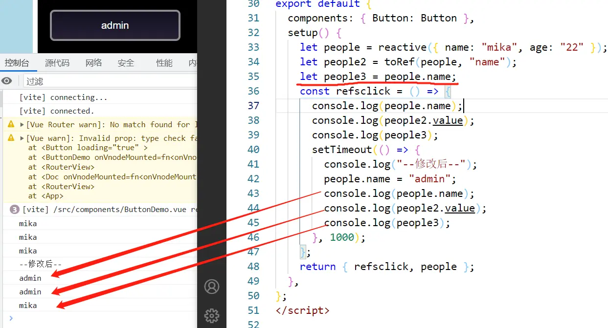
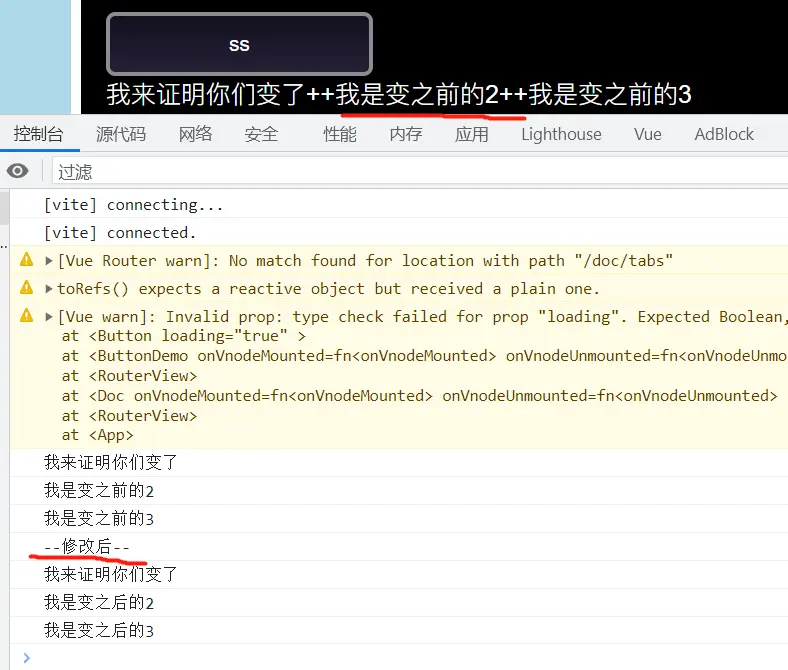
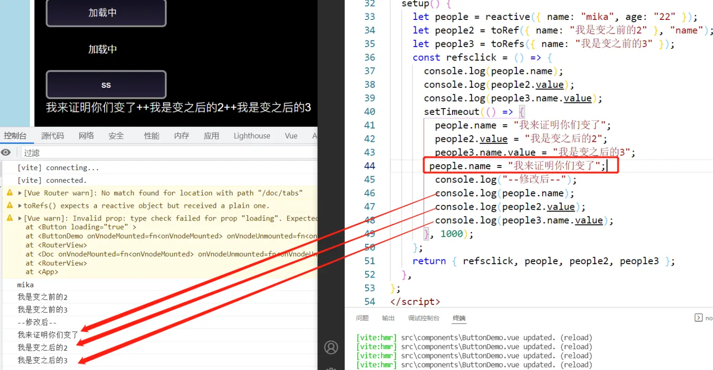

# 问题

https://blog.csdn.net/weixin_45578532/article/details/133785684

vue3 ref 修改没有在页面显示


vue2 修改数组没有在页面显示，要$set 赋值才行


computed 里面的响应式变量如果初始化没有创建，那么后续就不会绑定

 width: v-bind('`${props.size}px`');

- 大量修改响应式，页面没有显示

- vue3 修改对象下的数组 页面没有响应

  https://worktile.com/kb/p/3552006

- vue3 使用 vant ref 拿不到

- 异步处理和响应式

- created 访问接口（采用 settimeout），onmouted 能拿到数据吗，会异步吗

- https://blog.csdn.net/weixin_45578532/article/details/133785684

  vue3 ref 修改没有在页面显示


# 基本概念

## 标签数据

- {{msg}} , msg 也可以是 js 表达式，但只能包含 **单个** 表达式

  > 一个表达式会产生一个值, 它可以放在任何需要一个值的地方
  > 语句可以理解成一个行为.循环语句和 if 语句就是典型的语句
  > 需要语句的地方, 你可以使用一个表达式来代替.这样的语句称之为表达式语句

- v-model = "msg" 建立双向绑定 	

  ```html
  <input type="text" v-model="name">
  ```

  相当于：

  ```html
  <input type="text" :value="name" @input="name = $event.target.value">
  ```

- v-once 指令： 执行一次性地插值，当数据改变时，插值处的内容不会更新 

  ```
  <span v-once>这个将不会改变: {{ msg }}</span>
  ```

- 编译 html 元素  {{msg}} 	v-html	

- v-text

## 标签属性

```vue


//缩写

//动态参数的缩写 
// 可以用方括号括起来的 JavaScript 表达式作为一个指令的参数 

```

**内联样式**

```vue

```

**class**

  ```vue
a:'red',
b:'blue',
json:{
    red:true,
    blue:false
}

<strong :class="[条件?a:b]">文字。。</strong>//可以用三元表达式  
<strong :class="[a,b]">文字。。</strong>
<strong :class="{red:true,blue:false}">文字。。</strong>
<strong :class="json">文字。。</strong>

//添加动态class
<strong :class="[条件?'className':'className',条件?'className':'className',]">
  ```

- 组件内部引入第三方的 css 文件只在当前组件生效的办法

  <style src="" scoped> </style>

- vue 样式穿透 :: v-deep   https://www.jb51.net/article/188038.htm

  修改 vantUI 样式，直接在 <style lang="scss" scoped> .... </style> 中编写的话只会影响当前组件内的样式，但如果去掉 scoped 话又会影响全局样式。

  如果你希望 scoped 样式中的一个选择器能够作用得“更深”，例如影响子组件，你可以使用 >>> 操作符：

  <style scoped> .a >>> .b { /* ... */ } </style> 上述代码将会编译成：.a [data-v-f3f3eg9] .b { /* … */ }
可以使用 /deep/ 或 :: v-deep 操作符取而代之——两者都是 >>> 的别名，同样可以正常工作。

## 指令

### `v-for` 与虚拟 DOM 

```
<ul>
  <li v-for="item in items" :key="item.id">{{ item.text }}</li>
</ul>
```

1. **初始渲染**：当组件首次渲染时，Vue.js 会解析模板中的 `v-for` 指令，根据提供的数据（如数组）生成一个虚拟 DOM 树。
2. **数据变化**：如果数组中的数据发生变化（例如添加、删除或修改项），Vue.js 会创建一个新的虚拟 DOM 树。
3. **比较差异**：Vue.js 使用高效的 diffing 算法比较新旧虚拟 DOM 树，找出需要更新的部分。这个过程非常快速，因为它只关注实际变化的部分。
4. **实际更新**：最后，Vue.js 将计算出的差异应用到真实的 DOM 上，只更新那些需要改变的部分。这大大提高了应用的性能，尤其是在处理大型列表时。

性能优化

- **使用 `key`**：如前所述，为 `v-for` 中的每个元素提供一个唯一的 `key` 是非常重要的，这有助于 Vue 在数据变化时高效地识别和更新具体的元素。
- **避免大型列表的全量更新**：如果列表非常大，考虑使用 `v-if` 或计算属性来控制哪些项应该被渲染，从而减少需要比较的节点数量。
- **使用稳定的 key**：确保用于 `v-for` 的 `key` 是稳定的（例如，使用数据库 ID 或唯一标识符），这有助于 Vue 更有效地进行节点的复用和重排序。

### v-if 和 v-show

https://blog.csdn.net/zg0601/article/details/123632608

#### v-if

```js
v-if 指令用于条件性地渲染一块内容。这块内容只会在指令的表达式返回 true 值的时候被渲染。
<h1 v-if="awesome">Vue is awesome!</h1>
也可以用 v-else 添加一个“else 块”：	
<h1 v-else>Oh no 😢</h1>

在 <template> 元素上使用 v-if 条件渲染分组
<template v-if="loginType === 'username'">
  <label>Username</label>
  <input placeholder="Enter your username">
</template>
<template v-else>
  <label>Email</label>
  <input placeholder="Enter your email address">
</template>
```

当它们处于同一节点，`v-for` 的优先级比 `v-if` 更高，这意味着 `v-if` 将分别重复运行于每个 `v-for` 循环中。当你只想为 *部分* 项渲染节点时，这种优先级的机制会十分有用，如下：

```js
<li v-for="todo in todos" v-if="!todo.isComplete">
  {{ todo }}
</li>
```

#### v-show

```js
 <div v-show="a"> 
 v-show="a"//a是布尔值， 切换元素的 CSS property `display`

//Vue2.+ 中data数据对象是通过Object.defineProerty来进行数据的双向数据绑定，
//而数组则是监听数组的push和pop等操作数组的方法进行双向绑定的，
//因此当是通过下标来修改时便不能更新视图

//使用数组中的值来控制展示
 <div v-show="arr[index]"> 
this.$set(this.arr,index,!this.arr[index]);
//第一个参数为数组，第二个参数为数组下标，第三个参数为设置的值，
```

#### 区别

既然 v-show 和 v-if 这两个指令都可以控制 DOM 元素的行为，那么它们有什么区别呢？

1、控制手段不同

v-show 指令设置隐藏是给绑定的 DOM 元素添加 CSS 样式：display: none，但是 DOM 元素仍然存在；
v-if 指令设置隐藏是将 DOM 元素整个删除，此时 DOM 元素不再存在。
2、编译过程不同

v-if  切换有一个局部编译/卸载的过程，切换过程中合适地销毁和重建内部的事件监听和子组件；而 v-show 只是简单的基于 CSS 切换，不管初始条件是什么，元素总是会被渲染。

3、编译条件不同

v-show 是在任何条件下（首次条件是否为真）都被编译，然后被缓存，而且 DOM 元素保留；

v-if 由 false 变为 true 时，触发组件的 beforeCreate、create、beforeMount、mounter 钩子，由 true 变为 false 时，触发组件的

beforeDestory、destoryed 方法。v-if 是真正的条件渲染，它会确保在切换过程中条件块内的事件监听器和子组件适当地被销毁和重建；

v-if 也是惰性的，如果初始渲染时条件为假，则什么也不做——直到为真时才开始渲染条件块。

4、性能消耗不同

 v-show 由更高的初始渲染消耗， v-if 有更高的切换消耗。

#### 使用场景

如果需要非常频繁地切换，则使用 v-show 较好；

如果在运行时条件很少改变，则使用 v-if 较好。

### v-model 和 v-bind

v-bind

v-bind是单向绑定，用于将Vue实例中的数据与DOM元素的属性进行绑定。它只能将数据从Vue实例流向DOM元素，而不能反向流动。v-bind可以绑定任何类型的属性，如class、style、href等。使用v-bind时，可以省略v-bind，直接使用简写形式“:”，例

```
<!-- 绑定单个属性 -->

<!-- 简写 -->


<div v-bind:id></div> 
<!-- 与 :id="id" 相同 -->
<div :id></div>
```

v-model

v-model是双向绑定，不仅可以将数据从Vue实例流向DOM元素，还可以将用户输入的数据从DOM元素流回Vue实例。v-model主要用于表单控件，如`<input>`、`<select>`、`<textarea>`等，用于实现数据的双向绑定。当用户在这些控件中输入数据时，这些数据会实时更新到Vue实例中，反之亦然‌。

适用场景

- ‌**v-bind**‌：适用于所有需要动态绑定属性的场景，如动态改变class、style、href等属性。**它不限于表单控件，可以用于任何元素‌**。
- ‌**v-model**‌：主要用于表单控件，如输入框、选择框、文本域等，实现数据的双向绑定。当用户在这些控件中输入数据时，数据会实时更新到Vue实例中‌

### 自定义指令

	Vue.directive(指令名称, function(参数){
		this.el	-> 原生 DOM 元素
	});
	
	<div v-red="参数"> </div>

指令定义函数提供了几个钩子函数（可选）：

- bind: 只调用一次，指令第一次绑定到元素时调用，可以定义一个在绑定时执行一次的初始化动作。
- inserted: 被绑定元素插入父节点时调用（父节点存在即可调用，不必存在于 document 中）。
- update: 被绑定元素所在的模板更新时调用，而不论绑定值是否变化。通过比较更新前后的绑定值。
- componentUpdated: 被绑定元素所在模板完成一次更新周期时调用。
- unbind: 只调用一次， 指令与元素解绑时调用。

例子：https://juejin.cn/post/6906028995133833230#heading-5

##  computed 和 watch

多对一：如果一个值依赖多个属性（多对一），用 computed 肯定是更加方便的

一对多：如果一个值变化后会引起一系列操作，或者一个值变化会引起一系列值的变化，用 watch 更加方便一些

### 计算属性 computed

- computed 计算属性，用来计算一个属性的值。

  **计算属性基于响应式依赖进行缓存。** 依赖不变的时候，值不会重新计算，它调用的就是上一次计算缓存的数据，而不是从新计算。因此提高了程序的性能。而 methods 中方法每调用一次就会重新计算一次，为了进行不必要的资源消耗，选择用计算属性

  这也解释了为什么下面的计算属性永远不会更新，因为 `Date.now()` 并不是一个响应式依赖：

  ```
  const now = computed(() => Date.now())
  ```

- **不支持异步**，当 computed 内有异步操作时无效，无法监听数据的变化
- computed 的 getter 和 setter
  - computed 的属性可以读取和设值。因此，在 computed 中可以分为 getter(读取)和 setter(设值).
  - 一般情况下没有 setter，computed 只预设了 getter，只能读取，不能设值。所以，computed 默认格式（是不表明 getter 函数的）
  - 当赋值给计算属性的时候，将调用 setter 函数

**计算属性缓存 vs 方法**

- 方法：**方法调用总是会在重渲染发生时再次执行函数**

  ```vue
  <p id="app">{{ myname.substring(0,1).toUpperCase() + myname.substring(1) }}</p>
  ```

- 计算属性

  ```vue
  <template>
    <div id="app">
      {{ changewords }}
      //通过在表达式中调用方法来达到同样的效果 //{{ changewords() }}
      //不同的是计算属性是基于它们的响应式依赖进行缓存的。只在相关响应式依赖发生改变时它们才会重新求值。这就意味着只要message
      还没有发生改变，多次访问 reversedMessage,计算属性会立即返回之前的计算结果，而不必再次执行函数。
    </div>
  </template>
  <script>
  export default {
    data() {
      return {};
    },
    method: {
      changewords() {
        return;
        //this.myname.substring(0, 1).toUpperCase() + this.myname.substring(1);
      },
    },
    computed: {
      changewords() {
        return 0;
        //this.myname.substring(0, 1).toUpperCase() + this.myname.substring(1);
      },
      //完整写法
      changewords: {
        get: function () {
          return; //一定要return
        },
        set: function (newVal) { },
      },
    },
  };
  </script>
  ```

###   侦听器 watch

watch 的意思是监听，当发生变化时，监听并且执行。

1. immediat：ture 表示让值最初时候 watch 就执行
2. deep 表示对对象里面的变化进行深度监听
3. 不支持缓存，数据变，直接会触发相应的操作

```js
  var vm = new Vue({
  	data: {
      question: '',
      answer: 'I cannot give you an answer until you ask a question!'
   	 },
    watch: {
      // 如果 `question` 发生改变，这个函数就会运行
      question: function (newQuestion, oldQuestion) {
        this.answer = 'Waiting for you to stop typing...'
        this.debouncedGetAnswer()
      }
    },
  })

  vm.$watch(name,fnCb);  //浅度
  vm.$watch(name,fnCb,{deep:true});  //深度监视 
```

- 不支持缓存，数据变，直接会触发相应的操作；

- **watch 支持异步**；

- 监听的函数接收两个参数，第一个参数是最新的值；第二个参数是输入之前的值；

- 当一个属性发生变化时，需要执行对应的操作；一对多；

- 监听数据必须是 data 中声明过或者父组件传递过来的 props 中的数据，当数据变化时，触发其他操作，函数有两个参数
  - immediate：组件加载立即触发回调函数执行，
  - deep: 深度监听，为了发现 **对象内部值** 的变化，复杂类型的数据时使用，例如数组中的对象内容的改变，注意监听数组的变动不需要这么做。注意：deep 无法监听到数组的变动和对象的新增
- **不应该使用箭头函数来定义 watcher 函数**，因为箭头函数没有 this，它的 this 会继承它的父级函数，但是它的父级函数是 window，导致箭头函数的 this 指向 window，而不是 Vue 实例

### 区别

- 功能上：computed 是计算属性，watch 是监听一个值的变化，然后执行对应的回调。

- 是否调用缓存：computed 中的函数所依赖的属性没有发生变化，那么调用当前的函数的时候会从缓存中读取，而 watch 在每次监听的值发生变化的时候都会执行回调。

- 是否调用 return：computed 中的函数必须要用 return 返回，watch 中的函数不是必须要用 return。

- **computed 默认第一次加载的时候就开始监听；watch 默认第一次加载不做监听，如果需要第一次加载做监听，添加 immediate 属性，设置为 true（immediate: true）**

- 使用场景：computed----当一个属性受多个属性影响的时候，使用 computed-----购物车商品结算。watch–当一条数据影响多条数据的时候，使用 watch-----搜索框.

- computer为什么不可以用异步，watch却可以：

  Computed 属性的定义是“依赖值改变，computed 值就会改变”，因此 computed 必须**同步地响应**其依赖值的变化，以确保计算属性的稳定性和可预测性

### tip

vue 中，如何解决 watch 的新值和旧值是一样的


https://juejin.cn/post/6898347237173100558

 ## 事件

### 使用方法

  ```js
  <!-- 完整语法 -->
  <a v-on:click="doSomething">...</a>
  
  <!-- 缩写 -->
  <a @click="doSomething">...</a>
  
  <!-- 动态参数的缩写 -->
  <a @[event]="doSomething"> ... </a>
  ```

```js
//使用原生的事件
mounted() {
    //不能直接定义事件，需要从methods中引入this.handleScroll
    //TODO,是否是this指向的问题
    window.addEventListener('scroll', this.handleScroll, true)
    this.boxTop = this.$refs.tabList.offsetTop;
},
```

### 键盘

@keydown	$event	ev.keyCode

```vue
常用键:
回车
@keyup.13
@keyup.enter
上、下、左、右
@keyup/keydown.left
@keyup/keydown.right
@keyup/keydown.up
@keyup/keydown.down
自定义键盘信息:
Vue.directive('on').keyCodes.ctrl=17;
//vue2.0	
通过全局 config.keyCodes 对象自定义按键修饰符别名：
Vue.config.keyCodes.ctrl=17;
@keyup.ctrl="fn()"
```

`.exact` 修饰符允许你控制由精确的系统修饰符组合触发的事件。

```vue
<!-- 即使 Alt 或 Shift 被一同按下时也会触发 -->
<button v-on:click.ctrl="onClick">A</button>

<!-- 有且只有 Ctrl 被按下的时候才触发 -->
<button v-on:click.ctrl.exact="onCtrlClick">A</button>

<!-- 没有任何系统修饰符被按下的时候才触发 -->
<button v-on:click.exact="onClick">A</button>
```

系统按键修饰符

你可以使用以下系统按键修饰符来触发鼠标或键盘事件监听器，只有当按键被按下时才会触发。

- `.ctrl`
- `.alt`
- `.shift`
- `.meta`

## 修饰符

### 修饰符串联

```
<!-- 修饰符可以串联 -->
<a v-on:click.stop.prevent="doThat"></a>
```

### 事件修饰符

#### stop

stop 防止事件冒泡  

```vue
@click.stop="show()"   
```

阻止冒泡:  
a). ev.cancelBubble = true;
b). @click.stop	推荐
c). event.stopPropagation();

#### prevent

```
<!-- 阻止默认行为，提交事件不再重载页面 -->
<form v-on:submit.prevent="onSubmit"></form>
```

#### self

```
<!-- 仅当 event.target 是元素本身时才会触发事件处理器 -->
<!-- 例如：事件处理器不来自子元素 -->
<div @click.self="doThat">...</div>
```

#### capture

```
<!-- 添加事件监听器时使用事件捕获模式 -->
<!-- 即内部元素触发的事件先在此处理，然后才交由内部元素进行处理 -->
<div v-on:click.capture="doThis">...</div>
```

#### once

```
<!-- 点击事件将只会触发一次 -->
<a v-on:click.once="doThis"></a>
```

#### passive


```html
<!-- 滚动事件的默认行为 (scrolling) 将立即发生而非等待 `onScroll` 完成 -->
<!-- 以防其中包含 `event.preventDefault()` -->
<div @scroll.passive="onScroll">...</div>
```

#### native（vue3移除）

@click.native 是给组件绑定原生事件，否则会认为监听的是来自组件自定义的事件

#### lazy

在默认情况下，v-model 在每次 input 事件触发后将输入框的值与数据进行同步 (除了上述输入法组合文字时)。你可以添加 lazy 修饰符，从而转为在 change 事件_之后_进行同步。
意思是什么呢，就是说当我们在 input 输入框输入数据时，v-model 绑定的值不会发发生变化，但是当我们停止输入，输入框失去焦点或者按下回车时，v-model 绑定的值才会发生变化，即在“change”时而非“input”时更新

```
<!-- 在 "change" 事件后同步更新而不是 "input" -->
<input v-model.lazy="msg" />
```


#### trim

用户输入的前后的空格去掉

#### target

```
<!-- 只当在 event.target 是当前元素自身时触发处理函数 -->
<!-- 即事件不是从内部元素触发的 -->
<div v-on:click.self="doThat">...</div>
```

#### exact

`.exact` 修饰符允许你控制由精确的系统修饰符组合触发的事件。

```vue
<!-- 即使 Alt 或 Shift 被一同按下时也会触发 -->
<button v-on:click.ctrl="onClick">A</button>

<!-- 有且只有 Ctrl 被按下的时候才触发 -->
<button v-on:click.ctrl.exact="onCtrlClick">A</button>

<!-- 没有任何系统修饰符被按下的时候才触发 -->
<button v-on:click.exact="onClick">A</button>
```

#### sync

日常开发时，我们总会遇到需要父子组件双向绑定的问题，但是考虑到组件的可维护性，vue 中是不允许子组件改变父组件传的 props 值的。那么同时，vue 中也提供了一种解决方案.[sync](https://so.csdn.net/so/search?q=sync&spm=1001.2101.3001.7020) 修饰符。sync 修饰符，与我们平常使用$emit 实现子组件向父组件通信没有区别，只不过是写法上方便一些。

- $emit

  子组件使用$emit 向父组件发送事件：

  ```vue
  this.$emit('update:title', newTitle)
  ```

  父组件监听这个事件并更新一个本地的数据 title：

  ```vue
  <text-document
    :title="title"
    @update:title="val => title = val"
  ></text-document>
  ```

- .sync 修饰符

  只需要修两个地方：

  1. 子组件内触发的事件名称以“update: title”命名
  2. 父组件 v-bind: title 加上.sync 修饰符，即 v-bind: title.sync

  这样父组件就不用再手动绑定@update: title 事件了。

  ```vue
  // 子组件
  ...
  methods: {
      onInput(e) {
          this.$emit("update:title", e.target.value)
      }
  }
  // index.vue组件
  <info :title.sync="title"></info>
  ```


## 过渡动画

https://cn.vuejs.org/v2/guide/transitions.html

### 过渡条件

Vue 提供了 `transition` 的封装组件，在下列情形中，可以给任何元素和组件添加进入/离开过渡

- 条件渲染 (使用 `v-if`)
- 条件展示 (使用 `v-show`)
- 动态组件
- 组件根节点

### 过渡的类名

在进入/离开的过渡中，会有 6 个 class 切换。

1. `v-enter`：定义进入过渡的开始状态。在元素被插入之前生效，在元素被插入之后的下一帧移除。
2. `v-enter-active`：定义进入过渡生效时的状态。在整个进入过渡的阶段中应用，在元素被插入之前生效，在过渡/动画完成之后移除。这个类可以被用来定义进入过渡的过程时间，延迟和曲线函数。
3. `v-enter-to`：**2.1.8 版及以上** 定义进入过渡的结束状态。在元素被插入之后下一帧生效 (与此同时 `v-enter` 被移除)，在过渡/动画完成之后移除。
4. `v-leave`：定义离开过渡的开始状态。在离开过渡被触发时立刻生效，下一帧被移除。
5. `v-leave-active`：定义离开过渡生效时的状态。在整个离开过渡的阶段中应用，在离开过渡被触发时立刻生效，在过渡/动画完成之后移除。这个类可以被用来定义离开过渡的过程时间，延迟和曲线函数。
6. `v-leave-to`：**2.1.8 版及以上** 定义离开过渡的结束状态。在离开过渡被触发之后下一帧生效 (与此同时 `v-leave` 被删除)，在过渡/动画完成之后移除。

**实例**

```vue
<div id="demo">
  <button v-on:click="show = !show">
    Toggle
  </button>
  <transition name="fade">
    <p v-if="show">hello</p>
  </transition>
</div>

new Vue({
  el: '#demo',
  data: {
    show: true
  }
})

<style>
.fade-enter-active, .fade-leave-active {
  transition: opacity .5s;
}
.fade-enter, .fade-leave-to /* .fade-leave-active below version 2.1.8 */ {
  opacity: 0;
}
</style>>
```

### 过渡组件 transition

https://cn.vuejs.org/v2/api/#transition

#### **Prop**

- `name` - string，用于自动生成 CSS 过渡类名。例如：`name: 'fade'` 将自动拓展为 `.fade-enter`，`.fade-enter-active` 等。默认类名为 `"v"`
- `appear` - boolean，是否在初始渲染时使用过渡。默认为 `false`。
- `css` - boolean，是否使用 CSS 过渡类。默认为 `true`。如果设置为 `false`，将只通过组件事件触发注册的 JavaScript 钩子。
- `type` - string，指定过渡事件类型，侦听过渡何时结束。有效值为 `"transition"` 和 `"animation"`。默认 Vue.js 将自动检测出持续时间长的为过渡事件类型。
- `mode` - string，控制离开/进入过渡的时间序列。有效的模式有 `"out-in"` 和 `"in-out"`；默认同时进行。
- `duration` - number | { `enter`: number, `leave`: number } 指定过渡的持续时间。默认情况下，Vue 会等待过渡所在根元素的第一个 `transitionend` 或 `animationend` 事件。
- `enter-class` - string
- `leave-class` - string
- `appear-class` - string
- `enter-to-class` - string
- `leave-to-class` - string
- `appear-to-class` - string
- `enter-active-class` - string
- `leave-active-class` - string
- `appear-active-class` - string

#### 事件

- `before-enter`
- `before-leave`
- `before-appear`
- `enter`
- `leave`
- `appear`
- `after-enter`
- `after-leave`
- `after-appear`
- `enter-cancelled`
- `leave-cancelled` (`v-show` only)
- `appear-cancelled`

#### 用法

`<transition>` 元素作为 **单个** 元素/组件的过渡效果。`<transition>` 只会把过渡效果应用到其包裹的内容上，而不会额外渲染 DOM 元素，也不会出现在可被检查的组件层级中。

```
<!-- 简单元素 -->
<transition>
  <div v-if="ok">toggled content</div>
</transition>

<!-- 动态组件 -->
<transition name="fade" mode="out-in" appear>
  <component :is="view"></component>
</transition>

<!-- 事件钩子 -->
<div id="transition-demo">
  <transition @after-enter="transitionComplete">
    <div v-show="ok">toggled content</div>
  </transition>
</div>
```

```
new Vue({
  ...
  methods: {
    transitionComplete: function (el) {
      // 传入 'el' 这个 DOM 元素作为参数。
    }
  }
  ...
}).$mount('#transition-demo')
```

- **参考**：[过渡：进入，离开和列表](https://cn.vuejs.org/v2/guide/transitions.html)

# 全局 API

### Vue.extend

使用基础 Vue 构造器，创建一个“子类”。参数是一个包含组件选项的对象。

`data` 选项是特例，需要注意 - 在 `Vue.extend()` 中它必须是函数

```
<div id="mount-point"></div>
// 创建构造器
var Profile = Vue.extend({
  template: '<p>{{firstName}} {{lastName}} aka {{alias}}</p>',
  data: function () {
    return {
      firstName: 'Walter',
      lastName: 'White',
      alias: 'Heisenberg'
    }
  }
})
// 创建 Profile 实例，并挂载到一个元素上。
new Profile().$mount('#mount-point')
```

### Vue.component

全局注册组件

### Vue.prototype.$xxx

如果需要设置全局变量，在 main.js 中，Vue 实例化的代码里添加。 不想污染全局作用域。这种情况下，你可以通过在 原型 上定义它们使其在每个 Vue 实例中可用。

```text
vue.prototype.$echarts = echarts
```

这样 `$echarts` 就在所有 Vue 实例中可用了, 变量前加上$，是防止被组件中的变量意外覆盖。

### Vue.use( plugin)

> `Vue.use` 和 `Vue.prototype` 没有本质区别，`Vue.use` 就是在 `Vue.prototype` 基础上又封装了一层而已，他们实现的原理都是在 `Vue.prototype` 上添加了一个方法，**`Vue.prototype` 适合于注册 Vue 生态外的插件，`Vue.use` 适合于注册 Vue 生态内的插件。**
>
> Vue.use 主要是执行 install 方法，而 install 主要也是执行 Vue.prototype 方法。所以，其实 Vue.use()方法的核心就是 Vue.prototype，只不过又封装了一层, 更加的灵活，扩展性更好

- **参数**：
  - `Vue.use({Object | Function}) plugin`
    - Object , 必须提供 install 方法
    - Function, 它会被作为 install 方法
- **用法：install 方法调用时，会将 Vue 作为参数传入。该方法需要在调用 `new Vue()` 之前被调用。当 install 方法被同一个插件多次调用，插件将只会被安装一次。**

#### demo

```
import moment from "moment";
const momentPlugin = {
  install: function (Vue: any) {
    Object.defineProperty(Vue.prototype, "$moment", { value: moment });
  },
};

export default momentPlugin;

```

```javascript
var install = function(Vue) {
    Object.defineProperties(Vue.prototype, {
        $Plugin: {
            value: function() { console.log('I am a plugin') }
        }
    })
}
module.exports = install
```

 main.js 导入

```javascript
// 测试插件
import Plugin from "./plugin/plugin"
Vue.use(Plugin)
```

使用插件

```javascript
this.$Plugin()
```

#### 饿了么

> 用饿了么 UI 举例

```javascript
import Vue from 'vue'
import Element from 'element-ui'
Vue.use(Element)
```

> 饿了么部分源码

```tsx
//types/element-ui.d.ts
export interface InstallationOptions {
  locale: any,
  i18n: any,
  size: string
}
export function install (vue: typeof Vue, options: InstallationOptions): void

//src/index.js
const install = function(Vue, opts = {}) {
  locale.use(opts.locale);
  locale.i18n(opts.i18n);

  components.forEach(component => {
    Vue.component(component.name, component);
  });

  Vue.use(InfiniteScroll);
  Vue.use(Loading.directive);

  Vue.prototype.$ELEMENT = {
    size: opts.size || '',
    zIndex: opts.zIndex || 2000
  };

  Vue.prototype.$loading = Loading.service;
  Vue.prototype.$msgbox = MessageBox;
  Vue.prototype.$alert = MessageBox.alert;
  Vue.prototype.$confirm = MessageBox.confirm;
  Vue.prototype.$prompt = MessageBox.prompt;
  Vue.prototype.$notify = Notification;
  Vue.prototype.$message = Message;

};
/* istanbul ignore if */
if (typeof window !== 'undefined' && window.Vue) {
  install(window.Vue);
}
```

### filter

```js
<p>1.msg|filterA</p>
{{'welcome'|uppercase}}  
<p>2.msg|filterA</p>
{{'WELCOME'|lowercase|capitalize}}
```

 数据配合使用过滤器:
		limitBy	限制几个
		limitBy   参数(取几个)
		limitBy 取几个  从哪开始

```
	filterBy	过滤数据
	filterBy ‘谁’

	orderBy	排序
	orderBy 谁 1/-1
		1  -> 正序
		2  -> 倒序

自定义过滤器:  model ->过滤 -> view
	Vue.filter(name,function(msg,[a,b]){
		
	});
{{msg | name([a,b])}}
```

### mixin

https://cn.vuejs.org/v2/guide/mixins.html

混入 (mixin) 提供了一种非常灵活的方式，来分发 Vue 组件中的可复用功能。一个混入对象可以包含任意组件选项。当组件使用混入对象时，所有混入对象的选项将被“混合”进入该组件本身的选项。

与组件的区别

组件：在父组件中引入组件，相当于在父组件中给出一片独立的空间供子组件使用，然后根据 props 来传值，但本质上两者是相对独立的。
Mixins：则是在引入组件之后与组件中的对象和方法进行合并，相当于扩展了父组件的对象与方法，可以理解为形成了一个新的组件。


特点
当组件和混入对象含有同名选项时，这些选项将以恰当的方式进行“合并”。

选项为 data ：在发生冲突时以组件数据优先。
值为函数的选项，如生命周期钩子函数 created, mounted 等，就会被合并调用，混合对象里的钩子函数在组件里的钩子函数之前调用
值为对象的选项，例如 methods、components 和 directives，将被合并为同一个对象。两个对象键名冲突时，取组件对象的键值对。
方法和参数在各组件中不共享

# vm 实例

当一个 Vue 实例被创建时，它将 `data` 对象中的所有的 property 加入到 Vue 的 **响应式系统** 中。当这些 property 的值发生改变时，视图将会产生“响应”，即匹配更新为新的值。

```js
var data = { a: 1 }
var vm = new Vue({
  el: '#box',
  components: { //局部组件
    'aaa': Aaa
  },
  data: {
    data: data
  },
  methods: {
    fn() { }
  }
});
// 获得这个实例上的 property
vm.a == data.a // => true
//设置 property 也会影响到原始数据
vm.a = 2
data.a // => 2
```

当这些数据改变时，视图会进行重渲染。值得注意的是只有当实例被创建时就已经存在于 `data` 中的 property 才是 **响应式** 的。也就是说如果你添加一个新的 property，比如：

```
vm.b = 'hi'
```

那么对 `b` 的改动将不会触发任何视图的更新。


## property

### vm.$options

```js
var vm=new Vue({
    // el:'#box',
    aa:11,//自定义属性
    show:function(){
        alert(1);
    },
    data:{
        a:1
    }
});
console.log(vm.$options.aa);//获取自定义属性
vm.$options.show();
```

### vm.$data

Vue 实例观察的数据对象。Vue 实例代理了对其 data 对象 property 的访问。

```js
var data = { a: 1 }
var vm = new Vue({
  el: '#example',
  data: data
})

vm.$data === data // => true
vm.$el === document.getElementById('example') // => true

// $watch 是一个实例方法
vm.$watch('a', function (newValue, oldValue) {
  // 这个回调将在 `vm.a` 改变后调用
})
```

### vm.$props

当前组件接收到的 props 对象。Vue 实例代理了对其 props 对象 property 的访问。

### vm.$el

获取 Vue 实例挂载的元素节点

### vm.$refs

一个对象，持有注册过 [`ref` attribute](https://cn.vuejs.org/v2/api/#ref) 的所有 DOM 元素和组件实例。

### vm.$parent 依赖注入

父实例，如果当前实例有的话。子组件可以通过 `this.$parent.fn`(父组件的函数)去调用父组件的函数

当前实例的直接子组件。**需要注意 `$children` 并不保证顺序，也不是响应式的。** 如果你发现自己正在尝试使用 `$children` 来进行数据绑定，考虑使用一个数组配合 `v-for` 来生成子组件，并且使用 Array 作为真正的来源。

```
<google-map>
  <google-map-region v-bind:shape="cityBoundaries">
    <google-map-markers v-bind:places="iceCreamShops"></google-map-markers>
  </google-map-region>
</google-map>
```

在这个组件里，所有 `<google-map>` 的后代都需要访问一个 `getMap` 方法，以便知道要跟哪个地图进行交互。不幸的是，使用 `$parent` property 无法很好的扩展到更深层级的嵌套组件上。这也是依赖注入的用武之地，它用到了两个新的实例选项：`provide` 和 `inject`。

`provide` 选项允许我们指定我们想要 **提供** 给后代组件的数据/方法。在这个例子中，就是 `<google-map>` 内部的 `getMap` 方法：

```
provide: function () {
  return {
    getMap: this.getMap
  }
}
```

然后在任何后代组件里，我们都可以使用 `inject` 选项来接收指定的我们想要添加在这个实例上的 property：

```
inject: ['getMap']
```

### vm.$root

当前组件树的根 Vue 实例。如果当前实例没有父实例，此实例将会是其自己。

## 方法

### vm.$on/\$emit

### vm.$watch

vm.$watch( expOrFn, callback, [options] )

观察 Vue 实例上的一个表达式或者一个函数计算结果的变化。回调函数得到的参数为新值和旧值。

### vm.$set

vm.$set( target, propertyName/index, value )

🌹 调用方法：this.$set( target, key, value )

🌹 target：要更改的数据源(可以是对象或者数组)

🌹 key：要更改的具体数据

🌹 value ：重新赋的值

**当你发现你给对象加了一个属性，在控制台能打印出来，但是却没有更新到视图上时，也许这个时候就需要用到 this.$set（）这个方法了**


给 data 定义的对象 `新增属性`, 同时 `又要视图实时更新`, 除了用 `Vue.$set()` 方法, 也可以通过 `Object.assign()` 实现

### vm.$once

$once 有两个参数，第一个参数为字符串类型，用来指定绑定的事件名称，第二个参数设置事件的回调函数

自定义事件

```
<template>
  <div>
    <button @click="$emit('onceHander')">按钮</button>
  </div>
</template>
 
<script>
export default {
  mounted() {
    this.$once('onceHander', () => {
      console.log('该事件只能够被触发一次，触发后立刻被移除11');
    });
  }
}
</script>
```

生命周期

```
let timer = setInterval(()=>{
    // to do
    console.log("定时器打印111");
},1000);
this.$once('hook:beforeDestroy',()=>{
    clearInterval(timer);
    timer = null;
})
```

## 生命周期

### vm.$mount

如果 Vue 实例在实例化时没有收到 el 选项，则它处于“未挂载”状态，没有关联的 DOM 元素。可以使用 `vm.$mount()` 手动地挂载一个未挂载的实例。

```
var MyComponent = Vue.extend({
  template: '<div>Hello!</div>'
})

// 创建并挂载到 #app (会替换 #app)
new MyComponent().$mount('#app')

// 同上
new MyComponent({ el: '#app' })

// 或者，在文档之外渲染并且随后挂载
var component = new MyComponent().$mount()
document.getElementById('app').appendChild(component.$el)
```


### vm.$forceUpdate()

### vm.nextTick

https://www.jianshu.com/p/a7550c0e164f

https://mp.weixin.qq.com/s/lf9uKtTAKNplJeSwFSM_Uw

在下次 DOM 更新循环结束之后执行延迟回调。

```js
// 修改数据
vm.msg = 'Hello'
// DOM 还没有更新
Vue.nextTick(function () {
  // DOM 更新了
})

// 作为一个 Promise 使用 (2.1.0 起新增，详见接下来的提示)
Vue.nextTick()
  .then(function () {
    // DOM 更新了
  })
```

### $nextTick 和 setTimeout 区别（宏任务微任务）

https://blog.csdn.net/u010565037/article/details/125757087

`nextTick` 在 vue 源码中是利用 `Promise.resolve()` 实现的。该问题实际就是 `Promise` 与 `setTimeout` 的区别，本质是 `Event Loop` 中微任务与宏任务的区别。

`nextTick`: 在下次 DOM 更新循环结束之后执行延迟回调。虽然 DOM 更新了，但是由于 v-if 此时并没有执行，所以获取不到其中的元素

# 组件

## 组件命名

- #### kebab-case(短横线分隔命名) 

  ```
  Vue.component('my-component-name', { /* ... */ })
  ```

- #### PascalCase  (首字母大写命名)    

  ```
  Vue.component('MyComponentName', { /* ... */ })
  ```
  
  当使用 PascalCase (首字母大写命名) 定义一个组件时，你在引用这个自定义元素时两种命名法都可以使用。也就是说 `<my-component-name>` 和 `<MyComponentName>` 都是可接受的。注意，尽管如此，直接在 DOM (即非字符串的模板) 中使用时只有 kebab-case 是有效的。
  

## 创建组件

### 局部注册

- **定义组件**

```js
//vue2.0组件定义
<template id="Aaa">
  <h1 @click="change">{{ msg }}</h1>
</template >
var Aaa = {
  data() {
    return { isCollapse: true };
  },
  methods: {
  },
};
//导出组件
export default Aaa
```

- **组件使用**

```js
//导入组件
import Aaa from './Aaa'
export default {
  components: {
    Aaa,
  },
  // ...
}
```

### 全局组件

```
Vue.component('component-a', { /* ... */ })
Vue.component('component-b', { /* ... */ })
Vue.component('component-c', { /* ... */ })

new Vue({ el: '#app' })
<div id="app">
  <component-a></component-a>
  <component-b></component-b>
  <component-c></component-c>
</div>
```

如果你恰好使用了 webpack (或在内部使用了 webpack 的 [Vue CLI 3+](https://github.com/vuejs/vue-cli))，那么就可以使用 `require.context` 只全局注册这些非常通用的基础组件

```js
import Vue from 'vue'
import upperFirst from 'lodash/upperFirst'
import camelCase from 'lodash/camelCase'

const requireComponent = require.context(
  // 其组件目录的相对路径
  './components',
  // 是否查询其子目录
  false,
  // 匹配基础组件文件名的正则表达式
  /Base[A-Z]\w+\.(vue|js)$/
)

requireComponent.keys().forEach(fileName => {
  // 获取组件配置
  const componentConfig = requireComponent(fileName)

  // 获取组件的 PascalCase 命名
  const componentName = upperFirst(
    camelCase(
      // 获取和目录深度无关的文件名
      fileName
        .split('/')
        .pop()
        .replace(/\.\w+$/, '')
    )
  )

  // 全局注册组件
  Vue.component(
    componentName,
    // 如果这个组件选项是通过 `export default` 导出的，
    // 那么就会优先使用 `.default`，
    // 否则回退到使用模块的根。
    componentConfig.default || componentConfig
  )
})
```

**全局注册的行为必须在根 Vue 实例 (通过 `new Vue`) 创建之前发生**。[这里](https://github.com/chrisvfritz/vue-enterprise-boilerplate/blob/master/src/components/_globals.js) 有一个真实项目情景下的示例。

## 内置组件

### 插槽：slot

https://v2.cn.vuejs.org/v2/guide/components-slots.html

#### 原理

Vue 实现了一套内容分发的 API，这套 API 的设计灵感源自 [Web Components 规范草案](https://github.com/w3c/webcomponents/blob/gh-pages/proposals/Slots-Proposal.md)，将 `<slot>` 元素作为承载分发内容的出口。

#### 编译作用域

**父级模板里的所有内容都是在父级作用域中编译的；子模板里的所有内容都是在子作用域中编译的。**

```vue
<navigation-link url="/profile">
  Clicking here will send you to: {{ url }}
  <!--
  这里的 `url` 会是 undefined，因为其 (指该插槽的) 内容是
  _传递给_ <navigation-link> 的而不是
  在 <navigation-link> 组件*内部*定义的。
  -->
</navigation-link>
```

#### 具名插槽

有时我们需要多个插槽。例如对于一个带有如下模板的 `<base-layout>` 组件：

对于这样的情况，`<slot>` 元素有一个特殊的 attribute：`name`。这个 attribute 可以用来定义额外的插槽：

```vue
//<base-layout>
<div class="container">
  <header>
    <slot name="header"></slot>
  </header>
  <main>
    <slot></slot>
  </main>
  <footer>
    <slot name="footer"></slot>
  </footer>
</div>
```

一个不带 `name` 的 `<slot>` 出口会带有 **隐含的名字 default**。

在向具名插槽提供内容的时候，我们可以在一个 `<template>` 元素上使用 `v-slot` 指令，并以 `v-slot` 的参数的形式提供其名称：

```vue
<base-layout>
  <template v-slot:header>
    <h1>Here might be a page title</h1>
  </template>

  <p>A paragraph for the main content.</p>
  <p>And another one.</p>

  <template v-slot:footer>
    <p>Here's some contact info</p>
  </template>
</base-layout>
```

现在 `<template>` 元素中的所有内容都将会被传入相应的插槽。**任何没有被包裹在带有 `v-slot` 的 `<template>` 中的内容都会被视为默认插槽的内容**。

然而，如果你希望更明确一些，仍然可以在一个 `<template>` 中包裹 **默认插槽** 的内容：

```vue
<base-layout>
  <template v-slot:header>
    <h1>Here might be a page title</h1>
  </template>

  <template v-slot:default>
    <p>A paragraph for the main content.</p>
    <p>And another one.</p>
  </template>

  <template v-slot:footer>
    <p>Here's some contact info</p>
  </template>
</base-layout>
```

任何一种写法都会渲染出：

```vue
<div class="container">
  <header>
    <h1>Here might be a page title</h1>
  </header>
  <main>
    <p>A paragraph for the main content.</p>
    <p>And another one.</p>
  </main>
  <footer>
    <p>Here's some contact info</p>
  </footer>
</div>
```

注意 **`v-slot` 只能添加在 `<template>` 上** (只有 [一种例外情况](https://v2.cn.vuejs.org/v2/guide/components-slots.html#独占默认插槽的缩写语法))，这一点和已经废弃的 [`slot` attribute](https://v2.cn.vuejs.org/v2/guide/components-slots.html#废弃了的语法) 不同。

#### 作用域插槽

> **让父组件插槽内容能够访问子组件中的数据**

我们想在父组件中使用子组件中定义的 user 变量

```vue
<current-user>
  {{ user.firstName }}
</current-user>
```

然而上述代码不会正常工作，因为只有 `<current-user>` 组件可以访问到 `user`，而我们提供的内容是在父级渲染的。为了让 `user` 在父级的插槽内容中可用，我们可以将 `user` 作为 `<slot>` 元素的一个 attribute 绑定上去：

```vue
<span>
  <slot v-bind:user="user">
  </slot>
</span>
```

绑定在 `<slot>` 元素上的 attribute 被称为 **插槽 prop**。现在在父级作用域中，我们可以使用带值的 `v-slot` 来定义我们提供的插槽 prop 的名字：

```js
<current-user>
  <template v-slot:default="slotProps">
    {{ slotProps.user.firstName }}
  </template>
</current-user>

//解构插槽 Prop
<current-user v-slot="{ user }">
  {{ user.firstName }}
</current-user>
```

#### 动态插槽

```vue
<base-layout>
  <template v-slot:[dynamicSlotName]>
    ...
  </template>
</base-layout>
```


### 动态组件

```
<component :is="currentTab"></component>
```

`:is` 的值可以是以下几种：

- 被注册的组件名
- 导入的组件对象

### keep-alive

keep-alive 是 vue 中的内置组件，包裹动态组件时，能在组件切换过程中将状态保留在内存中，而不是销毁它们。`<keep-alive>` 和 `<transition>` 相似，是一个抽象组件。它自身不会渲染一个 DOM 元素

- **Props**：

  - `include` - 字符串或正则表达式。只有名称匹配的组件会被缓存。
  - `exclude` - 字符串或正则表达式。任何名称匹配的组件都不会被缓存。
  - `max` - 数字。最多可以缓存多少组件实例。

- **用法**：

  当组件在 `<keep-alive>` 内被切换，它的 `activated` 和 `deactivated` 这两个生命周期钩子函数将会被对应执行。

  - 页面第一次进入，钩子的触发顺序 created-> mounted-> activated
  - 退出时触发 deactivated
  - 当再次进入（前进或者后退）时，只触发 activated。

#### 应用场景

缓存路由组件

```
<router-view v-slot="{ Component, route }">
  <transition name="fade" mode="out-in">
    <keep-alive>
    	<component :is="Component" :key="route.fullPath" />
    </keep-alive>
  </transition>
</router-view>
```

#### 缺点

- 不会执行create/mounted的事件

  - 获取分页列表

- 路由嵌套了超过两层后，使用[keep-alive](https://so.csdn.net/so/search?q=keep-alive&spm=1001.2101.3001.7020)对路由进行页面的缓存，无法被keep-alive 执行生效。

  https://blog.csdn.net/lc_2014c/article/details/144696600

  - 方案一：多级路由变成两级以下路由层级，
    - 没有公共的父级组件继承了，
    - 面包屑不能直接从route.matched里面获取，要自己一层一层封装。
    - 菜单栏不能直接从route中获取，要自己另外写
  - 增加字段判断父页面是否从详情页面返回，以决定是否需要刷新页面
  - 使用插件keep-alive-vue3

## props

```vue
<!-- 在 HTML 中是 kebab-case(短横线分隔命名)  的 -->
<blog-post post-title="hello!"></blog-post>
<!-- 在 HTML 中是 的 camelCase (小驼峰)-->
<blog-post postTitle="hello!"></blog-post>、

//都可以用postTitle来获取
Vue.component('blog-post', {T
  // 在 JavaScript 中是 camelCase 的
  props: ['postTitle'],
  template: '<h3>{{ postTitle }}</h3>'
})
```

每个 prop 都可以指定的值类型

```json
props: {
    // 基础的类型检查 (`null` 和 `undefined` 会通过任何类型验证)
    propA: Number,
    // 多个可能的类型
    propB: [String, Number],
    // 必填的字符串
    propC: {
      type: String,
      required: true
    },
    // 带有默认值的数字
    propD: {
      type: Number,
      default: 100
    },
    // 带有默认值的对象
    propE: {
      type: Object,
      // 对象或数组默认值必须从一个工厂函数获取
      default: function () {
        return { message: 'hello' }
      }
    },
    // 自定义验证函数
    propF: {
      validator: function (value) {
        //使用 prop 定义中的 validator 选项，可以将一个 prop 类型限制在一组特定的值中。
        // 这个值必须匹配下列字符串中的一个
        return ['success', 'warning', 'danger'].indexOf(value) !== -1
      }
    },
    propG: Promise, // or any other constructor
  }
```

所有的 prop 都使得其父子 prop 之间形成了一个 **单向下行绑定**：父级 prop 的更新会向下流动到子组件中，但是反过来则不行。这样会防止从子组件意外变更父级组件的状态，从而导致你的应用的数据流向难以理解。每次父级组件发生变更时，子组件中所有的 prop 都将会刷新为最新的值。

## 组件手动更新

- v-if

  ```vue
  <div v-if="isUpdate"></div>
  
  // 移除组件
  this.isUpdate = false;
  //在组件移除后，重新渲染组件
  //this.$nextTick可实现在DOM 状态更新后，执行传入的方法。
  this.$nextTick(() => {
  this.isUpdate = true;
  });
  ```

- : key

  ```vue
  <com :key="key || Math.random() || new Data()"></com>
  this.key++
  ```

- 调用强制更新方法 this.$forceUpdate()会更新视图和数据，强制触发 vue 的 update 方法

- this.$set

## 组件通信

https://segmentfault.com/a/1190000019208626

### 父组件向子组件通信

#### prop

父级 prop 的更新会向下流动到子组件中，但是反过来则不行。这样会防止从子组件意外变更父级组件的状态，从而导致你的应用的数据流向难以理解。

#### provide/inject

允许一个祖先组件向其所有子孙后代注入一个依赖，不论组件层次有多深，并在起上下游关系成立的时间里始终生效。

一言而蔽之：祖先组件中通过 provider 来提供变量，然后在子孙组件中通过 inject 来注入变量。

provide / inject API 主要解决了跨级组件间的通信问题，不过它的使用场景，主要是子组件获取上级组件的状态，跨级组件间建立了一种主动提供与依赖注入的关系。

### 子组件向父组件通信

#### emit

emit 用于子组件调用父组件的方法并传递数据；子组件可以使用“\$emit”触发父组件的自定义事件，触发事件后附加参数都会传给监听器回调，语法为“vm.$emit(事件, arg )”。

```vue
<div id="box">
    <aaa>
    </aaa>
</div>

<template id="aaa">
  <span>我是父级 -> {{ msg }}</span>
  <bbb @child-msg="get"></bbb>
</template>

<template id="bbb">
  <h3>子组件-> {{ a }}</h3>
  <input type="button" value="send" @click="send" />
</template>

<script>
var vm = new Vue({
  el: "#box",
  data: {
    a: "aaa",
  },
  components: {
    aaa: {
      data() {
        return {
          msg: "我是父组件的数据",
        };
      },
      template: "#aaa",
      methods: {
        get(msg) {
          alert(msg);
          this.msg = msg;
        },
      },
      components: {
        bbb: {
          data() {
            return {
              a: "我是子组件的数据",
            };
          },
          template: "#bbb",
          methods: {
            send() {
              //将子组件的数据传递给父组件
              this.$emit("child-msg", this.a);
            },
          },
        },
      },
    },
  },
});
</script>
```


### 双向绑定:sync 

> `.sync` 修饰符在 Vue 3 中已经被废弃，取而代之的是使用 `v-model` 进行双向绑定。你可以在父组件中使用 `v-model` 来实现双向绑定。支持多个v-model

日常开发时，我们总会遇到需要父子组件双向绑定的问题，但是考虑到组件的可维护性，vue 中是不允许子组件改变父组件传的 props 值的。那么同时，vue 中也提供了一种解决方案.[sync](https://so.csdn.net/so/search?q=sync&spm=1001.2101.3001.7020) 修饰符。sync 修饰符，与我们平常使用$emit 实现子组件向父组件通信没有区别，只不过是写法上方便一些。

- $emit

  子组件使用$emit 向父组件发送事件：

  ```vue
  this.$emit('update:title', newTitle)
  ```

  父组件监听这个事件并更新一个本地的数据 title：

  ```vue
  <text-document
    :title="title"
    @update:title="val => title = val"
  ></text-document>
  ```

- v-model

  ```
  <com1 v-model="num"></com1>
  等价于
  <com1 :value="num" @input="(val)=>this.num=val"></com1>
  ```

- .sync 修饰符

  1. 父组件 v-bind: title 加上.sync 修饰符，即 v-bind: title.sync
  2. 子组件内触发的事件名称以“update: title”命名

  这样父组件就不用再手动绑定@update: title 事件了。

  ```vue
  // index.vue组件
  <info :title.sync="title" ></info>
  
  // 子组件
  methods: {
      onInput(e) {
          this.$emit("update:title", e.target.value)
      }
  }
  
  // 它等价于
  <info :title="title" @update:title="val=>title=val"></info> 
  ```

### 中央事件总线

> 缺点：A 组件触发子组件 B 的事件时，需要 B 组件已经渲染出来，如果给 B 组件 v-if, 那么 A 触发后，B 组件没有创建，B 就不会执行

**这种方法通过一个空的 Vue 实例作为中央事件总线（事件中心），用它来触发事件和监听事件, 巧妙而轻量地实现了任何组件间的通信，包括父子、兄弟、跨级**。当我们的项目比较大时，可以选择更好的状态管理解决方案 vuex。

```
var Event = new Vue();　　　　　　相当于又new了一个vue实例，Event中含有vue的全部方法；

Event.$emit('msg',this.msg);　　 发送数据，第一个参数是发送数据的名称，接收时还用这个名字接收，第二个参数是这个数据现在的位置；

Event.$on('msg',function(msg){　 接收数据，第一个参数是数据的名字，与发送时的名字对应，第二个参数是一个方法，要对数据的操作

事件总线eventBus主要是在要相互通信的两个Vue页面之中，都引入一个新的vue实例，然后通过分别调用这个实例的事件触发和监听来实现通信和参数传递。
```

```js
//准备一个空的实例对象
var Event=new Vue();
var A={
    template:`
                    <div>
                        <span>我是A组件</span> -> {{a}}
                        <input type="button" value="把A数据给C" @click="send">
                    </div>
            `,
    methods:{
        send(){
            Event.$emit('a-msg',this.a);
        }
    },
    data(){
        return {
            a:'我是a数据'
        }
    }
};
var C={
    template:`
                <div>
                    <h3>我是C组件</h3>
                    <span>接收过来的A的数据为: {{a}}</span>
                </div>
            `,
    data(){
        return {
            a:''
        }
    },
    mounted(){
        //var _this=this;
        Event.$on('a-msg',function(a){
            this.a=a;
        }.bind(this));
    }
};
```

### 父子组件实例

- `ref`：如果在普通的 DOM 元素上使用，引用指向的就是 DOM 元素；如果用在子组件上，引用就指向组件实例
- `$parent` / `$children`：访问父 / 子实例
- **这两种方法的弊端是，无法在跨级或兄弟间通信**。

```js
// component-a 子组件
export default {
  data () {
    return {
      title: 'Vue.js'
    }
  },
  methods: {
    sayHello () {
      window.alert('Hello');
    }
  }
}
```

```js
// 父组件
<template>
  <component-a ref="comA"></component-a>
</template>
<script>
  export default {
    mounted () {
      const comA = this.$refs.comA;
      console.log(comA.title);  // Vue.js
      comA.sayHello();  // 弹窗
    }
  }
</script>
```


### 透传 Attributes

在Vue中，组件的透传（也称为属性透传或属性继承）是指将父组件的某些属性或事件传递给子组件的功能。这对于封装组件时保留灵活性非常有用，特别是当子组件的API可能会变化，而我们不想让父组件的代码随之改变时

#### Attributes 继承

Vue 2.4.0 引入了一个名为 `inheritAttrs` 的选项，允许你控制组件的根元素是否自动继承特性（attributes）。默认情况下，`inheritAttrs` 的值是 `true`，意味着所有没有被子组件的props或事件声明的特性都会被添加到子组件的根元素上。

```
<!-- 父组件 -->  
<template>  
  <child-component :foo="foo" :bar="bar" baz="baz" @click="changeAttribute"></child-component>  
</template>  
  
<script>  
import ChildComponent from './ChildComponent.vue';  
  
export default {  
  components: {  
    ChildComponent  
  },  
  data() {  
    return {  
      foo: 'fooValue',  
      bar: 'barValue'  
    };  
  }  
};  
</script>
```

```
<!-- ChildComponent.vue -->  
<template>  
  <div v-bind="$attrs" v-on="$listeners">  
    <!-- 这里可以渲染一些内容 -->  
  </div>  
</template>  
  
<script>  
export default {  
  props: ['foo'], // 只声明了 foo 作为 prop  
};  
</script>
```

在这个例子中，`bar` 和 `baz` 属性没有被 `ChildComponent` 作为 prop 声明，所以它们会作为 `$attrs` 的一部分传递给 `ChildComponent` 的根元素。因此，`baz` 属性会被应用到 `div` 元素

#### 禁用 Attributes 继承 

vue2：如果你 **不想要** 一个组件自动地继承 attribute，你可以在组件选项中设置 `inheritAttrs: false`。

vue3：

```
defineOptions({
  inheritAttrs: false
})
```


#### 透传 Attributes 的优缺点

- 透传 Attributes 的优点

  - 灵活性：允许父组件向子组件传递任意数量的属性，而不需要子组件显式声明它们。

  - 重用性：提高组件的重用性，因为你可以创建通用的组件，并允许用户通过属性来定制它们。


  - 简洁性：减少了在子组件中手动声明和绑定属性的需要，使得代码更加简洁。


- 透传 Attributes 的缺点
  - 不明确性：过度使用透传属性可能会导致属性来源不明确，增加了代码的阅读和维护难度。
  - 潜在的命名冲突：如果多个层级的组件都使用相同的prop名，但没有明确地进行命名区分，可能会导致命名冲突和不可预期的行为

  - 增加调试难度：当数据在多个组件之间传递时，如果出现问题，可能需要跟踪多个组件来确定问题的根源。

#### 应用场景

创建基础组件：当你创建一些基础组件（如按钮、输入框等）时，你可以使用透传属性来允许用户自定义这些组件的样式和行为。

封装第三方组件：当你封装第三方组件时，可以使用透传属性来传递那些你不打算处理的属性，从而保持对原始组件的最大兼容性。

构建布局组件：在构建复杂的布局组件时，透传属性可以帮助你传递那些与布局无关的属性到内部的子元素上。

插槽内容：当使用插槽（slots）时，父组件可以通过透传数据来控制插槽内容的行为或样式。

### 使用场景

- 父子通信：父向子传递数据是通过 props，子向父是通过 events（`$emit`）；通过父链 / 子链也可以通信（`$parent` / `$children`）；

- 兄弟通信：Bus；Vuex

- 跨级通信：Bus；Vuex；provide / inject API、`$attrs/$listeners`

## 组件懒加载

- 异步方法

  ```
   components:{
      "One-com":resolve=>(['./one'],resolve)
    }
  ```

- const 方法

  ```
  const One = ()=>import("./one");
  components:{
       "One-com":One
  }
  ```

# vue 生命周期

Vue 实例在被创建时都要经过一系列的初始化过程 ， 编译模板、将实例挂载到 DOM 并在数据变化时更新 DOM 等 。 在这个过程中也会运行一些叫做 **生命周期钩子** 的函数，这给了用户在不同阶段添加自己的代码的机会。 

## 总结与建议

理解 Vue 的生命周期钩子函数对于开发复杂的 Vue 应用至关重要。通过在不同的生命周期阶段执行特定的操作，可以更好地管理组件的状态和行为。建议在实际开发中，根据具体需求，选择合适的生命周期钩子函数来处理相应的逻辑，以提高代码的可维护性和性能。

**进一步建议**:

1. **合理选择生命周期钩子函数**：根据操作的需求选择合适的生命周期钩子函数，不要在一个钩子函数中处理过多逻辑。
2. **避免内存泄漏**：在 `beforeDestroy` 和 `destroyed` 钩子中进行清理工作，确保没有未清理的事件监听或计时器。
3. **利用 `mounted` 进行 DOM 操作**：如果需要操作 DOM，最好在 `mounted` 阶段进行，以确保 DOM 已经生成。

箭头函数

不要在生命周期函数或者回调上使用箭头函数， 因为箭头函数并没有 `this` , this 指向调用它的 VUE 实例

 比如 `created: () => console.log(this.a)` 或 `vm.$watch('a', newValue => this.myMethod())` 

## 父子组件的生命周期执行顺序

一个完整的父子组件生命周期：

父beforeCreate -> 父created -> **父beforeMount -> 子beforeCreate** -> 子created -> 子beforeMount -> **子mounted -> 父mounted-**>父beforeUpdate->子beforeUpdate->子updated->父updated->父beforeDestroy->子beforeDestroy->子destroyed->父destroyed

## 初始化阶段

### beforeCreate

在 **beforeCreate** 阶段，Vue 实例刚刚被初始化，实例的属性如 `data` 和 `methods` 还没有被设置。这是生命周期的第一个钩子函数，**这个阶段主要是进行一些初始化工作，如设置事件和生命周期的回调函数等。**

- 初始化非响应式属性
- 执行同步操作

### created

**created** 阶段，Vue 实例已经创建完成，`data`、`computed`、`methods` 等属性已经初始化，以及数据观测（data observer），watch/event事件的设置也已完成。可以在这一步进行数据的获取和初始化。

- 数据获取
- 初始化数据

## 挂载阶段

### beforeMount

在挂载开始之前被调用，此时模板编译已经完成但是还未挂载到页面中。这个阶段可以访问到编译后的模板，但还不能访问到真实的DOM元素。

- 准备挂载操作
- 操作虚拟 DOM

### mounted

**mounted** 阶段，Vue 实例已经被挂载到真实 DOM 树上，可以进行 DOM 操作。

- 操作真实 DOM
- 可以在 mounted 内部使用 vm.$nextTick
- 启动第三方库

## 更新阶段

### beforeUpdate

发生在虚拟DOM打补丁之前。适合在更新之前访问现有的DOM，比如手动移除已添加的事件监听器。

- 处理即将更新的数据
- 在重新渲染前执行逻辑

### updated

由于数据更改导致的虚拟DOM重新渲染和打补丁，在这之后会调用该钩子。当这个钩子被调用时，组件DOM已经更新，所以你现在可以执行依赖于DOM的操作。然而在大多数情况下，**你应该避免在此期间更改状态，因为这可能会导致更新无限循环**

- 操作最新 DOM
- 检查更新结果

## 销毁阶段

### beforeDestroy

> 此阶段适合进行各种清理操作

实例销毁之前调用。在这一步中，实例仍然可以被访问，这是一个进行清理工作，如取消计时器、解绑全局事件、销毁插件对象等的好时机。以确保不会有内存泄漏或其他副作用。

### destroyed

实例已经完全销毁，所有关联的资源都被释放，所有绑定的事件监听和子实例都被清理。**此时不能再访问实例中的数据和方法。**

## activated	

activated	keep-alive 组件激活时调用。
deactivated	keep-alive 组件停用时调用。


# vue-router 路由

https://juejin.cn/post/7195540736908869692

## **hash 和 history**

```js
const router = new VueRouter({
  mode: 'history',
  routes: [...]
})
```

### 原理

**hash**

hash 模式下，它指 # 号之后的所有字符，但是他虽然包含在 url 中，但是不包含在 http 请求中，所以 **改变 hash 值不会重新加载页面**，对传给后端的 url 没有任何影响，因此不会重新加载页面。它每次改变都会触发 hashchange 事件，可以通过给 window 加上 hashchange 事件进行监听。它是单页面的标配。

**history**

利用了 HTML5 History Interface 中新增的 pushState 和 replaceState 方法。这两个方法应用于浏览器的历史记录栈， **而不会引起页面的刷新** ，在当前已有的 back、forward、go 的基础之上，它们提供了对 **历史记录进行修改** 的功能。 history 模式下有一个问题，就是当页面刷新时，他会实实在在的发送请求，把 url 给传送过去，因此，如果后端没有做处理的话，就会因找不到资源而报 404 错误，因此使用 history 模式时可以跟后端进行配合。

下面阐述几种 `HTML5` 新增的 `history API` 。**具体如下表：**

| API                                       | 定义                                                         |
| ----------------------------------------- | ------------------------------------------------------------ |
| history.pushState(data, title [, url])    | pushState 主要用于 **往历史记录堆栈顶部添加一条记录**。各参数解析如下：**①data** 会在 onpopstate 事件触发时作为参数传递过去；**②title** 为页面标题，当前所有浏览器都会忽略此参数；③ **url** 为页面地址，可选，缺少时表示为当前页地址 |
| history.replaceState(data, title [, url]) | 更改当前的历史记录，参数同上； 上面的 pushState 是添加，这个更改 |
| history.state                             | 用于存储以上方法的 data 数据（即 state 对象），如果当前 URL 不是通过 pushState 或者 replaceState 产生的，那么 history.state 是 null。 |
| window.onpopstate                         | 响应 pushState 或者 replaceState 的调用。                        |

### 总结

**hash**

- url 中有#
- 原理是 onhashchange 事件
- **仅 hash 符号之前的内容会被包含在请求中**
- hash 修改的 url 是同文档的 url
- hash 不会修改浏览器历史记录栈
- 生成二维码、微信分享页面的时候都会自动过滤掉#后面的参数

**history**

- url 中没有#，美观

- 原理是 popstate 事件, 浏览历史（即 history 对象）出现变化时，就会触发 popstate 事件。history.pushState 用于在浏览历史中添加历史记录，history.replaceState 修改浏览历史中当前纪录，但是并不触发页面刷新

  ```
  history.pushState({color:'red'}, 'red', 'red'})
  window.onpopstate = function(event){
    console.log(event.state)
    if(event.state && event.state.color === 'red'){
      document.body.style.color = 'red';
    }
  }
  ```

- **全路径内容会被包含在请求中**

- history 修改的 url 可以是同域的任意 url

- history 会修改浏览器历史记录栈

- history 模式往往需要后端支持，如果后端 nginx 没有覆盖路由地址，就会返回 404

## 配置路由

### 参数

- meta

### 手动配置路由

直接 `vue add router`, 或者

1. 下载 vue-router 模块  

   ```bash
   npm install vue-router
   ```

2. 创建文件夹，存放路由配置

   ```js
   import Vue from "vue";
   import VueRouter from "vue-router";
   import login from "../components/login.vue";
   import register from "../components/register.vue"
   
   Vue.use(VueRouter);
   
   const routes = [
     {
       path: "/",
       component: login,
     },
     {
       path: "/register",
       component: register,
     },
   ];
   
   const router = new VueRouter({
     mode: "history",
     base: process.env.BASE_URL,
     routes,
   });
   
   export default router;
   
   ```

   ```js
   //4.0
   // 1. 定义路由组件.
   // 也可以从其他文件导入
   const Home = { template: '<div>Home</div>' }
   const About = { template: '<div>About</div>' }
   
   // 2. 定义一些路由
   // 每个路由都需要映射到一个组件。
   // 我们后面再讨论嵌套路由。
   const routes = [
     { path: '/', component: Home },
     { path: '/about', component: About },
   ]
   
   // 3. 创建路由实例并传递 `routes` 配置
   // 你可以在这里输入更多的配置，但我们在这里
   // 暂时保持简单
   const router = VueRouter.createRouter({
     // 4. 内部提供了 history 模式的实现。为了简单起见，我们在这里使用 hash 模式。
     history: VueRouter.createWebHashHistory(),
     routes, // `routes: routes` 的缩写
   })
   
   
   ```

3. main.js 文件中引入 router

   ```js
   import Vue from "vue";
   import App from "./App.vue";
   import VueRouter from "vue-router";
   import router from "./router/index";
   
   Vue.config.productionTip = false;
   
   Vue.use(VueRouter);
   new Vue({
     router: router,
     render: (h) => h(App),
   }).$mount("#app");
   ```
   
   ```js
   // 5. 创建并挂载根实例
   const app = Vue.createApp({})
   //确保 _use_ 路由实例使
   //整个应用支持路由。
   app.use(router)
   
   app.mount('#app')
   
   // 现在，应用已经启动了！
   
   ```
   
   

### 自动配置路由

根据文件夹自动配置路由


```js
//index.js
import Vue from 'vue'
import VueRouter from 'vue-router'
Vue.use(VueRouter)

let routes = []
const isProd = process.env.NODE_ENV === 'production'
const routerContext = require.context('./', true, /index\.js$/)

routerContext.keys().forEach(route => {
  // route就是路径
  // 如果是根目录的index不做处理
  if (route.startsWith('./index')) {
    return
  }
  const routerModule = routerContext(route)
  routes = [...routes, ...(routerModule.default || routerModule)]
  console.log(routes)
});

console.log(process.env.BASE_URL)

const router = new VueRouter({
  mode: 'history',
  base: isProd && process.env.VUE_APP_PREVIEW !== 'true' ? '/wechatpub/' : process.env.BASE_URL,
  routes
})

export default router
```

```js
//activity/index.js
/**
 * 活动路由配置
 */
export default [
  {
    path: '/activity/smashedEgg/:id',
    name: 'SmashedEgg',
    component: () => import(/* webpackChunkName: "survey" */ 					'@/views/activity/SmashedEgg.vue'),
  }
]
```

## 标签

### router-view

`router-view` 将显示与 url 对应的组件。你可以把它放在任何地方，以适应你的布局。`<router-view>` 渲染的组件还可以内嵌自己的 `<router-view>`，**根据嵌套路径，渲染嵌套组件**。

因为它也是个组件，所以可以配合 `<transition>` 和 `<keep-alive>` 使用。如果两个结合一起用，要确保在内层使用 `<keep-alive>`：

```html
<transition>
  <keep-alive>
    <router-view></router-view>
  </keep-alive>
</transition>
```

#### 插槽

```
    <router-view v-slot="{ Component, route }">
      {{ route.fullPath }}
      <transition name="router-fade" mode="out-in">
        <component :is="Component" :key="route.fullPath" />
      </transition>
    </router-view>
```


### router-link

```vue
<!-- 使用 router-link 组件来导航. -->
<!-- 通过传入 `to` 属性指定链接. -->
<!-- <router-link> 默认会被渲染成一个 `<a>` 标签 -->
<router-link to="/foo">Go to Foo</router-link>
<router-link to="/bar">Go to Bar</router-link>
```

要注意，当 `<router-link>` 对应的路由匹配成功，将自动设置 class 属性值 `.router-link-active`

要链接到一个命名路由，可以给 `router-link` 的 `to` 属性传一个对象：

```html
<router-link :to="{ name: 'user', params: { userId: 123 }}">User</router-link>
```

这跟代码调用 `router.push()` 是一回事：

```js
router.push({ name: 'user', params: { userId: 123 } })
```

## 路由用法

### 动态路由匹配 

| 模式                          | 匹配路径            | $route.params                          |
| ----------------------------- | ------------------- | -------------------------------------- |
| /user/: username               | /user/evan          | `{ username: 'evan' }`                 |
| /user/: username/post/: post_id | /user/evan/post/123 | `{ username: 'evan', post_id: '123' }` |

除了 `$route.params` 外，[API 文档](https://router.vuejs.org/zh/api/#路由对象)

当使用路由参数时，例如从 `/user/foo` 导航到 `/user/bar`，**原来的组件实例会被复用**。因为两个路由都渲染同个组件，比起销毁再创建，复用则显得更加高效。**不过，这也意味着组件的生命周期钩子不会再被调用**。

复用组件时，想对路由参数的变化作出响应的话，你可以简单地 watch (监测变化) `$route` 对象

```js
const User = {
  template: '...',
  watch: {
    $route(to, from) {
      // 对路由变化作出响应...
    }
  }
}
```

或者，使用 `beforeRouteUpdate` [导航守卫](https://router.vuejs.org/zh/guide/advanced/navigation-guards.html)，它也可以取消导航：

```js
const User = {
  template: '...',
  beforeRouteUpdate(to, from, next) {
    // react to route changes...
    // don't forget to call next()
  }
}
```

#### 捕获所有路由

```js
//当使用通配符路由时，请确保路由的顺序是正确的，也就是说含有通配符的路由应该放在最后
//路由 { path: '*' } 通常用于客户端 404 错误。
{
  // 会匹配所有路径
  path: '*'
}

{
  // 会匹配以 `/user-` 开头的任意路径
  path: '/user-*'
}
```

当使用一个 *通配符* 时，`$route.params` 内会自动添加一个名为 `pathMatch` 参数。它包含了 URL 通过 *通配符* 被匹配的部分：

```js
// 给出一个路由 { path: '/user-*' }
this.$router.push('/user-admin')
this.$route.params.pathMatch // 'admin'
// 给出一个路由 { path: '*' }
this.$router.push('/non-existing')
this.$route.params.pathMatch // '/non-existing'
```

### 嵌套路由

```js
// 嵌套路由
const routes = [
  {
    path: '/travel', component: TravelPage,
    children: [
      { path: '/travel/america', component: TravelAmericaPage },
      { path: '/travel/china', component: TravelChinaPage}
    ]
  },
  {
    path: '/about', component: AboutPage
  }
];
```

```vue
//TravelPage.vue
<template>
  <div id="travel">
    <h2>Travels</h2>
    <div>
      //这里展示子组件的内容
      <router-link to="/travel/america">America</router-link>
      <router-link to="/travel/china">China</router-link>
    </div>
    <router-view></router-view>
  </div>
</template>
```

#### 注意

扁平化路由`'/travel/china'`，会没有travel父级节点

```
// 嵌套路由
const routes = [
  {
    path: '/travel', component: TravelPage,
    children: [
      { path: '/travel/america', component: TravelAmericaPage },
    ]
  },
  {
    path: '/travel/china', component: AboutPage
  }
];
```


### 命名路由

有时候，通过一个名称来标识一个路由显得更方便一些（有些路径很长，直接写太麻烦），特别是在链接一个路由，或者是执行一些跳转的时候。你可以在创建 Router 实例的时候，在 `routes` 配置中给某个路由设置名称。 

```js
const router = new VueRouter({
  routes: [
    {
      path: '/user/:userId',
      name: 'user',
      component: User
    }
  ]
})
```

要链接到一个命名路由，可以给 `router-link` 的 `to` 属性传一个对象：

```html
<router-link :to="{ name: 'user', params: { userId: 123 }}">User</router-link>
```

这跟代码调用 `router.push()` 是一回事：

```js
router.push({ name: 'user', params: { userId: 123 } })
```

这两种方式都会把路由导航到 `/user/123` 路径。

### 命名视图

命名视图只需两步：第一在 router-view 添加 name 属性，第二在路由中用 `components。`

有时候想同时（同级）展示多个视图，而不是嵌套展示，例如创建一个布局，有 `sidebar`（侧导航） 和 `main`（主内容） 两个视图，这个时候命名视图就派上用场了。你可以在界面中拥有多个单独命名的视图，而不是只有一个单独的出口。如果 `router-view` 没有设置名字，那么默认为 `default`。

```vue
<router-view class="view one"></router-view>
<router-view class="view two" name="a"></router-view>
<router-view class="view three" name="b"></router-view>
```

一个视图使用一个组件渲染，因此对于同个路由，多个视图就需要多个组件。确保正确使用 **`components` 配置（带上 s）**：

```vue
const router = new VueRouter({
  routes: [
    {
      path: '/',
      components: {
        default: Foo,
        a: Bar,
        b: Baz
      }
    }
  ]
})
```

### 重定向和别名

#### 重定向

重定向也是通过 `routes` 配置来完成，下面例子是从 `/a` 重定向到 `/b`：

```js
const router = new VueRouter({
  routes: [
    { path: '/a', redirect: '/b' }
  ]
})
```

重定向的目标也可以是一个命名的路由：

```js
const router = new VueRouter({
  routes: [
    { path: '/a', redirect: { name: 'foo' }}
  ]
})
```

甚至是一个方法，动态返回重定向目标：

```js
const router = new VueRouter({
  routes: [
    { path: '/a', redirect: to => {
      // 方法接收 目标路由 作为参数
      // return 重定向的 字符串路径/路径对象
    }}
  ]
})
```

#### 别名

“重定向”的意思是，**当用户访问 `/a` 时**，URL 将会被替换成 `/b`，然后匹配路由为 `/b`，那么“别名”又是什么呢？

`/a` 的别名是 `/b`，意味着，**当用户访问 `/b` 时**，URL 会保持为 `/b`，但是路由匹配则为 `/a`，就像用户访问 `/a` 一样。

上面对应的路由配置为：

```js
const router = new VueRouter({
  routes: [
    { path: '/a', component: A, alias: '/b' }
  ]
})
```

“别名”的功能让你可以自由地将 UI 结构映射到任意的 URL，而不是受限于配置的嵌套路由结构。

## 路由传参

**方式一：通过 params 传参**

- 编程式：

  - ```
    data:{
      username: ''
    },
    login() {
      ...
      this.$router.push({
        name: 'home', //注意使用 params 时一定不能使用 path
        params: { username: this.username },
      })
    }
    ```

- 声明式：

  - ```
    <router-link :to="{ name: 'home', params: { username: username } }">
    ```

- 取值：`this.$route.params.username`

**方式二：通过 query 传参**

- 编程式：

  - ```
    data:{
      username: ''
    },
    login() {
      ...
      this.$router.push({
        path: '/home',
        query: { username: this.username },
      })
    }
    ```

- 声明式：

  - ```
    <router-link :to="{ path: '/home', query: { username: username } }">
    ```

- 取值：`this.$route.query.username`

**params 传参后，刷新页面会失去拿到的参数。所以路由参数要修改为 `'/login/:username'`（官方称为动态路由）**

## 路由守卫

路由守卫就是路由跳转过程中的一些 [钩子函数](https://so.csdn.net/so/search?q=钩子函数&spm=1001.2101.3001.7020) ，在路由跳转的时候，做一些判断或其它的操作。 类似于组件生命周期钩子函数 。

### 分类

- 全局路由守卫(全局路由守卫，就是小区大门，整个小区就这一个大门)

  beforeEach(to, from, next) 全局前置守卫，路由跳转前触发

  beforeResolve(to, from, next) 全局解析守卫 在所有组件内守卫和异步路由组件被解析之后触发

  afterEach(to, from) 全局后置守卫，路由跳转完成后触发

- 路由独享守卫

  beforeEnter(to, from, next) 路由对象单个路由配置 ，单个路由进入前触发

- 组件路由守卫(跟 methods: {}等同级别书写，组件路由守卫是写在每个单独的 vue 文件里面的路由守卫)

  beforeRouteEnter(to, from, next) 在组件生命周期 beforeCreate 阶段触发
  
  beforeRouteUpdadte(to, from, next) 当前路由改变时触发
  
  beforeRouteLeave(to, from, next) 导航离开该组件的对应路由时触发

**参数**
to： 即将要进入的目标路由对象

from： 即将要离开的路由对象

next：一定要调用该方法来 **resolve** 这个钩子。执行效果依赖 `next` 方法的调用参数。

- `next()` : 进行管道中的下一个钩子。如果全部钩子执行完了，则导航的状态就是 `confirmed` (确认的)。
- `next(false)` : 中断当前的导航。如果浏览器的 `URL` 改变了 (可能是用户手动或者浏览器后退按钮)，那么 `URL` 地址会重置到 `from` 路由对应的地址。
- `next('/')` 或者 `next({ path: '/' })` : 跳转到一个不同的地址。当前的导航被中断，然后进行一个新的导航。你可以向 `next` 传递任意位置对象，且允许设置诸如 `replace: true`、`name: 'home'` 之类的选项以及任何用在 [`router-link` 的 `to` prop](https://link.juejin.cn?target=https%3A%2F%2Frouter.vuejs.org%2Fzh%2Fapi%2F%23to) 或 [`router.push`](https://link.juejin.cn?target=https%3A%2F%2Frouter.vuejs.org%2Fzh%2Fapi%2F%23router-push) 中的选项。
- **`next(error)`** : (2.4.0+) 如果传入 `next` 的参数是一个 `Error` 实例，则导航会被终止且该错误会被传递给 [`router.onError()`](https://link.juejin.cn?target=https%3A%2F%2Frouter.vuejs.org%2Fzh%2Fapi%2F%23router-onerror) 注册过的回调。。

### 路由前置守卫

```js
const router = new VueRouter({ ... })

router.beforeEach((to, from, next) => {
  // ...
})
```

**确保 `next` 函数在任何给定的导航守卫中都被严格调用一次。它可以出现多于一次，但是只能在所有的逻辑路径都不重叠的情况下，否则钩子永远都不会被解析或报错**

以一个简单的例子来解释 router.beforeEach
假设我们现在做一个这样的需求，用户在未登录的时候进入任意页面，我们就让用户跳转到登录页面，在已登录的时候让用户正常跳转到点击的页面。

```js
// BAD
router.beforeEach((to, from, next) => {
  if (to.name !== 'Login' && !isAuthenticated) next({ name: 'Login' })
  // 如果用户未能验证身份，则 `next` 会被调用两次
  next()
})
// GOOD
router.beforeEach((to, from, next) => {
  if (to.name !== 'Login' && !isAuthenticated) next({ name: 'Login' })
  else next()
})
```

### 组件内的守卫

- `beforeRouteEnter`
- `beforeRouteUpdate` (2.2 新增)
- `beforeRouteLeave`

```js
 beforeRouteEnter(to, from) {
    // 在渲染该组件的对应路由被验证前调用
    // 不能获取组件实例 `this` ！
    // 因为当守卫执行时，组件实例还没被创建！
  },
  beforeRouteUpdate(to, from) {
    // 在当前路由改变，但是该组件被复用时调用
    // 举例来说，对于一个带有动态参数的路径 `/users/:id`，在 `/users/1` 和 `/users/2` 之间跳转的时候，
    // 由于会渲染同样的 `UserDetails` 组件，因此组件实例会被复用。而这个钩子就会在这个情况下被调用。
    // 因为在这种情况发生的时候，组件已经挂载好了，导航守卫可以访问组件实例 `this`
  },
  beforeRouteLeave(to, from) {
    // 在导航离开渲染该组件的对应路由时调用
    // 与 `beforeRouteUpdate` 一样，它可以访问组件实例 `this`
  },
```

## vue2 组件内监听路由

```
<template>
  <div>
    <!-- 组件模板内容 -->
  </div>
</template>
 
<script>
export default {
  name: 'MyComponent',
  watch: {
    // 监听路由对象$route的变化
    '$route': {
      handler: function (to, from) {
        // 路由发生变化时的处理逻辑
        console.log('Route changed from', from.path, 'to', to.path);
      },
      // 如果需要在页面刷新时也能监听到路由变化，需要加上这个选项
      immediate: true
    }
  }
}
</script>
```


## API

### router.push

**注意：在 Vue 实例内部，你可以通过 `$router` 访问路由实例。因此你可以调用 `this.$router.push`。**

`router.push` 这个方法会向 history 栈添加一个新的记录，所以，当用户点击浏览器后退按钮时，则回到之前的 URL。

当你点击 `<router-link>` 时，这个方法会在内部调用，所以说，点击 `<router-link :to="...">` 等同于调用 `router.push(...)`

| 声明式                    | 编程式             |
| ------------------------- | ------------------ |
| `<router-link :to="...">` | `router.push(...)` |

```js
// 字符串
router.push('home')

// 对象
router.push({ path: 'home' })

// 命名的路由
router.push({ name: 'user', params: { userId: '123' }})

// 带查询参数，变成 /register?plan=private
router.push({ path: 'register', query: { plan: 'private' }})
```

**注意：如果提供了 `path`，`params` 会被忽略，上述例子中的 `query` 并不属于这种情况。取而代之的是下面例子的做法，你需要提供路由的 `name` 或手写完整的带有参数的 `path`：**

```js
const userId = '123'
router.push({ name: 'user', params: { userId }}) // -> /user/123
router.push({ path: `/user/${userId}` }) // -> /user/123
// 这里的 params 不生效
router.push({ path: '/user', params: { userId }}) // -> /user
```

### router.replace

跟 `router.push` 很像，唯一的不同就是，它不会向 history 添加新记录，而是跟它的方法名一样 —— 替换掉当前的 history 记录。

| 声明式                            | 编程式                |
| --------------------------------- | --------------------- |
| `<router-link :to="..." replace>` | `router.replace(...)` |

### router.go

这个方法的参数是一个整数，意思是在 history 记录中向前或者后退多少步，类似 `window.history.go(n)`。

例子

```js
// 在浏览器记录中前进一步，等同于 history.forward()
router.go(1)

// 后退一步记录，等同于 history.back()
router.go(-1)

// 前进 3 步记录
router.go(3)

// 如果 history 记录不够用，那就默默地失败呗
router.go(-100)
router.go(100)
```

# vuex

## 开始

每一个 Vuex 应用的核心就是 store（仓库）。“store”基本上就是一个容器，它包含着你的应用中大部分的 **状态 (state)**。Vuex 和单纯的全局对象有以下两点不同：

1. Vuex 的状态存储是响应式的。当 Vue 组件从 store 中读取状态的时候，若 store 中的状态发生变化，那么相应的组件也会相应地得到高效更新。
2. 你不能直接改变 store 中的状态。改变 store 中的状态的唯一途径就是显式地 **提交 (commit) mutation**。这样使得我们可以方便地跟踪每一个状态的变化，从而让我们能够实现一些工具帮助我们更好地了解我们的应用。

```js
import Vue from 'vue'
import Vuex from 'vuex'

Vue.use(Vuex)
// 创建一个新的 store 实例
const store = new Vuex.Store({
  state: {
    count: 0
  },
  mutations: {
    increment (state) {
      state.count++
    }
  }
})
store.commit('increment')
console.log(store.state.count) // -> 1

//Vuex 通过store选项，提供了一种机制将状态从根组件“注入”到每一个子组件中
new Vue({
  el: '#app',
  store: store,
})
methods: {
  increment() {
    this.$store.commit('increment')
    console.log(this.$store.state.count)
  }
}
```

## 结构

### state

由于 Vuex 的状态存储是响应式的，从 store 实例中读取状态最简单的方法就是在 [计算属性](https://cn.vuejs.org/guide/computed.html) 中返回某个状态

```js
//main.js
new Vue({
  // 创建和挂载根实例。
  // 记得要通过 router 配置参数注入路由，
  // 从而让整个应用都有路由功能
  router: router,
  store,
  render: h => h(App),
}).$mount('#app')

//通过在根实例中注册 store 选项，该 store 实例会注入到根组件下的所有子组件中，且子组件能通过 this.$store 访问到
const Counter = {
  template: `<div>{{ count }}</div>`,
  //从 store 实例中读取状态最简单的方法就是在计算属性中返回某个状态
  computed: {
    count () {
      return this.$store.state.count
    }
  }
}
```

```js
//当一个组件需要获取多个状态的时候，将这些状态都声明为计算属性会有些重复和冗余。为了解决这个问题，我们可以使用 mapState 辅助函数帮助我们生成计算属性
// 在单独构建的版本中辅助函数为 Vuex.mapState
import { mapState } from 'vuex'

export default {
  // ...
  computed: mapState({
    // 箭头函数可使代码更简练
    count: state => state.count,

    // 传字符串参数 'count' 等同于 `state => state.count`
    countAlias: 'count',

    // 为了能够使用 `this` 获取局部状态，必须使用常规函数
    countPlusLocalState (state) {
      return state.count + this.localCount
    }
  })
}
```

当映射的计算属性的名称与 state 的子节点名称相同时，我们也可以给 `mapState` 传一个字符串数组。

```js
computed: mapState([
  // 映射 this.count 为 store.state.count
  'count'
])
```

### getters

Vuex 允许我们在 store 中定义“getter”（可以认为是 store 的计算属性）。就像计算属性一样，**getter 的返回值会根据它的依赖被缓存起来，且只有当它的依赖值发生了改变才会被重新计算。**

```js
computed: {
  doneTodosCount () {
    return this.$store.state.todos.filter(todo => todo.done).length
  }
}
```

```js
const store = new Vuex.Store({
  state: {
    todos: [
      { id: 1, text: '...', done: true },
      { id: 2, text: '...', done: false }
    ]
  },
  getters: {
    doneTodos: state => {
      return state.todos.filter(todo => todo.done)
    }
  }
})

computed: {
  doneTodosCount () {
    //Getter 会暴露为 store.getters 对象，你可以以属性的形式访问这些值
    return this.$store.getters.doneTodosCount
  }
}
```

`mapGetters` 辅助函数仅仅是将 store 中的 getter 映射到局部计算属性：

```js
import { mapGetters } from 'vuex'

export default {
  // ...
  computed: {
  // 使用对象展开运算符将 getter 混入 computed 对象中
    ...mapGetters([
      'doneTodosCount',
      'anotherGetter',
      // ...
    ])
  }
}
```

如果你想将一个 getter 属性另取一个名字，使用对象形式：

```js
...mapGetters({
  // 把 `this.doneCount` 映射为 `this.$store.getters.doneTodosCount`
  doneCount: 'doneTodosCount'
})
```

###  Mutation

> Mutation 必须是同步函数

更改 Vuex 的 store 中的状态的唯一方法是提交 mutation。Vuex 中的 mutation 非常类似于事件：每个 mutation 都有一个字符串的 **事件类型 (type)** 和 一个 **回调函数 (handler)**。这个回调函数就是我们实际进行状态更改的地方，并且它会接受 state 作为第一个参数：

```js
const store = new Vuex.Store({
  state: {
    count: 1
  },
  mutations: {
    increment (state,n) {
      // 变更状态
      state.count+=n
    }
  }
})

store.commit('increment')
```

你可以向 `store.commit` 传入额外的参数，即 mutation 的 **载荷（payload）**：

```js
//两种方式提交
store.commit("increment", {
  mount: n,
});

store.commit({
  type: "increment",
  mount: n,
});
```

### Action

> 可以在 action 内部执行 **异步** 操作

Action 类似于 mutation，不同在于：

- Action 提交的是 mutation，而不是直接变更状态。
- Action 可以包含任意 **异步操作**(请求在这里操作)。

```js
const store = new Vuex.Store({
  state: {
    count: 0
  },
  mutations: {
    increment (state) {
      state.count++
    }
  },
  actions: {
    increment (context) {
      context.commit('increment')
    }
  }
})
```

Action 函数接受一个与 **store 实例** 具有相同方法和属性的 context 对象，因此你可以调用 `context.commit` 提交一个 mutation，或者通过 `context.state` 和 `context.getters` 来获取 state 和 getters。

```js
actions: {
    increment (context) {
        context.commit('increment')
    }
}
//实践中，我们会经常用到 ES2015 的 参数解构 (opens new window)来简化代码
actions: {
    increment ({ commit }) {
        commit('increment')
    }
}
```

Action 通过 `store.dispatch` 方法触发：

```js
store.dispatch('increment')
```

Actions 支持同样的载荷方式和对象方式进行分发：

```js
// 以载荷形式分发
store.dispatch('incrementAsync', {
  amount: 10
})

// 以对象形式分发
store.dispatch({
  type: 'incrementAsync',
  amount: 10
})
```

###  Module

由于使用单一状态树，应用的所有状态会集中到一个比较大的对象。当应用变得非常复杂时，store 对象就有可能变得相当臃肿。

为了解决以上问题，Vuex 允许我们将 store 分割成 **模块（module）**。每个模块拥有自己的 state、mutation、action、getter、甚至是嵌套子模块——从上至下进行同样方式的分割：

```js
const moduleA = {
  state: () => ({ ... }),
  mutations: { ... },
  actions: { ... },
  getters: { ... }
}

const moduleB = {
  state: () => ({ ... }),
  mutations: { ... },
  actions: { ... }
}

const store = new Vuex.Store({
  modules: {
    a: moduleA,
    b: moduleB
  }
})

store.state.a // -> moduleA 的状态
store.state.b // -> moduleB 的状态
```

## vuex 项目

```
├── index.html
├── main.js
├── api
│   └── ... # 抽取出API请求
├── components
│   ├── App.vue
│   └── ...
└── store
    ├── index.js          # 我们组装模块并导出 store 的地方
    ├── getters.js        # 根级别的 action
    ├── mutations.js      # 根级别的 mutation
    └── modules
        ├── user.js       # 
        └── market.js     # 
```

### index.js

```js
import Vue from 'vue'
import Vuex from 'vuex'
import getters from './getters'
import user from './modules/user'
import market from './modules/market'
Vue.use(Vuex)
export default new Vuex.Store({
  modules: {
    user,
    market
  },
  state: {
  },
  mutations: {
  },
  actions: {
  },
  getters
})

```

### getters.js

```js
const user = {
  userInfo: state => state.user.userInfo,
  fullInfo: state => state.user.fullInfo,
  areaList: state => state.user.areaList,
}

const market = {
  homePage: state => state.market.homePage,
  goodsInfo: state => state.market.goodsInfo,
}

const getters = {
  ...user,
  ...market
}

export default getters

```

### user.js

```js
/* eslint-disable no-unused-vars */
/**
 * 初始化，向后端请求用户信息
 */
import {
  getUserCoreInfo,
  getUserFullInfo,
  getCityDropDown,
 } from '@/api/user'

const user = {
  state: {
    userInfo: {},
    fullInfo: {},
    areaList: {},
  },
  mutations: {
    SET_CORE_INFO: (state, data) => {
      state.userInfo = data
    },
    SET_FULL_INFO: (state, data) => {
      state.fullInfo = data
    },
    SET_AREA_LIST: (state, data) => {
      state.areaList = data
    },
  },
  actions: {
    async GetUserCoreInfo ({ commit }) {
      const result = await getUserCoreInfo()
      commit('SET_CORE_INFO', result.data)
    },
    async GetUserFullInfo ({ commit }) {
      const result = await getUserFullInfo()
      commit('SET_FULL_INFO', result.data)
    },
    async EditUserFullInfo ({ commit }, params) {
      return await editUserFullInfo(params)
    },
  }
}

export default user

```

### 调用

```js
computed: {
    userCoreInfo () {
    return this.$store.getters.userInfo
   }
},
created () {
    const { dispatch } = this.$store
    dispatch('GetUserCoreInfo')
},
```

# pinia

设计一个拥有[组合式 API](https://github.com/vuejs/composition-api) 的 Vue 状态管理库

## 区别

1. ‌**API简洁性**‌：
   - ‌**Vuex**‌：使用modules、state、mutations、actions和getters来定义状态、修改和异步操作，API较为繁琐。‌
   - ‌**Pinia**‌：简化了API，无需mutations，直接用state和actions，语法更直观。
2. **架构设计**
   - 遵循单一状态树的概念，将所有应用状态存储在一个全局的store中。通过actions、mutations和getters来修改和获取状态
   - Pinia采用了去中心化的架构，每个模块都有store实例来管理
3. ‌**[TypeScript](https://www.baidu.com/s?wd=TypeScript&tn=62095104_41_oem_dg&usm=2&ie=utf-8&rsv_pq=bf96b82e0023522a&oq=pinia和vuex区别&rsv_t=c173HXYyuDg%2F3lfZ4dUkvQdZ%2FGv66FVus6dDQyTrn68utwahT3IBImBKMU9zh%2BHHBZtGeA2aQY9q&rsv_dl=re_dqa_generate&sa=re_dqa_generate)支持**‌：
   - ‌**Vuex**‌：虽然支持TypeScript，但类型推断复杂，尤其在大型项目中。‌
   - ‌**Pinia**‌：原生支持TypeScript，类型推断完善，更适合TypeScript项目。‌
4. ‌**模块化管理**‌：
   - ‌**Vuex**‌：支持模块化，可以通过namespace管理，但嵌套和类型管理复杂。
   - ‌**Pinia**‌：每个store是独立的，声明更清晰，方便导入和组合，且不需要命名空间。
5. ‌**性能**‌：
   - ‌**Vuex**‌：每次状态变更都会重新计算所有getters，可能导致性能开销。
   - ‌**Pinia**‌：通过Composition API优化了状态追踪机制，具备更好的性能表现，避免不必要的更新。
6. ‌**兼容性**‌：
   - ‌**Vuex**‌：适用于Vue 2和Vue 3项目，生态成熟。
   - ‌**Pinia**‌：专为Vue 3设计，支持Composition API，不支持Vue 2。
7. ‌**社区支持和适用场景**‌：
   - ‌**Vuex**‌：社区支持较强，适合复杂的项目和对状态管理有更高要求的开发者。‌
   - ‌**Pinia**‌：社区支持相对较弱，但更适合初学者和快速开发项目。

# vue-class-component

vue2.x 对 TS 的支持并不友好，所以 vue2.x 跟 TS 的整合，通常需要基于 vue-class-component 来用基于 class（类） 的组件书写方式。

然后现在 vue3.x 已出，对 TS 很友好的支持，所以使用 vue3.x 的话暂时就不需要这种写法了。

## 构建

https://www.jianshu.com/p/adfe275b731e

## 源码

### API

#### createDecorator

**vue-property-decorator** 依赖 **vue-class-component** 实现，主要用了内部提供的 **createDecorator** 方法。

在 **vue-class-component** 中提供了工具函数 **createDecorator** 允许添加其他额外的装饰函数，统一挂载在 **Component.__decorators__** 上，并把 **options** 传过去，对 **options** 增加需要的属性，实际上会调用这些装饰函数，让这些函数有机会处理 **options**。

`createDecorator` 接收一个回调函数作为其第一个参数，而该回调函数将会接收以下参数：

- `options`：Vue 组件选项对象。对这个对象的改动影响到提供的组件。
- `key`：该修饰符应用的属性或方法的键名。
- `parameterIndex`：被装饰的参数的索引值，如果该自定义装饰器作为一个参数被使用时。

```
function createDecorator(factory) {
  return (target, key, index) => {
     // 是函数类型，则为装饰的类；
     // 否则，为原型，通过constructor拿到构造函数
      const Ctor = typeof target === 'function'
          ? target
          : target.constructor;
      if (!Ctor.__decorators__) {
          Ctor.__decorators__ = [];
      }
      // 当为参数装饰器时,index为number
      if (typeof index !== 'number') {
          index = undefined;
      }
      Ctor.__decorators__.push(options => factory(options, key, index));
  };
}s
```

**createDecorator** 调用后会返回一个函数，这个函数可以作为装饰器函数，接收的 **target** 如果是函数类型，说明作为类装饰器，**target** 就是被装饰的类；否则，得到的是原型，通过 **constructor** 拿到构造函数。

向要装饰的类上添加静态属性 **__decorators__**，存入一个函数，获得 **options**。

### watch

现在来看 **vue-property-decorator** 中 **watch** 装饰器的源码，[代码地址](https://github.com/kaorun343/vue-property-decorator/blob/master/src/vue-property-decorator.ts#L234)

```
function Watch(path, options) {
    if (options === void 0) { options = {}; }
    return createDecorator(function (componentOptions, handler) {
        if (typeof componentOptions.watch !== 'object') {
            componentOptions.watch = Object.create(null);
        }
        var watch = componentOptions.watch;
        if (typeof watch[path] === 'object' && !Array.isArray(watch[path])) {
            watch[path] = [watch[path]];
        }
        else if (typeof watch[path] === 'undefined') {
            watch[path] = [];
        }
        watch[path].push({ handler: handler});
    });
}
```

传入 **createDecorator** 的回调函数，会接受两个参数，**componentOptions** 为一个对象，就是在上面 **componentFactory** 中调用 **Component.__decorators__**，传入的对象，目的是向这个对象添加或增加 **watch** 属性，给要装饰的类使用；**handler** 是函数名字；

这样使用：

```
@Component 
class Home extend Vue {
    message='新消息'
    @watch('message')
    messageHandler(){
        console.log('当message改变后，执行这里')
    }
}
```

经过 **@watch** 装饰器处理后，选项对象上会增加一段数据:

```
{
  watch: {
   message: 'messageHandler'
  },
  methods:{
    messageHandler(){
        console.log('当message改变后，执行这里')
    }
  }
}
```

### data

```js
//将class实例的属性放入mixin中
function componentFactory(Component){
    // 省略其他代码
  ;(options.mixins || (options.mixins = [])).push({
    data () {
      return collectDataFromConstructor(this, Component)
    }
  })
}

//@Components中的data直接作为vue实例中的data
@Components({
  comments: {},
  data() {
    return {
      a: 1,
      formState: { size: 10, page: 1, query: {} }
    };
  }
})

```

由上面可得到 data 由两部分组成

比如原来有个组件：

```js
@Components({
  comments: {},
  data() {
    return {
      formState: { size: 10, page: 1, query: {} }
    };
  }
})
export default class VueCom extends Vue {
	message='1'
}
```

现在有个需要渲染的组件，要把上面定义在 **Home** 中的 **message** 写在现有组件的 **data** 中：

```js
const App = Vue.extend({
  // 混合功能
  mixins:[{
    data(){
        // 初始化后拿到实例，就能拿到 message 属性
        let data = new Home(); 
        let plainData = {};
        Object.keys(data).forEach(function (key) {
          if (data[key] !== undefined) {
            plainData[key] = data[key];
          }
        });
        return plainData;
    }
  }],
  data(){
 		return {
      formState: { size: 10, page: 1, query: {} }
    };
  }
})
new App().$mounted('#app');
```

**本质就是初始类得到实例，拿属性组成对象，混合到渲染的组件中。**

## 基本

Vue Class Component 是一个可以让你使用 Class 风格语法编写 Vue 组件的库

```vue
<template>
  <div>
    <button v-on:click="decrement">-</button>
    {{ count }}
    <button v-on:click="increment">+</button>
  </div>
</template>

<script>
import Vue from 'vue'
import Component from 'vue-class-component'

// 使用Class风格定义组件
@Component
export default class Counter extends Vue {
  // Class的属性将是组件的data
  count = 0

  // Methods will be component methods
  increment() {
    this.count++
  }

  decrement() {
    this.count--
  }
}
</script>
```

可以使用通过 `@Component` 装饰器标注 Class, 来用直观和标准的 Class 语法定义组件的 data 和方法. 你可以简单地使用 Class 风格的组件代替组件定义, 因为它等价于普通的使用对象定义的组件.

通过使用 Class 风格定义的组件, 你不但要改变语法, 还要利用一些 ECMAScript 语法特性, 比如 Class 继承和装饰器. Vue Class Component 也提供了一个 [`mixins` 帮助](https://links.jianshu.com/go?to=guide%2Fextend-and-mixins.md%23Mixins) 来继承 mixin, 以及一个 [`createDecorator` 方法](https://links.jianshu.com/go?to=guide%2Fcustom-decorators.md) 来简单地创建你自己的修饰器.你或许也需要使用  [Vue Property Decorator](https://links.jianshu.com/go?to=https%3A%2F%2Fgithub.com%2Fkaorun343%2Fvue-property-decorator) 提供的 `@Prop` 和 `@Watch` 装饰器.

### Class 组件

`@Componen` 装饰器使你的类成为一个 Vue 组件:

```js
import Vue from 'vue'
import Component from 'vue-class-component'

// HelloWorld class will be a Vue component
@Component
export default class HelloWorld extends Vue {}
```

### Data

使用 Class 属性来初始化 `data`:

```html
<template>
  <div>{{ message }}</div>
</template>

<script>
import Vue from 'vue'
import Component from 'vue-class-component'

@Component
export default class HelloWorld extends Vue {
  // 定义 component 的 data
  message = 'Hello World!'
}
</script>
```

The above component renders 上面的组件会在 `<div>` 中的组件 data `message` 中渲染 `Hello World!`

**注意如果初始化的值是 `undefined`,** Class 属性将不是响应式的, 意思就是当其发生修改后, 将不会被侦测到:

```js
import Vue from 'vue'
import Component from 'vue-class-component'

@Component
export default class HelloWorld extends Vue {
  // `message` 将不是响应式数据
  message = undefined
}
```

为了防止这种情况, 你需要使用 `null` 来赋值, 或者使用 `data` 钩子来代替:

```js
import Vue from 'vue'
import Component from 'vue-class-component'

@Component
export default class HelloWorld extends Vue {
  // `message` 将是响应式
  message = null

  data() {
    return {
      // `hello` 将是响应式的, 因为在data钩子里
      hello: undefined
    }
  }
}
```

### Methods

组件 `methods` 将直接定义在 Class 方法属性中:

```html
<template>
  <button v-on:click="hello">Click</button>
</template>

<script>
import Vue from 'vue'
import Component from 'vue-class-component'

@Component
export default class HelloWorld extends Vue {
  // 定义一个组件方法
  hello() {
    console.log('Hello World!')
  }
}
</script>
```

### Computed 计算属性

计算属性可以通过 Class 属性的 getter / setter 定义:

```html
<template>
  <input v-model="name">
</template>

<script>
import Vue from 'vue'
import Component from 'vue-class-component'

@Component
export default class HelloWorld extends Vue {
  firstName = 'John'
  lastName = 'Doe'

  // 定义计算属性的 getter
  get name() {
    return this.firstName + ' ' + this.lastName
  }

  // 定义计算属性的 setter
  set name(value) {
    const splitted = value.split(' ')
    this.firstName = splitted[0]
    this.lastName = splitted[1] || ''
  }
}
</script>
```

### 额外的钩子

如果你使用 Vue 的插件, 比如 [Vue Router](https://links.jianshu.com/go?to=https%3A%2F%2Frouter.vuejs.org%2F), 你或许需要 Class 组件来解决它们提供的钩子. 在这个例子中, `Component.registerHooks` 允许你注册这些钩子:

```js
// class-component-hooks.js
import Component from 'vue-class-component'

// 使用路由钩子函数的名字注册
Component.registerHooks([
  'beforeRouteEnter',
  'beforeRouteLeave',
  'beforeRouteUpdate'
])
```

在注册完这些钩子后, 就可以在 Class 组件中把它们当作 Class 属性方法来使用:

```js
import Vue from 'vue'
import Component from 'vue-class-component'

@Component
export default class HelloWorld extends Vue {
  beforeRouteEnter(to, from, next) {
    console.log('beforeRouteEnter')
    next()
  }

  beforeRouteUpdate(to, from, next) {
    console.log('beforeRouteUpdate')
    next()
  }

  beforeRouteLeave(to, from, next) {
    console.log('beforeRouteLeave')
    next()
  }
}
```

推荐在单独的文件中写注册钩子的代码, 因为你需要在其他组件定义前注册它们. 你可以在文件顶部使用 `import` 引入:

```js
// main.js

// 确定在引入其他组件前注册
import './class-component-hooks'

import Vue from 'vue'
import App from './App'

new Vue({
  el: '#app',
  render: h => h(App)
})
```

### 扩展 和 Mixins

#### 扩展

你可以扩展一个存在的 Class 组件, 类似于原生的 Class 继承. 想象你有下面的名为 Super 的 Class 组件:

```js
// super.js
import Vue from 'vue'
import Component from 'vue-class-component'

// 定义一个叫super的Class组件
@Component
export default class Super extends Vue {
  superValue = 'Hello'
}
```

你可以扩展他, 通过使用原生的 Class 继承语法:

```js
import Super from './super'
import Component from 'vue-class-component'

// 扩展  名为Super的Class组件
@Component
export default class HelloWorld extends Super {
  created() {
    console.log(this.superValue) // -> Hello
  }
}
```

注意 名为 Super 的 Class 组件必须是一个 Class 组件. 换句话说, 它需要继承作为原本的 `Vue` 构造器以及被 `@Component` 装饰器装饰.

#### Mixins

Vue Class Component 提供 `mixins` 助手函数来在 Class 风格中使用 [mixins](https://links.jianshu.com/go?to=https%3A%2F%2Fvuejs.org%2Fv2%2Fguide%2Fmixins.html). 通过使用 `mixins` 助手, TypeScript 可以推断 mixin 类型以及在组件类型中继承它们.

例子中定义了名为 `Hello` 和 `World` 的 mixins :

```js
// mixins.js
import Vue from 'vue'
import Component from 'vue-class-component'

// 你可以定义和组件风格一样的 mixins .
@Component
export class Hello extends Vue {
  hello = 'Hello'
}

@Component
export class World extends Vue {
  world = 'World'
}
```

在 Class 组件中使用它们:

```js
import Component, { mixins } from 'vue-class-component'
import { Hello, World } from './mixins'

// 使用 `mixins` 助手函数代替 `Vue`.
// `mixins` 可以接收任何数量的参数.
@Component
export class HelloWorld extends mixins(Hello, World) {
  created () {
    console.log(this.hello + ' ' + this.world + '!') // -> Hello World!
  }
}
```

和名为 Super 的 Class 组件一样, 所有的 mixins 必须被定义为一个 Class 组件.

## 装饰器

https://github.com/kaorun343/vue-property-decorator#readme

https://zhuanlan.zhihu.com/p/191443950

https://blog.csdn.net/yusirxiaer/article/details/112364800

vue-property-decorator 是在 `vue-class-component` 上增强了更多的结合 `Vue` 特性的装饰器

### Prop

**@Prop(options: (PropOptions | Constructor [] | Constructor) = {})**

`@Prop` 装饰器接收一个参数，这个参数可以有三种写法：

- `Constructor`，例如 `String，Number，Boolean` 等，指定 `prop` 的类型；
- `Constructor[]`，指定 `prop` 的可选类型；
- `PropOptions{}`，可以使用以下选项：`type，default，required，validator`

```js
import { Vue, Component, Prop } from 'vue-property-decorator'

export default class MyComponent extends Vue {
  @Prop(String) public propA: string | undefined
  @Prop([String, Number]) public propB!: string | number
  @Prop({
    type: String,
    default: 'abc'
  })
  public readonly propC!: string
}
//等同于下面的js写法 
export default {
  props: {
    propA: {
      type: String
    },
    propB: {
      type: [String, Number]
    },
    propC: {
      type: String,
      defalut: 'abc'
    }
  }
}

```

### **PropSync**

`@PropSync` 装饰器与 `@prop` 用法类似，二者的区别在于：

- `@PropSync` 装饰器接收两个参数：
  -  `propName: string` 表示父组件传递过来的属性名；
  -  `options: Constructor | Constructor[] | PropOptions` 与 `@Prop` 的第一个参数一致；

- `@PropSync` 会生成一个新的计算属性。

```js
import { Vue, Component, PropSync } from 'vue-property-decorator'

@Component
export default class MyComponent extends Vue {
@PropSync('propA', { type: String, default: 'abc' }) public syncedPropA!: string
}
//等同于下面的js写法
export default {
  props: {
    propA: {
      type: String,
      default: 'abc'
    }
  },
  computed: {
    syncedPropA: {
      get() {
        return this.propA
      },
      set(value) {
        this.$emit('update:propA', value)
      }
    }
  }
}
```

**注意： @PropSync 需要配合父组件的 .sync 修饰符使用**

<comp :propA.sync="bar"> </comp>
会被扩展为：

<comp :propA="bar" @update:propA="val => bar = val "> </comp>
当子组件需要更新 propA 的值时，它需要显式地触发一个更新事件：

this.$emit('update: propA', newValue)

### **Model**

https://blog.csdn.net/weixin_47232046/article/details/109738816

**@Model(event?: string, options: (PropOptions | Constructor [] | Constructor) = {})**

`@Model` 装饰器允许我们在一个组件上自定义 `v-model`，接收两个参数：

- `event: string` 事件名。
- `options: Constructor | Constructor[] | PropOptions` 与 `@Prop` 的第一个参数一致。

```js
import { Vue, Component, Model } from 'vue-property-decorator'

@Component
export default class MyInput extends Vue {
  @Model('change', { type: String, default: '123' }) public value!: string
}
//等同于下面的js写法
export default {
  model: {
    prop: 'value',
    event: 'change'
  },
  props: {
    value: {
      type: String,
      default: '123'
    }
  }
}
```

上面例子中指定的是 `change` 事件，所以我们还需要在 `template` 中加上相应的事件：

```html
 <template>
   <input
     type="text"
     :value="value"
     @change="$emit('change', $event.target.value)"
   />
 </template>
```

### watch

**@Watch(path: string, options: WatchOptions = {})**

`@Watch` 装饰器接收两个参数：

- `path: string` 被侦听的属性名；
- options 可以包含两个属性 ：
  `immediate?:boolean` 侦听开始之后是否立即调用该回调函数； `deep?:boolean` 被侦听的对象的属性被改变时，是否调用该回调函数；

```js
import { Vue, Component, Watch } from 'vue-property-decorator'

@Component
export default class MyInput extends Vue {
  @Watch('msg')
  public onMsgChanged(newValue: string, oldValue: string) { }

  @Watch('arr', { immediate: true, deep: true })
  public onArrChanged1(newValue: number[], oldValue: number[]) { }

  @Watch('arr')
  public onArrChanged2(newValue: number[], oldValue: number[]) { }
}

//等同于下面的js写法 
export default {
watch: {
  msg: [
    {
      handler: 'onMsgChanged',
      immediate: false,
      deep: false
    }
  ],
  arr: [
    {
      handler: 'onArrChanged1',
      immediate: true,
      deep: true
    },
    {
      handler: 'onArrChanged2',
      immediate: false,
      deep: false
    }
  ]
},
methods: {
  onMsgVhanged(newValue, oldValue) { },
  onArrChange1(newValue, oldValue) { },
  onArrChange2(newValue, oldValue) { }
}
}
```

监听路由

```
  @Watch('$route')
  watchRoute() {
    this.setBreadTitle();
  }
```

### Emit

**@Emit(event?: string)**

- `@Emit` 装饰器接收一个可选参数，该参数是 `$Emit` 的第一个参数，充当事件名。如果没有提供这个参数，`$Emit` 会将回调函数名的 `camelCase` 转为 `kebab-case`，并将其作为事件名；
- `@Emit` 会将回调函数的返回值作为第二个参数，如果返回值是一个 `Promise` 对象，`$emit` 会在 `Promise` 对象被标记为 `resolved` 之后触发；
- `@Emit` 的回调函数的参数，会放在其返回值之后，一起被 `$emit` 当做参数使用。

```js
import { Vue, Component, Emit } from 'vue-property-decorator'
 @Component
 export default class MyComponent extends Vue {
   count = 0
   @Emit()
   public addToCount(n: number) {
     this.count += n
   }
   @Emit('reset')
   public resetCount() {
     this.count = 0
   }
   @Emit()
   public returnValue() {
     return 10
   }
   @Emit()
   public onInputChange(e) {
     return e.target.value
   }
   @Emit()
   public promise() {
     return new Promise(resolve => {
       setTimeout(() => {
         resolve(20)
       }, 0)
     })
   }
 }

等同于下面的js写法 
export default {
   data() {
     return {
       count: 0
     }
   },
   methods: {
     addToCount(n) {
       this.count += n
       this.$emit('add-to-count', n)
     },
     resetCount() {
       this.count = 0
       this.$emit('reset')
     },
     returnValue() {
       this.$emit('return-value', 10)
     },
     onInputChange(e) {
       this.$emit('on-input-change', e.target.value, e)
     },
     promise() {
       const promise = new Promise(resolve => {
         setTimeout(() => {
           resolve(20)
         }, 0)
       })
       promise.then(value => {
         this.$emit('promise', value)
       })
     }
   }
 }
```

### ref

**@Ref(refKey?: string)**

`@Ref` 装饰器接收一个可选参数，用来指向元素或子组件的引用信息。如果没有提供这个参数，会使用装饰器后面的属性名充当参数

```js
import { Vue, Component, Ref } from 'vue-property-decorator'
import { Form } from 'element-ui'
@Componentexport default class MyComponent extends Vue {
  @Ref() readonly loginForm!: Form
  @Ref('changePasswordForm') readonly passwordForm!: Form
  public handleLogin() {
    this.loginForm.validate(valide => {
      if (valide) {
        // login...
      } else {
        // error tips
      }
    })
  }
}
//等同于下面的js写法 export default {
computed: {
  loginForm: {
    cache: false,
    get() {
      return this.$refs.loginForm
    }
  },
  passwordForm: {
    cache: false,
    get() {
      return this.$refs.changePasswordForm
    }
  }
}


```


### 自定义装饰器

https://devpress.csdn.net/vue/632ca0af357a883f870c7ef9.html

Vue Class Component 提供 `createDecorator` 帮助创建自定义装饰器. `createDecorator` 接受一个回调函数作为第一个参数, 回调将接受下面的参数:

- `options`: Vue 组件选项. 改变这个对象将影响所提供的组件.
- `key`: 装饰器所需要的属性或方法的键.
- `parameterIndex`: 如果自定义装饰器用于参数，则装饰参数的索引.

下面例子是创建一个 `Log` 装饰器, 当修饰器方法被调用时, 打印 log 信息, 包括方法名和参数:

```js
// decorators.js
import { createDecorator } from 'vue-class-component'

// 定义 Log 装饰器.
export const Log = createDecorator((options, key) => {
  // 保存原始方法.
  const originalMethod = options.methods[key]

  // 覆盖方法.
  options.methods[key] = function wrapperMethod(...args) {
    // 打印一个 log.
    console.log(`Invoked: ${key}(`, ...args, ')')

    // 调用原始方法
    originalMethod.apply(this, args)
  }
})
```

作为方法修饰器使用它:

```js
import Vue from 'vue'
import Component from 'vue-class-component'
import { Log } from './decorators'

@Component
class MyComp extends Vue {
  // 当`hello`方法被调用, 打印一个log
  @Log
  hello(value) {
    // ...
  }
}
```

在上面代码中, 当 `hello` 被调用, 并传入 `42`, 将会打印处下面的 log:

```undefined
Invoked: hello( 42 )
```

## Tip

### 在属性中初始化 `this` 的值

如果你在类的属性中定义一个箭头函数, 箭头函数中访问 `this` 时, 将无法获取实例. 这是因为当初始化 Class 属性时, `this` 仅仅时 Vue 实例的代理:

```js
import Vue from 'vue'
import Component from 'vue-class-component'

@Component
export default class MyComp extends Vue {
  foo = 123

  // 不要这么做
  bar = () => {
    // 不能这样更新属性
    // 事实上`this` 不是Vue实例.
    this.foo = 456
  }
}
```

### 通常使用生命周期函数代替 constructor

由于原始构造函数被调用来收集初始组件数据, 建议不要自己声明 `constructor`:


```js
import Vue from 'vue'
import Component from 'vue-class-component'

@Component
export default class Posts extends Vue {
  posts = []

  // 不要这么做
  constructor() {
    fetch('/posts.json')
      .then(res => res.json())
      .then(posts => {
        this.posts = posts
      })
  }
}
```

**上面的代码打算在组件初始化的时候用 fetch 来获取 post 列表, 但是 fetch 将会被调用两次, 因为 Vue Class Component 的运作**

所以推荐写在生命周期函数里, 比如用 `created` 代替 `constructor`:

```js
import Vue from 'vue'
import Component from 'vue-class-component'

@Component
export default class Posts extends Vue {
  posts = []

  // 这样做才对哦
  created() {
    fetch('/posts.json')
      .then(res => res.json())
      .then(posts => {
        this.posts = posts
      })
  }
}
```

# Vue3 快速上手

## Vue3 带来了什么

### 性能的提升

- 打包大小减少 41%

- 初次渲染快 55%, 更新渲染快 133%

- 内存减少 54%


### 源码的升级

- 使用 Proxy 代替 defineProperty 实现响应式

- 重写虚拟 DOM 的实现和 Tree-Shaking


### 拥抱 TypeScript

- Vue3 可以更好的支持 TypeScript

### 新的特性

1. Composition API（组合 API）

   - setup 配置
   - ref 与 reactive
   - watch 与 watchEffect
   - provide 与 inject
2. 新的内置组件
   - Fragment 
   - Teleport
   - Suspense
3. 其他改变

   - 新的生命周期钩子
   - data 选项应始终被声明为一个函数
   - 移除 keyCode 支持作为 v-on 的修饰符

## API 风格

Vue 的组件可以按两种不同的风格书写：选项式 API 和组合式 API

官方文档: https://v3.cn.vuejs.org/guide/composition-api-introduction.html

### 选项式 API

使用选项式 API，我们可以用包含多个选项的对象来描述组件的逻辑，例如 data、methods 和 mounted。选项所定义的属性都会暴露在函数内部的 this 上，它会指向当前的组件实例。

```js
export default {
  // data() 返回的属性将会成为响应式的状态
  // 并且暴露在 `this` 上
  data() {
    return {
      count: 0
    }
  },

  // methods 是一些用来更改状态与触发更新的函数
  // 它们可以在模板中作为事件处理器绑定
  methods: {
    increment() {
      this.count++
    }
  },

  // 生命周期钩子会在组件生命周期的各个不同阶段被调用
  // 例如这个函数就会在组件挂载完成后被调用
  mounted() {
    console.log(`The initial count is ${this.count}.`)
  }
}
```

[setup](https://cn.vuejs.org/api/composition-api-setup.html#basic-usage)

#### setup钩子

`setup()` 钩子是在组件中使用组合式 API 的入口，通常只在以下情况下使用：

1. 需要在非单文件组件中使用组合式 API 时。
2. 需要在基于选项式 API 的组件中集成基于组合式 API 的代码时。

```
<script>
import { ref } from 'vue'

export default {
  setup() {
    const count = ref(0)

    // 返回值会暴露给模板和其他的选项式 API 钩子
    return {
      count
    }
  },

  mounted() {
    console.log(this.count) // 0
  }
}
</script>

<template>
  <button @click="count++">{{ count }}</button>
</template>
```

在模板中访问从 `setup` 返回的 [ref](https://cn.vuejs.org/api/reactivity-core.html#ref) 时，它会[自动浅层解包](https://cn.vuejs.org/guide/essentials/reactivity-fundamentals.html#deep-reactivity)，因此你无须再在模板中为它写 `.value`。当通过 `this` 访问时也会同样如此解包。

`setup()` 自身并不含对组件实例的访问权，即在 `setup()` 中访问 `this` 会是 `undefined`。你可以在选项式 API 中访问组合式 API 暴露的值，但反过来则不行。

`setup()` 应该*同步地*返回一个对象。唯一可以使用 `async setup()` 的情况是，该组件是 [Suspense](https://cn.vuejs.org/guide/built-ins/suspense.html) 组件的后裔。

##### 访问 Props

`setup` 函数的第一个参数是组件的 `props`。和标准的组件一致，一个 `setup` 函数的 `props` 是响应式的，并且会在传入新的 props 时同步更新。

```
export default {
  props: {
    title: String
  },
  setup(props) {
    console.log(props.title)
  }
}
```

请注意如果你解构了 `props` 对象，解构出的变量将会丢失响应性。因此我们推荐通过 `props.xxx` 的形式来使用其中的 props。

如果你确实需要解构 `props` 对象，或者需要将某个 prop 传到一个外部函数中并保持响应性，那么你可以使用 [toRefs()](https://cn.vuejs.org/api/reactivity-utilities.html#torefs) 和 [toRef()](https://cn.vuejs.org/api/reactivity-utilities.html#toref) 这两个工具函数：

```js
import { toRefs, toRef } from 'vue'

export default {
  setup(props) {
    // 将 `props` 转为一个其中全是 ref 的对象，然后解构
    const { title } = toRefs(props)
    // `title` 是一个追踪着 `props.title` 的 ref
    console.log(title.value)

    // 或者，将 `props` 的单个属性转为一个 ref
    const title = toRef(props, 'title')
  }
}
```

##### Setup 上下文

传入 `setup` 函数的第二个参数是一个 **Setup 上下文** 对象。上下文对象暴露了其他一些在 `setup` 中可能会用到的值：

```
export default {
  setup(props, context) {
    // 透传 Attributes（非响应式的对象，等价于 $attrs）
    console.log(context.attrs)

    // 插槽（非响应式的对象，等价于 $slots）
    console.log(context.slots)

    // 触发事件（函数，等价于 $emit）
    console.log(context.emit)

    // 暴露公共属性（函数）
    console.log(context.expose)
  }
}
```

该上下文对象是非响应式的，可以安全地解构：

```
export default {
  setup(props, { attrs, slots, emit, expose }) {
    ...
  }
}
```

`attrs` 和 `slots` 都是有状态的对象，它们总是会随着组件自身的更新而更新。这意味着你应当避免解构它们，并始终通过 `attrs.x` 或 `slots.x` 的形式使用其中的属性。此外还需注意，和 `props` 不同，`attrs` 和 `slots` 的属性都 **不是** 响应式的。如果你想要基于 `attrs` 或 `slots` 的改变来执行副作用，那么你应该在 `onBeforeUpdate` 生命周期钩子中编写相关逻辑。

##### 暴露公共属性

`expose` 函数用于显式地限制该组件暴露出的属性，当父组件通过 [模板引用](https://cn.vuejs.org/guide/essentials/template-refs.html#ref-on-component) 访问该组件的实例时，将仅能访问 `expose` 函数暴露出的内容：

```
export default {
  setup(props, { expose }) {
    // 让组件实例处于 “关闭状态”
    // 即不向父组件暴露任何东西
    expose()

    const publicCount = ref(0)
    const privateCount = ref(0)
    // 有选择地暴露局部状态
    expose({ count: publicCount })
  }
}
```

##### 与渲染函数一起使用

`setup` 也可以返回一个[渲染函数](https://cn.vuejs.org/guide/extras/render-function.html)，此时在渲染函数中可以直接使用在同一作用域下声明的响应式状态：

js

```
import { h, ref } from 'vue'

export default {
  setup() {
    const count = ref(0)
    return () => h('div', count.value)
  }
}
```

返回一个渲染函数将会阻止我们返回其他东西。对于组件内部来说，这样没有问题，但如果我们想通过模板引用将这个组件的方法暴露给父组件，那就有问题了。

我们可以通过调用 [`expose()`](https://cn.vuejs.org/api/composition-api-setup#exposing-public-properties) 解决这个问题：

js

```
import { h, ref } from 'vue'

export default {
  setup(props, { expose }) {
    const count = ref(0)
    const increment = () => ++count.value

    expose({
      increment
    })

    return () => h('div', count.value)
  }
}
```

此时父组件可以通过模板引用来访问这个 `increment` 方法。

### [组合式 API](https://cn.vuejs.org/guide/introduction.html#composition-api)

```
<script setup>
import { ref, onMounted } from 'vue'

// 响应式状态
const count = ref(0)

// 用来修改状态、触发更新的函数
function increment() {
  count.value++
}

// 生命周期钩子
onMounted(() => {
  console.log(`The initial count is ${count.value}.`)
})
</script>
```

组合式 API (Composition API) 是一系列 API 的集合，使我们可以使用函数而不是声明选项的方式书写 Vue 组件。与选项式 API 不同，组合式 API 更加灵活和可重用。以下是组合式 API 的一些关键点

- **使用 `setup` 函数**：组件的逻辑在 `setup` 函数中定义。`setup` 函数在组件实例创建之前调用，因此没有 `this` 上下文。

- **响应式数据**：使用 `ref` 和 `reactive` 创建响应式数据。

- **生命周期钩子**：使用 `onMounted`、`onUnmounted` 等函数来处理生命周期事件。

- **自定义组合式 API**：组合逻辑，可以将逻辑提取到独立的函数中，并在多个组件中重用。并且能共用外部定义的响应式变量

  ```js
  import { ref, onMounted } from 'vue';
  const globalData = ref({})
  export function useQbeeOpenApi() {
    const data = ref(null);
    const error = ref(null);
    const loading = ref(false);
  
    const fetchData = async () => {
      loading.value = true;
      try {
        const response = await fetch('https://api.example.com/data');
        data.value = await response.json();
      } catch (err) {
        error.value = err;
      } finally {
        loading.value = false;
      }
    };
  
    onMounted(() => {
      fetchData();
    });
  
    return {
      data,
      error,
      loading,
      fetchData,
    };
  }
  ```

### 对比

<script setup> 是在单文件组件 (SFC) 中使用组合式 API 的编译时语法糖。当同时使用 SFC 与组合式 API 时该语法是默认推荐。相比于普通的 <script> 语法，它具有更多优势：

- 更少的样板内容，更简洁的代码。
- 能够使用纯 TypeScript 声明 props 和自定义事件。
- **更好的运行时性能 (其模板会被编译成同一作用域内的渲染函数，避免了渲染上下文代理对象)。**
- 更好的 IDE 类型推导性能 (减少了语言服务器从代码中抽取类型的工作)。

## 基础

### 生命周期

https://cn.vuejs.org/api/composition-api-lifecycle.html

setup()函数阶段

在 setup()函数阶段，您可以做一些准备性的工作。您可以定义响应式数据、计算属性、方法等等。但是，您需要注意的是，由于 setup()函数是在组件实例化之前调用的，因此您无法访问到 this 上下文并且应该使用第二个参数—— context 对象。context 包含了一些有用的属性和方法，比如如何访问父级或子级组件等。在 setup()函数中定义的数据和方法将不会在模板中直接使用，如果需要在模板中使用，则需要通过 return 语句把它们暴露出去。

onBeforeMount()和 onMounted()阶段

在组件进入 onBeforeMount()阶段时，Vue 3 会创建虚拟 DOM 并将其与组件关联起来。在该阶段中，您可以访问组件的 DOM，并在挂载期之前对其进行修改。在组件进入 onMounted()阶段后，Vue 3 完成了组件的挂载。在此阶段，您可以进行一些副作用操作（如 API 调用、添加事件监听器等）。

onBeforeUpdate()和 onUpdated()阶段

在组件进入 onBeforeUpdate()阶段时，Vue 3 检测到响应式数据发生了变化，并准备重新渲染组件。在该阶段，您可以访问并修改组件的 DOM。在组件进入 onUpdated()阶段后，Vue 3 完成了重新渲染。在此阶段，您可以进行一些副作用操作（如 API 调用、添加事件监听器等）。

onBeforeUnmount()和 onUnmounted()阶段

在组件进入 onBeforeUnmount()阶段时，Vue 3 已经准备卸载组件。在该阶段，您可以执行一些销毁操作（如取消订阅、清除计时器等）。在组件进入 onUnmounted()阶段后，Vue 3 完成了组件的卸载。在此阶段，您不能访问组件的 DOM 或响应式数据。

- Vue3.0 中可以继续使用 Vue2.x 中的生命周期钩子，但有有两个被更名：
  - ```beforeDestroy``` 改名为 ```beforeUnmount```
  - ```destroyed``` 改名为 ```unmounted```
- Vue3.0 也提供了 Composition API 形式的生命周期钩子，与 Vue2.x 中钩子对应关系如下：
  - `beforeCreate` ===> `setup()`
  - `created` ==== ===> `setup()`
  - `beforeMount` ===> `onBeforeMount`
  - `mounted` ==== ===> `onMounted`
  - `beforeUpdate` ===> `onBeforeUpdate`
  - `updated` ==== ===> `onUpdated`
  - `beforeUnmount` ==> `onBeforeUnmount`
  - `unmounted` ==== => `onUnmounted`

## 响应式基础

###  ref 函数

- 作用: **定义一个响应式的数据**
- 语法: ```const xxx = ref(initValue)``` 
  - 创建一个包含响应式数据的 <strong style="color:#DD5145"> 引用对象（reference 对象，简称 ref 对象）</strong>。
  - JS 中操作数据： ```xxx.value```
  - 模板中读取数据: 在模板中使用 `ref` 时，Vue 会自动解包 `ref`，所以你不需要显式地使用 `.value`，直接：```<div>{{xxx}}</div>```
- 接收的数据
  - 基本类型的数据：响应式依然是靠 ``Object.defineProperty()`` 的 ```get``` 与 ```set``` 完成的。
  - 对象类型的数据：内部 求助了 Vue3.0 中的一个新函数—— ```reactive``` 函数。

### reactive 函数

- 作用: 定义一个 <strong style="color:#DD5145"> 对象类型 </strong> 的响应式数据（基本类型不要用它，要用 ```ref``` 函数）
- 语法：```const 代理对象= reactive(源对象)``` 接收一个对象（或数组），返回一个 <strong style="color:#DD5145"> 代理对象（Proxy 的实例对象，简称 proxy 对象）</strong>
- reactive 定义的响应式数据是“深层次的”。内部基于 ES6 的 Proxy 实现，通过代理对象操作源对象内部数据进行操作。

#### Reactive Proxy vs Original

`reactive()` 返回的是一个原始对象的 [Proxy](https://developer.mozilla.org/en-US/docs/Web/JavaScript/Reference/Global_Objects/Proxy)，它和原始对象是不相等的：

```
const raw = {}
const proxy = reactive(raw)

// 代理对象和原始对象不是全等的
console.log(proxy === raw) // false
```

只有代理对象是响应式的，更改原始对象不会触发更新。因此，使用 Vue 的响应式系统的最佳实践是**仅使用你声明对象的代理版本**。

为保证访问代理的一致性，对同一个原始对象调用 `reactive()` 会总是返回同样的代理对象，而对一个已存在的代理对象调用 `reactive()` 会返回其本身：

```
// 在同一个对象上调用 reactive() 会返回相同的代理
console.log(reactive(raw) === proxy) // true

// 在一个代理上调用 reactive() 会返回它自己
console.log(reactive(proxy) === proxy) // true
```

#### reactive 的局限性

> 由于这些限制，我们建议使用 `ref()` 作为声明响应式状态的主要 API。
>

1. **有限的值类型**：它只能用于对象类型 (对象、数组和如 `Map`、`Set` 这样的 [集合类型](https://developer.mozilla.org/en-US/docs/Web/JavaScript/Reference/Global_Objects#keyed_collections))。它不能持有如 `string`、`number` 或 `boolean` 这样的 [原始类型](https://developer.mozilla.org/en-US/docs/Glossary/Primitive)。

2. **不能替换整个对象**：由于 Vue 的响应式跟踪是通过属性访问实现的，因此我们必须始终保持对响应式对象的相同引用。这意味着我们不能直接改变对象无法实现响应式

   ```
   let state = reactive({ count: 0 })
   
   // 上面的 ({ count: 0 }) 引用将不再被追踪
   // (响应性连接已丢失！)
   state = reactive({ count: 1 })
   ```

   **reactive 包裹的对象/数组整个替换时，要使用 Object.assign 替换**

   - 替换数组

     ```
     const arr = reactive([1])
     // 先清空数组再赋值，防止arr中的数据遗留
     arr.length = 0
     Object.assign(arr, [2])
     ```

   - 替换对象

     ```
     import { reactive } from 'vue'
     const originalObj = { 
       name: 'John', 
       age: 30 
     }
     const reactiveObj = reactive(originalObj)
     
     Object.assign(reactiveObj, { 
       name: 'Jane', 
       age: 25 
     })
     ```

3. **对解构操作不友好**：当我们将响应式对象的原始类型属性解构为本地变量时，或者将该属性传递给函数时，我们将丢失响应性连接：

   ```
   const state = reactive({ count: 0 })
   
   // 当解构时，count 已经与 state.count 断开连接
   let { count } = state
   // 不会影响原始的 state
   count++
   
   // 该函数接收到的是一个普通的数字
   // 并且无法追踪 state.count 的变化
   // 我们必须传入整个对象以保持响应性
   callSomeFunction(state.count)
   ```

### ref 解包细节

#### 作为 reactive 对象的属性

 ref 作为响应式对象的属性被访问或修改时**自动解包(不需要.value 访问)**

```
const count = ref(0)
const state = reactive({
  count
})

console.log(state.count) // 0

state.count = 1
console.log(count.value) // 1
```

如果将一个新的 ref 赋值给一个关联了已有 ref 的属性，那么它会替换掉旧的 ref：

```
const otherCount = ref(2)

state.count = otherCount
console.log(state.count) // 2
// 原始 ref 现在已经和 state.count 失去联系
console.log(count.value) // 1
```

#### 数组和集合的注意事项

与 reactive 对象不同的是，当 ref 作为响应式数组或原生集合类型(如 `Map`) 中的元素被访问时，它 **不会被解包**：

```
const books = reactive([ref('Vue 3 Guide')])
// 这里需要 .value
console.log(books[0].value)

const map = reactive(new Map([['count', ref(0)]]))
// 这里需要 .value
console.log(map.get('count').value)
```

### reactive 对比 ref

https://blog.csdn.net/qq_38290251/article/details/135280017

-  从定义数据角度对比：
   -  ref 用来定义：<strong style="color:#DD5145"> 基本类型数据 </strong>。
   -  reactive 用来定义：<strong style="color:#DD5145"> 对象（或数组）类型数据 </strong>。
   -  **ref 也可以用来定义 <strong style="color:#DD5145"> 对象（或数组）类型数据 </strong>, 它内部会自动通过 ```reactive``` 转为 <strong style="color:#DD5145"> 代理对象 </strong>。**
-  从原理角度对比：
   -  ref 通过 ``Object.defineProperty()`` 的 ```get``` 与 ```set``` 来实现响应式（数据劫持）。
   -  reactive 通过使用 <strong style="color:#DD5145"> Proxy </strong> 来实现响应式（数据劫持）, 并通过 <strong style="color:#DD5145"> Reflect </strong> 操作 <strong style="color:orange"> 源对象 </strong> 内部的数据。
-  从使用角度对比：
   -  ref 定义的数据：操作数据 <strong style="color:#DD5145"> 需要 </strong> ```.value```，读取数据时模板中直接读取 <strong style="color:#DD5145"> 不需要 </strong> ```.value```。
   -  reactive 定义的数据：操作数据与读取数据：<strong style="color:#DD5145"> 均不需要 </strong> ```.value```。

### API

#### toRef

> **toRef** 是用来给 **抽离响应式对象（被 reactive 包裹的对象）** 中的某一个属性的，并且把这个属性 **包裹成 ref 对象，使其和原对象产生链接。**

- 作用：创建一个 ref 对象，其 value 值指向另一个对象中的某个属性。
- 语法：```const name = toRef(person,'name')```
- 应用:   要将响应式对象中的某个属性单独提供给外部使用时。


- 扩展：```toRefs``` 与 ```toRef``` 功能一致，但可以批量创建多个 ref 对象，语法：```toRefs(person)```



**toRef 会保持对其源 property 的响应式**

#### toRefs

> 将一个响应式对象转换为一个普通对象，这个普通对象的每个属性都是指向源对象相应属性的 ref。每个单独的 ref 都是使用 [`toRef()`](https://cn.vuejs.org/api/reactivity-utilities.html#toref) 创建的。

```
const state = reactive({
  foo: 1,
  bar: 2
})

const stateAsRefs = toRefs(state)

// 这个 ref 和源属性已经“链接上了”
state.foo++
console.log(stateAsRefs.foo.value) // 2

stateAsRefs.foo.value++
console.log(state.foo) // 3
```

#### unref

如果参数是 ref，则返回内部值，否则返回参数本身。这是 `val = isRef(val) ? val.value : val` 计算的一个语法糖。

#### 关于 ref、reactive 和 toRef、toRefs 的区别

ref、reactive 数据更新后立马会更新 HTML 视图。toRef、toRefs 更新会后会等下次更新视图的时候更新视图

```jsx
  setup() {
    let people = reactive({ name: "mika", age: "22" });
    let people2 = toRef({ name: "我是变之前的2" }, "name");
    let people3 = toRefs({ name: "我是变之前的3" });
    const refsclick = () => {
      people.name = "我来证明你们变了";
      console.log(people.name);
      console.log(people2.value);
      console.log(people3.name.value);
      setTimeout(() => {
        people.name = "我来证明你们变了";
        people2.value = "我是变之后的2";
        people3.name.value = "我是变之后的3";
        console.log("--修改后--");
        console.log(people.name);
        console.log(people2.value);
        console.log(people3.name.value);
      }, 1000);
    };
    return { refsclick, people, people2, people3 };
  },
```

变化之前的效果:


点击后变化之后的输出和效果：



把 `people.name = "我来证明你们变了";` 放到 `setTimeout` 里面



#### 响应式数据的判断

- isRef: 检查一个值是否为一个 ref 对象
- isReactive: 检查一个对象是否是由 [`reactive()`](https://cn.vuejs.org/api/reactivity-core.html#reactive) 或 [`shallowReactive()`](https://cn.vuejs.org/api/reactivity-advanced.html#shallowreactive) 创建的代理。
- isReadonly: 检查一个对象是否是由 `readonly` 或 [`shallowReadonly()`](https://cn.vuejs.org/api/reactivity-advanced.html#shallowreadonly) 创建的只读代理
- isProxy: 检查一个对象是否是由 [`reactive()`](https://cn.vuejs.org/api/reactivity-core.html#reactive)、[`readonly()`](https://cn.vuejs.org/api/reactivity-core.html#readonly)、[`shallowReactive()`](https://cn.vuejs.org/api/reactivity-advanced.html#shallowreactive) 或 [`shallowReadonly()`](https://cn.vuejs.org/api/reactivity-advanced.html#shallowreadonly) 创建的代理。

### [DOM 更新时机](https://cn.vuejs.org/guide/essentials/reactivity-fundamentals.html#dom-update-timing)

当你修改了响应式状态时，DOM 会被自动更新。但是需要注意的是，DOM 更新不是同步的。Vue 会在“next tick”更新周期中缓冲所有状态的修改，以确保不管你进行了多少次状态修改，每个组件都只会被更新一次。

要等待 DOM 更新完成后再执行额外的代码，可以使用 [nextTick()](https://cn.vuejs.org/api/general.html#nexttick) 全局 API：

```js
import { nextTick } from 'vue'

async function increment() {
  count.value++
  await nextTick()
  // 现在 DOM 已经更新了
}
```

## watch

使用 [`watch` 函数](https://cn.vuejs.org/api/reactivity-core.html#watch)在每次响应式状态发生变化时触发回调函数

### 侦听数据源类型

`watch` 的第一个参数可以是不同形式的“数据源”：它可以是一个 ref (包括计算属性)、一个响应式对象、一个 [getter 函数](https://developer.mozilla.org/zh-CN/docs/Web/JavaScript/Reference/Functions/get#description)、或多个数据源组成的数组：

```
const x = ref(0)
const y = ref(0)

// 单个 ref
watch(x, (newX) => {
  console.log(`x is ${newX}`)
})

// getter 函数
watch(
  () => x.value + y.value,
  (sum) => {
    console.log(`sum of x + y is: ${sum}`)
  }
)

// 多个来源组成的数组
watch([x, () => y.value], ([newX, newY]) => {
  console.log(`x is ${newX} and y is ${newY}`)
})
```

注意，你不能直接侦听响应式对象的属性值，例如:

```
const obj = reactive({ count: 0 })

// 错误，因为 watch() 得到的参数是一个 number
watch(obj.count, (count) => {
  console.log(`Count is: ${count}`)
})
```

这里需要用一个返回该属性的 getter 函数：

```
// 提供一个 getter 函数
watch(
  () => obj.count,
  (count) => {
    console.log(`Count is: ${count}`)
  }
)
```

### 一次性侦听器

每当被侦听源发生变化时，侦听器的回调就会执行。如果希望回调只在源变化时触发一次，请使用 `once: true` 选项。

```
watch(
  source,
  (newValue, oldValue) => {
    // 当 `source` 变化时，仅触发一次
  },
  { once: true }
)
```


### watchEffect 函数

- watch 的套路是：既要指明监视的属性，也要指明监视的回调。

- watchEffect 的套路是：不用指明监视哪个属性，监视的回调中用到哪个属性，那就监视哪个属性。

- watchEffect 有点像 computed：

  - 但 computed 注重的计算出来的值（回调函数的返回值），所以必须要写返回值。
  - 而 watchEffect 更注重的是过程（回调函数的函数体），所以不用写返回值。

  ```js
  //watchEffect所指定的回调中用到的数据只要发生变化，则直接重新执行回调。
  watchEffect(()=>{
      const x1 = sum.value
      const x2 = person.age
      console.log('watchEffect配置的回调执行了')
  })
  ```

### 回调的触发时机

当你更改了响应式状态，它可能会同时触发 Vue 组件更新和侦听器回调。

默认情况下，用户创建的侦听器回调，都会在 Vue 组件更新 **之前** 被调用。这意味着你在侦听器回调中访问的 DOM 将是被 Vue 更新之前的状态。

如果想在侦听器回调中能访问被 Vue 更新 **之后** 的 DOM，你需要指明 `flush: 'post'` 选项：

```
watch(source, callback, {
  flush: 'post'
})

watchEffect(callback, {
  flush: 'post'
})
```

后置刷新的 `watchEffect()` 有个更方便的别名 `watchPostEffect()`：

```
import { watchPostEffect } from 'vue'

watchPostEffect(() => {
  /* 在 Vue 更新后执行 */
})
```

### 停止侦听器

在 `setup()` 或 `<script setup>` 中用同步语句创建的侦听器，会自动绑定到宿主组件实例上，并且会在宿主组件卸载时自动停止。因此，在大多数情况下，你无需关心怎么停止一个侦听器。

一个关键点是，侦听器必须用 **同步** 语句创建：如果用异步回调创建一个侦听器，那么它不会绑定到当前组件上，你必须手动停止它，以防内存泄漏。如下方这个例子：

```
<script setup>
import { watchEffect } from 'vue'

// 它会自动停止
watchEffect(() => {})

// ...这个则不会！
setTimeout(() => {
  watchEffect(() => {})
}, 100)
</script>
```

要手动停止一个侦听器，请调用 `watch` 或 `watchEffect` 返回的函数：

```
const unwatch = watchEffect(() => {})

// ...当该侦听器不再需要时
unwatch()
```

注意，需要异步创建侦听器的情况很少，请尽可能选择同步创建。如果需要等待一些异步数据，你可以使用条件式的侦听逻辑：

js

```
// 需要异步请求得到的数据
const data = ref(null)

watchEffect(() => {
  if (data.value) {
    // 数据加载后执行某些操作...
  }
})
```


## 组件

### 单向数据流

所有的 props 都遵循着 **单向绑定** 原则，props 因父组件的更新而变化，自然地将新的状态向下流往子组件，而不会逆向传递。这避免了子组件意外修改父组件的状态的情况，不然应用的数据流将很容易变得混乱而难以理解。

另外，每次父组件更新后，所有的子组件中的 props 都会被更新到最新值，这意味着你 **不应该** 在子组件中去更改一个 prop。若你这么做了，Vue 会在控制台上向你抛出警告：

```
const props = defineProps(['foo'])

// ❌ 警告！prop 是只读的！
props.foo = 'bar'
```

导致你想要更改一个 prop 的需求通常来源于以下两种场景：

1. **prop 被用于传入初始值；而子组件想在之后将其作为一个局部数据属性**。在这种情况下

   1. 基本数据，

      ```
      ref,computed直接赋值
      ```

   2. 引用类型：cloneDeep

   ```
   import { cloneDeep } from 'lodash';
    
   const props = defineProps({
     initialObject: Object
   });
    
   // 使用深拷贝创建一个新的对象
   const newObject = ref(cloneDeep(props.initialObject));
   ```

2. **需要对传入的 prop 值做进一步的转换**。在这种情况中，最好是基于该 prop 值定义一个计算属性：

   ```
   const props = defineProps(['size'])
   
   // 该 prop 变更时计算属性也会自动更新
   const normalizedSize = computed(() => props.size.trim().toLowerCase())
   ```

### 解构 `props` 对象

`setup` 函数的第一个参数是组件的 `props`。和标准的组件一致，一个 `setup` 函数的 `props` 是响应式的，并且会在传入新的 props 时同步更新。

```
export default {
  props: {
    title: String
  },
  setup(props) {
    console.log(props.title)
  }
}
```

**请注意如果你解构了 `props` 对象，解构出的变量将会丢失响应性。因此我们推荐通过 `props.xxx` 的形式来使用其中的 props。**

如果你确实需要解构 `props` 对象，或者需要将某个 prop 传到一个外部函数中并 **保持响应性**，那么你可以使用 [toRefs()](https://cn.vuejs.org/api/reactivity-utilities.html#torefs) 和 [toRef()](https://cn.vuejs.org/api/reactivity-utilities.html#toref) 这两个工具函数：

```js
import { toRefs, toRef } from 'vue'

export default {
  setup(props) {
    // 将 `props` 转为一个其中全是 ref 的对象，然后解构
    const { title } = toRefs(props)
    // `title` 是一个追踪着 `props.title` 的 ref
    console.log(title.value)

    // 或者，将 `props` 的单个属性转为一个 ref
    const title = toRef(props, 'title')
  }
}
```

### 父子组件通信

https://blog.csdn.net/qq_26018335/article/details/124986459

#### 父组件->子组件

##### defineProps

`defineProps` 是一个仅 `<script setup>` 中可用的编译宏命令，并不需要显式地导入。声明的 props 会自动暴露给模板。`defineProps` 会返回一个对象，其中包含了可以传递给组件的所有 props：

```
<MyComponent v-model:foo="foo" />
const foo = ref(1)
```

```
<script setup>
const props = defineProps(['foo'])
console.log(props.foo)
</script>
```

```
defineProps({
  // 基础类型检查
  // （给出 `null` 和 `undefined` 值则会跳过任何类型检查）
  propA: Number,
  // 多种可能的类型
  propB: [String, Number],
  // 必传，且为 String 类型
  propC: {
    type: String,
    required: true
  },
  // Number 类型的默认值
  propD: {
    type: Number,
    default: 100
  },
  // 对象类型的默认值
  propE: {
    type: Object,
    // 对象或数组的默认值
    // 必须从一个工厂函数返回。
    // 该函数接收组件所接收到的原始 prop 作为参数。
    default(rawProps) {
      return { message: 'hello' }
    }
  },
  // 自定义类型校验函数
  propF: {
    validator(value) {
      // The value must match one of these strings
      return ['success', 'warning', 'danger'].includes(value)
    }
  },
  // 函数类型的默认值
  propG: {
    type: Function,
    // 不像对象或数组的默认，这不是一个
    // 工厂函数。这会是一个用来作为默认值的函数
    default() {
      return 'Default function'
    }
  }
})
```

一些补充细节：

- 所有 prop 默认都是可选的，除非声明了 `required: true`。
- 除 `Boolean` 外的未传递的可选 prop 将会有一个默认值 `undefined`。
- `Boolean` 类型的未传递 prop 将被转换为 `false`。这可以通过为它设置 `default` 来更改——例如：设置为 `default: undefined` 将与非布尔类型的 prop 的行为保持一致。
- 如果声明了 `default` 值，那么在 prop 的值被解析为 `undefined` 时，无论 prop 是未被传递还是显式指明的 `undefined`，都会改为 `default` 值。

#### 子组件->父组件

##### defineEmits 触发父组件事件

可以通过 defineEmits 宏来声明需要抛出的事件

```
<script setup>
import { ref } from 'vue'
import BlogPost from './BlogPost.vue'
</script>

<template>
	<div :style="{ fontSize: postFontSize + 'em' }">
    <BlogPost
      @enlarge-text="postFontSize += 0.1"
    ></BlogPost>
  </div>
</template>
```


```
<script setup>
defineEmits(['enlarge-text'])
</script>

<template>
  <div class="blog-post">
    <button @click="$emit('enlarge-text')">Enlarge text</button>
  </div>
</template>
```

##### defineEmits 向父组件传值

子组件的传递方式

```
<template>
  <button @click="clickChild">点击子组件</button>
</template>
 
<script setup>
import { defineEmits } from 'vue'
// 使用defineEmits创建名称，接受一个数组
const emit = defineEmits(['clickChild'])
const clickChild=()=>{
  //传递给父组件
  emit('clickChild',{content:'b'})
}
</script>
```

父组件接收与使用

```
<template>
  <div class="hello">
  <!-- clickChild是子组件绑定的事件，click是父组件接受方式 -->
   <Child  @clickChild="clickEven"></Child>
	 <p>子组件传递的值是 {{result}}</p>
 </div>
</template>
 
<script setup>
import Child from './Child'
import {ref} from 'vue'
const result=ref('')
const clickEven=(val)=>{
  result.value=val.content
  console.log("触发了父组件方法")
}
</script>
```

#### 双向绑定

##### v-model

> `.sync` 修饰符在 Vue 3 中已经被废弃，取而代之的是使用 `v-model` 进行双向绑定。你可以在父组件中使用 `v-model` 来实现双向绑定。

```vue
//父组件
<script setup lang="ts">
import { ref } from 'vue'
const count = ref(10)
</script>
 
<template>
  <son v-model:count="count"></son>
</template>

//子组件
<script setup lang="ts">
// 计数器
// 通过 v-model:count 解析成 count @update:count
defineProps<{
  count: number
}>()
 
defineEmits<{
  (e: 'update:count', count: number): void
}>()
</script>
 
<template>
  <div class="cp-radio-btn">
    计数器：{{ count }}
    <button @click="$emit('update:count', count + 1)">+1</button>
  </div>
</template>
 
<style lang="scss" scoped></style>
```

##### defineModel

> 3.4 之后的用法

**这个宏可以用来声明一个双向绑定 prop**

```
// 声明 "modelValue" prop，由父组件通过 v-model 使用
const model = defineModel()
// 或者：声明带选项的 "modelValue" prop
const model = defineModel({ type: String })

// 在被修改时，触发 "update:modelValue" 事件
model.value = "hello"

// 声明 "count" prop，由父组件通过 v-model:count 使用
const count = defineModel("count")
// 或者：声明带选项的 "count" prop
const count = defineModel("count", { type: Number, default: 0 })

function inc() {
  // 在被修改时，触发 "update:count" 事件
  count.value++
}
```

如果为 `defineModel` prop 设置了一个 `default` 值且父组件没有为该 prop 提供任何值，会导致父组件与子组件之间不同步。在下面的示例中，父组件的 `myRef` 是 undefined，而子组件的 `model` 是 1：

```
// 子组件：
const model = defineModel({ default: 1 })

// 父组件
const myRef = ref()
```

```
<Child v-model="myRef"></Child>
```

#### 跨层级通信

##### 依赖注入 

###### Provide

使用到 [`provide()`](https://cn.vuejs.org/api/composition-api-dependency-injection.html#provide) 函数：

vue

```
<script setup>
import { provide } from 'vue'

provide(/* 注入名 */ 'message', /* 值 */ 'hello!')
</script>
```

如果不使用 `<script setup>`，请确保 `provide()` 是在 `setup()` 同步调用的：

js

```
import { provide } from 'vue'

export default {
  setup() {
    provide(/* 注入名 */ 'message', /* 值 */ 'hello!')
  }
}
```

`provide()` 函数接收两个参数。第一个参数被称为**注入名**，可以是一个字符串或是一个 `Symbol`。后代组件会用注入名来查找期望注入的值。一个组件可以多次调用 `provide()`，使用不同的注入名，注入不同的依赖值。

第二个参数是提供的值，值可以是任意类型，包括响应式的状态，比如一个 ref：

js

```
import { ref, provide } from 'vue'

const count = ref(0)
provide('key', count)
```

提供的响应式状态使后代组件可以由此和提供者建立响应式的联系。

###### Inject

要注入上层组件提供的数据，需使用 [`inject()`](https://cn.vuejs.org/api/composition-api-dependency-injection.html#inject) 函数：

vue

```
<script setup>
import { inject } from 'vue'

const message = inject('message')
</script>
```

如果提供的值是一个 ref，注入进来的会是该 ref 对象，而**不会**自动解包为其内部的值。这使得注入方组件能够通过 ref 对象保持了和供给方的响应性链接。

[带有响应性的 provide + inject 完整示例](https://play.vuejs.org/#eNqFUUFugzAQ/MrKF1IpxfeIVKp66Kk/8MWFDXYFtmUbpArx967BhURRU9/WOzO7MzuxV+fKcUB2YlWovXYRAsbBvQije2d9hAk8Xo7gvB11gzDDxdseCuIUG+ZN6a7JjZIvVRIlgDCcw+d3pmvTglz1okJ499I0C3qB1dJQT9YRooVaSdNiACWdQ5OICj2WwtTWhAg9hiBbhHNSOxQKu84WT8LkNQ9FBhTHXyg1K75aJHNUROxdJyNSBVBp44YI43NvG+zOgmWWYGt7dcipqPhGZEe2ef07wN3lltD+lWN6tNkV/37+rdKjK2rzhRTt7f3u41xhe37/xJZGAL2PLECXa9NKdD/a6QTTtGnP88LgiXJtYv4BaLHhvg==)

同样的，如果没有使用 `<script setup>`，`inject()` 需要在 `setup()` 内同步调用：

js

```
import { inject } from 'vue'

export default {
  setup() {
    const message = inject('message')
    return { message }
  }
}
```


#### 获取父子实例

当时用语法糖时，需要将组建的属性及方法通过 defineExpose 导出，父组件才能访问到数据，否则拿不到子组件的数据

子组件的传递方式

```
<template>
  <div>
    <h2> 我是子组件</h2>
    <p>性别:{{ sex}}</p>
  </div>
</template>
 
<script setup>
import { reactive, ref,defineExpose } from "vue";
let sex=ref('男')
let info=reactive({
    like:'王者荣耀',
    age:18
})
defineExpose({sex, info})
</script>
 
<style>
 
</style>
```

父组件显示方式

```
<template>
  <div class="hello">
  我是父组件
   	<Child ref="testcomRef"></Child>
		<button @click="getSonHander">获取子组件中的数据</button>
 </div>
</template>
 
<script setup>
import Child from './Child'
import {ref} from 'vue'
const testcomRef = ref()
const getSonHander=()=>{
  console.log('获取子组件中的性别', testcomRef.value.sex );
   console.log('获取子组件中的其他信息', testcomRef.value.info )
}
</script>
 
<style scoped>
 
</style>
```

### 新的组件

#### 1.Fragment

- 在 Vue2 中: 组件必须有一个根标签
- 在 Vue3 中: 组件可以没有根标签, 内部会将多个标签包含在一个 Fragment 虚拟元素中
- 好处: 减少标签层级, 减小内存占用

#### 2.Teleport

- 什么是 Teleport？—— `Teleport` 是一种能够将我们的 <strong style="color:#DD5145"> 组件 html 结构 </strong> 移动到指定位置的技术。

  ```vue
  <teleport to="移动位置">
  	<div v-if="isShow" class="mask">
  		<div class="dialog">
  			<h3>我是一个弹窗</h3>
  			<button @click="isShow = false">关闭弹窗</button>
  		</div>
  	</div>
  </teleport>
  
  ```

#### 3.Suspense

- 等待异步组件时渲染一些额外内容，让应用有更好的用户体验

- 使用步骤：

  - 异步引入组件

    ```js
    import {defineAsyncComponent} from 'vue'
    const Child = defineAsyncComponent(()=>import('./components/Child.vue'))
    
    ```

  - 使用 ```Suspense``` 包裹组件，并配置好 ```default``` 与 ```fallback```

    ```vue
    <template>
    	<div class="app">
    		<h3>我是App组件</h3>
    		<Suspense>
    			<template v-slot:default>
    				<Child/>
    			</template>
    			<template v-slot:fallback>
    				<h3>加载中.....</h3>
    			</template>
    		</Suspense>
    	</div>
    </template>
    
    ```


### 异步组件

#### 基本用法

在大型项目中，我们可能需要拆分应用为更小的块，并仅在需要时再从服务器加载相关组件。Vue 提供了 [`defineAsyncComponent`](https://cn.vuejs.org/api/general.html#defineasynccomponent) 方法来实现此功能：

```
import { defineAsyncComponent } from 'vue'

const AsyncComp = defineAsyncComponent(() => {
  return new Promise((resolve, reject) => {
    // ...从服务器获取组件
    resolve(/* 获取到的组件 */)
  })
})
// ... 像使用其他一般组件一样使用 `AsyncComp`
```

如你所见，`defineAsyncComponent` 方法接收一个返回 Promise 的加载函数。这个 Promise 的 `resolve` 回调方法应该在从服务器获得组件定义时调用。你也可以调用 `reject(reason)` 表明加载失败。

[ES 模块动态导入](https://developer.mozilla.org/en-US/docs/Web/JavaScript/Reference/Operators/import) 也会返回一个 Promise，所以多数情况下我们会将它和 `defineAsyncComponent` 搭配使用。类似 Vite 和 Webpack 这样的构建工具也支持此语法 (并且会将它们作为打包时的代码分割点)，因此我们也可以用它来导入 Vue 单文件组件：

```
import { defineAsyncComponent } from 'vue'

const AsyncComp = defineAsyncComponent(() =>
  import('./components/MyComponent.vue')
)
```

最后得到的 `AsyncComp` 是一个外层包装过的组件，仅在页面需要它渲染时才会调用加载内部实际组件的函数。它会将接收到的 props 和插槽传给内部组件，所以你可以使用这个异步的包装组件无缝地替换原始组件，同时实现延迟加载。

与普通组件一样，异步组件可以使用 `app.component()` [全局注册](https://cn.vuejs.org/guide/components/registration.html#global-registration)：

```
app.component('MyComponent', defineAsyncComponent(() =>
  import('./components/MyComponent.vue')
))
```

也可以直接在父组件中直接定义它们：

```
<script setup>
import { defineAsyncComponent } from 'vue'

const AdminPage = defineAsyncComponent(() =>
  import('./components/AdminPageComponent.vue')
)
</script>

<template>
  <AdminPage />
</template>
```

#### 加载与错误状态

异步操作不可避免地会涉及到加载和错误状态，因此 `defineAsyncComponent()` 也支持在高级选项中处理这些状态：

```
const AsyncComp = defineAsyncComponent({
  // 加载函数
  loader: () => import('./Foo.vue'),

  // 加载异步组件时使用的组件
  loadingComponent: LoadingComponent,
  // 展示加载组件前的延迟时间，默认为 200ms
  delay: 200,

  // 加载失败后展示的组件
  errorComponent: ErrorComponent,
  // 如果提供了一个 timeout 时间限制，并超时了
  // 也会显示这里配置的报错组件，默认值是：Infinity
  timeout: 3000
})
```

如果提供了一个加载组件，它将在内部组件加载时先行显示。在加载组件显示之前有一个默认的 200ms 延迟——这是因为在网络状况较好时，加载完成得很快，加载组件和最终组件之间的替换太快可能产生闪烁，反而影响用户感受。

如果提供了一个报错组件，则它会在加载器函数返回的 Promise 抛错时被渲染。你还可以指定一个超时时间，在请求耗时超过指定时间时也会渲染报错组件。

#### 搭配 Suspense 使用

异步组件可以搭配内置的 `<Suspense>` 组件一起使用，若想了解 `<Suspense>` 和异步组件之间交互，请参阅 [``](https://cn.vuejs.org/guide/built-ins/suspense.html) 章节。

### 动态组件

https://blog.csdn.net/wscfan/article/details/144007381

### 注册组件

```
在src文件夹目录下创建一个index.ts文件：用于注册components文件夹内部全部全局组件！！！

import SvgIcon from './SvgIcon/index.vue';
import type { App, Component } from 'vue';
const components: { [name: string]: Component } = { SvgIcon };
export default {
    install(app: App) {
        Object.keys(components).forEach((key: string) => {
            app.component(key, components[key]);
        })
    }
}

在入口文件引入src/index.ts文件,通过app.use方法安装自定义插件

import gloablComponent from './components/index';
app.use(gloablComponent);

```


## Composition API

### shallowReactive 与 shallowRef

Vue 的响应性系统默认是深度的。虽然这让状态管理变得更直观，但在数据量巨大时，深度响应性也会导致不小的性能负担，因为每个属性访问都将触发代理的依赖追踪。好在这种性能负担通常只有在处理超大型数组或层级很深的对象时，例如一次渲染需要访问 100,000+ 个属性时，才会变得比较明显。因此，它只会影响少数特定的场景。

Vue 确实也为此提供了一种解决方案，通过使用 [`shallowRef()`](https://cn.vuejs.org/api/reactivity-advanced.html#shallowref) 和 [`shallowReactive()`](https://cn.vuejs.org/api/reactivity-advanced.html#shallowreactive) 来绕开深度响应。浅层式 API 创建的状态只在其顶层是响应式的，对所有深层的对象不会做任何处理。这使得对深层级属性的访问变得更快，但代价是，我们现在必须将所有深层级对象视为不可变的

- shallowReactive：只处理对象最外层属性的响应式（浅响应式）。
- shallowRef：只处理基本数据类型的响应式, 不进行对象的响应式处理。

- 什么时候使用?
  -  如果有一个对象数据，结构比较深, 但变化时只是外层属性变化 ===> shallowReactive。
  -  如果有一个对象数据，后续功能不会修改该对象中的属性，而是生新的对象来替换 ===> shallowRef。

### readonly 与 shallowReadonly

- readonly: 让一个响应式数据变为只读的（深只读）。
- shallowReadonly：让一个响应式数据变为只读的（浅只读）。
- 应用场景: 不希望数据被修改时。

### toRaw 与 markRaw

- toRaw：
  - 作用：将一个由 ```reactive``` 生成的 <strong style="color:orange"> 响应式对象 </strong> 转为 <strong style="color:orange"> 普通对象 </strong>。
  - 使用场景：用于读取响应式对象对应的普通对象，对这个普通对象的所有操作，不会引起页面更新。
  
  ```
  const foo = {}
  const reactiveFoo = reactive(foo)
  
  console.log(toRaw(reactiveFoo) === foo) // true
  ```
  
- markRaw：
  - 作用：标记一个对象，使其永远不会再成为响应式对象。
  - 应用场景:
    1. 有些值不应被设置为响应式的，例如复杂的第三方类库等。
    2. 当渲染具有不可变数据源的大列表时，跳过响应式转换可以提高性能。
  
  ```
  const foo = markRaw({})
  console.log(isReactive(reactive(foo))) // false
  
  // 也适用于嵌套在其他响应性对象
  const bar = reactive({ foo })
  console.log(isReactive(bar.foo)) // false
  ```
  
  

### triggerRef

强制触发依赖于一个 [浅层 ref](https://cn.vuejs.org/api/reactivity-advanced.html#shallowref) 的副作用，这通常在对浅引用的内部值进行深度变更后使用。

- **类型**

  ts

  ```
  function triggerRef(ref: ShallowRef): void
  ```

- **示例**

  js

  ```
  const shallow = shallowRef({
    greet: 'Hello, world'
  })
  
  // 触发该副作用第一次应该会打印 "Hello, world"
  watchEffect(() => {
    console.log(shallow.value.greet)
  })
  
  // 这次变更不应触发副作用，因为这个 ref 是浅层的
  shallow.value.greet = 'Hello, universe'
  
  // 打印 "Hello, universe"
  triggerRef(shallow)
  ```

### customRef

- 作用：创建一个自定义的 ref，并对其依赖项跟踪和更新触发进行显式控制。

- 实现防抖效果：

  ```vue
  <template>
  	<input type="text" v-model="keyword">
  	<h3>{{keyword}}</h3>
  </template>
  
  <script>
  	import {ref,customRef} from 'vue'
  	export default {
  		name:'Demo',
  		setup(){
  			// let keyword = ref('hello') //使用Vue准备好的内置ref
  			//自定义一个myRef
  			function myRef(value,delay){
  				let timer
  				//通过customRef去实现自定义
  				return customRef((track,trigger)=>{
  					return{
  						get(){
  							track() //告诉Vue这个value值是需要被“追踪”的
  							return value
  						},
  						set(newValue){
  							clearTimeout(timer)
  							timer = setTimeout(()=>{
  								value = newValue
  								trigger() //告诉Vue去更新界面
  							},delay)
  						}
  					}
  				})
  			}
  			let keyword = myRef('hello',500) //使用程序员自定义的ref
  			return {
  				keyword
  			}
  		}
  	}
  </script>
  ```

  

## hooks组合式函数

https://juejin.cn/post/7181712900094951483

- 什么是 hook？—— 本质是一个函数，把 setup 函数中使用的 Composition API 进行了封装。

- 类似于 vue2.x 中的 mixin。

- 自定义 hook 的优势: 复用代码, 让 setup 中的逻辑更清楚易懂。

### 约定和最佳实践

#### 命名

组合式函数约定用驼峰命名法命名，并以“use”作为开头。

#### 输入参数

即便不依赖于 ref 或 getter 的响应性，组合式函数也可以接收它们作为参数。如果你正在编写一个可能被其他开发者使用的组合式函数，最好处理一下输入参数是 ref 或 getter 而非原始值的情况。可以利用 [`toValue()`](https://cn.vuejs.org/api/reactivity-utilities.html#tovalue) 工具函数来实现：

```
import { toValue } from 'vue'

function useFeature(maybeRefOrGetter) {
  // 如果 maybeRefOrGetter 是一个 ref 或 getter，
  // 将返回它的规范化值。
  // 否则原样返回。
  const value = toValue(maybeRefOrGetter)
}
```

如果你的组合式函数在输入参数是 ref 或 getter 的情况下创建了响应式 effect，为了让它能够被正确追踪，请确保要么使用 `watch()` 显式地监视 ref 或 getter，要么在 `watchEffect()` 中调用 `toValue()`。

[前面讨论过的 useFetch() 实现](https://cn.vuejs.org/guide/reusability/composables.html#accepting-reactive-state) 提供了一个接受 ref、getter 或普通值作为输入参数的组合式函数的具体示例。

#### 返回值

你可能已经注意到了，我们一直在组合式函数中使用 `ref()` 而不是 `reactive()`。我们推荐的约定是组合式函数始终返回一个包含多个 ref 的普通的非响应式对象，这样该对象在组件中被解构为 ref 之后仍可以保持响应性：

js

```
// x 和 y 是两个 ref
const { x, y } = useMouse()
```

从组合式函数返回一个响应式对象会导致在对象解构过程中丢失与组合式函数内状态的响应性连接。与之相反，ref 则可以维持这一响应性连接。

如果你更希望以对象属性的形式来使用组合式函数中返回的状态，你可以将返回的对象用 `reactive()` 包装一次，这样其中的 ref 会被自动解包，例如：

js

```
const mouse = reactive(useMouse())
// mouse.x 链接到了原来的 x ref
console.log(mouse.x)
```

template

```
Mouse position is at: {{ mouse.x }}, {{ mouse.y }}
```

#### 副作用

在组合式函数中的确可以执行副作用 (例如：添加 DOM 事件监听器或者请求数据)，但请注意以下规则：

- 如果你的应用用到了 [服务端渲染](https://cn.vuejs.org/guide/scaling-up/ssr.html) (SSR)，请确保在组件挂载后才调用的生命周期钩子中执行 DOM 相关的副作用，例如：`onMounted()`。这些钩子仅会在浏览器中被调用，因此可以确保能访问到 DOM。
- 确保在 `onUnmounted()` 时清理副作用。举例来说，如果一个组合式函数设置了一个事件监听器，它就应该在 `onUnmounted()` 中被移除 (就像我们在 `useMouse()` 示例中看到的一样)。当然也可以像之前的 `useEventListener()` 示例那样，使用一个组合式函数来自动帮你做这些事。

#### 使用限制

组合式函数只能在 `<script setup>` 或 `setup()` 钩子中被调用。在这些上下文中，它们也只能被 **同步** 调用。在某些情况下，你也可以在像 `onMounted()` 这样的生命周期钩子中调用它们。

这些限制很重要，因为这些是 Vue 用于确定当前活跃的组件实例的上下文。访问活跃的组件实例很有必要，这样才能：

1. 将生命周期钩子注册到该组件实例上
2. 将计算属性和监听器注册到该组件实例上，以便在该组件被卸载时停止监听，避免内存泄漏。

### 鼠标跟踪器示例

如果我们要直接在组件中使用组合式 API 实现鼠标跟踪功能，它会是这样的：

vue

```
<script setup>
import { ref, onMounted, onUnmounted } from 'vue'

const x = ref(0)
const y = ref(0)

function update(event) {
  x.value = event.pageX
  y.value = event.pageY
}

onMounted(() => window.addEventListener('mousemove', update))
onUnmounted(() => window.removeEventListener('mousemove', update))
</script>

<template>Mouse position is at: {{ x }}, {{ y }}</template>
```

但是，如果我们想在多个组件中复用这个相同的逻辑呢？我们可以把这个逻辑以一个组合式函数的形式提取到外部文件中：

js

```
// mouse.js
import { ref, onMounted, onUnmounted } from 'vue'

// 按照惯例，组合式函数名以“use”开头
export function useMouse() {
  // 被组合式函数封装和管理的状态
  const x = ref(0)
  const y = ref(0)

  // 组合式函数可以随时更改其状态。
  function update(event) {
    x.value = event.pageX
    y.value = event.pageY
  }

  // 一个组合式函数也可以挂靠在所属组件的生命周期上
  // 来启动和卸载副作用
  onMounted(() => window.addEventListener('mousemove', update))
  onUnmounted(() => window.removeEventListener('mousemove', update))

  // 通过返回值暴露所管理的状态
  return { x, y }
}
```

下面是它在组件中使用的方式：

vue

```
<script setup>
import { useMouse } from './mouse.js'

const { x, y } = useMouse()
</script>

<template>Mouse position is at: {{ x }}, {{ y }}</template>
```

### 嵌套多个组合式函数

一个组合式函数可以调用一个或多个其他的组合式函数。这使得我们可以像使用多个组件组合成整个应用一样，用多个较小且逻辑独立的单元来组合形成复杂的逻辑。实际上，这正是为什么我们决定将实现了这一设计模式的 API 集合命名为组合式 API。

```
// event.js
import { onMounted, onUnmounted } from 'vue'

export function useEventListener(target, event, callback) {
  // 如果你想的话，
  // 也可以用字符串形式的 CSS 选择器来寻找目标 DOM 元素
  onMounted(() => target.addEventListener(event, callback))
  onUnmounted(() => target.removeEventListener(event, callback))
}
```

有了它，之前的 `useMouse()` 组合式函数可以被简化为：

```
// mouse.js
import { ref } from 'vue'
import { useEventListener } from './event'

export function useMouse() {
  const x = ref(0)
  const y = ref(0)

  useEventListener(window, 'mousemove', (event) => {
    x.value = event.pageX
    y.value = event.pageY
  })

  return { x, y }
}
```

### 对比

#### utils区别

**相同点：** 通过hooks和utils函数封装， 可以实现组件间共享和复用，提高代码的可重用性和可维护性。

**异同点：**

**1.表现形式不同：** hooks是在 utils 的基础上再包一层组件级别的东西(钩子函数等)；utils一般用于封装相应的逻辑函数，没有组件的东西；

**2.数据是否具有响应式：** hooks 中如果涉及到 ref，reactive，computed 这些 api 的数据，是具有响应式的；而 utils 只是单纯提取公共方法就不具备响应式；

**3.作用范围不同：** hooks封装，可以将组件的状态和生命周期方法提取出来，并在多个组件之间共享和重用；utils通常是指一些辅助函数或工具方法，用于实现一些常见的操作或提供特定功能。

**总结：**

utils是通用的工具函数，而hooks是对utils的一种封装，用于在组件中共享状态逻辑和副作用。通过使用hooks，您可以简化代码，并使其更具可读性和可维护性。

#### Mixin 对比

Vue 2 的用户可能会对 mixins 选项比较熟悉。它也让我们能够把组件逻辑提取到可复用的单元里。然而 mixins 有三个主要的短板：

- 不清晰的数据来源：当使用了多个 mixin 时，实例上的数据属性来自哪个 mixin 变得不清晰，这使追溯实现和理解组件行为变得困难。这也是我们推荐在组合式函数中使用 ref + 解构模式的理由：让属性的来源在消费组件时一目了然。

- 命名冲突：多个 mixins 的生命周期会融合到一起运行，但是同名属性、同名方法无法融合，可能会导致冲突。若使用组合式函数，你可以通过在解构变量时对变量进行重命名来避免相同的键名。

  ```
  let a = { b: 1 };
  let { b: c } = a;
  console.log(c);
  ```

- 隐式的跨 mixin 交流：多个 mixin 需要依赖共享的属性名来进行相互作用，这使得它们隐性地耦合在一起。而一个组合式函数的返回值可以作为另一个组合式函数的参数被传入，像普通函数那样。

## router

### useRouter

```
  useuseRouter 函数用于获取当前的路由器实例。通常，在组件中通过 useRouter 可以方便地获得当前应用的路由器实例，然后可以通过这个实例进行一些路由相关的操作。
```

```
<script setup lang="ts">
import { useRouter} from "vue-router";
const router = useRouter();
 
//获取当前路径
 const route= router.currentRoute.value.fullPath
 
const func =() => {
  router.push('/');
}
const sjca =(id:number) => {
  router.push(`/user/${id}`);
}
</script>
```

### useRoute

​    useRoute 函数用于获取当前的路由信息。通过 useRoute，你可以在组件中获取当前路由的参数、查询字符串、路径等信息。 

```
<script setup lang="ts">
import { useRoute} from "vue-router";
const route = useRoute();
 
    // 获取当前路由的参数
    const userId = route.params.id;
    //获取当前路径
    const userId = route.fullPath
    // 获取当前路由的查询字符串参数
    const searchQuery = route.query.search;
</script>
```

应用场景

导航操作： 使用 useRouter 可以在组件中进行路由的导航，例如在用户执行某个操作时跳转到其他页面。

动态展示内容： 使用 useRoute 可以根据当前路由的参数或查询字符串动态地展示内容，适用于需要根据路由信息来渲染不同内容的场景。

条件渲染和样式控制： 结合 useRoute 可以根据当前路由的状态进行条件渲染或样式控制，使得组件的呈现更具灵活性。

页面级别的逻辑处理： 在一些需要在页面级别处理逻辑的场景中，使用 useRouter 和 useRoute 可以方便地获取和处理路由相关信息。

总的来说，useRouter 和 useRoute 主要用于在组件中方便地获取和操作路由信息，使得在 Vue 3 中使用 Vue Router 更加灵活和方便。


### 传参

- Vue3 中路由传递参数 route.params 为空

  在 4.14 后的版本中都取消掉了，真的是醉了 😅😅😅
  https://github.com/vuejs/router/commit/e8875705eb8b8a0756544174b85a1a3c2de55ff6

使用 History API 方式传递和接收
在跳转前的页面使用 state 参数：

```
<template>
	<span
		class="battery-capacity"
        @click="goBatteryClusterInfo(index)">
     </span>
</template>
<script setup lang="ts">
import { useRouter } from "vue-router"

const router = userRouter;
const goBatteryClusterInfo = (index: number): void => {
    let param = index + 1;
    // 使用 History API 方式传递和接收,在跳转前的页面使用 state 参数
    router.push({
      name: "batteryClusterDetail",
      state: { param },
    });
};
</script>
```

在另一个页面中获取数据

// 获取 history 中我们上个页面保存的数据

```
const historyParam = history.state.param;
console.log(history.state,"history.state")
```


### 标签过渡动画

```vue
          <router-view v-slot="{ Component, route }">
            <transition name="fade" mode="out-in">
              <!-- <keep-alive max="8"> -->
              <div>
                <component :key="route.fullPath" :is="Component" :data="tabData"/>
              </div>
              <!-- </keep-alive> -->
            </transition>
          </router-view>
```

## 性能优化

### v-memo

`v-memo` 是一个内置指令，可以用来有条件地跳过某些大型子树或者 `v-for` 列表的更新。查看它的 [API 参考手册](https://cn.vuejs.org/api/built-in-directives.html#v-memo)可以了解更多细节。

### 减少大型不可变数据的响应性开销

Vue 的响应性系统默认是深度的。虽然这让状态管理变得更直观，但在数据量巨大时，深度响应性也会导致不小的性能负担，因为每个属性访问都将触发代理的依赖追踪。好在这种性能负担通常只有在处理超大型数组或层级很深的对象时，例如一次渲染需要访问 100,000+ 个属性时，才会变得比较明显。因此，它只会影响少数特定的场景。

Vue 确实也为此提供了一种解决方案，通过使用 [`shallowRef()`](https://cn.vuejs.org/api/reactivity-advanced.html#shallowref) 和 [`shallowReactive()`](https://cn.vuejs.org/api/reactivity-advanced.html#shallowreactive) 来绕开深度响应。浅层式 API 创建的状态只在其顶层是响应式的，对所有深层的对象不会做任何处理。这使得对深层级属性的访问变得更快，但代价是，我们现在必须将所有深层级对象视为不可变的，并且只能通过替换整个根状态来触发更新：

js

```
const shallowArray = shallowRef([
  /* 巨大的列表，里面包含深层的对象 */
])

// 这不会触发更新...
shallowArray.value.push(newObject)
// 这才会触发更新
shallowArray.value = [...shallowArray.value, newObject]

// 这不会触发更新...
shallowArray.value[0].foo = 1
// 这才会触发更新
shallowArray.value = [
  {
    ...shallowArray.value[0],
    foo: 1
  },
  ...shallowArray.value.slice(1)
]
```

## TS

https://cn.vuejs.org/guide/typescript/composition-api.html

# vue2/3

### 1.全局 API 的转移

- Vue 2.x 有许多全局 API 和配置。

  - 例如：注册全局组件、注册全局指令等。

    ```js
    //注册全局组件
    Vue.component('MyButton', {
      data: () => ({
        count: 0
      }),
      template: '<button @click="count++">Clicked {{ count }} times.</button>'
    })
    
    //注册全局指令
    Vue.directive('focus', {
      inserted: el => el.focus()
    }
    ```
  
- Vue3.0 中对这些 API 做出了调整：

  - 将全局的 API，即：```Vue.xxx``` 调整到应用实例（```app```）上

    | 2.x 全局 API（```Vue```） | 3.x 实例 API (`app`)                        |
    | ------------------------- | ------------------------------------------- |
    | Vue.config.xxxx           | app.config.xxxx                             |
    | Vue.config.productionTip  | <strong style="color:#DD5145"> 移除 </strong> |
    | Vue.component             | app.component                               |
    | Vue.directive             | app.directive                               |
    | Vue.mixin                 | app.mixin                                   |
    | Vue.use                   | app.use                                     |
    | Vue.prototype             | app.config.globalProperties                 |

### 2.其他改变

- data 选项应始终被声明为一个函数。

- 过度类名的更改：

  - Vue2.x 写法

    ```css
    .v-enter,
    .v-leave-to {
      opacity: 0;
    }
    .v-leave,
    .v-enter-to {
      opacity: 1;
    }
    
    ```

  - Vue3.x 写法

    ```css
    .v-enter-from,
    .v-leave-to {
      opacity: 0;
    }
    
    .v-leave-from,
    .v-enter-to {
      opacity: 1;
    }
    
    ```

- <strong style="color:#DD5145"> 移除 </strong> keyCode 作为 v-on 的修饰符，同时也不再支持 ```config.keyCodes```

- <strong style="color:#DD5145"> 移除 </strong> ```v-on.native``` 修饰符

  - 父组件中绑定事件

    ```vue
    <my-component
      v-on:close="handleComponentEvent"
      v-on:click="handleNativeClickEvent"
    />
    
    ```

  - 子组件中声明自定义事件

    ```vue
    <script>
      export default {
        emits: ['close']
      }
    </script>
    
    ```

- <strong style="color:#DD5145"> 移除 </strong> 过滤器（filter）

  > 过滤器虽然这看起来很方便，但它需要一个自定义语法，打破大括号内表达式是 “只是 JavaScript” 的假设，这不仅有学习成本，而且有实现成本！建议用方法调用或计算属性去替换过滤器。

- ......


# tip

采用了空对象初始化的形式，来初始化对象，这样对象中的字段在赋值的时候是 **不存在响应式的**

http://e.betheme.net/article/show-90795.html?action = onClick
