**常见的数据可视化库**

- D3.js 目前 Web 端评价最高的 Javascript 可视化工具库(入手难)
- ECharts.js 百度出品的一个开源 Javascript 数据可视化库
- Highcharts.js 国外的前端数据可视化库，非商用免费，被许多国外大公司所使用
- AntV 蚂蚁金服全新一代数据可视化解决方案 等等
- Highcharts 和 Echarts 就像是 Office 和 WPS 的关系

# 自适应

https://mp.weixin.qq.com/s/iybivItaK5fAU2yPX1OrJQ

# *\*\*\****\***图形

# canvas

https://www.w3school.com.cn/tags/html_ref_canvas.asp

## canvas元素

`<canvas>` 是 `HTML5` 新增的，一个可以使用脚本(通常为 `JavaScript`) 在其中绘制图像的 `HTML` 元素。它可以用于动画、游戏画面、数据可视化、图片编辑以及实时视频处理等方面。

长久以来, web上的动画都是Flash. 比如动画广告\ 游戏等等, 基本都是Flash 实现的. Flash目前都被禁用了, 而且漏洞很多, 重量很大, 需要安装Adobe Flash Player, 而且也会卡顿和不流畅等等.

canvas是HTML5提出的新标签，彻底颠覆了Flash的主导地位。无论是广告、游戏都可以使用canvas实现。

Canvas 是一个轻量级的画布, 我们使用Canvas进行JS的编程，不需要增加额外的组件，性能也很好，不卡顿，在手机中也很流畅。

**canvas的标签属性**

canvas的标签属性只有两个，width和height，表示的是canvas画布的宽度和高度，不要用css来设置，而是用属性来设置，画布会失真变形。标签的innerContent是用来提示低版本浏览器（IE6、7、8）并不能正常使用canvas，高版本的浏览器是看不到canvas标签内部的文字的。


##  获取2D渲染对象

canvas元素创造了一个固定大小的画布，getContext() 获得渲染上下文和它的绘画功能。它里面的属性和方法，可以用于绘制形状，文本、图像等二维图形。

```js
var canvas = document.getElementById('tutorial');
//获得 2d 上下文对象
var ctx = canvas.getContext('2d');
```

如果想画些三维的图形，则可以传入 `"webgl"` 去获取封装了 [WebGL](https://juejin.cn/column/7332735079163314211) API 的三维渲染上下文对象。

```
var ctx = canvas.getContext('webgl');
```

## 绘制

### 绘制矩形

不同于 SVG，<canvas> 只支持两种形式的图形绘制：矩形和路径（由一系列点连成的线段）。所有其他类型的图形都是通过一条或者多条路径组合而成的。

canvas提供了三种方法绘制矩形：

> x与y指定了在canvas画布上所绘制的矩形的左上角（相对于原点）的坐标。width和height设置矩形的尺寸。

- 绘制一个填充的矩形
  
  fillRect(x, y, width, height)；//填充坐标x、填充坐标y、矩形的高度和宽度
  
  ```
  let ctx = canvas.getContext('2d')
  console.log(ctx); //得到一个实例对象
  
  // 绘制一个填充满的盒子
  ctx.fillStyle = 'green'; //默认填充黑色
  ctx.fillRect(100, 100, 200, 200)
  ```
  
- 绘制一个矩形的边框 
  
  strokeRect(x, y, width, height)
  
  ```
   // 绘制一个边框
   ctx.strokeStyle = 'skyblue'
   ctx.strokeRect(50, 50, 100, 100)
  ```
  
- 清除指定矩形区域，让清除部分完全透明。
  
  clearRect(x, y, width, height)
  
  ```
  // 绘制一个填充满的盒子
  ctx.fillStyle = 'green'
  ctx.fillRect(100, 100, 200, 200)
  
  // 清除某一部分区域
  ctx.clearRect(100, 100, 100, 100)
  ```
  
  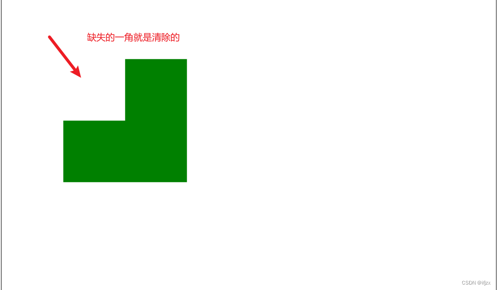

### 绘制路径

图形的基本元素是路径。路径是通过不同颜色和宽度的线段或曲线相连形成的不同形状的集合。**路径都是闭合的**。

- 步骤
  1. 创建路径起始点。
  2. 使用画图命令去画出路径。
  3. 路径封闭。
  4. 描边或填充路径区域来渲染图形。

- beginPath()

  ·新建一条路径，生成之后，图形绘制命令被指向到路径上生成路径

- closePath()

  闭合路径之后图形绘制命令又重新指向到上下文中。

- moveTo(x,y) 

  把路径移动到画布中的指定点，**不创建线条**。

- lineTo(x,y)

  绘制一条从当前位置到指定x以及y位置的直线。

- stroke()

  通过线条来绘制图形轮廓

- fill()

  通过填充路径的内容区域生成实心的图形。

**注意：当你调用fill()函数时，所有没有闭合的形状都会自动闭合，所以你不需要调用closePath()函数。但是调用stroke()时不会自动闭合**


    //  创建一个路径 
    ctx.beginPath()
    // 1. 移动绘制点 
    ctx.moveTo(100, 100)
    // 2. 描述行进路径 
    ctx.lineTo(200, 200)
    ctx.lineTo(400, 180)
    ctx.lineTo(380, 50)
    // 3. 封闭路径 
    ctx.closePath();
    
    //  4. 绘制这个不规则的图形 
    ctx.strokeStyle = 'red'
    ctx.stroke()
    ctx.fillStyle = 'orange'
    ctx.fill()


#### **绘制一个三角形**

```
function draw() {
  var canvas = document.getElementById('canvas');
  if (canvas.getContext) {
    var ctx = canvas.getContext('2d');

    ctx.beginPath();
    ctx.moveTo(75, 50);
    ctx.lineTo(100, 75);
    ctx.lineTo(100, 25);
    ctx.fill();
  }
}
```

#### **绘制圆弧**

arc(x, y, radius, startAngle, endAngle, anticlockwise)
画一个以（x, y）为圆心的以radius为半径的圆弧(圆), 从startAngle开始到endAngle结束，按照anticlockwise给定的方向(默认为顺时针false, true为逆时针)来生成。


    // 创建一个路径 
    ctx.beginPath()
    // 移动绘制点 
    // ctx.arc(200, 200, 100, 0, 2 * Math.PI, false) 
    ctx.arc(200, 200, 100, 0, 2 * 3.14, false)
    
    ctx.stroke() //描边
一个圆的弧度是Math.PI * 2, 约等于7个弧度，所以在顺时针的情况下，如果如果两个参数的差为7，则代表绘制一个圆。

#### 绘制笑脸


        let canvas = document.querySelector('canvas')
        let ctx = canvas.getContext('2d')
     
        ctx.beginPath();
        ctx.arc(75, 75, 50, 0, Math.PI * 2, true); // 绘制
        ctx.moveTo(110, 75);
        ctx.arc(75, 75, 35, 0, Math.PI, false);   // 口 (顺时针)
        ctx.moveTo(65, 65);
        ctx.arc(60, 65, 5, 0, Math.PI * 2, true);  // 左眼
        ctx.moveTo(95, 65);
        ctx.arc(90, 65, 5, 0, Math.PI * 2, true);  // 右眼


### 绘制文本

```
// 空格前为文字大小，空格后为字体类型 
ctx.font = "30px 微软雅黑"
// 第一个参数为文字内容，第二和第三个参数为文字绘制坐标， 
// 第四个参数是可选参数，代表文字的最大宽度，如果字体宽度超过该值则压缩字体宽度 
ctx.fillText("你好，世界！", 100, 100)
```

我们可以使用textAlign来设置文本的对齐选项。可选的值包括：start, end, left, right or center。默认值是 start。该对齐是基于fillText方法的x的值。


ctx.textAlign = "left" || "right" || "center" || "start" || "end";

## 样式和颜色

### 颜色绘制

- fillStyle = color
  设置图形的填充颜色。
- strokeStyle = color
  设置图形轮廓的颜色。

一旦您设置了 `strokeStyle` 或者 `fillStyle` 的值，那么这个新值就会成为新绘制的图形的默认值。如果你要给每个图形上不同的颜色，你需要重新设置 `fillStyle` 或 `strokeStyle` 的值。

- 透明度 Transparency

  除了可以绘制实色图形，我们还可以用 canvas 来绘制半透明的图形。通过设置 `globalAlpha` 属性或者使用一个半透明颜色作为轮廓或填充的样式。

  - [`globalAlpha = transparencyValue`](https://developer.mozilla.org/zh-CN/docs/Web/API/CanvasRenderingContext2D/globalAlpha)

    这个属性影响到 canvas 里所有图形的透明度，有效的值范围是 0.0 （完全透明）到 1.0（完全不透明），默认是 1.0。

### 线型 Line styles

- lineWidth = value
  设置线条宽度。
- lineCap = type
  设置线条末端样式。
- lineJoin = type
  设定线条与线条间接合处的样式。
- miterLimit = value
  限制当两条线相交时交接处最大长度；所谓交接处长度（斜接长度）是指线条交接处内角顶点到外角顶点的长度。
- getLineDash()
  返回一个包含当前虚线样式，长度为非负偶数的数组。
- setLineDash(segments)
  设置当前虚线样式。
- lineDashOffset = value
  设置虚线样式的起始偏移量。

### 渐变 Gradients

就好像一般的绘图软件一样，我们可以用线性或者径向的渐变来填充或描边。我们用下面的方法新建一个 canvasGradient 对象，并且赋给图形的 fillStyle 或 strokeStyle 属性。

- createLinearGradient(x1, y1, x2, y2)
  createLinearGradient 方法接受 4 个参数，表示渐变的起点 (x1,y1) 与终点 (x2,y2)。
- createRadialGradient(x1, y1, r1, x2, y2, r2)
  createRadialGradient 方法接受 6 个参数，前三个定义一个以 (x1,y1) 为原点，半径为 r1 的圆，后三个参数则定义另一个以 (x2,y2) 为原点，半径为 r2 的圆。

```
var lineargradient = ctx.createLinearGradient(0,0,150,150);
var radialgradient = ctx.createRadialGradient(75,75,0,75,75,100);
```

Copy to Clipboard

创建出 `canvasGradient` 对象后，我们就可以用 `addColorStop` 方法给它上色了。

- [`gradient.addColorStop(position, color)`](https://developer.mozilla.org/zh-CN/docs/Web/API/CanvasGradient/addColorStop)

  addColorStop 方法接受 2 个参数，`position` 参数必须是一个 0.0 与 1.0 之间的数值，表示渐变中颜色所在的相对位置。例如，0.5 表示颜色会出现在正中间。`color` 参数必须是一个有效的 CSS 颜色值（如 #FFF， rgba(0,0,0,1)，等等）。

### 图案样式 Patterns

上一节的一个例子里面，我用了循环来实现图案的效果。其实，有一个更加简单的方法：createPattern。

createPattern(image, type)
该方法接受两个参数。Image 可以是一个 Image 对象的引用，或者另一个 canvas 对象。Type 必须是下面的字符串值之一：repeat，repeat-x，repeat-y 和 no-repeat。
注意: 用 canvas 对象作为 Image 参数在 Firefox 1.5 (Gecko 1.8) 中是无效的。
图案的应用跟渐变很类似的，创建出一个 pattern 之后，赋给 fillStyle 或 strokeStyle 属性即可。

var img = new Image();
img.src = 'someimage.png';
var ptrn = ctx.createPattern(img,'repeat');

### 阴影 Shadows

- shadowOffsetX = float
  shadowOffsetX 和 shadowOffsetY 用来设定阴影在 X 和 Y 轴的延伸距离，它们是不受变换矩阵所影响的。负值表示阴影会往上或左延伸，正值则表示会往下或右延伸，它们默认都为 0。

- shadowOffsetY = float
  shadowOffsetX 和 shadowOffsetY 用来设定阴影在 X 和 Y 轴的延伸距离，它们是不受变换矩阵所影响的。负值表示阴影会往上或左延伸，正值则表示会往下或右延伸，它们默认都为 0。
- shadowBlur = float
  shadowBlur 用于设定阴影的模糊程度，其数值并不跟像素数量挂钩，也不受变换矩阵的影响，默认为 0。
- shadowColor = color
  shadowColor 是标准的 CSS 颜色值，用于设定阴影颜色效果，默认是全透明的黑色。

## 图像

### 上传图像

```html
<input type="file"></input>
```

```js
function getObjectURL(file) {
      var url = null;
      if (window.createObjcectURL != undefined) {
        url = window.createOjcectURL(file);
      } else if (window.URL != undefined) {
        url = window.URL.createObjectURL(file);
      } else if (window.webkitURL != undefined) {
        url = window.webkitURL.createObjectURL(file);
      }
      return url;
}
var objURL = getObjectURL(imgFile);//imgFile文件对象
//objURL -->blob:http://127.0.0.1:5500/d17cdcc3-b698-4011-a6d2-f63360cdd22b
// 你可以像使用普通 URL 那样使用它，比如用在 img.src 上。
$("#img").attr("src", objURL);
```

通过window.URL.createObjectURL方法可以把一个blob转化为一个Blob URL，并且用做文件下载或者图片显示的链接。**File对象是一种特殊的Blob对象**

每次你调用window.URL.createObjectURL()，就会产生一个唯一的对象URL，即使是你对一个已创建了对象URL的文件再次创建一个对象URL。每个创建了的对象URL必须要释放。当文档关闭时，它们会自动被释放。如果你的网页要动态使用它们，你需要显式调用 **window.URL.revokeObjectURL()** 来释放它们

### 绘制图片

**获取图片的方式**

- HTMLImageElement
  图片由Image()函数构造出来，或者任何的元素

  - 用脚本创建一个新的 **HTMLImageElement** 对象，使用Image()构造函数

    ```js
    var img = new Image();   // 创建一个元素
    img.src = objURL; // 设置图片源地址
    ```

    若调用 `drawImage` 时，图片没装载完，那什么都不会发生（在一些旧的浏览器中可能会抛出异常）。因此你应该用**load**事件来保证不会在加载完毕之前使用这个图片：

    ```js
    //已知图像路径
    var img = new Image();   // 创建img元素
    img.src = 'myImage.png'; // 设置图片源地址
    img.onload = function(){
      // 执行drawImage语句
        //1.创建的img对象
        ctx.drawImage(this,offsetX,0,imgW,imgH);
        //2.文中的img标签
        ctx.drawImage(document.getElementById("img"), 0, 0, imgW, imgH);
    }
    ```

- HTMLVideoElement
  用一个HTML的 <video>元素作为你的图片源，可以从视频中抓取当前帧作为一个图像

- HTMLCanvasElement
  可以使用另一个 <canvas> 元素作为你的图片源。

  - **`HTMLCanvasElement.toDataURL()`**获取**canvas**对应的data-URL (一串 Base64 编码的字符串)。

    ```js
    canvas.toDataURL(type, encoderOptions);
    type 可选的
    默认格式类型为 image/png.
    encoderOptions 可选的
    表示所述图像质量对于使用的图像格式即使用有损压缩，如 image/jpeg和image/webp。
    如果此参数是其他任何参数，则使用图像质量的默认值。默认值为0.92
    ```

    ```js
    var canvas = document.getElementById("canvas");
    var dataURL = canvas.toDataURL();
    //dataURL，相当于就是src
    img.src = dataURL
    //src-> //'data:image/gif;base64,R0lGODlhCwALAIAAAAAA3pn/ZiH5BAEAAAEALAAAAAALAAsAAAIUhA+hkcuO4lmNVindo7qyrIXiGBYAOw==';
    ```

    设置jpegs图片的质量

    ```js
    var fullQuality = canvas.toDataURL("image/jpeg", 1.0);
    // data:image/jpeg;base64,/9j/4AAQSkZJRgABAQ...9oADAMBAAIRAxEAPwD/AD/6AP/Z"
    var mediumQuality = canvas.toDataURL("image/jpeg", 0.5);
    var lowQuality = canvas.toDataURL("image/jpeg", 0.1);
    ```

- ImageBitmap
  这是一个高性能的位图，可以低延迟地绘制，它可以从上述的所有源以及其它几种源中生成。

### ImageData 对象

ImageData对象中存储着canvas对象真实的像素数据

**getImageData(left, top, width, height)**

获得一个包含画布场景像素数据的ImageData对像

- **`width`**图片宽度，单位是像素

- `height`图片高度，单位是像素

- `data`

  [`Uint8ClampedArray`](https://developer.mozilla.org/zh-CN/docs/Web/JavaScript/Reference/Global_Objects/Uint8ClampedArray)类型的一维数组，包含着RGBA格式的整型数据，范围在0至255之间（包括255）。

**putImageData()**对场景进行像素数据的写入

### 图像模糊

https://developer.mozilla.org/zh-CN/docs/Web/API/Window/devicePixelRatio

https://zhuanlan.zhihu.com/p/31426945

https://juejin.cn/post/6844903759995207693

#### 设备像素比

**设备像素比(window.devicePixelRatio)当前显示设备的*物理像素*分辨率与*CSS像素*分辨率之比，此值也可以解释为像素大小的比率：一个CSS像素的大小与一个物理像素的大小。 简单来说，它告诉浏览器应使用多少屏幕实际像素来绘制单个CSS像素。**

在很早以前还没高分屏的时候，开发写的的1像素也就是实际的1像素（如果不考虑缩放的情况），你根本不需要做什么特殊的处理。如果css中设置100px那他就是100px。

后来出现了高分屏的手机，并且在window对象下面出现了devicePixelRatio 这个神秘的属性，并且还可以用devicePixelRatio在媒体查询中进行判断。这个属性的意思就是：渲染时，css中的像素（逻辑像素）候和实际像素（物理像素）的比值。比如说：iPhone 4S它的devicePixelRatio 属性的值是2，那就是100px逻辑像素等于200px的设备实际像素。原先需要一个像素绘制的点，现在会用两个像素来绘制。

#### canvas 的 css 宽高与**画布宽高**

```text
<canvas id="canvas" width="200" height="200"></canvas>
```

canvas 标签中的 `width` 和 `height` 属性并不是 css 中的宽高，而是 canvas **画布宽高**（绘图区域），当不设置 canvas 的 css 宽高时，canvas 会将 `width` 和 `height`的值作为 css 宽高，而 css 宽高是元素在页面上的可见尺寸

但是 canvas 的上下文宽高略奇怪，它可不管像素比是 1 是 2 还是 3，它就是会将整个 canvas 绘图区域塞进 css 宽高中并且填满，绘图的时候会将绘制的图形的宽高按照塞进 css 时宽与高的缩放比率分别进行缩放（**所以如果缩放比率不同，就会导致绘制的图形变形**）

**但是上面这些都不是导致模糊的真正原因，下面这个才是捣乱的元凶：**

> canvas 绘图时，会从两个物理像素的中间位置开始绘制并向两边扩散 0.5 个物理像素。当设备像素比为 1 时，一个 1px 的线条实际上占据了两个物理像素（每个像素实际上只占一半），由于不存在 0.5 个像素，所以这两个像素本来不应该被绘制的部分也被绘制了，于是 1 物理像素的线条变成了 2 物理像素，视觉上就造成了模糊

#### 解决绘图模糊

创建的图片的时候根据devicePixelRatio 放大数倍（比原照片更大的新的一张图片）然后再用css再把它缩小到原来的样子。因此缩小后的图片不会超过自己原来的尺寸并且不会再模糊。

```js
    var getPixelRatio = function (context) {
        var backingStore = context.backingStorePixelRatio ||
            context.webkitBackingStorePixelRatio ||
            context.mozBackingStorePixelRatio ||
            context.msBackingStorePixelRatio ||
            context.oBackingStorePixelRatio ||
            context.backingStorePixelRatio || 1;
        return (window.devicePixelRatio || 1) / backingStore;
    };
    var pixelRatio = getPixelRatio(canvas);
    console.log(pixelRatio)
    //设置宽高
    function setCanvasArea(canvas, ctx) {
        canvas.width = Math.floor(cw * pixelRatio);
        canvas.height = Math.floor(ch * pixelRatio);
        // 设置canvas的真实宽高
        canvas.style.width = cw + 'px';
        canvas.style.height = ch + 'px';
        ctx.scale(pixelRatio, pixelRatio);
    }
```

#### 反锯齿

`CanvasRenderingContext2D`**`.imageSmoothingEnabled`** 是 Canvas 2D API 用来设置图片是否平滑的属性，true表示图片平滑（默认值），false表示图片不平滑。

反锯齿默认是启用的，我们可能想要关闭它以看到清楚的像素。你可以通过切换勾选框来看到imageSmoothingEnabled属性的效果

    zoomctx.imageSmoothingEnabled = false;
    zoomctx.mozImageSmoothingEnabled = false;
    zoomctx.webkitImageSmoothingEnabled = false;
    zoomctx.msImageSmoothingEnabled = false;

![img](data:image/png;base64,iVBORw0KGgoAAAANSUhEUgAAAcwAAADSCAYAAADHcPDZAAAgAElEQVR4Xuy9B3wc1bU/fu6d2d602lXvxU3uCGNsS+BQYwg9Bt5L8n8kvPSE5CWBBDDIAgPJ45cCIYW8tAe8l4DzKKGHEoPlgo2b3G1ZvUu72l5n7v1/RvasN4rKStom6c7ns5+5tm4553vuzHduOwcBuxgCDAGGAEOAIcAQmBABNGEOloEhwBBgCDAEGAIMAWCEyToBQ4AhwBBgCDAEYkCAEWYMILEsDAGGAEOAIcAQYITJ+gBDgCHAEGAIMARiQIARZgwgsSwMAYYAQ4AhwBBghMn6AEOAIcAQYAgwBGJAgBFmDCCxLBMioAGAn57L9R8A4B+jRKz5JmyQZWAIzBAEHgCAdQDwGQCwsedihlhtDDFjJUz5RfflqHo+CwD/M7PVTwvpZxq2CwDgeQD4OgDsOIdgrEQYa760MMw5IaSXXcM4Ah0CgNsAYPDc83D1iLxvj/KylF6enxvjJWo5V8+zUc+XlP+5UWR4GgDG+0BJJxynIotENg9FFXwQAB6eSkVJKDOa3aRmZzNhyjqP7POS3jVR7wcZfvlZGos75HfL4xNwy0T9YuTf5fan3X9iIUxZif8b0VmlB/UNADiZhM44W5uYidjKnT76gZiJRDiVPiXr2TXKi1t+eUgfEfJLXc5fOoIcp0KYd58j5rnwvMlYto74IJBwk/5P/lCbig0TVWasl30shJkomRJd72h9fqw2owcGo31ESuUmIsxY+0XCMI+FMMd7uBNtkNle/0zElhEmQKyEGf0SiB6RM8Ic/8mW+tgvZtgHAiPM8W0q43PinF1HG4FORJix9ouUEuZkGh85dTTyS2KsL5KR03zyv38JABcAgDQVHD2MHzkVMHKoPXIabdpD8QQxdyzYRnei8qgpKnk6TsJHnjKUpwdHjkImsousntzW8ih95Y492tSxPPWyP2oNU5qJ+FtU+Wi7jTYSlTGQRmXSS1Jue7Rpm5F2lfqFpL90JWNqcrIjzLG+mhlhjv9ASfhMNKKO7kvRfW6sKfLR+tN4/T1awonyjTYFKLc3Vv+OfidN97kYKZ9Ut3RNtHY63dfaZEaYcp//dwDYBKN/dE5EmLH0C0mnWN6rU9I91hGmtH4yEemMJqT0f7dEfSlOljCll+fIL5HR5sFXnNtoIhHFyBHQZIw6JRCnUUgmsvGwjX4YZCyiiSN6HWssG4x8cEbaRX64JOKNxns0rMcbYUoEFq3LyHbGejFI61TResi4RMsy2v/JL6pkreVNhTBHw4sR5sQjTKkvjmfX6A84uc9Ff0hHfzyOZoPx/i+aXGPNN94Ic6L+PZ3nYrRnVH5Wxpr6nMYr6x+KxvpuHZlvLOKbiDBlXSd63lNKmDJjy4vv4y3mjvzbSKAmS5gj100nMtBYf0/nqc/or9PxpimisZAfsItHTFuNfLhHe9gle8Zql9G+1sYjzJFrdSMfgLFeDNEfVZORb6w1jZEvhNFGCNF5JnoA5byTJcyp9MfJbPqZzRvvomdFRtNzvPVh6QN/tBkpeX15vPdI9MtWsru0sTF6XVruCyNfyuMR5kT9e6rPxVh7B8bCZuRzMd6mHSnvRIQ7VvmR5UZOpY61QWoiwpRkmqhfjOSraJ1He79O6uMhlhGmXGH0S2fk1N94jC79reDclJl2jA441pTsyN1So+3QjFZ4LIKIde57UuDFMfN42I73IMq4ysc4RuITq13kad2xPoai15Mms4Y58sEYb+opetv9SGIay67J3mwUC2FG7xgcb4p8srtkJ5qijGN3TJuqRr6QY9loNtqzHmt/kmda5P5uPbfcEctzMZk1zJHyTPW5GI9gEjbKiuodEw1goj8upHT0DudoXhj5/ppol+x4/WK0j/y4dejJEOZoxCl3pNGUH+1LbKwvtlgJcyLim+gIwLS/MOKG/OgVjTb9Ol3CHEmqo9ll4TibLGIZtY5FXCMfqMm+GCRZpbVJidBH2wSSjoQ5chQzcqen/JXMCDP2hyn6BSmPHMeyfayEOdamouj+LkkYSz7J5lMhTLl/S/eR55hHI7yROhePcsRrrBFw7GjHnjMWwpxoFBv9To5lhBkt3Wj9Iu0IUxJoJFCxjmSmO8Ica6QhgzgRocbeFVKXcyS20yXMsRb+oz9yEj3ClElkOoQ5cn1VslCshJmqKdmxbDfe5oWxpmTn4ggz+ikcaevRSGbkCFHe/JauI8x4EeZoI7JYRpgTkVmsU7KjTVnLthtrOWy02ZrJEuZY74BYdJ/SG34qI8xoIeXt9ROtlcmHsMea0hpZfizgJvqiGWtufErgpKjQSIymQ5ix2mWiNZ3oUepUpmSnS5jyl/RYU/S703iX7GjkON7SwmgffbHuDkxRl01as9EfedMhzFj7+1gf+PIoJvq5SMUIcyz5ZP3k2YyxPAxN13ATvY/HW8KQZYv+EJwKYY5mi5QSptR48wjPCyNfmmMtMo8m+MjdjtFfOfLwfDzg5PLRi/rRu2RH200pyXtZGnoJiQXb6RDmdOwif62PHNmNJk+ip2SlNQ55c9Rox1xi3bQz3RdELGuYI7+2x9qYNNpOZRnbkZvd5hphSvpKR6ii17xi2UAW6whTfllLm4NG2xU+0e7s0T4axyKPWKZWRyP/WMpJz8Vo70P5WZlohDjd52Eiwpxoz8lIm05EmLH0i7SYko3eySkJNJYhRuYb60UWnU+qSz6DJx/ungi4kWuVI49ljDx3ONGRmOl2nOmUnwjb6RCmLFesdhmJayznOqWXS/Q5zOjzkPFaw5Q3BUTrIcl2BwB85ZyS6XoOM/rDY6J+KuUdbZ19ZH+W7ZroF+J0+vV0y47UeWRfnM4apixbrP19KvlGnsMcbVObJIfUb6dDmNHkL+sl9SFpgDDWcsx0bSOXn4gwJxrpjbUmG30OPFon6WN0on4hE2a0S0W5jml/WE91SjZegLN6GALTQWCiKZ/p1M3KMgRmMgLjbcScyXqlVHZGmCmFnzU+TQQmmvKZZvWsOENgRiIwG/ZypCXwjDDT0ixMqFEQkL6Y349yvD3W2iADjyEwlxCQpiilS44cFavTgrmEUdx0ZYQZNyhZRQlGQH4RRIeYS+e16QTDwapnCEQQiHWPAoNsmggwwpwmgKw4Q4AhwBBgCMwNBBhhzg07My0ZAgwBhgBDYJoIMMKcJoCsOEOAIcAQYAjMDQTSgjDrSmovgDKusX7bNmFuwM60ZAgwBBgCDIGZhkDKCfPR3JVZ3ppVf1K9/9G3HrQfOjrTAGTyMgQYAgwBhsDcQCDlhLm5ZO1l3h/e9arq6Rfv2bLtBSkyALsYAgwBhgBDgCGQdgiknDDv+/QXn/Q/9NVvah/7/RvLA33X37p1q5h2KDGBGAIMAYYAQ2DOI5BSwqzLWJER/Px1b/nrv7xa/d+vNunrf/WpBwYb5ZA8c944DACGAEOAIcAQSB8EUkqYD+VfvM7987tfD1252sQdbqL6u5+486GdL/0hfeBhkqQCgbqqKqXeVqiwqXxKlZ8PQ1ZWaPOxreFznZWmQibWJkOAIcAQSClh3n/jnT/yPfyVe0hJHoA3APrv/eSlLc/94haEEHspzuG++XjOVTqv3qPjBF6HscLnVAZ8LcvyfVVbt9J6AKlvsP4xh/sHU/0sAsOnC+SrjGuUk+y0QeJ6SMoIsy5rvT5060Vv+R67SwpBM3ypn/6/4+otv/1UvfOwFH+TXXMUgR8U15h1CGcIQM0iEZ1ancYRzBWdx7Ky6AtbtxLECHOO9gymdjQCjDCT3x9SR5jWlRf6fn7Pm6Fra62y2vz+E6Lu7p995qG9rz2ffChYi6lEoA4A90A1t6TSiW2FK4sQhmIRuGIqCN3IH+zS9rV280EU8liEcP2xY6FUysraZgikAwKMMJNvhZQR5qbr76jz1X9ls1hRGNEaOdyguefJ5x/7869uTz4UrMVUIvAlqFYsLFTyTh9RkJXli0GlWEw5rgqE8GnsCZxCR1pOIw34AMC3uXufdGcXQ2DOISCdW5eVls6vy2npHLucZufZE9ctUkKYPylcoxncsOZN7+PfvhQw/gft1E/872HDT7deu8m+tyNxarOa0w2BJysrVTa7RaVShlTBC5auFlT8GuD41SgQPog97gN84+mDGERXGHTOevtHrnSTn8nDEEgGAowwk4Hy2G2khDDrMlas8D/x3TeCN30ib6Ro/O7DId13f3zrQ4fffSW10LDWk4mAtKYNOq8eBF4vfOKCNTTDtIaqlWvAFziE7c6D/OHTBwnhBjQq3H/fgTcHkikba4shkC4IMMJMrSVSQpibrvns3b6Hvvqf4vySf9Ie2Z2g+8HP//uRP//6jtRCw1pPJgKPFdeYAwBmDsLmwPWXryW5meuITrMWu72HcK/9ELf/RCNg1IFF1FH/0YudyZSNtcUQSBcEJM9okSnZH971amRK9ukX75HTzGNa4qyVdMKsq9qoDF1c8Lrv8W9fAQp+VM00j//xgOrXr1xTP7C3N3Gqs5rTCYHNFWuzIQTZgCE7cNvV60hZfi3NMKxDdkcjbutv5PccacQImkKUnvnhtq1N6SQ7k4UhkCwEGGEmC+nR20k6YT6UuXyx54ffeiN4+1XFY6mu2H7Ar/3WT256qOnvb6cWHtZ6shC4f+3N0nRDCQApEa9eWy2U56+iVnM17rOf4tp6TvAfHz+FED3CidyRutd/d5Q5MUiWZVg76YQAI8zUWiPphLnp8tu/7tvytafExeVjao76bKC7/6lfP/LCf301tfCw1pOFwL3X3bGQE4SFgPGC8KXVS4TKoqU017IE9wy2ck0drfz+460I0D4E4sd4Yf6+zfX1lJFmsqzD2kkXBCTf27Iskg9uOS354pbTkk9uOc18c8fXckklzBc2buQOqXP+6v3xf1xD1apxNdE89Ju9xj+9teG+rj22+KrMaktHBO7b+MUVQOACQLBCqFlZKS4qm0eKcipxW08Pf7y1lz9wvAco2gEcaVju699xtKqKniNN5vUnHQ3KZEoIAowwEwJrzJUmlTAfti5b4H7wq68H77iuYiIJFe/vcRu/8fh1D3bu+mCivOzvMxMByVkBwHqcD27U/tnVqyjmV1EMq4TVS4vFqrISUpxXzLX3DnJNHQPckTODSBQbcDDQoH/ngx2BAITz8iD85X37wjNTeyY1Q2DyCDDCnDxm8SyRVMJ8oOamL3h/9K3fiksrJ2wXd/aDdtMvf/bIi7/9j3gqzOpKHwTqYD1vgU6uPUfL81dfuga0qjWAuDVkVVWusKgsj5QX5OKOXgd3ptPBnWofglB4BzfkatD86c2GsEbwm8Do/07nLn/6aMQkYQjEHwEpqpNcqxTdKTIlW//l1XJaivYkp6WoT3KaRX+Krz0mJK54NUcpRfd/7psveh//9o2gU8dUrfaBX+4yPfP2hh8M7XPGVIBlmlEIPA3VitM5YaUuiBXCLVfUCjrFJYjja8XqhZlCVbmFVBZl4o4+D9fW4+HOdHiQN9CA+mwN2mf/2iAA59aCz/39wZPuGaU0E5YhMEkEGGFOErAEZh+VMJ+s3KC6q+nNYDzbrTMtLQ888MXXA1+6eWGs9Sre3jWk+8Zj19T37d8da5lY8tWtX88zj/6xIJXYPJvzq7UAoKUUtMFPf7KWWIyXILWqRlxQYhQrC42kJM+Ie20B3D0QwJ39Aezx7uQ6+3cq//LeLo5SG4fw4H0n3mNr3Ik1E6s9xQgwwkyxAaKaH5Uw6yov+Z24YsE8olUL8RIV9dtN3ifvXk5zrVysdUq+ZbV3/+wgqJRDsZaZKB8Khjl+7xFU39xwyUR52d8Ti8APzdUmvxpMHFGa/Hd8skbMy64FnaqWlOZrxKJsLcnP1uBBh4AGHQIedISR3bmHa+nerXpl2x4QaTcA311/4K/diZWS1c4QSC0CUtxgWQIpfrCcluIIy2kpnrCcluIKy2kWXzi+thuVMKUXmevSFY+F/uWqfwlfuToD+NEdDMRXlMTXxu8+HFD94bXXtG/v+Q7zVZt4vCdqYXN+tZUDtYWCaA184YYaoSxPclZQI+ZaFTTHrCDZmQrk9AByeqh0x332j/nT7XuVr3zwMSDUikTSUr/75daJ2mF/ZwjMZAQYYaaP9cZcw3y6ulrRiXNvC19T8/3AZ69ZQnMs6SP1JCVBLi8ot77Xpnr1w6eMR4/96u6+Ru8kq2DZE4BA3eqbCwmlRQjEwtANl6wSywsuopaMVcRq4khmBk8zjRzy+gE8fkC+AMWd/UcVp1oO83/bcxQwHAeA41tef1a6s4shMGsRYISZPqadcNPPZkv1wtAnL340+PnrrxEuWjz+4cn00SsiCT7VRtW/ffkDzTu7Nz14ZvuONBRxzoq06cp/nQccNw8onRe+/KJl4ryi5STXsoyatJgaDYgadRgCIUDBEEh3rqO3iTty5ozyw31NgOAAwfjAI39++gBCiJ3FnLO9aPYrfv+Nd/5I1tL38FciPmNJSVTsCm8gAoT+ez95Sf7Hlud+cYucZs/J9PvKhIQpNSFFkiDLc74RuOHSr4VuvqIIDNJejTS/QmFQvb3Lxv/pb88p9+5/dHNfY3+aSzznxHvghi8tFVF4OQK8VLj0ggXCwtKFpDB7AdWqAXQaGL4LIoBIhu/cmY4uvvF0l2LHwS6K6C4lKHbUPfvELgk49jKYc91nzijMCDN9TB0TYUa+VuZddonvqlUP+++8sZZUFk2qbDJVxt2DoHr2tUPKt3Y9sqRc+yJzD5VM9MdviwKgW2EjroIBFLp9fjVGfDXFqDq8bnkpWVRWJhbnloFKCVSlAOkOhJwlTEKBO9PZz59o7uP2nejDhOxE4dAO7qUDO0EHArSCUA/b4rZJLX0QY5LMdQQYYaZPD5g06dVlrcoV1lTdH7p9w2dCV19sHiviSKpUVOxo9Cufee1Vzbs7Nz0wcPB0quRg7Y6OwEbYyF0Bzbi71MCJNUsuFpWKixGGi8OrlxSIiyvzSXlBPuUwAM8BcBwApWd/EmG29djxqTa74miTnYaEHcjlbdD/5Y0dXFgV8JtswfrW1vPzUswADIEZjMBwfNhzV+jWiyLOCnyP3RXZMTuWeuqn/y+yrq/e8tuIE4N65+HmGQxJWog+acIcnqJdv56nHu3G0Ibae4Of27CU5FpTroy0i1K59b0W1avbnjIeO/k029iTcpOMKoDk3QdKgQcv8OHrVtRSpeIS4FCtcOFiq7hsvkWcVzRmZ8LtvS6uudPNnWxzQSDQwPU7GxTPvNoQFqjXrMceZvP0tDmTavIIMMKcPGbJKDElwpQFk3zDBq6qfSRwx7WfEi5elrINQdyJNqL6/UvbNG/u3PRg287hNS12pScCdaXr1cEhQWNQ+NXe266upSbdJVTF1wqLy01kXnGGWFYQOVs2UgPcM+DnOvt9uK3XDx7fTq5nYIfy+fd3AifY1UEYure9IW7nddMTPSbVXEGAEWZ6WnpahDk82sxarxeWZH9NuPETXw/eclkxNeqSp2koDMo3Gmyq5999Rruv8bH7eg8MJK9x1tJUELjHus6gAZ9BBM4g/NuGWpprqaVaTS0pL9SJJbk6UpgzZgdCA0Nh3C/97CE05NqN23t3qV58dxcScF8Ywn2PHnmvbyoysTIMgXRDoM668kJZJt/P73lTToeurZ1wOo/ff0KU8+vu/tln5PRDe197Pt30nGnyTJswZYXrytfVhK5etyVw5w2XkPklcat3LEBR1wConvnrQdU7H21ZUqZ7mW3smRld7zHTUrNXpczkCDEHv3RzLS3OrSUmfS3Jz1aRfKuS5FjGnKlADjfFQ26KhlwUDTo+4k+3f6R88f2PMNCOMPAdj+x9pWNmoMCkZAiMjwAjzPTsIXEltkeyV+f4Vi+8L3T71Z8NbVibmSgPQXzDQb/q2ddf0by3Z9MD/fvOpCe0TKrREKhbeX0+QWIe4lB+6FO1q8WKwtXUbFhNsjJ5ajUpiNU8plsp5PFRyQkF8vgp7hlo5E+2H+Le3tmIED4lisKpx957/hRDnSEwGxBghJmeVowrYUoqSkGij7Z6b/HfetX3g/9+0wXDOx3jdVEKqrd2nlL9auuvuFMtv9ncvc8Xr6pZPclBoO7yfy0XAcoRiOXhq9asFCoLV9KszBU0Q88RsxFTkx6POavgDwD4QxT5A4A7ek9zx1pPKT7Yd4oCOiQCOfSjl35/KDlasFYYAolFYNP1d9TJLfjqv7JZTosVhRM2LPngli/NPU9GpmEf+/Ovbp+wMMswLgJxJ0y5tU1X3Pa253ebr6JmQ/xMQAjo7vp/O63v772CxUGMH6zJrKnuhs9XCZQuRgBV4U9cWEUWlC4W86yLqV4DVKcF6T7mFRYAhcIAYQFwc1cHf+R0B9fQ2AEIdmMCux95/ldxjWqTTFxYWwyBaAQYYaZnf0gIYW6xLC9wf+tf3wx8+zNL46228uVtvYa7Hr/mQcehA/Gum9WXGAQkZwWbAdBi2IgOb7SuAAwrCdCVQu2KCmFRaSUpyqugaiWAWgXD97GuYa8/IiBBBNzS1csfb+3BHx/rBZHswsHQTuU7O3bRbr+wGBaLt8LWyMaHxGjFamUIJA4BRpiJw3Y6NSeEMOuWXXm99/HvbA2vWTrO229qYnNNHaB98Jf3bXnt2cemVgMrlWwE6gAwwHoMVf04dMGlqzHHrQaELgqvWV4oVlUUieX5hdJ6N1VwMO66N5EcGJBhRwZcS9cgPtlq4w81DSJB2AHu4A7Dn7ft4FSKkG9wKFgPx0LJ1pO1xxCYDgI/KVwTmV4Z3LAmsjPW+/i3L43Ui8dcsRi1afUT/3tY/oPhp1uvldMsWtPULJUQwrz/9q/80fvYN/6NWjKmJtV4pQQBtPc88X7ethPXxDvIdfyFZTVKCLwAG7mjVUc5k8vE2S+/sJbyfC3FqDa8ekmWuHx+ljivOAvQua4o3yeAjmvtduJT7U7ueLMTguEG3u7ervnzew04jHwhg+hn69us7800BBhhpr/F4k6Ykuu8wJdvfDNwz7+tSJT6yr+826X97pPX1A/tb0xUG6ze+CHwZGWlymczqQPKsCp809W1oklbi3hFrbC0MkNcWGoWywrMw63FSJZSVtzV70VtPT6+tccLXt8O3GdrUG19fycg4tCAxvmD5ned8dOA1cQQSDwCjDATj/F0W4g/YS5Y/0nvT773Urh2hXq6wo1VHp9sBf0Dv/7uw28995NEtcHqjR8CdVlVeiXCOhJU6b2fv6YWsjJqqVZdI84rNIilBQZSlKOfDFkOE2afPYT7bEHUPRBCTs9O3N67U/OXd3dSjAZDwdDAY03bmROL+JmQ1ZQEBOoyVkQGGf4nvvuG3GTwpk9ExfGanCD87sORpQndd398q1z6ocPvvjK5mlju4W/6eMNw/61f/I3v0W9+kWRnxl615Fx7EqMLaZek7ns/faekseHaL+/bF469IZYzFQjUZayQ5uaHf8Ev3VxDirIuAaO+hhTlqMWCbA3Js0764wrZXQTbHATZnAQNOndzze07Vc//bTcltBsrcVf9gXe6U6Era5MhMFUEGGFOFbnklYsrYT6auzLLfcdNb/ru+0J1rCpIZ4ZUL//dGbx6jYnmZcVaDFR/erNdf+9T1zxoP3Q05kIsY0oQqKu6JpeoxBxEUG7wlstWk6LcNZBpXC1mm5U026IgWRmT3xzm8lDs8hLk9FDcZz/InW47oHxr10GR0DMYoaYt7z/PHFqkxNqs0akiwAhzqsglr1xcCbO+vPZy9xPfeyV8aXVMDmWHnab/7qVt/N92f0e8ePmm4OevvS5WJ+7c0WbQ3P+Lbz7y/vNPJQ8u1tJUELj/sptLMOVKAWhJ+Kq11WJFYTWxZlRTiwkTs5GjGYbJe7fwBSjy+QH5ghR39p3gjreeUGzbewIQOkIRPvzoS787MhVZWRmGQKoQ2HTNZ++W2/Y99NX/lNPi/JIpi4Ts55fydT/4+X/LFT3y51/fMeVK53DBuBLmplu/9JT3oa99neRP4B84LIDyrZ129fN/e0az59CjktN0yYk7XZr79cDNl349dPMVReMeYJcMFgyB7rs/fVPRfvj6+m0scHA69+FNn/zsAuBgAVBYEL581TJxYdkykmNZRg2SowIdSPdJX6HwWScGoTDg1p5W/vDpNsWOQ60UyF6O8nsefv6XeyddJyvAEEghAowwUwh+jE3HjTAlp9quO29+y7f5ixeN1zbqs4H62TeOKN5oeATrvX8ZSXb1Cy7/ROCq1Q8Hv3D9uoncQKmeea1ZW/df12627TsRo74sW/IQQBQANkMdCm/sXsZRuoxiWBa+5IL5woKyBaQwZz7VqAA0ahi+T/aSnBgIwjknBt3d3LHmLsXeo12UkI+oEN6t2nZkd36rW3wXyslW5sRgsuiy/ClAgBFmCkCfZJNxI8zNRWsv8T7x3ddCV6we0xce//GxkOoPr76hfGPnveORXJ11Zb5Ye8HmwGeuvS18xYVGGOOwLtd4GnT3/uKLD2//y28nqTfLnmAEpG1ct8JGXLV+AIXyFq9CHL2IAlolrlteLCwuLyGlBcWg4IEqFSDdJ31JDgzOOTLALV0D/MnWfu7AiQEkiDvBG9yh/Mv7O70qEp7Xpwh9GdjGsEnjywokBYG6qo2R9fvQxQWvy436Hv/2FREBpvJ8jCK95vE/RryjqX79yjVylvqBvb1JUXYWNBI3wrz/ljt/7Hvoa98hRTn/BAvyBUD5yrZu5V/e/TW3r+WJevtHromwkzoSNYmfC1637p7gv35yPs3857jCUr3a7/30VUWF9cb6+noyUZ3s78lDoA7qMKz/AEN/FhZXF9QIlNQijGuEi5fmiMvmZ4vzinIAIwCEYfg+jQs3dzn4U61D3OHTDhQKN4Db/6Fy698bIBwOQEZGoL51W2Aa1bOiDIGEIcAIM2HQJqTi6b2pzon0Q3O1yfn/Xf2m7+GvrRkpJW7tBtUfXv1I+daHD9Qf2w+2qgUAACAASURBVPYuQsMzdTFfdVmrVoSur3ks9IXrrxSWzvunzSHq3718Sv/obz/1wMDB0zFXyjImHIG6qiolDGQrQRVUhq6rrQGdppZyuFZcPi9TmF9qIRUFmcNHieTfNCTCHX0errXbwzV3eJAnsAPZHNtVf3lnBxWxS6sF9/dP7jgfvmEa7bCiDIF4I8AIM96IJra+uBDmA9kr1/h/cd/r4avXnPXYIl2UguKDfV7lf7+6Vfv3xgen47uwrnBNpri04p7gbVd9IXRtTRaozp9C4A+dJNrvPvn5h/e88kxioWK1TwaBzfnV2iAhOl0AtJ47rqmhZlMtaJQ14rxik1hZaCRFecazp4Al0pxMzf+cF/cOBnH3YAB39gWx27sDd/Y38P/z3g6KRTsX0tjqO9+2T68FVpohkBgEHspcvliu2fPDb513VnD7VcXxblGx/YBfrlP7rZ/cJKcfavr72/Fua7bWN81X1VlYNt105w+9D33l+6TkrEMK6Wyl8k9vn1G/tu3HqMPxh3hMidXV1WH02p7r/VdcXBe84/oVtODsmU3k8Uu7ZV/a8r+/uGWyo9fZatR00Ksuc7VRAV4TAc7o/8INNSQ/+xKq19aIpXlaUpSjJQXZU9gaO7pmyOYQuQGHiAaGRGR37eTPdOxQPPf2ToqhF4doX33rNrZGkw6dgsnwTwgwwpxZnWLahCkdBwl9+qK3fD/85jppeo0/3kqUv3v5ff7Nnfc93LEz7lv7H86urvBfvvrR0B3XXR9es3TYQ4z61385rn/k99c+4GxsmVnwz15pH125IctPSDYWUVbw5kvXiMW5a6hRt4bmZalInlVJss1T2Bo7BmE6PQQPuQhyugnuG9qPmzr2Kd9o2I8QbUFI2VK/7c+tsxdpptlMRoAR5syy3vQJ07ryQu+T97wZvnqNVfnmDpvyhXf+W/Hx4cc2d+8bTBQUj+cs0zmrFn0tdNOl3wjeckUxd6pN1N39s88+/PHrf05Um6zeySFQt/7mQhKiRYBoUWhD7SpSnr+KWjJWEauJI5YMnmYaJ++sYCwRvH6KPT4Kbh/FPQPH+JNtR/n3Pz4KCI4jQo5tef3Z45OTnuVmCCQHgU2X3/51uSXflq9FnLCIi8vjLoB0pE++dPc/9Ws5/cgL//XVuDc2SyucNmHef8Pn6/33f+FB5V+3H1a93bBlcanu/27dmpzgvVvmXXaJ56qLHgne8aka3Y+fe2HLn3992yy104xT6wfrN1YqeUUFoaQy/Mk1K4V5JRfQnMyV1KgDatKDdI/bFQgBCgYBAiHg2nvPcMeamhXbD55BAPsJQvseff43++PWFquIIRBHBBhhxhHMJFQ1LcKUwtHYa1e+TTEMqt9uuPeBwcaTSZD5H5p4xFqd57tk+WZSkLNK+dzfbqwf2teebBlYe/+AwPA26Pqb7lwsirCEIrIktP7CRWRR6SKxIHsRaNVAdRqg2kn7Wx8b5rAAkkN+FB72+tPBHzvTwe050oFFugdEYQ+/b9seOJZNALaRegB2/Ih12LRBgBFm2pgiJkGmRZiPFlxkCWg0X9I5hKe+P5i6rfvS1myRd35O3dX31ibboa6YNGeZEoHAWe8+dXWInBiopkAupICqhZrlZcKSijJSkldGVQoApRKG7/G6RMmJAQEQCeCWrj7FsZZebt+xPkTILhwI7zT8dc8un14RhlYQ6oG5UYwX7KyeqSHwwsaNkeWIQ+qcv8q1eH/8HxFnAlQdtyX+UYXUPPSbyP4S45/e2iBnuq9rz/l526mpN6tLTYswZzUyTLlJIyB595HIcvGxY+iQNnsdiLgGEF0XXrs8T1w2L1ecV5QHHAaKOZDuibi4Mx12fKx5iD9w0o4EcTv4AtsNr2/fzgUVIV/2ULD+2LFIfMBEtM/qZAhMhAAjzIkQSt+/M8JMX9vMOMmerq5W9PSAQq0GhefKS9eJKlUtcPw6ceV8q7CoLIuUF1ip7NlnDHeH01Uat/W4ueYuF3eqzY38wQZsc2xXvPS3Bn1Q6QHweO/ua/ROtw1WniEwHQQYYU4HvdSWZYSZWvxnVevSmrYTXBqFn9f4/2VDjWg21lAlX0MWlWeIlUUZYklexrCTgjh49xkLONwz4McdfX7c3hNAHl8D7rZtNzz7VkNIQRwAakd96zbHrAKdKTPjEHjYumyBLLT7wa9G/McG77iuIlnKKN7fE/F+ZfzG49fJ7T7YueuDZMkwE9thhDkTrZamMv/IusDgA62BB9Hg+9z1NTQ7s5boNDViRaGelObrSFGOPtGi4367gAaGwrjPJqAh1w6+uXu75g+v7hAxGVCFlAP39W4fSLQMrH6GwHgIMMKcuf2DEebMtV3aSf7owsstIiXWEA9W4cbL15DC7LXEoJfuapKfpSa5ljhujR1dfTTkFrHdKaIhl4gHHR/j0+0fK1/b/jEmuB34cHv9jtfYLuq06zlzSyBGmDPX3owwZ67t0k7yupXX54NCyAeC8gPXX7qalBesJpnG1dRq5qk1gyfWjCnE8Zqkmm4vxW4vQU4vxb22w9yp9sPK9/ccphROAcDJLW89l/SjT5PUgGWf5Qg8UHPTF2QVvT/6ViQ0obi0MmnvY9zZH0FZu+mXP5P/8ciLv/2PWQ7/tNRLmoGmJSUrPCMQ2HTJdWVYVJRSRMtCn7rkQnFByYUkO/PCYUcFJj2S7om+kD8I4AuAdMcdvaf5E62n+A/2n6ZADnFUceDhl54+lGgZWP0MgfEQYIQ5c/sHI8yZa7u0k3zTtZ9bRCmtAkCLhCtWLxYWli4hBdmLqVaNQK8ZdliQ8CsUBhQKAwTDwLX1tHHHW1r5nY1tGNGPxTD9uPRPuz82Qzk5Clspc2KQcGuwBkZBgBHmzO0WjDBnru3SSnJKKbr/9i+vBBEuQBitDNeurBCryirF4rwKUEuOCpQg3RN+SU4MRBHQWScGPdzRMz2KPUd7gJJdOEx28W9v353Z7RRzYaVwKyTHhWPCdWYNpD0C0vMhC3n/5775YmRK9vFv3xgRXpfwJf5RcdI+8Mtd8h9Mz7wdcWLwg6F9zrQHNskCMsJMMuCzsTn5ZfDgHd9cK4poLQBdG167rEBcNj9frCgsAP6cowLpnsQLn+6wKY422bh9x20gits5b3i7/uUPtgc0EM7rhvCXYV84ieKwpuYwAowwZ4fxGWHGx46objgMcp3kRRXqASQPcdJv1l91sJ6HUuDBC3z4xup1oFKsoxivFS9YlC0sKssRywuyAaOznn0S5KxgLJC51h4nbupw8SdanBAMNXB254ea/3mvAWuQT40433c6d0UC6s56QwEMuy0898DPib6ZTjZlhJlO1pi6LIwwp45dpGQdAF4MG9FQdTM275tb62N1paVqjdOiEhVBtefT16yjRkMNKPkaYUmFmcwrzhRL8jKHCTOBzgrGMiHq6vdxHb0+3NLtQ77Adq7Ltl353MvbIaR0AYCr3v6RdJ8L1/AH3bGNG1HV1uG125R80D1ZuSHiIPWupjeDcwF4Wcc609JIvK7AA1+MOCsIfOnmhanGQfH2riFZBt03Hov4s63v27871bIls/269esju/jrt43uc5oRZhwsUgd1OL/6NS7ozMYqUz/p3vcpsR7q50RUDCk26ZCH6BU80oXvuK5GsGTUIq26RpxfYhDL842kOM8QB4inVAXut4dQjy2MewdD4PQ0KFq6PlT+9sUGnhCbT6m0PzZHHE1LPn5v3bgRVw0MoGNZWfSFrVsJSsEMCCPMs92YEeaUHueEF2KEmXCIzzZw78LLLcpQ0MJhzhLOMGGSqeeQ0YhB+l7hAUSkmLVTYJzTrQG3X0tDfo1YW72UFOcto5aMpaTAqiG5Fi3JtiRha+zohkYOl4CH3ALYnCLuG2rkmtoble9/1CiqFC6k0jqJUTurR5hcODz8QYyHXAgPDCHk8CABUD+HhL7NZ3aeP4iXpOeEESYjzCR1tSk1wwhzSrBNvlBdxfpKAKGSIlwBZoOaZppU1KBVU46j0g94PGsJE3xBFQoEVcgfUglrlpSIi8qLxaKcEpphVNAMg4Jm6OMYx2tytkHeAEFeHxm+t3W3c8eb2/hdh9sQx/tAyfmogvdNrsYZlJsAwoQAFSlCdifCdicghxNhwEcQEo882LTjaLK1qau85Hdym+KKBfPkNNGqhWTLkuz2UL/dJLfpffLu5XKa5lqTuxNuFMWRI+JWFrR3/+xgJItKGZmqTTZeyWoPBcMR/Pm9RyIzrvXNDZeMJgObko2DZerK119IsbgKAbqQZJr0kGEwUKNOTzlMgefJ8H2WXigQVNBgWIGCIYWwekmGuHKhSagqywC1ClG1CoFambo+JgWVls5khgXgTrY4uEOnHfzeYw7gcAgQDg/fZ+mFCEHDZEkIQkMuwDYnQkNOAIq2AUffr29q2JZs1RlhnkWcEWaye97Y7THCTIEtpBEmBjqPgjhPzLLk0AxDDug0OcSk14BBqyF6jYZq1JhqVRikn7RXcZhGUscl8YKJhgQOCWEOQmGelhZohaJcHS3M1lIFj0CpAJDuqboE8eyZTEEE3DPoxdIGoLZeL3BYoBgJCGMxVaIlpN1AiKJAkKJQmCKXLyD9wOkJYqfbgWwOJzfgcCCgjQTQofqW7Y0JkWGcShlhMsJMdp+bqD1GmBMhlIC/31tZm6UMQRbikFUstJYTg66CqpXlND/bQnLMFmo2WEmmiaMZRp6ajVyiQ1wlQMWxqyQiBkHEiAAiBq0SjDoFMegU546RoEQFio5JR0IBCAGgFJDbG0Zufwi5PGHAmMCwxGh2bcxyeSlyeQhyeQkedDpwr22I6+ofAq+/jbO7W1F7dxtg1AlhobO+66POmDCMY6Yfmqsj05KuS1c8Jlcd+per/kVOh69cnRFpkk+86+E4qseqmiEI8LsPB2RRVX947TU5rX17z3fk9Cb73o7R1End1/8MATcWMZ+GakVPPijUflC4q+cvRVr1UoLxUnFBcTEtyi0iWRnFNNeiELMzlTQnUzF8xEI6kyjd2cUQiBMCyO4Skc1BsM0pop7BHr6ttxsfb+1BYeEQcvkPqj8+fgiHkS9kEP2bu/clff2WEWacDM2qmRYCjDCnBd/0C78AG7leOMDb802cUFVZglXaYkEBJbSssIhkZxRTk6GIZJnN1GIy0wxDBtGoFKBVK6hGLY/Ezh7sZxdDIBYEpJEzPTd6DoREHAgK4AuKyO11IYfbhW0uFxpydXK9tg7c1CWNKFt4j79FtftkC6dShHyDQ8F6OJb09VtGmLEYl+VJNAKMMBON8AT1RxwXQDNu3VCewXG6DIQgQ8i3FIFGXUyUfBHNthSC2VBIdJoimp2pIRaTlmYatVQxvM539scuhkAsCET5y0VD7iCyu4LY7gwil7cHOdw9uN/WA4FgG3b5W3H/YCsXAju4/HZ06oSddvuFxbBYTLUf3aerqyO7pztx7m2y2uFrar4vpwOfvWaJnKY5lliQYXkYAhEEkMsbSSu3vtcm/0P16odPyWnj0WO/ktN39zWeLzAGjmxOMM4dbJg8N25EQ83NuBvlFhFEigBwkbiwZCG1WhZQo3ahUF5goiX5RrEgy3TWMbkqOY7J46wrqy5FCEi7f6UNTdK9e9DHd/Z5UVuvDzndTVyvvYk71daERPEMIuSM/tTpMyqDT7A1FYr1MLr3klRowQgzFajPrTYZYc4Ae0teVTYDIIk0D7bbrQpQWgjFFrGiuAQsphKqVZWIRbl5JDszj2Qac6lBp6Z6rQb0WjWoFEAVCgTKFO4snQEYz0kRBQEgLO34FQC8gSDy+IPI4wtyDnc/9A8N4J7BfuzxteNBVxvX0tWGQOgTAmJfTn9jr6rJRLphn5hO4cwYYc7JXpxUpRlhJhXuKTc27ORaIk39sqs0do7TYkBasTA7G5s02VShzoZ8S7mo11WAVlVBciwZJCvDDJmmDKLXYNBrEdVp2ILmlOGfpQX9QUCBIEAgRDm7w4X6HS7cZ3chr78Vu7zNuNfWCmGhB3mCPdDX10MReAwYPP53B7wA28hm6QRmCtzhTdYamy3VEd+qoU9e/KhcPvj56yM+ToWLFkd80k62fpZ/diOAT7VFzryrf/vyB7K2mnd2b5LTD57ZvmOqKLAp2akiN8lyP7KuM7iox6gA3iBUL1xC9JploFEtEReW5ZGyvFySa82jFhMmZiNHM42MMCeJ72zPjtxeAI+fSneus38At3YPcCdaB7A/cATZPUeUx5qOIEIGRYXCtvnUtsGZigcjzJlqufSQmxFmethh2lL8R+EajdEFGkHh08DyRSVg1pcQpbKElhcUkTxrITUbC0mmwUjPegkyULWKpxoVB2oVd/YYyrmIH9OWhFWQ1ghIu1+lSzo7GgwTFAwS8IckF39ecHp9yOnxYruzi+u1d6Lmji4uEGzFQ+5WxbHmVkEJbi2A+/snd5z3dZbWyv6zcIwwZ5jB0kxcRphpZpCpiiPFjXQVBhW5Acy7luVkUqPRjBGfSfKtpWDSlVKVslTIMudRaV1Tr5VGm0piNqqo2agE7lwAZnb0ZKrwz5xyw8dFzh4bwS63gBweATu9YXC4B5HdOYB6bYMQCDZzbt8ZrnuwWQyFbJwvOMg3d9o0KBzsFI2hn8+S0Fl1Wev1suHI8pxvyOnADZd+TU6Hbr6iKGJcg3bm2JlJOj0EJJeX5y7V27tscpr/09+ek9PKvfsjU/qb+xrjEmyATclOz2xTKh0ddBnmZVWKGqhECFeKC0oqxJzMSmI2VpCiXC0pzNWQPKsWeO7ssRPpzq7ZjYDkmeichyLcZw9x/fYg7h4IoQFnG3T1tnPH29qwIBwXg8ETqmMnj/tDimCBxRm4q6lp1sWXZIQ5u7v6tLRjhDkt+GZU4Y2wkbsCmnF3qYGD0oxcAFWuyNFcUl5UQq2mYqLXlJD8bCu1mrKJ2WSlOq2K6jUq0KlVVCJNyWUYI88ZZfNxhR0+V0kAiSKALxCWftgfCKEh9xCyu+zcgN0OLm876rV18M1d7SAKXWIo1En2N3dpNBDu7obwb2Df+U/uWYIMI8xZYshEqMEIMxGopmedwwF9YSOuggEE6zP0AFiPlCo9sZrzRJ0mH1TKPDE7s4yY9KVUqyyjuVYDsZqNxGIygEqJqEYJoGYbBdPTulOQKnQ+qgqyOX2czeGFfrsP+wLtyOHuwP1D7SgY6sT+QAfpGeok4bAL+YLOvJ4DriNNJpKXZkdGpoDApIpsmXdZJPSS76pVD8uF/XfeWCunSWURmz2bFKrpnxl3n9/Lpnr2tUORqde3dj0ip5eUa1+U07du3Rr34AqsU6VRP3m0sjZLRCorApIVWly+WMzULaEa9RJxQalVLMvPEguyrVSvBdBr0PCdXbMCAeQfPi4C0h13DThwW7eTO9PhQG7fcWxzHudOtB7HGLooQZ2LyzVdR6uq6Ob6+hlxTCQRBmKEmQhU079ORpjpb6OkSlhXucEI4DfyiDeEFxaXkkxdqahSltKy/AIxL6uAZpoKqFGro0aDluo1WlArMVWd/UXChbFPoKTabMqNSSG4QmEKQYEijy+APF4/cvn82O7qwf32Hq69u4d6A238kLsVTnW2UU6w81Rho5+6wH6OLKWmZ22c1fFwZYQ55V43owsywpzR5ou/8E9WblDZAFQq8KhC5RWWsElpRTxnFfOs5dSorSAaVTnNsViJOcMKJn0WNes5atLzxKTnh4+eyL/4i8ZqjDMCyOMjyOUj2OMjIK1VDgwN4T7bEAoEz3BO7xnoGWzGoXA/cfv7FQO9/Sqq9odEwV+371X/uW+iOUmWI81Ql7UqV/4/YU3V/XI6dPuGz0TSV19sjpRjPpvj3JMTW51iR6M/MvX6zGuvymnNuzsjjggeGDh4OrFSnK+djUeShfQk26krXa8Gh0MNCoWaVpUtEvWKRcDxi8jCsmKxIKeEZpmLSa5FSfKsCpJtVp49p4nPntdkV9ojgGwukbM5RDTgEHGfrRu1dvdwJ9u6IRg6wrs9RxQHTxzBlPOEkN9dP3DMk/YKpUhARpgpAj5JzTLCTBLQM70ZKcbm6ZywUhfEivCKBYVYqygkGBfSeUVFxJpZTEyGYpothQwzSiHDzFKoMKpVK0CrUlDp3KYUb5Od20x9Nxg+U3n2qAgKhs6G4QoEBeT0urDD5UI2pwsPuTulHbC4ub2TCwpt4PO1qfefbneHQwGV2eKvb90WCXibeoXSSwJGmOllj3hLwwgz3ojO0vqij56g+WajoNSYEK8wCtnW4ZBhSMEXijnWImrWF1Gdtohkm7TEYh4OGSad2aTKc2HDZik+M0Yt6aiIcPbIiBSKCw+5AmjQGQSPt0dar+T6h3ogGGoFl6eN7x1qxWJwSHCEhvjjjUOgyxagFYR0ijKSzrjXrV8fiZFHPdqNkSnZDbX3yung5zYsldMk15rO6swp2ZDz/CSKcut7LbLyqle3nQ/Fdezk0/L/xxKKKxEAsvm7RKAa5zqHj6Fs3IirBgYQBNSFJMQVIUwLxQVlC0mWeRE16BaSigKTWJJnIgVZJiodOZHChrGjJ3G2xBSqk0JwhaVIIwLgngEv7hjw4rYeL3K4m7h+WxN3srWJUtKsDApnNM0tzekYimsKWqekCCPMlMAel0YZYcYFRlbJOQRQHQA6tnEjWnzSaRF4hQVhkkkqSkqJ1VSCtOoSsShnOGQYzTTlUoNWI4UNI3qNBpRKoFK4MKWCfRwlqztJBClIobhEirxSGC7p5w0ih7sfDQz1467Bfuz2tmO7sw2d6WhHlPRhIdRn6TvRl46huJIF23TbYYQ5XQRTV54RZuqwn60tD4cNu3vZVVq9QqWhQLVCQXY20muyiVJxNmSYUVcBalUFybVmEKvJTM1GMzFIIcP0iEqhw9iVHASkUFz+IAXpXKXd6cSDDhfqHXRhX6AFOb0tXJ+tRQrFBb5gD9832AsYeTR20evfN7NCcSUHzOm38rB12QK5lsBVtZFD7oE7rv2U/P/CxcuYJ5DpQz2pGrgTbSQy9fr7l7bJac2b53fAPti2c9ekKk1wZjbqSDDAiaz+R9YFBh9oDTyIhvCKxUtIhm4pVaqWiItK88TinHySJ4UMy8DEYuJopokRZiKNEVU3cvsouLyA3T6KuvoH+NaufnxSCsUVPIJsjiPKw2eOiBy2qYIh231deyKOo5Mk3pxrhhFmepqcEWZ62mXWSiWFDMt2e9QBBa8hyytLwGgsEVXKElJRUEhzLEXEbCiimSYDMRuM1Kg3gEbNUbWSp2olN7yLVg4bNmsRSrBi/xCKK0QgECRICsXl8XmRy+tFTq8X2R1duHewk2/p7qS+QBsecrVyJ9talSJyO9XE858zOBRXgtGNW/WMMOMGZVwrYoQZVzhZZRMhcD5kmJ33rVhmDit1mbxaaQ7nW0pBpyklakUpzbbkUbMxlxp1UugwFck0KanZoKLSkRM5bNhEDbG/j45AVCgu5HAL2OEWkNMTxg73ANjdA1yfbQCCwWbs8jaj3oFmCIds/JBvUHWixebQK0IabihYf+xYiMGbPASiHboLS7IjYcKEGz/xdVmK4C2XFctpatQlT7jZ2lKUo3TlGw2RGRXV8+8+I6us3df4mJy+r/fAQLpCwaZk09Uyk5QrOmQYWWCuIEhRCTxUkAWllTTXWkHNhkqxWAoZlq0dDhkmHT2Rw4ZNsi2W/RwC0aG4em0h3DcYxF0DITToaOO6Blu5E61tSBRPgD9wXHPyzIlgSBm0ZNqCszEU10zpE4wwU2ApRpgpAJ01OS4C0ec2g7kZuQqNOocAzaWVhcXEYiwBvbZYzM/KolZzNjEbsv4xZBgPoDgXNozhPD4Cw6G4xLPhuHyBMPIFQuDzS6NKO7Y57bjfbgentwP329v5Mz3tSBC6SCDcyR1p7TJpcfhEZ0iYjaG4Zkq3YYSZAksxwkwB6KzJcREYGTJMwAodoqCHgpw8olLkg0qVR3LNpdRkKCNqVRnNzTSSrMyzIcPUSjR8ZlPDNgpO2M2kh/9cOC5kd3nRgN3HDQ55kcffjlyedtRn74BwqJPzBDvwgK2ThpFL9PhcczUU14R4pkmGuvJ1NbIooavXbZHTgTtviIQSI/NL2IxcjPZCXednVVXP/PWgXEz1zkcRbJeU6V6W/z8RobhiFHVS2VgHmBRcMy/z5vnrrRAKWinGVmHJvCXUbFxCteolwoLSLFqWZxULsrOoQXc2ZJh0Z9f4CJw9MgLDR0a6+h1cW7cDN7U7kMd/nLM5j3Gn2o4jjnaBwHWzUFwzpzMxwoyvrRhhxhdPVluSEPjRgnUGFyVGRQgMQtWCUmrWl1K1slSsLCgQcyyFYDYW0AyDlhi1OtDrtKCRwoWpMFUrzx5DkXbSzvVLCsUVDFMIhSjyBPzI7fWDyxtAdmcP12fv5tq6eqg/1MY53a34dEcr5mAIiZydheKaOR2HEWZ8bcUIM754stqShMA3KzeoCjmX0k8VqmBpnpXXmyxEzVlpnqWcGDTlwyHDsjKzqCXDSqWQYRl6nmYYWMiwKPsgt48gt5cM3x0uOxpwDOG+ITv4A9IO2DO4b/AMBIMDnMfXj/sGBkI05FeJWhaKK0l9PN7NPJK9Okeu07d64X2Rqdrbr/5sJL1hbWakXT7iwjbeosyo+viGg5FQXKpnX39FFl7z3p7zobj6952ZUUqNEJYNH2ay9SYpuxQyTON0q0QFr/ZXFS1CWs1CwuFF4oKSElqUW0ysGSUkzyqFDFOSnEzl2XOa585rTrKt2ZQd2RwiHnSKaGBoOBQXbuvt4k62dkMofIR3+o4oGk8ewcB7QtTtZaG4Zr7lGWFOzYaMMKeGGyuVpghIIcN68kGh9oPCu6K0kKrVBUTBFUJ5YRHJyiymRl2xmGs1D4cNMxvMRKdRglYjhQ1TzrXpWSkUFwqEBAiGw2jI6UaSe7u+ITd2uDpQr72Da+7qwILQosvrPAAAIABJREFURh2+du2RM22hUDAIGRkBFoorTTv/JMRihDkJsKKyMsKcGm6sVJoiMDJkGEU6IygURiE3owh0qiKqUhWK+VlF1JpRKBp0RTQ7U0eyzTpqydBF1jLnwpompYClNUqnx48c7gAecvWgXlsv19HbQwPhNuQNtOKe/jYsikPYGR6CowccLBRXmnb6aYr1wsaNnFzF0VbvLXLaf+tV35fTwX+/6YJIM5IzkNl+yR6uAED11s5TsrqqX239lZzmTrX8Rk5v7t7nmy2QsCnZ2WLJSeohHUPZXFeHFh87hk51eQuFMCqgQAtDy+YthPzsBaJRt1CcX2Km5YUZYmG2eZgw5d8k25pR2c+9DPDAkBv32Dxcd78b9dvP4LbeM/zHR89QQpp5gTZDa3uzTesUa5tWCrfCVnFG6ciEjRkBRpijQMUIM+b+wzLOHgSGo59IpIle25/JobCFYj4zuKB0OcnQraBq1TJh2TyLuKDMQkrzLSC50pPWM6X7bL7OvQy4rn4nbul2cmc6ncjjO4L6Bo9wB04e4SjpBSL02vtO9GU2FYoA20g9QCTqwmyGZi7qxgiTEWY0AmyEORffAud1HibN+urrNEqO13ipVwvFhReBWn0RxXh1+KLFWeKy+VlkXlEWlXYCSq70pN9svaKcqXMtXUPc8dYh7nDTEAqH9yCPf4/6cPNeEYLuIKLuCxq0rqOwlW4GoAhAgpFdcwiBTVfc9rasrud3m6+S09RsmP0oSC4hz126u/7fTjltfX/vFXL6O527IjtmZxMgjDBnkzXjoMsDl99eSxC5FAGqDV96YY6wqipXXFSeA0oeqEIB0n3WXlGEiU+02BQHTg/yuxptlJIPFSJsy/hw34dOo1NcfGyxyKZhZ20viEkxRphnYWKEGVN3YZlmEwIvwEbuKBzlTIUmzn7x0lqiwJcghGvDq5dkCcvnZ5EFJVYqbWaY7SNMyajylOyZLgc+3uzkDzc5IBTejry+DzJffudDMaQIai3OAHOgPpuegMnrwgiTEebkew0rMSsQqIMqJWSBEoJIKdxyeS3Rqi+hPFdLVi4yC4vKMsWKokzA585kSvfZfkm7ZDv6PFxLtwefaveiQHA77hv6UPnHN7aDKuABAA87bznbO8E/67fFsrxA/l/3t/71TTkd+PZnls49NM5qrHx5W6+su+Gux6+R0w86Dh2YjZjMgbffbDRbfHX6SeEajdPl0igUvMZ3+ydrSYahlqoUtWJVuYnMKzGJZfmm+LaY/rXhHlsAd/cHcEdfALl8DXxHz4fqp19sQJQ6BISH6h0HHemvBZMwnggwwvxnNBlhxrOHsbpmBALfL682GZDOKIBgCn766nVilrkWdOp1pLRAJ5bkSTE055xXdjQwFMaDQyHcNxTGQ86PcGvPbuXL2z6iBHqxEvXU730j8mU9I4zMhJw2AowwGWGyEea0H6OZX4EU0YRTkixKFFbfp69YKxblrAOjfi3Jz1KS3EwVybGc9fQzhy7k9IjI7iJ4yCWiQcd+/kz7fuXbO/cDwq1IxC312/7cOofgYKoCQN2yK6+XgfA+/p2tcjq8Zumcez5k3bmmjkjf0D74y4jf3S2vPfvYbOw0jDBno1UnqVPdyivzIQz5gCE/9Okr1wjzStbQTOMaYjFhas3AJNM4yw9f/jNgyOMD5PGDdMc9g0e4k62Nivf3HKFATiiQ4vjmV/94YpIws+wzHAFGmP9sQEaYM7xTM/Enj8Cmy26rAIAKjKEieOWaleL8kpU0J3MFydBLMTIxNenn3IcVCpyNeSndcUffae54y2m+Yf9pDPQQEuhB/H+FhwDqof7sGUx2DnPy3W7GlWCEyQhzzr0IZ9xTmgSB77vpziWIkqVA6ZLw+uqF4sLyhaQweyHVqhHVaQC06rnXT8ICoLAAEBYAt3R3cEfPtCt3NbZTSvciSj4qPv7RXvO+ciI5L2CefpLQSdOgiftv/8ofI1Oyj33j3+Q0tWSkgXQpEkEQzk/J3vPE+/I/8radiOyYvavpzWCKpIt7s3PvRRh3CGd+hQ/c9rVVIhIuQoBXhdctLxWWVJSQ0vxSUCqAqpQg3efcJZ3HlDyaUArc6Y5+rvFUP//RkX6g0KAQxA+tO043qEz9pHvfp8R6qGeu8eZAB2GEOYqRGWHOgZ7PVIToyCXB9UsuRrzqYoToxeGLluSLVaUFpLQgnypkd3iz2LvPWH1BIsxzP661245PtA7xjU12EIQG5PF/qHrlvQZNSB3szOgL/bypadZ8QbNHY2wEGGEywmQjzDn6hpBiY57OCSt1QawIffqytaDTrKM8XiusWJAtLizNImUFWeedFcy5PT9ne4UcuaS9x8219Li4021u6g81cINDH2r/8E6DqA54dQDeu/savXO0G816teuyVuXKSga+fON5ZwX3/NuKWa/8JBVU/uXdLrmI9rtPRqZk64f2N06yqrTNzggzbU2TWMHqSterweFQg0KhDn56fS0y6muJgq8lSyszhAWlGaS8YA4vzPwj9rh7wI87+/y4vdcvOTHA3X0fqv7r1QaBUqcBYccPhvY5E2stVnuqEGCEGTvyjDBjx4rlnGEI/GjBOoPLS4wKHgyBW66ogezMGqJR14jlBXpSVqAjRTn6GaZSwsTF/UMh1GcL4T5bCDk8u3F7zy7Vyx9+hATSFwZl36NH/tqXsMZZxSlFgBFm7PAzwowdK5ZzhiFw78LLLdpQOFPA2BK89cp1pDCrhhr068SiLBXNz1aRXItqhqmUMHHRkFvEdqcIdqeIBx37uJbuj1Vv7PiYImjHAmqr37G1PWGNs4pTikDdgvWflAXw/uR7L8npcO0KdUoFS8PG8cnzvjz0D/z6u7KID7/13E/SUNwpicSmZKcE28wvVFe1PhfCkAsYcoO3b1grVhauo5mmtcSawZHsDEwtGbM48OXk7IfcXgC3D6Q77rUf4k+1HlK+s+cQJfQUx3On6t945tTkamS5ZwoCjDBjtxQjzNixYjlnGAKbLtlYBgBlGItloQ01FwgVxdUkO/MCyDAgYjZIzgrm6E6fUQzpDwDySY4MAsB19Z/kjrecVH6w/ySl9DCmtBG/9PvD5wJJS4WZE4MZ9iyMJy4jzNiNyQgzdqxYzhmGwL03fL4KU2ExJahKuHzVIjK/dDHJz1pE9VpE9RrJYUHqZx+kXaoo9WJIzgsgFB52ZMC1drdxR5vbFA0H2xCQvRRg7/LQ4N6jW7fSc6TJCHOGPQvjiXv/rV/8jfx336Pf/KKcJtmZqddSDnguSZIuz8k5VHTf++k7MkAljQ3Xyukv79sXTj1wU5cgDd5GUxeelZw6Ag9s/PdqAeMLMaXV4ZoV5eLieWWkJLd82FGBWnnWYUEqr3R6GRDpTCYBIMNODPq4xpN9il2H+yiQBoWIthcc3dFgLi8nEmkyrz+p7DTxb5sR5iQwlT4sGWFOAjCWNa0RqAPAPVDNLal04oGaDRcRjltNEawWLlpSKC4qLxRL8wtBwcOwwwLpl8xLIqVznnVQIEjAF6DIHyRUo8SgViOqUmDAGIDjALgkzxZHOTHAzd02/kSznTt02oYEsQH83u3KV99ugCANQRaE6o8dCyUTNtZWYhFghDkJfBlhTgIsljXtEfgSVCsWFip5p48oxJvWriUa1VqKuTXiBQtzhEWlOaS8IJsOkxKGYXJK5iWIAKIISBABDblEbHcJUmgtYtJzxKTnaYaBo5KLPonIk+2qb3iSVRplAuD2HhfX3OnkTra6IBBqQIOO7RnPvbM9oAEfAPg2d++T7uyawQg8mrsySxbffcdNEWcFvvu+UJ1qtZDDHRFB9fLfI+d/g1eviQR5p3kR8VMmrupPb0Z2juvvfSrixOBB+6GjKRMqDg2zKdk4gDhTqniyslJls1tUKmVI5bvhslrRoK8FnqsVl80zC1VlZrG80JwyXSRn56HwWWfn3QNhrnsgjDv7wiTPqhBzLAqSk6kAtQqoRgXSPVUX7uz34c4eH9fS7UMeXwPusX2o+f0rDRhEVxh0znr7R65UycbajQ8CjDCnjyMjzOljyGpIMQJ1Wev1oPPq1QKvd996RQ2xZNSCRlUjzCsykPICvViUa0iqiNIUjjSiFESKvP4gcvuCyOMNIqfbhgddNtRvs1GLyUwzjGZi1JmJUasBg15N9RoNKJVAlTwCpSKpH3243x7EPYMh1D0QRC7vLq6tb5fypW27KQ/9Goz77zvw5kBSMWSNxR0BRpjTh5QR5vQxZDWkGIHHimvMAiWZggKZw7d/cp1YkFVD9NoaUpSrJgXZapJnTe5hbCnepD9IpbiT2O504oEhF+q1ucAfbME+fzM36GghRkMR0aiKQa0sormZZmLNMFOz0UwMGgx6vbSjN6lzx8juELHNJeBBh4hszr24uXOv8s0dewmhnaCAjkc+fOV8CPoU25s1PzUE6strL49MyT7xvVfkdPjSat3UapxeKe5EWyQajup3L22Ta+P/tvs7clq8ePkmOR38/LXXyWnh4mUpmY7hjjZHlNbc/4tvyv945P3nn5oeGqktndSv89SqylrfXLE2G1M+hwLNDnzu2nVCecE6mmlcR7LNPLWaOZJlTupOH+T2UXB5Abt9FHX1D/AtXf34ZOsACoQOgcNzkGs8dQjmFS8S9foqUCkWiQtL80lZbh7JteRTSwYmFhNHM03JJUyXF5DTA0i699kP8KfaDvBv7TyAEG4SRKHph9u2NrGeNrMRYIQ5ffsxwpw+hqyGFCNw/2U3l+AwLeUQlAQ21FYLlUUXUmtGNck0Ypph5KjZkBjyido0g4IhgoJBAv4QQR6fF7t8XuRwe8Hu6MK9g538me5OFA43E6erGR1uaoaKkiLQ64pAqSwS5xUW0RxzETEbiojFaKRmo4EaDQZQK3mqUXNUreSGz6NhlLBzacgXAPD6Qbpz3QPH8bGW44pt+04AoUcwpkceeuWPR859hbLzmCnu71NtnhHmVJE7X44R5vQxZDWkGIHN192xkFCyiABaKHxi1WJhfvESkmddTA1aTPRaBAZtYmYcoo9lOD0CcrgF5PAIyOn5/9v7FuC2rvPM87gPvN8gSPAFPvQiLdmyXpYjKmrsxOskdhJn5ewkaZo63Uwnu9uZbdpknMRLyo7tzHRab9LNNu22TdNmtontNMnacWwnTvygKL9oWZIp6sEHSIIEAQIg3sB9nbNzSV1IthubkAEKtM+d4eAXdO5//vudA3y4557/+5dQKrMEY6klVJYnYS43BReWpoCkLWmFckI8G0lIoWYXsthdwATdNOgNQZupi5qEEAl4m4nb0UIdlhbqcQnE7RCp2yFQY4dvvVJPdAEDSVkRMkDh+TA3Nj3NDR+fhpSOAgJfPgeSo32r+Zg6YTLSvMJz/nK6/8btX6wsGxbu/tJ/MXyQoO9y3K39nEvSMoTHR1LGiaYfP/nPhm1+8cR9hv21xeOV5+Ur+xMuHHR7cyXm8m3vr9jybTe2V9rYzGuP63JaShezq6xffqCy05ifPXWr4e7I009fTNy8nD6uwDn1+YK8AhfCunx7BO76T3+8k2rqtQCincqBa3rVbT09pD3Qu7rzVFjdgVqP45LEfxRLyWgxIesbZ1AiPYMjsTA+OzMDNHUcl+Qzwunz45IsSF5PUvqTiQlpEBziQAhwoAA4sMnfS0XYAyDqVbd09NJWX4/msveS9mYLaWs2kxafBXAYUA4D/bUuh54rqukiBgTg87OL3MmJKDdyYhFQepQCOCzMnTp62u+nDz70EIGMMOsyBPV2ygizBggzwqwBiMzFuiOgixUAcAgBEEfyZz6wB/HcHgDBXuW67e3qtlAH6Qx2rIgV6LmNQg0fYV4gFZ1cYKmsgGJZQUVJAensMk5kUjCWXEa54gxaSs6i6flZpGgRKEnz4PhsxGlBypmIrP4dGFUOg8P4RjCFFkJ2DJpdzcAkNlMOBLTu9k7N5wxRm7mTBv0+4nU3UY/DR21mkVotArWYxLqQ56WqP1ORBBoPJ7hXzyWAph5FJfk5/slfHy2UiLKpjZc3ugzYuk/WBumQEWYNBoIRZg1AZC7WHYGVOzQQ5mwBB858+AP7NYG/HnB4v7p7WzPZ1t2sdQWbqaGeU8tlTH15Sc+tVBQAU9kiSmSKMJ4qwUJpFi1n51A8NYtkdQ4UinPcYnoOKEpWRFLGdv549rUJJ2kBo5ouM6eryd4ODqM+sATBIZcNAGSDQLSp7d4gtJiChOeDWrO7izgcIWoRu2jAayd+t516HXYqXrhzNtVQ5m9leVkfRgrQzGIaT8xm8Hg4DWR5GCfzw/y/PjUsm2nJD3HxTyPHSus+4KzDy0Lgfuf2Sg5y9gu3PW44KQ79572X5XCNJ8FYstLS9C+PvWb8g39s+F7DRrbCw4Zd7TLmkS03/J5xbvlD++4xbOmOW99n2FpP2xqjvbxm4j8/Wtkyaxn8PxVd2aHk6JnL83jlzmJLslcO+3XpeRD0CbYAx6tlKhRu/+CAarIchDweUHZu9pCruj1aT3t9VKTLMoCSBEBZBnh+KQPDC1luaj4DsoVxnMyMo/GpcUJhhOPVCDCVI9UuYw71fKgJiYqfaqhJvaqnX3Nat1OruV/b0uEjoVYvafXrd5uAWi1Af63HgeZiBTQTzeOpSAHmy8NwKfmc6Z8eG1aAmnNAW/ariaMXZVnqEQDzWTMEGGHWDMo3OWKEWT9smecaI/BngR1WD8QWCYhW+fYbBojXMQBEcUDbGrJrPa0O0tlSO7ECRaUrVT1klYJ8sYxyxTLMF0swmVlE8WQUzyxGaVGaQanMNJ4Iz2DKJSWiJid6balqN8oM9t7s4KnmJKLiUHu7Q5rL1qVZhBANtbbSZm8r9TpbicNqIXarBTisZirqmrQ8pAKPalXZAcVSZTQfl9DCUlkXMUCR2Ij4b789BjFKAElODJ17OlHj4WTu6oQAI8w6AQsAYIRZP2yZ5xojMBi6xsVLFidBqqv82Y8cUFv8A9BuOaB2NJtJe8BMgv7a3X4VShQWigTlSxSmsmmYSC/DaCKNSvIkzOYmYTQ1iSU5RvOlOIgmYzwhpbwilf7i5JPFalMxvtN7s5gEQIRUM0mb/T5kt/kgJ/hI0N1DbLZeahZ6SLPPS31OL3HafUDXpHXZMHVYV3cD1aAcEkqkVaj/LS1rKJV7AYfnX+AeOfoipNo84ejCvccena/xcDJ3dUJgqP36g4brwre//Khhyzfuq90PygtOuZcvCvSL33/kMaMv4bGROw27HsuVg76dQcO/NnDtkGGXP/ORTxm2cuNuRwXiGulJ45PnKy6td363UiLtnuce/vs6DWfd3LIl2bpB2xiO72we8FtExacR5Jc+99EDWk/wAHXZD5BmL0f8Hl2jtWY7feByjqDlDIGpLEHRRBTNLC7i8ekokpRTdDl7in/l7Kl6LFf+97b95qZc3lTmOTO4elOfZrb0Ax73a1u72rX2QDtp8raTZg9Pm9wcaXLzFbJ8h6S5ImCQzq0KGcSXR/nzsy/xjw6PQgCmCYRT33z2oenGmAUsirdDgBHmKkKMMN96pjDCfLtP0gb//68f/Fg7kmkHQLhd/vD1e0hP+x7qd+8mHgdeUcpxO6rPv7gkrxKWFQ2WJQ2UJQ2m83mYzuVgOptDy7k5vJiYAxPzEVhWwjBfDIPRUzOcYillHaD0QA03xOjPaYEfCCYZ8+XdV7VrFr4DYKGd9LbqZNlBHLYO2uR2Ea/dRV12FzWLPDWLutgBt1KVRRc6uIxf01AXMMiXVoQM0MLSGD4THuOfemkMQnpaw/j0/T///jjLxdwYHyBGmIww1zJTGWGuBaUN3ObOD39uM6J0CwRks3rD3u3qps4dJODZTp02SOxWBBzW6ueAnotICIAa1e+wZJjOyiiZUWC2sAhT2UUUSy5CWZqGufI0t5CcprKaIvlSynFyJrVoIqojIipHQO2SlvXUkz4whrNtTuzobXPKdquLQ9BJAr4OYrN2ApHvIAFXG3E52ojd3AZ8bhPxOszU4zSt5mxyl5W3CfWt8yubm2R9x+wUPj01yT33yhSg4BUM8OjdD/7vV+DqXSwTMGjwz9DXP/mFvzRCLN79pYpGK2kPXHbkK6pQFw7h508vVOyHf/09w8aj09827PWsdDPYd7iydZw6td83YpBued9XKvan/8Nmw6aeSvWwqvG4FAfLnz3wiOGA7/F9vHLtR45U9HKr7mAdT6j+y3Idg2NdvXME7vrEHVdrGF0NKb1aGdi1WesLbSatgc3UYgLALIKV12qPlbqVegK/BlA0UdI3vaBIrIRS2Uk4H5/CZ8OTkNDzQJLOo9PR85fmVVbbVbXtB8EgAoeeQSDuR5qddGJIOykEneq2zi3E795KndYtWlfQTjpabKTVb9dra67moPLVdnWhfucqDngisoBOnovyIycWKKUjCHHDXLd7ZGhoiDLSrB7a9T6DEeYq4oww33rmMcJc70/mOvSnixX0g8NwGUyh2c/s3QUwtxsAulu+/upObWt3iHQ2h1aIQqyCKC4t8Fwsy6BQlmGhKMPlXAIl00soupSAudIMTqRm4GRkFlISRSU16gxHo5lIRusH/drt4CGt3pdfyds8tASVnMfPc9APMfHJvW0h6nV1ErMQou3NAa3J0ww8jgCxm03AbhWpxWzShRsox8GVItVrOS6500bTkSU8Ph3Hr5xdQpp2FCnaMH7q2RFnGSlnArL6d6OjylpcsjZXBgFGmIww1zLzGGGuBaUN1uZBcBgvguNcKujE6k37ryO8sJ8ifJ26p79F29YVJN2tLStLkbpQgS5asJZDWl16BJIuRJDJo6V0DsWW87BYCsNMLoxiiTCU1AVQLs7zsfQ8UOS8VOZzqeGz+RtBNxkDK/qq67HsAvX1zyEwCMGh0xalJFkRFS1aq6cZW80BasbNWouvmzisPdRi6qYBj5P63S7qdTqJ2QSB1QSo/rqW45JnuXgmuozPzy3j05PLoKweBbn8sP1HvxpGFrlcRt7SkfDTF9fn1uKbtak7At9y76qsM2Y+d1NF77R4z5f2X27nKFxZeQXi9x95wfAjPP7sXYZ95PTTvzZsCFema8Mcg/491xjByLceuL9i33HrBw1b3b5pjV8ab74s0z/87Jzxru2+v/+oYd+19OrFrbQNg8abA1nbF0MDXwAL7c0I/C3YxUeDgDeVAJ//+PsHNCs/ADAe0HZt8yr9vV6yqd1bLW76BhdQLAP9Fc3HUyi8mMTnZlKgUBzDqcwpPHZ+DGIuBogWHxr7bUz330hfBoOua1zAZHIBTXOp127dTn227dRk2k62hgIk1BIgQX+AuuyQOGxQf75bLT54bjEHp+fz3Pm5HCyWh2EiPWz54aPDiOK8DEu5I0un89X6ZO3riwAjzDfjywjzredc1V8M9Z3CzHstEBgK7rIIEJtJiVpKn7nhgOZxHgSicEDd2uUkve0OLdSytif4kkyhpNCVklz5YgnkCkWYyetCBAtoMTWPZxbmYVkOo+XMNB47H1YRn+FEkhk6/ttMI5GljumlAg7aNb0h4rKFgEkIad3BdtDsbyNuRxt1223EYbNRh81KTbrQgaCXDEMA6OXC3jp3Ey0mSmg+XkaReAlliyN4PjbC//SpYxzgk0VKUvefeeqiBlotBpn5eMcIMMJkhFntJGKEWS1iG6D9oGefQwXEiQTZoX72tgNaq3eAWkwDpCto0dqbLbS1yfK2l0EpgLkCgdmCBjN5AtO5JEqkk2AxkURlZRJmcpNoMT0J5PISKJSWwMzCkkOE5VJSlRpx+VG/6z4fUASrhHjt2i1e6rB5qSh4QYu7W7PbuoGJ66ZNvibicTYRl62Juuw8dTs46rTxq/U1L6Sf/A7gUCKtwKVlFcVTClrOvoCmF54XfvrsCxCrUQWA6H2jT0TfFnPWYF0RuKtpZ2XptfTdr/3C6Fy5aX9FV/Z3BqQvx184+GdGC4Yt/OCRhwzb8tuT/8Owv5F6aW5dL64GnQ227a/IZmrbey7unv3Uh+4w3MsfOeCvdCW+vWYzd+Js5bGM5cvf+UPj3Hte/HmlhFkNQq+bC0aYdYP2yjm+s3WvV5AkL0HIq/zRbQfU7rYB4LQdIM0+gbZ4edLkeeuZfeHLAC0tr6rY6K+xZATPROfQ+HQEyuoYLMqvmY5PjCEFFmW7VhpaGC1euSuurufBvj4BLDUJQJQE0tO2hZq4rQDhLdrWUJfWFghRr7NLC/pFGvSLJOARV3I0jTqbv6MrmMlTuJwFKJOjML78End29iX+Z8+8BCiZITwfvnfk32aqi5K1rjcCjDDfGmFGmG/GhxFmvT+VV8D/V/bd3MYDrg0D0CrfemiP1tW6l3gde6nPhanXyRGP8/XbQPWaIPqOT/2uslxWYVFWQUlSYSaXQalMBiaWMzCdn0Wx5CyamJuDijqLSvKs+YWpWSzycjGxLB0BF+W+rsAlV9Xl62ps7ggEKYdbVQhb6aaODs3v7gROawdp8nipz+UhTpsXWC260IFArWa+slHqDZVdYL6oixjoGroARxOn8Jnwa/yvnn+NAnCGJ/z40JP/tOEqM1QF6gZszAiTEWa105YRZrWIbYD2gzd9tpdSukkDdJP6wX07tE0dV5OAdwd1WBF12pD++rrLuDRlZDlbhslMGSbSEsoV51E6O49jqXkqSzM0W5zBi6kZIstpIaul4fT5NF0oqeuVMlIr6Cs1QvviSG7ZbceYOrAJ2hW/p51azG1AENq0JlcncDk6qNXUqfndVur3WKjHYa3UDX1D3iYs6yIGEtCf+aJwdBKfnpzgnzk+AQF9FULulbsf/ptXG+25bq3w3Kh+vvGJL3zLiL1w9x9/1bBJZ8u/e0m6DKJxCP/6xKRhmx59uiJ6AOfS3zfeb8RHE5c7VoODg5XvDPjoi7cafko3Xjdo2NLnb63ssKWtF1dqL+1zRRnrwmH98gM/NewF5a2JAAAM1UlEQVRv/t/vftKwG/lzwgjzcmdQA59318e+uJ0gdQcEcLty8Nqt6rbQFtLatHVFpMBqfrNYgV63UlZW6lei+aU8nI0WcDiah5n8OS6eOIvPhs8BAsKIaNM0mgsHvTnt16Pd5KF1yKtcB5ghpRQMDQ1B8PiLQaDhIKRaUNkS6iMeVz+xmvrIpg6XFgq6SGuTa0XswSyuiD688UcH1H94qBrAk3Pz+MTEPH/01XkK6DEB80cH/+Xbx/T2jfxlsA5YN1QXjDDXPhyMMFexYoS59jnT0C0vLbSsfnrrtRDgXRTBXfL1O7rItq4uraO5C4jCqliB/nB+pbizCoBGKCyUJJgrSnpJLpjKxlE8FUORWBwVS2GczIbx1MwMUcgSASTeIUfjC6N2CsDTZJ3yKtcD9xXS/Nq+2zyCWnRjDN1Sd0eIOJ1dwMKHtM7WFi3gCQKPq4XaLWaqlwuzW0xA0MuFcVB/BZohF0gAmpqPc+NTMTw6HkMaHYGSfBQ/cnwEWIEKwkCtpSzgeoDzbu2DEebaR5YRJiPMtc+WDdBS11O9EUyhhZAdaweuuk4T+OsgBNcp+7YHtf7uVtLdqj+rWxUq4DBY0Xcsy1R/RalsBi4tZ1AskYVFaQqkc1NwMTkFFWmRKyhRGllcxAJfsChS4eWjYrFvVYRA3ybYUEnX73CY4F/tP2zKgKxZLfJmrsvn16yWJoL5JhL09VC7pZdYxB4a8Lmp3+2mbruH2i2Q2q2I2sxIf/4L9GfBlAIcXkihc7Mp/rWJFFCUYZArHvX85PFhTeYlizdT/pOJCekdxspOv0wEBv2HbMap8n/c+7hhF7/1395XcXlJFRtuPFzZ1Sn8w89+Y7ThfjnyNcO+Z27kpcsMZ8Ofdk/Trh7jIko37Luvgu3nb6ks2yr7t/+7+pum7z2sFydYOWz3/uNHDPuuzMmGrfLD7jA3/JRdvYBLN7Iot1wzQDn+IMBwQN3T79N29Hq1TR2+lYYXvgxgrkj1slQoV6RoPh6H4YU4PhOOg5L0Gl7OnoQnzusbVlKY0uUjkWOpdwlMa76MQX+fTYB2KwGqTdm55SrVatkBROEqbWtXkHY2B0mLL6hXeyE+F6Ke11d8QbPRLJ6cz+Gz4SwoScNcMv2c6Qe/GNY0ULBaQeHPYycraQhrDog1rAkCjDBrAmPFCSPM2uLJvK0TAoOhQyZpWTXb+ZKp8KmbBjSn9SAUuAG1v1sXK3BpXUGnLkAAyjKB+l++WICZfAGl8wWYykbQYiKCpiMRUJTCIFecRifOhzFWCqBgzR9Zevo9p1Kj4wnSaZMgiKK8s6dTMZtCQOQ6aU97u9bsb6cuezv1OBzU67ATu9VBzSZMzQIHTCJGC0slHE0U4exiCRaKR7n55FHTw78Z0ZCybJLA8p2zw8vrNC1YN29AgBFmbacEI8za4sm8rRMCX/G9z24GRbsGsF39g5sHaMA7QCxmXazASjqaraS1yQqzORWl8ypM5xWQyS3hVDYOY6klWJKmYK4wBRcSk1BWkjBXTOLx6SSQRBn44/KR0xsnZaRWcF+8Y49z6rYdbs4luAkW3VqLtws4zCEiCCEa8LYQr6OF2C0t1OMUiccpUJddhKmMApNpBScyujj98yi8cIz/2VPPQxXFNKgu3vfaUyvSgexYfwQGfTt3G70WvvOVin6sctP+1RUYAIDwy6MVVSbhwV/9wHiff/lURVt1aGE0sf7RN3aPfxHYYTUizPRt+5Jhy594/381bOmTN3YYNj43UynGYP3z//lZ4/17Xv7Fjxr1StmSbKOOTJVx3e/c7i6IggcT4pb+6LYBLdQ8QB22AdLiE2mzTyBNbhHFkjJaTEloIa7XrwyDudgMd24mDBXtDFXK4/zpqTNm2SRFXDH5r9lztsoI6OTp7Y1gKWfh8ps39WgQ9gKMe8jWzl6txdNLXY5eraPFQtqaLKTFb4H5Il1Z8s4VKFpafhFPRp4XfvLUiwCQOQKF2Xtf+vmGU32pcjo2bHNGmPUbGkaY9cOWea4xAoM7bw2qvBqEBAbVWw7u1UKt+4jbvg+YRUrNAgAmE4XpXAqmMikUT6ZgujgLE8szeGp+FmraPJCkefurkUg9CjzX+FLX3Z2etxkEu7DUm0Gxph3NSITNFPAB0tvaSbyOTmq3dJKWJj/1u5uIy+6nkAqQQgFAKqDF5El8PnKS/82LJykE5ziNnD3y1I8rFRvW/WLe4x0ywqzfBGCEWT9smecaIzB4w6e7FUx7EAXdyu/t3qn1tl9D/a5rQFmWYFkur/wVirNwOTeLY8k5oKpztFCe42KJOarArJYvZvPR41nPRJv2LksZecdI6yk7QyspWIeQ+Ua/NUeADVJgIy3+ILZZWojAB7UmTxdxWbuI2dxFXTY7ddrs1G6xo4XEeX5i5hz3/Nh5CsAJBOir9/z0H0+846CYg8tC4Osf+8Mjxomlr99R0XoV/t9zp4z3xSeGv2nY/SHrTwz79ofqX8/1si6qwU/65qYPHDRCzH9o772V5dnPf/SAYVv/8ocPGvY3f/S9TzXqJbEl2UYdmSrjuuuWP+jXMO6HlPYrA9f0kU2dfaTF24fiqQyaX8qguXgG5ovjOJE6jc+GxyGAEY6n85tbrZGxvj46dOQIhe+uNJEqEay++X29A34Nij4IiF/q67pK8zq2E7N4lba500dCzT4S9PtwJD6Hzs1EhONn9WXY5ymFx+798d88X31v7IxaIMAIsxYoVueDEWZ1eLHWdULAuPPpB4fhiU/ad1KKroUQ7tS2drbQtkBQC7iDKFuIwkQmiqPJKNCLPaczYXFyPgyJmtIon6QfvTZ1gSz1KN9NeZV1Qv2i28Hemx0AlBwc5OzSlrYu6nGGiMh3aV0trbTZ00bczlYcS+XQQiyHZ+NZQMkxKsnHhGdfPpZcyGgDYKd6+7tDLanuWNeqA0aYtUJy7X4YYa4dK9ayjghcqolK+q7fRyG6jiK0j3ocFuJx6Io0FliWJ2G+OAmXUpOcosZooRgn89G4FVqLsqaWBkcfKV1YZmBkWeVYfaf3ZjEJgCiCvFgMhXzQJfqIKPpIwNND7NZeYBZ6YKGMYL6EYLGEgaqO0II0Iv7ixRGzaJIiiZj814CJGFQJe9XN/6ptv9k4KTWw8wnDpghUdrqanhi+03j/rsTJs1V3wk5YEwL3+nZVhHqLB68eMk4irYE9hi388MmPG/aR5dHZNTlep0ZsSXadgK5HNw+Cw3isbww7s06cuW77gMrh90MIBwAEEgVA1l9RWTpFc4VT4iunT6kA5yygmPtq4uxFFel6BPYe9KnnbZqWk2bCCyZp56Y+ahL7CY/7qcXsARaTm4qCB0jyCJcvD6NfPj8CVVAEdlDcSGXRNuqwMsJsnJFjhNk4Y/Gei8TIFWwqAC52bXAP4QU9x2wP5NAy4XCa8igNZTmM0vkwOjExY1LUUtxuKz8QOXaxZMB7DrX6XPAg6BNsAY5Xy1Qo776qnVqFdg3jdmDimygnNFEONQFJPYlzuVdNR8dPbMQ6ovVBrv5eGWHWH+O19sAIc61IsXY1R+Bvd+3iQRTwC4ImEF9HP+BRP8C4n3J4gfLcAm+zzGuavEzy+ZTj5Fhq0eRRHRFRYeLfNR8KoGv59oExDEJNCIT8Ls1hd0JIXQTAIKC0Vf+DijYBC/kJNDY5KSqmksmJi3/KfrzUfjDe4PG+1r1e462y2fxFw7am1f9l2F9NHGWrLnUfidd3MNh3uFLIXuMyv2/8r2k+VtH4/UbyxPw6h/WW3bEl2UYajSpjGezrEyxxt6iJiqCK5m4V0m4AYTcAYIJT6IRY0CZ4E1EzjCSrRPadNR8EgwgcegaBuB9pQroTaKgTQNqJCFmkpfKimM4tKopacjocJUaY7wzrtZzNCHMtKK1/G0aY64/5e7pHY0nWkld42UWbNMoFCIABCsEiVeiiR1MWM5GMttEKPG/0Qa2UWju0BJWY6AdY9SOEfVhR00CV0yC2nAYilcESkI+A957s4HqPLyPM9UZ8bf0xwlwbTqxVjRC4dJcsyDptqshbeYyslIA8UEEehEG+H/jpYfAQYTmWNQJ9bW6gvuV4CAxC0PeMRUHYihC2EAWWSaFQbiJamf2QWRuQrBVDoJEQYEuyjTQaLBaGAEOAIcAQaFgEGGE27NCwwBgCDAGGAEOgkRBghNlIo8FiYQgwBBgCDIGGRYARZsMODQuMIcAQYAgwBBoJAUaYjTQaLBaGAEOAIcAQaFgEGGE27NCwwBgCDAGGAEOgkRBghNlIo8FiYQgwBBgCDIGGRYARZsMODQuMIcAQYAgwBBoJAUaYjTQaLBaGAEOAIcAQaFgEGGE27NCwwBgCDAGGAEOgkRBghNlIo8FiYQgwBBgCDIGGReD/A470Rd8v0U3QAAAAAElFTkSuQmCC)


 第一个图像以其自然大小绘制，第二个图像缩放为3倍并启用了图像平滑，而第三个图像缩放为3倍但禁用了图像平滑。

**imageSmoothingQuality**

使用[`imageSmoothingQuality`](https://developer.mozilla.org/zh-CN/docs/Web/API/CanvasRenderingContext2D/imageSmoothingQuality)属性来调整平滑质量

```js
ctx.imageSmoothingQuality = value
value = ctx.imageSmoothingQuality
//value
//"low","medium","high"
```

**image-rendering**

https://developer.mozilla.org/zh-CN/docs/Web/CSS/image-rendering

[CSS](https://developer.mozilla.org/zh-CN/docs/Web/CSS) 属性 **`image-rendering`** 用于设置图像缩放算法。

```
/* 专有属性值 */
image-rendering: auto;
image-rendering: crisp-edges;
image-rendering: pixelated;

/* 全局属性值 */
image-rendering: inherit;
image-rendering: initial;
image-rendering: unset;
```

#### 保存图片

https://juejin.cn/post/6844904019605848072

- 将DOM转化成canvas对象

  http://html2canvas.hertzen.com/dist/html2canvas.min.js

- 将canvas生成照片

  HTTP://github.com/randreucetti/canvas2image

#### 性能

- 避免浮点数的坐标点，用整数取而代之
- 在离屏canvas中缓存图片的不同尺寸，而不要用[`drawImage()`](https://developer.mozilla.org/zh-CN/docs/Web/API/CanvasRenderingContext2D/drawImage)去缩放它们。

## 变形

### translate(x, y)

### rotate(angle)

### scale(x, y)

如果比1小，会缩小图形， 如果比1大会放大图形

如果参数为负实数， 相当于以x 或 y轴作为对称轴镜像反转（例如， 使用`translate(0,canvas.height); scale(1,-1);` 以y轴作为对称轴镜像反转

### transform(a, b, c, d, e, f)

a (m11)
水平方向的缩放
b(m12)
竖直方向的倾斜偏移
c(m21)
水平方向的倾斜偏移
d(m22)
竖直方向的缩放
e(dx)
水平方向的移动
f(dy)
竖直方向的移动

## 组合

绘制顺序：**globalCompositeOperation**，这个属性设定了在画新图形时采用的遮盖策略

## save&&restore

- save()
  保存画布(canvas)的所有状态
- restore()
  save 和 restore 方法是用来保存和恢复 canvas 状态的，都没有参数。Canvas 的状态就是当前画面应用的所有样式和变形的一个快照。

Canvas状态存储在栈中，每当`save()`方法被调用后，当前的状态就被推送到栈中保存。每一次调用 `restore` 方法，上一个保存的状态就从栈中弹出，所有设定都恢复。

# Konva 

## 工作原理

Konva 的对象是以一颗树的形式保存的，`Konva.Stage` 是树的根节点，`Stage` 子节点是用户创建的图层 （`Konva.Layer`）。

每一个 layer 有两个 `<canvas>` 渲染器： 场景渲染器 和 图像命中检测渲染器。场景渲染器输出你所看见的内容，图像命中渲染器在隐藏的 canvas 里用于高性能的检测事件。

图层可以包含图形、嵌套图形的组、嵌套组的组。`Stage`（舞台），`layers`（图层），`groups`（组），和 `shapes`（图形） 都是虚拟节点，类似于 HTML 的 DOM 节点。

节点结构图:

```
              Stage
                |
         +------+------+
         |             |
       Layer         Layer
         |             |
   +-----+-----+     Shape
   |           |
 Group       Group
   |           |
   +       +---+---+
   |       |       |
Shape   Group    Shape
           |
           +
           |
         Shape
```

## 示例

1. 引入 Konva.js 文件

   ```
   <script src="konva.js"></script>
   ```

2. 然后页面中放置一个容器作为 Konva 处理的对象. Konva 会在该容器中添加 canvas 标签. 值得说明的是, 需要为这个标签添加 id 属性.

   ```
   <div id="dv"></div>
   ```

3. 然后编写 js 代码，Konva 是一个**完全面向对象**的库.

4. 创建舞台

   ```
   var stage = new Konva.Stage({
    container: 'dv',
    width: window.innerWidth,
    height: window.innerHeight
   });
   ```

- 首先, 在 Konva 中所有的图形都是在 Konva 中的一个构造函数. Konva 是全局的命名空间.
- 创建舞台使用的是 Stage 构造函数，该函数需要提供参数.
- Konva 中所有图形的参数都是使用 json 对象的方式进行提供.
- 舞台需要设置容器的 id, 即 container 属性. 以及宽( width ), 高( height ).

5. 舞台中可以放置一个到多个层( Layer ), 所有的图形应该放在在层中

   - 首先创建层对象. 层对象不需要传递参数.

   ```
   var layer = new Konva.Layer();
   ```

   - 将层添加到舞台中. Konva 中凡是添加, 都是使用 add 方法.

     ```
     stage.add( layer );
     ```

6. 在层中放置一个矩形, 就创建一个 矩形对象

   ```
   var rect = new Konva.Rect({
   x: 100,
   y: 50,
   width: 200,
   height: 100,
   fill: 'red'
   });
   ```

   将矩形添加到 层中

   ```
   layer.add( rect );
   ```

7. 最后绘图使用 draw 方法

   ```
   layer.draw();
   ```

## stage

layer 的概念类似于 ps 中的图层，或者 DOM 中的 z-index，当我们向 stage 中添加一个 layer 时，DOM 中会再加入一个 canvas 元素来对应这个 layer。

当我们往 layer 中添加了多个 shape 时，调用 layer.draw 时，layer 会按照形状添加的先后顺序依次进行绘制。后面添加的在上面，最先添加的在最下面。

# *\*\*\****\***图表

**D3.js和echarts.js不同**

D3.js和echarts.js都是用来生成各类图表的，区别的话可以从使用方法和实现方式上,echart.js是通过canvas来绘制图形具体使用方法是通过echarts.init 方法初始化一个 echarts 实例并通过 setOption 方法生成一个简单的柱状图很轻松搞定。D3.js通过svg来绘制图形,使用时需要先创建画布(svg元素),然后进行各种绘制图形。

从兼容方面对比两者的话,echart.js兼容到IE6及以上的所有主流浏览器，而D3.js兼容IE9及以上以及所有的主流浏览器，如果项目考虑兼容IE6，建议使用echart.js

从学习成本上来说,echart.js是封装好的方法可以直接调用,学习起来更加快速上手,而相对来说D3.js的学习偏底层学习起来成本较大,也正因为如此D3.js也有更大的灵活性,当你需要的图表中echart中找不到时可以来D3中自己搞定

# Antv

## G2

https://blog.csdn.net/u011262253/article/details/107370549

### G2 的数据处理流程

https://g2.antv.vision/zh/docs/manual/tutorial/data-flow

### 图形组件

```json
const data = [
  { year: '1951 年', sales|value: 38 },
  { year: '1952 年', sales|value: 52 },
  { year: '1956 年', sales|value: 61 },
  { year: '1957 年', sales|value: 145 },
  { year: '1958 年', sales|value: 48 },
  { year: '1959 年', sales|value: 38 },
  { year: '1960 年', sales|value: 38 },
  { year: '1962 年', sales|value: 38 },
];
```

#### 度量 scale和坐标轴Axis

每个图表通常包含两个坐标轴，在直角坐标系（笛卡尔坐标系）下，分别为 x 轴和 y 轴，在极坐标轴下，则分别由角度和半径 2 个维度构成。


每个坐标轴由坐标轴线（line）、刻度线（tickLine）、刻度文本（label）、标题（title）以及网格线（grid）组成。


##### 度量类型

https://g2.antv.vision/zh/docs/manual/tutorial/scale

1. 分类（非连续）数据，又分为有序分类和无序分类。
2. 连续数据，时间也是一种连续数据类型。
3. 常量度量，数据是一种常量，只有单个值。

度量的类型有：

| 数据类型       | 度量类型                                   |
| :------------- | :----------------------------------------- |
| 连续           | linear、log、pow、time、quantize、quantile |
| 分类（非连续） | cat、timeCat                               |
| 常量           | identity                                   |

- 分类度量：
  - cat： 分类度量，['男', '女']。
  - timeCat: 时间分类度量，比如股票的时间不包括周末或者未开盘的日期。
- 连续度量：
  - linear: 线性度量，连续的数字 [1, 2, 3, 4, 5]。
  - time：连续的时间度量。
  - log: log 度量连，续非线性的 Log 数据 将 [1, 10, 100, 1000] 转换成 [0, 1, 2, 3]。
  - pow: pow 度量，连续非线性的 pow 数据 将 [2, 4, 8, 16, 32] 转换成 [1, 2, 3, 4, 5]。
  - quantize：分段度量，用户可以指定不均匀的分段，例如 [0-100, 100-200, 200-300] 在一个区间内映射到一个值上。
  - quantile: 等分度量，根据数据的分布自动计算分段。
- 常量度量
  - identity: 常量度量，也就是说数据的某个字段是不变的常量。

##### 坐标轴配置

坐标轴的内容是由 scale 度量控制的，所以 scale 度量的名字控制着坐标轴的标题内容。 `chart.axis()` 只用于控制坐标轴的外观配置 

```typescript
 //度量（Scale）用于定义坐标轴内容的类型和展示方式
chart.scale({
    year: {
        alias: "时间",
        range: [0.05, 0.75], //设置坐标系两端留白
    },
    value: {
        alias: "数量",
        // ticks: [0, 100, 200, 300, 400, 500, 600], //设置坐标轴数值范围
        //设置坐标轴数值范围
        min: 0,
        max: 1000,
        tickCount: 10, //设置坐标轴刻度线个数
        tickInterval: 200, //设置坐标轴刻度线间距
        formatter: (val) => `￥${val}`, //格式化
    },
    Value: {
        sync: true,
        nice: true,
    },
});
//scale 度量的名字控制着坐标轴的标题内容
// chart.scale("year", {

// });
// chart.scale("value", {

// });
//只用于控制坐标轴的外观配置
chart.axis("year", {
    // tickLine: null, //刻度线
    title: {
        style: {
            fill: "#1890ff",
        },
    },
});
chart.axis("value", {
    // tickLine: null, //刻度线
    title: {
        style: {
            fill: "#1890ff",
        },
    },
});
```

#### 图例legend

[图例配置](https://g2.antv.vision/zh/docs/api/general/legend/)

图例作为图表的辅助元素，用于标定不同的数据类型以及数据的范围，辅助阅读图表，帮助用户在图表中进行数据的筛选过滤。 

在 G2 中，根据数据的类型，目前提供了以下两种图例：

1. 分类图例			

     		

2. 连续图例

     

##### 分类图例

图例配置：通过 `chart.legend()` 接口对图例进行配置，具体的配置详见 [API](https://g2.antv.vision/zh/docs/api/general/legend)。

```typescript
chart.legend("year", {
    show: true,
    position: "top-left",
    marker: (name: any, index: any, item: any) => {
        return {
            symbol: "circle",
            style: {
                fill: index === 0 ? "purple" : "green",
                stroke: "#363636",
                lineWidth: 1,
            },
        };
    },
    style: {
        fontWeight: "normal",
        fontSize: 12,
        fill: "#303133",
    },
}); // 只更改 x 维度对应的图例的显示位置
```

##### 连续图例

#### 提示信息Tooltip

https://g2.antv.vision/zh/docs/manual/tutorial/tooltip

```typescript
chart.tooltip({
  showCrosshairs: true, // 展示 Tooltip 辅助线
});
```

#### 文本标签

https://g2.antv.vision/zh/docs/api/general/label

文本标签对应每一条数据记录，G2 除了提供文本标签的显示功能外，用户还可以指定显示的内容、配置文本样式等。使用如下接口配置：

```typescript
chart.line().position("date*blockchain").label("nlp");
```

文本标签类型

针对不同的图表类型有不同的文本标签类型。G2 默认提供了 4 种类型：

- 'base'，默认类型，用于直角坐标系下的图表
- 'interval'，用于 Interval 几何标记下所有图形的文本标注，比如柱状图等
- 'pie'，专用于饼图的文本标注，带有文本连接线
- 'polar'，用于极坐标系下图表的文本标注

```
chart.interval().position('x*y').label('z', {
  type: 'polar',
});
```


#### 图形标注

图形标注，Annotation，作为 G2 图表的辅助元素，主要用于在图表上标识额外的标记注解。

   


#### 滑块

https://g2.antv.vision/zh/docs/manual/concepts/component/slider

#### 滚动条

https://g2.antv.vision/zh/docs/manual/concepts/component/scrollbar

#### color

- 如果班级等于 '1'或者人数大于 40 则映射成红色
- 其他则映射成绿色

```
chart
  .interval()
  .position('班级*人数')
  .color('班级*人数', (grade, count) => {
    if (grade == '1' || count > 40) {
      return 'red';
    }
    return 'green';
  });
```

  

#### 主题

 [自定义主题 - Theme ](https://g2.antv.vision/zh/docs/api/advanced/register-theme) 

##### [缩略轴](https://g2.antv.vision/zh/docs/api/general/slider)

### 几何图形

#### 点图 point

```javascript
x、y 映射到位置的单个图形
chart.point()
```

- 单个的数值字段，分类字段或者连续字段，数据以及语法如下：

```javascript
const data = [{ carat: 10 }];
// ...
chart.point().position('carat');
```

- 两个数值字段，分类字段连续字段，语法如下：

```javascript
const data = [{ month: '一月', temperature: 10 }];
chart.point().position('month*temperature');
```

- 两个数据字段，y 轴对应的数据字段是数组，如：

```javascript
const data = [{ month: '一月', temperature: [-5, 10] }];
chart.point().position('month*temperature');
```

#### 路径和线 path && line

```javascript
多个点连接成线
chart.line()
```

##### color

color 可以区分不同的线，增加 color 视觉通道，可以将数据进行分组，绘制出多条直线

```javascript
const data = [
  { month: '一月', temperature: 10, city: '北京' },
  { month: '一月', temperature: 15, city: '南京' },
];
chart.line().position('month*temperature').color('city');
```

  

##### size

size 的视觉通道跟图形的自由度相关，自由度 = 空间维度 - 图形维度，线是一维的，所以线图的自由度是 1。在 G2 中我们将 size 视觉通道映射的线的宽度，由于人对宽度的识别度不高，这个映射慎用。


##### shape

线图支持的图形：

- line 常见的实线
- dot 点线
- smooth 平滑的曲线


- 信号相关的折线图：vh hv hvh vhv


##### 线图和坐标系

线图在直角坐标系和极坐标系下有所差别，在极坐标下线图需要进行闭合。


#### 区域图 area

```javascript
线和 x 轴包围而成的面积使用颜色或者纹理填充
chart.area()
```

#### 区间图 interval

```javascript
分类字段映射到 x 轴的位置， y 是个区间值，默认最小值是 0
chart.interval()
```

#### 多边形 polygon

```javascript
chart.polygon()
```

#### 自定义图 schema

### 图形元素

Element 即一条/一组数据对应的图形元素，它代表一条数据或者一个数据集

职责：绘制、更新、销毁 Shape & 状态管理

    

Element 主要职责如下：

- 绘制 Shape
- 更新 Shape，当对应的 Element 数据发生更新时，更新对应的 shape（而不是销毁再创建）
- 销毁 Shape
- Shape 状态管理

G2 默认提供了三种图形状态：active、selected 以及 inactive，对于 Element 来说这三种状态都是相互独立的，即用户开启了 active 状态之后又开启了 selected 状态，element 就会在 active 的状态上叠加 selected 状态，交互状态之间的关联全部交由具体的交互行为负责，所以我们除了提供 `setState()` 方法外，还会提供 `clearState()` `hasState()` 方法。

```typescript
element.setState('active', true); // 开启 active 状态
```

### Element 相关操作

1. 如何获取 Element 实例

```typescript
// 创建 Interval
const interval = chart.interval().position('x*y');

chart.render();

// 获取 Interval 下的 Element 实例
const elements = interval.elements;

// 根据特定的条件查找 Element 实例
const someElements = interval.getElementsBy((element) => {
  const data = element.getData();
  return data.x === 'a';
});
```

1. 通过 Element 操纵图形状态

```typescript
const interval = chart.interval().position('x*y');

// 将 Interval 的第一个 Element 实例设置为 active 状态
interval.elements[0].setState('active', false);
```

1. 修改 Element 图形元素的状态样式

```typescript
chart
  .interval()
  .position('x*y')
  .state({
    active: {
      style: {
        lineWidth: 2,
        stroke: '#000',
      },
    },
  });
```

### View 视图

G2 的 View 是图层容器的概念，每一个 View 拥有自己独立的数据源、坐标系、几何标记、Tooltip 以及图例，可以理解 View 是整个 G2 体系中，用来组装数据，Component，Geometry 的容器。 一个 View 可以包含有多个子 View，通过这种嵌套关系，可以将一个画布按照不同的布局划分多个不同区域（分面），也可以将不同数据源的多个 View 叠加到一起，形成一个多数据源，多图层的图表。

#### 如何创建视图

直接通过调用 `chart.createview()` 即可创建 View 对象，此时会默认创建一个绘图区域于 Chart 相同的视图，当然你可以通过 `region` 属性指定 view 的绘图区域。

```typescript
import { Chart } from '@antv/g2';

// step 1: 需要创建 chart 对象
const chart = new Chart({
  container: 'container',
  autoFit: false,
  width: 1000,
  height: 500,
});

// step 2: 然后创建一个视图
const view = chart.createView({
  region: {
    start: { x: 0.2, y: 0.2 }, // 指定该视图绘制的起始位置，x y 为 [0 - 1] 范围的数据
    end: { x: 1, y: 1 }, // 指定该视图绘制的结束位置，x y 为 [0 - 1] 范围的数据
  },
  padding: [20, 40], // 指定视图的留白
});
```

#### 多 View 划分画布

在看股票涨跌情况的时候

1. 一方面会使用专业的 k 线图去展示股票涨跌信息；
2. 另一方面，我们也可以使用一个简单的柱形图，显示绝对的涨跌情况，并根据柱子的红绿颜色标记涨跌。

这种情况，就使用两个 View 并排显示，去显示不同的图形，具体如下 demo：

 ![img](data:image/png;base64,iVBORw0KGgoAAAANSUhEUgAAAv8AAAFeCAYAAAASU3D0AAAAAXNSR0IArs4c6QAAIABJREFUeF7snXl8lMX9x7/z7IYQULJgPfEAD5RqSTyqtUgSpJKoVat4VIIFZGMvLUVTVDw4fopKI5RqtTWLSpVY76vChqokQbRajwTbIuIBWhVFZYNCSLI783vNk2eWJ8uz2Xv32d3P/qEheZ453jPPs+9nnpnvMMIHBEAABEAABEAABEAABEAgLwiwvKglKgkCIAACIAACIAACIAACIECQf3QCEAABEAABEAABEAABEMgTApD/PGloVBMEQAAEQAAEQAAEQAAEIP/oAyAAAiAAAiAAAiAAAiCQJwQg/3nS0KgmCIAACIAACIAACIAACED+0QdAAARAAARAAARAAARAIE8IQP7zpKFRTRAAARAAARAAARAAARCA/KMPgAAIgAAIgAAIgAAIgECeEID850lDo5ogAAIgAAIgAAIgAAIgAPlHHwABEAABEAABEAABEACBPCEA+c+ThkY1QQAEQAAEQAAEQAAEQADyjz4AAiAAAiAAAiAAAiAAAnlCAPKfJw2NaoIACIAACIAACIAACIAA5B99AARAAARAAARAAARAAATyhADkP08aGtUEARAAARAAARAAARAAAcg/+gAIgAAIgAAIgAAIgAAI5AkByH+eNDSqCQIgAAIgAAIgAAIgAAKQf/QBEAABEAABEAABEAABEMgTApD/PGloVBMEQAAEQAAEQAAEQAAEIP/oAyAAAiAAAhEJ+Krcq4ioQhCNHez1NEU8AQeAAAiAAAjYkgDk35bNgkKBAAiAgL0IQP7t1R4oDQiAAAjESwDyHy85nAcCIAACeUQA8p9HjY2qggAI5DQByH9ONy8qBwIgAALJIQD5Tw5HpAICIAACmSYA+c90CyB/EAABEMgCApD/LGgkFBEEQAAEoiAA+Y8CEg4BARAAgXwnAPnP9x6A+oMACOQKAch/rrQk6gECIAACKSQA+U8hXCQNAiAAAmkkAPlPI2xkBQIgAALZSgDyn60th3KDAAiAQG8CkH/0CBAAARAAgYgEIP8REeEAEAABEMgKAnkp/wsWLDhM07Q1RHR9bW2tR7aU6Xf7Gi3XpmnaqVdeeeXXWdGSKCQIgAAIpJAA5D+FcJE0CIAACKSRQN7Jf11dnZeISoloMxHdaZL/8Q6H40bG2NkQ/jT2QGQFAiCQFQQg/1nRTCgkCIAACEQkkHfyr4gYDwGPmeVf07Sa2traCyJSwwEgAAIgkEcEtla5KxjRbCKqEERjB3s9TXlUfVQVBEAABHKKAOTfmPZTV1fnJqJ6o3W3c87Pmzlz5sqcam1UBgRAAATiILC1yj3HkH/9bJfXk7ffHXHgwykgAAIgYCsCeXsDDx35N7eK8SBwE+d89MyZM9+3VYuhMCAAAiCQZAKlqyZVcCcvJ06s+ZYBxIjKBVHzYK9njswK8p9k4EgOBEAABDJIAPJvjPyb22DhwoVDhBDPBAKBeZFG/9evX/9aBtsPWYMACIBAwgTe7Nyw562+h446zHnAN3e0HPrNwKY3Dthecfyn3SOGbZOJF/5z7d5FazfspTL6fPHv/pVwpkgABEAABOIkcOSRR54Y56k4jUgO8OTnp6+R/xjl//v5SRC1BgEQyHYC+1xzx92yDvOuGeZ5sfOtuwey/m88veQ7bxZs/qqme7+99GmQ8mdeVPim1tF5nKrvGdeJN+TPJ/Ub6fmF6yz9Z3xAAARAIF0EjjzySAxAJAAb8m8x8m9M+7kcoT4T6Fk4FQRAwPYEfFVuIQtZcfXOscIhVhFRU9P8omY5v18QzSUSwxixyXIKkJwKpCpUPqtDLvitYAE2tnXsg1j8a/uWRgFBAARAYBcByP+uBb9/IKLpBprPMd8flwkIgECuE7CS/+b5RRWq3oLEUsh/rvcC1A8EQCDfCOSt/OdbQ6O+IAACIBBKIJL8MxL3C2JT5BsBOdKPkX/0IRAAARDIfgKQ/+xvQ9QABEAABOIiEEn+MfIfF1acBAIgAAK2JgD5t3XzoHAgAAIgkDoCkeQ/XM6Y85+6NkHKIAACIJBqApD/VBNG+iAAAiBgUwJK/stndQRLOGW1k6auLghb4taDOU2f1IkFvzZtUxQLBEAABCIRgPxHIoS/gwAIgEAOEVDCL3fpjUf+7xvTTfeP8QeJtJUt2+17ZGuVO7g+YLDXg2hAOdR/UBUQAIHsJwD5z/42RA1AAARAIGoCSvjNi3jDjvwLaiVGpfqxglzyZ/fUjqUb9qfJKsNw8s+I9NChLq9nbNSFw4EgAAIgAAIpJwD5TzliZAACIAAC9iFgJf81l3b63t2Pu6SsT1ntrFDTfkwLfucacf4rIP/2aUuUBARAAATiIQD5j4cazgEBEACBLCVgJf9rDg+0zrqwSx/hDxPnf+5gr2eOrPKo5olzGGOzMfKfpR0AxQYBEMh7ApD/vO8CAAACIJAvBLZWuefI3Xt76ss2yh185U+Q/3zpAagnCIAACBBB/tELQAAEQCBPCPiq3HIefs9iXEY+fR4/5D9PWh/VBAEQAAFj6AcgQAAEQAAE8oNAOPk3L8w1TQsi85x/TPvJjz6CWoIACOQ+AYz8534bo4YgAAIgoBPoJf/ENkq5V2iU3IfKf8/0ICLIPzoRCIAACOQGAch/brQjagECIAACEQn0ln/rMJxqXYAgmivfCITG6ceC34iYcQAIgAAI2JoA5N/WzYPCgQAIgEDyCMQq/2q031yCcPIvN/bSiMp5z1qyJsT5T167ISUQAAEQSCYByH8yaSItEAABELAxgVTLvxJ+QWITIyY3AmsSRM1WDxE2xoSigQAIgEBOE4D853TzonIgAAIgsItAKuU/JO1gpnL6EOQfvRAEQAAE7EMA8m+ftkBJQAAEQCBuAnLajRHDX4bylCPuUrqbzAmmQv5ZgI2VeTTd1l/uH9ATRpTERiIm9xDAyH/cLYoTQQAEQCA1BCD/qeGKVEEABEAgrQQM+Zdx/Hv0m2hsOuRf5dc8v0g+aOjyr0KEmkOIphUGMgMBEAABEAhLAPKPzgECIAACOUDALP+tB3O6cUJna3sR+WTV2sqW6aPzyRj5D0VV0lIt5O8g/znQiVAFEACBvCAA+c+LZkYlQQAEcp1AqPxPn9QZrLIh5nJI3kWMSo0/NLm8Hv2hwPwxh/qMZq4+5D/XexbqBwIgkGsEIP+51qKoDwiAQF4SiCD/Vkws5T9WeJHkv+zaHc2MsdlCiLlryxvmxJo+jgcBEAABEEguAch/cnkiNRAAARDICIFY5d9qTUCsBS9pqZZrDPR5/iM2a776ewtd8mdjzv8h8mfIf6xUcTwIgAAIpJYA5D+1fJE6CIAACKSFQKzy7/J6Er7/m+W/uINan1lUJKcU9XqjMGr1xNlMsDmCiTlrxzTIXYPxAQEQAAEQyCCBhG/+GSw7sgYBEACBrCNQumpSBXfycuLEkjkNJlr5lyP+ElpoJKB4QEaSf1lX4RDBCEQyLGjr2Ad7hR+NJ1+cAwIgAAIgED8ByH/87HAmCIAACMRMwCTETSoKT7SJqPn1bWXLdrt3Ryv/yRjxV+U1y/2EVwtm/OYF5yLzyD/kP9qWxXEgAAIgkD4CkP/0sUZOIAACeUzAV+XWQ2JWXL1zrDEaHpP8m0fZpWCHPjiEyv+d4zqXbtifJpev05rnPVlYrtAnU/5lmuqBpGl+0VhGJEf5g9N+QuWfBF3LGHtbnhdgfN3bYxo+yOMugaqDAAiAQEYIQP4zgh2ZggAI5BMBc3z9Z0v9S+vO6J6s734raBNjdIgQojnSFKBY5F+ydU/tsKP8ExnfOpyJwyD/+XQVoK4gAAJ2IQD5t0tLoBwgAAI5S8As/+WzOoL15II3a0wrjyYMZjj5D474M2olEYzhHyr/8q2DjMqTlPCe5oYyj/yryD9qfwCLkX/If872clQMBEAgWwjknPwvWLDgME3T1hDR9bW1tR7ZEAsWLBivadoTRDSQiLZzzs+bOXPmSnMjmc7b1/h9m6Zpp1555ZVfZ0tjopwgAAL2IqCm+kjpVmJsln8hxEbG2DD5dxZgc/taDNuH/M9hRLMpRP7/OM4/44kT/K2SSNNt/WfL/JMR3jOUcF/rECD/9uqPKA0IgAAISAI5Jf91dXVeIn3kazMR3ankv66u7irO+VMzZ85833gQuItzXin/rbqB/L3D4biRMXY2hB8XBwiAQDIIRJR/EsSM27BVJBy1264sS82lnb539+N6HH0S1Grs1NvUPL9Ij7Pf82tqZkTlgmiueXde9eYB8p+MVkUaIAACIJDdBHJK/lVTGA8Bjyn5NzeRMcL/OOd8Qqj8a5pWU1tbe0F2NylKDwIgYBcCdpF/+RBhMGlKRohPM1+M/Nult6EcIAACIBAdgXyUf8sR/rq6OjcR1RvYLKcGRYcUR4EACIBAD4F0yP/iBwsrSj/S+hz5T2V7QP5TSRdpgwAIgEDyCeSV/C9cuHAI5/xF85QgK6TGg8BNnPPR5rcDVsd++OGH/ZPfLEgRBEAgFwgM/uXNPat7Na2FOC+TPz5bKh6sO2PnJCbYWsHEKFXPYjGwcunB17aY6118+S3XawF+nfzdZZd2+taraT+mg6asdtLU1QX6b7imPSgGFD4gf972+yt7pZUqnj/5+Hq9jk8ddFNRaB6TP7qlrJ1tbwz+Xi47Nr51DizY+7t37jf9w1SVC+mCAAjkLoHhw4fvzN3apb5meSP/xlz/Bzjnl4Qu9g3FLB8ShBDPBAKBeZGOXb9+/a7QHalvL+QAAiCQRQT2nf57fXCg+/CDeMF7H+vD86+cPzLwr2MHii/87Wx151qHqs6Nrku6jikczs3V22P5S86Bja845e+uqCGxdu+O3e7ZZvnfXnmy/9szTvGnE9GFn8/T6/jIvjfu9mX8784PtXm+B/pZyf8fv3N5536OIfreB/iAAAiAQCwEjjzyyN0GG2I5P9+PzQv5j3Uxbyzyn+8dCPUHARAIT8Bq2o9ajBvN7rfmBb8yaE/5rI7g4l6Vq1n+Qxf6pqNtMO0nHZSRBwiAAAgkj0BeyH9dXd2jnPN6i/Cefc3/vxyhPpPX0ZASCOQbgd7izjYSCRnSU0bk0SPxQP6xyVe+XROoLwiAgD0I5Lz8m+b5l4Qgr+Gcf6TCe3LObySi6cYxn0cz398eTYhSgAAIpIKA3DxLphtvdBzzxl7mOP8ur0e/7yZL/o/4jJZ67ivq2TG458FC7imQtk+kkX+ucZ2jIDpcI1aNHX7T1jTICARAAAQsCeSk/KOtQQAEQCBRAmrKjhRqGTvfENhmc/z8vvJIpfzLPQGEQ6ySwj/h1YKnr3jBqW/mlW7xj4Xx95qqT9c0Wq7O4Qwj/7Hww7EgAAIgkCwCkP9kkUQ6IAACOUXANF8/WK9Y5tSnQv5dXs9YWRjTW4OmtrJl+u/s/oH8272FUD4QAIF8IQD5z5eWRj1BAARiIgD5jwlXxIMh/xER4QAQAAEQSAsByH9aMCMTEACBbCMA+U9ui0H+k8sTqYEACIBAvAQg//GSw3kgAAI5TSDZ8i+ImiUwtWYgngW/mPaT010OlQMBEACBtBCA/KcFMzIBARDINgLxyr8M8SnrygSdQ4xKjXo3KXFXHCD/WPCbbdcEygsCIJAbBCD/udGOqAUIgECSCcQr/8GFvoJa45F/FWK0pzpiCiMmw3jKT/ABAgt+k9zYSA4EQAAE8ogA5D+PGhtVBQEQiI5AyM66wZOeLfUvrTujW4+pbxVlJ9x5ZnGPNPJvkYaM218hiMaqUJ6Q/+jaEUeBAAiAAAjsTgDyj14BAiCQcQKJbqiV7AqEhOmE/CcBMBb8JgEikgABEACBJBCA/CcBIpIAARBIjICaYqN2v00stcTP7i3/bCORGCZH758t9W+KZeRf7gtglKYpdAOu0Dn/QtBSxmhy+Tqted6ThfqmYurcXB/5H9U8cQ5pJNaOaVC8Em9EpAACIAACIGBJAPKPjgECIJBxAraWf0atJPSFu03lszokqwr5Mwuwua1jH5RTcoKf0Ck7fT3MQP53LfgtaakWEmJb2TJ8J2X8akQBQAAEcp0AbrS53sKoHwhkAYEskn8p/vqndnnB0rNbnR9yIqbCd6ZC/q3eHuTCnP/76wtfHb5FO8l4qNK5Qv4zd7GWtFSvMtogK3aMzhwp5AwC2U8A8p/9bYgagEDWE7C1/Jui7KgRaiX/Z7U6JwsSS0kwGdmnNSQ6DyVj5N8qjVyQ/4fu6k8H+Hq+gow3KpD/DF7JePuSQfjIGgTSTADyn2bgyA4EQGB3Atko/4sfLKTSjzSr5tSj81hF+DEfbAj8bP13glxEVErGHdmcdq7L/31juun+MX6FxjKKEq6Z1BOA/KeeMXIAAbsQgPzbpSVQDhDIYwJK/iuu3hmcchA6nz7VeMzx9ZmgRVYx+o2pERXFHdQ67/HC0r7k3xyaM1LZQ+f/RyP/Ks10c4pUl3B/D432o0b+If/xEk3ueZD/5PJEaiBgZwKQfzu3DsoGAnlCwCz/wiHk3OO0jwD3ivDDyGeMxssW2G1zLSn/zywqUrv3ypF7fUMvOT+fEclIPb3i8kdqxlD5n/9Iv9bR7zlkesHY/pHSsPvfIf/2bSH1UGuUMO3Xnn3JoGQgkJsEIP+52a6oFQhkDQE54s6I9MWG7qkdSzfsT/omWkKI5rXlDXPSVZFY5f/pRUVPM6LZuvALOseQ/7hkHfKPaT/p6ucqH/Pi9JpLO33v7sfl1DP9YddqA7t0lw/5gQAIpI4A5D91bJEyCIBAFATM0q0WfsrThBBzlfybp+SExsuPIouoDgnZ2EvN2++1aNe80LZpflFzUP57RvtJPgjEU768kX8HmyU5HbCVHXx7Q7+D5YJfTPuJqnsm/SDIf9KRIkEQyBoCkP+saSoUFARyk0CU8j9HibYKq5lsGtHKP9e4Hpay+ZYBcn2uPvKfjDLJja4YY7PlQ49MW43CxvMwkWw2yU7PLJ6Q/2TTjS49yH90nHAUCOQiAch/LrYq6gQCNiUghSNUarNJ/s1YlTylQv7TOd0pE10F8p8J6r3zhPxnvg1QAhDIFAHIf6bII18QyEMCSvTlQlZVfTl6boTGDMZ7l38LmfZji5F/yH9yOi3kPzkcE0kF8p8IPZwLAtlNAPKf3e2H0oNAVhEwy79a5CsXGEYv/2IpI3ZIrNF0ooEUOu1HEDXL88JN6Un2OgTztB+M/EfTYjgmEQKQ/0To4VwQyG4CkP/sbj+UHgSyhoBZNkIKHYP8k1xkqy+uNeaKy3P1T6IRSkLl3+X1BN9OpAMy5F+njEgz6ehsRAT5TxNoZAMCNiQA+bdho6BIIJCLBMLKvymmvjnazxGf0dL6+4ruJ0GljNGiUCbJXigK+U9fr8O0n/SxDpcT5D/zbYASgECmCED+M0Ue+YKATQkkeyGrqmas8l++Tmue92RhuSB9qo+M/d/rA/m3aQeKoliQ/yggpfiQcPIvN7B7dlHRU5yIJSOKVYqrgeRBAATiIAD5jwMaTgGBXCaQdvkntlEKvmRaMatDLv7VP+HkXwiaQYxaa6Z2TDE2BJOHJzxdBCP/6evVkP/0sQ6XU1/yb+xeHdzZOvOlRQlAAASSSQDyn0yaSAsEsoiAsbOuLttycauKWS//ncz49QpJX3P+1fz6kpZqoY4/73XHxukr+w2Toi+n/qjfy0hBMva9miNv/B7yn119T4/eJItsfoMjBK3TiG5SVWktX9aQRdXKqqJC/rOquVBYEEgqAch/UnEiMRDIHgKG/K+So+a75F+OwLONUsxuPLezuemoQBNpJIgTizcCza4IP9bTd1xez273IVPZdgMaj/ybI/PcMc6vP0g8cYK/Vf6/deyD+qJhjPynr+/2MfK/VQZY0kvC6Im2McsmpK9U+ZHTrmtBTFHT6Wou7fS9ux93SQIjNmu++nsL9Z+TtYdFfpBFLUEgewjkpfwvWLDgME3T1hDR9bW1tR7VXHV1dV4iqjT+XWP+W/Y0KUoKAtERCAp2yMi6OjtkTr2MphPz/cL0dqEi3Nz9aORfTfVRZYt15N/8MNF6MKfpkzqDkOR+AvIftzxaeM7o9xzqDUPapzwYbzLKhRDN8T5oRdfymT8K8p+5NrB6GIf8Z649kDMIZIJAzF/mmShkMvM0BF9+wW8mojuV4NfV1f2BiI6qra2tWrBgwXhN0+7inFfOnDnz/WTmj7RAwC4EfFXu4BSbXmUS1EqMSheP79r4xAmBYaHljfQQYIwsVsjzjLCc+s+hHzmqKH9ntajQPCVJHmOMQAbDesrf9Zr2I8RGQaSvG5BvKtaOadDTVp++5F/tM2Ae8ZS/S3eoT7v0i3SUI9fkP1XrZFLRFrHI/7Ol/qW3V/rvl+VQb8hSUSakCQIgkF4CeSf/Cq/xEPCYlP+FCxcOEUI8EwgE5s2cOXOlPMb89/Q2CXIDgfQQMMu/Me2nXBdyQT6LBbXBQkUj/6YNvEIro8f0T8Z0gt7yr5dZn6pgtfg3dBqRe2rHUrlYmAverDFN3zdAfprnF6kfIf8p7Iah6z/U25+SlurniWicnnUWTfvJFvkP9yYu3Mi/lP+6M7plpK2E19SksDshaRAAgRgJQP5raz3GNKDHOecT1Ei/8SaAamtrfxsjUxwOAllBIJz8q5H4kAW1wTqxABvb1yjgbvP1jTcJcq6+2slXyoScupMIqCTKv3wDUjH0a23jsj8X9rw96GNn30TKjHN7CED+M9MTLBbd6w/jZ8/oaG0v6llUb34DBvnPTDshVxBINQHIf4Ly/+677/4o1Y2E9EEgFQT2+c2Cf6h0AwOL1jq2d4zqPni/B7bW/uyv8vfXfHnPz973f3ZJaN6DtIFtD60+9gH1+z2a36gTew5o23Lz5bXydwMef6FE/k79/dvy42t3TBjXluw6mMvnIO3bAPE9ZB6yfEv2qe1VFtG/8H22s/MwVYaZPy9a+epeX48/zLn/A1v4tlHb+PaSM/ufVDvFVZX0cia73rmQ3uC6v/6s4KPNwb71xR9nnibr5f6ibkE7336s/Pk7juKX7t77t72mb9m17qo+5uvHjmUN5S6vW/bNjpKLZoj3Nxft1K+PkZud3/753gL9WjJvuievlVu/c5l+b8AHBDJNYMSIEfItIT5xEoD8Jyj/69evDwpUnG2A00AgIwT2nf774IPrzqMP+2znD773qSxI56gjZMQVWrJt+aHvdn+iR17Zyr/p7+Pf6nNihjv333r/PJ/+e9+0n7zhWvLU8f6D9t3qvfykD97u/mBwwZZtRbWLP9pfVUoeo9JMZkVl+Ro7Xj9Uptmf+vl3UpdTle+2vWrekD+b62jO21ymf+1c3xNdhoi+3/9Ive74ZIbArK89x73X/ekQmfsx/YZ/cePgS9ZmpiSx5brnY88fOmD1W4fuGHPsB38Y30WMMRJC0LRBZ3wQW0qpPVqVU+Uir1vnx58Pdv9uwDcbCr7aU+f+RX//nzxMv5bM8l9ZdMIHdqtPamkhdTsTOPLII/UBA3ziIwD5x5z/+HoOzsp6AiHTfub2tZtnaEz95vlF+iJeOZXHmN/fVHH1zrnCIVbJHUKNTYJ0Rio0ZyqBlbRUy5ClamFxcH6yxdQmIdc3JGPaUSrrk69p58Kc//Jrd0j5ny2jSNktalOYaT/0x3H+p1Xo25sfL1ikol6Z5d+O9cnX6wT1BoFECUD+jVCfiPaTaFfC+XYmYMgxNc0vkpt5qQWuwSg8kRbghpN/c53V/OCMy7+gVqGJp+TeBC23DAjuGBypjnZuv3wpWzbKv4pupTbGq5naMUwuJrejLIdba2HuX+b9LiD/+XLloZ75RgDyb8i/jPjDOX+RiEqIaDvn/DwV+SffOgXqm3sE1M65zfOL9AV+oTWMJMbRyL/cFKx5JC+X8j/v8cLS0o+0zIz8GwuM5ei+ekNhvIHo8+1G7rV69tUom+RfSr9GVM5JDFebZUniKpIU5D/7+h9KDAL5QiBv5T9fGhj1BAFJwEr+VXhPtcNvtNN+esXD37VBWFP5rI7gQ8XiBwvJDvI/4dWCp3/zgnMR4vZnx3WQbfKvT3kL2SQP8p8dfQ2lBIF8JgD5z+fWR93zhoC1/IulxohlxJj25pF/28u/qVWP+IyW1t9XtFH+qq+Hm7zpCDavaL7Iv5x+oxGJYq8nZdGMrPYewLQfm18AKB4IpIkA5D9NoJENCGSKgHkxrFncBYmlRCwqMba7/JeumrRr/YIm5Gis/rHj1ItM9YNsyDcX5L/m0s77392PTxFMzAndaVq1gVqIrjY3S0Xb7JJ//TrXd+klElPMU5Ss8g83519tiIdrKhWthTRBIL0EIP/p5Y3cQCAtBMwjfOF274w0z99c0GjkPyTaj89YW9Bk5JPQhl6xQJMPAjLqEHYljYWaPY7NJvkPSnIc037SLf9m4addm+5ZroGB/NvjWkApQCCVBCD/qaSLtEEgQwQyKP96dB0jqtDsWB4wkoXK/Bagr52Ik5Uf0kkegSyTf7kzdK9P68Gcpk/qDP4u3G7YqZJ/84Nvy/wi+eA9hxG7X5CYEiyUacdtq122If/J689ICQTsSgDyb9eWQblAIAECZvlfPL574+PHdy+VyY3YzIZ57iuabCzylSN/UY3Iy5F/VZwJbzgnT1/Zb5j+b9OCX5fXMzaBIuNUEJAL0+WuneOMvvVE25hlE+yKxbyHhCpjpuTfEHZSb9/k9b3rATy4tkcvpmm6XxPk3669C+UCgdQSgPynli9SB4GMEAhZ2Bdc0CvDE6pNueKVdfPIIOQ/I82bs5lC/uNrWvUgUnbtjrlygzEp/1NWOyumri7YLcFIm+5h5D++NsBZIJBNBCD/2dRaKCsIREkglfIvi6Bkw7zDb7wPE1FWCYflAQHIf+yNHE7Wp6x2Ujzyb7p3yGlDzSpKllr3gwW/sbcRzgABuxGA/NutRVAeEEgCgXTKv9o0DKE0k9BweZ7E8asvOdiM4I0xD3x0/OuXDfB3bL/n37cYAAAgAElEQVRh1+/5u21jHrov06jM037Unhlql2tVtnTM+U+B/Fu+HYT8Z7rHIX8QSB4ByH/yWCIlELANgXTJfypDFdoGJgqSUQK6/O/Yvj1YCMYvtZ/894TTvGOcv/Txk7rlpnL6J93yP/EXnRs/GcLlepy4p/2EmxoI+c/oZYDMQSCpBCD/ScWJxEDAHgQiyL8ekSeRaTqpilZiD3oohZ0I2En+5XUVFHsi/TqSHxXVyhRtJ6z8m6/Nv5f676+r9OuL8eONTGUe+Te9eTAt+KW5RGKYDPcZTfQtQ/573SOiqZed+gzKAgIg0DcByD96CAjkIIFw8p+sqkL+k0US6UQiYCf577XY3VTwcPI//5F+raPfc5QKQTP0xfHybYCgRcSoVP685vBA66wLu+TPTW1ly+KKlmUuk1nupcSbiiin8sQdehfyH6mX4u8gkF0EIP/Z1V4oLQhERSDV8q9GQDHPP6rmwEFxEFD7NQgHKyTi3mASGZz201u0gyE0g9G0QiU5KP9kCrfJyEeCXKmWfzNy84NAtOF9zedD/uPowDgFBGxMAPJv48ZB0UAgXgKplv94y4XzQCBaAkHhFLSaGI3JGfknkntr6KPyFVfvHJvobtTtVW45oq9PR4pmWk+0/CH/8ZDCOSCQHQQg/9nRTiglCERFYNcIn5gi5/gaJwVHJqNKBAeBgA0IZIn8HyJRqfUzUY38m+S/fFaHehBoEkI0ry1vCK4p6KsJQqYf6SE55fGpehOHkX8bXBA5XAQ5WKURCU7EQkLLlqtqxzstLoexJVQ1yH9C+HAyCNiHgDHaL2+WFSr0IOTfPu2DksRGINnyb6SnL2SNVyTCza8PVzN1vNxV1/wwLkfo5TkVszpWqXPDxc9Xu2trXGtSi4JD5T+RxfvRtgqi/URLCsfFSkC9qTbtPk1zzussbzqKB9ettJUtg6/GCraP4wEziTCRFAhkgkCY0X5zUTDyn4mGQZ4JEUiR/EvZTvri2ljlX8l6SUu1iCT/JS3VsswV5rChkP+EuhZOthkBs/yrh+T7xnTT/WP8wZLK/q/+EW9kLJtVO6PFgfxnFD8yB4HoCYRbtLfrxknNjCj4mlRKjjG3GPIfPWYcaRMCkH8i09sKOQIafGjJoPyXxzI9ySZdCcWwOYFo5F99n4XbO8PmVbRd8SD/tmsSFAgEdhFQEU/kb8573Vn6mxeccgOhprJrdzQzxsqP+Iw2ee4rUnP7Q9Hp8i+IxsYT4QPtAAKZJJCv8v/tOPe+irt7atcP1x0ceEL9W019yIT8qzKUrLr4FHO/0Dj7+K1xDZsy2VeQd3YTgPynv/0g/+lnjhxBIGoC6pW/POGIz2ipIfpK/mebfmeVppR/FQFE/xkfEMgWAr2mxJAgRsbXVZyhPk2LVm067Ycv1bjj/h+9zY64fnnhPbKdWg/mNH1SZ7DJmuYX6WsFmKBz1F4BcjAgHXP+g/K/uvrHJOhZ9W+tWwyD/GfLVWXPcqp9Y8ylC532Y36THe+aHXvWPjOlgvxnhjtyBYGoCISTf/fUjk0b9qfJu8m/oFYpBRjtjwovDrIxATvJv5pyJzfKUmE6owmrGW7Br0V0oCYWoKeFgxbt0clef+72/idYyX/z/KKeqXzGdW40H+Tfxv0YRYtMIEr51xMasVnz1d9bqO+Tke4H38g1yZ4jIP/Z01YoaR4SMMv/lNVOmrq6QKdw47mdzc0juZz2o94G9NCB/OdhL8nNKht9X/Zph2BiTDJH/lmAzY20aNC8xoYRqag8wRj98cq/+Tzz2whZJhnzP4L8BxtbPuCrf6RzWl8JRv5z84LLYK2s5F++9Wo5gs944gR/K9fEFMZIn94K+U9OQ0H+k8MRqYBASgiMWj1xNhNMj/1tlv/yWR3B/BY/WEilH2mQ/5S0ABLNNIHjX79sgH/H9u3BcsQ57SeayDrmulqP2rONRGJYz3M2zY0UV39XGjRWPUC4vB7L710VSlPK//mvOU6QD/pSgG44r+utbQPEseXrtOZ5TxYGF/SHSyfV7QX5TzXh/Ehf7RIva2u8Udut4uoNtro2IP/J6xuQ/+SxREogkBQCoYv5ymd16LGOg6/8iZrU7+TvzfKP6T5JaQIkYiMCici/r8r9KhEVyeqUz+r4nqpWuJj6VvLfa4oNIx8J0qccRJJ/874bpvnKckMwy+9d88OJ+UH/rN/u1OW/dnnB0rNancHF/ZB/G3VSFCVmAlaj/aGJQP5jxhr1CZD/qFHhQBBID4Fw8m/e5ERFAZIRgIZ/RaVntToPMXb5bErnFID0EEEu+UwgCfJ/oiH/QYyR5F9FH9mNe+zyr28qZv7EKv9Tp3Xc+/4+4uPfreg3DPKfz1dCbtU9nPyrDfHMD9fmkX/5IN08v0gfEMvUA3AutATkPxdaEXXIKQKh8i/DesoKri1v0Kf/4AMC+UTAVvJPbGPPLqQ9n76m/YR7gIhV/gOcjd5rZf3LoellSnwSmfZjDl0cac1FPvXxfKxrePnfPTS1ud9IVk239dfX4GTqGsiF9oL850Irog45RSCTMbxzCiQqkxME7CX/0YfVNE37Ue3Q52hluGk/JvmX5+tpSP/J1Bu+ROVfLmpOZJflnOjUqASZ5V+9tc50386nZsl5+V+wYMFhmqatIaLgxilGAy+ura39rWpsi+PaNE079corr/w6nzoE6pp5ApD/zLcBSmAfAsmS/6nuzs0f7MP3k+IZaZfasNN+Eoipr2Qn3pF/u7SIIf/zVXm0bnFWtHH+TdHLmqKJuGSXOqMcySEQbpFvpPUzyckdqZgJ5Lz8hza3IfmPc84nzJw5832T/I93OBw3MsbOhvDjIskkAch/Jukjb7sRSJb8v/DdQOO8n3RVKvmXO2SbHwK2nj7t0mDdBZ3DiJ1twSLumPq5Iv+x9g/zCK85ShkLsLGY+hMrzew+PuS7zXS5RY6cld01t1/p807+6+rq/iCbwTzqL/+9YMGC8Zqm1dTW1l5gv2ZCifKJAOQ/n1obdY1EIIXyP9u88NdXOc1NjNX3VZ5UjlBGmvYTiZNd/w75t2vLpK5coXP01UMe5D91zGNNOa/kf+HChUM45w2c81+bR/0ltLq6OjcRqRv/ds75eTNnzlwZK1AcDwKKgPkGuOq2/j2/FlRKjFyMqPzZUv+m+rHdJe1F5JN/UluWQ/7Rh0BgF4Eky3+hfhkK0cwY61v+GbWQoDIjTKdeILUzbyraB/KfCqpIM10E5KZ4ai+L+8Z00/1j/MGsjTDV6t/6uhUV1Ud/E9ezZ4bcQA+fNBHIK/k3BP/82traqr74GsfdxDkfHfqQkKZ2QTY5QMC8e2fzfD3UeAUxatUfAIj0DXymT+oM1rRpftFc+Q8m6BxiPcdg+/Ic6AioQkIEkiX/jGhpsdczRRbGLNpq+knoyH8xK+rPVtyx6wJNqBaRTzaX6fxXHZ9e8UK/T+RZAc5+K6P9RE7Bnkdg5N+e7ZLsUkWQ/57seoXKlVGz5KZ5fUfNSnY5kZ5qijwiUVdX9yjnvD7SiL58QyCEeCYQCMyLdOy6det2C7+oaZpQWDnnlg9YsR4j00tHWjIfVbZE8lP17ystM4O+6petab3Q8daw+m+fm7yfY8jGh/+vQ98V1PwJlf8X6w/Y6NiydVigeOBmR/t2uTCRAnsP3vjFrEuXxsqqr8s6H9OKpn+FYxbKKxfTsvPXwLe0s8C9pW6WKuOPB5z09KSBp7VGU+Z95tW7HVu3DZXHdg07oO2r6Rc/JX/+6ZabgvH3a/Y4c+m4omM3Dnpq1XEDm988S6X7xa2/uSlQWBCIJh8cE57A/jNuD7I2z/lX3MEu+wi4lj5bwYgJQYJpvm9dhRs/LekcdkCb/L+sjRz591YM2rg58PWwozf323nXvY6eV99O507y+/WfO0pHNPsmnxX3aP/IkSMR+jqBrpM3I//GQt8/aZo2MdKC3kTlP4H2wKk5QEDdGB+7cOgmJf/XLt0+rPQjTa+dvEly1x6+V/be5pr7/Q/1m6X89CX/OYAFVQCBuAikWv5n/2t4W3lrZzEvcHQVfPrlCMh/XM0U9iTIf3J52iE1c5sq6Zf/d27vKFblm/iLnSTl/7blQzb/oLWjZzCreM/N31b+oFEds+PkUfrIfzwfyH881HadkzfybzXlRy7ytYrwYxx7OUJ9Jta58vFs83x98yjXlNVOmrq6QEeitiw3TQvSf29MDQrFFnd0kXzkjzqDQDRrZsxTbGqXFyyVO+cKEs8yYsGR/3RP+8mFllNczbuRY9pPYi0rp9OoFDIxL94qSlXvGP1iKSM2OXQxvArriqhOibV/qs7OJ/nfLcqPWf455zcS0XQD9OeY75+qLpfb6SZR/vXXoXLzk752Ec1tmqgdCMROAPIfO7NknRFJ/if+onPjJ0O4PtqLOP/RUVd7TiQr0lSsDxOQ/+jaKduOyhv5z7aGQXmzk4BZPNYcHmi99oLOp/VR/VsGkIzwYwi9HtnAGPmX82Er5OhI02399Z/Vm4HsJIBSg0BmCUD+08tf8Zb3rYpZHXL3Xhm5LOgWITu5ynvfnNC3nhgdDt9myZR/Q/xlVJ7Z8mHCaqdodYxGJLigdsZokfG9NVa9eQhp0+Dv09vzkFsiBCD/idDDuSAQQiAa8TCfMqp5or5oSeNa06rb+qvXu02ZeL2LxgSBXCAQzTWIaT/Ja2nF2z21Y+mG/WmyLopMzFk7pkGPXmaKAhOcwpiI/Mc6cp28mmYmJVN/DobEVDvl6oJOxKJ9O2yOyBMq9Lt23xXD5DQevbam6DxyMOu6Cd0z5K+bbuuvP+SFppEZQsg1HgKQ/3io4RwQMBFQIzOhN0uE6UQ3AYH0E4D8p5e5uv+Z5X/o19rGZX8uXKoPbBA7RJCQIVaTJv9GPPm8WA+lRtlDo8MtfrCQZBAJI6Z+MGqO2i/GqheEyr/RZoeUr9PYvCcLZZRC+ea5Wb2lNst/pDVs6e11yC1RApD/RAni/JwhYB5RumOcv/SJE/x6OMGrGp1Tzm51fhg6wmI5UkJso9y8REGJdkQmZyCiIiCQYQLRyL964zZiMxt2+QuFk1UkLnPRseA3uoZU98Hya3eQ3DhNnjVis+arv7fQZaSwm6QnOvIfKv8yPa7xCtJIECcm36SqXWWjq4V9j4pS/lUFmqzk35D+2XKDSfM+MzdO6GxtL6JS+bDW8OfC3cJRQ/7t2y8SLRnkP1GCOD9nCIRbrFu+Tmue92RhuXnBVa/R/t4E8mI0KmcaHRXJOQLRyL+qdOhIKOQ//u4gH6hSJf/m+615Z9iya3fInZrLheCbGNN6pqr0LCYem43yrz+UaiTUlClZl2TIv3mOvmIU+iYhXLQ5fXNKIsLIf/zXhh3PhPzbsVVQpowQiCT/z5b6lz59bDe9u5/YWPGOo0I+EFgUFPKfkdZDpiDQQwDyn5mekEr5N7epaVpK08RfdA77ZAgfRoLkW9pSGVUhm+VfrUWxEvEI035Uo1uO/Cci/5K3THzs1TubhEPIuf5NE14tePqKF5zBjfawRi0z11wiuUL+E6GHc3OCgOnGKOdNhh3l6GukREa6kDBwE8yJLoFK2JSAmt4hR5iFEHOtpncYohisgcvr0a9Nq89uCyAZ/40Q9JZ+LbOB/2Ir7ui0KQrbFSsx+acZREyXSasR+5AHumDdzaPRMi5ytsi/OUKS+TvDSv7Vw44afJKLquXb6PPeKCg3zfnfTf53TUuVWMRkIraxZ9qPcBGxYXIB76wLu0rVic3zi/TvP/ldJqMByd+brx3TVC3LBwzbdUgUqE8CkH90kLwm0Hv6DttIJPR5jyoedXEHucb9x+GavrKf1c3SLBi4lvK6J6Hy6SAQbq74t+Pc+5rz3+MFz+fRlKev6CfRnI9jdhFIRP71kXtGpeGm6+Sq/Kt6S4pmGVeLeeXvlfzLaady9F0RVw9JZu5yVF7N+Q95W6KHWJXnqu88+TDx+9O7gjvsNt8yIJg2BrFy/8qGsOR+G6OGfRDo9aViCmsWOr9fJvH3Uv8webOUo45HfEZL6+8rul8ljZsluhkIpJ5AOPnfWum+gTGaZ5Tga5fXs1c0pYH8R0MpumOSLf/mAAxM0CL5cBBakhvP7WxuHsnlnP+ljLTJ2TDyH269WM2lnb539+P6IuneO8LLABJM/66x+p4xczdHWeoJ19kzmGW1Xi1Zm4ZF1ztwlN0IQP7t1iIoT1oJhMh/qxDy9XPPB0Kf1qZAZiAQNwHIf9zoknZi6Ah08/wifQqly+vZzTNCH+KsRv5D126ouefBMJSmHdATiR6UNABRJhS7/FNw1N4qi/APXcE32XJ/gOBO8cncNCzKKuMwGxKA/NuwUVCk1BIIhj3rGRJxmUaUsFg3teiROgikhADkPyVYY0o0DvnX55XrH+M+bJ72E8vC7VyQf/MmWjc/XrBo9HsOXw+aXeIek/wzkoNZ+g7z5pDTkP+YunXOHgz5z9mmRcXMBIwbnozOU6EvfDJeh5p/xmtQ9BkQyE4CkP/Mt5tZ/uVi7JZbBqhFoxE9o6SlWkaRqchn+Y93U8hYplvJXgL5z/y1YocSRLwo7VBIlAEEYiFgFdasj/ODEX6sXk/Hki+OBQEQyAyBRORfl06i2fLhXwoYpvvF34YqWk1b2TKmoi71FW1J5WSW/1W39denCzFB50T7VjYbRv6tN4W0nhYVSwvEKv+xpI1jc5cA5D932zZvaxZW/o2IEsSolQTJV6p6WDMFCl/6edtlUPEsJxCv/Gd5tXOm+Gb5b7qtv3xjUGGOhBNpVDwR+VdSLgM61J3RnZKNwvraTC7RQSfIf85cBmmtCOQ/rbiRmRUB040x5jn3anSp4uqdctRO//zhoX6rZPzj0I8UfQg++iAI5B4ByH92t2m65N/8ZkIRC7eDrhC0lDE6pHydxtSGjnKvl99e3BUcMIp2F+FUyr+55dur3LN5cLeD3nP9s7uHoPTJJgD5TzZRpBczgVjkP1z4N2w9HjN2nAACOUMA8p+9TRk6am+1u22yRv7jkH99Qy0l//eN6ab7x/gV7IibXe2aXy+W9oTeDH6CMfWjmRaVva2LktuVAOTfri2TR+UKyr8pOsFzpf5Dnjq2m727n9hY8Y6jYt6ThXL/RjmmUapHhuj52ad+hvznUYdBVUEghADkP3u7RDTyH+mtbTTTfnotSGZiztoxDfrbYvPI/xPHd8t9A4QQfJN53wD1QBKL/JuiylUYU02D+xQkOtUne1sbJbcLAch/Eloi3E56SUg6Z5OQN0aNqFy+olRbiZsrK1+vTp/UGfyV5WhQj/zrW8LfeG4nk5u9yBGi8153Dpu+skBubiLjG8sYycFRlpwFioqBQB4SUAMHQtCN8WzylYfIbFdlC/nX79fy3s2IZBQgy70CzBXZXf7lfi2s9apG55SzWp36iLt5E63iDmp9dlHRU6HfPyriW7gyLR7fNeyJEwL6xlkjNmu++nsLewaiiIJTVo1zZ8vd4Z9ZVLTbxmTR1Md2jYQC5RwByH8SmtQs/+YRaON1oXi21L/pw72o9YkT/LqoRjtPMAlFs20SkSLyWMh/j8AzcmEjLts2KwoGAmklAPlPK+6UZBYq2jJSkMpIfU9EGimXaZgLJzSh7whcu7xgqZX8h4h78FSz/HONVzDGyoUQzWvLG+bIg8ItrjXH6CcSpcJBi+QDxtOLip7uiSQld+nVv8A2yv+a4+6nBCoSBYEIBCD/cXaRkJ1h+5x+Eiqy5ptbnNnHfZqaM3/HOL8+IqEeSNL9UBJO/ntukj03SITdi7uZcSII5BUBTPvJ3ubuS/7jrZVaQByv/IfLN5z8mwf9BAli1KNW5n0L4q0LzgOBVBCA/MdJNZz8T/xF58ZPhvCN8pXfuP84XdNXFmxcc3jANevCruDrv0zKf7jIBum+SZnl3xD++1VTYJpOnJ0Sp4FAnhKA/Gdvw4eO2if6ZlxNu5HhQsPJvxyVN6bkBPd5kQQjbfQI+c/efoaS9yYA+Y+zR1jIvz6lx2or7tCRDTmirbJtK1sWDBsWZ1FiOi2c/MuCG4MV+oh7qsvXW/71efn6a1V8QAAEQCBWApD/WInl7vFmQZe1VOvFQuf8P7OoSO71Ij/BKUOR5F8erB5WgvsREBFG/nO3P+VqzSD/CbRstDsYmkYiiIQYRozpC4bkJ9JbABkqTCMSRuzePnefVOWR6cq3DddN6J4hf7758YJFo99z9LrRyalILUfwGXLaD9fEFEY02ST/qngRQ5lFwqdCnenHmRboxnrDjZQP/g4CIJC/BCD/+dv2oTUPJ/+Lx3dvfPz4bmPuPZGax79r592elOIZiDLl2cQFZ4yYPoCmca0p0TcZaFkQSAUByH8qqPaRpsWNKTjKLt8aSNEXRJaj4JHCnZnfRphHOaasdtLU1QW7lUqlZ37tqj8IMNKjIxgLlvQHCCZILqDSHyBkZJ2mowLBcsubqDn+vnED1f9uIf8qOkKwPNGMtqS5mZAdCIBAFhGA/GdRY6W4qOHkP9JeASkuFpIHAVsRgPynuTn6ujGZitIrcoH8feiiYTVHP9ymV+HkP9L8+rBbhYeJqS+E2MgY09c4zHu8sFTurBsSCzn42lUu5N0V9UAMI2KY55/m/ofsQCAXCUD+c7FV46sT5D8+bjgrvwhA/tPc3qE3pqb5RcE5/6Z497vNQQy3iUmvkXVTXQz519chHPEZbaq/rygq0Ta/BTCmCxkLlXeJe8WsjtkqK3Nkg8UPFlLf8r8rFnKasSM7EACBHCYA+c/hxo2xapD/GIHh8LwkAPnPkmaPVf6T8YrTvIZAYlLbkKst0uXvIP9Z0oFQTBDIYQKQ/xxu3BirFmZqbUWkabMxZoPDQSCrCUD+s6T5YpB/tTticzwLl2LBYV7ILKf91KwqaPtxq3Pj7HM7K+QW6TKtoV9rwxr+XKgWOAd3QYwlHxwLAiAAAn0RMOR/kjrG5fUcCWIgIAmotXCQf/QHENhFAPKfJb0hVP7VFJvQ4kfaCTFLqotiggAIgAAIgAAIgAAIpIAA5D8FUFORZF/yL6PlqDxTPdqfirohTRAAARAAARAAARAAgfQQgPynh3PCufQl/xjtTxgvEgABEAABEAABEACBvCAA+U+wmV944YXdYvJrmqbPd5cfzrkl41iPeZneGfaI46UpKt1r1wxtO/GzgXrc/U3nlq2KJb++yiX/psqWSNlVefpKy8wgUpkilSvX04q1fn1163xMK5r+FY5ZKK9cTCvB2yBOBwEQAIG0Ehg3bpzlfkhpLUQWZwb5T6DxDPGXYTmDG14lkFyfp77C1g9bz/4X3Bn4SHHgxpPFkRtTlR/SBYFkEWCM7c0Yu4Bzfley0kQ6IJCLBDRN+5UQ4lEhxJZcrB/qBAJJIqB7Fx4A4qcJ+Y+fHalRf3TABCDi1Jwn8OKLLx7NGHt47Nixx+R8ZVFBEEiAwKpVq/4thLjo1FNP/U8CyeBUEMhpAnCvxJsX8p8AQ3TABODh1LwhAPnPm6ZGRRMkAPlPECBOzwsCcK/EmxnynwBDdMAE4OHUvCEA+c+bpkZFEyQA+U8QIE7PCwJwr8SbGfKfOEOkAAIgAAIgAAIgAAIgAAJZQQDynxXNhEKCAAiAAAiAAAiAAAiAQOIEIP+JM0QKIAACIAACIAACIAACIJAVBCD/WdFMKCQIgAAIgAAIgAAIgAAIJE4gZ+S/rq7OTUT1BpLPOeejZ86c+b78d8jfGmtra6vM6Orq6rzy3+bfG7+rNI7bzjk/b+bMmSutkC9YsGC8pmlPENFAImrTNO3UK6+88mt1bF1d3R+IqCL096FphStnSPrytN3qkHhXQAr5QGDhwoVDOOcvElGJUd/FtbW1v5U/h/xttz5v1Y+N3003saupra31WLGMlL5xrUa8VkKuzeC1EHKd9HnN5kNbo46JEQjXz4x+Kr8z1PdDrz6/YMGCwzRNW0NE16trwfS7fY1S7fY9EfKdZP4+C/bxaK4hi++2XuW0KEvYazYxgjg7Hwhk0r0kX6vrLVb3MtKRHvcA5/wS5Xoh10pOfafkkvzP1TRtsZRuozNeLmXb7/efoGnaXZzzSqfTudUQnzvlTdnUaRvN8i9vsEKIZwKBwLxwwq86l9E5Gjnnv5LHGl8Y70ihUjLCGGuVxzPGzjY/FJhvDMaxfZXz/NCHlny4saCOySUg+5nD4Si+6qqrHjWJhLoepNDofdfiGnrCqh8b/f2xcMJvISK7pa+uCdONdnO4B2XjmJ/U1tbebpIwleZVnPOn5EO/+XpSgwDJJYnUcplAhH4mH1CPkvfj0H5mXA+lRLSZiPTrSomFw+G4sa/vANN3ipSQcN8FwbzN16jV94rxYL5bOZ1O52CZ15VXXvk6rpNc7sXpqVtdXV1G3Mt0/7e83uSAbDTuZfoe3IOIvuWcz5QuZ/p9U+h3YjiPSw/x5OSSM/IfKtLqRss5v9EQe31007hh9hLp0N8Zjd7AOf91JHEIPdeQq143eavfhTafcaOWbx92K6eRxzHqb8lpeqQCAvr1IIX/Mc75Kk3THuecT5B93uoB2Kof19XVPco5r4/yIbnP9I1rYBBjbEQ0kmRcz1KGgtdNyEN5MD+0NQgkQkDdnzVNmxc6MGT1ABz6O0Oy5Qj7BZHKEeG7QL9e5UOF8YBi2cetrl+rcsYy0BWp3Pg7CJi/I1LtXhYDS7sNQkXjXiqd0Gsh9PrKtWslJ+XfLORWN+HQERgLgVevbdUr2uDUiEjSbnVDjqYD9lVO4yJSUyt6TWnC7QYE4iVgvpnJNCyui6BoWI1eWkwhCjsdLcyDg1lk5BsJ+aC+mIimxyD/vcpoHj2NdqQ1Xn44L38IhHtIDvcAGno/D5ka0ef0gSi+C/TRfKuBrL4efkMfKqyu6fxpUdQ0FQTS6V5pkP/gGzg1IGaeOZIKfulMM+fkP8w0nOATYRgJkfMrLafV9DWfzOrGny+gCtQAACAASURBVAr5j2f9QDo7EfLKTgKh0wJilX9zrUNfkYYS6Uv+5etZNZpq9RASjm64aQ+h05mys3VQarsQCJkCN9j8hixa+Q8RFfl9c5N5XVpfIhN67ZjWIoRdN2D1PWSWf9NanT7XHtilDVAO+xNIt3ulWv5Dv0dMa8p+G800V7u3WE7Jv3GT7nVTjWfkP7TRzK98QxZL1hDRMfJ4NSUnGvkPWZioj+RrmvYn9Tq3rxGZvl712r2zoXz2IGAl6pFG5qMZJbQY9VELDRdzzpeHe7iQD96mqQz6GwA58i/zDL3e1E3XapG+KmPooi17UEcpspFAaD+LJNWqjn2thTG/cdM07WBToApdxDnnDVbfBYFAYLJ88FBrCczz9Y3vD/P1dkc0DylGGr0WOWZjO6HMmSWQCfcyC3i46y30e83KvdTU7nBTXc3BXORaHs75wkjTXDPbGtHlnjPyH+4VaF/zJ0036rAj/+FGdsKdm4o5/+amhPxH17FxlDWBcPMWo5nfGGn6WizTEFQ5OOfPMcauMyJlmQsddnpbtDd69AEQSIRAtHPko5nzby5HpLnD4b6zpHREejun8ol2zn+k77dE+OHc/CCQKfcy003Gd0Kk6zLX3Csn5L+vBbp9RdGJRv5DX2WFXs59RftRx0aSJtOIpWWEh5BOHoz2kB+3FtQymQT6WjxujlRlNaWmr34czVSbSOmr66Cvufp9LZyMdvFxMnkirdwkEKGfhY32Y/pOsVyLYsi2HGzSo9FZRQ0J951lLMoPhhCN9N0ULtqPw+E4jjH2gsw7Uhq52bqoVbIIZNK90i3/5u+vZPHLZDo5If8WcYsl0+CiqpBY5Lst3rWK2GN61SPT6jMOcqR9BKKRf9MIjFrYGyxnSLxpzNHM5BWT5XlbxOWXNdIX6oZcR7uNvFu8Qo16Ybwh9ubjLUf2I10rIdeaao02GaXImBKh9i9Qf0MM8yzvs5kofrh+JoVdlsc0Hc1y8a7Fgl/5wBB10IZw31kh0xb6/G4KtyeARd1wjWSik+VAnpl2r0gP25G+T8xN0MfbsuB0ulyKuJgT8p8D1xCqAAIgAAIgAAIgAAIgAAIpJwD5TzliZAACIAACIAACIAACIAAC9iAA+bdHO6AUIAACIAACIAACIAACIJByApD/lCNGBiAAAiAAAiAAAiAAAiBgDwKQf3u0A0oBAiAAAiAAAiAAAiAAAiknAPlPOWJkAAIgAAIgAAIgAAIgAAL2IAD5t0c7oBQgAAIgAAIgAAIgAAIgkHICkP+UI0YGIAACIAACIAACIAACIGAPApB/e7QDSgECIAACIAACIAACIAACKScA+U85YmQAAiAAAiAAAiAAAiAAAvYgAPm3RzugFCAAAiAAAiAAAiAAAiCQcgKQ/5QjRgYgAAIgAAIgAAIgAAIgYA8CkH97tANKAQIgAAIgAAIgAAIgAAIpJwD5TzliZAACIAACIAACIAACIAAC9iAA+bdHO6AUIAACIAACIAACIAACIJByApD/lCNGBiAAAiAAAiAAAiAAAiBgDwKQf3u0A0oBAiAAAiAAAiAAAiAAAiknAPlPOWJkAAIgAAIgAAIgAAIgAAL2IAD5t0c7oBQgAAIgAAIgAAIgAAIgkHICkP+UI0YGIAACIAACIAACIAACIGAPApB/e7QDSgECIAACIAACIAACIAACKScA+U85YmQAAiAAAiAAAiAAAiAAAvYgAPm3RzugFCAAAiAAAiAAAiAAAiCQcgKQ/5QjRgYgAAIgAAIgAAIgAAIgYA8CkH97tANKAQIgAAIgAAIgAAIgAAIpJwD5TzliZAACIAACIAACIAACIAAC9iAA+bdHO6AUIAACIAACIAACIAACIJByApD/lCNGBiAAAiAAAiAAAiAAAiBgDwKQf3u0A0oBAiAAAiAAAiAAAiAAAiknAPlPOWJkAAIgAAIgAAIgAAIgAAL2IAD5t0c7oBQgAAIgAAIgAAIgAAIgkHICkP+UI0YGIAACIAACIAACIAACIGAPApB/e7QDSgECIAACIAACIAACIAACKScA+U85YmQAAiAAAiCQKwR8Ve5/kaBmV6On9ssfuUfKen3nec+6XKkf6gECIJD7BCD/ud/GqCEIgAAIgECSCJjl31fp9hETV5ND/IMCWguRmOzyLnkhSVkhGRAAARBICQHIf0qwIlEQAAEQAIFcJNCH/LcSiXOzSf7bK92/lm1U3Oj5Uy62FeoEAiBgTQDyj54BAiAAAiAAAlESyCn5r6r5Py7EuYMbPcdEWX0cBgIgkAMEIP850IioAgiAAAiAQHoIQP7Twxm5gAAIpI4A5D91bJEyCIAACKSVgO/0yw5TGbpW3PN+WjPPk8wg/3nS0KgmCOQwAch/DjcuqgYCIJBfBL4ZP+2YgMZeDhCv3Mt77yv5Vfv01DZX5b+kpfpvjERha1nDuekhiVxAAAQyRQDynynyyBcEQAAEkkwA8t830JKWiXcwQZtayxvq4kUP+Y+XHM4DARCwCwHIv11aAuUAARCwPYETn//ZXp2F/tuI0fKWmwd8KjhNdjq0u/ZYfs/bdig85D+C/DdXf8xILIb893BqNy34xci/Ha5glAEE0kMA8p8ezsgFBEAgBwjo8t8v8CFpYoou/4JWOjVtNOQ/843rq5w2k0g70dVYf3640pRA/nuhgfxnvt+iBCCQCQKQ/0xQR54gAAJZSSBW+d9a5Z4jKzrY69H/n+pPPo/898g/+7Wr0XNIMuS//XT3PCFoX5fX83Nzepj2k+pejPRBAARSTQDyn2rCSB8EQCBnCMQq/+1VNQ9yIYoHN3rOSgcEyH9y5Z8LMWGwd8nRkP909F7kAQIgkC4CkP90kUY+IAACWU8A8m/fJkzFyH888l8+q8NJRNVO5rj+jTEPfGRFbGtlzd+JCd9gr2dSuoluq5o2OSBo3KeDtrkP/MZ1g9rkC3P+090SyA8EMkcA8p859sgZBEAgywgkIv/tVe5XidiaYm/9lamqNkb+Mz/y3yP/7FEn046xq/xzYnd8smf7dyD/qboSkW4sBLafdukBXQ7tESHELUMalzwXy7k4Nj4CkP/4uOEsEACBHCfgq5qmz/V2eZf8RVU1Gvlvr5x2uTy+uHHJneZpP3aR//bT3T/Qy7fC889cakJ7jfxnt/xvrXI/wIhtdnnrf5dLfQR1sScBKf/dDu0dLsTFkP/0tBHkPz2ckQsIgECWEfBVuV8gog9cXk9NLPK/tXLaXEbsQlejZ2Q65P/Diin9h/R3NnNBf3IK8WakTb58Ve6/kGBHuBrrT/VV1rxITGwIXdSaZU2lFxfyH12ryWk/kUb+fZXu14mxVZD/6JjiqMQIQP4T4xfP2ZD/eKjhHBAAgZwnkE3yP7i/8wsh6PJUyv83Ve4K2ehf7vT/c3jT/Tvt1gHsKP8v3lR4liAa7mr01Jp5ZXrOP+Tfbr03v8sD+U9/+0P+088cOYIACGQBgVTKf2nzxDkk2BckAsuFpv2TCe2S1ooH/xEPFjnyn0z5/+b0qXsL4TyFGBODVtzzlCrT1kr3zxijO7fu9O8Tjfz7Kt13k6C1rpWeu+OpV6znJEP+26tqKmW+X7D+TftQx3XxL/jtmfYj5Z+I5hY3er4D+Y+1RXF8vhCA/Ke/pSH/6WeOHEEgJgLHrp50sTzhrTEPPhTTiTg4IQKplP+SlolfMc5u0OXf4VjLOJsQjfwf//plBbJSb5xwT7eqXCrkPyAc72tM+1lC8l9V8zVxcV2m5V8+zEhWe664b0ukTb62Vk2bzIjdsYUV7W2Wf1/VtAtkGi7vkkcjxfk3L/iF/Cd0CeLkHCfgq3K3CUH39eP8Ecz5T29jQ/7Tyxu5gUDMBEqaq18hEq+1lTdMj/nkNJzQXum+SxDb5Gqsvy0N2aUtC7vI/9eV086UlZYL4UqaJz7DGPu2tWzZxEjyP+7anV/KYxjr9r1V9ugWdXykOf9SlnNJ/n1V7lVEbL3LW/+LeOW/varmIRKiqLjR8xPIf9ouQWSU4wR8le7NguhWyH/6Gxryn37myBEEIhLYdnrNpfKgQSvq702V/P/nggv6HbjN9W/G+M2DvEuWRixUmAN8Ve6NJNjdich/e1XNr2Tyxd76u+ItRzLO81VNG2eM8L5glv+eRby0ffzvupd09gt8SJqY0nLzgE+FoJVOTRs9cIfzQz3/vQsDvm3brom04DeWkf/2qmm3E7ExxV7PiTHJ/6yufQWJv2rUdZgd5V+OsktkgxPoe+Y2N0/78Y13n6a340rPP+wi/9+cMa1MlmnP5UtaUjnnv6S5uoU09tTKOf2X9e9Hv2aCvT7IW/+MYpXKBb+lLdX64vjWsmX1ybgekUZuE4D8Z659If+ZY4+cQSAsgZ5QezTE5fWcmUr5H/pN8ZcaiSsyLv+VNf/kJF4Z3OiZkclu4auq+TORONLl9Yw1y7+v0r2JSPwpnPx3cV6iEd1VvOee+6ZN/gXp9+8Px04ptJrzP84k/6vmF08hQRe5Gj0nhBv5L1ldfZVM76X5/f6ajpH/ngc+8X/FXs9eyWjzXvJf5ZbyeajL6xlnF/nfWulepBE7ubix/gfJln9f1bRrjYfWW0pbJn4imHa7lP/CAtqgEZuULvkvaZ64mIid2Fa+7ORktCnSyG0CkP/MtS/kP3PskTMIpFT+t1XVnCszGOStf7K0ZeKTglhnW9myn6pM5ch/uuW/vXKaPl2luHFJg7ny7ZD/sHP+w438lzZX/1cI8dhTc/rNj1L+r3A1eg4OK/8tEz9ipN2x+paC+1Ml/yUvTRwr25118w+bb9vzDMh/cnb49VW5m0jQOlej55dW8u+nwNea0G4MEJtRwPgJsUT7KWmp3sqYuLp1TMM9kW7ZkP9IhPB3M4FI8n9cy8Wj5PFvvnjkv2nOHA56ySMA+U8eS6QEAkkjkIyRf19Vze9JiLFytNcs/1sr3f/WGHvyf3v6/i9V8r/ltEsPUDD2/se9n6qft1a55zCin7q8nqMg/9Et+M2k/HdT4YuqnTTe8RMV7ecnc7pmkcZGyIfJ0ubqX8tjWsuX/am9yv0akVhd7F1ylc9Y8Ft2XadXY4GXGKPJIqAxoYnHWSAwyi7y/9X4mh86mZikEfuTn/ETrBb8JmPOf7iR/1HNlwyX/NaWP9AzdSzkU9IyUY9A5Hd2/+s/P3z0a6tjopJ/0pYHBDs5VvkvbaluJyZ+B/lP2u3d9gnJa0IWcq+V9S9bFXbL2ZfuWdClzWLE2oRg7zKN9xMB6nat9LwRS+Uiyf+o5onTGGOL2l48wgX5j4Vs5GMh/5EZ4QgQSDuBbJf/9vGXnSQ0/g8n0Sl7eD1rIf+es8w7/FrN+WcOLrhgNwuh/fSl+YUHSmaDGj2rMyr/wv+5g7RGBxc/9DN2nFn+GWPnt5Yv+25pS3WDEGKPtvKGs8PJP2O8TWPivHDyX9IycSEj2qe1rGFSvBdbvNN+pOg4NOF1CHZyJuS/pKX6HSbE31rLG+ZY1X1Uy6QJjMR9fmfXsEzKv0MLvBAIOK7iwvHY2vIHgg+F5jJj5D/e3hv+vC2Vl+3PBBXLI76z8p53kp/D7iluray5g0gcN7jRM7oP+f+EEbtMyj8x3kScxkL+09E6yckD8p8cjkgFBJJKIF75/2b8tGNkQfZcueTf8Y78b6uqOTsgRE2Xn9z7vuD5XFWs9KXq38qfW09Z9gdzZa0W/EL++97htw/5f0IIraTl5sIq0tjNLm/9kHyRfyI2uq1s2UnxXkjZLv+OgXssCHy7Q5etpt/3e19xKLu661gr+TcvIE7HyL+Uf3/A+ZYQ2k9ilX9zWeNt31w6z1fpnsUY04q99TdFqpeU/wLG13MmqoesWPJspOMj/X3bGTUjOKcrHYwe2nNFfbPV8Wb591XWPCZIbB/c6NEX6MuPMfIfl/y3V067XKZR3LjkTquR/wIHfeMPOBwO5v/0lGt3noKR/0gtGt/fIf/xccNZIBCWwLaqS4+UfxzkvXd9vJjCyb+gnkWejEhYpe073X0ZCfZ7l7e+OBH55yQe7OymI8bP2VlNnA9vK2+4oqSl+m5GYmRrWUNFe+W0w40b+HuR5D/AtSKdRyG97evmMzHtp/5KyH/vaT9y5L8v+T/55QuKOvz9lgii5W1lyx607PuV02YSsV+7Gj2H+GJY8GuXkX8p//4d2zczIX750i0D3vYTvcS4dtqY63ccaCX/viq3h4gOcXk9p9lR/uWmcLKdBjd6/tpe5V7PhVhWvqDrdtbOH2OCHmgtX9Zr3U+898psPE/KPzGa5vJ6DotU/mjkv7Rl4jkyndayhqcjpdcj/+J1B2NnRSP/7VXuFVzQF7HK//Etk/aXZXmj7MHPzGXaWuV+SRPsreLG+ivCyX+As79rxL8P+Y/UmvH/HfIfPzucCQKWBHyV7pVE7GNXY/20eBGFk//2KvcWEmKuHDVJl/wzwa9qLWsYapZ/X5Vb7ka7yeX1uCPJfxdn39M0cXdxgbYf5J+tKfZC/kPn/Jvl/+RHLtAfFl+58NGOkpcuPlr+PEDzf7DD30++hfpVMuSfOx1/ZYHA1Yyo5YWbBm6xw7SfXJN/X5X7OUH09WCv55IQ+f+MCfoFOcV/1T2sdXRDa7z3ymw5z1dZ8yNZVlHU/TrrcP4qHvmvuK7Tx7j4Aw/w6rfHPhScAlTaUj2fSJzZWtZQYsVDDhptq6rxCsEf1Rxai5X8b62cNl1j7KRir2eieeQ/Fvknxg4j4sfxgOOWU2/YfjkxMbW1rOFw814l8cp/ybgNNzNBp7eWLSvNlja3czkh/3ZunRwvm6+yppVIPOJq9MzP9qpuq3TrIy+DGj1Pm+V/1OpJVfL3Lbfu+aoIdJ3NGNvuWuF5LFJ9Y5F/UfGrPVR67UVdE+MZ+e8W2utOoiUBFqh1kmOIeeQ/WvkfPdtXXxAoGMeFxlffNOB/as5/rPJf0lLdyAQ9IxeQRuKU7L9nMtSnMec/76f9lLRMfJYRtcv5/yXNE9cRY48McHbdmnz55+8xEpdA/sW5gxs9x5S0VP+NkShsLWs411fpfp0YW+Xy1v9OLfiNddpPNPIvAqyFSPyorazhtWRfy3ZLr2eXaLZE9PcfHE7+S5urr9NH8MuX3byt6rJT5M+dgt5X034M+X+OB/iJa+d+9p6q47Hzhs6zkv+tp9dcIY9xrai/s73K3U5CXNmX/DNis1yNnn0Tkn8mPNyvHWSW//aqafcRsf2LvZ4qyL89eibk3x7tkJel8FW53ydBS5It/ztOdx/YSexcLUDvFa+sXxEJ7tYq93nymMFezxORjg33955dbuloV6On3Cz/JS0TPyTB/tK8YNBfKNC9iRhdapb/0ubqiSTIxQdrS9eWPLBdpR+L/PtOd59Kgp4iph1LxMfFK/8OJl7hxM9IRP6d/n4bBbGp0cj/1ir3g5qgPeSuqeZQn6Ut1V+SoNnpkv+S5uqLJPe28mUPQ/57h/rsTuOCXzXtB/KfG9N+Uin/cs65vGb3fubeb+K9Z6fjvK1nTDtE5cM4nWgl/1ur3H80vn9+U9IycTVjrK11zLLLfVXuzxij27q49rCV/K+5deDJnNHi4p3vDTHL/zen15TL9OSUHl+l+y0i0VjcuORaK/kfc832gYLR+eR03tA0t+B8yH86eoU98oD826Md8rIUSv5Fkf+ugq5+B0kIeyy/5+1EYUj57xL0X8bZRdHIv6/KLaW/2+X1XNReVfN9mX+xt/5fqhxf/sg90umkFRppkwZ573nJqnyJyL9g9GdRrO2fj/JPgrkGN9b/OJL89+y8y54kBy91PXfvB/H0kW8qa47mTFzn5+zOU2/cXijTEMzxH80f+JkgNr2tfNlBkH/If7pDfapoP9FM+1kz11VDjIpd3vpZdp/zn2z591W5H2WCthQ3en61tcr9qUba74u99yxS94LvrZ54qPr57TENlveIktXVDxOngrbyZfqAT6o/W0+fdiwTrJk0fipxNtxK/n2V7nsZY0OLvfWVyZB/X1XNI0TC4fJ6JkQn/+xv5HSMjEb+S5onXSiZPX97vxUFXdpuC371aT8Y+U91t0pK+pD/pGBEIvEQMMs/2+n8iEhMc3mXPBpPWuZzEpF/X5V7rSbo2UGNHv31q/wY8v+qRtoZZvlvr7pshiC+v8vrmRmL/DMuPuJEJ5NDax579Y7vKvlvuaZQj6bjWuG5OdLI/+hZ2592MG2NYNplLfP7d2XryH+i8l/SXF3HGJW0li07bdSaS/aR/NaOfuALqz4k5T/AxCsBzqrGXb99b0HsAeHQDof8iw0ur+fnJRabfGHkX0wY7F1ydCrj/Mcu/+KXLq9nWCblv8DZtUleY51+1rVm/sBzGLHCQY2e282hPmORf43YwZzE7zmj494e07DV6vr1VbqbGdF/wsl/yeqLTyGhLXcI/0lvlj+8TqWh9hyR+42Ek/+vTr9ikDx+3DVf7UvE6oRD/KHtlIZViX4X5Zr8l7ZUbxBCLH3+9v6LMyn/vsqaCfp3ZWP944m2Ub6eD/nP15a3Qb1zQf458d8N9noOiFX+BWPPC42VmeW/eWa/qzTGqou9niOjk3/HfwRjF+aq/K+6rf/ftQCdRUzbIIj71ci/v1PTR+2/87xnnS7/mihvHdPw/dKWiU8Joo62soaLVffecPoVhXvznT8TjHc5hfY65D+2HX4h/5B/qzn/pIl+TIhHAiJwtJR/Ymx2sdezd2LyT/dyJg5Zc9OAn8jrd1Cj5z7z11Qs8s+Z4yTOaVDBHnvcveo6PoczOsvl9YwKJ/++Kvc2EuyqilnbmwRjb5AmzhHMsUXP38F9a3+w7H/xfGVC/nsW/CZ7zr8MP2rI//nxtAvOMcIGAkT+ENjx418M7QwEzhNCvD/E61meyZqnW/59492n6TeMlR4ZqSb4MU/7USP/Y2/W5gS2f+shRquenzfgVaeTLEf+If+7ov3IBb+xzvnva+Rfyj/j7G1G7AKz/FOAnUaC3eZq9Liikn/RsUWQuALyT1e4GiH/jMTinmg/2bfgt2faT+ZH/lMp/6tvHvBzIvZzl7d+uK+yZgmROMjV6BlvJf8/vHrrQ/0KCk8MBIiYFvhajfxL+RfE/ugcMHCvcPLvq3K/SYz9w7Wi/mor+df8rD/X6GHRj77bPHfAuZoQRxZ7PZcf2zLxl/LL462yhrutvj+PXnXBHgVav2VMY397cX7hO7k07cdGI/+Q/wTlLS9H/uvq6rxEpG+ZTkQ1tbW1ngULFhymadrjnPMJM2fODG6wEi3frVXT9A0wBnuXLI32nFiP+97qicdrgt0kiF23tuzBN63O31bpHmOMmqy2+ruU/y6/fx0n+mm65N9XNe1PgmjUYO8SvWzqk2z5l6/PiehPr9xS9KSa888Z26kx/ggF/D8UWkEFMXG7y+sZ5Du95jYS4jSX13NcOPn379j+FSPxG7P8n3LtjiGMiUH+QNfzL982+GLIvz3lv7SlulWQeOaxW/a6eW/I/2Gr5hdPIQH5L2mu/hjyz0/gxO74ZM/27xz4jesGLmKP9mMn+Xc6+r0rBJuUBvm/odjr2aekpfqPTIgTWssbfhhO/p2Ofp9qjP0c8o+R/1g9L13H553819XVyd1Jj6qtra1asGDBeE3T7uKc6w8Cici/HraSiRUur+faVDWeIf+rBLGKcPK/tdK9VGO0T7HXc3ov0T790vHy3/0c/f6TS/L/bZV7lKzXHl7P2tKWiV8IYv8XKv+M8adZwH98EuX/QX+gawTkv3ecfzuN/Je2VP9HkHgc8i/+qlEX5J/Yepe3/heQf3ZyAYP8ywW/cYz87yb/5kG/kpbqfxKJ5/yB7kWQ/9SG+sS0n8QtM6/kf+HChUOEEM8EAoF5M2fOXCnxGW8BHuOcr4pV/s0d0Er+d4z/lR7BRn5Gz9p6oP6DU2x665S/fRpP05nlf/X8ohFCiEu7C/mEft2avhFO8QrPP83yX9JcfY38fVv5slt9le7PBYn5hQUFjyn5//ml7Y2qHI9e+GggnjJFc04sI/+kiQ9ZwDGPa/y6U2d1HsUDfKRfdC94+dbiGZyoYHCj58avqy7V4x8P8d77kq/K/bIgen2w1/MbyH/2hfpM1bQfyD+vHDera19BkH9flXsVQf6/1khbHhCQfxXtJxny317lfo4L8dXgxiU/K22pfleQeADyn/o4/5D/aMyr72PySv6tpvYYbwKIc36Hkn/jLcAaudeGfEMQDqGl/P/gwOtKTt1wvRDik5du6f8SJ+1fDk38eMw1nXsKEg9pWuAozh2n6lIeZpv6cPntJv8k7unux4f263JMJxKTi72eI8zyX9pcvUaQeLOtvEFuo72b/I+b1bmdE3+WmP8EJgrKiPik1jENY0taJt5CxPZuK1/Wa4dauUugLNvYVRUOn2Po+4KxOdwfeEVzsJVC06qbbi50OQRb2CW0sl9N26pHXJEPFWb5b6+qaZRsXI2eS62m/Uj5J669KJgo1+VfiL/4A10HSPknYpcUN9aP2Fo57a8aY3sVez1nQv5ze8FvvHP+If+QfyI61OX1jIP8s0l+CkD+Qxb8Qv7ZWT1x/qMP9Yk5/4lLt11SgPz3TAMKyr+maW7OuYeI7pRrAfpqqD7k3yeEmBFO/gV3XCiEuKatvGG/9sqaO4jxg4u9S87ZdnpNrcxv0Ir6OinxTKN3ebd2p+bgLxCxBWOu3/6+Jpg+7Ucf+U+y/AsSC9vGLCs25L+yrXzZsb7KabfKMrkal1zjq3K3EbHnfnL1hhu3OoZ+TYxN75F/7TWhsTOl/GuCLesW2pGn3bD9IhGgq9vKl+0P+e+9yZcM9YloP56j5CZfGPkPLBcOx1rG2QTs8MtGt5UtOynSJl9cUJtDE7dzP7tx7dhl/1T3aF/ltJlE7NeuRs8hvip3PeS//7LCAtqgEeTfKtoP5B/ybxcRz0Q5IP+95V9Og5E7B14XSfxlY0n5337o66U8EAAAFC1JREFU/mWbLqn67+F3PHb89uH7f/3pj0d/OMP/l1PO1E587+wvDm4fdt9zx39y/ti3nz+sw9nAV428wXnxa6/wd/ZZxdsOWlhw2ctDH286ot+WrXt88POftA6/9+/f8w/s3/XxRT9aP2LR307cdsyhm7eMLvlkxOKHT948/qT1/zxu4M67A8+V/Np5dutJb7QP2HflayPWz7jolX1Xrx26538+2G/DjJ++OvShf4ws6Ogs+HDqmW/f7P/bsQewvb6Z6jjtvaMWLDv5qxNHfrSt9Igth9795ImfnnXKf1d/V+P38sZjap0T3ljHP3Y9x187bJHzspce4s3D1/NPhsx1Vr9xyAPeo0ljYlN15X8Pv/OxE7YfOvSrT8/8wYczuu855ceOH2wYQQd8szDwxHHTHJVvn/K233nAcy+P3PDLc197qnjdPk2BtQfdXlDz8tDHVx3R70vfHh9cptdxlH9gUefHF41bP2LRw3odvxoz6pPDFz188mfjT1zf/Z3inQc3/KNkU/X4Vu9BXw54IrBmxHzHlFcOXdl64KB1m/bdMOOiV4c2rBzp3NlVsHHqmW8f+ucnj+3cd8g3n55XseHK7ntGn+oo3Tih/agvh8s6/viU//ICJz/wyaZjPpx65hsD3//UtU/LW4etu/ZnLx3w9zXDB2zaPOS9X09445C/rjhaOJj4qFq246Mn7Dh06Jcf//jkjVd133PK2Y4fbDjjs6HfDF+6/Lj/nX/q2ysP+9b5MG8eeYPj4tdGNr23z+A33jno3d9Vvzz0sVUj+n3VPvCDy85pHbbk2VH+PQZ0/u+iceuvCdx30knsqE8v3Hncp4cvfvjkzypPWt/t2nPnwQ8/X7JpUmXrigO+GPCkeHnErQVTXzlkxZsHFr+zaZ8NM3762kEP/WMk6+gs2DT1zLdvCvzt2ANpr21TnePfO+q2B0Z/9YNjNv57zLCv5gce/v4kx7j/jl1fwA98svmYD6ed9cbADR+79m5pPeyda3/20tBn1xxa9PHnrvd+dd6biwNPHa2RQ1zhOOu/h//x0RO2H37gl5+N//6mkb9vGP3F2OM2bD9o32+H/3XFsR+dP/btgh2dzv2Xvzxyw68mvPb4nv/e5yX+9kG/d7pfWcJXHrFF+AZc8//t3XlUFve9x/HfzDyAxAUXKOICKCCCguBWgbjkKqlLjEsjAqKx3uTe5LZNUmNjb5YmnrQnSWNubJImbWI1biiaxcbaEw1EXCAqRg4IYUdkEXHDDa3wPDP3DOU5h2MxaNj9vf0nOfgs83l9x8Nn5vnNPFpUxpB1u4Lret53syJqWq7fW/ETLgX5ni6IDKx82bp5wgJ1Ut6DJ11uem5PDC5dPD3d6fSF7u5JacPyn41JdU065tkrv8yt4OmotMHxewO0WqtWsnRmlu8Hn4de9+h3pXLe5MJfWT+MmCZCSuZe8rvo8+EXY08/PPE7XVWMQTsPjCh+bPaxXvllfVwPZAzN+d/FKRutST4lyhmX32qLjq+xfT7CIjT9F9rDOb+1bR4bqAw+H6tPPOX/5uaIqgdGF9wY7H7N28y4YGpm0tCrjtv0/cNftiw6csB2on+KnjPwDw7LDptzdKq+4lz8+JyMoWt3jap16X6jImpq3rC34idUB/ueLpo2svIl68YJUdrE3Mhil1rP7UnBpUtmpDtWnO3RP+lbv/wVi1LdEo969sgrdSt8ZmGaZ/xXAUptrXZq6aws3z9/PvqGh+vl03Mn1WeMFKEloarPhddt28c9qk7LFsIQG/SkESstUceCD5b27ZdyYkjub+JSBn5x0Me54pxL4ZPzj/+f9fORTorF9nNtds5L1o3jRihe52L1iFP+q+Mjqh4YU3BjkNs1701fhpZGTc1MHHLVMUHfP3yVZdERv6/z+vc+nj8wf0XM4UHmvlp9zbn48dkZQz/aNaq2T48b5Y88kL/Sum5CuBpY8UhN8Bnf9z75ceWMsNy6nvfVZyxZPD3dufxcD/d93/rlPBuTuk1L9cw2Trm9almS9ifbroCbhlVbbpmX5fvBZ6NvDHS7XPHwxKLhr2+OuBARdDJzoufFN6zbxz6qTs02PzzcoCeOWKkuOBacUtbXNfXEkJyVcSkbbIk+peK8y0ta9PG3rJ+NdFYcbP+jzc550bphXLA69NxcdULpc9Z14XPUsAJvxf3aH207Q/9LnZE5rkhRemcUup95KLyo36HMAb0zCgfmPxtzeNCOr4c5Xq5xLn7MzPi3UTf79LpR8cgD+c/VrZsQoQZUTNKCzqyybvlxtDo5d2pxz1rPHUnBJUtmpDuXVfVw33fcL2fFolSPxKOe3QvK3Aqfikrz2rI3QLHa1JJHZ2T7vP+vjKfnTCwKeG1TxPlJo4qvDBtcPXTtrrHlcydlJw+3KptsSYHPawvTRhws6ef6TZZ3zsq41AE7D/jcV3mhV+GT89K9P/7HSJujxVYW+2DOi7aN44KF17k5WnjpSuu68HlaeP7MCvcaz/o5TsvcO+Sy0w79gP8qS9xhv6++8+h9onBA/vKYI4N2JPk7XL3udHLZ7EwfM2Nfl+vlP51S8Gvr2rD71aCyn14dedbv/U/HV84Mz6m7z8nq+cm+oJNLZqR3L6vq8SMz469jUzz2pnl1Lyx3LXxqwbF3bbsCdWFTntbmZvuaGQe7X6qYHVH8TN1f7p+hjS0KVr0vvWH9ZMxSNTLLqujqZnvGAyddXY9ke+U8F5f6se0r33JxoeeLWnS61/rdQYazU11p9LRcvzUJ468M96o6NWN0+W/q1ofNU8LzB2mu19+1fhHyhDYz44JxtdsO/aD/q5Ylh30Tswa4nCjyyP9V9JFBCUn+lmvXnUr+c3bm0A//FlLbz6XGzOi/Oj6seszwspwpvmdftW0dv1CdnNNT6WZda9sTtFybe7zAqOy1Sz/iu9ryeMrgv3/j3f3k6X6Fv1xw7B3bF4G6oSvPWOZm+/7p0zE1Xv2rKx+KKA54beP9ZyeFFmWEe1xabft0zM+0yKw6w6pu1vcFvuAQnRaQXFyfMdfMqCf6luvner5oiUn3Xr87yNrNsa48JjL3BdvG8SHKkKpZyvjy520fh83XIvKnl7le99qyN6Q0NjLD4fzlbh57j/oXPBN12PXQiQE9s4o8zN/Zg82MNTecTi57KPP31m0hA9R+NT9TIwv834wPqx43vOxiiN9ZP/P32azwnENBFutf6zPOPx76zZleP9qf7pu3Mi5lizjonauX9VtliTvmtWVPoNAN5dTi6dm+730ypsbbo7pyVnhxwOub7j87ObTous/AS97r/j6mfP6UrH3D/qlutu0LfEGLTgvcX+Ta9+h3XnnPxaUO/Gy/r9PZiz2Ln5iXPmT97qA6Z6e68uhpuc/bNowfrfhURdWOK/d/OyGs6sHx+Tfd+lz33LIn5FR0ZIbTxSvd+u894p/3VNThHd2+HXDMKOj/mmXp0cEJif6Wmn86nlz20Imhf9kZUuvW51r5/MmF/n/YEnZxXEDZlVC/s2YvKZ8VnqM4O1kHmvvq0pnHd7mX9dqtH/V92/Lfh7bqyUPy9PK+qyxxZi8J7F5ceaD3no+41ecPPHKQqvzfwZp/e/nfumLFivovXGruT2pqanJzj+HvEUAAAQRaX8Dh8lXH+k9unRxttm5ObXbdUutvOa+IAAItEQgPD5/SkufL/lypyr857Obu9tNo2U/ynR4AyL4TkR8BBBBAAAEEEECgawhIV/7Ns/+6rn8thBglhKjRdX2+eeefxhcDWyyW6obHmLf//I/ly5df7BrjZCsRQAABBBBAAAEEELi9gHTln50BAQQQQAABBBBAAAFZBSj/sk6e3AgggAACCCCAAALSCVD+pRs5gRFAAAEEEEAAAQRkFaD8yzp5ciOAAAIIIIAAAghIJ0D5l27kBEYAAQQQQAABBBCQVYDyL+vkyY0AAggggAACCCAgnQDlX7qRExgBBBBAAAEEEEBAVgHKv6yTJzcCCCCAAAIIIICAdAKUf+lGTmAEEEAAAQQQQAABWQUo/7JOntwIIIAAAggggAAC0glQ/qUbOYERQAABBBBAAAEEZBWg/Ms6eXIjgAACCCCAAAIISCdA+Zdu5ARGAAEEEEAAAQQQkFWA8i/r5MmNAAIIIIAAAgggIJ0A5V+6kRMYAQQQQAABBBBAQFYByr+skyc3AggggAACCCCAgHQClH/pRk5gBBBAAAEEEEAAAVkFKP+yTp7cCCCAAAIIIIAAAtIJUP6lGzmBEUAAAQQQQAABBGQVoPzLOnlyI4AAAggggAACCEgnQPmXbuQERgABBBBAAAEEEJBVgPIv6+TJjQACCCCAAAIIICCdAOVfupETGAEEEEAAAQQQQEBWAcq/rJMnNwIIIIAAAggggIB0ApR/6UZOYAQQQAABBBBAAAFZBSj/sk6e3AgggAACCCCAAALSCVD+pRs5gRFAAAEEEEAAAQRkFaD8yzp5ciOAAAIIIIAAAghIJ0D5l27kBEYAAQQQQAABBBCQVYDyL+vkyY0AAggggAACCCAgnQDlX7qRExgBBBBAAAEEEEBAVgHKv6yTJzcCCCCAAAIIIICAdAKUf+lGTmAEEEAAAQQQQAABWQUo/7JOntwIIIAAAggggAAC0glQ/qUbOYERQAABBBBAAAEEZBWg/Ms6eXIjgAACCCCAAAIISCdA+Zdu5ARGAAEEEEAAAQQQkFWA8i/r5MmNAAIIIIAAAgggIJ0A5V+6kRMYAQQQQAABBBBAQFYByr+skyc3AggggAACCCCAgHQClH/pRk5gBBBAAAEEEEAAAVkFKP+yTp7cCCCAAAIIIIAAAtIJUP6lGzmBEUAAAQQQQAABBGQVoPzLOnlyI4AAAggggAACCEgnQPmXbuQERgABBBBAAAEEEJBVgPIv6+TJjQACCCCAAAIIICCdAOVfupETGAEEEEAAAQQQQEBWAcq/rJMnNwIIIIAAAggggIB0ApR/6UZOYAQQQAABBBBAAAFZBSj/sk6e3AgggAACCCCAAALSCVD+pRs5gRFAAAEEEEAAAQRkFaD8yzp5ciOAAAIIIIAAAghIJ0D5l27kBEYAAQQQQAABBBCQVYDyL+vkyY0AAggggAACCCAgnQDlX7qRExgBBH6oQPX0x14xn9vny7X1/+WPEMH7Y+stMifHY8IOgQACCHQBAcp/FxgSm4gAAp1DoLXLf3R09FNmsm3btr3TVMLY2NgPhBBHDMNYKYQYLoQ4bxjGHEVRfqHr+hsJCQkZMTEx7kKIdUKIZVu3bq1qb6mWlP+FCxeOUlU1UQjhegfbfV7X9Wmapj1hGMYTDY+v/5miKJPtz1dVNS8+Pn7PHbweD0EAAQSkFKD8Szl2QiOAwA8RaO/y37jYWyyWa1ar9SPDMN6zl39HR8dC82f2A4Efkqmlz2lJ+W/qvZs7IIqJiXlD1/X4hgOf+v83DwiEEDt1Xfen/Ld0ojwfAQTudQHK/70+YfIhgECrCbR3+W+84YsXL+5+a/m3l96OPNPd0eVfUZSvDcNY0/DJSGOyXCHElI74NKTVdjheCAEEEGgDAcp/G6DykgggcG8J2Eu/WSYbkiWrQhguX65d1ZKk33eWu2FJzPuKoiw2DONdIcTMxst+hBDZhmFcvd2SoZZs15081176DWHUmyhCSRaqMDInxreZifk+5lKoxst+hBBrFEUZFB8f/6TpyZn/O5kej0EAAZkFKP8yT5/sCCDQrIBZ/BUhXm7qgYYQq1py8a9ZVhVF+eOtr60oynTzbH5sbOxPDMOovy7Avqbf/glAhy/1UZo2EYZY1ZKLfxsOiGIURel9uzP3t7vOgfLf7O7MAxBAAAFB+WcnQAABBL5HoK3Lv/nW33f23iy6iqK8omnaik2bNtU0d8DQHsOsP+uviJeVW36FGMIQrVH+VVUNMNfwG4bxpf1AyMxlHvjYbLbVhmGYF0K/Zh4QGYaxsKkDqPpPIxoOotrDhPdAAAEEuooA5b+rTIrtRACBDhHo6PJ/yx1xchVFmWUYxu/MC39VVTWXBL3S3uva27r82w+IGs7wJyuKkmwu67ml/CeY6/ztBb/hE5HtiqK805HXQHTITsqbIoAAAnchQPm/CyweigAC8gl0ZPlvKP4rLRbL46a8edZbCPGmWf7NZT8ddcFve5V/+97WcMvTnZqmHbr1zL/9wMe0argNaLnFYlljfkoi395KYgQQQKB5Acp/80Y8AgEEJBboyPLf+IJg+1nvxuXfHIuqqvUHB+1Zdtu7/Nt3v0YG5ncfrDd/bhjG0w4ODn+13/JU07T+5i0/O+pCaIn/qRAdAQS6iADlv4sMis1EAIGOEejI8n/LPe3r1/6by3yEEG8rirLXMIwHGwrw4fYsu/by3+REWueC3yavg2i4ANq8DuDP5jIg8/2bWu5jflKg63pOe5p0zN7JuyKAAAJ3L0D5v3sznoEAApIJNHWrT5Pgbu70c7ffZiuEMC9kXdBwpn+3ub7dPMutKIq51j1ZCFFssViizO2wWq3tvta9yVt9CiFacqcfM0tzX/LVeNe73Tp/1v9L9g+UuAggcFcClP+74uLBCCAgs0Brf8nXvWDZ2l/ydS+YkAEBBBDozAKU/848HbYNAQQ6lQDl/9/HQfnvVLsoG4MAAgg0K0D5b5aIByCAAAL/EqD8U/75t4AAAgh0dQHKf1efINuPAALtJkD5p/y3287GGyGAAAJtJED5byNYXhYBBBBAAAEEEEAAgc4mQPnvbBNhexBAAAEEEEAAAQQQaCMByn8bwfKyCCCAAAIIIIAAAgh0NgHKf2ebCNuDAAIIIIAAAggggEAbCVD+2wiWl0UAAQQQQAABBBBAoLMJUP4720TYHgQQQAABBBBAAAEE2kiA8t9GsLwsAggggAACCCCAAAKdTeD/ATleu9EhUkEmAAAAAElFTkSuQmCC) 

```js
import DataSet from '@antv/data-set';
import { Chart } from '@antv/g2';

fetch('https://gw.alipayobjects.com/os/antvdemo/assets/data/candle-sticks.json')
  .then(res => res.json())
  .then(data => {
    // 设置状态量，时间格式建议转换为时间戳，转换为时间戳时请注意区间
    const ds = new DataSet();
    const dv = ds.createView();
    dv.source(data)
      .transform({
        type: 'map',
        callback: obj => {
          obj.trend = (obj.start <= obj.end) ? '上涨' : '下跌';
          obj.range = [obj.start, obj.end, obj.max, obj.min];
          return obj;
        }
      });
    const chart = new Chart({
      container: 'container',
      autoFit: true,
      height: 400,
      padding: [10, 40, 40, 40]
    });
    chart.scale({
      time: {
        type: 'timeCat',
        range: [0, 1],
        tickCount: 4,
      },
      trend: {
        values: ['上涨', '下跌']
      },
      volumn: { alias: '成交量' },
      start: { alias: '开盘价' },
      end: { alias: '收盘价' },
      max: { alias: '最高价' },
      min: { alias: '最低价' },
      range: { alias: '股票价格' }
    });
    chart.tooltip({
      showTitle: false,
      showMarkers: false,
      itemTpl: '<li class="g2-tooltip-list-item" data-index={index}>'
        + '<span style="background-color:{color};" class="g2-tooltip-marker"></span>'
        + '{name}{value}</li>'
    });

    const kView = chart.createView({
      region: {
        start: { x: 0, y: 0 },
        end: { x: 1, y: 0.7 },
      }
    });
    kView.data(dv.rows);
    kView.schema()
      .position('time*range')
      .color('trend', val => {
        if (val === '上涨') {
          return '#f04864';
        }

        if (val === '下跌') {
          return '#2fc25b';
        }
      })
      .shape('candle')
      .tooltip('time*start*end*max*min', (time, start, end, max, min) => {
        return {
          name: time,
          value: '<br><span style="padding-left: 16px">开盘价：' + start + '</span><br/>'
            + '<span style="padding-left: 16px">收盘价：' + end + '</span><br/>'
            + '<span style="padding-left: 16px">最高价：' + max + '</span><br/>'
            + '<span style="padding-left: 16px">最低价：' + min + '</span>'
        };
      });

    const barView = chart.createView({
      region: {
        start: { x: 0, y: 0.7 },
        end: { x: 1, y: 1 },
      }
    });
    barView.data(dv.rows);
    barView.scale('volumn', {
      tickCount: 2,
    })
    barView.axis('time', {
      tickLine: null,
      label: null
    });
    barView.axis('volumn', {
      label: {
        formatter: val => {
          return +val / 1000 + 'k';
        }
      }
    });
    barView.interval()
      .position('time*volumn')
      .color('trend', val => {
        if (val === '上涨') {
          return '#f04864';
        }

        if (val === '下跌') {
          return '#2fc25b';
        }
      })
      .tooltip('time*volumn', (time, volumn) => {
        return {
          name: time,
          value: '<br/><span style="padding-left: 16px">成交量：' + volumn + '</span><br/>'
        };
      });

    chart.render();
  });
```

### API

https://g2.antv.vision/zh/docs/api/general/chart#chart-api

```
chart.clear(); // 清理所有
chart.source(newData); // 重新加载数据

```

# echarts

## 背景

ECharts，一个使用 **JavaScript 实现的开源可视化库**，可以流畅的运行在 PC 和移动设备上，兼容当前绝大部分浏览器（IE8/9/10/11，Chrome，Firefox，Safari等），底层依赖矢量图形库 [ZRender](https://gitee.com/link?target=https%3A%2F%2Fgithub.com%2Fecomfe%2Fzrender)，提供直观，交互丰富，可高度个性化定制的数据可视化图表。

特性

- 千万数据的前端展现：对流加载（4.0+）的支持，使用 WebSocket 或者对数据分块后加载，加载多少渲染多少
- 移动端优化：移动端小屏上适于用手指在坐标系中进行缩放、平移。细粒度的模块化和打包机制可以让 ECharts 在移动端也拥有很小的体积，可选的 **SVG 渲染模块**让移动端的内存占用不再捉襟见肘。
- 多渲染方案，跨平台使用！：ECharts 支持以 Canvas、SVG（4.0+）、VML 的形式渲染图表。**VML 可以兼容低版本 IE，SVG 使得移动端不再为内存担忧，Canvas 可以轻松应对大数据量和特效的展现**。不同的渲染方式提供了更多选择，使得 ECharts 在各种场景下都有更好的表现。


## 体验

### 异步数据的加载

https://echarts.apache.org/handbook/zh/how-to/data/dynamic-data

在初始化后`setOption`中直接填入的，但是很多时候可能数据需要异步加载后再填入。`ECharts` 中实现异步数据的更新非常简单，在图表初始化后不管任何时候只要通过 jQuery 等工具异步获取数据后通过 `setOption` 填入数据和配置项就行。

```
// 异步加载数据
$.get('data.json').done(function(data) {
  // 填入数据
  myChart.setOption({
    xAxis: {
      data: data.categories
    },
    series: [
      {
        // 根据名字对应到相应的系列
        name: '销量',
        data: data.data
      }
    ]
  });
});
```

loading 动画

```
myChart.showLoading();
$.get('data.json').done(function (data) {
    myChart.hideLoading();
    myChart.setOption(...);
});
```

动态更新

所有数据的更新都通过 [setOption](https://echarts.apache.org//api.html#echartsInstance.setOption)实现，你只需要定时获取数据，[setOption](https://echarts.apache.org//api.html#echartsInstance.setOption) 填入数据，而不用考虑数据到底产生了哪些变化，ECharts 会找到两组数据之间的差异然后通过合适的动画去表现数据的变化。

### 交互的同步

- 点击图例，对应项会被隐藏，需要同步其他交互

### 图表响应式缩放

> 解决办法：监听浏览器窗口的 `resize` 方法，可以添加多个图表

```
window.addEventListener('resize', () => { 
    myChart.resize();  
    // myChart2.resize();  
    // myChart3.resize();
})

```

### 图表内容过多，一屏或者容器显示不下

> 解决办法：可以增加滑块缩放滚动，加上 `dataZoom` 配置

```
dataZoom: [
  {
    show: true,
    startValue:  startOffset, // 数据窗口范围的起始数值
    endValue: endOffset // 数据窗口范围的结束数值
  },
  {
    type: 'inside'
  }
]

```


### 坐标文字过长被遮挡

> 解决办法：设置 grid 配置项的 left 为任意数值后，图表会计算y轴宽度并自适应
>

```
grid: {
    left: 0,   // 与容器左侧的距离
    right: 0, // 与容器右侧的距离
    bottom: "3%",
    top: "0",
    containLabel: true // grid 区域是否包含坐标轴的刻度标签
}
```


### X轴标签过长，展示不全

> 解决办法：旋转角度，倾斜展示或者省略号表示

```
xAxis: {
  axisLabel: {
    color: "#5e6877", // x轴字体颜色
    interval: 0, // 0 强制显示所有标签,默认auto
    rotate: 20 // 刻度标签旋转的角度
  }
}

// 省略号表示
xAxis: {
  axisLabel: {
	    formatter: function (value) {
	        if (value.length > 6) {
	            return value.substring(0, 6) + "...";
	        } else {
	            return value;
	        }
	    }
	}
}

```

### legend图例内容过长，与图表发生重叠

> 解决办法：格式化换行

```
legend: {
  type: 'scroll', // 可滚动翻页的图例，当图例数量较多时可以使用
  orient: 'vertical',
  textStyle: {
      lineHeight: 20
  },
  formatter: function(sStr) { // 需要配合textStyle.lineHeight设置行高，不然换行后行间距太小
      var str = "";
      var l = 0;
      var schar;
      for (var i = 0; schar = sStr.charAt(i); i++) {
          str += schar;
          // /[^\x00-\xff]/ 匹配双字节字符，如中文、全角符号，其它单字节字符如字母、数字、半角符号
          l += schar.match(/[^\x00-\xff]/) ? 2 : 1;
          if (l > 10) {
              // 只有原字符串内容长度大于需要换行的长度临界点，才需要换行
              str += (sStr.length > str.length) ? '\n' : '';
              l = 0;
          }
      }
      return str;
  }
}

```

### tooltip显示内容较多时，超出屏幕，显示不全

> 解决办法：添加 `confine` 属性

```
tooltip: {
    confine: true // 是否将 tooltip 框限制在图表区域内
}
```

### 实现多Y轴展示

> 解决办法：给 `yAxis` 对象设置多组数组，分别代表不同 `Y轴`；在 `series` 中配置时，每项需配置 `yAxisIndex`，不设置改参数，默认为0。

```
// 通过多Y轴，来实现多个维度对比来看数据的变化
var colors = ['#5793f3', '#d14a61', '#675bba'];
option = {
  color: colors,
  tooltip: {
    trigger: 'axis',
    axisPointer: {
      type: 'cross'
    }
  },
  legend: {
    data: ['蒸发量', '降水量', '平均温度']
  },
  xAxis: [
    {
      type: 'category',
      axisTick: {
        alignWithLabel: true
      },
      data: ['1月', '2月', '3月', '4月', '5月', '6月', '7月', '8月', '9月', '10月', '11月', '12月']
    }
  ],
  yAxis: [
    {
      type: 'value',
      name: '蒸发量',
      min: 0,
      max: 250,
      position: 'right',
      axisLine: {
        lineStyle: {
          color: colors[0]
        }
      },
      axisLabel: {
        formatter: '{value} ml'
      }
    },
    {
      type: 'value',
      name: '降水量',
      min: 0,
      max: 250,
      position: 'right',
      offset: 80,
      axisLine: {
        lineStyle: {
          color: colors[1]
        }
      },
      axisLabel: {
        formatter: '{value} ml'
      }
    },
    {
      type: 'value',
      name: '温度',
      min: 0,
      max: 25,
      position: 'left',
      axisLine: {
        lineStyle: {
          color: colors[2]
        }
      },
      axisLabel: {
        formatter: '{value} °C'
      }
    }
  ],
  series: [
    {
      name: '蒸发量',
      type: 'bar',
      data: [2.0, 4.9, 7.0, 23.2, 25.6, 76.7, 135.6, 162.2, 32.6, 20.0, 6.4, 3.3]
    },
    {
      name: '降水量',
      type: 'bar',
      yAxisIndex: 1,
      data: [2.6, 5.9, 9.0, 26.4, 28.7, 70.7, 175.6, 182.2, 48.7, 18.8, 6.0, 2.3]
    },
    {
      name: '平均温度',
      type: 'line',
      yAxisIndex: 2,
      data: [2.0, 2.2, 3.3, 4.5, 6.3, 10.2, 20.3, 23.4, 23.0, 16.5, 12.0, 6.2]
    }
  ]
};

```


### 图表上添加水印

> 解决办法：`Echarts实例`上可以添加监听鼠标de 事件，鼠标事件包括 ‘click’、‘dblclick’、‘mousedown’、‘mousemove’、‘mouseup’、‘mouseover’、‘mouseout’、‘globalout’、‘contextmenu’。

```
// 在前端设置样式然后添加到背景中             
var waterMarkText = 'ECHARTS';  //水印名称
var canvas = document.createElement('canvas');
var ctx = canvas.getContext('2d');  //水印画布
canvas.width = canvas.height = 100;  //水印高宽
ctx.textAlign = 'center';
ctx.textBaseline = 'middle';
ctx.globalAlpha = 0.2; //水印透明度
ctx.font = '20px Microsoft Yahei';  //水印字体 
ctx.translate(50, 50);   //水印完整性
ctx.rotate(-Math.PI / 4);
ctx.fillText(waterMarkText, 0, 0);//水印显示情况

//在option中添加水印背景
option = {
    xAxis: {
        type: 'category',
        data: ['Mon', 'Tue', 'Wed', 'Thu', 'Fri', 'Sat', 'Sun']
    },
    yAxis: {
        type: 'value'
    },
    backgroundColor: {
        type: 'pattern',
        image: canvas,
        repeat: 'no-repeat'
    },
    series: [{
        data: [150, 230, 224, 218, 135, 147, 260],
        type: 'line'
    }]
};

```


### 图表上添加工具栏

> 内置有导出图片，数据视图，动态类型切换，数据区域缩放，重置五个工具。

```
option = {
    xAxis: {
        type: 'category',
        data: ['Mon', 'Tue', 'Wed', 'Thu', 'Fri', 'Sat', 'Sun']
    },
    yAxis: {
        type: 'value'
    },
    toolbox: {
        show : true,
        feature : {
            mark : {show: true}, 
            dataZoom : {show: true}, // 区域缩放
            dataView : {show: true, readOnly: false}, // 数据预览
            magicType : {show: true, type: ['line', 'bar']}, // 切换类型
            restore : {show: true}, // 刷新
            saveAsImage : {show: true} // 保存
        }
    },
    series: [{
        data: [150, 230, 224, 218, 135, 147, 260],
        type: 'line'
    }]
};

```

### 图表在旧容器上重新渲染不出来问题

> 解决办法：首先，官方文档也有说明，创建一个 ECharts实例，返回 echartsInstance，不能在单个容器上初始化多个 ECharts实例。
> Echarts 每次实例化都会在容器标签上产生一个唯一的 echartsInstance ID，那可以重新渲染之前把容器标签的 _echarts_instance_ 属性移除，重新 echarts.init 后就会自动生成一个新的 echartsInstance ID ，此后图表就可以正常渲染了

```
var chartEle = document.getElementById('chartId');
chartEle.removeAttribute('_echarts_instance_'); // 移除容器标签的 '_echarts_instance_' 实例属性，使用echarts.init重新生成一个新的实例ID
var myChart = echarts.init(chartEle);
myChart.setOption(option);

```


### 移动端

#### 移动端内容较多，配置屏幕旋转

> 解决办法：在容器标签上添加一个旋转的 `class` 样式（版本（4.8.0），显示没有问题）

```
.horizontalScreen {
    transform: rotate(90deg);
    transform-origin: bottom left;
    position: absolute;
    top: -100vw;
    height: 100vw;
    width: 100vh;
    background-color:#FFF;
    z-index: 100;
}

```


### 折线图

#### 折线图整体数据值偏大，显示范围幅度不明显

> 解决办法：添加 `scale` 属性，设置 `Y轴` 不是从 `0` 开始

```
yAxis: {
    type: 'value',
    scale: true // 按比例显示
}

```

#### 实现折线图局部虚线

> 解决办法：`series` 中两组数据 `name` 相同，`data` 数据部分，实现或者虚线无值的部分用空来占位。

```
option = {
  xAxis: {
    type: 'category',
    data: ['1日', '2日', '3日', '4日', '5日', '6日', '7日', '8日', '9日', '10日']
  },
  yAxis: {
    type: 'value'
  },
  series: [{
    name: '产量',
    data: [820, 932, '', '', 930, 1200, 1000, 1110, '', ''],
    type: 'line',
    itemStyle: {
      normal: {
        lineStyle: {
          width: 2
        }
      }
    }
  },
  {
    name: '产量',
    data: ['', 932, 800, 900, 930, '', '', 1110, 1200, 900],
    type: 'line',
    itemStyle: {
      normal: {
        lineStyle: {
          width: 2,
          type: 'dashed'
        }
      }
    }
  }
  ]
};

```


### 柱状图

#### 柱形图横放

```
yAxis: {
type: this.axisDirection === "vertical" ? "category" : "value",
data: this.axisDirection === "vertical" ? this.xData : [],
xAxis: {
type: this.axisDirection === "horizontal" ? "category" : "value",
data: this.axisDirection === "horizontal" ? this.xData : [],
```

#### 左对齐

- align: "left",

  ​          inside: true, *// 让标签显示在y轴内侧*

  ​          padding: [0, 0, 0, 10], *// 让文字更贴近y轴左侧*

- padding: [0, 0, 0, -10], *// 让文字更贴近y轴左侧*

#### 柱状图实现重合并且以虚线展示

> 解决办法：`barGap` 表示不同系列的柱间距离，默认为30%，通过设置 `barGap` 为 `-100%` 可以让柱形图实现重合。

```
option = {
  xAxis: {
    data: ['a', 'b', 'c', 'd'],
    axisTick: { show: false }
  },
  yAxis: {
    splitLine: { show: false }
  },
  animationDurationUpdate: 1200,
  series: [{
    type: 'bar',
    itemStyle: {
      normal: {
        color: 'transparent',
        barBorderColor: 'tomato',
        barBorderWidth: 2,
        barBorderRadius: 0,
        borderType: "dotted"
      }
    },
    silent: true,
    barWidth: 40,
    barGap: '-100%', // 柱子重叠
    data: [60, 60, 60, 60]
  }, {
    type: 'bar',
    barWidth: 40,
    z: 10,
    data: [45, 60, 13, 25]
  }]
};

```


## 搭建

### 引入 ECharts

npm install echarts --save

```
import * as echarts from 'echarts';

// 基于准备好的dom，初始化echarts实例
var myChart = echarts.init(document.getElementById('main'));
// 绘制图表
myChart.setOption({
  title: {
    text: 'ECharts 入门示例'
  },
  tooltip: {},
  xAxis: {
    data: ['衬衫', '羊毛衫', '雪纺衫', '裤子', '高跟鞋', '袜子']
  },
  yAxis: {},
  series: [
    {
      name: '销量',
      type: 'bar',
      data: [5, 20, 36, 10, 10, 20]
    }
  ]
});
```

### 按需引入 ECharts 图表和组件

```js
// 引入 echarts 核心模块，核心模块提供了 echarts 使用必须要的接口。
import * as echarts from 'echarts/core';
// 引入柱状图图表，图表后缀都为 Chart
import { BarChart } from 'echarts/charts';
// 引入提示框，标题，直角坐标系，数据集，内置数据转换器组件，组件后缀都为 Component
import {
  TitleComponent,
  TooltipComponent,
  GridComponent,
  DatasetComponent,
  TransformComponent
} from 'echarts/components';
// 标签自动布局、全局过渡动画等特性
import { LabelLayout, UniversalTransition } from 'echarts/features';
// 引入 Canvas 渲染器，注意引入 CanvasRenderer 或者 SVGRenderer 是必须的一步
import { CanvasRenderer } from 'echarts/renderers';

// 注册必须的组件
echarts.use([
  TitleComponent,
  TooltipComponent,
  GridComponent,
  DatasetComponent,
  TransformComponent,
  BarChart,
  LabelLayout,
  UniversalTransition,
  CanvasRenderer
]);

// 导出
export default echarts;
```

> 需要注意的是为了保证打包的体积是最小的，ECharts 按需引入的时候不再提供任何渲染器，所以需要选择引入 `CanvasRenderer` 或者 `SVGRenderer` 作为渲染器。这样的好处是假如你只需要使用 svg 渲染模式，打包的结果中就不会再包含无需使用的 `CanvasRenderer` 模块。

## 基本概念

### 图表容器及大小

### 初始化

echarts.init

#### 高度

- 在 HTML 中**定义有宽度和高度的父容器**（推荐）

  ```
  <div id="main" style="width: 600px;height:400px;"></div>
  <script type="text/javascript">
    var myChart = echarts.init(document.getElementById('main'));
  </script>
  ```

- 指定图表的大小

  ```
  <div id="main"></div>
  <script type="text/javascript">
    var myChart = echarts.init(document.getElementById('main'), null, {
      width: 600,
      height: 400
    });
  </script>
  ```

#### 自适应容器大小

```js
var myChart = echarts.init(document.getElementById('main'));
window.onresize = function() {
	myChart.resize();
};

//除了直接调用 resize() 不含参数的形式之外，还可以指定宽度和高度，实现图表大小不等于容器大小的效果。
myChart.resize({
  width: 800,
  height: 400
});
```

#### 容器节点被销毁以及被重建时

在图表容器被销毁之后，调用 [`echartsInstance.dispose`](https://echarts.apache.org/api.html#echartsInstance.dispose) 销毁实例，在图表容器重新被添加后再次调用 [echarts.init](https://echarts.apache.org//api.html#echarts.init) 初始化。

### 样式

#### 颜色主题（Theme）

最简单的更改全局样式的方式，是直接采用颜色主题（theme）。例如，在 [示例集合](https://echarts.apache.org/examples) 中，可以通过切换深色模式，直接看到采用主题的效果。

ECharts5 除了一贯的默认主题外，还内置了`'dark'`主题。可以像这样切换成深色模式：

```js
var chart = echarts.init(dom, 'dark');
```

其他的主题，没有内置在 ECharts 中，需要自己加载。这些主题可以在 [主题编辑器](https://echarts.apache.org/theme-builder.html) 里访问到。也可以使用这个主题编辑器，自己编辑主题。下载下来的主题可以这样使用：

如果主题保存为 JSON 文件，则需要自行加载和注册，例如：

```js
// 假设主题名称是 "vintage"
$.getJSON('xxx/xxx/vintage.json', function(themeJSON) {
  echarts.registerTheme('vintage', JSON.parse(themeJSON));
  var chart = echarts.init(dom, 'vintage');
});
```

如果保存为 UMD 格式的 JS 文件，文件内部已经做了自注册，直接引入 JS 即可：

```js
// HTML 引入 vintage.js 文件后（假设主题名称是 "vintage"）
var chart = echarts.init(dom, 'vintage');
// ...
```

#### 高亮的样式：emphasis

在鼠标悬浮到图形元素上时，一般会出现高亮的样式。默认情况下，高亮的样式是根据普通样式自动生成的。但是高亮的样式也可以自己定义，主要是通过 [emphasis](https://echarts.apache.org/option.html#series-bar.emphasis) 属性来定制。[emphasis](https://echarts.apache.org/option.html#series-bar.emphasis) 中的结构，和普通样式的结构相同，例如：

```js
option = {
  series: {
    type: 'scatter',

    // 普通样式。
    itemStyle: {
      // 点的颜色。
      color: 'red'
    },
    label: {
      show: true,
      // 标签的文字。
      formatter: 'This is a normal label.'
    },

    // 高亮样式。
    emphasis: {
      itemStyle: {
        // 高亮时点的颜色。
        color: 'blue'
      },
      label: {
        show: true,
        // 高亮时标签的文字。
        formatter: 'This is a emphasis label.'
      }
    }
  }
};
```

### 坐标轴

#### x 轴、y 轴

x 轴和 y 轴都由**轴线、刻度、刻度标签、轴标题**四个部分组成。


普通的二维数据坐标系都有 x 轴和 y 轴，通常情况下，x 轴显示在图表的底部，y 轴显示在左侧，一般配置如下：

```js
option = {
  xAxis: {
    type: 'time',
    name: '销售时间'
    // ...
  },
  yAxis: {
    type: 'value',
    name: '销售数量'
    // ...
  }
  // ...
};
```

当 x 轴（水平坐标轴）跨度很大，可以采用区域缩放方式灵活显示数据内容。

```js
option = {
  xAxis: {
    type: 'time',
    name: '销售时间'
    // ...
  },
  yAxis: {
    type: 'value',
    name: '销售数量'
    // ...
  },
  dataZoom: [
    // ...
  ]
  // ...
};
```

#### 轴线

ECharts 提供了轴线 [axisLine](https://echarts.apache.org/option.html#xAxis.axisLine) 相关的配置

#### 刻度

ECharts 提供了轴线 [axisTick](https://echarts.apache.org/option.html#xAxis.axisTick) 相关的配置

#### 刻度标签

ECharts 提供了轴线 [axisLabel](https://echarts.apache.org/option.html#xAxis.axisLabel) 相关的配置

### 图例

图例是**图表**中对内容区元素的注释、用不同形状、颜色、文字等来标示不同数据列，通过点击对应数据列的标记，可以**显示或隐藏**该数据列。

> 图例要注意视情况使用，有些双轴图包含了多种图表类型，不同类型的图例样式要有所区分。

#### 布局

```js
option = {
  legend: {
    // Try 'horizontal'
    orient: 'vertical',
    right: 10,
    top: 'center'
  },
  dataset: {
    source: [
      ['product', '2015', '2016', '2017'],
      ['Matcha Latte', 43.3, 85.8, 93.7],
      ['Milk Tea', 83.1, 73.4, 55.1],
      ['Cheese Cocoa', 86.4, 65.2, 82.5],
      ['Walnut Brownie', 72.4, 53.9, 39.1]
    ]
  },
  xAxis: { type: 'category' },
  yAxis: {},
  series: [{ type: 'bar' }, { type: 'bar' }, { type: 'bar' }]
};
```

![img](data:image/png;base64,iVBORw0KGgoAAAANSUhEUgAABE0AAAHCCAYAAAAaQTeLAAAAAXNSR0IArs4c6QAAIABJREFUeF7t3X+0HXV97//37KQJRQggAhYIVeiFIrXtIkFC4lIugqhfb+mSUFLbUoV679fK4SR8RcjSC4GWb8ACycnR5WoVuOt69Sbl0OWvInwViy4JIDmsrvoD5C6LRSJqxGBETYCz57sm2XOYzJm957Nnf96f+Xxmnv4lOTPvz3se7zln7/M6M7Mj4X8IIIAAAggggAACCCCAAAIIIIAAAnMEIkwQQAABBBBAAAEEEEAAAQQQQAABBOYKEJpwViCAAAIIIIAAAggggAACCCCAAAIFAoQmnBYIIIAAAggggAACCCCAAAIIIIAAoQnnAAIIIIAAAggggAACCCCAAAIIIGAmwJUmZk5shQACCCCAAAIIIIAAAggggAACLRMgNGnZwDlcBBBAAAEEEEAAAQQQQAABBBAwEyA0MXNiKwQQQAABBBBAAAEEEEAAAQQQaJkAoUnLBs7hIoAAAggggAACCCCAAAIIIICAmQChiZkTWyGAAAIIIIAAAggggAACCCCAQMsECE1aNnAOFwEEEEAAAQQQQAABBBBAAAEEzAQITcyc2AoBBBBAAAEEEEAAAQQQQAABBFomQGjSsoFzuAgggAACCCCAAAIIIIAAAgggYCZAaGLmxFYIIIAAAggggAACCCCAAAIIINAyAUKTlg2cw0UAAQQQQAABBBBAAAEEEEAAATMBQhMzJ7ZCAAEEEEAAAQQQQAABBBBAAIGWCRCatGzgHC4CCCCAAAIIIIAAAggggAACCJgJEJqYObEVAggggAACCCCAAAIIIIAAAgi0TIDQpGUD53ARQAABBBBAAAEEEEAAAQQQQMBMgNDEzImtEEAAAQQQQAABBBBAAAEEEECgZQKEJi0bOIeLAAIIIIAAAggggAACCCCAAAJmAoQmZk5shQACCCCAAAIIIIAAAggggAACLRMgNGnZwDlcBBBAAAEEEEAAAQQQQAABBBAwEyA0MXNiKwQQQAABBBBAAAEEEEAAAQQQaJkAoUnLBs7hIoAAAggggAACCCCAAAIIIICAmQChiZkTWyGAAAIIIIAAAggggAACCCCAQMsECE1aNnAOFwEEEEAAAQQQQAABBBBAAAEEzAQITcyc2AoBBBBAAAEEEEAAAQQQQAABBFomQGjSsoFzuAgggAACCCCAAAIIIIAAAgggYCZAaGLmxFYIIIAAAggggAACCCCAAAIIINAyAUKTlg2cw0UAAQQQQAABBBBAAAEEEEAAATMBQhMzJ7ZCAAEEEEAAAQQQQAABBBBAAIGWCRCatGzgHC4CCCCAAAIIIIAAAggggAACCJgJEJqYObEVAggggAACCCCAAAIIIIAAAgi0TIDQpGUD53ARQAABBBBAAAEEEEAAAQQQQMBMgNDEzImtEEAAAQQQQAABBBBAAAEEEECgZQKEJi0bOIeLAAIIIIAAAggggAACCCCAAAJmAoQmZk5shQACCCCAAAIIIIAAAggggAACLRMgNGnZwDlcBBBAAAEEEEAAAQQQQAABBBAwEyA0MXNiKwQQQAABBBBAAAEEEEAAAQQQaJkAoUnLBs7hIoAAAggggAACCCCAAAIIIICAmQChiZkTWyGAAAIIIIAAAggggAACCCCAQMsECE1aNnAOFwEEEEAAAQQQQAABBBBAAAEEzAQITcyc2AoBBBBAAAEEEEAAAQQQQAABBFomQGjSsoFzuAgggAACCCCAAAIIIIAAAgggYCZAaGLmxFYIIIAAAggggAACCCCAAAIIINAyAUKTlg2cw0UAAQQQQAABBBBAAAEEEEAAATMBQhMzJ7ZCAAEEEEAAAQQQQAABBBBAAIGWCRCatGzgHC4CCCCAAAIIIIAAAggggAACCJgJEJqYObEVAggggAACCCCAAAIIIIAAAgi0TIDQpGUD53ARQAABBBBAAAEEEEAAAQQQQMBMgNDEzImtEEAAAQQQQAABBBBAAAEEEECgZQKEJi0bOIeLAAIIIIAAAggggAACCCCAAAJmAoQmZk5shQACCCCAAAIIIIAAAggggAACLRMgNGnZwDlcBBBAAAEEEEAAAQQQQAABBBAwEyA0MXNiKwQQQAABBBBAAAEEEEAAAQQQaJkAoUnLBs7hIoAAAggggAACCCCAAAIIIICAmQChiZkTWyGAAAIIIIAAAggggAACCCCAQMsECE1aNnAOFwEEEEAAAQQQQAABBBBAAAEEzAQITcyc2AoBBBBAAAEEEEAAAQQQQAABBFomQGjSsoFzuAgggAACCCCAAAIIIIAAAgggYCZAaGLmxFYIIIAAAggggAACCCCAAAIIINAyAUKTlg2cw0UAAQQQQAABBBBAAAEEEEAAATMBQhMzJ7ZCAAEEEEAAAQQQQAABBBBAAIGWCRCatGzgHC4CCCCAAAIIIIAAAggggAACCJgJEJqYObEVAggggAACCCCAAAIIIIAAAgi0TIDQpGUD53ARQAABBBBAAAEEEEAAAQQQQMBMgNDEzImtEEAAAQQQQAABBBBAAAEEEECgZQKEJi0bOIeLAAIIIIAAAggggAACCCCAAAJmAoQmZk5shQACCCCAAAIIIIAAAggggAACLRMgNGnZwDlcBBBAAAEEEEAAAQQQQAABBBAwEyA0MXNiKwQQQAABBBBAAAEEEEAAAQQQaJkAoUnLBs7hIoAAAggggAACCCCAAAIIIICAmQChiZkTWyGAAAIIIIAAAggggAACCCCAQMsECE1aNnAOFwEEEEAAAQQQQAABBBBAAAEEzAQITcyc2AoBBBBAAAEEEEAAAQQQQAABBFomQGjSsoFzuAgggAACCCCAAAIIIIAAAgggYCZAaGLmxFYIIIAAAggggAACCCCAAAIIINAyAUKTlg2cw0UAAQQQQAABBBBAAAEEEEAAATMBQhMzJ7ZCAAEEEEAAAQQQQAABBBBAAIGWCRCatGzgHC4CCCCAAAIIIIAAAggggAACCJgJEJoMcBofX3t6HMk9URxfMjFxw51Fm46tXrs5Erkw/VocyzWTE+uvy2+b1hKRQ3pfe3Je1Fm+YcP1281GxVYIIIAAAggggAACCCCAAAIIIOBSgNCkQDsfcERxvLIoNOkFJmek4cf4+FXnx1E0lQ9O0npxLLckgcrY2LpFnXl77opFFhOcuDzdWQsBBBBAAAEEEEAAAQQQQAABcwFCk5xVEoR0RI7tzix8m3T2rI4iubYoNEkDkvzXekHKW6JYzp2YWP9QGpAkyyQ1JyfX7Ur+/2yQInL35Mb1q8xHxpYIIIAAAggggAACCCCAAAIIIOBCgNBkgPLY+Nqr+4Um+atM0jL5q03yV5mk23G1iYvTmzUQQAABBBBAAAEEEEAAAQQQqC5AaFIhNFmz5oPHzMTdrbHIA/mrRPJXkPSCl8vTK0+yy+WvSqk+RvZEAAEEEEAAAQQQQAABBBBAAAHbAoQmFUKTQbfWpIFKJPKDvbf4zNvzD5HI7O06+4UmA65ksT1o6iGAAAIIIIAAAggggAACCCCAwHAChCajhCa9B7tmS/QJTWYfFktoMtwJytYIIIAAAggggAACCCCAAAII1CVAaEJoUte5x7oIIIAAAggggAACCCCAAAIIeC1AaDJKaFLwyTf5550Mem7JoOedeH3W0BwCCCCAAAIIIIAAAggggAACLRAgNKkQmgx6EOyc0GTfc0uKHwQ74Gtl5973n961XeL46LLt+DoCCCCAAAIIIIAAAggggEDNAlH0w1f91qJjau6C5SsIEJpUCE3SjwtOdk0e9jo5uW5XWib9yOEojldOTNxwZ/6/0+0G1TCZ4xPbd64z2Y5tEEAAAQQQQAABBBBAAAEE6hd49TGH8Ttc/WMYugNCkwqhSbJLv1trerfjzD74td9VKbOfwFPwMNmhp8gOCCCAAAIIIIAAAggggAACCCBgXYDQpGpoMrZuUWfenrtikcXzos7yDRuu397vqpL03+NYrpmcWH/dqFeZWD8LKIgAAggggAACCCCAAAIIIIAAAnMECE0qhibJbmn4EYus6JX5eRTLuRMT6x/Kl02Dk/TfY5EtkxvXr+KcRAABBBBAAAEEEEAAAQQQQAABPwUITfycC10hgAACCCCAAAIIIIAAAggggEDNAoQmNQ+A5RFAAAEEEEAAAQQQQAABBBBAwE8BQhM/50JXCCCAAAIIIIAAAggggAACCCBQswChSc0DYHkEEEAAAQQQQAABBBBAAAEEEPBTgNDEz7nQFQIIIIAAAggggAACCCCAAAII1CxAaFLzAFgeAQQQQAABBBBAAAEEEEAAAQT8FCA08XMudIUAAggggAACCCCAAAIIIIAAAjULEJrUPACWRwABBBBAAAEEEEAAAQQQQAABPwUITfycC10hgAACCCCAAAIIIIAAAggggEDNAoQmNQ+A5RFAAAEEEEAAAQQQQAABBBBAwE8BQhM/50JXCCCAAAIIIIAAAggggAACCCBQswChSc0DYHkE6hJ44cFVP4hFXlbX+rbWXbBs88tt1aIOAggggAACCCCAAAIIIJAVIDThfECgpQK90OTYwA//+QXLNi8M/BhoHwEEEEAAAQQQQAABBDwVIDTxdDC0hYC2AKGJtjD1EUAAAQQQQAABBBBAIHQBQpPQJ0j/CFQUIDSpCMduCCCAAAIIIIAAAggg0BoBQpPWjJoDRWB/AUITzggEEEAAAQQQQAABBBBAYLAAoQlnCAItFSA0aengOWwEEEAAAQQQQAABBBAwFiA0MaZiQwSaJUBo0qx5cjQIIIAAAggggAACCCBgX4DQxL4pFREIQoDQJIgx0SQCCCCAAAIIIIAAAgjUKEBoUiM+SyNQpwChSZ36rI0AAggggAACCCCAAAIhCBCahDAlekRAQYDQRAGVkggggAACCCCAAAIIINAoAUKTRo2Tg0HAXIDQxNyKLRFAAAEEEEAAAQQQQKCdAoQm7Zw7R42AEJpwEiCAAAIIIIAAAggggAACgwUITThDEGipAKFJSwfPYSOAAAIIIIAAAggggICxAKGJMRUbItAsAUKTZs2To0EAAQQQQAABBBBAAAH7AoQm9k2piEAQAoQmQYyJJhFAAAEEEEAAAQQQQKBGAUKTGvFZGoE6BQhN6tRnbQQQQAABBBBAAAEEEAhBgNAkhCnRIwIKAoQmCqiURAABBBBAAAEEEEAAgUYJEJo0apwcDALmAoQm5lZsiQACCCCAAAIIIIAAAu0UIDRp59w5agT4yGHOAQQQaK3ABWu2vjaOu/+pCQBTG1//T004Do4BAQQQQAABXwUITXydDH0hoCzAlSbKwJRHAAFvBfaFJvJv3jZo3thnpzYu/2PzzdkSAQQQQAABBIYVIDQZVoztGyswMX3FlySWRaEfYDee96drTrvh38uOg9CkTIivI4BAUwUITZo6WY4LAQQQQAAB+wKEJvZNqRioQC80OTvQ9mfb7sbzTiA0CX2K9I8AApoChCaautRGAAEEEECgWQKEJs2aJ0czggChyQh49e36/IJlmxfWtzwrI4BAiAKEJiFOjZ4RQAABBBCoR4DQpB53VvVQgNDEw6GUt0RoUm7EFgggkBMgNOGUQAABBBBAAAFTAUITUym2a7wAoUmQIyY0CXJsNI1AvQKEJvX6szoCCCCAAAIhCRCahDQtelUVIDRR5dUqTmiiJUtdBBosQGjS4OFyaAgggAACCFgWIDQZEXRs9drNkciFaZkojldOTNxwZ77s+Pja0+NI7hGRQ3pfe3Je1Fm+YcP120dsgd0tCRCaWIJ0W4bQxK03qyHQCAFCk0aMkYNAAAEEEEDAiQChSUXmsbF1izrz9twViyxOw4/x8avOj6NoKo7lmsmJ9delpdPAJI7lluTfi/at2Aa7WRQgNLGI6a5UY0KTlZfd/26Jov/XHZ3OSrF0P3bnxOtnf/7prEJVBEYTIDQZzY+9EUAAAQQQaJMAoUnFaacBSf7Kkt6VJ2ekQUoakCTLdGcWvm1yct2u5P/PBikid09uXL+qYhvsZlGA0MQiprtSzQpNOtFt7uh0Vorj7jWEJjq2VLUnQGhiz9LHSs8/sOpdPvZVpacFZ2z+H1X2Yx8EEEAAAXsChCYVLcfG114dRXLtnNBk379fHsVy7sTE+ofyV5mky3G1SUV4xd0ITRRx9UoTmujZVqpMaFKJjZ0cCxCaOAZ3vNyerRdeHXWiax0vq7BcfPGCZVtuVyhMSQQQQACBIQQITYbAym7a71acOVea5EKUbI3etm9JA5aKrbCbJQFCE0uQbssQmrj1Ll2N0KSUiA08ECA08WAIii0QmijiUhoBBBBooQChyQhDz4ceRbfsDApG+l2tMkJL7DqCAKHJCHj17UpoUp994cqEJp4NhHYKBQhNmn1iEJo0e74cHQIIIOBagNBkRPGyT8/JX3mSXY7QZER8y7sTmlgGdVOO0MSNs/EqhCbGVGxYowChSY34DpYmNHGAzBIIIIBAiwQITSoOO31WSSTyrfQBr0X/RmhSEbiG3QhNakAffUlCk9ENrVYgNLHKSTElAUITJVhPyhKaeDII2kAAAQQaIkBoUmGQgx7imn/WicHtObMPja3QCrtYFCA0sYjprhShiTtro5UITYyY2KhmAUKTmgegvDyhiTIw5RFAAIGWCRCaVBj4oI8LXrPmg8fMxN2tkcgPkitQpLNndfbTdLLL9W7PqRSafP/pXdsljo+u0D679BHY+synZMeeJ4L3OfvIS+Vl8w8tPY5Xbr9SOjPPlm7n8waxzJenj/uozy0a9/bwN3fKli/+0Hh7Xzd884oj5M0rjvS1PfpCYK/A0zt2y823fy94jVN+Z5G8+x2Lgz8O2wdw0LNfkEW7Pm+7rPN6zx5+kfzqZSucr8uCCCCgJBBFP3zVby06Rqk6ZRUFCE0q4A4TmnQ6u8+Jo2hqzkcTj61b1Jm3565k+fT2nmFaeWL7znXDbM+25QJf+enf/8VzLzxzfPmWfm+x4vCLNh2+4NidZV0evX3Nmqi7e1HZdn5/vTOzffFH/9bvHs26+/y//PgPv7btZ+eZbe3vVn9w0sH3/fkfHftVfzukMwREHn3il0feNvXke0O3OPqIhd9d867jN4d+HLb7P2zHJ9544O7pM23XdV3vuYPf9NmfH7ryX12vy3oIIKAn8OpjDuN3OD1etcqEJhVoh7k9J73yJBZ5YHLj+lXpcrPBSyy3TE6sv65CG+xiWYDbcyyDuinH7TlunI1X4fYcYyo2rFGA23NqxHewNLfnOEBmCQQQQKBFAoQmFYdddLVJGpAkJedFneUbNly/Pfn/c55zMuJVJhVbZrcSAUKTIE8RQhPPxkZo4tlAaKdQgNCk2ScGoUmz58vRIYAAAq4FCE1GEM+EJMelZWKRLdkrStJ/T4OTsu1GaIddRxQgNBkRsJ7dCU3qce+7KqGJZwOhHUKTFp4DhCYtHDqHjAACCCgKEJoo4lI6LAFCk7Dm1euW0MSzsRGaeDYQ2iE0aeE5QGjSwqFzyAgggICiAKGJIi6lwxIgNAlrXoQmfs6L0MTPudDV/gLcntPsM4LQpNnz5egQQAAB1wKEJq7FWc9bAUITb0czqDGuNPFsbIQmng2EdrjSpIXnAKFJC4fOISOAAAKKAoQmiriUDkuA0CSseXGliZ/zIjTxcy50xZUmbToHCE3aNG2OFQEEENAXIDTRN2aFQAQITQIZ1P5tcqWJZ2MjNPFsILTDlSYtPAcITVo4dA4ZAQQQUBQgNFHEpXRYAoQmYc2LK038nBehiZ9zoSuuNGnTOUBo0qZpc6wIIICAvgChib4xKwQiQGgSyKC40sTrQRGaeD0emusJ8CDYZp8KhCbNni9HhwACCLgWIDRxLc563goQmng7mkGNcXuOZ2MjNPFsILRTKEBo0uwTg9Ck2fPl6BBAAAHXAoQmrsVZz1sBQhNvR0NoEtBoCE0CGlaLWyU0afbwCU2aPV+ODgEEEHAtQGjiWpz1vBUgNPF2NIQmAY2G0CSgYbW4VUKTZg+f0KTZ8+XoEEAAAdcChCauxVnPWwFCE29HQ2gS0GgITQIaVotbJTRp9vAJTZo9X44OAQQQcC1AaOJanPW8FSA08XY0hCYBjcY0NJl4+P2/F9BhDWx1/LSbvtWUY2nLcRCaNHvShCbNni9HhwACCLgWIDRxLc563goQmng7GkKTgEZjGpps2vaBG2KJrwzo0IpbjeILx5fc9I/BH0fLDoDQpNkDJzRp9nw5OgQQQMC1AKGJa3HW81aA0MTb0RCaBDQaQpOAhtXiVglNmj18QpNmz5ejQwABBFwLEJq4Fmc9bwUITbwdDaFJQKMhNAloWC1uldCk2cMnNPFvvivXPHCbf10N39HUhjMuHn4v9kAAgdAFCE1CnyD9WxMgNLFG6bLQ8wuWbV7ockGttVZedv+7pRMF/6aS0ETrDKGuTQFCE5ua/tUiNPFvJitXb90jIgv862yojp6a2rh88VB7sDECCDRCgNCkEWPkIGwIEJrYUHReg9DEOfngBQlNPBsI7RQKEJo0+8QgNPFvvoQm/s2EjhBAwFyA0MTcii0bLkBoEuSACU08GxuhiWcDoR1CkxaeA4Qm/g2d0MS/mdARAgiYCxCamFuxZcMFCE2CHDChiWdjIzTxbCC0Q2jSwnOA0MS/oROa+DcTOkIAAXMBQhNzK7ZsuAChSZADJjTxbGyEJp4NhHYITVp4DhCa+Dd0QhP/ZkJHCCBgLkBoYm7Flg0XIDQJcsCEJp6NjdDEs4HQDqFJC88BQhP/hk5o4t9M6AgBBMwFCE3Mrdiy4QKEJkEOmNDEs7ERmng2ENohNGnhOUBo4t/QCU38mwkdIYCAuQChibkVWzZcgNAkyAETmng2NkITzwZCO4QmLTwHCE38GzqhiX8zoSMEEDAXIDQxt2LLhgsQmgQ5YEITz8ZGaOLZQGiH0KSF5wChiX9DJzTxbyZ0hAAC5gKEJuZWbNlwAUKTIAdMaOLZ2AhNPBsI7RCatPAcIDTxb+iEJv7NhI4QQMBcgNDE3IotGy5AaBLkgAlNPBsboYlnA6EdQpMWngOEJv4NndDEv5nQEQIImAsQmphbsWXDBQhNghwwoYlnYyM08WwgtENo0sJzgNDEv6ETmvg3EzpCAAFzAUITcyu2bLgAoUmQAyY08WxshCaeDYR2CE1aeA4Qmvg3dEIT/2ZCRwggYC5AaGJuxZYNFyA0CXLAhCaejY3QxLOB0A6hSQvPAUIT/4ZOaOLfTOgIAQTMBQhNzK3YsuEChCZBDpjQxLOxEZp4NhDaITRp4TlAaOLf0AlN/JsJHSGAgLkAoYm5FVs2XIDQJMgBE5p4NjZCE88GQjuEJi08BwhN/Bs6oYl/M6EjBBAwFyA0Mbdiy4YLEJoEOWBCE8/GRmji2UBoh9CkhecAoYl/Qyc08W8mdIQAAuYChCbmVmzZcAFCkyAHTGji2dgITTwbCO0QmojIxDc+8KamnArjr/vwvWXHQmhSJuT+64Qm7s1Z0X+BC8fuP+HF+Z1zoliOEuk6+708lmiHzJN777x5+WP+K/nRobPh+HG4dIFAfwFCkyDPDkITz8ZGaOLZQGiH0CQJTabf/ycSR1tCPx0iiW68bOmHryo7DkKTMiH3Xyc0cW/Oin4LrFx9/40i0Qdq7TKKNk1tOGO81h4CWZzQJJBB0aa+AKGJvrHCCoQmCqijlCQ0GUWPfV0JXLBm62vjWP7N1XqK63x2auPyPy6rT2hSJuTr1+OLFyzbcruv3Q3TF6HJMFps23SB89dsnYxiudSL44yj26cmzrjYpJdTTz315CiKvigiv53Z/sbp6ek5YfaSJUsOFJGPi8g70207nc6ZDz/88Ff7rZXW73Q6f5nfrqheWQ8mx2S6DaGJqRTbNV6A0CTIEROaeDY2QhPPBkI7hQKEJmGeGFxpEubckq4JTcKdHZ3bFbhg9f1nxRKV3mZod9XB1aI4Ou+OiTM+N2irJUuWvEJEvtDpdK5MA41MiPIjEXn79PT0T5MamYAj+c/3TE9P/2rp0qUXx3F8a1Fwkg9jirYpqunUyOVirIWAzwKEJj5Pp29vhCaejY3QxLOB0A6hCbfnBPxdwJUmng3vqamNyxd71hPtBCawcvXWj4jI+3xqOxb55J0bl19UEpokV44cmAYj6bannXbaG7vd7n1RFF2ybdu225J/7wUkV8dx/NZHHnnk0VyQckIuYLlBRJLvq/dEUbSqX7CShjYicl/RlS3anlxpYkF4bHzt1VEk16alojheOTFxw53Z0uPja0+PI7lHRA7p/fuT86LO8g0brt9uoQVKWBAgNLGA6L4EoYl784ErEpp4NhDaITQhNAn4u4DQxLPhEZp4NpAQ27lg9da7Y5FzPev9gamNy5dX6Sm9SiSKouuS0GTQFSGDrjbJhC2FV6MQmlSZjif7jI2tW9SZt+euWGRxGoAk/ybz9vzD/Kjz/6SBSBqYxLHcMjmx/rqi/Tw5pFa3QWgS5PgJTTwbG6GJZwOhHUITQpOAvwsITTwbHqGJZwMJsZ2mhyb5ECU7o6KrUrJfHxSqEJqEeLb3eh5bvXZzR+TY7szCt01OrttVdChpQJJ8LbvdbJAicvfkxvWrAmZoTOuEJkGOktDEs7ERmng2ENohNCE0Cfi7gNDEs+ERmng2kBDbaVpokg86BgUjmWeXbC66xcbkuSfpFS2uZ8/tORXF09AjiuNL8rfiZEvmrzJJv8bVJhXhFXcjNFHE1StNaKJnW6kyoUklNnZyLMCDYB2DW1qOB8FagqyhDA+CrQGdJb0UaFJokgYkIvLp9IGv6b+VPPC1cmiS++QeKftEHlsnAaFJRcnec0wuKXsuSW+7y6NYzp2YWP9QdrnkSpVI5C1FX6vYFruNIEBoMgJefbsSmtRnX7gyoYlnA6GdQgFCkzBPDEKTMOeWdE1oEu7s6NyuQFNCk/SqEBH5j+wDX7VCk6IpLFmyJHmI7JXZh9DandZL1QhNKsgdvpDdAAAgAElEQVRmb7mROLo2juI7+j3gdVAwkj5AtujBsRXaYpcRBQhNRgSsZ3dCk3rc+65KaOLZQGiH0ITbcwL+LuD2HM+Gx+05ng0kxHZCD00yD3p9p4gkFwTMftRwMg+T23P63WJT9qDY/LwzvazIBjca5wWhSQXVzK01K0Rk9lNw1qz54DEzcXdrUnL2wbD7riY5o+iKFEKTCviKuxCaKOLqlSY00bOtVJnQpBIbOzkW4EoTx+CWluNKE0uQNZThSpMa0FnSS4GQQ5PMw1hPF5Ebi55LMuhBsIO+lgxr2NCk6j5VTgxCkwpqmXDkuPxVIuPjV50fR9FUHMs1ez8ph9CkgnA9uxCa1OM+4qqEJiMC2t6d0MS2KPU0BAhNNFT1axKa6BtrrUBooiVL3dAEQg1NsleYDLodZtCn3PRCkav7XRVCaBLa2VzSb9EVJeku6dcikR8kn5aTfPxwv+eWDHreScPIgjgcQpMgxpRvktDEs7ERmng2ENopFCA0CfPEIDQJc25J14Qm4c6Ozu0KhBqalH1ccFap96yRM7O37mRCl2TT90xPT/8qLztsaJKpeUL+NiG7UxPhSpMKooM++WZOaNLZszqKpPhBsONrr+73tbK2vv/0ru0Sx0eXbcfXzQW2PvMp2bHnCfMdPN3y7CMvlZfNP7S0u1duv1I6M8+WbufzBrHMl6eP+6jPLRr39vA3d8qWL/7QeHtfN3zziiPkzSuOLG3v0V1fkcef23s3Y9D/W3rYO+SY33xN0MfQxuaf3rFbbr79e8Ef+im/s0je/Y7Fpcex/dffkW07/6l0O983OPGg5XLyorNK2zzo2S/Iol2fL93O9w2ePfwi+dXLkjvBw//flTd9R2a6cdAHcujB8+VD7z0p6GOg+ZoFouiHV9z4rW/GIufW3El++QemNi5fPqinsqtEsvtmrjZJXmj3BiQm+w8KTXpfOzF7S1D6IFgXn6BDaFLxjO33gNc0NIlFHpjcuH5VertO/jae7MNkkytSJifX7RqmlSe271w3zPZsWy7wlZ/+/V8898Izx5dv6fcWKw6/aNPhC47dWdbl0dvXrIm6uxeVbef31zsz2xd/9G/97tGsu8//y4//8Gvbfnae2db+bvUHJx1835//0bFfLevwGzunzv7R7seD/23gxINeP/W7B7/h22XHy9f9Enj0iV8eedvUk+/1q6vhuzn6iIXfXfOu4zeX7fnYL752yuPPfX1l2Xa+f/2VB5x4/+sOW/nlsj4P2/GJNx64ezr5K2fQ/3vu4Dd99ueHrvzXoA+i1/yVNz36oW4s80I+lgMO6Oz6m7GTNoR8DPRev8AH/u7RZSGGJmlAMUBwv4fC5p5/kuw256Gx+VoGocmtuX1Ka9qaOKFJRcn8s0vSMvmQJB+ivLTd2tPjSO6JY7klefZJxTbYzaIAt+dYxHRXittz3FkbrcTtOUZMbFSzALfn1DyAistze05FOA924/YcD4ZAC14IhHp7jhd4NTZBaDICfv5qk/4BSe7hsGPrFnXm7bkrWbrKVSYjtMyuAwQITYI8PQhNPBsboYlnA6GdQgFCkzBPDEKTMOeWdE1oEu7s6NyuwMrVWz8iIu+zW3W0arHIJ+/cuPyi0ao0e29CkxHnm35scFom/dScfNn0CpTZ7US2JLfvjLg8u1sUIDSxiOmuFKGJO2ujlQhNjJjYqGYBQpOaB1BxeUKTinAe7EZo4sEQaMELgQtW339WLNG9XjTTayKKo/PumDjjcz715FsvhCa+TYR+ahMgNKmNfpSFCU1G0VPYl9BEAZWS1gUITayTOilIaOKEWWURQhMVVooGKnD+mq2TUSyXetF+HN0+NXHGxV704nEThCYeD4fW3AoQmrj1trQaoYklSFtlCE1sSVJHU4DQRFNXrzahiZ6tdmVCE21h6ocmsHL1/TeKRB+ote8o2jS14YzxWnsIZHFCk0AGRZv6AoQm+sYKKxCaKKCOUpLQZBQ99nUlQGjiStruOoQmdj1dViM0canNWqEIXDh2/wkvzu+cE8VylEjX2e/lsUQ7ZJ7ce+fNyx8LxaruPp0Np+4DZX0EygQITcqEvPw6oYlnYyE08WwgtFMoQGgS5olBaBLm3JKuCU3CnR2dI4CACKEJZwECPQFCkyBPBUITz8ZGaOLZQGiH0EREJqbf/ycSR1tCPx0ITcKdIKFJuLOjcwQQIDThHEBgVoDQJMiTgdDEs7ERmng2ENohNCE0Cfi7IL54wbIttwd8ALOtE5o0YYocAwLtFeBKk/bOniPPCRCaBHlKEJp4NjZCE88GQjuEJoQmAX8XEJp4NrynpjYuX+xZT7SDAAIOBAhNHCCzRBgChCZhzCnXJaGJZ2MjNCkeyAsPrVrn2agqtdOdmblz4fI7vllpZ4924pkmHg1jiFa4PWcILM825UoTzwZCOwggMJQAoclQXGzcZAFCkyCnS2ji2dgITfqEJg+u+kwscp5n4xq6nbg78/uEJkOzae7w2amNy/+4bAGeaVIm5OvXudLEs8lwpYlnA6EdBFwJEJq4kmYd7wUITbwfUVGDhCaejY3QhNDEs1OysB2uNAlhSnN75EqTMOeWdM2VJuHOjs4RQIAHwXIOIDArQGgS5MlAaOLZ2AhNCE08OyUJTXimSQinZJ8eudLEs+EZXWmy4eGrju9EL5ZeAebZsRW2M770pltC6JMeEdAW4EoTbWHqByNAaBLMqLKNEpp4NjZCE0ITz05JQhNCkxBOSUKTMKY0RGgy870wDmlAl5F8eXzJ350T/HFwAAhYECA0sYBIiWYIEJoEOUdCE8/GRmhCaOLZKUloQmgSwilJaBLGlAhNwpgTXSJgXYDQxDopBUMVIDQJcnKEJp6NjdCE0MSzU5LQhNAkhFOS0CSMKRGahDEnukTAugChiXVSCoYqQGgS5OQITTwbG6EJoYlnpyShCaFJCKckoUkYUyI0CWNOdImAdQFCE+ukFAxVgNAkyMkRmng2NkITQhPPTklCE0KTEE5JQpMwpkRoEsac6BIB6wKEJtZJKRiqAKFJkJMjNPFsbIQmhCaenZKEJoQmIZyShCZhTInQJIw50SUC1gUITayTUjBUAUKTICdHaOLZ2AhNCE08OyUJTQhNQjglCU3CmBKhSRhzCqbLTduuOCGW6ByJukd1u+Ls9/KORDs6UffesaU3PxYMVs2NOhtOzcfJ8giUChCalBL5uAGhiWdTITQhNPHslCQ0ITQJ4ZQkNAljSoQmYcwpiC4npq+4UWL5QJ3NRhJtumzph8fr7CGUtQlNQpkUfaoLEJqoE2ssQGiioTpCTUITQpMRTh9nu16wZutr41j+zdmCegt9dmrj8j8uKz8x/f4/kTjaUrad71+PJLrxsqUfvqqszz1bL7w66kTXlm3n/9fjixcs23K7/32Wd7hy9dY9IrKgfEuvtyA08Xo84TS3afr9k3EcXepFx3F8+/hpN11s0supp556chRFXxSR385sf+P09PScn8tLliw5UEQ+LiLvTLftdDpnPvzww1/tt1Zav9Pp/OWg7ZYuXXpxHMe3mtY1ObaybQhNyoT4emsECE2CHDWhiWdjIzQhNPHslCxsh9AkhCnN7ZHQJMy5JV0TmgQ4u0i+PL7k784JsHOvW97w0PvP6syL7vWpyU4nOm/s1A9/blBPS5YseYWIfKHT6VyZBhqZEOVHIvL26enpnyY1MoFJ8p/vmZ6e/lUadBQFJ/kwpl+4kql7Qrpe79+uFpGb0vU1bAlNNFSpGaQAoUmQYyM08WxshCaEJp6dkoQm3J4TwinZp0euNPFseFxp4tlAQmxn4uErPiKRvM+r3uP4k+On3XRRSWiSXDlyYD6YOO20097Y7Xbvi6Lokm3btt2W1OgFJFfHcfzWRx555NFckDIbePT+/QYRWZyEK1EUrUquIBkQmsxumwQxLg0JTVxqs5bXAoQmXo+nX3OEJp6NjdCE0MSzU5LQhNAkhFOS0CSMKRGahDEnr7vctO0Dd8cSn+tTk1EkD1y25O+WV+kpvUokiqLrktCk6CqTtO6gq00yYUthaGJ6606VYzDZh9DERIltWiFAaBLkmAlNPBsboQmhiWenJKEJoUkIpyShSRhTIjQJY05ed9n00CQfomSHUXRVSvbrg0KV3tf+a/Y2IJeDJjRxqc1aXgsQmng9nn7NEZp4NjZCE0ITz05JQhNCkxBOSUKTMKZEaBLGnLzusmmhST7oGBSMZJ5dsrno4bH9QpPs1SvdbndDp9OZyjyM9iEXQQqhidffVjTnUoDQxKW2tbUITaxR2ilEaEJoYudM0q3Cg2B1fbWq8yBYLVn9ujwIVt/Y+go8CNY6aVKwSaFJGpCIyKfTB76m/1bywNeqoUnySTyzIUn6cNreoGYfRKsxOEITDVVqBilAaBLk2AhNPBsboQmhiWenZGE7hCYhTGluj4QmYc4t6ZrQJMDZEZqoDK0poUnmY3//I/vAV6XQZO8n94jI6fkwpuyWH1tDJDSxJUmd4AUITYIcIaGJZ2MjNCE08eyUJDTh9pwQTsk+PfLpOZ4Nj9tzPBtIiO2EHppkbpXZ76qPdBYmt+ekD43Nz2/A7TlpaJLsst8VJZmrTb6XXu2icV4QmmioUjNIAUKTIMdGaOLZ2AhNCE08OyUJTQhNQjglCU3CmBKhSRhz8rrLkEOTTEBxuojcWPRckkEPgh30tWRoBs802e/jipN9CE28Pt1prokChCZBTpXQxLOxEZoQmnh2ShKaEJqEcEoSmoQxJUKTMObkdZehhibZK0yiKLok+XjhIuhMiHFfPlTphSJXZ2/nydYY9Ok5S5YsuUFEVuX3HbSezROBK01salIraAFCkyDHR2ji2dgITQhNPDslCU0ITUI4JQlNwpgSoUkYc/K6y1BDk2GeHdILOM7M3kqT/QScfrfRDApN+q0/6BkqNk8EQhObmtQKWoDQJMjxEZp4NjZCE0ITz05JQhNCkxBOSUKTMKZEaBLGnLzuMtTQpOwqkSx60S0zJvsPCk2S+vmrTVxdZZKsTWji9bcVzbkUIDRxqW1tLUITa5R2ChGaEJrYOZN0q/DpObq+WtX59BwtWf26fHqOvrH1Ffj0HOukScFQQ5NeYHHlAJTZjwLuBRyzn3jT22e/rxfVKQtNkn0yn9qzt8SgW4VsDpDQxKYmtYIWIDQJcnyEJp6NjdCE0MSzU7KwHUKTEKY0t0dCkzDnlnRNaBLg7AhNVIYWamiighFQUUKTgIZFq7oChCa6vkrVCU2UYKuWJTQhNKl67rjcj9DEpba9tQhN7Fm6rkRo4lrcwnqEJhYQ55aYmL7iIxLL+1SKVy0ax58cP+2mi6ru3ob9CE3aMGWO0UiA0MSIybeNCE08mwihCaGJZ6dkYTuEJiFMaW6PhCZhzi3pmtAkwNkRmqgMbcP0+8/qxNG9KsUrFu10ovPGTv3w5yru3ordCE1aMWYO0kSA0MREybttCE08GwmhCaGJZ6ckoQkPgg3hlOzTY3zxgmVbbg/4AGZbJzQJcIqEJmpD2zT9/sk4ji5VW2CYwnF8+/hpN108zC5t3JbQxNLUx8bWLerM23NXLLIiiuOVExM33JktPT6+9vQ4kntE5JDevz85L+os37Dh+u2WWrBeZuX4/X9tvWgNBaNI/uOOjSv+uWxpQpMyIS+/Tmji2VgITQhNPDslCU0ITUI4JQlNwpgSn54TxpyC6HJi+oobJZYP1NlsJNGmy5Z+eLzOHkJZm9DE0qTGxtdeHUVybVIuH5qkgUkcyy2TE+uvywQsi30OTi5Ys3UyjsWPFHSEOUUSv53QZC7gCw+u+kEscuwItD7sSmjiwxQyPRCaEJp4dkoSmhCahHBKEpqEMSVCkzDmFEyXm7ZdcUIs0TkSdY/qdt19qm1Hoh2dqHvv2NKbHwsGq+ZGCU0sDGDNmg8eMxN3t4rIcfnQJA1Ikn/vzix82+Tkul3J/58NUkTunty4fpWFNqyXIDSxTuqkYDeed8Ka027497LFCE3KhNx+feVl979bOtFtble1vxqhCaGJ/bPKfkWeaWLf1EVFnmniQllnDW7P0XFVrcrtOaq8FA9LgNDEwrzGVq/dHImckdx+E8XynuyVJvmrTNLlQrjahNDEwslRQwlCkxrQLSxJaGIBsY4SUXzh+JKb/rFs6RceXPWZWOS8su18/3rcnfn9hcvv+KbvfZb1R2hSJuTn1wlN/JyLSVeEJiZKnm1DaOLZQGinTgFCkxH1x8evOj+OoqkkKOlKdEpyi042NOndtnN5FMu5ExPrH8ou1wtb3lL0tRHbsrI7oYkVRudFCE2ck1tZkNDECqP7IoQm7s0trEhoYgGxhhKEJjWgW1qS0MQSpMsyhCYutVnLcwFCkxEGlN6WE4s8kNxikz7XZL/QZN9VKIXBSNH2I7RjfVdCE+ukTgoSmjhhtr4IoYl1UjcFCU3cOFtehdDEMqijcoQmjqAVliE0UUDVLklooi1M/YAECE1GGFZ6W076MNcBockZRQ98JTQZAX+IXXkQbDEWzzQZ4iRysCmhiQNkjSUITTRU1WsSmqgTqyxAaKLC6qQooYkTZruLEJrY9aRa0AKEJhXHVxiQ9D5Bp+BKE0KTis42diM0ITSxcR5p1yA00RZWqk9oogSrW5bQRNdXqzqhiZasfl1CE31j6ysQmlgnpWC4AoQmFWaXPsckjuWa5COE0xIVb88pfN5Jhbas78LtOdZJnRTk9hwnzNYXITSxTuqmIKGJG2fLqxCaWAZ1VI7QxBG0wjKEJgqo2iUJTbSFqR+QAKHJkMPKfOrNirJdMw+HLX4Q7L4rUyqFJt9/etd2ieOjy3oY5euf+fLT8vVHfjZKCS/2veT84+TkEw4u7WXrM5+SHXueKN3O9w3OPvJSedn8Q0vbfOX2K6Uz82zpdj5vEMt8efq4j/rconFvD39zp2z54g+Nt/d1wzevOELevOLI0vYe3fUVefy55JPaw/7f0sPeIcf85mtKD+LlOz4mB/z6X0u3832Dn7zyv8uLC471vc3S/p7esVtuvv17pdv5vsEpv7NI3v2OxaVtbv/1d2Tbzn8q3c73DU48aLmcvOis0jYPevYLsmjX50u3832DZw+/SH71stK3m74fxt7+rrzpOzLTjYPotV+Thx48Xz703pNKj+GXLz4rX/7JR0q3832DIxa+WpYf/me+txlWf1H0w1f91qJjwmqabhMBQhOL50HRlSbZT9eZmLjhznS5NHxJ/rs7s/Btk5Prdg3TyhPbd64bZvsq23586sm3Pv7EL19XZV+f9vkvZx716Tec9vL/U9bTV37693/x3AvPHF+2ne9fX3H4RZsOX3DszrI+j96+Zk3U3b2obDu/v96Z2b74o3/rd49m3X3+X378h1/b9rPgP5L2D046+L4//6Njv1p21N/YOXX2j3Y/HvxvAyce9Pqp3z34Dd8uO96jfnT9qvkvPFX+brusUM1ff+aIv/7Y7gNe+5Oa2xh5+Uef+OWRt009+d6RC9Vc4OgjFn53zbuO31zWxmO/+Nopjz/39ZVl2/n+9VcecOL9rzts5ZfL+jxsxyfeeODu6TPLtvP9688d/KbP/vzQleGnrXtDk0c/1I1lnu/mg/o74IDOrr8ZO2lD2TE88/xTh93/zP+8rGw7379+0G8c/u9nveK/fdL3PkPr79XHHKb+O1xoJiH0S2hicUpFoUn+E3bS5cbH154eR3JPHMst2Vt8LLYzciluzxmZsJYC3J5TC/vIi3J7zsiE9RTg9px63EdcldtzRgSsaXduz6kJ3sKy3J5jAdF1CcPbc3Y/tOr/mifyf7tuz/Z6kcj355++ecx2Xeo1Q4DQxOIc+30aTv4ZKKNeZWKx5YGlCE1cSdtdh9DErqeraoQmrqQtr0NoYhnUTTlCEzfOtlchNLEt6q4eoYk7a2srDRGadGL5grV1ayrUieQjhCY14QewLKGJxSEN+gjhNDhJl4tFtkxuXL/K4vLWSxGaWCd1UpDQxAmz9UUITayTuilIaOLG2fIqhCaWQR2VIzRxBK2wDKGJAqp2SUITbWHqByRAaBLQsFy3SmjiWtzOeoQmdhxdVyE0cS1uaT1CE0uQbssQmrj1trUaoYktSfd1CE3cm4+8IqHJyIQUaI4AoUlzZmn9SAhNrJM6KUho4oTZ+iKEJtZJ3RQkNHHjbHkVQhPLoI7KEZo4glZYhtBEAVW7JKGJtjD1AxIgNAloWK5bJTRxLW5nPUITO46uqxCauBa3tB6hiSVIt2UITdx621qN0MSWpPs6hCbuzUdekdBkZMKyAru3XXhCZyY6JxI5qtt196m2USQ74m5078Ll//uxsh75+j4BQhPOhL4ChCZhnhyEJmHOjdAkzLkJoUmQgyM0CXJsQmgS5tySrglNApwdoYnq0PY8dOGNURx9QHWR8uKbFizbPF6+GVsQmnAOEJr0BCamr/iSxHJ26KcEoUmYEyQ0CXNuhCZhzo3QJMy5EZqEOTdCk0DnRmiiNrjnH1g1KZFcqrbAUIXj2xcs23KxyS6nnnrqyVEUfVFEfjuz/Y3T09NX5fdfsmTJgSLycRF5Z/q1Tqdz5sMPP/zVfmul9Tudzl9mtzvttNPe2O127yvpsbAPk+My2YbQxESppdtwpUmYgyc0CXNuhCZhzo3QJMy5EZqEOTdCkzDnRmgS6NwITVQG9+v7//SsefPie1WKVyzaieW8+Wds/tyg3ZcsWfIKEflCp9O5Mg00MiHKj0Tk7dPT0z9NamQCk+Q/3zM9Pf2rpUuXXhzH8a1FwUk+jCkLV7J99upeHcfxWx955JFHKxKU7kZoUkrU3g0ITcKcPaFJmHMjNAlzboQmYc6N0CTMuRGahDk3QpNA50ZoojK45x9c9REReZ9K8epFP7lg2eaLSkKT5MqRA9NgJN02vQokiqJLtm3bdlvy70VBRiZIOSEXsNwgIouTcCWKolX9gpWi3tIgJ4qif0jXrk4weE9CEy3ZBtQlNAlziIQmYc6N0CTMuRGahDk3QpMw50ZoEubcCE0CnRuhicrgXnjoT++O4/hcleLViz6wYNnm5VV2T68SiaLouiS4KLrKJK076GqTTNhSeDVKn9AkCVzOzIYwVY7BZB9CExOllm5DaBLm4AlNwpwboUmYcyM0CXNuhCZhzo3QJMy5EZoEOjdCE5XBNT00yYcoWcSiq1KyXy8LVbLbDlpHY3CEJhqqDalJaBLmIAlNwpwboUmYcyM0CXNuhCZhzo3QJMy5EZoEOjdCE5XBNS00yQcdg4KRzLNLNhc9PHaY0MTVs0zSk4DQROXboRlFCU3CnCOhSZhzIzQJc26EJmHOjdAkzLkRmoQ5N0KTQOdGaKIyuCaFJplPtfl0+sDX9N9KHvg6UmiSPstERO4rCl80BkdooqHakJqEJmEOktAkzLkRmoQ5N0KTMOdGaBLm3AhNwpwboUmgcyM0URlcU0KT9KoQEfmP7CfXuAhNhrkixdYQCU1sSTawDqFJmEMlNAlzboQmYc6N0CTMuRGahDk3QpMw50ZoEujcCE1UBhd6aJJ50Os7ReSh/ENYTW7PSR8amwc2CUMGPWhWZWC9ooQmmrqB1yY0CXOAhCZhzo3QJMy5EZqEOTdCkzDnRmgS5twITQKdG6GJyuBCDk0yt8WcLiI3Ft0aM+gBrWUPbzUJTcpqqAxNRAhNtGQbUJfQJMwhEpqEOTdCkzDnRmgS5twITcKcG6FJmHMjNAl0boQmKoMLNTTJXmESRdElyccLFwENet5I2cNbTUKTshoqQyM00WJtRl1CkzDnSGgS5twITcKcG6FJmHMjNAlzboQmYc6N0CTQuRGaqAwu1NCk7OOCs1hLliy5QUTOzN66Y3JbTVlokqlxQv62IJVhZYpypYm2cMD1CU3CHB6hSZhzIzQJc26EJmHOjdAkzLkRmoQ5N0KTQOdGaKIyuFBDk2Gu8MhcbfK99FN1TPY3CE1eISJfcPmpOelJQGii8u3QjKKEJmHOkdAkzLkRmoQ5N0KTMOdGaBLm3AhNwpwboUmgcyM0URlcqKFJ7+qRKweg7PdQ2NzzT5Ld5jw0Nl+rLDSp63kmSZ+EJirfDs0oSmgS5hwJTcKcG6FJmHMjNAlzboQmYc6N0CTMuRGaBDo3QhOVwYUamqhgBFSU0CSgYbluldDEtbid9QhN7Di6rkJo4lrc0npRfOH4kpv+sazaCw+u+kwscl7Zdr5/Pe7O/P7C5Xd80/c+y/ojNCkT8vPrhCZ+zsWkq5Wrt+4RkQUm23q8zVNTG5cvLutvw8NXHd+JZpLbEsL+H6GJyvyef3DVR0TkfSrFqxf95IJlmy+qvnvz9yQ0af6MKx8hoUllulp3JDSplb/y4oQmlenq3ZHQpF7/iqsTmlSEq3k3QpOaBzDC8oQmI+DVtSuhiYr8rx/607PmxfG9KsUrFu3Ect78MzZ/ruLurdiN0KQVY652kIQm1dzq3ovQpO4JVFuf0KSaW+17EZrUPoIqDRCaVFGrfx9Ck/pnULUDQpOqcjXuR2iihv/8A6smJZJL1RYYqnB8+4JlWy4eapcWbkxo0sKhmx4yoYmplF/bEZr4NQ/TbghNTKU8247QxLOBmLVDaGLm5NtWhCa+TcS8H0ITcytvtiQ0UR3FnocuvDGKow+oLlJefNOCZZvHyzdjC0ITzoG+AoQmYZ4chCZhzo3QJMy58SDYMOdGaBLm3AhNwpxb0jWhSYCzIzRRH9rubRee0JmJzolEjup23X1ASxTJjrgb3btw+f9+TP0gG7IAoUlDBqlxGIQmGqr6NQlN9I01ViA00VB1UJMrTRwg21+C0MS+qYuKhCYulHXWIDTRcVWtSmiiykvxsAQITcKal9NuCU2ccltbjNDEGqXTQoQmTrntLUZoYs/SYSVCE4fYFpciNLGI6bgUoYljcBvLEZrYUKRGQwQITRoySI3DIDTRUNWvSWiib6yxAtOSz3sAACAASURBVKGJhqqDmoQmDpDtL0FoYt/URUVCExfKOmsQmui4qlYlNFHlpXhYAoQmYc3LabeEJk65rS1GaGKN0mkhQhOn3PYWIzSxZ+mwEqGJQ2yLSxGaWMR0XIrQxDG4jeUITWwoUqMhAoQmDRmkxmEQmmio6tckNNE31liB0ERD1UFNQhMHyPaXIDSxb+qiIqGJC2WdNQhNdFxVqxKaqPJSPCwBQpOw5uW0W0ITp9zWFiM0sUbptBChiVNue4sRmtizdFiJ0MQhtsWlCE0sYjouRWjiGNzGcoQmNhSp0RABQpOGDFLjMAhNNFT1axKa6BtrrEBooqHqoCahiQNk+0sQmtg3dVGR0MSFss4ahCY6rqpVCU1UeSkelgChSVjzctotoYlTbmuLEZpYo3RaiNDEKbe9xQhN7Fk6rERo4hDb4lKEJhYxHZciNHEMbmM5QhMbitRoiAChSUMGqXEYhCYaqvo1CU30jTVWIDTRUHVQk9DEAbL9JQhN7Ju6qEho4kJZZw1CEx1X1aqEJqq8FA9LgNAkrHk57ZbQxCm3tcUITaxROi1EaOKU295ihCb2LB1WIjRxiG1xKUITi5iOSxGaOAa3sRyhiQ1FajREgNCkIYPUOAxCEw1V/ZqEJvrGGisQmmioOqhJaOIA2f4ShCb2TV1UJDRxoayzBqGJjqtqVUITVV6KhyVAaBLWvJx2S2jilNvaYoQm1iidFiI0ccptbzFCE3uWDisRmjjEtrgUoYlFTMelCE0cg9tYjtDEhiI1GiJAaNKQQWocBqGJhqp+TUITfWONFQhNNFQd1CQ0cYBsfwlCE/umLioSmrhQ1lmD0ETHVbUqoYkqL8XDEiA0GWFeY+Nrr44iuTZbIorjlRMTN9yZLzs+vvb0OJJ7ROSQ3teenBd1lm/YcP32EVpQ3ZXQRJVXrTihiRqtamFCE1VeveKEJnq2ipUJTRRxFUsTmijiKpcmNFEG1ihPaKKhSs1ABQhNKg5ufPyq8+MouiUbfKQhSiyyZXLj+lVp6TQwiWO5ZXJi/XVjY+sWdebtuSsWWexzcEJoUvHkqHk3QpOaB1BxeUKTinB170ZoUvcEKq1PaFKJrfadCE1qH0HlBghNKtPVtyOhSX32rOydAKFJxZGsWfPBY1588Td+MTm5ble2xNjqtZsjkbdEsZw7MbH+oTQgSbbpzix8W7r9bJAicnc2YKnYjspuhCYqrOpFCU3UiVUWIDRRYdUvSmiib6ywAqGJAqqDkoQmDpCVliA0UYLVLEtooqlL7cAECE0sD6x3tcnlaWiSv8okXS6Eq00ITSyfHI7KEZo4gra8DKGJZVBX5QhNXElbXYfQxCqns2KEJs6orS9EaGKdVL8goYm+MSsEI0BoYnlU+dAk/9/Z5fJXpVhuZeRyhCYjE9ZSgNCkFvaRFyU0GZmwngKEJvW4j7gqocmIgDXtTmhSE7yFZQlNLCC6LkFo4lqc9TwWIDSxOJyiq0cGBSPpM1D6PTzWYmuVShGaVGKrfSdCk9pHUKkBQpNKbPXvRGhS/wwqdEBoUgHNg10ITTwYQsUWCE0qwtW5G6FJnfqs7ZkAoYnFgfQCkgvjWK5JHvialO792xlFD3wlNLGIP6BUJPHb79i44p/LVpuYvuJLEsvZZdv5/nVCE98nVNwfoUmYcxNCkyAHR2gS5NiE0CTMuSVdE5oEODtCkwCHRstaAoQmFmQzV5isiETuzz7wldDEAvCIJQhNigFfeHDVD2KRY0fkrXv35xcs27yw7iZsrE9oYkOxhhqEJjWgj74kocnohnVUIDSpQ93OmoQmdhydViE0ccrNYn4LEJqMOJ/0Qa8ickj+o4aT0ga358w+NHbEVqzvzu051kmdFORKEyfM1hchNLFO6qYgoYkbZ8urEJpYBnVUjtDEEbTCMoQmCqjaJQlNtIWpH5AAockIwxofv+r8OIqmkhL9nksy8EGw42uvjiKpFJp8/+ld2yWOjx6h/dJdP/Plp+Xrj/ysdDvfN7jk/OPk5BMOLm1z6zOfkh17nijdzvcNzj7yUnnZ/ENL23zl9iulM/Ns6XY+bxDLfHn6uI/63KJxbw9/c6ds+eIPjbf3dcM3rzhC3rziyNL2Ht31FXn8ua2l2/m+wdLD3iHH/OZrStt8+Y6PyQG//tfS7Xzf4Cev/O/y4oLQL1ATeXrHbrn59u/5zl3a3ym/s0je/Y7Fpdtt//V3ZNvOfyrdzvcNTjxouZy86KzSNg969guyaNfnS7fzfYNnD79IfvWyFb63adTflTd9R2a6sdG2vm506MHz5UPvPam0vV+++Kx8+ScfKd3O9w2OWPhqWX74n5W2ufDX35TDd4R/vL86+D/Ls4etKj3ekTaIoh++6rcWHTNSDXauRYDQpCJ75goTST9euKhUGqzkQ5X0lp5kn+ztPKbtPLF95zrTbatu9/GpJ9/6+BO/fF3V/X3Z77+cedSn33Day/9PWT9f+enf/8VzLzxzfNl2vn99xeEXbTp8wbE7y/o8evuaNVF396Ky7fz+emdm++KP/q3fPZp19/l/+fEffm3bz84z29rfrf7gpIPv+/M/OvarZR1+Y+fU2T/a/Xjwvw2ceNDrp3734Dd8u+x4j/rR9avmv/BU+bvtskI1f/2ZI/76Y7sPeO1Pam5j5OUffeKXR9429eR7Ry5Uc4Gjj1j43TXvOn5zWRuP/eJrpzz+3NdXlm3n+9dfecCJ97/usJVfLuvzsB2feOOBu6fPLNvO968/d/CbPvvzQ1eGn7aKyJU3PfqhbizzfDcf1N8BB3R2/c3YSRvKjuGZ55867P5n/udlZdv5/vWDfuPwfz/rFf/tk2V9HvSLe//TIc9OvbNsO9+//vxvnvyNHa+47Ivafb76mMPUf4fTPoY21ic0qTh1048LXrPmg8fMxN2tscgDkxvXz8aXaegSx3JL+tDYiq2o7cbtOWq0qoW5PUeVV604t+eo0eoW5vYcXV+l6tyeowSrXJbbc5SBFctze44irlZpbs/RkqVugAKEJhWGNuxVIunVJumn6gy7f4UWrexCaGKF0XkRQhPn5FYWJDSxwui+CKGJe3MLKxKaWECsoQShSQ3olpYkNLEE6bIMoYlLbdbyXIDQpMKA0qtHROS4frvnHwqbff5Jsk/RQ2MrtKK6C6GJKq9acUITNVrVwoQmqrx6xQlN9GwVKxOaKOIqliY0UcRVLk1oogysUZ7QREOVmoEKEJoEOjgXbROauFC2vwahiX1TFxUJTVwoK6xBaKKAql+S0ETfWGMFQhMNVTc1CU3cOFtdhdDEKifFwhYgNAl7fqrdE5qo8qoVJzRRo1UtTGiiyqtXnNBEz1axMqGJIq5iaUITRVzl0oQmysAa5QlNNFSpGagAoUmgg3PRNqGJC2X7axCa2Dd1UZHQxIWywhqEJgqo+iUJTfSNNVYgNNFQdVOT0MSNs9VVCE2sclIsbAFCk7Dnp9o9oYkqr1pxQhM1WtXChCaqvHrFCU30bBUrE5oo4iqWJjRRxFUuTWiiDKxRntBEQ5WagQoQmgQ6OBdtE5q4ULa/BqGJfVMXFQlNXCgrrEFoooCqX5LQRN9YYwVCEw1VNzUJTdw4W12F0MQqJ8XCFiA0CXt+qt0TmqjyqhUnNFGjVS1MaKLKq1ec0ETPVrEyoYkirmJpQhNFXOXShCbKwBrlCU00VKkZqAChSaCDc9E2oYkLZftrEJrYN3VRkdDEhbLCGoQmCqj6JQlN9I01ViA00VB1U5PQxI2z1VUITaxyUixsAUKTsOen2j2hiSqvWnFCEzVa1cKEJqq8esUJTfRsFSsTmijiKpYmNFHEVS5NaKIMrFGe0ERDlZqBChCaBDo4F20TmrhQtr8GoYl9UxcVCU1cKCusQWiigKpfktBE31hjBUITDVU3NQlN3DhbXYXQxConxcIWIDQJe36q3ROaqPKqFSc0UaNVLUxoosqrV5zQRM9WsTKhiSKuYmlCE0Vc5dKEJsrAGuUJTTRUqRmoAKFJoINz0TahiQtl+2sQmtg3dVGR0MSFssIahCYKqPolCU30jTVWIDTRUHVTk9DEjbPVVQhNrHJSLGwBQpOw56faPaGJKq9acUITNVrVwoQmqrx6xQlN9GwVKxOaKOIqliY0UcRVLk1oogysUZ7QREOVmoEKEJoEOjgXbROauFC2vwahiX1TFxUJTVwoK6xBaKKAql+S0ETfWGMFQhMNVTc1CU3cOFtdhdDEKifFwhYgNAl7fqrdE5qo8qoVJzRRo1UtTGiiyqtXnNBEz1axMqGJIq5iaUITRVzl0oQmysAa5QlNNFSpGagAoUmgg3PRNqGJC2X7axCa2Dd1UZHQxIWywhqEJgqo+iUJTfSNNVYgNNFQdVOT0MSNs9VVCE2sclIsbAFCk7Dnp9o9oYkqr1pxQhM1WtXChCaqvHrFCU30bBUrE5oo4iqWJjRRxFUuTWiiDKxRntBEQ5WagQoQmgQ6OBdtE5q4ULa/BqGJfVMXFQlNXCgrrEFoooCqX5LQRN9YYwVCEw1VNzUJTdw4W12F0MQqJ8XCFiA0CXt+qt0TmqjyqhUnNFGjVS1MaKLKq1ec0ETPVrEyoYkirmJpQhNFXOXShCbKwBrlCU00VKkZqAChSaCDc9E2oYkLZftrEJrYN3VRkdDEhbLCGoQmCqj6JQlN9I01ViA00VB1U5PQxI2z1VUITaxyUixsAUKTsOen2j2hiSqvWnFCEzVa1cKEJqq8esUJTfRsFSsTmijiKpYmNFHEVS5NaKIMrFGe0ERDlZqBChCaBDo4F20TmrhQtr8GoYl9UxcVCU1cKCusQWiigKpfktBE31hjBUITDVU3NQlN3DhbXYXQxConxcIWIDQJe36q3ROaqPKqFSc0UaNVLUxoosqrV5zQRM9WsTKhiSKuYmlCE0Vc5dKEJsrAGuUJTTRUqRmoAKFJoINz0TahiQtl+2sQmtg3dVGR0MSFssIahCYKqPolCU30jTVWIDTRUHVTk9DEjbPVVQhNrHJSLGwBQpOw56faPaGJKq9acUITNVrVwoQmqrx6xQlN9GwVKxOaKOIqliY0UcRVLk1oogysUZ7QREOVmoEKEJoEOjgXbROauFC2vwahiX1TFxUJTVwoK6xBaKKAql+S0ETfWGMFQhMNVTc1CU3cOFtdhdDEKifFwhYgNAl7fqrdE5qo8qoVJzRRo1UtTGiiyqtXnNBEz1axMqGJIq5iaUITRVzl0oQmysAa5QlNNFSpGagAoUmgg3PRNqGJC2X7axCa2Dd1UZHQxIWywhqEJgqo+iUJTfSNNVYgNNFQdVOT0MSNs9VVCE2sclIsbAFCk7Dnp9o9oYkqr1pxQhM1WtXChCaqvHrFCU30bBUrE5oo4iqWJjRRxFUuTWiiDKxRntBEQ5WagQoQmgQ6OBdtE5q4ULa/BqGJfVMXFQlNXCgrrEFoooCqX5LQRN9YYwVCEw1VNzUJTdw4W12F0MQqJ8XCFiA0CXt+qt0TmqjyqhUnNFGjVS1MaKLKq1ec0ETPVrEyoYkirmJpQhNFXOXShCbKwBrlCU00VKkZqAChSaCDc9E2oYkLZftrEJrYN3VRkdDEhbLCGoQmCqj6JQlN9I01ViA00VB1U5PQxI2z1VUITaxyUixsAUKTsOen2j2hiSqvWnFCEzVa1cKEJqq8esUJTfRsFSsTmijiKpYmNFHEVS5NaKIMrFGe0ERDlZqBChCaBDo4F20TmrhQtr8GoYl9UxcVCU1cKCusQWiigKpfktBE31hjBUITDVU3NQlN3DhbXYXQxConxcIWIDQJe36q3ROaqPKqFSc0UaNVLUxoosqrV5zQRM9WsTKhiSKuYmlCE0Vc5dKEJsrAGuUJTTRUqRmoAKFJoINz0TahiQtl+2sQmtg3dVGR0MSFssIahCYKqPolCU30jTVWIDTRUHVTk9DEjbPVVQhNrHJSLGwBQpOw56faPaGJKq9acUITNVrVwoQmqrx6xQlN9GwVKxOaKOIqliY0UcRVLk1oogysUZ7QREOVmoEKEJoEOjgXbROauFC2vwahiX1TFxUJTVwoK6xBaKKAql+S0ETfWGMFQhMNVTc1CU3cOFtdhdDEKifFwhYgNHE0v/HxtafHkdwjIof0lnxyXtRZvmHD9dsdtTD0MoQmQ5N5sQOhiRdjGLoJQpOhyfzYgdDEjzkM2QWhyZBgnmxOaOLJICq0QWhSAa3uXQhN6p4A63skQGjiYBhpYBLHcsvkxPrrxsbWLerM23NXLLLY5+CE0MTByaGwBKGJAqqDkoQmDpA1liA00VBVr0look6ssgChiQqrk6KEJk6Y7S5CaGLXk2pBCxCaKI8vDUiSZbozC982ObluV/L/Z4MUkbsnN65fpdxGpfKEJpXYat+J0KT2EVRqgNCkElv9OxGa1D+DCh0QmlRA82AXQhMPhlCxBUKTinB17kZoUqc+a3smQGiiPJD8VSbpciFcbUJoonxyKJUnNFGCVS5LaKIMrFWe0ERLVrUuoYkqr1pxQhM1WvXChCbqxPYXIDSxb0rFYAUITZRHNza+9uooksujWM6dmFj/UHa5sdVrN0cibyn6mnJbRuUJTYyYvNuI0MS7kRg1RGhixOTfRoQm/s3EoCNCEwMkDzchNPFwKIYtEZoYQvm0GaGJT9Ogl5oFCE2UBzAoGOkFKtdGcbxyYuKGO5VbGbo8ocnQZF7sQGjixRiGboLQZGgyP3YgNPFjDkN2QWgyJJgnmxOaeDKICm0QmlRAq3sXQpO6J8D6HgkQmigPoxeanFH0wFdCE2X8XvlI4rffsXHFP5etNjF9xZcklrPLtvP964Qmvk+ouD9CkzDnJoQmQQ6O0CTIsQmhSZhzS7omNAlwdoQmAQ6NlrUECE20ZHt1CU2UgQ3KE5oUI73w4KofxCLHGhD6vMnzC5ZtXuhzg6a9EZqYSnm2HaGJZwMxa4fQxMzJt60ITXybiHk/hCbmVt5sSWjizShopH4BQhPlGRjcnlP4vBPltozKc3uOEZN3G3GliXcjMWqI0MSIyb+NCE38m4lBR4QmBkgebkJo4uFQDFsiNDGE8mkzQhOfpkEvNQsQmigPYOCDYAc8JHZQW5eNX7VNomiJcuuURwCB/QRiEeFHJicFAvoCfK/pG7MCAnkBvu84JxBwIhDH05smbljqZC0WsSbAbwDWKIsLjY9fdX4cRVP5h72mHzmc7NWdWfi2ycl1u0xbuWz8yk9J1Hnnib970n2m+7AdAghUF3j8se+eeehhh37/yKOO+n71KuyJAAImAj/58Y9f9ezOZ1/Fa5yJFtsgMLoAr3GjG1IBAROB5HtN4u6nN03c+Gcm27ONPwKEJsqzWLPmg8fMxN2tscgDkxvXr0qXGx9fe3ocyT1xLLdMTqy/bpg2Llt91TqR6JpNG9czv2Hg2BaBigKXrV4bi8TXbtp4w7qKJdgNAQQMBXiNM4RiMwQsCfAaZwmSMgiUCPC9Fu4pwi/dDmaXXm0Sx3JNEpCMcpVJ0i5vKB0MjSUQyAjwIsfpgIA7AV7j3FmzEgL73lfyhwHOBARcCPC95kJZZw1CEx3XOVXT4CT9QiyyJXvlyTBt8IZyGC22RWB0AV7kRjekAgKmArzGmUqxHQJ2BHiNs+NIFQTKBPheKxPy9+uEJv7Opm9nvKEMcGi0HLQAL3JBj4/mAxPgNS6wgdFu8AK8xgU/Qg4gEAG+1wIZVEGbhCYBzo43lAEOjZaDFuBFLujx0XxgArzGBTYw2g1egNe44EfIAQQiwPdaIIMiNAl3UNnO972hFOGhlM2YJ0fhvwDfc/7PiA6bI8D3W3NmyZGEIcD3XBhzosvwBfheC3eGXGkS7uzoHAEEEEAAAQQQQAABBBBAAAEEFAUITRRxKY0AAggggAACCCCAAAIIIIAAAuEKEJqEOzs6RwABBBBAAAEEEEAAAQQQQAABRQFCE0VcSiOAAAIIIIAAAggggAACCCCAQLgChCbhzq6xna9Z88FjZuLuVhE5LhbZMrlx/apBBzs+ftX5cRRNicjPo1jOnZhY/5ArnPHxtafHkdwTi9xd1ucoPY2NrVvUmbfnrlhk8byos3zDhuu3j1KPfRHQFMh8T0oUxysnJm64c9B6Y6vXbo5ELoxE7u/OLHzb5OS6XenPgUjkB4P+rer3YLbHQb2Z9K9pSe3mCGR+jq/IHNV+r1tj42uvjiK5tg3nXdH3oMlrfnPOCI5kGIHM98/vFb3XK/t60WtK2fpVX1/K6tr4eva9cr5e6D8/2vRz0Ma5QA03AoQmbpxZZQiB9IUgFtl7fnZiuWBQEJL+wlU1NElfaLsiTw0bfLh6QbUdmgw65vSYoji+pOyX3SHGyqYtEkh/GYpFvt0ReTYNPYoIsm/8XIYm+V7SnkN/s9mi0yyoQ01fp+JYrpmcWH9d2nzv/L87iuWvkte5NvyykL7GJK/Z+T8CJMcvkbxm2NfioE4Gmq0sMOj7I3NeHZL/PksWnH1dyn0PDmrG1Xu8tIdej7ea/AGwXwiUGhUZVIZ3vGMbfg46JmU5CwKEJhYQKWFXIPNL1K6kcvKLV783UMkLWjeSOzoSfyuWaLnJC83cX5aqXy3i6gXVdmgyqG9erOyez22sNhtASPzFfd+X/QO43vl2QeIUifzcJGDJXn1i63uQ0KSNZ6qbY+4FJm8xeX1q+s9fW9+vbibHKr4JDDp/0sAhFkneO27Nv2+s8r3l+nwd5mdF39Ckd2VyMrtBr6e+zZZ+EPBdgNDE9wm1sL/9Xgji+MEoii7od0tK8gLTETm2u2+7vzJ5U0pokvzFpX9QVOWNRQtPUw55gMBLf9GLb+5E0bJ+V3HNXlUWx3ck25W9ySt6k2jrTS2hCae0hsCwf91u8s9f2+G/xryo6bdA5o9qMucqpd77QZF4VyzRKdmvVz33bL2+mKraDE24ndtUne0QMBMgNDFzYiuHAtlfjCKZeU9X5t0dx3Jr9pLmpJ3Z7eL48q5Ep0SRXJ4PTdI3oJn2Z+8f73N/ebLpk9kX2+wln706s1/PvqB24viO3rNV9m6WvdUgXb/oHlSTe7iHecGvesxRLO+LI/lfInJIdtz5/jK3Q+3dzKR/h6cPS3kgkP1FsSPxt+MoKrzcuLfdLR2ZeUss8z6eDU1GeaZJ9nvb9PwcFJoU/AwofH7SoO89D8ZCCzUI9H5enmH6LKpsaNKNoguSZ/2kbfe73L7g2SD7vYal+5ucxwWvi4W1qrwOzL5exnJL/vV80GiGfd3Mfx8W/Qww/V4ddu0aTrHWLVkULLwUwMutvdecqeytlpnbvh9Ir0AxmW1RaDLoezR/e2e/ECRft98ztgbdYtPvSpNBx5pcpRlHcqvEctve96mZZ44V/HyQ7Pr9AqT+/77veYNpjZcsogskiq+JRdJnO815Pe0XHhe9bw/5NqTWffMGfsCEJoEPsInt518IZN6ef9h7NUnvAZHpMfd+qF6SvBl9sdu9JB+a7L03WkTSN2f9ggeTqy6yP5R7/a3etHH9FdkXmWxIknmmw+yDbJP9unF3SyfqXJg+yNX0r5CmoYnNY57z4l/wMFrXf4Vp4vnexGPKntfzO51bkwc754PP7HN1ZGbhf00edGwtNOk9WHaYN1P9QpOi79GiN8Km33tNnDfHVCxQ5cGT2V/ms+fv7MOScw9Wzv9y0f91bv9fYJKO8+fxgF+29r7e7d1nhNeBKlfRFH3/9bvaoN+DQJMaSe/JM7r6+RQ9B2KU12y+J/QEis6J7LPYRKKn9j6gPxPO5fcxne2g0GTvH40yz0cp+h41DU1m39fue+0yupWv6OdLv/O737PDcu+n93sA9aypyLeS99/JtkUfSJD5mbVfwNr799k/ZmaD1vT9Zb/v2aKfFcVXms79uaZ35lG57QKEJm0/Azw8/vwPxk5n9zlJWj3orwb5H879DqvoF6Nh0/Ns7X4PtDMOOQzvPTWtV3Tcwxzz3jfFfT69oZ9xlTfCHp52tGRRIP8Gteiv7dnzsts94Eu2QpOqD8Er+j4p+iUyYTL9ZZhbfiyeVAGWqhIqz56/uU+OK6rV78qN/Lam57F09qwu++SeUV4Hhrn1IBn34OdXzL3F1OS1aFAPJv2lr8XZgDfAUzPolgcEGfv+iPbib/wi/3pi8h6xaLaDQpP8FUyF2/YJQfqd2ybnYDq8oitl0q/l/+iV2faQ/BXZg/54N+e1fN/7w5eCkN572K7IcZHIovT5ZUWW/R6GXfiHiYL3of2u2hvGLOgTn+ZrFyA0qX0ENJAXmHOlSS/dzj4XIf+EcZMXxOzljyaXHJrVHPBskJK/GOQuMyy8BHr2rwAVP3J42GPuF5r0e9O9740tST/fxfsL5M+J7F8B009kmn0eUeYvWNlfRKrcnpPeImd6S87+Aei+8zj7ZrPvL4gG34/9vvc4V9ojMEpo0u+XnuxDkPv9EjHnNXRfGDL39tXcedy7YvPafldojfo6MOwvN4NCkPwfEop+US57b5F8tHnRz4B+xz/Ma3Z7znL3R2oy++z3hsm50W+2ZbfnZD9hsPDKDwehSfZnQvY9Wdmn0c2+vxzwXnXuHzH3nJy9imc2jIlkXRTLJen79OztUrNXew9hkf/eH3Rrn0lY6v4sZcUmChCaNHGqgR9T4QtPJt3udhc+avJXhKL7M1OastDE9MqOgbf2FLxA5O8Dz4zKSmgyyjHPvoAWJPyD6haZBn4K0v6IAnP+OpW7oqrT2f+NV9FfpYYNTdJn8VQJTPZ7o5m5/WHA92sqNOf5RvlnAiUbDnOb0Ij07O6RwKCQoV+b/X4B6PfHhMxzAeaUTH9pSm5xzT4bpWDtvedxt9s9NvmFqHcOz3nOwKivAyZ/iMj2VhayZH8xTnuPRe4e9Gl7e3/h67NN0S9mVV+zPToNG9lK9vuk05n3YP4W0OxVfrNfF5l9nkmCYjLbEEOTvceWex/X7+rIsve6+dfmA9xjuAAADbZJREFU+fNfODixToOa3pXgt+y9wifu3pzeSl90hfgwtyrNDU32/VFj0MmcD5obeeJzULUKEJrUys/iRQLF9y2+dEVHJ5YNyRuf7MeY5t+M5S5bnPvg1v3udS24zNfgL8n7ftEyv9Kk5F71gQ8KLHthS3oZ9ZhNQpNBb0g5mxFIBcout+09uHnvpdTJ831shCaRyLeSTwtIejB96GZ2YkW30pT90pbuP8z3HmdJewRMfm7nNSqEJovLznfT83jfa9qcX05mw5MqV84UfY+ZhohlfWuHJqO8ZrfnLK/nSLMB18AHv8bFD4Y1nW2ooUk+ALQVmiRXZ+13Fc/coGTvQ9+7IudGkcy+xmdCqjnPazEx5ormer7PWHV/AUITzgjvBPr+cN935cYZe5/+LbLfG8V8aNLvB2zRX5JGubfUNDRJr44p+gi4fpdYZwdj8ubbxjEX/YUiG8jkLwP17uShIS8EBj28Mf3+jTN/9bMRmiSBXhqoisjPy36RzEMVhiZ9nu/Tb9/8L4ODLin2YlA0oS4w7KXjpqFJ5peX0odGDttDQXiy9w8Pyb9n/8qcv72lDNP0WUBpHZPbc5Jtk4dU5v8CXtRb2fpFz1mq+ppdZsHXRxPIznLQRwzvPT/i+MEoiv4qfZbHoPdT+fdjJr/Qp0fiy+05+75/e3/Q6/2BcNC5PyicLLpabjZYjaLVEseXpw95f2nN+BOdKFqWvaV+9NCk/x8oRzuT2BsBcwFCE3MrtnQk0O+H+37PCMg9JK9faDLnE2B6vwQVfBrO1uwvcdk3jYP+KjZsaJK+wUvf0GX+Qj3wr+PDhCajHHP2uE0/Os/RacEyAQn0C/CKnp6/981UwQORh709J70KavYXH5H785+4NYhw2AcmZ2v1e+Br1YfSBjRqWi0RMPnZnS0xTGhi+tfXqleIFPVedvVH2Qlh2vN+v/gV3E4z4FaagSGSwYNg91712e85GKav2WUOfH10gXSWsUjybJqt+duy0veFydc7Ik+mrwf9HuZbNNuRQ5PBD9a/Nn876TC3sA0MQgxvzyl7rzvoAemRxN/uSvR7nVgumJhY/1DWNQkbozi+PPvMl1Fuzxn25+joZxcVEJgrQGjCWeGdQL8XgswL2pynf/e7PSd7ZUS/BzMa/NXhwrKPHC66bSX/ApF/MzzMQ+VMXjCKb2t66VLr/T4ab8DtR/3eYGfuZ9/vr/jJv0sUX9OdOWDVsH959O7koyErAv2veuo9bDUXaNgMTfaGMOkbxiGCk77BR5+PL977INs4viN5UzjM954VYIoEJZC9favPA17vjmL5q72/ePT5Javwr9gv/Rxfsd8DjPf+++7NEkfXJjX3fk8YnMfJ2smtDukvOsV/Zd73F9/81VzDvA4M+v5MviaRvCb9BbgoeBz2PULyvZ0YZL9Xk//OXo1W5D7Ka3ZQJ2igzZY9bHvQ101nO2poMiiISZ4dNPcTeMwfrF/2B8Zs7bKrrNKfD9mfI32vws7+3Mm/lvd+fiU/H/Kf0jNKaJINd7IPuE3/vRtFF/R7llGgpzdteyhAaOLhUNreUll63onkzfm/IBel8/mH1iU/aJM3kXEU3xFnnmmS/YtW7wF4+z2UteAe77nPSCn4S1jRC0T+wWPJC1Tywz657WjQ7QS5gGXOKZIGIraOeb/7fTNX9RT1kX8Ba/v5y/H3/0Sl9PzpxvL/pU/U3/sLncUrTVL/zPfawIcsp9v3C02yb9ays83/8jvM9x7nSDsFCl5LEoj9zs9hQpPZc/2lX1TSf5rzC4vJeVz0873oSksbrwP9XtOK1it6AO2gK0Dzr7NFD4cueAho4c+Jqq/Z7TzD3R515ryQ/C/oSSeDwspskJh2XfR+bNTQpOD95d7v+eQqjDiKbh3wB7cLkw0Hnee5Z2nth2/y6Vv5aRX9fOr3cNXZMHPOR6MX/2Ek413pmSZpr0XHXPXh727PVlZrggChSROmyDEggAACCCCAAAIIIIAAAggggIB1AUIT66QURAABBBBAAAEEEEAAAQQQQACBJggQmjRhihwDAggggAACCCCAAAIIIIAAAghYFyA0sU5KQQQQQAABBBBAAAEEEEAAAQQQaIIAoUkTpsgxIIAAAggggAACCCCAAAIIIICAdQFCE+ukFEQAAQQQQAABBBBAAAEEEEAAgSYIEJo0YYocAwIIIIAAAggggAACCCCAAAIIWBcgNLFOSkEEEEAAAQQQQAABBBBAAAEEEGiCAKFJE6bIMSCAAAIIIIAAAggggAACCCCAgHUBQhPrpBREAAEEEEAAAQQQQAABBBBAAIEmCBCaNGGKHAMCCCCAAAIIIIAAAggggAACCFgXIDSxTkpBBBBAAAEEEEAAAQQQQAABBBBoggChSROmyDEggAACCCCAAAIIIIAAAggggIB1AUIT66QURAABBBBAAAEEEEAAAQQQQACBJggQmjRhihwDAggggAACCCCAAAIIIIAAAghYFyA0sU5KQQQQQAABBBBAAAEEEEAAAQQQaIIAoUkTpsgxIIAAAggggAACCCCAAAIIIICAdQFCE+ukFEQAAQQQQAABBBBAAAEEEEAAgSYIEJo0YYocAwIIIIAAAggggAACCCCAAAIIWBcgNLFOSkEEEEAAAQQQQAABBBBAAAEEEGiCAKFJE6bIMSCAAAIIIIAAAggggAACCCCAgHUBQhPrpBREAAEEEEAAAQQQQAABBBBAAIEmCBCaNGGKHAMCCCCAAAIIIIAAAggggAACCFgXIDSxTkpBBBBAAAEEEEAAAQQQQAABBBBoggChSROmyDEggAACCCCAAAIIIIAAAggggIB1AUIT66QURAABBBBAAAEEEEAAAQQQQACBJggQmjRhihwDAggggAACCCCAAAIIIIAAAghYFyA0sU5KQQQQQAABBBBAAAEEEEAAAQQQaIIAoUkTpsgxIIAAAggggAACCCCAAAIIIICAdQFCE+ukFEQAAQQQQAABBBBAAAEEEEAAgSYIEJo0YYocAwIIIIAAAggggAACCCCAAAIIWBcgNLFOSkEEEEAAAQQQQAABBBBAAAEEEGiCAKFJE6bIMSCAAAIIIIAAAggggAACCCCAgHUBQhPrpBREAAEEEEAAAQQQQAABBBBAAIEmCBCaNGGKHAMCCCCAAAIIIIAAAggggAACCFgXIDSxTkpBBBBAAAEEEEAAAQQQQAABBBBoggChSROmyDEggAACCCCAAAIIIIAAAggggIB1AUIT66QURAABBBBAAAEEEEAAAQQQQACBJggQmjRhihwDAggggAACCCCAAAIIIIAAAghYFyA0sU5KQQQQQAABBBBAAAEEEEAAAQQQaIIAoUkTpsgxIIAAAggggAACCCCAAAIIIICAdQFCE+ukFEQAAQQQQAABBBBAAAEEEEAAgSYIEJo0YYocAwIIIIAAAggggAACCCCAAAIIWBcgNLFOSkEEEEAAAQQQQAABBBBAAAEEEGiCAKFJE6bIMSCAAAIIIIAAAggggAACCCCAgHUBQhPrpBREAAEEEEAAAQQQQAABBBBAAIEmCBCaNGGKHAMCCCCAAAIIIIAAAggggAACCFgXIDSxTkpBBBBAAAEEEEAAAQQQQAABBBBoggChSROmyDEggAACCCCAAAIIIIAAAggggIB1AUIT66QURAABBBBAAAEEEEAAAQQQQACBJggQmjRhihwDAggggAACCCCAAAIIIIAAAghYFyA0sU5KQQQQQAABBBBAAAEEEEAAAQQQaIIAoUkTpsgxIIAAAggggAACCCCAAAIIIICAdQFCE+ukFEQAAQQQQAABBBBAAAEEEEAAgSYIEJo0YYocAwIIIIAAAggggAACCCCAAAIIWBcgNLFOSkEEEEAAAQQQQAABBBBAAAEEEGiCAKFJE6bIMSCAAAIIIIAAAggggAACCCCAgHUBQhPrpBREAAEEEEAAAQQQQAABBBBAAIEmCBCaNGGKHAMCCCCAAAIIIIAAAggggAACCFgXIDSxTkpBBBBAAAEEEEAAAQQQQAABBBBoggChSROmyDEggAACCCCAAAIIIIAAAggggIB1AUIT66QURAABBBBAAAEEEEAAAQQQQACBJggQmjRhihwDAggggAACCCCAAAIIIIAAAghYFyA0sU5KQQQQQAABBBBAAAEEEEAAAQQQaIIAoUkTpsgxIIAAAggggAACCCCAAAIIIICAdQFCE+ukFEQAAQQQQAABBBBAAAEEEEAAgSYIEJo0YYocAwIIIIAAAggggAACCCCAAAIIWBcgNLFOSkEEEEAAAQQQQAABBBBAAAEEEGiCAKFJE6bIMSCAAAIIIIAAAggggAACCCCAgHUBQhPrpBREAAEEEEAAAQQQQAABBBBAAIEmCBCaNGGKHAMCCCCAAAIIIIAAAggggAACCFgXIDSxTkpBBBBAAAEEEEAAAQQQQAABBBBoggChSROmyDEggAACCCCAAAIIIIAAAggggIB1AUIT66QURAABBBBAAAEEEEAAAQQQQACBJggQmjRhihwDAggggAACCCCAAAIIIIAAAghYFyA0sU5KQQQQQAABBBBAAAEEEEAAAQQQaIIAoUkTpsgxIIAAAggggAACCCCAAAIIIICAdQFCE+ukFEQAAQQQQAABBBBAAAEEEEAAgSYIEJo0YYocAwIIIIAAAggggAACCCCAAAIIWBf4/wHiNDtjUcu+eQAAAABJRU5ErkJggg==)

对于图例较多时，可以使用可滚动翻页的图例

```js
option = {
  legend: {
    type: 'scroll',
    orient: 'vertical',
    right: 10,
    top: 20,
    bottom: 20,
    data: ['图例一', '图例二', '图例三' /* ... */, , '图例n']
    // ...
  }
  // ...
};
```

#### 样式

```js
option = {
  legend: {
    data: ['图例一', '图例二', '图例三'],
    backgroundColor: '#ccc',
    textStyle: {
      color: '#ccc'
      // ...
    }
    // ...
  }
  // ...
};
```

#### 交互

根据场景需要，图例可支持交互操作，点击控制显示或隐藏对应的数据列；

```js
option = {
  legend: {
    data: ['图例一', '图例二', '图例三'],
    selected: {
      图例一: true,
      图例二: true,
      图例三: false
    }
    // ...
  }
  // ...
};
```

### 视觉映射

数据可视化是数据到视觉元素的映射过程（这个过程也可称为视觉编码，视觉元素也可称为视觉通道）。

> ECharts 的每种图表本身就内置了这种映射过程，比如折线图把数据映射到“线”，柱状图把数据映射到“长度”。

此外，ECharts 还提供了 [visualMap 组件](https://echarts.apache.org/option.html#visualMap) 来提供通用的视觉映射。`visualMap` 组件中可以使用的视觉元素有：

- 图形类别（symbol）、图形大小（symbolSize）
- 颜色（color）、透明度（opacity）、颜色透明度（colorAlpha）、
- 颜色明暗度（colorLightness）、颜色饱和度（colorSaturation）、色调（colorHue）

#### 数据和维度

ECharts 中的数据，一般存放于 [`series.data`](https://echarts.apache.org/option.html#series.data) 中。

不同的图表类型，数据格式有所不一样，但是他们的共同特点就都是数据项（dataItem） 的集合。每个数据项含有 数据值（value） 和其他信息（可选）。每个数据值，可以是单一的数值（一维）或者一个数组（多维）。

```js
//线性表
series: {
    data: [
        {       // 这里每一个项就是数据项（dataItem）
            value: 2323, // 这是数据项的数据值（value）
            itemStyle: {...}
        },
        1212,   // 也可以直接是 dataItem 的 value，这更常见。
        2323,   // 每个 value 都是『一维』的。
        4343,
        3434
    ]
}
```

在图表中，往往默认把 value 的前一两个维度进行映射，比如取第一个维度映射到 x 轴，取第二个维度映射到 y 轴。如果想要把更多的维度展现出来，可以借助 `visualMap`。最常见的情况，[散点图（scatter）](https://echarts.apache.org/option.html#series-scatter) 使用半径展现了第三个维度。

#### visualMap 组件

visualMap 组件定义了把数据的指定维度映射到对应的视觉元素上。

visualMap 组件可以定义多个，从而可以同时对数据中的多个维度进行视觉映射。

ECharts 的视觉映射组件分为连续型（[visualMapContinuous](https://echarts.apache.org/option.html#visualMap-continuous)）与分段型（[visualMapPiecewise](https://echarts.apache.org/option.html#visualMap-piecewise)）。

连续型的意思是，进行视觉映射的数据维度是连续的数值；而分段型则是数据被分成了多段或者是离散型的数据。

```
option = {
    visualMap: [
        { // 第一个 visualMap 组件
            type: 'continuous', // 定义为连续型 visualMap
            ...
        },
        { // 第二个 visualMap 组件
            type: 'piecewise', // 定义为分段型 visualMap
            ...
        }
    ],
    ...
};
```

##### 连续型视觉映射

连续型视觉映射通过指定最大值、最小值，就可以确定视觉映射的范围。

```js
option = {
  visualMap: [
    {
      type: 'continuous',
      min: 0,
      max: 5000,
      dimension: 3, // series.data 的第四个维度（即 value[3]）被映射
      seriesIndex: 4, // 对第四个系列进行映射。
      inRange: {
        // 选中范围中的视觉配置
        color: ['blue', '#121122', 'red'], // 定义了图形颜色映射的颜色列表，
        // 数据最小值映射到'blue'上，
        // 最大值映射到'red'上，
        // 其余自动线性计算。
        symbolSize: [30, 100] // 定义了图形尺寸的映射范围，
        // 数据最小值映射到30上，
        // 最大值映射到100上，
        // 其余自动线性计算。
      },
      outOfRange: {
        // 选中范围外的视觉配置
        symbolSize: [30, 100]
      }
    }
    //    ...
  ]
};
```

其中，[visualMap.inRange](https://echarts.apache.org/option.html#visualMap.inRange) 表示在数据映射范围内的数据采用的样式；而 [visualMap.outOfRange](https://echarts.apache.org/option.html#visualMap.outOfRange) 则指定了超出映射范围外的数据的样式。

[visualMap.dimension](https://echarts.apache.org/handbook/~visualMap.dimension) 则指定了将数据的哪个维度做视觉映射。

##### 分段型视觉映射

分段型视觉映射组件有三种模式：

- 连续型数据平均分段：依据 [visualMap-piecewise.splitNumber](https://echarts.apache.org/option.html#visualMap-piecewise.splitNumber) 来自动平均分割成若干块。
- 连续型数据自定义分段：依据 [visualMap-piecewise.pieces](https://echarts.apache.org/option.html#visualMap-piecewise.pieces) 来定义每块范围。
- 离散数据（类别性数据）：类别定义在 [visualMap-piecewise.categories](https://echarts.apache.org/option.html#visualMap-piecewise.categories) 中。

使用分段型视觉映射时，需要将 `type` 设为 `'piecewise'`，并且将上面的三个配置项选其一配置即可，其他配置项类似连续型视觉映射。

## 数据集

https://juejin.cn/post/6844903552108724238#heading-0

https://www.runoob.com/echarts/echarts-dataset.html

`数据集`（`dataset`）来单独声明数据。虽然每个系列都可以在 `series.data` 中设置数据，但是从 ECharts4 支持 `数据集` 开始，更推荐使用 `数据集` 来管理数据。

**数据集带来的好处是：**

- 能够贴近数据可视化常见思维方式：
  - （I）提供数据，
  - （II）指定数据到视觉的映射，从而形成图表。

- 数据和其他配置可以被分离开来。数据常变，其他配置常不变。分开易于分别管理。
- 数据可以被多个系列或者组件复用，对于大数据量的场景，不必为每个系列创建一份数据。
- 支持更多的数据的常用格式，例如二维数组、对象数组等，一定程度上避免使用者为了数据格式而进行转换。

### 设置数据

#### 在系列中设置数据

```js
option = {
  xAxis: {
    type: 'category',
    data: ['Matcha Latte', 'Milk Tea', 'Cheese Cocoa', 'Walnut Brownie']
  },
  yAxis: {},
  series: [
    {
      type: 'bar',
      name: '2015',
      data: [89.3, 92.1, 94.4, 85.4]
    },
    {
      type: 'bar',
      name: '2016',
      data: [95.8, 89.4, 91.2, 76.9]
    },
    {
      type: 'bar',
      name: '2017',
      data: [97.7, 83.1, 92.5, 78.1]
    }
  ]
};
```

这种方式的优点是，适于对一些特殊的数据结构（如“树”、“图”、超大数据）进行一定的数据类型定制。 但是缺点是，**常需要用户先处理数据，把数据分割设置到各个系列（和类目轴）中**。此外，**不利于多个系列共享一份数据**，也不利于基于原始数据进行图表类型、系列的映射安排。

#### 在数据集中设置数据

```js
//dataset
option = {
  legend: {},
  tooltip: {},
  dataset: {
    // 提供一份数据。
    source: [
      ['product', '2015', '2016', '2017'],
      ['Matcha Latte', 43.3, 85.8, 93.7],
      ['Milk Tea', 83.1, 73.4, 55.1],
      ['Cheese Cocoa', 86.4, 65.2, 82.5],
      ['Walnut Brownie', 72.4, 53.9, 39.1]
    ]
  },
  // 声明一个 X 轴，类目轴（category）。默认情况下，类目轴对应到 dataset 第一列。
  xAxis: { type: 'category' },
  // 声明一个 Y 轴，数值轴。
  yAxis: {},
  // 声明多个 bar 系列，默认情况下，每个系列会自动对应到 dataset 的每一列。
  series: [{ type: 'bar' }, { type: 'bar' }, { type: 'bar' }]
};

//第二种或者也可以使用常见的“对象数组”的格式：
option = {
  legend: {},
  tooltip: {},
  dataset: {
    // 用 dimensions 指定了维度的顺序。直角坐标系中，如果 X 轴 type 为 category，
    // 默认把第一个维度映射到 X 轴上，后面维度映射到 Y 轴上。
    // 如果不指定 dimensions，也可以通过指定 series.encode
    // 完成映射，参见后文。
    dimensions: ['product', '2015', '2016', '2017'],
    source: [
      { product: 'Matcha Latte', '2015': 43.3, '2016': 85.8, '2017': 93.7 },
      { product: 'Milk Tea', '2015': 83.1, '2016': 73.4, '2017': 55.1 },
      { product: 'Cheese Cocoa', '2015': 86.4, '2016': 65.2, '2017': 82.5 },
      { product: 'Walnut Brownie', '2015': 72.4, '2016': 53.9, '2017': 39.1 }
    ]
  },
  xAxis: { type: 'category' },
  yAxis: {},
  series: [{ type: 'bar' }, { type: 'bar' }, { type: 'bar' }]
};
```

![img](data:image/png;base64,iVBORw0KGgoAAAANSUhEUgAABE0AAAHCCAYAAAAaQTeLAAAAAXNSR0IArs4c6QAAIABJREFUeF7t3X+wXXV97//POokkVhKIkR+SwPijBZHrbWeqgoljraVoubbekXDJ7Q9v/dJ7O/YaDuFev5DRQqBlwr1XSQ6njNP6a6a9+g1fQkdHRbhSax2JoNDpfK2idBQHiCgpJkaQBMhZ39nJWYedffbe69f79fmx9tO/MPvzeX8+6/Fe5+x9XmetdTLH/xBAAAEEEEAAAQQQQAABBBBAAAEEFglkmCCAAAIIIIAAAggggAACCCCAAAIILBYgNOGsQAABBBBAAAEEEEAAAQQQQAABBIYIEJpwWiCAAAIIIIAAAggggAACCCCAAAKEJpwDCCCAAAIIIIAAAggggAACCCCAQDUBrjSp5sQoBBBAAAEEEEAAAQQQQAABBBCYMAFCkwlrOIeLAAIIIIAAAggggAACCCCAAALVBAhNqjkxCgEEEEAAAQQQQAABBBBAAAEEJkyA0GTCGs7hIoAAAggggAACCCCAAAIIIIBANQFCk2pOjEIAAQQQQAABBBBAAAEEEEAAgQkTIDSZsIZzuAgggAACCCCAAAIIIIAAAgggUE2A0KSaE6MQQAABBBBAAAEEEEAAAQQQQGDCBAhNJqzhHC4CCCCAAAIIIIAAAggggAACCFQTIDSp5sQoBBBAAAEEEEAAAQQQQAABBBCYMAFCkwlrOIeLAAIIIIAAAggggAACCCCAAALVBAhNqjkxCgEEEEAAAQQQQAABBBBAAAEEJkyA0GTCGs7hIoAAAggggAACCCCAAAIIIIBANQFCk2pOjEIAAQQQQAABBBBAAAEEEEAAgQkTIDSZsIZzuAgggAACCCCAAAIIIIAAAgggUE2A0KSaE6MQQAABBBBAAAEEEEAAAQQQQGDCBAhNJqzhHC4CCCCAAAIIIIAAAggggAACCFQTIDSp5sQoBBBAAAEEEEAAAQQQQAABBBCYMAFCkwlrOIeLAAIIIIAAAggggAACCCCAAALVBAhNqjkxCgEEEEAAAQQQQAABBBBAAAEEJkyA0GTCGs7hIoAAAggggAACCCCAAAIIIIBANQFCk2pOjEIAAQQQQAABBBBAAAEEEEAAgQkTIDSZsIZzuAgggAACCCCAAAIIIIAAAgggUE2A0KSaE6MQQAABBBBAAAEEEEAAAQQQQGDCBAhNJqzhHC4CCCCAAAIIIIAAAggggAACCFQTIDSp5sQoBBBAAAEEEEAAAQQQQAABBBCYMAFCkwlrOIeLAAIIIIAAAggggAACCCCAAALVBAhNqjkxCgEEEEAAAQQQQAABBBBAAAEEJkyA0GTCGs7hIoAAAggggAACCCCAAAIIIIBANQFCk2pOjEIAAQQQQAABBBBAAAEEEEAAgQkTIDSZsIZzuAgggAACCCCAAAIIIIAAAgggUE2A0KSaE6MQQAABBBBAAAEEEEAAAQQQQGDCBAhNJqzhHC4CCCCAAAIIIIAAAggggAACCFQTIDSp5sQoBBBAAAEEEEAAAQQQQAABBBCYMAFCkwlrOIeLAAIIIIAAAggggAACCCCAAALVBAhNqjkxCgEEEEAAAQQQQAABBBBAAAEEJkyA0GTCGs7hIoAAAggggAACCCCAAAIIIIBANQFCk2pOjEIAAQQQQAABBBBAAAEEEEAAgQkTIDSZsIZzuAgggAACCCCAAAIIIIAAAgggUE2A0KSaE6MQQAABBBBAAAEEEEAAAQQQQGDCBAhNJqzhHC4CCCCAAAIIIIAAAggggAACCFQTIDSp5sQoBBBAAAEEEEAAAQQQQAABBBCYMAFCkwlrOIeLAAIIIIAAAggggAACCCCAAALVBAhNqjkxCgEEEEAAAQQQQAABBBBAAAEEJkyA0GTCGs7hIoAAAggggAACCCCAAAIIIIBANQFCk2pOjEIAAQQQQAABBBBAAAEEEEAAgQkTIDSZsIZzuAgggAACCCCAAAIIIIAAAgggUE2A0KSaE6MQQAABBBBAAAEEEEAAAQQQQGDCBAhNJqzhHC4CCCCAAAIIIIAAAggggAACCFQTIDSp5sQoBBBAAAEEEEAAAQQQQAABBBCYMAFCkwlrOIeLAAIIIIAAAggggAACCCCAAALVBAhNqjkxCgEEEEAAAQQQQAABBBBAAAEEJkyA0GTCGs7hIoAAAggggAACCCCAAAIIIIBANQFCk2pOjEIAAQQQQAABBBBAAAEEEEAAgQkTIDSZsIZzuAgggAACCCCAAAIIIIAAAgggUE2A0KSaE6MQQAABBBBAAAEEEEAAAQQQQGDCBAhNJqzhHC4CCCCAAAIIIIAAAggggAACCFQTIDSp5sQoBBBAAAEEEEAAAQQQQAABBBCYMAFCkwlrOIeLAAIIIIAAAggggAACCCCAAALVBAhNqjkxCgEEEEAAAQQQQAABBBBAAAEEJkyA0GTCGs7hIoAAAggggAACCCCAAAIIIIBANQFCk2pOjEIAAQQQQAABBBBAAAEEEEAAgQkTIDSZsIZzuAgggAACCCCAAAIIIIAAAgggUE2A0KSaE6MQQAABBBBAAAEEEEAAAQQQQGDCBAhNJqzhHC4CCCCAAAIIIIAAAggggAACCFQTIDSp5sQoBBBAAAEEEEAAAQQQQAABBBCYMAFCkwlrOIeLAAIIIIAAAggggAACCCCAAALVBAhNqjkxCgEEEEAAAQQQQAABBBBAAAEEJkyA0GTCGs7hIoAAAggggAACCCCAAAIIIIBANQFCk2pOjEIAAQQQQAABBBBAAAEEEEAAgQkTIDSZsIZzuAgggAACCCCAAAIIIIAAAgggUE2A0KSaE6MQQAABBBBAAAEEEEAAAQQQQGDCBAhNJqzhHC4CCCCAAAIIIIAAAggggAACCFQTIDSp5sQoBBBAAAEEEEAAAQQQQAABBBCYMAFCkwlrOIeLAAIIIIAAAggggAACCCCAAALVBAhNqjkxCgEEEEAAAQQQQAABBBBAAAEEJkyA0GTCGs7hIoAAAggggAACCCCAAAIIIIBANQFCkzFO09Nbzs0zd2eW55fOzNxw27Chmy7fsjNz7pLitTx318zObLtucGxRyzl3wvxrDy/JptZt3379nmqtYhQCCCCAAAIIIIAAAggggAACCPgUIDQZoj0YcGR5vmFYaDIfmLyhCD+mp6+6KM+yXYPBSVEvz92NvUBl06atK6eWHLo9d+50ghOfpztrIYAAAggggAACCCCAAAIIIFBdgNBkwKoXhEw5t3bu8LIL3dShy7PMXTssNCkCksHX5oOUt2W5e+vMzLZ7i4Ckt0yv5uzs1gO9/14IUpy7Y3bHto3VW8ZIBBBAAAEEEEAAAQQQQAABBBDwIUBoMkZ50/SWq0eFJoNXmRRlBq82GbzKpBjH1SY+Tm/WQAABBBBAAAEEEEAAAQQQQKC5AKFJg9Bk8+b3rzmcz+3Onfva4FUig1eQzAcvVxRXnvQvN3hVSvM2MhMBBBBAAAEEEEAAAQQQQAABBKwFCE0ahCbjbq0pApXMuUeO3OKz5NBfZc4t3K5zTGgy5koW60ZTDwEEEEAAAQQQQAABBBBAAAEE6gkQmrQJTeYf7NpfYkRosvCwWEKTeicooxFAAAEEEEAAAQQQQAABBBAIJUBoQmgS6txjXQQQQAABBBBAAAEEEEAAAQSiFiA0aROaDPnLN4PPOxn33JJxzzuJ+qxhcwgggAACCCCAAAIIIIAAAghMgAChSYPQZNyDYBeFJkefWzL8QbBjXis7937w2IE9Ls9PKxvH6wgggAACCCCAAAIIIIAAAoEFsuyHL3vpyjWBd8HyDQQITRqEJsWfC+5N7T3sdXZ264GiTPEnh7M83zAzc8Ntg/+/GDeuRpU+PrRn39Yq4xiDAAIIIIAAAggggAACCCAQXuDla1bxM1z4NtTeAaFJg9CkN2XUrTXzt+MsPPh11FUpC3+BZ8jDZGt3kQkIIIAAAggggAACCCCAAAIIIGAuQGjSNDTZtHXl1JJDt+fOnb4km1q3ffv1e0ZdVVL8e567a2Zntl3X9ioT87OAgggggAACCCCAAAIIIIAAAgggsEiA0KRhaNKbVoQfuXPr58v8NMvdW2dmtt07WLYITop/z527ZXbHto2ckwgggAACCCCAAAIIIIAAAgggEKcAoUmcfWFXCMgFDt59ySvli3hYYPn6W77nYRmWQAABBBBAAAEEEEAAgQkUIDSZwKZzyAj0BJ69Z+MjuXNrE9d45rjzdi5L/BjYPgIIIIAAAggggAACCEQqQGgSaWPYFgJqAUITtTD1EUAAAQQQQAABBBBAIHUBQpPUO8j+EWgoQGjSEI5pCCCAAAIIIIAAAgggMDEChCYT02oOFIFjBQhNOCMQQAABBBBAAAEEEEAAgfEChCacIQjMC8x8430XdgFjzi35zubX3fD9smMhNCkT4nUEEEAAAQQQQAABBBCYdAFCk0k/Azj+BYGZ+9/3RZe781MnmcuXvJLQJPUusn8EEEAAAQQQQAABBBCIQYDQJIYusIcoBAhNomhD3U3w13PqijEeAQQQQAABBBBAAAEEKgsQmlSmYmDXBQhNkuwwoUmSbWPTCCCAAAIIIIAAAgikIUBokkaf2KUHAUITD8j2SxCa2JtSEYHOC1y8efdr8jn3P5M/0Mwd2rVj3b9P/jg4AAQQQAABBCIWIDSJuDlsza8AoYlfb6PVCE2MICmDwCQJHAlNcvf/deCYP0No0oEucggIIIAAAlELEJpE3R4251OA0MSnttlahCZmlBRCYHIECE0mp9ccKQIIIIAAAm0FCE3aCjK/MwKEJkm2ktAkybaxaQTCChCahPVndQQQQAABBFISIDRJqVvsVSpAaCLlVRUnNFHJUheBDgsQmnS4uRwaAggggAACxgKEJsaglEtXgNAkyd4RmiTZNjaNQFgBQpOw/urVD+2+5OpsKnu3eh19/fy648675RP6dVgBAQQQQGCcAKEJ5wcC8wKEJkmeCp0JTTZcdve73VS2Jcku9G06z+f+920zb7wu9eNg/90WIDTpdn/nQ5Nr0z/K/P8iNEm/ixwBAgikL0Bokn4POQIjAUITI0i/ZboWmnzcL5/9ank+dw2hib0rFW0FCE1sPWOrRmgSW0fYDwIIIJC2AKFJ2v1j94YChCaGmP5KEZr4s660EqFJJSYGBRaYtNBk5v7//h+cy84LzN56+SzPnrnstf/zqrJChCZlQryOAAIIIFBHgNCkjhZjOy1AaJJkewlNImsboUlkDWE7QwUmMjTJs1tSPx0yl/0PQpPUu8j+EUAAgfQECE3S6xk7FgkQmohgtWUJTbS+tasTmtQmY0IAAUKTAOgGSxKaGCBSAgEEEECgtgChSW0yJnRVgNAkyc4SmkTWNkKTyBrCdoYKEJqkeWIQmqTZN3aNAAIIpC5AaJJ6B9m/mQChiRmlz0KEJj61K6xFaFIBiSHBBQhNgreg0QYITRqxMQkBBBBAoKUAoUlLwC5Pv3jz7tk8z16Z+jFmbu7mW3es/3zZcRCalAlF+TqhSWRtqRqa3HTf/31D7vLpyLZffztZ/p+mf/WD/2/9icwIKUBoElK/+dqEJs3tmIkAAggg0FyA0KS5XednHg1N3HtTP9DM5W8nNFncxWfv2fhI7tzaxPtLaBJZA2uGJldGtv3628nySwhN6rOFnkFoEroDzdYnNGnmxiwEEEAAgXYChCbt/Do9m9AkzfbO5Uteufl1N3y/bPeEJmVCfl/fcNnd73ZT2cf9rmq/GqGJvSkV7QUITexNfVQkNPGhzBoIIIAAAoMChCacEyMFCE3SPDkITdLsG6FJmn1zXGmSZOMITZJsmyM0SbNv7BoBBBBIXYDQJPUOCvdPaCLEFZYmNBHiCksTmghxlaUJTZS6stqEJjJaaWFCEykvxRFAAAEERggQmnBqcKXJvAAPgk3yi4FnmkTWNm7PiawhbGeoAKFJmicGoUmafWPXCCCAQOoChCapd1C4f640EeIKS3OliRBXWJorTYS4ytJcaaLUldUmNJHRSgsTmkh5KY4AAgggMEKA0IRTY6QAoUmaJwehSZp9IzRJs2880yTNvhGapNk3QpM0+8auEUAAgdQFCE1S76Bw/4QmQlxhaUITIa6wNKGJEFdZmitNlLqy2oQmMlppYUITKS/FEUAAAQS40oRzoK4AoUldsTjGE5rE0Ye6uyA0qSsWyXhCk0gaUW8bhCb1vGIZTWgSSyfYBwIIIDBZAlxpMln9rnW0hCa1uKIZTGgSTStqbYTQpBZXPIMJTeLpRY2dEJrUwIpoKKFJRM2ouZWLL9/91ZpTohx+6451b4xyY2wKAQSkAoQmUt60ixOapNk/QpM0+0ZokmbfeKZJmn0jNEmzb4Qmafatt+sNl+8+5Jw7Lt0jOLLzR3ftWHd64sfA9hFAoIEAoUkDtEmZQmiSZqcJTdLsG6FJmn0jNEmzb4QmafaN0CTNvhGapNs3do4AAkcFCE04E0YKEJqkeXIQmqTZN0KTNPtGaJJm3whN0uwboUmafSM0Sbdv7BwBBAhNOAdKBAhN0jxFCE3S7BuhSZp9IzRJs2+EJmn2jdAkzb4RmqTbN3aOAAKEJibnwKbLt+zMnLukKJbl+YaZmRtuGyw+Pb3l3DxzdzrnTph/7eEl2dS67duv32OyEUERQhMBqoeShCYekAVLEJoIUH2U5EGwPpTN1yA0MSf1UpDQxAuzZBGeaSJhpSgCCHgS4PachtCbNm1dObXk0O25c6cX4cf09FUX5Vm2K8/dNbMz264rSheBSZ67G3v/Pmxuw21IpxGaSHllxQlNZLTSwoQmUl5d8YqhybP3bPy0c+5c3Ub8VJ6bO3zBsnW3ftPParpVCE10tsrKhCZKXW1tQhOtL9URQEArQGjS0LcISAavLJm/8uQNRZBSBCS9ZeYOL7twdnbrgd5/LwQpzt0xu2PbxobbkE4jNJHyyooTmshopYUJTaS8uuI1QpPcuXfoNuKncj53+N8SmvixrrjKZ3btWPfvy8bO3P/f/4PLs1vKxsX+OqFJ7B0avT9Ck3R7x84RQIAHwTY+BzZNb7k6y9y1i0KTo/9+RZa7t87MbLt38CqTYsEUrjYhNGl8egSdSGgSlL/x4oQmjenCTiQ0CevfcHWuNGkIF3gaoUngBrRYntCkBR5TEUAguABXmjRswahbcRZdaTIQovQvNz/2bUXA0nArsmmEJjJaaWFCEymvrDihiYxWW5jQROsrqk5oIoIVlyU0EQMLyxOaCHEpjQACcgFCkxbEg6HHsFt2xgUjo65WabEl06mEJqac3ooRmnijNl2I0MSU018xQhN/1oYrEZoYYnosRWjiEdt4KUITY1DKIYCAVwFCk5bcZX89Z/DKk/7lCE1a4lecnrn87bfuWP/5suEz97/viy5355eNi/11QpPYOzR8f4Qmafat6p8c7j0IlmeaxNNjQpN4elFnJ4QmdbTiGktoElc/2A0CCNQTIDSp57UwunhWSebcPxcPeB32b4QmDYENpxGaDMd89p6Nj+TOrTWkDlHqmePO27ksxMLWaxKaWIt6qseVJp6gbZchNLH19FWN0MSXtP06hCb2plREAAF/AoQmDazHPcR18FknFW7PWXhobIOtSKdwe46UV1acK01ktNLChCZSXl1xQhOdrbAyoYkQV1ia0ESIKy5NaCIGpjwCCEgFCE0a8I77c8GbN79/zeF8bnfm3CO9K1Dc1KHL+/+aTv9y87fnNApNfvDYgT0uz09rsP3KUz5912Puq//4k8rjYx146UVnuLNfuaJ0e7uf+KTbe+ih0nGxDzj/5Pe6Fy09sXSbp+650k0d3l86LuYBuVvqHjvj5pi3WHlv3/jmPnfLF35YeXysAy9Yf5K7YP3Jpdt74MCX3INP7i4dF/uA1656p1vzwleXbvPFez/slj/9T6XjYh/w+Kl/6p47LvUL1Jx7bO9B96FPfC927tL9nfOLK92733l66bg9T3/b3bfvb0vHxT7gzOPXubNXvqV0m8fv/5xbeeCzpeNiH7B/9bvcz1+0PvZtVtrflR/8tjs8l1caG+ugE1csdR94z1mxbo99pSCQZT982UtXrklhq+zxWAFCkwZnRJ3QZGrq4G/mWbZr0Z8m3rR15dSSQ7f3li9u76mzlYf27NtaZ3yTsR/Z9fBvPfjQU69vMjemOb/95lM+9abXvfhfyvb0pX/9yz948tknXlE2LvbX169+102rj1u7r2yfp+3ZvDmbO7iybFzcr08d3nP6zX8e9x6r7e6zf//jX/nKfT95R7XR8Y765bNWfPn3f2ftP5Tt8Ov7dp3/o4MPJv/TwJnHv3HXq1a86Vtlx3vKj67fuPTZR5P/tP3ESX/y4YPLX/N42fHG/voDDz118sd3Pfye2PdZtr/TTlr23c1/+IqdZeO+87OvnPPgk1/dUDYu9tdPXX7m3a9fteGusn2u2vvRX/uFg/e/uWxc7K8/ueI3PvPTEzekn7Y656784AMfmMvdktjNx+1v+fKpA3+26aztKR8Dew8v8PI1q+Q/w4U/yu7tgNCkQU/r3J5TXHmSO/e12R3bNhbLLQQvubtxdmbbdQ22IZ/C7TlyYskC3J4jYZUX5fYcObFmAW7P0biKq3J7jhhYVJ7bc0SwHspye44HZJZAAAGZAKFJQ9phV5sUAUmv5JJsat327dfv6f33ouectLzKpOGWa08jNKlNFsUEQpMo2lB7E4QmtcnimEBoEkcfau6C0KQmWCTDCU0iaUSDbRCaNEBjCgIIRCNAaNKiFX0hyRlFmdy5W/qvKCn+vQhOysa12I75VEITc1IvBQlNvDCbL0JoYk7qpyChiR9n41UITYxBPZUjNPEELViG0ESAGknJQ7v/46si2UrrbSxb9/98p3URCnRSgNCkk221OShCExtH31UITXyL26xHaGLj6L0KoYl3cosFCU0sFP3XIDTxb261IqGJlWR8dQ7eu/HfTeXuc/HtrN6OpjL3F0vP3bmp3ixGT4oAocmkdLrBcRKaNECLYAqhSQRNaLAFQpMGaDFMITSJoQu190BoUpssigmEJlG0odEmCE0asSUxidAkiTaxyZYChCYtAbs8ndAkze4SmqTZN0KTNPvmCE2SbByhSZJtc4Qmafatt+tJCk1u/vr7Tk23U8fu/L++/n/9qOxYCE3KhHi9CwKEJl3oougYCE1EsOKyhCZiYFF5QhMRrLosoYlaWFKf0ETCKi9KaCInli0wSaHJ9m9c9Yqp7PD3ZJi+Cmfurulf/V+/WbYcoUmZEK93QYDQpAtdFB0DoYkIVlyW0EQMLCpPaCKCVZclNFELS+oTmkhY5UUJTeTEsgUITWS0usKEJjpbKicnQGiSXMv8bZjQxJ+15UqEJpaa/moRmvizNl2J0MSU01cxQhNf0rbrEJrYevqsRmjiU9toLUITI0jKdEGA0KQLXRQdA6GJCFZcltBEDCwqT2giglWXJTRRC0vqE5pIWOVFCU3kxLIFCE1ktLrChCY6WyonJ0BoklzL/G2Y0MSfteVKhCaWmv5qEZr4szZdidDElNNXMUITX9K26xCa2Hr6rEZo4lPbaC1CEyNIynRBgNCkC10UHQOhiQhWXJbQRAwsKk9oIoJVlyU0UQtL6hOaSFjlRQlN5MSyBQhNZLS6woQmOlsqJydAaJJcy/xtmNDEn7XlSoQmlpr+ahGa+LM2XYnQxJTTVzFCE1/StusQmth6+qxGaOJT22gtQhMjSMp0QYDQpAtdFB0DoYkIVlyW0EQMLCpPaCKCVZclNFELS+oTmkhY5UUJTeTEsgUITWS0usKEJjpbKicnQGiSXMv8bZjQxJ+15UqEJpaa/moRmvizNl2J0MSU01cxQhNf0rbrEJrYevqsRmjiU9toLUITI0jKdEGA0KQLXRQdA6GJCFZcltBEDCwqT2giglWXJTRRC0vqE5pIWOVFCU3kxLIFCE1ktLrChCY6WyonJ0BoklzL/G2Y0MSfteVKhCaWmv5qEZr4szZdidDElNNXMUITX9K26xCa2Hr6rEZo4lPbaC1CEyNIynRBgNCkC10UHQOhiQhWXJbQRAwsKk9oIoJVlyU0UQtL6hOaSFjlRQlN5MSyBQhNZLS6woQmOlsqJydAaJJcy/xtmNDEn7XlSoQmlpr+ahGa+LM2XYnQxJTTVzFCE1/StusQmth6+qxGaOJT22gtQhMjSMp0QYDQpAtdFB0DoYkIVlyW0EQMLCpPaCKCVZclNFELS+oTmkhY5UUJTeTEsgUITWS0usKEJjpbKicnQGiSXMv8bZjQxJ+15UqEJpaa/moRmvizNl2J0MSU01cxQhNf0rbrEJrYevqsRmjiU9toLUITI0jKdEGA0KQLXRQdA6GJCFZcltBEDCwqT2giglWXJTRRC0vqE5pIWOVFCU3kxLIFCE1ktLrChCY6WyonJ0BoklzL/G2Y0MSfteVKhCaWmv5qEZr4szZdidDElNNXMUITX9K26xCa2Hr6rEZo4lPbaC1CEyNIynRBgNCkC10UHQOhiQhWXJbQRAwsKk9oIoJVlyU0UQtL6hOaSFjlRQlN5MSyBQhNZLS6woQmOlsqJydAaJJcy/xtmNDEn7XlSoQmlpr+ahGa+LM2XYnQxJTTVzFCE1/StusQmth6+qxGaOJT22gtQhMjSMp0QYDQpAtdFB0DoYkIVlyW0EQMLCpPaCKCVZclNFELS+oTmkhY5UUJTeTEsgUITWS0usKEJjpbKicnQGiSXMv8bZjQxJ+15UqEJpaa/moRmvizNl2J0MSU01cxQhNf0rbrEJrYevqsRmjiU9toLUITI0jKdEGA0KQLXRQdA6GJCFZcltBEDCwqT2giglWXJTRRC0vqE5pIWOVFCU3kxLIFCE1ktLrChCY6WyonJ0BoklzL/G2Y0MSfteVKhCaWmv5qEZr4szZdidDElNNXMUITX9K26xCa2Hr6rEZo4lPbaC1CEyNIynRBgNCkC10UHQOhiQhWXJbQRAwsKk9oIoIa8ikMAAAgAElEQVRVlyU0UQtL6hOaSFjlRQlN5MSyBQhNZLS6woQmOlsqJydAaJJcy/xtmNDEn7XlSoQmlpr+ahGa+LM2XYnQxJTTVzFCE1/StusQmth6+qxGaOJT22gtQhMjSMp0QYDQpAtdFB0DoYkIVlyW0EQMLCpPaCKCVZclNFELS+oTmkhY5UUJTeTEsgUITWS0usKEJjpbKicnQGiSXMv8bZjQxJ+15UqEJpaa/moRmvizNl2J0MSU01cxQhNf0rbrEJrYevqsRmjiU9toLUITI0jKdEGA0KQLXRQdA6GJCFZcltBEDCwqT2giglWXJTRRC0vqE5pIWOVFCU3kxLIFCE1ktLrChCY6WyonJ0BoklzL/G2Y0MSfteVKhCaWmv5qEZr4szZdidDElNNXMUITX9K26xCa2Hr6rEZo4lPbaC1CEyNIynRBgNCkC10UHQOhiQhWXJbQRAwsKk9oIoJVlyU0UQtL6hOaSFjlRQlN5MSyBQhNZLS6woQmOlsqJydAaJJcy/xtmNDEn7XlSoQmlpr+ahGa+LM2XYnQxJTTVzFCE1/StusQmth6+qxGaOJT22gtQhMjSMp0QYDQpAtdFB0DoYkIVlyW0EQMLCpPaCKCVZclNFELS+oTmkhY5UUJTeTEsgUITWS0usKEJjpbKicnQGiSXMv8bZjQxJ+15UqEJpaa/moRmvizNl2J0MSU01cxQhNf0rbrEJrYevqsRmjiU9toLUITI0jKdEGA0KQLXRQdA6GJCFZcltBEDCwqT2giglWXJTRRC0vqE5pIWOVFCU3kxLIFCE1ktLrChCY6WyonJ0BoYtCyTdNbrs4yd21RKsvzDTMzN9zWX3p6esu5eebudM6dMP/vDy/JptZt3379HoMtSEoQmkhY5UUJTeTEkgUITSSs+qKEJnpjwQqEJgJUDyUJTTwgi5YgNBHBKssSmih1qZ2YAKFJi4Zt2rR15dSSQ7fnzp1eBCC9f3NLDv3V0mzqvxWBSBGY5Lm7cXZm23XD5rXYhmwqoYmMVlqY0ETKKytOaCKj1RYmNNH6iqoTmohgxWUJTcTAwvKEJkJcVWlCE5UsdRMUIDRp0bRNl2/ZOeXc2rnDyy6cnd16YFipIiDpvdY/biFIce6O2R3bNrbYhmwqoYmMVlqY0ETKKytOaCKj1RYmNNH6iqoTmohgxWUJTcTAwvKEJkJcVWlCE5UsdRMUIDRp2LQi9Mjy/NLBW3H6Sw5eZVK8lsLVJoQmDU+OwNMITQI3oOHyhCYN4UJPIzQJ3YFG6xOaNGILPonQJHgLGm+A0KQxXbiJhCbh7Fk5OgFCk4YtmX+OyaVlzyWZH3dFlru3zsxsu7d/ud6VKplzbxv2WsNtmU4jNDHl9FaM0MQbtelChCamnP6KEZr4szZcidDEENNjKUITj9jGSxGaGIP6KEdo4kOZNRIRIDRp0Kj+W25cnl2bZ/mtox7wOi4YKR4gO+zBsQ22ZT6F0MSc1EtBQhMvzOaLEJqYk/opSGjix9l4FUITY1BP5QhNPEELliE0EaCqSxKaqIWpn5AAoUmDZvXdWrPeObfwV3A2b37/msP53O5eyYUHwx69muQNw65IITRpgN9gSubyt9+6Y/3ny6bO3P++L7rcnV82LvbXCU1i79Dw/RGapNk3R2iSZOMITZJsmyM0SbNvvV0TmiTYO0KTBJvGllUChCYNZPvCkTMGrxKZnr7qojzLduW5u+bIX8ohNGkgbDuF0GS457P3bHwkd26trbb3as8cd97OZd5XFSxIaCJA9VGS0MSHsvkahCbmpF4KEpp4YZYsQmgiYdUWJTTR+lI9KQFCkwbtGnZFSVGmeC1z7pHeX8vp/fnhUc8tGfe8kwbbMp/C7TnmpF4KcqWJF2bzRQhNzEn9FCQ08eNsvAqhiTGop3KEJp6gBcsQmghQ1SUJTdTC1E9IgNCkQbPG/eWbRaHJ1KHLs8wNfxDs9JarR71Wtq0fPHZgj8vz08rGtXn903c95r76jz9pUyKKuZdedIY7+5UrSvey+4lPur2HHiodF/uA809+r3vR0hNLt3nqnivd1OH9peNiHpC7pe6xM26OeYuV9/aNb+5zt3zhh5XHxzrwgvUnuQvWn1y6vQcOfMk9+OSRuxmT/t9rV73TrXnhq0uP4cV7P+yWP/1PpeNiH/D4qX/qnjsu9QvUnHts70H3oU98L3bu0v2d84sr3bvfeXrpuD1Pf9vdt+9vS8fFPuDM49e5s1e+pXSbx+//nFt54LOl42IfsH/1u9zPX9S7Ezz9/135wW+7w3N50gdy4oql7gPvOav0GJ56br+76/G/KB0X+4CTlr3crVv9e6XbXPb0N93qvekf789X/Lrbv2pj6fG2GpBlP3zZS1euaVWDyUEECE0aso96wGsRmuTOfW12x7aNxe06g7fx9D9MtndFyuzs1gN1tvLQnn1b64xvMvYjux7+rQcfeur1TebGNOe333zKp970uhf/S9mevvSvf/kHTz77xCvKxsX++vrV77pp9XFr95Xt87Q9mzdncwdXlo2L+/Wpw3tOv/nP495jtd199u9//Ctfue8n76g2Ot5Rv3zWii///u+s/YeyHX59367zf3TwweR/Gjjz+DfuetWKN32r7HhP+dH1G5c++2j5p+2yQoFff+KkP/nwweWveTzwNlov/8BDT5388V0Pv6d1ocAFTjtp2Xc3/+ErdpZt4zs/+8o5Dz751Q1l42J//dTlZ979+lUb7irb56q9H/21Xzh4/5vLxsX++pMrfuMzPz1xQ/ppq3Puyg8+8IG53C2J3Xzc/pYvnzrwZ5vO2l52DE888+iqu5/468vKxsX++vEvWP39t7zkj/+mbJ/H/+zvfumE/bt+t2xc7K8/88Kzv773JZd9Qb3Pl69ZJf8ZTn0Mk1if0KRh1wefXVKUGQxJBkOU58dtOTfP3J157m7sPfuk4Tak07g9R8orK87tOTJaaWFuz5Hy6opze47OVliZ23OEuMLS3J4jxBWX5vYcMbCiPLfnKFSpmagAoUmLxg1ebTI6IBl4OOymrSunlhy6vbd0k6tMWmy51lRCk1pc0QwmNImmFbU2QmhSiyuewYQm8fSixk4ITWpgRTSU0CSiZtTcCqFJTbAYhhOaxNAF9hCJAKFJy0YUfza4KFP81ZzBssUVKAvjnLuld/tOy+Wl0wlNpLyy4oQmMlppYUITKa+uOKGJzlZYmdBEiCssTWgixBWXJjQRAyvKE5ooVKmZqAChSaKN87FtQhMfyvZrEJrYm/qoSGjiQ1mwBqGJAFVfktBEb6xYgdBEoeqnJqGJH2fTVQhNTDkplrYAoUna/ZPuntBEyisrTmgio5UWJjSR8uqKE5robIWVCU2EuMLShCZCXHFpQhMxsKI8oYlClZqJChCaJNo4H9smNPGhbL8GoYm9qY+KhCY+lAVrEJoIUPUlCU30xooVCE0Uqn5qEpr4cTZdhdDElJNiaQsQmqTdP+nuCU2kvLLihCYyWmlhQhMpr644oYnOVliZ0ESIKyxNaCLEFZcmNBEDK8oTmihUqZmoAKFJoo3zsW1CEx/K9msQmtib+qhIaOJDWbAGoYkAVV+S0ERvrFiB0ESh6qcmoYkfZ9NVCE1MOSmWtgChSdr9k+6e0ETKKytOaCKjlRYmNJHy6ooTmuhshZUJTYS4wtKEJkJccWlCEzGwojyhiUKVmokKEJok2jgf2yY08aFsvwahib2pj4qEJj6UBWsQmghQ9SUJTfTGihUITRSqfmoSmvhxNl2F0MSUk2JpCxCapN0/6e4JTaS8suKEJjJaaWFCEymvrjihic5WWJnQRIgrLE1oIsQVlyY0EQMryhOaKFSpmagAoUmijfOxbUITH8r2axCa2Jv6qEho4kNZsAahiQBVX5LQRG+sWIHQRKHqpyahiR9n01UITUw5KZa2AKFJ2v2T7p7QRMorK05oIqOVFiY0kfLqihOa6GyFlQlNhLjC0oQmQlxxaUITMbCiPKGJQpWaiQoQmiTaOB/bJjTxoWy/BqGJvamPioQmPpQFaxCaCFD1JQlN9MaKFQhNFKp+ahKa+HE2XYXQxJSTYmkLEJqk3T/p7glNpLyy4oQmMlppYUITKa+uOKGJzlZYmdBEiCssTWgixBWXJjQRAyvKE5ooVKmZqAChSaKN87FtQhMfyvZrEJrYm/qoSGjiQ1mwBqGJAFVfktBEb6xYgdBEoeqnJqGJH2fTVQhNTDkplrYAoUna/ZPuntBEyisrTmgio5UWJjSR8uqKE5robIWVCU2EuMLShCZCXHFpQhMxsKI8oYlClZqJChCaJNo4H9smNPGhbL8GoYm9qY+KhCY+lAVrEJoIUPUlCU30xooVCE0Uqn5qEpr4cTZdhdDElJNiaQsQmqTdP+nuCU2kvLLihCYyWmlhQhMpr644oYnOVliZ0ESIKyxNaCLEFZcmNBEDK8oTmihUqZmoAKFJoo3zsW1CEx/K9msQmtib+qhIaOJDWbAGoYkAVV+S0ERvrFiB0ESh6qcmoYkfZ9NVCE1MOSmWtgChSdr9k+6e0ETKKytOaCKjlRYmNJHy6ooTmuhshZUJTYS4wtKEJkJccWlCEzGwojyhiUKVmokKEJok2jgf2yY08aFsvwahib2pj4qEJj6UBWsQmghQ9SUJTfTGihUITRSqfmoSmvhxNl2F0MSUk2JpCxCapN0/6e4JTaS8suKEJjJaaWFCEymvrjihic5WWJnQRIgrLE1oIsQVlyY0EQMryhOaKFSpmagAoUmijfOxbUITH8r2axCa2Jv6qEho4kNZsAahiQBVX5LQRG+sWIHQRKHqpyahiR9n01UITUw5KZa2AKFJ2v2T7p7QRMorK05oIqOVFiY0kfLqihOa6GyFlQlNhLjC0oQmQlxxaUITMbCiPKGJQpWaiQoQmiTaOB/bJjTxoWy/BqGJvamPioQmPpQFaxCaCFD1JQlN9MaKFQhNFKp+ahKa+HE2XYXQxJSTYmkLEJqk3T/p7glNpLyy4oQmMlppYUITKa+uOKGJzlZYmdBEiCssTWgixBWXJjQRAyvKE5ooVKmZqAChSaKN87FtQhMfyvZrEJrYm/qoSGjiQ1mwBqGJAFVfktBEb6xYgdBEoeqnJqGJH2fTVQhNTDkplrYAoUna/ZPuntBEyisrTmgio5UWJjSR8uqKE5robIWVCU2EuMLShCZCXHFpQhMxsKI8oYlClZqJChCaJNo4H9smNPGhbL8GoYm9qY+KhCY+lAVrEJoIUPUlCU30xooVCE0Uqn5qEpr4cTZdhdDElJNiaQsQmqTdP+nuCU2kvLLihCYyWmlhQhMpr644oYnOVliZ0ESIKyxNaCLEFZcmNBEDK8oTmihUqZmoAKFJoo3zsW1CEx/K9msQmtib+qhIaOJDWbAGoYkAVV+S0ERvrFiB0ESh6qcmoYkfZ9NVCE1MOSmWtgChSdr9k+6e0ETKKytOaCKjlRYmNJHy6ooTmuhshZUJTYS4wtKEJkJccWlCEzGwojyhiUKVmokKEJok2jgf2yY08aFsvwahib2pj4qEJj6UBWsQmghQ9SUJTfTGihUITRSqfmoSmvhxNl2F0MSUk2JpCxCapN0/6e4JTaS8suKEJjJaaWFCEymvrjihic5WWJnQRIgrLE1oIsQVlyY0EQMryhOaKFSpmagAoUmijfOxbUITH8r2axCa2Jv6qEho4kNZsAahiQBVX5LQRG+sWIHQRKHqpyahiR9n01UITUw5KZa2AKFJ2v2T7p7QRMorK05oIqOVFiY0kfLqihOa6GyFlQlNhLjC0oQmQlxxaUITMbCiPKGJQpWaiQoQmiTaOB/bJjTxoWy/BqGJvamPioQmPpQFaxCaCFD1JQlN9MaKFQhNFKp+ahKa+HE2XYXQxJSTYmkLEJqk3T/p7glNpLyy4oQmMlppYUITKa+uOKGJzlZYmdBEiCssTWgixBWXJjQRAyvKE5ooVKmZqAChSaKN87FtQhMfyvZrEJrYm/qoSGjiQ1mwBqGJAFVfktBEb6xYgdBEoeqnJqGJH2fTVQhNTDkplrYAoYlR/zZt2rpyasmh23Pn1md5vmFm5obb+ktPT285N8/cnc65E+b//eEl2dS67duv32O0BfMyhCbmpF4KEpp4YTZfhNDEnNRPQUITP87GqxCaGIN6Kkdo4glasAyhiQBVXZLQRC1M/YQECE2MmrVpesvVWeau7ZUbDE2KwCTP3Y2zM9uu6wtYTo85OCE0MTo5PJchNPEMbrQcoYkRpO8yhCa+xU3WIzQxYfRehNDEO7nZgoQmZpT+ChGa+LNmpegFCE0MWrR58/vXHM7ndjvnzhgMTYqApPfvc4eXXTg7u/VA778XghTn7pjdsW2jwTbMSxCamJN6KUho4oXZfBFCE3NSPwUJTfw4G69CaGIM6qkcoYknaMEyhCYCVHVJQhO1MPUTEiA0MWjWpsu37Myce0Pv9pssd/+5/0qTwatMiuVSuNqE0MTg5AhQgtAkALrBkoQmBoghShCahFBvvSahSWvCIAUITYKwmyxKaGLC6LcIoYlfb1aLWoDQpGV7pqevuijPsl29oGTOZef0btHpD03mb9u5IsvdW2dmtt3bv9x82PK2Ya+13JbJdEITE0bvRQhNvJObLEhoYsLovwihiX9zgxUJTQwQA5QgNAmAbrQkoYkRpM8yhCY+tVkrcgFCkxYNKm7LyZ37Wu8Wm+K5JseEJkevQhkajAwb32I75lMJTcxJvRQkNPHCbL4IoYk5qZ+ChCZ+nI1XITQxBvVUjtDEE7RgGUITAaq6JKGJWpj6CQkQmrRoVnFbTvEw1zGhyRuGPfCV0KQFfo2pmcvffuuO9Z8vmzJz//u+6HJ3ftm42F8nNIm9Q8P3R2iSZt8coUmSjSM0SbJtjtAkzb71dk1okmDvCE0SbBpbVgkQmjSUHRqQzP8FnSFXmhCaNHS2mEZoMlzx2Xs2PpI7t9bCOGCNZ447b+eygOubLU1oYkbptxChiV9vo9UITYwgPZchNPEMbrgcoYkhpq9ShCa+pFknAQFCkwZNKp5jkufumt6fEC5KNLw9Z+jzThpsy3wKt+eYk3opyJUmXpjNFyE0MSf1U5DQxI+z8SqEJsagnsoRmniCFixDaCJAVZckNFELUz8hAUKTms3q+6s368um9j0cdviDYI9emdIoNPnBYwf2uDw/rWwPbV7/9F2Pua/+40/alIhi7qUXneHOfuWK0r3sfuKTbu+hh0rHxT7g/JPf61609MTSbZ6650o3dXh/6biYB+RuqXvsjJtj3mLlvX3jm/vcLV/4YeXxsQ68YP1J7oL1J5du74EDX3IPPtn7S+1p/++1q97p1rzw1aUH8eK9H3bLn/6n0nGxD3j81D91zx2X+gVqzj2296D70Ce+Fzt36f7O+cWV7t3vPL103J6nv+3u2/e3peNiH3Dm8evc2SvfUrrN4/d/zq088NnScbEP2L/6Xe7nLyr9uBn7YRzZ35Uf/LY7PJcnsddRmzxxxVL3gfecVXoMTz233931+F+Ujot9wEnLXu7Wrf690m0ue/qbbvXe9I/35yt+3e1ftbH0eFsNyLIfvuylK9e0qsHkIAKEJobsw6406f/rOjMzN9xWLFeEL73/P3d42YWzs1sP1NnKQ3v2ba0zvsnYj+x6+LcefOip1zeZG9Oc337zKZ960+te/C9le/rSv/7lHzz57BOvKBsX++vrV7/rptXHrd1Xts/T9mzenM0dXFk2Lu7Xpw7vOf3mP497j9V299m///GvfOW+n7yj2uh4R/3yWSu+/Pu/s/Yfynb49X27zv/RwQeT/2ngzOPfuOtVK970rbLjPeVH129c+uyj5Z+2ywoFfv2Jk/7kwweXv+bxwNtovfwDDz118sd3Pfye1oUCFzjtpGXf3fyHr9hZto3v/Owr5zz45Fc3lI2L/fVTl5959+tXbbirbJ+r9n70137h4P1vLhsX++tPrviNz/z0xA3pp61HQpMHPjCXuyWxm4/b3/LlUwf+bNNZ28uO4YlnHl119xN/fVnZuNhfP/4Fq7//lpf88d+U7fP4n/3dL52wf9fvlo2L/fVnXnj21/e+5LIvqPf58jWr5D/DqY9hEusTmhh2fVhoMvgXdorlpqe3nJtn7s48dzf23+JjuJ3Wpbg9pzVhkALcnhOEvfWi3J7TmjBMAW7PCePeclVuz2kJGGg6t+cEgjdYlttzDBB9l+D2HN/irBexAKGJYXNG/TWcwWegtL3KxHDLY0sRmviStl2H0MTW01c1QhNf0sbrEJoYg/opR2jix9l6FUITa1F/9QhN/FmbrURoYkZJofQFCE0MezjuTwgXwUmxXO7cLbM7tolvnGt3cIQm7fxCzSY0CSXfbl1Ck3Z+wWYTmgSjb7MwoUkbvXBzCU3C2bddmdCkrWCA+YQmAdBZMlYBQpNYOxPBvghNImhCgy0QmjRAi2AKoUkETWiyBUKTJmrB5xCaBG9Bow0QmjRii2ISoUkUbai3CUKTel6M7rQAoUmn29vu4AhN2vmFmk1oEkq+3bqEJu38gs0mNAlG32ZhQpM2euHmEpqEs2+7MqFJW8EA8wlNAqCzZKwChCaxdiaCfRGaRNCEBlsgNGmAFsEUQpMImtBkC4QmTdSCzyE0Cd6CRhsgNGnEFsUkQpMo2lBvE4Qm9bwY3WkBQpNOt7fdwRGatPMLNZvQJJR8u3UJTdr5BZtNaBKMvs3ChCZt9MLNJTQJZ992ZUKTtoIB5hOaBEBnyVgFCE1i7UwE+yI0iaAJDbZAaNIALYIphCYRNKHJFghNmqgFn0NoErwFjTZAaNKILYpJhCZRtKHeJghN6nkxutMChCadbm+7gyM0aecXajahSSj5dusSmrTzCzab0CQYfZuFCU3a6IWbS2gSzr7tyoQmbQUDzCc0CYDOkrEKEJrE2pkI9kVoEkETGmyB0KQBWgRTCE0iaEKTLRCaNFELPofQJHgLGm2A0KQRWxSTCE2iaEO9TRCa1PNidKcFCE063d52B0do0s4v1GxCk1Dy7dYlNGnnF2w2oUkw+jYLE5q00Qs3l9AknH3blQlN2goGmE9oEgCdJWMVIDSJtTMR7IvQJIImNNgCoUkDtAimEJpE0IQmWyA0aaIWfA6hSfAWNNoAoUkjtigmEZpE0YZ6myA0qefF6E4LEJp0ur3tDo7QpJ1fqNmEJqHk261LaNLOL9hsQpNg9G0WJjRpoxduLqFJOPu2KxOatBUMMJ/QJAA6S8YqQGgSa2ci2BehSQRNaLAFQpMGaBFMITSJoAlNtkBo0kQt+BxCk+AtaLQBQpNGbFFMIjSJog31NkFoUs+L0Z0WIDTpdHvbHRyhSTu/ULMJTULJt1uX0KSdX7DZhCbB6NssTGjSRi/cXEKTcPZtVyY0aSsYYD6hSQB0loxVgNAk1s5EsC9Ckwia0GALhCYN0CKYQmgSQROabIHQpIla8DmEJsFb0GgDhCaN2KKYRGgSRRvqbYLQpJ4XozstQGjS6fa2OzhCk3Z+oWYTmoSSb7cuoUk7v2CzCU2C0bdZmNCkjV64uYQm4ezbrkxo0lYwwHxCkwDoLBmrAKFJrJ2JYF+EJhE0ocEWCE0aoEUwhdAkgiY02QKhSRO14HMITYK3oNEGCE0asUUxidAkijbU2wShST0vRndagNCk0+1td3CEJu38Qs0mNAkl325dQpN2fsFmE5oEo2+zMKFJG71wcwlNwtm3XZnQpK1ggPmEJgHQWTJWAUKTWDsTwb4ITSJoQoMtEJo0QItgCqFJBE1osgVCkyZqwecQmgRvQaMNEJo0YotiEqFJFG2otwlCk3pejO60AKFJp9vb7uAITdr5hZpNaBJKvt26hCbt/ILNJjQJRt9mYUKTNnrh5hKahLNvuzKhSVvBAPMJTQKgs2SsAoQmsXYmgn0RmkTQhAZbIDRpgBbBFEKTCJrQZAuEJk3Ugs8hNAnegkYbIDRpxBbFJEKTKNpQbxOEJvW8GN1pAUKTTre33cERmrTzCzWb0CSUfLt1CU3a+QWbTWgSjL7NwoQmbfTCzSU0CWffdmVCk7aCAeYTmgRAZ8lYBQhNYu1MBPsiNImgCQ22QGjSAC2CKYQmETShyRYITZqoBZ9DaBK8BY02QGjSiC2KSYQmUbSh3iYITep5MbrTAoQmnW5vu4MjNGnnF2o2oUko+XbrEpq08ws2m9AkGH2bhQlN2uiFm0toEs6+7cqEJm0FA8wnNAmAzpKxChCaxNqZCPZFaBJBExpsgdCkAVoEUwhNImhCky0QmjRRCz6H0CR4CxptgNCkEVsUkwhNomhDvU0QmtTzYnSnBQhNOt3edgdHaNLOL9RsQpNQ8u3WJTRp5xdsNqFJMPo2CxOatNELN5fQJJx925UJTdoKBphPaBIAnSVjFSA0ibUzEeyL0CSCJjTYAqFJA7QIphCaRNCEJlsgNGmiFnwOoUnwFjTaAKFJI7YoJhGaRNGGepsgNKnnxehOCxCadLq97Q6O0KSdX6jZhCah5NutS2jSzi/YbEKTYPRtFiY0aaMXbi6hSTj7tisTmrQVDDCf0CQAOkvGKkBoEmtnItgXoUkETWiwBUKTBmgRTCE0iaAJTbZAaNJELfgcQpPgLWi0AUKTRmxRTCI0iaIN9TZBaFLPi9GdFiA06XR72x0coUk7v1CzCU1Cybdbl9CknV+w2YQmwejbLExo0kYv3FxCk3D2bVcmNGkrGGA+oUkAdJaMVYDQJNbORLAvQpMImtBgC4QmDdAimEJoEkETmmyB0KSJWvA5hCbBW9BoA4QmjdiimERoEkUb6m2C0KSeF6M7LUBo0un2tjs4QpN2fqFmE5qEkm+3LqFJO79gswlNgtG3WZjQpI1euLmEJuHs265MaNJWMMB8QpMA6CwZqwChSaydiWBfhCYRNKHBFghNGqBFMIXQJIImNNkCoUkTteBzCE2Ct8h6gLQAACAASURBVKDRBghNGrFFMYnQJIo21NsEoUk9L0Z3WoDQpNPtbXdwhCbt/ELNJjQJJd9uXUKTdn7BZhOaBKNvszChSRu9cHMJTcLZt12Z0KStYID5hCYB0FkyVgFCk1g7E8G+CE0iaEKDLRCaNECLYAqhSQRNaLIFQpMmasHnEJoEb0GjDRCaNGKLYhKhSRRtqLcJQpN6XozutAChSafb2+7gCE3a+YWaTWgSSr7duoQm7fyCzSY0CUbfZmFCkzZ64eYSmoSzb7syoUlbwQDzCU0CoLNkrAKEJrF2JoJ9EZpE0IQGWyA0aYAWwRRCkwia0GQLhCZN1ILPITQJ3oJGGyA0acQWxSRCkyjaUG8ThCb1vBjdaQFCk063t93BEZq08ws1m9AklHy7dQlN2vkFm01oEoy+zcKEJm30ws0lNAln33ZlQpO2ggHmE5oEQGfJWAUITWLtTAT7IjSJoAkNtkBo0gAtgimEJhE0ockWCE2aqAWfQ2gSvAWNNkBo0ogtikmEJlG0od4mCE3qeTG60wKEJi3au2l6y9VZ5q7tL5Hl+YaZmRtuGyw7Pb3l3DxzdzrnTph/7eEl2dS67duv39NiC9KphCZSXllxQhMZrbQwoYmUV1ec0ERnK6xMaCLEFZYmNBHiiksTmoiBFeUJTRSq1ExUgNCkYeOmp6+6KM+yG/uDjyJEyZ27ZXbHto1F6SIwyXN34+zMtus2bdq6cmrJodtz506POTghNGl4cgSeRmgSuAENlyc0aQgXehqhSegONFqf0KQRW/BJhCbBW9B4A4QmjenCTSQ0CWfPytEJEJo0bMnmze9f89xzL/jZ7OzWA/0lNl2+ZWfm3Nuy3L11ZmbbvUVA0hszd3jZhcX4hSDFuTv6A5aG25FMIzSRsMqLEprIiSULEJpIWPVFCU30xoIVCE0EqB5KEpp4QBYtQWgiglWWJTRR6lI7MQFCE+OGzV9tckURmgxeZVIsl8LVJoQmxieHp3KEJp6gjZchNDEG9VWO0MSXtOk6hCamnN6KEZp4ozZfiNDEnFRfkNBEb8wKyQgQmhi3ajA0Gfz//csNXpVivJXW5QhNWhMGKUBoEoS99aKEJq0JwxQgNAnj3nJVQpOWgIGmE5oEgjdYltDEANF3CUIT3+KsF7EAoYlhc4ZdPTIuGCmegTLq4bGGW2tUitCkEVvwSYQmwVvQaAOEJo3Ywk8iNAnfgwY7IDRpgBbBFEKTCJrQcAuEJg3hQk4jNAmpz9qRCRCaGDZkPiC5JM/dNb0HvvZKz//bG4Y98JXQxBB/TKnM5W+/dcf6z5etNnP/+77ocnd+2bjYXyc0ib1Dw/dHaJJm3xyhSZKNIzRJsm2O0CTNvvV2TWiSYO8ITRJsGltWCRCaGMj2XWGyPnPu7v4HvhKaGAC3LEFoMhzw2Xs2PpI7t7Ylb+jpzxx33s5loTdhsT6hiYVigBqEJgHQ2y9JaNLeMEQFQpMQ6jZrEprYOHqtQmjilZvF4hYgNGnZn+JBr865Ewb/1HCvdIXbcxYeGttyK+bTuT3HnNRLQa408cJsvgihiTmpn4KEJn6cjVchNDEG9VSO0MQTtGAZQhMBqrokoYlamPoJCRCatGjW9PRVF+VZtqtXYtRzScY+CHZ6y9VZ5hqFJj947MAel+entdh+6dRP3/WY++o//qR0XOwDLr3oDHf2K1eUbnP3E590ew89VDou9gHnn/xe96KlJ5Zu89Q9V7qpw/tLx8U8IHdL3WNn3BzzFivv7Rvf3Odu+cIPK4+PdeAF609yF6w/uXR7Dxz4knvwyd2l42If8NpV73RrXvjq0m2+eO+H3fKn/6l0XOwDHj/1T91zx6V+gZpzj+096D70ie/Fzl26v3N+caV79ztPLx235+lvu/v2/W3puNgHnHn8Onf2yreUbvP4/Z9zKw98tnRc7AP2r36X+/mL1se+zUr7u/KD33aH5/JKY2MddOKKpe4D7zmrdHtPPbff3fX4X5SOi33AScte7tat/r3SbS57+ptu9d70j/fnK37d7V+1sfR4Ww3Ish++7KUr17SqweQgAoQmDdn7rjBxxZ8XHlaqCFYGQ5Xilp7enP7beapu56E9+7ZWHdt03Ed2PfxbDz701Oubzo9l3m+/+ZRPvel1L/6Xsv186V//8g+efPaJV5SNi/319avfddPq49buK9vnaXs2b87mDq4sGxf361OH95x+85/Hvcdqu/vs3//4V75y30/eUW10vKN++awVX/7931n7D2U7/Pq+Xef/6OCDyf80cObxb9z1qhVv+lbZ8Z7yo+s3Ln320fJP22WFAr/+xEl/8uGDy1/zeOBttF7+gYeeOvnjux5+T+tCgQucdtKy727+w1fsLNvGd372lXMefPKrG8rGxf76qcvPvPv1qzbcVbbPVXs/+mu/cPD+N5eNi/31J1f8xmd+euKG9NNW59yVH3zgA3O5WxK7+bj9LV8+deDPNp21vewYnnjm0VV3P/HXl5WNi/3141+w+vtveckf/03ZPo//2d/90gn7d/1u2bjYX3/mhWd/fe9LLvuCep8vX7NK/jOc+hgmsT6hScOuV/1zwZs3v3/N4Xxud+7c12Z3bFuIL4vQJc/djcVDYxtuRTaN23NktNLC3J4j5ZUV5/YcGa22MLfnaH1F1bk9RwQrLsvtOWJgYXluzxHiqkpze45KlroJChCaNGha3atEiqtNir+qU3d+gy2aTCE0MWH0XoTQxDu5yYKEJiaM/osQmvg3N1iR0MQAMUAJQpMA6EZLEpoYQfosQ2jiU5u1IhcgNGnQoOLqEefcGaOmDz4Utv/5J705wx4a22Ar0imEJlJeWXFCExmttDChiZRXV5zQRGcrrExoIsQVliY0EeKKSxOaiIEV5QlNFKrUTFSA0CTRxvnYNqGJD2X7NQhN7E19VCQ08aEsWIPQRICqL0loojdWrEBoolD1U5PQxI+z6SqEJqacFEtbgNAk7f5Jd09oIuWVFSc0kdFKCxOaSHl1xQlNdLbCyoQmQlxhaUITIa64NKGJGFhRntBEoUrNRAUITRJtnI9tE5r4ULZfg9DE3tRHRUITH8qCNQhNBKj6koQmemPFCoQmClU/NQlN/DibrkJoYspJsbQFCE3S7p9094QmUl5ZcUITGa20MKGJlFdXnNBEZyusTGgixBWWJjQR4opLE5qIgRXlCU0UqtRMVIDQJNHG+dg2oYkPZfs1CE3sTX1UJDTxoSxYg9BEgKovSWiiN1asQGiiUPVTk9DEj7PpKoQmppwUS1uA0CTt/kl3T2gi5ZUVJzSR0UoLE5pIeXXFCU10tsLKhCZCXGFpQhMhrrg0oYkYWFGe0EShSs1EBQhNEm2cj20TmvhQtl+D0MTe1EdFQhMfyoI1CE0EqPqShCZ6Y8UKhCYKVT81CU38OJuuQmhiykmxtAUITdLun3T3hCZSXllxQhMZrbQwoYmUV1ec0ERnK6xMaCLEFZYmNBHiiksTmoiBFeUJTRSq1ExUgNAk0cb52DahiQ9l+zUITexNfVQkNPGhLFiD0ESAqi9JaKI3VqxAaKJQ9VOT0MSPs+kqhCamnBRLW4DQJO3+SXdPaCLllRUnNJHRSgsTmkh5dcUJTXS2wsqEJkJcYWlCEyGuuDShiRhYUZ7QRKFKzUQFCE0SbZyPbROa+FC2X4PQxN7UR0VCEx/KgjUITQSo+pKEJnpjxQqEJgpVPzUJTfw4m65CaGLKSbG0BQhN0u6fdPeEJlJeWXFCExmttDChiZRXV5zQRGcrrExoIsQVliY0EeKKSxOaiIEV5QlNFKrUTFSA0CTRxvnYNqGJD2X7NQhN7E19VCQ08aEsWIPQRICqL0loojdWrEBoolD1U5PQxI+z6SqEJqacFEtbgNAk7f5Jd09oIuWVFSc0kdFKCxOaSHl1xQlNdLbCyoQmQlxhaUITIa64NKGJGFhRntBEoUrNRAUITRJtnI9tE5r4ULZfg9DE3tRHRUITH8qCNQhNBKj6koQmemPFCoQmClU/NQlN/DibrkJoYspJsbQFCE3S7p9094QmUl5ZcUITGa20MKGJlFdXnNBEZyusTGgixBWWJjQR4opLE5qIgRXlCU0UqtRMVIDQJNHG+dg2oYkPZfs1CE3sTX1UJDTxoSxYg9BEgKovSWiiN1asQGiiUPVTk9DEj7PpKoQmppwUS1uA0CTt/kl3T2gi5ZUVJzSR0UoLE5pIeXXFCU10tsLKhCZCXGFpQhMhrrg0oYkYWFGe0EShSs1EBQhNEm2cj20TmvhQtl+D0MTe1EdFQhMfyoI1CE0EqPqShCZ6Y8UKhCYKVT81CU38OJuuQmhiykmxtAUITdLun3T3hCZSXllxQhMZrbQwoYmUV1ec0ERnK6xMaCLEFZYmNBHiiksTmoiBFeUJTRSq1ExUgNAk0cb52DahiQ9l+zUITexNfVQkNPGhLFiD0ESAqi9JaKI3VqxAaKJQ9VOT0MSPs+kqhCamnBRLW4DQJO3+SXdPaCLllRUnNJHRSgsTmkh5dcUJTXS2wsqEJkJcYWlCEyGuuDShiRhYUZ7QRKFKzUQFCE0SbZyPbROa+FC2X4PQxN7UR0VCEx/KgjUITQSo+pKEJnpjxQqEJgpVPzUJTfw4m65CaGLKSbG0BQhN0u6fdPeEJlJeWXFCExmttDChiZRXV5zQRGcrrExoIsQVliY0EeKKSxOaiIEV5QlNFKrUTFSA0CTRxvnYNqGJD2X7NQhN7E19VCQ08aEsWIPQRICqL0loojdWrEBoolD1U5PQxI+z6SqEJqacFEtbgNAk7f5Jd09oIuWVFSc0kdFKCxOaSHl1xQlNdLbCyoQmQlxhaUITIa64NKGJGFhRntBEoUrNRAUITRJtnI9tE5r4ULZfg9DE3tRHRUITH8qCNQhNBKj6koQmemPFCoQmClU/NQlN/DibrkJoYspJsbQFCE3S7p9094QmUl5ZcUITGa20MKGJlFdXnNBEZyusTGgixBWWJjQR4opLE5qIgRXlCU0UqtRMVIDQJNHG+dg2oYkPZfs1CE3sTX1UJDTxoSxYg9BEgKovSWiiN1asQGiiUPVTk9DEj7PpKoQmppwUS1uA0CTt/kl3T2gi5ZUVJzSR0UoLE5pIeXXFCU10tsLKhCZCXGFpQhMhrrg0oYkYWFGe0EShSs1EBQhNEm2cj20TmvhQtl+D0MTe1EdFQhMfyoI1CE0EqPqShCZ6Y8UKhCYKVT81CU38OJuuQmhiykmxtAUITdLun3T3hCZSXllxQhMZrbQwoYmUV1ec0ERnK6xMaCLEFZYmNBHiiksTmoiBFeUJTRSq1ExUgNAk0cb52DahiQ9l+zUITexNfVQkNPGhLFiD0ESAqi9JaKI3VqxAaKJQ9VOT0MSPs+kqhCamnBRLW4DQJO3+SXdPaCLllRUnNJHRSgsTmkh5dcUJTXS2wsqEJkJcYWlCEyGuuDShiRhYUZ7QRKFKzUQFCE0SbZyPbROa+FC2X4PQxN7UR0VCEx/KgjUITQSo+pKEJnpjxQqEJgpVPzUJTfw4m65CaGLKSbG0BQhN0u6fdPeEJlJeWXFCExmttDChiZRXV5zQRGcrrExoIsQVliY0EeKKSxOaiIEV5QlNFKrUTFSA0CTRxvnYNqGJD2X7NQhN7E19VCQ08aEsWIPQRICqL0loojdWrEBoolD1U5PQxI+z6SqEJqacFEtbgNDEU/+mp7ecm2fuTufcCfNLPrwkm1q3ffv1ezxtofYyhCa1yaKYQGgSRRtqb4LQpDZZHBMITeLoQ81dEJrUBItkOKFJJI1osA1CkwZooacQmoTuAOtHJEBo4qEZRWCS5+7G2Zlt123atHXl1JJDt+fOnR5zcEJo4uHkECxBaCJA9VCS0MQDsmIJQhOFqrwmoYmcWLIAoYmE1UtRQhMvzLaLEJrYelItaQFCE3H7ioCkt8zc4WUXzs5uPdD774Ugxbk7Znds2yjeRqPyhCaN2IJPIjQJ3oJGGyA0acQWfhKhSfgeNNgBoUkDtAimEJpE0ISGWyA0aQgXchqhSUh91o5MgNBE3JDBq0yK5VK42oTQRHxyiMoTmohgxWUJTcTAqvKEJipZaV1CEymvrDihiYxWXpjQRE5svwChib0pFZMVIDQRt27T9Jars8xdkeXurTMz2+7tX27T5Vt2Zs69bdhr4m1VKk9oUokpukGEJtG1pNKGCE0qMcU3iNAkvp5U2BGhSQWkCIcQmkTYlIpbIjSpCBXTMEKTmLrBXgILEJqIGzAuGJkPVK7N8nzDzMwNt4m3Urs8oUltsigmEJpE0YbamyA0qU0WxwRCkzj6UHMXhCY1wSIZTmgSSSMabIPQpAFa6CmEJqE7wPoRCRCaiJsxH5q8YdgDXwlNxPjz5TOXv/3WHes/X7bazP3v+6LL3fll42J/ndAk9g4N3x+hSZp9c4QmSTaO0CTJtjlCkzT71ts1oUmCvSM0SbBpbFklQGiikp2vS2giBq5QntBkONKz92x8JHdubQXCmIc8c9x5O5fFvMGqeyM0qSoV2ThCk8gaUm07hCbVnGIbRWgSW0eq74fQpLpVNCMJTaJpBRsJL0BoIu5Bhdtzhj7vRLytSuW5PacSU3SDuNIkupZU2hChSSWm+AYRmsTXkwo7IjSpgBThEEKTCJtScUuEJhWhYhpGaBJTN9hLYAFCE3EDxj4IdsxDYsdt67Lpq+5zWfar4q1THgEEjhHInXN8y+SkQEAvwNea3pgVEBgU4OuOcwIBLwJ5fv9NMze81staLGImwE8AZpTDC01PX3VRnmW7Bh/2WvzJ4d6sucPLLpyd3Xqg6lYum77yky6b+t0zX3XWl6vOYRwCCDQXePA7333ziatO/MHJp5zyg+ZVmIkAAlUEHv/xj1+2f9/+l/EeV0WLMQi0F+A9rr0hFRCoItD7WnP53Kdumvkfv1dlPGPiESA0Efdi8+b3rzmcz+3Onfva7I5tG4vlpqe3nJtn7s48dzfOzmy7rs42Lrv8qq3OZdfctGMb/asDx1gEGgpcdvmW3Ln82pt23LC1YQmmIYBARQHe4ypCMQwBIwHe44wgKYNAiQBfa+meIvzQ7aF3xdUmee6u6QUkba4y6W2XD5QemsYSCPQJ8CbH6YCAPwHe4/xZsxICRz9X8osBzgQEfAjwteZDWbMGoYnGdVHVIjgpXsidu6X/ypM62+ADZR0txiLQXoA3ufaGVECgqgDvcVWlGIeAjQDvcTaOVEGgTICvtTKheF8nNIm3NyN3xgfKBJvGlpMW4E0u6fax+cQEeI9LrGFsN3kB3uOSbyEHkIgAX2uJNGrINglNEuwdHygTbBpbTlqAN7mk28fmExPgPS6xhrHd5AV4j0u+hRxAIgJ8rSXSKEKTdBvVv/OjHyid46GU3egnRxG/AF9z8feIHXZHgK+37vSSI0lDgK+5NPrELtMX4Gst3R5ypUm6vWPnCCCAAAIIIIAAAggggAACCCAgFCA0EeJSGgEEEEAAAQQQQAABBBBAAAEE0hUgNEm3d+wcAQQQQAABBBBAAAEEEEAAAQSEAoQmQlxKI4AAAggggAACCCCAAAIIIIBAugKEJun2rrM737z5/WsO53O7nXNn5M7dMrtj28ZxBzs9fdVFeZbtcs79NMvdW2dmtt3rC2d6esu5eebuzJ27o2yfbfa0adPWlVNLDt2eO3f6kmxq3fbt1+9pU4+5CCgF+r4mXZbnG2Zmbrht3HqbLt+yM3Puksy5u+cOL7twdnbrgeL7QObcI+P+renXYP8ex+2tyv6VltTujkDf9/H1fUd1zPvWpuktV2eZu3YSzrthX4NV3vO7c0ZwJHUE+r5+/s2wz3plrw97Tylbv+n7S1ldi9f7PysP1kv9+8ckfR+0OBeo4UeA0MSPM6vUECjeCHLnjpyfU7m7eFwQUvzA1TQ0Kd5o55x7tG7w4esN1To0GXfMxTFleX5p2Q+7NdrK0AkSKH4Yyp371pRz+4vQYxhB/wc/n6HJ4F6KPaf+YXOCTrOkDrV4n8pzd83szLbris3Pn/93ZLn7o9773CT8sFC8x/Teswd/CdA7fpe5V9d9L07qZGCzjQXGfX30nVcnDH6d9RZceF8a+Boctxlfn/GKPczv8WNVfgE4KgQqjIYZNIb3PHESvg96JmU5AwFCEwNEStgK9P0QdaBXufeD16gPUL03tLnM3Trl8n/OXbauyhvN4h+Wml8t4usN1To0Gbdv3qxsz+dJrLYQQLj8C0e/LkcHcPPn28U9p8y5n1YJWPqvPrH6GiQ0mcQz1c8xzwcmb6vy/tT1779WX69+OscqsQmMO3+KwCF3rvfZcffg58YmX1u+z9c63ytGhibzVyb3ejfu/TS23rIfBGIXIDSJvUMTuL9j3gjy/J4syy4edUtK7w1myrm1c0fH/VGVD6WEJr3fuIwOipp8sJjA05RDHiPw/G/08g9NZdl5o67iWriqLM9v7Y0r+5A37EOi1YdaQhNOaYVA3d9ud/n7r3X4r+gXNeMW6Pulmlt0ldL850Hn8gO5y87pf73puWf1/lJV1TI04XbuquqMQ6CaAKFJNSdGeRTo/8Eoc4f/85xbckeeu4/1X9Lc287CuDy/Ys5l52SZu2IwNCk+gPZtf+H+8RH3l/eGPtz/Ztt/yed8nYXX+99Qp/L81vlnqxwZ1n+rQbH+sHtQq9zDXecNv+kxZ7n7r3nm/rdz7oT+dg/ur+92qCPDquzf4+nDUhEI9P+gOOXyb+VZNvRy4/lxN065w2/L3ZKP9IcmbZ5p0v+1XfX8HBeaDPkeMPT5SeO+9iJoC1sIIDD//fINVZ9F1R+azGXZxb1n/RTbHnW5/ZBngxzzHlbMr3IeD3lfHFqryfvAwvtl7m4cfD8f15q675uDX4fDvgdU/Vqtu3aAU2zilhwWLDwfwLuPzb/n7Oq/1bLvtu+vFVegVOntsNBk3Nfo4O2do0KQwbqjnrE17habUVeajDvW3lWaeeY+5nL38SOfU/ueOTbk+4PrX39UgDT6348+b7Co8bxFdrHL8mty54pnOy16Px0VHg/73J7ybUgT98Wb+AETmiTewC5uf/CNwC059FdHriaZf0Bkcczz31Qv7X0YfW5u7tLB0OTIvdHOueLD2ajgocpVF/3flOf3d/lNO7a9r/9Npj8k6Xumw8KDbHvz5vK5W6ayqUuKB7lW/S1k1dDE8pgXvfkPeRit79/CdPF87+Ix9Z/XS6emPtZ7sPNg8Nn/XB13eNl/6T3o2Cw0mX+wbJ0PU6NCk2Ffo8M+CFf92utivzmm4QJNHjzZ/8N8//m78LDkgQcrD/5wMfp97tgfYHo7HjyPx/ywdeT97sicFu8DTa6iGfb1N+pqg1EPAu3V6O2994yuUT7DngPR5j2brwmdwLBzov9ZbM5ljx55QH9fODc4p2pvx4UmR35p1Pd8lGFfo1VDk4XPtUffuyrdyjfs+8uo83vUs8MGPk8f8wDqBVPn/rn3+bs3dtgfJOj7nnVMwDr/7wu/zOwPWovPl6O+Zod9rxh+peni72u6M4/Kky5AaDLpZ0CExz/4jXFq6uBv9tLqcb81GPzmPOqwhv1gVDc976896oF2lUOOiveeVq037LjrHPORD8Uj/nrDKOMmH4QjPO3YkqHA4AfUYb9t7z8v5+aWf9EqNGn6ELxhXyfDfojsMVX9YZhbfgxPqgRLNQmVF87fgb8cN6zWqCs3BsdWPY/d1KHLy/5yT5v3gTq3HvTaPf75FYtvMa3yXjRuD1X2V7wX9we8CZ6aSW95TJBx9Jdoz73gZ4PvJ1U+Iw7r7bjQZPAKpqFjR4Qgo87tKudg0bxhV8oUrw3+0qtv7AmDV2SP++Xdovfyo58Pnw9C5j/Dzjl3RubcyuL5ZcMsRz0Me+gvJoZ8Dh111V4ds6RPfDYfXIDQJHgL2MCgwKIrTebT7f7nIgw+YbzKG2L/5Y9VLjmsVnPMs0FKfmMwcJnh0EugF34L0PBPDtc95lGhyagP3Uc/2JL081V8rMDgOdH/W8DiLzItPI+o7zdY/T+INLk9p7hFruotOccGoEfP4/4PmyN/QKzw9Tjqa49zZXIE2oQmo37o6X8I8qgfIha9hx4NQxbfvjpwHs9fsXntqCu02r4P1P3hZlwIMviLhGE/KJd9tuj9afNh3wNGHX+d9+zJOcv9H2mV3vd/bVQ5N0b1tuz2nP6/MDj0yg8PoUn/94T+z2Rlf41u4fPlmM+qi3+Jeejs/qt4FsKYzG3Ncndp8Tm9/3aphau9a1gMfu2Pu7WvSljq/yxlxS4KEJp0sauJH9PQN56+dHtubtkDVX6LMOz+zIKmLDSpemXH2Ft7hrxBDN4H3tcqk9CkzTEvvIEOSfjH1R1mmvgpyPZbCiz67dTAFVVTU8d+8Br2W6m6oUnxLJ4mgckxHzT7bn8Y8/VaCC16vtHgM4F6A+vcJtSSnukRCYwLGUZtc9QPAKN+mdD3XIBFJYsfmnq3uPY/G2XI2kfO47m5ubW9H4jmz+FFzxlo+z5Q5RcR/XsrC1n6fzAu9p47d8e4v7Z35Ae+EWOG/WDW9D07otOwk1vp/zqZmlpyz+AtoP1X+S287tzC80x6KFV6m2JocuTYBj7Hjbo6suyz7uB789Klz67oWRdBzfyV4DceucInn/tQcSv9sCvE69yqtDg0OfpLjXEn82DQ3MkTn4MKKkBoEpSfxYcJDL9v8fkrOqZyt733waf/z5gOfhgbuGxx8YNbj7nXdchlvhV+k3z0B63qV5qU3Ks+9kGBZW9svb20PeYqocm4D6SczQgUAmWX284/uPnIpdS95/tYhCaZc//c+2sBvT1Ufehmf8eG3UpT9kNbMb/O1x5nyeQIVPm+PajRIDQ5vex8r3oeH31PW/TDyUJ40uTKmWFfY1VDxLJ9q0OTNu/Zk3OWhznS/oBr7INf8+EPhq3a21RDk8EA0Co06V2dEB4vDwAADNFJREFUdcxVPIuDkiMPfZ9z7q1Z5hbe4/tCqkXPa6lizBXNYb7OWPVYAUITzojoBEZ+cz965cYbjjz927ljPigOhiajvsEO+01Sm3tLq4YmxdUxw/4E3KhLrPsbU+XDt8UxD/sNRX8gM3gZaHQnDxuKQmDcwxuLr9+877d+FqFJL9ArAlXn3E/LfpAchBoamox4vs+ouYM/DI67pDiKRrEJuUDdS8erhiZ9P7yUPjSy7h6GhCdHfvHQ+/f+3zIP3t5Shln1WUBFnSq35/TG9h5SOfgb8GF7K1t/2HOWmr5nl1nwejuB/l6O+xPDR86PPL8ny7I/Kp7lMe7z1ODnsSo/0BdHEsvtOUe/fud/oTf/C8Jx5/64cHLY1XILwWqWXe7y/IriIe/Pr5l/dCrLzuu/pb59aDL6F5TtziRmI1BdgNCkuhUjPQmM+uZ+zDMCBh6SNyo0WfQXYOZ/CBry13B29/8Q1/+hcdxvxeqGJsUHvOIDXd9vqMf+drxOaNLmmPuPu+qfzvN0WrBMQgKjArxhT88/8mFqyAOR696eU1wFtfCDj3N3D/7FrXGEdR+Y3F9r1ANfmz6UNqFWs9USgSrfu/tL1AlNqv72tekVIsP2Xnb1R9kJUXXPx/zgN+R2mjG30owNkSo8CPbIVZ+jnoNR9T27zIHX2wsUvcyd6z2bZvfgbVnF58Le61POPVy8H4x6mO+w3rYOTcY/WP/awdtJ69zCNjYIqXh7Ttln3XEPSM9c/q05l/2bqdxdPDOz7d5+117YmOX5Ff3PfGlze07d76Ptzy4qILBYgNCEsyI6gVFvBH1vaIue/j3q9pz+KyNGPZixwm8dLin7k8PDblsZfIMY/DBc56FyVd4wht/W9Pyl1sf8abwxtx+N+oDddz/7Mb/F7/27y/Jr5g4v31j3N4/RnXxsyERg9FVP8w9bHQg0LEOTIyFM8YGxRnAyMvgY8eeLjzzINs9v7X0orPO1ZwJMkaQE+m/fGvGA1zuy3P3RkR88RvyQNfS32M9/H19/zAOMj/z7wZ0uz67t1TzyNVHhPO6t3bvVofhBZ/hvmY/+xnfwaq467wPjvj57r7nMvbr4AXhY8Fj3M0Lva7tn0P+12vv//VejDXNv856d1Ama6GbLHrY97vWqvW0bmowLYnrPDlr8F3iqP1i/7BeM/bXLrrIqvj/0fx8ZeRV2//edwffy+e9fve8Pg3+lp01o0h/u9D/gtvj3uSy7eNSzjBI9vdl2hAKEJhE2ZdK3VJaeT2XugsHfIA9L5wcfWtf7Rtv7EJln+a153zNN+n+jNf8AvGMeyjrkHu/Fz0gZ8puwYW8Qgw8e671B9b7Z9247Gnc7wUDAsugUKQIRq2M+5n7fvqt6hu1j8A1s0s9fjn/0X1Qqzp+53P2f4on6R36gM7zSpPDv+1ob+5DlYvyo0KT/w1p/bwd/+K3ztcc5MpkCQ95LehDHnJ91QpOFc/35H1SKf1r0A0uV83jY9/dhV1pavA+Mek8btt6wB9COuwJ08H122MOhhzwEdOj3iabv2ZN5hvs96r7zwg3+gN7bybiwsj9ILHY97PNY29BkyOfLI1/zvasw8iz72JhfuF3SGzjuPB94ltYx+FX++tZgt4Z9fxr1cNWFMHPRn0Yf/ouRPu9GzzQp9jrsmJs+/N3v2cpqXRAgNOlCFzkGBBBAAAEEEEAAAQQQQAABBBAwFyA0MSelIAIIIIAAAggggAACCCCAAAIIdEGA0KQLXeQYEEAAAQQQQAABBBBAAAEEEEDAXIDQxJyUgggggAACCCCAAAIIIIAAAggg0AUBQpMudJFjQAABBBBAAAEEEEAAAQQQQAABcwFCE3NSCiKAAAIIIIAAAggggAACCCCAQBcECE260EWOAQEEEEAAAQQQQAABBBBAAAEEzAUITcxJKYgAAggggAACCCCAAAIIIIAAAl0QIDTpQhc5BgQQQAABBBBAAAEEEEAAAQQQMBcgNDEnpSACCCCAAAIIIIAAAggggAACCHRBgNCkC13kGBBAAAEEEEAAAQQQQAABBBBAwFyA0MSclIIIIIAAAggggAACCCCAAAIIINAFAUKTLnSRY0AAAQQQQAABBBBAAAEEEEAAAXMBQhNzUgoigAACCCCAAAIIIIAAAggggEAXBAhNutBFjgEBBBBAAAEEEEAAAQQQQAABBMwFCE3MSSmIAAIIIIAAAggggAACCCCAAAJdECA06UIXOQYEEEAAAQQQQAABBBBAAAEEEDAXIDQxJ6UgAggggAACCCCAAAIIIIAAAgh0QYDQpAtd5BgQQAABBBBAAAEEEEAAAQQQQMBcgNDEnJSCCCCAAAIIIIAAAggggAACCCDQBQFCky50kWNAAAEEEEAAAQQQQAABBBBAAAFzAUITc1IKIoAAAggggAACCCCAAAIIIIBAFwQITbrQRY4BAQQQQAABBBBAAAEEEEAAAQTMBQhNzEkpiAACCCCAAAIIIIAAAggggAACXRAgNOlCFzkGBBBAAAEEEEAAAQQQQAABBBAwFyA0MSelIAIIIIAAAggggAACCCCAAAIIdEGA0KQLXeQYEEAAAQQQQAABBBBAAAEEEEDAXIDQxJyUgggggAACCCCAAAIIIIAAAggg0AUBQpMudJFjQAABBBBAAAEEEEAAAQQQQAABcwFCE3NSCiKAAAIIIIAAAggggAACCCCAQBcECE260EWOAQEEEEAAAQQQQAABBBBAAAEEzAUITcxJKYgAAggggAACCCCAAAIIIIAAAl0QIDTpQhc5BgQQQAABBBBAAAEEEEAAAQQQMBcgNDEnpSACCCCAAAIIIIAAAggggAACCHRBgNCkC13kGBBAAAEEEEAAAQQQQAABBBBAwFyA0MSclIIIIIAAAggggAACCCCAAAIIINAFAUKTLnSRY0AAAQQQQAABBBBAAAEEEEAAAXMBQhNzUgoigAACCCCAAAIIIIAAAggggEAXBAhNutBFjgEBBBBAAAEEEEAAAQQQQAABBMwFCE3MSSmIAAIIIIAAAggggAACCCCAAAJdECA06UIXOQYEEEAAAQQQQAABBBBAAAEEEDAXIDQxJ6UgAggggAACCCCAAAIIIIAAAgh0QYDQpAtd5BgQQAABBBBAAAEEEEAAAQQQQMBcgNDEnJSCCCCAAAIIIIAAAggggAACCCDQBQFCky50kWNAAAEEEEAAAQQQQAABBBBAAAFzAUITc1IKIoAAAggggAACCCCAAAIIIIBAFwQITbrQRY4BAQQQQAABBBBAAAEEEEAAAQTMBQhNzEkpiAACCCCAAAIIIIAAAggggAACXRAgNOlCFzkGBBBAAAEEEEAAAQQQQAABBBAwFyA0MSelIAIIIIAAAggggAACCCCAAAIIdEGA0KQLXeQYEEAAAQQQQAABBBBAAAEEEEDAXIDQxJyUgggggAACCCCAAAIIIIAAAggg0AUBQpMudJFjQAABBBBAAAEEEEAAAQQQQAABcwFCE3NSCiKAAAIIIIAAAggggAACCCCAQBcECE260EWOAQEEEEAAAQQQQAABBBBAAAEEzAUITcxJKYgAAggggAACCCCAAAIIIIAAAl0QIDTpQhc5BgQQQAABBBBAAAEEEEAAAQQQMBcgNDEnpSACCCCAAAIIIIAAAggggAACCHRBgNCkC13kGBBAAAEEEEAAAQQQQAABBBBAwFyA0MSclIIIIIAAAggggAACCCCAAAIIINAFAUKTLnSRY0AAAQQQQAABBBBAAAEEEEAAAXMBQhNzUgoigAACCCCAAAIIIIAAAggggEAXBAhNutBFjgEBBBBAAAEEEEAAAQQQQAABBMwFCE3MSSmIAAIIIIAAAggggAACCCCAAAJdECA06UIXOQYEEEAAAQQQQAABBBBAAAEEEDAXIDQxJ6UgAggggAACCCCAAAIIIIAAAgh0QYDQpAtd5BgQQAABBBBAAAEEEEAAAQQQQMBcgNDEnJSCCCCAAAIIIIAAAggggAACCCDQBQFCky50kWNAAAEEEEAAAQQQQAABBBBAAAFzAUITc1IKIoAAAggggAACCCCAAAIIIIBAFwQITbrQRY4BAQQQQAABBBBAAAEEEEAAAQTMBQhNzEkpiAACCCCAAAIIIIAAAggggAACXRAgNOlCFzkGBBBAAAEEEEAAAQQQQAABBBAwFyA0MSelIAIIIIAAAggggAACCCCAAAIIdEGA0KQLXeQYEEAAAQQQQAABBBBAAAEEEEDAXIDQxJyUgggggAACCCCAAAIIIIAAAggg0AUBQpMudJFjQAABBBBAAAEEEEAAAQQQQAABcwFCE3NSCiKAAAIIIIAAAggggAACCCCAQBcECE260EWOAQEEEEAAAQQQQAABBBBAAAEEzAX+f4Oe29vAzioZAAAAAElFTkSuQmCC)

### 数据到图形的映射

https://echarts.apache.org/zh/tutorial.html#%E4%BD%BF%E7%94%A8%20dataset%20%E7%AE%A1%E7%90%86%E6%95%B0%E6%8D%AE

- [series.seriesLayoutBy](https://echarts.apache.org/option.html##series.seriesLayoutBy) 

  指定 `数据集` 的列（column）还是行（row）映射为 `系列`（`series`）。

- [series.encode](https://echarts.apache.org/option.html##series.encode) 和 [visualMap](https://echarts.apache.org/option.html##visualMap) 

  - [series.encode](https://echarts.apache.org/option.html##series.encode)可以定义 `data` 的哪个维度被编码成什么。
  -  [visualMap](https://echarts.apache.org/option.html##visualMap) 组件来配置（如果有需要映射颜色大小等视觉维度的话）。


#### series.seriesLayoutBy

**把数据集（ dataset ）的行或列映射为系列（series）**

[series.seriesLayoutBy](https://echarts.apache.org/option.html##series.seriesLayoutBy) 

- 'column': **默认值**。系列被安放到 `dataset` 的列上面。

  系列（ series ）对应到“列”的时候，那么每一列就称为一个“维度（ dimension ）”，而每一行称为数据项（ item ）。

- 'row': 系列被安放到 `dataset` 的行上面。

  系列（ series ）对应到表行，那么每一行就是“维度（ dimension ）”，每一列就是数据项（ item ）。

```js
option = {
    legend: {},
    tooltip: {},
    dataset: {
        source: [
            ['product', '2012', '2013', '2014', '2015'],
            ['Matcha Latte', 41.1, 30.4, 65.1, 53.3],
            ['Milk Tea', 86.5, 92.1, 85.7, 83.1],
            ['Cheese Cocoa', 24.1, 67.2, 79.5, 86.4]
        ]
    },
    xAxis: [
        {type: 'category', gridIndex: 0},
        {type: 'category', gridIndex: 1}
    ],
    yAxis: [
        {gridIndex: 0},
        {gridIndex: 1}
    ],
    grid: [
        {bottom: '55%'},
        {top: '55%'}
    ],
    series: [
        // 这几个系列会在第一个直角坐标系中，每个系列对应到 dataset 的每一行。
        {type: 'bar', seriesLayoutBy: 'row'},
        {type: 'bar', seriesLayoutBy: 'row'},
        {type: 'bar', seriesLayoutBy: 'row'},
        // 这几个系列会在第二个直角坐标系中，每个系列对应到 dataset 的每一列。
        {type: 'bar', xAxisIndex: 1, yAxisIndex: 1},
        {type: 'bar', xAxisIndex: 1, yAxisIndex: 1},
        {type: 'bar', xAxisIndex: 1, yAxisIndex: 1},
        {type: 'bar', xAxisIndex: 1, yAxisIndex: 1}
    ]
}
```

![img](data:image/png;base64,iVBORw0KGgoAAAANSUhEUgAABE0AAAHCCAYAAAAaQTeLAAAAAXNSR0IArs4c6QAAIABJREFUeF7svX2YHFWZsP+cnnwhJCGE7xBeQD7lXf3tAoZMcAVEQcTVF8IScQkIK8heDpOACHPBJkPWvBMVMmnGXdfgouK7mkhAWAFhZQWVJAQSVhcXVlYBCSFCDAnDRzJJps/vqqRrtqZSXVVdn6eq7/wjTp/znOfcz6nu6rtPVSnhHwQgAAEIQAACEIAABCAAAQhAAAIQgMBuBBRMIAABCEAAAhCAAAQgAAEIQAACEIAABHYngDRhVUAAAhCAAAQgAAEIQAACEIAABCAAAQ8CSBOWBQQgAAEIQAACEIAABCAAAQhAAAIQQJqwBiAAAQhAAAIQgAAEIAABCEAAAhCAQDgC7DQJx4lWEIAABCAAAQhAAAIQgAAEIAABCLQYAaRJixWc6UIAAhCAAAQgAAEIQAACEIAABCAQjgDSJBwn41t1d3dXnn7jzOlK62NEdFtmCWvZUqtU1tzdO/XhzMZkoFIQuPXJa6aLqhw7qPWIrCaklNpaEXnqqhO/+q9Zjck4/gT0U+fvt33biHO00odKTTL7TNIib1Qq8otRU5aspkYQSJLA65dfPl5p/RcicnhNqUqSsQNivSlar5x4220rMhyzUENd88hvP6krleOlpkdmlXhFVQakVvuPm09/9/1ZjVm0cU757hdO1bXBk7SoPbPKXVVkUIn67diJ2+7+8dl9A1mNW6RxBuaf994Roj9Yq8nErPKuVETrmnqlTe14UN1479qsxmUcCAQRyOwENSgRXo9O4PxZy6drUXdGj5BIz1+0ibpi6aKpzyYSjSClJVB98gufEKXuyXmCj6vBwc9dNWXhr3LOo6WH3/74p67Rom/OFYKS7498Z8yl6rRvb801DwYvBYHXL7/8ShH5hzwno5S6t03rvx63ePEf88zDpLGvefT5D4vI10Tk6Bzz+qWSyt/cfOphK3PMwaihT/7+rMPatqvbRNQZeSamRM18bOYt380zB9PG3vGlc28Tkb/OMy+t5aaRf3t3d545MDYEbAJIk4Kvhemzl39CdO5fQG2KL23bUZv6L1875RU/rCeccMK7RMR6M75QRL4nIp9ds2bNO436/Nmf/dlxSqkfi8j/qlQqpz755JM/y7JsJ5xwwgIRmaG1/uhTTz2VmhQ66aSTPlir1R5VSl22evXq27OcY1ZjVddce5ZosWppwr8/1Nraps7+0wUvBiVz4oknXqq1/icR+X3QOnCt7y+vWbPmeiu+Yx0vsf9mx3Wu66jrrd7vuoC5rBKRc9asWZP7l6ntqz71Ra31l4PYZ/O6fmTUyUtPb3Ys+5h19Ruq+QknnLCviNwnIr8Lep9rdmzT2jvmOsWRmzHrLQteJggTx8ndkxMWL35/mHk3qF3Dz2b3e03QZ5b93lepVC72+vx2fsY78h06jsLMwa/NNY/87hRR6hdx4yTU/82a0tN6P/jup8PE83hfb/gZ5PF+5Ht+5fisWmt/Jrlz8hg/sbpM+X8d40bURjwhoo4JwyLtNkr0px+b2WsxC/znOCcYatvo/NRjfQe+L9a5Tw7zueGoe+D5dODE6g12/N25d4qS6WHbp9lOi14w8sYfdoUZo5n3Ete52s7wQd8x6qy/43Ue2OB9dGfcoPfIMHOjTf4EkCb51yBWBufNWvkbJTrPX07c+d++bFH7ZX6TcrxRHSkiBzQ6kbJjOD+cgt7QGo3r90YXVICoX2KD4rpfT1qaBLy5WyIo1Adys/Pwa19dfa21s+O9ScaMGet7nSd+9dNBMeprcI6IvCoijzQ6wbTiuD60M5Mm7jnU1+2ppkgSZ35bVs44rE3JC0Hcs31dzR518vcXhRnTUeM/uPnW18rR1hppBWniPPF0vz/XOVk7iS42QdSFqW3UNpsuuWRvPWrUpqj90+inRW6auHix76+0dv2UUv9my3rHuj3Q/eXA/b7i97nl/gLj9fltj1WpVK6zhYrf8RWF0zWPPm8Jk1Oi9E2pz323nHrEx4Ni199LPuT84mxLDPeXMLsONmO/9x6PL4ueIsQaq1Kp/NijLsvDfJkPml/7HVdXlchVQe2yfH35zIWB34vqrC3hP/QDhOM8dRhLey0rpeZZx5eD/bu9PptdkipQgri+qAe2D8Nyx5fOvUhE7gjTNqs2bbXaiWrOPWsCvlvs/JEizHuJow5WyJ0/3Hr9iGWP5xKSnuLSUYtH/c4Rs2LGOMkTCHxzSH5IIiZFYPqsX5wq0vZIUvGSirNsUbvvunJ9aFi/wA69ablzcL4Jich1UaVJHPERp28zTJOWJo3yzuuL3KLVX5iiRD3eDJMs2h60x56j//L47m1+YzlPiIJ2HTl+IbJOinw/PJPcaeJx7FhizEhpsu3xT80S0b1Z1LeJMVaOOnlJe1B7rx1DjfrkdawFzSGp14O+ACQ1ThHibLr88ou1yLcNy/W/9lm8+LiALxrWzs93uaWW1zp3fzG343p91jh/KVdKWTs1/6mBNPEcP6nPw2seeeFYUTq1HaJR661G1g64edqRr/n1/9M//dP/9e///u+/d7bxOuYafVnzYuj8McWKW9/FO7T7MWg+SZ4PTbvjah00XtavK6n8xWMzb/5RwDFjfTl/x71D2s3G64u5Fdfr2HLuxqrVav8Zdoeia8dLItJk+5fO/RclEij1sqyNFvm/I2+8+4Yo72Vex4H9Q5hTCjc4tuyd8Tt3Y/mtf7cgy5IPY2VDAGmSDedURjl/1spLtOhvpRI8RtARlRGHLln4/oY3b3K9Md0iIl9tdMlD/Y3tchGx2v0AaRK+MKZJk741115Q07Ik/Ayyadk2OHjM56csfM5vNMeJyV+KyDVKqcVel1A5ToautdohTbypblt1wa2iVUc2FQ49yh9HnbxkvxAnZdalhZ6/Err7ll2a+P0yF5p6SRpuuvzybi0y17Dp1PZZvDjSjeG9vog32r0WJDiirJOkvoDMfuS3Z1VUxZRLQoeWR21QpvR+6IgnoqyXRrt93OdHQe8/zQhgO0+vL5tR5nDGD64bv2Xr9s1R+qbZR4l0PjZz4a1RxnCzabSGg2RzUN3s3Oz4WuvFSinrxtOJXAY6+KVzn9EivrI1Cp+YfZaOuPHuGVFi+Oz2scINuz1A0HsV0iRKBcrTB2lS4FqeN2vFpUrEus+CUf9UbfB/3XnrB15qlJTrA8P6EtojIrtdU+vcNqyU+p11vw+fkwLndfRD2yMb3HNg2PWFHtchDtt6Z79J1mq16ZVKZXb9Xiw7p+clcTyudQ28D4YVK+jE0+bZ4LrJUHPWeuelXO77XgzLz+Oa0FD5By3C3iev/VRF7byHjVH/tFbHzjrpK7/xS8r5Qaq1frfW2hJ5u90bxLGd2rr+9gdOaRLnniaOdRy6Fn6X53gcF7tdY+11vW+YexCFKe6OVTP6alo+H6Zthm0CpUmzX+ScJ7+1Wq23Uqkss+7NVJ+T53XtYY8/r/p4XTftrnWYNiIS5pp7+xe43U48g2rWzHtkmPsBeF3H7jXPNNf0piuuuElrbV3CZ9K/xKSJ39bzoC/fQV9EvIA1e6w1gn7No7/9qEjlAZOKYuWiaurkm08/3DrOmv7nfm9v9F4f9OU8qG5eiSV12eep35q19/a2ilGXs9XnO3v5zIWhLtN083FLEz/B5PflO4w0ce1isc83kCYei9b9XuL33hJ0Ho40afrtqlQdkCYFLmdJpMk5liH3+hLq3Eba1ta2v1ua1D9YqiLSaW8tbvSG1+iNzvGFwnnzRuvLgHXH8G9a2y+d15g6rhe2vzBMc+6SsT4krSXluDbcbhf4y3TQm7UVN4k5+30ge+WQ1HbcskiTwcHB16wtze578dhcrV0oWut/qW+vHbo8J6o0iXp9f6OTW/cXGJ8tqTdrrfvsmx9HOcFu9PZaVGnS7Jc/l+AcEhEOlsPuDRD2+PM6hpvYgny+1vrXdl3DrAe/L7Ui0szWfs/3QzsHt+jw+nt97p9as2ZNn5WXV028+NbXeWprumzSxL2e/I7/oC95zR43jeoa5XStbNLEzbrOpOHutzBf8sIew1Hq2KhmZZMmDT5HGz5EwI9l0PHkOD7mWOefSqkNYS/nCXMMlW2niZt1yPsweX6u+R1PjS5fDMOcNsUggDQpRp08syyLNNFa72d9CbVvlFWXA8N+xaxUKid57TRxg2l0DWmDa65DPdki6MZrQXfFDvtGGkaaNPjlx/MX32Yvz2n0S2KYD/Awh1FZpEmtVnuy/vQna9pDWzudvyo5TmJiSRNHHGuspp564yVNGv3CElaIJPUrY1GlSbMCMcQNNYeeytXM8efzy/LQSXqYE+k46yHK+1XAr6vDvmCEWZN+OYTNL6k1XSZp4iVq/X6dDfqMaPbLtuPHjNj3aCiTNPG66XKjcx77MzmONPHYmRW7HnZeJZQm1vvXdc7zQb/3ljjSxONyk1DnsmHO06w2ZZImXu8lfufkQZ87YaSJi3Po3cFh60O7/AggTfJjH3vkskgTa5dI/Y1o6Gku9huX/Wt+GPHg+oAftr3c640uTMy6wPH8tSDozdXq69waH1auBLVzLpxm51yfj+cHbKOtpEFbfMMu5LJIE+tJAs5dUNYv9u5HN3p9AW52p4njcrBhu5nC8vY6YfP5sh140uXYcRX7JKAFpclu26bdJ81hjz8vyWyvCWdMx80EGwq3OOshrJRwfHnzXWPueGHunZDAFvedX3TCPEo86LgrizRxfmY5Lz/NSpo4Lt2K/T5j1aws0sS1a829M9baaTJM4ichTdxrPkmZVRZp4joHGyaV0pAmXoIySFoGvXe5Xy+LNGn0XpKWNHFz9HuyXLM1ob0ZBJAmZtQhUhZlkibuNzH3h02jNznnpTMuiIHSJOyvxo3aeX0J9rq23s4rSIaE/RISZ85+0sQnrj2FwPsc+C3kMkkTtxTxWL/2F8SoO03s+85E/uLgPoYa3M/BXbKhkz6P+07YbSPnZAcoqjQJ80XeJTUbigKPy2LsL/CNDqOdx1+lUjne2nXnd6w5LiN0xhz2KMxm14N7vGbvOREkmZ3xtNbWDaN9b7gbJHP9HinpwS72mi6DNPEToyEvz/F8WliYnSZ+PwBEOkGqdyqDNPH78SXEcdDwKWpBx6QX97DnKUE1K4M0cZ3v7fbYZr9zzID7nXh+bjSqNdJk+GoLei8Jc3mOc+e76zO94SVXXmveURvr5aZ2CwcdQ7yePQGkSfbMExuxTNLE9aa/86ZWzieUeEkT55e6oC2RDS7PCfXmF1aaBN2/oNGbsL0gwpyMxJ1zCGkydLlAYgu1HqhM0qTO0XkpxMUiMrRTKomdJiJi3bzwyiDZ1qhOPtIk9P116rGHTgablQaNciuqNAlzjMaUJoHHXzM5NBAjO+sZ9GUr6Phv9kQ96Ata2tLEvsQzrTVdZGni92u5vQ78bgTr95rVP0iaNNpFEbQGw7xedGkSZueN344Gv9eCjsmAL4GegixMTaw2RZcmjXZkOefv93kZRZo4xwzgHOsyqiLvNAnzXuIn/IN+DAj7Y2sc0RL2GKJd9gSQJtkzT2zEMkkTx4mV9fQB68vi2c4brHr8kt/wBqs+lyUM+0ISdCLnOFkMdXlOoy8zQW/CYaWJ35ecsHP2kyZheURdwGWTJo4Tzp3r1XVPnrg7TXauVaWUJWOGXScdln8za8Ids9GJQatLk2ZFgV/7Bpfn/FPQY9UjftGx3y8vtGpti7goJ4BRTwaD2DXYbegrkUJenrPzy13aa7rg0sTekbTbr+WOz8GGT0sKutQ14P4NQ2szqiD2e08ssjRxfEn23eXpc2nfbp9DTlYR30t8Y4b9fCqyNHFwE+d5qnvuPjukfZ88FvRe6fF5HXh5bdi6WO2KKk2c8tfvvcRP8gad40T5zIzSp5l60TY7AkiT7FgnPlLZpIlrq+MwU+4jTSyuQzfjbLQVzuuNMOwJQ9idJo0+IO0TxqATwqBfkH1ucmt/YFoshrb/hbhHwjB2YXlEXchlkyauX2fdj6lOSpr8vn6ZwoVBX6YbiI9TnWsiaI25ROGwvo75RrrHijO/ou40seYQlqGfoHRI4iFJEvb4i7NDxJ17M3PxOu4jnNw33N3X6JJMv/dNv/yDLvms18fzKWhR3uOKKk3CrjvHmt35xA776Ut1jg0vAfFa606+cddgUK2KKk2aOc4b/TATJLOaqb3NOal6FVmahP0S3OjLedAPaRHeV5EmzX827/aeFXRTZcd7XeCOUMe5VKK1CXq/4/V0CSBN0uWbavSySRO/myb5XZ7j8Rhg69fUYb/MNPqgd2x9DXrk8G5vku4TDq8POr9rkd2LI8zJiMd9EJy/IIeas98bv31Nu/uLivX3SqXyY+smqFEXddmkifPLgIi47xeRiDSp32TWjjWlGXHSYKfJ0HpxxnI/jtVrLfrd76DZNVFkaeKq+27boOvH6NH13Q2h72niOC5321nkPv4c7ytecvmjjrG/ICLzrEene33pbfSe614PfvX1+9W1/trNInJx/YbffoJ3t102Xu9H9ffZoUcO2228blrqfJRq2mu6qNIk6Iu1s/ZeX+TD9PfbaRL0y26z7y3u9gWWJk3t6PA4Nwjs7ydN6nW93PmjlKP9sEelR6lRUaVJmC/WflIwTH+kieeKWjrixrtn+K21Zt5LvBiH6R+wu3GBUuq51atX3560lI9yjNEneQJIk+SZZhaxbNLEAlf/oP6y+4ZJPtsch9080TpxrtVqH7UumXXHcN7o1CkFPG7e6t41EOryHCt/j1jfq9VqvZVKZVnYe5o0WEBDQsR9w9Yoc3Zd9zlsvl7XzTbzZb3RAVBGaWJzrFQq1zmFUhL3NHH+mutcV0E7lhy/cDT89dfjJq+73QjT3cYa14qttd7tl+Zm3/SKLk1cJ0Q7L3mx/7nur9SUNHG8Bw670avX8ec6hu3hh8k7j2PZc5t/mPUQVGOPGFYXz2vrPW463fDygzBzCPueleaaLqo0aVA3Z7ndn4fDLvUK8+ShgMtzQt0A2ZJuQWvQ6/WiShOPc4ndpuf+LPBa3/YXOC82QTtNwh5XUepSYGky9COGz7yD3ocbXgZX/2xpandCs5IlqF4FvjynqfcSj8/QwIcdBEmT+tPYnIhj3V8mqFa8ni0BpEm2vBMd7fxZKy/Ror+VaNAEgo2ojDh0ycL3r00gFCFKRKBvzbUX1LRYT8Uw6l/b4OAxn5+y8Dmjkip5MttWXXCraNVh2DT/OOrkJfsZlhPpFITApssv79Yicw1Lt7bP4sVthuWUaTqzH/ntWRVV+XGmg4YYrDYoU3o/dMQTIZqWsskZP7hu/Jat2zebNjkl0vnYzIW3mpZXlvkUVZpkyYixWpMA0qTAdZ8+6xenirQ9YtoUli1qZ12ZVhQD8lm0+gtTlKjHDUhlWAoH7bHn6L88vnubaXmVOZ9tj39qlojuNWyOK0edvKTdsJxIpyAENl1++cVa5NuGpftf+yxefJxhOWWazjWPvHCsKP1spoOGGEyNrB1w87QjXwvRtLRNpt1xtTZtckoqf/HYzJt/ZFpeWeazY/6594qWv8hyzKCxtMj/HXnj3TcEteN1CKRJgC+3adLNIPb5s1b+Ros+OoOhwg5x+7JF7Tu38fMPAm4C1dXX/kpE3msQme91nvjVTxuUT0uksmXljMPalLxg1mTV7FEnf3+RWTmRTVEIbLrkkr31qFGbTMpXi9w0cfHibpNyyiOXax59/hcickoeYzcY875bTj3i4wblk0sq7XdcXVUiV+UyeINBl89c2PLfi3Z86dyLROQOk+pSq9VOHDXnnjUm5UQurUeg5d8cil7y6bMf/4To2j2GzOOlbTtqU//la6e8Ykg+pGEYgeqaa88SLaZslf5Dra1t6uw/XfCiYZhaIp3tqz71Ra21df8iA/7pR0advPR0AxIhhQITeP3yy68UkX8wYQpK5MkJixe/34Rc8s7hmkd+d4ooZYkTE/69WVN6Wu8H3/20CcnkmcOU/9cxbkRtxBMi6pg887DHVqI//djMXuseFC3/b8ffnXunKJluAggtesHIG3/YZUIu5NDaBJAmJaj/+bOWT9ei7sx5Kr9oE3XF0kVTjdsGmzMXhncRqD75hU+IUnmLvsfV4ODnrpqy0Nr5wr+cCGx//FPXaNHW01Xy+6fk+yPfGXOpOu3bW/NLgpHLQsAQcfIvI0QuG7d4caSbp5alFs55XPPo8x8Wka+JSJ47c3+ppPI3N5962MoyMo4yp5O/P+uwtu1tt4noM6L0T6qPEjXzsZm3fDepeGWIs+NL594mIn+d51y0lptG/u3dLb9bLs8aMPb/EECalGQ1dHd3V55+48zpSutjRHR2N37TsqVWqay5u3fqwyVByTQyInDrk9dMF1U5dlDrERkNKUqprRWRp6468av/mtWYjONPQD91/n7bt404Ryt9qNQks88kLfJGpSK/GDVlyWpqBIEkCbx++eXjldbWPQEOrylVSTJ2QKw3ReuVE2+7bUWGYxZqqGse+e0ndaVyvNT0yKwSr6jKgNRq/3Hz6e++P6sxizbOKd/9wqm6NniSFrVnVrmrigwqUb8dO3Hb3T8+u28gq3GLNM7A/PPeO0L0B2s1mZhV3pWKaF1Tr7SpHQ+qG+/loRJZgWecQAKZnaAGZkIDCEAAAhCAAAQgAAEIQAACEIAABCBgEAGkiUHFIBUIQAACEIAABCAAAQhAAAIQgAAEzCGANDGnFmQCAQhAAAIQgAAEIAABCEAAAhCAgEEEkCYGFYNUIAABCEAAAhCAAAQgAAEIQAACEDCHANLEnFqQCQQgAAEIQAACEIAABCAAAQhAAAIGEUCaGFQMUoEABCAAAQhAAAIQgAAEIAABCEDAHAJIE3NqQSYQgAAEIAABCEAAAhCAAAQgAAEIGEQAaWJQMUgFAhCAAAQgAAEIQAACEIAABCAAAXMIIE3MqQWZQAACEIAABCAAAQhAAAIQgAAEIGAQAaSJQcUgFQhAAAIQgAAEIAABCEAAAhCAAATMIYA0MacWZAIBCEAAAhCAAAQgAAEIQAACEICAQQSQJgYVg1QgAAEIQAACEIAABCAAAQhAAAIQMIcA0sScWpAJBCAAAQhAAAIQgAAEIAABCEAAAgYRQJoYVAxSgQAEIAABCEAAAhCAAAQgAAEIQMAcAkgTc2pBJhCAAAQgAAEIQAACEIAABCAAAQgYRABpYlAxSAUCEIAABCAAAQhAAAIQgAAEIAABcwggTcypBZlAAAIQgAAEIAABCEAAAhCAAAQgYBABpIlBxSAVCEAAAhCAAAQgAAEIQAACEIAABMwhgDQxpxZkAgEIQAACEIAABCAAAQhAAAIQgIBBBJAmBhWDVCAAAQhAAAIQgAAEIAABCEAAAhAwhwDSxJxakAkEIAABCEAAAhCAAAQgAAEIQAACBhFAmhhUDFKBAAQgAAEIQAACEIAABCAAAQhAwBwCSBNzakEmEIAABCAAAQhAAAIQgAAEIAABCBhEAGliUDFIBQIQgAAEIAABCEAAAhCAAAQgAAFzCCBNzKkFmUAAAhCAAAQgAAEIQAACEIAABCBgEAGkiUHFIBUIQAACEIAABCAAAQhAAAIQgAAEzCGANDGnFmQCAQhAAAIQgAAEIAABCEAAAhCAgEEEkCYGFYNUIAABCEAAAhCAAAQgAAEIQAACEDCHANLEnFqQCQQgAAEIQAACEIAABCAAAQhAAAIGEUCaGFQMUoEABCAAAQhAAAIQgAAEIAABCEDAHAJIE3NqQSYQgAAEIAABCEAAAhCAAAQgAAEIGEQAaWJQMUgFAhCAAAQgAAEIQAACEIAABCAAAXMIIE3MqQWZQAACEIAABCAAAQhAAAIQgAAEIGAQAaSJQcUgFQhAAAIQgAAEIAABCEAAAhCAAATMIYA0MacWZAIBCEAAAhCAAAQgAAEIQAACEICAQQSQJgYVg1QgAAEIQAACEIAABCAAAQhAAAIQMIcA0sScWpAJBCAAAQhAAAIQgAAEIAABCEAAAgYRQJoYVAxSgQAEIAABCEAAAhCAAAQgAAEIQMAcAkgTc2pBJhCAAAQgAAEIQAACEIAABCAAAQgYRABpYlAxSAUCEIAABCAAAQhAAAIQgAAEIAABcwggTcypBZlAAAIQgAAEIAABCEAAAhCAAAQgYBABpIlBxSAVCEAAAhCAAAQgAAEIQAACEIAABMwhgDQxpxZkAgEIQAACEIAABCAAAQhAAAIQgIBBBJAmBhWDVCAAAQhAAAIQgAAEIAABCEAAAhAwhwDSxJxakAkEIAABCEAAAhCAAAQgAAEIQAACBhFAmhhUDFKBAAQgAAEIQAACEIAABCAAAQhAwBwCSBNzakEmEIAABCAAAQhAAAIQgAAEIAABCBhEAGliUDFIBQIQgAAEIAABCEAAAhCAAAQgAAFzCCBNzKkFmUAAAhCAAAQgAAEIQAACEIAABCBgEAGkiUHFIBUIQAACEIAABCAAAQhAAAIQgAAEzCGANDGnFmQCAQhAAAIQgAAEIAABCEAAAhCAgEEEkCYGFYNUIAABCEAAAhCAAAQgAAEIQAACEDCHANLEpxadnV1TtJKHlNaXVasL7vJq2jGra4kSucB+TWuZ21ftmedua8cSkfH1115qU5X23t7568xZDmQCAQhAAAIQgAAEIAABCEAAAhCAgE0AaeKxFtyCQ2k93Uua1IXJVFt+dHZef55WaplbnNjxtJaFllDp6OgeV2kbeECLTEaccDBCAAIQgAAEIAABCEAAAhCAAATMJIA0cdXFEiEVkUNqg6PPlsrALKXkJi9pYgsS92t1kXKW0nJmtdqzyhYk1jBWzL6+7n7rv4dEisiDfYt6Zpi5PMgKAhCAAAQgAAEIQAACEIAABCDQugSQJj617+jsmtNImrh3mdhh3LtN3LtM7HbsNmndg46ZQwACEIAABCAAAQhAAAIQgEAxCCBNIkiT2bNvmDSoayu0yEr3LhH3DpK6TvdkAAAgAElEQVS6eLna3nniHM69K6UYS4YsIQABCEAAAhCAAAQgAAEIQAACrUEAaRJBmvhdWmMLFSWyduclPm0Di5XI0OU6w6SJz06W1lh+zBICEIAABCAAAQhAAAIQgAAEIGAuAaRJHGlSv7GrM0QDaTJ0s1ikibkHA5lBAAIQgAAEIAABCEAAAhCAAAScBJAmSBOOCAhAAAIQgAAEIAABCEAAAhCAAAQ8CCBN4kgTjyffuO934nffEr/7nbBaIQABCEAAAhCAAAQgAAEIQAACEMiXANIkgjTxuxHsbtJk131LvG8E6/Na0LJ4cX3/OtH64KB2vA4BCEAAAhCAAAQgAAEIQAACORNQ6pXDDho3KecsGD4CAaRJBGliPy7Y6mrd7LWvr7vfDmM/clhpPb1aXXCX+//b7fxihKnjC+s2dYdpRxsIQAACEIAABCAAAQhAAAIQyJ/A4ZMm8B0u/zI0nQHSJII0sbo0urSmfjnO0I1fG+1KGXoCj8fNZJuuIh0gAAEIQAACEIAABCAAAQhAAAIQSJwA0iSqNOnoHldpG3hAi0xuU5X23t756xrtKrH/rrXM7av2zIu7yyTxVUBACEAAAhCAAAQgAAEIQAACEIAABHYjgDSJKE2sbrb80CLT6mHeUFrOrFZ7VrnD2uLE/rsWWdq3qGcGaxICEIAABCAAAQhAAAIQgAAEIAABMwkgTcysC1lBAAIQgAAEIAABCEAAAhCAAAQgkDMBpEnOBWB4CEAAAhCAAAQgAAEIQAACEIAABMwkgDQxsy5kBQEIQAACEIAABCAAAQhAAAIQgEDOBJAmOReA4SEAAQi0IoFbnrh6clnmfc37F64ty1yYBwQgAAEIQAACEIDAcAJIE1YEBCAAAQhkTuDW1V9coEVfl/nASQ+o9AWdJ9z8g6TDEg8CEIAABCAAAQhAwAwCSBMz6kAWEIAABFqKANKkpcrNZCEAAQhAAAIQgEBhCSBNCls6EocABCBQXAJIk+LWjswhAAEIQAACEIBAKxFAmrRStZkrBCAAAUMIIE0MKQRpQAACEIAABCAAAQj4EkCaxFwgHbO6liiRC+wwSuvp1eqCu9xhOzu7pmglD4nI+PprL7WpSntv7/x1MVOgOwQgAIHCEUCaFK5kJAwBCEAAAhCAAARakgDSJGLZOzq6x1XaBh7QIpNt+dHZef15WqllWsvcvmrPPDu0LUy0loXW3736RkyDbhCAAAQKSQBpUsiykTQEIAABCEAAAhBoOQJIk4gltwWJe2dJfefJVFuk2ILEGqY2OPrsvr7ufuu/h0SKyIN9i3pmREyDbgkSqK659ieiZd8EQ+YSqqbbzpt90oLncxmcQSEQkgDSJCQomkEAAhCAAAQMJrB11YyPtYm6wuAUQ6WmRP9+xJQlHaEa06jlCCBNIpa8o7NrjlJy027SZNffr1ZazqxWe1a5d5nYw7HbJCL4FLvVpckZKQ6RSeiabns30iQT1AwSgwDSJAY8ukKgSQLVNV/4S6VVX5PdDGyuvnXViV+53sDESAkCLUvAkiYVLfcVHUBFydeQJkWvYnr5I00ism10Kc5uO01cEsU5XL3tWbZgiZgK3RIigDRJCCRhIBCCANIkBCSaQCAhApY0Ea2WJhQutzBK1JeRJrnhZ2AIeBJAmrAwWoEA0iRGld3Sw+uSHT8x0mi3SoyU6BqDANIkBjy6QqBJAkiTJoHRHAIxCCBNYsCjKwQg4EsAacICaQUCSJOYVQ56eo5754lzOKRJTPgJd0eaJAyUcBDwIYA0YXlAIDsCSJPsWDMSBHqfvP6Iihp8rvAklDzSecJXPxw0D6RJECFeLwMBpEnEKtr3KlEiv7Zv8Or1N6RJRMA5dEOa5ACdIVuWANKkZUvPxHMggDTJATpDtiyBujT5XeEBKHkYaVL4KjKBhAggTSKA9LuJq/teJyEuzxm6aWyEVOiSIAGkSYIwCQWBAAJIE5YIBLIjgDTJjjUjQQBpUsw1wI1gi1m3rLJGmkQg7fe44Nmzb5g0qGsrlMhaaweKVAZmOZ+m4xyufnlOJGny+/VvzK3VasPqV6lUtBW/iH+3cw+bf9T2bjbWeFYs6+8//eM3Lnpr+8YjIiwJo7qcst8l1X1HHbLJi6VzvnbSfizTbu+1ZqPWttHaCXs8eM3V/lsjlu7CB7Fs1N5rXXotqkbHuF/btHOPGv+JTcvO+MPW56YZdfBESObovU5ZduzYP//PpNZCVJ5e49vryrkuw7wvmNA+Qino4kPgv978+fHPvfXY9KJDOnDM0cvfP2H6w0WfB/mXm8DGbS9PWL7xjquKPsu9Rk58/vR9r/hu0Dz2evPfjhq/edmFQe1Mf33bHsc9sWHfq36cdp6HT5rQnfYYxE+eANIkAtNmpEmlsvXDWqlluz2auKN7XKVt4IGdJ7CDo8/u6+vubyaVF9f3rxOtD26mD239CazY+M+yYeCFwmM6Y//Py54j9i78PJhAuQk82/9Tee6tFYWf5IkTzpVJe7yn8PNgAuUmsG7LM7J6092Fn+TRe7XLceNOD5zHXpvvk73eLL5b6d/nfHlnz8K75cB6la3B2zs2y8Ovfa3w09pv9OHSPvHTgfMYveVpmbih+PN9Z+xpsnnCjMD5xmqg1CuHHTRuUqwYdM6FANIkAvZmLs+xd55okZV9i3qGjsQh8aJlYV+1Z16ENOiSMAEuz0kYKOEg4EOAy3NYHhDIjkCrXZ4zsOKCOaqibsqOcFoj6UtHnbz0W2lFJ246BLg8Jx2uaUfl8py0CRc7PtIkYv28dpvYgsQK2aYq7b2989dZ/73bfU5i7jKJmDLdAgggTVgiEMiOANIkO9aMBAGkSVHXANKkiJVDmhSxaiJIk2LWLauskSYxSDskyaF2GC2y1LmjxP67LU6C2sVIh64xCSBNYgKkOwSaIIA0aQIWTSEQkwDSJCbA3LojTXJDH2NgpEkMeDl2RZrkCL8AQyNNClAkUsyGANIkG86MAgGLANKEdQCB7AggTbJjnexISJNkeWYTDWmSDeekR0GaJE20XPGQJuWqJ7OJQQBpEgMeXSHQJAGkSZPAaA6BGASQJjHg5doVaZIr/oiDI00igsu5G9Ik5wIYPjzSxPACkV52BJAm2bFmJAggTVgDEMiOANIkO9bJjoQ0SZZnNtGQJtlwTnoUpEnSRMsVD2lSrnoymxgEkCYx4NEVAk0SQJo0CYzmEIhBAGkSA16uXZEmueKPODjSJCK4nLshTXIugOHDI00MLxDpZUcAaZIda0aCANKENQCB7AggTbJjnexISJNkeWYTDWmSDeekR0GaJE20XPGQJuWqJ7OJQQBpEgMeXSHQJAGkSZPAaA6BGASQJjHg5doVaZIr/oiDI00igsu5G9Ik5wIYPjzSxPACkV52BJAm2bFmJAggTVgDEMiOANIkO9bJjoQ0SZZnNtGQJtlwTnoUpEnSRMsVD2lSrnoymxgEkCYx4NEVAk0SQJo0CYzmEIhBAGkSA16uXZEmueKPODjSJCK4nLshTXIugOHDI00MLxDpZUcAaZIda0aCANKENQCB7AggTbJjnexISJNkeWYTDWmSDeekR0GaJE20XPGQJgnUs6Oza45ScpMdSmk9vVpdcJczdGdn1xSt5CERGV//+0ttqtLe2zt/XQIpECIBAkiTBCASAgIhCbSaNHn7sRkHh0RjfLM9T1nyivFJkuAwAkiToi4IpEkRK4c0KWLVRJAmxaxbVlkjTWKQ7ujoHldpG3hAi0y2BYj1N2kbWDxCVa6xhYgtTLSWhX3Vnnle/WKkQdeECCBNEgJJGAiEINBq0mT74zPu0SKfCIHG6Ca6Nvje0e13Pm10kiS3GwGkSVEXBdKkiJVDmhSxakiTYlYtu6yRJjFYd8zqWlIROaQ2OPrsvr7ufq9QtiCxXnO2GxIpIg/2LeqZESMNuiZEAGmSEEjCQCAEAaRJCEgGNkGaGFiUECkhTUJAMrIJ0sTIsgQkhTQpYtWQJsWsWnZZI00isralh9L6MvelOM6Q7l0m9mvsNokIPsVuSJMU4RIaAi4CSJNiLomySJPzZ6/4Ey3SW8wqOLLW8tayRe2fDJoH0iSIkKmvI01MrYxfXkiTIlYNaVLMqmWXNdIkIuv6fUwuC7ovSb3d1UrLmdVqzyrncNZOFSVyltdrEdOiWwwCSJMY8OgKgSYJIE2aBGZI81JJEy3/YQjWOGncizTZHd/AigvmqIoautdcHMD59kWa5Ms/2uhIk2jc8u7FPU3yroDZ4yNNItTHecmNaHWTVvrORjd49RMj9g1kvW4cGyEtusQkgDSJCZDuEGiCANKkCVgGNUWaGFSMXakgTTxKgjQxbp22VEJIk2KWG2lSzLpllTXSJAJpx6U100Rk6Ck4s2ffMGlQ11ZYIYduDLtrN8lUrx0pSJMI8FPsgjRJES6hIeAigDQp5pJAmhhXN6QJ0sS4RdnqCSFNirkCkCbFrFtWWSNNIpB2yJFD3btEOjuvP08rtUxrmbvzSTlIkwiE8+mCNMmHO6O2JgGkSTHrjjQxrm5IE6SJcYuy1RNCmhRzBSBNilm3rLJGmkQg7bWjxA5jv6ZE1lpPy7EeP9zoviV+9zuJkBZdYhJAmsQESHcINEEAadIELIOaIk0MKsauVJAmSBPjFmWrJ4Q0KeYKQJoUs25ZZY00iUDa78k3u0mTysAspcT7RrCdXXMavRaU1ovr+9eJ1gcHteP18ARWbPxn2TDwQvgOhrY8Y//Py54j9jY0O9KCwC4Cz/b/VJ57a+fVjIX+d+KEc2XSHu8JnMM+G74uY7b8MrCd6Q1eO/BvZceoQ0xPMzC/9Ru2yi3f+l1gO9MbHH/kOPnMuZMD01y35RlZvenuwHamNzh6r3Y5btzpgWnutfk+Gdf/o8B2pjfYPHGmvLOndSU4/4pE4O0dm+Xh175WpJQ9c91v9OHSPvHTgfMYveVpmbih+PN9Z+xpsnnCjMD5xmqg1CuHHTRuUqwYdM6FANIkIvZGN3i1pYkWWdm3qGeGfbmO+zIe581krR0pfX3d/c2k8sK6Td3NtKdtMIGf/vEbF721feMRwS3NbjFt4sxbJ446ZJPZWZJdqxN4YtOyM/6w9bnCfxs4eq9Tlh079s//M6ieB/xh/owR218+Jqid6a9v3O9vvr51zJ+8ZnqeQfk9+8Lb+9++7KUrg9qZ/vrB+43+zexLjlgSlOd/vfnz459767HpQe1Mf/3AMUcvf/+E6Q8H5Tlhwzc/+K6ta04Namf662+N/dC9b+w9vfi21XTQCee3cdvLE5ZvvOOqhMNmHm6vkROfP33fK74bNPBeb/7bUeM3L7swqJ3pr2/b47gnNux71Y/TzvPwSRP4Dpc25BTiI00iQnXfu8QO45YkbonyP+26pmglD2ktC617n0RMg24JEuDynARhEgoCAQS4PKeYS4TLc4yrG5fneJSEp+cYt05bKiEuzylmubk8p5h1yyprpEkM0u7dJo0FievmsB3d4yptAw9YQ0fZZRIjZbr6EECasDwgkB0BpEl2rJMcCWmSJM1EYiFNkCaJLCSCJEcAaZIcyywjIU2ypF28sZAmMWtmPzbYDmM/Nccd1t6BMtROZKl1+U7M4emeIAGkSYIwCQWBAAJIk2IuEaSJcXVDmiBNjFuUrZ4Q0qSYKwBpUsy6ZZU10iQr0oxjPAGkifElIsESEUCaFLOYSBPj6oY0QZoYtyhbPSGkSTFXANKkmHXLKmukSVakGcd4AkgT40tEgiUigDQpZjGRJsbVDWmCNDFuUbZ6QkiTYq4ApEkx65ZV1kiTrEgzjvEEkCbGl4gES0QAaVLMYiJNjKsb0gRpYtyi9Epo+qzlXyxEogFJLls07StB80CaBBEy83WkiZl1MSUrpIkplSCP3AkgTXIvAQm0EAGkSTGLjTQxrm5IE6SJcYvSW5qsGBCRUYVItnGSLy9b1D45aA5IkyBCZr6ONDGzLqZkhTQxpRLkkTsBpEnuJSCBFiKANClmsZEmxtUNaYI0MW5RIk2uP6KiBn9XiML4Jank4c4TvvrhoHlsXTXjYxUt9wW1M/11pInpFco3P6RJvvwZ3SACSBODikEqpSeANClmiZEmxtUNaYI0MW5RIk2QJoVYlK4kkSZFrFp2OSNNsmPNSIYTQJoYXiDSKxUBpEkxy4k0Ma5uSBOkiXGLEmmCNCnEokSaFLFMueWMNMkNPQObRgBpYlpFyKfMBJAmxawu0sS4uiFNkCbGLUqkCdKkEIsSaVLEMuWWM9IkIfQdHd3jKm0DD2iRaUrr6dXqgrucoTs7u6ZoJQ+JyPj6319qU5X23t756xJKgTAxCSBNYgKkOwSaIIA0aQKWQU2RJgYVY1cqSBOkiXGLEmmCNCnEokSaFLFMueWMNEkIfUdn1xyl5CYrnFua2MJEa1nYV+2Z5xAskxEnCRUggTBIkwQgEgICIQkgTUKCMqwZ0sSwgiBNPAsysOKCOaqidp6TFfufvnTUyUu/Vew57Mp++iyenlO4OnIj2MKVjITTI4A0SYDt7Nk3TBrUtRUicqhbmtiCxPp7bXD02X193f3Wfw+JFJEH+xb1zEggDULEJIA0iQmQ7hBoggDSpAlYBjVFmhhUjF2psNPEoyRIE+PWKdLEvJIEZ4Q0CWZEi5YhgDRJoNQds7qWKJGp1uU3SstnnTtN3LtM7OHYbZIA+IRDIE0SBko4CPgQQJoUc3kgTYyrG9IEaWLcovRKiJ0mhSjT8CSRJgUsGimnRQBpEpNsZ+f152mlllmipCbqeOsSHac0qV+2c7XScma12rPKOVxdtpzl9VrMtOgegQDSJAI0ukAgIgGkSURwOXdDmuRcgN2HR5ogTYxblEgT7mlSiEXpSpJHDhexatnljDSJwdq+LEeLrLQusbHvazJMmuzaheIpRrzax0iHrjEJIE1iAqQ7BJoggDRpApZBTZEmBhVjVypIE6SJcYsSaYI0KcSiRJoUsUy55Yw0iYHevizHvpmrjzSZ6nXDV6RJDPgpdEWapACVkBBoQABpUsylgTQxrm5IE6SJcYsSaYI0KcSiRJoUsUy55Yw0iYjeU5DUn6DjsdMEaRKRc5bdkCZZ0masVieANCnmCkCaGFc3pAnSxLhFiTRBmhRiUSJNilim3HJGmkRAb9/HRGuZaz1C2A4R8fIcz/udREgr8S7nz17Rp0WOSzxwxgGV1r13Lpp2f9CwSJMgQrwOgeQIIE2SY5llJKRJlrRDjYU0QZqEWih5N+JGsHlXIML43Ag2AjS6lJUA0qTJyjqeejMtqKvj5rDeN4LdtTMlkjT5/fo35tZqtWH1q1Qq2sopqb9/4wcvnv3cC2+/P2iepr/+8VMP+N6pU/Z9zouN9TeLm8Xsp3/8xkVvbd94hOnzCcrvlP0uqe476pBNQfO149jrJo/2XmvWL58o7cMeD8614GTc6LjyqkMQS3efZmLb+TWqU6PYprZ/YtOyM/6w9bnA99Gg9Z7360fvdcqyY8f++X8G8T/gD/NnjNj+8jF55xt3/I37/c3Xt475k9fs903nurRju48597HlPE7Crs+4ebv7P/vC2/vfvuylK5OOm3W8g/cb/ZvZlxyxJGjc/3rz58c/99Zj04Pamf76gWOOXv7+CdMfDspzwoZvfvBdW9ecGtTO9NffGvuhe9/Ye/ovTc8zTH7X3fzsjTUtbWHamtpmzJhK/991HNMblN/GbS9PWL7xjquC2pn++l4jJz5/+r5XfDcoz73e/Lejxm9edmFQO9Nf37bHcU9s2PeqH6ed5+GTJnSnPQbxkyeANEmQqddOE+fTdarVBXfZw9nyZecJ4+Dos/v6uvubSeXF9f3rROuDm+nTbNt7Hl4vjz31erPdjGt/2XmHynHvHhuY14qN/ywbBl4IbGd6gzP2/7zsOWJv09MkvxYn8Gz/T+W5t1YUnsKJE86VSXu8J3Ae+2z4uozZUvzvPq8d+LeyY9QhgfM1vcH6DVvllm/9zvQ0A/M7/shx8plzJwe2W7flGVm96e7AdqY3OHqvdjlu3OmBae61+T4Z1/+jwHamN9g8caa8s2fh3fJOzNfd/IwM1nb+tlfYf3uPHSE3Xhnsvt/esVkefu1rhZ2nnfh+ow+X9omfDpzH6C1Py8QNxZ/vO2NPk80TZgTON1YDpV457KBxk2LFoHMuBJAmCWL3kibuJ+zYw3V2dk3RSh7SWhY6L/FJMJ3YoXZenqPl87ED5RxAiT6Hy3NyLgLDQ8BFgMtzirkkuDzHuLpxeY5HSQZWXDBHVdRNxlWr6YT0paNOXvqtprsZ2IHLcwwsSlBKXJ4TRIjXW4gA0iTBYjd6Go77Hihxd5kkmLJvKKRJVqSTHaem2949+6QFzycblWgQSJYA0iRZnllFQ5pkRTr0OEgTpEnoxZJnQ6RJnvQjjo00iQiObmUkgDRJsKp+jxC2xYk9nBZZ2reoJ+U9YPEmhzSJxy+v3kiTvMgzbjMEkCbN0DKnLdLEnFrUM0GaIE2MW5ReCSFNClGm4UkiTQpYNFJOiwDSJC2yJYiLNClmEZEmxaxbq2WNNClmxZEmxtUNaYI0MW5RIk145HAhFqUryYqSr42YsqSjiLmTc/oEkCbpMy7sCEiTYpYOaVLMurVa1kiTYlYcaWJc3ZAmSBPjFiXSBGlSiEWJNClimXLLGWmSG3rzB0aamF8jrwyRJsWsW6tljTQpZsWRJsbVDWmCNDFuUSJNkCaFWJRIkyKWKbeckSa5oTd/YKSJ+TVCmhSzRmQtgjQp5ipAmhhXN6QJ0sS4RYk0QZoUYlEiTYpYptxyRprkht78gZEm5tcIaVLMGpE10qSoawBpYlzlkCZIE+MWJdIEaVKIRYk0KWKZcssZaZIbevMHRpqYXyOkSTFrRNZIk6KuAaSJcZVDmiBNjFuUSBOkSSEWJdKkiGXKLWekSW7ozR8YaWJ+jZAmxayR5wnlVcs/oyrq/xR9RjVdW31X9ZR5QfPg8pwgQma+jjQxri5IE6SJcYsSaYI0KcSiRJoUsUy55Yw0yQ29+QMjTcyvEdKkmDVqJE2kom4v+oy0rs1Fmuxexe2Pz7hHi3yi8PWtDb53dPudTxd9HufPXvEnWst/FH0eIoI0QZoUYhlPn7ViQERGFSLZxkm+vGxR++SgOfQ+iTQJYmTi6zxy2MSqmJMT0sScWhiXCdLEuJKESoin54TCZFyj6Vct/wzSxLiyBCek9AWdJ9z8g6CGSJMgQtm+jjTJlndSoylRX77qxK9cHxRvYMUFc1RF3RTUzvzX9aWjTl76LfPzDM4QaRLMyLgWSh7uPOGrHw7Ka+uqGR+raLkvqJ3pryNNTK9QvvkhTWLw7+jsmqOUDPtQVlpPr1YX3OUO29nZNUUreUhExtdfe6lNVdp7e+evi5FCql2RJqniTS040iQ1tKkGRpqkije94EiT9NimGBlpkiLcFEMjTVKEm3JopEnKgNMIjzRJgyoxC0oAaRKxcJ2d15+nlVroFB+2RNEiS/sW9cywQ9vCRGtZ2FftmdfR0T2u0jbwgBaZbLI4QZpEXBw5d0Oa5FyAiMMjTSKCy7sb0iTvCkQaH2kSCVvunZAmuZcgcgJIk8jo8uuINMmPPSMbRwBpErEks2ffMGnHjpFv9vV19ztDdMzqWqJEzlJazqxWe1bZgsRqUxscfbbdfkikiDzoFCwR00mlG9IkFaypB0WapI44lQGQJqlgTT8o0iR9ximMgDRJAWoGIZEmGUBOaQikSUpg0wyLNEmTLrELRgBpknDB6rtNrraliXuXiT1cEXabIE0SXhwZhUOaZAQ64WGQJgkDzSoc0iQr0omOgzRJFGdmwZAmmaFOfCCkSeJI0w+INEmfMSMUhgDSJOFSuaWJ+/87h3PvSkk4ldjhkCaxEeYSIKw02bZqxjdzSTDhQUdNWfLXCYfMJRzSJBfs8QdFmsRnmEMEpEkO0BMYEmmSAMScQiBNcgIfZ1ikSRx69C0ZAaRJggX12j3iJ0bse6A0unlsgqlFCoU0iYQt905hpcn2x2es1SKH5J5wvAS2jTp5yeh4IczojTQxow5NZ4E0aRqZCR2QJiZUofkckCbNMzOlB9LElEo0kQfSpAlYNC07AaRJghWuC5ILtJa51g1frdD1v031uuEr0iRB+D6hlOhz7lw07f6g0aprrv2JaDkjqJ3pryNNTK+Qd35Ik2LWTZAmhSwc0qSQZROkSTHrZmWNNClg7ZAmBSwaKadFAGmSAFnHDpNpSmS584avSJMEAMcMgTTxBshOk5gLK+HuSJOEgWYVDmmSFelEx0GaJIozs2BIk8xQJz4Q0iRxpOkHRJqkz5gRCkMAaRKzVPaNXkVkvPtRw1boEJfnDN00NmYqiXfn8pzEkWYSkJ0mmWBOfBCkSeJIswmINMmGc8KjIE0SBppROKRJRqBTGAZpkgLUtEMiTdImTPwCEUCaxChWZ+f152mlllkhGt2XxPdGsJ1dc5SSSNLkxfX960Trg2OkH9j1nofXy2NPvR7YzvQGl513qBz37rGBaa7Y+M+yYeCFwHamNzhj/8/LniP2DkzzwHXXSWVwc2A7kxtoGSHrD/17k1MMnduTT2+SpT9+JXR7Uxt+ZNp+8pFp+wem92z/T+W5t1YEtjO9wYkTzpVJe7wnMM19Nnxdxmz5ZWA70xu8duDfyo5RRb8Vksj6DVvllm/9znTcgfkdf+Q4+cy5kwPbrdvyjKzedHdgO9MbHL1Xuxw37vTANPfafJ+M6/9RYDvTG2yeOFPe2XOa6WmGyu+6m5+RwZoO1dbURnuPHSE3XnlMYHpv79gsD7/2tcB2pjfYb/Th0j7x04Fpjt7ytEzcUPz5vjP2NNk8YUbgfGM1UOqVww4aNylWDDrnQgBpEhG7Y4eJ2I8X9gplixW3VLEv6bH6OC/nCZvOC+s2dYdtG7Xdbcte+uhzL7z9/qj9Ten38VMP+N6fn7TPfyBishkAACAASURBVAfl89M/fuOit7ZvPCKonemvT5s489aJow7ZFJTnwetmz1a1reOC2pn9emVw3eS//5LZOYbL7kePvPr//Xz1658I19rcVu87Zuyjf/UXh/wsKMMnNi074w9bnyv8t4Gj9zpl2bFj//w/g+Z7wB/mzxix/eXgs+2gQDm/vnG/v/n61jF/8lrOacQe/tkX3t7/9mUvXRk7UM4BDt5v9G9mX3LEkqA0/uvNnx//3FuPTQ9qZ/rrB445evn7J0x/OCjPCRu++cF3bV1zalA7019/a+yH7n1j7+nFt60ict3Nz95Y09JmOnO//MaMqfT/XccxvUFz2Ljt5QnLN95xVVA701/fa+TE50/f94rvBuW515v/dtT4zcsuDGpn+uvb9jjuiQ37XvXjtPM8fNKE1L/DpT2HVoyPNIlY9bCPC549+4ZJg7q2Qous7FvUM6QvbemitSy0bxobMZXUunF5TmpoUw3M5Tmp4k0tOJfnpIY23cBcnpMu35Sic3lOSmBTDsvlOSkDTjE8l+ekCDet0FyekxZZ4haQANIkQtGa3SVi7zaxn6rTbP8IKSbSBWmSCMbMgyBNMkeeyIBIk0QwZh8EaZI98wRGRJokADGHEEiTHKAnNCTSJCGQWYZBmmRJm7EMJ4A0iVAge/eIiBzaqLv7prDO+59YfbxuGhshlVS7IE1SxZtacKRJamhTDYw0SRVvesGRJumxTTEy0iRFuCmGRpqkCDfl0EiTlAGnER5pkgZVYhaUANKkoIXLIm2kSRaUkx8DaZI80ywiIk2yoJzCGEiTFKCmHxJpkj7jNEZAmqRBNZuYSJNsOCc6CtIkUZwEKzYBpEmx65dq9kiTVPGmFhxpkhraVAMjTVLFm15wpEl6bFOMjDRJEW6KoZEmKcJNOTTSJGXAaYRHmqRBlZgFJYA0KWjhskgbaZIF5eTHQJokzzSLiEiTLCinMAbSJAWo6YdEmqTPOI0RkCZpUM0mJtIkG86JjoI0SRQnwYpNAGlS7Pqlmj3SJFW8qQVHmqSGNtXASJNU8aYXHGmSHtsUIyNNUoSbYmikSYpwUw6NNEkZcBrhkSZpUCVmQQkgTQpauCzSRppkQTn5MZAmyTPNIiLSJAvKKYyBNEkBavohkSbpM05jBKRJGlSziYk0yYZzoqMgTRLFSbBiE0CaFLt+qWaPNEkVb2rBkSapoU01MNIkVbzpBUeapMc2xchIkxThphgaaZIi3JRDI01SBpxGeKRJGlSJWVACSJOCFi6LtJEmWVBOfgykSfJMs4iINMmCcgpjIE1SgJp+SKRJ+ozTGAFpkgbVbGIiTbLhnOgoSJNEcRKs2ASQJsWuX6rZI01SxZtacKRJamhTDYw0SRVvesGRJumxTTEy0iRFuCmGRpqkCDfl0EiTlAGnER5pkgZVYhaUANIko8J1dnZN0UoeEpHx9SFfalOV9t7e+esySqHpYZAmTSMzogPSxIgyNJ0E0qRpZGZ0QJqYUYcms0CaNAnMkOZIE0MKESENpEkEaHl3QZrkXQHGN4gA0iSDYtjCRGtZ2FftmdfR0T2u0jbwgBaZbLI4QZpksDhSGAJpkgLUDEIiTTKAnMYQSJM0qKYeE2mSOuJUBkCapII1k6BIk0wwJzsI0iRZnkQrNAGkScrlswWJNUxtcPTZfX3d/dZ/D4kUkQf7FvXMSDmNSOGRJpGw5d4JaZJ7CSIlgDSJhC3/TkiT/GsQIQOkSQRoBnRBmhhQhIgpIE0igsuzG9IkT/qMbRgBpEnKBXHvMrGHK8JuE6RJyosjpfBIk5TAphwWaZIy4LTCI03SIptqXKRJqnhTC440SQ1t6oGRJqkjTn4ApEnyTIlYWAJIk5RL19HZNUcpuVppObNa7VnlHK5jVtcSJXKW12sppxUqPNIkFCbjGiFNjCtJqISQJqEwmdcIaWJeTUJkhDQJAcnAJkgTA4sSMiWkSUhQJjVDmphUDXLJmQDSJOUC+ImRulC5SWk9vVpdcFfKqTQdHmnSNDIjOiBNjChD00kgTZpGZkYHpIkZdWgyC6RJk8AMaY40MaQQEdJAmkSAlncXpEneFWB8gwggTVIuRl2aTPW64SvSJGX49fBK9Dl3Lpp2f9Bo1TXX/kS0nBHUzvTXkSamV8g7P6RJMesmSJNCFg5pUsiyCdKkmHWzskaaFLB2SJMCFo2U0yKANEmLbD0u0iRlwCHCI028IW1/fMZaLXJICIQmN9k26uQlo01OMGxuSJOwpAxrhzQxrCDh0kGahONkWiukiWkVCZ8P0iQ8K2NaIk2MKQWJ5E8AaZJyDUJcnuN5v5OU0woVnstzQmEyrhE7TYwrSaiEkCahMJnXCGliXk1CZIQ0CQHJwCZIEwOLEjIlpElIUCY1Q5qYVA1yyZkA0iTlAvjeCNbnJrF+aV3Ved0/773PPu37H3DAi2mm/9+v7n9YmvGzij1uzNY3DxjfvzFovMFD1x/mPiC0iFh/8/pfK577Na+/ebUJyiXO65UN+7yqtozeEhRj2iHP7qyv3xxtHs42QXN0jmv1S/vfipePS/U4sPJ/7dVXd7JK85h7+fUJB27ZPnJM2rzSj6/lqAM2BNbEOt7SzyX9ESpbR7+jXtvntaCRrOMt6feTrI81a7zfbjpow2tv7/120HzjvJ7F8da/dY89X3tj7H7umvi9J0Z5LQ6HsH2POuC1wONN7//6/rUxA+8KG9Pkdm0vHRQ436kHP3uYqpg8i3C5vb1tzNZfvXb4H8K1jt4qi2Put45zyqDzDvvcwT5/CjrvyOJcw6Yb6njbY2APvd/rBwSdY3nNK2iudh5ZzTnM8fbuCesnHrDn5rHRV6A5PdM+p7SOtc2vv77i1uqXP23OrMkkDAGkSRhKMdp0dl5/nlZqmftmr/Yjh63QtcHRZ/f1dfeHHeaqzutXi1InhG1POwhAIAkC9mleErGIAQEINCbAscbqgED2BDjusmfOiC1JQOs1t1YXnNiScy/wpJEmKRdv9uwbJg3q2gotsrJvUc8Me7jOzq4pWslDWsvCvmrPvGbSuGrW9d0iau6ti3qoXzPgaAuBiASumtWlRfRNty5a0B0xBN0gAIGQBPiMCwmKZhBIiACfcQmBJAwEAghwrBV3ifClO4Pa2btNtJa5liCJs8vESpcTygyKxhAQcBDgQ47lAIHsCPAZlx1rRoLArvNKfhhgJUAgCwIca1lQTmcMpEk6XHeLaosT+wUtstS586SZNDihbIYWbSEQnwAfcvEZEgECYQnwGReWFO0gkAwBPuOS4UgUCAQR4FgLImTu60gTc2vTMDNOKAtYNFIuNAE+5ApdPpIvGAE+4wpWMNItPAE+4wpfQiZQEAIcawUplEeaSJMC1o4TygIWjZQLTYAPuUKXj+QLRoDPuIIVjHQLT4DPuMKXkAkUhADHWkEKhTQpbqGcmXNCWY46MoviEOBDrji1ItPiE+Azrvg1ZAbFIsBnXLHqRbbFJcCxVtzasdOkuLUjcwhAAAIQgAAEIAABCEAAAhCAAARSJIA0SREuoSEAAQhAAAIQgAAEIAABCEAAAhAoLgGkSXFrR+YQgAAEIAABCEAAAhCAAAQgAAEIpEgAaZIiXEJDAAIQgAAEIAABCEAAAhCAAAQgUFwCSJPi1o7MMyLQ0dk1Rym5yTmc0np6tbrgLncKHR3d4yptAw9okWn2a43a2q93dl5/nlbqn5SWM6vVnlW7xZzVtUSJXOD4+xuN2maEhGEgkBqBzs6uKVrJQyIy3h5EiyztW9QzI5njbVd8pfVlXsewx/gcb6lVm8B5E5g9+4ZJg7q2QkQOHfrMElleGxx9dl9fd3/Q55HWMrev2jOv0Tzs46nR8bZb/PrnbaNjPm9ejA+BuAQ6mjinq58fLgtzbFpt7HPQmsjLnp+ZHuez9dgvtalKe2/v/HVx50d/CJSVANKkrJVlXokQqH9gLXR+mNgSxX1SZ39YWQPbJ5x2Wy9x4vow9PxiZvWvKPmI8wTW/sANOllNBABBIJAhAfsLnNL6altoOCTGG8OOw7qgDH+8DZcx3sdk1xRRem5tcMwM+wujfbwFyc8MMTEUBBIhMPQFS8u/2uLDIVHGu+V8/ViYah+H9meY12eRWz6GOX6cfZAmiZSYIIYRaOaczj6+7GNn6PNRZK1barp/sGv4Q8MuaXI1P7wZtjBIpxAEkCaFKBNJ5kXA+pDasWPkm+5f3Oonj2c5P3jqgmTYh5Hjg2yyfaLp/iXAK5Y9346Orvf09fU845y/V8y8+DAuBJIkYK3tESO2j3X/2uX15Szs8WblZx1jFZFDrBNNqQzMsnaOhfkSZ/W1v8hpkQe9frlLcv7EgkCWBBofb7sEo3PNu7/ADX1G7frVfPhnYcTjzfkLPNIky5XAWFkRCHtOZwsSLbLS+bnj9Vno3K1szcN97A47f9x1vA6Jz6zmzTgQKAMBpEkZqsgcMifg/sLmtctk6KSyvh2y4SU9HiedQRNy/+IX1J7XIVBkAkPiQstC6xfxWMdbwPHo5tTo5LXIPMkdAn4EvNZ8o88cv90mO4VlyOPtf+LoW5RSf42kZI22EoFGu7jc541+u03CSH7OHVtpVTHXpAkgTZImSryWIOCWJu4vdU4IgSeVSJOWWDNMMjoB9/EV63gL+SXOztZvrOgzoicEzCXgliZ+4jBoJ1YYaeKMX9HS6/dLubnUyAwC0Qm4ZUYjuRG00zjweGSnSfQi0bPlCSBNWn4JAKBZAl4fWmGu7W70y5nf5TleuQX90tDsfGgPAdMJuL94xTrempAmHGumrwzyS4OA+/jy+yIWdIyEkSbOL4i1Wu0QpEkaVSWmqQTcx5CVZ/2BAkOXdTtz9ztn9DtW/XZomsqGvCBgEgGkiUnVIJdCEPC6EWuj672tCYU0/8OuCW8Ewnmzr7D3ZCgEVJKEQAMCQ8eW44kesY63AGmy29MKGjwpi4JBoIwEvG687LfbKq40cR/LQZ+XZWTOnFqXgNc5XZDciCtNnE93tMhz/6DWXX/MvDkCSJPmeNG6hQkM+3BzPZIx1pe4kJfnOB8NyYdcCy/EFpq643Hfw54uFet4a2KnCZKyhRYbUxWnMHRK+bSkiZcgQZqwEFuFQKNzurSkiRdXrx8lWoU/84RAswSQJs0So31LEgh6FGKoywXqN7F0AwxzeY7zZJZHDbfkEmypSbsen/iS81HDFohYx1sT0sQaK+ga8pYqDJMtLQHHk2uGCcpdx9vuT9OxQQTdKLnR5TmNdqggTUq7xJiYg4DfOV3QZ47fzVyjHD/2Mcq5JUsUAv4EkCasEAgEEGj065uzm/+NKesnnBGlSaNf2ykcBMpIIMyOqljHW5PSZKc42dVn2OPEy8ieObUeAb8dlGHESFRp4vhc84XOrsrWW5Nln3GYczo/MZK0NIkiWspeI+YHAS8CSBPWBQR8CDh2mIjScma12rPKq7nfiWPQFy7/61OvP08rtUxEdvu1ncJBoGwEnF/g/H71inW8IU3KtmyYTwwCQ/foElnat6hnhlcov8sF/C6VcwjHm8Leg4svcDGKSVfjCTh+hPM9p2t03hgkKaMcP1H6GA+aBCGQAgGkSQpQCVkeAmEunbFn62X/g65N3XlS2eCeJkFbNMtDmZlAYBeBoMdzOzlFPt6alCYch6zOshJo5stSoy9xfr96I03KunKYVxQCzXyWNNpNGSQpmzmmh85dm/xMjDJ3+kCgDASQJmWoInNIhUAY4eEc2Osa7aBdJn7SJOgXhVQmTVAI5EggzPFipxf5eGtwgjh0vGvdW60uuMslQy8I+0t5jvgYGgJNEQj6AjZMUnZ0j3M/BjVM/zCPHHaOE+VLX1OTpjEEciLQ7Dmd+9gJ09/v+Km/9s02VTmrt3f+OgvD0A8VPjvNcsLFsBAwjgDSxLiSkJApBJz3VmiUk/t6a48+gZfVNNpp4rz5bMPxtcztq/bMM4UZeUAgDgHHzSgbhRl2PEU63nx+VXPdgHZnDsr1pKw486MvBEwiEOK+IsNuCutxfOx201j3/JAmJlWcXPIkEOWczn2MBt2sNYQ0eUhExjs58INAnquCsYtEAGlSpGqRKwQgAAEIQAACEIAABCAAAQhAAAKZEUCaZIaagSAAAQhAAAIQgAAEIAABCEAAAhAoEgGkSZGqRa4QgAAEIAABCEAAAhCAAAQgAAEIZEYAaZIZagaCAAQgAAEIQAACEIAABCAAAQhAoEgEkCZFqha5QgACEIAABCAAAQhAAAIQgAAEIJAZAaRJZqgZCAIQgAAEIAABCEAAAhCAAAQgAIEiEUCaFKla5AoBCEAAAhCAAAQgAAEIQAACEIBAZgSQJpmhZiAIQAACEIAABCAAAQhAAAIQgAAEikQAaVKkapErBCAAAQhAAAIQgAAEIAABCEAAApkRQJpkhpqBIAABCEAAAhCAAAQgAAEIQAACECgSAaSJT7U6O7umaCUPKa0vq1YX3OXVtGNW1xIlcoH9mtYyt6/aM8/d1o4lIuPrr73Upirtvb3z1xVpwZArBCAAAQhAAAIQgAAEIAABCECgVQggTTwq7RYcSuvpXtKkLkym2vKjs/P687RSy9zixI6ntSy0hEpHR/e4StvAA1pkMuKkVQ415gkBCEAAAhCAAAQgAAEIQAACRSOANHFVzBIhFZFDaoOjz5bKwCyl5CYvaWILEvdrdZFyltJyZrXas8oWJNYwVsy+vu5+67+HRIrIg32LemYUbeGQLwQgAAEIQAACEIAABCAAAQhAoOwEkCY+Fe7o7JrTSJq4d5nYYdy7Tdy7TOx27DYp+6HF/CAAAQhAAAIQgAAEIAABCECg6ASQJhGkyezZN0wa1LUVWmSle5eIewdJXbxcbe88cQ7n3pVS9MVE/hCAAAQgAAEIQAACEIAABCAAgTIRQJpEkCZ+l9bYQkWJrN15iU/bwGIlMnS5zjBp4rOTpUyLjLlAAAIQgAAEIAABCEAAAhCAAASKSABpEkea1G/s6gzRQJoM3SwWaVLEw4ScIQABCEAAAhCAAAQgAAEIQKAVCSBNkCatuO6ZMwQgAAEIQAACEIAABCAAAQhAIJAA0iSONPF48o37fid+9y3xu99JYOVoAAEIQAACEIAABCAAAQhAAAIQgECqBJAmEaSJ341gd5Mmu+5b4n0jWJ/Xgqr++/VvzK3VasPqV6lUtNWviH+3cw+bf9T2bjbWeFassMySaO+Xu1f8Mrf3WrNRa9to7aRZW/dxGlSrRu291qXXe0CjY9yvrRcX2u867m0OYfgXrb3zfc2Ze6P1YFr7oM9AXocABCAAAQgUkcDhkyZ0FzHvVs8ZaRJBmtiPC9558jk4+uy+vu5+O4z9yGGl9fRqdcFd7v9vt/OLEWZRvri+f51ofXCYtrSBAAQgAAEIQAACEIAABCAAgRwJKPXKYQeNm5RjBgwdkQDSJII0sbo0urSmfjnO0I1fG+1KGXoCj8fNZCPWkm4QgAAEIAABCEAAAhCAAAQgAAEIJEgAaRJVmnR0j6u0DTygRSa3qUp7b+/8dY12ldh/11rm9lV75sXdZZJg/QkFAQhAAAIQgAAEIAABCEAAAhCAQAMCSJOI0sTqZssPLTKtHuYNpeXMarVnlTusLU7sv2uRpX2LemawMiEAAQhAAAIQgAAEIAABCEAAAhAwkwDSxMy6kBUEIAABCEAAAhCAAAQgAAEIQAACORNAmuRcAIaHAAQgAAEIQAACEIAABCAAAQhAwEwCSBMz60JWEIAABCAAAQhAAAIQgAAEIAABCORMAGmScwEYHgIQgAAEIBCWwNU/fX5mpSIdYdub3k5r+fItpx2xzPQ8yQ8CEIAABCAAgdYlgDRp3dozcwhAAAIQKBgBS5qoinynYGk3TlfL+UiT0lSTiUAAAhCAAARKSQBpUsqyMikIQAACECgjAaRJGavKnCAAAQhAAAIQMJkA0iRmdTpmdS1RIhfYYZTW06vVBXe5w3Z2dk3RSh4SkfH1115qU5X23t7562KmQHcIQAACEGgRAkiTFik004QABCAAAQhAwBgCSJOIpejo6B5XaRt4QItMtuVHZ+f152mllmktc/uqPfPs0LYw0VoWWn/36hsxDbpBAAIQgEALEUCatFCxmSoEIAABCEAAAkYQQJpELIMtSNw7S+o7T6baIsUWJNYwtcHRZ/f1dfdb/z0kUkQe7FvUMyNiGnSDAAQg0JIENn72s39Zpokrpd7eZ/Hi+4PmhDQJIsTrEIAABCCQJoHt86Z/IM34WcceUfvfy1V3dy3rcRmvWASQJhHr1dHZNUcpuWk3abLr71crLWdWqz2r3LtM7OHYbRIRPN0gAAEIiMjrn/3s50Spr5cIxjlIk8bVbP/OrOlKtbWXpd6qpn/52CUL7yjLfJgHBCDQOgR2fOm8e0T0J8oy47Yd721DmpSlmunNA2kSkW2jS3F222nikijO4eptz7IFS8RU6AYBCECg5QggTUpS8pBPz9klTSp3lmTWompyMdKkLNVkHhBoLQJIk9aqN7PdRQBpEmMluKWH1yU7fmKk0W6VGCnRFQIQgEBLEECalKTMSBPfQuru80eVpNJD01Ddd24r25yYDwRaiQDSpJWqzVxtAkiTmGsh6Ok57p0nzuGQJjHh0x0CEGhZAkiTkpQeaeJbyB3zz/2YaLmvJNWWmugrR934w38sy3yYBwRakQDSpBWrzpyRJhHXgH2vEiXya/sGr15/Q5pEBEw3CEAAAj4EkCYlWR5IE6RJSZYy04BAqxBAmrRKpZmnkwDSJMJ68LuJq/teJyEuzxm6aWyEVOgCAQhAoCUJIE1KUnakCdKkJEuZaUCgVQggTVql0swTaRJzDfg9Lnj27BsmDeraCiWy1tqBIpWBWc6n6TiHrl+eE0mavLi+f51ofXDMqdAdAhCAQCEJjHpypYy5/+5C5u6V9DsXXio7jj4ucD7PvjEgD7/6VmC7ojT46EFj5cixwbftWPXqM3Lr06W5D6x87j2flA8c/L7AMo1Z+yvZ9yeLAtsVpcGm9pny9rGnFSVd8oSAL4Flzz9SKkLTjwh3bE58uE/2eOmp0sz95c/cLqIy2keg1CuHHTRuUmngtdBEMloh5SLajDSpVLZ+WCu1bLdHE3d0j6u0DTxgkbEv72mG0gvrNnU30562EIAABMpEYMz995w4evXKj5VlTls/cs73BqZ+4L+D5rNiw5b3PbV56yeD2hXl9Sn7jLnzpIl7PBOU793P/+w9d7/w8/OD2hXl9Y8f2n7PBUd96FdB+Y799UNH7f3kDy4MaleU1/uPO+3+N07+q9VFyZc8IeBH4NqV/3DR+nc2HlEGSm2Vyo7vnHbD/DBzOfDe7hkjX197TJi2RWiz9uLb5kmlorPK9fBJE/gOlxXsBMdBmkSA2czlOfbOEy2ysm9Rzwx7uCHxomVhX7VnXoQ06AIBCECgZQlweU5JSs/lOb6F5EawJVnnTKOUBKbdcfW/isiHSzK5rctnLtwjzFy4PCcMJdqUjQDSJGJFvXab2ILECtmmKu29vfPXWf+9231OYu4yiZgy3SAAAQiUhgDSpCSlRJogTUqylJlG6xFAmpSj5m073tumurtr5ZgNs0iLANIkBlmHJDnUDqNFljp3lNh/t8VJULsY6dAVAhCAQMsQQJqUpNRIE6RJSZYy02g9AkiTctQcaVKOOqY9C6RJ2oSJDwEIQAACiRNAmiSONJ+ASBOkST4rj1EhEJsA0iQ2QiMCIE2MKIPxSSBNjC8RCUIAAhCAgJsA0qQkawJpgjQpyVJmGq1HAGlSjpojTcpRx7RngTRJmzDxIQABCEAgcQJIk8SR5hMQaYI0yWflMSoEYhNAmsRGaEQApIkRZTA+CaSJ8SUiQQhAAAIQcBNAmpRkTSBNkCYlWcpMo/UIIE3KUXOkSTnqmPYskCZpEyY+BCAAAQgkTgBpkjjSfAIiTZAm+aw8RoVAbAJIk9gIjQiANDGiDMYngTRJoEQdnV1zlJKb7FBK6+nV6oK7nKHtRxSLyPj6319yPpY4gTQIAQEIQKBlCCBNSlJqpAnSpCRLmWm0HgGkSTlqjjQpRx3TngXSJAbhjo7ucZW2gQe0yGRbgFh/k7aBxSNU5Zre3vnrrPC2MNFaFvZVe+Z59YuRBl0hAAEItBwBpElJSo40QZqUZCkzjdYjgDQpR82RJuWoY9qzQJrEINwxq2tJReSQ2uDos/v6uvu9QtmCxHrN2W5IpIg82LeoZ0aMNOgKAQhAoOUIIE1KUnKkCdKkJEu5lafxhZ89/6Uyzf/mDx5xY5j5IE3CUDK/DdLE/BqZkCHSJGIVbOmhtL7MfSmOM6R7l4n9GrtNIoKnGwQgAAERQZqUZBkgTZAmJVnKrTyNq3/2/GNKy7SSMHj9llOPmBhmLkiTMJTMb4M0Mb9GJmSINIlYhfp9TC4Lui9Jvd3VSsuZ1WrPKudw1k4VJXKW12sR06IbBBIhMO2Oq7sSCWRIkOUzF/YYkgppJEQAaZIQyLzDIE2QJnmvQcaPTQBpEhuhCQG2Lp+5cI8wiez40nn3iOhPhGlbhDZIkyJUKf8ckSYRauC85Ea0ukkrfWejG7z6iRH7BrJeN46NkBZdIJAYgWl3XL1RRPZJLGCegZQsX37RwlPyTIGxkyeANEmeaS4RkSZIk1wWHoMmSQBpkiTN3GIhTXJDz8BFIIA0iVAlx6U11lbEoafgzJ59w6RBXVthhRy6Meyu3SRTvXakIE0iwKdLJgSQJplgZpAYBJAmMeCZ1BVpgjQxaT2SSyQCSJNI2EzrhDQxrSLkYxQBpEmEcjjkyKHuXSKdndefp5VaprXM3fmkHKRJBMJ0yZsA0iTvCjB+EAGkSRChgryONEGaFGSpkmZjAkiTUqwOpEkpysgk0iKANIlA1mtHiR3Gfk2JrLWelmM9frjRfUv87ncSIS26QCAxAkiTxFASKCUCSJOUwGYdFmmCNMl6zTFe8cf/1wAAIABJREFU4gSQJokjzSMg0iQP6oxZGAJIkwil8nvyzW7SpDIwSynxvhFsZ9ecRq8FpfX79W/MrdVqw+pXqVS01a+If7dzD5t/1PZuNtZ4VqywzJJo75e7V/w82l/6aM8Xtw3uCHVDsKC1mvfr+71rwtreqZ+/3c6j0XESpbbuuQXVqlF7r3Xpxc0v96Ry8ToG/XLJq/2Y++85cfTqlR/Le30lNf7Wj5zzve3TPvhcEM8VG7a876nNWz+Z1Lh5xzl54h4/OHGfMc8G5XH38z97z90v/Pz8oHZFef3jh7bfc8FRH/pVUL5jf/3QUXs/+YMLg9oV5fX+4067/42T/2p1UfIlz3AE7nix/9L+7YOTw7U2u9UIJVs+d+SEr4TJ8tqV/3DR+nc2HhGmrelt2iqVHd857Yb5YfI88N7uGSNfX3tMmLZFaLP24tvmSf07VBb5Hj5pQncW4zBGsgSQJhF5NrrBqy1NtMjKvkU9M+zLddyX8ThvJmvtSOnr6+5vJpUX1/evE60PbqYPbSEQlsAVP/uKvLV9S9jmRrc7eu9DZe6JnzE6R5JrnsCoJ1fKmPvvbr6joT3eufBS2XH0cYHZPfvGgDz86luB7YrS4KMHjZUjx44KTHfVq8/IrU9b91wvx7/PveeT8oGD3xc4mTFrfyX7/mRRYLuiNNjUPlPePva0oqRLniEJLFvbL+u3bA/Z2uxmYypKPntkuPvgL3jqu/L068+bPaGQ2Y2sjJBvn35DqNYTH+6TPV56KlTbIjR6+TO3i6iMvhIr9cphB42bVAQu5DicQEYrpHzY3fcusWfoliRuifI/7bqmaCUPaS0LrXuflI8QMyoyAS7PKXL1WiN3Ls8pSZ25PMe3kDvmn/sx0XJfSaotNdFXjrrxh/9Ylvkwj10EuDynFCuBy3NKUUYmkRYBpEkMsu7dJo0FievmsB3d4yptAw9YQ0fZZRIjZbpCIBQBpEkoTDTKkQDSJEf4SQ6NNEGaJLmeiJULAaRJLtiTHhRpkjRR4pWKANIkZjntxwbbYeyn5rjD2jtQhtqJLLUu34k5PN0hkAoBpEkqWAmaIAGkSYIw8wyFNEGa5Ln+GDsRAkiTRDDmHQRpkncFGN9oAkgTo8tDchDIhwDSJB/ujBqeANIkPCujWyJNkCZGL1CSC0MAaRKGkvFtkCbGl4gE8ySANMmTPmNDwFACSBNDC0NaQwSQJiVZDEgTpElJlnIrTwNpUorqI01KUUYmkRYBpElaZIkLgQITaFVpsmP+uWtFy74FLt1Q6krk2bYb7/6zMszFaw5Ik5JUFmmCNCnJUm7laSBNSlF9pEkpysgk0iKANEmLLHEhUGACLS5NDilw6ZzS5N+RJoWq5Dn7LF58f1DGV//0+ZmqIt8JaleY15EmSJPCLFYSbUQAaVKKtYE0KUUZmURaBJAmaZElLgQKTABpUuDi1VNXIkiTYpURaeJTr/bvzJquVOXOYpW0cbaqJhc/dsnCO4LmwyOHgwjxugkEkCYmVCF2DkiT2AgJUGYCSJMyV5e5QSAiAaRJRHAGdUOaGFSMcKkgTZAmuxFAmoQ7eGiVLwGkSb78ExodaZIQSMKUkwDSJKG6dnR0j6u0DTygRaYpradXqwvucobu7OyaopU8JCLj639/qU1V2nt7569LKAXCQCAxAkiTxFDmFghpkhv6qAMjTZAmSJOoRw/9ciWANMkVf1KDI02SIkmcUhJAmiRU1o7OrjlKyU1WOLc0sYWJ1rKwr9ozzyFYJiNOEioAYRIlgDRJFGcuwZAmuWCPMyjSBGmCNIlzBNE3NwJIk9zQJzkw0iRJmsQqHQGkSQIlnT37hkmDurZCRA51SxNbkFh/rw2OPruvr7vf+u8hkSLyYN+inhkJpEEICCRGAGmSGMrcAiFNckMfdWCkCdIEaRL16KFfrgSQJrniT2pwpElSJIlTSgJIkwTK2jGra4kSmWpdfqO0fNa508S9y8Qejt0mCYAnRGoEkCapoc0sMNIkM9RJDYQ0QZogTZI6moiTKQGkSaa40xoMaZIWWeKWggDSJGYZOzuvP08rtcwSJTVRx1uX6DilSf2ynauVljOr1Z5VzuHqsuUsr9dipkV3CMQigDSJhc+IzkgTI8rQTBJIE6QJ0qSZI4a2xhBAmhhTijiJIE3i0KNv6QkgTWKU2L4sR4ustC6xse9rMkya7NqF4ilGvNrHSIeuEEiMANIkMZS5BUKa5IY+6sBIE6QJ0iTq0UO/XAkgTXLFn9TgSJOkSBKnlASQJjHKal+WY9/M1UeaTPW64SvSJAZ8uqZKAGmSKt5MgiNNMsGc5CBIE6QJ0iTJI4pYmRFAmmSGOs2BkCZp0iV24QkgTSKW0FOQ1J+g47HTpNDSRHd3V97csGFCRFRGdhv393+/0cjEDEkKaWJIIWKkgTSJAS+frkgTpAnSJJ9jj1FjEkCaxARoRnekiRl1IAtDCSBNIhTGvo+J1jLXeoSwHSLi5Tme9zuJkFZqXSxpsumVVwZTGyDjwEqpeyd84xufzHjYQg2HNClUuTyTRZoUroZIE6QJ0qRwhy0JWwSQJqVYB0iTUpSRSaRFAGnSJFnHU2+mBXV13BzW+0awu3amRJImL67vXydaHxyUQyKvay3jbvpiIqFMCLLj2P8t78y42IRUjM3hip99Rd7avsXY/JpJ7Oi9D5W5J34mVJeDll4tbW9vCtXW9EbbJx4qr37iJtPTjJzfqCdXypj7747c37SO71x4qew4+rjAtJ59Y0AefvWtwHZFafDRg8bKkWNHBaa76tVn5Nan7wxsV5QGn3vPJ+UDB78vMN0xa38l+/5kUWC7ojTY1D5T3j72tKKkS54hCSxb2y/rt2wP2drsZmMqSj575D6hklzw1Hfl6defD9XW9EYjKyPk26ffECrNiQ/3yR4vPRWqbREavfyZ20VURl+JlXrlsIPGTSoCF3IcTiCjFdIa2L12mjifrlOtLrjLJmHLF+v/1wZHn93X193fDKUX1m3qbqZ9rLa1mhr/d11zYsUwqHPtwIN/8+YVnUsMSsm4VC59tOeL2wZ37GFcYhES2u9dE9b2Tv387WG6Tvre52dXBraMC9PW9DaD79r7D69ccMs3TM8zan5j7r/nxNGrV34san/T+m39yDnfG5j6gf8OymvFhi3ve2rz1tLslJuyz5g7T5q4xzNB8777+Z+95+4Xfn5+ULuivP7xQ9vvueCoD/0qKN+xv37oqL2f/MGFQe2K8nr/cafd/8bJf7W6KPmSZzgCd7zYf2n/9sHJ4Vqb3WqEki2fO3LCV8Jkee3Kf7ho/TsbjwjT1vQ2bZXKju+cdsP8MHkeeG/3jJGvrz0mTNsitFl78W3zpFLRWeV6+KQJ2X2Hy2pSLTAO0iTBIntJE/cTduzhOju7pmglD2ktC52X+CSYTmKhuDwnMZSFCcTlOYUpVcNEuTyncDXk8hyfkrV/Z9Z0pSql2WqianLxY5csvCNole6Yf+7HRMt9Qe2K8npN9JWjbvzhPxYlX/IMR4DLc8JxMrwVl+cYXiDSy5cA0iRB/o2ehuO+B0rcXSYJphwqFNIkFKZSNUKaFL+cSJPC1RBpgjTZjQDSpHDHcUsmjDQpRdmRJqUoI5NIiwDSJEGyfo8QtsWJPZwWWdq3qGdGgsOnFgppkhpaYwMjTYwtTejEkCahUZnSEGmCNEGamHI0kkdTBJAmTeEytTHSxNTKkJcRBJAmRpTB7CSQJmbXJ43skCZpUM02JtIkW94JjIY0QZogTRI4kAiRPQGkSfbMUxgRaZICVEKWhwDSpDy1TG0mSJPU0BobGGlibGlCJ4Y0CY3KlIZIE6QJ0sSUo5E8miKANGkKl6mNkSamVoa8jCCANDGiDGYngTQxuz5pZIc0SYNqtjGRJtnyTmA0pAnSBGmSwIFEiOwJIE2yZ57CiEiTFKASsjwEkCblqWVqM0GapIbW2MBIE2NLEzoxpEloVKY0RJogTZAmphyN5NEUAaRJU7hMbYw0MbUy5GUEAaSJEWUwO4lWliZfePT575pdneayu/nUIy4K0wNpEoaS2W2QJmbXxyM7pAnSBGlSuMOWhC0CSJNSrAOkSSnKyCTSIoA0iUHWflqOM4TSenq1uuAud9jOzq4pWslDIjK+/tpLbarS3ts7f12MFDLp2srS5JpHn98iImMyAZ3+ID+55dQjPhJmGKRJGEpmt0GamF0fpEmdgJbzbzntiGVB1Wr/zqzpSlXuDGpXlNdVTS5+7JKFdwTlyyOHgwjxugkEkCYmVCF2DkiT2AgJUGYCSJOI1a0/QnihU3zYEsX9OGFbmGgtC/uqPfM6OrrHVdoGHtAik4sgTpAmSJOIh4kZ3ZQsX37RwlPCJLNj/rlrRcshYdqa3gZpYnqFdsuPnSY+JUOaFG49eyZcE33lqBt/+I/lmA2zsAkgTUqxFpAmpSgjk0iLANIkItnZs2+YtGPHyDf7+rr7nSE6ZnUtUSJnKS1nVqs9q2xBYrWpDY4+224/JFJEHvz/27vfWEvK+g7gz9wFWTWwAm2iIoQa/1JT05REgTTVNlZL22gChI22Nf5DX7hclqbKFsPu0pKlJrJ7uY0tGk2rqUFBoy+0oL7QJoJEa2LUWm1CLaCUNiCsf4DC3mlm985l9uycc2bOmZnnOXc/vsK7M8/zm8/znDlzvmfmOasH9m2fsYxBdhOaCE0GmWh9dSI06Us2arsPveMd7wpZ9ndRi+i2c6GJ0OQYAXeadPsi01o/AkKTflwHblVoMjC47hZLQGjS8Xit321yZRmajN5lUna3SHebCE2EJh2/TIZtTmgyrPdAvQlNBoLuuxuP50wUFpr0PQG134WA0KQLxehtCE2iD4ECUhYQmnQ8OqOhyej/r3Y3eldKx6V01pzQRGjS2WSK0ZDQJIZ6730KTXonHqYDoYnQZJiZppceBYQmPeIO17TQZDhrPS2ggNCkw0Gru3tkUjBSroEybvHYDkubqymhidBkrgkUe2ehSewR6KV/oUkvrMM3KjQRmgw/63rr8cHLLtvdW+MRGj79Qx/a26RboUkTpeS3EZokP0QKjCkgNOlQfz0guTTPw+5iwdei6fW/nVe34KvQpEP8Fk1lWfa5U2+66Q1NdvHrOU2UEt9GaJL4AM1WntBkNrfk9hKaCE2Sm5SzF/TQZZd9K4Twm7O3kNSe9532oQ+d2aQioUkTpeS3EZokP0QKjCkgNOlAv3KHyQVZCF+rLvgqNOkAuOMmhCbTQf3k8HSj1Lfw6zmpj9Ax9VkIdsKQ+fWchZvPtQVv9l/PEZpsinn60Ade9fzTmxzJBR+78oshhNc02XYBthGaLMAgKTGegNBkTvtyodcQwrbRnxoumm7weM7GorFzltLb7h7P8XhOb5NriIbdaTKE8uB9uNNkcPJ+OnSnyURXC8H2M+36alVo0pfsoO0KTaZwP/nXF302hPz1g45Kj51tefI3tmR79qz12IWmN4GA0GSOQVxevuqiPMtuLZoYty7JxIVgl3ddk2VhptDkv+5/ZPfa2tpR47e0tJQXtXT+97W1bNtf7bpmDqqkdl179nN/8LN3Lt9cFlW4jTP72x8++L61PJyQ1AHMWMypJy7d/aazt3189HjLeVOdO2/9yr73/N+hJ58+Y1dJ7farzzj13v3nvfuj1fGue50UfzvjE+/eufT4o6ckdQAzFpM/89T7f7L9hpvGHetos3XzYFLXsbff+vnPnnvSN+/8wxl5ktvtsd//o088ccHv/HDaeN3xv4++/FsPP9bo8cLkDrKmoFee/vRPnXva1u9Pq/Uzd3/1nM/8579cMm27Rfn3Pz7r/M9e+sLf+/a0ek/+7u0vfNY3PvXGadstyr8ffOmrP//IK//km4tSb9s6T77huncu/ezgs9vul+L2+datBw++d+/+JrV97EcH33rwiUONHuVp0l7MbU7IwqPvesGp729Sw1/c+cE/vf+XDz6/ybapb7NlaenJf3z11dc1qfPZn9uz/cSH7n1xk20XYZt73/zha8P6Z6gh6v21M07dM0Q/+uhWQGgyo2flDpNQ/rxwXVNlsDIaqpSP9By+QD500oWrq3sOtinlR/cf/HHI8+e22WfmbfM8nLL3PTPvntqOT77kZeGX29/cqKwP/sdD4VB+OIta+P+d9YwTw+uf1ywPeOdX3x9+/sSjC3/MxQG86Flnhd3nvqXRsTznk1eGLb/4aaNtU9/oidPPCg+8vtEafqkfSm19T/vGnWHr5z+zkLXXFf3LN741PPmil049nu8/8nj48gM/n7rdomzwB885Obzg5KdNLfeuB/4t3PidW6ZutygbvOucN4Tffu7Lp5a79d5vh1/50oGp2y3KBj89/8/CL17y6kUpt3Wdz/z7/WHLf/+k9X4p7pCfsi387Mr3NSrt1nsPhvsffaLRtqlvtHUpC+94wWmNyrz+Wx8P33no7kbbpr7RiUsnhH/43asblXn6l1fD0+8plu/ZHP+77y0fDSEb6CNxlv3k7OeccsbmkDu+jmKgGbL5UJv+XPDOnVefcShfuyMP4c7VA/u2lxJl6JLn4YZy0dhUlTye4/GcVOdmo7o8ntOIadE28njOoo3YmHo9njNxID2es1jz3OM5izVeY6r1eM6UYfR4zqaY5w6ipYDQpCVYsXnbu0TKu03KX9Vpu/8MJXa6i9BEaNLphBq6MaHJ0OKD9Cc0GYS5/06EJkKT/mfZYD0ITQaj7rMjoYnQpM/5pe0FFRCazDBw5d0jIYSzxu0+uihsdf2TYp+6RWNnKGWQXYQmQpNBJlpfnQhN+pKN2q7QJCp/d50LTYQm3c2m6C0JTaIPQRcFCE2EJl3MI21sMgGhySYb0D4OR2giNOljXg3WptBkMOohOxKaDKndY19CE6FJj9Nr6KaFJkOL99Kf0ERo0svE0uhiCwhNFnv8BqleaCI0GWSi9dWJ0KQv2ajtCk2i8nfXudBEaNLdbIrektAk+hB0UYDQRGjSxTzSxiYTEJpssgHt43CEJkKTPubVYG0KTQajHrIjocmQ2j32JTQRmvQ4vYZuWmgytHgv/QlNhCa9TCyNLraA0GSxx2+Q6oUmQpNBJlpfnQhN+pKN2q7QJCp/d50LTYQm3c2m6C0JTaIPQRcFCE2EJl3MI21sMgGhySYb0D4OR2giNOljXg3WptBkMOohOxKaDKndY19CE6FJj9Nr6KaFJkOL99Kf0ERo0svE0uhiCwhNFnv8BqleaCI0GWSi9dWJ0KQv2ajtCk2i8nfXudBEaNLdbIrektAk+hB0UYDQRGjSxTzSxiYTEJoMNKDLy7tekWfh9hDCtvUu79mSLZ2/f/91Px6ohJm7EZoITWaePCnsKDRJYRQ6r0Fo0jlpnAaFJkKTODOvl16FJr2wDt2o0ERoMvSc098CCAhNBhikMjDJ83DD6sq+a3fs2HPK0pbHv5CHcOYiBCdCE6HJAC+T/roQmvRnG7FloUlE/C67FpoITbqcT5HbEppEHoBuuheaCE26mUla2VQCQpOeh7MMSIpu1g6ddOHq6p6DxX9vBCkh3LZ6YN/2nsuYq3mhidBkrgkUe2ehSewR6KV/oUkvrMM3KjQRmgw/63rrUWjSG+2QDQtNhCZDzjd9LYiA0KTngRq9y6TsbpHuNhGaCE16fpn027zQpF/fSK0LTSLBd92t0ERo0vWcitie0CQifnddC02EJt3NJi1tGgGhSc9DuWN51zVZFq7M8vDalZV9d1W723HFrpuzEF5X9289l9WqeaGJ0KTVhEltY6FJaiPSST1Ck04Y4zciNBGaxJ+FnVUgNOmMMmZDQhOhScz5p+9EBYQmPQ/MpGBkPVDZm+X5xSsr13+651Jmbl5oIjSZefKksKPQJIVR6LwGoUnnpHEaFJoITeLMvF56FZr0wjp0o0ITocnQc05/CyAgNOl5kNZDk/PqFnwVmvSMP6b5LMs+d+pNN72hSe9//pW7Hw1BaNLEKtlthCbJDs08hQlN5tFLaF+hidAkoek4bylCk3kFk9hfaCI0SWIiKiItAaFJz+MhNOkZeIbmhSbT0S742JUPhhBOm77lAmwhNFmAQWpfotCkvVmSewhNhCZJTszZihKazOaW2F5CE6FJYlNSOSkICE16HoUGj+fUrnfSc1mtmvd4jjtNWk2Y1DYWmqQ2Ip3UIzTphDF+I0IToUn8WdhZBUKTzihjNiQ0EZrEnH/6TlRAaNLzwExcCHbCIrGTyrp8+apvhiz7rZ5L1zwBAgRaCOQhBG8pLcBsSoBA7wLOS70T64AAgXYCef6vN65cf267nWwdW8AVbs8jsLx81UV5lt06uthr+ZPDRfdrh066cHV1z8GmpVy+/N5/CtnSG1/0khd/pek+tiNAgECfAv/zwANnP/zTh892XupTWdsECLQRcF5qo2VbAgT6Fvjhv//gVSFf+8SNK3/zpr770n63AkKTbj2PaW3nzqvPOJSv3ZGHcOfqgX3byw2Wl3e9Is/C7Xkeblhd2XdtmzIuv+KqPSFku288sM/4tYGzLQECvQk4L/VGq2ECBGYUcF6aEc5uBAj0InD5FbvyEPK9Nx64fk8vHWi0NwEfunujfarh8m6TPA+7i4BknrtMilZdBAwwaLogQKCVgPNSKy4bEyAwgIDz0gDIuiBAoLGA0KQxVXIbCk0GGpIyOCm7y0P4ZPXOkzZluAhoo2VbAgSGEHBeGkJZHwQItBFwXmqjZVsCBPoWEJr0Ldxf+0KT/mx7a9lFQG+0GiZAYEYB56UZ4exGgEBvAs5LvdFqmACBGQSEJjOgJbKL0CSRgWhThouANlq2JUBgCAHnpSGU9UGAQBsB56U2WrYlQKBvAaFJ38L9tS806c+2t5aPXASEYBGh3og1TIBASwHnpZZgNidAoHcB56XeiXVAgEALAeekFliJbSo0SWxAlEOAAAECBAgQIECAAAECBAikISA0SWMcVEGAAAECBAgQIECAAAECBAgkJiA0SWxAlEOAAAECBAgQIECAAAECBAikISA0SWMcVEGAAAECBAgQIECAAAECBAgkJiA0SWxAlJOmwPLyVRflWXZrUV2W5xevrFz/6UmV7rhi181ZCJdmIXxt7dBJF66u7jk41JHtWN51TZaFvU3qnKemnTuvPuNQvnZHFsK9Qx/jPHXblwCBeoGuznPr57/XZXl47crKvrvqzhXLy7tekWfh9jyE21YP7NvedEzK/UII2ybtk+dh9+rKvmubtms7AgTmE6ieP8qW8hA+Wb6+j6drhh079pyytOXxL+QhXFBRfaQ8J84nbW8CBGIICE1iqOtz4QTKi4E8hO8thfDwpJCgvDAIIZw1a2hSfjDI8vxt0wKaUcxFDU0mHfO6/0dccCzcS0fBCyTQ1Xmuz9BklHMjfMnDDUKSBZpsSt00ApUg85Et2dL5+/df9+Py4IrrkZCFc4rg5HgJTcovzUaD2/Xjvy3Lw9uLMHnTTAAHQuA4ERCaHCcD7TDnEyg/TGQh/+c8ZOdPCjPWQ4tLih6zEB6Z5S6MeYKPefZto9T1BdCkukc/hLWp07YECDQT6Os81+WdJkKTZmNpKwJDCLS5Y6zra4Yhjq9tH65V2orZnsDiCAhNFmesVBpRYOMb2Dz/wFKWvXIthPvqbikvLwryPL+l2K4oWWjSbOCEJs2cbEWgL4G+znNCk75GTLsE4glUHkE5c/QOk7qqNnto8tT506OB8Walngn0JyA06c9Wy5tIoPpmuBTy7+VZVvuoyPp2NyyFQ6/Lw5YPj4Ymdc+5Vh/hGfe8fvW54KLN8vbPkrh6G2g1fFjLskuKtVXqtiv/VvcccpP1UJpeAM1zzEt5fku5lkx1Oh11vDXPDlvPYBO9+BzKYAKdneeOrOnUek2T6rli9Jw3DmHS4zl15566c8Os58DBBkZHBBIUaPtoXPWaIeTZ3jzLb6msTXRPXfDS9DVce11UWU9l3PVO/fngyHpLldoarUWyfl12XpMAqTqc5TVb5W9j+6s+/r2+/THb1mwTxp1P2/Sd4BRUEoFBBYQmg3LrbFEFqh8mTlha+kixAGqeh49Un6Ev39yLu1DCoZMuKxYBq4YmR/79sZuLi4XyedZxt7aOu+ui8mYYqm/Ml+/8y+VsLf960W71TfCocKFcnLaykG1xXEWwUr1rpuntpU1Cky6OuXIxtPEhrJxH9d9gH1m0V3CyqK82dccS6OI8V/d6bXqnybi1ACZ5jPvg1vTcMM85MNY46ZdACgJtHwUe+TC/EZJsrGcWwnerd+Y2fQ3X3fFSd221Xu+V1bXRqtdOhWnd3SJNromaXA+Njtm4O3VK19FrmMqaUxuL6xZthKXHrglrW68tfnCgrv5x142H15sJIZTXsW3vHEphDqqBwJACQpMhtfW1sAKjb0R13yhsrAeQ5xevrW390mhoMu7g69oadzHS5M174w135FuWps8eN/32aJaLhNKgzTFPCk3GfbPTxGlhJ6PCCfQk0NV5bpaFYMd9UJh2qOPOV/OcG5qeA6fV5t8JbGaBtu+zlQ/v20YXda9rq+lruC4MOXzdUPklwaWlLV+f9mt/G49Xh3Bn9YukJtc6Ta+vqvNhkl+Tc+jo3JpUQ9P6qtexbX+EYDPPdcdGoBAQmpgHBBoIjH6YqPull+JNbimE5xXflBRNNglNKo/ZHHWLZV1oMu4N/ZhvL8b85HCbN/7ittRpt8c3aa+Ots0xj4QsR91pMvG2/IF+drnB1LEJgYUR6Oo81+SCv3oRXz6GN+2cUwdZdx6Y59xQfURylnoWZrAVSmBOgVlDkyyEe0fXehu95mn6Gi7DkHwk6CgOre7OueLv4x6fGRu+PPUI8Ni1W5qGEiX5tOunY8/FR+6gnfTo9MR14Rodw5E+ihrdqTvni8Pum1JAaLIph9VBdS1wzDew629ART/Fm//S0uMvLZ6Bzdd/9rK8zbH89+K2yeK/a54fLUudGpqz/t3PAAAL8UlEQVQ0XWRs2qM91QuWumdfy4KmfWCY9qa/EXisBxg1YzL1mCeHJk+9wY8b7yZrs3Q9V7RHYFEFOjvPtVjTpFw3YNr5ZpxpfWjS/NwwzzlwUcdZ3QS6EBgXMoxre9I1w7GhSbPXcAjZfSPrjxzTfRkAVNeCqzvfjK4VV3McteuuFNs1/VKrbHNayDJ6XmsSUE3bZvTOnXFr6AlNunh1aGMzCghNNuOoOqbOBWqfc63czbAWsl/PsvC28huMutCkuthg9Q277sKjLvjoOjQpkIq7YfIQLgghbAQYTd/8m4Qm8x5zk9DENyKdT3cNHqcCXZznCro2d5pkIXw3D+HMYr+2CygW+0wKTaadG0YWmWx9DjxOp4nDJnBYoOk1Sck1S2gy7TU8LXyoDlXtorKVx5inhQ6Thr3teiDT6u47NCmOpXhcKYRwVgjhmPVlyi8ATXUCBJ4SEJqYDQQaCExaXKu4c6O46K/eHloXmox7Q24emhxZ0T0P4ba6nzveCBgaPp6zcXfMSHtdhibzHvPk0KSZR4PhtQkBAmM+BFU/6DQ5z7UNTYrz2VIe9q9/W/xI2+Bk4uM5U86V4z64ND0HmjQEjmeBJl+cVH3ahSbN3t/b1nD4/DTyi3sbd6LM+Vhvm4Vxp9U9urZIk7abPJ5THP+Ru6Mfe03dgvnWczqeX9GOfZqA0GSakH8nMOEblertnNVHQSaEJkf9HF3lzftl1YXR6hbjavpNRtPHc0YfKSoHum6F9rpJMO1Nv/LhaeZjHgmCjlr1vqmHCUyAQDOBcd8ctznPzRKaFCHwxjkvhK+Nrncwqfq6i/ym54ZxHxCangObqdqKwOYVaHO3SZvQpOlruO5801R73BpO076YGtd+m5qn1T3uUZpJtTVaCHb9EfJxC77OuiB3U3PbEVhkAaHJIo+e2gcTGHdhMO5Cf9LjOXU/A1x9PKY4qHFvfpVnUI/6RrbuJ4dH1/MYvWAp+ll/PGdjcbM2iyA2CU0m/HzfpU2P+YhH/c8Ij/Mv/j76U8qDTRYdEVhQgbavs7FrN7VY06T6IWAj8G0RnEwLPrKRtqrnhkk/VdpkMewFHWZlE+hUYNLr9vDP2mbhnCIYbROaVN/3J72Gq9dLxTVF9U614twQsnz32qGt20844YmTn8zXPhAOnXTZyBpzR38Zc+TcdenoY0GHF/rP81um/aJMdY2kMddgt2V5ePvKyr67Jv0UcJaFvaP71/0y4uhPDteFHnXudX876nHqPOwuf4q408miMQILLCA0WeDBU/pwAmO/gV2/zXMtD1+svsE0XQi2eGMujiLLwlFv3Ie/hagsoHrUGigjt5YW2x4VxDR8PKe4cKhZBPGePFu6JMvXbqlbjb4qPmkBxcPHlOcXFxcYo4vfznLMhz3WL2ZGj7eujlkXlRxuRumJQHoCnZ3nZgxNRl7nYxddrMpNup28yblhnnNgeiOoIgJxBOrWCxn3Xt3k13PKo2jyGj583qi5LqoLW8pfh1lvv/YcUw0PyjraLipf10Z17ZDqKNUsQDv23FezeOtRC+qPhEjbyn7q1oYZbavwCnm2N8/yW6xpEud1pNe0BYQmaY+P6ggQIECAAAECBAgQIECAAIFIAkKTSPC6JUCAAAECBAgQIECAAAECBNIWEJqkPT6qI0CAAAECBAgQIECAAAECBCIJCE0iweuWAAECBAgQIECAAAECBAgQSFtAaJL2+KiOAAECBAgQIECAAAECBAgQiCQgNIkEr1sCBAgQIECAAAECBAgQIEAgbQGhSdrjozoCBAgQIECAAAECBAgQIEAgkoDQJBK8bgkQIECAAAECBAgQIECAAIG0BYQmaY+P6ggQIECAAAECBAgQIECAAIFIAkKTSPC6JUCAAAECBAgQIECAAAECBNIWEJqkPT6qI0CAAAECBAgQIECAAAECBCIJCE0iweuWAAECBAgQIECAAAECBAgQSFtAaJL2+KiOAAECBAgQIECAAAECBAgQiCQgNIkEr1sCBAgQIECAAAECBAgQIEAgbQGhSdrjozoCBAgQIECAAAECBAgQIEAgkoDQJBK8bgkQIECAAAECBAgQIECAAIG0BYQmaY+P6ggQIECAAAECBAgQIECAAIFIAkKTSPC6JUCAAAECBAgQIECAAAECBNIWEJqkPT6qI0CAAAECBAgQIECAAAECBCIJCE0iweuWAAECBAgQIECAAAECBAgQSFtAaJL2+KiOAAECBAgQIECAAAECBAgQiCQgNIkEr1sCBAgQIECAAAECBAgQIEAgbQGhSdrjozoCBAgQIECAAAECBAgQIEAgkoDQJBK8bgkQIECAAAECBAgQIECAAIG0BYQmaY+P6ggQIECAAAECBAgQIECAAIFIAkKTSPC6JUCAAAECBAgQIECAAAECBNIWEJqkPT6qI0CAAAECBAgQIECAAAECBCIJCE0iweuWAAECBAgQIECAAAECBAgQSFtAaJL2+KiOAAECBAgQIECAAAECBAgQiCQgNIkEr1sCBAgQIECAAAECBAgQIEAgbQGhSdrjozoCBAgQIECAAAECBAgQIEAgkoDQJBK8bgkQIECAAAECBAgQIECAAIG0BYQmaY+P6ggQIECAAAECBAgQIECAAIFIAkKTSPC6JUCAAAECBAgQIECAAAECBNIWEJqkPT6qI0CAAAECBAgQIECAAAECBCIJCE0iweuWAAECBAgQIECAAAECBAgQSFtAaJL2+KiOAAECBAgQIECAAAECBAgQiCQgNIkEr1sCBAgQIECAAAECBAgQIEAgbQGhSdrjozoCBAgQIECAAAECBAgQIEAgkoDQJBK8bgkQIECAAAECBAgQIECAAIG0BYQmaY+P6ggQIECAAAECBAgQIECAAIFIAkKTSPC6JUCAAAECBAgQIECAAAECBNIWEJqkPT6qI0CAAAECBAgQIECAAAECBCIJCE0iweuWAAECBAgQIECAAAECBAgQSFtAaJL2+KiOAAECBAgQIECAAAECBAgQiCQgNIkEr1sCBAgQIECAAAECBAgQIEAgbQGhSdrjozoCBAgQIECAAAECBAgQIEAgkoDQJBK8bgkQIECAAAECBAgQIECAAIG0BYQmaY+P6ggQIECAAAECBAgQIECAAIFIAkKTSPC6JUCAAAECBAgQIECAAAECBNIWEJqkPT6qI0CAAAECBAgQIECAAAECBCIJCE0iweuWAAECBAgQIECAAAECBAgQSFtAaJL2+KiOAAECBAgQIECAAAECBAgQiCQgNIkEr1sCBAgQIECAAAECBAgQIEAgbQGhSdrjozoCBAgQIECAAAECBAgQIEAgkoDQJBK8bgkQIECAAAECBAgQIECAAIG0BYQmaY+P6ggQIECAAAECBAgQIECAAIFIAkKTSPC6JUCAAAECBAgQIECAAAECBNIWEJqkPT6qI0CAAAECBAgQIECAAAECBCIJCE0iweuWAAECBAgQIECAAAECBAgQSFtAaJL2+KiOAAECBAgQIECAAAECBAgQiCQgNIkEr1sCBAgQIECAAAECBAgQIEAgbQGhSdrjozoCBAgQIECAAAECBAgQIEAgkoDQJBK8bgkQIECAAAECBAgQIECAAIG0BYQmaY+P6ggQIECAAAECBAgQIECAAIFIAkKTSPC6JUCAAAECBAgQIECAAAECBNIWEJqkPT6qI0CAAAECBAgQIECAAAECBCIJCE0iweuWAAECBAgQIECAAAECBAgQSFtAaJL2+KiOAAECBAgQIECAAAECBAgQiCQgNIkEr1sCBAgQIECAAAECBAgQIEAgbQGhSdrjozoCBAgQIECAAAECBAgQIEAgkoDQJBK8bgkQIECAAAECBAgQIECAAIG0BYQmaY+P6ggQIECAAAECBAgQIECAAIFIAkKTSPC6JUCAAAECBAgQIECAAAECBNIWEJqkPT6qI0CAAAECBAgQIECAAAECBCIJCE0iweuWAAECBAgQIECAAAECBAgQSFtAaJL2+KiOAAECBAgQIECAAAECBAgQiCQgNIkEr1sCBAgQIECAAAECBAgQIEAgbQGhSdrjozoCBAgQIECAAAECBAgQIEAgksD/AxQoClMIpiGJAAAAAElFTkSuQmCC)

#### series.dimension

维度名（ dimension name ，便于在图表中显示）可以在定义在 dataset 的第一行（或者第一列）。例如上面的例子中，`'score'`、`'amount'`、`'product'` 就是维度名。从第二行开始，才是正式的数据。当然也可以设置 `dataset.sourceHeader: true` 显示声明第一行（列）就是维度，或者 `dataset.sourceHeader: false` 表明第一行（列）开始就直接是数据。

```js
//维度的定义，也可以使用单独的 dataset.dimensions 或者 series.dimensions 来定义，这样可以同时指定维度名，和维度的类型（ dimension type ）
var option1 = {
  dataset: {
    dimensions: [
      { name: 'score' },
      // 可以简写为 string ，表示 dimension name 。
      'amount',
      // 可以在 type 中指定维度类型。
      { name: 'product', type: 'ordinal' }
    ],
    source: [
      //...
    ]
  }
  // ...
};

var option2 = {
  dataset: {
    source: [
      // ...
    ]
  },
  series: {
    type: 'line',
    // series.dimensions 会更优先于 dataset.dimension 采纳。
    dimensions: [
      null, // 可以设置为 null 表示不想设置维度名
      'amount',
      { name: 'product', type: 'ordinal' }
    ]
  }
  // ...
};
```

#### series.encode

可以定义 `data` 的哪个维度被编码成什么

```js
option = {
    dataset: {
        source: [
            // 每一列称为一个『维度』。
            // 这里分别是维度 0、1、2、3、4。
            [12, 44, 55, 66, 2],
            [23, 6, 16, 23, 1],
            ...
        ]
    },
    series: {
        type: 'xxx',
        encode: {
            x: [3, 1, 5],      // 表示维度 3、1、5 映射到 x 轴。
            y: 2,              // 表示维度 2 映射到 y 轴。
            tooltip: [3, 2, 4] // 表示维度 3、2、4 会在 tooltip 中显示。
        }
    }
}

当使用 dimensions 给维度定义名称后，encode 中可直接引用名称，例如：

series: {
    type: 'xxx',
    dimensions: ['date', 'open', 'close', 'highest', 'lowest'],
    encode: {
        x: 'date',
        y: ['open', 'close', 'highest', 'lowest']
    }
}
```

```js
// 在任何坐标系和系列中，都支持：
encode: {
    // 使用 “名为 product 的维度” 和 “名为 score 的维度” 的值在 tooltip 中显示
    tooltip: ['product', 'score']
    // 使用 “维度 1” 和 “维度 3” 的维度名连起来作为系列名。（有时候名字比较长，这可以避免在 series.name 重复输入这些名字）
    seriesName: [1, 3],
    // 表示使用 “维度2” 中的值作为 id。这在使用 setOption 动态更新数据时有用处，可以使新老数据用 id 对应起来，从而能够产生合适的数据更新动画。
    itemId: 2,
    // 指定数据项的名称使用 “维度3” 在饼图等图表中有用，可以使这个名字显示在图例（legend）中。
    itemName: 3
}

// 直角坐标系（grid/cartesian）特有的属性：
encode: {
    // 把 “维度1”、“维度5”、“名为 score 的维度” 映射到 X 轴：
    x: [1, 5, 'score'],
    // 把“维度0”映射到 Y 轴。
    y: 0
}

// 单轴（singleAxis）特有的属性：
encode: {
    single: 3
}

// 极坐标系（polar）特有的属性：
encode: {
    radius: 3,
    angle: 2
}

// 地理坐标系（geo）特有的属性：
encode: {
    lng: 3,
    lat: 2
}

// 对于一些没有坐标系的图表，例如饼图、漏斗图等，可以是：
encode: {
    value: 3
}
```

### 数据转换transform

#### filter

#### sort

### API

#### datasetIndex

可以同时定义多个 dataset。系列可以通过 [series.datasetIndex](https://echarts.apache.org/option.html#series.datasetIndex) 来指定引用哪个 dataset

```js
var option = {
  dataset: [
    {
      // 序号为 0 的 dataset。
      source: []
    },
    {
      // 序号为 1 的 dataset。
      source: []
    },
    {
      // 序号为 2 的 dataset。
      source: []
    }
  ],
  series: [
    {
      // 使用序号为 2 的 dataset。
      datasetIndex: 2
    },
    {
      // 使用序号为 1 的 dataset。
      datasetIndex: 1
    }
  ]
};
```


### 示例

#### 坐标轴

```js
var option = {
  dataset: {
    source: [
      ['score', 'amount', 'product'],
      [89.3, 58212, 'Matcha Latte'],
      [57.1, 78254, 'Milk Tea'],
      [74.4, 41032, 'Cheese Cocoa'],
      [50.1, 12755, 'Cheese Brownie'],
      [89.7, 20145, 'Matcha Cocoa'],
      [68.1, 79146, 'Tea'],
      [19.6, 91852, 'Orange Juice'],
      [10.6, 101852, 'Lemon Juice'],
      [32.7, 20112, 'Walnut Brownie']
    ]
  },
  xAxis: {},
  yAxis: { type: 'category' },
  series: [
    {
      type: 'bar',
      encode: {
        // 将 "amount" 列映射到 X 轴。
        x: 'amount',
        // 将 "product" 列映射到 Y 轴。
        y: 'product'
      }
    }
  ]
};


```

![img](data:image/png;base64,iVBORw0KGgoAAAANSUhEUgAABE0AAAHCCAYAAAAaQTeLAAAAAXNSR0IArs4c6QAAIABJREFUeF7t3V+sZdd5GPa179Dl1HVIEZVhwRRpxgXS2jFSQC8MyZfRQ01CKKAAEksWtSE0TPI2vEMWATgRqhkKlYcPLWcuJw+BYAECYqAkSAZNgQii8mBACCnRKFAgkp2RXuxSYpEAsclhUIODeO4u9r13X+7Zd59z1rlnnX3WOvs3LxLv3Wetb/2+75571nf3nyr4R4AAAQIECBAgQIAAAQIECBAgcEKgYkKAAAECBAgQIECAAAECBAgQIHBSQNNEVRAgQIAAAQIECBAgQIAAAQIEBgQ0TZQFAQIECBAgQIAAAQIECBAgQEDTRA0QIECAAAECBAgQIECAAAECBOIEnGkS5+QoAgQIECBAgAABAgQIECBAYGICmiYTS7jlEiBAgAABAgQIECBAgAABAnECmiZxTo4iQIAAAQIECBAgQIAAAQIEJiagaTKxhFsuAQIECBAgQIAAAQIECBAgECegaRLn5CgCBAgQIECAAAECBAgQIEBgYgKaJhNLuOUSIECAAAECBAgQIECAAAECcQKaJnFOjiJAgAABAgQIECBAgAABAgQmJqBpMrGEWy4BAgQIECBAgAABAgQIECAQJ6BpEufkKAIECBAgQIAAAQIECBAgQGBiApomE0u45RIgQIAAAQIECBAgQIAAAQJxApomcU6OIkCAAAECBAgQIECAAAECBCYmoGkysYRbLgECBAgQIECAAAECBAgQIBAnoGkS5+QoAgQIECBAgAABAgQIECBAYGICmiYTS7jlEiBAgAABAgQIECBAgAABAnECmiZxTo4iQIAAAQIECBAgQIAAAQIEJiagaTKxhFsuAQIECBAgQIAAAQIECBAgECegaRLn5CgCBAgQIECAAAECBAgQIEBgYgKaJhNLuOUSIECAAAECBAgQIECAAAECcQKaJnFOjiJAgAABAgQIECBAgAABAgQmJqBpMrGEWy4BAgQIECBAgAABAgQIECAQJ6BpEufkKAIECBAgQIAAAQIECBAgQGBiApomE0u45RIgQIAAAQIECBAgQIAAAQJxApomcU6OIkCAAAECBAgQIECAAAECBCYmoGkysYRbLgECBAgQIECAAAECBAgQIBAnoGkS5+QoAgQIECBAgAABAgQIECBAYGICmiYTS7jlEiBAgAABAgQIECBAgAABAnECmiZxTo4iQIAAAQIECBAgQIAAAQIEJiagaTKxhFsuAQIECBAgQIAAAQIECBAgECegaRLn5CgCBAgQIECAAAECBAgQIEBgYgKaJhNLuOUSIECAAAECBAgQIECAAAECcQKaJnFOjiJAgAABAgQIECBAgAABAgQmJqBpMrGEWy4BAgQIECBAgAABAgQIECAQJ6BpEufkKAIECBAgQIAAAQIECBAgQGBiApomE0u45RIgQIAAAQIECBAgQIAAAQJxApomcU6OIkCAAAECBAgQIECAAAECBCYmoGkysYRbLgECBAgQIECAAAECBAgQIBAnoGkS5+QoAgQIECBAgAABAgQIECBAYGICmiYTS7jlEiBAgAABAgQIECBAgAABAnECmiZxTo4iQIAAAQIECBAgQIAAAQIEJiagaTKxhFsuAQIECBAgQIAAAQIECBAgECegaRLn5CgCBAgQIECAAAECBAgQIEBgYgKaJhNLuOUSIECAAAECBAgQIECAAAECcQKaJnFOjiJAgAABAgQIECBAgAABAgQmJqBpMrGEWy4BAgQIECBAgAABAgQIECAQJ6BpEufkKAIECBAgQIAAAQIECBAgQGBiApomE0u45RIgQIAAAQIECBAgQIAAAQJxApomcU6OIkCAAAECBAgQIECAAAECBCYmoGkysYRbLgECBAgQIECAAAECBAgQIBAnoGkS5+QoAgQIECBAgAABAgQIECBAYGICmiYTS7jlEiBAgAABAgQIECBAgAABAnECmiZxTo4iQIAAAQIECBAgQIAAAQIEJiagaTKxhFsuAQIECBAgQIAAAQIECBAgECegaRLn5CgCBAgQIECAAAECBAgQIEBgYgKaJhNLuOUSIECAAAECBAgQIECAAAECcQKaJnFOjiJAgAABAgQIECBAgAABAgQmJqBpMrGEWy4BAgQIECBAgAABAgQIECAQJ6BpEufkKAIECBAgQIAAAQIECBAgQGBiApomE0u45RIgQIAAAQIECBAgQIAAAQJxApomcU6OIkCAAAECBAgQIECAAAECBCYmoGkysYRbLgECBAgQIECAAAECBAgQIBAnoGkS5+QoAgQIECBAgAABAgQIECBAYGICmiYTS7jlEiBAgAABAgQIECBAgAABAnECmiZxTo4iQIAAAQIECBAgQIAAAQIEJiagaTKxhFsuAQIECBAgQIAAAQIECBAgECegaRLn5CgCBAgQIECAAAECBAgQIEBgYgKaJhNLuOUSIECAAAECBAgQIECAAAECcQKaJnFOjiJAgAABAgQIECBAgAABAgQmJqBpMrGEWy4BAgQIECBAgAABAgQIECAQJ6BpEufkKAIECBAgQIAAAQIECBAgQGBiApomE0u45RIgQIAAAQIECBAgQIAAAQJxApomcU6OIkCAAAECBAgQIECAAAECBCYmoGkysYRbLgECBAgQIECAAAECBAgQIBAnoGkS5+QoAgQIECBAgAABAgQIECBAYGICmiYTS7jlEiBAgAABAgQIECBAgAABAnECmiZxTo4iQIAAAQIECBAgQIAAAQIEJiagaTKxhFsuAQIECBAgQIAAAQIECBAgECegaRLn5CgCBAgQIECAAAECBAgQIEBgYgKaJhNLuOUSIECAAAECBAgQIECAAAECcQKaJnFOjiJAgAABAgQIECBAgAABAgQmJqBpMrGEWy4BAgQIECBAgAABAgQIECAQJ6BpEufkKAIECBAgQIAAAQIECBAgQGBiApomE0u45RIgQIAAAQIECBAgQIAAAQJxApomcU6OIkCAAAECBAgQIECAAAECBCYmoGkysYRbLgECBAgQIECAAAECBAgQIBAnoGkS55TVUecvvPDfV2HnqVeu/d7fySowwRAgQIAAAQIECBAgQIAAgS0S0DTJNJnPXnjhcgjVpXnhvXLtivxlmr9SwvrT9z+4XFU7lx761XvVUilJyzROtZRpYgoMSy0VmLRMQ1ZLmSamsLD+7P+9Wdf1/ot//f77LhcWunAzE1BLmSVkiXBslJbAGvPQw6bJ8L9P3XffVz784MOHNE3GzMh2zuUD5XbmdROrUkubUN/OOdXSduZ1E6tSS5tQ3745bXS3L6ebWpFa2pT86vNqmqxuOPoI//iffPsPf3rjJ+c0TUan37oJfaDcupRubEFqaWP0WzexWtq6lG5sQWppY/RbNbGN7lalc6OLUUsb5V9pck2Tlfg282JNk824b+OsPlBuY1Y3sya1tBn3bZxVLW1jVjezJrW0Gfdtm9VGd9syurn1qKXN2a86s6bJqoIbeH3TNPmjG2fP/WX4td/fwPSm3CKBX3/gFz/3y/fd/bl/+Hf/K+8FW5TXTSzF5mQT6ts5p1razrxuYlVqaRPq2zenje725XRTK1JLm5Jffd6NbJTOn798z86ZW9+pQ3isv4S6Dpeu7135+upL28wI53cvfq2qwotVXX95b++lN9cRRdM0+f6NB8/th7PrGN6YExP4L//6L4Vv7P6tjbwXTIx6q5drc7LV6R11cWppVO6tnkwtbXV6R1ucje5o1Fs/kVoqN8XJNkq7uxcfrqvwVlXXzyxqFnSaJg+cqXYevXr1G+83hLu7L3yprqo36hBeu37tytMlsmqalJi1acesaTLt/Kdavc1JKknjqCU1kEpALaWSnPY4NrrTzn/K1aullJrjjpWsabJMs2BW06RZ+vkLF1+tQnik20wZlyT/2Zxpkn+OSopQ06SkbOUbq81JvrkpLTK1VFrG8o1XLeWbm5Iis9EtKVt5x6qW8s7PvOhybZo8UdXh8b29K++WS7u+yDVN1mc7xZE1TaaY9fRrtjlJbzrVEdXSVDOfft1qKb3pFEe00Z1i1tezZrW0HtcxRq2evXCxbibqXxJzfKlM7x4j/bNE9vf3P9tclhNCuLcb8LxLbGadadJ+vRln//bdX7h+/fJHzf8/OvvkiebSn7qqXg4hPNgdv700qBtD994oi+arQ7jjMqHnnvvq/bfr/XeqEH7WxBF2bl1o71OyX1VPViE81a61f++SeWfcHK3j+LWnvQxJ02SMH43pzKFpMp1cr3OlNifr1J3W2GppWvle52rV0jp1pzO2je50cr3ulaqldQuvb/yDM02G7iUS2zRp70eS4vKcT5ojd55l0mk23OyfgTI07/H9VUL4cdt8mXdc02zpNj/a19d1eLm5KW372oPmUqeJ1MbVfe3QPENNm+M5Qvjusvdv0TRZ3w/EFEfWNJli1tOv2eYkvelUR1RLU818+nWrpfSmUxzRRneKWV/PmtXSelzHGPWgaTK8qT+6KeuCM01WbJpEPT2nbU70n6wzq7FzRyPoKP5+I+Rg3YdPunm+DqE5o+WdtnnRfr1t0LSNkJNn4xze/LbuND4GmyZH88Q0fGKSrmkSo+SYWAFNk1gpx80TsDlRH6kE1FIqSeOoJTWQQsBGN4WiMRoBtVRuHRzf06R/lscmzjTpXGZzs3sj2AVnoAze/+TEJTYhhOYxx02qjs8+uXDx1YPU1eFPqio8087ZzLcTwmfnnaXSvKw/R3M5Ub9p0h5Th/CD/hkl85o+80pK06TcH7gcI9c0yTEr5cVkc1JeznKNWC3lmpny4lJL5eUsx4htdHPMSpkxqaUy89ZEnVXTpAloqJEw1DSZ9wSeZpyh+6N0x9nZ2fn5wX1L6vr5g75JVX2rOROk/Xq3yTHr0qOYpsnQ/Vb65dI/g2ZROWmaLBLy/WUENE2W0XLsLAGbE7WRSkAtpZI0jlpSAykEbHRTKBqjEVBL5dZBdk2ToTMzUjVN2oZMcw+SwUZJHb61E8JbzSU3zU1n9/ZeevOgAXN4ec2L/Zu+LtM06V7Cs2q5aJqsKuj1XQFNE/WQQsDmJIWiMRoBtaQOUgmopVSS0x7HRnfa+U+5erWUUnPcsYptmhw0My5cfLUKYe7lOd0zRroNmeb17SU4B/+/vXSnrn9YVdWTd1wetELTZKixsmqKNU1WFfR6TRM1kFrA5iS16HTHU0vTzX3qlaul1KLTHM9Gd5p5X8eq1dI6VMcZc07T5ORNTpuQZt13pHsWR3uGxqwlzLu0JvbynMNYhm9W2/3eiUcCHzZa/mZzTF2H15un4xw0YA4bI88cPGY4hJ937z+yypkmi5o7p0mzpslp1LxmloAzTdRGCgGbkxSKxmgE1JI6SCWgllJJTnscG91p5z/l6tVSSs1xx5rZNOls9p9qGw+dZkfz1Jv3umdjLPMI3VlNk6FHBS9qOgw99ndeLJ3HB9/x+OLuvUf69xhZtWkyu9F08eFQ1Zf2b599urmJbGzqNU1ipRwXI6BpEqPkmEUCNieLhHw/VkAtxUo5bpGAWlok5PsxAja6MUqOiRFQSzFKeR4zv2ly/vI9zWUrdQifPBq4Cn+3qsMzdQgPdJsmB82No8tYmv/ffzxvd/m95ssdMkM3RZ13GU7z4vaMk+5A/TNM2u/NamC0l9GEEO6NfTRwzD1N2nmH1lyF8Hb7hJ5lykPTZBktxy4S0DRZJOT7MQI2JzFKjokRUEsxSo6JEVBLMUqOWSRgo7tIyPdjBdRSrFR+xx03TfILTUSzBDRN1EZKAU2TlJrTHcvmZLq5T71ytZRadLrjqaXp5j7lym10U2pOeyy1VG7+NU0KzJ2mSYFJyzhkTZOMk1NQaDYnBSUr81DVUuYJKig8tVRQsjIO1UY34+QUFppaKixhnXA1TQrMnaZJgUnLOGRNk4yTU1BoNicFJSvzUNVS5gkqKDy1VFCyMg7VRjfj5BQWmloqLGGaJuUmrIlc06Ts/OUWvaZJbhkpMx6bkzLzlmPUainHrJQZk1oqM2+5RW2jm1tGyo1HLZWbO2eaFJi7TtPkZoHhCzkjgbvOhLP/xYO/dPc3dv+W94KM8lJiKDYnJWYtz5jVUp55KTEqtVRi1vKL2UY3v5yUGpFaKjVzIdgoFZi7pmny0xs/OffKtSvyV2D+cgrZB8qcslF2LGqp7PzlFL1ayikbZceilsrOXy7R2+jmkony41BL5ebQprvA3GmaFJi0TEP2gTLTxBQYlloqMGmZhqyWMk1MgWGppQKTlmHINroZJqXQkNRSoYkLzjQpMnOaJkWmLcugfaDMMi1FBqWWikxblkGrpSzTUmRQaqnItGUXtI1udikpNiC1VGzqXJ5TYuo0TUrMWp4x+0CZZ15KjEotlZi1PGNWS3nmpcSo1FKJWcsvZhvd/HJSakRqqdTMOdMk28w9e+GFy73g6qP/rj51331f+fCDDx9yT5Ns01dMYD5QFpOq7ANVS9mnqJgA1VIxqco+ULWUfYqKCNBGt4g0FRGkWioiTYNBuqdJprk7bJpUl+aFp2mSafIKCssHyoKSlXmoainzBBUUnloqKFmZh6qWMk9QIeHZ6BaSqALCVEsFJGlGiJomBebO5TkFJi3TkH2gzDQxBYallgpMWqYhq6VME1NgWGqpwKRlGLKNboZJKTQktVRo4twItszEaZqUmbcco/aBMseslBmTWiozbzlGrZZyzEqZMamlMvOWW9Q2urllpNx41FK5uXOmSYG5a5omP7rxF+f+vHr48QLDF3JGAl/8/Gd+91c+ffZ3vvn6n6mljPJSYihqqcSs5RmzWsozLyVGpZZKzFp+Mf+DJx9669/9+4//4J//4b/9p8tG98bVx7637Gscv70Cmibl5nZSTZPzuxe/VlXhxaquv7y399Kby6Zt1dcvO9+s45umyfdvPHhuP5xNNaRxCBAgQIAAAQIECBBIJlD9n29ce+SLyYYzUPECmiblplDTZIncaZosgeVQAgQIECBAgAABApMV0DSZbOpnLFzTpNyK0DQpMHfONCkwaUImQIAAAQIECBCYkICmyYSSHbVUTZMopiwP0jTJMi3zg9I0KTBpQiZAgAABAgQIEJiQgKbJhJIdtVRNkyimLA860TQ5f+Hiq1UIT7XR1iG8dv3alafb/+5eorJfVU92jr1Z1eHxvb0r7/bGOP56X6Adq/P1E8c+99xX779d779ThfCzUFcv1lX9egjh3uY1VQhv79+++wvXr1/+KEZ36PKao1ifaGNvx9ndvfhwXYW36hC+265/3uU5J9zqcOn63pWvd+NaZBuzhuYYTZNYKccRIECAAAECBAgQ2ISApskm1HOeU9Mk5+zMj+24aXL+/OV7ds7c+k4dwgNnqp1Hr179xvvzGgcHTYujG6q2jY0QwoPN1+ujhkFnzN/qNiWG5mpe1zYl2tc3X+uN/V4/tiqEH8c2TtbRNOnEF9rYmriffe4f7Vb79Q8PmkiRtrFlpGkSK+U4AgQIECBAgAABApsQ0DTZhHrOc2qa5Jyd2KbJ4ZNlnu+fcdFvNBw3NmadgdI7+2N394Uv1VX1RrcRMuvsjoPGyeGZLsdnfnSaEveeiK137KI0rKNpMm8tbTxH8y60XRR/+31Nk1gpxxEgQIAAAQIECBDYhICmySbUc55T0yTn7EQ0TdrGRB3CD7qX4jQv7Tc9Zl2iMtQcOXz90WUudXi5uVyle7nN0Bki/XHmHb/s02xSN03mubXsy9jGlpGmSayU4wgQIECAAAECBAhsQkDTZBPqOc+paZJzdiKaJm1jo71XyNBLji+5OTwj5cX20pz22NimydAlP935lmmybLppMmvNQ+uJsY0tI02TWCnHESBAgAABAgQIENiEgKbJJtRznlPTJOfsLNE06d70dNbLVj3TZKpNkxjb2DLSNImVchwBAgQIECBAgACBTQhommxCPec5NU1yzk5E02TRJTPdIVZtmiyaqz17o3+T2ebpOf3LeU55pskd9xZZ5ek5ixpAjdui9Z6mdDRNTqPmNQQIECBAgAABAgTGEtA0GUu6lHk0TUrJ1Mk4P3l6TuRNVVdtmjQhRNwI9pH2STRJ72ly4eKrOyF8ttt8mbWeoRvenrgp7sBTcYZKIeZmscuUkKbJMlqOJUCAAAECBAgQIDC2gKbJ2OK5z6dpknuGZsd33DTp3NfkZvfRuc3XQ1Vf2r999unr1y9/lKJpMusxvUNjp2qa9M9gaUmGYune46XuPCVoKL5Zbt1HDsfaxpaRpkmslOMIECBAgAABAgQIbEJA02QT6jnPqWmSc3bmx1btXrj4r9ozL85/cubEY+3Lqt4jhFM0Tdqxj87AeKoT4nvdhk3z9VWaJp2GyIPNWP2b17bzDtwI972qrp+vq+pb3XuRzDwrZcCt+4jlZp4Y29gy0jSJlXIcAQIECBAgQIAAgU0IaJpsQj3nOTVNcs7OgqZJuaFPN3JNk+nm3soJECBAgAABAgRKENA0KSFLY8aoaTKmdtq5ji/PSTus0dYpoGmyTl1jEyBAgAABAgQIEFhVQNNkVcFte72mSbkZ1TQpMHeaJgUmTcgECBAgQIAAAQITEtA0mVCyo5aqaRLFlOVBmiZZpmV+UJomBSZNyAQIECBAgAABAhMS0DSZULKjlqppEsWU5UGaJlmmRdOkwLQImQABAgQIECBAgMCRgKaJUrhTQNOk3IrQNCkwd82ZJj+68Rfn/rx6+PECwxdyRgJf/PxnfvdXPn32d775+p+ppYzyUmIoaqnErOUZs1rKMy8lRqWWSsxafjH/gycfeuvf/fuP/+Cf/+G//afLRvfG1ce+t+xrHL+9Apom5eZW06TA3DVNk5/e+Mm5V65dkb8C85dTyH/6/geXq2rn0kO/eq9ayikxBcailgpMWqYhq6VME1NgWGqpwKRlGLKNboZJKTQktVRo4kIINkoF5k7TpMCkZRqyD5SZJqbAsNRSgUnLNGS1lGliCgxLLRWYtAxDttHNMCmFhqSWCk2cpkmZidM0KTNvOUbtA2WOWSkzJrVUZt5yjFot5ZiVMmNSS2XmLbeobXRzy0i58ailcnPnTJMCc6dpUmDSMg3ZB8pME1NgWGqpwKRlGrJayjQxBYallgpMWoYh2+hmmJRCQ1JLhSbOmSb5Ju7ZCy9cDqG6NC9C9zTJN3+lROYDZSmZyj9OtZR/jkqJUC2Vkqn841RL+eeohAhtdEvIUhkxqqUy8jQUpTNNMs3dYdNk+N+n7rvvKx9+8OFDmiaZJq+gsHygLChZmYeqljJPUEHhqaWCkpV5qGop8wQVEp6NbiGJKiBMtVRAkmaEqGlSYO5cnlNg0jIN2QfKTBNTYFhqqcCkZRqyWso0MQWGpZYKTFqGIdvoZpiUQkNSS4UmzuU5ZSZO06TMvOUYtQ+UOWalzJjUUpl5yzFqtZRjVsqMSS2VmbfcorbRzS0j5cajlsrNnTNNCsxd0zT5o/f+63P71S/eLDB8IWck8Atnwtkzd1V3f3yrVksZ5aXEUNRSiVnLM2a1lGdeSoxKLa0xa3X1P/zB7/2Nf7HGGbIZ2kY3m1QUH4haKjeFk2qanN+9+LWqCi9Wdf3lvb2X3lw2bau+ftn5Zh3faZqkGtI4BAgQIECAAAECBOIE6uq/1TSJo3IUgVZA06TcWtA0WSJ3miZLYDmUAAECBAgQIEBgOwU0TbYzr1a1VgFNk7XyrnVwTZO18q5ncGearMfVqAQIECBAgAABAhECmiYRSA4hcKeApkm5FaFpUmDuNE0KTJqQCRAgQIAAAQLbIqBpsi2ZtI4RBTRNRsROPNVx06S99CRU4e9WdXimDuGxKoS392/f/YXr1y9/dPz9TwK4WdXh8b29K++2Xzp/4eKrVQhPVHX1ZKjqS80YR987cWzz9eee++r9t+v9d0IIDx4PW1UXQl0/X4Xws3bu9nu7uy98qa6qNzoG752pdh69evUb78e4DF1e80nMd65ld/fiw3UV3qpD+O71a1eebsafd3nO0ThPtXHUdbh0fe/K17txnTgmhNfasWPib4/RNFlGy7EECBAgQIAAAQJJBTRNknIabBoCmibl5rlqGhdN06HbFOnfKLX5XrPEtglw/vzle3bO3PpOHcID3aZFtynQjtE59re6TZa2KVGF8OO2OdJtonQbNkMNi1kxzEvFOpomnZhD1+LZ5/7RbrVf/7BpKg3FOtSUiS0jTZNYKccRIECAAAECBAgkF9A0SU5qwO0X0DQpN8cnmiZ15NkP7Vkf3QZL2zTpn2XRHtt+fV7DY6iZctxgqMPL3bM3lm08rKNpMutMlW5JHM37/Ikzc075NB9Nk3J/4EROgAABAgQIECheQNOk+BRawPgCmibjm6ea8UTTJOZxvN3LZLoNkthLXeY1O9ozN7qX5xyN+0j/UpyhY+fBpG6atPPXIfxg1mU2847pN5Nik6ppEivlOAIECBAgQIAAgeQCmibJSQ24/QKaJuXmuGrO+ujes2SoadI2OUII9/aXerqmyeG9SYbu+9FvhDTzHV0K1N4f5YR2/1KeWelI3TSJaXrMs2vjHHKYV1KaJuX+wImcAAECBAgQIFC8gKZJ8Sm0gPEFNE3GN08144kbwfabJr2btR7feHXokpn4M01O1TS54/4ppwHYZNOke0PZ08TefY2myaqCXk+AAAECBAgQIHBqAU2TU9N54XQFNE3Kzf3CpsmssylWa5qcfDJNSzjn8pwn+vcEWZZ96N4isY2eZq5+0yXmnirLXkIUsyZNkxglxxAgQIAAAQIECKxFQNNkLawG3W4BTZNy8xvdNBl6ok5VhRdPc3nO/BvBHp6F0r3kJuYymJgUNA2SnRA+232U8azHCLdf794Yt39s7BN8Ym4WGxN/e4ymyTJajiVAgAABAgQIEEgqoGmSlNNg0xDQNCk3zwubJkNnSqx6I9iG67gR0nlaT/f+H92mSac58dgdT+s5ePTxx6+GunqxebTvvDQMPe2nOX7UMvdFAAAgAElEQVTokcHdOOY1TQ7XcXjWTAjh5qxHDs86pvl6qOpL+7fPPt3cVya2jDRNYqUcR4AAAQIECBAgkFxA0yQ5qQG3X0DTpNwcL2ya9BoDBzeCbRoaTaOirurX685jgJe51KXbOOnwvVdXO09W9f7r3afntN9vz/ToHH9z3iU7vfuxhFlPBhq4Wet7VV0/X1fVt7r3Ipl5VspB8+bWd+oQjm9W27+5a7fx08YfewPbfnlpmpT7AydyAgQIECBAgEDxApomxafQAsYX0DQZ3zzVjMdNk1QDrjpOzGN8V52j9NdrmpSeQfETIECAAAECBAoW0DQpOHlC35SApsmm5FefN7umyazLaFZf6vaMoGmyPbm0EgIECBAgQIBAcQKaJsWlTMCbF9A02XwOThvBxpomzaU8oQ5/cn3vytfb4Ifuc3LahW3z6zRNtjm71kaAAAECBAgQyFxA0yTzBAkvRwFNkxyzEhfTxpomTXgD9yiZed+RuOVM4yhNk2nk2SoJECBAgAABAlkKaJpkmRZB5S2gaZJ3fuZFt9GmSblsm428aZr833/6n5+7ddff+P3NRmL20gUe+tX/5HOf/tRdn/u//uQv1VLpydxw/GppwwnYounV0hYlc8NLUUtrTEBd/R9/8Ht/41+scYZshrbRzSYVxQeilspNoaZJgblrmiY/vfGTc69cuyJ/BeYvp5D/9P0PLlfVzqWHfvVetZRTYgqMRS0VmLRMQ1ZLmSamwLDUUoFJyzBkG90Mk1JoSGqp0MQdPj3Yv9IENE1Ky1i+8fpAmW9uSotMLZWWsXzjVUv55qa0yNRSaRnLM14b3TzzUmJUaqnErB3GrGlSYO40TQpMWqYh+0CZaWIKDEstFZi0TENWS5kmpsCw1FKBScswZBvdDJNSaEhqqdDEaZrkm7hnL7xwOYTq0rwIXZ6Tb/5KicwHylIylX+cain/HJUSoVoqJVP5x6mW8s9RCRHa6JaQpTJiVEtl5GkoSmeaZJq7w6bJ8L9P3XffVz784MOHNE0yTV5BYflAWVCyMg9VLWWeoILCU0sFJSvzUNVS5gkqJDwb3UISVUCYaqmAJM0IUdOkwNy5PKfApGUasg+UmSamwLDUUoFJyzRktZRpYgoMSy0VmLQMQ7bRzTAphYaklgpNnMtzykycpkmZecsxah8oc8xKmTGppTLzlmPUainHrJQZk1oqM2+5RW2jm1tGyo1HLZWbO2eaFJg7TZMCk5ZpyD5QZpqYAsNSSwUmLdOQ1VKmiSkwLLVUYNIyDNlGN8OkFBqSWio0cc40KTNxTdPkj26cPfeX4dd+v8wViDoXgV9/4Bc/98v33f25d//1B2opl6QUGodaKjRxGYatljJMSuYh/dKHH5//9rc//3E/TE2TzBNXSHg2uoUkqoAw1VIBSZoRojNNBmB2dy8+XFfhrRDCvfNSW9fh0vW9K18fO/1N0+T7Nx48tx/Ojj21+QgQIECAAAECWQn80oe3/lNNk6xSslXB2OhuVTo3uhi1tFH+lSbXNInga5sodR1e3kSTpB+ipklE0hxCgAABAgQITEJA02QSad7YIm10N0a/dROrpXJTqmkSkTtNkwgkhxAgQIAAAQIENiCgabIB9AlNaaM7oWSvealqac3Aaxxe0yQCV9MkAskhBAgQIECAAIENCGiabAB9QlPa6E4o2WteqlpaM/Aah9c0icBd1DQ5f+Hiq1UIT7VD1SG8dv3alae7Qz/33Ffvv13vvxNCeHDecRHhBJfnxCg5hgABAgQIEJiCgKbJFLK8uTXa6G7OfttmVkvlZlTTJCJ3s5om589fvmfnzK3v1CE8cKbaefTq1W+8f3xsCN9tGydNw2S/3n9tp9p5qjmmmXJ394Uv1VX1xmluJqtpEpE0hxAgQIAAAQKTENA0mUSaN7ZIG92N0W/dxGqp3JRqmkTkbmbTZPfi16oqPF/V4fG9vSvvtkOdP/z6i1Vdf3lv76U3h6ZoGy7N9/Zv3/2F69cvfxQRysEhmiaxUo4jQIAAAQIEtl1A02TbM7zZ9dnobtZ/m2ZXS+VmU9MkIndDTZP2cps6hB/0L8VZdBZJ5wyVx0II77VnqUSEomkSi+Q4AgQIECBAYBICmiaTSPPGFmmjuzH6rZtYLZWbUk2TiNwNNU3ar4UQ7p01RPfSm/59Tzqv0TSJyIFDCBAgQIAAAQJDApom6mKdAja669Sd1thqqdx8a5pE5G5e06Tu3Ltk1lDt5TrN9wcaKY840yQiCQ4hQIAAAQIECAwIaJooi3UK2OiuU3daY6ulcvOtaRKRu3mX51Qh/GzePUmGbhbbTnl09ommSUQOHEKAAAECBAgQGBLQNFEX6xSw0V2n7rTGVkvl5lvTJCJ3M28Ee/io4Sf6N4LtDjnrhq+dRxAHZ5pEJMEhBAgQIECAAIEBAU0TZbFOARvddepOa2y1VG6+NU0icjeradK5r8nNbuOj+Xqo6kv7t88+3TwVp/80HTeCjUB3CAECBAgQIEAgQkDTJALJIacWsNE9NZ0X9gTUUrkloWkSkbtZTZPmpb0GyMFoVQhv9y/Z6d8Itnkc8X5VPVmF4PKciBw4hAABAgQIECAwJKBpoi7WKWCju07daY2tlsrNt6ZJgbn7x//k23/4/RsPntsPZwuMXsgECBAgQIAAgXQCmibpLI10UsBGV1WkElBLqSTHH0fTZHzzlWfUNFmZ0AAECBAgQIDAlghommxJIjNdho1upokpMCy1VGDSjkLWNCkwd5omBSZNyAQIECBAgMBaBDRN1sJq0CMBG12lkEpALaWSHH8cTZPxzVeeUdNkZUIDECBAgAABAlsioGmyJYnMdBk2upkmpsCw1FKBSTsKWdOkwNx1miY3CwxfyBkJ3HUmnL3rrp27P761r5YyykuJoailErOWZ8xqKc+85BzVL3146zPf/vbnP+7H+Kfvf3C5qnYuPfSr9/q8m3MCM4/NRjfzBBUUnloqKFm9UP0SKTB3TdPkpzd+cu6Va1fkr8D85RSyD5Q5ZaPsWNRS2fnLKXq1lFM2yo5FLZWdv1yit9HNJRPlx6GWys2hTXeBudM0KTBpmYbsA2WmiSkwLLVUYNIyDVktZZqYAsNSSwUmLcOQbXQzTEqhIamlQhMXQtA0KTB3miYFJi3TkH2gzDQxBYallgpMWqYhq6VME1NgWGqpwKRlGLKNboZJKTQktVRo4jRN8k3csxdeuNyLrj767+pT9933lQ8/+PAhl+fkm79SIvOBspRM5R+nWso/R6VEqJZKyVT+caql/HNUQoQ2uiVkqYwY1VIZeRqK0pkmmebusGlSXZoXnqZJpskrKCwfKAtKVuahqqXME1RQeGqpoGRlHqpayjxBhYRno1tIogoIUy0VkKQZIWqaFJg7l+cUmLRMQ/aBMtPEFBiWWiowaZmGrJYyTUyBYamlApOWYcg2uhkmpdCQ1FKhiXN5TpmJ0zQpM285Ru0DZY5ZKTMmtVRm3nKMWi3lmJUyY1JLZeYtt6htdHPLSLnxqKVyc+dMkwJzp2lSYNIyDdkHykwTU2BYaqnApGUaslrKNDEFhqWWCkxahiHb6GaYlEJDUkuFJs6ZJmUmrmma/OjGX5z78+rhx8tcgahzEfji5z/zu7/y6bO/89uP3q+BmktSCo3D5qTQxGUYtlrKMCmFhqSWCk1cZmHb6GaWkILDUUvlJi/pRun87sWvVVV4sarrL+/tvfTmWCy7uy98qa6qN7rz1SG8dv3alafHimHMeZqmyfdvPHhuP5wdc1pzbanAL9y1E/73//VvJ30v2FIqy5ojYHOiPFIJqKVUksZRS2oghYCNbgpFYzQCaqncOjixUdrdvfhwXYW3qrp+ZtnGx9hNkzbWEMLNM9XOo1evfuP9NhVNLKEKv7mNjRNNk3J/4HKMXNMkx6yUF5PNSXk5yzVitZRrZsqLSy2Vl7McI7bRzTErZcaklsrMWxP1iabJKo2PVV67LGHbMKlD+O42NkbmeWiaLFstjp8noGmiPlII2JykUDRGI6CW1EEqAbWUSnLa49joTjv/KVevllJqjjtWkU2T8+cv37Nz5tZ36hAe6J9hMi7fZmbTNNmM+7bOqmmyrZkdd102J+N6b/Nsammbszvu2tTSuN7bOpuN7rZmdvx1qaXxzVPNWDVnbOztXXm3c6nLvd3B+/cGac8maY/pfr97psl+VT1ZhfDU8XF1uHR978rXu2M/99xX779d778TQnhwaLxZizw+y6QOL/fHnAez7Hzz1trO0z+muVSoqsPjjWmKtQ6tR9MkVfkbpxHQNFEHKQRsTlIoGqMRUEvqIJWAWkolOe1xbHSnnf+Uq1dLKTXHHat69sLF/6d7tsasS2w6Z3f8Vrcp0NyEtQm5uf9Jt4FQd5ok5y9cfLVpoHRvENs0MPbr/dd2qp2n2nuRtDd07b52iOM0lwENjd1pooQ7DD45k2X2Wmec7dLG1l3DKmvVNBn3B2KKs2maTDHr6ddsc5LedKojqqWpZj79utVSetMpjmijO8Wsr2fNamk9rmOM2jRN6m4zY2bTJOLJOMcNg96Ta2LvP9I2ZpqF79+++wvXr1/+aLBpctiEeWLojI6h4+fNP/S9mKbMUSNoMIZ532vji12rpskYPwbTnkPTZNr5T7V6m5NUksZRS2oglYBaSiU57XFsdKed/5SrV0spNccd66BpcsdZIQPNkdgN/qxmQ3tGRxXCz2Y1QzpnsjwWQnhv3r1KYpoSXcZ5TZD+/VH+6q9+4T8090uZ17hZtJ5FZ8wss1ZNk3F/IKY4m6bJFLOefs02J+lNpzqiWppq5tOvWy2lN53iiDa6U8z6etasltbjOsaoUU2T6DNFZpyNMqvJ0F62M7DQ+U2Tw3mejz3TZFGT5ej7jzSNmv39/c82j1ye91SeRR5D91w57Vo1Tcb4MZj2HJom085/qtXbnKSSNI5aUgOpBNRSKslpj2OjO+38p1y9WkqpOe5YTdPkw7pzQ9WhszIWNQnakJc502TB/U8OGhjtvU76JIvO5Ogfv+mmySpr1TQZ9wdiirNpmkwx6+nXbHOS3nSqI6qlqWY+/brVUnrTKY5oozvFrK9nzWppPa5jjBrVNFl0OcqyTZPm+FmPDO6e9TGraRIbz6K4mu/3Lz26667/+NeaJ/rMu5Ro0fxtU6e5V8z+/tl/ucpaNU3G+DGY9hyaJtPOf6rV25ykkjSOWlIDqQTUUirJaY9jozvt/KdcvVpKqTnuWCcuz+lu+Jsn4hw3HiJuvhp7pknbNGn+t3uPk1lPsxkiWeZsk6gbwXbPtolZ65xjuo2fWfdIWWat/fV75PC4PyTbPpumybZneJz12ZyM4zyFWdTSFLI8zhrV0jjO2z6Lje62Z3i89aml8axTzzTQNLn48NA9PTqb/HsXPXK4+zSeJuChMzP6DZbT3Bz1eIwQ3u7fYLb5XqjCb16/duXpJoZZjwIeOqskZq0zH1c8dCPd3tdOs9Zu4jVNUv8YTHs8TZNp5z/V6m1OUkkaRy2pgVQCaimV5LTHsdGddv5Trl4tpdQcd6wTl+d0GwzN/697jw/u39C0+/3YM03aRwn3xzq4nKWqnqxCmHtPky5RrwFx/K3uE4HaL7ZnnIQQ7m2/NnRc+715a511zKwn/6RYazunpsm4PyTbPpumybZneJz12ZyM4zyFWdTSFLI8zhrV0jjO2z6Lje62Z3i89aml8axTz1SlHtB46xfQNFm/8ZRm0DSZUrbXt1abk/XZTm1ktTS1jK9vvWppfbZTGtlGd0rZXu9a1dJ6fdc5uqbJOnXXNLamyZpgJzqspslEE5942TYniUEnPJxamnDyEy9dLSUGnehwNroTTfwalq2W1oA60pCaJiNBp5xG0ySlprE0TdRACgGbkxSKxmgE1JI6SCWgllJJTnscG91p5z/l6tVSSs1xx9I0Gdc7yWyaJkkYDXIkoGmiFFII2JykUDSGpokaSCngfSml5nTHstGdbu5Tr1wtpRYdbzxNk/Gsk82kaZKM0kAhBE0TZZBCwOYkhaIxNE3UQEoB70spNac7lo3udHOfeuVqKbXoeONpmoxnnWympmnyoxt/ce7Pq4cfTzaogSYp8MXPf+Z3f+XTZ3/ntx+933vBJCsg3aJtTtJZTn0ktTT1Cki3frWUznLKI9noTjn7adeultJ6jjmajdKY2onmapomP73xk3OvXLsif4lMpzqMD5RTzXz6daul9KZTHVEtTTXz6detltKbTnFEG90pZn09a1ZL63EdY1Sb7jGUE8+haZIYdMLD+UA54eQnXrpaSgw64eHU0oSTn3jpaikx6ESHs9GdaOLXsGy1tAbUkYbUNBkJOuU0miYpNac9lg+U085/ytWrpZSa0x5LLU07/ylXr5ZSak53LBvd6eY+9crVUmrR8cbTNBnPeqmZnr3wwuUQqkvzXuTynKVIHTwg4AOlskgloJZSSRpHLamBVAJqKZXktMex0Z12/lOuXi2l1Bx3LE2Tcb2jZztsmgz/+9R9933lww8+fEjTJJrTgTMEfKBUGqkE1FIqSeOoJTWQSkAtpZKc9jg2utPOf8rVq6WUmuOOpWkyrneS2Vyek4TRICEEHyiVQSoBtZRK0jhqSQ2kElBLqSSnPY6N7rTzn3L1aiml5rhjaZqM651kNk2TJIwG0TRRAwkFbE4SYk58KLU08QJIuHy1lBBzwkPZ6E44+YmXrpYSg444nKbJiNipptI0SSVpHB8o1UAqAbWUStI4akkNpBJQS6kkpz2Oje60859y9Woppea4Y2majOudZLamafL9Gw+e2w9nbyYZ0CBRAlUIP3z92qNPRB1cyEE+UBaSqALCVEsFJKmQENVSIYkqIEy1VECSCgjRRreAJBUSoloqJFEDYW6kaXL+/OV7ds7c+k4dwmP9mOo6XLq+d+XrpZKe3734taoKL1Z1/eW9vZfeXMc6Ok2TdQxvzBkCVQhvaZooDwLDAjYnKiOVgFpKJWkctaQGUgjY6KZQNEYjoJbKrYNNN00eOFPtPHr16jfebwh3d1/4Ul1Vb9QhvHb92pWnS2TVNCkxa3Exa5rEOTlqmgI2J9PM+zpWrZbWoTrNMdXSNPOeetU2uqlFpzueWio391k1TRrG8xcuvlqF8Ei3mVIu73oid6bJelwXjappskjI96csYHMy5eynXbtaSus55dHU0pSzn27tNrrpLKc+kloqtwJybZo8UdXh8b29K++WS7u+yDVN1mc7b2RNk824m7UMAZuTMvJUQpRqqYQslRGjWiojT7lHaaObe4bKiU8tlZOrfqTVsxcu1iGE9/pndgzcd+TEMc1gR2eGPNUOHHNpTWfsOy7Pab/ejLV/++4vXL9++aPOHE9Udf1MXVUvhxAe7M6zu3vx4boKb4UQ7j2Oo3NvlEXz1SHcEcdzz331/tv1/jtVCD9r4gg7ty609ynZr6onqxCO19u/d8m8y3NOYzVUWpomm/mB0zTZjLtZyxCwOSkjTyVEqZZKyFIZMaqlMvKUe5Q2urlnqJz41FI5uTrRNBlqKLRNgzqEH7T3Fjn62oVXrl35hweNjE9u5nrccGibF3UI3513T5KZTYzDS3NOnGXSaTbc7J+BMtSkaOOoQvhx23yZd1zTbOk2P47XUYeXm5vStq9t1t29UW0bV/e1Q/OsYqVpks8Pl6ZJPrkQSX4CNif55aTUiNRSqZnLL261lF9OSozIRrfErOUZs1rKMy8xUR1cntNvdsTczPTomOdjmhj9QJZ9ek7bnOg/Wef4xrEDT9zpf6/fCDlo/Bw+6eb5OoTmjJZ32kZPf22tR/8smqEm0WDT5Gie01hpmsSU8TjHaJqM42yWMgVsTsrMW45Rq6Ucs1JmTGqpzLzlFrWNbm4ZKTcetVRu7g6aJrMuR5n1+N+hM1FagnmNjPaYWWeadC6zudm9XOioaTLrDJTB+5+cWFMIoXnMcRPD8dknFy6+ehBTHf6kqsIz7ZzNfDshfHbeWSpDbs3lRP2myapWmib5/HBpmuSTC5HkJ2Bzkl9OSo1ILZWaufziVkv55aTEiGx0S8xanjGrpTzzEhNVe0+Tg2OrEN5uGgU7O7d+o3OPkBOXxAzdQ6Q/2ayGS3PcrKZJ872hpstQ02TeGN05+k2S9vKfnZ2dnx/ct6Sunz/om1TVt5ozQdqvdy9NmnXmTb8xM9Q0WdVK0ySmjMc5RtNkHGezlClgc1Jm3nKMWi3lmJUyY1JLZeYtt6htdHPLSLnxqKVyczfz6Tlt86KztOPmSey9S2axzGt4DJ2Zkapp0q6puQfJYKOkDt/aCeGtpmHU3HR2b++lNw8aMIeX17zYv+nrMk2TRfd5WaaE3Ah2Ga10x2qapLM00vYJ2JxsX043tSK1tCn57ZtXLW1fTjexIhvdTahv55xqqdy8LnzkcK95cvAEnWa53afLtE+5iWVI0TQ5aGbMuHFs8705N7N9pzmLpDmmvQTn4P+3l+7U9Q+rqnryjsuDVmiaDDVWYp1mHadpsqrg6V6vaXI6N6+ahoDNyTTyPMYq1dIYytOYQy1NI8/rXqWN7rqFpzO+Wio31wubJgfNiYEn5cxrWCziSHF5TjNHzI1gTzwS+LDR8jeb19d1eL15Os7BGg8bI88cPGY4hJ93n/6zypkmi5o7i6yGvq9pchq11V+jabK6oRG2V8DmZHtzO/bK1NLY4ts7n1ra3tyOuTIb3TG1t3sutVRufg+aJodNjI9fDXX14t7elXebJsFOqP+4vTxl6KyNWTdtbb4eqvrS/u2zT886A2XRjWC7jwpe1HQYeuzvvMuHOo8PvuNeLd17j/Tvx7Jq02QVK02TfH64NE3yyYVI8hOwOckvJ6VGpJZKzVx+caul/HJSYkQ2uiVmLc+Y1VKeeYmJqr0R7B0NhKFHAg/d2HXouPZmsvMu2TnlI4cHn5LTLHLg/iuhf4ZJizGrgdE2hkII98Y+GjjmnibtvKe10jSJKeNxjtE0GcfZLGUK2JyUmbcco1ZLOWalzJjUUpl5yy1qG93cMlJuPGqp3NxFXZ5T7vK2M3KX52wmr5omm3E3axkCNidl5KmEKNVSCVkqI0a1VEaeco/SRjf3DJUTn1oqJ1f9SDVNCsydpslmkqZpshl3s5YhYHNSRp5KiFItlZClMmJUS2XkKfcobXRzz1A58amlcnKlaVJuro4j1zTZTBI1TTbjbtYyBGxOyshTCVGqpRKyVEaMaqmMPOUepY1u7hkqJz61VE6uNE3KzZWmyYZzp2my4QSYPmsBm5Os01NUcGqpqHRlHaxayjo9xQRno1tMqrIPVC1ln6KZAbo8p8DcNWea/NGNs+f+Mvza7xcYftEhv3Htkb9f9AJ6wftAuU3Z3Oxa1NJm/bdpdrW0Tdnc7FrU0mb9t2V2G91tyeTm16GWNp+D00agaXJauQ2+rmma/PTGT869cu2K/G0wD9swtQ+U25DFPNaglvLIwzZEoZa2IYt5rEEt5ZGH0qOw0S09g/nEr5byycWykdh0LyuWwfGaJhkkYUtC8IFySxKZwTLUUgZJ2JIQ1NKWJDKDZailDJKwBSHY6G5BEjNZglrKJBGnCEPT5BRom36JpsmmM7A98/tAuT253PRK1NKmM7A986ul7cnlpleiljadge2Y30Z3O/KYwyrUUg5ZOF0Mmianc1v7q5698MLl3iT10X9Xn7rvvq98+MGHD7k8Z+1p2PoJfKDc+hSPtkC1NBr11k+klrY+xaMtUC2NRr3VE9nobnV6R12cWhqVO+lkmiZJOdMNdtg0qS7NG1HTJJ33VEfygXKqmU+/brWU3nSqI6qlqWY+/brVUnrTKY5oozvFrK9nzWppPa5jjKppMoZy4jlcnpMYdMLD+UA54eQnXrpaSgw64eHU0oSTn3jpaikx6ESHs9GdaOLXsGy1tAbUkYbUNBkJOuU0miYpNac9lg+U085/ytWrpZSa0x5LLU07/ylXr5ZSak53LBvd6eY+9crVUmrR8cbTNBnPOtlMmibJKCc/kA+Uky+BZABqKRnl5AdSS5MvgWQAaikZ5aQHstGddPqTLl4tJeUcdTBNk1G500zWNE3+6MbZc38Zfu3304xolKkK/PoDv/i5X77v7s+9+68/UEtTLYJE615YS9X+629cfex7iaYzzBYL2OhucXJHXppaGhl8S6ez0d3SxG5gWWppA+iJptyKpsnu7gtfqqvqja5JHcJr169deTqRU1bDNE2T79948Nx+OJtVXIIhQIDATIGqflzTRH3ECNjoxig5JkZALcUoOWaRgI3uIiHfjxVQS7FS+R1XdNNkd/fiw3UV3goh3DxT7Tx69eo33m+Jz+9e/Fqowm9uY+NE0yS/HyQRESCwQEDTRIlECtjoRkI5bKGAWlpI5IAIARvdCCSHRAmopSimLA8qtmnSNkzqEL67jY2RedWiaZLlz5KgCBCYJ6Bpoj4iBWx0I6EctlBALS0kckCEgI1uBJJDogTUUhRTlgcV2TQ5f/7yPTtnbn2nDuGB/hkmWSonDkrTJDGo4QgQWL+Apsn6jbdkBhvdLUlkBstQSxkkYQtCsNHdgiRmsgS1lEkiThHGHU2TgXuDvDfUlIg5rtPYeOworsGxzl+4+GoVwlNt7DH3Ijk+y6QOL1/fu/L12HU/99xX779d778TQngwZr7mEp+qCi/OO7Z/THOpUFWHx/f2rrzbjWvZueetSdMkNuOOI0AgGwFNk2xSkXsgNrq5Z6ic+NRSObnKOVIb3ZyzU1ZsaqmsfHWjPW6atJv/qq6/vLf30puzzuaIOa5tENQh/KC9dOboaxdeuXblHzYBDI0fe8lNP4YY/rbRU9fhUtto6TQyQrc51Intt7oNkGaMZq4Yn/48+/X+azvVzlPtfVeG4olZR3OMpkmslOMIEMhGQNMkm1TkHoiNbu4ZKic+tVROrnKO1EY35+yUFZtaKitfJ5oms87c6DcxYvl7mnIAACAASURBVI+LaWocHfN8/6yMqNcenp3yxNAZHUOpmNeMGfreqjEcnT0zN762MdPEu3/77i9cv375o9gy0jSJlXIcAQLZCGiaZJOK3AOx0c09Q+XEp5bKyVXOkdro5pydsmJTS2Xl60TT5GiT/0j/Upz2TIwqhJ81G/tw5tY3qxAWH7dz60JzWUv3bIvupENnorTfjzkDI6Yp0Z1vXhOkf8bLX/3VL/yH5n4p85oZfZd+w2PRGnqXLg1etjSvpDRNyv2BEzmByQpomkw29csu3EZ3WTHHzxJQS2ojhYCNbgpFYzQCaqncOqgG7j1yYjVVCG/vVP/ZU/v1//daHUJ7j5LB45rmys7Ord84ehTwvUP3+Og8Krj5/uC/WQ2X5uBZZ6nMGmtRk6XbNNrf3/9sE/u8p/Isuoxo6Iyc/r1bOrFqmpT78yNyAgRiBTRNYqUmf5yN7uRLIBmAWkpGOemBbHQnnf6ki1dLSTlHHazbNJn7JJpln1gzcLPY4xukLmo6LBJYdCZH//Wbbpp0bxbbbQbNOsNn0fqdabJIyPcJEMhOQNMku5TkGpCNbq6ZKS8utVReznKM2EY3x6yUGZNaKjNvTdQHN4Jd1FRolxd7XJej1zw5OKui+X7zFJv2sp9l7ufRvHbR5TEnmiZHT8Fpb3Lb/X7/3iJ33fUf/9qi2BbN3665mW9//+y/nPV4ZE2Tcn9wRE6AwJICmiZLgk33cBvd6eY+9crVUmrRaY5nozvNvK9j1WppHarjjHnQNIk9cyP2uBNNi/OX7+k3Dk7TgBlqxsy7jKc9PupGsJ3HF8fENu+YbjNk1j1SZj25JybtzjSJUXIMAQJZCWiaZJWOnIOx0c05O2XFppbKyleu0dro5pqZ8uJSS+XlrI348EyTT5oaj3XPxjj8+sevhrp6cW/vyrvRx+1e/NpOqP+4eTRvM/7QjV879zW52b0BbfP1UNWX9m+ffXrRGSjHN3gN4e3+E2ia74Uq/Gb7yOP22KFHDvfPeOk0NO6d9cjhmY8rHjirZc5jmpv7w7inSbk/PyInQCBWQNMkVmryx9noTr4EkgGopWSUkx7IRnfS6U+6eLWUlHPUwQ6aJu2/7r03jr52fB+SZY4burns0BkhQ8c1N51d5hG8s25kOzTf0A1o595w9vDRxk+1a69DeK1twhyb9Y6Z1QTp3wj24NKdqnpy6GlEiyrAmSaLhHyfAIHsBDRNsktJrgHZ6OaamfLiUkvl5SzHiG10c8xKmTGppTLz1kR9R9Ok3GVMK3JNk2nl22oJbIWApslWpHGMRdjojqE8jTnU0jTyvO5V2uiuW3g646ulcnOtaVJg7jRNCkyakAlMXUDTZOoVEL1+G91oKgcuEFBLSiSFgI1uCkVjNAJqqdw60DQpMHeaJgUmTcgEpi6gaTL1Cohev41uNJUDNU3UwAgCNrojIE9kCrVUbqI1TQrMnaZJgUkTMoGpC2iaTL0CotevaRJN5UBNEzUwgoCN7gjIE5lCLZWbaE2TAnPXaZrcLDB8IWckcNeZcPauu3bu/vjWvlrKKC8lhrKwlqr6v3vj6mPfK3FtYh5XQNNkXO9tnk0tbXN2x1ubje541ts+k1oqN8OaJgXmrmma/PTGT869cu2K/BWYv5xC9oEyp2yUHYtaKjt/OUWvlnLKRtmxqKWy85dL9Da6uWSi/DjUUrk5tOkuMHeaJgUmLdOQfaDMNDEFhqWWCkxapiGrpUwTU2BYaqnApGUYso1uhkkpNCS1VGjiPHK4zMRpmpSZtxyj9oEyx6yUGZNaKjNvOUatlnLMSpkxqaUy85Zb1Da6uWWk3HjUUrm5c6ZJgbnTNCkwaZmG7ANlpokpMCy1VGDSMg1ZLWWamALDUksFJi3DkG10M0xKoSGppUIT50yTfBP37IUXLodQXZoXoXua5Ju/UiLzgbKUTOUfp1rKP0elRKiWSslU/nGqpfxzVEKENrolZKmMGNVSGXkaitKZJpnm7rBpMvzvU/fd95UPP/jwIU2TTJNXUFg+UBaUrMxDVUuZJ6ig8NRSQcnKPFS1lHmCCgnPRreQRBUQploqIEkzQtQ0KTB3Ls8pMGmZhuwDZaaJKTAstVRg0jINWS1lmpgCw1JLBSYtw5BtdDNMSqEhqaVCE+fynDITp2lSZt5yjNoHyhyzUmZMaqnMvOUYtVrKMStlxqSWysxbblHb6OaWkXLjUUvl5s6ZJgXmrmma/OjGX5z78+rhxwsMX8gZCXzx85/53V/59Nnf+ebrf6aWMspLiaGopRKzlmfMainPvOQQ1RtXH/veMnFomiyj5dhZAja6aiOVgFpKJTn+OKM3TZ577qv336733wkhPFiH8Nr1a1eenrfs3d0XvlRX1RshhJtVHR7f27vybnP8+d2LX6uq8GJV11/e23vpzYOvXbj4ahXCE+1x7VxVCD/bv333F65fv/xRDPHu7sWH6yq8FUK4d97xdR0uXd+78vWYMVMe0zRNvn/jwXP74WzKYY1FgAABAgQIEMhToK7/5zf2HvtflglO02QZLcdqmqiBdQtomqxbeH3jb6xpUodwMPdOHZ5sGyFDyzxqhDw1ZtOkH0fbRKnr8PImmiT9eDRN1vcDYWQCBAgQIEAgQwFNkwyTMo2QbHSnkecxVqmWxlBezxwba5qEEA7O+qhD+ONZZ5s0zYr9Kry+E+of16F6tHumyZwGy8pnmmiarKfYjEqAAAECBAgQOJWApsmp2LxodQEb3dUNjXAooJbKrYSNNU0OLpmp6x9WVfXkmWrn0atXv/F+n7E5y2QnhM8eHff3NE0OhZxpUu4PnMgJECBAgACBUwhompwCzUtSCNjoplA0hqZJ2TWw0aZJFW7//f1w5rt1Hb7Vv+zl+H4kdf38fqj+ZlWF51Pd06S95KcK4e2Ye50sujyncwnRQTUM3auley+XtmRi7ukyVF6aJmX/0ImeAAECBAgQWFJA02RJMIenEtA0SSVpHLVUbg1stGnSNCzCmVvfPDibpHej1qMbvT7TnIXyV/v7z6RqmrQ3kF2mYTGraXL+/OV7ds7c+k4dwgPt2TLHx4bw3fayo6Zhsl/vv7ZT7TzVnlHT3uD2NDeT1TQp9wdO5AQIECBAgMApBDRNToHmJSkEbHRTKBqjEVBL5dbBxpsmOzsf/zfN03G6T8Fpz8qoQ/hB03g4anSsfKZJO9cyDZMmtTObJodP8Lkjrub4oSf79Eukbbg0X48526X7ek2Tcn/gRE6AAAECBAicQkDT5BRoXpJCwEY3haIxNE3KroGNN00avuZsjf0Qft6emXF0Fsa32stxUjRNQl29WFf161UIP162STHUNOk3drplsOgsks4ZKo+FEN6bdU+XWaWlaVL2D53oCRAgQIAAgSUFNE2WBHN4KgFNk1SSxlFL5dbAxpsm169f/qjbFNnfv/vfNE2UhrRtbqzaNAkhPNiMF3sPk346h5om7ddCCPfOSn/30pv+fU86r9E0KffnR+QECBAgQIDAGAKaJmMom2NAwEZXWaQSUEupJMcfJ4umSfc+IDt1uFpX4a2qrp/Z23vpzYYkQdPk4PHGIYQHFj2BZygF85omdefeJbPS116u03x/oJHyiDNNxi98MxIgQIAAAQIFCWiaFJSs7QrVRne78rnJ1ailTeqvNncWTZODxsiFi69WITzSPIq4e2PVFE2TZsz2ST3NmSHLNk7mXZ5z8Ojk3k1suykZulls+/12zZomqxWxVxMgQIAAAQJbLqBpsuUJznd5Nrr55qa0yNRSaRn7JN5smibtfUCa0Po3al31TJO2sbGzc+s3mrNYQgg3l2lUzLwR7GGj54l5TZhZN3ztPII4LBNL4+OeJuX+wImcAAECBAgQOIWApskp0LwkhYCNbgpFYzQCaqncOsimadJpIpw4EyRV06S5f0qnORN9L5FZTZPOfU3uaMI0Xw9VfWn/9tmnO/dsebF9QpAbwZb7AyNyAgQIECBAYAMCmiYbQDelja4aSCmgaZJSc9yxsmmaNMtumiM7Vfjt/uUuKZsm7TxVFV5szjiJuVRnVtPkYKzzl+9pblxbh9A8Cefg39ANZ/s3gm0aKPtV9WRzSZIzTcYterMRIECAAAEChQlomhSWsO0J10Z3e3K56ZWopU1n4PTzj940OX2oXtkKuDxHLRAgQIAAAQKTEtA0mVS6c1qsjW5O2Sg7FrVUbv40TQrMnaZJgUkTMgECBAgQIHB6AU2T09t55UoCNror8XlxR0AtlVsOmiYF5k7TpMCkCZkAAQIECBA4vYCmyentvHIlARvdlfi8WNNkK2pA06TANGqaFJg0IRMgQIAAAQKnF9A0Ob2dV64koGmyEp8Xa5psRQ1omhSYRk2TApMmZAIECBAgQOD0Apomp7fzypUENE1W4vNiTZOtqAFNkwLT2DRNfnTjL879efXw4wWGL+SMBL74+c/87q98+uzvfPP1P1NLGeWlxFDUUolZyzNmtZRnXnKI6o2rj31vmTj+9P0PLlfVzqWHfvVen3eXgXPsHQKaJgoilYBaSiU5/jh+iYxvvvKMTdPkpzd+cu6Va1fkb2XNaQ/gA+W0859y9Woppea0x1JL085/ytWrpZSa0x3LRne6uU+9crWUWnS88Wy6x7NONpOmSTLKyQ/kA+XkSyAZgFpKRjn5gdTS5EsgGYBaSkY56YFsdCed/qSLV0tJOUcdTNNkVO40k2mapHE0Sgg+UKqCVAJqKZWkcdSSGkgloJZSSU57HBvdaec/5erVUkrNccfSNBnXO3q2Zy+8cLl3cH3039Wn7rvvKx9+8OFDLs+J5nTgDAEfKJVGKgG1lErSOGpJDaQSUEupJKc9jo3utPOfcvVqKaXmuGNpmozrHT3bYdOkujTvBZom0ZwO1DRRA2sWsDlZM/CEhldLE0r2mpeqltYMPJHhbXQnkugRlqmWRkBe0xSaJmuCXeewLs9Zp+60xvaBclr5Xudq1dI6dac1tlqaVr7XuVq1tE7d6YxtozudXK97pWpp3cLrG1/TZH22axtZ02RttJMb2AfKyaV8bQtWS2ujndzAamlyKV/bgtXS2mgnNbCN7qTSvdbFqqW18q51cE2TtfKuZ3BNk/W4TnFUHyinmPX1rFktrcd1iqOqpSlmfT1rVkvrcZ3aqDa6U8v4+tarltZnu+6RNU3WLbyG8ZumyfdvPHhuP5y9uYbhDTkhgbvOhLN33bVz98e39tXShPK+jqWqpXWolj/mfqgv/LNrj317mZXY6C6j5dh5AmpJfaQQsNFNoWiMRkAtlVsH1bMXLtZVCG/v3777C9evX/5orKWc3734taoKL1Z1/eW9vZfeXNe8589fvmfnzK3v1CE8cKbaefTq1W+8v665xhq30zQZa0rzECBAgACBpQX2Q/0/aposzeYFiQQ0TRJBTnwYG92JF0DC5aulhJgjD7VS02R39+LDdRXequr6mWUbH6U2TeateXf3hS/VVfWtqg6P7+1deXddudQ0WZescQkQIEAgpYCmSUpNYy0roGmyrJjjhwRsdNVFKgG1lEpy/HGapsmPqhBunuZMk1UaH6u8dhmm1GeazIv7/IWLr1YhPKFpskyGHEuAAAEC2yqgabKtmS1jXZomZeQp9yhtdHPPUDnxqaVyctWPtNq9cPFfNV/UNIlLoqZJnJOjCBAgQICApoka2KSApskm9bdnbhvd7cnlpleiljadgdPPP7Np0jYHOkPfbM+gaC9RCSHc2526DuG169euPN1+rT9G9/vd5sN+VT1ZhfBU+7q6Dpeu7135enfs55776v236/13QggPHh/Xm2+IYZkzTU675p26fr2uqjf68/fXcXQmyifrjIh/aE0uzzl9wXslAQIECIwnoGkynrWZTgpomqiKFAI2uikUjdEIqKVy62CwadI0D5oltY2LWY2HWWdddI7/re6lKs09P5pxm/ufdBsU3eZC21jo3iC2aZjs1/uv7VQ7T7U3cj26f8gbQw2WbjpimyarrrmZc9blOUMxtI2nOoTvdhtNMaWkaRKj5BgCBAgQ2LSApsmmMzDt+TVNpp3/VKu30U0laRy1VG4NRF+e0zYpus2MmU2TiCfjtK/tn50S20xoGxEN/bxLi2KbJkMpXGbNc5smhx7P9+91ctr7umialPsDJ3ICBAhMSUDTZErZzm+tmib55aTEiGx0S8xanjGrpTzzEhNVVNOkbR40A95xVshAcyS6mTGjsdJehlOF8LNZzZBOI+SxEMJ78x4lfNqmyTJrbqGHzjRp11OH8IP+GSWxZ8v0E6lpElPajiFAgACBTQtommw6A9OeX9Nk2vlPtXob3VSSxlFL5dbAYNNk1j1LYpom0WeKLNk06d8PpEOepGmyyprnNU3mjdu+btElRpom5f6AiZwAAQJTFtA0mXL2N792TZPN52AbIrDR3YYs5rEGtZRHHk4TxYmmSe+Gq8cNieNmSB1ePr7XyUDjYx1NkwX3P3lk1TNNVl1zTNPkNPcumZVQZ5qcptS9hgABAgTGFtA0GVvcfF0BTRP1kELARjeFojEaAbVUbh2caJrMumQktmkSc3lNwzXrfh791zfH7py59Z06hAf6zZGjs09WbpqsuuZ5TZNYj2VKSNNkGS3HEiBAgMCmBDRNNiVv3kZA00QdpBCw0U2haAxNk7JrYGbTpHvD126To3spydCNUg+OvXDx1SqEJ/o3Pu1SLds0aV7bvcdJ5+yQsOqZJjPXcXQmTcyaO0Ynb/ga4bFMGWmaLKPlWAIECBDYlICmyabkzatpogZSCWiapJI0jloqtwZmXp7TvRHrrJuizroUp9PQuHfRI4f7zZmhMzP6DZbUN4IdmnPZNTclsOiMlRDCzW6Dp/ELVX1p//bZp69fv/xRbBlpmsRKOY4AAQIENimgabJJfXM700QNpBCw0U2haIxGQC2VWwdRN4KtQng71NWLdVW/XnfuadIs+477jYTwWvcJMf2bt3YfLxx7pknbTOiP1TRb9qvqySqE2MtzmiftnPjXnkXSv2FrijXf8aSh85fvObrM6DiOZo55j0ueVVaaJuX+wImcAAECUxLQNJlStvNbq6ZJfjkpMSIb3RKzlmfMainPvMREVcUc5Ji8BDRN8sqHaAgQIEBgWEDTRGVsUkDTZJP62zO3je725HLTK1FLm87A6efXNDm93cZeqWmyMXoTEyBAgMASApomS2A5NLmApkly0kkOaKM7ybSvZdFqaS2sowyqaTIKc9pJNE3SehqNAAECBNYjoGmyHlejxglomsQ5OWq+gI2uCkkloJZSSY4/jqbJ+OYrz6hpsjKhAQgQIEBgBAFNkxGQTTFTQNNEcaQQsNFNoWiMRkAtlVsHmiYF5q5pmvzRjbPn/jL82u8XGL6QMxL49Qd+8XO/fN/dn3v3X3+gljLKS4mhqKUSs7b+mPfD/tv/7Npj315mJhvdZbQcO09ALamPFAI2uikUjaFpUnYNaJoUmL+mafLTGz8598q1K/JXYP5yCtkHypyyUXYsaqns/OUUvVrKKRtlx6KWys5fLtFrmuSSifLjUEvl5tCmu8DcaZoUmLRMQ/aBMtPEFBiWWiowaZmGrJYyTUyBYamlApOWYcg2uhkmpdCQ1FKhiQshaJoUmDtNkwKTlmnIPlBmmpgCw1JLBSYt05DVUqaJKTAstVRg0jIM2UY3w6QUGpJaKjRxmiZlJk7TpMy85Ri1D5Q5ZqXMmNRSmXnLMWq1lGNWyoxJLZWZt9yittHNLSPlxqOWys2dM00yzd2zF164HEJ1aXZ41T9/5drv/Z1MwxcWAQIECBAgQIAAAQIECBAoXkDTJNMUHjZNZv975dpLc7+f6bKERYAAAQIECBAgQIAAAQIEihHQNCkmVQIlQIAAAQIECBAgQIAAAQIExhTQNBlT21wECBAgQIAAAQIECBAgQIBAMQKaJsWkSqAECBAgQIAAAQIECBAgQIDAmAKaJmNqm4sAAQIECBAgQIAAAQIECBAoRkDTpJhUCZQAAQIECBAgQIAAAQIECBAYU0DTZExtcxEgQIAAAQIECBAgQIAAAQLFCGiaFJMqgRIgQIAAAQIECBAgQIAAAQJjCmiajKltLgIECBAgQIAAAQIECBAgQKAYAU2TYlIlUAIECBAgQIAAAQIECBAgQGBMAU2TMbXNRYAAAQIECBAgQIAAAQIECBQjoGlSTKpCOH/+8j07Z259pw7hsTbsqq6/vLf30psFLUOoEQK7uxcfrqvwVgjh3vbwOoTXrl+78vTQy89fuPhqFcJTx8fW4dL1vStfXzTVMjW1u/vCl+qqeuO49kJ4e//23V+4fv3yR/15ThvPonh9f3WB87sXv1ZV4cWhelqmHvqRDNTse2eqnUevXv3G+yePjaulVeJZXcoIswTaGpr3e2iZelillmLfa1aJRyWkFxj42b5Z1eHxvb0r7572/WIoytjfW8u818SOmV7NiK3AUQ6+Natmlsvnic9bM393nbY2x4pHhSwv0PwO2Qnhs0OfZ5977qv336733wkhPBjz2XeV94Z1/C5bJZ7lJbf/FZomheS4fcNtwm1/sNsPrhonhSQxMsz2Tbqq6+fbhljnA//N/kb06I32kfbr7ZtkvaBxskxNtWO2tXYcYwg/6/+iOW08kTwOW0Ggu3HsN02WqYdZm9y6Di83zbrOB8QH+vUaW0urxLMCkZfOERjKa/O1cObWN++qdv6ntkHW1llMPaxSS7HvNavEoyDSCwz9/pj1eSb2/WJew2TR761l3mtWiSe95PRG7G0CBxtty+XzsGFyuveqw+Z/2vo6fTzTq4bVVtxtUlQDfwRs62i/Dt9r/wjZaaLc22/YrfLesI7fZavEs5rs9r5a06SQ3B59oHi++0M6b2NSyLKEOSDQ5PWuu/7jX+v/hX6oGdJ/U2yHO3oDfmLWX2Ga42Jrqv0lUYfwg+6ZLqnjUQzrF+h+SDjRNDk8A2Xp95ihD6jNSo43qiF8t62bZWoptj7Xr2aG7vvKrL/IHR9zdEZk89/dhupQPfRll6ml2Pe+ZcaU6XEE5v1sd+tmmfeLfuTLvDb2vWaZMceRnM4sxxvYEH7e/D6Z9xknNp+rvDcsUwtjxDOdSlh9pe3voqqun9nZOfPD5kySaugPgDM/ix81tk752aa/gnX8LlumPlcXnc4ImiYF5HrWG3tn4/uis00KSOSKIfb/WnqQ/8PLco7PMmmnWHS2yTI1NesNffCvhaeMZ0UaL48Q+KQm6v+tqqq/V3d+4S9TDyd/4d/5l7H+5rkO4fhsk9haasZoLkXsb7y950Ukek2HdD9ozrskdOh96iBvn1xeeuLso0/et+JrKfa9b5V41kQ5+WFnbXhn/bW1//lm3pmO/d+Bi167zHtN7PvX0CWrk096YoCZNTSjaTv0u2OV94bYWliuvuLf/xJzTna4mPeSPs5QQyK2HuZczr7wc/wy9bpKPJMthoiFa5pEIG36kFk/KE1cizbHm47d/OkE+nUwq5N8WBcnO+HdSJapqVmbk/4mqBm/6dj3z0iJiSedkpGGBLq1slOHqwenI3eaJsvUQ3/8ob+itcf0P9jG1tL+/v5nu6dM31m7h6dEL7r8TCWkFTjK8zOz7lNznPOBM5Zm1cNpa2lnZ+fnse81y9RnWjGjzRIYuhRn8JKKGU34mAbcOt5rYsccuo+TakgrMKtpsszvslXeG2JrYZnfZavEk1Z3OqOlaprE1kP/vWGZz/HL1Mdp45lO5k+3Uk2T07mN+qp5jZFFm+NRAzXZWgX6HzTn5X7RL4LYmgq37/4HRzcfHvzrcPeDS7P4/ma8BVkUz1rhDH7HGUnHH+LuaJrMbkQseo+JOE364Ey4/f2z/zK+lurPzmqMLIpHutMLdDe0oa5erKv69c5Nqu+4aWJsPQydrRL72hCqn8e+1zT3W6lCGLxU0X3B0tdKzIiD98bpNdsWNUbm1sqCs5ru/L0V916zzO/CoZvZxrg4Jl5gdtMk/ndZ7PtN/71qmdoMIa6+Ii85clZ5fIlEHXmaz6b9z8/L1EP/vWGZz/Gxv8uW+azlvSqqTI4P0jRZzmsjR886zaoJxgZiIykZfdLjGujcrGreX1QW/SKIran2g2Kz4KE7iw82TY5uBtpFWhTP6KATmrCf66H3jNh6GHp606y/aDTE3U1p+4s8rpYOP2gOXXboPW/84u09+eG4SdK5KV5oz0CJrYc5TZMTpyn3a+m4aRLxXnP0QXPhmJ5CN25dDTxN5I6bes67ZPCgHg7PQhluhs25RKP/2nZTu+i9ZpnfhTYi66+lRU2TRfnsNCmWfm9YpjZj62uVeNavvb0zLPvZdOihDMvUw8ymScLfZct81vJetVxta5os57WRo1fZ0GwkYJMmFeg83vOOD5WaJkmZt3Kw4QbJyUu3VnmPid0kL/OLfJkPmluZuMwW1X3sYn8zcuKvbjMuqeg3PjRNMkvyiOEc10wIr7WN2P7XVtmILPPa2PcaTZMRCyRiKk2TCCSHLBRYpmnSfXJT9/fgMu83miYLU5L1AZomWafnMLioSykGupQFLE2IcwRm/XW3fUnMaX1D9xdZpqbC/t3XIi6pOPhLzdBlH22s867bVATrEZj1YWDemSZD9wmZ15w72AjP+4tv55T7/f27/018Ld3+2wsvz/Get57CGRh16IyS/s92+/SBiFOI73hCU3e62FpqXrPo8pz2vS92TH9xG6ec5j6u/vD9YpnL+YbPEoi7POfo91bce80yvwvd02T9tbSoaRLzu+y07w2Rl2MsVV/NI21PG8/6tbd3htimyVFungohnHjM9TL1cPKpmLPvP9j/3BxbH8t81vJetVxta5os57WRo+ff2Gr4btsbCdSkyQS6f9ntPxo2phGxqEmxTE3NPZOg81flJq5ZN2dcFE8yOAMdC3TOUJqr0tTX8c1hBxoRC5sm82782b9PwbyzEDrfm3/zPO95Y5f5vA+FIwTJ7gAAC2VJREFU/Q+dYefWhf6jq9t4593I7qABF1lL824Ee+KDZuSYmibjVFXUH4GO7rcU+7tn6IN/7GuXea+JHdNGZP21dLobwd75uyP2/WbovSG2FpaqL+9V6y+c3gyLmibdP15Wncvj+4HG1sMyN4Jd5XfZaeMZPQGFTahpUkDC5m04F30ILWB5QuwJdN+k5z0hZN4pgfMut2imW6amZtXYiTf0OdeRL4pHEYwnMHSmyTL10I90Vm4Hn4Yx40Nhf/5V4hlPclozzdqk9HO1TD2ctpaa1816JPXJe/gc3hiyf1nRolOqp5Xd8Va7VNMk8v1iKPrY31vLvNfEjjme5nRnin0/6gr187fKe1VsLSxTX6vEM91KWG3lC5smh3/MeWrWHy8X/UFg0R8Ml/kcv0x9xNbnanrTe7WmSSE5H+oa+tBXSPKWDHOZx0jPemOc12U+fpMf+Kv/UE3NOtNg6A18lXiWZHL4KQVmXdZ12veYWR8KhupmqVqKrM9TMnjZkgKz3pf67wPL1EM/hGVeG/tes8yYS5I4/BQCsZfnNPe8Web94mQDbviMtMHfW5HvNavEcwoqL5kjMPdShch8rvLesEwtxP5uXSUexXI6gXnvR8vcdH6ZeuhHuo7fZavEczrJabxK06SQPA/9YDvLpJDkLRnmMnkdOm1+6EPh0BvoMjXVfzTnrF/usfEsSeLwhAKzPgjE1sNwfd35mMd5Dd3YWoqNJyGNoRYI9Dcqsz/kx9XD0GZi1uMcm9C6T/Ba5r0mdkwFMI7AUAOufV+qQvjxHXnu3OekaaQM1dys95t1vNfEjjmO5HRnmdc0WeZ3R+x7w2DjI6I2mwytI57pZj7tyuc3TYbPUpwVQcx7w+AZuAP3YJp1VklsvTYxxsSTVnP7R9M0KSjH7Q93COHBo7CPH/1Y0DKEGrcxaW44NevfHXlf9OjGZpCjN9pvVXV4vHt97jI11b9HxqxLh2LiUQSbE4i5gfC895ijOnimfcRsu5LuneWbr807nTW2lpapz82JTmvm2Nwtqof2fWI/hJ/3H2W96LWt+DLvNbFjTiubm1tt59Gd97ZRzPydcrQ5nXXccSOlDt9qbqjZXVVsvS7zXhM75uZ0t3/meU2TbqMi5vPyoveGee9VsbWwTH0timf7szveCmPOfJsTzcmbwp7yvWpdv8ti63M88bJn0jQpO3+iJxAl0HzA2Anhs92/4EW90EEEOgLzPjyCIrCMwPGZBXX9zNDjh5cZy7HTFpj1R4Fpq1h9KgHvVakkjeO9quwa0DQpO3+iJ7BQ4HijW4fv9f8Kt/DFDiDQETj+q0xdP2+jqzRWETj68Phy/4ylVcb02mkKNH9N3anCb/ujwDTzv+5Ve69at/B0xvdeVXauNU3Kzp/oCSwUsNFdSOSASIHmL277VXh9pw5PekRrJJrDBgV8eFQYqQSaMymbsfqXeaUa3zjTFvBeNe38p1y996qUmuOPpWkyvrkZCRAgQIAAAQIECBAgQIAAgQIENE0KSJIQCRAgQIAAAQIECBAgQIAAgfEFNE3GNzcjAQIECBAgQIAAAQIECBAgUICApkkBSRIiAQIECBAgQIAAAQIECBAgML6Apsn45mYkQIAAAQIECBAgQIAAAQIEChDQNCkgSUIkQIAAAQIECBAgQIAAAQIExhfQNBnf3IwECBAgQIAAAQIECBAgQIBAAQKaJgUkSYgECBAgQIAAAQIECBAgQIDA+AKaJuObm5EAAQIECBAgQIAAAQIECBAoQEDTpIAkCZEAAQIECBAgQIAAAQIECBAYX0DTZHxzMxIgQIAAAQIECBAgQIAAAQIFCGiaFJAkIRIgQIAAAQIECBAgQIAAAQLjC2iajG9uRgIECBAgQIAAAQIECBAgQKAAAU2TApIkRAIECBAgQIAAAQIECBAgQGB8AU2T8c3NSIAAAQIECBAgQIAAAQIECBQgoGlSQJKESIAAAQIECBAgQIAAAQIECIwvoGkyvrkZCRAgQIAAAQIECBAgQIAAgQIENE0KSJIQCRAgQIAAAQIECBAgQIAAgfEFNE3GNzcjAQIECBAgQIAAAQIECBAgUICApkkBSRIiAQIECBAgQIAAAQIECBAgML6Apsn45mYkQIAAAQIECBAgQIAAAQIEChDQNCkgSUIkQIAAAQIECBAgQIAAAQIExhfQNBnf3IwECBAgQIAAAQIECBAgQIBAAQKaJgUkSYgECBAgQIAAAQIECBAgQIDA+AKaJuObm5EAAQIECBAgQIAAAQIECBAoQEDTpIAkCZEAAQIECBAgQIAAAQIECBAYX0DTZHxzMxIgQIAAAQIECBAgQIAAAQIFCGiaFJAkIRIgQIAAAQIECBAgQIAAAQLjC2iajG9uRgIECBAgQIAAAQIECBAgQKAAAU2TApIkRAIECBAgQIAAAQIECBAgQGB8AU2T8c3NSIAAAQIECBAgQIAAAQIECBQgoGlSQJKESIAAAQIECBAgQIAAAQIECIwvoGkyvrkZCRAgQIAAAQIECBAgQIAAgQIENE0KSJIQCRAgQIAAAQIECBAgQIAAgfEFNE3GNzcjAQIECBAgQIAAAQIECBAgUICApkkBSRIiAQIECBAgQIAAAQIECBAgML6Apsn45mYkQIAAAQIECBAgQIAAAQIEChDQNCkgSUIkQIAAAQIECBAgQIAAAQIExhfQNBnf3IwECBAgQIAAAQIECBAgQIBAAQKaJgUkSYgECBAgQIAAAQIECBAgQIDA+AKaJuObm5EAAQIECBAgQIAAAQIECBAoQEDTpIAkCZEAAQIECBAgQIAAAQIECBAYX0DTZHxzMxIgQIAAAQIECBAgQIAAAQIFCGiaFJAkIRIgQIAAAQIECBAgQIAAAQLjC2iajG9uRgIECBAgQIAAAQIECBAgQKAAAU2TApIkRAIECBAgQIAAAQIECBAgQGB8AU2T8c3NSIAAAQIECBAgQIAAAQIECBQgoGlSQJKESIAAAQIECBAgQIAAAQIECIwvoGkyvrkZCRAgQIAAAQIECBAgQIAAgQIENE0KSJIQCRAgQIAAAQIECBAgQIAAgfEFNE3GNzcjAQIECBAgQIAAAQIECBAgUICApkkBSRIiAQIECBAgQIAAAQIECBAgML6Apsn45mYkQIAAAQIECBAgQIAAAQIEChDQNCkgSUIkQIAAAQIECBAgQIAAAQIExhfQNBnf3IwECBAgQIAAAQIECBAgQIBAAQKaJgUkSYgECBAgQIAAAQIECBAgQIDA+AKaJuObm5EAAQIECBAgQIAAAQIECBAoQEDTpIAkCZEAAQIECBAgQIAAAQIECBAYX0DTZHxzMxIgQIAAAQIECBAgQIAAAQIFCGiaFJAkIRIgQIAAAQIECBAgQIAAAQLjC2iajG9uRgIECBAgQIAAAQIECBAgQKAAAU2TApIkRAIECBAgQIAAAQIECBAgQGB8AU2T8c3NSIAAAQIECBAgQIAAAQIECBQgoGlSQJKESIAAAQIECBAgQIAAAQIECIwvoGkyvrkZCRAgQIAAAQIECBAgQIAAgQIENE0KSJIQCRAgQIAAAQIECBAgQIAAgfEFNE3GNzcjAQIECBAgQIAAAQIECBAgUICApkkBSRIiAQIECBAgQIAAAQIECBAgML6Apsn45mYkQIAAAQIECBAgQIAAAQIEChDQNCkgSUIkQIAAAQIECBAgQIAAAQIExhfQNBnf3IwECBAgQIAAAQIECBAgQIBAAQKaJgUkSYgECBAgQIAAAQIECBAgQIDA+AKaJuObm5EAAQIECBAgQIAAAQIECBAoQEDTpIAkCZEAAQIECBAgQIAAAQIECBAYX0DTZHxzMxIgQIAAAQIECBAgQIAAAQIFCGiaFJAkIRIgQIAAAQIECBAgQIAAAQLjC/z/LV4IRQXzifgAAAAASUVORK5CYII=)

#### 地图+散点图

```js
  dataset: {
    dimensions: ['name', 'lng', 'lat'],
    source: [
      ['北京', 116.46, 39.92]
    ]
  },
  series: [
    {
      name: 'pm2.5',
      type: 'scatter',
      coordinateSystem: 'bmap',
      symbolSize: function (val) {
        return val[2] / 10;
      },
      // datasetIndex:0,
      encode: {
        lng: 1,
        lat: 2
      },
    }
  ]
```


## 配置项

### title

标题组件，包含主标题和副标题。

### graphic

```
        graphic: { // graphic用于在图表中添加自定义图形元素,这里用于在饼图中心添加文本显示总数
          type: "text", // 类型为文本
          left: "center", // 水平居中对齐
          top: "middle", // 垂直居中对齐
          style: {
            text: this.totalText || "", // 显示总数文本,如果没有则显示空字符串
            rich: { // 富文本样式配置
              a: { // 数字部分样式
                fontSize: 24,
                fontWeight: "bold", 
                color: "#1d88e2"
              },
              b: { // "总计"文字样式
                fontSize: 14,
                color: "#999",
                margin: [24, 0, 0, 0] // 上右下左边距
              }
            },
            fill: "#1C2228", // 文字颜色
            font: "bold 20px Microsoft YaHei", // 字体样式
            textAlign: "center", // 文本水平居中
            textVerticalAlign: "middle" // 文本垂直居中
          }
        },
```


### legend图例


```
legendData = ['机构职责']
```


```
      legend: {
          orient: "horizontal",
          left: "0%",
          bottom: "0%",
          icon: "circle",
          itemWidth: 12,
          itemHeight: 12,
          data: legendData
        },
```

#### 注意

点击图例，对应项会被隐藏，需要同步其他交互

### tooltip

```
      tooltip: {
          trigger: "item",
          formatter: "{b}: {c} ({d}%)"
          // show: false, /* 初始时不显示tooltip */
          // showContent: false /* 初始时不显示内容 */
        },
```


### grid

- 文档：https://echarts.apache.org/zh/option.html#grid
- 案例：https://echarts.apache.org/examples/zh/editor.html?c=scatter-anscombe-quartet&edit=1&reset=1

```
grid: {
  left: "12", //grid 组件离容器左侧的距离
  right: "12",
  bottom: "12",
  top: "32",
  containLabel: true,
},
```

容器中的图表位置，单个 grid 内最多可以放置上下两个 X 轴，左右两个 Y 轴。

- Axis. gridIndex
  - x 轴所在的 grid 的索引，默认位于第一个 grid。
- 

### xAxis

```
            yAxis: {
                  axisLabel: {
                    color: "rgba(25,31,37,1)", // y轴文字颜色
                    // align: "left",
                    // inside: true, // 让标签显示在y轴内侧
                    fontSize: 12, // y轴文字大小
                    padding: [0, 0, 0, 0], // 文字与轴线间距
                    formatter: function (value) {
                      // 当文字长度超过6个字符时显示省略号
                      if (value.length > 6) {
                        return value.slice(0, 6) + "...";
                      } else {
                        return value;
                      }
                    },
                  },
                },
```


- type
  - category（默认），数据在x轴展示
  - value，数据在y轴展示

### series

```
      color: [
        {
          label: "机构职责",
          color: "#0f46a0" //color的颜色hexa格式会有bug
        },
      ]
      pieData: [
      {
      name
: 
"机构职责"
value
: 
4
      }
      ]
```


```
      series: [
          {
            // 配置饼图系列
            // name: "异常户数", // 系列名称(已注释)
            type: "pie", // 指定图表类型为饼图
            data: this.pieData, // 传入饼图数据
            radius: ["40%", "50%"], // 设置内外半径,形成环形图效果
            center: ["50%", "50%"], // 设置饼图的中心点位置
            label: {
              show: false // 不显示各个扇区的标签文本
            },
           labelLine: {
              normal: {
                length: 0, // 标签引导线第一段长度为0
                length2: 80, // 标签引导线第二段长度为80
                lineStyle: {
                  type: "solid", // 标签引导线为实线
                },
              },
            },
            itemStyle: {
              color: params => {
                // 自定义每个扇区的颜色
                // 根据扇区name在预设的color数组中查找对应的颜色值
                return this.color.find(item => params.name.includes(item.label))
                  .color;
              }
            }
          }
        ]
```


- name（有的话，legend可以不用配置）
- showSymbol，开始不显示拐点，鼠标经过显示
- itemStyle：设置拐点颜色以及边框
- radius：设置饼状图大小 ，[内圆，外圆]


### color

渐变

```
   dtBar.props.colors = [
   {
          type: "linear",
          x: 0,
          y: 0,
          x2: 1,
          y2: 0,
          // background: linear-gradient(270deg, #007aff 36.01%, #007aff4d 103.29%);
          colorStops: [
            {
              offset: 0,
              color: "#007aff4d", // 100% 处的颜色
            },
            {
              offset: 1,
              color: "#007aff", // 0% 处的颜色
            },
          ],
          global: false, // 缺省为 false
        }
   ];
```


## echart实例方法

### setoption

切换数据

## 事件

### 事件

在 Apache ECharts 的图表中用户的操作将会触发相应的事件。开发者可以监听这些事件，然后通过回调函数做相应的处理，比如跳转到一个地址，或者弹出对话框，或者做数据下钻等等。

ECharts 中的事件名称对应 DOM 事件名称，均为小写的字符串，如下是一个绑定点击操作的示例。

```js
myChart.on('click', function(params) {
  // 控制台打印数据的名称
  console.log(params.name);
});
```

在 ECharts 中事件分为两种类型，一种是用户鼠标操作点击，或者 hover 图表的图形时触发的事件，还有一种是用户在使用可以交互的组件后触发的行为事件，例如在切换图例开关时触发的 ['legendselectchanged'](https://echarts.apache.org/api.html#events.legendselectchanged) 事件（这里需要注意切换图例开关是不会触发 `'legendselected'` 事件的），数据区域缩放时触发的 ['datazoom'](https://echarts.apache.org/api.html#events.legendselectchanged) 事件等等。

#### 鼠标事件的处理

ECharts 支持常规的鼠标事件类型，包括 `'click'`、 `'dblclick'`、 `'mousedown'`、 `'mousemove'`、 `'mouseup'`、 `'mouseover'`、 `'mouseout'`、 `'globalout'`、 `'contextmenu'` 事件。下面先来看一个简单的点击柱状图后打开相应的百度搜索页面的示例。

```js
// 基于准备好的dom，初始化ECharts实例
// var myChart = echarts.init(document.getElementById('main'));

// 指定图表的配置项和数据
var option = {
  xAxis: {
    data: ['衬衫', '羊毛衫', '雪纺衫', '裤子', '高跟鞋', '袜子']
  },
  yAxis: {},
  series: [
    {
      name: '销量',
      type: 'bar',
      data: [5, 20, 36, 10, 10, 20]
    }
  ]
};
// 使用刚指定的配置项和数据显示图表。
myChart.setOption(option);
// 处理点击事件并且跳转到相应的百度搜索页面
myChart.on('click', function(params) {
  window.open('https://www.baidu.com/s?wd=' + encodeURIComponent(params.name));
});
```

LIVE

所有的鼠标事件包含参数 `params`，这是一个包含点击图形的数据信息的对象，如下格式：

```ts
type EventParams = {
  // 当前点击的图形元素所属的组件名称，
  // 其值如 'series'、'markLine'、'markPoint'、'timeLine' 等。
  componentType: string;
  // 系列类型。值可能为：'line'、'bar'、'pie' 等。当 componentType 为 'series' 时有意义。
  seriesType: string;
  // 系列在传入的 option.series 中的 index。当 componentType 为 'series' 时有意义。
  seriesIndex: number;
  // 系列名称。当 componentType 为 'series' 时有意义。
  seriesName: string;
  // 数据名，类目名
  name: string;
  // 数据在传入的 data 数组中的 index
  dataIndex: number;
  // 传入的原始数据项
  data: Object;
  // sankey、graph 等图表同时含有 nodeData 和 edgeData 两种 data，
  // dataType 的值会是 'node' 或者 'edge'，表示当前点击在 node 还是 edge 上。
  // 其他大部分图表中只有一种 data，dataType 无意义。
  dataType: string;
  // 传入的数据值
  value: number | Array;
  // 数据图形的颜色。当 componentType 为 'series' 时有意义。
  color: string;
};
```


如何区分鼠标点击到了哪里：

```js
myChart.on('click', function(params) {
  if (params.componentType === 'markPoint') {
    // 点击到了 markPoint 上
    if (params.seriesIndex === 5) {
      // 点击到了 index 为 5 的 series 的 markPoint 上。
    }
  } else if (params.componentType === 'series') {
    if (params.seriesType === 'graph') {
      if (params.dataType === 'edge') {
        // 点击到了 graph 的 edge（边）上。
      } else {
        // 点击到了 graph 的 node（节点）上。
      }
    }
  }
});
```


使用 `query` 只对指定的组件的图形元素的触发回调：

```js
chart.on(eventName, query, handler);
```


`query` 可为 `string` 或者 `Object`。

如果为 `string` 表示组件类型。格式可以是 'mainType' 或者 'mainType.subType'。例如：

```js
chart.on('click', 'series', function() {});
chart.on('click', 'series.line', function() {});
chart.on('click', 'dataZoom', function() {});
chart.on('click', 'xAxis.category', function() {});
```


如果为 `Object`，可以包含以下一个或多个属性，每个属性都是可选的：

```ts
{
  ${mainType}Index: number // 组件 index
  ${mainType}Name: string // 组件 name
  ${mainType}Id: string // 组件 id
  dataIndex: number // 数据项 index
  name: string // 数据项 name
  dataType: string // 数据项 type，如关系图中的 'node', 'edge'
  element: string // 自定义系列中的 el 的 name
}
```


例如：

```js
chart.setOption({
  // ...
  series: [
    {
      name: 'uuu'
      // ...
    }
  ]
});
chart.on('mouseover', { seriesName: 'uuu' }, function() {
  // series name 为 'uuu' 的系列中的图形元素被 'mouseover' 时，此方法被回调。
});
```


例如：

```js
chart.setOption({
  // ...
  series: [
    {
      // ...
    },
    {
      // ...
      data: [
        { name: 'xx', value: 121 },
        { name: 'yy', value: 33 }
      ]
    }
  ]
});
chart.on('mouseover', { seriesIndex: 1, name: 'xx' }, function() {
  // series index 1 的系列中的 name 为 'xx' 的元素被 'mouseover' 时，此方法被回调。
});
```


例如：

```js
chart.setOption({
  // ...
  series: [
    {
      type: 'graph',
      nodes: [
        { name: 'a', value: 10 },
        { name: 'b', value: 20 }
      ],
      edges: [{ source: 0, target: 1 }]
    }
  ]
});
chart.on('click', { dataType: 'node' }, function() {
  // 关系图的节点被点击时此方法被回调。
});
chart.on('click', { dataType: 'edge' }, function() {
  // 关系图的边被点击时此方法被回调。
});
```


例如：

```js
chart.setOption({
  // ...
  series: {
    // ...
    type: 'custom',
    renderItem: function(params, api) {
      return {
        type: 'group',
        children: [
          {
            type: 'circle',
            name: 'my_el'
            // ...
          },
          {
            // ...
          }
        ]
      };
    },
    data: [[12, 33]]
  }
});
chart.on('mouseup', { element: 'my_el' }, function() {
  // name 为 'my_el' 的元素被 'mouseup' 时，此方法被回调。
});
```


你可以在回调函数中获得这个对象中的数据名、系列名称后在自己的数据仓库中索引得到其它的信息后更新图表，显示浮层等等，如下示例代码：

```js
myChart.on('click', function(parmas) {
  $.get('detail?q=' + params.name, function(detail) {
    myChart.setOption({
      series: [
        {
          name: 'pie',
          // 通过饼图表现单个柱子中的数据分布
          data: [detail.data]
        }
      ]
    });
  });
});
```


#### 组件交互的行为事件

在 ECharts 中基本上所有的组件交互行为都会触发相应的事件，常用的事件和事件对应参数在 [events](https://echarts.apache.org//api.html#events) 文档中有列出。

下面是监听一个图例开关的示例：

```js
// 图例开关的行为只会触发 legendselectchanged 事件
myChart.on('legendselectchanged', function(params) {
  // 获取点击图例的选中状态
  var isSelected = params.selected[params.name];
  // 在控制台中打印
  console.log((isSelected ? '选中了' : '取消选中了') + '图例' + params.name);
  // 打印所有图例的状态
  console.log(params.selected);
});
```


#### 代码触发 ECharts 中组件的行为

上面提到诸如 `'legendselectchanged'` 事件会由组件交互的行为触发，那除了用户的交互操作，有时候也会有需要在程序里调用方法触发图表的行为，诸如显示 tooltip，选中图例。

在 ECharts 通过调用 `myChart.dispatchAction({ type: '' })` 触发图表行为，统一管理了所有动作，也可以方便地根据需要去记录用户的行为路径。

常用的动作和动作对应参数在 [action](https://echarts.apache.org//api.html#action) 文档中有列出。

下面示例演示了如何通过 `dispatchAction` 去轮流高亮饼图的每个扇形。

```
option = {
  title: {
    text: '饼图程序调用高亮示例',
    left: 'center'
  },
  tooltip: {
    trigger: 'item',
    formatter: '{a} <br/>{b} : {c} ({d}%)'
  },
  legend: {
    orient: 'vertical',
    left: 'left',
    data: ['直接访问', '邮件营销', '联盟广告', '视频广告', '搜索引擎']
  },
  series: [
    {
      name: '访问来源',
      type: 'pie',
      radius: '55%',
      center: ['50%', '60%'],
      data: [
        { value: 335, name: '直接访问' },
        { value: 310, name: '邮件营销' },
        { value: 234, name: '联盟广告' },
        { value: 135, name: '视频广告' },
        { value: 1548, name: '搜索引擎' }
      ],
      emphasis: {
        itemStyle: {
          shadowBlur: 10,
          shadowOffsetX: 0,
          shadowColor: 'rgba(0, 0, 0, 0.5)'
        }
      }
    }
  ]
};

let currentIndex = -1;

setInterval(function() {
  var dataLen = option.series[0].data.length;
  // 取消之前高亮的图形
  myChart.dispatchAction({
    type: 'downplay',
    seriesIndex: 0,
    dataIndex: currentIndex
  });
  currentIndex = (currentIndex + 1) % dataLen;
  // 高亮当前图形
  myChart.dispatchAction({
    type: 'highlight',
    seriesIndex: 0,
    dataIndex: currentIndex
  });
  // 显示 tooltip
  myChart.dispatchAction({
    type: 'showTip',
    seriesIndex: 0,
    dataIndex: currentIndex
  });
}, 1000);
```

LIVE

访问来源
直接访问 : 335 (13.08%)

#### 监听“空白处”的事件

有时候，开发者需要监听画布的“空白处”所触发的事件。比如，当需要在用户点击“空白处”的时候重置图表时。

在讨论这个功能之前，我们需要先明确两种事件。zrender 事件和 echarts 事件。

```js
myChart.getZr().on('click', function(event) {
  // 该监听器正在监听一个`zrender 事件`。
});
myChart.on('click', function(event) {
  // 该监听器正在监听一个`echarts 事件`。
});
```

zrender 事件与 echarts 事件不同。前者是当鼠标在任何地方都会被触发，而后者是只有当鼠标在图形元素上时才能被触发。事实上，echarts 事件是在 zrender 事件的基础上实现的，也就是说，当一个 zrender 事件在图形元素上被触发时，echarts 将触发一个 echarts 事件给开发者。

有了 zrender 事件，我们就可以实现监听空白处的事件，具体如下：

```js
myChart.getZr().on('click', function(event) {
  // 没有 target 意味着鼠标/指针不在任何一个图形元素上，它是从“空白处”触发的。
  if (!event.target) {
    // 点击在了空白处，做些什么。
  }
});
```

### 交互

#### 过渡动画

https://echarts.apache.org/handbook/zh/how-to/animation/transition

#### 拖拽的实现

https://echarts.apache.org/handbook/zh/how-to/interaction/drag

### 销毁

假设页面中存在多个标签页，每个标签页都包含一些图表。当选中一个标签页的时候，其他标签页的内容在 DOM 中被移除了。这样，当用户再选中这些标签页的时候，就会发现图表“不见”了。

本质上，这是由于图表的容器节点被移除导致的。即使之后该节点被重新添加，图表所在的节点也已经不存在了。

正确的做法是，在图表容器被销毁之后，调用 [`echartsInstance.dispose`](https://echarts.apache.org/api.html#echartsInstance.dispose) 销毁实例，在图表容器重新被添加后再次调用 [echarts.init](https://echarts.apache.org//api.html#echarts.init) 初始化。

> 小贴士：在容器节点被销毁时，总是应调用 [`echartsInstance.dispose`](https://echarts.apache.org/api.html#echartsInstance.dispose) 以销毁实例释放资源，避免内存泄漏。


## 案例

### 饼图

### 柱形图

#### splitLine

## Echarts 资源 🔫

> 目前整个数据大屏的 Echarts 图表资源都是在社区中寻找的资源。推荐几个 Echarts 社区地址：

- MCChart：[echarts.zhangmuchen.top/#/index](https://link.juejin.cn?target=http%3A%2F%2Fecharts.zhangmuchen.top%2F%23%2Findex)
- PPChart：[www.ppchart.com/#/](https://link.juejin.cn?target=http%3A%2F%2Fwww.ppchart.com%2F%23%2F)
- isqqw：[www.isqqw.com/](https://link.juejin.cn?target=https%3A%2F%2Fwww.isqqw.com%2F)


# *\*\*\****\***地图GIS

## 概念

- **定义**:
  - Web GIS 是一种利用 Web 技术（如 HTML、CSS、JavaScript）来创建、管理和分发地理信息的应用程序。
  - 它允许用户通过浏览器访问地图、地理数据和分析工具，而无需安装专门的软件。
- **特点**:
  - **可访问性**: 用户可以通过任何连接互联网的设备（如电脑、平板、手机）访问地理信息。
  - **协作性**: 多用户可以同时访问和编辑地理数据，促进协作。
  - **灵活性**: 可以根据需要定制和扩展功能。
  - **集成性**: 可以与其他 Web 应用和服务集成，提供综合解决方案。

## gis库

https://zhuanlan.zhihu.com/p/350866070

1. Leaflet
   [Leaflet](https://leafletjs.com/) 是最著名的前端地图[可视化](https://so.csdn.net/so/search?q=可视化&spm=1001.2101.3001.7020)库，它开源、**体积小**、结构清晰、简单易用。
2. Mapbox GL JS
   [Mapbox GL JS](http://www.mapbox.cn/mapbox-gl-js/overview/) 是目前最新潮的前端地图库，它的矢量压缩、动态样式和**三维性能**令人印象深刻。它本身是开源的，但一般依赖于Mapbox公司提供的底图服务。
3. Openlayers
   [Openlayers](https://openlayers.org/) 也是常用的前端地图库，它开源，相比于Leaflet更加复杂和完备。
4. [ArcGIS](https://so.csdn.net/so/search?q=ArcGIS&spm=1001.2101.3001.7020) API for JS
   [ArcGIS API for JS](https://developers.arcgis.com/javascript/latest/) 是较为学院派的前端地图库，它是ArcGIS开发套件中的一部分，和桌面端和服务器端ArcGIS软件有较好的协作。它不开源且收费不低，在学术场景下较为常用。
5. Cesium
   [Cesium](https://www.cesium.com/) 是三维地理可视化的常用库，在大尺度的可视化（地形、建筑、地球）中十分常用。
6. 百度地图 JS [API](https://so.csdn.net/so/search?q=API&spm=1001.2101.3001.7020) /百度地图 API GL
   [百度地图 JS API](https://lbsyun.baidu.com/index.php?title=jspopular3.0) 是传统的二维地图，百度地图 API GL 是三维地图，它们依赖百度地图提供的后台服务。除了地图服务外还有检索、导航、实时交通等关联服务。开发者有免费的限额。
7. 高德地图 JS API
   [高德地图 JS API](https://lbs.amap.com/api/javascript-api/summary) 与百度类似。
8. Google Maps JS API
   [谷歌地图 JS API](https://developers.google.com/maps/documentation/javascript/overview) 在境外有更好的数据。
9. AntV L7
   [AntV L7](https://antv.vision/zh/) 是空间数据可视化库，它可以使用高德地图等协作构建地图可视化。
10. Mapbox.js
    [Mapbox.js](https://docs.mapbox.com/mapbox.js/api/v3.3.1/) 是 Leaflet 的一个扩展插件（与 Mapbox GL JS 不同）。

## 后端服务器

- **GeoServer**: 开源的地理服务器，支持发布和管理地理数据。
- **ArcGIS Server**: ESRI 提供的地理服务器，支持高级的空间分析和数据管理。
- **PostGIS**: PostgreSQL 的空间数据库扩展，支持地理空间数据存储和查询。
- **QGIS Server**: 开源的地理服务器，支持发布 QGIS 项目。


## 数据格式

- **GeoJSON**: 轻量级的地理数据格式，易于解析和使用。
- **KML/KMZ**: 用于存储地理空间数据的 XML 格式。
- **Shapefile**: ESRI 提供的地理空间数据格式。
- **WMS/WFS/WCS**: OGC 标准的地图服务协议。

## 场景

- **城市规划与管理**:
  - 规划城市基础设施（如交通、供水、供电）。
  - 监控城市环境和灾害管理。
- **环境保护**:
  - 监测环境变化（如森林覆盖率、污染情况）。
  - 支持生态研究和保护项目。
- **公共安全**:
  - 监控公共安全事件（如犯罪率、紧急情况）。
  - 提供应急响应和资源调度。
- **交通管理**:
  - 实时交通监控和导航。
  - 交通流量分析和优化。
- **房地产**:
  - 展示房地产项目位置和周边设施。
  - 提供市场分析和投资决策支持。
- **教育**:
  - 教学地理知识和空间分析技能。
  - 创建互动式地理学习资源。
- **农业**:
  - 监测农田状况和作物生长。
  - 提供精准农业支持。

# 百度地图

## js

在vue项目里面引入百度地图api有两种方式，一个是官方文档提供

```xml
//注意版本
<script type="text/javascript" src="http://api.map.baidu.com/api?v=3.0&ak=你的密钥"></script>
```

然后在webpack里面需要配置externals选项，设置外部扩展

```bash
externals: {
    'BaiduMap': 'BMap'
}
```

在使用的时候，组件里面需要引入

```jsx
import BaiduMap from 'BaiduMap'
```

```dart
mounted() {
  var map = new BaiduMap.Map(xxx)
}
```

## vue-baidu-map

## api

### 参数

| 方法                                                         | 返回值                                                       | 描述                                                         |                                                              |
| ------------------------------------------------------------ | ------------------------------------------------------------ | ------------------------------------------------------------ | ------------------------------------------------------------ |
| enableDragging()                                             | none                                                         | 启用地图拖拽，默认启用                                       |                                                              |
| disableDragging()                                            | none                                                         | 禁用地图拖拽                                                 |                                                              |
| enableInertialDragging()                                     | none                                                         | 启用地图惯性拖拽，默认禁用                                   |                                                              |
| disableInertialDragging()                                    | none                                                         | 禁用地图惯性拖拽                                             |                                                              |
| enableScrollWheelZoom()                                      | none                                                         | 允许地图可被鼠标滚轮缩放，默认禁用                           |                                                              |
| disableScrollWheelZoom()                                     | none                                                         | 禁止地图被鼠标滚轮缩放                                       |                                                              |
| enableContinuousZoom()                                       | none                                                         | 开启双击平滑缩放效果                                         |                                                              |
| disableContinuousZoom()                                      | none                                                         | 关闭双击平滑缩放效果                                         |                                                              |
| enableResizeOnCenter()                                       | none                                                         | 开启图区resize中心点不变                                     |                                                              |
| disableResizeOnCenter()                                      | none                                                         | 关闭图区resize中心点不变                                     |                                                              |
| enableDoubleClickZoom()                                      | none                                                         | 启用地图双击缩放，左键双击放大、右键双击缩小                 |                                                              |
| disableDoubleClickZoom()                                     | none                                                         | 取消地图双击缩放                                             |                                                              |
| enableKeyboard()                                             | none                                                         | 启用键盘操作，默认禁用。键盘的上、下、左、右键可连续移动地图。同时按下其中两个键可使地图进行对角移动。PgUp、PgDn、Home和End键会使地图平移其1/2的大小。+、-键会使地图放大或缩小一级 |                                                              |
| disableKeyboard()                                            | none                                                         | 禁用键盘操作                                                 |                                                              |
| enablePinchToZoom()                                          | none                                                         | 启用双指缩放地图。                                           |                                                              |
| disablePinchToZoom()                                         | none                                                         | 禁用双指缩放地图。                                           |                                                              |
| enableRotateGestures()                                       | none                                                         | 是否允许通过手势旋转地图。                                   |                                                              |
| enableTiltGestures()                                         | none                                                         | 是否允许通过手势倾斜地图。                                   |                                                              |
| enableAutoResize()                                           | none                                                         | 启用自动适应容器尺寸变化，默认启用                           |                                                              |
| disableAutoResize()                                          | none                                                         | 禁用自动适应容器尺寸变化                                     |                                                              |
| checkResize()                                                | none                                                         | 地图容器变化后调用此方法用来重新铺图                         |                                                              |
| resize()                                                     | none                                                         | 强制地图调整尺寸，此时会以当前容器尺寸为基准重新计算视野所需图像数据并重新绘制。当关闭自动调整视野时（`enableAutoResize` 配置），需要调用此方法来强制地图刷新。 |                                                              |
| getSize()                                                    | [Size](https://link.juejin.cn?target=https%3A%2F%2Fmapopen-pub-jsapi.bj.bcebos.com%2Fjsapi%2Freference%2Fjsapi_webgl_1_0.html%23a1b3) | 返回地图当前尺寸，以像素表示                                 |                                                              |
| getContainerSize()                                           | [Size](https://link.juejin.cn?target=https%3A%2F%2Fmapopen-pub-jsapi.bj.bcebos.com%2Fjsapi%2Freference%2Fjsapi_webgl_1_0.html%23a1b3) | 获取地图容器尺寸                                             |                                                              |
| getZoomUnits()                                               | Number                                                       | 返回当前地图级别，一个像素对应多少单位的平面墨卡托坐标       |                                                              |
| getContainer()                                               | HTMLElement                                                  | 返回地图的DOM容器元素。当创建用户自定义控件时，需要自行实现Control.initialize()方法，并将控件的容器元素添加到地图上，通过此方法可获得地图容器 |                                                              |
| pixelToPoint(pixel: [Pixel ](https://link.juejin.cn?target=https%3A%2F%2Fmapopen-pub-jsapi.bj.bcebos.com%2Fjsapi%2Freference%2Fjsapi_webgl_1_0.html%23a1b1)) | [Point](https://link.juejin.cn?target=https%3A%2F%2Fmapopen-pub-jsapi.bj.bcebos.com%2Fjsapi%2Freference%2Fjsapi_webgl_1_0.html%23a1b0) | 像素坐标转换为经纬度坐标                                     |                                                              |
| pointToPixel(point: [Point ](https://link.juejin.cn?target=https%3A%2F%2Fmapopen-pub-jsapi.bj.bcebos.com%2Fjsapi%2Freference%2Fjsapi_webgl_1_0.html%23a1b0)) | [Pixel](https://link.juejin.cn?target=https%3A%2F%2Fmapopen-pub-jsapi.bj.bcebos.com%2Fjsapi%2Freference%2Fjsapi_webgl_1_0.html%23a1b1) | 经纬度坐标转换为像素坐标                                     |                                                              |
| lnglatToMercator(lng: Number, lat: Number)                   | [McLng, McLat]                                               | 经纬度球体坐标转换为墨卡托平面坐标                           |                                                              |
| mercatorToLnglat(McLng: Number, lat: McLat)                  | [lng, lat]                                                   | 墨卡托平面坐标转换为经纬度球体坐标                           |                                                              |
| isLoaded()                                                   | boolean                                                      | 返回地图是否经过centerAndZoom进行初始化                      |                                                              |
| addSpots(spots: Array, options: Object)                      | number                                                       | 添加地点区域，作为地图上的虚拟可点击区域。其中参数spots为热区点数组，options为可选配置参数；返回区域id。 |                                                              |
| getSpots(id: string)                                         | Array                                                        | 根据id返回地点区域数组                                       |                                                              |
| removeSpots(id: number)                                      | none                                                         | 根据id移除区域数组                                           |                                                              |
| clearSpots()                                                 | none                                                         | 清除地点区域，此操作将清空所有虚拟可点数据                   |                                                              |
| clearLabels()                                                | none                                                         | 清空当前map所有的自定义底图标注                              |                                                              |
| addLabelsToMapTile(labels:Array)                             | none                                                         | 在底图上添加文字，这些文字会和底图文字一同参与避让。         |                                                              |
| removeLabelsFromMapTile(labelUids:Array)                     | none                                                         | 从底图上移除文字标注，参数为uid数组，根据数组里的uid进行移除 |                                                              |
| getIconByClickPosition(clickPosition: Pixel)                 | Object                                                       | null                                                         | 通过点击坐标获取当前点中的底图icon，如果获取到返回其{name, uid, position}，否则返回null |
| setBounds(bounds:Bounds)                                     | none                                                         | 设置地图可拖动区域，参数为地图拖拽的区域范围                 |                                                              |
| getBounds()                                                  | [Bounds](https://link.juejin.cn?target=https%3A%2F%2Fmapopen-pub-jsapi.bj.bcebos.com%2Fjsapi%2Freference%2Fjsapi_webgl_1_0.html%23a1b2) | 获取地图当前视野范围的矩形区域，以地理坐标表示。如果地图尚未初始化则返回一个空的 `Bounds` 实例。 |                                                              |
| getCoordType()                                               | string                                                       | 获取地图坐标类型，为CoordType常量                            |                                                              |
| getMapStyleId()                                              | string                                                       | 获取当前地图样式id，对于内置样式则返回样式名称；对于自定义样式，则返回内部自动生成的样式id |                                                              |
| getPanes()                                                   | MapPanes                                                     | 获取覆盖物容器元素，返回地图覆盖物容器对象                   |                                                              |
| getInfoWindow()                                              | InfoWindow                                                   | null                                                         | 获取当前打开的信息窗口实例，如果当前地图没有处于打开状态信息窗口，则返回 `null` |
| setDefaultCursor(cursor: String)                             | none                                                         | 设置地图默认的鼠标指针样式。参数cursor应符合CSS的cursor属性规范 |                                                              |
| getDefaultCursor()                                           | String                                                       | 获取地图默认的鼠标指针样式，返回cursor值                     |                                                              |
| setDraggingCursor(cursor: String)                            | none                                                         | 设置拖拽地图时的鼠标指针样式。参数cursor应符合CSS的cursor属性规范 |                                                              |
| getDraggingCursor()                                          | String                                                       | 返回拖拽地图时的鼠标指针样式                                 |                                                              |
| setMinZoom(zoom: Number)                                     | none                                                         | 设置地图允许的最小级别。取值不得小于地图类型所允许的最小级别 |                                                              |
| setMaxZoom(zoom: Number)                                     | none                                                         | 设置地图允许的最大级别。取值不得大于地图类型所允许的最大级别 |                                                              |
| getDistance(start: [Point ](https://link.juejin.cn?target=https%3A%2F%2Fmapopen-pub-jsapi.bj.bcebos.com%2Fjsapi%2Freference%2Fjsapi_webgl_1_0.html%23a1b0), end: [Point ](https://link.juejin.cn?target=https%3A%2F%2Fmapopen-pub-jsapi.bj.bcebos.com%2Fjsapi%2Freference%2Fjsapi_webgl_1_0.html%23a1b0)) | Number                                                       | 返回两点之间的距离，单位是米                                 |                                                              |
| getMapType()                                                 | [MapTypeId](https://link.juejin.cn?target=https%3A%2F%2Fmapopen-pub-jsapi.bj.bcebos.com%2Fjsapi%2Freference%2Fjsapi_webgl_1_0.html%23a4b0) | 返回地图类型                                                 |                                                              |
| setViewport(view: Array                                      | [Viewport ](https://link.juejin.cn?target=https%3A%2F%2Fmapopen-pub-jsapi.bj.bcebos.com%2Fjsapi%2Freference%2Fjsapi_webgl_1_0.html%23a0b3), viewportOptions: [ViewportOptions ](https://link.juejin.cn?target=https%3A%2F%2Fmapopen-pub-jsapi.bj.bcebos.com%2Fjsapi%2Freference%2Fjsapi_webgl_1_0.html%23a0b4)) | none                                                         | 根据提供的地理区域或坐标设置地图视野，调整后的视野会保证包含提供的地理区域或坐标 |
| getViewport(view: Array< [Point ](https://link.juejin.cn?target=https%3A%2F%2Fmapopen-pub-jsapi.bj.bcebos.com%2Fjsapi%2Freference%2Fjsapi_webgl_1_0.html%23a1b0)>, viewportOptions: [ViewportOptions ](https://link.juejin.cn?target=https%3A%2F%2Fmapopen-pub-jsapi.bj.bcebos.com%2Fjsapi%2Freference%2Fjsapi_webgl_1_0.html%23a0b3)) | [Viewport](https://link.juejin.cn?target=https%3A%2F%2Fmapopen-pub-jsapi.bj.bcebos.com%2Fjsapi%2Freference%2Fjsapi_webgl_1_0.html%23a0b2) | 根据提供的地理区域或坐标获得最佳的地图视野，返回的对象中包含center和zoom属性，分别表示地图的中心点和级别。此方法仅返回视野信息，不会将新的中心点和级别做用到当前地图上 |                                                              |
| centerAndZoom(center: [Point ](https://link.juejin.cn?target=https%3A%2F%2Fmapopen-pub-jsapi.bj.bcebos.com%2Fjsapi%2Freference%2Fjsapi_webgl_1_0.html%23a1b0), zoom: Number) | none                                                         | 设初始化地图。 如果center类型为Point时，zoom必须赋值，范围3-19级，若调用高清底图（针对移动端开发）时，zoom可赋值范围为3-18级。如果center类型为字符串时，比如“北京”，zoom可以忽略，地图将自动根据center适配最佳zoom级别 |                                                              |
| panTo(center: [Point ](https://link.juejin.cn?target=https%3A%2F%2Fmapopen-pub-jsapi.bj.bcebos.com%2Fjsapi%2Freference%2Fjsapi_webgl_1_0.html%23a1b0)) | none                                                         | 将地图的中心点更改为给定的点，跳转到指定中心点进行渲染。如果该点在当前的地图视图中已经可见，则会以平滑动画的方式移动到中心点位置。可以通过配置强制移动过程不使用动画效果 |                                                              |
| panBy(x: Number, y: Number)                                  | none                                                         | 将地图在水平位置上移动x像素，垂直位置上移动y像素。如果指定的像素大于可视区域范围或者在配置中指定没有动画效果，则不执行滑动效果 |                                                              |
| flyTo(center: [Point ](https://link.juejin.cn?target=https%3A%2F%2Fmapopen-pub-jsapi.bj.bcebos.com%2Fjsapi%2Freference%2Fjsapi_webgl_1_0.html%23a1b0), zoom: Number) | none                                                         | 飞到指定的中心点和级别，提供给定位缩放地图使用               |                                                              |
| reset()                                                      | none                                                         | 重新设置地图，恢复地图初始化时的中心点和级别                 |                                                              |
| setCenter(center: [Point ](https://link.juejin.cn?target=https%3A%2F%2Fmapopen-pub-jsapi.bj.bcebos.com%2Fjsapi%2Freference%2Fjsapi_webgl_1_0.html%23a1b0) | String[, options: Object])                                   | none                                                         | 设置地图中心点。center除了可以为坐标点以外，还支持城市名。可选配置参数包括'noAnimation: boolean'是否禁用动画效果；'callback: function'动画结束后调用此方法，如果没有动画则立即调用 |
| getCenter()                                                  | [Point](https://link.juejin.cn?target=https%3A%2F%2Fmapopen-pub-jsapi.bj.bcebos.com%2Fjsapi%2Freference%2Fjsapi_webgl_1_0.html%23a1b0) | 返回地图当前中心点                                           |                                                              |
| setMapType(mapTypeId: [MapTypeId ](https://link.juejin.cn?target=https%3A%2F%2Fmapopen-pub-jsapi.bj.bcebos.com%2Fjsapi%2Freference%2Fjsapi_webgl_1_0.html%23a4b0)) | none                                                         | 设置地图类型                                                 |                                                              |
| setZoom(zoom: Number[,options])                              | none                                                         | 将视图切换到指定的缩放等级，中心点坐标不变。注意：当有信息窗口在地图上打开时，地图缩放将保证信息窗口所在的坐标位置不动。可选配置参数包括'noAnimation：boolean'是否禁用动画效果；'callback:function'动画结束后会调用此方法，如果没有动画则立即调用；'zoomCenter：Point'缩放中心点，默认以地图中心点为基准缩放 |                                                              |
| getZoom()                                                    | Number                                                       | 返回地图当前缩放级别                                         |                                                              |
| zoomIn()                                                     | none                                                         | 放大一级视图                                                 |                                                              |
| zoomOut()                                                    | none                                                         | 缩小一级视图                                                 |                                                              |
| addControl(control: [Control ](https://link.juejin.cn?target=https%3A%2F%2Fmapopen-pub-jsapi.bj.bcebos.com%2Fjsapi%2Freference%2Fjsapi_webgl_1_0.html%23a2b0)) | none                                                         | 将控件添加到地图，一个控件实例只能向地图中添加一次           |                                                              |
| removeControl(control: [Control ](https://link.juejin.cn?target=https%3A%2F%2Fmapopen-pub-jsapi.bj.bcebos.com%2Fjsapi%2Freference%2Fjsapi_webgl_1_0.html%23a2b0)) | none                                                         | 从地图中移除控件。如果控件从未被添加到地图中，则该移除不起任何作用 |                                                              |
| addContextMenu()(menu: [ContextMenu ](https://link.juejin.cn?target=https%3A%2F%2Fmapopen-pub-jsapi.bj.bcebos.com%2Fjsapi%2Freference%2Fjsapi_webgl_1_0.html%23a4b0)) | none                                                         | 添加右键菜单                                                 |                                                              |
| removeContextMenu()(menu: [ContextMenu ](https://link.juejin.cn?target=https%3A%2F%2Fmapopen-pub-jsapi.bj.bcebos.com%2Fjsapi%2Freference%2Fjsapi_webgl_1_0.html%23a4b0)) | none                                                         | 移除右键菜单                                                 |                                                              |
| addOverlay(overlay: [Overlay ](https://link.juejin.cn?target=https%3A%2F%2Fmapopen-pub-jsapi.bj.bcebos.com%2Fjsapi%2Freference%2Fjsapi_webgl_1_0.html%23a3b0)) | none                                                         | 将覆盖物添加到地图中，一个覆盖物实例只能向地图中添加一次     |                                                              |
| removeOverlay(overlay: [Overlay ](https://link.juejin.cn?target=https%3A%2F%2Fmapopen-pub-jsapi.bj.bcebos.com%2Fjsapi%2Freference%2Fjsapi_webgl_1_0.html%23a3b0)) | none                                                         | 从地图中移除覆盖物。如果覆盖物从未被添加到地图中，则该移除不起任何作用 |                                                              |
| clearOverlays()                                              | none                                                         | 清除地图上所有覆盖物                                         |                                                              |
| pointToOverlayPixel(point: [Point ](https://link.juejin.cn?target=https%3A%2F%2Fmapopen-pub-jsapi.bj.bcebos.com%2Fjsapi%2Freference%2Fjsapi_webgl_1_0.html%23a1b0)) | [Pixel](https://link.juejin.cn?target=https%3A%2F%2Fmapopen-pub-jsapi.bj.bcebos.com%2Fjsapi%2Freference%2Fjsapi_webgl_1_0.html%23a1b1) | 根据地理坐标获取对应的覆盖物容器的坐标，此方法用于自定义覆盖物 |                                                              |
| overlayPixelToPoint(pixel: [Pixel ](https://link.juejin.cn?target=https%3A%2F%2Fmapopen-pub-jsapi.bj.bcebos.com%2Fjsapi%2Freference%2Fjsapi_webgl_1_0.html%23a1b1)) | [Point](https://link.juejin.cn?target=https%3A%2F%2Fmapopen-pub-jsapi.bj.bcebos.com%2Fjsapi%2Freference%2Fjsapi_webgl_1_0.html%23a1b0) | 根据覆盖物容器的坐标获取对应的地理坐标                       |                                                              |
| getOverlays()                                                | Array< [Overlay ](https://link.juejin.cn?target=https%3A%2F%2Fmapopen-pub-jsapi.bj.bcebos.com%2Fjsapi%2Freference%2Fjsapi_webgl_1_0.html%23a3b0)> | 获取当前地图上的所有覆盖物，返回覆盖物对象的集合             |                                                              |
| getPanes()                                                   | [MapPanes](https://link.juejin.cn?target=https%3A%2F%2Fmapopen-pub-jsapi.bj.bcebos.com%2Fjsapi%2Freference%2Fjsapi_webgl_1_0.html%23a3b1) | 返回地图覆盖物容器列表                                       |                                                              |
| getCurrentMaxTilt()                                          | number                                                       | 获取当前地图允许的最大倾斜角度                               |                                                              |
| hightlightSpotByUid(uid: string, tilePosStr: string)         | none                                                         | 根据 uid 将底图上的 poi 高亮显示，其中参数tilePosStr为label的位置字符串 |                                                              |
| resetSpotStatus()                                            | none                                                         | 重置热区状态，即将高亮的热区点取消                           |                                                              |
| addAreaSpot()                                                | none                                                         | 重置热区状态，即将高亮的热区点取消                           |                                                              |
| getAreaSpot(id: string)                                      | Array                                                        | 返回地点区域数组                                             |                                                              |
| removeAreaSpot(id: string)                                   | none                                                         | 移除区域数组                                                 |                                                              |
| clearAreaSpots()                                             | none                                                         | 清除地点区域，此操作将清空所有虚拟可点数据                   |                                                              |
| setTrafficOn()                                               | none                                                         | 开启路况图层                                                 |                                                              |
| setTrafficOff()                                              | none                                                         | 关闭路况图层                                                 |                                                              |
| showOverlayContainer()                                       | none                                                         | 显示覆盖物                                                   |                                                              |
| hideOverlayContainer()                                       | none                                                         | 不显示覆盖物                                                 |                                                              |
| setMapStyleV2(config: Object)                                | none                                                         | 设置个性化地图，参数为个性化配置对象                         |                                                              |
| startViewAnimation(viewAnimation: [ViewAnimation](https://link.juejin.cn?target=https%3A%2F%2Fmapopen-pub-jsapi.bj.bcebos.com%2Fjsapi%2Freference%2Fjsapi_webgl_1_0.html%23a7b0)) | Number                                                       | 启动视角动画                                                 |                                                              |
| cancelViewAnimation(viewAnimation: [ViewAnimation](https://link.juejin.cn?target=https%3A%2F%2Fmapopen-pub-jsapi.bj.bcebos.com%2Fjsapi%2Freference%2Fjsapi_webgl_1_0.html%23a7b0)) | none                                                         | 停止视角动画                                                 |                                                              |
| getMapScreenshot()                                           | url                                                          | 获取地图截图，地球模式不支持。需要初始化地图配置preserveDrawingBuffer：true，否则是黑屏 |                                                              |
| loadMapStyleFiles(callback: Function)                        | none                                                         | 加载地图当前样式所需要的样式文件，callback为加载成功后的回调函数 |                                                              |
| setCopyrightOffset(logo: Object, cpy: Object)                | none                                                         | 设置版权信息位置，其中logo为logo位置，copyright为文字位置    |                                                              |
| destroy()                                                    | none                                                         | 销毁地图，当使用 WebGL 渲染地图时，如果确认不再使用该地图实例，则需要调用本方法销毁 WebGL 上下文，否则频繁创建新地图实例会导致浏览器报：too many WebGL context 的警告 |                                                              |
| isSupportEarth()                                             | boolean                                                      | 判断浏览器是否支持地球,支持返回true,否则返回false            |                                                              |


# *\*\*\****\***3D

## 背景


传统的 **HTML 和 CSS** 可以说是应用最广泛的图形技术了，但是对于复杂图形来说，它维护成本很高，性能开销大。**SVG** 放大缩小不降低质量，一定程度上弥补了 HTML + CSS 不足，但它的最小单元是图形，而非像素，细节处理能力不足。

**canvas2D** 就是我们今天所熟知的 `<canvas>` 标签，它调用绘图指令直接在页面上绘制图形，并且表现力深入到了像素级。但到这里还只在二维的世界里，直到 2011 年发布的 WebGL 的 1.0 标准规范。

相对于 canvas2D，**WebGL** 不仅仅是只增加了一个 z 轴，而是更加底层的图形编程技术。**WebGL（Web Graphics Library)是一种基于 OpenGL ES 2.0 的 JavaScript API，允许开发者在网页上渲染复杂的 3D 图形而无需使用插件。WebGL 使得浏览器能够直接在用户的 GPU 上进行图形渲染，从而实现高性能的 3D 图形和动画效果。**

## 常见引擎

目前市面上流行的引擎可以分为 native 端和 web 端两大类。 

- 在 native 端，**Unity** 是我们比较熟悉的老牌游戏引擎；**cocos 2D-3D** 主要用于小游戏，可以说是国内 **2D** 小游戏的首选；**Laya** 则主打 **3D** 类小游戏。目前微信小游戏的游戏引擎以 Laya、Cocos 为主。
- 在 web 端比较常见是 **three.js**。它面向前端，最早微信小游戏中的跳一跳就是借助于 three.js。但它缺乏应对复杂游戏场景的能力，更接近一个 3D 渲染框架。2D 方面有 **pixi.js**，是一个轻量的渲染框架。以及 **Oasis Engine**，它面向前端，有完备的互动功能。

WebGL 是一种用于在浏览器中渲染3D图形的底层技术，而three.js是一种基于WebGL的JavaScript 3D图形库。

换句话说，**three.js是WebGL的高级封装**，它提供了一些方便的API和工具，使得使用WebGL更加容易和高效。

使用three.js可以更容易地创建和展示3D场景、创建动画和交互式界面。**因此，three.js是WebGL的一种应用，而WebGL是three.js的底层技术。**

## 数据格式

https://www.webglstudy.com/article/1000414.html

OBJ（Wavefront Object）：
OBJ是一种广泛使用的3D模型文件格式，它包含了模型的顶点位置、纹理坐标、法线和面的信息。OBJ文件可以被WebGL解析和渲染。

STL（STereoLithography）：
STL是一种用于表示立体形状的文件格式，常用于3D打印和计算机辅助设计（CAD）软件。STL文件描述了三角面片的连接方式和法线信息，可以被WebGL加载和显示。

glTF（OpenGL Transmission Format）：
glTF是一种开放的、以JSON为基础的3D文件格式，专为实时渲染应用而设计。glTF支持纹理、动画、材质和场景等特性，是WebGL中常用的3D格式。

FBX（Filmbox）：
FBX是一种由Autodesk开发的3D模型交换格式，广泛用于游戏开发和媒体产业。FBX文件可以包含模型、动画、材质和骨骼等信息，并且可以通过相关库或转换工具加载到WebGL中。

Collada（Digital Asset Exchange）：
Collada是一种用于3D模型交换的开放标准，支持多种特性，如模型层次结构、动画、骨骼和材质。Collada文件可以被WebGL加载和渲染。

3DS（3D Studio）：
3DS是一种由Autodesk开发的老旧的3D模型文件格式，已经存在很长时间。尽管它的功能有限，但仍然可以被一些WebGL库加载和显示。

PLY（Polygon File Format）：
PLY是一种用于描述三维表面几何的文件格式，它可以存储点云、三角网格和其他类型的几何数据。PLY文件可以被WebGL解析和渲染。

## WebGL的工作原理

https://juejin.cn/post/7224098422939697189#heading-16

### 概念

webgl是一种3D绘图协议，衍生于OpenGL ES2.0，可以结合Html5和 JavaScript 在网页上绘制和渲染二／三维图形。

他和canvas api一样都需要`canvas`标签作为渲染容器。


- **引擎**：引擎扮演着总控制器的角色，它能够控制画布（支持跨平台）的一切行为，包括后面我们要说的资源管理、场景管理、引擎的执行/暂停/继续、创建实体等功能。
- **场景**：通俗来说就是一个空舞台，一个引擎可以有多个场景，但只有一个场景是激活的。

  - 实体：如果把场景当作一个空舞台，那么实体就是舞台上的演员。在场景中有唯一id表示，可以被创建、被销毁，可以添加组件、删除组件。
    - 几何体（Geometries）:定义对象的形状。
    - 材质（Materials）:定义对象的外观和纹理。
    - 属性
      - 位置（Position）:定义实体在场景中的位置。
      - 旋转（Rotation）:定义实体的旋转角度。
      - 缩放（Scale）:定义实体的大小。
  - 灯光（Lights）:控制场景中的光照效果。
  - 相机（Cameras）:定义从哪个角度观察场景。

#### 坐标轴

- canvas绘制的坐标系是canvas元素的**左上角**。


- webgl绘制**原点是中心位置**。因为它需要处理三维图形。 

#### 画布


### 着色程序

着色器语言GLSL是GPU能识别的语言，是一种强语言类型，类似于C/C++。这样的代码需要提供成对的方法。每对方法中一个叫顶点着色器、一个叫片元着色器。**每对组合起来称作一个着色程序。**

着色器就是让开发者自己去编写一段程序，用来代替固定渲染管线，来处理图像的渲染。

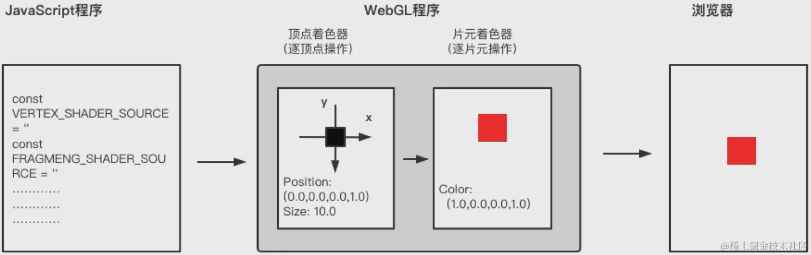

#### 片元

片元可以理解为一个个像素

#### 顶点着色器（像素位置）

顶点着色器的作用是计算顶点的位置，顶点是指二维三维空间中的一个点，可以理解为一个个坐标

#### 片元着色器（像素颜色）

片元着色器的作用是计算出当前绘制图元中的每个像素的颜色值。

WebGL在GPU上的工作基本分为两个部分，第一部分是将顶点（或数据流）转换到裁剪坐标，第二部分是基于第一部分的结果绘制像素点。

 

左侧是你提供的数据，顶点着色器（vertex shader)是你写进GLSL的一个方法，每个顶点调用一次，在这个方法中做一些数学运算后设置了一个特殊的gl_position变量，这个变量就是该顶点转换到裁剪空间中的坐标值，GPU接收该值并保存起来。

#### webgl绘制一个点

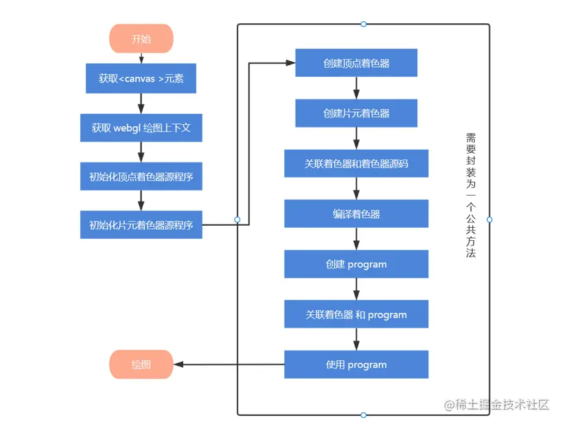

- 创建webgl上下文对象`const gl=ctx.getContext('webgl')`。

- 创建着色器源码，就是一个字符串，但是必须按规定编写，每条语句都需要加分号。

- 顶点着色器：vec4对象创建一个顶点坐标。

  ` gl_Position vec4(0.0,0.0,0.0,1.0)  x, y, z, w齐次坐标 (x/w, y/w, z/w)`。

- 创建片元着色器源码，`gl_FragColor vec4(1.0,0.0,0.0,1.0) r, g, b, a`。

- 创建着色器，并绑定一个程序对象。

- `gl.drawArrays(gl.POINTS,0,1)`绘制图形。【要绘制的图形是什么， 从哪个开始，使用几个顶点】

```
function initShader(gl, VERTEX_SHADER_SOURCE, FRAGMENT_SHADER_SOURCE) {
  //创建着色器对象
  const vertexShader = gl.createShader(gl.VERTEX_SHADER) // 顶点着色器
  const fragmentShader = gl.createShader(gl.FRAGMENT_SHADER) // 片元着色器

  //指定着色器源码
  gl.shaderSource(vertexShader, VERTEX_SHADER_SOURCE) // 指定顶点着色器的源码
  gl.shaderSource(fragmentShader, FRAGMENT_SHADER_SOURCE) // 指定片元着色器的源码

  // 编译着色器
  gl.compileShader(vertexShader)
  gl.compileShader(fragmentShader)

  // 创建程序对象
  const program = gl.createProgram()

  //附加着色器到程序对象
  gl.attachShader(program, vertexShader) //附加顶点着色器
  gl.attachShader(program, fragmentShader) //附加片元着色器:

  gl.linkProgram(program) //链接程序对象

  gl.useProgram(program)

  return program
}
```

### WebGL 渲染上下文

在 WebGL 中，`getContext` 是用于获取渲染上下文的方法。它的作用是从 HTML 的 `<canvas>` 元素中获取一个指定类型的渲染上下文，以便使用该上下文进行绘图操作。

```
const ctx = document.getElementById('webgl') // 获取 canvas 元素
const gl = ctx.getContext('webgl') // 获取 WebGL 渲染上下文
```

 `getContext` 参数

1. **`2d`**：

   - 用于获取 2D 渲染上下文，适合绘制简单的 2D 图形。
   - const ctx = canvas.getContext('2d')
   
2. **`webgl`** 或 **`experimental-webgl`**：

   - 用于获取 WebGL 渲染上下文，适合绘制 3D 图形。
   - const gl = canvas.getContext('webgl') || canvas.getContext('experimental-webgl')
   
3. **`webgl2`**：

   - 用于获取 WebGL 2.0 渲染上下文，提供了更高级的功能。

   const gl = canvas.getContext('webgl2')

------

作用：

1. **获取 WebGL 渲染上下文**：
   - `getContext('webgl')` 返回一个 WebGLRenderingContext 对象（简称 `gl`），这是 WebGL 的核心接口，提供了用于绘制 3D 图形的所有方法和属性。
   - 如果浏览器不支持 WebGL 或获取失败，`getContext('webgl')` 会返回 `null`。
2. **初始化 WebGL 环境**：
   - 通过 `gl` 对象，你可以调用 WebGL 的 API，例如创建着色器、设置缓冲区、绘制图形等。
3. **与 Canvas 结合**：
   - WebGL 是基于 Canvas 的 3D 绘图 API，`getContext('webgl')` 是将 Canvas 转换为 WebGL 绘图环境的关键步骤。

##### 精度

为什么要设置精度

在 WebGL 和 GLSL（OpenGL Shading Language）中，**精度**（Precision）是一个重要的概念，特别是在片元着色器中。精度决定了变量的存储和计算精度，直接影响渲染效果和性能。

- **精度的作用**

  - 存储精度：确定变量在内存中的存储位数（如 `lowp`, `mediump`, `highp`）。

    **精度类型**在 GLSL 中，有三种精度类型：

    - `highp`:最高精度。
      - 通常用于顶点着色器中的变量。

    - `mediump`:中等精度。
      - 通常用于片元着色器中的变量。

    - `lowp`:最低精度。
      - 通常用于颜色值等对精度要求不高的变量。

  - 计算精度：影响变量在计算过程中的精度。

**(1) 性能优化**

- 低精度计算:
  - 使用 `lowp` 和 `mediump` 可以减少计算资源的使用，提高渲染性能。
  - 特别是在移动设备上，低精度计算可以显著提升性能。

**(2) 内存优化**

- 存储空间:
  - 低精度变量占用较少的内存空间。
  - 在片元着色器中，每个像素点的计算和存储都会影响性能。

**(3) 渲染效果**

- 颜色精度:
  - 在片元着色器中，颜色值通常使用 `mediump` 或 `lowp`，因为人眼对颜色精度的要求相对较低。
- 光照和纹理:
  - 对于光照计算和纹理采样，`mediump` 通常已经足够，而 `highp` 可能会导致不必要的性能开销。

**(4) 兼容性**

- 不同硬件支持:
  - 不同的 GPU 和硬件平台对精度的支持不同。
  - 明确指定精度可以避免在不同平台上出现不一致的行为。

##### vec向量类型

`vec2` 和 `vec4` 是两种不同的向量类型，用于存储和操作二维和四维浮点数向量。

- **`vec2`**

  - 定义:`vec2` 是一个包含两个浮点数的向量。

  - 用途:用于存储和操作二维数据，如纹理坐标、二维坐标等。

  - 示例:

    ```
    glsl
    vec2 myVector = vec2(1.0, 2.0);
    ```

- `vec4`

  - 定义:`vec4` 是一个包含四个浮点数的向量。

  - 用途:用于存储和操作四维数据，如顶点位置、颜色、变换矩阵等。

  - 示例:

    ```
    glsl
    vec4 myVector = vec4(1.0, 2.0, 3.0, 1.0);
    ```

| 特性         | `vec2`                                     | `vec4`                                      |
| :----------- | :----------------------------------------- | :------------------------------------------ |
| **维度**     | 二维（2 个浮点数）                         | 四维（4 个浮点数）                          |
| **用途**     | 存储和操作二维数据，如纹理坐标、二维坐标等 | 存储和操作四维数据，如顶点位置、颜色等      |
| **示例**     | `vec2 myVector = vec2(1.0, 2.0);`          | `vec4 myVector = vec4(1.0, 2.0, 3.0, 1.0);` |
| **常见用途** | 纹理坐标、二维变换等                       | 顶点位置、颜色、变换矩阵等                  |

##### 变量类型

| **变量类型** | **作用范围**          | **是否可变** | **用途**                     |
| :----------- | :-------------------- | :----------- | :--------------------------- |
| `uniform`    | 全局，JavaScript 设置 | 不可变       | 传递全局数据                 |
| `attribute`  | 顶点着色器            | 不可变       | 传递每个顶点的数据           |
| `varying`    | 顶点到片元着色器      | 可变         | 在顶点和片元着色器间传递数据 |

###### Attribute

- 定义:`attribute` 是顶点着色器中的变量类型，用于传递每个顶点的特定数据。
- 用途:
  - 存储每个顶点的属性，如位置、颜色、法线、纹理坐标等。
  - 每个顶点可以有不同的 `attribute` 值。
- 生命周期:
  - 每个顶点的 `attribute` 值在顶点着色器中是固定的，直到下一个顶点处理。
- 作用范围:**仅在顶点着色器中有效。**

- 变量声明 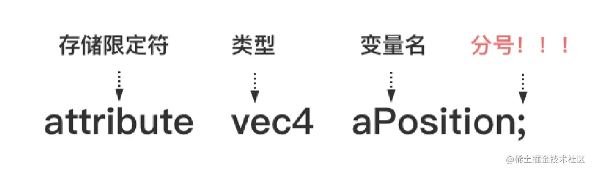

###### uniform

- 定义:`uniform` 是 WebGL（以及 OpenGL）着色器语言（GLSL）中的一种变量类型，用于在 JavaScript 和着色器之间传递数据。它是一种全局变量，可以在着色器程序中使用，并且其值在一次绘制调用中保持不变。

- 用途:通常用于传递光照参数、变换矩阵、颜色信息等全局数据

- 作用范围:在顶点着色器和片段着色器中都有效。

- 特性

  - **只读性**：在着色器中，`uniform` 变量是只读的，不能被修改。
  - **共享性**：同一个 `uniform` 变量可以同时被顶点着色器和片元着色器使用。
  - **生命周期**：在一次绘制调用中，`uniform` 的值保持不变，适用于所有顶点和片元。

- **在片元着色器中使用`uniform`必须设置精度**，**片元着色器中未设置精度，顶点着色器中默认设置了高精度。**

  ```
  precision mediump float; // 必须设置精度 
  ```

#### API

##### uniform2f

`uniform2f` 是 WebGL 中用于设置着色器程序中 `uniform` 变量值的一个方法。

### 属性

#### attribute定义属性变量

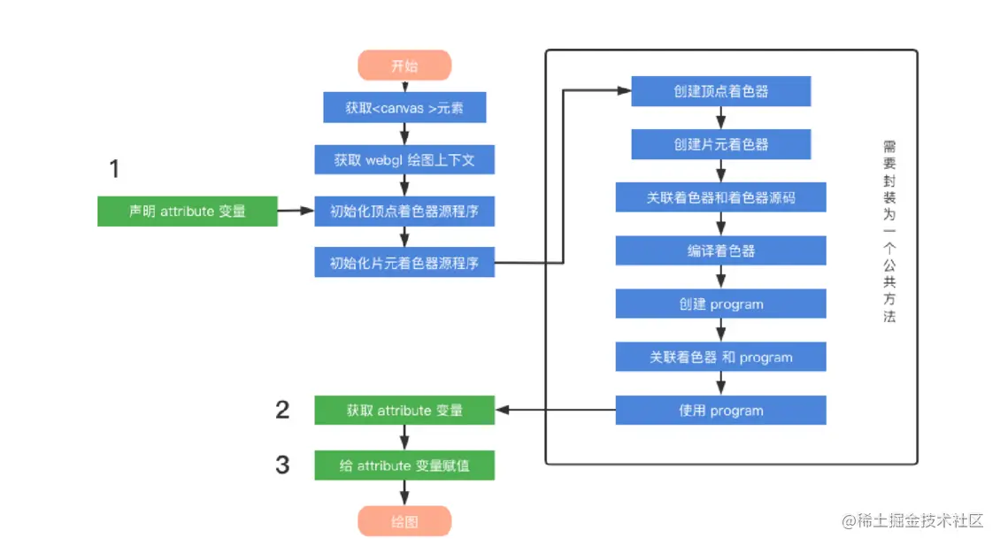

顶点属性vec4的初始值是`0.0, 0.0, 0.0, 1.0`。

获取属性变量，`const aPosition = gl.getAttribLocation(program, 'aPosition');`。

设置属性变量值。`gl.vertexAttrib1f(aPosition, x)`。`vertexAttrib[1|2|3|4]f`以设置`vec4`对象的值，**其他的值可以设置为默认值**。

#### uniform 定义属性变量

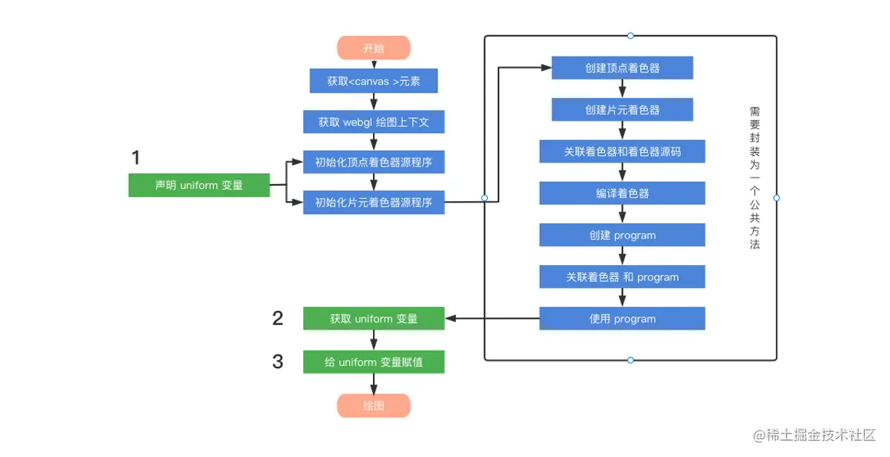

- `gl.uniform2f(uColor,points[i].clickX,points[i].clickY)`, `gl.vertexAttrib2f(aPosition,points[i].clickX,points[i].clickY)`。
- 注意我们再设置坐标的范围时，必须是[-1, 1]之间的，所以在计算鼠标的移动位置时，需要做缩放处理。

**注意着色器变量只能接收`vce4`类型变量。所以对于片元着色器我们可以设置片元着色器为其他类型（float, vce2, vce3）但是我们可以这样动态设置vce4的值。**

```js
gl_FragColor = vec4(uColor.r, uColor.g, 0.0,1.0); // vec4
```

如果使用`uniform1f()`赋值的话，我们只能通过float去定义变量类型。并且vec4中直接获取变量即可。

```js
uniform float uColor; // 这里定义的vec和下面的赋值需要对应。
void main() {
  gl_FragColor = vec4(uColor, 0.0, 0.0,1.0); // vec4
}
```

### 图形移动

#### 通过着色器让图形移动

我们可以定义一个attribute属性，让顶点各个轴的上值**加上**这个属性对应的值就行。**间接去修改顶点属性。**

#### 通过平移矩阵让图形移动

我们可以定义一个uniform属性，让顶点属性乘以该uniform属性即可。这里定义uniform的目的是让其作用于所有顶点。


### 图形缩放

#### 通过着色器让图形缩放

我们依旧是定义一个attribute属性，让顶点各个轴的上值**乘上**这个属性对应的值就行。**间接去修改顶点属性。**

#### 通过缩放矩阵让图形缩放

就是需要定义一个缩放矩阵。方式同平移矩阵。


### 图形旋转

#### 通过着色器让图形旋转

通过对顶点各个分量乘以对应的三角函数，就可以实现。

#### 通过旋转矩阵让图形旋转

# Three

http://www.webgl3d.cn/pages/c0b143/

是一款基于原生webgl封装的通用的web 3d引擎，是通过对webgl接口的封装与简化而形成的一个易用的图形库。
 特点：
 1、易用性：threejs旨在提供一个简单、易用的接口，使开发者能够在网页上轻松创建复杂的3D场景
 2、跨平台：threejs提供了跨浏览器、跨设备的解决方案，确保在不同平台和浏览器上一致的展现3D图形
 3、性能优化：threejs通过底层的webgl技术来实现高性能的3d图形渲染，确保在各种设备上都能流畅运行
 4、社区支持：threejs拥有一个庞大的开发者社区，可以轻松的找到支持、文档和示例，有助于加速开发过程
 5、广泛应用：threejs被广泛应用于VR、游戏开发、数据可视化等领域


## 初始化


- 实例化一个透视投影相机对象
- 实例化一个渲染器对象
- 创建3D场景对象Scene
  -  创建一个网格模型对象
  -  添加网格模型到场景中
- 渲染

```html
<template>
  <div class="content"></div>
</template>
<script setup>
import * as THREE from 'three'

onMounted(() => {
  const camera = new THREE.PerspectiveCamera(75, window.innerWidth / window.innerHeight, 0.1, 1000) //设置摄像机
  
  const renderer = new THREE.WebGLRenderer()
  renderer.setSize(window.innerWidth / 2, window.innerHeight / 2) //设置渲染器（图层）的宽高
  console.log(renderer)

  //创建立方体
  const scene = new THREE.Scene()
  const geometry = new THREE.BoxGeometry(1, 1, 1)
  const material = new THREE.MeshBasicMaterial({ color: 0x00ff00 })
  const cube = new THREE.Mesh(geometry, material)
  scene.add(cube)

  camera.position.z = 3
  function animate() {
    //循环绘制
    requestAnimationFrame(animate)
    //旋转立方体
    cube.rotation.x += 0.01
    cube.rotation.y += 0.01
    renderer.render(scene, camera)
  }
  animate()

  document.querySelector('.content').appendChild(renderer.domElement)
})
</script>

```

## 基础知识


### 相机

Threejs提供了

- 正投影相机[OrthographicCamera (opens new window)](https://threejs.org/docs/index.html?q=Camera#api/zh/cameras/OrthographicCamera)
- 透视投影相机[PerspectiveCamera (opens new window)](https://threejs.org/docs/index.html?q=PerspectiveCamera#api/zh/cameras/PerspectiveCamera)。常用的透视投影相机`PerspectiveCamera`。透视投影相机`PerspectiveCamera`本质上就是在模拟人眼观察这个世界的规律。

**默认的照相机与加载进来的模型都处于坐标原点，为了能够看到模型，需要将照相机位置偏移**

```
const camera = new THREE.PerspectiveCamera(75, window.innerWidth / window.innerHeight, 0.1, 1000)
```

#### 透视投影相机

PerspectiveCamera（透视摄像机）

- 第一个参数是视野角度（FOV），以度为单位，默认50

- 第二个参数是画布的宽高比（aspect ratio），默认1

  - 通常设置为画布的宽度与高度的比值，即 `canvas.clientWidth / canvas.clientHeight`。
  - 影响渲染效果：
    - **正确设置 `aspect` 参数可以确保渲染的图像不会被拉伸或压缩，保持正确的比例。**
    - 如果 `aspect` 参数设置不正确，渲染的图像可能会出现变形。

- 截面：它们定义了摄像机能“看到”的深度范围，超出这个范围的物体将被裁剪掉，不会被渲染。

  - `near`（近裁剪面）：摄像机可见范围的最近距离，通常设置为 `0.1`，任何位于此平面之前的物体都将被裁剪掉。
  - `far`（远裁剪面）：摄像机可见范围的最远距离，通常设置为 `1000`，任何位于此平面之后的物体也将被裁剪掉。

  **作用**

  **(1) 裁剪不必要的几何体**

  - **优化性能**：通过设置合理的近截面和远截面，可以避免渲染那些不在视锥体内的物体，从而减少 GPU 的计算负担。
  - **避免视觉错误**：如果近截面设置得太小，可能会导致深度缓冲区精度不足，产生“Z-Fighting”（深度冲突）问题。

  **(2) 控制可见范围**

  - **近截面**：确保靠近摄像机的物体不会被渲染。例如，在 VR 场景中，近截面通常设置为 0.1 或更大，以避免渲染到摄像机内部的物体。
  - **远截面**：限制场景的可见范围，防止渲染过于遥远的物体，尤其是在大场景中。

##### 相机渲染输出的画布尺寸和视锥体

相机拍照的照片是有大小的，对于threejs而言一样，需要定义相机在网页上输出的**Canvas画布**(照片)尺寸，大小可以根据需要定义，这里先随机定义一个尺寸。

**Canvas画布**：课程中会把threejs虚拟相机渲染三维场景在浏览器网页上呈现的结果称为**Canvas画布**。

```
// width和height用来设置Three.js输出的Canvas画布尺寸(像素px)
const width = 800; //宽度
const height = 500; //高度
// 30:视场角度, width // height:Canvas画布宽高比, 1:近裁截面, 3000：远裁截面
const camera = new THREE.PerspectiveCamera(30, width / height, 1, 3000);
```

透视投影相机的四个参数`fov, aspect, near, far`构成一个**四棱台**3D空间，被称为**视锥体**，**只有视锥体之内的物体，才会渲染出来，视锥体范围之外的物体不会显示在Canvas画布上。**

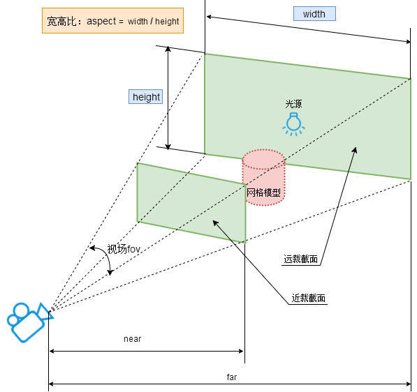

##### 相机位置`.position`

生活中用相机拍照，你相机位置不同，拍照结果也不同，threejs中虚拟相机同样如此。

比如有一间房子，你拿着相机站在房间里面，看到的是房间内部，站在房子外面看到的是房子外面效果。

相机对象`Camera`具有位置属性`.position`，通过位置属性`.position`可以设置相机的位置。

```javascript
//相机在Three.js三维坐标系中的位置
// 根据需要设置相机位置具体值
camera.position.set(200, 200, 200); 
```

##### 相机观察目标`.lookAt()`

你用相机拍照你需要控制相机的**拍照目标**，具体说相机镜头对准哪个物体或说哪个坐标。对于threejs相机而言，就是设置`.lookAt()`方法的参数，指定一个3D坐标。

```javascript
//相机观察目标指向Threejs 3D空间中某个位置
camera.lookAt(0, 0, 0); //坐标原点
camera.lookAt(0, 10, 0);  //y轴上位置10
camera.lookAt(mesh.position);//指向mesh对应的位置
```

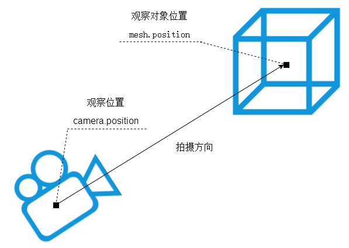

### 场景

```
const scene = new THREE.Scene()

//添加网格模型
scene.add(cube)
```

#### .add()方法

在threejs中你创建了一个表示物体的虚拟对象Mesh，需要通过`.add()`方法，把网格模型`mesh`添加到三维场景`scene`中。调用**scene.add()**的时候，物体将会被添加到**(0,0,0)**坐标

```javascript
scene.add(mesh); 
```

#### 功能

```
// 更改背景色
// scene.background = new THREE.Color(0x666666);
```

```
// 添加雾化效果
// 雾的颜色、雾化开始的距离相机的距离、雾化结束距离相机的距离
// scene.fog = new THREE.Fog(0xaaf7dc6f, 0.015, 1000)
```

### 渲染器

#### 概念


生活中如果有了**景物**和**相机**，那么如果想获得一张照片，就需要你拿着相机，按一下，咔，完成拍照。对于threejs而言，如果完成“咔”这个拍照动作，就需要一个新的对象，也就是WebGL渲染器[WebGLRenderer (opens new window)](https://threejs.org/docs/index.html?q=webgl#api/zh/renderers/WebGLRenderer)。

- 与canvas元素进行绑定

  ```
  var width = document.getElementById('viewer').clientWidth;
  var height = document.getElementById('viewer').clientHeight;
  var renderer = new THREE.WebGLRenderer({
       canvas: document.getElementById('viewer')
  });
  renderer.setSize(width, height);//设置Canvas画布尺寸
  renderer.setClearColor(0xFFFFFF, 1.0);//设置背景色
  ```

- 动态添加canvas到html的body中

  ```
  var renderer = new THREE.WebGLRenderer();
  renderer.setSize(window.innerWidth, window.innerHeight);
  document.body.appendChild(renderer.domElement); //WebGLRenderer通过属性.domElement可以获得渲染方法.render()生成的Canvas画布
  ```

- `WebGLRenderer`执行渲染方法`.render()`就可以生成一个Canvas画布(照片)，并把三维场景Scene呈现在canvas画布上面,你可以把`.render()`理解为相机的拍照动作“咔”。

  ```
  renderer.render(scene, camera); //执行渲染操作
  ```

#### 种类

##### WebGLRenderer

##### CSS3DRenderer

`CSS3DRenderer` 是 Three.js 提供的一个特殊渲染器，用于将 HTML 元素作为 3D 对象的一部分嵌入到场景中。它允许开发者在 3D 场景中使用普通的 DOM 元素（如 `<div>`、`<span>` 等），并将其与 3D 模型进行交互。

它通过 `CSS3DObject` 或 `CSS3DSprite` 将 DOM 元素绑定到 3D 场景中，并支持平移、旋转、缩放等操作。

```
const element = document.getElementById('WebGL-output');
const css3DObject = new THREE.CSS3DObject(element);
scene.add(css3DObject);
```

- 场景：使用 `CSS3DRenderer`，可以将复杂的 HTML 和 CSS 样式（如按钮、文本框、动画效果等）直接嵌入到 3D 场景中。
  - **信息标注**：在 3D 模型上显示标签、说明文字或动态数据（如温度、压力等）。
  - **交互界面**：在 3D 场景中嵌入按钮、菜单或其他交互式控件。
  - **增强现实**：结合 3D 场景和 HTML 元素，实现更丰富的视觉效果。

##### 区别

- `CSS3DRenderer` 和 `WebGLRenderer` 是两个独立的渲染器。
  - 虽然它们共享同一个相机和场景，但 `CSS3DRenderer` 不会参与 WebGL 的渲染管线，而是通过 CSS 和 DOM 来实现渲染。这种分离设计使得开发者可以同时管理 3D 模型和 HTML 元素。
- **性能优化**
  - 对于简单的 UI 元素（如标签、文字等），使用 `CSS3DRenderer` 比创建复杂的 3D 文本或材质更高效。
  - 它利用浏览器的原生 DOM 渲染能力，避免了额外的 GPU 开销。

#### canvas画布宽高度动态变化

```
// onresize 事件会在窗口被调整大小时发生
window.onresize = function () {
    // 重置渲染器输出画布canvas尺寸
    renderer.setSize(window.innerWidth, window.innerHeight);
    // 全屏情况下：设置观察范围长宽比aspect为窗口宽高比
    camera.aspect = window.innerWidth / window.innerHeight;
    // 渲染器执行render方法的时候会读取相机对象的投影矩阵属性projectionMatrix
    // 但是不会每渲染一帧，就通过相机的属性计算投影矩阵(节约计算资源)
    // 如果相机的一些属性发生了变化，需要执行updateProjectionMatrix ()方法更新相机的投影矩阵
    camera.updateProjectionMatrix();
};

```


#### 动画渲染循环

threejs可以借助HTML5的API请求动画帧`window.requestAnimationFrame`实现动画渲染。

在这里我们创建了一个使渲染器能够在每次屏幕刷新时对场景进行绘制的循环（在大多数屏幕上，刷新率一般是60次/秒）。如果你是一个浏览器游戏开发的新手，你或许会说*“为什么我们不直接用setInterval来实现刷新的功能呢？”*当然啦，我们的确可以用setInterval，但是，requestAnimationFrame当用户切换到其它的标签页时，它会暂停，因此不会浪费用户宝贵的处理器资源，也不会损耗电池的使用寿命。

##### 请求动画帧`window.requestAnimationFrame`

```js
// requestAnimationFrame实现周期性循环执行
// requestAnimationFrame默认每秒钟执行60次，但不一定能做到，要看代码的性能
let i = 0;
function render() {
    i+=1;
    console.log('执行次数'+i);
    requestAnimationFrame(render);//请求再次执行函数render
}
render();
```

**备注说明**：对于部分高刷新率的电脑硬件设备，`.requestAnimationFrame`每秒钟默认调用函数执行次数也是有可能超过60次的，比如你的电脑显卡、显示器等硬件能够支持144hz刷新频率，`.requestAnimationFrame`的每秒执行上限，也可以接近144帧率。

##### threejs旋转动画

动画说白了就是一张张照片，连起来依次展示，这样就形成一个动画效果，只要帧率高，人的眼睛就感觉不到卡顿，是连续的视频效果。

```js
const renderer = new THREE.WebGLRenderer();
renderer.setSize(width, height);
// renderer.render(scene, camera); //执行渲染操作
document.body.appendChild(renderer.domElement);

// 渲染函数
function render() {
    renderer.render(scene, camera); //执行渲染操作
    mesh.rotateY(0.01);//每次绕y轴旋转0.01弧度
    requestAnimationFrame(render);//请求再次执行渲染函数render，渲染下一帧
}
render();
```

##### 计算两帧渲染时间间隔和帧率

```js
// 渲染循环
const clock = new THREE.Clock();
function render() {
    const spt = clock.getDelta()*1000;//毫秒
    console.log('两帧渲染时间间隔(毫秒)',spt);
    console.log('帧率FPS',1000/spt);
    renderer.render(scene, camera); //执行渲染操作
    mesh.rotateY(0.01);//每次绕y轴旋转0.01弧度
    requestAnimationFrame(render);//请求再次执行渲染函数render，渲染下一帧
}
render();
```

##### 渲染循环和相机控件OrbitControls

设置了渲染循环,相机控件OrbitControls就不用再通过事件`change`执行`renderer.render(scene, camera);`，毕竟渲染循环一直在执行`renderer.render(scene, camera);`。

#### 锯齿模糊

设置渲染器锯齿属性`.antialias`的值可以直接在参数中设置，也可通过渲染器对象属性设置。

```javascript
const renderer = new THREE.WebGLRenderer({
  antialias:true,
});
```

或

```javascript
renderer.antialias = true,
```

#### 设备像素比

如果你有web前端基础，应该了解`window`对象，**设备像素比**`.devicePixelRatio`是window对象的一个属性，该属性的值和你的硬件设备**屏幕**相关，不同硬件设备的屏幕`window.devicePixelRatio`的值可能不同，可能就是1、1.5、2.0等其它值。

```javascript
// 不同硬件设备的屏幕的设备像素比window.devicePixelRatio值可能不同
console.log('查看当前屏幕设备像素比',window.devicePixelRatio);
```

setPixelRatio

如果你遇到你的canvas画布输出模糊问题，注意设置`renderer.setPixelRatio(window.devicePixelRatio)`。

注意：注意你的硬件设备设备像素比`window.devicePixelRatio`刚好是1，那么是否执行`.setPixelRatio()`不会有明显差异，不过为了适应不同的硬件设备屏幕，通常需要执行该方法。

```javascript
// 获取你屏幕对应的设备像素比.devicePixelRatio告诉threejs,以免渲染模糊问题
renderer.setPixelRatio(window.devicePixelRatio);
```

#### 设置背景颜色setClearColor

```javascript
renderer.setClearColor(0x444444, 1); //设置背景颜色
```

### 场景下：物体形状

#### 类型

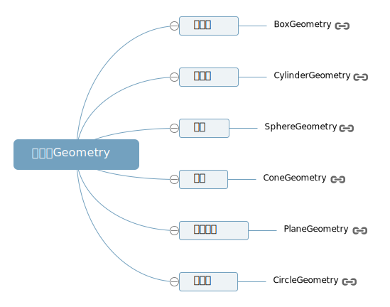

```
//BoxGeometry：长方体
const geometry = new THREE.BoxGeometry(100, 100, 100);
// SphereGeometry：球体
const geometry = new THREE.SphereGeometry(50);
// CylinderGeometry：圆柱
const geometry = new THREE.CylinderGeometry(50,50,100);
// PlaneGeometry：矩形平面
const geometry = new THREE.PlaneGeometry(100,50);
// CircleGeometry：圆形平面
const geometry = new THREE.CircleGeometry(50);
```

##### 参数

1. **`width` (宽度)**
   - **类型**：`Number`
   - **默认值**：`1`
   - **描述**：长方体的宽度（沿 X 轴的长度）。
2. **`height` (高度)**
   - **类型**：`Number`
   - **默认值**：`1`
   - **描述**：长方体的高度（沿 Y 轴的长度）。
3. **`depth` (深度)**
   - **类型**：`Number`
   - **默认值**：`1`
   - **描述**：长方体的深度（沿 Z 轴的长度）。
4. **`widthSegments` (宽度细分)**
   - **类型**：`Number`
   - **默认值**：`1`
   - **描述**：长方体宽度方向上的细分段数。增加这个值会使长方体表面更加平滑，但也会增加几何体的复杂度。
5. **`heightSegments` (高度细分)**
   - **类型**：`Number`
   - **默认值**：`1`
   - **描述**：长方体高度方向上的细分段数。增加这个值会使长方体表面更加平滑，但也会增加几何体的复杂度。
6. **`depthSegments` (深度细分)**
   - **类型**：`Number`
   - **默认值**：`1`
   - **描述**：长方体深度方向上的细分段数。增加这个值会使长方体表面更加平滑，但也会增加几何体的复杂度。

#### 缓冲类型几何体`BufferGeometry`

threejs的长方体`BoxGeometry`、球体`SphereGeometry`等几何体都是基于[BufferGeometry (opens new window)](https://threejs.org/docs/index.html?q=BufferGeometry#api/zh/core/BufferGeometry)类构建的，BufferGeometry是一个没有任何形状的空几何体，你可以通过BufferGeometry自定义任何几何形状，具体一点说就是定义**顶点数据**。

```javascript
//创建一个空的几何体对象
const geometry = new THREE.BufferGeometry(); 
```

##### 定义几何体顶点数据

通过javascript[类型化数组 (opens new window)](https://developer.mozilla.org/zh-CN/docs/Web/JavaScript/Typed_arrays)`Float32Array`创建一组xyz坐标数据用来表示几何体的顶点坐标。

```javascript
//类型化数组创建顶点数据
const vertices = new Float32Array([
    0, 0, 0, //顶点1坐标
    50, 0, 0, //顶点2坐标
    0, 100, 0, //顶点3坐标
    0, 0, 10, //顶点4坐标
    0, 0, 100, //顶点5坐标
    50, 0, 10, //顶点6坐标
]);
```

通过threejs的属性缓冲区对象[BufferAttribute (opens new window)](https://threejs.org/docs/index.html?q=BufferAttribute#api/zh/core/BufferAttribute)表示threejs几何体顶点数据。

```javascript
// 创建属性缓冲区对象
//3个为一组，表示一个顶点的xyz坐标
const attribue = new THREE.BufferAttribute(vertices, 3); 
```

##### 设置几何体顶点

通过`geometry.attributes.position`设置几何体顶点位置属性的值`BufferAttribute`。

```javascript
// 设置几何体attributes属性的位置属性
geometry.attributes.position = attribue;
```

##### 操作

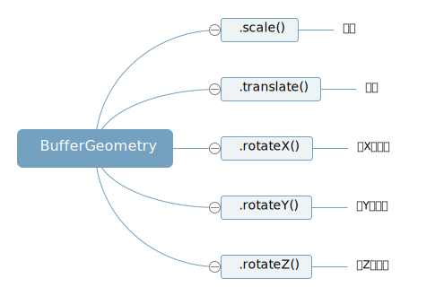


#### 物体外观：材质Material

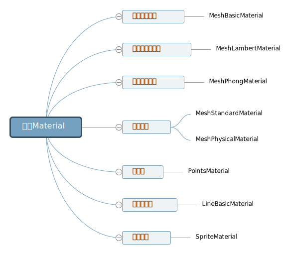

```
//创建一个材质对象Material
const material = new THREE.MeshBasicMaterial({
    color: 0xff0000,//0xff0000设置材质颜色为红色
}); 
```

##### 配置

- map：用于指定贴图（Texture）。贴图可以是一张图片或其他纹理数据，它会被应用到 3D 对象的表面，从而影响对象的外观。

  ```
   function getTextCanvas1(bgColor, fontColor, texts) {
    // 创建一个矩形
    const canvas = document.createElement('canvas');
    const ctx = canvas.getContext('2d');
    canvas.width = 450;
    canvas.height = 25;
    ctx.fillStyle = bgColor;
    ctx.fillRect(0, 0, 450, 25);
    //   创建文字
    ctx.font = 'normal 18pt "楷体"';
    ctx.fillStyle = fontColor;
    ctx.fillText(texts, 10, 20);
  
    //生成图片
    const url = canvas.toDataURL('image/png');
    return url;
  }
  new MeshBasicMaterial({
    // color: color,
    map: new TextureLoader().load(getTextCanvas1(color, fontColor, texts)),
    side: DoubleSide,
    opacity: 1,
    transparent: true,
  })
  ```

  `getTextCanvas1` 函数生成了一张带有文字的图片（通过 Canvas 绘制），然后通过 `TextureLoader` 将其加载为纹理，并赋值给 `map`。

- 双面可见

  Three.js的材质默认正面可见，反面不可见,对于**矩形**平面`PlaneGeometry`、**圆形**平面如果你想看到两面，可以设置`side: THREE.DoubleSide`。

  Three.js的材质默认正面可见，反面不可见。

  ```javascript
  const material = new THREE.MeshBasicMaterial({
      color: 0x0000ff, //材质颜色
      side: THREE.FrontSide, //默认只有正面可见
  });
  const material = new THREE.MeshBasicMaterial({
      side: THREE.DoubleSide, //两面可见
  });
  const material = new THREE.MeshBasicMaterial({
      side: THREE.BackSide, //设置只有背面可见
  });
  ```

- 线条模式渲染，查看几何体三角形结构

  ```
  wireframe:true,//线条模式渲染mesh对应的三角形数据
  ```

##### 材质操作

```
material.color.set(0x00ffff);
```

- 半透明设置

  ```
  material.transparent = true;//开启透明
  material.opacity = 0.5;//设置透明度
  
  ```

```
material.side = THREE.BackSide;//背面可以看到
material.side = THREE.DoubleSide;//双面可见
```


##### MeshLambertMaterial

**它需要光源才能正确显示颜色和光照效果**。如果你使用 `MeshLambertMaterial` 而没有添加光源，场景中的物体将会是黑色的，因为 `MeshLambertMaterial` 依赖于环境光和点光源等来计算光照。

##### MeshPhongMaterial

`MeshPhongMaterial`可以提供一个镜面反射效果,可以类比你生活中拿一面镜子，放在太阳光下，调整角度，可以把太阳光反射到其它地方，如果反射光对着眼睛，也就是反射光线和视线平行的时候，会非常刺眼。

`MeshLambertMaterial`对应的Mesh受到光线照射，没有镜面反射的效果，只是一个漫反射，也就是光线向四周反射。

```
//材质对象Material:高光网格材质
//模拟镜面反射，产生一个高光效果
const material = new THREE.MeshPhongMaterial({
  color: 0xdfdf,
  shininess: 25, //高光部分的亮度，默认30
  specular: 0xdfdf //高光部分的颜色
})
```

- ###### 通过`MeshPhongMaterial`的高光亮度`.shininess`属性,可以控制高光反射效果。

- 可以给高光部分的颜色属性`.specular`设置不同的值，比如`0x444444`、`0xfffffff` 查看渲染效果变化。

##### 点材质PointsMaterial


#### 物体：模型

1. Mesh（网格）
用途：用于创建复杂的三维物体，如立方体、球体、自定义几何体等。
特点：
多边形：由多个三角形或多边形组成。
材质：可以使用各种材质，如 MeshBasicMaterial、MeshLambertMaterial、MeshPhongMaterial 等。
光照：支持光照效果，可以与光源交互。
复杂性：可以表示复杂的几何形状和表面细节。
2. Line（线条）
用途：用于创建简单的线条或路径。
特点：
顶点：由一系列顶点连接而成。
材质：通常使用 LineBasicMaterial 或 LineDashedMaterial。
光照：不支持复杂的光照效果，通常用于简单的视觉效果。
简单性：适合表示简单的线条和路径。
3. Point（点）
用途：用于创建点或点云。
特点：
单个点：每个点由一个顶点表示。
材质：通常使用 PointsMaterial。
光照：不支持复杂的光照效果，通常用于简单的视觉效果。
简单性：适合表示点云或散点图。

##### Mesh

**网格模型**[Mesh (opens new window)](https://threejs.org/docs/index.html?q=mesh#api/zh/objects/Mesh)（表示一个虚拟的物体）包含一个几何体以及作用在此几何体上的材质，我们可以直接将网格对象放入到我们的场景中，并让它在场景中自由移动

```javascript
// 两个参数分别为几何体geometry、材质material
const mesh = new THREE.Mesh(geometry, material); //网格模型对象Mesh
```

网格模型Mesh其实就一个一个三角形(面)拼接构成。使用网格模型Mesh渲染几何体geometry，就是**几何体所有顶点坐标三个为一组，构成一个三角形，多组顶点构成多个三角形**，就可以用来模拟表示物体的表面。


##### Line

线模型Line渲染顶点数据

渲染效果是从第一个点开始到最后一个点，依次连成线。

```javascript
// 线材质对象
const material = new THREE.LineBasicMaterial({
    color: 0xff0000 //线条颜色
}); 
// 创建线模型对象
const line = new THREE.Line(geometry, material);
```

[#](http://www.webgl3d.cn/pages/ed3be5/#线模型lineloop、linesegments)线模型`LineLoop`、`LineSegments`

threejs线模型除了Line，还提供了[LineLoop (opens new window)](https://threejs.org/docs/index.html?q=line#api/zh/objects/LineLoop)、[LineSegments (opens new window)](https://threejs.org/docs/index.html?q=line#api/zh/objects/LineSegments)，区别在于绘制线条的规则不同。

```javascript
// 闭合线条
const line = new THREE.LineLoop(geometry, material); 
//非连续的线条
const line = new THREE.LineSegments(geometry, material);
```

##### 点模型`Points`

网格模型`Mesh`有自己对应的网格材质，同样点模型`Points`有自己对应的点材质[PointsMaterial(opens new window)](https://threejs.org/docs/index.html?q=Points#api/zh/materials/PointsMaterial)

```javascript
// 点渲染模式
const material = new THREE.PointsMaterial({
    color: 0xffff00,
    size: 10.0 //点对象像素尺寸
}); 
```

几何体geometry作为点模型Points参数，会把几何体渲染为点，把几何体作为Mesh的参数会把几何体渲染为面。

```javascript
const points = new THREE.Points(geometry, material); //点模型对象
```

##### 模型操作

http://www.webgl3d.cn/pages/440e51/

访问改变模型材质属性
// 访问模型材质,并设置材质的颜色属性
mesh.material.color.set(0xffff00);
#访问改变模型几何体属性
// 访问模型几何体,并平移几何体顶点数据
mesh.geometry.translate(0,100,0);

###### 模型位置`.position`

实际生活中，一个物体往往是有位置的，对于threejs而言也是一样的，你可以通过位置属性`.position`定义网格模型`Mesh`在三维场景`Scene`中的位置。

```javascript
const mesh = new THREE.Mesh(geometry, material); //网格模型对象Mesh
//设置网格模型在三维空间中的位置坐标，默认是坐标原点
mesh.position.set(0,10,0);
```


### 场景下：光源

#### 受光照影响材质

threejs提供的网格材质，有的受光照影响，有的不受光照影响。


#### 类型


##### 点光源

点光源[PointLight (opens new window)](https://threejs.org/docs/index.html?q=PointLight#api/zh/lights/PointLight)可以类比为一个发光点，就像生活中一个灯泡以灯泡为中心向四周发射光线。

```js
//点光源：两个参数分别表示光源颜色和光照强度
//参数1：0xffffff是纯白光,表示光源颜色
//参数2：1.0,表示光照强度，可以根据需要调整
const pointLight = new THREE.PointLight(0xdfdf, 1.0)
```

除了通过`THREE.PointLight`的参数2设置光照强度，你可以可以直接访问光照强度属性`.intensity`设置。

```javascript
pointLight.intensity = 1.0;//光照强度
```

##### 环境光

```
//环境光:没有特定方向，整体改变场景的光照明暗
const ambient = new THREE.AmbientLight(0xdfdf, 1.0);
scene.add(ambient);
```

##### 平行光

```
const directionalLight = new THREE.DirectionalLight(0xdfdf, 0.5);
// 设置光源的方向：通过光源position属性和目标指向对象的position属性计算
directionalLight.position.set(0, 0, 50);
// 方向光指向对象网格模型mesh，可以不设置，默认的位置是0,0,0
directionalLight.target = mesh;
scene.add(directionalLight);
```

平行光辅助观察`DirectionalLightHelper`

```
// DirectionalLightHelper：可视化平行光
const dirLightHelper = new THREE.DirectionalLightHelper(directionalLight, 5 ,0xff0000);
scene.add(dirLightHelper);
```


#### 光源衰减

实际生活中点光源，比如比如一个灯泡，随机距离的改变，光线会衰减，越来越弱，光源衰减属性`.decay`默认值是2.0，如果你不希望衰减可以设置为`0.0`。

```javascript
pointLight.decay = 0.0;//设置光源不随距离衰减
```

【扩展提醒】：如果使用默认衰减`2.0`，不同版本可能有差异，对于部分threejs新版本，有时候你可能看不到光源效果，这时候可以把光照强度加强试试看,如果你的版本不影响，就不用加强光照强度(根据版本情况灵活对应)。

```javascript
// 你可以对比不同光照强度明暗差异(传播同样距离)
pointLight.intensity = 10000.0;//光照强度
pointLight.intensity = 50000.0;//光照强度
```

#### 光源位置

你把点光源想象为一个电灯泡，你在3D空间中，放的位置不同，模型的渲染效果就不一样。

注意光源位置尺寸大小：如果你希望光源照在模型的外表面，那你就需要把光源放在模型的外面。

```js
//点光源位置
pointLight.position.set(400, 0, 0);//点光源放在x轴上
```

#### 光源添加到场景

光源和网格模型Mesh对应一样是三维场景的一部分，自然需要添加到三维场景中才能起作用。

```js
scene.add(pointLight); //点光源添加到场景中
```

设置好上面所有代码，你现在可以执行代码，用浏览器查看渲染效果。

- - 

### 辅助工具

#### 相机控件轨道控制器OrbitControls

##### [OrbitControls本质](http://www.webgl3d.cn/pages/837374/#orbitcontrols本质)

在 Three.js 中，`controls`（控制器）的作用是为摄像机提供交互功能，允许用户通过鼠标、键盘或触摸屏操作来控制摄像机的移动和旋转。在你的代码中，使用了 `OrbitControls`，它是 Three.js 提供的一个扩展库，用于实现轨道旋转、平移和缩放等交互功能。

- 作用

  - **轨道旋转**：允许用户通过鼠标拖动旋转摄像机视角。

  - **平移**：支持通过鼠标中键或按住键盘按键拖动来平移摄像机。

  - **缩放**：支持通过鼠标滚轮或双指捏合手势来缩放摄像机。

- 场景

  适用于需要与 3D 场景进行交互的应用，例如：

  - **模型预览**：允许用户自由旋转和缩放模型。
  - **虚拟现实**：提供更直观的场景浏览体验。
  - **数据可视化**：帮助用户更好地观察复杂的数据结构。

OrbitControls本质上就是改变相机的参数，比如相机的位置属性，改变相机位置也可以改变相机拍照场景中模型的角度，实现模型

的360度旋转预览效果，改变透视投影相机距离模型的距离，就可以改变相机能看到的视野范围。

```js
controls.addEventListener('change', function () {
    // 浏览器控制台查看相机位置变化
    console.log('camera.position',camera.position);
});
```

##### 引入扩展库OrbitControls.js

```javascript
// 引入轨道控制器扩展库OrbitControls.js
import { OrbitControls } from 'three/addons/controls/OrbitControls.js';
```

注意：如果你在原生.html文件中，使用上面引入方式`import { OrbitControls } from 'three/addons/controls/OrbitControls.js';`，注意通过`<script type="importmap">`配置。

```html
<script type="importmap">
    {
		"imports": {
			"three": "../../../three.js/build/three.module.js",
      "three/addons/": "../../../three.js/examples/jsm/"
		}
	}
</script>
```

##### 使用OrbitControls

```js
// 设置相机控件轨道控制器OrbitControls
const controls = new OrbitControls(camera, renderer.domElement);
// 设置控制器的中心点
controls.target.set(0, 20, 0)
// 设置控制器是否可旋转
controls.enableRotate = true
// 设置控制器是否可缩放
controls.enableZoom = true
// 设置控制器自动旋转
controls.autoRotate = true
// 增加阻尼
controls.enableDamping = true
// 设置阻尼系数
controls.dampingFactor = 0.01
// 如果OrbitControls改变了相机参数，重新调用渲染器渲染三维场景
controls.addEventListener('change', function () {
    renderer.render(scene, camera); //执行渲染操作
});//监听鼠标、键盘事件
```

#### gui

GUI本质上就是一个前端js库。可以快速创建控制三维场景的UI界面

```js
// 引入dat.gui.js的一个类GUI
import { GUI } from 'three/addons/libs/lil-gui.module.min.js';

// 实例化一个gui对象
const gui = new GUI(); //创建一个GUI对象，你可以看到浏览器右上角多了一个交互界面

//改变交互界面style属性
gui.domElement.style.right = '0px';
gui.domElement.style.width = '300px';
```

##### add

> bug：拖动拖动条不生效
>
> 解决：requestAnimationFrame(render)执行渲染下一帧

执行gui的`.add()`方法可以快速创建一个UI交互界面，比如一个拖动条，可以用来改变一个JavaScript对象属性的属性值。

格式：`.add(控制对象，对象具体属性，其他参数)`


#### stats查看渲染帧率

three.js每执行WebGL渲染器`.render()`方法一次，就在canvas画布上得到一帧图像，不停地周期性执行`.render()`方法就可以更新canvas画布内容，一般场景越复杂往往渲染性能越低，也就是每秒钟执行`.render()`的次数越低。

通过stats.js库可以查看three.js当前的渲染性能，具体说就是计算three.js的渲染帧率(FPS),所谓渲染帧率(FPS)，简单说就是three.js每秒钟完成的渲染次数，一般渲染达到每秒钟60次为最佳状态。

```
//引入性能监视器stats.js
import Stats from 'three/addons/libs/stats.module.js';
//创建stats对象
const stats = new Stats();
// stats.domElement显示：渲染帧率  刷新频率,一秒渲染次数 
stats.setMode(0) // 默认模式FPS
// stats.domElement显示：渲染周期 渲染一帧多长时间(单位：毫秒ms)
stats.setMode(1);
  
//stats.domElement:web页面上输出计算结果,一个div元素，
document.body.appendChild(stats.domElement);
// 渲染函数
function render() {
	//requestAnimationFrame循环调用的函数中调用方法update(),来刷新时间
	stats.update();
	renderer.render(scene, camera); //执行渲染操作
	requestAnimationFrame(render); //请求再次执行渲染函数render，渲染下一帧
}
render();
```

性能测试

控制长方体模型数量，你可以逐渐增加或减少,看看帧率变化，电脑性能不同结果不同。

```javascript
// 随机创建大量的模型,测试渲染性能
const num = 1000; //控制长方体模型数量
for (let i = 0; i < num; i++) {
    const geometry = new THREE.BoxGeometry(5, 5, 5);
    const material = new THREE.MeshLambertMaterial({
        color: 0x00ffff
    });
    const mesh = new THREE.Mesh(geometry, material);
    // 随机生成长方体xyz坐标
    const x = (Math.random() - 0.5) * 200
    const y = (Math.random() - 0.5) * 200
    const z = (Math.random() - 0.5) * 200
    mesh.position.set(x, y, z)
    scene.add(mesh); // 模型对象插入场景中
}
```

#### 坐标轴

##### 辅助观察坐标系

`THREE.AxesHelper()`的参数表示坐标系坐标轴线段尺寸大小，你可以根据需要改变尺寸。

```js
// AxesHelper：辅助观察的坐标系
const axesHelper = new THREE.AxesHelper(150);
scene.add(axesHelper);
```

three.js坐标轴颜色红**R**、绿**G**、蓝**B**分别对应坐标系的**x**、**y**、**z**轴，对于three.js的3D坐标系默认**y轴朝上**。

##### 材质半透明设置

设置材质半透明,这样可以看到坐标系的坐标原点。

```js
const material = new THREE.MeshBasicMaterial({
    color: 0x0000ff, //设置材质颜色
    transparent:true,//开启透明
    opacity:0.5,//设置透明度
});
```

#### 辅助网格地面

const gridHelper = new THREE.GridHelper(300, 25, 0x004444, 0x004444)

scene.add(gridHelper)

#### 点光源辅助观察`PointLightHelper`

通过点光源辅助观察对象[PointLightHelper (opens new window)](https://threejs.org/docs/index.html?q=PointLightHelper#api/zh/helpers/PointLightHelper)可视化点光源。

预览观察：可以借助相机控件`OrbitControls`旋转缩放三维场景便于预览点光源位置

```js
// 光源辅助观察
const pointLightHelper = new THREE.PointLightHelper(pointLight, 10);
scene.add(pointLightHelper);
```

改变点光源位置，观察光照效果变化。

```js
pointLight.position.set(100, 60, 50);
// 改变点光源位置，使用OrbitControls辅助观察
pointLight.position.set(-400, -200, -300);
```

## 库

### Vector

`Vector2` 和 `Vector3` 是 Three.js 中用于表示二维和三维空间中点或向量的类。以下是它们的主要区别：

------

#### 1. 维度

- **`Vector2`**：
  - 表示二维空间中的点或向量。
  - 包含两个分量：`x` 和 `y`。
  - 示例：`const vector = new THREE.Vector2(1, 2);`
- **`Vector3`**：
  - 表示三维空间中的点或向量。
  - 包含三个分量：`x`、`y` 和 `z`。
  - 示例：`const vector = new THREE.Vector3(1, 2, 3);`

------

#### 2. 使用场景

- **`Vector2`**：

  - 适用于二维空间的操作，例如：
    - 屏幕坐标（如鼠标位置）。
    - 平面几何计算（如矩形、多边形等）。
    - 纹理映射中的 UV 坐标。

  `Vector2` 用于将鼠标点击位置转换为标准化设备坐标（NDC，范围为 [-1, 1]）。

  ```
  javascriptlet mouse = new THREE.Vector2();
  mouse.x = ((event.clientX - getBoundingClientRect.left) / renderer.domElement.offsetWidth) * 2 - 1;
  mouse.y = -((event.clientY - getBoundingClientRect.top) / renderer.domElement.offsetHeight) * 2 + 1;
  ```

  - **作用**：
    - 将鼠标在屏幕上的二维位置（`clientX` 和 `clientY`）转换为标准化设备坐标。
    - 这些坐标用于射线检测（`Raycaster`）计算。
  - **场景**：
    - 鼠标交互（如点击模型时的射线检测）。

- **`Vector3`**：

  - 适用于三维空间的操作，例如：
    - 3D 场景中的点、方向或法线。
    - 相机位置、目标点或朝向。
    - 模型顶点的位置或法线。

  `Vector3` 用于表示 3D 空间中的点或向量。

  ```
  var pos = new THREE.Vector3();
  object.getWorldPosition(pos); // 获取对象的世界坐标
  css3DObject.position.copy(pos); // 设置 CSS3DObject 的位置
  ```

  - **作用**：
    - 表示 3D 场景中对象的位置。
    - 用于计算对象的世界坐标，并将其应用于其他对象（如 `CSS3DObject`）。
  - **场景**：
    - 3D 对象的位置、旋转、缩放等操作。
    - **射线检测中计算交点的三维位置。**

------

#### 3. 方法

两者都提供了类似的方法（如 `add()`、`sub()`、`multiplyScalar()` 等），但维度不同导致具体实现有所差异。例如：

- `Vector2` 的方法操作二维向量。
- `Vector3` 的方法操作三维向量。

#### 总结

| 特性         | Vector2                     | Vector3                   |
| :----------- | :-------------------------- | :------------------------ |
| **维度**     | 二维（x, y）                | 三维（x, y, z）           |
| **使用场景** | 屏幕坐标、UV 映射、平面几何 | 3D 场景中的点、方向、法线 |
| **代码用途** | 鼠标交互、射线检测          | 对象位置、世界坐标计算    |

在实际开发中，`Vector2` 和 `Vector3` 各有其适用场景，开发者需要根据具体的维度需求选择合适的类。


### Vector3 和 Float32Array 的联系

- 相同点：

  - 都可以表示三维空间中的点或向量。

- 不同点：

  - Vector3：
    - 更加面向对象，提供了丰富的操作方法。
    - 适合用于场景中动态计算和操作（如相机位置、旋转轴等）。
  - Float32Array：
    - 更底层，直接存储原始数据。
    - 性能更高，适合大批量静态数据的存储（如几何体顶点数据）。

- 转换关系：

  - 可以将 `Vector3` 的值提取到 `Float32Array` 中，用于定义 `BufferGeometry` 的顶点数据。

  - 示例：

    ```
    const vectors = [
      new THREE.Vector3(0, 0, 0),
      new THREE.Vector3(50, 0, 0),
      new THREE.Vector3(0, 100, 0)
    ];
    
    const vertices = new Float32Array(vectors.flatMap(v => [v.x, v.y, v.z]));
    
    const geometry = new THREE.BufferGeometry();
    geometry.setAttribute('position', new THREE.BufferAttribute(vertices, 3));
    ```

### Object3D

这是Three.js中大部分对象的基类，几乎所有可以添加到场景中的对象（如 `Mesh`、`Light`、`Camera` 等）都继承自 `Object3D`。Object3D提供了一系列的属性和方法来对三维空间中的物体进行操纵。

#### 核心属性

以下是 `Object3D` 提供的一些核心属性：

- **`position`**：
  - 表示对象在 3D 空间中的位置。
  - 类型为 `THREE.Vector3`，包含 `x`、`y`、`z` 坐标。
  - 示例：`object.position.set(2, 0, -5);`
- **`rotation`**：
  - 表示对象的旋转角度。
  - 类型为 `THREE.Euler`，包含 `x`、`y`、`z` 轴的欧拉角。
  - 示例：`object.rotation.x = Math.PI / 4;`
- **`scale`**：
  - 表示对象的缩放比例。
  - 类型为 `THREE.Vector3`，包含 `x`、`y`、`z` 方向的缩放值。
  - 示例：`object.scale.set(2, 2, 2);`
- **`visible`**：
  - 控制对象是否可见。
  - 类型为布尔值，默认为 `true`。
  - 示例：`object.visible = false;`
- **`children`**：
  - 表示该对象的子对象列表。
  - 可以通过 `add()` 和 `remove()` 方法管理子对象。
  - 示例：`object.add(childObject);`

------

#### 核心方法

以下是 `Object3D` 提供的一些常用方法：

- **`updateMatrix()`**：
  - 更新对象的矩阵（`matrix`），用于计算位置、旋转和缩放的变化。
- **`lookAt(vector)`**：
  - 让对象朝向指定的目标点。
  - 示例：`camera.lookAt(new THREE.Vector3(0, 0, 0));`
- **`add(child)`**：
  - 将子对象添加到当前对象中。
  - 示例：`parentObject.add(childObject);`
- **`remove(child)`**：
  - 从当前对象中移除子对象。
  - 示例：`parentObject.remove(childObject);`
- **`getWorldPosition(target)`**：
  - 获取对象的世界坐标，并将结果存储到目标向量中。
  - 示例：`object.getWorldPosition(worldPositionVector);`

#### 层级关系管理

`Object3D` 支持父子层级关系，允许开发者构建复杂的场景结构。例如：

- 一个父对象可以包含多个子对象。
- 子对象的位置、旋转和缩放会相对于父对象进行变换。

```
const parent = new THREE.Object3D();
const child = new THREE.Mesh(new THREE.BoxGeometry(), new THREE.MeshBasicMaterial({ color: 0xff0000 }));

parent.add(child); // 将子对象添加到父对象中
child.position.set(2, 0, 0); // 子对象的位置相对于父对象
scene.add(parent); // 将父对象添加到场景中
```


#### CSS3DObject

- `CSS3DObject` 将一个 DOM 元素包装成一个 Three.js 的对象，使其可以像其他 3D 对象（如 `Mesh` 或 `Sprite`）一样被添加到场景中。
- 它继承自 `Object3D`，因此可以使用所有 `Object3D` 的属性和方法（如 `position`、`rotation`、`scale` 等）。

```
const element = document.getElementById('WebGL-output');
const css3DObject = new THREE.CSS3DObject(element);
scene.add(css3DObject);
```

 支持标准的 3D 变换操作：

- **位置 (`position`)**：设置对象在 3D 空间中的位置。
- **旋转 (`rotation`)**：设置对象的旋转角度。
- **缩放 (`scale`)**：调整对象的大小。

与 CSS3DRenderer 配合使用

- `CSS3DObject` 必须与 `CSS3DRenderer` 配合使用才能生效。
- `CSS3DRenderer` 负责渲染 `CSS3DObject`，并将其与 WebGL 渲染器的场景同步。

```
const labelRenderer = new THREE.CSS3DRenderer();
labelRenderer.setSize(width, height);
labelRenderer.render(scene, camera);
```


### Raycaster

光线投射用于进行鼠标拾取（在三维空间中计算出鼠标移过了什么物体）。

```
// 创建射线检测器
const raycaster = new THREE.Raycaster()
const mouse = new THREE.Vector2()
// 获取鼠标点击位置的射线与物体相交的函数
function getIntersects(event) {
  console.log('event', event)
  event.preventDefault() // 阻止默认的点击事件执行,

  //声明 rayCaster 和 mouse 变量
  let rayCaster = new THREE.Raycaster()
  let mouse = new THREE.Vector2()

  //通过鼠标点击位置，计算出raycaster所需点的位置，以屏幕为中心点，范围-1到1
  let getBoundingClientRect = renderer.domElement.getBoundingClientRect()
  mouse.x = ((event.clientX - getBoundingClientRect.left) / renderer.domElement.offsetWidth) * 2 - 1
  mouse.y =
    -((event.clientY - getBoundingClientRect.top) / renderer.domElement.offsetHeight) * 2 + 1
  //通过鼠标点击的位置(二维坐标)和当前相机的矩阵计算出射线位置
  rayCaster.setFromCamera(mouse, camera)

  //获取与射线相交的对象数组， 其中的元素按照距离排序，越近的越靠前。
  //+true，是对其后代进行查找，这个在这里必须加，因为模型是由很多部分组成的，后代非常多。
  let intersects = rayCaster.intersectObjects(scene.children, true)
  //返回选中的对象
  return intersects
}
```


## 功能

### 模型组

http://www.webgl3d.cn/pages/c86096/

下面代码代码创建了两个网格模型mesh1、mesh2，通过THREE.Group类创建一个组对象group,然后通过add方法把网格模型mesh1、mesh2作为设置为组对象group的子对象，然后在通过执行scene.add(group)把组对象group作为场景对象的scene的子对象。也就是说场景对象是scene是group的父对象，group是mesh1、mesh2的父对象。这样就构成了一个三层的层级结构，当然了你也可以通过Group自己创建新模型节点作为层级结构中的一层。

```
//创建两个网格模型mesh1、mesh2
var geometry = new THREE.BoxGeometry(20, 20, 20);
var material = new THREE.MeshLambertMaterial({color: 0x0000ff});
var group = new THREE.Group();
var mesh1 = new THREE.Mesh(geometry, material);
var mesh2 = new THREE.Mesh(geometry, material);
mesh2.translateX(25);
//把mesh1型插入到组group中，mesh1作为group的子对象
group.add(mesh1);
//把mesh2型插入到组group中，mesh2作为group的子对象
group.add(mesh2);
//把group插入到场景中作为场景子对象
scene.add(group);
```

网格模型mesh1、mesh2作为设置为父对象group的子对象，如果父对象group进行旋转、缩放、平移变换，子对象同样跟着变换，就像你的头旋转了，眼睛会跟着头旋转。

```
//沿着Y轴平移mesh1和mesh2的父对象，mesh1和mesh2跟着平移
group.translateY(100);
```


```
//父对象缩放，子对象跟着缩放
group.scale.set(4,4,4);
```


```
//父对象旋转，子对象跟着旋转
group.rotateY(Math.PI/6)
```


#### 查看子对象.children

Threejs场景对象Scene、组对象Group都有一个子对象属性.children,通过该属性可以访问父对象的子对象，子对象属性.children的值是数组，所有子对象是数组的值，你可以在浏览器控制台打印测试上面案例代码。

执行console.log(group.children)你可以在浏览器控制控制看到group的子对象是案例代码中通过add方法添加的两个网格模型对象Mesh。

```
console.log('查看group的子对象',group.children);
```

#### 场景对象结构

执行console.log(scene.children)你在浏览器控制台查看场景对象Scene的子对象，除了可以看到案例代码通过add方法添加的组对象group之外，还可以看到通过add方法插入到场景中的环境光AmbientLight、点光源PointLight、辅助坐标对象AxesHelper等子对象。

```
console.log('查看Scene的子对象',scene.children);
```


场景对象对象scene构成的层级模型本身是一个树结构，场景对象层级模型的第一层，也就是树结构的根节点，一般来说网格模型Mesh、点模型Points、线模型Line是树结构的最外层叶子结点。构建层级模型的中间层一般都是通过Threejs的Group类来完成，Group类实例化的对象可以称为组对象。

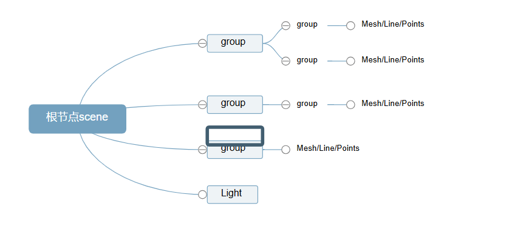

#### 方法

.add()方法
场景对象Scene、组对象Group、网格模型对象Mesh、光源对象Light的.add()方法都是继承自它们共同的基类Object3D。

父对象执行.add()方法的本质就是把参数中的子对象添加到自身的子对象属性.children中。

.add()方法可以单独插入一个对象，也可以同时插入多个子对象。

group.add(mesh1);
group.add(mesh2);
1
2
group.add(mesh1,mesh2);
1
Scene根节点 渲染的问题

.remove()方法
.add()方法是给父对象添加一个子对象，.remove()方法是删除父对象中的一个子对象。
一个对象的全部子对象可以通过该对象的.children()属性访问获得，执行该对象的删除方法.remove()和添加方法.add()一样改变的都是父对象的.children()属性。

场景Scene或组对象Group的.remove()方法使用规则可以查看它们的基类Object3D。

// 删除父对象group的子对象网格模型mesh1
group.add(mesh1)
// 一次删除场景中多个对象
scene.remove(light,group)

### 纹理贴图

```
  //纹理贴图加载器TextureLoader
  const texLoader = new THREE.TextureLoader()
  // .load()方法加载图像，返回一个纹理对象Texture
  texLoader.load('../../../../texture.webp', (loadedTexture) => {
    const material = new THREE.MeshBasicMaterial({ map: loadedTexture })
    const cube = new THREE.Mesh(geometry, material)
    scene.add(cube)
    renderer.render(scene, camera) // 确保在纹理加载完成后重新渲染
  })
```


### WebGL兼容性检查

请将https://github.com/mrdoob/three.js/blob/master/examples/jsm/capabilities/WebGL.js引入到你的文件，并在尝试开始渲染之前先运行该文件。

```
if (WebGL.isWebGLAvailable()) {    // Initiate function or other initializations here    animate(); } else {    const warning = WebGL.getWebGLErrorMessage();    document.getElementById('container').appendChild(warning); }
```

### WebGL渲染器设置

#### 锯齿模糊

##### 渲染器锯齿属性`.antialias`

设置渲染器锯齿属性`.antialias`的值可以直接在参数中设置，也可通过渲染器对象属性设置。

```javascript
const renderer = new THREE.WebGLRenderer({
  antialias:true,
});
```

```javascript
renderer.antialias = true,
```

#### 设备像素比`window.devicePixelRatio`

如果你有web前端基础，应该了解`window`对象，**设备像素比**`.devicePixelRatio`是window对象的一个属性，该属性的值和你的硬件设备**屏幕**相关，不同硬件设备的屏幕`window.devicePixelRatio`的值可能不同，可能就是1、1.5、2.0等其它值。

```javascript
// 不同硬件设备的屏幕的设备像素比window.devicePixelRatio值可能不同
console.log('查看当前屏幕设备像素比',window.devicePixelRatio);
```

#### 设置设备像素比`.setPixelRatio()`

如果你遇到你的canvas画布输出模糊问题，注意设置`renderer.setPixelRatio(window.devicePixelRatio)`。

注意：注意你的硬件设备设备像素比`window.devicePixelRatio`刚好是1，那么是否执行`.setPixelRatio()`不会有明显差异，不过为了适应不同的硬件设备屏幕，通常需要执行该方法。

```javascript
// 获取你屏幕对应的设备像素比.devicePixelRatio告诉threejs,以免渲染模糊问题
renderer.setPixelRatio(window.devicePixelRatio);
```

#### 设置背景颜色`.setClearColor()`

```javascript
renderer.setClearColor(0x444444, 1); //设置背景颜色
```


## gltf

### 背景

对于简单的立方体、球体等模型，你可以通过three.js的几何体相关API快速实现，不过复杂的模型，比如一辆轿车、一栋房子、一个仓库，一般需要通过3D建模软件来实现。

- 三维建模软件简介

  - 3D美术常用的三维建模软件，比如Blender、3dmax、C4D、maya等等

    - Blender(轻量开源)


    - 3dmax
    
    - C4D
    
    - maya

  - 特殊行业项目可能涉及到行业软件，比如机械相关、建筑相关机械相关：SW、UG等
  - 建筑相关：草图大师、revit

- 分工和流程

  3D美术：使用三维建模软件绘制3D模型，导出gltf等常见格式

  程序：加载解析三维软件导出的三维模型。比如使用Blender三维建模软件导出gltf格式模型，然后再通过threejs加载三维模型。

- 程序员学习Blender好处

  - 3D相关概念，相比较代码，建模软件，更加形象，容易理解
  - Blender与Threejs代码的交互，与美术更好的配合，Blender如何导出模型

### GLTF/GLB概念

GLTF (GL Transmission Format) 是一种基于 JSON 的开放标准 3D 文件格式。（WebGL、OpenGL 中的 “GL” 和 GLTF 中的 “GL” 是相同的单词。）

GLB 是 GLTF 的二进制版本,文件体积较小，**便于传输**。

Three.js 内置了**GLTFLoader**用于加载和解析 GLTF/GLB 格式的模型。

glTF格式的三种表现形式

**1. glTF二进制(`.glb`）**

1. .glb：其中所有网格数据，图像纹理和相关信息都打包到一个二进制文件中。

**2. glTF分离式(`.gltf` + `.bin` + textures)**

1. gltf：3D 场景的所有概要信息，包括灯光、纹理贴图等信息,该文件的内容具体形式为 JSON
2. .bin：模型的二进制数据，包含网格和矢量数据的文件
3. 纹理贴图资源：纹理图片 xxx.jpg 或 .png

**3. glTF嵌入式 (`.gltf`)**

1. .gltf：以 JSON 形式保存所有场景信息数据，包括材质和纹理信息。这种形式由于文件内容是 json，因此是可以通过文本再次编辑的

> .glb === .gltf + .bin + textures

**Blender 默认导出 glTF 2.0 格式时，采用的是 .glb 后缀形式。** 想要更改成别的导出形式，我们可以在 Blender 导出项 `格式`下拉框中更改为 “.gltf 分离(.gltf + .bin + 纹理)” 或 "glTF嵌入式(.gltf)"。那么此时**导出的文件格式就是 .gltf 后缀形式。**


### gltf包含内容

相比较obj、stl等格式而言，.gltf格式可以包含更多的模型信息。

.gltf格式文件几乎可以包含所有的三维模型相关信息的数据，比如模型层级关系、PBR材质、纹理贴图、骨骼动画、变形动画...

### GLTF格式信息

如果你有一定的前端基础，那么你对JSON一定不陌生，GLTF文件就是通过JSON的键值对方式来表示模型信息，比如`meshes`表示网格模型信息，`materials`表示材质信息...

```javascript
{
  "asset": {
    "version": "2.0",
  },
...
// 模型材质信息
  "materials": [
    {
      "pbrMetallicRoughness": {//PBR材质
        "baseColorFactor": [1,1,0,1],
        "metallicFactor": 0.5,//金属度
        "roughnessFactor": 1//粗糙度
      }
    }
  ],
  // 网格模型数据
  "meshes": ...
  // 纹理贴图
  "images": [
        {
            // uri指向外部图像文件
            "uri": "贴图名称.png"//图像数据也可以直接存储在.gltf文件中
        }
   ],
     "buffers": [
    // 一个buffer对应一个二进制数据块，可能是顶点位置 、顶点索引等数据
    {
      "byteLength": 840,
     //这里面的顶点数据，也快成单独以.bin文件的形式存在   
      "uri": "data:application/octet-stream;base64,AAAAPwAAAD8AAAA/AAAAPwAAAD8AAAC/.......
    }
  ],
}
```

## 交互

### 鼠标交互

通过[鼠标事件](https://so.csdn.net/so/search?q=鼠标事件&spm=1001.2101.3001.7020)，可以实现模型的拖拽、旋转、缩放等操作。例如，可以通过鼠标拖拽来改变模型的位置或角度。

#### 拖拽

```
    import { DragControls } from 'three/examples/jsm/controls/DragControls.js'
    // 添加拖拽控制器
    const dragControls = new DragControls(draggableObjects, camera, renderer.domElement)

    dragControls.addEventListener('dragstart', (event) => {
      controls.enabled = false
    })

    dragControls.addEventListener('dragend', (event) => {
      controls.enabled = true
    })
```

#### 旋转


#### 点击


### 触摸交互

### 键盘交互


## 动画

### Clock

`Clock`本质上就是对`Date`进行封装，提供了一些方法和属性，当你通过Threejs编写一些和时间相关程序时候，不用在对`Date`进行封装，直接调用`Clock`对象的方法和属性即可。

- Threejs渲染器的渲染方法`.render()`每执行一次就得到一帧图像，渲染效果也就是图像会显示在 Canvas 画布上
- 如果一个三维场景是不停变化的，肯定要周期性调用执行`.render()`方法，更新canvas画布显示内容，一帧帧图像随着时间变化，这样就展现出来一个动画效果
- 为了周期性执行渲染器渲染方法`.render()`，一般通过浏览器的API`window.requestAnimationFrame`实现，浏览器会控制渲染频率
- 一般性能理想的情况下，每秒s渲染60次左右，在实际的项目中，如果需要渲染的场景比较复杂，一般都会低于60，也就是渲染的两帧时间间隔大于16.67ms
- 代码示例：

```scss
scss 代码解读复制代码// 创建一个时钟对象Clock
var clock = new THREE.Clock();
// 创建渲染函数
function render() {
	//执行渲染方法，渲染出来一帧图像
	renderer.render(scene, camera);
	
	//周期性执行渲染函数
	requestAnimationFrame(render);
	
	//clock.getDelta()方法获得两帧的时间间隔，返回时间单位：秒
	var T = clock.getDelta();
	
	console.log('两帧渲染时间间隔',T*1000+'毫秒');
	console.log('查看每秒渲染频率',1/T);
}
render();
```


属性`.autoStart`，Boolean，默认值是`true`，如果设置为`true`，则在第一次`update` 时开启时钟 Clock

属性`.startTime `，Float，存储时钟 Clock 最后一次调用`.start()`, `.getElapsedTime()`或`.getDelta()`方法的时间

属性`.elapsedTime `，Float，保存时钟 Clock 运行的总时长

属性`.running `，Boolean，判断时钟 Clock 是否在运行

方法`.start()`，启动时钟，同时将`startTime`和`oldTime`设置为当前时间，设置`elapsedTime`为 0，并且设置`running`为`true`

方法`.stop()`，停止时钟，同时将`oldTime`设置为当前时间

方法`.getElapsedTime()`，获取自时钟启动后的秒数，摒弃将`oldTime`设置为当前时间，如果`autoStart`设置为`true`且时钟并未运行，则该方法同时启动时钟

方法`.getDelta()`，获取自`oldTime`设置后到当前的秒数，同时将`oldTime`设置为当前时间，如果`autoStart`设置为`true`且时钟并未运行，则该方法同时启动时钟

### AnimationMixer

https://threejs.org/docs/#api/zh/animation/AnimationMixer

在 Three.js 中，`AnimationMixer` 和 `clipAction` 是用于处理 3D 模型动画的核心工具。它们的作用是为加载的 3D 模型添加动画，并控制动画的播放、暂停、停止等行为。

`AnimationMixer` 是 Three.js 中的动画混合器，用于管理和播放 3D 模型的动画。

#### **主要功能：**

- **管理动画**：`AnimationMixer` 可以管理一个 3D 对象的多个动画。
- **播放动画**：通过 `update` 方法，根据时间更新动画的状态。
- **支持动画混合**：当一个对象有多个动画时，可以通过 `AnimationMixer` 实现动画之间的平滑过渡。

#### **使用方式：**

const mixer = new THREE.AnimationMixer(obj.scene); // 创建 AnimationMixer

- **参数**：
  - `obj.scene`：需要播放动画的 3D 对象（通常是加载的 GLTF 模型的场景）。
- **工作原理**：
  - `AnimationMixer` 会根据时间（通过 `Clock` 提供）更新动画的状态。
  - 它会自动处理动画的播放、暂停、停止等操作。

### clipAction 的作用

`clipAction` 是 `AnimationMixer` 的方法，用于从动画剪辑（`AnimationClip`）中创建动画动作（`AnimationAction`）。

#### **主要功能：**

- **绑定动画剪辑**：`clipAction` 将动画剪辑绑定到 `AnimationMixer` 上。
- **控制动画行为**：返回的 `AnimationAction` 对象可以控制动画的播放、暂停、停止、循环等行为。

#### **使用方式：**

const action = mixer.clipAction(obj.animations[0]); // 从动画剪辑中创建动画动作

- **参数**：
  - `obj.animations[0]`：GLTF 模型中的第一个动画剪辑。
- **返回值**：
  - 返回一个 `AnimationAction` 对象，用于控制动画的行为。

#### **常用方法：**

- `action.play()`：播放动画。
- `action.stop()`：停止动画。
- `action.pause()`：暂停动画。
- `action.setLoop(THREE.LoopRepeat, Infinity)`：设置动画循环。

## 案例

# 阵列立方体和相机适配体验


# demo

## 地图接入3D

## 对话：人物+gpt
