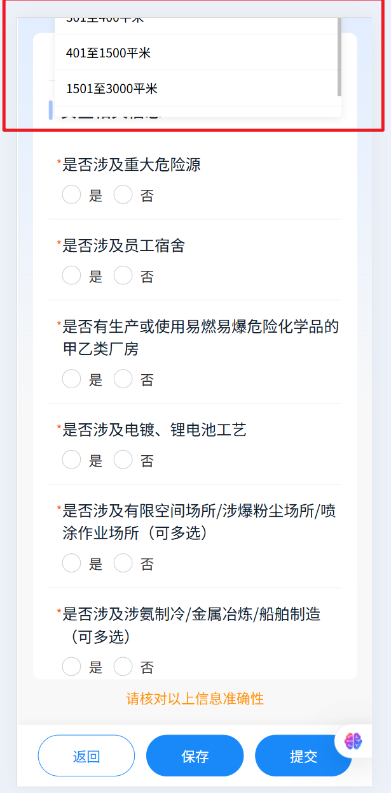
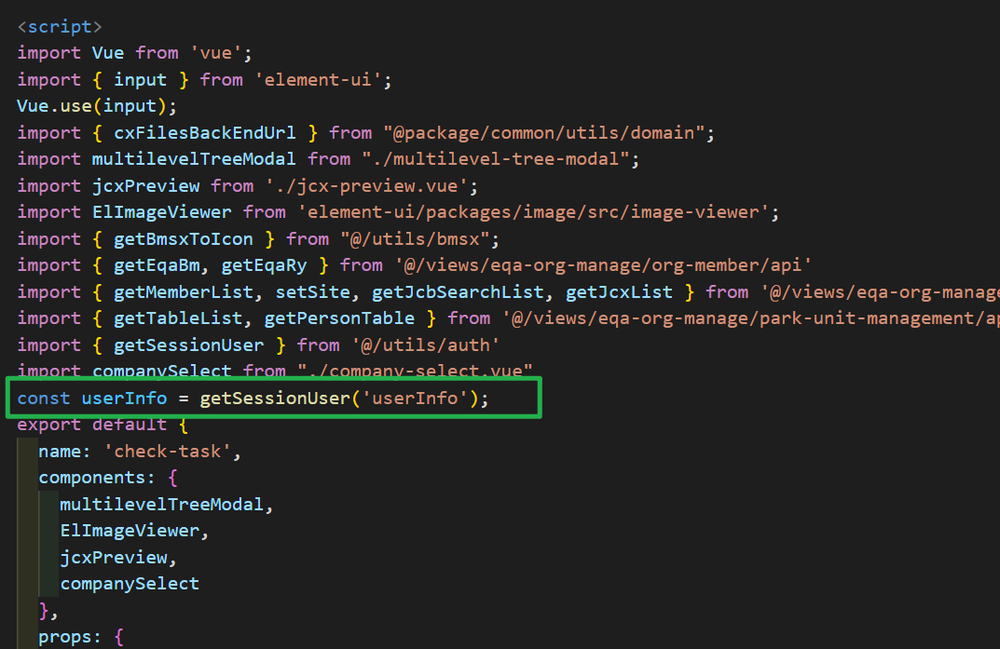
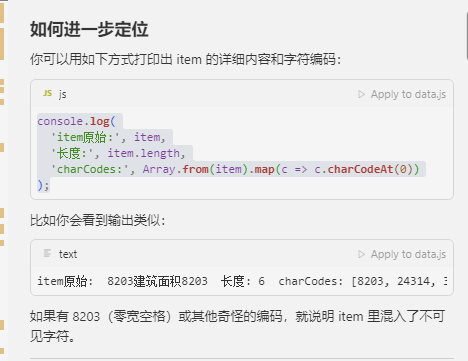
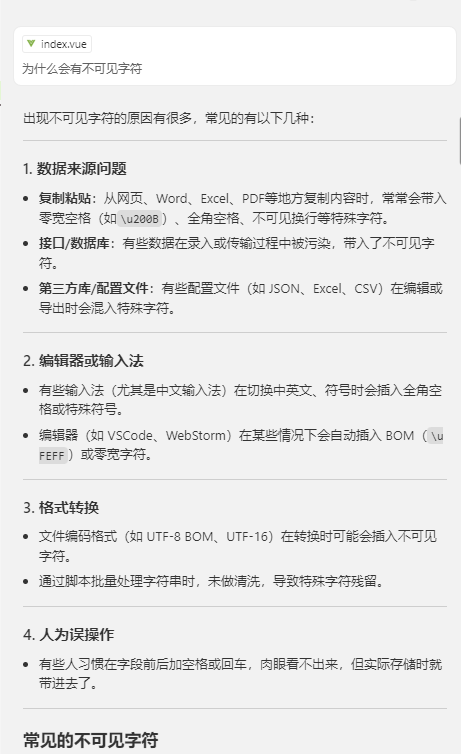
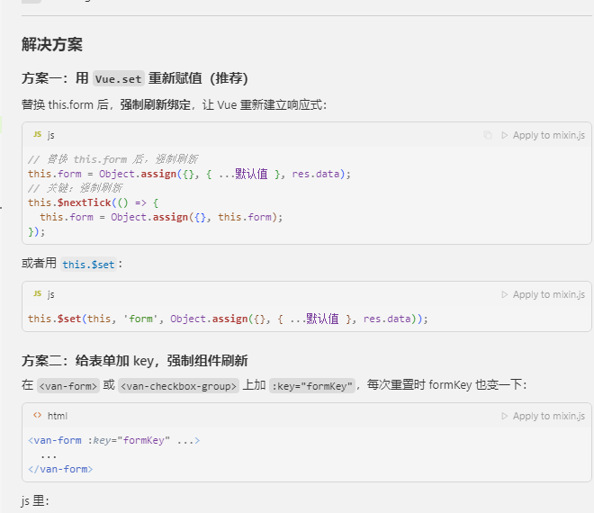
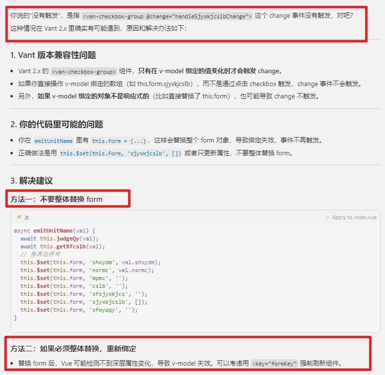
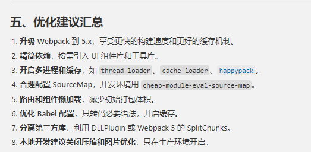

# 我的

arm

LiMing@ifugle.onaliyun.com

120329Tomorrow@liMing

120329698@TomorrowLi2

## 功能

- 版本上线更新提醒

## 难点

- ~~vant上传图片有拍摄功能和app有关，钉钉上的就不能拍照~~

- 精度问题tofixed

- 采集

  - 引导页图片加载
    - 1倍图和2倍图的区别
    - 2倍图过大，导致加载慢。使用压缩
    - 图片加载顺序不一致，在img上加onload事件，只有加载成功再加载下一个
  - 环境
    - h5和微信小程序环境联动，上一步，下一步，成功提交跳转
  - 从子组件带过来的对象，导致响应式无法同步。因为直接将带过来的对象unshift给父组件的list，此时只是引用子组件的地址，所以导致响应失效的
  - :key报错，排除是有相同的项
  - 查看更多选中之后，切换选中项，从查看更多里的那一项没有响应。先用set，unshift，都无效。因为是直接从子组件中传过来的对象，使用的是子组件中定义的对象地址，所以这一项在当前父组件是没有响应的

- 安全区域

- 为什么弹框要放最外层

  - 使用portal，因为单纯position会受它的上级所有的overflow：hidden影响，而被隐藏

  - 使用portal，默认是注入在根app上的，滚动时候因为它是在外层，所以显示在外层。

    feat: eqa-select防止注入在根app上的，导致父容器滚动，下拉框在外部能看到

    

    

- 组件解耦

  - 企业，场所。提取两种展示的公共组件
  - 30多个类别，最多8个要素，使用动态组件

- 微信公众号，定位

  - 一直报签名问题

    - 查看接口定位到是给wx.config数据不对，数据层级问题

      ```
      {
       "appId": "wx8ff075269fccc068",
       "timeStamp": 1751686307,
       "nonceStr": "abcdefg",
       "signature": "e013209404f27477c3668a0212b60e03dfb3864b",
       "url": "https://app-test.dingtax.cn/dsb/eqa/?corpId=XNZZ-11489-70&env=dd/",
       "ticket": "52Tw1_qSfGvjmabRE6VHqRUUT3FXUVVzr4mDgfFMEpcbQjgObqYIxxVN-tKs7KqZksTujLnjOG_lvIQO8E8HxA"
      }
      ```

    - 检测签名是否正确

  - 定位问题可能是url的问题（验签只和当前页面有关），去微信开发社区看提问，可能是hash导致的

  - 最后定位使用whistle代理导致的

  

- 在constans.js中对常量进行修改，会导致切换状态或者切换账号时，常量任然会是修改后的值

- ES6 Module 导入的是值的 **引用**，在vue的script外层创建变量，会导致这个变量一直被缓存，切换账号也会存在

  

- 子组件监听props.value,问题原因和解决方案：

  1. 问题原因：

  - company-select 组件期望接收的 value 格式是 { qyList: [], czytList: [], xzfs: 10 }

  - 但在 daily-check-create.vue 中，params.jcqyList 被初始化为空对象 {}

  - 这导致 company-select 组件的 watch:value 无法正确处理数据

  1. 解决方案：

  - 修改了 params.jcqyList 的初始化格式，确保包含所有必要字段

  - 在清空和重置时也使用正确的数据结构

  - 在编辑模式下也确保使用正确的数据结构

- 复制ai生成数据

  

  

- 11

  

  

优化




# 云效账号开通流程

https://ifugle.yuque.com/gs11fm/newbie/ennxt0zg8406ksd9?singleDoc# 


# 信息

## git

管理后台仓库：dsb-admin： https://codeup.aliyun.com/ifugle/dsb/front/dsb-admin/commits/release%2Fpre/

mobile-apps仓库： https://codeup.aliyun.com/ifugle/dsb/front/mobile-apps

## 语雀

语雀文档：https://ifugle.yuque.com/gs11fm/qv79be

## 账号

月维共享账号：https://moonvy.com/project/4baf5e17-18d1-41f6-a287-1244ab7bbc76

登录账号：dsb2020@ifugle.com

登录密码：ifugle2024

## 测试地址访问

账号：13588328862（自己的账号）

测试验证码：2222


登录地址一般需要加个后缀：?fromQy=true

- 本地服务访问，通过whistle代理，访问下面的测试地址

- 移动端：https://app-test.dingtax.cn/dsb/smzc/#/login?fromQyzz=1&backUrl=https%3A%2F%2Fapp-test.dingtax.cn%2Fdsb%2Fhome
- pc端：https://app-test.dingtax.cn/dsb/dsb-new/#/login?fromQy=true

## whistle代理

https://juejin.cn/post/7003630513755799589

代理配置如下

```
app-test.dingtax.cn localhost:9091
app-test.dingtax.cn log://
# app-gsnw.dingtax.cn localhost:8080
# app-gsnw.dingtax.cn log://
# app-pre.dingtax.cn localhost:9091
# app-pre.dingtax.cn log://
# app-test.dingtax.cn localhost:9091
# app-test.dingtax.cn log://
# # app-dsb.dingtax.cn localhost:9091
# app-dsb.dingtax.cn log://
# api-gsnw.dingtax.cn localhost:9091
# api-gsnw.dingtax.cn log://
# # app.dingtax.cn localhost:9091
# app.dingtax.cn log://
```


# 规范

- 工时提交地址（每天都要记录）：https://devops.aliyun.com/projex/project/e4cc4abdc9380fbaf7ac3fb415/req#viewIdentifier=d7f112f9d023e2108fa1b0d8&openWorkitemIdentifier=ffc6adaa2a9eda05390eef1aae
- 前端代码规范：https://ifugle.yuque.com/gs11fm/qv79be/ro9aifm52dlm7ac5#q9Vrt

# 项目知识点

## 环境

- node14
  - mobile-apps
  - dsb-admin

## 安装

- 熟悉项目的根目录README.md

- 每个项目都有packages子仓库，需要执行下面命令。

  ````
  ```bash
  $ git submodule update --init --recursive
  // 更新
  $ git submodule update --remote
  ```
  ````

- 执行npm i下载依赖
  - admin
    - @fed依赖需要单独拷贝到node_module中，需要先删除package.json中fed的依赖配置，再执行下载

## 组件

- 签名：fullScreenSign.vue
- 选择人员：src\apps\xxts\components\dt-multiple-tree.vue

## 工具方法

### 获取文件下载域名

**cxFilesBackEndUrl**

```
 window.open(`${cxFilesBackEndUrl()}${row.pgwjUrl}`, "_blank");
```


## 一起安

- 当前是园区企业选择的jclb非100时、认为是对自己企业的检查
  当前是园区企业选择的jclb是100时、任务是对承租企业的检查
- jclb

  - 100=对入驻企业的检查

  - 字段增加50=入驻企业
- wczt 

  - 完成状态集合:10=进行中,20=已完成,40=已取消，50超时未检查
- clzt　

  - 处理状态:0=未处理,10=处理中,20=处理完成	
- czzt
  - 10=搬迁,20=清退（倒闭）
- ywlx === 100日常检查

  - 101专项检查
- xczqsz === 20 按月
- qylx === 20 园区企业
- fxdj|风险等级:10=重大风险,20=较大风险,30=一般风险,40=低风险||false|string(byte)||
- qycslx|企业场所类型:10=企业,20=消防场所,30=消防重点企业,40=九小场所,50=一般单位||false|string(byte)||
- qylx|企业类型:10=一般企业,20=园区企业||false|string(byte)
- rylxDm|申请人角色:1=法定代表人,3=安全管理员,4=其他安全员,5=消防安全负责人,6=消防安全管理人,7=安全负责人,8=普通员工||false|string||

# 痛点

前端工程 如何提高团队的组件使用率

https://blog.csdn.net/yuleiming21/article/details/134165195

- 图标，项目图标割裂，有图片，有iconfont

  导致能共用的不能共用，而且不能预览所有的图标

- 公共组件不能分清移动端还是pc

- 公共枚举很少

- vant必须单独引用，form校验不执行

- 格式化，lint检测

- axios提示，默认报错会弹窗，导致重复弹窗

- 下拉框前端维护

  - 把所有选项存储在store里面，用一个对象存储

- 组件，

  - 组件重复度https://juejin.cn/post/7387237066012704787

    - 配置

      - threshold：表示重复度的阈值，超过这个值，就会输出错误报警。如阈值设为 10，当重复度为18.1%时，会提示以下错误❌，但代码的检测会正常完成。

      - reporters：表示生成结果检测报告的方式，一般有以下几种：

        console：控制台打印输出
        consoleFull：控制台完整打印重复代码块
        json：输出 json 格式的报告
        xml：输出 xml 格式的报告
        csv：输出 csv 格式的报告
        markdown：输出带有 markdown 格式的报告
        html：生成html报告到html文件夹
        verbose：输出大量调试信息到控制台

      - **ignore**：指定要忽略的文件或目录。可以使用通配符匹配多个文件或目录。

      - **languages**：指定要检测的语言。

      - format：需要进行重复度检测的源代码格式，目前支持150多种，我们常用的如 javascript、typescript、css 等

      - absolute：在检测报告中使用绝对路径

    - 响应

      - Clone found (javascript)：
        显示找到的重复代码块，这里是javascript文件。并且会显示重复代码在文件中具体的行数，便于查找。

        Format：文件格式，这里是 javascript，还可以是 scss、markup 等。

        Files analyzed：已分析的文件数量，统计被检测中的文件数量。

        Total lines：所有文件的总行数。

        Total tokens：所有的token数量，一行代码一般包含几个到几十个不等的token数量。

        Clones found：找到的重复块数量。

        Duplicated lines：重复的代码行数和占比。

        Duplicated tokens：重复的token数量和占比。

        Detection time：检测耗时。

    - 代码块

      jscpd 区分代码块的方式主要有以下几种：

      基于文件结构：

      - 在 Vue 文件中，会按照以下结构划分代码块：

        ```
             <template>  <!-- 模板代码块 -->
               <div>...</div>
             </template>
        
             <script>    <!-- 脚本代码块 -->
               export default {
                 ...
               }
             </script>
        
             <style>     <!-- 样式代码块 -->
               .class { ... }
             </style>
        ```

        

      基于语法结构：

      - 在 <script>中：

        ```
             // 函数定义
             function example() { ... }  // 一个代码块
             
             // 类定义
             class Example { ... }       // 一个代码块
             
             // 对象方法
             export default {
               methods: {
                 method1() { ... },      // 一个代码块
                 method2() { ... }       // 一个代码块
               }
             }
        ```

        

      基于配置的 min-lines 和 max-lines：

      ```
           {
             "min-lines": 150,    // 最小150行
             "max-lines": 3000    // 最大3000行
           }
      ```

      - 这意味着：

      - 小于150行的代码块不会被检测

      - 大于3000行的代码块不会被检测

      - 只有150-3000行之间的代码块才会被检测

      1. 实际检测示例：

         ```
            <!-- 文件A -->
            <template>
              <div class="container">
                <!-- 150行以上的模板代码 -->
              </div>
            </template>
         
            <script>
            export default {
              methods: {
                // 方法1：200行代码
                method1() { ... },
                
                // 方法2：100行代码（不会被检测，因为小于min-lines）
                method2() { ... }
              }
            }
            </script>
         
            <!-- 文件B -->
            <template>
              <div class="container">
                <!-- 150行以上的模板代码 -->
              </div>
            </template>
         ```

         

      在这个例子中：

      - method1 会被检测（因为超过150行）

      - method2 不会被检测（因为小于150行）

      - 模板部分会被检测（如果超过150行）

      1. 检测规则：

      - 代码块必须完整（不能跨文件）

      - 代码块必须连续（不能跳过中间部分）

      - 代码块必须满足行数要求（150-3000行）

      - 代码块之间的相似度必须超过阈值（60%）

    - 简单来说：

      - threshold 控制"多相似才算重复"（质量）

      - min-lines 和 max-lines 控制"多长才需要检测"（数量）

      在您的配置中：

      - 只有当代码块超过150行且小于3000行时，才会进行检测

      - 检测时，只有当相似度超过60%才会被标记为重复

      - 这样的配置可以：

      1. 避免检测太小的代码片段（减少误报）

      1. 避免检测过大的文件（提高性能）

      1. 只关注真正严重的代码重复问题（相似度>60%）

  - 组件知识库

    - 痛点
      - 同一个用途的组件被不同人多次实现，导致后续维护的人可能都不知道该怎么维护/很难维护
      - 我不知道原来项目里已经有这么个通用组件了
      - 我找到组件代码，但我不确定这个组件呈现效果是什么，是不是我想要的，对业务不熟，与其慢慢去捞页面找试用，干脆自己再撸一个
      - 我找到组件代码，也找到页面呈现效果，但我不知道该怎么使用，需要花时间去看源码
      - 应用之间的组件被相互应用
      - package组件不维护，都在子应用去做定制化
      - 
      
    - 需求
      - 新增一个文档项目，还是基于原有项目构建文档
      - 案例展示
      - 案例可编辑
      - 适配ai
      - 扩展除组件以外的工具
      - 语言：vue,react
      - 端：移动，pc
    
    - github
      - https://github.com/benjycui/bisheng
  


# AI

概念

- 智能体：智能体（Agent）就是能够感知环境并采取行动以实现某种目标的系统。它可以是一个软件程序、机器人，甚至是人类。
- token：


方式

- 大模型
  - 包公司的模型和知识库，输出对应行业的内容
- 工具
- 深度问答


过程

- 思考
  - 上下文，token数量

- 推理
  - 引用知识库
- 回答
- 扩展
  - 中止
  - sql
  - 命令行
  - 浏览器工具
  - 历史记录
  - 布局


# 周报

本周是刚来公司的第一周，完成了入职培训，也是在小蓟和同事的指导和帮助下逐渐融入了团队，同时春歌也做了公司和应急项目的培训，对于公司和项目有了更深的了解。

这周我也做了

- dsb-admin和mobile-apps项目环境搭建
- whistle的安装和配置
- 完成了一起安的新同事加入的前端页面
  - 审核列表页面
  - 邀请同事加入页面
  - 完成同意，重复加入页面的组件
  - 开发审核表单页面

