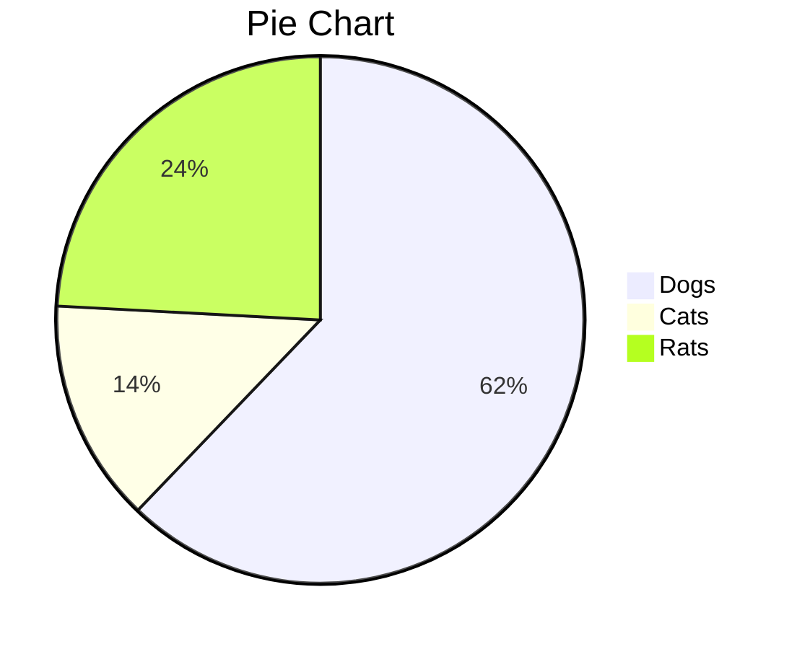
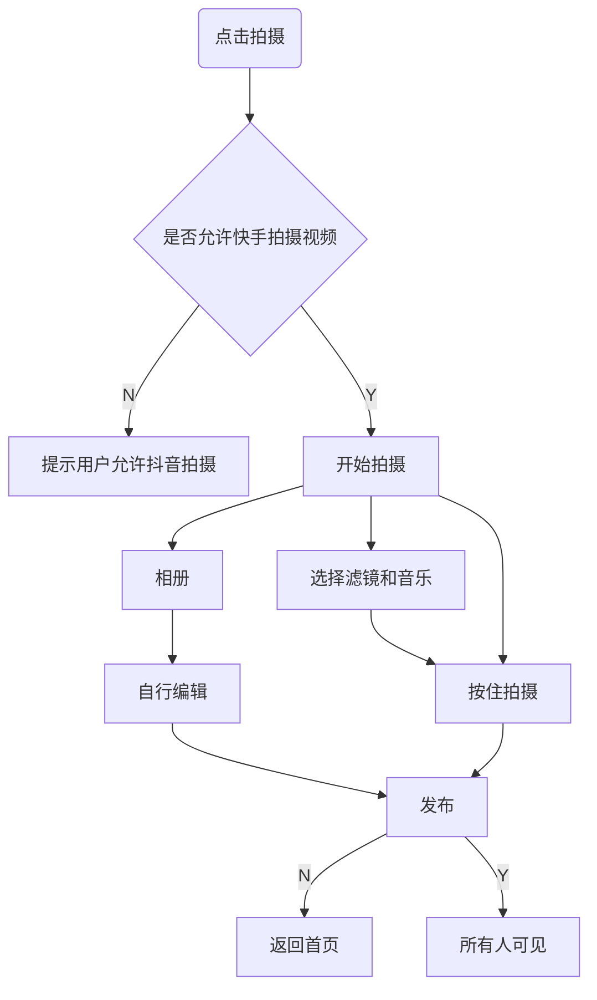
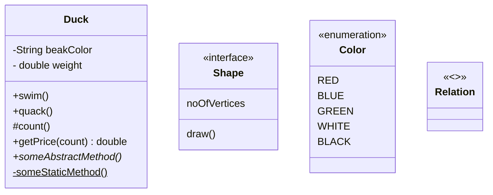

若是当前网络有问题，建议尝试重置一下：
启动 “Windows PowerShell (管理员)”，依次执行以下 5 条命令：

netsh winsock reset
netsh int ip reset
ipconfig /release
ipconfig /renew
ipconfig /flushdns

执行完毕后直接重启设备

# 软件

## vpn

https://v2.nanoport.xyz/#/dashboard 2420497892

https://muguacloud.bar/user/shop 2420497892

https://w1.ddnsgo.xyz/user/shop 2420497892

https://cloudnine.ga/#/plan 120329698

http://fastlink.pro/user/shop 120329698

## ensp

## Windows 

### Windows 字体 

https://sspai.com/post/35133

### 桌面

https://www.zhihu.com/question/45120814

软媒桌面

TranslucentTB

### 录屏工具

LICEcap

### 截屏

snipaste

### 手机/PC控制

- 向日葵，airdroid，电脑手机可以互相控制

- scrcpy：电脑控制手机，更快

  https://lining.fun/143.html

  - usb调试  ./scrcpy --mouse=uhid
  - wifi调试  ./scrcpy --mouse=uhid --tcpip

### vscode-zsh-theme

awesomepanda

fwalch

gianu

jispwoso

jonathan

kafeitu

philips

tonotdo

wedisagree

### 沙盒

https://www.sysgeek.cn/windows-sandbox/

### pyenv

查看当前版本

pyenv version

查看所有版本

pyenv versions

查看所有可安装的版本

pyenv install --list

安装指定版本

pyenv install 3.6.5

安装新版本后rehash一下

pyenv rehash

删除指定版本

pyenv uninstall 3.5.2

指定全局版本

pyenv global 3.6.5

指定多个全局版本, 3版本优先

pyenv global 3.6.5 2.7.14

实际上当你切换版本后, 相应的pip和包仓库都是会自动切换过去的

### mingGW

https://blog.csdn.net/qq_44918090/article/details/132190274

MinGW（Minimalist GNU for Windows） 是一个用于 Windows 平台的开发工具集，它提供了一组 GNU 工具和库，可以用于编译和构建本地的 Windows 应用程序。MinGW 的目标是在 Windows 环境下提供类似于 Unix/Linux 环境下的开发工具，使开发者能够轻松地在 Windows 上编写和编译 C、C++ 等程序。

### typora

插件

- https://blog.csdn.net/qq_57450444/article/details/139249046

  https://github.com/obgnail/typora_plugin

# 工具

## Typora

Ctr+L 选中当前句子
Ctr+D 选中当前词
Ctr+J  跳转到光标
Ctr+数字 标题
Ctr+Shift +K 代码块
Ctr+Shift +` 代码

### 文件

| 功能                 | 热键（Windows / Linux） | 热键（macOS）        |
| :------------------- | :---------------------- | :------------------- |
| 新                   | Ctrl + N.               | Command + N.         |
| 新窗户               | Ctrl + Shift + N.       | Command + Shift + N. |
| 新标签               | *（不支持）*            | Command + T.         |
| 打开                 | Ctrl + O.               | Command + O.         |
| 快速打开             | Ctrl + P.               | Command + Shift + O. |
| 重新打开已关闭的文件 | Ctrl + Shift + T.       | Command + Shift + T. |
| 保存                 | Ctrl + S.               | Command + S.         |
| 另存为/重复          | Ctrl + Shift + S.       | Command + Shift + S. |
| 偏爱                 | Ctrl +，                | Command +，          |
| 关                   | Ctrl + W                | Command + W          |

### 编辑

| 功能                                | 热键（Windows / Linux）    | 热键（macOS）                       |
| :---------------------------------- | :------------------------- | :---------------------------------- |
| 新段落                              | 输入                       | 输入                                |
| 新队                                | Shift + Enter              | Shift + Enter                       |
| 切                                  | Ctrl + X.                  | Command + X.                        |
| 复制                                | Ctrl + C.                  | Command + C.                        |
| 糊                                  | Ctrl + V.                  | Command + V.                        |
| 复制为Markdown                      | Ctrl + Shift + C.          | Command + Shift + C.                |
| 粘贴为纯文本                        | Ctrl + Shift + V.          | Command + Shift + V.                |
| 全选                                | Ctrl + A.                  | Command + A.                        |
| 选择行/句子 选择行（在表格中）      | Ctrl + L.                  | Command + L.                        |
| 删除行（在表中）                    | Ctrl + Shift + Backspace   | Command + Shift + Backspace         |
| 选择样式范围 选择单元格（在表格中） | Ctrl + E.                  | Command + E.                        |
| 选择Word                            | Ctrl + D.                  | Command + D.                        |
| 删除Word                            | Ctrl + Shift + D.          | Command + Shift + D.                |
| 跳到顶部                            | Ctrl + Home                | Command +↑                          |
| 跳转到选择                          | Ctrl + J                   | Command + J                         |
| 跳到Buttom                          | Ctrl + End                 | Command +↓                          |
| 找                                  | Ctrl + F.                  | Command + F.                        |
| 找下一个                            | F3 /回车                   | Command + G / Enter                 |
| 找到上一个                          | Shift + F3 / Shift + Enter | Command + Shift + G / Shift + Enter |
| 更换                                | Ctrl + H.                  | Command + H.                        |

### 段

| 功能         | 热键（Windows / Linux） | 热键（macOS）            |
| :----------- | :---------------------- | :----------------------- |
| 标题1到6     | Ctrl + 1/2/3/4/5/6      | Command + 1/2/3/4/5/6    |
| 段           | Ctrl + 0                | 命令+ 0                  |
| 提高标题级别 | Ctrl + =                | 命令+ =                  |
| 降低标题级别 | Ctrl + -                | 命令+ -                  |
| 表           | Ctrl + T.               | Command + Option + T.    |
| 代码围栏     | Ctrl + Shift + K.       | Command + Option + C.    |
| 数学块       | Ctrl + Shift + M.       | Command + Option + B.    |
| 引用         | Ctrl + Shift + Q.       | Command + Option + Q.    |
| 订购清单     | Ctrl + Shift + [        | Command + Option + O.    |
| 无序列表     | Ctrl + Shift +]         | Command + Option + U.    |
| 缩进         | Ctrl + [/ Tab           | Command + [/ Tab         |
| 减少缩进     | Ctrl +] / Shift + Tab   | Command +] / Shift + Tab |

### 格式

| 功能     | 热键（Windows / Linux）             | 热键（macOS）         |
| :------- | :---------------------------------- | :-------------------- |
| 强大     | Ctrl + B                            | Command + B.          |
| 重点     | Ctrl + I                            | 命令+我               |
| 强调     | Ctrl + U                            | Command + U.          |
| 码       | Ctrl + Shift +`| Command + Shift +` |                       |
| 罢工     | Alt + Shift + 5                     | Control + Shift +`    |
| 超链接   | Ctrl + K                            | Command + K.          |
| 图片     | Ctrl + Shift + I                    | Command + Control + I |
| 清除格式 | Ctrl + \                            | 命令+                 |

- [说明文字](#jump)，<span id = "jump">跳转到的位置</span>。Ctrl + 点击链接

### 视图

| 功能                      | 热键（Windows / Linux） | 热键（macOS）         |
| :------------------------ | :---------------------- | :-------------------- |
| 切换补充工具栏            | Ctrl + Shift + L.       | Command + Shift + L.  |
| 大纲                      | Ctrl + Shift + 1        | Command + Control + 1 |
| 用品                      | Ctrl + Shift + 2        | Command + Control + 2 |
| 文件树                    | Ctrl + Shift + 3        | Command + Control + 3 |
| 源代码模式                | Ctrl + /                | 命令+ /               |
| Fouus模式                 | F8                      | F8                    |
| 打字机模式                | F9                      | F9                    |
| Toggler全屏               | F11                     | Command + Option + F. |
| 真实大小                  | Ctrl + Shift + 0        | *（不支持）*          |
| 放大                      | Ctrl + Shift + =        | *（不支持）*          |
| 缩小                      | Ctrl + Shift + -        | *（不支持）*          |
| 在打开的Documnets之间切换 | Ctrl + Tab              | 命令+`                |
| 切换DevTools              | Ctrl + Shift + I        | -                     |

### 图形







UML类图




### 数学

https://www.latexlive.com/#

- 快捷键Ctrl+Shift+m
- “$$”+回车

#### 基础

##### 文字大小

修改大小

若需要显示更大或更小的字符，在符号前插入 `\large` 或 `\small` 命令。
$$
\large A A \small A
$$

##### 箭头

首字符大写时为双箭头、前面加long则为长箭头；

- \leftarrow: ← \leftarrow←
- \rightarrow: → \rightarrow→
- \longleftarrow: ⟵ \longleftarrow⟵
- \leftrightarrow: ↔ \leftrightarrow↔
- \Leftarrow: ⇐ \Leftarrow⇐
- \Longrightarrow: ⟹ \Longrightarrow⟹
- \Leftrightarrow: ⇔ \Leftrightarrow⇔
- \Longleftrightarrow: ⟺ \Longleftrightarrow⟺
- \uparrow: ↑ \uparrow↑
- \Downarrow: ⇓ \Downarrow⇓
- \Updownarrow: ⇕ \Updownarrow⇕

#### 排列

- 下标（`_`下划线）；$x_{ij}$
- 上标（`^`)$x^2$
- 根号（`\sqrt`）$ 2\sqrt4$
- 分数（`\frac{up}{down}`）$\frac{1}{2}$

通过`\begin{aligned} ...... \end{aligned}`，在公式中，用`\\` 表示换行， 用`&` 表示对齐（在需要对齐地方用&）；公式内不能出现无意义的空行（很多编辑器会解析出错）。
$$
\begin{aligned} 
		X
		&= (a+b)^2 \\
		&= a^2+b^2+2ab
\end{aligned}
$$

`()、[] 和 | `表示符号本身，使用 `\{\}` 来表示 {} 。当要显示大号的括号或分隔符时，要用 \left 和 \right 命令
$$
\left[
\frac{(x_{ij})_{max}^2}{MSE}
\right]
$$
若要只显示一边，此时需要使用`\left. 和 \right.`匹配（即，不需要显示的那边用点号替换）；如：
$$
\left. \frac{{\rm d}u}{{\rm d}x} \right| _{x=0}
$$

##### 方程组

$$
\left\{
	\begin{array}{c}
		a_1x+b_1y+c_1z=d_1\\
		a_2x+b_2y+c_2z=d_2\\
		a_3x+b_3y+c_3z=d_3
	\end{array}
\right.
$$

##### 上下花括号

$$
\overbrace{a+b+\dots+n}^{m个}
\underbrace{a+b+\dots+n}_{m个}
$$

##### 矩阵、行列式、方程组

多行多列的式子，都是使用`&`分割同行元素，使用`\\`换行

- 矩阵：`\begin{matrix}...\end{matrix}`括起来，使用&分割同行元素，\换行

$$
\begin{matrix}
	1 & x & x^2\\
	1 & y & y^2\\
	1 & z & z^2\\
	\end{matrix}
$$

- 行列式：在矩阵基础上添加`\left| ... \right|`

$$
X=\left|
	\begin{matrix}
		x_{11} & x_{12} & \cdots & x_{1d}\\
		x_{21} & x_{22} & \cdots & x_{2d}\\
		\vdots & \vdots & \ddots & \vdots \\
		x_{11} & x_{12} & \cdots & x_{1d}\\
	\end{matrix}
\right|
$$

- 分段函数：`\begin{cases} ... \end{cases}`包括

$$
f(n)=
	\begin{cases}
		n/2, & \text{if $n$ is even}\\
		3n+1,& \text{if $n$ is odd}
	\end{cases}
$$

#### 希腊字母


#### 数学字符

- $\max \limits_{a<x<b}\{f(x)\}$
- \sin{\theta}:$\sin{\theta}$
- \tan{\theta}:$\tan{\theta}$
- π: $\pi$
- \forall: ∀ 任意
- \exists: ∃ 存在
- $\delta$

#### 运算符

##### 算数运算符

- \times:  $\times$
- 范围（\sim）$\sim$
- \pm: ± 
- \mp: ∓ 
- \cdot: ⋅（点号）
- \div: ÷
- 

##### 关系运算符

- \neq: ≠
- \equiv: ≡
- \leq: ≤
- \geq: ≥
- \approx: ≈

##### 集合运算符

- \in: ∈
- \notin: ∉ 
- \subset: ⊂ 
- \supset: ⊃
- \subseteq: ⊆ 
- \supseteq: ⊇
- \cup: ∪
- \cap: ∩


#### 特殊符号

| 输入    | 显示      | 输入    | 显示      |
| ------- | --------- | ------- | --------- |
| \langle | $\langle$ | \rangle | $\rangle$ |
| \lceil  | $\lceil$  | \rceil  | $\rceil$  |
| \lfloor | $\lfloor$ | \rfloor | $\rfloor$ |
| \lbrace | $\lbrace$ | \rbrace | $\rbrace$ |


- \partial: ∂ 
- \infty: ∞ \infty∞
- \emptyset: ∅ \emptyset∅
- \cdots: $\cdots$
- \nabla: ∇ \nabla∇
- \bot: ⊥ \bot⊥
- \angle: ∠ \angle∠
- \because: ∵ \because∵
- \therefore: ∴ \therefore∴
- \quad: \quad（空格）

#### 高数

求和：`\sum(a)、\sum_1^n、\sum\limits_{i=1}^n`
$$
\sum(a)、\sum_1^n、\sum\limits_{i=1}^n
$$
求积：`\prod{x}、\prod_{n=1}^{10}{x_n}、\prod\limits_{n=1}^{10}{x_n}`
$$
求积：\prod{x}、\prod_{n=1}^{10}{x_n}、\prod\limits_{n=1}^{10}{x_n}
$$
积分：`\int_0^1f(x)dx`
$$
积分：\int_0^1f(x)dx
$$
微分：`\partial`
$$
微分：\partial
$$
一阶二阶导数：`\dot{x}、\ddot{x}`
$$
一阶二阶导数：\dot{x}、\ddot{x}
$$
极限：`\lim_{n\rightarrow\infty}{n}、\lim\limits_{n\rightarrow\infty}{n}`
$$
极限：\lim_{n\rightarrow\infty}{n}、\lim\limits_{n\rightarrow\infty}{n}
$$
对数：`\ln{x}、\log_a{x}`
$$
对数：\ln{x}、\log_a{x}
$$
矢量：`\vec{F}`
$$
矢量：\vec{F}
$$
算术平均值：`\bar{a}`
$$
算术平均值：\bar{a}
$$
概率分布：`\hat{a}`
$$
概率分布：\hat{a}
$$
平均数运算：`\overline{xyz}`
$$
平均数运算：\overline{xyz}
$$

# 配置文件

## npm

```
registry=https://registry.npm.taobao.org/
registry=https://registry.npmmirror.com/
disturl=https://mirrors.huaweicloud.com/nodejs/
electron_mirror=https://npmmirror.com/mirrors/electron/
strict-ssl=false
python=D:/software/java/pyenv-win-master/pyenv-win/versions/3.9.13/python.exe
msvs_version=2022
VCINSTALLDIR=C:/Program Files/Microsoft Visual Studio/2022/Community/VC
msbuild-path=C:/Program Files/Microsoft Visual Studio/2022/Community/MSBuild/Current/Bin/MSBuild.exe
```


- set

  - npm config set python D:/software/java/pyenv-win-master/pyenv-win/versions/3.9.1/python.exe

  - npm config set VCINSTALLDIR  ”C:/Program Files/Microsoft Visual Studio/2022/Community/VC“

  - npm config set msbuild-path "C:/Program Files/Microsoft Visual Studio/2022/Community/MSBuild/Current/Bin/MSBuild.exe"   


- get
  - npm config get python

## window

```
用户
GYP_MSVS_VERSION  2022
VCINSTALLDIR	C:\Program Files\Microsoft Visual Studio\2022\Community\VC

系统
gcc	D:\software\qt\Tools\mingw530_32\bin
JAVA_HOME	D:\software\java\jdk-8
M2_HOME		D:\software\java\apache-maven-3.6.3\bin
MAVEN_HOME	D:\software\java\apache-maven-3.6.3

path:
D:\software\qt\Tools\mingw530_32\bin
D:\software\python
D:\software\python\Scripts
%PYENV%\bin
%PYENV%\shims
%JAVA_HOME%\bin
%MAVEN_HOME%\bin
D:\software\java\jdk-8\java

PYENV	D:\software\pyenv-win-master\pyenv-win
VCINSTALLDIR	C:\Program Files\Microsoft Visual Studio\2022\Community\VC
```

## vim

```
" All system-wide defaults are set in $VIMRUNTIME/debian.vim and sourced by
" the call to :runtime you can find below.  If you wish to change any of those
" settings, you should do it in this file (/etc/vim/vimrc), since debian.vim
" will be overwritten everytime an upgrade of the vim packages is performed.
" It is recommended to make changes after sourcing debian.vim since it alters
" the value of the 'compatible' option.

" This line should not be removed as it ensures that various options are
" properly set to work with the Vim-related packages available in Debian.
runtime! debian.vim

" Vim will load $VIMRUNTIME/defaults.vim if the user does not have a vimrc.
" This happens after /etc/vim/vimrc(.local) are loaded, so it will override
" any settings in these files.
" If you don't want that to happen, uncomment the below line to prevent
" defaults.vim from being loaded.
" let g:skip_defaults_vim = 1

" Uncomment the next line to make Vim more Vi-compatible
" NOTE: debian.vim sets 'nocompatible'.  Setting 'compatible' changes numerous
" options, so any other options should be set AFTER setting 'compatible'.
"set compatible

" Vim5 and later versions support syntax highlighting. Uncommenting the next
" line enables syntax highlighting by default.
if has("syntax")
  syntax on
endif

" If using a dark background within the editing area and syntax highlighting
" turn on this option as well
"set background=dark

" Uncomment the following to have Vim jump to the last position when
" reopening a file
"if has("autocmd")
"  au BufReadPost * if line("'\"") > 1 && line("'\"") <= line("$") | exe "normal! g'\"" | endif
"endif

" Uncomment the following to have Vim load indentation rules and plugins
" according to the detected filetype.
"if has("autocmd")
"  filetype plugin indent on
"endif

" The following are commented out as they cause vim to behave a lot
" differently from regular Vi. They are highly recommended though.
"set showcmd		" Show (partial) command in status line.
"set showmatch		" Show matching brackets.
"set ignorecase		" Do case insensitive matching
"set smartcase		" Do smart case matching
"set incsearch		" Incremental search
"set autowrite		" Automatically save before commands like :next and :make
"set hidden		" Hide buffers when they are abandoned
"set mouse=a		" Enable mouse usage (all modes)

" Source a global configuration file if available
if filereadable("/etc/vim/vimrc.local")
  source /etc/vim/vimrc.local
endif


""""""""""""""""""""""""""""""""""""""""""""""""""""""""""""""""""""""""""""""""""""""""""
" 显示相关
""""""""""""""""""""""""""""""""""""""""""""""""""""""""""""""""""""""""""""""""""""""""""
set shortmess=atI   " 启动的时候不显示那个援助乌干达儿童的提示
winpos 5 5         " 设定窗口位置
"set lines=30 columns=85    " 设定窗口大小
set nu              " 显示行号
set go=             " 不要图形按钮
"color asmanian2     " 设置背景主题
set guifont=Courier_New:h10:cANSI   " 设置字体
syntax on           " 语法高亮
autocmd InsertLeave * se nocul  " 用浅色高亮当前行
autocmd InsertEnter * se cul    " 用浅色高亮当前行
set ruler           " 显示标尺
set showcmd         " 输入的命令显示出来，看的清楚些
set cmdheight=1     " 命令行（在状态行下）的高度，设置为1
"set whichwrap+=<,>,h,l   " 允许backspace和光标键跨越行边界(不建议)
set scrolloff=3     " 光标移动到buffer的顶部和底部时保持3行距离
set novisualbell    " 不要闪烁(不明白)
set statusline=%F%m%r%h%w\ [FORMAT=%{&ff}]\ [TYPE=%Y]\ [POS=%l,%v][%p%%]\ %{strftime(\"%d/%m/%y\ -\ %H:%M\")}   "状态行显示的内容
set laststatus=1    " 启动显示状态行(1),总是显示状态行(2)
set foldenable      " 允许折叠
set foldmethod=manual   " 手动折叠
set background=dark "背景使用黑色
set nocompatible  "去掉讨厌的有关vi一致性模式，避免以前版本的一些bug和局限
" 显示中文帮助
if version >= 603
    set helplang=cn
    set encoding=utf-8
endif
" 设置配色方案
"colorscheme murphy
"字体
"if (has("gui_running"))
"   set guifont=Bitstream\ Vera\ Sans\ Mono\ 10
"endif


set fencs=utf-8,ucs-bom,shift-jis,gb18030,gbk,gb2312,cp936
set termencoding=utf-8
set encoding=utf-8
set fileencodings=ucs-bom,utf-8,cp936
set fileencoding=utf-8

"""""""""""""""""""""""""""""""""""""""""""""""""""""""""""""""""""""""""""""""""""""""""""""""""
"""""新文件标题""""""""""""""""""""""""""""""""""""""""""""""""""""""""""""""""""""""""""""""""""""""""""""""""
"新建.c,.h,.sh,.java文件，自动插入文件头
autocmd BufNewFile *.cpp,*.[ch],*.sh,*.java exec ":call SetTitle()"
""定义函数SetTitle，自动插入文件头
func SetTitle()
    "如果文件类型为.sh文件
    if &filetype == 'sh'
        call setline(1,"\#########################################################################")
        call append(line("."), "\# File Name     : ".expand("%"))
        call append(line(".")+1, "\# Author        : enjoy5512")
        call append(line(".")+2, "\# mail          : enjoy5512@163.com")
        call append(line(".")+3, "\# Created Time  : ".strftime("%c"))
        call append(line(".")+4, "\#########################################################################")
        call append(line(".")+5, "")
        call append(line(".")+6, "\#!/bin/bash")
    call append(line(".")+7, "")
    call append(line(".")+8, "")
    else
        call setline(1, "/*************************************************************************")
        call append(line("."), "    > File Name       : ".expand("%"))
        call append(line(".")+1, "    > Author          : enjoy5512")
        call append(line(".")+2, "    > Mail            : enjoy5512@163.com ")
        call append(line(".")+3, "    > Created Time    : ".strftime("%c"))
        call append(line(".")+4, " ************************************************************************/")
        call append(line(".")+5, "")
    endif
    if &filetype == 'cpp'
        call append(line(".")+6, "#include<iostream>")
    call append(line(".")+7, "")
        call append(line(".")+8, "using namespace std;")
        call append(line(".")+9, "")
        call append(line(".")+10, "int main(int argc,char *argv[])")
        call append(line(".")+11, "{")
        call append(line(".")+12, "     ")
        call append(line(".")+13, "    return 0;")
        call append(line(".")+14, "}")
    endif
    if &filetype == 'c'
        call append(line(".")+6, "#include<stdio.h>")
        call append(line(".")+7, "")
        call append(line(".")+8, "int main(int argc,char *argv[])")
        call append(line(".")+9, "{")
        call append(line(".")+10, "     ")
        call append(line(".")+11, "    return 0;")
        call append(line(".")+12, "}")
    autocmd BufNewFile * 12 j
    endif
endfunc
""""""""""""""""""""""""""""""""""""""""""""""""""""""""""""""""""""""""""""""""""""""""""""""""""""""
"键盘命令
""""""""""""""""""""""""""""""""""""""""""""""""""""""""""""""""""""""""""""""""""""""""""""""""""""""
"C，C++ 按F5编译运行
map <F5> :call CompileRunGcc()<CR>
func! CompileRunGcc()
    exec "w"
    if &filetype == 'c'
        exec "!gcc % -o %<"
        exec "! ./%<"
    elseif &filetype == 'cpp'
        exec "!g++ % -o %<"
        exec "! ./%<"
    elseif &filetype == 'sh'
        :!./%
    endif
endfunc
"C,C++的调试
map <C-F5> :call Rungdb()<CR>
func! Rungdb()
    exec "w"
    if &filetype == 'c'
        exec "!gcc % -g -o %<"
        exec "!gdb -tui ./%<"
    elseif &filetype == 'cpp'
        exec "!g++ % -g -o %<"
        exec "!gdb -tui ./%<"
    endif
endfunc
""""""""""""""""""""""""""""""""""""""""""""""""""""""""""""""""""""""""""""""""""""""""""""""""""""""
""实用设置
"""""""""""""""""""""""""""""""""""""""""""""""""""""""""""""""""""""""""""""""""""""""""""""""""""""
" 设置当文件被改动时自动载入
set autoread
" quickfix模式
autocmd FileType c,cpp map <buffer> <leader><space> :w<cr>:make<cr>
"代码补全
set completeopt=preview,menu
"允许插件
filetype plugin on
"共享剪贴板
set clipboard+=unnamed
"从不备份
set nobackup
"自动保存
set autowrite
set ruler                   " 打开状态栏标尺
set cursorline              " 突出显示当前行
set magic                   " 设置魔术
set guioptions-=T           " 隐藏工具栏
set guioptions-=m           " 隐藏菜单栏
set foldcolumn=0
set foldmethod=indent
set foldlevel=3
set foldenable              " 开始折叠
" 不要使用vi的键盘模式，而是vim自己的
set nocompatible
" 语法高亮
set syntax=on
" 去掉输入错误的提示声音
set noeb
" 在处理未保存或只读文件的时候，弹出确认
set confirm
" 自动缩进
set autoindent
set cindent
" Tab键的宽度
set tabstop=4
" 统一缩进为4
set softtabstop=4
set shiftwidth=4
"禁止生成临时文件
set nobackup
set noswapfile
"搜索忽略大小写
set ignorecase
"搜索逐字符高亮
set hlsearch
set incsearch
"行内替换
set gdefault
"编码设置
set enc=utf-8
set fencs=utf-8,ucs-bom,shift-jis,gb18030,gbk,gb2312,cp936
"语言设置
set langmenu=zh_CN.UTF-8
set helplang=cn
" 我的状态行显示的内容（包括文件类型和解码）
set statusline=%F%m%r%h%w\ [FORMAT=%{&ff}]\ [TYPE=%Y]\ [POS=%l,%v][%p%%]\ %{strftime(\"%d/%m/%y\ -\ %H:%M\")}
"set statusline=[%F]%y%r%m%*%=[Line:%l/%L,Column:%c][%p%%]
"set statusline=\ %<%F[%1*%M%*%n%R%H]%=\ %y\ %0(%{&fileformat}\ %{&encoding}\ %c:%l/%L%)\
" 总是显示状态行
set laststatus=2
" 命令行（在状态行下）的高度，默认为1，这里是2
set cmdheight=2
" 侦测文件类型
filetype on
" 载入文件类型插件
filetype plugin on
" 为特定文件类型载入相关缩进文件
filetype indent on
" 保存全局变量
set viminfo+=!
" 在被分割的窗口间显示空白，便于阅读
set fillchars=vert:\ ,stl:\ ,stlnc:\
" 高亮显示匹配的括号
set showmatch
" 匹配括号高亮的时间（单位是十分之一秒）
set matchtime=1
" 光标移动到buffer的顶部和底部时保持3行距离
set scrolloff=3
" 为C程序提供自动缩进
set smartindent
" 高亮显示普通txt文件（需要txt.vim脚本）
au BufRead,BufNewFile *  setfiletype txt
"自动补全
":inoremap ( ()<ESC>i
":inoremap ) <c-r>=ClosePair(')')<CR>
:inoremap { {<CR>}<ESC>O
:inoremap } <c-r>=ClosePair('}')<CR>
":inoremap [ []<ESC>i
":inoremap ] <c-r>=ClosePair(']')<CR>
":inoremap " ""<ESC>i
":inoremap ' ''<ESC>i
function! ClosePair(char)
    if getline('.')[col('.') - 1] == a:char
        return "\<Right>"
    else
        return a:char
    endif
endfunction
filetype plugin indent on
"打开文件类型检测, 加了这句才可以用智能补全
set completeopt=longest,menu
```

## 微信开发者工具

```
{
    "editor.fontFamily": "Consolas",
    "editor.fontSize": 12,
    "editor.lineHeight": 24,
    "files.autoSave": "off",
    "editor.wordWrap": "on",
    "editor.minimap.enabled": false,
    "editor.insertSpaces": true,
    "editor.tabSize": 2,
    "workbench.editor.enablePreview": true,
    "workbench.editor.enablePreviewFromQuickOpen": true,
    "git.autofetch": true,
    "terminal.integrated.automationShell.windows": {
        "wsl": {
            "source": "PowerShell",
            "path": "C:\\WINDOWS\\System32\\wsl.exe",
            "args": ["-NoProfile"]
        }
    },
    "liveServer.settings.donotShowInfoMsg": true,
    "todo-tree.general.tags": [
        "BUG",
        "HACK",
        "FIXME",
        "TODO",
        "XXX",
        "[ ]",
        "[x]"
    ],
    "todo-tree.regex.regex": "(//|#|<!--|;|/\\*|^|^\\s*(-|\\d+.))\\s*($TAGS)",
    "powermode.enabled": true,
    "powermode.presets": "flames",
    "terminal.external.windowsExec": "C:\\Windows\\System32\\wsl.exe",
    "terminal.integrated.shell.windows": "C:\\Windows\\System32\\wsl.exe",
    "workbench.colorTheme": "GitHub Dark Default"
}
```


# 文件地址

C:\Windows\System32\drivers\etc\hosts


# 记录

学历编号  1107 9120 2105 0002 11

四川省遂宁市船山区嘉禾西路142号2单元6楼2号

# 密码

idea 1@To

软考 大写字母开头M


## github

```
6ebb0-10a9c
90b6e-eb89f
69b56-1a310
832b9-cb1f3
b8e7c-083ae
50dcc-089ae
0070b-b5ddc
e5a49-31624
74257-1ead1
949ef-fb7d1
added-cd857
b8d55-73a61
1524b-220ff
da471-14e36
6de57-feb56
4b66b-72b90

```


## w11密钥

J7QT3-3GCPG-9GVWT-CH2XR-GMRJM

VK7JG-NPHTM-C97JM-9MPGT-3V66T

TPYNC-4J6KF-4B4GP-2HD89-7XMP6
