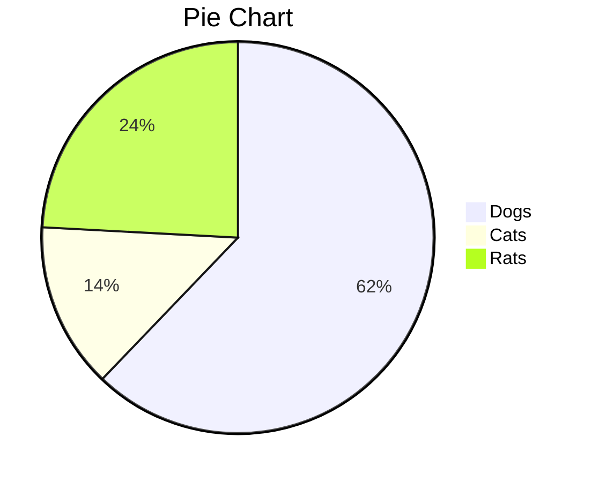
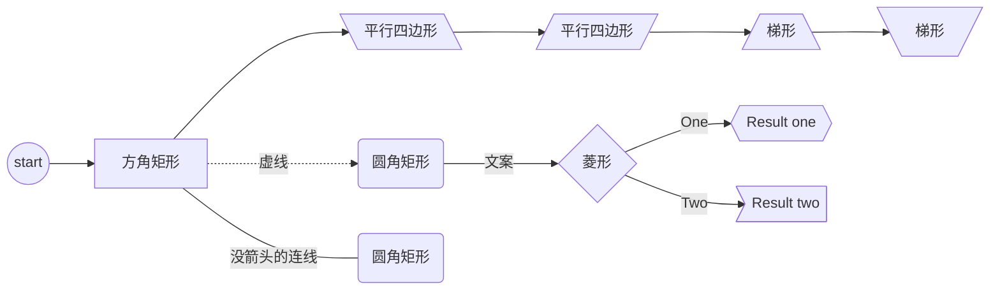
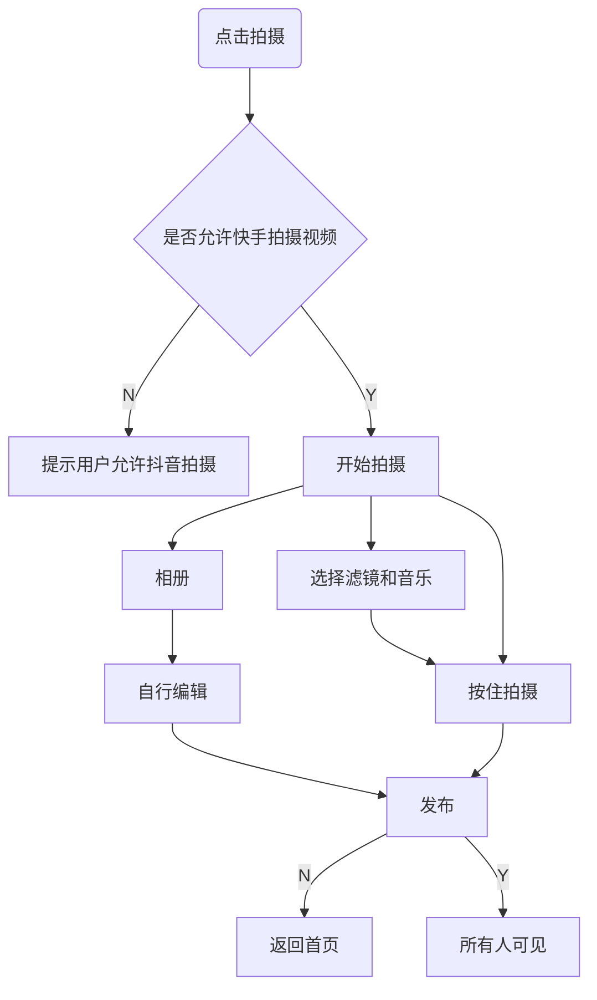
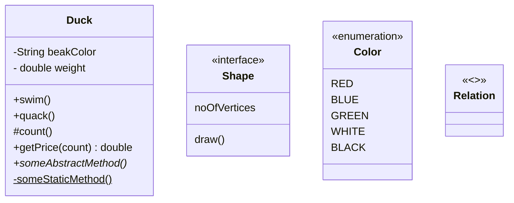
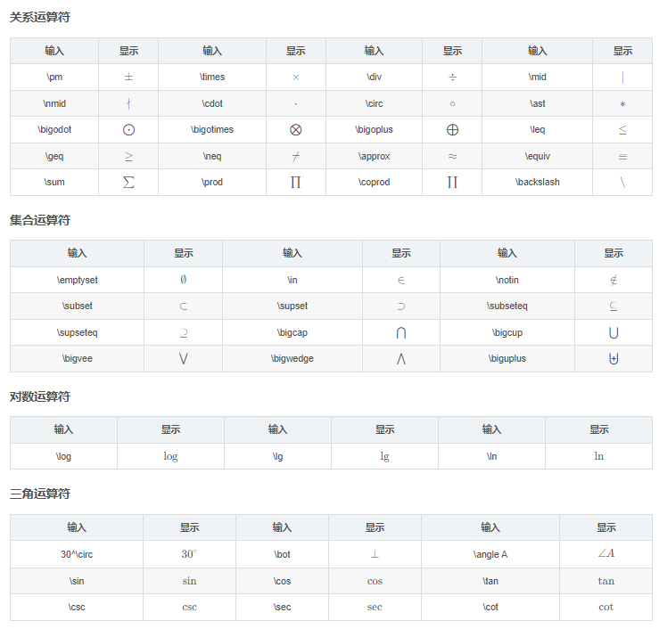
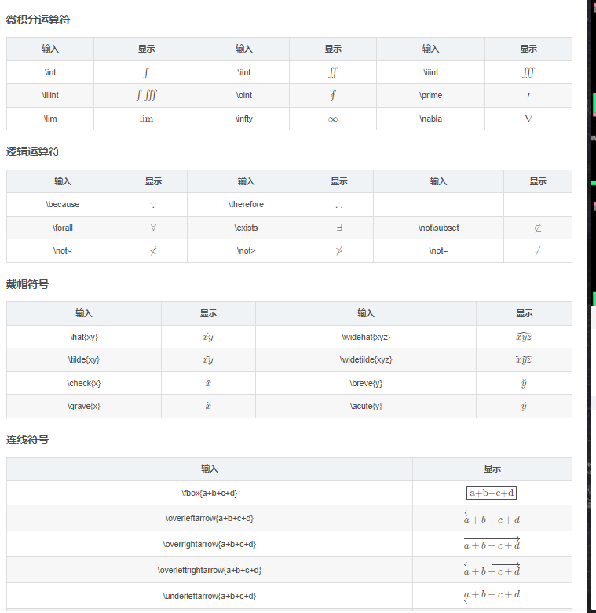

# Windows 

## 终端命令是怎么被执行的

> window 在终端 输入node是怎么知道有这个命令的
>
> 在 Windows 终端中输入 `node` 时，系统能够找到并执行该命令，是因为它遵循了一套 **环境变量（Environment Variables）** 和 **搜索路径（PATH）** 机制

| 步骤                  | 系统行为                            |
| :-------------------- | :---------------------------------- |
| 1. 检查是否是内部命令 | 如果不是，继续查找                  |
| 2. 查找当前目录       | 检查是否有 `node.exe`               |
| 3. 检查 `PATH` 变量   | 在所有 `PATH` 目录中查找 `node.exe` |
| 4. 找到则执行         | 运行 `node.exe`                     |
| 5. 找不到则报错       | 提示 `'node' 不是命令`              |

### **1. 检查是否是内部命令**

Windows 终端（`cmd` 或 `PowerShell`）首先会检查 `node` 是否是：

- **内置命令**（如 `dir`、`cd`、`echo` 等）
  → `node` 不是内置命令，继续查找。

### **2. 查找当前目录**

终端会检查 **当前工作目录** 是否有可执行文件：

- `node.exe`
- `node.cmd`
- `node.bat`
- `node.ps1`（PowerShell 脚本）

如果当前目录有 `node.exe`，就会直接执行它。否则，继续查找。

### **3. 检查 `PATH` 环境变量**

如果当前目录没有 `node`，系统会去 **`PATH` 环境变量** 列出的目录中查找。

**如何查看 `PATH`？**

- **在 `cmd` 中运行：**

  cmd

  ```
  echo %PATH%
  ```

- **在 `PowerShell` 中运行：**

  powershell

  ```
  $env:PATH
  ```

  你会看到类似这样的输出（多个路径用 `;` 分隔）：

  text

  ```
  C:\Windows\System32;C:\Windows;C:\Program Files\nodejs;...
  ```

  **系统会按顺序在这些路径中查找 `node.exe`。**

### **4. 如果找到 `node.exe`，就执行它**

例如，如果 `PATH` 包含：

text

```
C:\Program Files\nodejs
```

并且该目录下有 `node.exe`，那么输入 `node` 时就会执行：

text

```
C:\Program Files\nodejs\node.exe
```


### 5. 如果找不到，报错

如果 `PATH` 没有包含 `node.exe` 所在的目录，就会报错：

text

```
'node' 不是内部或外部命令，也不是可运行的程序或批处理文件。
```

这说明：

1. **Node.js 没有安装**，或者
2. **Node.js 的安装路径没有添加到 `PATH`**。


### 怎么设置

- 通过命令行临时添加

  ```
  set PATH=%PATH%;C:\Program Files\gnuplot\bin
  ```

  

- 通过图形界面设置

  - 按下 **Win + R**，输入 `sysdm.cpl`，回车打开 **系统属性**。
  - 切换到 **高级** 选项卡 → 点击 **环境变量**。
  - 在 **系统变量** 中找到 `Path`，点击 **编辑**。
  - 点击 **新建**，添加 GNUplot 的 `bin` 目录路径（如 `C:\Program Files\gnuplot\bin`）。
  - 逐一点击 **确定** 保存。

## 工具

### Windows 字体 

https://sspai.com/post/35133

### 桌面

https://www.zhihu.com/question/45120814

软媒桌面

TranslucentTB

### 录屏工具

LICEcap

### 截屏

snipaste

### 手机/PC控制

- 向日葵，airdroid，电脑手机可以互相控制

- scrcpy：电脑控制手机，更快

  https://lining.fun/143.html

  - usb调试  ./scrcpy --mouse=uhid
  - wifi调试  ./scrcpy --mouse=uhid --tcpip

### vscode-zsh-theme

awesomepanda

fwalch

gianu

jispwoso

jonathan

kafeitu

philips

tonotdo

wedisagree

### 沙盒

https://www.sysgeek.cn/windows-sandbox/

# 软件

## vpn

https://v2.nanoport.xyz/#/dashboard 2420497892

https://muguacloud.bar/user/shop 2420497892

https://w1.ddnsgo.xyz/user/shop 2420497892

https://cloudnine.ga/#/plan 120329698

http://fastlink.pro/user/shop 120329698

## ensp


## pyenv

https://blog.csdn.net/taogumo/article/details/148562192

查看当前版本

pyenv version

查看所有版本

pyenv versions

查看所有可安装的版本

pyenv install --list

安装指定版本

pyenv install 3.6.5

安装新版本后rehash一下

pyenv rehash

删除指定版本

pyenv uninstall 3.5.2

指定全局版本

pyenv global 3.6.5

指定多个全局版本, 3版本优先

pyenv global 3.6.5 2.7.14

实际上当你切换版本后, 相应的pip和包仓库都是会自动切换过去的

## mingGW

https://blog.csdn.net/qq_44918090/article/details/132190274

MinGW（Minimalist GNU for Windows） 是一个用于 Windows 平台的开发工具集，它提供了一组 GNU 工具和库，可以用于编译和构建本地的 Windows 应用程序。MinGW 的目标是在 Windows 环境下提供类似于 Unix/Linux 环境下的开发工具，使开发者能够轻松地在 Windows 上编写和编译 C、C++ 等程序。


# 工具

## Typora

Ctr+L 选中当前句子
Ctr+D 选中当前词
Ctr+J  跳转到光标
Ctr+数字 标题
Ctr+Shift +K 代码块
Ctr+Shift +` 代码

### 插件

- https://blog.csdn.net/qq_57450444/article/details/139249046

  https://github.com/obgnail/typora_plugin

### 文件

| 功能                 | 热键（Windows / Linux） | 热键（macOS）        |
| :------------------- | :---------------------- | :------------------- |
| 新                   | Ctrl + N.               | Command + N.         |
| 新窗户               | Ctrl + Shift + N.       | Command + Shift + N. |
| 新标签               | *（不支持）*            | Command + T.         |
| 打开                 | Ctrl + O.               | Command + O.         |
| 快速打开             | Ctrl + P.               | Command + Shift + O. |
| 重新打开已关闭的文件 | Ctrl + Shift + T.       | Command + Shift + T. |
| 保存                 | Ctrl + S.               | Command + S.         |
| 另存为/重复          | Ctrl + Shift + S.       | Command + Shift + S. |
| 偏爱                 | Ctrl +，                | Command +，          |
| 关                   | Ctrl + W                | Command + W          |

### 编辑

| 功能                                | 热键（Windows / Linux）    | 热键（macOS）                       |
| :---------------------------------- | :------------------------- | :---------------------------------- |
| 新段落                              | 输入                       | 输入                                |
| 新队                                | Shift + Enter              | Shift + Enter                       |
| 切                                  | Ctrl + X.                  | Command + X.                        |
| 复制                                | Ctrl + C.                  | Command + C.                        |
| 糊                                  | Ctrl + V.                  | Command + V.                        |
| 复制为Markdown                      | Ctrl + Shift + C.          | Command + Shift + C.                |
| 粘贴为纯文本                        | Ctrl + Shift + V.          | Command + Shift + V.                |
| 全选                                | Ctrl + A.                  | Command + A.                        |
| 选择行/句子 选择行（在表格中）      | Ctrl + L.                  | Command + L.                        |
| 删除行（在表中）                    | Ctrl + Shift + Backspace   | Command + Shift + Backspace         |
| 选择样式范围 选择单元格（在表格中） | Ctrl + E.                  | Command + E.                        |
| 选择Word                            | Ctrl + D.                  | Command + D.                        |
| 删除Word                            | Ctrl + Shift + D.          | Command + Shift + D.                |
| 跳到顶部                            | Ctrl + Home                | Command +↑                          |
| 跳转到选择                          | Ctrl + J                   | Command + J                         |
| 跳到Buttom                          | Ctrl + End                 | Command +↓                          |
| 找                                  | Ctrl + F.                  | Command + F.                        |
| 找下一个                            | F3 /回车                   | Command + G / Enter                 |
| 找到上一个                          | Shift + F3 / Shift + Enter | Command + Shift + G / Shift + Enter |
| 更换                                | Ctrl + H.                  | Command + H.                        |

### 段

| 功能         | 热键（Windows / Linux） | 热键（macOS）            |
| :----------- | :---------------------- | :----------------------- |
| 标题1到6     | Ctrl + 1/2/3/4/5/6      | Command + 1/2/3/4/5/6    |
| 段           | Ctrl + 0                | 命令+ 0                  |
| 提高标题级别 | Ctrl + =                | 命令+ =                  |
| 降低标题级别 | Ctrl + -                | 命令+ -                  |
| 表           | Ctrl + T.               | Command + Option + T.    |
| 代码围栏     | Ctrl + Shift + K.       | Command + Option + C.    |
| 数学块       | Ctrl + Shift + M.       | Command + Option + B.    |
| 引用         | Ctrl + Shift + Q.       | Command + Option + Q.    |
| 订购清单     | Ctrl + Shift + [        | Command + Option + O.    |
| 无序列表     | Ctrl + Shift +]         | Command + Option + U.    |
| 缩进         | Ctrl + [/ Tab           | Command + [/ Tab         |
| 减少缩进     | Ctrl +] / Shift + Tab   | Command +] / Shift + Tab |

### 格式

| 功能     | 热键（Windows / Linux）             | 热键（macOS）         |
| :------- | :---------------------------------- | :-------------------- |
| 强大     | Ctrl + B                            | Command + B.          |
| 重点     | Ctrl + I                            | 命令+我               |
| 强调     | Ctrl + U                            | Command + U.          |
| 码       | Ctrl + Shift +`| Command + Shift +` |                       |
| 罢工     | Alt + Shift + 5                     | Control + Shift +`    |
| 超链接   | Ctrl + K                            | Command + K.          |
| 图片     | Ctrl + Shift + I                    | Command + Control + I |
| 清除格式 | Ctrl + \                            | 命令+                 |

- [说明文字](#jump)，<span id = "jump">跳转到的位置</span>。Ctrl + 点击链接

### 视图

| 功能                      | 热键（Windows / Linux） | 热键（macOS）         |
| :------------------------ | :---------------------- | :-------------------- |
| 切换补充工具栏            | Ctrl + Shift + L.       | Command + Shift + L.  |
| 大纲                      | Ctrl + Shift + 1        | Command + Control + 1 |
| 用品                      | Ctrl + Shift + 2        | Command + Control + 2 |
| 文件树                    | Ctrl + Shift + 3        | Command + Control + 3 |
| 源代码模式                | Ctrl + /                | 命令+ /               |
| Fouus模式                 | F8                      | F8                    |
| 打字机模式                | F9                      | F9                    |
| Toggler全屏               | F11                     | Command + Option + F. |
| 真实大小                  | Ctrl + Shift + 0        | *（不支持）*          |
| 放大                      | Ctrl + Shift + =        | *（不支持）*          |
| 缩小                      | Ctrl + Shift + -        | *（不支持）*          |
| 在打开的Documnets之间切换 | Ctrl + Tab              | 命令+`                |
| 切换DevTools              | Ctrl + Shift + I        | -                     |

### 图形









UML类图




### 数学

https://www.latexlive.com/#

- 快捷键Ctrl+Shift+m
- “$$”+回车

#### 基础

##### 文字大小

修改大小

若需要显示更大或更小的字符，在符号前插入 `\large` 或 `\small` 命令。
$$
\large A A \small A
$$

##### 箭头

首字符大写时为双箭头、前面加long则为长箭头；

- \leftarrow: ← \leftarrow←
- \rightarrow: → \rightarrow→
- \longleftarrow: ⟵ \longleftarrow⟵
- \leftrightarrow: ↔ \leftrightarrow↔
- \Leftarrow: ⇐ \Leftarrow⇐
- \Longrightarrow: ⟹ \Longrightarrow⟹
- \Leftrightarrow: ⇔ \Leftrightarrow⇔
- \Longleftrightarrow: ⟺ \Longleftrightarrow⟺
- \uparrow: ↑ \uparrow↑
- \Downarrow: ⇓ \Downarrow⇓
- \Updownarrow: ⇕ \Updownarrow⇕

#### 排列

- 下标（`_`下划线）；$x_{ij}$
- 上标（`^`)$x^2$
- 根号（`\sqrt`）$ 2\sqrt4$
- 分数（`\frac{up}{down}`）$\frac{1}{2}$

通过`\begin{aligned} ...... \end{aligned}`，在公式中，用`\\` 表示换行， 用`&` 表示对齐（在需要对齐地方用&）；公式内不能出现无意义的空行（很多编辑器会解析出错）。
$$
\begin{aligned} 
		X
		&= (a+b)^2 \\
		&= a^2+b^2+2ab
\end{aligned}
$$

`()、[] 和 | `表示符号本身，使用 `\{\}` 来表示 {} 。当要显示大号的括号或分隔符时，要用 \left 和 \right 命令
$$
\left[
\frac{(x_{ij})_{max}^2}{MSE}
\right]
$$
若要只显示一边，此时需要使用`\left. 和 \right.`匹配（即，不需要显示的那边用点号替换）；如：
$$
\left. \frac{{\rm d}u}{{\rm d}x} \right| _{x=0}
$$

##### 方程组

$$
\left\{
	\begin{array}{c}
		a_1x+b_1y+c_1z=d_1\\
		a_2x+b_2y+c_2z=d_2\\
		a_3x+b_3y+c_3z=d_3
	\end{array}
\right.
$$

##### 上下花括号

$$
\overbrace{a+b+\dots+n}^{m个}
\underbrace{a+b+\dots+n}_{m个}
$$

##### 矩阵、行列式、方程组

多行多列的式子，都是使用`&`分割同行元素，使用`\\`换行

- 矩阵：`\begin{matrix}...\end{matrix}`括起来，使用&分割同行元素，\换行

$$
\begin{matrix}
	1 & x & x^2\\
	1 & y & y^2\\
	1 & z & z^2\\
	\end{matrix}
$$

- 行列式：在矩阵基础上添加`\left| ... \right|`

$$
X=\left|
	\begin{matrix}
		x_{11} & x_{12} & \cdots & x_{1d}\\
		x_{21} & x_{22} & \cdots & x_{2d}\\
		\vdots & \vdots & \ddots & \vdots \\
		x_{11} & x_{12} & \cdots & x_{1d}\\
	\end{matrix}
\right|
$$

- 分段函数：`\begin{cases} ... \end{cases}`包括

$$
f(n)=
	\begin{cases}
		n/2, & \text{if $n$ is even}\\
		3n+1,& \text{if $n$ is odd}
	\end{cases}
$$

#### 希腊字母


#### 数学字符

- $\max \limits_{a<x<b}\{f(x)\}$
- \sin{\theta}:$\sin{\theta}$
- \tan{\theta}:$\tan{\theta}$
- π: $\pi$
- \forall: ∀ 任意
- \exists: ∃ 存在
- $\delta$

#### 运算符

##### 算数运算符

- \times:  $\times$
- 范围（\sim）$\sim$
- \pm: ± 
- \mp: ∓ 
- \cdot: ⋅（点号）
- \div: ÷
- 

##### 关系运算符

- \neq: ≠
- \equiv: ≡
- \leq: ≤
- \geq: ≥
- \approx: ≈

##### 集合运算符

- \in: ∈
- \notin: ∉ 
- \subset: ⊂ 
- \supset: ⊃
- \subseteq: ⊆ 
- \supseteq: ⊇
- \cup: ∪
- \cap: ∩






#### 特殊符号

| 输入    | 显示      | 输入    | 显示      |
| ------- | --------- | ------- | --------- |
| \langle | $\langle$ | \rangle | $\rangle$ |
| \lceil  | $\lceil$  | \rceil  | $\rceil$  |
| \lfloor | $\lfloor$ | \rfloor | $\rfloor$ |
| \lbrace | $\lbrace$ | \rbrace | $\rbrace$ |


- \partial: ∂ 
- \infty: ∞ \infty∞
- \emptyset: ∅ \emptyset∅
- \cdots: $\cdots$
- \nabla: ∇ \nabla∇
- \bot: ⊥ \bot⊥
- \angle: ∠ \angle∠
- \because: ∵ \because∵
- \therefore: ∴ \therefore∴
- \quad: \quad（空格）

#### 高数

求和：`\sum(a)、\sum_1^n、\sum\limits_{i=1}^n`
$$
\sum(a)、\sum_1^n、\sum\limits_{i=1}^n
$$
求积：`\prod{x}、\prod_{n=1}^{10}{x_n}、\prod\limits_{n=1}^{10}{x_n}`
$$
求积：\prod{x}、\prod_{n=1}^{10}{x_n}、\prod\limits_{n=1}^{10}{x_n}
$$
积分：`\int_0^1f(x)dx`
$$
积分：\int_0^1f(x)dx
$$
微分：`\partial`
$$
微分：\partial
$$
一阶二阶导数：`\dot{x}、\ddot{x}`
$$
一阶二阶导数：\dot{x}、\ddot{x}
$$
极限：`\lim_{n\rightarrow\infty}{n}、\lim\limits_{n\rightarrow\infty}{n}`
$$
极限：\lim_{n\rightarrow\infty}{n}、\lim\limits_{n\rightarrow\infty}{n}
$$
对数：`\ln{x}、\log_a{x}`
$$
对数：\ln{x}、\log_a{x}
$$
矢量：`\vec{F}`
$$
矢量：\vec{F}
$$
算术平均值：`\bar{a}`
$$
算术平均值：\bar{a}
$$
概率分布：`\hat{a}`
$$
概率分布：\hat{a}
$$
平均数运算：`\overline{xyz}`
$$
平均数运算：\overline{xyz}
$$


# 文件地址

C:\Windows\System32\drivers\etc\hosts


