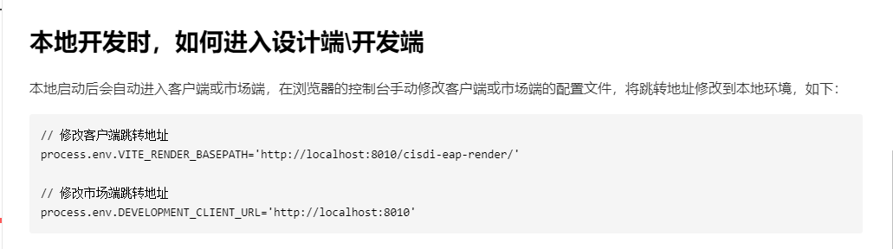

- 

- https://dev-platform.cisdigital.cn/layout/interactiveanalyze/JHSFX/SJMXNEW/#/dataModel

  admin/Qwer1357
  
- https://iiptest.rizhaosteel.com/layout/#/

  iipAdmin/Abcd1234

# qbeeOpenApi

```
qbeeOpenApi.turn2MenuByCodeOrId({
	menuCode: 'QXZBSQ111'
});
```

# 工作总结

2022年我参与了武钢三热轧和板坯的前端开发，部署以及上线的修复。我基于公司的基本vue架构以及业务上，将整体的layout布局，以及路由，面包屑，store状态树，socket的基本功能进行了开发，又在吴亮负责人的帮助下，进行的项目打包的配置，成功将测试版部署到线上，有利于产品测试的验收。后期随着业务的推进以及人员的扩大，我相继封装了一些公共组件提供给前端，并尽所能提供一些技术的支持给到他们。团队上，和产品一起研讨需求，开发上和后端定义好接口参数，进行页面的渲染，及时响应测试所提出的bug。后期也是在前端张焕长的带领下，将开发更加的规范。回顾2022，我学会了从0到1搭建部署一个项目，组件的封装如何具有可维护性等等


工业互联网业务开发。实时数字采集基于electron进行框架的搭建，完成点位采集业务功能以及后期优化迭代，实现用户采集授权，以及监听采集授权时间响应不同的业务场景，完成基于docsify的用户手册并嵌入到数采中。云创项目，将实验室官网嵌入云创官网中，通过父子页面通信实现用户登录一体化，无感化，以及页面和功能的新增和优化。

# 水土云

admin/Dsep@cisdi2022$

admin/Abcd1234

- fe-qbee

  

  - fe-eb-auth 轻蜂平台-登录sso
  - fe-qbee-config-manage 轻蜂配置管理

  - fe-platforms 权限待办
    - fe-eb-usercenter 文件上传
    - fe-vue-contacts 通讯录

- dsep

  


## project:layout

node:12.16.0

# 数采

admin/times@123

实时数据采集是赛迪信息打造的实时数据库下的实时数据采集产品，该产品主要**实现了实时数据从各种源头进行采集、整合、处理并存储到实时数据库中的过程**。这些源头可以来自各种类型的传感器、设备、机器人，甚至其他数据库和采集器，旨在实现对实时数据的准确、高效地采集和管理。

### [连接配置](https://times.cisdigital.cn/integration/docsify/index.html#/docs/cn/operate?id=_131-连接配置)

内置多种工业通用协议，通过配置“连接”-“设备”-“点位”，实现对点位实时数据的快速采集，并支持查看点位采集最新值以及质量戳等相关信息。


实时数据采集流程

- 操作流程如下：

1、新增连接，关联采集所需协议，同时填写**协议**相关参数。

2、在该连接下，点击新增设备，填写设备相关参数，同时设置设备默认开启采集，选择后设备在配置点位后会自动开始采集数据，无需再次触发。

3、在该设备下，新增点位，填写点位相关参数。

4、新增点位完成后，点位自动开始采集。可查看点位的最新值、最新值质量戳以及最新值更新时间。

5、若存在一组相关联或具有相似属性的点位，则可新增点位组，在点位组下新增点位。

> **什么是“连接”？**
>
> **连接是计算机与一个或多个外部设备之间建立通信连接的媒介。**在添加外部设备时，用户需要先定义使用的连接来实现与设备的通信。连接与设备协议息息相关，创建连接时需要选择将适用于该连接的协议。通过使用连接，可以方便地管理和控制与外部设备的通信，并实现数据传输和交互。

> **什么是“设备”？**
>
> 工业实时数据库中，设备通常指与服务器通信的工业设备，如PLC、传感器、驱动器等。这些设备通过创建连接实现数据的通信，注意，连接所使用协议会影响该连接下所能接入的设备类型。

> 新增设备完成后，即可新增设备下的点位。**点位用于标识和管理设备的数据点，每个数据点代表设备的状态或相关参数。**

### [存储配置](https://times.cisdigital.cn/integration/docsify/index.html#/docs/cn/operate?id=_132-存储配置)

存储配置下支持**将采集到的数据根据用户配置的存储方式存储到数据库**进行历史数据存储。支持全量存储以及选点存储。


图 2.2-1 存储配置流程

- 操作流程如下：

1、添加存储目的数据源。

​	添加导入数据库的地址信息

> 数据源是连接到数据库的一类路径，包含了访问数据库的信息（地址、用户名、密码等）。通过添加目的数据源，能够确定采集数据的目的存储位置。

2、选择存储目的数据库，同时设置存储方式以及存储策略。存储方式目前包括全量存储以及选点存储。全量存储：默认采集中定义的所有点位均需要存储到该数据库下。选点存储：选择需要存储的点位存储到该数据库下。存储策略包括即时存储以及按每个扫描周期存储。

​	选择存储数据源下的数据库

> 数据库用于存储、组织、管理数据。注意，目的数据源会影响所能添加的数据库。

3、若存储目的数据库选择全量存储时，存储点位列表会默认展示当前所定义的所有点位。

4、若存储目的数据库选择选点存储时，需要手动添加点位，支持批量导入。

### [第三方服务](https://times.cisdigital.cn/integration/docsify/index.html#/docs/cn/operate?id=_133-第三方服务)

支持用户通过API、消息队列（RocketMQ、**Kafka**）调用等方式将数据**提供给外部系统和应用程序（数据资产）**，全面打通数据应用和数据消费通道，降低数据获取难度，提升数据消费体验和效率。


> 什么是“推送任务”?
>
> 通过创建推送任务实现实时数据传递。推动任务中支持采用Kafka、RocketMQ等消息队列推送数据，确保数据可靠传输。

> 什么是"API应用"?
>
> 通过创建API应用实现对API调用权限的管理，保障数据安全。

## [名词解释](https://times.cisdigital.cn/integration/docsify/index.html#/docs/cn/operate?id=_15-名词解释)

| **名词**  | **说明**                                                     |
| --------- | ------------------------------------------------------------ |
| 连接      | 连接是计算机与一个或多个外部设备之间建立通信连接的媒介。在添加外部设备时，用户需要先定义使用的连接来实现与设备的通信。连接与设备协议息息相关，创建连接时需要选择将适用于该连接的协议。通过使用连接，可以方便地管理和控制与外部设备的通信，并实现数据传输和交互。 |
| 设备      | 工业实时数据库中，设备通常指与服务器通信的工业设备，如PLC、传感器、驱动器等。这些设备通过创建连接实现数据的通信，注意，连接所使用协议会影响该连接下所能接入的设备类型。 |
| 点位      | 用于标识和管理设备的数据点，每个数据点代表设备的状态或相关参数。 |
| 点位组    | 点位组是指一组相关联或具有相似属性的点位的集合。在工业数据采集和监控系统中，设备会采集各种数据，这些数据可能属于同一类别或用途。为了方便管理和分析，这些相关的点位可能会被组织成一个点位组。点位组可以帮助用户更好地组织和浏览数据，进行有效的数据分析和监控。 |
| appKey    | 应用标识符，平台内部唯一 。                                  |
| appSecret | 应用通信密钥，平台自动生成。                                 |

## 模板

### 动态表单模板

```
    const data = {
      code: 200,
      msg: '',
      data: {
        name: '串口',
        key: 'com',
        panels: [
          {
            title: '链路配置',
            description: '?',
            elements: {
              address1: {
                type: 'input',
                label: '设备地址',
                description: '1',
                defaultValue: '',
                width: '30%',
                methods: [
                  {
                    methodType: 'blur',
                    rules: [
                      {
                        rule: '^1.?$',
                        ruleType: 'reg',
                        ruleMessage: '正则匹配失败'
                      }
                    ]
                  }
                ]
              },
              address2: {
                type: 'select',
                label: '波特率',
                description: '2',
                defaultValue: '',
                width: '50%',
                options: [
                  {
                    key: 9600,
                    value: 9600
                  },
                  {
                    key: 4800,
                    value: 4800
                  }
                ],
                methods: [
                  {
                    methodType: 'change',
                    rules: [
                      {
                        rule: 'address2===9600',
                        // rule: "formData.address2 === '9600'",
                        ruleType: 'bool',
                        actions: [
                          {
                            changeKey: 'dataBit',
                            options: [
                              {
                                key: 5,
                                value: 5
                              },
                              {
                                key: 6,
                                value: 6
                              }
                            ]
                          }
                        ]
                      }
                    ]
                  }
                ]
              },
              dataBit: {
                type: 'select',
                label: '数据位',
                key: 'dataBit',
                defaultValue: '',
                width: '50%',
                description: '3',
                options: [
                  {
                    key: 7,
                    value: 7
                  },
                  {
                    key: 8,
                    value: 8
                  }
                ]
              }
            }
          },
          {
            title: '链路配置',
            description: '?',
            elements: {
              address1: {
                type: 'input',
                label: '设备地址',
                description: '1',
                defaultValue: '',
                width: '100%',
                methods: [
                  {
                    methodType: 'blur',
                    rules: [
                      {
                        rule: '^1.?$',
                        ruleType: 'reg',
                        ruleMessage: '正则匹配失败'
                      }
                    ]
                  }
                ]
              },
              address2: {
                type: 'select',
                label: '波特率',
                description: '2',
                defaultValue: '',
                width: '100%',
                options: [
                  {
                    key: 9600,
                    value: 9600
                  },
                  {
                    key: 4800,
                    value: 4800
                  }
                ],
                methods: [
                  {
                    methodType: 'change',
                    rules: [
                      {
                        rule: 'address2===9600',
                        // rule: "formData.address2 === '9600'",
                        ruleType: 'bool',
                        actions: [
                          {
                            changeKey: 'dataBit',
                            options: [
                              {
                                key: 5,
                                value: 5
                              },
                              {
                                key: 6,
                                value: 6
                              }
                            ]
                          }
                        ]
                      }
                    ]
                  }
                ]
              },
              dataBit: {
                type: 'select',
                label: '数据位',
                key: 'dataBit',
                defaultValue: '',
                width: '100%',
                description: '3',
                options: [
                  {
                    key: 7,
                    value: 7
                  },
                  {
                    key: 8,
                    value: 8
                  }
                ]
              }
            }
          },
          {
            title: '链路配置',
            description: '?',
            elements: {
              address1: {
                type: 'input',
                label: '设备地址',
                description: '1',
                defaultValue: '',
                width: '100%',
                methods: [
                  {
                    methodType: 'blur',
                    rules: [
                      {
                        rule: '^1.?$',
                        ruleType: 'reg',
                        ruleMessage: '正则匹配失败'
                      }
                    ]
                  }
                ]
              },
              address2: {
                type: 'select',
                label: '波特率',
                description: '2',
                defaultValue: '',
                width: '100%',
                options: [
                  {
                    key: 9600,
                    value: 9600
                  },
                  {
                    key: 4800,
                    value: 4800
                  }
                ],
                methods: [
                  {
                    methodType: 'change',
                    rules: [
                      {
                        rule: 'address2===9600',
                        // rule: "formData.address2 === '9600'",
                        ruleType: 'bool',
                        actions: [
                          {
                            changeKey: 'dataBit',
                            options: [
                              {
                                key: 5,
                                value: 5
                              },
                              {
                                key: 6,
                                value: 6
                              }
                            ]
                          }
                        ]
                      }
                    ]
                  }
                ]
              },
              dataBit: {
                type: 'select',
                label: '数据位',
                key: 'dataBit',
                defaultValue: '',
                width: '100%',
                description: '3',
                options: [
                  {
                    key: 7,
                    value: 7
                  },
                  {
                    key: 8,
                    value: 8
                  }
                ]
              }
            }
          }
        ]
      }
    };
```

### connectTemplate

```
    connectTemplate: {
          panels: [
            {
              title: '连接信息',
              description: '', //描述
              elements: {
                address1: {
                  type: 'input',
                  label: 'OPC Server名称',
                  description: '指定OPC Server名称',
                  defaultValue: '',
                  width: '50%',
                  labelWidth: '160px',
                  required: true,
                  requiredMessage: '请输入OPC Server名称'
                },
                address2: {
                  type: 'input',
                  label: '域名',
                  description: '指定域名',
                  defaultValue: '',
                  width: '50%',
                  required: true,
                  requiredMessage: '请输入域名'
                },
                address23: {
                  type: 'input',
                  label: '主机名',
                  description: '指定主机名',
                  defaultValue: '',
                  width: '50%',
                  required: true,
                  requiredMessage: '请输入主机名'
                },
                address42: {
                  type: 'input',
                  label: '连接登录名',
                  description: '指定连接登录名',
                  defaultValue: '',
                  width: '50%',
                  required: true,
                  requiredMessage: '请输入连接登录名'
                },
                address25: {
                  type: 'input',
                  label: '连接密码',
                  description: '指定连接密码',
                  defaultValue: '',
                  width: '50%',
                  required: true,
                  requiredMessage: '请输入连接密码'
                },
                address62: {
                  type: 'input',
                  label: 'clsld',
                  description: '指定clsId。如7BC0CC8E-482C-47CA-ABDC-0FE7F9C6E729',
                  defaultValue: '',
                  width: '50%',
                  required: true,
                  requiredMessage: '请输入clsld'
                }
              }
            },
            {
              title: '读写超时',
              description: '', //描述
              elements: {
                address133: {
                  type: 'input-suffix',
                  unit: 'ms',
                  label: '读超时',
                  description: '指定读取超时时间',
                  defaultValue: '',
                  width: '50%',
                  required: true,
                  requiredMessage: '请输入读超时',
                  methods: [
                    {
                      methodType: 'blur',
                      rules: [
                        {
                          rule: '^[1-9]*$',
                          ruleType: 'reg',
                          ruleMessage: '请输入正整数'
                        }
                      ]
                    }
                  ]
                },
                address222: {
                  type: 'input-suffix',
                  unit: 'ms',
                  label: '写超时',
                  description: '指定写入超时时间',
                  defaultValue: '',
                  width: '50%',
                  required: true,
                  requiredMessage: '请输入写超时',
                  methods: [
                    {
                      methodType: 'blur',
                      rules: [
                        {
                          rule: '^[1-9]*$',
                          ruleType: 'reg',
                          ruleMessage: '请输入正整数'
                        }
                      ]
                    }
                  ]
                }
              }
            }
          ]
        },
```


# 云创

你把这个tomcat解压，然后去启动里面的D:\apache-tomcat-6.0.53\bin\startup.bat， 
然后访问  http://127.0.0.1:8080/idsp  就能看到前端 
访问 http://127.0.0.1:8080/idsp/admin 就能看到后端

启动后前端访问地址：http://127.0.0.1:8080/idsp  账号： hexun/zaq12wsx 
后台管理系统访问地址：http://127.0.0.1:8080/idsp/admin  
账号： cisdiinfo/123qwe     YDadmin/123qwe

官网：https://yunchuang.cisdigital.cn/  
官网后端：https://yunchuang.cisdigital.cn/ms/login.do     admin / A1b2c3d4E5Xx9900 
实验室前端：https://yunchuang.xiaoxilink.com/  
实验室后端：https://yunchuang.xiaoxilink.com/admin   cisdiinfo/123qwe


# 资产

http://192.168.1.180:7000/gui/index.html#/data-source-manage

root 123456


性能测试服务器：192.168.1.179
Administrator/DearCISDI8+
部署服务：
组态：http://192.168.1.179：8066 admin/test@12345
数据库：用户名/密码root/test@12345
workbench：http://192.168.1.179：8067
admin/test@12345
资产：http://192.168.1.179：7000 admin/test@12345

联调服务器：192.168.1.182 Administrator/DearCISDI8+
部署服务：
组态：http://192.168.1.182：8066 admin/test@12345
数据库：用户名/密码 root/test@12345

## package

```
{
  "name": "CISDigital-Asset",
  "version": "1.0.0",
  "private": true,
  "lint-staged": {
    "src/**/*.{js,jsx,vue,ts,tsx}": [
      "node_modules/.bin/eslint --fix"
    ],
    "src/**/*.{css,scss,less,vue,html}": [
      "node_modules/.bin/stylelint --fix"
    ]
  },
  "main": "electron/main.js",
  "scripts": {
    "dev": "vite --mode development",
    "build": "run-p type-check build-only",
    "build:prod": "vue-tsc --noEmit && vite build --mode production",
    "build:elecPro": "vue-tsc --noEmit && vite build --mode elecPro",
    "preview": "vite preview",
    "test:unit": "vitest --environment jsdom --root src/",
    "build-only": "vite build --mode production",
    "type-check": "vue-tsc --noEmit -p tsconfig.vitest.json --composite false",
    "lint": "eslint . --ext .vue,.js,.jsx,.cjs,.mjs,.ts,.tsx,.cts,.mts --fix",
    "lint-css": "stylelint src/**/*.{css,less,scss,vue} --fix",
    "prepare": "husky install",
    "docs:dev": "vuepress dev docs",
    "docs:build": "vuepress build docs",
    "elecDev": "vite --mode elecDev",
    "electron": "wait-on tcp:8080 && electron . --mode elecDev",
    "electron:dev": "concurrently -k \"npm run elecDev\" \"npm run electron\"",
    "build:electron:pro": "npm run build:elecPro && electron-builder"
  },
  "dependencies": {
    "@babel/types": "7.21.2",
    "@codemirror/autocomplete": "^6.4.2",
    "@codemirror/commands": "^6.2.1",
    "@codemirror/lang-sql": "^6.4.0",
    "@codemirror/language": "^6.6.0",
    "@codemirror/state": "^6.2.0",
    "@codemirror/view": "^6.9.1",
    "@intlify/unplugin-vue-i18n": "^0.8.2",
    "@vueuse/components": "^9.13.0",
    "@vueuse/core": "^9.13.0",
    "axios": "^1.3.4",
    "bignumber.js": "^9.1.1",
    "codemirror": "^6.0.1",
    "crypto-js": "^4.1.1",
    "dayjs": "^1.11.7",
    "echarts": "^5.4.1",
    "element-plus": "2.3.5",
    "html2canvas": "^1.4.1",
    "lodash-es": "^4.17.21",
    "nprogress": "^0.2.0",
    "pinia": "^2.0.32",
    "qbee-open-api": "^1.3.16",
    "vue": "^3.2.47",
    "vue-i18n": "^9.2.2",
    "vue-router": "^4.1.6",
    "vue3-count-to": "^1.1.2",
    "vuedraggable": "^4.1.0"
  },
  "devDependencies": {
    "@iconify-json/ep": "^1.1.9",
    "@rushstack/eslint-patch": "^1.2.0",
    "@types/crypto-js": "^4.1.1",
    "@types/jsdom": "^21.1.0",
    "@types/lodash": "^4.14.191",
    "@types/node": "^18.14.5",
    "@types/nprogress": "^0.2.0",
    "@typescript-eslint/eslint-plugin": "^6.15.0",
    "@typescript-eslint/parser": "^6.15.0",
    "@vitejs/plugin-vue": "^4.0.0",
    "@vue/test-utils": "^2.3.0",
    "@vue/tsconfig": "^0.1.3",
    "@vuepress/client": "next",
    "@vuepress/plugin-search": "next",
    "concurrently": "^8.2.0",
    "electron": "^25.8.0",
    "electron-builder": "^24.6.3",
    "eslint": "^8.35.0",
    "eslint-plugin-prettier": "^5.1.0",
    "eslint-plugin-vue": "^9.9.0",
    "husky": "^8.0.3",
    "jsdom": "^21.1.0",
    "lint-staged": "^13.1.2",
    "npm-run-all": "^4.1.5",
    "postcss-html": "^1.5.0",
    "prettier": "3.1.1",
    "sass": "^1.58.3",
    "semver": "^7.5.4",
    "stylelint": "^15.2.0",
    "stylelint-config-recommended-vue": "^1.4.0",
    "stylelint-config-standard-scss": "^7.0.1",
    "typescript": "~4.9.5",
    "unplugin-auto-import": "^0.15.0",
    "unplugin-icons": "^0.15.3",
    "unplugin-vue-components": "^0.24.0",
    "vite": "^4.1.4",
    "vite-plugin-inspect": "^0.7.15",
    "vitest": "^0.29.2",
    "vue-eslint-parser": "^9.3.2",
    "vue-tsc": "^1.2.0",
    "vuepress": "next",
    "wait-on": "^7.0.1"
  },
  "build": {
    "appId": "cisdi-asset-workbench",
    "productName": "工业实时数据库数据资产管理系统",
    "copyright": "Copyright © 2023 <工业实时数据库数据资产管理系统>",
    "asar": false,
    "win": {
      "icon": "./path/favicon.ico",
      "artifactName": "${productName}_Setup_${version}.${ext}",
      "target": [
        {
          "target": "nsis",
          "arch": [
            "x64"
          ]
        }
      ]
    },
    "dmg": {
      "contents": [
        {
          "x": 410,
          "y": 150,
          "type": "link",
          "path": "/Applications"
        },
        {
          "x": 130,
          "y": 150,
          "type": "file"
        }
      ]
    },
    "mac": {
      "icon": "./path/favicon.ico",
      "artifactName": "${productName}_Setup_${version}.${ext}"
    },
    "linux": {
      "icon": "./path/favicon.ico",
      "target": "AppImage"
    },
    "nsis": {
      "oneClick": false,
      "allowElevation": true,
      "allowToChangeInstallationDirectory": true,
      "installerIcon": "./path/favicon.ico",
      "uninstallerIcon": "./path/favicon.ico",
      "installerHeaderIcon": "./path/favicon.ico",
      "createDesktopShortcut": true,
      "createStartMenuShortcut": true
    },
    "files": [
      "./electron",
      "!**/node_modules/**"
    ],
    "directories": {
      "output": "build_electron"
    },
    "electronDownload": {
      "customDir": "v25.8.0"
    },
    "extraResources": [
      {
        "from": "./gui/",
        "to": "./app/"
      },
      {
        "from": "E:/exe4jyilai/buildExeService/CISDigitalTimeSService.exe",
        "to": "backend/CISDigitalTimeSService.exe"
      },
      {
        "from": "E:/exe4jyilai/buildExeService/jre1.8.0_161",
        "to": "backend/jre1.8.0_161"
      }
    ]
  }
}

```


# 政企

账号：市场端和开发端是一个账号


admin

- 2022Eap@cisdi
- Eap@cisdi
- Dsep@cisdi2022$

端口

- 前端开发环境：8020

  后端开发环境：10030

  888888/Dsep@cisdi2022$

- 前端测试环境：9060

  后端测试环境：9020

  duanchunchun/Dsep@cisdi2022$测试的账号 

- 10130


- **市场端前台market-client**

  - 登录 

  - 控制台修改本地访问地址

    

  - 开发平台

    - eap-platform-web（NODE16.20.0）
      - **开发端dev**
      - **单应用端dev-render**

- **市场端后台eap-manage-web**

- **客户端前台eap-client**（NODE14.20.0 ）

  - 主包main qiankun
    - 门户引擎portal-engine（不用启动）
  
- **客户端后台eap-operate**


## 缺点

- 没有版本记录，不能回退
- 代码离散，相关逻辑无法准确定位
- 平台封装，问题排查不易
- 有时不能完全渲染
  - 给高度（且高度要足够高，eg: 500），先隐藏，再显示

- 自定绑定api模型，无法在接口成功后执行事件

## sdk

### sdk

#### getPageRef

获取页面配置信息

#### getWidgetRef

获取组件实例

- 隐藏this.getWidgetRef('grid35277').setHidden(flag); 

- 禁用setDisabled

- 设置组件标签名

  ```
  this.getWidgetRef('grid35277').setLabel('标签名')
  ```

- 重新加载

  ```
  iframeVm.loadSrc( 
      iframeVm.iframeSrc, 
      false, 
      { 
        pageId,  //类似于setparams
      } 
    );
  ```

- 

#### getIframePageRef

获取网页框实例

### 组件

#### dialog


#### select/tree

api请求设置下拉选项值

```
  ['select116693','select49982'].forEach(t=>{ 
    this.setParams({optionItems:data}); 
    this.getWidgetRef(t).optionItems = data 
  })
```

#### tab

```
const tabVm = this.getWidgetRef('DiviceStandBookTab'); 
console.log('tabVm',tabVm); 
// tabWidget 就是当前选中的节点 
const activeTabVm = tabVm.widget.tabs.find(item => { 
return item.options.label === '设备台账' 
}); 
console.log(activeTabVm); 
tabVm.activeTab = activeTabVm.options.name; 
tabVm.$forceUpdate();
```

- refresh，加载缓存的页面时是否刷新（只有当页面是缓存状态时才生效）
- loadData 是否需要加载数据

#### form

##### 配置规则提示

```
// 当选中值为 1574927804193824768 大修 时所属厂部、年分为必填 
const isBig = value === `1574927804193824768` 
// const requiredNames = ['TreeSelect101635','date40694']; 
const requiredNames = ['date40694','FileUpload39611']; 
requiredNames.forEach(name=>{ 
    const itemRef = this.getWidgetRef(name); 
     
    if(!isBig) { 
      itemRef.rules= []; 
      this.getWidgetRef('factoryCode').setRequired(false) 
      return 
    }else{ 
      this.getWidgetRef('factoryCode').setRequired(true) 
    } 
    console.log(132); 
    const message = `请${itemRef.widget.name.includes('下拉')?'选择':"输入"}${itemRef.widget.options.label}` 
    console.log(132,message); 
    itemRef.rules = [ 
      { 
        required:true, 
        message, 
       
      } 
      ] 
  
  }); 
this.getPageRef().clearValidate();
```


#### table

##### 自定义配置

- this.gridOptions.border = false 放在组件的created里
- this.getWidgetRef('QueryTable34769').widget.options.customToolbarConfig.list  工具栏
- this.getWidgetRef('QueryTable34769').widget.options.actionColumnConfig.list  操作栏
- 自定义表头和数据

  this.buildGridOptions = () => {};  created里先加上这一句

  然后改gridOptions属性，参照vxe-table的配置表格

##### 获取/设置table值

tableRef.gridOptions.data

##### 组件数据加载

```
// 获取输入框值
const key_word = '关键字';
// 获取数据组件
const queryTable = this.getWidgetRef('QueryTable31036');
// 查询数据(name:查询变量，key_word:查询关键字)
queryTable.getData({name:key_word});
```

##### 获取选中的行

```
table.$refs.xGrid.getCheckboxRecords()
```


##### 插入

```
$table.$refs.xGrid.insert(params.params)
```


##### table触发校验

  const errMap = await this.getWidgetRef(pageRef.curTable).$refs.xGrid.validate().catch(errMap => errMap) 
  if (!errMap){ }

##### buildGridOptions

表单项和table里面的生产编码下拉组件怎么联动呢

切换的时候先把值用字典的变量值的名字setParams一下，再调用表格的buildGridOptions()

##### 刷新table

this.vxeIndex++

##### 自定义组件

```
<template> 
  <div 
    v-if="!widget.options.hidden" 
    class="form-component-container" 
    :class="{ 
      'is-disabled': widget.options.disabled 
    }" 
  > 
    <form-item-widget 
      :designer="designer" 
      :widget="widget" 
      :rules="rules" 
      :design-state="designState" 
      :parent-widget="parentWidget" 
      :parent-list="parentList" 
      :index-of-parent-list="indexOfParentList" 
    > 
      <div class="flex flex-row items-center justify-between"> 
        <el-date-picker 
          v-model="fieldModel" 
          class="flex-1" 
          :align="widget.options.labelAlign" 
          type="date" 
          placeholder="选择日期" 
          :picker-options="pickerOptions" 
          :value-format="widget.options.valueFormat" 
          :format="widget.options.format" 
          @change="handleChange" 
          > 
        </el-date-picker> 
      </div> 
    </form-item-widget> 
 
 
  </div> 
</template> 
 
<script lang="ts"> 
import emitter from 'emitter' 
import { fieldMixin } from 'mixin' 
import _ from 'lodash' 
 
export default { 
  name: 'EapDateRangeWidget', 
  mixins: [emitter, fieldMixin], 
  inject: [ 
    // widget 列表 
    'refList', 
    // 页面配置 
    'pageConfig', 
    // 页面级配置项 
    'globalOptionData', 
    // 全局模型数据 
    'globalModel' 
  ], 
  props: { 
    // 当前组件配置 
    widget: Object, 
    // 父组件配置 
    parentWidget: Object, 
    // widgetList 列表 
    parentList: Array, 
    // 所处下表 
    indexOfParentList: Number, 
    // 设计器实例 
    designer: Object, 
    // 设计/预览标记 
    designState: { 
      type: Boolean, 
      default: false 
    }, 
  }, 
  data() { 
    return { 
      oldFieldValue: null, 
      fieldModel: null, 
      rules: [], 
      show: false, 
 
      confirmButtonOptions: { 
        type: 'primary', 
        size: 'medium', 
      }, 
      pickerOptions:{} 
    } 
  }, 
  created () { 
    // 初始化 fieldmodel 字段 
    this.initFieldModel() 
    // 初始化注册事件 
    this.initEventHandler() 
 
    // 注册到 widgetRefList 中 
    this.registerToRefList() 
    // 生成 rules 规则，需配合 data.rules 一起使用 
    this.buildFieldRules() 
    // 执行组件绑定的 onCreated 事件 
    this.handleOnCreated() 
  }, 
  mounted () { 
    this.initData() 
    // 执行组件绑定的 onMounted 事件 
    this.handleOnMounted() 
  }, 
  beforeDestroy () { 
    // 移除当前表单在 widgetRefList 的注册 
    this.unregisterFromRefList() 
  }, 
  methods: { 
    initData() { 
      this.fieldModel = this.widget.fieldModel 
      console.log('enter customComponent: ', '欢迎使用自定义组件～') 
    }, 
    handleChange(value) { 
      console.log(this.widget,value,this.oldFieldValue) 
      this.syncUpdatePageModel(value) 
      // 通知 schema 中的 onChange 回调 
      this.emitFieldDataChange(value, this.oldFieldValue) 
    }, 
    handleClick(e) { 
      // 执行组件绑定的 onClick 事件 
      this.handleOnWidgetClickEvent(e) 
    }, 
  } 
} 
</script> 
 
<style scoped> 
.form-component-container { 
} 
 
.form-component__title { 
  font-size: 0.2rem; 
  font-weight: 700; 
  margin-bottom: 0.1rem; 
} 
</style> 
```


### 方法

#### getDeepWidgetList

```
const getDeepWidgetList = (widgetList) => { 
  const result = []; 
 
  if (Array.isArray(widgetList)) { 
    widgetList.forEach((widget) => { 
      result.push(widget); 
 
      if (Array.isArray(widget.cols)) { 
        result.push(...getDeepWidgetList(widget.cols)); 
      } 
 
      if (Array.isArray(widget.widgetList)) { 
        result.push(...getDeepWidgetList(widget.widgetList)); 
      } 
 
      if (Array.isArray(widget.tabs)) { 
        widget.tabs.forEach((tab) => { 
          result.push(...getDeepWidgetList(tab.widgetList)); 
        }); 
      } 
    }); 
  } 
 
  return result; 
}; 
const params = this.getParams() || {}; 
const widgetList = getDeepWidgetList(this.widgetList);
```


### 全局业务

#### 全局方法使用

```
window.__EAPCUSTOM.cusUtil()
```


#### dialog

```
const valid = await this.$vxe.modal.confirm("是否需要发起审批?"); 
```


#### 联动下拉

```
const pageRef = this.getPageRef(); 
const ref1 = this.getWidgetRef('select56642'); 
console.log(pageRef,ref1,value); 
ref1.initOptionItems({projectId:value})
```


#### 刷新页面

```
this.refreshPage();
```


#### 图片

```
image1: this.$eapBuildFilePath('1823166141866090496'),
```


#### 面包屑tab

那点击返回后，把tab关闭，并刷新table咋处理呢 
关闭当前页面，打开新页面  传菜单id，refresh 参数为true 
this.openPage({menuId:'1816638588137426944',refresh: false,},false);  
this.closePage({pageId:'1810871273944924160'});

#### 全局信息

```
this.$eapCookieInfo('EapUserInfo')
window.serverAPI.EAP_APP_API_URL
```

#### 加载

```
     	const loading = this.$loading({ 
    			lock: true, 
    			text: '加载中', 
    			spinner: 'el-icon-loading', 
    			background: 'rgba(0, 0, 0, 0.7)', 
    		}) 
    		
    			loading.close() 
```

#### eapNote

         this.$eapNote.warning({ 
          		title: '提示', 
          		message: res.data.message, 
          	}) 	

#### btn导出文件

```
const pageRef = this.getPageRef();  
const params = await pageRef.getFormData();  
const pageNation = this.getWidgetRef('QueryTable39941').pageNation; 
// this.runApi('1843823089728765952',{...params,pagination:{ 
//   pageNum:pageNation.pageNum, 
//   pageSize:pageNation.pageSize, 
// }}).then(res=>{ 
//   console.log(res); 
// }); 
// console.log(params,this.getWidgetRef('QueryTable39941').pageNation); 
 
this.runApiBlob('1843823089728765952',{...params,pagination:{ 
  pageNum:pageNation.pageNum, 
  pageSize:pageNation.pageSize, 
}}).then(response => {  
  try {  
    const data = response.data  
    const type = response.headers['content-type']  
    let contentDisposition = response.headers['content-disposition']  
    let filename = decodeURI(contentDisposition.split('fileName=')[1] || contentDisposition.split('filename=')[1]);  
    let BLOB = new Blob([data], { type: 'application/octet-stream;charset=UTF-8' });  
    let url = window.URL.createObjectURL(BLOB);  
    let link = document.createElement('a');  
    link.style.display = 'none';  
    link.href = url;  
    link.setAttribute('download', filename)  
    document.body.appendChild(link);  
    link.click();  
    document.body.removeChild(link) // 下载完成移除元素 
    window.URL.revokeObjectURL(url) // 释放掉blob对象 
  } catch (error) {  
    this.$eapNote({  
      title: "提示",  
      message: "操作失败",  
      type: "warning"  
    })  
  }  
}); 
```


#### btn导入文件

```
const importExcel = modelId => { 
  const getButton = label => { 
    return this.$refs.xGrid.$refs.xToolbar.$children.find( 
      button => button.content === label 
    ) 
  } 
 
  const inputRef = document.createElement("input") 
  const button = getButton("导入") 
 
  inputRef.type = "file" 
  inputRef.accept = 
    "application/vnd.ms-excel,application/vnd.openxmlformats-officedocument.spreadsheetml.sheet" 
 
  inputRef.oninput = () => { 
    const file = inputRef.files[0] 
 
    button.loading = true 
 
    this.runApi(modelId, {}, file) 
      .then(res => { 
        const result = res.data || {} 
 
        if (result.code !== 200) { 
          throw result.message 
        } 
 
        this.$eapNote({ 
          title: "提示", 
          type: "success", 
          message: result.message || "导入成功" 
        }) 
 
        this.getData() 
      }) 
      .catch(error => { 
        error = error || "导入失败" 
 
        this.$eapNote({ 
          type: "error", 
          title: "提示", 
          message: typeof error === "string" ? error : error.message 
        }) 
      }) 
      .finally(() => { 
        button.loading = false 
      }) 
  } 
 
  inputRef.click() 
} 
 
importExcel("1580829635970514946") 
```


### eventBus

```
this.$eventBus.$off(`search_${this.getPageRef().pageId}`) 
this.$eventBus.$on(`search_${this.getPageRef().pageId}`, (data) => { 
  console.log('查询参数：', data,this.getParams()); 
  this.setParams(data); 
  tableVm.getData(data); 
});
```


### api模型请求

```
modeLId:API模型ID、params：请求参数对象、file：上传文件、timeout：超时时间
this.runApi（modelId，params={}，file，timeout）
```


```
this.runApi('1808667697571053568', {"collection":0,"menuId": 1}).then(res=>{ 
  console.log(res) 
});

 const res= await this.runApi('1822182047329992704',{id}) 
 console.log('test') 
 const {orderEquipList,...formData}=res.data.data 
 this.setFormData({...formData}) 
  setTimeout(()=>{ 
  this.getWidgetRef('QueryTable46365').gridOptions.data=orderEquipList || [] 
 }, 1000);
```


#### 上传文件

```
const form = new formData();
form.append('file', file); 
const res = await this.uploadFile(file) //uploadFile是自带的函数
//const res = await this.uploadFile({formData: form}) //uploadFile是自带的函数
```

#### 文件上传加入中间件

```
这个需要在组件里去改  在页面改了没用

const _handleFileUpload = this.handleFileUpload  
const commitFormData = ()=>this.getPageRef().commitFormData(); 
this.handleFileUpload = async  (res, file, fileList) =>{  
  await _handleFileUpload(res, file, fileList)   
  // todo 上传文件后就提交 
  await this.getPageRef().commitFormData() 
}
```

### 实体

### sql

#### table绑定sql模型搜索条件入参没有带过来

去模型配置里面点一下保存，虽然里面有相应sql代码但是没有执行需要保存

#### sql查询条件配置

配置查询条件，使用sql查询

- 查询开始结束时间

  ```
  sqlIf(isNull('${min_start_time}'), "", "and start_time >= '${min_start_time}'") 
  sqlIf(isNull('${max_start_time}'), "", "and start_time <= '${max_start_time}'")
  ```

- 基本查询

  ```
  sqlIf(isNull('${id}'),"","and id = '${id}'")
  ```


#### runSql

```
//modeLId:SQL模型ID、params：请求参数对象
this.runSql（modelId，params={}）
```


### 页面

#### 获取页面查询条件

```
const pageRef = this.getPageRef(); 
const params=pageRef.getFormData()
```


### 表单

#### 注意

**表单只能绑定实体模型,api模型不行**

表单回显没有数据，

- openPage/openDialog：loadData设置true
- 需要绑定id主键
- 模型添加搜索sql：id="${id}"

#### 循环获取表单

```
const pageRef = this.getPageRef(); 
const queryTableId = `QueryTable90439` 
const fields = pageRef.fields || this.getPageRef().getFieldWidgets(); //页面的列表查询也可以用getFieldWidgets

const params = {}; 
const queryTableRef = this.getWidgetRef(queryTableId) 
for (const id in fields) { 
  params[fields[id]] = this.getWidgetRef(id).getValue(); 
}
```


#### 弹窗/预览模式

```
this.openDialog({ 
  pageId: '1822144705152073728', 
  loadData: false, 
  title:'人员选择器', 
  width: '35%', 
  options: { 
    title:'设备选择器', 
  }, 
  params: { 
    eap_previewType:'',//页面预览模式，可选值 view,查看详情模式预览 
     
  }, 
  callbackParam: {}, 
  callback: (e) => { 
    if(!_.isEmpty(e.node)) { 
      this.getWidgetRef('target_updater_id').setValue(e.node[0].label); 
    } 
  } 
}); 
this.$refs.fieldEditor.blur()
```


#### 取消底部提交按钮

```
this.setCommitBtnDisabled(true);
```


#### 配置当上传时就提交

```
const _handleFileUpload = this.handleFileUpload 
this.handleFileUpload = async  (res, file, fileList) =>{ 
  await _handleFileUpload(res, file, fileList)  
  // todo  
}
```

#### 获取/设置组件值

> 对于表单输入的组件，可以利用API获取/设置其值，如：单选、多选、输入框、下拉框等

```JavaScript
const widgetName ='input52829';
// 获取组件实例
const input = this.getWidgetRef('widgetName');
// 获取组件值
const value=input.getValue() || this.getpageRef().pageDataModel[widgetName];
// 设置组件值
input.setValue('设置数值');
```

#### 提交表单数据

```JavaScript
this.commitFormData()
```


### 流程

#### 注意

```
this.getWidgetRef('id').setValue(newForm.id); //新增后发起流程需要设置id
```


#### 手动发起流程前提

this.getPageRef().getFormData=()=>{} 把这个加载组件created里面试试

#### 发起流程

```
const valid = await this.$vxe.modal.confirm("是否需要发起审批?"); 
      console.log(valid,'pageId',this.getParams(),pageRef.pageId); 
      if (valid === "confirm") { 
        console.log(valid,'c',formData.header); 
 
        const res1 = await this.directStartProcess({ 
          processDefinitionId:"Process_1729651131196:2:1848924869286359040",  
          processDefinitionKey: "Process_1729651131196",  
          // 参数会直接传递至该流程实例中，后续可用于表单数据回显 
          condition:formData, 
        }) 
        if(res1){ 
          this.closeDialog({refresh:true}) 
          this.$eapNote.success({ 
            title: "提示", 
            message: "提交成功", 
          }); 
        }else if(valid === 'cancel'){ 
          this.closeDialog({refresh:true}) 
        } 
      }
```

#### 流程页面没有console

window.serverAPI.EAP_APP_JS_DEBUGGER = true

#### 是否是流程页面

背景：针对性对这两个表单项单独设置了编辑逻辑。新增和回显派工的时候会去单独判断能不能编辑。这个逻辑也会影响到流程页面

this.getPageref().getParams('isApprovalFlow') 

#### 表单自定义保存按钮如何覆盖流程通过按钮

前提：流程管理-》流程审批人配置-》配置页面可编辑才行

### 操作权限

如果是要用功能权限和自定义的代码一起限制，那么没有权限禁用的效果不能一样；比如自定义的权限是禁用，那么功能权限就不能是禁用了

解决：那意思是自定义权限是禁用，那功能权限我要设置成其他的就可以了

# 轻推

轻推桌面客户端浏览器内核调试快捷键

```JavaScript
鼠标选中tab 标签页；
键盘同时按住 control+alt+shift+i
```


# 工做

- 财务-合同风险分析
- v1.5.0融合
