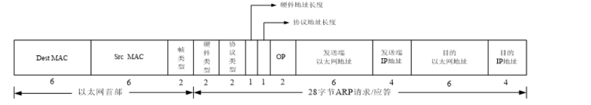

# C语言/C++

一般来说，C语言主要从事嵌入式开发，最好对电路知识一定的了解，其它开发也有，譬如：服务端开发以及一些第三方组件，相对比较少。而[C++](https://www.zhihu.com/search?q=C%2B%2B&search_source=Entity&hybrid_search_source=Entity&hybrid_search_extra={"sourceType"%3A"answer"%2C"sourceId"%3A1687623714})的话，主要从事 图形图像处理，后端服务开发，游戏引擎等。所以还是需要根据自己喜欢哪方面，觉得学习C语言还是C++。

## 编程语言历史

| 编程语言          | 主要用途                                                     |
| ----------------- | ------------------------------------------------------------ |
| C/C++             | C++ 是在C语言的基础上发展起来的，C++ 包含了C语言的所有内容，C语言是C++的一个部分，它们往往混合在一起使用，所以统称为 C/C++。C/C++主要用于PC软件开发、Linux开发、游戏开发、单片机和嵌入式系统。 |
| Java              | Java 是一门通用型的语言，可以用于网站后台开发、[Android](http://c.biancheng.net/android/) 开发、PC软件开发，近年来又涉足了[大数据](http://c.biancheng.net/big_data/)领域（归功于 Hadoop 框架的流行）。 |
| C#                | C# 是微软开发的用来对抗 Java 的一门语言，实现机制和 Java 类似，不过 C# 显然失败了，目前主要用于 Windows 平台的软件开发，以及少量的网站后台开发。 |
| Python            | Python 也是一门通用型的语言，主要用于系统运维、网站后台开发、数据分析、人工智能、[云计算](http://c.biancheng.net/cloud_computing/)等领域，近年来势头强劲，增长非常快。 |
| PHP               | PHP 是一门专用型的语言，主要用来开发网站后台程序。           |
| JavaScript        | JavaScript 最初只能用于网站前端开发，而且是前端开发的唯一语言，没有可替代性。近年来由于 Node.js 的流行，JavaScript 在网站后台开发中也占有了一席之地，并且在迅速增长。 |
| Go语言            | Go语言是 2009 年由 Google 发布的一款编程语言，成长非常迅速，在国内外已经有大量的应用。Go 语言主要用于服务器端的编程，对 C/C++、Java 都形成了不小的挑战。 |
| Objective-C Swift | Objective-C 和 Swift 都只能用于苹果产品的开发，包括 Mac、MacBook、iPhone、iPad、iWatch 等。 |
| 汇编语言          | 汇编语言是计算机发展初期的一门语言，它的执行效率非常高，但是开发效率非常低，所以在常见的应用程序开发中不会使用汇编语言，只有在对效率和实时性要求极高的关键模块才会考虑汇编语言，例如操作系统内核、驱动、仪器仪表、工业控制等。 |

编程语言的发展大概经历了以下几个阶段：

汇编语言 --> 面向过程编程 --> 面向对象编程

- 汇编语言是编程语言的拓荒年代，它非常底层，直接和计算机硬件打交道，开发效率低，学习成本高；
- C语言是面向过程的编程语言，已经脱离了计算机硬件，可以设计中等规模的程序了；
- Java、C++、Python、C#、PHP 等是面向对象的编程语言，它们在面向过程的基础上又增加了很多概念。

从C语言到内存，从内存到进程和线程，环环相扣：不学C语言就吃不透内存，不学内存就吃不透进程和线程。

## 编译

### 阶段

https://www.51sjk.com/b116b253307/

- 预处理阶段：生成预编译文件(.i)

  宏定义、头文件、条件编译等进行分析替换，同时将代码中的注释删除，这里并不会检查语法。

  经过预处理之后代码体积会大很多：预处理之后的程序还是文本，可以用文本编辑器打开。

  |          | 文件名 | 文件大小 | 代码行数 |
  | -------- | ------ | -------- | -------- |
  | 预处理前 | test.c | 146B     | 9        |
  | 预处理后 | test.i | 17691B   | 857      |


- 编译阶段：生成汇编文件(.s)

  词法与语法分析，将预处理后文件编译生成汇编文件

- 汇编阶段：生成目标文件(.o)

  将汇编文件生成目标文件([二进制](https://so.csdn.net/so/search?q=二进制&spm=1001.2101.3001.7020)文件)

- 链接阶段：链接过程将多个目标文件以及所需的库文件(.so等)链接成最终的可执行文件(.exe)

  

### 头文件和库文件

头文件和库文件并不是一码事，它们最大的区别在于：

- 头文件只存储变量、函数或者类等这些功能模块的声明部分
- 库文件才负责存储各模块具体的实现部分。

读者可以这样理解：所有的库文件都提供有相应的头文件作为调用它的接口。也就是说，库文件是无法直接使用的，只能通过头文件间接调用。

> 头文件和库文件相结合的访问机制，最大的好处在于，有时候我们只想让别人使用自己实现的功能，并不想公开实现功能的源码，就可以将其制作为库文件，这样用户获取到的是二进制文件，而头文件又只包含声明部分，这样就实现了“将源码隐藏起来”的目的，且不会影响用户使用

**为什么在头文件中进行函数，变量，宏，结构体声明**

- 提取公共的声明的函数，变量，宏，结构体，想用它的c文件就只需要引用。防止在多个C文件去做声明

- 如果在头文件中实现一个函数体，那么如果在多个c文件中引用它，同时编译多个c文件，生成的目标文件引用此头文件所生成的目标文件中的函数体，c文件都有一份这个函数的代码，如果这段函数又没有定义成局部函数，那么在连接时，就会发现多个相同的函数，就会报错

- 如果在头文件中定义全局变量，并且将此全局变量赋初值，那么在多个引用此头文件的c文件中同样存在相同变量名的拷贝，关键是此变量被赋了初值，所以编译器就会将此变量放入data段，最终在连接阶段，**会在data段中存在多个相同的变量（无法将这些变量统一成一个变量，也就是仅为此变量分配一个空间，而不是多份空间）**

  假定这个变量在头文件没有赋初值，编译器就会将之放入 bss段，连接器会对**bss段的多个同名变量仅分配一个存储空间**

- 在头文件中声明结构体，函数等，当你需要将你的代码封装成一个库，让别人来用你的代码，你又不想公布，那么人家如何利用你的库呢?也就是如何利用你的库中的各个函数呢??一种方法是公布源码，别人想怎么用就怎么用，另一种是提供头文件，别人从头文件中看你的函数原型，这样人家才知道如何调用你写的函数，就如同你调用printf函数一样，里面的参数是头文件中的相关声明


### 链接

链接阶段将同一项目中各源文件生成的目标文件以及程序中用到的库文件整合为一个可执行文件。

编译器提供有 2 种实现链接的方式

- 采用静态链接方式实现链接操作的库文件，称为静态链接库；
- 采用动态链接方式实现链接操作的库文件，称为动态链接库。

> 和使用动态链接库生成的可执行文件相比，静态链接库生成的可执行文件的体积更大。
>
> 和使用静态链接库生成的可执行文件相比，动态链接库生成的可执行文件的体积更小，因为其内部不会被复制一堆冗余的代码。

GCC 编译器生成可执行文件时，默认情况下会优先使用动态链接库实现链接操作，除非当前系统环境中没有程序文件所需要的动态链接库，GCC 编译器才会选择相应的静态链接库。如果两种都没有（或者 GCC 编译器未找到），则链接失败。

在 Linux 发行版中，静态链接库和动态链接库通常存放在 /usr/bin 或者 /bin 目录下。

## GCC

http://c.biancheng.net/view/7930.html

### 历史

谈到 GCC，就不得不提 GNU 计划。GNU 全称 GNU's Not UNIX，又被称为“革奴计划”，由理查德·斯托曼于 1983 年发起。GNU 计划的最终目标是打造出一套完全自由（即自由使用、自由更改、自由发布）、开源的操作系统，并初步将其命名为 GNU 操作系统

GNU 计划的实施可谓一波三折，最重要的一点是，虽然该计划为 GNU 操作系统量身定做了名为 Thr Hurd 的系统内核，但由于其性能比不上同时期诞生的 Linux 内核，最终 GNU 计划放弃 The Hurd 而选用 Linux 作为 GNU 操作系统的内核。在 Linux 内核的基础上，GNU 计划开发了很多系统部件，GCC 就是其中之一

早期 GCC 的全拼为 GNU C Compiler，即 GUN 计划诞生的 C 语言编译器，显然最初 GCC 的定位确实只用于编译 C 语言。但经过这些年不断的迭代，GCC 的功能得到了很大的扩展，它不仅可以用来编译 C 语言程序，还可以处理 C++、Go、Objective -C 等多种编译语言编写的程序。与此同时，由于之前的 GNU C Compiler 已经无法完美诠释 GCC 的含义，所以其英文全称被重新定义为 GNU Compiler Collection，即 GNU 编译器套件。

### 组成部分

表 1 列出了 GCC 的各个部分，但它们也并不总是出现的。有些部分是和语言相关的，所以如果没有安装某种特定语言，系统中就不会出现相关的文件。

| 部分        | 描述                                                         |
| ----------- | ------------------------------------------------------------ |
| c++         | gcc 的一个版木，默认语言设置为 [C++](http://c.biancheng.net/cplus/)，而且在连接的时候自动包含标准 C++ 库。这和 g++ 一样 |
| ccl         | 实际的C编译程序                                              |
| cclplus     | 实际的 C++ 编泽程序                                          |
| collect2    | 在不使用 GNU 连接程序的系统上，有必要运行 collect2 来产生特定的全局初始化代码（例如 C++ 的构造函数和析构函数） |
| configure   | GCC 源代码树根目录中的一个脚木。用于设置配置值和创建GCC 编译程序必需的 make 程序的描述文件 |
| crt0.o      | 这个初始化和结束代码是为每个系统定制的，而且也被编译进该文件，该文件然后会被连接到每个可执行文件中来执行必要的启动和终止程序 |
| cygwin1.dll | Windows 的共享库提供的 API，模拟 UNIX 系统调用               |
| f77         | 该驱动程序可用于编译 Fortran                                 |
| f771        | 实际的 Fortran 编译程序                                      |
| g++         | gcc 的一个版木，默认语言设置为 C++，而且在连接的时候自动包含标准 C++ 库。这和 c++ 一样 |
| gcc         | 该驱动程序等同于执行编译程序和连接程序以产生需要的输出       |
| gcj         | 该驱动程序用于编译 [Java](http://c.biancheng.net/java/)      |
| gnat1       | 实际的 Ada 编译程序                                          |
| gnatbind    | 一种工具，用于执行 Ada 语言绑定                              |
| gnatlink    | 一种工具，用于执行 Ada 语言连接                              |
| jc1         | 实际的 Java 编译程序                                         |
| libgcc      | 该库包含的例程被作为编泽程序的一部分，是因为它们可被连接到实际的可执行程序中。 它们是特殊的例程，连接到可执行程序，来执行基木的任务，例如浮点运算。这些库中的例程通常都是平台相关的 |
| libgcj      | 运行时库包含所有的核心 Java 类                               |
| libobjc     | 对所有 Objective-C 程序都必须的运行时库                      |
| libstdc++   | 运行时库，包括定义为标准语言一部分的所有的 C++ 类和函数      |

表 2 列出的软件和 GCC 协同工作，目的是实现编译过程。有些是很基本的（例如 as 和 Id），而其他一些则是非常有用但不是严格需要的。尽管这些工具中的很多都是各种 UNIX 系统的本地工具，但还是能够通过 GNU 包 binutils 得到大多数工具。

| 工具      | 描述                                                         |
| --------- | ------------------------------------------------------------ |
| addr2line | 给出一个可执行文件的内部地址，addr2line 使用文件中的调试信息将地址翻泽成源代码文 件名和行号。该程序是 binutils 包的一部分 |
| ar        | 这是一个程序，可通过从文档中增加、删除和析取文件来维护库文件。通常使用该工具是为了创建和管理连接程序使用的目标库文档。该程序是 binutils 包的一部分 |
| as        | GNU 汇编器。实际上它是一族汇编器，因为它可以被编泽或能够在各种不同平台上工作。 该程序是 binutils 包的一部分 |
| autoconf  | 产生的 shell 脚木自动配置源代码包去编泽某个特定版木的 UNIX   |
| c++filt   | 程序接受被 C++ 编泽程序转换过的名字（不是被重载的），而且将该名字翻泽成初始形式。 该程序是 binutils 包的一部分 |
| f2c       | 是 Fortran 到C的翻译程序。不是 GCC 的一部分                  |
| gcov      | gprof 使用的配置工具，用来确定程序运行的时候哪一部分耗时最大 |
| gdb       | GNU 调试器，可用于检查程序运行时的值和行为                   |
| GNATS     | GNU 的调试跟踪系统（GNU Bug Tracking System）。一个跟踪 GCC 和其他 GNU 软件问题的在线系统 |
| gprof     | 该程序会监督编泽程序的执行过程，并报告程序中各个函数的运行时间，可以根据所提供 的配置文件来优化程序。该程序是 binutils 包的一部分 |
| ld        | GNU 连接程序。该程序将目标文件的集合组合成可执行程序。该程序是 binutils 包的一部 |
| libtool   | 一个基本库，支持 make 程序的描述文件使用的简化共享库用法的脚木 |
| make      | 一个工具程序，它会读 makefile 脚木来确定程序中的哪个部分需要编泽和连接，然后发布 必要的命令。它读出的脚木（叫做 makefile 或 Makefile）定义了文件关系和依赖关系 |
| nlmconv   | 将可重定位的目标文件转换成 NetWare 可加载模块（NetWare Loadable Module, NLM）。该 程序是 binutils 的一部分 |
| nm        | 列出目标文件中定义的符号。该程序是 binutils 包的一部分       |
| objcopy   | 将目标文件从一种二进制格式复制和翻译到另外一种。该程序是 binutils 包的一部分 |
| objdump   | 显示一个或多个目标文件中保存的多种不同信息。该程序是 binutils 包的一部分 |
| ranlib    | 创建和添加到 ar 文档的索引。该索引被 Id 使用来定位库中的模块。该程序是 binutils 包的一部分 |
| ratfor    | Ratfor 预处理程序可由 GCC 激活，但不是标准 GCC 发布版的一部分 |
| readelf   | 从 ELF 格式的目标文件显示信息。该程序是 binutils 包的一部分  |
| size      | 列出目标文件中每个部分的名字和尺寸。该程序是 binutils 包的一部分 |
| strings   | 浏览所有类型的文件，析取出用于显示的字符串。该程序是 binutils 包的一部分 |
| strip     | 从目标文件或文档库中去掉符号表，以及其他调试所需的信息。该程序是 binutils 包的一部 |
| vcg       | Ratfor 浏览器从文木文件中读取信息，并以图表形式显示它们。而 vcg 工具并不是 GCC 发布中的一部分，但 -dv 选项可被用来产生 vcg 可以理解的优化数据的格式 |
| windres   | Window 资源文件编泽程序。该程序是 binutils 包的一部分        |

### 命令规则

编译器并非仅指编译器，确切来说是编译工具链，里面包括了预编译器、编译器、汇编器和连接器。gcc 指令可以自行判断出该源程序是由哪种编程语言编写，从而完成由源代码到可执行代码的转换工作。

**gcc -o 选项用来指定输出文件**，如果不使用 -o 选项，那么将采用默认的输出文件。例如默认情况下，生成的可执行文件的名字默认为 a.out。

- gcc [-E|-S|-c] [infile] [-o outfile]

  - [infile] 表示**输入**文件（也即要处理的文件），它可以是源文件、汇编文件或者目标文件；

  - [outfile] 表示**输出**文件（也即处理的结果），可以是预处理文件、目标文件、可执行文件等。

预处理：gcc -E hello.c -o hello.i

编 译：   gcc -S hello.i -o hello.s

汇 编：   gcc -c hello.s -o hello.o

链 接：   gcc hello.o -o hello

gcc hello.c -o hello（还是经过：预处理、编译、汇编、链接的过程）


### 编译多文件

在一个 C（或者 C++）项目中，往往在存储多个源文件，如果仍按照之前“先单独编译各个源文件，再将它们链接起来”的方法编译该项目，需要编写大量的编译指令，事倍功半。事实上，利用 gcc 指令可以同时处理多个文件的特性，可以大大提高我们的工作效率。

举个例子，如下是一个拥有 2 个源文件的 C 语言项目：

```
[root@bogon demo]# ls
main.c myfun.c
[root@bogon demo]# cat main.c
\#include <stdio.h>
int main(){
  display();
  return 0;
}
[root@bogon demo]# cat myfun.c
\#include <stdio.h>
void display(){
  printf("GCC:http://c.biancheng.net/gcc/");
}
[root@bogon demo]#
```

```
[root@bogon demo]# ls
main.c  myfun.c
[root@bogon demo]# gcc -c myfun.c main.c
[root@bogon demo]# ls
main.c  main.o  myfun.c  myfun.o
[root@bogon demo]# gcc myfun.o main.o -o main.exe
[root@bogon demo]# ls
main.c  main.exe  main.o  myfun.c  myfun.o
[root@bogon demo]# ./main.exe
GCC:http://c.biancheng.net/gcc/
```

但值得一提的是，如果一个项目中有十几个甚至几十个源文件，即便共用一条 gcc 指令编译（并链接），编写各个文件的名称也是一件麻烦事。

为了解决这个问题，我们可以进入该项目目录，用 *.c 表示所有的源文件，即执行如下指令：

```
[root@bogon demo]# ls
main.c myfun.c
[root@bogon demo]# gcc *.c -o main.exe
[root@bogon demo]# ls
main.c main.exe myfun.c
[root@bogon demo]# ./main.exe
GCC:http://c.biancheng.net/gcc/
```

### gcc和g++

实际使用中我们更习惯使用 gcc 指令编译 C 语言程序，用 g++ 指令编译 C++ 代码。需要强调的一点是，这并不是 gcc 和 g++ 的区别，gcc 指令也可以用来编译 C++ 程序，同样 g++ 指令也可以用于编译 C 语言程序。

## 基础

### 数据类型

#### signed 

signed 有符号(正负)的意思

在定义char 、整型（short 、int、long） 数据的时候用signed修饰，代表定义的数据是有符号的，可以保存正数，也可以保存负数

注意：默认情况下 signed 可以省略

#### unsigned 

unsigned 无符号的意思

在定义char 、整型（short 、int、long） 数据的时候用unsigned修饰，代表定义的数据是无符号类型的数据

无符号类型的变量只能保存正数和0。

#### void 

void 空类型的关键字

char、int 、float 都可以定义变量。void不能定义变量，没有void类型的变量

void是用来修饰函数的参数或者返回值，代表函数没有参数或没有返回值

#### char

char 字符型 ，用char定义的变量是**字符型变量**，占1个字节

有符号：-2^7 ~ 2^7-1

无符号：0 ~ 2^8-1

#### short

short 短整型 ,使用short 定义的变量是**短整型变量**，占2个字节

有符号：-2^15 ~ 2^15-1

无符号：0 ~ 2^16-1

#### int

int 整型 ，用int定义的变量是整型变量，在32位以上的系统下占4个字节

有符号：-2^31 ~ 2^31-1

无符号：0 ~ 2^32 - 1

#### long

long 长整型，用long 定义的变量是长整型变量，在32位系统下占4个字节，在64位系统下占8个字节

#### float

float 单浮点型 （实数），用float定义的变量是单浮点型的实数，占4个字节

#### double

double 双浮点型 （实数），用double定义的变量是双浮点型的实数，占8个字节

#### 库函数自定义类型

##### size_t

size_t是一些C/C++标准在stddef.h中定义的。这个类型足以用来表示对象的**大小**。

size_t的真实类型与操作系统有关

- 在32位架构中被普遍定义为：typedef  unsigned int size_t;

- 而在64位架构中被定义为：typedef  unsigned long size_t;


> size_t一般用来表示一种计数，比如有多少东西被拷贝等。例如：sizeof操作符的结果类型是size_t，该类型保证能容纳实现所建立的最大对象的字节大小。 它的意义大致是“适于计量内存中可容纳的数据项目个数的无符号整数类型”。所以，它在数组下标和内存管理函数之类的地方广泛使用。

##### ssize_t

ssize_t是有符号整型，在32位机器上等同与int，在64位机器上等同与long

typedef  long  ssize_t;//ssize_t就是long类型

> ssize_t这个数据类型用来表示可以被执行读写操作的数据块的大小.它和size_t类似,但必需是signed，它表示的是signed size_t类型的。

##### socklen_t

在32位机下，size_t和int的长度相同，都是32 bits

在64位机下，size_t（32bits）和int（64 bits）的长度是不一样的,socket编程中的accept函数的第三个参数的长度必须和int的长度相同。于是便有了socklen_t类型。

```
int accept(int sockfd, struct sockaddr *addr, socklen_t *addrlen);
```

##### pthread_t

一般用于**声明线程ID**

pthread_t：unsigned long int ,一般情况下是4个字节，不同的环境下，由unsigned long int的大小决定。

### 存储类型

#### register

register是寄存器的意思，用register修饰的变量是寄存器变量，

即：在编译的时候告诉编译器这个变量是寄存器变量，**尽量将其存储空间分配在寄存器中**。

注意：

(1)：定义的变量不一定真的存放在寄存器中。

(2)：cpu取数据的时候去寄存器中拿数据比去内存中拿数据要快

(3)：因为寄存器比较宝贵，所以不能定义寄存器数组

(4)：**register只能修饰字符型及整型的，不能修饰浮点型**

(5)：因为register修饰的变量可能存放在寄存器中不存放在内存中，所以不能对寄存器变量取地址。因为只有存放在内存中的数据才有地址

#### static

**static 是静态的意思**

- static可以修饰全局变量、局部变量、函数。
- 使用static修饰的变量，此变量保存在内存的静态区空间中
- 只能在定义的c文件有效，不能跨文件使用
- **静态局部变量不会随着当前函数执行结束而释放空间**

- **如果不赋初值，默认为0**

- 静态局部变量，函数结束后不释放


#### const

const 是常量的意思

用const修饰的变量是只读的，不能修改它的值

const可以修饰指针

#### extern

是外部的意思，一般用于函数和全局变量的声明

extern 数据类型 变量名

作用于程序的所有地方，声明时，不要赋值。

### 变量的分类

全局变量：如果全局变量没有进行初始化，则系统自动将其**初始化为0**

全局静态变量：静态全局变量只能在其定义的.c文件中任意位置使用，不能跨文件使用

局部变量：不进行初始化，**默认随机值**

局部静态变量：不进行初始化，**默认为0**。**函数结束后不释放**

```
void myfun5()
{
    //静态局部变量不会随着当前函数执行结束而释放空间，下次使用的函数之前的空间
    //静态局部变量只会初始化一次
    static int num1 = 100;
    num1++;
    printf("num1 = %d\n", num1);
}
```

> 没有赋值的时候进行输出可能会输出任意字符（空字符也有可能）。
> 因为char数组未赋值前，系统会令数组指针随机的指向任意一块可利用的地址。而这块可利用的地址也许在很久以前存储的字符为‘a’

### 变量的定义

定义变量

存储类型 数据类型 变量名；

存储类型 数据类型 变量名 = 变量或者常量；

> 变量在定义的时候要满足标识符的命名规则
>
> （1）只能由字母、数字和下划线组成
>
> （2）首字母不能是数字
>
> （3）不能关键字相同

#### **整型数据**

**整型常量:（按进制分）：**

十进制： 以正常数字1-9开头

八进制： 以数字0开头，如0123

十六进制：以0x开头，如0x1e

**整型变量:**

有/无符号短整型(un/signed) short(int) 2个字节

有/无符号基本整型(un/signed) int 4个字节

有/无符号长整型(un/signed) long (int) 4个字节 (32位处理器)

#### **实型数据**

**实型常量**

实型常量也称为实数或者浮点数

**十进制形式:** 由数字和小数点组成:0.0、0.12、5.0

**实型变量**

单精度(float)和双精度(double)3.1415926753456

float型: 占4字节，7位有效数字,指数-37到38

double型: 占8字节，16位有效数字,指数-307到308

#### **指数** 

123e3代表123*10的三次方

123e-3代表123*10的负三次方

不以f结尾的常量是double类型

以f结尾的常量(如3.14f)是float类型

#### **字符数据**

- **字符常量：**

  直接常量：用**单引号**括起来，如'a'、'b'、’0’等.

  转义字符**：**以反斜杠“\”开头，后跟一个或几个字符、如'\n','\t'等，分别代表换行、横向跳格.

- **字符变量：**用char定义，每个字符变量被分配一个字节的内存空间，字符值以ASCII码的形式存放在变量的内存单元中;

  ```
  #include <stdio.h>
  #include <string.h>
  
  void main()
  {
    char a;
    a = 'x';
    if (a == 120)
    {
      printf("1");
    }
    else
    {
      printf("2");
    }
  }
  
  a变量中存放的是字符'x'的ASCII :12，即a=120跟a='x'在本质上是一致的
  ```

- **字符串常量**：是由双引号括起来的字符序列，如“CHINA”、”哈哈哈”“C program”，“$12.5”等都是合法的字符串常量.

**字符串常量与字符常量的不同**

‘a’为字符常量，”a”为字符串常量

每个字符串的结尾，编译器会自动的添加一个结束标志位'\0'，即“a”包含两个字符‘a’和’\0

### 类型转换

数据有不同的类型，不同类型数据之间进行混合运算时必然涉及到类型的转换问题.

#### 自动转换

遵循一定的规则,由编译系统自动完成

自动转换原则

1、占用内存字节数少(值域小)的类型，向占用内存字节数多(值域大)的类型转换,以保证精度不降低.

2、转换方向


```c
#include <stdio.h>
int main(int argc, char *argv[])
{
  //***强制类型转换之自动转换**
  // 注意自动类型转换都是在运算的过程中进行临时性的转
  // 并不会影响自动类型转换的变量的值和其类型

  // 参加运算的成员全部变成int类型的参加运算，结果也是int类型的
  printf("%d\n", 5 / 2);
  // 当表达式中出现了带小数点的实数，参加运算的成员全部变成double类型
  // 参加运算，结果也是double型
  printf("%f\n", 5.0 / 2);

  // 当表达式中有有符号数 也有无符号数，参加运算的成员变成无符号数
  // 加运算结果也是无符号数.(表达式中无实数)
  int a = -8;

  unsigned int b = 7;
  if (a + b > 0)
  {
    printf("a+b>0, %d\n", a + b);
  }
  else
  {
    printf("a+b<=0\n");
  }

  // 在赋值语句中等号右边的类型自动转换为等号左边的类型
  int m;
  float n = 5.8f; // 5.8后面加f代表5.8是float类型，不加的话，认为是double类型
  m = n;
  printf("m = %d\n", m);
  printf("n = %f\n", n); 

  //*强制类型转换之强制转换
  int x = 10;
  int y = 4;
  float w;
  w = (float)x / (float)y;
  printf("w = %f\n", w);

  return 0;
}

2
2.500000
a+b>0, -1
m = 5
n = 5.800000
w = 2.500000
```

#### 强制类型转换

把表达式的运算结果强制转换成所需的数据类型

通过类型转换运算来实现 (类型说明符) (表达式)

功能：把表达式的运算结果强制转换成类型说明符所表示的类型

例如：

(float)a; // 把a的值转换为实型

(int)(x+y); // 把x+y的结果值转换为整型

注意:

类型说明符必须加括号

### 关键字

#### sizeof

使用来测变量、数组的占用存储空间的大小（字节数）

#### typedef

**typedef** 重命名相关的关键字

关键字 ，作用是给一个已有的类型，重新起个类型名，并没有创造一个新的类型

#### volatile 

**volatile 易改变的意思**

用volatile定义的变量，是易改变的，即告诉cpu每次用volatile变量的时候，重新去内存中取

保证用的是最新的值,而不是寄存器中的备份。

volatile 关键字现在较少适用

#### include

`#include <>`用尖括号包含头文件，在**系统指定的路径下找头文件**

`#include ""` 用双引号包含头文件，**先在当前目录下找头文件**，找不到，再到系统指定的路径下找。

注意：

- include 经常用来包含头文件，可以包含 .c 文件，但是大家不要包含.c


- 因为include包含的文件会在预编译被展开，如果一个.c 被包含多次，展开多次，会导致函数重复定义。所以不要包含.c 文件。


- 预处理只是对include 等预处理操作进行处理并不会进行语法检查，这个阶段有语法错误也不会报错，**第二个阶段即编译阶段才进行语法检查**。


#### **define**宏定义

**宏是在预编译的时候进行替换。**

\#define PI 3.14

- 在预编译的时候如果代码中出现了PI 就用 3.14去替换。

- 宏定义后边不要加分号。

- 宏定义的作用范围，从定义的地方到本文件末尾。

  如果想在中间终止宏的定义范围 `#undef PI` 


**带参宏**

\#define S(a,b) a*b

注意带参宏的形参 a和b没有类型名，

S(2,4) 将来在预处理的时候替换成 实参替代字符串的形参，其他字符保留，2 * 4

**带参宏和带参函数的区别**

带参宏被调用多少次就会展开多少次，执行代码的时候没有函数调用的过程，不需要压栈弹栈。所以带参宏，因为被展开多次，是浪费了空间，节省时间。

带参函数，代码只有一份，存在代码段，调用的时候去代码段取指令，调用的时候要压栈弹栈。有个调用的过程。所以说，带参函数是浪费了时间，节省了空间。

带参函数的形参是有类型的，带参宏的形参没有类型名。

如果功能实现的代码相对简单，并且不需要开辟太多的空间，可以选择使用带参宏，但是大多数情况都会使用函数

### 运算符


#### 算术运算符

\+ - * / % += -= *= /= %=

10%3 表达式的结果为1

#### 关系运算符

＞、＜、==、>=、<=、!=

!=为不等于

#### 逻辑运算符

1、&& 逻辑与

两个条件都为真，则结果为真

if((a>b) && (a<c))

if(b<a<c)//这种表达方式是错误的

2、|| 逻辑或

两个条件至少有一个为真，则结果为真

if((a>b) || (a<c))

3、! 逻辑非

#### 三目运算符号

()?():()

如果？前边的表达式成立，整个表达式的值，是？和：之间的表达式的结果

否则是：之后的表达式的结果

A?B:C;

首先判断表达式A的结果，如果结果为真，则执行表达式B，如果表达式A为假，则执行表达式C

#### 逗号运算符

(... , ... , ...)

使用逗号隔开的表达式从左向右依次执行，最后的表达式的值是整个运算的结果

例如：A = (B , C , D)

先运行表达式B，再运行表达式C，最后运行表达式D，最终变量A的值为表达式D的值

#### 自增自减运算符

```
  int a = 2;
  int b = ++a;
  int c = a++;
  printf("%d,%d,%d", a, b, c);
```

#### **位运算符**

##### 1、**&**按位 与

任何值与0得0，与1保持不变

使某位清0

0101 1011 &

1011 0100

0001 0000

##### 2、**|** 按位或

任何值或1得1，或0保持不变

0101 0011 |

1011 0100

1111 0111

##### 3、**~** 按位取反

1变0，0变1

0101 1101 ~

1010 0010

##### 4、^ 按位异或

相异得1，相同得0

1001 1100 ^

0101 1010

1100 0110

##### 5、位移

https://blog.csdn.net/weixin_73453526/article/details/132507862

\>>右移   << 左移

tip

- 避免位运算符，逻辑运算符和数学运算符同时出现在一个表达式中
- 当位运算符，逻辑运算符和数学运算符需要同时参与运算时，尽量使用括号 ( ) 来表达计算次序
- 位运算没有短路规则，每个操作数都参与运算
- 位运算的结果为整数，而不是 0 或 1
- 位运算优先级高于逻辑运算优先级

### 语句

if 、else 、break、continue、for 、while、do、switch case 、goto、default

#### **控制语句**

```
switch（表达式）//表达式只能是字符型或整型的(short int int long int)
{
case 常量表达式1：
语句1；
break；
case 常量表达式2：
语句2;
break；
...
default：
语句3；
break;
}
```

运行顺序：将常量表达式的值语句switch后面的表达式的值对比，如果表达式的值刚好等于case后面的某一个值，就会立即去执行case后的语句，如果都不是，则会执行default后面的语句

注意事项：

（1）**switch后面的表达式不能是浮点型，只能是整形的**

（2）如果case后面的常量表达式与switch的表达式的值都不同，则执行default后面的语句

（3）每一个case执行结束后理论上必须跟一个break，作用就是跳出整个switch语句

（4）case后面如果语句很多，不需要加大括号

#### 循环语句

##### **goto循环**

goto主要用于在一个函数里面实现代码的跳转。在平时编写代码时，尽量少使用goto，因为会使得代码逻辑混乱，可读性差

```
  // go循环
  //使用goto实现跳转
  printf("11111111111111\n");
  goto NEXT;
  printf("22222222222222\n");
  printf("33333333333333\n");

NEXT:
  printf("44444444444444\n");
  printf("hello world\n");
```

### 选择性编译

选择性编译都是在预编译阶段干的事情

> 注意和if else语句的区别，
>
> if else 语句都会被编译，通过条件选择性执行代码
>
> 而 选择性编译，只有一块代码被编译

- 情形1

  ```
  #ifdef AAA
  代码段一；
  #else
  代码段二；
  #endif
  如果在当前 .c 文件上边定义过AAA，就编译代码段一，否则就编译代码段二
  ```

- 情形2

  ```
  #ifndef AAA
  代码段一；
  #else
  代码段二；
  #endif
  
  和第一种互补，这种方法，经常用于防止头文件重复包含。
  常用于多文件编程中。
  ```

- 情形3

  ```
  #if 表达式
  代码段一；
  #else
  代码段二；
  #endif
  如果表达式为真，则编译程序段一，否则编译程序段二。
  ```

## 数组

**数组是若干个相同类型的变量在内存中有序存储的集合。**

概念理解：

- 数组用于存储一组数据

- 数组里面存储的**数据类型必须是相同的**

- 数组在内存中会**开辟一块连续的空间**

int a[10];//定义了一个整型的数组a，a是数组的名字，数组中有10个元素，每个元素的类型都是int类型，而且**在内存中连续存储**。

这十个元素分别是a[0] a[1] …. a[9]，a[0]~a[9]在内存中连续的顺序存储

### 分类

#### 按元素的类型分类

1）字符数组

即若干个字符变量的集合，数组中的每个元素都是字符型的变量

char s[10]; s[0],s[1]....s[9];

2）短整型的数组

short int a[10]; a[0] ,a[9]; a[0]=4;a[9]=8;

3）整型的数组

int a[10]; a[0] a[9]; a[0]=3;a[0]=6;

4)  长整型的数组

lont int a[5];

5）浮点型的数组（单、双）

float a[6]; a[4]=3.14f;

double a[8]; a[7]=3.115926;

6）指针数组

char *a[10]

int *a[10];

7）结构体数组

struct stu boy[10];

#### 按维数分类

一维数组

int a[30];

类似于一排平房

二维数组

int a[2\][30];

可以看成一栋楼房 有多层，每层有多个房间，也类似于数学中的矩阵

二维数组可以看成由多个一维数组构成的。有行，有列，

多维数组

int a[4\]\[2][10];

三维数组是由多个相同的二维数组构成的

### 一维数组的定义

```
数据类型 数组名[数组元素个数];
int a[10]; 
```

- 定义了一个名为a的数组，数组中每一个元素都是int类型，一共有10个元素
- 每一个元素都保存在一个变量中，每一个变量都是数组名和数组下标组成的

- 从0开始的，分别是a[0] a[1] a[2]... a[9]


注意：**数组元素的个数在定义的时候也可以不写，但是如果不写，必须初始化（定义的时候赋值）**

```c
int a[10];
//通过sizeof关键字可以获取数组的大小
printf("sizeof(a) = %d %d\n", sizeof(a), 10 * sizeof(int));
//如果定义数组的同时赋值（初始化），可以不指定数组元素的个数，系统会根据初始化元素的个数自动指定数组元素的个数
int b[] = {10, 20, 30};
printf("sizeof(b) = %d\n", sizeof(b));

sizeof(a) = 40 40
sizeof(b) = 12
```

### 二维数组的定义

```
数据类型 数组名 [行的个数] [列的个数];
int a[2][4];
```

解释：

定义一个名为a的二维数组，每一个元素都是int类型

这个二维数组中包含两行四列的元素，一共有8个元素

二维数组也是连续开辟空间，访问元素是行和列都是从0开始，分别是a[0]\[0] a\[0][1] a\[0][2] a\[0][3] a\[1][0] a\[1][1] a[1][2] a\[1][3]

注意：**二维数组的下标也是可以省略的，但是有条件，在初始化时行数可以省略，但是列数不能省略**

```c
int c[2][4];
printf("sizeof(c) = %d %d\n", sizeof(c), 2 * 4 * sizeof(int));
//二维数组的行数可以省略，但是列数不能省略，在初始化时可以这样操作
//系统会根据列数自动指定行数，最终得到的函数所得到得元素个数移动是列的整数倍
int d[][4] = {1, 2, 3, 4, 5};
printf("sizeof(d) = %d\n", sizeof(d));
  
sizeof(c) = 32 32
sizeof(d) = 32
```

### 初始化

一维数组的初始化

```c
//如果不初始化，直接使用会是随机值
int a[4];

//初始化方式1：全部初始化
int a[4] = {123, 78, 666, 476};
//如果是全部初始化，可以不指定数组元素的个数，系统会自动分配
int a[] = {10, 20, 30, 40};

//初始化方式2：局部初始化
//未初始化的位置的元素自动赋值为0，针对的是int
int e[4] = { 10, 20};

printf("%d\n", e[0]);
printf("%d\n", e[1]);
printf("%d\n", e[2]);
printf("%d\n", e[3]);
```

二维数组的初始化

```c
// int a[2][3];
//初始化方式1：按行初始化
//全部初始化
// int a[2][3] = {{10, 20, 30}, {666, 777, 888}};
//局部初始化
//没有赋值的位置的元素自动为0
// int a[2][3] = {{10, 20}, {666}};

//初始化方式2：逐个初始化
//全部初始化
// int a[2][3] = {1, 2, 3, 4, 5, 6};
//局部初始化
//没有赋值的位置的元素自动为0
int h[2][3] = { 1, 2, 3};
printf("%d\n", h[0][0]);
printf("%d\n", h[0][1]);
printf("%d\n", h[0][2]);
printf("%d\n", h[1][0]);
printf("%d\n", h[1][1]);
printf("%d\n", h[1][2]);
```

### 字符数组的定义和初始化

```c
char c1[] ={‘c’,’ ’,’p’,’r’,’o’,’g’};
char c2[] = “c prog”;
char a[][5] = {
{‘B’,’A’,’S’,’I’,’C’},
{‘d’,’B’,’A’,’S’,’E’}
};
char a[][6] = {“hello”,“world”};
```

**字符数组的引用**

1.用字符串方式赋值比用字符逐个赋值要多占1个字节,用于存放字符串结束标志‘\0’;

2.上面的数组c2在内存中的实际存放情况为：


注：'\0'是由C编译系统自动加上的

### tip

**数组赋值问题，能否超过长度赋值?不能**

https://blog.csdn.net/XiaoCaiDaYong/article/details/118225786

```c

#include<stdio.h>
 
void main()
{
	int b[4] = {0};
	int a[4] = {1,2,3,4};
	
	int i = 0;
	a[4] = 5;
	printf("a[4] = %d\n",a[4]);
	printf("a[4]的地址 = %X\n",&a[4]);
	printf("b[0]的地址 = %X\n",&b[0]);
}
a[4] = 5
a[4]的地址 = 19FF20
b[0]的地址 = 19FF20
```

虽然a[4]能打印，但是现在a[4]和b[0]的地址一样，明显在踩内存，使得数组b的值无辜被修改。

## 函数

### 分类

- 从定义角度分类（即函数是谁实现的）

  1.库函数 (c库实现的)

  2.自定义函数 （程序员自己实现的函数）

  3.系统调用 (操作系统实现的函数)

- 从参数角度分类

  - 有参函数：函数有形参，可以是一个，或者多个，参数的类型随便，完全取决于函数的功能

    ```
    int fun(int a,float b,double c){}
    ```
    
  - 无参函数：函数没有参数,在形参列表的位置写个void或什么都不写
  
    ```
    int fun(void){}
    ```
  
- 从返回值角度分类

  - 带返回值的函数

    在定义函数的时候，必须带着返回值类型，在函数体里，必须有return

    如果没有返回值类型，默认返回整型。

  - 没返回值的函数

    在定义函数的时候，函数名字前面加void

    void fun(形参表)

### 函数的定义

```
返回值类型 函数名字(形参列表)
{
    //函数体，函数的功能在函数体里实现
}
```

注意：

- 函数名字是标识符，所以需要满足标识符的命名规则


- 形参：可以有，也可以没有，也可以有多个，但是即使没有，函数名字后面也必须加括号


- 函数体上下位置必须有大括号


- 如果要返回函数执行的结果，也就是返回值，则**return后面跟的变量或者值，必须与函数名左边的返回值类型一致**


- **形参必须带类型，而且以逗号分隔**


- **函数的定义不能嵌套，即不能在一个函数体内定义另外一个函数，**

- 所有的函数的定义是平行的。在一个程序中，相同的函数名只能出现一次


### 函数的声明

1、概念

对已经定义的函数，进行说明，函数的声明可以声明多次。

2、为什么要声明

有些情况下，如果不对函数进行声明，编译器在编译的时候，可能不认识这个函数，因为编译器在编译c程序的时候，从上往下编译的，一般当子函数定义在主函数的下方时，需要在主函数的上方进行声明。

3、声明的方法

```c
#include <stdio.h>
// gcc 07-function.c -o 07-function .\myfun.c
#include "myfun.h"
// 函数的声明：一般当子函数定义在主函数的下方时，需要在主函数的上方进行声明
void myfun1();
void myfun2();
int myfun3();
void myfun4();
void myfun5(int a, int b);
int myfun6(int a, int b);
int main(int argc, char *argv[])
{
  // 函数的调用
  // 函数在调用的时候如果没有参数，也必须加括号
  // 函数调用的时候不能加返回值类型
  //  myfun1();
  //  myfun4();
  //  extern void myfun();
  //  printf("%d", myfun);
  myfun();
  return 0;
}
// 定义一个没有参数也没有返回值的函数
void myfun1()
{
  printf("hello world\n");
  printf("nihao beijing\n");
  printf("welcome to 1000phone\n");

  return;
}
// 定义一个有参数的函数
void myfun2(int a, int b)
{
  int sum;
  sum = a + b;

  printf("%d + %d = %d\n", a, b, sum);
}

// 定义一个有返回值的函数
int myfun3(int a, int b)
{
  int sum;
  sum = a + b;

  return sum;
}

void myfun4()
{
  printf("hello world\n");
  printf("nihao beijing\n");
  printf("welcome to 1000phone\n");

  return;
}

void myfun5(int a, int b)
{
  int sum;
  sum = a + b;

  printf("%d + %d = %d\n", a, b, sum);
}

int myfun6(int a, int b)
{
  int sum;
  sum = a + b;

  return sum;
}

```

## 内存申请

### 分区

https://blog.csdn.net/qianqin_2014/article/details/51114105

https://www.jianshu.com/p/4c74a19ad03b

运行程序，操作系统会将**虚拟内存**进行分区。**栈是机器系统提供的数据结构 ， 而堆则是C/C++函数库提供的** 

- 堆（heap）：堆是用于存放进程运行中被**动态分配**的内存段，它的大小，并不固定，可动态扩张或缩放。当进程调用malloc/free等函数分配内存时，新分配的内存就被动态添加到堆上（堆被扩张）/释放的内存从堆中被提出（堆被缩减）。**堆一般由程序员分配释放，若程序员不释放，程序结束时可能由OS回收。**注意它与数据结构中的堆是两回事，分配方式倒是类似于链表。
- 栈（stack）：又称堆栈，栈是由编译器自动分配释放，**存放函数的参数值，局部变量的值等**（但不包括static声明的变量，static意味着在数据段中存放变量）。**除此之外，在函数被调用时，栈用来传递参数和返回值**。由于栈的先进后出的特点，所以栈特别方便用来保存/恢复调用数据。其操作方式类似于数据结构中的栈。
  - 存放局部变量
- 全局数据区（静态区）（static）:存放全局变量，静态变量，初始化的全局变量和静态变量在一块区域，未初始化的全局变量和静态变量在相邻的另一块区域。另外**文字常量区，常量字符串**就是放在这里，程序结束后由系统释放，所以如果是临时使用，不建议使用静态全局区的空间。
  -  BSS段（bss segment）：通常是指用来存放程序中**未初始化**的全局变量的一块内存区域。BSS段属于静态内存分配。
  -  **数据段**（data segment）：通常是指用来存放程序中**已初始化**的全局变量的一块内存区域。数据段属于静态内存分配。
- 代码区：通常是指用来存放程序执行代码（二进制代码）的一块内存区域。这部分区域的大小在程序运行之前就已经确定，并且内存区域通常属于只读，某些架构也允许代码段为可写，即允许修改程序。在代码段中，也有可能包含一些只读的常数变量，例如字符串常量等。程序段为程序代码在内存中的映射，一个程序可以在内存中有多个副本。


```cpp
int a = 0; // 全局初始化区

char *p1; // 全局未初始化区

int main()
{
  int b; // 栈

  char s[] = "abc"; // 栈

  char *p2; // 栈

  char *p3 = "123456"; // 123456\0在常量区，而p3在栈上。

  static int c = 0； // 全局（静态）初始化区

  p1 = (char *)malloc(10);

  p2 = (char *)malloc(20); // 分配得来得10和20字节的区域就在堆区。

  strcpy(p1, "123456"); // 123456\0放在常量区，编译器可能会将它与p3所指向的"123456"优化成一个地方。
  
  return 0;
}
```

### 内存分配

#### 静态分配

由计算机分配到栈区或全局变量区

#### 动态分配

> 静态内存与动态内存的不同
>
> - 空间开辟的大小是固定的（只有修改程序才可以该空间大小）
> - 数组在申明的时候，必须指定数组的长度，它所需要的内存在编译时分配。
>
> 有时候我们需要在程序运行是才能确定内存大小需要多少，如果用静态内存的话，可能造成空间浪费，也可能造成空间不足，使数据丢失。为了避免这种现象，就有了动态内存的操作。

动态分配内存就是在堆区开辟空间。

##### malloc

```c
#include <stdlib.h>
void *malloc(unsigned int size);
功能：在堆区开辟指定长度的空间，并且空间是连续的
参数：
 size：要开辟的空间的大小
 
返回值：
 成功：开辟好的空间的首地址
 失败：NULL
```

> mallco动态分配_malloc既然是动态分配,为什么还要指明size
>
> 

- 在调用malloc之后，一定要判断一下，是否申请内存成功。

  ```
  	ptr = (int*)malloc(num * sizeof(int));
  	
  	if (NULL != ptr)//判断ptr指针是否为空
  	{
  		//执行
  	}
  ```

  

- 使用malloc开辟空间需要保存开辟好的空间的首地址，但是由于不确定空间用于做什么，所以本身返回值类型为void *，**所以在调用函数时根据接收者的类型对其进行强制类型转换**

```c
#include <stdio.h>
#include <stdlib.h>

char *fun()
{
    //char ch[100] = "hello world";

    //静态全局区的空间只要开辟好，除非程序结束，否则不会释放，所以
    //如果是临时使用，不建议使用静态全局区的空间
    //static char ch[100] = "hello world";

    //堆区开辟空间，手动申请手动释放，更加灵活
    //使用malloc函数的时候一般要进行强转
    char *str = (char *)malloc(100 * sizeof(char));
    str[0] = 'h';
    str[1] = 'e';
    str[2] = 'l';
    str[3] = 'l';
    str[4] = 'o';
    str[5] = '\0';

    return str;
}

int main(int argc, char *argv[])
{
    char *p;
    p = fun();
    printf("p = %s\n", p);

    //使用free函数释放空间
    free(p);
    //防止野指针
    p = NULL;
    return 0;
}
```

##### free

```c
#include <stdlib.h>
 void free(void *ptr)
 功能：释放堆区的空间
 参数：
 ptr：开辟后使用完毕的堆区的空间的首地址
 返回值：
 无
```

注意：

- free函数只能释放堆区的空间，其他区域的空间无法使用free


- free释放空间必须释放malloc或者calloc或者realloc的返回值对应的空间，不能说只释放一部分


- **free(p); 注意当free后，因为没有给p赋值，所以p还是指向原先动态申请的内存。但是内存已经不能再用了，p变成野指针了，所以一般为了放置野指针，会free完毕之后对p赋为NULL**

##### calloc

```
 #include <stdlib.h>
 void * calloc(size_t nmemb,size_t size);
 功能：在堆区申请指定大小的空间
 参数：
 nmemb：要申请的空间的块数
 size：每块的字节数
 返回值：
 成功：申请空间的首地址
 失败：NULL
```

注意：

malloc和calloc函数都是用来申请内存的。

区别：

1) 函数的名字不一样

2) 参数的个数不一样

3) **malloc申请的内存，内存中存放的内容是随机的，不确定的，而calloc函数申请的内存中的内容是连续的**

例如：

char *p=(char *)calloc(3,100);在堆中申请了3块，每块大小为100个字节，即300个字节连续的区域。

##### realloc

```
#include <stdlib.h>
void* realloc(void *s,unsigned int newsize);
参数：
s：原本开辟好的空间的首地址
newsize：重新开辟的空间的大小
 返回值：
 新的空间的首地址
```

功能：在原本申请好的堆区空间的基础上重新申请内存，新的空间大小为函数的第二个参数
如果原本申请好的空间的后面不足以增加指定的大小，系统会重新找一个足够大的位置开辟指定的空间，然后将原本空间中的数据拷贝过来，然后释放原本的空间
如果newsize比原先的内存小，则会释放原先内存的后面的存储空间，只留前面的newsize个字节

**增加空间：**

char *p;

p=(char *)malloc(100)

//想在100个字节后面追加50个字节

p=(char *)realloc(p,150);//p指向的内存的新的大小为150个字节


**减少空间：**

char *p;

p=(char *)malloc(100)

 //想重新申请内存,新的大小为50个字节4 p=(char *)realloc(p,50);//p指向的内存的新的大小为50个字节,100个字节的后50个字节的存储空间就被释放了

**注意:malloc calloc relloc 动态申请的内存，只有在free或程序结束的时候才释放。**

### 内存泄漏

**内存泄露的概念：**申请的内存，首地址丢了，找不了，再也没法使用了，也没法释放了，这块内存就被泄露了

内存泄漏案例1：

```c
int main()
{
char *p;
p=(char *)malloc(100);
//接下来，可以用p指向的内存了
p="hello world";//p指向别的地方了，保存字符串常量的首地址
//从此以后，再也找不到你申请的100个字节了。则动态申请的100个字节就被泄露了

 return 0;
 }
```

内存泄漏案例2：

```c
void fun()
{
char *p;
p=(char *)malloc(100);
//接下来，可以用p指向的内存了
...
}
int main()
 {
 //每调用一次fun泄露100个字节
 fun();
 fun();
 return 0;
 }
```

解决方式1：

```c
void fun()
{
char *p;
p=(char *)malloc(100);
//接下来，可以用p指向的内存了
...
free(p);
}
 int main()
 {
 fun();
 fun();
 return 0;
 }
```

解决方式2：

```c
char * fun()
{
char *p;
p=(char *)malloc(100);
//接下来，可以用p指向的内存了
...
return p;
}
 int main()
 {
 char *q;
 q=fun();
 //可以通过q使用 ，动态申请的100个字节的内存了
 //记得释放
 free(q);
 //防止野指针
 q = NULL;
 return 0; 
 }
```

总结：申请的内存，一定不要把首地址给丢了，在不用的时候一定要释放内存。


## 指针

操作系统给每个存储单元分配了一个编号，从0x00000000 ~0xffffffff，这个编号咱们称之为地址，指针就是地址

**在32位平台下，地址总线是32位的，所以地址是32位编号，所以指针变量是32位的即4个字节（所以用int定义）**

注意：

- 无论什么类型的地址，都是存储单元的编号，在32位平台下都是4个字节，**即任何类型的指针变量都是4个字节大小**

  ```
  short *b;
  int *c;
  long *d;
  float *e;
  double *f;
  
  printf("sizeof(b) = %d\n", sizeof(b)); // 4
  printf("sizeof(c) = %d\n", sizeof(c)); // 4
  printf("sizeof(d) = %d\n", sizeof(d)); // 4
  printf("sizeof(e) = %d\n", sizeof(e)); // 4
  printf("sizeof(f) = %d\n", sizeof(f)); // 4
  ```

- **对应类型的指针变量，只能存放对应类型的变量的地址**

  举例：整型的指针变量，只能存放整型变量的地址

### 定义

**指针定义**

`数据类型 *指针变量名;`

扩展：如果在一行中定义多个指针变量，每个指针变量前面都需要加*来修饰

**关于指针的运算符**

- &：获取一个变量的地址

- *：在定义一个指针变量时，起到标识作用，标识定义的是一个指针变量，**除此之外其他地方都表示获取一个指针变量保存的地址里面的内容**


### 分类

> 无论什么类型的指针变量，在32位系统下，指针变量都是4个字节，只能存放对应类型的变量的地址编号。
>
> **注：多字节变量(数组)，占多个存储单元，每个存储单元都有地址编号，c语言规定，存储单元编号最小的那个编号，是多字节变量的地址编号。**

**按指针指向的数据的类型来分**

- 字符指针

  字符型数据的地址

  char *p;//定义了一个字符指针变量，只能存放字符型数据的地址编号

  char ch;

  p= &ch;

- 短整型指针

  short int *p;//定义了一个短整型的指针变量p，只能存放短整型变量的地址

  short int a;

  p =&a;

- 整型指针

  int *p;//定义了一个整型的指针变量p，只能存放整型变量的地址

  int a;

  p =&a;

- 长整型指针

  long int *p;//定义了一个长整型的指针变量p，只能存放长整型变量的地址

  long int a;

  p =&a;

- float 型的指针

  float *p;//定义了一个float型的指针变量p，只能存放float型变量的地址

  float a;

  p =&a;

- double型的指针

  double *p;//定义了一个double型的指针变量p，只能存放double型变量的地址

  double a;

  p =&a;

- 函数指针

- 结构体指针

- 指针的指针

- 数组指针

#### 指针和变量的关系

指针变量：即变量用来存放一个地址编号

- 指针就是用来存放变量的地址的。在程序中，**引用变量的方法**

  - 直接通过变量的名称

    ```
    int a;
    a=100;
    ```
  
  - 可以通过指针变量来引用变量

    ```c
    int * p;//在定义的时候，*不是取值的意思，而是修饰的意思，修饰p是个指针变量
    
    p=&a;//取a的地址给p赋值，p保存了a的地址，也可以说p指向了a
    
    *p= 100;//在调用的时候*是取值的意思，*指针变量 等价于指针指向的变量**
    ```
  
- *加指针变量 就相当于指针指向的变量

  ```C
#include <stdio.h>
  
  int main(int argc, char *argv[])
  {
      int *p1,*p2,temp,a,b;
      p1=&a;
      p2=&b;
  
      printf("请输入:a b的值:\n");
      scanf("%d %d", p1, p2);//给p1和p2指向的变量赋值
  
      temp = *p1; //用p1指向的变量（a）给temp赋值
      *p1 = *p2; //用p2指向的变量（b）给p1指向的变量（a）赋值
      *p2 = temp;//temp给p2指向的变量（b）赋值
  
      printf("a=%d b=%d\n",a,b);
      printf("*p1=%d *p2=%d\n",*p1,*p2);
  
      return 0;
  }
  
  1 2
  a=2 b=1
  *p1=2 *p2=1
  ```
  
  

- **\*指针取值，由指针类型决定取几个字节，为字符指针则取一个字节**

  ```c
  #include <stdio.h>
  
  int main(int argc, char *argv[])
  {
      int a = 0x1234, b = 0x5678;
      char *p1, *p2;
      printf("%#x %#x\n", a, b);
      p1 = (char *)&a;
      p2 = (char *)&b;
      printf("%#x %#x\n", *p1, *p2);
      p1++;
      p2++;
      printf("%#x %#x\n", *p1, *p2);
      // 1：*+指针 取值，取几个字节，由指针类型决定的
      // 指针为字符指针则取一个字节，
      // 指针为整型指针则取4个字节，指针为double型指针则取8个字节。
      // 2：指针++ 指向下个对应类型的数据
      // 字符指针++ ，指向下个字符数据，指针存放的地址编号加1
      // 整型指针++,指向下个整型数据，指针存放的地址编号加4
      return 0;
  }
  ```

  

#### 指针和数组的关系

**定义的数组，是多个相同类型的变量的集合，**每个变量都占内存空间，都有地址编号。指针变量当然可以存放数组元素的地址

```c
 int a[10];
 int *p;
 p=&a[0]; //指针变量p保存了数组a中第0个元素的地址，即a[0]的地址
```

**数组元素的引用方法**

- 数组名[下标]

  ```
  int a[10];
  a[2]=100;
  ```

- 指针名加下标

  ```
  int a[10];
  int *p;
  p=a;
  p[2]=100;//因为p和a等价
  ```

  补充：**c语言规定：数组的名字就是数组的首地址，即第0个元素的地址，是个常量。**

  注意：p和a的不同，p是指针变量，而a是个常量。所以可以用等号给p赋值，但不能给a赋值。

  例如：int a[10]; a++就是错误的，因为a是数组名是一个地址常量

- 通过指针运算加取值的方法来引用数组的元素

  ```c
  int a[10];
  int *p;
  p=a;
  
  *(p+2)=100;//也是可以的，相当于a[2]=100
  
  解释：p是第0个元素的地址，p+2是 a[2]这个元素的地址。
  
  对第二个元素的地址取值，即a[2]
  ```

#### 字符串和指针

https://geek-docs.com/cprogramming/c-pointer/c-language-string-initialization.html

**字符串的概念：**字符串就是以’\0’结尾的若干的字符的集合

##### 字符串的存储形式 

- **字符数组：**在**内存（栈、静态全局区）**中开辟了一段空间存放字符串

  - 栈和全局区内存中的**内容是可修改的**

    char str[100]=”I love C!”;

    str[0]=‘y’;//正确可以修改的

- **字符串指针：**在**文字常量区**开辟了一段空间存放字符串，将字符串的**首地址**付给str

  - 文字常量区里的**内容是不可修改的**

    char *str=”I love C!”;

    *str =’y’;//错误，I存放在文字常量区，不可修改

- **堆：**使用malloc函数在**堆区**申请空间，将字符串拷贝到堆区

  - 堆区的**内容是可以修改的**

    char *str =(char*)malloc(10*sizeof(char));

    strcpy(str,"I love C");

    *str=’y’;//正确，可以，因为堆区内容是可修改的


**str指向文字常量区的时候，内存里的内容不可修改，str指向栈、堆、静态全局区的时候，内存的内容是可以修改**

##### 字符串的定义和初始化

- 字符数组

  char string[100] = “I love C!”

  定义了一个字符数组string,用来存放多个字符，并且用”I love C!”给string数组初始化，字符串“I love C！”存放在string中

- 字符串指针

  char *str = “I love C!”

  定义了一个指针变量str,只能存放字符地址编号，所以说I love C！ 这个字符串中的字符不能存放在str指针变量中。**str只是存放了字符I的地址编号，“I love C！”存放在文字常量区**

  ```
  printf("p = %s\n", str);
  ```

- **堆：堆中存放的字符串不能初始化、只能使用strcpy、scanf赋值**

  ```c
  char *str = (char *)malloc(10 * sizeof(char));
  
  //动态申请了10个字节的存储空间，首地址给str赋值。
  
  strcpy(str,"I love C")；//将字符串“Ｉlove C!”拷贝到str指向的内存里
  ```

**使用时赋值**

- 字符数组：使用scanf或者strcpy

  char buf_aver[128];

  - buf_aver="hello kitty"; **错误,因为字符数组的名字是个常量**

  - strcpy(buf_aver,"hello kitty"); 正确

  - scanf("%s",buf_aver); 正确


- 指向字符串的指针：

  char *buf_point;

  - buf_point="hello kitty"; 正确,buf_point指向另一个字符串

  - strcpy(buf_point,"hello kitty"); 错误，只读,能不能复制字符串到buf_piont指向的内存里取决于buf_point指向哪里。


### 指针的运算

#### 指针可以加一个整数

```c
int a[10];
int *p, *q;
// p和q间隔8个字节，意味着加一个整数最终移动的字节数与指针变量的类型也有关系
p = a;
q = p + 2;

printf("p = %p\n", p);
printf("q = %p\n", q);
```

#### 两个相同类型指针可以比较大小

前提：只有两个**相同类型的指针**指向**同一个数组的元素**的时候，比较大小才有意义

指向前面元素的指针 小于 指向后面 元素的指针

```c
int a[10];
int *p, *q;
p = &a[1];
q = &a[6];
if (p < q)
{
	printf("p < q\n");
}
else if (p > q)
{
	printf("p > q\n");
}
else
{
	printf("p = q\n");
}
```

#### 两个相同类型的指针可以做减法

前提：必须是**两个相同类型的指针**指向**同一个数组的元素**的时候，做减法才有意义

**做减法的结果是，两个指针指向的中间有多少个元素**

```c
int a[10];
int *p, *q;
p = &a[0];
q = &a[3];
printf("%d\n", q - p);//2

```

#### 两个相同类型的指针可以相互赋值

注意:只有相同类型的指针才可以相互赋值（void *类型的除外）

```c
int a = 100;
int *p, *q;
p = &a;

printf("a = %d %d\n", a, *p);

q = p;
printf("*q = %d\n", *q);

*q = 999;
printf("a = %d\n", a);
```

### 指针的指针：二级指针

指针的指针，即指针的地址，咱们定义一个指针变量本身指针变量占4个字节，指针变量也有地址编号

```c
#include <stdio.h>

int main(int argc, char *argv[])
{
    int a = 100;
 
    //定义一个一级指针
    //一级指针用于保存普通变量的地址
    int *p = &a; 
  	//p存放的是a的地址
  	//*p取a的地址中存放的值

    //定义一个二级指针
    //二级指针用于保存一级指针的地址
    int **q = &p;
    //q取出的是p的地址
  	//*q取出p地址中存放的值，即a的地址
  	//**q取出a的地址中存放的值

    printf("a = %d %d %d\n", a, *p, **q);
    printf("&a = %p %p %p\n", &a, p, *q);
    printf("&p = %p %p\n", &p, q);
    printf("&q = %p\n", &q);

    return 0;
}
a = 100 100 100
&a = 0060FE9C 0060FE9C 0060FE9C
&p = 0060FE98 0060FE98
&q = 0060FE94
```

**想要在函数内修改指针的指向，并同时影响到调用者的指针，应该向函数传递二级指针**

### 指针数组

**指针数组的概念：**

指针数组本身是个数组，是若干个相同类型的指针变量构成的集合

**指针数组的定义方法**

类型说明符* 数组名 [元素个数];

```
int * p[10];//定义了一个整型的指针数组p，有10个元素p[0]~p[9],每个元素都是int *类型的变量
int a;
p[1]=&a;
int b[10];
p[2]=&b[3];
p[2]、*(p+2)是等价的，都是指针数组中的第2个元素。
```

**指针数组的分类**

字符指针数组char *p[10]、短整型指针数组、整型的指针数组、长整型的指针数组、float型的指针数组、double型的指针数组

结构体指针数组、函数指针数组

### 数组指针

二维数组a中 ，a+1 指向下个元素，即下一个一维数组，即下一行

- **数组指针的概念：**本身是个指针，指向一个数组，加1即指向下个数组。

- **数组指针的作用就是可以保存二维数组的首地址**

**数组指针的定义方法**：

指向的数组的类型（ * 指针变量名）[指向的数组的元素个数]

int (*p)[5];//定义了一个数组指针变量p，p指向的是整型的有5个元素的数组

p+1 往下指5个整型，跳过一个有5个整型元素的数组

```c
#include <stdio.h>

//定义数组指针
void test1()
{
  int a[3][5]; //定义了一个3行5列的一个二维数组
  int(*p)[5];  //定义一个数组指针变量p，p+1跳一个有5个元素的整型数组

  printf("a=%p\n", a);       //第0行的行地址
  printf("a+1=%p\n", a + 1); //第1行的行地址，a和a +1差20个字节

  p = a;

  printf("p=%p\n", p);
  printf("p+1=%p\n", p + 1); // p+1跳一个有5个整型元素的一维数组
}

//数组指针的用法
//可以将二维数组的首地址传递到另一个函数里面，此时函数的形参就需要定义为数组指针
void fun(int (*p)[5], int x, int y)
{
  p[0][1] = 101;
}

void test2()
{
  int i, j;
  int a[3][5] = {0};
  fun(a, 3, 5);
  for (i = 0; i < 3; i++)
  {
    for (j = 0; j < 5; j++)
    {
      printf("%d ", a[i][j]);
    }
    printf("\n");
  }
}

//二维数组的数组名降级问题
//二维数组的数组名默认是一个行指针，加1保存下一行的首地址
//二维数组的数据名取*，表示地址的降级，意味着行指针降级为列指针，加1保存下一个元素的地址

//一维数组的数组名默认是一个列指针，加1保存下一个元素的地址
//一维数组的数组名取&，则是地址的升级，将列指针升级为行指针，加1保存下一行元素的首地址
void test3()
{
  int a[3][5];
  printf("a=%p\n", a);
  printf("a +1=%p\n", a + 1);

  printf("*a =%p\n", *a);           // *a变成了第0行第0列元素的地址
  printf("(*a)+1 =%p\n", (*a) + 1); //结果为第0行第1列元素的地址
}

int main(int argc, char *argv[])
{
  test3();

  return 0;
}

```

### 指针函数和函数指针

- **指针函数是指带指针的函数，即本质是一个函数。函数返回类型是某一类型的指针**
- **函数指针是指向函数的指针变量，即本质是一个指针变量**

#### 指针函数

```c
类型标识符  *函数名(参数表)
int *f(x，y);
```

首先它是一个函数，只不过这个函数的返回值是一个地址值。函数返回值必须用同类型的指针变量来接受，也就是说，指针函数**一定**有函数返回值，而且，在主调函数中，函数返回值必须赋给同类型的指针变量。

```c
char *fun4()
{
  //栈区开辟的空间会随着当前代码段的结束而释放空间
  // char str[100]="hello world";
  //静态区的空间不会随着当前代码段的结束而释放空间
  static char str[100] = "hello world";
  return str;
}

void test5()
{
  char *p;
  p = fun4();
  printf("p = %s\n", p);
}
```

#### 函数指针

> 定义的函数，在运行程序的时候，会将函数的指令加载到内存的代码段，所以函数也有起始地址。
>

c语言规定：**函数的名字就是函数的首地址，即函数的入口地址 咱们就可以定义一个指针变量，来存放函数的地址，这个指针变量就是函数指针变量。**

`返回值类型 (*函数指针变量名)(形参列表);`

```c
//调用函数的方法
//通过函数的名字去调函数（最常用的）
int max(int x,int y) { }
int main()
{
    int num;
    num=max(3,5);
}

//可以通过函数指针变量去调用
int max(int x,int y) { }
int main()
{
    int num;
    int (*p)(int ,int);
    p=max;
    num=p(3,5);
}
```

##### 函数指针数组

函数指针数组：本质是一个数组，数组里面的每一个元素都是一个函数指针

返回值类型 (*函数指针变量名[函数指针的个数])(形参列表);

int(*p[10])(int,int);

定义了一个函数指针数组，有10个元素p[0] ~p[9]，每个元素都是函数指针变量，

指向的函数，必须有整型的返回值，两个整型参数

##### 函数指针最常用的地方

函数指针最常用的地方在于将一个函数作为参数传递给另一个函数，将这个函数称之为**回调函数**

##### main函数传参

int main(int argc, char *argv[])

argc：是一个int类型的变量，标识命令终端传入的参数的个数

argv：是一个指针数组，用于保存每一个命令终端传入的参数

```
#include <stdio.h>
int main(int argc, char *argv[])
{
    int i;
    printf("argc=%d\n",argc);
    for(i=0;i<argc;i++)
    {
    printf("argv[%d]=%s\n",i,argv[i]);
    }
    return 0;
}
```

### 容易混淆的内容

#### 指针赋值为null是什么意思

指针赋值为null=空指针

指针里放的是一个内存地址的值，NULL指针指向的地址为0x00000000，指向NULL代表这个指针不指向任何地址

#### 指针数组和数组指针

- 指针数组：是个数组，有若干个相同类型的指针构成的集合

  int *p[10];

  数组p有10个int *类型的指针变量构成，分别是p[0] ~p[9]

- 数组指针：本身是个指针，指向一个数组，加1跳一个数组

  int (*p)[10];

  P是个指针，p是个数组指针，p加1指向下个数组，跳10个整形。


#### 数组名字和指针变量的区别

int a[10];int *p;p=a;

**相同点：**

a是数组的名字，是a[0]的地址，p=a即p也保存了a[0]的地址，即a和p都指向a[0]，所以在引用数组元素的时候，a和p等价

**不同点：**

1、 a是常量、p是变量

可以用等号’=’给p赋值，但是不能用等号给a赋值

2、 对a取地址，和对p取地址结果不同

因为a是数组的名字，所以对a取地址结果为数组指针。

p是个指针变量，所以对p取地址（&p）结果为指针的指针

#### 函数影响调用者的实参


指针传递：swap函数只改变了两个形参的指向，并未对调用者的指针p q造成影响。这是因为swap函数在接受两个指针作为参数时，会为两个指针p q**创建一份形参拷贝**即p1 q1。

```
#include <iostream>
using namespace std;

void swap(int *p1, int *p2)
{
  int *p;
  p = p1;
  p1 = p2;
  p2 = p;
}
int main()
{
  int a, b;
  int *p, *q;
  cin >> a >> b;
  p = &a;
  q = &b;

  swap(p, q);
  cout << a << " " << b;
}
```

**而如果想要在函数内修改指针的指向，并同时影响到调用者的指针，应该向函数传递二级指针（指针的指针）**

```

#include <iostream>  
using namespace std;  
  
void swap(int **p1, int **p2)  
{  
    int *p;  
    p = *p1;  
    *p1 = *p2;  
    *p2 = p;  
}  
  
int main()  
{  
    int a, b;  
    int *p, *q;  
    cin >> a >> b;  
    p = &a;  
    q = &b;  
      
    swap(&p, &q);  
    cout<< *p << " "<< *q;  
}  
```

## 结构体

概念：由若干个相同或不同类型的数据构成的集合（就是对象）

> 数组用于保存多个相同类型的数据
>
> 结构体用于保存多个不同类型的数据
>

### 定义结构体

- **先定义结构体类型，再去定义结构体变量**

  ```c
  struct 结构体类型名{
    成员列表
  };
  
  //定义结构体类型 
  struct stu
   {
       int num;
       char name[20];
       char sex;
   };
  //在定义结构体类型的时候顺便定义结构体变量
  struct stu lucy, bob, lilei;
  //每个变量都有三个成员，分别是num name sex
  ```

  注意：一般结构体类型都会定义在全局，也就是main函数的外面，所以在定义结构体类型的同时定义变量，这些变量一般都是全局变量

- **无名结构体的定义**

  在定义结构体类型的时候，没有结构体类型名，直接定义结构体变量，因为没有类型名，所以以后不能再定义相关类型的数据了。

  ```c
  struct {
  	成员列表;
  }变量1，变量2;
  ```

  注意：无名结构体由于没有结构体名，所以定义完之后是无法在定义结构体变量的，只能在定义类型的同时定义结构体变量

- **给结构体类型取别名**

  通常咱们将一个结构体类型重新起个类型名，用新的类型名替代原先的类型。这样不用每次定义结构体变量都加struct

  ```C
  typedef struct 结构体名 {
  	成员列表;
  }重新定义的结构体类型名;
  
  typedef struct stu{
    int num;
    char name[20];
    char sex;
  }STU;
  //以后STU 就相当于 struct stu
  ```

### 结构体的使用

结构体变量对成员调用的方式：结构体变量.结构体成员

注意：这地方说的结构体变量主要指的是普通结构体变量

**相同类型的结构体变量可以相互赋值**

```c
struct stu{
 int id;
 char name[32];
 char sex;
 int age;
};
struct stu zhangsan;
struct stu lisi;
lisi = zhangsan;
```

### 结构体数组

结构体数组是个数组，由若干个相同类型的结构体变量构成的集合

**结构体数组定义**

struct 结构体类型名 数组名[元素个数]

```C
#include <stdio.h>

typedef struct
{
  int num;
  char name[20];
  float score;
} STU;

int main(int argc, char *argv[])
{
  //定义一个结构体数组
  STU edu[3] = {
      {101, "Lucy", 78},
      {102, "Bob", 59.5},
      {103, "Tom", 85}};

  //输出结构体数组中的元素
  int j;
  for (j = 0; j < 3; j++)
  {
    printf("%d - %s - %.2f\n", edu[j].num, edu[j].name,edu[j].score);
  }

  int i;
  float sum = 0;
  for (i = 0; i < 3; i++)
  {
    sum += edu[i].score;
  }

  printf("平均成绩为%.2f\n", sum / 3);

  return 0;
}

```

### 结构体指针

> **使用结构体指针时要提前分配内存**

结构体指针即结构体的地址，定义一个变量来存放这个地址，那这个变量就是结构体指针变量。

- 结构体指针变量的定义方法：

  - struct 结构体类型名 * 结构体指针变量名;


- 结构体指针变量对成员的引用

  - (*结构体指针变量名).成员

  - 结构体指针变量名‐>成员

```c
#include <stdio.h>
#include <stdlib.h>
#include <string.h>

struct stu
{
  int id;
  char name[32];
  char sex;
  int age;
};

int main(int argc, char *argv[])
{
  //定义一个结构体指针变量
  struct stu *s;
  //在堆区开辟结构体空间并将其地址保存在结构体指针变量中
  s = (struct stu *)malloc(sizeof(struct stu));

  s->id = 1001;
  strcpy(s->name, "张三");
  s->sex = 'B';
  s->age = 20;

  printf("%d - %s - %c - %d\n", s->id, s->name, s->sex, s->age);

  return 0;
}

```

### 结构体内存分配

在内存中存储结构体成员的时候，按定义的结构体成员的**顺序存储**。

- **规则1：以多少个字节为单位开辟内存**

  **给结构体变量分配内存的时候，会去结构体变量中找基本类型的成员。哪个基本类型的成员占字节数多，就以它的大小为单位开辟内存**

- **规则2：**字节对齐。结构体的第一个成员放在偏移量为0的位置

  > 为什么要有字节对齐？
  >
  > **用空间来换时间，提高cpu读取数据的效率**

  int 4字节对齐 ，即存放int 型的变量，起始内存单元的**编号是4的倍数**

  

- 结构体最终大小是所有成员最大对齐数的整数倍

  如结构体所有成员最大对齐数是4，结构体算出来的大小是17，所以最终结果是20


```c
struct stu{
int num;
int age;
}lucy;
8字节

struct stu{
char sex;
int age;
 }lucy;
 8字节

 struct stu{
 char a;
 short int b;
 int c;
 }temp;
 8字节

 struct stu{
 char a;
 int c;
 short int b;
 }temp;
 12字节

 struct stu{
 char buf[10];
 int a;
 }temp;
 16字节

 struct stu{
 char a;
 double b;
 };
 16字节
```

### 位段

在结构体中，以位为单位的成员，咱们称之为位段(位域)。

```
struct packed_data{

unsigned int a:2;

unsigned int b:6;

unsigned int c:4;

unsigned int d:4;

unsigned int i;

} data;
```

注意：不能对位段成员取地址

```
1 #include<stdio.h>

2 struct packed_data{

3 unsigned int a:2;

4 unsigned int b:6;5 unsigned int c:4;

6 unsigned int d:4;

7 unsigned int i;

8 } data;

9 int main()

10 {

11 printf("%d\n",sizeof(data));

12 printf("%p\n",&data);

13 printf("%p\n",&(data.i));

14 return 0;

15 }
```

**位段注意：**

1、对于位段成员的引用如下：

data.a =2

赋值时，不要超出位段定义的范围;

如段成员a定义为2位，最大值为3,即（11）2

所以data.a =5，就会取5的低两位进行赋值 101

2、位段成员的类型必须指定为整形或字符型

3、一个位段必须存放在一个存储单元中，不能跨两个单元

第一个单元空间不能容纳下一个位段，则该空间不用，

而从下一个单元起存放该位段

**位段的存储单元：**

(1)：char型位段 存储单元是1个字节

(2)：short int型的位段存储单元是2个字节

(3)：int的位段，存储单元是4字节

(4)：long int的位段，存储单元是4字节


4、位段的长度不能大于存储单元的长度

(1)：char型位段不能大于8位

(2)：short int型位段不能大于16位

(3)：int的位段，位段不能大于32位

(4)：long int的位段，位段不能大于32位

5、如一个段要从另一个存储单元开始，可以定义：

unsigned char a:1;

unsigned char b:2;

unsigned char :0;

unsigned char c:3;(另一个单元)

由于用了长度为0的位段，其作用是使下一个位段从

下一个存储单元开始存放将a、b存储在一个存储单元中，c另存在下一个单元

6、可以定义无意义位段,如：

unsigned a: 1;

unsigned : 2;

unsigned b: 3;


### 共用体

> **共用体类型及其变量的定义在形式上与结构体很类似。但它们的含义是不同的。结构体变量的每个成员分别占有独立的内存区域，因此结构体变量所占的内存字节数是其成员所占内存字节数之和。而共用体变量的所有成员共同占用一段内存区域，所以共用体变量所占字节数是其成员中占内存空间最大的成员的字节数。**

概念：在进行某些算法的时候，**需要使几种不同类型的变量存到同一段内存单元中**，几个变量所使用空间相互重叠。这种几个不同的变量共同占用一段内存的结构，在C语言中，被称作“共用体”类型结构

> **共用体所有成员占有同一段地址空间**
>
> **共用体的大小是其占内存长度最大的成员的大小**

**共用体的特点：**

1、同一内存段可以用来存放几种不同类型的成员，但每一瞬时只有一种起作用

2、共用体变量中起作用的成员是最后一次存放的成员，在存入一个新的成员后原有的成员的值会被覆盖

3、共用体变量的地址和它的各成员的地址都是同一地址

4、共用体变量的初始化union data a={123}; 初始化共用体为第一个成员

**共用体初始化：**

共用体和结构体类似，也是一种构造类型的数据结构。定义共用体类型的方法和结构体非常相似，把struct 改成union 就可以了。

1. 先定义共用体类型，再定义变量。例如：

```text
union  score
   { char grade;
     float point;
   };
union score s;
```

**2. 定义类型的同时定义变量。：**

```text
union  score
   { char grade;
     float point;
   }s;
```

**3.直接定义共用体类型变量。**

```text
union  
   { char grade;
     float point;
   }s;
```

### 枚举

将变量的值一一列举出来，变量的值只限于列举出来的值的范围内。枚举类型也是个构造类型的

```c
enum 枚举类型名{
  枚举值列表；
};

枚举变量的定义方法
enum 枚举类型名 枚举变量名;
```

- **枚举值是常量**,不能在程序中用赋值语句再对它赋值

- 枚举元素本身由系统定义了一个表示序号的数值

  默认是从0开始顺序定义为0，1，2…

  如在week中，mon值为0，tue值为1， …,sun值为6

- 可以改变枚举值的默认值

  ```
  enum week //枚举类型
  {
    mon=3，
    tue，
    wed，
    thu，
    fri=4，
    sat,
    sun
  };
  mon=3 
  tue=4,以此类推
  fri=4 以此类推
  ```

  


### tip

1. 结构体变量不需要分配内存，结构体指针需要malloc分配内存

   ```c
   struct data dat1; //定义一个struct data类型的变量
   printf("%d\n", sizeof(struct data)); //8个字节
   printf("%d\n", sizeof(dat1));        //8个字节
   
   struct data* pdat1;//定义一个struct data类型的指针
   printf("%d\n", sizeof(pdat1)); //4个字节,就是一个指针的空间，pdat1并没有结构体变量的信息。
   ```

2. 

## 链表

数组必须确定大小，不能实现动态申请、释放

使用malloc动态内存分配也无法实现，malloc申请的空间不能实现局部申请、释放

### 概念

链表是一种**物理存储**上**非连续**，数据元素的**逻辑顺序**通过链表中的**指针**链接次序，实现的一种**线性**存储结构。

**特点：**

链表由一系列节点（链表中每一个元素称为节点）组成，节点在运行时**动态生成**

**malloc**每个节点包括两个部分：

一个是存储数据元素的**数据域**

另一个是存储下一个节点地址的**指针域**


**链表的构成：**

链表由一个个节点构成，**每个节点一般采用结构体的形式组织**，例如：

```
 typedef struct student｛
     int num；
     char name[20]；
     struct student *next；//因为每个指针域指向的是当前结构体类型，所以定义类型用当前的结构体类型
 }STU;
```

链表节点分为两个域

数据域：存放各种实际的数据，如：num、score等

指针域：存放下一节点的首地址，如：next等

### 链表的创建


### 链表的遍历


### 链表的释放


### 链表的查找

先对比第一个结点的数据域是否是想要的数据，如果是就直接返回，如果不是则继续查找下

一个结点，如果到达最后一个结点的时候都没有匹配的数据，说明要查找数据不存在


### 链表的删除

如果链表为空，不需要删除

如果删除的是第一个结点，则需要将保存链表首地址的指针保存第一个结点的下一个结点的

地址

如果删除的是中间结点，则找到中间结点的前一个结点，让前一个结点的指针域保存这个结

点的后一个结点的地址即可

### 链表的插入

链表中插入一个结点，按照原本链表的顺序插入，找到合适的位置


情况（按照从小到大）：

如果链表没有结点，则新插入的就是第一个结点

如果新插入的结点的数值最小，则作为头结点

如果新插入的结点的数值在中间位置，则**找到前一个**，然后插入到他们中间

如果新插入的结点的数值最大，则插入到最后

### 链表排序

如果链表为空，不需要排序

如果链表只有一个结点，不需要排序

先将第一个结点与后面所有的结点依次对比数据域，只要有比第一个结点数据域小的，则交

换位置，

交换之后，拿新的第一个结点的数据域与下一个结点再次对比，如果比他小，再次交换，依

次类推

第一个结点确定完毕之后，接下来再将第二个结点与后面所有的结点对比，直到最后一个结

点也对比完毕为止

### 链表逆序


### 双向链表


## 字符串

### printf

> printf不可以用单引号，是因为printf（）函数要求里面的是字符串，字符串只能用双引号
>
> 用单引号是字符常量，用双引号的话就是字符串

- %d 十进制有符号整数

- %ld 十进制long有符号整数

- %u 十进制无符号整数

- %o 以八进制表示的整数

- %x 以十六进制表示的整数

- %f float型浮点数

- %lf double型浮点数

- %e 指数形式的浮点数

- %c 单个字符

- %s 字符串

- %p 指针的值


```c
#include <stdio.h>
//基本数据类型的学习和使用
// char short int long float double
int main(int argc, char *argv[])
{
  //定义一个short类型的变量并赋值
  short b = 100;
  printf("b = %d\n", b);

  //定义一个int类型的变量并赋值，输出int类型变量的值使用%d
  int c = 9999;
  printf("c = %d\n", c);
  //输出八进制数，用%o
  // printf("c = %o\n", c);
  //使用%#o，可以输出八进制数的前导符
  printf("c = %#o\n", c);
  //输出十六进制数
  // printf("c = %x\n", c);
  // 使用%#x，可以输出十六进制数的前导符
  printf("c = %#x\n", c);

  //定义一个long类型的变量并赋值，输出long类型变量的值使用%ld
  long d = 34536453;
  printf("d = %ld\n", d);

  //定义一个float类型的变量并赋值，输出float类型变量的值使用%f
  //默认保留小数点后六位，并且可以四舍五入
  float e = 3.1415926;
  printf("e = %f\n", e);

  //定义一个double类型的变量并赋值，输出double类型变量的值使用%lf
  double f = 3452.2345324523452;
  printf("f = %lf\n", f);

  //输出字符，使用%c输出字符，使用%d可以输出字符的ascii码值
  char g = 'y';
  printf("g = %c %d\n", g, g);

  //输出字符串，使用%s
  //没有专门的变量保存字符串，一般使用数组来保存
  char h[] = "hello world";
  printf("e = %s\n", h);

  //输出地址，使用%p
  int i = 999;
  //&：取一个变量的地址，一般地址用十六进制数标识
  printf("&f = %p\n", &i);

  int m = 456;
  printf("%d%d\n", m, m);
  //%5d：输出的宽度为5，右对齐，如果实际数据的宽度小于5，则左边位置补空格，如果大于5，则没有用
  printf("%5d%5d\n", m, m);
  //%05d：输出的宽度为5，右对齐，如果实际数据的宽度小于5，则左边位置补0，如果大于则没有用
  printf("%05d%05d\n", m, m);
  //%‐5d：输出的宽度为5，左对齐，如果实际数据的宽度小于5，则右边补空格，如果大于则没有用
  printf("%‐5d%‐5d\n", m, m);
  float n = 3.678;
  printf("n = %f\n", n);
  //%.2f：小数点后保留两位并且可以四舍五入
  printf("n = %.2f\n", n);
  return 0;
}

b = 100
c = 9999
c = 023417
c = 0x270f
d = 34536453
e = 3.141593
f = 3452.234532
g = y 121
e = hello world
&f = 0060FE6C
456456
  456  456
0045600456
?d?d
n = 3.678000
n = 3.68
```

 **特殊应用**

%3d %03d %-3d %5.2f

%3d 要求宽度为3位，如果不足3位，前面空格补齐;如果足够3位，此语句无效

%03d 要求宽度为3位，如果不足3位，前面0补齐;如果足够3位，此语句无效

%-3d 要求宽度为3位，如果不足3位，后面空格补齐;如果足够3位，此语句无效

%.2f 小数点后只保留2位


### 格式化字符串sprintf

```
int sprintf(char *str, const char *format, ...);
功能：将按照格式保存的字符串复制给str
参数：
str：保存字符串
format：同printf
返回值：
保存的字符串的字节数
```


### scanf

scanf在循环过程中无法正常使用的问题

前面的scanf()在读取输入时会在缓冲区中留下一个字符’\n’

所以如果不在此加一个getchar()把这个回车符取走的话，gets(）就不会等待从键盘键入字符，而是会直接取走这个“无用的”回车符，从而导致读取有误

### 格式化字符串sscanf

```
#include <stdio.h>
int sscanf(const char *str, const char *format, ...);
功能：scanf是从终端读取数据并赋值给对应变量，而sscanf是从第一个参数中读取数据
参数：
str：指定要获取内容的字符串
format：按照格式获取数据保存在变量中
返回值：
成功获取的个数
```


### sprintf和sscanf的基本用法

```
#include <stdio.h>

//sprintf和sscanf的基本用法
void test1()
{
    char buf[20];
    int a, b, c;

    sprintf(buf,"%d:%d:%d",2013,10,1);
    printf("buf = %s\n",buf);//buf = 2013:10:1


    sscanf("2013:10:1", "%d:%d:%d", &a, &b, &c);
    printf("a=%d,b=%d,c=%d\n",a,b,c);//a=2013,b=10,c=1
}

//sscanf高级用法
void test2()
{
    //1、跳过数据：%*s或%*d
    char buf1[20];
    sscanf("1234 5678","%*d %s",buf1);
    printf("%s\n",buf1);//5678

    //2、读指定宽度的数据：%[width]s
    char buf2[20];
    sscanf("12345678","%4s ",buf2);
    printf("%s\n",buf2);//1234

    //3、支持集合操作：只支持获取字符串
    //   %[a-z]  表示匹配a到z中任意字符(尽可能多的匹配)
    //   %[aBc]  匹配a、B、c中一员，贪婪性
    //   %[^aFc] 匹配非a、F、c的任意字符，贪婪性
    //	 %[^a-z] 表示读取除a-z以外的所有字符
    char buf3[20];
    sscanf("agcd32DajfDdFF","%[a-z]",buf3);
    printf("%s\n",buf3);//agcd
}

int main(int argc, char *argv[])
{
    test2();

    return 0;
}

```


### 获取字符串长度函数strlen

```
size_t strlen(const char *s);
功能：计算一个字符串的长度
参数：
s：指定的字符串
返回值：
当前字符串的长度
注意：strlen获取的字符串长度遇到第一个\0结束且\0不算做字符串长度之中
```

### 字符串拷贝函数strcpy

```
#include <string.h>
char *strcpy(char *dest, const char *src);
功能：将src复制给dest
参数：
dest：目的字符串
src：源字符串
返回值：
保存dest字符串的首地址
注意：使用strcpy函数复制字符串时必须保证dest足够大，否则会内存溢出
 strcpy是将src字符串中第一个\0之前包括\0复制给dest
```


```
 char *strncpy(char *dest, const char *src, size_t n);
 函数的说明：
 将src指向的字符串前n个字节，拷贝到dest指向的内存中
 返回值:
 目的内存的首地址
 注意：
 1、strncpy不拷贝 ‘\0’
 2、如果n大于src指向的字符串中的字符个数，则在dest后面填充n‐strlen(src)个
```

### 字符串追加函数strcat

```
char *strcat(char *dest, const char *src);
功能：将src追加到dest的后面
参数：
dest：目的字符串
src：源字符串
返回值：
保存dest字符串的首地址
```


```
char *strncat(char *dest, const char *src, size_t n);
追加src指向的字符串的前n个字符，到dest指向的字符串的后面。
注意如果n 大于src的字符个数，则只将src字符串追加到dest指向的字符串的后面
追加的时候会追加’\0
```


### 字符串比较函数strcmp

```
#include <string.h>
int strcmp(const char *s1, const char *s2);
int strncmp(const char *s1, const char *s2, size_t n);
功能：strcmp是比较两个字符串的内容，strncmp是比较两个字符串的前n个字节是否一样
参数：
s1、s2：要比较的两个字符串
n：strncmp中的参数n表示要比较的字节数
返回值：
0 s1 = s2
 >0 s1 > s2
 <0 s1 < s2
```

### 字符查找函数strchr

```
char *strchr(const char *s, int c);
功能：在字符指针s指向的字符串中，找ascii 码为c的字符
参数：
s：指定的字符串
c：要查找的字符
返回值：
成功：找到的字符的地址
失败：NULL
 注意：s指向的字符串中有多个ASCII为c的字符，则找的是第1个字符

 char *strrchr(const char *s, int c);
 功能：在s指向的字符串中，找最后一次出现的ASCII为c的字符，
```

### 字符串匹配函数strstr

```
char *strstr(const char *haystack, const char *needle);
函数说明：
在haystack指向的字符串中查找needle指向的字符串，也是首次匹配
返回值：
找到了：找到的字符串的首地址
没找到：返回NULL
```

### 字符串转换数值atoi

```
int atoi(const char *nptr);
功能：将一个数字型字符串转化为整形数据
参数：
nptr：指定的字符串
返回值：
获取到的整形数据
```

### 字符串切割函数strtok

```
char *strtok(char *str, const char *delim);
3 功能：对字符串进行切割
4 参数：
5 str：要切割的字符串
6 第一次切割，就传入指定的字符串，后面所有次的切割传NULL
7 delim：标识符，要根据指定的delim进行切割，切割的结果不包含delim
8 返回值：
9 返回切割下来的字符串的首地址，如果都切割完毕，则返回NULL
```

## 文件

### **文件的概念**

文件就是存放在磁盘上的程序、文档、音频、视频数据、图片等一些数据的集合。

**写文件的流程**

应用程序空间-内核空间 -驱动程序-硬盘上

**应用程序和内核程序运行在不同的空间里，目的是为了保护内核。**

**磁盘文件：**（我们通常认识的文件）

计算机的存储在物理上是二进制的，所以物理上所有的磁盘文件本质上都是一样的：以字节为单位进行顺序存储

从用户或者操作系统使用的角度（逻辑上）把文件分为：

#### **文本文件**

基于字符编码的文件

基于字符编码，常见编码有ASCII、UNICODE等

一般可以使用文本编辑器直接打开

例如：数5678的以ASCII存储形式为：

ASCII码：00110101 00110110 00110111 00111000

歌词文件(lrc):文本文件

#### **二进制码文件**

基于值编码的文件

数5678的存储形式为：二进制码：00010110 00101110

音频文件(mp3)：二进制文件

图片文件（bmp）文件，一个像素点由两个字节来描述*######&&&&&

*代表红色的值

\#代表绿色的值

&代表蓝色的值

#### **文件对比**

**译码：**

文本文件编码基于字符定长，译码容易些；

二进制文件编码是变长的，译码难一些（不同的二进制文件格式，有不同的译码方式）。

**空间利用率：**

二进制文件用一个比特来代表一个意思(位操作)；

而文本文件任何一个意思至少是一个字符。

二进制文件，空间利用率高。

**可读性：**

文本文件用通用的记事本工具就几乎可以浏览所有文本文件

二进制文件需要一个具体的文件解码器，比如读BMP文件，必须用读图软件。

总结一下：

文件在硬盘上存储的时候，物理上都是用二进制来存储的。

咱们的标准io库函数，对文件操作的时候，不管文件的编码格式（字符编码、或二进制），而是按字节对文件进行读写，所以咱们管文件又叫流式文件，即把文件看成一个字节流。

**设备文件**：

在操作系统中把每一个与主机相连的输入、输出设备看作是一个文件，把它们的输入、输出等同于对磁盘文件的读和写。

- 键盘：标准输入文件 

- 屏幕：标准输出文件

- 其它设备：打印机、触摸屏、摄像头、音箱等


在Linux操作系统中，每一个外部设备都在/dev目录下对应着一个设备文件，咱们在程序中要想操作设备，就必须对与其对应的/dev下的设备文件进行操作	

### 缓冲区

https://blog.csdn.net/hxp1994/article/details/109036883

#### 基本概念


> 因为磁盘读写慢，当我们向文件中写入数据时，这是一个IO的过程，IO的次数越多，那么时间浪费越多，效率越低。而cpu执行速度快，所以在内存中设置缓冲区，通过缓冲可以减少进出内核的次数，以提高效率

缓冲区就是我们常说的缓存，属于[内存](https://so.csdn.net/so/search?q=内存&spm=1001.2101.3001.7020)的一部分。它依据对应的输入设备和输出设备把内存的**一部分空间**分为输入缓冲区和输出缓冲区。

**文件缓冲区是<u>库函数</u>申请的一段内存，所以直接执行系统调用，缓冲区是不会刷新的，因为刷新是封装在库函数中**

这两段代码唯一的区别就是一个使用close关闭文件，一个使用fclose关闭文件：

```objectivec
//代码一
int main()
{
    FILE* fp = fopen("log.txt", "w");
    const char* str = "hello world\n";
    fwrite(str, strlen(str), 1, fp);
    close(fp->_fileno);//系统调用接口
    return 0;
}
//代码二
int main()
{
    FILE* fp = fopen("log.txt", "w");
    const char* str = "hello world\n";
    fwrite(str, strlen(str), 1, fp);
    fclose(fp);//c接口
    return 0;
}
```

看看结果有什么不同：


通过结果我们发现，当使用系统接口时，缓冲区并没有被刷新；而使用c语言接口，缓冲区被刷新。根据我们已知的认识，fclose内部封装了close。**那么就是说缓冲区是在fclose内部被刷新后，再调用的close系统接口**。

#### 刷新缓冲区

- 刷新缓冲区方法1：使用\n
- 刷新缓冲区方法2：程序正常结束
- 刷新缓冲区方法3：使用fflush函数刷新缓冲区
- 刷新缓冲区方法4：当缓冲区满的时候自动刷新

```objectivec
//代码一
int main()
{
    FILE* fp = fopen("log.txt", "w");
    const char* str = "hello world\n";
    fwrite(str, strlen(str), 1, fp);
    close(fp->_fileno);//系统调用接口，fileno:即文件描述符fd
    return 0;
}
//代码二
int main()
{
    FILE* fp = fopen("log.txt", "w");
    const char* str = "hello world\n";
    fwrite(str, strlen(str), 1, fp);
    fflush(fp);//刷新缓冲区
    close(fp->_fileno);
    return 0;
}
```


 我们发现，如果没有刷新缓冲区那么数据将无法写入数据，这说明fwrite确实是先将数据写入缓冲区再写入文件。

#### 刷新策略

缓冲区一定会结合具体的设备来定制自己的刷新策略，通常有以下3种刷新策略：

- 立即刷新 – 无缓冲

- 行刷新 – 行缓冲

  对于显示器而言，采用的是行缓冲，因为显示器是给用户显示的。若是全缓冲，一次性将数据全部刷新出来，用户难以阅读数据，而无缓冲又太低效了，所以采用的行缓冲(方便用户)

- 缓冲区满 – 全缓冲

  通常针对磁盘文件而言，采用的是全缓冲(最高效)。这是因为磁盘文件数据并不是及时阅读的，刷新的次数越少效率越高。即便我们写入的文字中有换行符，缓冲区也不会立即刷新。

##### **行缓冲**

标准io库函数，往标准输出（屏幕）输出东西的时候是行缓冲的

```
#include <stdio.h>

int main(int argc, char const *argv[])
{
    //由于printf函数是一个标准io，所以只有刷新缓冲区才可以将数据输出到终端
    printf("hello world");

    //刷新缓冲区方法1：使用\n
    //printf("hello world\n");

    //刷新缓冲区方法2：程序正常结束
    //printf("hello world");
    //return 0;

    //刷新缓冲区方法3：使用fflush函数刷新缓冲区
    //printf("hello world");
    //fflush：刷新函数。可以刷新指定的缓冲区
    //stdout：标准输出，就是对终端进行写操作
    //fflush(stdout);

    //刷新缓冲区方法4：当缓冲区满的时候自动刷新
    //默认行缓冲的大小为1024个字节
    // int i;
    // for(i = 1; i < 300; i++)
    // {
    //     printf("%03d ", i);
    // }

    while(1)
        ;

    return 0;
}

```

##### **全缓冲**

标准io库函数 ，往普通文件读写数据的，是全缓冲的，碰到换行符也不刷新缓冲区，即缓冲区满了，才刷新缓冲区

**刷新缓冲区的情况**

1.缓冲区满了，刷新缓冲区

2.人为刷新缓冲区 fflush(文件指针)

3.程序正常结束 会刷新缓冲区

##### **无缓冲**

在读写文件的时候通过系统调用io（read write）,对文件进行读写数据。这个时候是无缓冲的，即写数据会立马进入文件，读数据会立马进入内存

#### fflush

```
void fflush_(_FILE *fp)
{
  //若缓冲区内存在数据 将缓冲区的数据写入对应的文件描述符(可能是磁盘文件，也可能是显示器)
  if(fp->size > 0)
    write(fp->fileno,fp->buffer,fp->size);
}
```


### **文件指针**

**文件指针**

文件指针就是用于标识一个文件的，所有对文件的操作都是用对文件指针进行操作的

**定义文件指针的一般形式为:**

FILE * 指针变量标识符；

本质上文件指针是一个结构体指针，结构体中包含了当前文件的很多信息，但是在实际编程时，不需要关系结构体中的成员，只需要使用文件指针即可

```
typedef struct _FILE
{
    int flags;         // 刷新方式:(无/行/全缓冲)
    int fileno;        // 文件描述符
    int capacity;      // buffer的总容量
    int size;          // buffer当前的使用量
    char buffer[SIZE]; // SIZE字节的缓冲区，默认1024
} _FILE;
```

**对文件操作的步骤：**

- 1、对文件进行读写等操作之前要打开文件得到文件指针

- 2、可以通过文件指针对文件进行读写等操作

- 3、读写等操作完毕后，要关闭文件，关闭文件后，就不能再通过此文件指针操作文件了

**c语言中有三个特殊的文件指针无需定义，在程序中可以直接使用**

- **stdin：** 标准输入默认为当前终端（键盘）。我们使用的scanf、getchar函数默认从此终端获得数据
- **stdout：**标准输出 默认为当前终端（屏幕）。我们使用的printf、puts函数默认输出信息到此终端
- **stderr：**标准错误输出设备文件 默认为当前终端（屏幕）。当我们程序出错使用:perror函数信息打印在此终端

### **打开文件fopen**

```
#include <stdio.h>
FILE *fopen(const char *path, const char *mode);
```

- 功能：创建或者打开一个文件
- 参数：
  path：文件名，如果只写文件名，默认就是当前路径，也可以添加路径
  mode：文件权限
  r 只读，如果文件不存在则报错
  r+ 读写，如果文件不存在则报错
  w 只写，如果文件不存在则创建，如果文件存在则清空
  w+ 读写，如果文件不存在则创建，如果文件存在则清空
  a 只写，如果文件不存在则创建，如果文件存在则追加
  a+ 读写，如果文件不存在则创建，如果文件存在则追加
- 返回值：
  成功：文件指针
  失败：NULL

- 源码

  ```
  [hx@hx my_stdio]$ cat myStdio.c
  #include "myStdio.h"
  
  _FILE* fopen_(const char * path_name,const char *mode)
  {
    int flags = 0;
    int defaultMode = 0666;
  
    // 以只读的方式打开文件
    if(strcmp(mode,"r") == 0)
    {
      flags |= O_RDONLY;
    }
    // 以只写的方式打开文件
    else if(strcmp(mode,"w") == 0)
    {
      flags |= (O_WRONLY | O_CREAT | O_TRUNC);
    }
    else if(strcmp(mode,"a") == 0)
    {
      flags |= (O_WRONLY | O_CREAT | O_APPEND);
    }
    else 
    {
      // 目前就简单实现这3种文件操作
    }
    // 文件描述符
    int fd = 0;
    // 以只读的方式打开文件
    if(flags & O_RDONLY) fd = open(path_name,flags);
    // 写入文件 若文件不存在 需要以defaultMode的权限创建
    else fd = open(path_name,flags,defaultMode);
  
    // 文件打开失败
    if(fd < 0)
    {
      // 记录下错误信息
      const char* err = strerror(errno);
      // 将错误信息写入到标准错误(2/stderr)当中
      write(2,err,strlen(err));
      // 这也就是为啥文件打开失败要返回NULL(C语言底层就是这样实现的)
      return NULL;
    }
  
    // 下面就是文件打开成功
    // 在堆上申请空间
    _FILE * fp = (_FILE*)malloc(sizeof(_FILE));
    // 暴力检查 未申请成功直接报断言错误
    assert(fp);
  
    // 默认设置为行刷新
    fp->flags = SYNC_LINE;
    // 文件描述符置为fd
    fp->fileno = fd;
    fp->capacity = SIZE;
    fp->size = 0;
    // 将缓冲区数据置为0 保证后续往缓冲区写入数据正确
    memset(fp->buffer,0,SIZE);
  
    // 这也就是为啥打开文件要返回FILE*的指针(C语言底层的实现方式)
    return fp;
  }
  ```

  

### **关闭文件fclose**

```
int fclose(FILE *stream);
```

- 功能：关闭一个文件指针，无法在对当前文件进行操作

- 参数：
  stream：指定的文件指针，fopen函数的返回值
  
- 返回值：
  成功：0
  失败：EOF
  
- 注意：注意一个文件只能关闭一次，不能多次关闭。
   关闭文件之后就不能再文件指针对文件进行读写等操作了
   
- 源码

   ```
   void fclose_(_FILE *fp)
   {
     // 文件关闭前要进行数据的强制刷新
     fflush_(fp);
     // 关闭对应的文件描述符
     // 文件描述指向的就是文件(关闭文件)
     close(fp->fileno);
   }
   
   ```

   

### **读字符fgetc**

```
int fgetc(FILE *stream);
```

- 功能：从文件指针标识的文件中读取一个字符
- 参数：
  stream：指定的文件指针
- 返回值：
  成功：读取的字符
  失败：EOF
  如果文件读取完毕，也会返回EOF

### **写字符fputc**

```
int fputc(int c, FILE *stream);
```

- 功能：向文件指针标识的文件中写入一个字符
- 参数：
   c：要写入的字符
   stream：指定的文件指针
- 返回值：
  成功：要写入的字符
  失败：EOF

### **读字符串fgets**

```
char *fgets(char *s, int size, FILE *stream);
```

- 功能：从文件中读取内容
- 参数：
  s：保存读取到的内容
  size：每次读取的最大个数
  stream：从何种流中读取，可以是标准输入流 stdin，也可以是文件流，即从某个文件中读取
- 返回值：
  成功：读取的数据的首地址
  失败：NULL
  如果文件内容读取完毕，也返回NULL
  注意：从stream所指的文件中读取字符，在读取的时候**碰到换行符或者是碰到文件的末尾停止读取**，或者是读取了size‐1个字节停止读取，在读取的内容后面会加一个\0,作为字符串的结尾

### **写字符串fputs**

```
int fputs(const char *s, FILE *stream);
```

- 功能：向文件写入数据
- 参数：
  s：要写入的内容
  stream：文件指针
- 返回值：
  成功：写入文件内容的字节数
  失败：EOF

### **读文件fread**

```
size_t fread(void *ptr, size_t size, size_t nmemb, FILE *stream);
```

- 功能：从文件中读取数据
- 参数：
  ptr：保存读取的数据
  size：每次读取的字节数
  nmemb：一共读取的次数
  stream：文件指针
- 返回值：
   成功：实际读取的次数（对象数、块数）
   失败：0
   如果文件内容读取完毕，返回

```
例1：
int num;
num=fread(str,100,3,fp);
从fp所代表的文件中读取内容存放到str指向的内存中，读取的字节数为 ，每块100个字节，共3块。
返回值num，
如果读到300个字节返回值num为3
如果读到了大于等于200个字节小于300个字节 返回值为2
读到的字节数，大于等于100个字节小于200个字节 返回1
不到100个字节返回0
```

### **写文件fwrite**

```
size_t fwrite(const void *ptr, size_t size, size_t nmemb, FILE *stream);
```

- 功能：向文件中写入数据

- 参数：
  ptr：要写入的数据
  size：一次写入的字节数
  nmemb：一共写入的次数
  stream：文件指针
  
- 返回值：
   成功：实际写入的次数
   失败：0
   
- 源码

   ```
   void fwrite_(const void * ptr,int num,_FILE *fp)
   {
     // 将数据写入到缓冲区
     // 这里的fp->buffer+fp->size 若缓冲区当中存在数据 往后追加
     // 这里不考虑缓冲区溢出的问题
     memcpy(fp->buffer+fp->size,ptr,num);
     // 缓冲区数据增加num个字节
     fp->size += num;
   
     // 判断刷新方式
     // 无刷新
     if(fp->flags & SYNC_NOW)
     {
       // 将缓冲区数据写入文件
       write(fp->fileno,fp->buffer,fp->size);
       // 将缓冲区置为0 惰性清空缓冲区
       fp->size = 0;
     }
     // 全刷新
     else if(fp->flags & SYNC_FULL)
     {
       //当缓冲区满了才刷新
       if(fp->size == fp->capacity)
       {
         write(fp->fileno,fp->buffer,fp->size);
         fp->size = 0;
       }
     }
     // 行缓冲
     else if(fp->flags & SYNC_LINE)
     {
       //当最后1个字符为\n时，刷新数据
       //这里不考虑 "abcd\nefg" 这种情况
       if(fp->buffer[fp->size-1] == '\n')
       {
         write(fp->fileno,fp->buffer,fp->size);
         fp->size = 0;
       }
     }
     else 
     {
       // 不执行任何操作
     }
   }
   
   ```

   

### **格式化读写文件函数fprintf**

```
函数调用:
fprintf ( 文件指针，格式字符串，输出表列）；
fscanf ( 文件指针，格式字符串，输入表列）；

函数功能:
从磁盘文件中读入或输出字符
fprintf 和printf函数类似：
printf是将数据输出到屏幕上（标准输出），
fprintf函数是将数据输出到文件指针所指定的文件中。

fscanf和scanf 函数类似：
scanf是从键盘（标准输入）获取输入，
fscanf是从文件指针所标示的文件中获取输入。
```

### **随机读写**

前面介绍的对文件的读写方式都是顺序读写，即读写文件只能从头开始，顺序读写各个数据;

但在实际问题中常要求只读写文件中某一指定的部分，例如：读取文件第200--300个字节

为了解决这个问题可以移动文件内部的位置指针到需要读写的位置，再进行读写，这种读写称为随机读写实现随机读写的关键是要按要求移动位置指针，这称为文件的定位

#### **rewind**

void **rewind**(FILE *stream);

 功能：将文件位置定位到起始位置

 参数：

 stream：文件指针

 返回值：无

#### **ftell**

long **ftell**(FILE *stream);

功能：获取当前文件的偏移量

参数：

stream：文件指针

返回值：

获取当前文件的偏移量

#### **fseek**

int **fseek**(FILE *stream, long offset, int whence);

功能：设置文件位置指针的偏移量

参数：

stream：文件指针

offset：偏移量

可正可负也可为0

whence：相对位置

SEEK_SET 文件起始位置

SEEK_CUR 文件当前位置

SEEK_END 文件末尾位置（最后一个字符后面一个位置）

返回值：

成功：0

失败：‐1

**rewind**(fp) <==> **fseek**(fp, 0, SEEK_SET);

# 电子信息

https://blog.csdn.net/qq_36347513/category_11309024.html

## 电路流通类型

### 通路

通路是指电流流过电源、开关、用电器、导线组成闭合电路

### 短路

电源的两端不经过任何电气设备，直接被导线连通叫做短路。短路时，电路内会出现非常大的电流，叫做短路电流。当电路发生短路时，短路电流可能增大到远远超过导线所允许的电流限度，致使导线剧烈升温，甚至烧毁电气设备，引起火灾。

### 漏电

漏电，由于绝缘损坏或其他原因而引起的电流泄漏

- 电线漏电：电线的绝缘电阻值不能小于0.5 兆欧，如果一旦小于了0.5 兆欧，就可能出现漏电
- 家用电器漏电：电器是随着时间的增加，它们定期内部元件的绝缘也出现了一定的破损和老化

### 断路

- 开路

  这个词就很有意思了，它表示主动将电路切换为断路。即断路的第一种情况——利用开关进行控制的这种断路。在这种情况下，开路=断路。

- 断路

  但是在某处导线损坏等未知故障时，只能用“断路”来表示。断路，指的是电路断开了，不能够产生电流了。但是漏电指的是电路中的导体，与其它导体形成了新的回路，产生了电流，但是新的电流并非完全流过新的回路。就好像一条小溪，这条小溪就是原回路。现在我们在小溪的旁边又挖了一个河道，使一部分水流向人工挖掘的河道。此时产生了新的水流，这部分水流在原来那条小溪里流一段时间，又在新的河道里流一段时间。新的回路是如何产生的呢？原因有很多，比如原回路和新回路的电线都破损了，原回路电线和新的回路电线接触，导致电流向新回路分流；再比如原回路电线破损，破损的电线与大地接触，破损电线就会和大地形成新的回路。

### 过载

所有参与到电路中的设备（电线、电气元件、用电设备等），都有一个最大的承受能力。如果超过这个承受能力，势必会造成设备损坏。超过了它的承受能力，就叫做“过载”

- 过载又可以分为两种，过电压和过电流。根据公式：$功率P=I(电流) \times U(电压)$可知，无论是电流过大还是电压过大，最终都会导致设备过载。

  与过电压、过电流相对的，是“欠电压”和“欠电流”，会导致用电设备功率不足，无法正常运行。

## 火线


火线（L**黄色**）就是电路中输送电的电源线，零线（N**蓝色**）就是接变压器的回线（形成一个回路），地线（**黄绿双色**）连接用电器的金属壳和大地（防止电器设备外壳漏电）

## 基础

### 电荷

**正电荷不能移动**，移动的是自由电子，**正电荷起着指导方向的作用。**

> 金属中离原子核最远的电子往往会脱离原子核的束缚而在金属中自由活动，这种电子叫做自由电子。失去这种电子的原子便成为带正电的离子，它们在金属内部排列起来，每个正离子都在自己的平衡位置振动而不移动，只有自由电子移动

电荷间相互作用的规律：同种电荷互相排斥，异种电荷互相吸引。

正负电荷的区别：**失去电子的物质带正电荷，获得电子的物质带负电荷。**

带正电荷的原子核在凝聚态下只在原地震动，带负电荷的电子可自由移动。

### 电流

- 电流的形成：电荷（正电荷，负电荷）的定向移动形成电流

  - 必须具有能够自由移动的电荷
  - 导体两端存在电压，即电势差

  > 形成电流的电荷包括：正负电荷，酸、碱、盐水溶液中的正负离子，金属导体中的自由电子，球面显示器中电子枪的电子电流
  >
  > 金属导体中的电流主要是由自由电子的定向移动形成的（可移动的电子称为自由电子）因为电子是带负电的，所以金属线中的电流方向与自由电子的方向相反

- 电流的方向：正电荷定向移动的方向规定为电流方向（与负电荷的定向移动方向相反）
  - 在导体中电流的方向总是沿着电场方向**从高电势处指向低电势处**
  - 电池提供电压。在电源电压之下，导体内产生电场，电荷在电场的作用下移动，形成电流。但是电流要持续，那么电池必须提供电子，否则导线内的电子都跑光了！但是导线中的电子又跑到哪里去了呢？毫无疑问跑到电源去了。所以电子从电源跑出来又跑回到电源去，电路断开后导线不带电，可见导线的电子没加没减，那么电池的电子也必然没多没少。所以**电池不提供电子不消耗电子**。电池只提供电压。


### 电压

对于电池来说，电压是电池正负两端的电位差

### 电阻

导体对电流阻碾作用的太小叫做电阻R。单位是欧姆，简称欧，还有千欧（kQ）兆欧（MQ）1MQ=1000KQ=1000Ω电阻是导体本身的一种性质，其大小与材料、长度和横截面积有关，并受温度影响。

电阻（Resistor）是所有电子电路中使用最多的元件。电阻的主要物理特征是变电能为热能，也可说它是一个耗能元件，电流经过它就产生内能。电阻在电路中通常起分压分流的作用，对信号来说，交流与直流信号都可以通过电阻。

### 电容

- 概念

  电容（Capacitance）亦称作“电容量”，是指在给定电位差下自由电荷的储藏量，记为C，国际单位是法拉（F）。[电荷](https://baike.baidu.com/item/电荷/1144574?fromModule=lemma_inlink)在电场中会受力而移动，当**导体之间有了介质**，则阻碍了电荷移动而使得电荷累积在导体上，造成电荷的累积储存，储存的电荷量则称为电容

  电容器不能产生新的电子，它只存储它们

  电容由两个金属片构成正极和负极。在电容器内部，金属片连接到由**电介质**（陶瓷或玻璃等绝缘物质，对电流具有很强的抵抗力）隔开的两个金属板，可**防止板相互接触**并允许它们保持相反的电荷，**保持电场有许多成对的正负电荷**。

- 电容大小由距离，介质，面积决定

- 隔直流，通交流。

  - 在直流系统中，上电瞬间电容充电，在电路中形成充电电流。充电结束后，电容两端的电压不再发生变化，**没有电压差**，所以不再有充电电流，即将直流隔断。
  - 在交流系统中，由于电容两端的电压大小和方向不断发生变化(变化时间和频率相关)，所以**电容一直存在充电和放电的过程**，导致**充电/放电电流一直存在**，所以交流能够通过电容。

- 电容器是一种储能元件。主要用于功率滤波器、信号滤波器、信号耦合、谐振、直流隔离等电路中。电容器是电子设备中最基本、最重要的元件之一。

### 电磁场

#### 电场

> 电容通过电场储能，隔直流通交流

电场是电荷及变化磁场周围空间里存在的一种特殊物质。

电场的力的性质表现为：电场对放入其中的电荷有作用力，这种力称为电场力。电场的能的性质表现为：当电荷在电场中移动时，电场力对电荷做功（这说明电场具有能量）。

#### 磁场

> 电感通过磁场储能，隔交流通直流

## 震荡电路

由L电感，C电容构成，通过电势能和电磁能的转换，用于产生或者接收特定频率的信号

## 三极管

三极管属于电流控制元件，小电流控制大电流（增益）

其作用是

- 把微弱信号放大成辐值较大的电信号（通过极小的基极电流改变而对集电极的大电流进行控制）

  

- 也用作无触点开关。

  

三极管共有三个极：

- 基极，用于激活晶体管-负责控制电流导通与否
- 集电极，三极管的正极用于收集电荷载体-集电极负责作为电流输入
- 发射极，三极管的负极用于发射电荷载流子-发射极负责输出电流


### 二极管单向导通原理


硅两两相连形成稳定的共价键，所以电池不能导致硅中的电子移动


- N型掺杂（N型半导体）：加入5价磷，会多一个负电，所以可以移动
- P型掺杂（P型半导体）：加入3价硼，会多一个正电空穴，所以可以移动


- N区失去部分电子的区域会显正电
- P区得到部分电子的区域会显负电
- **上面正负电子结合的部分就是耗尽层=PN结**


加入电池

- 正接，电子从负极出来推动N型部分自由电子右边移动，电子穿过耗尽层填充到P型的空穴里面，又被电源正极吸引，从而导通

  

- 反接，正极吸引N型自由电子离开，电子从负极出来填充到P型的空穴里面，导致耗尽层增大，新的负电荷无法跨过，电流截至


### 三极管放大原理


两边N区的浓度不一样，所以左边N区会向右边涌入更多的电子


### 类型


根据两个NP结的构造不同，三极管分为NPN型和PNP型

- NPN

  NPN中p 型材料存在于两种 n 型材料之间。NPN晶体管基本上用于将弱信号放大为强信号。在 NPN 晶体管中，电子从发射极区移动到集电极区，从而在晶体管中形成电流。这种晶体管在电路中被广泛使用。

  - 电流方向：在NPN晶体管中，当有电流从外部流入基极，电流从集电极（Collector）流向发射极（Emitter）。

- PNP

  PNP是一种BJT，其中一种n型材料被引入或放置在两种p型材料之间。在这样的配置中，设备将控制电流的流动。PNP晶体管由2个串联的晶体二极管组成。二极管的右侧和左侧分别称为集电极-基极二极管和发射极-基极二极管。

  - 电流方向：在PNP晶体管中，当有电流以从基极流出到外部时，电流方向相反，从发射极流向集电极。

### 输出模式

https://www.iotword.com/10286.html

#### 推挽输出

推挽输出（Push-Pull Output）是由两个MOS或者三极管受到互补控制信号的控制，两个管子始终处在一个导通另一个截止的状态；

输入逻辑1，则P-MOS激活，输出为高电平；图1；


输入逻辑0，则N-MOS激活，输出为低电平；图2；


#### 开漏输出

https://www.zhihu.com/question/28512432

> 开集输出是针对三极管来说，开漏输出是针对场效应管（MOS管）来说。现在MOS管用普遍，而且性能要比晶体管要好，所以很多开漏输出电路，和上面讲的推挽输出电路都用MOS管实现。由于使用MOS管的情况较多，很多时候就用"开漏输出"这个词代替了开漏输出和开集输出

##### 开集输出

在介绍开漏前需要介绍利用上面的三极管知识介绍一种叫**开集输出的电路**，开集输出是指集电极直接作为输出的端口，如果要使用这样子的电路必须带上一个负载，例如在LED灯的电路中需要加上一个上拉电阻。


- 当Vin没有电流，Q5断开时，LED亮。
- 当Vin流入电流，Q5导通时，LED灭。

但是这种电路输入阻抗不太大，容易出现电路被烧毁的问题。**因为[双极型晶体管](https://www.zhihu.com/search?q=双极型晶体管&search_source=Entity&hybrid_search_source=Entity&hybrid_search_extra={"sourceType"%3A"answer"%2C"sourceId"%3A41217074})，是电流控制性元器件，如果使用[开集电路](https://www.zhihu.com/search?q=开集电路&search_source=Entity&hybrid_search_source=Entity&hybrid_search_extra={"sourceType"%3A"answer"%2C"sourceId"%3A41217074})，可能会烧坏控制电路**

将中间的三极管替换为N型场效应管，示意图如下：

**场效应管是电压控制型元器件，只要对栅极施加电压，DS就会导通。这样子便完成了安全耐用的开漏输出。**

> [结型场效应管](https://www.zhihu.com/search?q=结型场效应管&search_source=Entity&hybrid_search_source=Entity&hybrid_search_extra={"sourceType"%3A"answer"%2C"sourceId"%3A41217074})有一个特性就是它的输入阻抗非常大，这意味着：没有电流从控制电路流出，也没有电流进入控制电路。没有电流流入或流出，就不会烧坏控制电路。

##### 开漏（OC/OD门）输出

**开漏（OC/OD门）输出最主要的特性就是高电平没有驱动能力，需要借助外部上拉电阻才能真正输出高电平**，此时，如果在集电极或漏极上增加上拉电阻，就具备了输出高、低电平的功能


 ①开漏输出的这一特性一个明显的优势就是可以很**方便的调节输出的电平，因为输出电平完全由上拉电阻连接的电源电平决定**。所以在需要进行**电平转换**的地方，非常适合使用开漏输出。

②开漏输出的这一特性另一个好处在于可以实现"**线与**"功能，所谓的"线与"指的是多个信号线直接连接在一起，只有当所有信号全部为高电平时，合在一起的总线为高电平；只要有任意一个或者多个信号为低电平，则总线为低电平。而推挽输出就不行，如果高电平和低电平连在一起，会出现电流倒灌，损坏器件。


#### **术语**

- **高阻态（High impedance-High Z）**

引脚为高阻态，可有效地消除其对所连接电路的影响。除非外部电路(上拉/下拉)驱动它，否则引脚是“悬空的” 不会主动驱动。

- **悬空（Floating pin）**

引脚未进行任何连接或不受IC驱动被称为“悬空”，“悬空”引脚的电压无法预测。高阻态引脚如果不受外部电路（上拉/下拉）驱动也被称为“悬空”。

- **上拉电阻和下拉电阻**

上拉电阻、下拉电阻用于对“悬空”引脚设置电平（逻辑0或逻辑1）。上拉电阻连接到电源，可以将“悬空”引脚拉到高电平；下拉电阻连接到GND，可以将“悬空”引脚拉到低电平。

- **线与**

两个或多个输出信号连接在一起可以实现逻辑“与”的功能。

如Fig.2所示，将两个开漏输出同时接在一起：


Fig.2 开漏输出”线与“

- 如Fig.2所示，当两个开漏输出的引脚连接在一起时，两个引脚内部MOS管均为截至（高阻态），输出Vout为高电平；


Fig.3 开漏输出”线与“,IO1导通，IO2截至

- 如Fig.3所示，当IO1的MOS管导通，IO2的MOS管截至时                                                                                                   电流的流向是VDD-->IO1 MOS管-->GND                                                                                                                              由于VDD下方的上拉电阻，Vout处的电平也会被拉低为低电平，线路上的IO2检测到的电平为低电平；


Fig.4 开漏输出”线与“,IO1截至，IO2导通

- 如Fig.4所示，当IO1的MOS管截至，IO2的MOS管导通时                                                                                              电流的流向是VDD-->IO2 MOS管-->GND                                                                                                                    由于VDD下方的上拉电阻，Vout处的电平也会被拉低为低电平，线路上的IO1检测到的电平为低电平。

# 工具

## stc-isp

ISP，即In-System Programming，在线编程。具有ISP功能的单片机芯片，可以通过简单的下载线直接在电路板上给芯片写入或者擦除程序，并且支持在线调试。


## 数字万用表

> 万用表的使用及注意事项
> (1)使用万用表前，应先进行“机械调零”，即在没有被测电量时，万用表指针应指向零电压或零电流的位置。
> (2)在万用表的使用过程中，不能用手触摸探头的金属部分。这样一方面可以保证测量的准确性，另一方面可以保证人身安全。
> (3)测量一定电量时，不允许同时换挡，特别是测量高电压或大电流时，更要注意。否则万用表会被破坏。如需换挡，应先断开探头，换挡后再测量。
> (4)万用表在使用时，必须水平放置，以免出错。同时要注意避免外部磁场对万用表的影响。
> (5)万用表使用后，应将转换开关置于交流电压最大的位置。如果长时间不使用，万用表内部的电池也要取出，防止电池腐蚀仪表中的其他器件。

正极从红色表笔输入，黑表笔输出。

https://www.elecfans.com/article/85/2020/202004251210344.html

1、把数字万用表调到电阻挡(小量程) ，显示数字为零短路，不为零没短路，用R1的电阻挡，如果显示电阻为零即是短路。

2、在断电的情况下，测欧母档，红、黑表笔测火线、地线，电表成低阻，既是短路。

3、在通电的情况下，测电压挡，红、黑表笔测火线、地线，电表成零压，既是断路。

4、在通电的情况下，测电压挡，红、黑表笔测火线、地线，电表有电压，既是接地。电表无电压，既是没接地。 

# 单片机

单片机，英文Micro Controller Unit，简称MCU内部集成了CPU、RAM、ROM、定时器、中断系统、通讯接口等一系列电脑的常用硬件功能

单片机的任务是信息采集（依靠传感器）、处理（依靠CPU）和硬件设备（例如电机，LED等）的控制

单片机跟计算机相比，单片机算是一个袖珍版计算机，一个芯片就能构成完整的计算机系统。但在性能上，与计算机相差甚远，但单片机成本低、体积小、结构简单，在生活和工业控制领域大有所用

同时，学习使用单片机是了解计算机原理与结构的最佳选择

## 概念

### 命名规则


### 内部结构


### 矩阵键盘

https://blog.csdn.net/qq_55681256/article/details/123835601

我们知道，一个独立按键需要1个IO口。但是如果我们需要大量的按键，则需要大量的IO口，但是单片机现有的IO口并不能很好的满足，所以引入矩阵键盘。**矩阵键盘**，也称[矩阵按键](https://so.csdn.net/so/search?q=矩阵按键&spm=1001.2101.3001.7020)，是为了节约单片机IO口占用所引入的一种外设。


先分析矩阵按键的IO连线，有以下特征：

1. P17~P14这四个IO口连接了每一**行**矩阵键盘
2. P13~P10这四个IO口连接了每一**列**矩阵键盘、


### 封装

- DIP直插
- SO贴在电路板上

## 复位

STC89C52系列单片机有4种复位方式：外部RST引脚复位，软件复位，掉电复位/上电复位，看门狗复位。

### 外部RST引脚复位

外部RST引脚复位就是从外部向RST引脚施加一定宽度的复位脉冲，从而实现单片机的复位。将RST复位管脚拉高并维持至少24个时钟加10us后，单片机会进入复位状态，将RST复位管脚拉回低电平后，单片机结束复位状态并从用户程序区的0000H处开始正常工作。

### 软件复位

ISP监控程序是芯片厂家事先固化在芯片内的，优先于用户程序，启动后如果没有ISP下载命令，才执行用户程序


### 上电复位/掉电复位

当电源电压VCC低于上电复位/掉电复位电路的检测门槛电压时，所有的逻辑电路都会复位。当VCC重新恢复正常电压时，单片机延迟32768个时钟后，上电复位/掉电复位结束。进入掉电模式时，上电复位/掉电复位功能被关闭。

### 看门狗（WDT）复位

ISP监控程序是芯片厂家事先固化在芯片内的，优先于用户程序，启动后如果没有ISP下载命令，才执行用户程序


## 单片机最小系统构成

若要使系统正常运行，必须确保单片机的最小系统稳定工作。51 单片机的最 小系统由以下几部分组成： （1）晶振电路 （2）复位电路 （3）电源电路 （4）程序下载电路

第（4）是我们添加进来的，实际上最小系统只由前面 3 个部分组成。为什 么要加入第（4）部分呢？仅靠前面 3 个部分电路只能使单片机正常运行，但如 果我们要给系统更新程序即烧入程序时就没有办法了，所以我们将第（4）部分 电路也加入到最小系统当中，这时候我们就可以给系统任意烧入程序了。

晶振电路提供时钟给单片机工作，犹如人的心脏。复位电路提供系统复位操 作，当系统出现运行不正常或者死机等情况时，可以通过复位按键重新启动系统。 电源电路也是非常关键的一个部分，因为单片机对供电电压是有要求的，如果电 压过大将烧坏芯片，如果电压过小系统将运行不了。所以如果一个合适稳定的电 源电路是非常关键

### 晶振电路

由于单片机正常工作需要一个时钟，因此就需要在单片机晶振引脚上外接一 个晶振（我们使用的 STC89CXX 单片机晶振引脚是 18 和 19 脚），至于需要多大 晶振这就取决于你所使用的单片机，由于我们使用的是 51 单片机，其时钟频率 可在 0-40MHZ 上运行，一般情况下我们建议选择 12M（适合计算延时时间）或者 是 11.0592M（适合串口通信）。若直接将此晶振接入单片机晶振引脚，会发现 系统工作不稳定，这是因为晶振起振的一瞬间会产生一些电感，为了消除这个电 感所带来的干扰，可以在此晶振两端分别加上一个电容，电容的选取需要无极性 的，另一端需要共地。根据选取的晶振大小决定电容值，通常电容可在 10-33PF 值范围内选取。我们使用的是 33PF 电容。这样一来就构成了晶振电路。只有保 证晶振电路稳定，单片机才能继续工作


### 复位电路

前面我们已经将晶振电路搭建完成，我们知道晶振犹如人的心脏，需要无时 无刻给单片机提供运行周期。但即使时钟周期在不停的运行，系统也有可能会出 现崩溃或者瘫痪状态。这就好比人会生病一样，人一生病就得看医生，服用医生 开的药后重新获得正常状态。那么单片机呢，它是如何获取重生的？这就需要设 计一个复位电路来实现此功能。我们知道单片机引脚当中就有一个 RST 复位引 脚，而 STC89CXX 单片机又是高电平复位，所以只需要让这个引脚保持一段时间 高电平就可以。要实现此功能通常有两种方式，一种是通过按键进行手动复位，还有一种是上电复位，即电源开启后自动复位。手动复位是通过一个按键及电容 电阻所组成，利用按键的开关功能实现复位，按键按下后 VCC 直接进入到单片机 RST 引脚，松开后 VCC 断开，RST 被电阻拉为低电平。这一合一开就实现了手动 复位。而自动复位主要是利用 RC 充放电功能，电源已开启，由于电容隔直，VCC 直接进入 RST，然后电容开始慢慢充电，直到充电完成，此时 RST 被电阻拉低。 这样就起到上电复位的效果。这里我们采用手动复位。不到系统崩溃，我们几乎 不会操作复位。复位电路如下图所示


当按下按键 RSTK1，VCC 直接连接到 RST 复位脚，VCC 是高电平所以系统复位。 本来复位电路只需上图左半部分，即按键 RSTK1 和 C14、R9 组成的复位电路，但 考虑到开发板兼容 AVR、ARM 等单片机，所以使用一个三极管 Q2 将复位信号翻转， 即变为低电平复位，此时要记得将 J31 端子的 2 和 3 脚短接

### 电源电路

### 下载电路

程序要烧写到单片机内是通过上位机（PC 机）及对应的软件将编译器生成 的 xxx.HEX 文件通过单片机串口写入进去

我们知道现在的笔记本电脑没有 RS232 接口，所以要使用 USB 转 TTL 串口电 平芯片来建立 PC 机和单片机数据传输通路。通常使用 CH340G 或者 CH340C 芯片 来完成电平转换。CH340G 需外接 12M 晶振，而 CH340C 内部自带晶振，所以可以 不接外部 12M 晶振。开发板上使用的是 CH340G 电路，这样可以兼容 CH340C 电路


本电路是我们自主研发的一键自动下载电路，无需冷启动。 从上图可以知道，USB1 接口即为程序下载接口，D-和 D+连接到 CH340 芯片 的 D-和 D+，然后 CH340 芯片的串口 TXD 和 RXD 管脚就连接到单片机的串口（P3.0、 P3.1）上，这里不是直接连接到单片机串口，而是通过 J44 和 J39 端子进行转接。 这样做不仅可以让开发板 USB 接口下载程序，还可以使用 RS232 接口下载程序， 这部分内容在后面章节会介绍。而且还有一点比较重要的是可以让单片机串口不 受 CH340 或者 RS232 干扰，这样开发板也可以当成 USB 转 TTL 模块使用，该设计 也是考虑 WIFI、蓝牙等模块与串口通信不受干扰问题。 USB1 接口不仅可以作为程序下载口，还可以作为串口通信口，因为它本身就 是实现串口下载。同时还可以作为电源供电口，可以看到 USB1 的管脚 1 就是 5V 电源脚，所以开发板的可以直接使用 USB 线来供电，如果提供的 USB 线有问题， 可以使用安卓手机数据线，接口都是兼容的。当电源开关打开后，电源指示灯 DP1 即会点亮，表明系统电源正常。 至此，我们就把 51 单片机的最小系统介绍完，大家在制作最小系统时，可 以参考我们的电路，这样成功率会更高

## 数码管

- 共阴极/共阳极


- 位选
  - 段选


**数码管扫描（输出扫描）原理**：显示第1位→显示第2位→显示第3位→……，然后快速循环这个过程，最终实现所有数码管同时显示的效果

## LCD

使用LCD1602液晶屏作为调试窗口，提供类似printf函数的功能，可实时观察单片机内部数据的变换情况，便于调试和演示。

本视频提供的LCD1602代码属于模块化的代码，使用者只需要知道所提供函数的作用和使用方法就可以很容易的使用LCD1602

| **函数**                       | **作用**             |
| ------------------------------ | -------------------- |
| LCD_Init();                    | 初始化               |
| LCD_ShowChar(1,1,'A');         | 显示一个字符         |
| LCD_ShowString(1,3,"Hello");   | 显示字符串           |
| LCD_ShowNum(1,9,123,3);        | 显示十进制数字       |
| LCD_ShowSignedNum(1,13,-66,2); | 显示有符号十进制数字 |
| LCD_ShowHexNum(2,1,0xA8,2);    | 显示十六进制数字     |
| LCD_ShowBinNum(2,4,0xAA,8);    | 显示二进制数字       |

## 键盘

- 在键盘中按键数量较多时，为了减少I/O口的占用，通常将按键排列成矩阵形式
- 采用逐行或逐列的“扫描”，就可以读出任何位置按键的状态


矩阵键盘扫描（输入扫描）原理：节省I/O口。读取第1行(列)→读取第2行(列) →读取第3行(列) → ……，然后快速循环这个过程，最终实现所有按键同时检测的效果

## 中断系统

### 概念

中断系统是为使CPU具有对外界紧急事件的实时处理能力而设置的。


当中央处理机CPU正在处理某件事的时候外界发生了紧急事件请求，要求CPU暂停当前的工作，转而去处理这个紧急事件，处理完以后，再回到原来被中断的地方，继续原来的工作，这样的过程称为中断。实现这种功能的部件称为中断系统，**请示CPU中断的请求源称为中断源**。微型机的中断系统一般允许多个中断源，当几个中断源同时向CPU请求中断，要求为它服务的时候，这就存在CPU优先响应哪一个中断源请求的问题。通常根据中断源的轻重缓急排队，优先处理最紧急事件的中断请求源，即规定每一个中断源有一个优先级别。CPU总是先响应优先级别最高的中断请求。

当CPU正在处理一个中断源请求的时候（执行相应的中断服务程序），发生了另外一个优先级比它还高的中断源请求。如果CPU能够暂停对原来中断源的服务程序，转而去处理优先级更高的中断请求源，处理完以后，再回到原低级中断服务程序，这样的过程称为中断嵌套。

这样的中断系统称为多级中断系统，没有中断嵌套功能的中断系统称为单级中断系统。

### 中断结构


所有的中断都具有4个中断优先级。用户可以用关总中断允许位（EA/IE.7）或相应中断的允许位来屏蔽所有的中断请求，也可以用打开相应的中断允许位来使CPU响应相应的中断申请

#### **中断源**

- 1、外部中断：当外部中断引脚信号产生跳变（低电平→高电平）时引起中断。
  - 外部中断0（INTO）
  - 外部中断1（INT1）
  - 外部中断2（INT2）
  - 外部中断3（INT3）
- 2、定时器/计数器中断：当计数器计满溢出时引起跳变。
  - 定时器0中断
  - 定时器1中断
  - 定时器2中断
- 3、串口中断：串行端口完成一帧数据的发送/接受时引起（如蓝牙传输）
  - 串口（UART）中断


#### 中断优先级

STC89C52系列单片机的所有的中断都**具有4个中断优先级**，对于这些中断请求源可编程为高优先级中断或低优先级中断，可实现两级中断服务程序嵌套。两条基本规则：

- 低优先级中断可被高优先级中断所中断，反之不能。

- 任何一种中断（不管是高级还是低级），一旦得到响应，不会再被它的同级中断所中断

- 当同时收到几个**同一优先级**的中断要求时，哪一个要求得到服务，取决于内部的查询次序/中断号。

  

### 特殊中断地址


**单片机的主程序是从 0x0000 开始运行的，**

在 51里，有多个中断服务程序入口，

0号入口是外中断 0，地址在 0x0003；

1号入口是定时器 0，地址在 0x000B；

2号入口是外中断 1，地址在 0x0013，

3号入口是定时器 2，地址在 0x001B。

当中断发生时，程序就记下当前运行的位置，跳到对应的中断入口去运行中断服务程序，运行完之后，又跳回到原来的位置继续运行。

### 软件代码

```
//主程序中需要有以下代码：
EA=1； //打开总中断开关
EX0=1； //开外部中断 0
IT0=0/1； //设置外部中断的触发方式
//中断服务函数
void int0() interrupt 0 using 1
{
    // 编写用户所需的功能代码
}

```


## 定时器/计数器

https://blog.csdn.net/bhniunan/article/details/104400895/

### 定时器作用

（1）用于计时系统，可实现软件计时，使程序每隔一固定时间完成一项操作

（2）替代长时间的Delay，提高CPU的运行效率和处理速度。一些简单的重复加 1 的 工作可以交给定时器/计数器处理。CPU 转而处理一些复杂的事情。同时可以实 现精确定时作用。

定时器在单片机内部就像一个小闹钟一样，根据时钟的输出信号，每隔“一秒”，计数单元的数值就增加一，当计数单元数值增加到“设定的闹钟提醒时间”时，计数单元就会向中断系统发出中断申请，产生“响铃提醒”，使程序跳转到中断服务函数中执行


### 概念


上图由三部分组成

- 时钟系统

  SYSclk：系统时钟，即晶振周期，本开发板上的晶振为12MHz

  - 12MHz÷12=1us
  - 12MHz÷6=2us

- 计数系统

  - 非门
  - 或门
  - 与门

- 中断

> 定时器/计数器的核心部件是一个加法（也有减法）的计数器TL0 TH0，其本质是对脉冲进行计数。TL0+TH0最多加到65535,加到65536（$2^{16}$）时溢出，标志位TF0置1,执行中断。

计数脉冲来源不同：通过`C/T`控制

- 如果**计数脉冲来自系统时钟**，则为**定时方式**，此时定时器/计数器每12个时钟或者每6个时钟得到一个计数脉冲，计数值加1；
- 如果**计数脉冲来自单片机外部引脚**（T0为P3.4，T1为P3.5），则为**计数方式**，每来一个脉冲加1。


### 定时器和中断相关寄存器


- TCON

  - TF0：定时器/计数器T0溢出中断标志。T0被允许计数以后，从初值开始加1计数，当最高位产生溢出时，由硬件置“1”TF0，向CPU请求中断，一直保持CPU响应该中断时，才由硬件清“0”TF0（TF0也可由程序查询清“0”）。
  - TR0：定时器T0的运行控制位。该位由软件置位和清零。当GATE（TMOD.3）=0，**TR0=1时就允许定时器T0开始工作计数**，TR0=0时禁止T0计数。当GATE（TMOD.3）=1，TR0=0且INTO输入高电平时，才允许T0计数。

- TMOD

  - 定时器1

  - 定时器0

    - GATE=0，TR0控制计数

    - C/T=0,采用定时器计数

    - 定时器工作模式

      | M1   | M0   | 工作方式                                         |
      | ---- | ---- | ------------------------------------------------ |
      | 0    | 0    | 方式0：13位定时器/计数器                         |
      | 0    | 1    | 方式1：16位定时器/计数器(常用)                   |
      | 1    | 0    | 方式2：8位初始值自动重置的8位定时器/计数器       |
      | 1    | 1    | 方式3：仅适用于T0，分成两个8位计数器，T1停止计数 |


#### 中断


- 寄存器是连接软硬件的媒介
- 在单片机中寄存器就是一段特殊的RAM存储器，一方面，寄存器可以存储和读取数据，另一方面，每一个寄存器背后都连接了一根导线，控制着电路的连接方式
- 寄存器相当于一个复杂机器的“操作按钮”

### 定时器的初始值计算

如何计数1s。

12MHZ是每隔1us计数加一，最多计数65535，总共定时时间65535us

64535离计数器溢出差值1000，所以计时时间为1ms

TH0=64535/256; //取高八位，252即二进制的1111 1100

TL0=64535%256;//取低八位，23，即0001 01111


50MS定时器初值的计算：  

​    1.晶振12M 
​       12MHz除12为1MHz，也就是说一秒=1000000次机器周期。50ms=50000次 机器周期。  

​       65536-50000=15536(3cb0) 

​       TH0=0x3c，TL0=0xb0

​    2.晶振11.0592M 

​      11.0592MHz除12为921600Hz，就是一秒921600次机器周期，50ms=46080次机器周期。 

​      65536-46080=19456(4c00) 

​      TH0=0x4c，TL0=0x00 


首先一个机器周期=12*一个时钟周期=12*（1/晶振）  一般的51晶振频率为11.0592M

```
则一个机器周期 = 1.085069444444444 us     单位是微秒
```

所以如果要定时50ms 则要50 000/1.085069444444444~=46080个机器周期

```
又因为TMOD|=0x01选择了16位的模式，就是TH0高八位 TL0低八位，所以最大到溢出就是65536

故初值设为65536-46080即程序运行了大约46080个机器周期即50ms

TH0=(65536-46080)/256;
TL0=(65536-46080)%256;
```

### 代码


//定时器初始化

```
void Timer0Init(void)
{
	//用&和|来设置定时器0，防止对定时器1（高四位）进行设置
	TMOD &= 0xF0;		//设置定时器0模式 把TMOD的低四位清零，高四位保持不变
	TMOD |= 0x01;		//设置定时器0模式 把TMOD的最低位置1，高四位保持不变
	TL0 = 0x18;		//设置定时初值
	TH0 = 0xFC;		//设置定时初值
	TF0 = 0;		//清除TF0标志
	TR0 = 1;		//定时器0开始计时
	ET0=1;
	EA=1;
	PT0=0;
}
```

//中断程序

```
void Timer0_Routine() interrupt 1
{
	//初始化，1ms后跳转到中断程序，当T0Count加到1000时，就是1s
	TL0 = 0x18;		//设置定时初值
	TH0 = 0xFC;		//设置定时初值
	T0Count++;
	if(T0Count>=1000)
	{
		T0Count=0;
		P1_0=~P1_0;//
	}
}
```


## 串行口通信

### 电平标准

**电平标准是数据1和数据0的表达方式**，是传输线缆中人为规定的电压与数据的对应关系，串口常用的电平标准有如下三种：

- TTL电平：+5V表示1，0V表示0
- RS232电平：-3、\~-15V表示1，+3\~+15V表示0
- RS485电平：两线压差+2\~+6V表示1，-2~-6V表示0（差分信号）

### 硬件电路

- 简单双向串口通信有两根通信线（发送端TXD和接收端RXD）
- TXD与RXD要交叉连接
- 当只需**单向**的数据传输时，可以直接一根通信线
- **当电平标准不一致时，需要加电平转换芯片**


### 全双工/异步

全双工：通信双方可以在同一时刻互相传输数据

半双工：通信双方可以互相传输数据，但必须分时复用一根数据线

单工：通信只能有一方发送到另一方，不能反向传输

异步：通信双方各自约定通信速率

同步：通信双方靠一根时钟线来约定通信速率

总线：连接各个设备的数据传输线路（类似于一条马路，把路边各住户连接起来，使住户可以相互交流）


- 波特率：串口通信的速率（发送和接收各数据位的间隔时间）

  波特率用于描述UART通信时的通信速度，其单位为bps （bit per second）即**每秒钟传送的bit的数量** 。bps=bit/s

  通过知道每秒钟传送的bit的数量，可得到1个bit传送的时间，从而知道传输的是1个1还是2个1(电平一样)。但是这个接收方和发送方时间基准可能不同（即串口异步），从而造成累计误差，为了避免误差，最多只发8位

- 检验位：用于数据验证

- 停止位：用于数据帧间隔


### 总线和串口协议

总线有三种：内部总线、系统总线和外部总线。 

内部总线是微机内部各外围芯片与处理器之间的总线，用于芯片一级的互连；而系统总线是微机中各插件板与系统板之间的总线，用于插件板一级的互连；外部总线则是微机和外部设备之间的总线，微机作为一种设备，通过该总线和其他设备进行信息与数据交换，它用于设备一级的互连。

除了总线外，还有一些接口，它们是多种总线的集合体，或者说来者不拒。

中小屏接口I2C、SPI、UART。一般3.5寸以下的小尺寸LCD屏，显示数据量比较少，普遍采用低速串口，如I2C、SPI、UART。


**同步的都有SCL时钟线**


#### GPIO


#### SPI

定义：SPI (串行外围接口Serial Peripheral Interface)：MOTOROLA公司提出的同步串行总线方式。高速同步串行口。3～4线接口，收发独立、可同步进行。 

使用方法：SPI接口主要应用在EEPROM,FLASH,实时时钟,[AD转换器](https://www.baidu.com/s?wd=AD转换器&tn=24004469_oem_dg&rsv_dl=gh_pl_sl_csd),还有[数字信号处理](https://so.csdn.net/so/search?q=数字信号处理&spm=1001.2101.3001.7020)器和数字信号[解码器](https://www.baidu.com/s?wd=解码器&tn=24004469_oem_dg&rsv_dl=gh_pl_sl_csd)之间。

特性：节省I/O端口,提高外设的数目和系统的性能。

工作模式：SPI接口是以主从方式工作的,这种模式通常有一个主器件和一个或多个从器件,其接口包括以下四种信号： （1）MOSI – 主器件数据输出,从器件数据输入 （2）MISO – 主器件数据输入,从器件数据输出 （3）SCLK – 时钟信号,由主器件产生（4）SS – 从器件使能信号,由主器件控制


#### I2C

定义：I2C (Inter－Integrated Circuit)：由PHILIPS公司开发的两线式串行总线，用于连接微控制器及其外围设备。

使用方法：一般用来传输控制信号。

工作模式：I2C总线是一种串行数据总线，只有二根信号线，一根是双向的[数据线](https://www.baidu.com/s?wd=数据线&tn=24004469_oem_dg&rsv_dl=gh_pl_sl_csd)SDA，另一根是时钟线SCL。SDA和SCL在总线和装置之间传递信息，在微控制器和外部设备之间进行串行通讯或在主设备和从设备之间的双向数据传送。

I2C是多主控总线，所以任何一个设备都能像主控器一样工作，并控制总线。总线上每一个设备都有一个独一无二的地址，根据设备它们自己的能力，它们可以作为发射器或接收器工作。多路微控制器能在同一个I2C总线上共存。


#### UART

定义：通用异步（**接收方和发送方时间基准可能不同**）串行口，按照标准波特率完成双向通讯，速度慢。    

使用方法：处理由键盘或鼠标发出的中断信号（键盘和鼠票也是串行设备）。可以处理计算机与外部串行设备的同步管理问题。有一些比较高档的UART还提供输入输出数据的缓冲区。

工作模式：将由计算机内部传送过来的并行数据转换为输出的串行数据流。将计算机外部来的串行数据转换为字节，供计算机内部使用并行数据的器件使用。在输出的串行数据流中加入奇偶校验位，并对从外部接收的数据流进行奇偶校验。在输出数据流中加入启停标记，并从接收数据流中删除启停标记。


#### SPI、I2C和UART区别

SPI 和I2C这两种通信方式都是短距离的，芯片和芯片之间或者其他元器件如传感器和芯片之间的通信。SPI和IIC是板上通信,IIC有时也会做板间通信,不过距离甚短,不过超过一米,例如一些触摸屏,手机液晶屏那些薄膜排线很多用IIC,I2C能用于替代标准的并行总线，能连接的各种集成电路和功能模块。I2C是多主控总线，所以任何一个设备都能像主控器一样工作，并控制总线。总线上每一个设备都有一个独一无二的地址，根据设备它们自己的能力，它们可以作为发射器或接收器工作。多路微控制器能在同一个I2C总线上共存这两种线属于低速传输。 

而UART是应用于两个设备之间的通信，如用单片机做好的设备和计算机的通信。这样的通信可以做长距离的。UART速度比上面两者者快,最高达100K左右,用与计算机与设备或者计算机和计算之间通信,但有效范围不会很长,约10米左右,UART优点是支持面广,程序设计结构很简单,随着USB的发展,UART也逐渐走向下坡。

#### I2S

定义：I2S（Inter-IC Sound Bus）是飞利浦公司为数字音频设备之间的音频 数据传输而制定的一种总线标准。


I2S则大部分是3线的（除了时钟和数据外，还有一个左右声道的选择信号），I2S主要用来传输音频信号。如STB、DVD、MP3等常用

I2S标准中，既规定了硬件接口规范，也规定了数字音频数据的格式。I2S有3个主要信号：1）串行时钟SCLK，也叫位时钟（BCLK），即对应数字音频的每一位数据，SCLK都有1个脉冲。SCLK的频率=2×采样频率×采样位数。2）帧时钟LRCK，(也称WS)，用于切换左右声道的数据。LRCK为“1”表示正在传输的是左声道的数据，为“0”则表示正在传输的是右声道的数据。LRCK的频率等于采样频率。3） 串行数据SDATA，就是用二进制补码表示的音频数据。

有时为了使系统间能够更好地同步，还需要另外传输一个信号MCLK，称为主时钟，也叫系统时钟（Sys Clock），是采样频率的256倍或384倍。

#### GPIO 

GPIO (General Purpose Input Output 通用输入/输出)或总线扩展器，利用工业标准I2C、SMBus或SPI接口简化了I/O口的扩展。

使用方法：当微控制器或芯片组没有足够的I/O端口，或当系统 需要采用远端串行通信或控制时，GPIO产品能够提供额外的控制和监视功能。每个GPIO端口可通过软件分别配置成输入或输出。Maxim的GPIO产品线包括8端口至28端口的GPIO，提供推挽式输出或漏极开路输出。提供微型3mm x 3mm QFN封装。

GPIO的优点(端口扩展器)：

低功耗：GPIO具有更低的功率损耗(大约1μA，μC的工作电流则为100μA)。　

集成IIC从机接口：GPIO内置IIC从机接口，即使在待机模式下也能够全速工作。

小封装：GPIO器件提供最小的封装尺寸 ― 3mm x 3mm QFN!

低成本：您不用为没有使用的功能买单！

快速上市：不需要编写额外的代码、文档，不需要任何维护工作！

灵活的灯光控制：内置多路高分辨率的PWM输出。

可预先确定响应时间：缩短或确定外部事件与中断之间的响应时间。

更好的灯光效果：匹配的电流输出确保均匀的显示亮度。

布线简单：仅需使用2条IIC总线或3条SPI总线


#### SDIO CAN

SDIO是SD型的扩展接口，除了可以接SD卡外，还可以接支持SDIO接口的设备，插口的用途不止是插存储卡。支持 SDIO接口的PDA，笔记本电脑等都可以连接象GPS接收器，Wi-Fi或蓝牙适配器，调制解调器，局域网适配器，条型码读取器，FM无线电，电视接收 器，射频身份认证读取器，或者数码相机等等采用SD标准接口的设备。

SDIO协议是由SD卡的协议演化升级而来的，很多地方保留了SD卡的读写协议，同时SDIO协议又在SD卡协议之上添加了CMD52和CMD53命令。由于这个，SDIO和SD卡规范间的一个重要区别是增加了低速标准，低速卡的目标应用是以最小的硬件开始来支持低速I/O能力。低速卡支持类似调制解调器,条形码扫描仪和GPS接收器等应用。高速卡支持网卡，电视卡还有“组合”卡等，组合卡指的是存储器+SDIO。 

SDIO和SD卡的SPEC间的又一个重要区别是增加了低速标准。SDIO卡只需要SPI和1位SD传输模式。低速卡的目标应用是以最小的硬件开支来支持低速I/O能力，低速卡支持类似MODEM，条形扫描仪和GPS接收器等应用。对组合卡来说，全速和4BIT操作对卡内存储器和SDIO部分都是强制要求的。 

在非组合卡的SDIO设备里，其最高速度要只有达到25M，而组合卡的最高速度同SD卡的最高速度一样，要高于25M。 


#### CAN


CAN，全称为“Controller Area Network”，即控制器局域网，是国际上应用最广泛的现场总线之一。最初，CAN被设计作为**汽车环境**中的微控制器通讯，在车载各电子控制装置ECU之间交换信息，形成汽车电子控制网络。比如：发动机管理系统、变速箱控制器、仪表装备、电子主干系统中，均嵌入CAN控制装置。

一个由CAN总线构成的单一网络中，理论上可以挂接无数个节点。实际应用中，节点数目受网络硬件的电气特性所限制。例如，当使用Philips P82C250作为CAN收发器时，同一网络中允许挂接110个节点。CAN 可提供高达1Mbit/s的数据传输速率，这使实时控制变得非常容易。另外，硬件的错误检定特性也增强了CAN的抗电磁干扰能力。

CAN总线的特点：

1)可以多主方式工作，网络上任意一个节点均可以在任意时刻主动地向网络上的其他节点发送信息，而不分主从，通信方式灵活。 

2)网络上的节点可分成不同的优先级，可以满足不同的实时要求。 

3)采用非破坏性位仲裁总线结构机制，当两个节点同时向网络上传送信息时，优先级低的节点主动停止数据发送，而优先级高的节点可不受影响地继续传送数据。 

4)可以点对点，一点对多点及全局广播几种传送方式接收数据。

5)直接通信距离最远可达10km(速率4Kbps以下)。

6)通信速率最高可达1MB/s(此时距离最长40m)。   

#### USB

### 51单片机的UART

STC89C52有1个UART

STC89C52的UART有四种工作模式：	

- 模式0：同步移位寄存器	
- 模式1：8位UART，波特率可变（常用）	
- 模式2：9位UART，波特率固定	
- 模式3：9位UART，波特率可变


### 串口结构


- T1定时器溢出，**控制波特率（收发速率）**

  **使用双8位自动重装模式（精度高）**

  设置定时器的目的

  - **调节与计算机通信的波特率**

    在串口通信时需要有一个定时器去调节与计算机通信的波特率。在发送数据的过程中，定时发送一个信号，以确保发送方和接收方能够正确的收发数据。定时器的设置有助于避免数据丢失，因为它能够确保发送方和接收方之间的信号同步，从而使数据能够正确的传输。

  - 检测通讯中断

    如果发送方和接收方之间的信号中断，定时器可以发出一个信号，以提醒发送方和接收方应该重新建立通讯。

  - 定时器也可以用于测量通讯速度，以确保通讯能够正常进行。

  **串口波特率是由定时器T1产生的**

  8位自动重装最高十进制为256。0xF3十进制为243。256-243=13.

  定时器是1us记一次数，每隔13us溢出

  T1溢出率 = $\frac{1}{2^8-243(初始值)}$ =1/13us=0.07692MHZ

  波特率=0.07692MHZ/16=4807.69HZ

  误差 = 7.69/4800=0.16%

- SBUF：串口数据缓存寄存器，物理上是两个独立的寄存器，但占用相同的地址。写操作时，写入的是发送寄存器，读操作时，读出的是接收寄存器

- TI/RI中断

  

串口是一种应用十分广泛的通讯接口，串口成本低、容易使用、通信线路简单，可实现两个设备的互相通信。

单片机的串口可以使单片机与单片机、单片机与电脑、单片机与各式各样的模块互相通信，极大的扩展了单片机的应用范围，增强了单片机系统的硬件实力。

51单片机内部自带UART（Universal Asynchronous Receiver Transmitter，通用异步收发器），可实现单片机的串口通信。


### 寄存器


- SCON

  

  - REN：允许/禁止串行接收控制位。由软件置位REN，即REN=1为允许串行接收状态，可启动串行接收器RxD，开始接收信息。软件复位REN，即REN=0，则禁止接收。

  - TI：发送中断请求标志位。在方式0，**当串行发送数据第8位结束时，由内部硬件自动置位，即TI=1**，向主机请求中断，**响应中断后必须用软件复位**，即TI=0。在其他方式中，则在停止位开始发送时由内部硬件置位，必须用软件复位。

  - RI：接收中断请求标志位。在方式0，当串行接收到第8位结束时由内部硬件自动置位R1-1，向主机请求中断，响应中断后必须用软件复位，即RI=0。在其他方式中，串行接收到停止位的中间时刻由内部硬件置位，即RI=1（例外情况见SM2说明），必须由软件复位，即RI=0。

- 电源控制寄存器PCON

  | SFR name | Address | bit  | B7   | B6    | B5   | B4   | B3   | B2   | B1   | B0   |
  | -------- | ------- | ---- | ---- | ----- | ---- | ---- | ---- | ---- | ---- | ---- |
  | PCON     | 98H     | name | SMOD | SMOD0 | -    | POF  | GF1  | GF0  | PD   | IDL  |

  - SMOD：波特率选择位。当用软件置位SMOD	
    - 即SMOD=1，则使串行通信方式1、2、3的波特率加倍；
    - SMOD=0，则各工作方式的波特率加倍。复位时SMOD=0。
  - SMOD0：帧错误检测有效控制位。
    - 当SMOD0=1，SCON寄存器中的SMO/FE位用于FE（帧错误检测）功能；
    - 当SMOD0=0，SCON寄存器中的SMO/FE位用于SMO功能，和SM1一起指定串行口的工作方式。复位时SMOD0=0

### 代码


#### 串口初始化案例

```
void UsartInit()
{
    SCON=0X50; //设置为工作方式 1
    TMOD=0X20; //设置计数器工作方式 2
    PCON=0X80; //波特率加倍
    TH1=0XF3; //计数器初始值设置， 注意波特率是 4800 的
    TL1=0XF3;
    ES=1; //打开接收中断
    EA=1; //打开总中断
    TR1=1; //打开计数器
}

```

#### 串口中断方式案例

```
#include <reg52.h>
#define FOSC             12000000UL			 
#define BAUD             2400UL	
void  UsartConfiguration(void)				//串口初始化
{
		 TMOD&=0x0F;      //定时器1模式控制在高4位
		 TMOD|=0x20;      //定时器1工作在模式2，自动重装模式
		 SCON=0x50;       //串口工作在模式1
		 TH1=256-FOSC/(BAUD*12*16);  //计算定时器重装值
		 TL1=256-FOSC/(BAUD*12*16);
		 PCON|=0x80;    //串口波特率加倍
		 ES=1;         //串行中断允许
		 TR1=1;        //启动定时器1
		 REN=1;        //允许接收 
		 EA=1;         //允许中断
}
void InterruptUART() interrupt 4 //中断源是4
{
	//unsigned char receive_data;
	if(RI)
	{
	 	RI = 0;
		SBUF = SBUF;
	 }
	if(TI)
	{
		TI=0;	
	}		
}

void main()
{
	UsartConfiguration();
	while(1)
	{
		;
	}
	
}

```


## DS1302时钟

> 定时器也可以做时钟，只是它精度不高，且占用CPU时间，而且断电之后程序复原

DS1302是由美国DALLAS公司推出的具有涓细电流充电能力的低功耗实时时钟芯片。它可以对年、月、日、周、时、分、秒进行计时，且具有闰年补偿等多种功能

RTC(Real Time Clock)：实时时钟，是一种集成电路，通常称为时钟芯片


### 引脚定义和应用电路


| **引脚名** | **作用**      | **引脚名** | **作用**      |
| ---------- | ------------- | ---------- | ------------- |
| VCC2       | 主电源        | CE         | 芯片使能      |
| VCC1       | 备用电池      | IO         | 数据输入/输出 |
| GND        | 电源地        | SCLK       | 串行时钟      |
| X1、X2     | 32.768KHz晶振 |            |               |

### 内部结构框图


### 寄存器


### 命令字

> 命令字简单来说就是，控制时钟寄存器的读写。比如要写入秒钟，那么操作的命令字就是0x80对应上面图中的80h；要读出秒钟，操作的命令字是0x81，对应81h。以此类推，可以控制所有时钟数据的读写。

命令字启动每一次数据传输

- MSB(位7)必须是逻辑1.如果是0,则禁止对DS1302写入.

- 位6在逻辑0时规定为时钟/日历数据,逻辑1时为RAM数据.

- 位1至位5表示了输入输出的指定寄存器.

- LSB(位0)在逻辑0时为写操作(输出),逻辑1时为读操作(输入).

**命令字以最低位(位0)开始总是输入.** 


### 时序

- CE：初始化后为低电平， 在整个读写器件，要保持高电平，一次字节读写完毕之后，在进行置低电平；
- SCLK：**读写数据操作中SCLK上升沿时执行写入数据，下降沿时执行读出数据。**
- I/O：先走命令字，且第一位是最低位R/W（读或者写）
  - 单字节写入：在CE为高电平后，SCLK会输出周期脉冲，每一个**上升沿**，IO线的数据就会进入控制寄存器，当控制寄存器配置完成（为写入数据，并且地址已给），紧接着的脉冲IO线的数据就会在**上升沿**进入对应地址的寄存器；
  - 单字节读出：在CE为高电平后，SCLK会输出周期脉冲，每一个**上升沿**，IO线的数据就会进入控制寄存器，当控制寄存器配置完成（为读出数据，并且地址已给），紧接着对应地址的寄存器的数据就会在**下升沿**进入IO线；


### 代码

1. 初始化时CE=0；SCLK=0。

1. 使能端CE=1；先SCLK=1由0->1，再SCLK=0由1->0，模拟一个写入脉冲周期。
2. 命令字和数据写入完成后要把使能端CE=0；SCLK=0。

​    单字节读，分两个过程，一个是写入命令字，一个是读出数据。

1. 同样也是使能端CE=1；SCLK先置0（因为初始化的时候SCLK=0，这里置0是方便循环），再置1，模拟上升沿信号，写入控制字。读出数据时SCLK先置1（这里也是方便循环），再置0，模拟下降沿信号。
2. 命令字和数据写入完成后要把使能端CE=0；SCLK=0。

​    单字节读写中，SCLK的设置方式不同，主要是因为时序脉冲的不同，单字节读只有15个脉冲，单字节写有16个脉冲，平均分成命令字写和数据的读/写两部分。

#### **写入第0位**


```
DS1302_CE=1;
DS1302_IO=Command&0x01;//取得第0位
DS1302_SCLK=1;
DS1302_SCLK=0;
```


#### 读


**单字节写（Write）有16个脉冲，而单字节读（Read）只有15个脉冲，因为当最后一个命令字的上升沿之后的下降沿数据马上就读出来了**

```
unsigned char DS1302_ReadByte(unsigned char Command)
{
	unsigned char i,Data=0x00;
	Command|=0x01;	//将指令转换为读指令
	DS1302_CE=1;
	for(i=0;i<8;i++)
	{
		DS1302_IO=Command&(0x01<<i);
		DS1302_SCLK=0; 
		DS1302_SCLK=1;//读只有15个脉冲，但是有16个字，所以将第一个脉冲上升沿作为第0个字节结束的地方。
	}
	for(i=0;i<8;i++)
	{
		DS1302_SCLK=1;//上次for循环结束DS1302_SCLK=1,这次开始还是置为一，是将第一个脉冲上升沿作为第0个字节开始的地方
		DS1302_SCLK=0;
		if(DS1302_IO){Data|=(0x01<<i);}
	}
	DS1302_CE=0;
	DS1302_IO=0;	//读取后将IO设置为0，否则读出的数据会出错
	return Data;
}
```


BCD

> 单片机走到10，显示16
>
> 因为返回的BCD被当作16进制了
>
> BCD:0001 0000 ->16进制->10进制：16
>
> 如果不转BCD, 当跳到10时，此时的BCD码0001 0000 = 10，但是会当作十六进制解析0001 0000 = 16

BCD码（Binary Coded Decimal‎），用4位二进制数来表示1位十进制数。**高四位表示十位，低四位表示个位**

BCD：0001 0011（0x13）表示13，1000 0101（0x85）表示85，**0001 1010 （0x1A）=不合法**

BCD码转十进制：DEC=BCD/16\*10+BCD%16; （2位BCD）

十进制转BCD码：BCD=DEC/10*16+DEC%10; （2位BCD）


```
#include <reg52.H>
#include "LCD1602.h"
#include "Delay.h"

// 引脚定义
sbit DS1302_SCLK = P1^0;
sbit DS1302_IO = P1^1;
sbit DS1302_CE = P1^2;
sbit TSCLK = P1^0; //时钟
sbit TIO = P1^1;   //数据
sbit TRST = P1^2;  //使能

// 寄存器写入地址/指令定义
#define DS1302_SECOND 0x80
#define DS1302_MINUTE 0x82
#define DS1302_HOUR 0x84
#define DS1302_DATE 0x86
#define DS1302_MONTH 0x88
#define DS1302_DAY 0x8A
#define DS1302_YEAR 0x8C
#define DS1302_WP 0x8E

// 时间数组，索引0~6分别为年、月、日、时、分、秒、星期
unsigned char DS1302_Time[] = {23, 11, 16, 12, 59, 55, 6};

/**
 * @brief  DS1302初始化
 * @param  无
 * @retval 无
 */
void DS1302_Init(void)
{
  DS1302_CE = 0;
  DS1302_SCLK = 0;
  DS1302_CE = 1;
}

/**
 * @brief  DS1302写一个字节
 * @param  Command 命令字/地址
 * @param  Data 要写入的数据
 * @retval 无
 */

void DS1302_WriteByte(unsigned char Command, Data)
{
  unsigned char i;
	DS1302_Init();
  for (i = 0; i < 8; i++)
  {
    // Delay(100);
		DS1302_SCLK = 0;
    DS1302_IO = Command & 0x01;
    DS1302_SCLK = 1;
    Command >>= 1;
  }

  for (i = 0; i < 8; i++)
  {
    // LCD_ShowNum(1,9,Data&(0x01<<i),3);
    // Delay(500);
		DS1302_SCLK = 0;
    DS1302_IO = Data & 0x01;
    DS1302_SCLK = 1;
    Data >>= 1;
  }
  DS1302_CE = 0;
}

/**
 * @brief  DS1302读一个字节
 * @param  Command 命令字/地址
 * @retval 读出的数据
 */
unsigned char DS1302_ReadByte(unsigned char Command)
{

  unsigned char i, Data = 0x00;
		DS1302_Init();
  // int a=0;
  //Command |= 0x01; // 将指令转换为读指令
  for (i = 0; i < 8; i++)
  {
    //LCD_ShowNum(2,5,Command,3);
    //Delay(500);
		DS1302_SCLK = 0;
    DS1302_IO = Command & 0x01;
    DS1302_SCLK = 1;
    Command >>= 1;
  }
  for (i = 0; i < 8; i++)
  {
    // Delay(100);
    // 上次循环置一，这次再置一，电平不会变化。目的是1.减少一个脉冲2.最后结束DS1302_SCLK=0

    // LCD_ShowNum(2,9,0x01<<i,3);
    // Delay(500);
		DS1302_SCLK = 0;
		Data >>= 1; 
    if (DS1302_IO)Data |= 0x80;
		DS1302_SCLK = 1;
  }
  DS1302_CE = 0;
  DS1302_IO = 0; // 读取后将IO设置为0，否则读出的数据会出错
  return Data;
}

void DS1302_W_Byte(uchar dat)
{
	uchar i;
	for(i = 0; i < 8; i++) //每次写1bit，写8次
	{
		TSCLK = 0;		   //拉低时钟总线
		TIO = dat & 0x01;  //从一字节最低位开始写
		TSCLK = 1;		   //拉高时钟总线，DS1302把数据读走
		dat >>= 1;		   //数据右移一位 
	}	
}

void DS1302_W_DAT(uchar cmd, uchar dat)
{
	TRST = 0;			 //拉低使能端
	TSCLK = 0;			 //拉低数据总线
	TRST = 1;			 //拉高使能端，开始写数据
	DS1302_W_Byte(cmd);	 //写命令
	DS1302_W_Byte(dat);	 //写数据
}

void DS1302_Clear_WP()
{
	DS1302_W_DAT(0x8e,0x00);  //把控制寄存器WP位置0
}


void DS1302_Set_WP()
{	
	DS1302_W_DAT(0x8e,0x80); //把控制寄存器WP位置1
	TRST = 0;				 //拉低使能端
	TSCLK = 0;				 //拉低数据总线
} 
/**
 * @brief  DS1302设置时间，调用之后，DS1302_Time数组的数字会被设置到DS1302中
 * @param  无
 * @retval 无
 */
void DS1302_SetTime(void)
{
  //DS1302_WriteByte(DS1302_WP, 0x00);
  DS1302_WriteByte(DS1302_YEAR, DS1302_Time[0] / 10 * 16 + DS1302_Time[0] % 10); // 十进制转BCD码后写入
  DS1302_WriteByte(DS1302_MONTH, DS1302_Time[1] / 10 * 16 + DS1302_Time[1] % 10);
  DS1302_WriteByte(DS1302_DATE, DS1302_Time[2] / 10 * 16 + DS1302_Time[2] % 10);
  DS1302_WriteByte(DS1302_HOUR, DS1302_Time[3] / 10 * 16 + DS1302_Time[3] % 10);
  DS1302_WriteByte(DS1302_MINUTE, DS1302_Time[4] / 10 * 16 + DS1302_Time[4] % 10);
  DS1302_WriteByte(DS1302_SECOND, DS1302_Time[5] / 10 * 16 + DS1302_Time[5] % 10);
  DS1302_WriteByte(DS1302_DAY, DS1302_Time[6] / 10 * 16 + DS1302_Time[6] % 10);
 // DS1302_WriteByte(DS1302_WP, 0x80);
}

/**
 * @brief  DS1302读取时间，调用之后，DS1302中的数据会被读取到DS1302_Time数组中
 * @param  无
 * @retval 无
 */
void DS1302_ReadTime(void)
{
  unsigned char Temp;
	unsigned int DS1302_R_ADDR = 0x81;
  Temp = DS1302_ReadByte(DS1302_R_ADDR);
  DS1302_Time[0] = Temp / 16 * 10 + Temp % 16; // BCD码转十进制后读取
	DS1302_R_ADDR+=2;
  Temp = DS1302_ReadByte(DS1302_R_ADDR);
  DS1302_Time[1] = Temp / 16 * 10 + Temp % 16;
	DS1302_R_ADDR+=2;
  Temp = DS1302_ReadByte(DS1302_R_ADDR);
  DS1302_Time[2] = Temp / 16 * 10 + Temp % 16;
	DS1302_R_ADDR+=2;
  Temp = DS1302_ReadByte(DS1302_R_ADDR);
  DS1302_Time[3] = Temp / 16 * 10 + Temp % 16;
  Temp = DS1302_ReadByte(DS1302_R_ADDR);
  DS1302_Time[4] = Temp / 16 * 10 + Temp % 16;
  Temp = DS1302_ReadByte(DS1302_R_ADDR);
  DS1302_Time[5] = Temp / 16 * 10 + Temp % 16;
  Temp = DS1302_ReadByte(DS1302_R_ADDR);
  DS1302_Time[6] = Temp / 16 * 10 + Temp % 16;
	LCD_ShowNum(2,6,DS1302_Time[2],2);
	LCD_ShowString(2,8,":");
	LCD_ShowNum(2,9,DS1302_Time[1],2);
	LCD_ShowString(2,11,":");
	LCD_ShowNum(2,12,DS1302_Time[0],2);
	//LCD_ShowNum(2,6,DS1302_Time[1],2);
}

```


## 蜂鸣器

蜂鸣器是一种将电信号转换为声音信号的器件，常用来产生设备的按键音、报警音等提示信号

蜂鸣器按驱动方式可分为有源蜂鸣器和无源蜂鸣器有源蜂鸣器：

内部自带振荡源，将正负极接上直流电压即可持续发声，**频率固定**无源蜂鸣器：

内部不带振荡源，需要控制器提供振荡脉冲才可发声，调整提供振荡脉冲的频率，可发出不同频率的声音


相邻两个键（黑白键都算）差半音，#是升高半音，b是降低半音


以四分音符为一拍，每小节有4拍

### 代码


**根据定时器来确定频率**


## I2C

### 存储器介绍


### AT24C02

AT24C02是一种可以实现掉电不丢失的存储器，可用于保存单片机运行时想要永久保存的数据信息

存储介质：E2PROM

通讯接口：I2C

总线容量：256字节


### I2C总线

I2C总线（Inter IC BUS）是由Philips公司开发的一种通用数据总线

两根通信线：SCL（Serial Clock）、SDA（Serial Data）

同步、半双工，**带数据应答**

通用的I2C总线，可以使各种设备的通信标准统一，对于厂家来说，使用成熟的方案可以缩短芯片设计周期、提高稳定性，对于应用者来说，使用通用的通信协议可以避免学习各种各样的自定义协议，降低了学习和应用的难度

I2C总线是一种多主机总线，连接IIC总线上的器件分为主机和从机，主机有权发起和结束一次通信，而从机只能被主机呼叫；当总线上有多个主机同时启用总线时，I2C也具备冲突检测和仲裁的功能来防止错误产生；每个连接到IIC总线上的器件都有一个唯一的地址（7bit），且每个器件都可以作为主机也可以作为从机（同一时刻只能有一个主机），总线上的器件增加和删除不影响其他器件正常工作；I2C总线在通信时总线上发送数据的器件为发送器，接收数据的器件为接收器；**主要用于近距离**（抗干扰能力稍弱），**低速的芯片之间的通信**（传输视频，带宽要求比较高的场合也是不行的）；I2C总线有两根双向的信号线，**时钟线SCL**（Serial Clock）用于通信双方时钟的同步、（I2C可以发送任意多个字节，因为收发双方用的是同一个时间基准）**数据线SDA**（Serial Data）用于收发数据，IIC总线硬件结构简单，成本较低，因此在各个领域得到了广泛的应用；

### I2C电路规范

所有I2C设备的SCL连在一起，SDA连在一起

设备的SCL和SDA均要配置成开漏输出模式

SCL和SDA各添加一个上拉电阻，阻值一般为4.7KΩ左右

 **开漏输出和上拉电阻的共同作用实现了“线与”的功能，此设计主要是为了解决多机通信互相干扰的问题**


### I2C时序结构


- 发送一个字节：SCL低电平期间，主机将数据位依次放到SDA线上（高位在前），然后拉高SCL，从机将在SCL高电平期间读取数据位，所以SCL高电平期间SDA不允许有数据变化，依次循环上述过程8次，即可发送一个字节

  

- 接收一个字节：SCL低电平期间，从机将数据位依次放到SDA线上（高位在前），然后拉高SCL，主机将在SCL高电平期间读取数据位，所以SCL高电平期间SDA不允许有数据变化，依次循环上述过程8次，即可接收一个字节**（主机在接收之前，需要释放SDA）**

  


 

SDA设置为1，则0标识应答。

```
unsigned char I2C_ReceiveAck(void)
{
	unsigned char AckBit;
	I2C_SDA=1;
	I2C_SCL=1;
	AckBit=I2C_SDA; //AckBit=0
	I2C_SCL=0;
	return AckBit;
}
```


**AT24C02的固定地址为1010，可配置地址本开发板上为000	所以SLAVE ADDRESS+W为0xA0，SLAVE ADDRESS+R为0xA1**

### 代码

```
#include <REGX52.H>

sbit I2C_SCL=P2^1;
sbit I2C_SDA=P2^0;

/**
  * @brief  I2C开始
  * @param  无
  * @retval 无
  */
void I2C_Start(void)
{
	I2C_SDA=1;
	I2C_SCL=1;
	I2C_SDA=0;
	I2C_SCL=0;
}

/**
  * @brief  I2C停止
  * @param  无
  * @retval 无
  */
void I2C_Stop(void)
{
	I2C_SDA=0;
	I2C_SCL=1;
	I2C_SDA=1;
}

/**
  * @brief  I2C发送一个字节
  * @param  Byte 要发送的字节
  * @retval 无
  */
void I2C_SendByte(unsigned char Byte)
{
	unsigned char i;
	for(i=0;i<8;i++)
	{
		I2C_SDA=Byte&(0x80>>i);
		I2C_SCL=1;
		I2C_SCL=0;
	}
}

/**
  * @brief  I2C接收一个字节
  * @param  无
  * @retval 接收到的一个字节数据
  */
unsigned char I2C_ReceiveByte(void)
{
	unsigned char i,Byte=0x00;
	I2C_SDA=1;
	for(i=0;i<8;i++)
	{
		I2C_SCL=1;
		if(I2C_SDA){Byte|=(0x80>>i);}
		I2C_SCL=0;
	}
	return Byte;
}

/**
  * @brief  I2C发送应答
  * @param  AckBit 应答位，0为应答，1为非应答
  * @retval 无
  */
void I2C_SendAck(unsigned char AckBit)
{
	I2C_SDA=AckBit;
	I2C_SCL=1;
	I2C_SCL=0;
}

/**
  * @brief  I2C接收应答位
  * @param  无
  * @retval 接收到的应答位，0为应答，1为非应答
  */
unsigned char I2C_ReceiveAck(void)
{
	unsigned char AckBit;
	I2C_SDA=1;
	I2C_SCL=1;
	AckBit=I2C_SDA;
	I2C_SCL=0;
	return AckBit;
}

```


```
#include <REGX52.H>
#include "I2C.h"

#define AT24C02_ADDRESS		0xA0

/**
  * @brief  AT24C02写入一个字节
  * @param  WordAddress 要写入字节的地址
  * @param  Data 要写入的数据
  * @retval 无
  */
void AT24C02_WriteByte(unsigned char WordAddress,Data)
{
	unsigned char ACK;
	I2C_Start();
	I2C_SendByte(AT24C02_ADDRESS);
	ACK = I2C_ReceiveAck();
	if(ACK==0) P1=0xF0;//收到应答
	I2C_SendByte(WordAddress);
	I2C_ReceiveAck();
	I2C_SendByte(Data);
	I2C_ReceiveAck();
	I2C_Stop();
}

/**
  * @brief  AT24C02读取一个字节
  * @param  WordAddress 要读出字节的地址
  * @retval 读出的数据
  */
unsigned char AT24C02_ReadByte(unsigned char WordAddress)
{
	unsigned char Data;
	I2C_Start();
	I2C_SendByte(AT24C02_ADDRESS);
	I2C_ReceiveAck();
	I2C_SendByte(WordAddress);
	I2C_ReceiveAck();
	I2C_Start();
	I2C_SendByte(AT24C02_ADDRESS|0x01);
	I2C_ReceiveAck();
	Data=I2C_ReceiveByte();
	I2C_SendAck(1);
	I2C_Stop();
	return Data;
}

```


## 电机

### 直流电机介绍

直流电机是一种将电能转换为机械能的装置。一般的直流电机有两个电极，当电极正接时，电机正转，当电极反接时，电机反转

直流电机主要由永磁体（定子）、线圈（转子）和换向器组成

除直流电机外，常见的电机还有步进电机（通过程序控制电压，移动精确）、舵机（小车转向）、无刷电机、空心杯电机等

### 电机驱动电路

> 功率大，不能直接接入到单片机，否则驱动不了，且容易损害IO


### PWM介绍

PWM（Pulse Width Modulation）即脉冲宽度调制，在具有惯性的系统中，可以通过对一系列脉冲的宽度进行调制，来等效地获得所需要的模拟参量，常应用于电机控速、开关电源等领域

PWM重要参数：     频率 = 1 / TS            占空比 = TON / TS           精度 = 占空比变化步距


### 15-1 LED呼吸灯

控制PWM的周期是一样的，on和off时间配置的不一定来展示灯的明暗

```
LED=0;
Delay(95)
LED=1;
Delay(5)
//亮
//95+5
```


```
#include <REGX52.H>

sbit LED=P1^0;

void Delay(unsigned int t)
{
	while(t--);
}

void main()
{
	unsigned char Time,i;
	LED=0;	
	while(1)
	{
		for(Time=0;Time<100;Time++)		//改变亮灭时间，由暗到亮
		{
			for(i=0;i<20;i++)			//计次延时
			{
				LED=0;					//LED亮
				Delay(Time);			//延时Time
				LED=1;					//LED灭
				Delay(100-Time);		//延时100-Time
			}
		}
		for(Time=100;Time>0;Time--)		//改变亮灭时间，由亮到暗
		{
			for(i=0;i<20;i++)			//计次延时
			{
				LED=0;					//LED亮
				Delay(Time);			//延时Time
				LED=1;					//LED灭
				Delay(100-Time);		//延时100-Time
			}
		}
	}
}

```


## AD

### 介绍

AD（Analog to Digital）：模拟-数字转换，将模拟信号转换为计算机可操作的数字信号

DA（Digital to Analog）：数字-模拟转换，将计算机输出的数字信号转换为模拟信号

AD/DA转换打开了计算机与模拟信号的大门，极大的提高了计算机系统的应用范围，也为模拟信号数字化处理提供了可能

- 光敏电阻：光来控制电压大小
- 热敏电阻
- 扬声器

### 硬件电路模型


对电流进行256级分流，后面使用电压跟随器提高驱动能力，将电流转化成电压

## 寄存器名称

- 数码管P0

- 流水灯P1

- P3

  - 矩阵键盘P3

  - 红外接收P3.2

  - 独立键盘0-3

  - LCD1602

    ```
    //LCD引脚配置：
    sbit LCD_RS=P3^5;//数据/指令选择，1为数据，0为指令
    sbit LCD_RW=P3^6;//读/写选择，1为读，0为写
    sbit LCD_EN=P3^4;//使能，1为数据有效，下降沿执行命令
    ```

- P2

  - 红外发射P2.4
  - 蜂鸣器P2.3
  - 18B20 P2.2
  - IIC-SDA P2.0
  - IIC-SCL P2.1
  - 数码管位选2.7
  - 数码管段选2.6


### 定时器模式寄存器TMOD

定时器/计数器工作方式寄存器在特殊功能寄存器中，字节地址为89H，不能位寻址，TMOD用来确定定时器T0和T1的工作方式及功能选择，单片机复位时，TMOD全部被清0，TMOD寄存器的定义如下


- **GATE**：  GATE：定时操作开关控制位

  - 当GATE=1时，INTO或INT1引脚为高电平，同时TCON中的TRx位为1时，计时/计数器0或1才开始工作。1

  - 若GATE=0，则只要将TRx位设为1，计时/计数器0或1就开始工作。

- C/T：定时器或计数器功能的选择位
  - C/T=1为计数器，通过外部引脚TO或T1输入计数脉冲。
  - C/T=0时为定时器，由内部系统时钟提供计时工作脉冲。


### 定时器控制寄存器TCON

定时器/计数器控制寄存器在特殊功能寄存器中，字节地址为88H，位地址（由低位到高位）分别为88H~8FH，该寄存器可以进行位寻址。TCON寄存器用来控制定时器的启、停，标志定时器的溢出和中断情况。单片机复位时TCON全部清0。这个寄存器的给位定义如下表所示。其中TF1、TR1、TF0和TR0位用于定时器/计数器的设置。IE1、IT1、IE0和IT0位用于外部中断的设置。

| SFR name | Address | bit  | B7   | B6   | B5   | B4   | B3   | B2   | B1   | B0   |
| -------- | ------- | ---- | ---- | ---- | ---- | ---- | ---- | ---- | ---- | ---- |
| TCON     | 88H     | name | TF1  | TRI  | TF0  | TR0  | IE1  | ITI  | IE0  | IT0  |

- TF1定时器1溢出标志位   

  当定时器1计满溢出时，由硬件使TF1置1，并且申请中断。进入中断服务程序后，由硬件自动清0。需要注意的是，如果使用定时器的中断，那么该位完全不用人为去操作，但是如果使用软件查询的方式的话，当查询到该位置1后，就必须用软件清0。

- TR1—定时器1运行控制位

  - 当GATE=1时，INT1为高电平且TR1置1启动定时器1；
  - 当GATE=0时，TR1置1启动定时器1

- IE1外部中断1请求标志

  - 当IT1=0时，外部中断INT1为电平触发方式，每个机器周期采用INT1引脚，若INT1引脚为低电平，则置1，否则IE1清0。


  - 当IT1=1时，外部中断INT1为边沿触发方式，当采集到INT1由高电平向低电平的跳变时则将IE1置1。IE1=1表示外部中断1正向CPU申请中断。当CPU响应中断转向中断服务程序时，该位由硬件清0。

- IT1—外部中断1触发方式选择位。

  - IT1=0，电平触发方式，引脚INT1上低电平触发中断。


  - IT0=1，边沿触发方式，引脚INT1上由高电平向低电平的跳变触发中断。

### 中断允许寄存器IE

| SFR name | Address | bit  | B7   | B6   | B5   | B4   | B3   | B2   | B1   | B0   |
| -------- | ------- | ---- | ---- | ---- | ---- | ---- | ---- | ---- | ---- | ---- |
| IE       | A8H     | name | EA   | -    | ET2  | ES   | ETI  | EXI  | EΤ0  | EX0  |

**EA**：CPU的总中断允许控制位，EA=1，CPU开放中断，EA=0，CPU屏蔽所有的中断申请。EA的作用是使中断允许形成两级控制。即各中断源首先受EA控制；其次还受各中断源自己的中断允许控制位控制。
ET2：定时/计数器T2的溢出中断允许位。ET2-1，允许T2中断；ET2-0，禁止T2中断。
ES：串行口1中断允许位。ES=1，允许串行口1中断；ES-0，禁止串行口1中断。
ET1：定时/计数器T1的溢出中断允许位。ET1=1，允许T1中断：ET1=0，禁止T1中断。
EX1：外部中断1中断允许位。EX1=1，允许外部中断1中断：EX1=0，禁止外部中断1中断。
**ET0**：T0的溢出中断允许位。ET0=1，允许T0中断：ET0=0禁止T0中断。
EX0：外部中断0中断允许位。EX0=1，允许中断：EX0=0禁止中断。

### 中断优先级控制寄存器


PT0H，PT0：定时器0中断优先级控制位。

当PT0H=0且PT0=0时，定时器0中断为最低优先级中断（优先级0）

当PT0H=0且PT0-1时，定时器0中断为较低优先级中断（优先级1）

当PT0H=1且PT0=0时，定时器0中断为较高优先级中断（优先级2）

当PT0H=1且PT0=1时，定时器0中断为最高优先级中断（优先级3）

### 串行口控制寄存器SCON

| SFR name | Address | bit  | B7     | B6   | B5   | B4   | B3   | B2   | B1   | B0   |
| -------- | ------- | ---- | ------ | ---- | ---- | ---- | ---- | ---- | ---- | ---- |
| SCON     | 98H     | name | SM0/FE | SM1  | SM2  | REN  | TB8  | RB8  | TI   | RI   |

- SMO/FE：当PCON寄存器中的SMODO/PCON.6位为1时，该位用于帧错误检测。当检测到一个无效停止位时，通过UART接收器设置该位。它必须由软件清零。
- SM2/SM1


- **REN**：允许/禁止串行接收控制位。
  - 由软件置位REN，即REN=1为允许串行接收状态，可启动串行接收器RxD，开始接收信息。
  - 软件复位REN，即REN=0，则禁止接收。

- TB8：在方式2或方式3，它为要发送的第9位数据，按需要由软件置位或清0。例如，可用作数据的校验位或多机通信中表示地址帧/数据帧的标志位。
- RB8：在方式2或方式3，是接收到的第9位数据。在方式1，若SM2-0，则RB8是接收到的停止位。方式0不用RB8。
- **TI**：**串行口1发送中断标志**。
  - 串行口1以方式0发送时，每当发送完8位数据，由硬件置1；
  - 若以方式1、方式2或方式3发送时，在发送停止位的开始时置1。TI=1表示串行口1正在向CPU申请中断（发送中断）。**值得注意的是，CPU响应发送中断请求，转向执行中断服务程序时并不将TI清零，TI必须由用户在中断服务程序中清零。**

- **RI**：串行口1接收中断标志。
  - 若串行口1允许接收且以方式0工作，则每当接收到第8位数据时置1；
  - 若以方式1、2、3工作且SM2=0时，则每当接收到停止位的中间时置1；当串行口以方式2或方式3工作且SM2=1时，则仅当接收到的第9位数据RB8为1后，同时还要接收到停止位的中间时置1。RI为1表示串行口1正向CPU申请中断（接收中断），RI必须由用户的中断服务程序清零。


## 实验

数码管静态显示和动态显示 https://blog.csdn.net/m0_71989017/article/details/128007251

# 原理图/PCB

原理图设计、PCB设计、PCB（电路板）、PCBA（电路板+元器件）

# 嵌入式

## 概念

### 元器件

https://www.bilibili.com/video/BV1ux41117nh/?spm_id_from=333.999.0.0&vd_source=f2241cf7d6cc0ae541b49e6fd828988b

#### 元器件历史

- 算盘，齿轮都是可以用来加减乘除，通过前进后退来处理


- 继电器：用电控制的机械开关。控制线连着继电器的线圈，当电流流过线圈，线圈产生电磁场，使电路闭合

  - 缺点：机械设备容易磨损故障，耗时，且会吸引昆虫（bug）。


- 真空管

  - 二极管：真空中，一个电极加热发射电子（热电子发热），另一个电极吸引正电荷，形成电流


  - 三极管：加入控制电极。

    - 缺点：玻璃易碎


- 晶体管：由导电材料（半导体控制是否导电）隔开的两个电极

#### 二进制背景

计算机用二进制（true/false）是：

1.如果用更多的进制/状态，越难区分信号，在信号传输过程中会被干扰。通电为true，断电为false

2.处理true/false的数学分支已经存在---》布尔

#### 逻辑门

与门


或门


非门


与非门

或非门

异或门 


#### 算术逻辑单元ALU

半加器


全加器


#### 锁存器->寄存器

 

### 指令流程

指令：给cpu支持的所有指令分配一个id

- 指令地址寄存器：一个寄存器追踪程序运行到哪里了，即存当前指令的内存地址
- 指令寄存器：存当前指令


启动计算机，所有寄存器从0开始。先从指令地址寄存器取指令地址是00000000，地址指向ARM内存中的0，得到00101110并存入指令寄存器，前4位操作码0010通过code指令编码得到是写入寄存器A(前2位00知道是寄存器A)，后4位是内存中的地址是14，打开内存的允许读取线，并把得到00000011写入寄存器A，最后指令地址寄存器取指令地址是加1，得到00000001，循环执行。

整个过程需要交流电去通电使操作运行，时钟以精确的间隔，触发电信号，**控制单元（control unit**）会用这个信号，推进CPU的内部操作，取指令-解码-执行的速度叫时钟速度（单位Hz赫兹）


### 寄存器SRF

> **处理器控制硬件原理**
>
> CPU本身是不能直接控制硬件的，硬件一般是由其对应的控制器来控制，处理器中将各个硬件控制器的寄存器映射到了CPU地址空间中的一段范围，这样CPU就可以通过读写寄存器来间接控制硬件

**硬件工作是由硬件内部的寄存器控制的**，比如程序中给流水灯的寄存器写入0xFE，则LED1亮


### 寄存器编程

`*（unsigned int * ）Ox24`

强制类型转换为无符号整形变量 *号表示这是一个内存地址，前面再加一个 *表示解引用，即操作这个地址里面的内容


正确的方式是：将原来的值和后面的数按位进行**“或”运算**后重新写入
*（unsigned int *）Ox24 |= 0b00010000；

> *（unsigned int *）Ox24 可以通过寄存器名进行操作，不需要指定其地址

## RFID

### 概念

射频识别：英文名称是(Radio Frequency Identification)，简称是“RFID”又称 无线射频识别，RFID是物联网的其中一种终端技术。 

RFID是一种通信技术，可通过无线电讯号耦合识别特定目标并读写相关数据，而无需识别系统与特定目标之间建立机械或光学接触。 

正被广泛用于采购分配、商业贸易、生产 制造、物流、防伪以及军事用途上


RFID主要位于典型物联网架构中的感知层， 是整个物联网的最底层，也是与‘万物’ 链接的媒介之一。 

Ø正因其具有非接触式特性，其运用很广泛， 且随着不同应用场景的出现，RFID协议也 随着增多，难以统一。

Ø如在消费电子行业中比较典型的应用NFC （RFID的子集），以统一的标准，高安全， 低功耗，近距离等特性，在支付领域应用广泛


### 识别原理

读写器向M1卡发一组固定频率的电磁波，卡片内有一个 **LC串联谐振电路**，其频率与读写器发射的频率相同，在 电磁波的激励下，LC谐振电路产生共振，从而使电容内 有了电荷，在这个电容的另一端，接有一个单向导通的电子泵，将电容内的电荷送到另一个电容内储存，当所 积累的电荷达到2V时，此电容可做为电源为其它电路提供工作电压，将卡内数据发射出去或接取读写器的数据。


### 组成

- 应答器(PICC) 
  - 由天线，耦合元件及芯片组成，一般来说都是用标签 作为应答器，一般分为被动式、主动式、半主动式， 每个标签具有唯一的电子编码，附着在物体上标识目 标对象。 

- 阅读器(PCD) 
  - 由天线，耦合元件，芯片组成，读写标签信息的设备， 可设计为手持式rfid读写器或固定式读写器。 应用软件系统 

- 是应用层软件，主要是把收集的数据进一步处理，并 为人们所使用。 Ønfc可以既是应答器，也可以是阅读器存在

### 协议

ISO/IEC 14443:国际标准ISO 14443定义了两种信号接口，分别是TypeA和TypeB且互不兼容。 

- TypeA类卡: 

  - MIFARE Std 1k(MF1 IC S50)：国内常称MF1 S50 


  - MIFARE Std 4k(MF1 IC S70)：国内常称为MF1 S70 


- TypeB类卡: 

  - 我国第二代居民身份证：上海华虹、北京同方 THR9904、天津大塘和北京华大生产。 

  - AT88RF020:美国爱特梅尔(ATMIL)生产，典型应用 如广州地铁卡

卡的状态 

POWER OFF：缺少载波能量 

IDLE：等待读写器发来的请求 

READY：收到读写器发来的请求 

ACTIVE：收到读写器发来的选择 

HALT：读写器发来的停止命令 

- 卡片请求命令： 

REQA：请求未被HALT的TypeA卡--0x26 

WAKE-UP：请求所有的TypeA卡--0x52


复位 

阅读器通过特定协议验证卡片类型，并切换状态为IDLE 

寻卡 

获取复位时确定的卡的类型数据，并切换状态为READY 

防冲突 

多卡操作，获取完整卡号UID 

选择 

根据完整的UID，选择相应的卡片，并切换状态为ACTIVE 

HALT 

停止该卡，直到WAKE-UP请


验证密码 

指定加密类型，指定密码块号（0~63），指定密码 ，指定卡号 

读块内容 

验证密码通过后，可读取指定块（0~63）数据 

写块内容 

验证密码通过后，可写入指定块（0~63）数据


充值扣款： 

充值扣款前该块数据必须要先初始化成指定格式 

每一块数据长度是16字节，但金额内容只有4字节， 所以剩下12字节用于保存金额和块信息的校验值 

充值扣款过程 

验证密码通过后，可对指定块（0~63）数据进行充 值扣款操作 

CRC(初始化不同卡片时需要设置) 

- Ø检验值为6363（A类卡） 
- Ø校验值为FFFF（B类卡）

### RFID卡

ID卡（Identification Card，身份识别卡） 一种不可写入的感应卡，含固定的编号。 主要有台湾SYRIS的EM格式、美国HIDMOTOROLA等各 类ID卡。 ID卡与磁卡一样，都仅仅使用了“卡的号码”而已， 卡内除了卡号外，无任何保密功能，其“卡号”是 公开、裸露甚至可以修改的。 ID卡就是“感应式磁卡”


IC卡 (Integrated Circuit Card，集成电路卡) 是将一个微电子芯片嵌入符合ISO 7816标准的卡基 中，做成卡片的形式。 IC卡与读写器之间的通讯方式可以是接触式，也可 以是非接触式。 由于其固有的信息安全、便于携带、比较完善的标 准化等优点，在身份认证、银行、电信、公共交通、 车场管理等领域正得到越来越多的应用。 常见的有二代身份证，银行的电子钱包，电信的手 机SIM卡，公共交通的公交卡、地铁卡，用于收取 停车费的停车卡等


S50非接触式IC卡性能简介（M1） 容量为8K位EEPROM 分为16个扇区，每个扇区为4块，每块16个字节,以 块为存取单位 每个扇区有独立的一组密码及访问控制 每张卡有唯一序列号，为32位 具有防冲突机制，支持多卡操作 无电源，自带天线，内含加密控制逻辑和通讯逻辑 电路

数据保存期为10年，可改写10万次，读无限次 工作温度：-20℃~50℃(湿度为90%) 工作频率：13.56MHZ 通信速率：106 KBPS 读写距离：10 cm以内（与读写器有关）

### 阅读器

读写器： 通信频率 支持协议 读写距离 通信速率 寄存器配置


软件通信接口 SPI, I2C, UART 

数据流 上位机<-->读写器<-->射频卡 

软件架构 

- 软件通信接口初始化 
- 读写器初始化 
- 根据相应射频协议组包，通过读写器与射频卡通信


对于FM17550串口配置 

FM17550等读写器默认复位后串口配置为： 

- Ø波特率为9600 
- Ø无奇偶校验位 
- Ø无硬/软流控 
- Ø数据位为8bit 
- Ø1位停止位 

在linux下配置串口应按上述配置，尤其注意我们 需要将串口配置成原始输出模式，以及关闭软流控


- 硬件复位 

  外部IO，保持低电平一定时间 

- 确认复位成功 

  - 读地址为0x37h的版本寄存器的值 

  - mfrc522——0x92 
  - fm17550——0x88 

- 接下来步骤：寻卡、防冲突，选卡，操作卡 

- 软件复位 

- 向CommIEnReg寄存器写复位命令 

- 发送部分 TxModeReg寄存器，根据A类，B类设置相应bit


接收部分 RxModeReg寄存器，根据A类，B类设置相应bit 

天线 TxControlReg寄存器 

特征参数 Status2Reg寄存器，关闭加密传输 ModeReg寄存器，根据A类，B类设置相应的CRC校验值 TReloadRegL、TReloadRegH、TModeReg、 TPrescalerReg寄存器用于设置定时器 TxASKReg寄存器设置调制方式，A类100%ASK，B类无 需100%ASK


上位机主动借助读写器与卡片通信 读写器内部有64字节的FIFO缓存区 FIFOLEVELREG：该寄存器表示缓存区内的待读取数 据字节数 FIFODATAREG：64字节的FIFO缓存区，上位机将要 发送给射频卡的数据写入该寄存器，或上位机根据 FIFOLEVELREG得到可用数据字节数N，连续读取N字 节该寄存器得到读写器接收到射频卡的回应

由于在通信过程中，数据接收可能存在非全字节， 即可能为5bit，而非完整的8bit，出现非全字节的 情况发生在接收数据的最后一个字节，所以我们需 要对最后一字节内的比特数进行判断 CONTROLREG：寄存器内的rxlastbits位，该标志位 表明最后一字节内的比特数 实际接收到的数据比特位总数为： 假设FIFOLEVELREG读的值N，N字节 实际接收的数据比特位总数 = (N-1)*8 + rxlastbits


COMMANDREG，该命令寄存器里的command位，可以 写入相应的值代表相应的命令: Ø（RESETPHASE）1111代表读写器立即软复位命令 Ø（TRANSCEIVE）1100代表读写器准备发送并接收射频卡 的数据。 Ø读写器执行TRANSCEIVE命令收发数据前，需要将 BITFRAMINGREG寄存器内的startsend位置1来开启信号发 射。 Ø由于指令寄存器不会自动清空，所以最好在发指令前， 通过写入PCD_IDLE指令来终止上一条指令


根据14443协议规定读卡器发送数据后，在25ms内阅 读器必须接收到射频卡的响应，否则该次通信失效。 实现25ms定时： Ø上位机可以启动定时器或通过软件延时 Ø也可以利用阅读器内部的定时器： ØTMODEREG:内部的Tauto位可以在读写器无线数 据通信时，自动开启定时器 ØTPRESCLALERREG:与TMODEREG的低两位组成一 个10位的分频器 ØTRELOADHIREG,TRELOADLOREG:共2字节，定时 器装初值

在相应的时间结束后，我们不能直接去读FIFO，而 是先检查相应接收完成状态标志位 状态位相关寄存器： ØCOMMIENREG：使能标志位，如TX,RX,ERR,TIMER 等状态标志位 ØCOMMIRQREG：状态标志位，使用前需软件复位清 零，我们使能了RX，就可在COMMIRQREG寄存器中 判断RX的相应为是否被置1，即接收完毕。 Ø同理，如何知道25ms的定时是否到了，我们可以 while的读取COMMIRQREG寄存器中TIMER的状态， 被置1，说明时间到了


### 代码

```
1、
reg_set()给FM17550寄存器写入值 
reg_get()从FM17550寄存器中读取值
reg_set_bit()给FM17550寄存器人指定位置1，遵循读改写原则 
reg_clr_bit()给FM17550寄存器人指定位置0，遵循读改写原则 
2、
只要是PCD_开头的命令，都是操作PCD(FM17550)的命令
只要是PICC_开关的命令，都是操作PICC(卡片)的命令
3、卡片型号：
0x0400,Mifare_One(S50)
0x0800,Mifare_Pro(x)
0x4400,0x0200,0x4403
4、
s50卡共64块，16个扇区，每个块16字节，每个扇区的前3块是用户数据，
第4块是用于保存密码和权限
所有出厂密码都6个0xff
5、
每一块都通过3bit进行管理，4块需要12位数据，12位再全部
取反保存，就需要24位，也就是3个字节
Cyx:y代表的是第几bit位,x代表的是第几块，总共是4块
6、充值扣款数据校验格式：
前4个字节是你保存的实际数据，接下来4个字节是实际数据的按位取反，
再接下来4字节又是实际数据，最后4个字节，是当前块原值和取反值，
注意的是，这里的块block，不是0-63，而是0-3针对当前扇区的
7、PcdIncrement()和PcdDecrement()，这两个函数主要是做数据格式的合法
性检测，如果不符合，是不会对块进行操作的，如果符合需要下达PICC_TRANSFER
传输指令才能将缓冲区的充值扣款金额写入到块中

```

## 项目

### 桌面小屏幕

外设选型应该注意什么？
1、封装（是否好设计？尺寸是否合适？是否好焊接？）
2、方案通用性、稳定性（是否是通用方案？是否方便采购？）
3、电池（容量？是否带充放电保护？）
4、主控（主频、RAM、ROM、IO资源是否够？）


# Linux

## Linux 基础

### 操作系统

操作系统 `Operating System` 简称 `OS` ，是软件的一部分，**它是硬件基础上的第一层软件，是硬件和其它软件沟通的桥梁。**

操作系统会控制其他程序运行，管理系统资源，提供最基本的计算功能，如管理及配置内存、决定系统资源供需的优先次序等，同时还提供一些基本的服务程序。


### 什么是 Linux

#### Linux 系统内核与 Linux 发行套件的区别

- `Linux` 系统内核指的是由 `Linus Torvalds` 负责维护，提供硬件抽象层、硬盘及文件系统控制及多任务功能的系统核心程序。
- `Linux` 发行套件系统是我们常说的 `Linux` 操作系统，也即是由 `Linux` 内核与各种常用软件的集合产品。

**总结：真正的 `Linux` 指的是系统内核，而我们常说的 `Linux` 指的是“发行版完整的包含一些基础软件的操作系统”。**

### Shell

`Shell` 这个单词的原意是“外壳”，跟 `kernel`（内核）相对应，比喻内核外面的一层，即**用户跟内核交互的对话界面。**

- `Shell` 是一个程序，提供一个与用户对话的环境。这个环境只有一个命令提示符，让用户从键盘输入命令，所以又称为命令行环境（ `command line interface` ，简写为 `CLI` ）。`Shell` 接收到用户输入的命令，将命令送入操作系统执行，并将结果返回给用户。
- **`Shell` 是一个命令解释器**，解释用户输入的命令。它支持变量、条件判断、循环操作等语法，所以用户可以用 `Shell` 命令写出各种小程序，又称为 `Shell` 脚本。这些脚本都通过`Shell` 的解释执行，而不通过编译。
- `Shell` 是一个工具箱，提供了各种小工具，供用户方便地使用操作系统的功能。

### VMWare

 **VMWare共有3种网络连接模式，分别是：**

- bridged（桥接模式）：

  桥接模式就是将物理网卡与虚拟机虚拟的网卡利用虚拟网桥进行通信。虚拟机将直接连接到物理局域网，从局域网路由器获取IP，使自身独立于宿主机外。虚拟机和PC机处于同一地位，是两台独立地位的主机，两台电脑共用一个物理网口去上网；

  

  桥接模式有一个子选项“Replicate physical network connection state.”，它的意思是如果在笔记本等移动设备上使用虚拟机的桥接模式，当宿主机在无线网络和有线网络之间进行切换时，虚拟OS的IP地址会自动更新而无需重新设置。

- NAT（Network Address Translation 网络地址转换模式）：

  让虚拟系统借助NAT(网络地址转换)功能，通过宿主机器所在的网络来访问公网。

  虚拟机可以通过宿主机实现对外部物理网络和网络中其他物理机的访问，**虚拟机和宿主机能相互访问，但是局域网其他主机和虚拟机不能互访**。

- host-only（主机模式）：在该模式下，只有宿主机可以和虚拟机进行相互通讯，虚拟OS的网络TCP/IP信息是由虚拟机在宿主机建立的VMnet1网络适配器采取DHCP方式自动分配。

> 桥接模式的特殊情形
>
> (1)不能使用桥接：使用桥接意味着虚拟机和PC机是同等地位的两台电脑，此时需要两个IP地址，如果你只被分配了一个IP或者是拨号上网等情形，那你只有一个IP地址，此时桥接就有问题；
>
> (2)必须使用桥接：开发板要连接到虚拟机就要求虚拟机要是一台主机，此时必须要使用桥接模式，不然开发板就只能连接到PC机；


## 内核

### 文件系统

[Linux-＞文件系统初识_波奇～的博客-CSDN博客](https://blog.csdn.net/weixin_52345097/article/details/129660642)


#### 网络配置文件

| 配置文件               | 功能                                                         | R舌示例                                                      |
| ---------------------- | ------------------------------------------------------------ | ------------------------------------------------------------ |
| /etc/sysconfig/network | 包括主机甚本网络信息， 用于系统启动功                        | NETWORKING=yes/no#网络是否被配置<br/>HOSTNAME= server1#主机名<br/>GATEWAY=192.168.0.1#网关的IP地址<br/>FORWARD_IPV4=yes/no#是否开启IP转发功能<br/>GATEWAYDEV= eth0#网关设备 |
| /etc/hostname          | 包含了系统的主机名称.，包括完全的域名                        | 192.168.0.100 serverl.abc.com.en#设置主名为serverl abc.com   |
| /etc/hosts             | 存放的是IP地址和主机名之间的映射，如果在该列表中指出某台主机的IP地址，那么访问该主机时将无须进行DNS解析 | 127.0.0.1 localhost.localdomain localhost<br/>192.168.0.101 server<br/>192.168.0.102 otherpe otheralias |
| /etc/host.conf         | 如何解析主机域名                                             | order hosts，#解析顺序为hosts、bin<br/>bind multi on#允许/etc/hosts中将多个IP指向一台主机<br/> |
| /etc/resolv.conf       | 存放域名、域名服务器的 irtfe址                               | domain abc.com<br/>#设置域名<br/>search abc.com abc.edu.cn<br/>#指明域名查询顺序<br/>nameserver 192.168.0.14<br/>#主域名服务器IP<br/>nameserver 192.168.0.15<br/>#从域名服务器IP |
| /etc/protocols         | 设定系统支拎的协议，一般不要换改                             | 协议名  代码 别名 注释<br/>ip          0      IP    #Internct protocol….<br/> |
| /etc/serviccs          | 设定系统提供的服务和使用的端口与协议，一般不要换改           | 服务  端口号/协议  说明<br/>ftp     20/tcp                   |
| /eic/xinetd.conf       | 设置超级服务器xinctd                                         |                                                              |

#### 用户管理配置文件

（1）/etc/passwd文件：对所有可读，每个用户在此中有一行对应的记录，形式如下：

用户名：加密的口令：用户ID：组ID：用户的命名或描述：登录目录：登录shell

（2）/etc/shadow文件：超级用户可读，包含了系统中所有用户及其口令等相关信息

（3）/etc/group文件：记录了用户组的基本属性信息，形式如下：

用户组名：加密后的组口令：组ID：组成员列表命令

## ssh

连接远程服务器的方法有很多，比如可以借助XShell、putty等软件使用ssh命令来登录远程服务器。

在互联网信息时代的今天，我们经常会听到**“内网穿透”**，却有很多人对此并不了解，下面就让小编为大家介绍内网穿透的工作原理吧。

### 1. 什么是内网穿透?

在了解内网穿透原理之前，我们先说什么是内网穿透。内网，就是在公司或者家庭内部，建立的局域网络或者是办公网络，可以实现多台电脑之间的资源共享，包括设备、资料、数据等。而外网则是通过一个网关与其它的网络系统连接，相对于内网而言，这种网络系统称之为外部网络，常见的就是我们日常使用的互联网。

一般而言，在没有固定公网IP的情况下，外网设备无法直接访问内网设备。而内网穿透技术，顾名思义就是能让外网的设备找到处于内网的设备，从而实现数据通信。

### 2. 内网穿透的原理

内网穿透，又称为NAT穿透。NAT背后的设备，它们的主要特点是 ，可以访问外网，但不能被外网设备有效访问。基于这一特点，NAT穿透技术是让NAT背后的设备，先访问指定的外网服务器，由指定的外网服务器搭建桥梁，打通内、外网设备的访问通道，实现外网设备访问到内网设备。

该技术除了可以访问隐藏在NAT后的设备，同样可以穿透防火墙。这是因为防火墙一般只拦截了入站没有拦截出站，所以也可以让防火墙内的设备对外提供服务。

由于内网设备并不是与外网设备直接相连，所以在安全性上是毋庸置疑的，内网穿透可以说是安全与效率兼得。

### 3. 如何实现内网穿透

我们可以安装[花生壳](https://hsk.oray.com/)内网穿透软件，在软件上添加[映射](https://hsk.oray.com/)时，配置被访问内网设备的相关信息 ，以及选择用作外网访问该映射的[域名](https://domain.oray.com/)。当映射诊断信息提示连接成功时，即可实现内网穿透。

利用花生壳的内网穿透技术，外网的设备通过访问固定域名，连接花生壳服务器所搭建的通道，顺畅地与内网设备进行数据通信。

## 命令

https://mp.weixin.qq.com/s/1HGFw1bLn94LFUxC68JUaQ

执行一个简单的命令 `pwd` ：

```
[root@iZm5e8dsxce9ufaic7hi3uZ ~]# pwd
/root
```

命令解析：

- `root`：表示用户名；
- `iZm5e8dsxce9ufaic7hi3uZ`：表示主机名；
- `~`：表示目前所在目录为家目录，其中 `root` 用户的家目录是 `/root` 普通用户的家目录在 `/home` 下；
- `#`：指示你所具有的权限（ `root` 用户为 `#` ，普通用户为 `$` ）。
- 执行 `whoami` 命令可以查看当前用户名；
- 执行 `hostname` 命令可以查看当前主机名；

### 系统命令

- 模式

  init 3.命令行模式

  init 5.桌面模式

- shutdown关闭系统

- reboot重启计算机，等同于shutdown -r now 

- halt关闭，sync sync halt 

- exit退出登录

- logout重新登录

- su临时切换用户

- who显示当前用户

- which

  查看命令的可执行文件所在路径， `Linux` 下，每一条命令其实都对应一个可执行程序，在终端中输入命令，按回车的时候，就是执行了对应的那个程序， `which` 命令本身对应的程序也存在于 `Linux` 中。

  总的来说一个命令就是一个可执行程序。

  

- sudo passwd root配置root密码

- cat /proc/version

  ```
  Linux version 4.10.0-28-generic (buildd@lgw01-12)      // linux内核版本号
  gcc version 5.4.0                                      // gcc编译器版本号
  Ubuntu 5.4.0-6ubuntu1                                  // Ubuntu版本号
  ```

- uname -a

- date
  显示或设置日期和时间

- time
  取以秒为单位的当前时间

- set
  显示环境变量

### man

man命令是linux提供的帮助手册，可以查询命令、函数或者特殊的文件

man是Linux提供的一个手册，这个手册有很多个章节（通过man man）

第一章中放的是 命令 的帮助信息

第二章中放的是系统调用（操作系统提供的函数 open）

第三章中放的是库函数（c库提供的函数 printf）的帮助信息

用法：man 1 ls 或者 man ls

### 快捷方式

在开始学习 `Linux` 命令之前，有这么一些快捷方式，是必须要提前掌握的，它将贯穿整个 `Linux` 使用生涯。

- 通过上下方向键 ↑ ↓ 来调取过往执行过的 `Linux` 命令；
- 命令或参数仅需输入前几位就可以用 `Tab` 键补全；
- `Ctrl + R` ：用于查找使用过的命令（`history` 命令用于列出之前使用过的所有命令，然后输入 `!` 命令加上编号( `!2` )就可以直接执行该历史命令）；
- `Ctrl + L`：清除屏幕并将当前行移到页面顶部；
- `Ctrl + C`：中止当前正在执行的命令；
- `Ctrl + U`：从光标位置剪切到行首；
- `Ctrl + K`：从光标位置剪切到行尾；
- `Ctrl + W`：剪切光标左侧的一个单词；
- `Ctrl + Y`：粘贴 `Ctrl + U | K | Y` 剪切的命令；
- `Ctrl + A`：光标跳到命令行的开头；
- `Ctrl + E`：光标跳到命令行的结尾；
- `Ctrl + D`：关闭 `Shell` 会话；

###  文件

- 创建一个目录 mkdir，`-p` 递归的创建目录结构 `mkdir -p one/two/three`
- touch  创建文件或更新文件访问时间

- dir  显示目录内容  ls 显示目录内容   ll(文件详细信息)

  - ls 列出文件和目录
    - `-a` 显示所有文件和目录包括隐藏的
    - `-l` 显示详细列表
    - `-h` 适合人类阅读的
    - `-t` 按文件最近一次修改时间排序
    - `-i` 显示文件的 `inode` （ `inode` 是文件内容的标识）

  - du 列举目录大小信息。

    - `-h` 适合人类阅读的；
    - `-a` 同时列举出目录下文件的大小信息；
    - `-s` 只显示总计大小，不显示具体信息。

  - find  查找文件或目录  

    find 路径 ‐name 文件名 在指定的路径下查找指定的文件，

- cat 显示内容，适合小文件   

- 将文件1复制到文件2或者某个路径中，`cp 文件1 文件2||路径+文件2` 

- 移动或改名mv 

  - 重命名   `mv 文件1 文件2`

- set ff=unix。设置编码格式

- less  分屏显示，可前后翻   

  - 空格键：前进一页（一个屏幕）；

  - `b` 键：后退一页；
  - 回车键：前进一行；
  - `y` 键：后退一行；
  - 上下键：回退或前进一行；
  - `d` 键：前进半页；
  - `u` 键：后退半页；
  - `q` 键：停止读取文件，中止 `less` 命令；
  - `=` 键：显示当前页面的内容是文件中的第几行到第几行以及一些其它关于本页内容的详细信息；
  - `h` 键：显示帮助文档；
  - `/` 键：进入搜索模式后，按 `n` 键跳到一个符合项目，按 `N` 键跳到上一个符合项目，同时也可以输入正则表达式匹配。

- **more  分屏显示内容，不可向前翻阅** 

- head/tail

  - head/tail显示文件的开头/结尾几行（默认是10行）

  - `-n` 指定行数 `head cloud-init.log -n 2`

  - head  显示文件头部内容   
  - tail  显示文件尾部内容   


- tree 树形结构列出文件和目录
- cat一次性显示文件所有内容，更适合查看小的文件。

  - `-n` 显示行号
- 查询绝对路径 pwd

### **删除**

删除文件和目录，由于 `Linux` 下没有回收站，一旦删除非常难恢复，因此需要谨慎操作

- rmdir  删除目录 

- rm  `rm -rf`
  - `-i` 向用户确认是否删除；
  - `-f` 文件强制删除，不作任何提示；
  - `-r` 递归删除文件夹，著名的删除操作

#### **删除多余内核**

**1，首先要使用这个命令查看当前Ubuntu系统使用的内核**

```
uname -a
```

**2，再查看所有内核**

```
dpkg --get-selections|grep linux 
```

**3，最后小心翼翼地删除吧**

```
sudo apt-get remove linux-image-2.6.32-22-generic
```


#### 缓存

**1.非常有用的清理命令：                                                                                                                                      **

- sudo apt-get autoclean        清理旧版本的软件缓存

- sudo apt-get clean          清理所有软件缓存
- sudo apt-get autoremove       删除系统不再使用的孤立软件

这三个命令主要清理升级缓存以及无用包的。

**2.清理opera firefox的缓存文件：**
ls ~/.opera/cache4
ls ~/.mozilla/firefox/*.default/Cache

### In

英文 `Link` 的缩写，表示创建链接。

学习创建链接之前，首先要理解链接是什么，我们先来看看 `Linux` 的文件是如何存储的：

`Linux` 文件的存储方式分为3个部分，文件名、文件内容以及权限，其中文件名的列表是存储在硬盘的其它地方和文件内容是分开存放的，每个文件名通过 `inode` 标识绑定到文件内容。

Linux 下有两种链接类型：硬链接和软链接。

#### 硬链接

使链接的两个文件共享同样文件内容，就是同样的 `inode` ，一旦文件1和文件2之间有了硬链接，那么修改任何一个文件，修改的都是同一块内容，它的缺点是，只能创建指向文件的硬链接，不能创建指向目录的（其实也可以，但比较复杂）而软链接都可以，因此软链接使用更加广泛。


如果我们用 `rm file1` 来删除 `file1` ，对 `file2` 没有什么影响，对于硬链接来说，删除任意一方的文件，共同指向的文件内容并不会从硬盘上删除。只有同时删除了 `file1` 与`file2` 后，它们共同指向的文件内容才会消失。

#### 软链接

软链接就类似 `windows` 下快捷方式。执行 `ls -l` 命名查看当前目录下文件的具体信息

其实 `file2` 只是 `file1` 的一个快捷方式，它指向的是 `file1` ，所以显示的是 `file1` 的内容，但其实 `file2` 的 `inode` 与 `file1` 并不相同。如果我们删除了 `file2` 的话， `file1`是不会受影响的，但如果删除 `file1` 的话， `file2` 就会变成死链接，因为指向的文件不见了。


### 用户与权限

#### 用户

Linux 是一个多用户多任务系统，多用户就意味着有些用户创建的文件是否对其他用户可见，这是一种可见性问题，同时也是一种隐私性问题，为了考虑到每个人的隐私权，Linux 设计了文件所有者的角色。如果你有一些资料和文件的隐私性比较高，你就可以把文件设置成 "只有我自己可见" ，这就是文件所有者的作用。


自己创建的用户是有限权限的用户，这样大大提高了 `Linux` 系统的安全性，有效防止误操作或是病毒攻击，但是我们执行的某些命令需要更高权限时可以使用 `sudo` 命令。

##### useradd + passwd

- `useradd` 添加新用户
- `passwd` 修改用户密码

这两个命令需要 `root` 用户权限

```
useradd lion --> 添加一个lion用户，添加完之后在 /home 路径下可以查看
sudo useradd -m lion -->#参数-m 自动创建用户的家目录
passwd lion --> 修改lion用户的密码
```

##### userdel

删除用户，需要 `root` 用户权限

```
userdel lion --> 只会删除用户名，不会从/home中删除对应文件夹
userdel lion -r --> 会同时删除/home下的对应文件夹
```

##### su

切换用户，需要 `root` 用户权限

**exit 命令或 CTRL + D 快捷键都可以使普通用户切换为 root 用户**

```
sudo su --> 切换为root用户（exit 命令或 CTRL + D 快捷键都可以使普通用户切换为 root 用户）
su - --> 切换为root用户
su lion --> 切换为普通用户
```

#### 群组的管理

群组的这个概念用在团队开发中，用处比较多的就是为项目设置权限，比如你就职于一个银行的外包部门，你和其他外包部门共同为某个银行服务，所有的外包团体都使用一台服务器，这就会涉及到群组权限的问题，你们外包部门开发的项目不想让其他外包部门所看到，就会把该项目设置成群组可见。但是银行是总负责人，所有银行具有查看你们所有外包部门项目的权限，因此，你还需要设置银行的权限。

`Linux` 中每个用户都属于一个特定的群组，如果你不设置用户的群组，默认会创建一个和它的用户名一样的群组，并且把用户划归到这个群组。

##### groupadd

创建群组，用法和 `useradd` 类似。

```
groupadd friends复制代码
```

##### groupdel

删除一个已存在的群组

```
groupdel foo  --> 删除foo群组复制代码
```

##### groups

查看用户所在群组

```
groups lion  --> 查看 lion 用户所在的群组复制代码
```

##### usermod

用于修改用户的账户。

【常用参数】

- `-l` 对用户重命名。需要注意的是 `/home` 中的用户家目录的名字不会改变，需要手动修改。
- `-g` 修改用户所在的群组，例如 `usermod -g friends lion`修改 `lion` 用户的群组为 `friends` 。
- `-G` 一次性让用户添加多个群组，例如 `usermod -G friends,foo,bar lion` 。
- `-a` `-G` 会让你离开原先的群组，如果你不想这样做的话，就得再添加 `-a` 参数，意味着`append` 追加的意思。

#### 文件权限管理

##### chgrp

用于修改文件的群组。

```
chgrp bar file.txt --> file.txt文件的群组修改为bar复制代码
```

##### chown

改变文件的所有者，需要 `root` 身份才能运行。

```
chown lion file.txt --> 把其它用户创建的file.txt转让给lion用户
chown lion:bar file.txt --> 把file.txt的用户改为lion，群组改为bar复制代码
```

【常用参数】

- `-R` 递归设置子目录和子文件， `chown -R lion:lion /home/frank` 把 `frank` 文件夹的用户和群组都改为 `lion` 。

##### 查看权限

首先登录 Linux 系统，使用 `su -` 可以切换成为 `root` 身份，然后执行 `ls -al` 会看到下面这些

一共有七列内容，这七列内容如下图所示。


第一列表示的是权限，权限一共通过 10 个字符来表示


如图所示，文件属性的最开头有十个字母，其中

- 第一个字母代表文件的类型。

  **注意：**linux系统下的文件类型与后缀无关，但建议大家按相应的后缀命名。

  若为 `d` 则是目录；

  若为 `-` 则是文件；

  若为 `l` 则表示为链接文件（link file）；

  若为 `b` 则表示为装置文件里面的可供储存的接口设备（可随机存取装置）；

  若为 `c` 则表示为装置文件里面的串行端口设备，例如键盘、鼠标（一次性读取装置）。

> 现在再来理解这句权限 `drwxr-xr-x` 的意思：
>
> - 它是一个文件夹；
> - 它的所有者具有：读、写、执行权限；
> - 它的群组用户具有：读、执行的权限，没有写的权限；
> - 它的其它用户具有：读、执行的权限，没有写的权限。


##### 数字分配权限

> `chmod` 它不需要是 `root` 用户才能运行的，只要你是此文件所有者，就可以用 `chmod` 来修改文件的访问权限。

| 权限 | 数字 |
| :--- | :--- |
| r    | 4    |
| w    | 2    |
| x    | 1    |

因此要改变权限，只要做一些简单的加法就行：

```
chmod 640 hello.c # 
6 = 4 + 2 + 0 表示所有者具有 rw 权限
4 = 4 + 0 + 0 表示群组用户具有 r 权限
0 = 0 + 0 + 0 表示其它用户没有权限
```

##### 用字母来分配权限

chmod更改文件的属性的语法格式为：

```
chmod [who] [opt] [mode] 文件/目录名
```

- who表示对象，是以下字母中的一个或组合
  - `u` ：`user` 的缩写，用户的意思，表示所有者。
  - `g` ：`group` 的缩写，群组的意思，表示群组用户。
  - `o` ：`other` 的缩写，其它的意思，表示其它用户。
  - `a` ：`all` 的缩写，所有的意思，表示所有用户。

- opt代表操作可以为
  - `+` ：加号，表示添加权限。
  - `-` ：减号，表示去除权限。
  - `=` ：等于号，表示分配权限。赋予给定的权限，并取消原有的权限

- mode代表权限
  - `-R` 可以递归地修改文件访问权限，例如 `chmod -R 777 /home/lion`
  - `d` ：表示目录，就是说这是一个目录，普通文件是 `-` ，链接是 `l` 。
  - `r` ：`read` 表示文件可读。
  - `w` ：`write` 表示文件可写，一般有写的权限，就有删除的权限。
  - `x` ：`execute` 表示文件可执行。

```
chmod u+rx file --> 文件file的所有者增加读和运行的权限
chmod g+r file --> 文件file的群组用户增加读的权限
chmod o-r file --> 文件file的其它用户移除读的权限
chmod g+r o-r file --> 文件file的群组用户增加读的权限，其它用户移除读的权限
chmod go-r file --> 文件file的群组和其他用户移除读的权限
chmod +x file --> 文件file的所有用户增加运行的权限
chmod u=rwx,g=r,o=- file --> 文件file的所有者分配读写和执行的权限，群组其它用户分配读的权限，其他用户没有任何权限复制代码
```

### 网络配置命令

#### ifconfig

网络接口设置命令ifconfig，基本格式：ifconfig Interface-name ip-address up|down

可以使用ifconfig命令来配置并查看网络接口的配置情况。

-  配置eth0的IP地址， 同时激活该设备。

  ifconfig eth0 192.168.1.10 netmask 255.255.255.0 up

- 配置eth0别名设备eth0:1的IP地址，并添加路由。

  config eth0 192.168.1.3

  route add –host 192.168.1.3 dev eth0:1

- 激活设备。

  ifconfig eth0 up

- 禁用设备。

  ifconfig eth0 down

- 查看指定的网络接口的配置。

  ifconfig eth0

- 查看所有的网络接口配置。

  ifconfig

#### 知识

Network和NetworkManager区别 

Network：对网卡的配置,network的制御网络接口配置信息改动后，网络服务必须重新新启动，来激活网络新配置的使得配置生效，这部分操作和从新启动系统时时一样的作用。制御（控制）是/etc/init.d/network这个文件，可以用这个文件后面加上下面的参数来操作网络服务

NetworkManager：是检测网络、自动连接网络的程序。无论是无线还是有线连接，它都可以令您轻松管理。对于无线网络,网络管理器可以自动切换到最可靠的无线网络。利用网络管理器的程序可以自由切换在线和离线模式。网络管理器可以优先选择有线网络，支持 VPN。网络管理器最初由 Redhat 公司开发，现在由 GNOME 管理

网卡：

- 宿主机虚拟网卡

  - vm0：用于桥接

  - vm1：生成vmnet8虚拟机网卡，并通过VMware NAT service提供网关和地址转换服务，VMware DHCP service提供虚拟机ip地址自动分配服务，通过vmnet8与虚拟机通讯。生成vmnet1虚拟网卡，并定义一个ip地址，虚拟机设置为仅主机模式，需要手动设置和vmnet1相同的子网网段。由于vmnet1不接入其他网络，所以数据只在虚拟机和物理机间交换。

  - vm8：生成vmnet8虚拟机网卡，并通过VMware NAT service提供网关和地址转换服务，VMware DHCP service提供虚拟机ip地址自动分配服务，通过vmnet8与虚拟机通讯。

- 虚拟机的ens33网卡

**宿主机的VMnet8网卡和虚拟机的ens33网卡连接起来，虚拟机的ip地址和宿主机的VMnet8网卡是处于一个网段，可以互相通信**

- service NetworkManager stop 关闭网络

- systemctl disable/enable NetworkManager  开机关闭NetworkManager  

- systemctl restart NetworkManager  启动network服务

- service NetworkManager restart 启动network服务

- service NetworkManager status 查看NetworkManager状态

#### ens33网卡

- ipconfig  /all

- ip address 查看网卡的信息

  - ens33: flags=4163<UP,BROADCAST,RUNNING,MULTICAST>  mtu 1500

    - ens33             ：网卡名称
    - UP                  ：表示“接口已启用”
    - BROADCAST：表示“主机支持广播”
    - RUNNING      ：表示“接口在工作中”
    - MULTICAST  ：表示“主机支持多播”
    - MTU 1500      ：（最大传输单元）：1500字节

  - inet 192.168.xxx.xxx  netmask 255.255.255.0  broadcast 192.168.xxx.xxx

    - **inet**：IP地址
    - **netmask**：子网掩码
    - **broadcast**：广播地址

  - ether 00:50:56:28:2c:xx  txqueuelen 1000  (Ethernet)

    - **ether**（Ethernet）           ：表示 连接类型（以太网）
    - **00:50:56:28:2c:xx**（Hwaddr）：表示 硬件Mac 地址
    - **txqueuelen 1000**            ：表示 网卡传送队列长度

  - RX packets 341798  bytes 286602735 (273.3 MiB)

    RX errors 0  dropped 0  overruns 0  frame 0

    - RX packets         ：接受到的总包数
      RX bytes             ：接受到的总字节数
      RX errors            ：接收时，产生错误的数据包数
      RX dropped        ：接收时，丢弃的数据包数
      RX overruns       ：接收时，由于速度过快而丢失的数据包数
      RX frame (框架)  ：接收时，发生frame错误而丢失的数据包数

- ifconfig ens33 up

- ifup ens33 激活连接

- sudo dhclient ens33

  dhclient命令是“[DHCP](https://so.csdn.net/so/search?q=DHCP&spm=1001.2101.3001.7020) client”的缩写，主要是用于动态获取或释放ip地址。**使用dhclient命令前需要将网卡模式设置成DHCP自动获取，否则静态模式的网卡是不会主动向服务器获取如IP地址等网卡信息的。**

  dhclient 参数 [网卡]

  常用参数：
  -p 指定dhcp客户端监听的端口号（默认端口号86）
  -d 总是以前台方式运行程序
  -q 安静模式，不打印任何错误的提示信息
  -r 释放ip地址
  -n 不配置任何接口
  -x 停止正在运行的DHCP客户端，而不释放当前租约，杀死现有的dhclient
  -s 在获取ip地址之前指定DHCP服务器
  -w 即使没有找到广播接口，也继续运行

`ifcfg-ens33`文件的各参数具体含义

```
TYPE="Ethernet"		#网卡类型（通常是Ethemet以太网）
PROXY_METHOD=none	#代理方式：为关闭状态
BROWSER_ONLY=no	#只是浏览器：否
# 特别标注，IP固定
BOOTPROTO=static	#网卡的引导协议[static：静态IP  dhcp：动态IP   none：不指定，不指定容易出现各种各样的网络受限]

DEFROUTE="yes"		#默认路由
IPV4_FAILURE_FATAL="no"		#是否开启IPV4致命错误检测
IPV6INIT="yes"		#IPV6是否自动初始化：是（现在还未用到IPV6，不会有任何影响）
IPV6_AUTOCONF="yes"	#IPV6是否自动配置：是（现在还未用到IPV6，不会有任何影响）
IPV6_DEFROUTE="yes"	#IPV6是否可以为默认路由：是（现在还未用到IPV6，不会有任何影响）
IPV6_FAILURE_FATAL="no"		#是否开启IPV6致命错误检测
IPV6_ADDR_GEN_MODE="stable-privacy"	#IPV6地址生成模型
NAME="ens33"		#网卡物理设备名称

UUID="ab60d501-6xxx-4xxx-a76b-xxxxxx"#通用唯一识别码，每一个网卡都会有，不能重复，否则两台linux机器只有一台可上网

DEVICE="ens33"		#网卡设备名称，必须和‘NAME’值一样
ONBOOT="yes"		#是否开机启动，要想网卡开机就启动或通过 `systemctl restart network`控制网卡,必须设置为 `yes`
DNS1=114.114.114.11x 	#dns地址解析
IPADDR=192.168.229.20	#ip地址(static设置 )
NETMASK=255.255.255.0	#子网掩码
GATEWAY= 192.168.229.2	#网关
```

#### 静态ip配置

https://www.cnblogs.com/zzw1986/p/7749404.html

- 虚拟网络编辑器

  - 取消DHCP动态ip

  

- Ubuntu设置静态IP地址

  - sudo gedit /etc/network/interfaces使用gedit编辑器打开interfaces文件

    ```
    auto lo
    iface lo inet loopback
    
    auto ens33
    iface ens33 inet static
    address 192.168.134.100
    netmask 255.255.255.0
    gateway 192.168.134.2
    ```

  - 配置DNS服务器（域名解析）

    - 创建配置文件

      sudo vim /etc/default/resolvconf

      在打开的resolvconf中添加下面的内容，并保存：

      TRUNCATE_NAMESERVER_LIST_AFTER_127=no

    - 创建dns配置文件

      sudo vim /etc/resolvconf/resolv.conf.d/base

      在打开的base文件中添加：

      ```
      nameserver 223.5.5.5
      
      nameserver 114.114.114.114
      
      nameserver 8.8.8.8
      
      nameserver 223.5.5.5
      ```

    - sudo resolvconf -u

    - 可在/etc/resolv.conf看配置成功

  - sudo /etc/init.d/networking restart

  - 主机ping不通虚拟机，配置。宿主机的VMnet8网卡和虚拟机的ens33网卡连接起来，虚拟机的ip地址和宿主机的VMnet8网卡是处于一个网段，可以互相通信

    


#### 命令

##### route

配置路由命令route，基本格式：route[-选项]

   常用对数和选项说明如下：

   ·del:删除一个路由表项

​	·add:增加一个路由表项

   ·target:配置的目的网段或者生机。可以是IP，或者是网络或主机名

   ·netmask Nm:用来指明要添加的路由表项的子网掩码

   ·*gw Gw:任何通往目的地的IP分组都要通过这个网关*


可以使用route命令来配置并查看内核路由表的配置情况。
　　　（1） 添加到主机的路由。
　　#route add –host 192.168.1.2 dev eth0:0
　　#route add –host 10.20.30.148 gw 10.20.30.40
　　（2） 添加到网络的路由。
　　#route add –net 10.20.30.40 netmask 255.255.255.248 eth0
　　#route add –net 10.20.30.48 netmask 255.255.255.248 gw 10.20.30.41
　　#route add –net 192.168.1.0/24 eth1
　　（3） 添加默认网关。
　　#route add default gw 192.168.1.1
　　（4） 查看内核路由表的配置。
　　#route
　　（5）删除路由。
　　#route del –host 192.168.1.2 dev eth0:0
　　#route del –host 10.20.30.148 gw 10.20.30.40
　　#route del –net 10.20.30.40 netmask 255.255.255.248 eth0
　　#route del –net 10.20.30.48 netmask 255.255.255.248 gw 10.20.30.41
　　#route del –net 192.168.1.0/24 eth1
　　#route del default gw 192.168.1.1
　　对于1和2两点可使用下面的语句实现：
　　Ifconfig eth0 172.16.19.71 netmask 255.255.255.0
　　Route 0.0.0.0 gw 172.16.19.254
　　Service network restart

##### tracert

**可以使用tracert命令显示数据包到达目的主机所经过的路由** 

##### arp

arp 查看arp缓存。

arp -a 当你需要显示当期ip地址对应的mac地址时使用

arp -s 添加一个IP地址和MAC地址的对应记录

- arp –s 192.168.33.15 00:60:08:27:CE:B2　　


arp –d 192.168.33.15

##### ftp

 “get”命令，用来从服务器端下载一个文件。

 “put”命令，用来向FTP服务器端上传一个文件。

 “！dir”命令，用来显示客户端当前目录中的文件信息。

 “lcd”命令，用来设置客户端当前的目录。

 “bye”命令，用来退出FTP连接。


##### display

- 查看OSPF接口的开销、状态、类型、优先级等的命令是( 1 )；

  display ospf interfacc

  

- 查看OSPF在接收报文时出错记录的命令是( 2 )。

  display ospf error


### 磁盘

sudo fdisk -l查看分区情况

- mount装载一个文件系统
- umount卸载一个文件系统
- df查看磁盘剩余空间
- du查看磁盘使用情况 

### netstat

#### 网络状态

| State       | 状态                                                         |
| ----------- | ------------------------------------------------------------ |
| LISTENING   | 监听中，服务端需要打开一个socket进行监听，侦听来自远方TCP端口的连接请求 |
| ESTABLISHED | 已连接，代表一个打开的连接，双方可以进行或已经在数据交互了   |
| SYN_SENT    | 客户端通过应用程序调用connect发送一个SYN以请求建立一个连接。在收到ACK后，状态转为ESTABLIHSED。 |
| CLOSE_WAIT  | **被动关闭端**接到FIN后，就发出ACK以回应FIN请求(它的接收也作为文件结束符传递给上层应用程序) |
| TIME_WAIT   | **主动关闭端**接收到FIN后，TCP就发送ACK包，并进入TIME-WAIT状态 |
| LAST_ACK    | 等待对方回应一个ACK（这是准备关闭连接的一个步骤，意味着这个连接正在关闭） |

netstat查询和统计网络连接的状态和数据传输情况

netstat 命令的常用选项如下：

- -a（all）：显示所有连接状态，包括 TCP、UDP 和 Unix 域套接字；
  - -t（tcp）：显示 TCP 连接状态；
  - -u（udp）：显示 UDP 连接状态；
  - -x：列出所有unix端口
- -c（continuous）：连续显示网络状态信息。按 Ctrl + C 结束。
- -e（extend）：显示网络统计信息。包括网络接口、协议等。
- -f：显示外部地址的完全限定域名（FQDN）。
- -i：显示网络接口信息。
- -n：以数字形式显示地址和端口号。
- -o：显示与每个连接相关的进程 ID。
- -p protocol：显示特定协议（tcp、udp 或 icmp）的连接。
- -r：显示路由表。
- -s：显示网络统计信息。包括网络接口、协议等。
- -t：显示 TCP 协议的连接。
- -u：显示 UDP 协议的连接。
- interval：指定连续显示网络状态信息的时间间隔（单位为秒）。

常用命令

查询进程所占用的端口号

```sh
netstat -ano | grep 进程ID
```

查看端口号的使用情况

```sh
netstat -ano | grep 端口号
```

显示所有连接和监听端口并显示每个连接相关的进程ID

```sh
netstat -ano
```

显示所有已建立的连接

- netstat -ano： 显示所有连接和监听端口，以数字形式显示地址和端口号，并显示与每个连接相关的进程 ID

  `grep ESTABLISHED` ：过滤出已建立的连接

```
netstat -ano | grep ESTABLISHED
TCP    127.0.0.1:6000         127.0.0.1:51684        ESTABLISHED     16460
TCP    127.0.0.1:6000         127.0.0.1:51685        ESTABLISHED     16460
```

显示每个进程的连接数

- `awk '{print $5}'` ：提取出第5列进程ID。

- sort | uniq -c | sort -nr ：排序统计每个进程ID的连接数量，并按照连接数量从高到低排序；

  - sort：排序。

  - uniq -c：用于在文本中查找并计数唯一行，有点像count - group by

  - sort -nr：用于对文本进行排序。

    - -n 选项表示按照数值大小排序，而不是按照字典序排序；

    - -r 选项表示按照逆序排序，即从大到小排序。

  - `head` : 显示前面的若干行。

```
netstat -ano | grep ESTABLISHED | awk '{print $5}' | sort | uniq -c | sort -nr | head -10
```


### 进程

- kill中止一个进程
- top显示资源使用情况
- jobs全部作业
- ps查找进程
- pstree显示进程树
- free内存空间


linux上进程有5种状态:

1. 运行(正在运行或在运行队列中等待)

2. 中断(休眠中, 受阻, 在等待某个条件的形成或接受到信号)

3. 不可中断(收到信号不唤醒和不可运行, 进程必须等待直到有中断发生)

4. 僵死(进程已终止, 但进程描述符存在, 直到父进程调用wait4()系统调用后释放)

5. 停止(进程收到SIGSTOP, SIGSTP, SIGTIN, SIGTOU信号后停止运行运行)

1）ps a      显示现行终端机下的所有程序，包括其他用户的程序。

2）ps -A    显示所有程序。

3）ps u     以用户为主的格式来显示程序状况。

4）ps x 　 显示所有程序，不以终端机来区分。

```
ps aux
//查看username下的进程
ps  -u username
//查看程序的PID
pgrep 程序名
//结束进程
kill -9 PID # PID是进程号,查看进程时会显示
//结束某个程序
pkill  程序名
```

Ubuntu中找到并杀死僵尸进程:

```
//status
D 无法中断的休眠状态（通常 IO 的进程）；
R 正在运行可中在队列中可过行的；
S 处于休眠状态；
T 停止或被追踪；
W 进入内存交换 （从内核2.6开始无效）；
X 死掉的进程  （基本很少見）；
Z 僵尸进程；

ps aux | grep 'Z' 来找到僵尸进程
//pstree树状显示进程信息
pstree -p -s PID来寻找编号为PID进程也就是僵尸进程的父级进程。
```

### vim

```
插入模式：i
编辑模式:esc
```

创建

- vi 文件名 在vi编辑器中打开或者创建一个文件，并将光标置于第一行行首
  vi +n 文件名 打开存在文件，并将光标置于第n行行首

编辑模式

- 复制一行/N行			yy /Nyy
- 粘贴							p

```

剪切一行/N行			dd/Ndd
撤销		u
a) u 撤消前面多次修改。 ctl r 反撤销
b) [n]x 删除光标后n个字符。
c) [n]X 删除光标前n个字符。
6X
d) [n]dd 剪切从当前行开始的n行（只剪切不粘贴，认为就是删除）
4dd
e) [n]yy 复制从当前行开始的n行。
4yy
f) p 把粘贴板上的内容插入到当前行。
g) . 执行上一次操作
h) shift +zz(按住shift按两下z键)

编辑模式下移动光标
[n]G：将光标定位到第n行开始处
5G 将光标移动第5行开始处
G: 将光标定位到文件结束处
gg:将光标定位到文件开始处

3.命令模式：shift + ：
命令模式下的一些指令
:w 保存文件
:wq 保存文件并退出vi
:x 保存文件并退出vi
:q! 不保存文件，强制退出vi
:w filename 另存为filename
```

## **软件**

### 插件

#### 命令打开文件

方式一: 借助nautilus

nautilus 是 ubuntu 下默认的文件管理器。 在控制台可以使用 nautilus 命令直接对指定路径打开文件管理器，省去一层层双击鼠标的麻烦

```javascript
nautilus   路径
```

打开文件管理器之后，再使用鼠标双击打开目标文件即可。

怕记不住 nautilus 的，可以为它添加 alias

```javascript
alias opendir='nautilus'
```

`xdg-open`

之前一直用`xdg-open`命令打开目录、各种文件、网址等等，却没想到用它打开文件路径

```
xdg-open ./
xdg-open a.jpg
xdg-open  b.odt
xdg-open http://www.google.com

```

安装resolvconfig

```bash
sudo apt-get install resolvconf
sudo apt-get update
```

### 软件仓库

`Linux` 下软件是以包的形式存在，一个软件包其实就是软件的所有文件的压缩包，是二进制的形式，包含了安装软件的所有指令。`Red Hat` 家族的软件包后缀名一般为 `.rpm` ，`Debian` 家族的软件包后缀是 `.deb` 。

`Linux` 的包都存在一个仓库，叫做软件仓库，它可以使用 `yum` 来管理软件包， `yum` 是 `CentOS` 中默认的包管理工具，适用于 `Red Hat` 一族。可以理解成 `Node.js` 的 `npm` 。

### 安装指令

输入`dpkg --list` ,按下Enter键，终端输出以下内容，显示的是你电脑上安装的所有软件。 

```
//安装软件包
sudo dpkg -i  
//安装软件
 sudo apt-get install
 //安装源码包
 ./configure
make
sudo make install
//安装出错，修复依赖
sudo apt-get install -f

//卸载
sudo dpkg -r linuxqq 
sudo apt-get remove  linuxqq 
1）移除式卸载：apt-get remove softname1 softname2 …;（移除软件包，当包尾部有+时，意为安装）
2）清除式卸载 ：apt-get –purge remove softname1 softname2…;(同时清除配置)

//更新软件信息数据库
sudo apt-get update——更新源
sudo apt-get dist-upgrade 
apt-get upgrade ——更新已安装的包
//进行系统升级
apt-get dist-upgrade # ———升级系统

apt-get check #——-检查是否有损坏的依赖
```

### samba

### vim

在主目录创建.vimrc配置文件

source .vimrc

### 截图软件flameshot

```
sudo apt-get install flameshot
```

**快捷键设置：**

设置——设备——键盘，拉到最下面，添加快捷键，“命令”输入“flameshot gui”


### dingding

- https://github.com/nashaofu/dingtalk

### 压缩和解压

**rar**

压缩功能

```shell
sudo apt-get install rar
```

解压功能

```shell
sudo apt-get install unrar
```

使用

1. 可以直接在UI界面使用了
2. `rar x test.rar`

**.tar**

解包：tar xvf FileName.tar

打包：tar cvf FileName.tar DirName

**.gz**

解压1：gunzip FileName.gz

解压2：gzip -d FileName.gz

压缩：gzip FileName

**.tar.gz 和 .tgz**

解压：tar zxvf FileName.tar.gz

压缩：tar zcvf FileName.tar.gz DirName

**.zip**

解压：unzip FileName.zip

压缩：zip FileName.zip DirName

### snap

https://snapcraft.io/install/qv2ray/ubuntu#install

### Synaptic Package Manager 

是基于APT的图形化包管理工具，它不仅能列出ubuntu系统中所有已经安装的程序，还可以用于安装、卸载、升级软件。系统默认没有此工具，因此需要先通过命令行来安装它。
1、运行命令行
2、sudo apt update
3、sudo apt install synaptic
4、运行Synaptic

## makefile

https://zhuanlan.zhihu.com/p/430029724

### 概念

- makefile

  **makefile 是个文件，描述了整个工程所有文件的编译顺序、编译规则**。执行make命令的时候，make命令会在当前目录下找makefile文件，根据makefile文件里的规则，编译咱们的程序

  - 采用Makefile的好处
    - 简化编译程序的时候输入得命令，编译的时候只需要敲make命令就可以了
    - 可以节省编译时间，提高编译效率

- make

  make是个命令，是个可执行程序，用来解析Makefile文件的命令，这个命令存放在 /usr/bin/

  make工具会根据makefile文件定义的规则和步骤，完成整个软件项目的代码维护工作。

- cmake

  cmake可以更加简单的生成makefile文件给上面那个make用。当然cmake还有其他功能，就是可以跨平台生成对应平台能用的makefile，你就不用再自己去修改了。cmake根据什么生成makefile呢？它又要根据一个叫CMakeLists.txt文件（学名：组态档）去生成makefile


**make主要解决两个问题：**

一、大量代码的关系维护

大项目中源代码比较多，手工维护、编译时间长而且编译命令复杂，难以记忆及维护。把代码维护命令及编译命令写在makefile文件中，然后再用make工具解析此文件自动执行相应命令，可实现代码的合理编译

二、减少重复编译时间

在改动其中一个文件的时候，能判断哪些文件被修改过，可以只对该文件进行重新编译，然后重新链接所有的目标文件，节省编译时间

### make命令格式

```
make [ ‐f file ] [ targets ]
```

1.[ -f file ]：文件

make默认在工作目录中寻找名为GNUmakefile、makefile、Makefile的文件作为makefile输入文件，-f 可以指定以上名字以外的文件作为makefile输入文件

2.[ targets ]：命令

**若使用make命令时没有指定目标，则make工具默认会实现makefile文件内的第一个目标，然后退出**，指定了make工具要实现的目标，目标可以是一个或多个（多个目标间用空格隔开）。一般使用的时候直接make就可以

### Makefile文件

#### 依赖关系

通过make命令进行代码工程编译，其实际过程就是按照开发者在Makefile文件中所描述的模块与模块、模块与源代码文件之间的依赖关系，将源代码文件编译成obj文件，再将obj文件链接成库文件或可执行程序文件的过程。


```c
# test依赖于libtest.a main.o
test: libtest.a main.o
	gcc main.o -ltest -L. -o test
# main.o依赖于main.c
main.o:main.c
	gcc main.c -c -o main.o
# libtest.a依赖于test1.o test2.o
libtest.a: test1.o test2.o
	ar -r libtest.a test1.o test2.o
# test1.o依赖于test1.c
test1.o:test1.c
	gcc test1.c -c -o test1.o
# test2.o依赖于test2.c
test2.o:test2.c
	gcc test2.c -c -o test2.o
```

当要生成目标test时，make工具会从test开始依次寻找依赖关系，由源文件逐步生成目标test。test依赖于libtest.a和main.o，或者说libtest.a和main.o是生成test的前置条件（ prerequisites），如果libtest.a和main.o存在，那么将直接使用命令"gcc main.o -ltest -L. -o test"生成test；如果libtest.a和main.o不存在，再向下遍历，寻找libtest.a和main.o的前置条件，去生成libtest.a和main.o，就这样一直寻找到可以满足的前置条件，逐步生成目标test。如果找到最底层，依然无法满足生成条件，那么就会报错“make：*** 没有明确目标并且找不到 makefile。停止”。

在检查依赖关系时，同时会检查目标与源文件的时间戳，当源文件时间戳更新时，make会更新依赖它的链路上所有目录。例如，当test1.c更新时，再次执行make命令，依次会重新生成test1.o、libtest.a、test。

#### Makefile格式

| target        | 可以是一个object file（目标文件），也可以是一个执行文件，还可以是一个标签（一个动作的名称）。 |
| ------------- | ------------------------------------------------------------ |
| prerequisites | 生成该target所依赖的文件，可以有多个依赖                     |
| command       | 该target要执行的命令（任意的shell命令）。make执行的动作,一个规则可以含几个命令（可以没有）有多个命令时，**每个命令占一行** |

```
target: prerequisites
        commands
目标：		依赖项
				命令
```

例1：简单的Makefile实例


#### makefile变量

##### makefile变量概述

makefile变量类似于C语言中的宏，当makefile被make工具解析时，其中的变量会被展开。

变量的作用：

- 保存文件名列表

- 保存文件目录列表

- 保存编译器名

- 保存编译参数

- 保存编译的输出


##### 变量的分类

###### 1、自定义变量

在makefile文件中定义的变量。

make工具传给makefile的变量。

定义变量：变量名=变量值

引用变量：\$(变量名)或\${变量名}

> **注意：**
>
> 1. makefile变量名可以以数字开头
> 2. 变量是大小写敏感的
> 3. 变量一般都在makefile的头部定义
> 4. 变量几乎可在makefile的任何地方使用

```
CC = gcc
obj = main
obj1 = sub
obj2 = sum
OBJ = main.o sub.o sum.o
$(obj): $(OBJ)
	$(CC) $(OBJ) ‐o $(obj)
$(obj).o: $(obj).c
	$(CC) ‐c $(obj).c ‐o $(obj).o

$(obj1).o: $(obj1).c
	$(CC) ‐c $(obj1).c ‐o $(obj1).o

$(obj2).o: $(obj2).c
	$(CC) ‐c $(obj2).c ‐o $(obj2).o

clean:
	rm *.o $(obj) a.out ‐rf
```

###### 2、系统环境变量

make工具解析makefile前，读取系统环境变量并设置为makefile的变量。

例如，针对语句"VAR_A ?= yes"，如果在shell中设置过环境变量"export VAR_A=no"，那么在执行make命令时VAR_A的值会是no，而不是yes。另外可以在执行make命令时为传递变量的值，如果执行"make VAR_A=maybe"命令，那么执行过程中VAR_A是maybe。

- 利用这个特性，可以在Shell中设置环境变量来影响Makefile的执行过程。
- 同样可以在Makefile中通过修改PATH等变量的值，来解决找不命令的问题。

```makefile
\#export test=10

\#make clean

\#echo $test
```

###### 3、预定义变量（自动变量）

makefile中有许多预定义变量，这些变量具有特殊的含义，可在makefile中直接使用。

| 自动化变量 | 作用                                                         |
| ---------- | ------------------------------------------------------------ |
| $@         | 规则的目标文件名(依赖关系中冒号:左边的文件，如果a: b c，那么$@指a) |
| $%         | 当目标文件是一个静态库文件时，代表静态库的一个成员名。       |
| $<         | 被依赖文件的第一项(如果a: b c，那么$<指b)                    |
| $?         | 所有比目标文件更新的依赖文件列表，空格分隔                   |
| $^         | 所有依赖文件列表，使用空格分隔(如果a: b c c，那么$^指b c)，不包含重复文件 |
| $+         | 所有依赖文件列表，使用空格分隔(如果a: b c c，那么$+指b c c)，包含重复文件 |
| $*         | 在模式规则和静态模式规则中的"%"所匹配的内容                  |
|            |                                                              |
| AR         | 归档维护程序的程序名，默认值为ar                             |
| AS         | 汇编程序的名称，默认值为as                                   |
|            |                                                              |
|            |                                                              |
|            |                                                              |
|            |                                                              |

##### 变量的嵌套使用

Makefile允许变量的嵌套使用，下面的例子中\${var_a}会解释为b，var_\${var_a}变成var_b，${var_${var_a}}的值就变成了123。

```text
var_a = b
var_b = 123
var_c = ${var_${var_a}}
var_c:
	echo ${var_c}
```

#### 函数

```text
SRC = $(wildcard *.c)
OBJ = $(patsubst %.c,%.o,${SRC})

${OBJ}:${SRC}
	gcc -c ${SRC}
```

"\$(wildcard *.c)"表示将通配符*.c展开，即"test1.c test2.c main.c"。patsubst是模式替换函数，"\$(patsubst %.c,%.o,${SRC})"表示将变量SRC中符合"%.c"形式的字符串，修改为"%.o"形式，例如字符串"main.c"就符合"%.c"形式，%匹配"main"，"main.c"替换之后就变成了"main.o"。因此OBJ变成了"test1.o test2.o main.o"。

这里使用了Makefile中的函数，使用"$(<function> <arguments>)"的形式可以调用函数。Makefile与shell脚本类似，支持通配符

- wildca

  ```
  用法：src = $(wildcard ./src/*.c)
  #找到./src 目录下所有后缀为.c的文件，赋给变量src，其中./src/*.c就是该函数的参数了
  ```

- patsubst

  ```
  #把src变量中所有后缀为.c的文件替换成.o
     obj = $(patsubst %.c ,%.o ,$(src))
  
  #指定.o 文件存放的路径 ./obj/%.o
     obj = $(patsubst %.c, ./obj/%.o, $(src))
  注意：在写目标的时候，也需要加上路径
  ./obj/%.o:%.c
  ```

  

#### 通配符

| 通配符 | 作用                       |
| ------ | -------------------------- |
| *      | 匹配0个或者是任意个字符    |
| ？     | 匹配任意一个字符           |
| []     | 指定匹配的字符放在 "[]" 中 |

#### 伪目标

https://blog.csdn.net/m0_49476241/article/details/130541021

> Makefile 伪目标是一类特殊的目标，它们的目的是提供给 make 工具一些命令，而不是用来构建文件的。因为伪目标通常不会对应实际的文件，所以它们的目的也不是为了构建文件，而是执行一些特定的操作，如清理编译过的目标文件、运行测试等。
>
> Makefile 伪目标的名字通常没有实际的文件名或者函数名那么有意义，通常以 .PHONY 为名，表示该目标是伪目标，不对应实际的文件。

```text
.PHONY : clean
clean:
	rm *.o *.a test
```

这里定义了一个clean目标，它没有依赖。当执行make clean命令时，会删除所有的.o、.a文件和test文件，这样就可以利用Makefile来清除生成的文件。这里make clean并不是为了生成一个名称为clean的文件，为了防止文件同名，可以用.PHONY来声明伪目标。

```text
hello : hello.o func.o
	gcc -o hello hello.o func.o

hello.o : hello.c
	gcc -c -o hello.o hello.c

func.o : func.c
	gcc -c -o func.o func.c

.PHONY: clean rebuild all

rebuild : clean all

all : hello

clean :
	rm *.o hello
```

这里新添加了rebuild 和 all伪目标

那么我们就能够使用make rebuild 和make all这两个命令来执行makefile了

执行结果：

make rebuild就是帮助我们先清除生成的文件然后再重新生成这些文件。


#### 四种等号

Makefile中的等号有4种，"="，":="，"?="，"+="。先解释两种比较容易理解的"?="与"+="。

"?="表示，如果左边的变量没有被赋值，那么将等号右边的值赋给左边的变量。下面的例子中，如果VAR_A被赋过值了，VAR_A中的值将保持原来的值不变，否则其值变为123。

```text
VAR_A ?= 123
```

"+="表示将等号右边的值追加到左边变量中，类似于C语言中的strcat函数。下面的例子中，VAR_B的最终值为123 456(中间有空格)。

```text
VAR_B = 123
VAR_B += 456
```

"="与":="是比较不好区分的两个等号，可以将"="理解为"址传递"或引用，":="理解为"值传递"。使用"="赋值时，会将整个Makefile展开后再解释被赋值的变量内容，"VAR_A = \${VAR_B}"，当后面VAR_B的值发生改变时VAR_A的值会跟着进行变化；使用":="赋值时，被赋值的变量的值为此时等号右侧语句表示的值，"VAR_A := ${VAR_B}"，如果此时VAR_B的值是123，那么VAR_A的值也为123，后面VAR_B的值被修改了，VAR_A的值依旧为123。

```make
var_a = 1 2 3
var_b = $(var_a)
var_a += 4
var_a:
	echo ${var_a}
	echo ${var_b}
------------------------------------------------------------------------------
# 执行make var_a的结果:
echo 1 2 3 4
1 2 3 4
echo 1 2 3 4
1 2 3 4
###############################################################################
var_a = 1 2 3
var_b := $(var_a)
var_a += 4
var_a:
	echo ${var_a}
	echo ${var_b}
-------------------------------------------------------------------------------
# 执行make var_a的结果:
echo 1 2 3 4
1 2 3 4
echo 1 2 3
1 2 3
```

在Makefile中是不允许将变量自己的值赋给自己的，Makefile不允许出现循环引用。

```text
var_a := ${var_a} 1 2 3 # 允许
var_a = ${var_a} 1 2 3 # 不允许
```

#### 条件判断

下面给出了一个条件判断的示例，当DEBUG_BUILD的值是yes时，CFLAGS中将包含"-ggdb -ggdb3 -gdwarf-2 -D_DEBUG_=1 -g"，否则将包含"-O3 -DNDEBUG"，通过这段语句，**可以在环境变量中设置DEBUG_BUILD，是否生成调试版本的程序。**

```text
ifeq (${DEBUG_BUILD},"yes")
CFLAGS += -ggdb -ggdb3 -gdwarf-2 -D_DEBUG_=1 -g
else
CFLAGS += -O3 -DNDEBUG
endif
```

#### 关于@与-

在执行make命令时，会打印Makefile里面执行的command，有时候Command过长，不容易查看编译过程中出现的错误与警告，可以通过在command前加上@来取消打印command。

```text
var_a = 123
var_a:
	echo ${var_a}
-----------------------------
# 执行make var_a输出
echo 123
123
##############################
var_a = 123
var_a:
	@echo ${var_a}
------------------------------
# 执行make var_a输出
123
```

生成target的过程中，可能需要执行多条命令，执行过程中也可能出现错误， 一般出现错误后，make命令会立即退出，停止编译。如果想要忽略执行过程中的错误，可以在command前加上-来忽略这条命令的执行错误。

```text
var_a = 123
var_a:
	@ls dir1
	@echo ${var_a}
----------------------------------------------
# 执行make var_a输出
ls: 无法访问 'dir1': 没有那个文件或目录
make: [Makefile:19：var_a] 错误 2
##############################################
var_a = 123
var_a:
	-@ls dir1
	@echo ${var_a}
----------------------------------------------
# 执行make var_a输出
ls: 无法访问 'dir1': 没有那个文件或目录
make: [Makefile:19：var_a] 错误 2 (已忽略）
123
```

#### Makefile案例

##### 简单Makefile模板

```makefile
###################################################################################################
# 编译工具链设置
PATH := ${PATH}:/your/tool_chain/path
TOOL_CHAIN = 
CC = ${TOOL_CHAIN}gcc
AR = ${TOOL_CHAIN}ar

DEBUG_BUILD ?= yes

# SHOW_COMMAND=yes，显示编译命令
ifeq (${SHOW_COMMAND}, yes)
QUIET :=
else
QUIET := @
endif

###################################################################################################
# 目录设置
# 工程根路径
PROJ_ROOT = $(abspath ../..)
# 中间文件缓存文件夹
TMP_PATH = $(abspath .)/tmp
# 当前路径
PWD_PATH = $(abspath .)

###################################################################################################
# 源文件.c
SRC := ${PROJ_ROOT}/module1/*.c
SRC += ${PROJ_ROOT}/module2/*.c
# 展开*匹配，获取所有源文件完整路径
SRC := $(wildcard ${SRC})

###################################################################################################
# 头文件路径设置
INCLUDE_PATH += /include/path1
INCLUDE_PATH += /include/path2
INCLUDE_PATH += ${PROJ_ROOT}/include/path1
INCLUDE_PATH += ${PROJ_ROOT}/include/path2

###################################################################################################
# 编译宏设定
DEFINE_SETTINGS := LINUX
DEFINE_SETTINGS += A72="A72"
DEFINE_SETTINGS += TARGET_NUM_CORES=1
DEFINE_SETTINGS += TARGET_ARCH=64
DEFINE_SETTINGS += ARCH_64
DEFINE_SETTINGS += ARM

###################################################################################################
# 库路径设置
# 静态库.a文件夹路径
STATIC_LIB_PATH := ${PROJ_ROOT}/moduleXXX1/lib
STATIC_LIB_PATH += ${PROJ_ROOT}/moduleXXX2/lib
# 动态库.so文件夹路径
DYNAMIC_LIB_PATH := ${PROJ_ROOT}/moduleXXX3/lib

###################################################################################################
# 库设置(静态库)
STATIC_LIB += static_lib1
STATIC_LIB += static_lib2
STATIC_LIB += static_lib3
STATIC_LIB += static_lib4
# 库设置(动态库)
DYNAMIC_LIB := stdc++
DYNAMIC_LIB += m
DYNAMIC_LIB += rt
DYNAMIC_LIB += pthread

###################################################################################################
# 编译选项
CFLAGS := -fPIC -Wall -fms-extensions -Wno-write-strings -Wno-format-security
CFLAGS += -fno-short-enums -Werror
CFLAGS += -mlittle-endian  -Wno-format-truncation
ifeq ("${DEBUG_BUILD}","yes")
CFLAGS += -ggdb -ggdb3 -gdwarf-2 -D_DEBUG_=1 -g
else
CFLAGS += -O3 -DNDEBUG
endif

###################################################################################################
# 生成的中间文件.o
OBJ := $(patsubst ${PROJ_ROOT}/%.c,${TMP_PATH}/%.o,${SRC})
# 头文件存放路径设置
INC := $(foreach path,${INCLUDE_PATH},-I${path})
# 编译宏设置
DEF := $(foreach macro,${DEFINE_SETTINGS},-D${macro})
# 库设置
LIB := -rdynamic -Wl,--cref
LIB += $(foreach path,${DYNAMIC_LIB_PATH},"-Wl,-rpath-link=${path}")
LIB += $(foreach path,${STATIC_LIB_PATH},-L${path})
LIB += -Wl,-Bstatic -Wl,--start-group
LIB += $(foreach lib,${STATIC_LIB},-l${lib})
LIB += -Wl,--end-group
LIB += -Wl,-Bdynamic
LIB += $(foreach lib,${DYNAMIC_LIB},-l${lib})

# 生成目标
TARGET := ${PWD_PATH}/demo/demo
# 生成目标中的详细符号信息文件
DEP_FILE := -Wl,-Map=${TMP_PATH}/$(notdir ${TARGET}).dep

.PHONY: all clean
all: ${TARGET}

${TARGET}:${OBJ}
	@echo "[Linking $@]"
	${QUIET}${CC} ${OBJ} ${CFLAGS} ${LIB} -o $@ ${DEP_FILE} >/dev/null

${TMP_PATH}/%.o:${PROJ_ROOT}/%.c
	@echo "[Compiling $@]"
	@mkdir $(dir $@) -p
	${QUIET}${CC} -c $< -o $@ ${CFLAGS} ${DEF} ${INC} -MMD -MF $(patsubst %.o,%.dep,$@) -MT '$@'

clean:
	@echo "[cleaning ${TARGET}]"
	${QUIET}rm -rf ${TARGET}
	${QUIET}rm -rf ${TMP_PATH}
```


##### 循环执行子目录下的makefile

```makefile
TARGET=a b c
LDIR=$(shell pwd)   #LDIR=/work
CTARGET=$(foreach n,$(TARGET),$(LDIR)/$n) #/work/a /work/b /work/c
all:$(TARGET)
 
#多目标编译
$(TARGET):
    $(MAKE) -C $(LDIR)/$@ -f $(LDIR)/$@/makefile
 
#多目标清理
clean:$(CTARGET)
$(CTARGET):
    $(MAKE) -C $@ -f $@/makefile clean
 
 
 
.PHONY:$(TARGET) all clean $(CTARGET)
#需要设置成伪目标，因为a,b,c并不是执行文件，只是文件夹的名字。
#$@指代$(TARGET).  这样执行make，等于是make all，all是默认的项目。
#自动推导的时候就会一次执行a,b,c。如果不写all的话，make，执行的只是make a, a是默认的项目。
#观察make命令，其中—C表示切换工作目录，切换以后，会在该目录下寻找源文件
#不能有相同的伪目标名字，否则会冲突，所以一个用CTARGET(全路径），一个用TARGET(相对路径）
#函数$(foreach),foreach是函数名，总共三个参数，不同的参数用逗号隔开，表示把TARGET里的元素一个个取出来，赋值给n,然后拼接成$(LDIR)/$n
```

### Cmake

https://aiden-dong.github.io/2019/07/20/CMake%E6%95%99%E7%A8%8B%E4%B9%8BCMake%E4%BB%8E%E5%85%A5%E9%97%A8%E5%88%B0%E5%BA%94%E7%94%A8/


## shell

https://blog.csdn.net/w918589859/article/details/108752592

### **shell概述**

#### 什么是shell

> shell是一个用 C 语言编写的程序，它是用户使用 Linux 的桥梁。

- **shell作为应用程序**

  shell是用户和Linux内核之间的接口程序，交互式地解释、执行用户输入的命令，将用户的操作翻译成机器可以识别的语言，完成相应功能称之为shell命令解析器

  

- **shell作为一门语言**

  它定义了各种变量和参数，并提供了许多在高级语言中才具有的控制结构，包括循环和分支完成类似windows下批处理操作，简化我们对系统的管理与应用程序的部署称之为shell脚本

  **shell脚本是shell命令的有序集合**

  shell脚本是一种脚本语言，我们只需使用任意文本编辑器，按照语法编写相应程序，增加可执行权限，即可在安装shell命令解释器的环境下执行

  shell脚本主要用于：

  帮助开发人员或系统管理员将复杂而又反复的操作放在一个文件中，通过简单的一步执行操作完成相应任务，从而解放他们的负担

#### shell的分类

`cat /etc/shells`
在linux中有很多类型的shell，不同的shell具备不同的功能，shell还决定了脚本中函数的语法，Linux中默认的shell是 / b a s h / b a s h （ 重 点 ） \color{#FF3030}{/bash/bash（重点）}/bash/bash（重点），流行的shell有ash、bash、ksh、csh、zsh等，不同的shell都有自己的特点以及用途。


### **shell**语法

#### 规范

**编写规范**

```
#!/bin/bash				[指定告知系统当前这个脚本要使用的shell解释器]
```

**文件命名规范**

文件名.sh   **.sh**是linux下bash shell 的默认后缀


#### 特殊符号

| 符号 | 作用                                                         |
| ---- | ------------------------------------------------------------ |
| ’ ’  | 单引号。在单引号中所有的特殊符号，如“$”和”(反引号)都没有特殊含义。单引号括起来的都是普通字符，会原样输出 |
| “ ”  | 双引号。在双引号中特殊符号都没有特殊含义，但是“$”，“`”（esc键下面）和“\”是例外，拥有“调用变量的值”、“引用命令”和“转义符”的特殊含义。 |
| \`\` | 反引号。反引号括起来的内容是系统命令，在Bash中会先执行它。和( ) 作 用 一 样 ， 不 过 推 荐 使 用 ()作用一样，不过推荐使用()作用一样，不过推荐使用()，因为反引号非常容易看错。<br/>[root@localhost ~]$ echo \`date\` <br/>2018年10月21日星期一18:16:33 CST |
| $()  | 和反引号作用一样，用来引用系统命令。(推荐使用)               |
| ()   | 用于一串命令执行时，()中的命令会在子Shell中运行              |
| {}   | 用于一串命令执行时，{ }中的命令会在当前Shell中执行。也可以用于变量变形与替换。 |
| [ ]  | 用于变量的测试。                                             |
| #    | 在Shell脚本中，#开头的行代表注释。                           |
| $    | 用于调用变量的值，如需要调用变量name的值时，需要用$name的方式得到变量的值。 |
| \    | 转义符，跟在\之后的特殊符号将失去特殊含义，变为普通字符。如$将输出“$”符号，而不当做是变量引用。 |
|      |                                                              |


```
#!/bin/bash
name = "zhangsan"
#双引号里面的特殊字符，会使用其特殊含义
string1 = "good moring $name"
#单引号里面的特殊字符，都会失去特殊含义
string2 = 'good moring $name'
echo $string1
 echo $string2

#反引号：获取一个shell命令的输出结果，一般对有输出结果的命令经常去使，也可以使用$()与反引号等价
 echo "today is date"
 echo "today is `date`"
 echo 'today is `date`'
 echo "My dir is $(ls)"

#转义字符：使用时，需要在echo后面加上‐e选项
 echo "**"
 echo "this \n is\ta\ntest"
 echo ‐e "this \n is\ta\ntest"
 echo "**"

num=100
#由子shell来完成, 不影响当前shell中的变量
  (num = 999;echo "1 $num" )
 echo 1: $num
#在当前shell中执行，会影响当前变量
{ num = 666; echo "2 $num"; }
 echo 2: $num
```

#### **变量**

1. 命名只能使用英文字母，数字和下划线，首个字符不能以数字开头。
2. 等号左右两侧不能有空格，可以使用下划线“_”，变量的值如果有空格，需要使用单引号或双引号包括。如:“test=“hello world!””。其中双引号括起来的内容“\$”，“(”和反引号都拥有特殊含义，而单引号括起来的内容都是普通字符。
3. 不能使用标点符号，不能使用bash里的关键字（可用help命令查看保留关键字）。
4. 环境变量建议大写，便于区分
5. 如果需要增加变量的值，那么可以进行变量值的叠加。不过变量需要用双引号包含"\$变量名"或用${变量名}包含变量名。
6. **关于单双引号的问题：
   双引号能够识别变量，双引号能够实现转义（类似于“\*”）
   单引号是不能识别变量，只会原样输出，单引号是不能转义的**

##### **自定义变量**

```shell
#!/bin/bash
#定义变量
#shell脚本中没有数据类型可言，所以定义变量时不需要加数据类型
#shell脚本中，赋值操作时不能在等号两边加空格
# [root@localhost ~]$ 2name="shen chao"
# -bash: 2name=shen chao: command not found
# #变量名不能用数字开头
# [root@localhost ~]$ name = "shenchao"
# -bash: name: command not found
# #等号左右两侧不能有空格
# [root@localhost ~]$ name=shen chao
# -bash: chao: command not found
# #变量的值如果有空格，必须用引号包含

NUM=100
#引用变量
# $变量名 取一个变量的值
i=$NUM

#显示变量
 echo $NUM
 echo $i

#清除变量
 unset NUM
 echo "*"
 echo $NUM


#使用readonly创建一个只读的变量
 readonly n=999
 echo "n = $n"

#指定变量初始化后不能再次修改变量的值，只能使用
#n = 666
#echo "n = $n"
```

- 使用read从终端读取数据保存在变量中

  ```
  [root@localhost ~]$ read [选项][变量名]
  选项:
  	-a 后跟一个变量，该变量会被认为是个数组，然后给其赋值，默认是以空格为分割符。
  	-p： “提示信息”：在等待read输入时，输出提示信息
  	-t： 秒数：read命令会一直等待用户输入，使用此选项可以指定等待时间
  	-n： 数字：read命令只接受指定的字符数，就会执行
  	-s： 隐藏输入的数据，适用于机密信息的输入
      -d： 后面跟一个标志符，其实只有其后的第一个字符有用，作为结束的标志。
      -e： 在输入的时候可以使用命令补全功能。
  变量名:
  变量名可以自定义，如果不指定变量名，会把输入保存入默认变量REPLY.
  如果只提供了一个变量名，则整个输入行赋予该变量.
  如果提供了一个以上的变量名，则输入行分为若干字，一个接一个地赋予各个变量，而命令行上的最后一个变量取得剩余的所有字
  
  ```

  

  ```
  read -t 30 -p "Please input your name: " name
  #提示“请输入姓名”并等待30 秒，把用户的输入保存入变量name 中
  echo "Name is $name"
  #看看变量“$name”中是否保存了你的输入
  ```

  

##### **环境变量**

Linux环境变量可以在多个地方进行设置，具体取决于您希望将环境变量应用于哪个范围。下面是几个常见的设置环境变量的位置：

1. 用户级别的环境变量设置：

用户级别的环境变量适用于特定用户。在Linux系统中，每个用户都有一个个人配置文件，通常是在用户的主目录下的.bashrc文件中进行设置。您可以使用文本编辑器打开该文件，并在其中添加您想要设置的环境变量。例如，您可以在文件中添加以下行来设置一个名为MY_VAR的环境变量：

`export MY_VAR="value"`

保存文件后，重新启动终端会话或运行source ~/.bashrc命令以使更改生效。

2. 系统级别的环境变量设置：

系统级别的环境变量适用于整个系统中的所有用户。在Linux系统中，可以使用/etc/profile文件来设置系统级别的环境变量。这个文件是系统启动时自动加载的，并且可以在其中添加类似于用户级别设置的环境变量。例如，您可以在文件中添加以下行来设置一个名为MY_VAR的环境变量：

`export MY_VAR="value"`

保存文件后，重新启动终端会话或运行source /etc/profile命令以使更改生效。

3. Shell脚本中的环境变量设置：

如果您希望在特定的Shell脚本中设置环境变量，可以直接在脚本中使用export命令来设置。例如，您可以在Shell脚本中添加以下行来设置一个名为MY_VAR的环境变量：

`export MY_VAR="value"`

当您运行该脚本时，环境变量将在脚本执行期间生效。

需要注意的是，每次更改环境变量的配置文件后，都需要重新加载配置文件或重新启动终端会话，以使更改生效。还可以使用printenv || env命令来查看当前设置的环境变量及其值。

**设置环境变量：**

- **方法1：临时设置，在终端执行命令**

  1 MYVAL=999

  2 export MYVAL //环境变量设置

- **方法2：永久设置**

  需要在配置文件（~/.bashrc或/etc/profile）中进行设置即可，设置完毕后需要通过**source命令**配置文件立即生效

  使用环境变量，一般环境变量类似c语言中的全局变量，可以再shell脚本文件中任意使用

  ```
  #!/bin/bash
  echo "You are welcome to use bash"
  echo "Current work dirctory is $PWD"
  echo "the host name is $HOSTNAME"
  echo "your home dir $HOME"
  echo "Your shell is $SHELL"
  echo "user env val is $MYVAL1"
  ```

##### **预设变量**

| 位置参数变量 | 作用                                                         |
| ------------ | ------------------------------------------------------------ |
| $n           | n为数字，\$0表示当前 Shell 脚本程序的名称，$1-9 代 表 第 一 到 第 九 个 参 数 , 十 以 上 的 参 数 需 要 用 大 括 号 包 含 ， 如 9代表第一到第九个参数,十以上的参数需要用大括号包含，如9代表第一到第九个参数,十以上的参数需要用大括号包含，如{10}<br/> |
| $*           | 这个变量代表命令行中所有的参数，$把所有的参数看成一个整体    |
| $@           | 这个变量也代表命令行中所有的参数，不过$@把每个参数区分对待   |
| $#           | 这个变量代表命令行中所有参数的个数                           |
|              |                                                              |

- $n

  ```
  #位置变量$0 ‐ $9 保存从终端输入的每一个参数
  echo "\$0 = $0"
  echo "\$1 = $1"
  echo "\$2 = $2"
  echo "\$5 = $5"
  echo "\$6 = $6"
  echo "\$7 = $7"
  echo "\$8 = $8"
  echo "\$9 = $9"
  #如果超过9，需要加大括号
   echo "\$10 = ${10}"
  ```

- **\$1 是你给你写的shell脚本传的第一个参数，$2 是你给你写的shell脚本传的第二个参数…**

  ```
  [root@localhost sh]$ vim test.sh
  #!/bin/sh
  echo "shell脚本本身的名字: $0"
  echo "传给shell的第一个参数: $1"
  echo "传给shell的第二个参数: $2"
  ```

  保存退出后，你在Test.sh所在的目录下输入 `bash Test.sh 1 2`。结果输出：

  ```powershell
  shell脚本本身的名字: Test.sh
  传给shell的第一个参数: 1
  传给shell的第二个参数: 2
  ```

- \$*会把接收的所有参数当成一个整体对待，而$@则会区分对待接收到的所有参数。举个例子:

  ```shell
  [root@localhost sh]$ vi parameter2.sh
  #!/bin/bash
  
  for i in "$*"
  #定义for循环，in后面有几个值，for会循环多少次，注意“$*”要用双引号括起来
  #每次循环会把in后面的值赋予变量i
  #Shell把$*中的所有参数看成是一个整体，所以这个for循环只会循环一次
  	do
  		echo "The parameters is: $i"
  		#打印变量$i的值
  	done
  x=1
  #定义变量x的值为1
  for y in "$@"
  #同样in后面的有几个值，for循环几次，每次都把值赋予变量y
  #可是Shel1中把“$@”中的每个参数都看成是独立的，所以“$@”中有几个参数，就会循环几次
  	do
  		echo "The parameter$x is: $y"
  		#输出变量y的值
  		x=$(( $x +1 ))
  		#然变量x每次循环都加1，为了输出时看的更清楚
  	done
  ```

  

| 预定义变量 | 作用                                                         |
| ---------- | ------------------------------------------------------------ |
| $?         | 最后一次执行的命令的返回状态。如果这个变量的值为0，证明上一个命令正确执行;如果这个变量的值为非О(具体是哪个数，由命令自己来决定），则证明上一个命令执行不正确了。 |
| $$         | 当前进程的进程号（PID)                                       |
| $!         | 后台运行的最后一个进程的进程号(PID)                          |
| $#         | 传给shell脚本参数的数量                                      |
| $*         | 传给shell脚本参数的内容                                      |

- 1

  ```
  $?返回上一个命令执行的结果，如果执行成功，则$ ? 的值为0，执行失败，为非0
  
  ls
   echo "\$? = $?"
  
   ls asdfasdf
   echo "\$? = $?
  ```

- 2

  ```
  [root@localhost sh]$ vi variable.sh
  #!/bin/bash
  echo "The current process is $$"
  #输出当前进程的PID.
  #这个PID就是variable.sh这个脚本执行时，生成的进程的PID
  find /root -name hello.sh &
  #使用find命令在root目录下查找hello.sh文件
  #符号&的意思是把命令放入后台执行，工作管理我们在系统管理章节会详细介绍
  echo "The last one Daemon process is $!"
  #输出这个后台执行命令的进程的PID，也就是输出find命令的PID号
  ```

- 


#### 运算符

##### 算数运算符

原生bash不支持简单的数学运算，但是可以通过其他命令来实现，例如 awk 和 expr，expr 最常用。
expr 是一款表达式计算工具，使用它能完成表达式的求值操作。
例如，两个数相加(注意使用的是反引号 ` 而不是单引号 ')：

```
[root@[localhost]() ~]$ vi computer.sh
#!/bin/bash
val=`expr 2 + 2`
echo "两数之和为 : $val"
```


```
加法 expr $a + $b 结果为 30。
减法 expr $a - $b 结果为 -10。
* 乘法 expr $a \* $b 结果为 200。
/ 除法 expr $b / $a 结果为 2。
% 取余 expr $b % $a 结果为 0。
= 赋值 a=$b 将把变量 b 的值赋给 a。
==相等，用于比较两个数字，相同则返回 true（真）。| [ $a == $b ] 返回 false（假）。
!= 不相等。用于比较两个数字，不相同则返回 true。 |[ $a != $b ] 返回 true。
```


##### 关系运算符

关系运算符只支持数字，不支持字符串，除非字符串的值是数字。

| 运算符 | 单词                | 说明                                                  | 举例                         |
| ------ | ------------------- | ----------------------------------------------------- | ---------------------------- |
| -eq    | equal               | 检测两个数是否相等，相等返回 true。                   | [ \$a -eq \$b ] 返回 false。 |
| -ne    | not equal           | 检测两个数是否相等，不相等返回 true。                 | [ $a -ne $b ] 返回 true。    |
| -gt    | great than          | 检测左边的数是否大于右边的，如果是，则返回 true。     | [ \$a -gt \$b ] 返回 false。 |
| -lt    | less than           | 检测左边的数是否小于右边的，如果是，则返回 true。     | [ $a -lt $b ] 返回 true      |
| -ge    | great than or equal | 检测左边的数是否大于等于右边的，如果是，则返回 true。 | [ $a -ge $b ] 返回 false。   |
| -le    | less than or equal  | 检测左边的数是否小于等于右边的，如果是，则返回 true。 | [ $a -le $b ] 返回 true。    |
|        |                     |                                                       |                              |


```
[root@localhost ~]$ [ 10 -gt 10 ] 
[root@localhost ~]$ echo $? 
 1
[root@localhost ~]$ [ 10 -eq 10 ] 
[root@localhost ~]$ echo $? 
 0
```


```
#接受用户的输入
read -p '请输入需要查询的用户名:' username

#获取指定用户名在passwd文件中出现的次数
count=$(cat /etc/passwd | grep $username | wc -l)
#count=`cat /etc/passwd | grep $username | wc -l`

#判断出现的次数，如果次数=0则用户不存在，反之存在
if [  $count == 0 ]
then 
		echo '用户不存在'
	else 
		echo '用户存在'
fi
```


##### 逻辑运算符

| 运算符 | 说明                                                | 举例                                     |
| ------ | --------------------------------------------------- | ---------------------------------------- |
| !      | 非运算，表达式为 true 则返回 false，否则返回 true。 | [ ! false ] 返回 true。                  |
| -o     | 或（或者）运算，有一个表达式为 true 则返回 true。   | [ $a -lt 20 -o $b -gt 100 ] 返回 true。  |
| -a     | 与（并且）运算，两个表达式都为 true 才返回 true。   | [ $a -lt 20 -a $b -gt 100 ] 返回 false。 |
|        |                                                     |                                          |
|        |                                                     |                                          |

**或运算：一个为真即为真，全部为假才是假
与运算：一个为假即为假，全部为真才是真**

##### 字符串运算符

| 运算符 | 说明                                      | 举例                     |
| ------ | ----------------------------------------- | ------------------------ |
| =      | 检测两个字符串是否相等，相等返回 true。   | [ $a = $b ] 返回 false。 |
| !=     | 检测两个字符串是否相等，不相等返回 true。 | [ $a != $b ] 返回 true。 |
| -z     | 检测字符串长度是否为0，为0返回 true。     | [ -z $a ] 返回 false。   |
| -n     | 检测字符串长度是否为0，不为0返回 true。   | [ -n $a ] 返回 true。    |
| str    | 检测字符串是否为空，不为空返回 true。     | [ $a ] 返回 true。       |
|        |                                           |                          |

##### 文件测试运算符

**文件测试运算符用于检测 Unix/Linux 文件的各种属性。**


| 操作符  | 说明                                                         | 举例                      |
| ------- | ------------------------------------------------------------ | ------------------------- |
| -b file | 检测文件是否是块设备文件，如果是，则返回 true。              | [ -b $file ] 返回 false。 |
| -c file | 检测文件是否是字符设备文件，如果是，则返回 true。            | [ -c $file ] 返回 false。 |
| -d file | 检测文件是否是目录，如果是，则返回 true。                    | [ -d $file ] 返回 false。 |
| -f file | 检测文件是否是普通文件（既不是目录，也不是设备文件），如果是，则返回 true。 | [ -f $file ] 返回 true。  |
| -g file | 检测文件是否设置了 SGID 位，如果是，则返回 true。            | [ -g $file ] 返回 false。 |
| -k file | 检测文件是否设置了粘着位(Sticky Bit)，如果是，则返回 true。  | [ -k $file ] 返回 false。 |
| -p file | 检测文件是否是有名管道，如果是，则返回 true。                | [ -p $file ] 返回 false。 |
| -u file | 检测文件是否设置了 SUID 位，如果是，则返回 true。            | [ -u $file ] 返回 false。 |
| -r file | 检测文件是否可读，如果是，则返回 true。                      | [ -r $file ] 返回 true。  |
| -w file | 检测文件是否可写，如果是，则返回 true。                      | [ -w $file ] 返回 true。  |
| -x file | 检测文件是否可执行，如果是，则返回 true。                    | [ -x $file ] 返回 true。  |
| -s file | 检测文件是否为空（文件大小是否大于0），不为空返回 true。     | [ -s $file ] 返回 true。  |
| -e file | 检测文件（包括目录）是否存在，如果是，则返回 true。          | [ -e $file ] 返回 true。  |
|         |                                                              |                           |

- 

#### **控制语句**

##### **if语句**

- **格式一：**

  ```
  if [条件1]; then
  执行第一段程序
  else
  执行第二段程序
  fi
  ```

  ```
  案例：创建目录
  
  [root@localhost ~]$ vi sh/add_dir.sh
  #!/bin/bash
  #创建目录，判断是否存在，存在就结束，反之创建
  echo "当前脚本名称为$0"
  DIR=$(pwd)/one
  if [ ! -e $DIR ]
  then
  	mkdir -p $DIR
  fi
  echo "$DIR 创建成功"
  ```

- **格式二：**

  ```
  if [ 条件1 ]; then
  执行第一段程序
  elif [ 条件2 ]；then
  执行第二段程序
  else
  执行第三段程序
  fi
  ```

  ```
  [root@localhost ~]$ vi sh/if-elif.sh
  #!/bin/bash
  #判断用户输入的是什么文件
  
  read -p "Please input a filename: " file
  #接收键盘的输入，并赋予变量file
  if [ -z "$file” ]
  #判断file变量是否为空
  	then
  		echo "Error, please input a filename"
  		#如果为空，执行程序1，也就是输出报错信息
  		exit 1
  		#退出程序，并返回值为Ⅰ(把返回值赋予变量$P）
  elif [ ! -e "$file” ]
  		#判断file的值是否存在
  		then
  		echo "Your input is not a file!"
  		#如1果不存在，则执行程序2
  		exit 2
  		#退出程序，把并定义返回值为2
  elif [ -f "$file” ]
  		#判断file的值是否为普通文件
  		then
  		echo "$file is a regulare file!”
  		#如果是普通文件，则执行程序3
  elif [ -d "$file” ]
  		#到断file的值是否为目录文件
  		then
  		echo "$file is a directory!"
  		#如果是目录文件，网执行程序4
  else
  	echo "$file is an other file!”
  	#如果以上判断都不是，则执行程序5
  fi
  
  ```

##### **case语句**

```
case $变量名称 in
    “第一个变量内容”)
        程序段一
        ;;
	“第二个变量内容”)
        程序段二
        ;;
	*)
        其它程序段
        exit 1
esac
```

每一个分支程序之后要通过“;;”双分号结尾，代表该程序段结束(千万不要忘记，每次写case语句，都不要忘记双分号）。

```
[root@localhost ~]$ vi sh/if-case.sh
#!/bin/bash
read -p "请输入一个字符，并按Enter确认：" KEY
case "$KEY" in
	[a-z]|[A-Z])
	echo "您输入的是字母"
	;;
	
	[0-9])
	echo "您输入的是数字"
	;;
	
	*)
	echo "您输入的是其他字符"
	;;
esac

```

##### **for语句**

**形式一：**

```
for 变量 in 值1 值2 值3 …(可以是一个文件等)
	do
		程序
	done
	
这种语法中for循环的次数，取决于in后面值的个数（空格分隔），有几个值就循环几次，并且每次循环都把值赋予变量。
也就是说，假设in后面有三个值，for会循环三次，第一次循环会把值1赋予变量，第二次循环会把值2赋予变量，以此类推。
```

**形式二：**

```sh
for (( 初始值;循环控制条件;变量变化 ))
	do
		程序
	done
	
语法二中需要注意:
初始值:在循环开始时，需要给某个变量赋予初始值，如i=1;

循环控制条件:用于指定变量循环的次数，如i<=100，则只要i的值小于等于100，循环就会继续;

变量变化:每次循环之后，变量该如何变化，如i=i+1。代表每次循环之后，变量i的值都加1。
```


```sh
#打印时间

for time in morning noon afternoon evening
	do
		echo "This time is $time!"
	done
```


```shell
批量解压缩脚本

[root@localhost ~]$ vi sh/auto-tar. sh
#!/bin/bash
#批量解压缩脚本

cd/lamp
#进入压缩包目录
ls *.tar.gz > ls.log
#把所有.tar.gz结尾的文件的文件覆盖到ls.log 临时文件中
for i in $(cat ls.log) `
#或者这样写for i in `cat ls.log`

#读取ls.log文件的内容，文件中有多少个值，就会循环多少次，每次循环把文件名赋予变量i
	do
		tar -zxf $i &>/dev/null
		#加压缩，并把所有输出都丢弃
	done
rm -rf /lamp/ls.log
#删除临时文件ls.log
```


##### **while语句**

```
while [ 条件判断式 ]
	do
		程序
	done
```

当condition成立的时候进入while循环，直到condition不成立时才退出循环。

```
#从1加到100

i=1
s=0
#给变量i和变量s赋值

while [ $i -le 100 ]
#如果变量i的值小于等于100，则执行循环
	do
		s=$(( $s+$i ))
		i=$(( $i+1 ))
	done
echo "The sum is: $s"
```

 

##### **until语句**

```
until [ 条件判断式 ]
	do
		程序
	done

```

这种方式与while恰恰相反，当condition成立的时候退出循环，否则继续循环。

```
[root@localhost ~]$ vi sh/until.sh
#!/bin/bash
#从1加到100

i=1
s=0
#t给变量i和变量s赋值

until [ $i -gt 100 ]
#循环直到变量i的值大于100，就停止循环
	do
		s=$(( $s+$i ))
		i=$(( $i+1 ))
	done
echo "The sum is: $s"
```

##### exit

系统是有exit命令的，用于退出当前用户的登录状态。可是在Shell脚本中，exit语句是用来退出当前脚本的。也就是说，在Shell脚本中，只要碰到了exit语句，后续的程序就不再执行，而直接退出脚本。

```
exit的语法如下:

exit [返回值]

```

如果exit命令之后定义了返回值，那么这个脚本执行之后的返回值就是我们自己定义的返回值。可以通过查询$?这个变量，来查看返回值。如果exit之后没有定义返回值，脚本执行之后的返回值是执行exit 语句之前，最后执行的一条命令的返回值。写一个exit 的例子:

```sh
[root@localhost ~]$ vi sh/exit.sh
#!/bin/bash
#演示exit的作用

read -p "Please input a number: " -t 30 num
#接收用户的输入，并把输入赋予变量num
y=$ (echo $num | sed 's/[0-9]//g')
#如果变量num 的值是数字，则把num的值替换为空，否则不替换
#把替换之后的值赋予变量y
[ -n "$y" ] && echo "Error! Please input a number!" && exit 18
#判断变量y的值如果不为空，输出报错信息，退出脚本，退出返回值为18
echo "The number is: $num"
#如果没有退出加班，则打印变量num中的数字

```


##### **break、continue**

**break**

break命令允许跳出循环。

break 通常在进行一些处理后退出循环或case 语句

**continue**

continue 命令类似于break 命令

只有一点重要差别，它不会跳出循环，只是跳过这个循环步骤

```
[root@localhost ~]$ vi sh/break.sh
#!/bin/bash
#演示continue

for (( i=1;i<=10;i=i+1 ))
#循环十次
	do
		if ["$i" -eq 4 ]
		#如果变量i的值等于4
			then
			continue
			#退出换成continue
		fi
	echo $i
	#输出变量i的值
	done

```

#### **函数**

有些脚本段间互相重复，如果能只写一次代码块而在任何地方都能引用那就提高了代码的可重用性。

shell允许将一组命令集或语句形成一个可用块，这些块称为shell函数。

##### **函数的定义和调用**

**定义函数的两种格式：**

**格式一：**

```
函数名（）

{

命令 ...

}
```

**格式二：**

```
function 函数名（）

{

命令 ...

}
```

**调用函数的格式为：**

函数名 param1 param2……

```
#! /bin/bash
#定义一个函数
#由于shell中没有主函数一说，所以一般函数都需要定义在整个代码的最上边，方对其进行调用
myfun()
{
echo "hello world"
echo "nihao beijing"
}

 #函数的调用
 myfun
 myfun
 myfun
```

##### **函数传参**

**使用参数同在一般脚本中使用特殊变量**

$1，$2 ...$9一样

```
#! /bin/bash
myadd()
{
#shell函数传参
#shell函数中想要传参，不能在函数名后的括号里面定义
#而是使用$1 $2 ...保存外部传入的值
A=$1
B=$2

 SUM=`expr $A + $B`
 echo "$A + $B = $SUM"
 }

 #带参数的shell函数的调用
 myadd 100 200

 num1=666
 num2=777
 myadd $num1 $num2
```

##### **函数返回值**

**函数可以使用return 提前结束并带回返回值**

return 从函数中返回，用最后状态命令决定返回值。

return 0 无错误返回

return 1 有错误返回

```
#! /bin/bash
myadd()
{
  A = $1
  B = $2
  SUM = `expr $A + $B`
  return $SUM
}

 myadd 10 20
#函数的返回值一般通过$ ? 可以获取到，但是$ ? 获取到的最大值是255，如果超这个值，会出错
 echo "$?"

 myadd 100 200
#echo "$?"
#在shell中，除了()中定义的变量，只要不做任何修饰，
#都可以认为是全局变量，可以再任意一个位置调用
 echo "SUM = $SUM
```

## 系统调用

### **系统编程概述**

- 操作系统的职责

  操作系统用来管理所有的资源，并将不同的设备和不同的程序关联起来。

- 什么是Linux系统编程

  在有操作系统的环境下编程，并使用操作系统提供的系统调用及各种库，对系统资源进行访问

  系统编程主要就是为了让用户能够更好和更方便的操作硬件设备，并且对硬件设备也起到保护作用，我们所写的程序，本质就是对硬件设备的操作，所以操作系统提供接口可以对硬件进行操作，这就是系统编程

### **系统调用概述**


本质都是要对硬件设备进行操作，但是linux操作系统在硬件之上设置了内核，也就是只有内核才可以直接操作硬件设备，如果想操作内核，需要调用内核的系统调用，如果要操作内核中的系统调用，有三种方式

第一种：shell，用户通过shell命令，有shell解释器操作内核的系统调用

第二种：库函数，用户通过应用层库函数的接口，比如fread对内核的系统调用进行操作

第三种：系统调用，他可以直接对内核的系统调用进行操作

**系统调用是操作系统提供给用户程序的一组“特殊”函数接口**

Linux的不同版本提供了两三百个系统调用。

用户程序可以通过这组接口获得操作系统（内核）提供的服务。


**系统调用按照功能逻辑大致可分为:**

进程控制、进程间通信、文件系统控制、系统控制、内存管理、网络管理、socket控制、用户管理。

**系统调用的返回值：**

通常，用一个负的返回值来表明错误，返回一个0值表明成功。

错误信息存放在全局变量errno中，用户可用perror函数打印出错信息

### **系统调用I/O函数**

#### **文件描述符**

##### 概念

一个 Linux 进程启动后，会在内核空间中创建一个 PCB 控制块，PCB 内部有一个文件描述符表（File descriptor table），**记录着当前进程所有可用的文件描述符，也即当前进程所有打开的文件。**

> 内核空间是虚拟地址空间的一部分，想死磕的读者请猛击《[C语言内存精讲](https://c.biancheng.net/c/140/)》，不想纠缠细节的读者可以这样理解：进程启动后要占用内存，其中一部分内存分配给了文件描述符表。

Linux 中**一切都可以看作文件**，包括普通文件、链接文件、Socket 以及设备驱动等，对其进行相关操作时，都可能会创建对应的文件描述符。

文件描述符（file descriptor）是内核为了高效管理已被打开的文件所创建的**索引**，用于指代被打开的文件，对文件所有 I/O 操作相关的系统调用都需要通过文件描述符。

除了文件描述符表，系统还需要维护另外两张表：

- 打开文件表（Open file table）
- i-node 表（i-node table）
  文件描述符表每个进程都有一个，打开文件表和 i-node 表整个系统只有一个，它们三者之间的关系如下图所示。


通过文件描述符，可以找到文件指针，从而进入打开文件表。该表存储了以下信息：

- 文件偏移量，也就是文件内部指针偏移量。调用 read() 或者 write() 函数时，文件偏移量会自动更新，当然也可以使用 lseek() 直接修改。
- 状态标志，比如只读模式、读写模式、追加模式、覆盖模式等。
- i-node 表指针。

然而，要想真正读写文件，还得通过打开文件表的 i-node 指针进入 i-node 表，该表包含了诸如以下的信息：

- 文件类型，例如常规文件、套接字或 FIFO。
- 文件大小。
- 时间戳，比如创建时间、更新时间。
- 文件锁。

对上图的进一步说明：

- 在进程 A 中，文件描述符 1 和 20 都指向了同一个打开文件表项，标号为 23（指向了打开文件表中下标为 23 的数组元素），这可能是通过调用 dup()、dup2()、fcntl() 或者对同一个文件多次调用了 open() 函数形成的。
- 进程 A 的文件描述符 2 和进程 B 的文件描述符 2 都指向了同一个文件，这可能是在调用 fork() 后出现的（即进程 A、B 是父子进程关系），或者是不同的进程独自去调用 open() 函数打开了同一个文件，此时进程内部的描述符正好分配到与其他进程打开该文件的描述符一样。
- 进程 A 的描述符 0 和进程 B 的描述符 3 分别指向不同的打开文件表项，但这些表项均指向 i-node 表的同一个条目（标号为 1976）；换言之，它们指向了同一个文件。发生这种情况是因为每个进程各自对同一个文件发起了 open() 调用。同一个进程两次打开同一个文件，也会发生类似情况。 


有了以上对文件描述符的认知，我们很容易理解以下情形：

- 同一个进程的不同文件描述符可以指向同一个文件；
- 不同进程可以拥有相同的文件描述符；
- 不同进程的同一个文件描述符可以指向不同的文件（一般也是这样，除了 0、1、2 这三个特殊的文件）；
- 不同进程的不同文件描述符也可以指向同一个文件。

##### 分类

- **进程级别的文件描述符表**：内核为每个进程打开的多个文件维护一个文件描述符表，该表记录了文件描述符的相关信息，包括文件描述符、指向打开文件表中记录的指针。
- **系统级别的打开文件表**：内核对所有打开文件维护的一个进程共享的打开文件描述表，表中存储了处于打开状态文件的相关信息，包括文件类型、访问权限、文件操作函数(file_operations)等。

##### 特点

- 一个进程最多可以存储1024个文件描述符，故当文件不再使用时应及时调用close函数关闭文件，每打开一个文件系统（内核）会返回一个文件描述符
  - 查看所有进程允许打开的最大 fd 数量
    126|generic_x86:/ # cat /proc/sys/fs/file-max 
  - 查看所有进程已经打开的 fd 数量以及允许的最大数量
    generic_x86:/ # cat /proc/sys/fs/file-nr
  - 查看单个进程允许打开的最大 fd 数量.
    generic_x86:/ # ulimit -n

- 文件描述符是非负整数

- 缺省文件描述符

  
  
  - 0 标准输入 stdin
  - 1 标准输出 stdout
  - 2 标准输出出错 stderr

  系统中也可以使用一些宏（文件定义位置：`cat /usr/include/asm-generic/errno-base.h`）

  - \#define STDIN_FILENO 		 0 //标准输入的文件描述符

  - \#define STDOUT_FILENO  	1 //标准输出的文件描述符
  
  - \#define STDERR_FILENO 	   2 //标准错误的文件符
  
- 文件描述符一般按照从小到大依次创建的顺序

#### **open函数**

- 功能：打开或者创建一个文件，返回文件描述符

- 参数：

  - pathname：指定路径的文件名，不指定路径默认为当前路径

  - flags：标志位
    
    - O_RDONLY 只读
    - O_WRONLY 只写
    - O_RDWR 读写
    - O_CREAT 文件不存在则创建，需要通过第三个参数设置文件权限
    - O_EXCL 一般与O_CREAT一起使用，标识如果文件存在则报错
    - O_TRUNC 如果文件存在则清空
    - O_APPEND 如果文件存在则追加
    
  - mode：文件权限(可读、可写、可执行)的设置。当指定flags中有O_CREAT时，必须有这个参数。如果没有O_CREAT，则不需要这个参数
  
    S_IRWXU 00700 文件所有者的读、写、可执行权限
    S_IRUSR 00400 文件所有者的读权限
    S_IWUSR 00200 文件所有者的写权限
    S_IXUSR 00100 文件所有者的可执行权限
    S_IRWXG 00070 文件所有者同组用户的读、写、可执行权限
  
    S_IRGRP 00040 文件所有者同组用户的读权限
    S_IWGRP 00020 文件所有者同组用户的写权限
    S_IXGRP 00010 文件所有者同组用户的可执行权限
    S_IRWXO 00007 其他组用户的读、写、可执行权限
    S_IROTH 00004 其他组用户的读权限
    S_IWOTH 00002 其他组用户的写权限
    S_IXOTH 00001 其他组用户的可执行权限
  
- 返回值：

  成功：文件描述符
  失败：‐1。失败返回-1，可以利用 perror 去查看原因。

```c
#include < sys / types.h >
#include < sys / stat.h >
#include < fcntl.h >

int open(const char * pathname, int flags);
int open(const char * pathname, int flags, mode_t mode);
```

**文件IO和标准IO权限对比**

| 标准IO | 文件IO                               | 权限含义                                                     |
| ------ | ------------------------------------ | ------------------------------------------------------------ |
| r      | O_RDONLY                             | 以只读的方式打开文件，如果文件不存在则报错                   |
| r+     | O_RDWR                               | 以读写的方式打开文件，如果文件不存在则报错                   |
| w      | O_WRONLY \| O_CREAT \| O_TRUNC，0664 | 以只写的方式打开文件，如果文件不存在则创建，如果文件存在则清空 |
| w+     | O_RDWR \| O_CREAT \| O_TRUNC，0664   | 以读写的方式打开文件，如果文件不存在则创建，如果文件存在则清空 |
| a      | O_WRONLY \| O_CREAT \|0664，0664     | 以只写的方式打开文件，如果文件不存在则创建，                 |
| a+     | O_RDWR \| O_CREAT \| O_APPEND，0664  | 以读写的方式打开文件，如果文件不存在则创建，                 |

#### close

```
#include <unistd.h>
int close(int fd);
功能：关闭一个文件描述符
参数：
fd：指定文件的文件描述符，open函数的返回值
返回值：
成功：0
失败：‐1
```

```
#include <stdio.h>
#include <sys/types.h>
#include <sys/stat.h>
#include <fcntl.h>
#include <unistd.h>

int main(int argc, char const *argv[])
{

// 测试1：一个进程（一个程序的运行）创建的文件描述符的个数
// 一个程序运行的时候最多可以创建2014个文件描述符，0~1023
#if 0
 int fd;
 while (1)
 {
 fd = open("file.txt", O_RDONLY | O_CREAT, 0664);

 if(fd == ‐1)
 {
 perror("fail to open");
 return ‐1;
 }

 printf("fd = %d\n", fd);
 }
#endif

// 测试2：文件描述符值的规律
// 文件描述符按照从小到大的顺序依次创建
// 如果中途有文件描述符被关闭了，则再创建的
// 文件描述符会先补齐之前的，然后依次递增创建
// 注意：不要认为最后创建的文件描述符一定是最大的
//本来是3，4，5，6，7，8.但是关闭了4。8继承了4的文件描述符
#if 1
  int fd1, fd2, fd3, fd4;
  fd1 = open("test.txt", O_RDONLY | O_CREAT, 0664);
  fd2 = open("test.txt", O_RDONLY | O_CREAT, 0664);
  fd3 = open("test.txt", O_RDONLY | O_CREAT, 0664);
  fd4 = open("test.txt", O_RDONLY | O_CREAT, 0664);

  printf("fd1 = %d\n", fd1);
  printf("fd2 = %d\n", fd2);
  printf("fd3 = %d\n", fd3);
  printf("fd4 = %d\n", fd4);

  close(fd2);

  int fd5, fd6;
  fd5 = open("test.txt", O_RDONLY | O_CREAT, 0664);
  fd6 = open("test.txt", O_RDONLY | O_CREAT, 0664);
  printf("fd5 = %d\n", fd5);
  printf("fd6 = %d\n", fd6);

#endif
  return 0;
}
```

#### **write函数**

```
#include <unistd.h>
ssize_t write(int fd, const void *buf, size_t count);
功能：向文件写入数据
参数：
fd：指定的文件描述符
buf：要写入的数据
count：要写入的数据的长度
返回值：
成功：实际写入的字节数
失败：‐1
```

#### **read函数**

```
#include <unistd.h
ssize_t read(int fd, void *buf, size_t count)
功能：从文件中读取数
参数
fd：指定的文件描述
buf：保存读取到的数
count：最大一次读取多少个字
返回值
成功：实际读取的字节
 失败：‐
 注意：如果读取到文件末尾，返回0
```

##### **从终端中读取数据**

```
#include <stdio.h>
#include <sys/types.h>
#include <sys/stat.h>
#include <fcntl.h>
#include <unistd.h>

int main(int argc, char const *argv[])
{
    // 使用read函数从终端读取数据
    // 使用0文件描述符从终端读取数据

    // 如果终端输入的字节数大于第三个参数
    // 则只会读取第三个参数对应的字节数，返回值也是与第三个参数一致

    // 如果终端输入的字节数小于第三个参数‘
    // 则只会读取输入的数据加上换行符，返回值就是实际输入的数据+1

    ssize_t bytes;
    char str[32] = "";
    if ((bytes = read(0, str, 6)) == -1)
    {
        perror("fail to read");
        return -1;
    }

    printf("str = [%s]\n", str);
    printf("bytes = %ld\n", bytes);

    return 0;
}
```


##### **从文件中读取数据**

```
#include <stdio.h>
#include <sys/types.h>
#include <sys/stat.h>
#include <fcntl.h>
#include <unistd.h>

#define N 64

int main(int argc, char const *argv[])
{
    // 使用read从文件中读取数据
    int fd;
    if ((fd = open("test.txt", O_RDONLY | O_CREAT, 0664)) == -1)
    {
        perror("fail to open");
        return -1;
    }

    // 读取文件内容
    char buf[N] = "";
    ssize_t bytes;
#if 1
    if ((bytes = read(fd, buf, 32)) == -1)
    {
        perror("fail to read");
        return -1;
    }

    printf("buf = [%s]\n", buf);
    printf("bytes = %ld\n", bytes);

    char buf1[N] = "";
    bytes = read(fd, buf1, 32);
    printf("buf1 = [%s]\n", buf1);
    printf("bytes = %ld\n", bytes);

    // 如果文件中的数据都读取完毕，则read会返回0
    char buf2[N] = "";
    bytes = read(fd, buf2, 32);
    printf("buf2 = [%s]\n", buf2);
    printf("bytes = %ld\n", bytes);
#endif

#if 0
    //读取文件中的所有内容
    while((bytes = read(fd, buf, 32)) != 0)
    {
        printf("buf = [%s]\n", buf);
        printf("bytes = %ld\n", bytes);
    }
#endif
    // 关闭文件描述符
    close(fd);

    return 0;
}
```


#### **remove函数**

```
 #include <stdio.h>
 int remove(const char *pathname);
 功能：删除指定文件
 参数：
 pathname：包含路径的文件名
 返回值：
 成功返回0。
 失败返回‐1
```


#### perror

`perror`是C语言标准库中的一个函数，定义在`<stdio.h>`头文件中。它的作用是将最近的一个系统错误代码转换为可读的错误描述，并输出到标准错误流（stderr）。该函数的原型如下：

```
void perror(const char *s);
```

其中，参数`s`是一个自定义的字符串，用于在错误描述前添加额外的信息。如果`s`为NULL，则只输出错误描述。

使用perror函数非常简单，只需按照以下步骤进行操作：

- 包含头文件：首先，在代码中包含<stdio.h>头文件，以便使用perror函数。
- 针对可能出错的代码块：在可能发生错误的代码块之后调用perror函数。通常情况下，该函数会与某个系统调用函数（如文件操作、网络通信等）配合使用，以输出系统调用失败的原因。
- 自定义错误信息（可选）：如果需要在错误描述前添加额外的信息，可以将自定义的字符串作为s参数传递给perror函数。

**perror的实现原理**

perror函数的具体实现取决于操作系统和编译器的不同。一般来说，它通过读取全局变量errno来获取错误代码，并将其转换为可读的错误描述。errno是一个整数类型的宏定义，表示最近一次发生的错误代码。

当系统调用失败时，通常会将错误代码存储在errno中。而perror函数会根据错误代码查询系统定义的错误信息表，找到对应的描述，并输出到标准错误流。

需要注意的是，perror函数只会输出最近一次发生的错误信息，并且每次调用该函数后errno的值会被重置为0。因此，在调用perror函数之前，我们应该先保存errno的值，以便在需要的时候进行进一步处理或打印。

**perror的注意事项**

在使用perror函数时，有几个需要注意的地方：

- 错误信息的格式：perror函数输出的错误信息通常包括两部分，即自定义字符串和系统错误描述。例如，Failed to open file: No such file or directory。这种格式可以提供有用的上下文信息，帮助开发人员更好地理解错误的原因。
- 错误编码的判断：在调用perror函数之前，我们应该先判断是否发生了错误。例如，通过检查文件指针是否为NULL来判断文件是否成功打开。只有在发生错误时，才需要调用perror函数进行错误处理。
- 错误处理方式的选择：perror函数只是报告错误信息，并不会中断程序的执行。因此，在使用perror函数时，我们需要根据具体情况决定如何处理错误，例如继续执行、返回错误码或者直接退出程序。

### **系统调用和库函数**

**库函数由两类函数组成**

- 不需要调用系统调用

  不需要切换到内核空间即可完成函数全部功能，并且将结果反馈给应用程序，如strcpy、bzero等字符串操作函数。

- 需要调用系统调用

  需要切换到内核空间，这类函数通过封装系统调用去实现相应功能，如printf、fread等


**库函数与系统调用的关系**

系统提供的很多功能都必须通过系统调用才能实现


**系统调用是需要时间的，程序中频繁的使用系统调用会降低程序的运行效率**

1. 在系统调用发生前需要保存用户态的栈和内存环境，然后转入内核态工作。

2. 系统调用结束后，又要切换回用户态。这种环境的切换会消耗掉许多时间

> **怎么知道计算机现在处于用户态还行内核态？**
>
> 在CPU中有一个寄存器CR0，里面有标志位记录了计算机处于内核态还是用户态。


库函数访问文件的时候根据需要，设置不同类型的缓冲区，从而减少了直接调用IO系统调用的次数，提高了访问效率。

**总结：大多数库函数的本质也是系统调用，只不过库函数有了缓冲区，用于减少系统调用的次数**

## 进程

### **进程控制块**

**进程控制块就是用于保存一个进程信息的结构体，又称之为PCB**

OS是根据PCB来对并发执行的进程进行控制和管理的。系统在创建一个进程的时候会开辟一段内存空间存放与此进程相关的PCB数据结构。

PCB是操作系统中最重要的记录型数据结构。PCB中记录了用于描述进程进展情况及控制进程运行所需的全部信息。

**PCB是进程存在的唯一标志，在Linux中PCB存放在task_struct结构体中。**

task_struct结构体保存在/usr/src/linux-headers-4.4.0-176-generic/include/linux/sched.h 一般在1500或者1300行左右

**PCB结构体中的部分数据**

- 调度数据

  进程的状态、标志、优先级、调度策略等。


- 时间数据

  创建该进程的时间、在用户态的运行时间、在内核态的运行时间等。


- 文件系统数据

  umask掩码、**文件描述符表等**。

  内存数据、进程上下文、进程标识（进程号）

### **特殊进程**

- 僵尸进程：进程已运行结束，但进程占用的资源未被回收，这样的进程称为僵尸进程。子进程已运行结束，父进程未调用wait或者waitpid函数回收子进程的资源是子进程变为僵尸进程的原因。
- 孤儿进程：父进程运行结束，但子进程未运行结束的子进程。（在bash终端上，父进程结束后即会释放终端，子进程其实是在后台运行的。）
- 守护进程：守护进程是个特殊的孤儿进程，这种进程脱离终端，在后台运行。


### **进程控制**

#### **进程号**PID

特点

- 每个进程都由一个进程号来标识，**其类型为pid_t**，进程号的范围：0～32767

- 进程号是由操作系统随机给当前进程分配的，不能自己控制

- 进程号总是唯一的，但进程号可以重用。当一个进程终止后，其进程号就可以再次使用了


在ubuntu中查看当前系统中所有的开启的进程`ps ajx`

- 进程号(PID)：当前进程的进程号

  标识进程的一个非负整型数。

- 父进程号(PPID)：当前进程的父进程的进程号

  任何进程(**除init进程**)都是由另一个进程创建，该进程称为被创建进程的父进程，对应的进程号称为父进程号(PPID)。

- 进程组号(PGID)：当前进程所在的组的进程组ID

  进程组是一个或多个进程的集合。他们之间相互关联，进程组可以接收同一终端的各种信号，关联的进程有一个进程组号(PGID) 。

- COMMAND：当前进程的名字

特殊的进程号：

- 在linux系统中进程号由0开始。
- 进程号为0及1的进程由内核创建。
- 进程号为0的进程通常是调度进程，常被称为交换进程(swapper)。
- 进程号为1的进程通常是init进程，init进程是所有进程的祖先。
- 除调度进程外，在linux下面所有的进程都由进程init进程直接或者间接创建。

#### 获得进程号

```
#include <sys/types.h>
#include <unistd.h>

pid_t getpid(void);
功能：获取当前进程的进程号
pid_t getppid(void);
功能：获取当前进程的父进程的进程号
pid_t getpgid(pid_t pid);
功能：获取当前进程所在进程组的i
```

#### **进程的创建--fork函数**

```
#include <unistd.h>
pid_t fork(void);
功能：在已有的进程基础上有创建一个子进程
参数：无
返回值：
成功：
>0 父进程的代码区
0  子进程的代码区
失败：
‐1 返回给父进程，子进程不会创建
```

**使用fork函数得到的子进程是父进程的一个复制品，它从父进程处继承了整个进程的地址空间**

地址空间:

包括进程上下文、进程堆栈、打开的文件描述符、信号控制设定、进程优先级、进程组号等。

子进程所独有的只有它的进程号，计时器等。因此，**使用fork函数的代价是很大的**。

fork函数执行完毕后父子进程的空间示意图：


 

##### **创建子进程**

不区分父子进程（不推荐）

```
#include < stdio.h >
#include < stdlib.h >
#include < unistd.h >
int main(int argc, char * argv[])
{
  //通过fork函数创建一个子进程
  //注意：主要执行一次fork，就会在原有的进程基础上创建一个新的子进程
  //如果fork之后不区分父子进程的代码区，则后面所有的代码都会执行两次，一次是父进程，一次是子进程
  fork();
  printf("hello world\n");

  while (1)
    ;
  return 0;
}
```

区分父子进程：**父子进程是来回交替执行的**

```c
#include <stdio.h>
#include <stdlib.h>
#include <unistd.h>
int main(int argc, char *argv[])
{
 //通过fork函数的返回值来区分父子进程的独立的代码区
 //父子进程是来回交替执行的，谁先运行，谁后运行是不确定的，不要认为父进程执行完之后才会执行子进程
 pid_t pid;

 pid = fork();
 if(pid < 0)
 {
 perror("fail to fork");
 return ‐1;
 }
 else if(pid > 0) //父进程的代码区
 {
 while(1)
 {
 printf("parent: pid = %d, ppid = %d\n", getpid(), getppid());
 printf("pid = %d\n", pid);
 printf("this is a parent process\n");
 sleep(1);
 printf("\n");
 }
 }
 else //子进程的代码区
 {
 while(1)
 {
 printf("son: pid = %d, ppid = %d\n", getpid(), getppid());
 printf("this is a son process\n");
 sleep(1);
 printf("‐‐‐‐‐‐‐‐‐‐‐‐‐‐‐‐‐\n");
 }
 }

 return 0;
 }
```

##### **父子进程拥有独立的地址空间**

子进程会复制父进程fork之前的所有内容。但是fork之后，父子进程完全独立，所以不管双方怎么改变（堆区、栈区、数据区 等），都不会收对方影响

```c
#include <stdio.h>
#include <stdlib.h>
#include <unistd.h>
int a = 666;
int main(int argc, char *argv[])
{
  pid_t pid;
  static int b = 777;
  int c = 888;

  // 子进程会复制父进程fork之前的所有内容
  // 但是fork之后，父子进程完全独立，所以不管双方怎么改变（堆区、栈区、数据区等），都不会收对方影响

  pid = fork();
  if (pid < 0)
  {
    perror("fail to fork");
    return ‐1;
  }
  if (pid > 0) // 父进程的代码区
  {
    printf("This is a parent process\n");
    a++;
    b++;
    c++;
    printf("a = %d, b = %d, c = %d\n", a, b, c);
  }
  else // 子进程的代码区
  {
    sleep(1);
    printf("This is a son process\n");
    printf("a = %d, b = %d, c = %d\n", a, b, c);
  }

  while (1)
  {
  }

  return 0;
}
```


##### **子进程继承父进程的空间**

```c
#include <stdio.h>
#include <stdlib.h>
#include <unistd.h>
#include <sys/types.h>
#include <sys/stat.h>
#include <fcntl.h>
int main(int argc, char *argv[])
{
  int fd;
  if ((fd = open("file.txt", O_RDONLY)) == -1)
  {
    perror("fail to open");
    return -1;
  }

  // 子进程会继承父进程的一些公有的区域，如磁盘空间，内核空间
  // 文件描述符的偏移量保存在内核空间中，所以父进程改变偏移量，则子进程获取的偏移量是改变之后的
  pid_t pid;
  pid = fork();
  if (pid < 0)
  {
    perror("fail to fork");
    return -1;
  }
  if (pid > 0)
  {
    printf("This is a parent process\n");

    char buf[32] = "";
    if (read(fd, buf, 30) == -1)
    {
      perror("fail to read");
      return -1;
    }

    printf("buf = [%s]\n", buf);
  }
  else
  {
    sleep(1);
    printf("This is a son process\n");

    char buf[32] = "";
    if (read(fd, buf, 30) == -1)
    {
      perror("fail to read");
      return -1;
    }

    printf("buf = [%s]\n", buf);
  }

  while (1)
  {
  }

  return 0;
}
```


#### **进程的创建 -- vfork函数**

```
#include <sys/types.h>
#include <unistd.h>
pid_t vfork(void);
功能：vfork函数和fork函数一样都是在已有的进程中创建一个新的进程，但它们创建的子程是有区别的。
参数：无
返回值:
成功：子进程中返回0,父进程中返回子进程ID
失败：‐1。
```

fork和vfork函数的区别：

vfork保证子进程先运行，在它调用exec或exit之后，父进程才可能被调度运行。

vfork和fork一样都创建一个子进程，但它并不将父进程的地址空间完全复制到子进程中，因为子进程会立即调用exec(或exit)，于是也就不访问该地址空间。

相反，在子进程中调用exec或exit之前，它在父进程的地址空间中运行，在exec之后子进程会有自己的进程空间。

##### **子进程在父进程之前运行**

```
#include <stdio.h>
#include <stdlib.h>
#include <unistd.h>
int main(int argc, char *argv[])
{
	pid_t pid;
	
	//使用vfork函数创建完子进程后
	//子进程会先执行，直到子进程执行exit或者exec后，父进程才会执行
	pid = vfork();
	if(pid < 0)
    {
		perror("fail to vfork");
        exit(1);
    }
	if(pid == 0) //子进程的代码区
	{
		int i = 0;
		for(i=0;i<5;i++)
		{
			printf("this is son process\n");
			sleep(1);
		}
		exit(0);
	}
	else  //父进程代码区
	{
		while(1)
		{
			printf("this is father process\n");
			sleep(1);
		}
	}
    
	return 0;
}

```

##### **子进程和父进程共享同一块空间**

```
#include <stdio.h>
#include <stdlib.h>
#include <unistd.h>

int a = 10;
int main(int argc, char *argv[])
{
	pid_t pid;
	int b = 9;

	//使用vfork创建完子进程
	//在子进程执行exit或者exec之前，父子进程共有同一块地址空间
	pid = vfork();
	if(pid < 0)
	{
		perror("fail to vfork");
        exit(1);
    }
	if(pid == 0)
	{
		a++;
		b++;
		printf("in son process a=%d, b=%d\n", a, b);
		exit(0);
	}
	else
	{
		printf("in father process a=%d, b=%d\n", a, b);
	}
	return 0;
}

```

#### fork和vfork区别

区别：

fork()子进程拷贝父进程的数据段和代码段，这里通过拷贝页表实现。

vfork()子进程与父进程共享地址空间，无需拷贝页表，效率更高。

fork()父子进程的执行次序不确定。

vfork()保证子进程先运行，在调用 exec 或 exit之前与父进程数据是共享的。父进程在子进程调用 exec 或 exit 之后才可能被调度运行，如果在调用这两个函数之前子进程依赖于父进程的进一步动作，则会导致死锁。

#### **进程的挂起sleep**

```
#include <unistd.h>
unsigned int sleep(unsigned int seconds);
功能：进程在一定的时间内没有任何动作，称为进程的挂起（进程处于等待态）
参数：
seconds：指定要挂起的秒数
返回值：
若进程挂起到sec指定的时间则返回0，若有信号中断则返回剩余秒数
注意：
进程挂起指定的秒数后程序并不会立即执行，系统只是将此进程切换到就绪态
```

#### **进程的等待wait**

工作原理：

父进程调用wait函数后阻塞，子进程结束时，系统向其父进程发送SIGCHILD信号。父进程被SIGCHILD信号唤醒然后去回收僵尸子进程，父子进程之间是异步的，SIGCHILD信号机制就是为了解决父子进程之间的异步通信问题，让父进程可以及时的去回收僵尸子进程。若父进程没有任何子进程则wait返回错误。当前进程有可能有多个子进程，wait函数阻塞直到其中一个子进程结束wait就会返回，wait的返回值就可以用来判断到底是哪一个子进程本次被回收了。

##### **wait函数**

```
#include <sys/types.h>
#include <sys/wait.h>
pid_t wait(int *status);

功能：等待子进程终止，如果终止了，此函数会回收子进程的资源。调用wait函数的进程会挂起，直到它的一个子进程退出或收到一个不能被忽视的信号时才被唤醒。
若调用进程没有子进程或它的子进程已经结束，该函数立即返回。

参数：函数返回时，参数status中包含子进程退出时的状态信息。子进程的退出信息在一个int中包含了多个字段，用宏定义可以取出其中的每个字段。
```

注意：此status是个wait的参数指向的**整型变量**

```
int status = 0;
wait(&status);
```

取出子进程的退出信息

- WIFEXITED(status)

  这个宏用来指出子进程是否为正常退出的，如果是，它会返回一个非零值。

- WEXITSTATUS(status)

  当WIFEXITED返回非零值时，我们可以用这个宏来提取子进程的返回值，如果子进程调用exit(5)退出，WEXITSTATUS(status) 就会返回5；如果子进程调用exit(7)，WEXITSTATUS(status)就会返回7。请注意，如果进程不是正常退出的，也就是说， WIFEXITED返回0，这个值就毫无意义。


##### **waitpid函数**

```
#include <sys/types.h>
#include <sys/wait.h>
pid_t waitpid(pid_t pid, int *status,int options)
```

- 功能：等待子进程终止，如果子进程终止了，此函数会回收子进程的资源。
- 参数：
  - pid：指定的进程或者进程组
    pid>0：等待进程ID等于pid的子进程。
    pid=0：等待同一个进程组中的任何子进程，如果子进程已经加入了别的进程组，waitpid不会等待它。
    pid=‐1：等待任一子进程，此时waitpid和wait作用一样。
    pid<‐1：等待指定进程组中的任何子进程，这个进程组的ID等于pid的绝对值
  - status：保存子进程退出时的状态信息
  - options：选项
    0：同wait，阻塞父进程，等待子进程退出。
    WNOHANG：若pid指定的子进程没有结束，则waitpid()函数返回0，不予以等待。若结束，则返回该子进程的ID。
    WUNTRACED：若子进程进入暂停状态，则马上返回，但子进程的结束状态不予以理会。WIFSTOPPED(status)宏确定返回值是否对应于一个暂停子进程。（跟踪调试，很少用到）
  - 返回值：
    成功：返回状态改变了的子进程的进程号；如果设置了选项WNOHANG并且pid指定的进程存在则返回0。
    失败：返回‐1。当pid所指示的子进程不存在，或此进程存在，但不是调用进程的子进程，waitpid就会出错返回，这时errno被设置为ECHILD。

注： wait就是经过包装的waitpid。

```text
static inline pid_t wait(int *wait_stat)
	{
		return waitpid(-1,wait_stat,0);
	}
```

#### **进程的终止exit**

##### **exit函数/_exit函数**

- exit退出当前进程

  ```
  #include <stdlib.h>
  void exit(int status);
  ```


  参数：

  status：退出状态，由父进程通过wait函数接收这个状态
  一般失败退出设置为非0
  一般成功退出设置为0
  返回值：无

- _exit退出当前进程

  ```
  #include <unistd.h
  void _exit(int status)
  ```


  参数

  status：退出状态，由父进程通过wait函数接收这个状态
  一般失败退出设置为非0
  一般成功退出设置为0
  返回值：无

exit和_exit函数的区别：

- exit为库函数，而_exit为系统调用

- exit会刷新缓冲区，但是_exit不会刷新缓冲区

- 一般会使用exit


##### **atexit**

```
#include <stdlib.h>
int atexit(void (*function)(void));
功能：注册进程正常结束前调用的函数，进程退出执行注册函数
参数：
function：进程结束前，调用函数的入口地址。
一个进程中可以多次调用atexit函数注册清理函数，正常结束前调用函数的顺序和注册时的顺序相反
返回值：
成功：0
失败：非0
```


```
#include <stdio.h>
#include <stdlib.h>
#include <unistd.h>

void clear_fun1(void)
{
	printf("perform clear fun1 \n");
}

void clear_fun2(void)
{
	printf("perform clear fun2 \n");
}

void clear_fun3(void)
{
	printf("perform clear fun3 \n");
}

int main(int argc, char *argv[])
{
    //atexit函数在进程结束时才会去执行参数对应的回调函数
    //atexit多次调用后，执行顺序与调用顺序相反
	atexit(clear_fun1);
	atexit(clear_fun2);
	atexit(clear_fun3);
	printf("process exit 3 sec later!!!\n");
	sleep(3);
	return 0;
}
```


#### **进程的替换**exec

函数说明：fork函数是用于创建一个子进程，该子进程几乎是父进程的副本，而有时我们希望子进程去执行另外的程序，exec函数族就提供了一个在进程中启动另一个程序执行的方法。它可以根据指定的文件名或目录名找到可执行文件，并用它来**取代原调用进程的数据段、代码段和堆栈段**，在执行完之后，原调用进程的内容除了进程号外，其他全部被新程序的内容替换了。另外，这里的可执行文件既可以是二进制文件，也可以是Linux下任何可执行脚本文件。


exec函数族常见用途：

1. 当进程不需要再往下继续运行时，调用exec函数族中的函数让自己得以延续下去。

2. 如果当一个进程想执行另一个可执行程序时，可以使用fork函数先创建一个子进程，然后通过子进程来调用exec函数从而实现可执行程序的功能。当进程调用exec函数时，该进程被完全替换为新进程，因为调用exec函数并不会创建新进程，所以前后进程的ID并没有改变。

exec函数族，是由六个exec函数组成的。

1、exec函数族提供了六种在进程中启动另一个程序的方法。

2、exec函数族可以根据指定的文件名或目录名找到可执行文件。

3、调用exec函数的进程并不创建新的进程，故调用exec前后，进程的进程号并不会改变，其执行的程序完全由新的程序替换，而新程序则从其main函数开始执行。

```
#include <unistd.h>
int execl(const char *path, const char *arg, .../* (char *) NULL */);
int execlp(const char *file, const char *arg, .../* (char *) NULL */);
int execv(const char *path, char *const argv[]);
int execvp(const char *file, char *const argv[]);
int execle(const char *path, const char *arg, .../*, (char *) NULL*/, cha* const envp[] );
int execvpe(const char *file, char *const argv[], char *const envp[]);
```

- 功能：在一个进程里面执行另一个程序，主要用于执行命令

- 参数：
  path：命令或者程序的路径

  l：如果是带l的函数，对应的命令或者程序是通过每一个参数进行传递的，最后一个为NULL表示结束
  例如："ls", "‐l", NULL

  v:如果是带v的函数，对应的命令或者程序是通过一个指针数组来传递的，指针数组的最后一个元素为NULL标识结束
  char *str[] = {"ls", "‐l", NULL};
  
  p：如果是不带p的函数，第一个参数必须传当前命令或者程序的绝对路径，如果是带p的函数，第一个参数既可以是绝对路径，也可以是相对路径
  

返回值：失败：‐1

#### **system函数**

```
#include <stdlib.h>
int system(const char *command);
功能：执行一个shell命令（shell命令、可执行文件、shell脚本）system会调用fork函数产生子进程，
子进程调用exec启动/bin/sh ‐c string来执行参数string字符串所代表的命令，此命令执行完后返回原调用进程
参数：
command：要执行的命令的字符串
返回值：
如果command为NULL，则system()函数返回非0，一般为1。
如果system()在调用/bin/sh时失败则返回127，其它失败原因返回‐1
```


## 信号

### **信号的定义**

> 拿个生活中的例子：
>
> 你在网上买了件东西，之后只需要等待快递的到来，在这期间你会去干自己的其它事情，但是你知道你有一个快递。
> 在网上你买了一个东西就是信号的注册，快递员该你打电话要你拿一下快递，就是给你发送了一个信号。你收到信号之后，你知道怎么去处理这个信号，在这里就是去拿快递。但是你也不一定立马去拿，你可能会等你忙完现在的事在去处理。
> 在这期间你也不知道快递员什么时候会打电话给你，但是你也不是一直在等它，而是在做自己的事情，所以这就是异步的。
> 在这里你就是进程，操作系统就是快递员，信号就是快递。
> 操作系统给进程发生一个信号，进程收到信号后，知道怎么去处理这个信号。

信号是进程之间事件异步通知的一种方式，属于软中断，它是在软件层次上对中断机制的一种模拟。

**信号是一种异步通信方式。**进程不必等待信号的到达，进程也不知道信号什么时候到达。**信号可以直接进行用户空间进程和内核空间进程的交互，内核进程可以利用它来通知用户空间进程发生了哪些系统事件。**

### 信号的作用

- 进程间通信：进程可以通过向其他进程发送信号的方式进行通信，例如某个进程在完成了某项工作之后，可以向另一个进程发送 SIGUSR1 信号，通知其进行下一步的操作。

- 处理异常：信号可以被用来处理程序中的异常情况，例如当一个进程尝试访问未分配的内存或者除以 0 时，系统会向该进程发送 SIGSEGV 或 SIGFPE 信号，用于处理这些异常情况。

- 系统调试：信号可以用于程序的调试，例如在程序运行时，可以向该进程发送 SIGUSR2 信号，用于打印程序的状态信息等。
  

### 信号的分类和编号

**每个信号的名字都以字符SIG开头。每个信号和一个数字编码相对应，在头文件signum.h中，这些信号都被定义为正整数。**

信号名定义路径：

/usr/include/i386-linux-gnu/bits/signum.h （ubuntu12.04）

/usr/include/x86_64-linux-gnu/bits/signum.h （ubuntu16.04）

在Linux下，要想查看这些**信号和编码的对应关系**，可使用命令：kill -­l


信号是由当前系统已经定义好的一些标识，每一个标识都会在特定的场合使用，并且都会对进程有一定的影响，当信号产生时，会让当前信号做出相应的操作。这些信号都是已经定义好的，我们不能自己再去创造，直接使用这些就可以

**常见的信号**

| 信号    | 值   | 性 质                                                        | 默认处理方式       |
| ------- | ---- | ------------------------------------------------------------ | ------------------ |
| SIGKILL | 9    | 当产生这个信号后，当前进程会退出， 不能被缺省和捕捉          | 退出进程           |
| SIGSTOP | 19   | 当产生这个信号后，当前进程会停止， 不能被缺省和捕捉          | 停止进程           |
| SIGINT  | 2    | 键盘输入ctrl+c时产生信号                                     | 退出进程           |
| SIGQUIT | 3    | 键盘输入ctrl+\时产生信号                                     | 退出进程           |
| SIGTSTP | 20   | 键盘输入ctrl+z时产生信号                                     | 停止进程           |
| SIGCONT | 18   | 当产生当前信号后，当前停止的进程会 恢复运行                  | 停止的进程恢复运行 |
| SIGALRM | 14   | 当调用alarm函数设置的时间到达时会 产生当前信号               | 退出进程           |
| SIGPIPE | 13   | 当管道破裂时，会产生当前信号                                 | 退出进程           |
| SIGABRT | 6    | 当调用abort函数时会产生当前信号                              | 退出进程           |
| SIGCHLD | 17   | 当使用fork创建一个子进程时，如果子进程状态改变(退出),会产生当前信号 | 缺省               |
| SIGUSR1 | 10   | 用户自定义信号，不会自动产生，只能 使用kill函数或者命令给指定的进程发送 当前信号 | 缺省               |
| SIGUSR2 | 12   | 用户自定义信号，不会自动产生，只能  使用kill函数或者命令给指定的进程发送 当前信号 | 缺省               |

### **产生信号的方式**

1、当用户按某些终端键时，将产生信号

例如：终端上按“Ctrl+c”组合键通常产生中断信号SIGINT、

终端上按"Ctrl+\"键通常产生中断信号SIGQUIT、

终端上按"Ctrl+z"键通常产生中断信号SIGSTOP。

2、硬件异常将产生信号

除数为0，无效的内存访问等。这些情况通常由硬件检测到，并通知内核,然后内核产生适当的信号发送给相应的进程。

3、软件异常将产生信号。

当检测到某种软件条件已发生，并将其通知有关进程时，产生信号。

4、调用kill函数将发送信号。

注意：接收信号进程和发送信号进程的所有者必须相同，或发送信号进程的所有者必须是超级用户。

5、运行kill命令将发送信号。

此程序实际上是使用kill函数来发送信号。也常用此命令终止一个失控的后台进程。

### **进程接收到信号后的处理方式**

**1、执行系统默认（缺省）动作**

对大多数信号来说，系统默认动作是用来终止该进程。

当进程中产生了一个信号，就会让当前进程做出一定的反应，

默认处理进程的方式如下

1、终止进程：当信号产生后，当前进程就会立即结束

2、缺省处理：当信号产生后，当**用户态**前进程不做任何处理

3、停止进程：当信号产生后，使得当前进程停止

4、让停止的进程回复运行：当信号产生后，停止的进程会回复执行（后台进程）注意：每一个信号只有一个默认的处理方式

**2、忽略此信号**

接收到此信号后没有任何动作。

**3、执行自定义信号处理函数**

用用户定义的信号处理函数处理该信号。

注意：SIGKILL和SIGSTOP这两个信号只能以默认的处理方式执行，不能忽略也不能自定义

### 名词概念

1. 操作系统收到了信号并且实际开始做了事情称为递达
2. 信号从产生到递达之间的状态叫信号未决
3. 一个进程可以自己选择阻塞某个信号
4. 被阻塞的信号，产生号就保持在未决状态，直到进程解除阻塞，才会进行递达操作。
5. 注意：阻塞和忽略信号不同，阻塞信号，信号处于未决状态，并不是递达信号。忽略是一种处理动作，是在递达信号。

### 函数

#### **kill函数**

```
#include <sys/types.h>
#include <signal.h>
int kill(pid_t pid, int sig);
功能：给指定的进程或者进程组发送信号
参数：
pid：
pid>0: 将信号传送给进程ID为pid的进程。
pid=0: 将信号传送给当前进程所在进程组中的所有进程。
pid=‐1: 将信号传送给系统内所有的进程，除了init进程
pid<‐1: 将信号传给指定进程组的所有进程。这个进程组号等于pid的绝对值。
sig：指定的信号
返回值：
成功：0
失败：‐1
```

#### **alarm函数**

```
1 #include <unistd.h>
2 unsigned int alarm(unsigned int seconds);
3 功能：定时器，闹钟，当设定的时间到达时，会产生SIGALRM信号
4 参数：
5 seconds：设定的秒数
6 返回值：
7 如果alarm函数之前没有alarm设置，则返回0
8 如果有，则返回上一个alarm剩余的时间
```

#### **raise函数**

```
1 #include <signal.h>
2 int raise(int sig);
3 功能：给调用进程本身发送信号
4 参数：
5 sig：指定的信号
6 返回值：
7 成功：0
8 失败：非0
9
10 raise(sig) <==> kill(getpid(), sig)
```

#### **abort函数**

```
1 #include <stdlib.h>
2 void abort(void);
3 功能：向进程发送一个SIGABRT信号，默认情况下进程会退出。
4 参数：无
5 返回值：无
```

**注意：**

即使SIGABRT信号被加入阻塞集，一旦进程调用了abort函数，进程也还是会被终止，且在终止前会刷新缓冲区，关闭文件描述符。

#### **pause函数**

```
1 #include <unistd.h>
2 int pause(void);
3 功能：阻塞等待一个信号的产生
4 参数：
5 无
6 返回值：
7 当有信号产生时，函数返回‐1
```

 

#### **signal函数**

```
#include <signal.h>
void (*signal(int sig, void (*func)(int)))(int);
‐‐>
typedef void (*sighandler_t)(int);
sighandler_t signal(int signum, sighandler_t handler);
功能：当进程中产生某一个信号时，对当前信号进行处理
参数：
sig：指定要处理的信号
handler：处理方式
 SIG_IGN 当信号产生时，以缺省（忽略）的方式处理
 SIG_DFL 当信号产生时，以当前信号默认的方式处理
 void handler(int sig)：当信号产生时，通过信号处理函数自定义方式处理，函数名可以随便写，参数表示当前的信号
 
返回值：
 成功：返回函数地址，该地址为此信号上一次注册的信号处理函数的地址
 失败：SIG_ERR
```

### **可重入函数**

可重入函数是指函数可以由多个任务并发使用，而不必担心数据错误

可重入函数就是可以被中断的函数，当前函数可以在任何时刻中断它，并执行另一块代码，当执行完毕后，回到原本的代码还可以正常继续运行

**编写可重入函数：**

1、不使用（返回）静态的数据、全局变量（除非用信号量互斥）。

2、不调用动态内存分配、释放的函数。

3、不调用任何不可重入的函数（如标准I/O函数）。

注：即使信号处理函数使用的都是可重入函数（常见的可重入函数），也要注意进入处理函数时，首先要保存errno的值，结束时，再恢复原值。因为，信号处理过程中，errno值随时可能被改变。


### **信号集**

**信号集概述**

一个用户进程常常需要对多个信号做出处理。为了方便对多个信号进行处理，在Linux系统中引入了信号集。

信号集是用来表示多个信号的数据类型。信号集数据类型 sigset_t

定义路径：

/usr/include/i386-linux-gnu/bits/sigset.h (ubuntu 12.04)

/usr/include/x86_64-linux-gnu/bits/sigset.h (ubuntu16.04)


信号集相关的操作主要有如下几个函数：

- sigemptyset

- sigfillset

- sigismember

- sigaddset

- sigdelset


```
1 ‐‐ sigemptyset()
#include < signal.h >
  int sigemptyset(sigset_t * set)；
功能：
初始化由set指向的信号集，清除其中所有的信号即初始化一个空信号集。
参数：
set：信号集标识的地址，以后操作此信号集，对set进行操作就可以了。
返回值:
成功返回 0
失败返回 ‐1

2 ‐‐ sigfillset()
#include < signal.h >
  int sigfillset(sigset_t * set)
功能：
初始化信号集合set, 将信号集合设置为所有信号的集合。
参数：
信号集标识的地址，以后操作此信号集，对set进行操作就可以了。
返回值:
 成功返回 0
失败返回 ‐1

3 ‐‐ sigismember()
#include < signal.h >
  int sigismember(const sigset_t * set, int signum);
功能：
查询signum标识的信号是否在信号集合set之中。
参数：
set：信号集标识符号的地址。
signum：信号的编号。
返回值:
成功：在信号集中返回 1，不在信号集中返回 0
错误：返回 ‐1

4 ‐‐ sigaddset()
#include < signal.h >
  int sigaddset(sigset_t * set, int signum);
功能：
将信号signum加入到信号集合set之中。
参数：
set：信号集标识的地址。
signum：信号的编号。
返回值:
 成功返回 0
失败返回 ‐1

5 ‐‐ sigdelset()
#include < signal.h >
  int sigdelset(sigset_t * set, int signum);
功能：
将signum所标识的信号从信号集合set中删除。
参数：
set：信号集标识的地址。
signum：信号的编号。
返回值:
成功：返回 0
失败：返回 ‐1
```

### **信号阻塞集**

每个进程都有一个阻塞集，它用来描述哪些信号递送到该进程的时候被阻塞(在信号发生时记住它，直到进程准备好时再将信号通知进程)。

所谓阻塞并不是禁止传送信号, 而是暂缓信号的传送。若将被阻塞的信号从信号阻塞集中删除，且对应的信号在被阻塞时发生了，进程将会收到相应的信号。

```
#include < signal.h >
int sigprocmask(int how, const sigset_t * set, sigset_t * oldset)；
功能：检查或修改信号阻塞集，根据how指定的方法对进程的阻塞集合进行修改，新的信号阻塞集由set指定，而原先的信号阻塞集合由oldset保存。
参数：
how：信号阻塞集合的修改方法。
SIG_BLOCK：向信号阻塞集合中添加set信号集
SIG_UNBLOCK：从信号阻塞集合中删除set集合
SIG_SETMASK：将信号阻塞集合设为set集合
set：要操作的信号集地址。
oldset：保存原先信号集地址。
注：若set为NULL，则不改变信号阻塞集合，函数只把当前信号阻塞集合保存到oldset中。
返回值:
成功：返回 0
失败：返回 ‐1
```


## **管道**

> mkfifo: no such file or directory
> 归根结底是因为用的是共享文件夹，而window的文件系统又不支持管道文件。
> 创建的管道文件路径必须设为linux的本地文件夹。

### 无名和有名管道

#### **无名管道概述**

管道(pipe)又称无名管道。

无名管道是一种特殊类型的文件，在应用层体现为两个打开的文件描述符。

任何一个进程在创建的时候，系统都会给他分配4G的虚拟内存，分为3G的用户空间和1G的内核空间，内核空间是所有进程公有的，**无名管道就是创建在内核空间的**，多个进程知道同一个无名管道的空间，就可以**利用他来进行通信**


**无名管道虽然是在内核空间创建的，但是会给当前用户进程两个文件描述符，一个负责执行读操作，一个负责执行写操作**

**管道是最古老的UNIX IPC方式，其特点是:**

1、半双工，数据在同一时刻只能在一个方向上流动。

2、**数据只能从管道的一端写入，从另一端读出。**

3、写入管道中的数据遵循先入先出的规则。

4、管道所传送的数据是无格式的，这要求管道的读出方与写入方必须事先约定好数据的格式，如多少字节算一个消息等。

5、**管道不是普通的文件，不属于某个文件系统，其只存在于内存中。**

6、管道在内存中对应一个缓冲区。不同的系统其大小不一定相同。

7、从管道读数据是一次性操作，数据一旦被读走，它就从管道中被抛弃，释放空间以便写更多的数据。

8、**管道没有名字，只能在具有公共祖先的进程之间使用**

#### **有名管道概述**

**命名管道(FIFO)**和管道(pipe)基本相同，但也有一些显著的不同，

**其特点是**:

- 1、半双工，数据在同一时刻只能在一个方向上流动。
- 2、写入FIFO中的数据遵循先入先出的规则。
- 3、FIFO所传送的数据是无格式的，这要求FIFO的读出方与写入方必须事先约定好数据的格式，如多少字节算一个消息等。
- **FIFO在文件系统中作为一个特殊的文件而存在并且在文件系统中可见，所以有名管道可以实现不相关进程间通信，但FIFO中的内容却存放在内存中。**
- 5、管道在内存中对应一个缓冲区。不同的系统其大小不一定相同。
- 6、从FIFO读数据是一次性操作，数据一旦被读，它就从FIFO中被抛弃，释放空间以便写更多的数据。
- **当使用FIFO的进程退出后，FIFO文件将继续保存在文件系统中以便以后使用。**
- **FIFO有名字，不相关的进程可以通过打开命名管道进行通信。**

### **无名管道pipe**


#### **无名管道的创建 -- pipe函数**

```
#include <unistd.h>
int pipe(int pipefd[2]);
功能：创建一个有名管道，返回两个文件描述符负责对管道进行读写操作
参数：
pipefd：int型数组的首地址，里面有两个元素
pipefd[0] 负责对管道执行读操作
pipefd[1] 负责对管道执行写操作
返回值：
成功：0
失败：‐1
```


```
#include <stdio.h>
#include <stdlib.h>
#include <unistd.h>
#include <string.h>

int main(int argc, char const *argv[])
{
    //使用pipe创建一个无名管道
    int fd_pipe[2];
    if(pipe(fd_pipe) == -1)
    {
        perror("fail to pipe");
        exit(1);
    }

    printf("fd_pipe[0] = %d\n", fd_pipe[0]);
    printf("fd_pipe[1] = %d\n", fd_pipe[1]);

    //对无名管道执行读写操作
    //由于无名管道给当前用户进程两个文件描述符，所以只要操作这两个文件
    //描述符就可以操作无名管道，所以通过文件IO中的read和write函数对无名管道进行操作

    //通过write函数向无名管道中写入数据
    //fd_pipe[1]负责执行写操作
    //如果管道中有数据，再次写入的数据会放在之前数据的后面，不会把之前的数据替换
    if(write(fd_pipe[1], "hello world", 11) == -1)
    {
        perror("fail to write");
        exit(1);
    }

    write(fd_pipe[1], "nihao beijing", strlen("nihao beijing")+1);

    //通过read函数从无名管道中读取数据
    //fd_pipe[0]负责执行读操作
    //读取数据时，直接从管道中读取指定个数的数据，如果管道中没有数据了，则read函数会阻塞等待
    char buf[32] = "";
    ssize_t bytes;
    if((bytes = read(fd_pipe[0], buf, 20)) == -1)
    {
        perror("fail to read");
        exit(1);
    }

    printf("buf = [%s]\n", buf);
    printf("bytes = %ld\n", bytes);
    
    bytes = read(fd_pipe[0], buf, sizeof(buf));
    printf("buf = [%s]\n", buf);
    printf("bytes = %ld\n", bytes);

    bytes = read(fd_pipe[0], buf, sizeof(buf));
    printf("buf = [%s]\n", buf);
    printf("bytes = %ld\n", bytes);

    return 0;
}

```

#### **无名管道实现进程间通信**

```c
#include <stdio.h>
#include <stdlib.h>
#include <unistd.h>
#include <string.h>

// 使用无名管道实现父子进程间的通信
// 由于无名管道创建之后给当前进程两个文件描述符，所以如果是完全不相关的进程
// 无法获取同一个无名管道的文件描述符，所以无名管道只能在具有亲缘关系的进程间通信

int main(int argc, char const *argv[])
{
    // 创建一个无名管道
    int pipefd[2];
    if (pipe(pipefd) == -1)
    {
        perror("fail to pipe");
        exit(1);
    }

    // 使用fork函数创建子进程
    pid_t pid;
    if ((pid = fork()) < 0)
    {
        perror("fail to fork");
        exit(1);
    }
    else if (pid > 0) // 父进程
    {
        // 父进程负责给子进程发送数据
        char buf[128] = {};
        while (1)
        {
            fgets(buf, sizeof(buf), stdin);
            buf[strlen(buf) - 1] = '\0';

            if (write(pipefd[1], buf, sizeof(buf)) == -1)
            {
                perror("fail to write");
                exit(1);
            }
        }
    }
    else // 子进程
    {
        // 子进程接收父进程的数据
        char buf[128] = "";
        while (1)
        {
            if (read(pipefd[0], buf, sizeof(buf)) == -1)
            {
                perror("fail to read");
                exit(1);
            }

            printf("from parent: %s\n", buf);
        }
    }

    return 0;
}
```

**注意：**

利用无名管道实现进程间的通信，都是父进程创建无名管道，然后再创建子进程，子进程继承父进程的无名管道的文件描述符，然后父子进程通过读写无名管道实现通信

#### **无名管道的读写规律**

- 如果管道中有数据，再次写入的数据会放在之前数据的后面，不会把之前的数据替换
- 读取数据时，直接从管道中读取指定个数的数据，如果管道中没有数据了，则read函数会阻塞等待

##### **读写端都存在，只读不写**

```c
#include <stdio.h>
#include <stdlib.h>
#include <unistd.h>

int main(int argc, char const *argv[])
{
    int pipefd[2];
    if(pipe(pipefd) == -1)
    {
        perror("fail to pipe");
        exit(1);
    }

    //读写端都存在，只读不写
    //如果管道中有数据，会正常读取数据
    //如果管道中没有数据，则读操作会阻塞等待，直到有数据为止

    write(pipefd[1], "hello world", 11);

    char buf[128] = "";
    if(read(pipefd[0], buf, sizeof(buf)) == -1)
    {
        perror("fail to read");
        exit(1);
    }

    printf("buf = %s\n", buf);

    if(read(pipefd[0], buf, sizeof(buf)) == -1)
    {
        perror("fail to read");
        exit(1);
    }

    printf("buf = %s\n", buf);

    return 0;
}
```

##### **读写端都存在，只写不读**

```
#include <stdio.h>
#include <stdlib.h>
#include <unistd.h>

int main(int argc, char const *argv[])
{
    int pipefd[2];
    if(pipe(pipefd) == -1)
    {
        perror("fail to pipe");
        exit(1);
    }

    //读写端都存在，只写不读
    //如果一直执行写操作，则无名管道对应的缓冲区会被写满，写满之后，write函数也会阻塞等待
    //默认无名管道的缓冲区64K字节

    int num = 0;
    while(1)
    {
        if(write(pipefd[1], "6666", 1024) == -1)
        {
            perror("fail to write");
            exit(1);
        }
        num++;
        printf("num = %d\n", num);
    }

    return 0;
}
```

##### **只有读端，没有写端**

```
#include <stdio.h>
#include <stdlib.h>
#include <unistd.h>
#include <string.h>

int main(int argc, char const *argv[])
{
    int pipefd[2];
    if(pipe(pipefd) == -1)
    {
        perror("fail to pipe");
        exit(1);
    }

    write(pipefd[1], "hello world",11);

    //关闭写文件描述符，只有读端
    //如果原本管道中有数据，则读操作正常读取数据
    //如果管道中没有数据，则read函数会返回0
    close(pipefd[1]);

    char buf[128] = "";
    ssize_t bytes;
    if((bytes = read(pipefd[0], buf, sizeof(buf))) == -1)
    {
        perror("fail to read");
        exit(1);
    }

    printf("bytes = %ld\n", bytes);
    printf("buf = %s\n", buf);

    //清除字符串中的内容
    memset(buf, 0, sizeof(buf));

    if((bytes = read(pipefd[0], buf, sizeof(buf))) == -1)
    {
        perror("fail to read");
        exit(1);
    }

    
    printf("bytes = %ld\n", bytes);
    printf("buf = %s\n", buf);

    return 0;
}
```

##### **只有写端，没有读端**

```
#include <stdio.h>
#include <stdlib.h>
#include <unistd.h>
#include <signal.h>

void handler(int sig)
{
    printf("SIGPIPE信号产生了，管道破裂了\n");
}

int main(int argc, char const *argv[])
{
    signal(SIGPIPE, handler);

    int pipefd[2];
    if(pipe(pipefd) == -1)
    {
        perror("fail to pipe");
        exit(1);
    }

    //关闭写操作文件描述符，只有写端
    //如果关闭读端，一旦执行写操作，就会产生一个信号SIGPIPE（管道破裂），
    //这个信号的默认处理方式是退出进程
    close(pipefd[0]);

    int num = 0;
    while(1)
    {
        if(write(pipefd[1], "hello world", 1024) == -1)
        {
            perror("fail to write");
            exit(1);
        }
        num++;
        printf("num = %d\n", num);
    }

    return 0;
}
```

#### **通过fcntl函数设置文件的阻塞特性**

**设置为阻塞：**

fcntl(fd, F_SETFL, 0);

**设置为非阻塞：**

fcntl(fd, F_SETFL, O_NONBLOCK)

如果是阻塞，管道中没有数据，read会一直等待，直到有数据才会继续运行，否则一直等待

如果是非阻塞，read函数运行时，会先看一下管道中是否有数据，如果有数据，则正常运行读取数据，如果管道中没有数据，则read函数会立即返回，继续下面的代码运行

```
#include <stdio.h>
#include <string.h>
#include <unistd.h>
#include <stdlib.h>
#include <sys/types.h>
#include <sys/wait.h>
#include <fcntl.h>

int main(int argc, char *argv[])
{
	int fd_pipe[2];
	char buf[] = "hello world";
	pid_t pid;

	if (pipe(fd_pipe) < 0)
	{
		perror("fail to pipe");
		exit(1);
	}

	pid = fork();
	if (pid < 0)
	{
		perror("fail to fork");
		exit(0);
	}
	if (pid == 0)
	{
		while (1)
		{
			sleep(5);
			write(fd_pipe[1], buf, strlen(buf));
		}
	}
	else
	{
		// 将fd_pipe[0]设置为阻塞
		// fcntl(fd_pipe[0], F_SETFL, 0);
		// 将fd_pipe[0]设置为非阻塞
		fcntl(fd_pipe[0], F_SETFL, O_NONBLOCK);

		while (1)
		{ // 清除字符串中的内容
			memset(buf, 0, sizeof(buf));
			read(fd_pipe[0], buf, sizeof(buf));
			printf("buf=[%s]\n", buf);
			sleep(1);
		}
	}
	return 0;
}
```

### **文件描述符的复制**

#### dup函数

```
#include <unistd.h>
int dup(int oldfd);
功能：复制oldfd文件描述符，并分配一个新的文件描述符，新的文件描述符是调用进程文件描述符表中最小可用的文件描述符,即操作文件描述符1。
参数：
要复制的文件描述符oldfd。
返回值：
成功：新文件描述符。
失败：返回－1，错误代码存于errno中
```


```
#include <stdio.h>
#include <unistd.h>
#include <stdlib.h>
#include <sys/types.h>
#include <sys/stat.h>
#include <fcntl.h>
//实现输出重定向的功能
int main(void)
{
    //通过dup函数复制一个文件描述符
    int fd;
    //dup执行后给返回值文件描述符分配的值是文件描述符表中最小可用的文件描述符
    fd = dup(1);
    printf("fd = %d\n", fd);
    //由于通过dup函数将1这个文件描述符复制了一份为fd，所以fd现在就相当于1，所以写数据就是想终端写入数据
    write(fd, "nihao beijing\n", strlen("nihao beijing\n"));

    return 0;
}

int main(int argc, char *argv[])
{
	//如果需要实现输出重定向的功能
	//首先像printf函数是操作文件描述符1所对应的文件，
	//默认是操作终端，只要能够把1对应标识的文件改变，就可以实现输出重定向
	//所以实现创建好文件对应的文件描述符之后，将1文件描述符关闭，接着通过dup
	//函数复制的新的文件描述符就是1，这样printf函数对1操作，就写到了文件中
	int fd_file;
	fd_file = open("test.txt", O_WRONLY | O_CREAT | O_TRUNC, 0664);
	if(fd_file == -1)
	{
		perror("fail to open");
		exit(1);
	}

	close(1);

	int fd = dup(fd_file);
	printf("hello world\n");
	printf("fd = %d,fd_file = %d\n", fd,fd_file);

	return 0;
}
```


#### **dup2函数**

```
#include <unistd.h>
int dup2(int oldfd, int newfd)
功能：复制一份打开的文件描述符oldfd，并分配新的文件描述符newfd，newfd也标识oldfd所标识的文件。
注意：
newfd是小于文件描述符最大允许值的非负整数，如果newfd是一个已经打开的文件描述符，则首先关闭该文件，然后再复制。
参数：
oldfd：要复制的文件描述符
 newfd：分配的新的文件描述符
 返回值：
 成功：返回newfd
 失败：返回‐1，错误代码存于errno中
```

```
#include <stdio.h>
#include <unistd.h>
#include <stdlib.h>
#include <sys/types.h>
#include <sys/stat.h>
#include <fcntl.h>
//实现输出重定向后，再恢复标准输出
int main(int argc, char *argv[])
{
	int fd1;
    //如果使用dup2，则需要实现给第二个参数对应的变量赋一个初始值
	int fd2 = 3;
	
    //将1复制一份为fd2，所以fd2标识的是标准输出
	dup2(1, fd2);
	printf("fd2 = %d\n", fd2);
	
	fd1 = open("test.txt", O_CREAT | O_RDWR, 0664);

    //输出重定向：关闭文件描述符1，将fd1复制一份为1，所以1此时标识的是test.txt文件
	dup2(fd1, 1);
	printf("hello world\n");

    //再次实现标准输出：关闭文件描述符1，将fd2复制一份为1，所以1此时标识的是标准输出
	dup2(fd2, 1);
	printf("你好北京\n");
	return 0;
}
```

### 有名管道fifo

#### **有名管道的创建**

- shell命令mkfifo创建有名管道
- 使用函数mkfifo

```
#include <sys/types.h>
#include <sys/stat.h>
int mkfifo(const char *pathname, mode_t mode);
功能：创建一个有名管道，产生一个本地文件系统可见的文件pathname
参数：
pathname：有名管道创建后生成的文件，可以带路径
mode：管道文件的权限，一般通过八进制数设置即可，例如0664
返回值：
 成功：0
 失败：‐1
```

#### **有名管道的基本读写操作**

由于有名管道在本地创建了一个管道文件，所以系统调用的IO函数基本都可以对有名管道进行操作，但是不能使用lseek修改管道文件的偏移量

**注意：有名管道创建的本地的文件只是起到标识作用，真正有名管道实现进程间通信还是在内核空间开辟内存，所以本地产生的文件只是一个标识，没有其他作用，对本地管道文件的操作实质就是对内核空间的操作**

#### **有名管道实现进程间通信**

由于有名管道在本地创建了一个管道文件，所以不相关的进程间也可以实现通信

##### **send**

```
#include <stdio.h>
#include <stdlib.h>
#include <sys/types.h>
#include <sys/stat.h>
#include <errno.h>
#include <fcntl.h>
#include <unistd.h>
#include <string.h>
int main(int argc, char const *argv[])
{
    // 如果没有创建有名管道，则创建有名管道
    // 为了实现两个进程都可以收发数据，所以需要创建两个有名管道
    if (mkfifo("myfifo1", 0664) == -1)
    {
        if (errno != EEXIST)
        {
            perror("fail to mkfifo");
            exit(1);
        }
    }

    if (mkfifo("myfifo2", 0664) == -1)
    {
        if (errno != EEXIST)
        {
            perror("fail to mkfifo");
            exit(1);
        }
    }

    // 打开两个有名管道并得到文件描述符
    int fd_w, fd_r;
    if ((fd_w = open("myfifo1", O_WRONLY)) == -1)
    {
        perror("fail to open");
        exit(1);
    }

    if ((fd_r = open("myfifo2", O_RDONLY)) == -1)
    {
        perror("fail to open");
        exit(1);
    }

    char buf[128] = "";
    ssize_t bytes;
    while (1)
    {
        fgets(buf, sizeof(buf), stdin);
        buf[strlen(buf) - 1] = '\0';

        // send进程负责将数据写入myfifo1，接着从myfifo2中读取数据
        if ((bytes = write(fd_w, buf, sizeof(buf))) == -1)
        {
            perror("fail to write");
            exit(1);
        }

        if ((bytes = read(fd_r, buf, sizeof(buf))) == -1)
        {
            perror("fail to read");
            exit(1);
        }

        printf("from recv: %s\n", buf);
    }

    return 0;
}
```


##### **recv**

```
#include <stdio.h>
#include <stdlib.h>
#include <sys/types.h>
#include <sys/stat.h>
#include <errno.h>
#include <fcntl.h>
#include <unistd.h>
#include <string.h>
int main(int argc, char const *argv[])
{
    if (mkfifo("myfifo1", 0664) == -1)
    {
        if (errno != EEXIST)
        {
            perror("fail to mkfifo");
            exit(1);
        }
    }

    if (mkfifo("myfifo2", 0664) == -1)
    {
        if (errno != EEXIST)
        {
            perror("fail to mkfifo");
            exit(1);
        }
    }

    int fd_w, fd_r;

    if ((fd_r = open("myfifo1", O_RDONLY)) == -1)
    {
        perror("fail to open");
        exit(1);
    }

    if ((fd_w = open("myfifo2", O_WRONLY)) == -1)
    {
        perror("fail to open");
        exit(1);
    }

    char buf[128] = "";
    ssize_t bytes;
    while (1)
    {
        if ((bytes = read(fd_r, buf, sizeof(buf))) == -1)
        {
            perror("fail to read");
            exit(1);
        }

        printf("from send: %s\n", buf);

        fgets(buf, sizeof(buf), stdin);
        buf[strlen(buf) - 1] = '\0';

        write(fd_w, buf, sizeof(buf));
    }

    return 0;
}
```


#### 有名管道的读写规律

- 阻塞
- 非阻塞

## IPC对象 

除了最原始的进程间通信方式信号、无名管道和有名管道外，还有三种进程间通信方式，这三种方式称之为IPC

对象 IPC对象分类：消息队列、共享内存、信号灯集

**IPC对象也是在内核空间开辟区域，每一种IPC对象创建好之后都会将其设置为全局，并且会给其分配一个编号，只要找到唯一的这个编号就可以进行通信，所以不相关的进程可以通过IPC对象通信。 IPC对象创建好之后，会在当前系统中可见，只要不删除或者不关闭系统，就会一直存在 **

查看已经创建的IPC对象：

- ipcs 查看当前系统中所有创建的IPC对象

  - ipcs ‐q 查看创建的消息队列
  - ipcs ‐m 查看创建的共享内存
  - ipcs ‐s 查看信号量

- ipcrm 删除IPC对象

  例如：ipcrm ‐q msqid 删除标号为msqid的消息队列

### 消息队列

#### 消息队列概念

**消息队列**是Linux的一种通信机制，**这种通信机制传递的数据具有某种结构，而不是简单的字节流**。

在`Linux`内核我们可以创建一个队列结构，然后我们可以将我们需要发送和读取的数据插入这个队列里面，多个不同的进程可以通过相同的`key`值找到相同的队列。


对于消息队列来说：无论发送消息的进程还是接收消息的进程，都需要在进程空间中用消息缓冲区来暂存消息，然后向消息队列写入或读取数据时也按照结构体的方式来进行写入和读取的！对于进程来说消息缓冲区的结构定义一般如下：

```c
struct msgbuf {
	long mtype；//该字段用于区分是哪一个进程写的数据，message type，must be >0
	char mtext[]；//该字段才是正文内容，这里可以给变长数组，也可以给一个确定大小的数组
}；
```

由于结构体中有一个mtype类型，这个字段可以帮助我们区分是哪一个进程写入的，消息队列里面可以让多个不同的进程写入数据，多个不同的进程读取数据，因此消息队列是全双工通信，可读可写。


**消息队列的特点**

- 消息队列的本质其实是一个内核提供的链表，内核基于这个链表，实现了一个数据结构。
- 向消息队列中写数据，实际上是向这个数据结构中插入一个新结点；从消息队列读数据，实际上是从这个数据结构中删除一个结点。
- 和管道一样，每个消息的最大长度是有上限的（MSGMAX），每个消息队列的总字节数也是有上限的（MSGMNB），系统上的消息队列总数也是有上限的（MSGMNI）
- 消息队列是一个全双工通信，可读可写。
- 消息队列的生命周期是随内核的，即进程退出以后消息队列不会消失！


1、消息队列中的消息是有类型的。

2、消息队列中的消息是有格式的。

3、消息队列可以实现消息的随机查询。消息不一定要以先进先出的次序读取，编程时可以按消息的类型读取。

4、消息队列允许一个或多个进程向它写入或者读取消息。

5、与无名管道、命名管道一样，从消息队列中读出消息，消息队列中对应的数据都会被删除。

6、每个消息队列都有消息队列标识符，消息队列的标识符在整个系统中是唯一的。

7、只有内核重启或人工删除消息队列时，该消息队列才会被删除。若不人工删除消息队列，消息队列会一直存在于系统中


#### **ftok获取键值函数**

**只要保证ftok的第一个参数对应的文件和第二个参数值相同，则不管程序运行多少遍或者多少个进程或者键值,键值一定都是唯一的**

```
1 #include <sys/types.h>
2 #include <sys/ipc.h>
3 key_t ftok(const char *pathname, int proj_id);
4 功能：通过文件名和目标值共同创造一个键值并返回值
5 参数：
6 pathname：任意一个文件名（文件名或者目录名）
7 proj_id：目标值，范围一般是0~127
8 返回值：
9 成功：键值
10 失败：‐1
11

12 如果使用ftok函数获取键值，得到的键值是由ftok的第一个参数对应文件的信息和第二个参数一起决定的
```

 

#### 创建消息队列 -- msgget

```
1 #include <sys/types.h>
2 #include <sys/ipc.h>
3 #include <sys/msg.h>
4 int msgget(key_t key, int msgflg);
5 功能：创建一个消息队列，得到消息队列的id
6 参数：
7 key：键值，唯一的键值确定唯一的消息队列
8 方法1：任意指定一个数
9 方法2：使用ftok函数获取键值
10 msgflg：消息队列的访问权限，
11 一般设置为 IPC_CREAT | IPC_EXCL | 0777 或者 IPC_CREAT | 0777
12 返回值：
13 成功：消息队列的id
14 失败：‐1
```

#### **发送消息 -- msgsnd**

```
1 #include <sys/types.h>
2 #include <sys/ipc.h>
3 #include <sys/msg.h>
4 int msgsnd(int msqid, const void *msgp, size_t msgsz, int msgflg);
5 功能：向指定的消息队列发送数据（写操作）
6 参数：
7 msqid：消息队列的id
8 msgp：要写入的数据，需要自己定义结构体
9 struct struct_name{
10 long mtype; //消息的编号，必须大于0
11 char mtext[128]; //消息正文，可以定义多个成员
12 ...
13 }
14 msgsz：消息正文的大小，不包括消息的编号长度
15 msgflg：标志位
16 0 阻塞
17 IPC_NOWAIT 非阻塞
18 返回值：
19 成功：0
20 失败：‐1
```

#### 接收消息 -- msgrcv

```
1 #include <sys/types.h>
2 #include <sys/ipc.h>
3 #include <sys/msg.h>
4 ssize_t msgrcv(int msqid, void *msgp, size_t msgsz,
5 long msgtyp, int msgflg);
6 功能：从消息队列中接收数据（读操作），接收的数据会从消息队列中删除
7 参数：
8 msqid：消息队列id
9 msgp：保存接收到的数据的结构体
10 struct struct_name{
11 long mtype; //消息的编号，必须大于0
12 char mtext[128]; //消息正文，可以定义多个成员
13 }
14 msgsz：消息正文的大小
15 msgtyp：设置要接收哪个消息
16 0 按照写入消息队列的顺序依次读取
17 >0 只读取消息队列中消息编号为当前参数的第一个消息
18 <0 只读取消息队列中小于等于当前参数的绝对中内最小的第一个消息
19 msgflg：标志位
20 0 阻塞
21 IPC_NOWAIT 非阻塞
22 返回值：
23 成功：接收到的消息正文的长度
24 失败：‐1
```

 

#### **消息队列的控制**

```
1 #include <sys/types.h>
2 #include <sys/ipc.h>
3 #include <sys/msg.h>
4 int msgctl(int msqid, int cmd, struct msqid_ds *buf);
5 功能：设置或者获取消息队列的信息
6 参数：
7 msqid：指定的消息队列的id
8 cmd：具体操作的指令
9 IPC_SET 设置属性
10 IPC_STAT 获取属性
11 IPC_RMID 删除消息队列
12 msqid_ds：设置或者获取消息队列的属性
13 返回值：
14 成功：0
15 失败：‐1
```

### 共享内存

#### **共享内存概述**

共享内存允许两个或者多个进程共享给定的存储区域。

**共享内存的特点**

- 1、 共享内存是进程间共享数据的一种最快的方法。一个进程向共享的内存区域写入了数据，共享这个内存区域的所有进程就可以立刻看到其中的内容。
- 2、使用共享内存要注意的是多个进程之间对一个给定存储区访问的互斥。若一个进程正在向共享内存区写数据，则在它做完这一步操作前，别的进程不应当去读、写这些数据。

**共享内存示意图**


总结：**共享内存是进程间通信方式中效率最高的**，原因在于进程是直接在物理内存上进行操作，将物理地址映射到用户进程这，所以只要对其地址进行操作，就是直接对物理地址操作

> **在ubuntu 12.04中共享内存限制值如下**
>
> 1、共享存储区的最小字节数：1
>
> 2、共享存储区的最大字节数：32M
>
> 3、共享存储区的最大个数：4096
>
> 4、每个进程最多能映射的共享存储区的个数：4096

#### **共享内存操作**

##### **获得一个共享存储标识符**

```
#include <sys/ipc.h>
#include <sys/shm.h>
int shmget(key_t key, size_t size, int shmflg);
```

功能：这是共享内存的创建函数，调用以后会向内核申请内存，但是需要注意的是，共享内存是以“页”为单位的，一页是4KB = 4096bytes，所以一般建议申请共享内存的大小是4KB的整数倍！

> 如果申请了4097个字节，那么OS会给你4096*2个字节的空间

参数：

- key：键值，唯一的键值确定唯一的共享内存。ftok获取
- size：创建的共享内存的大小
- shmflg：共享内存的访问权限，一般为 IPC_CREAT | 0777

返回值：

-  成功：共享内存的id
-  失败：‐1

使用shell命令操作共享内存:查看共享内存ipcs ‐m
删除共享内存ipcrm ‐m shmid

##### **共享内存映射**

```
#include <sys/types.h>
#include <sys/shm.h>
void *shmat(int shmid, const void *shmaddr, int shmflg);

```

功能：映射共享内存

参数

- shmid：共享内存的id
- shmaddr：映射的地址，设置为NULL为系统自动分配
- shmflg：标志位
  - 0：共享内存具有可读可写权限。
  -  SHM_RDONLY：只读。

 返回值：

-  成功：映射的地址
-  失败：‐1

注意：
**shmat函数使用的时候第二个和第三个参数一般设为NULL和0，即系统自动指定共享内存地址，并且共享内存可读可写。**

##### **解除共享内存映射**

```
#include <sys/types.h>
#include <sys/shm.h>
int shmdt(const void *shmaddr);
功能：解除共享内存的映射
参数：
shmaddr：映射的地址，shmat的返回值
返回值：
成功：0
失败：‐1
```

##### 共享内存控制

```
#include <sys/ipc.h>
#include <sys/shm.h>
int shmctl(int shmid, int cmd, struct shmid_ds *buf);
功能：设置或者获取共享内存属性
参数：
shmid：共享内存的id
cmd：执行操作的命令
IPC_STAT 获取共享内存的属性
IPC_SET 设置共享内存的属性
IPC_RMID 删除共享内存
shmid_ds：共享内存的属性结构体
 返回值：
 成功：0
 失败：‐1
```

##### 案例

###### **使用共享内存实现读写操作**

## 线程

### **线程概述**

#### **线程的概念**

每个进程都拥有自己的数据段、代码段和堆栈段，这就造成进程在进行创建、切换、撤销操作时，需要较大的系统开销。为了减少系统开销，从进程中演化出了线程。**线程存在于进程中，共享进程的资源。**线程是进程中的独立控制流，由环境（包括寄存器组和程序计数器）和一系列的执行指令组成。每个进程有一个地址空间和一个控制线程


#### 线程和进程

- **调度：线程是CPU调度和分派的基本单位**。

- **拥有资源：进程是系统中程序执行和资源分配的基本单位**。

  线程自己一般不拥有资源（除了必不可少的程序计数器，一组寄存器和栈），但它可以去访问其所属进程的资源，如进程代码段，数据段以及系统资源（已打开的文件，I/O设备等）。

- **系统开销：同一个进程中的多个线程可共享同一地址空间，因此它们之间的同步和通信的实现也变得比较容易**

  在进程切换时候，涉及到整个当前进程CPU环境的保存以及新被调度运行的进程的CPU环境的设置；而线程切换只需要保存和设置少量寄存器的内容，并不涉及存储器管理方面的操作，从而能更有效地使用系统资源和提高系统的吞吐量。

- **并发性：不仅进程间可以并发执行，而且在一个进程中的多个线程之间也可以并发执行。**

**总结：**

- 一般把线程称之为轻量级的进程

- 一个进程可以创建多个线程，多个线程共享一个进程的资源

- 每一个进程创建的时候系统会给其4G虚拟内存，3G用户空间是私有的，所以进程切换时，用户空间也会切换，所以会增加系统开销，而一个进程中的多个线程共享一个进程的资源，所以线程切换时不用切换这些资源，效率会更高

- 线程的调度机制跟进程是一样的，多个线程来回切换运行


#### **多线程的用处**

**使用多线程的目的主要有以下几点：**

**多任务程序的设计**

一个程序可能要处理不同应用，要处理多种任务，如果开发不同的进程来处理，系统开销很大，数据共享，程序结构都不方便，这时可使用多线程编程方法。

**并发程序设计**

**一个任务可能分成不同的步骤去完成**，这些不同的步骤之间可能是松散耦合，可能通过线程的互斥，同步并发完成。这样可以为不同的任务步骤建立线程。

**网络程序设计**

为提高网络的利用效率，我们可能使用多线程，对**每个连接用一个线程去处理。**

**数据共享**

同一个进程中的不同线程共享进程的数据空间，方便不同线程间的数据共享。

**在多CPU系统中，实现真正的并行。**

### **线程的基本操作**

> 由于线程库原本不是系统本身的，所以在链接时需要手动链接库文件 `gcc *.c ‐lpthread`
>

#### **线程的创建**

```
#include <pthread.h>
int pthread_create(pthread_t *thread, const pthread_attr_t *attr,void *(*start_routine) (void *), void *arg);
功能：创建一个新的子线程
参数：
thread：当前创建的线程id
attr：线程的属性，设置为NULL表示以默认的属性创建
start_routine：线程处理函数，如果当前函数执行完毕，则子线程也执行完毕
arg：给线程处理函数传参用的
 返回值：
 成功：0
 失败：非0

```

```C
#include <stdio.h>
#include <stdlib.h>
#include <pthread.h>
#include <unistd.h>

int num = 100;

//线程处理函数可以认为就是一个普通的全局函数，只不过与普通函数最大的区别
//在于，线程处理函数是并行执行，来回交替执行，但是普通函数一定是按照顺序一个一个执行
void *pthread_fun1(void *arg)
{
    printf("子线程1：num = %d\n", num);
    num++;

    int n = *(int *)arg;
    printf("1 n = %d\n", n);
    *(int *)arg = 111;
}

void *pthread_fun2(void *arg)
{
    sleep(1);
    printf("子线程2：num = %d\n", num);

    int n = *(int *)arg;
    printf("2 n = %d\n", n);
}

int main(int argc, char const *argv[])
{
    pthread_t thread1, thread2;

    int a = 666;

    if(pthread_create(&thread1, NULL, pthread_fun1, (void *)&a) != 0)
    {
        perror("fail to pthread_create");
    }

    if(pthread_create(&thread2, NULL, pthread_fun2, (void *)&a) != 0)
    {
        perror("fail to pthread_create");
    }

    while(1);

    return 0;
}

子线程1：num = 100
1 n = 666
子线程2：num = 101
2 n = 111
```

注意事项：

- 与fork不同的是pthread_create创建的线程不与父线程在同一点开始运行，而是从指定的函数开始运行，该函数运行完后，该线程也就退出了。
- 线程依赖进程存在的，如果创建线程的进程结束了，线程也就结束了。
- 线程函数的程序在pthread库中，故链接时要加上参数-lpthread。
- 一个进程中的多个线程执行顺序是不确定的，没有先后顺序可言

#### 线程等待

```

1 #include <pthread.h>
2 int pthread_join(pthread_t thread, void **retval);
3 功能：阻塞等待一个子线程的退出，可以接收到某一个子线程调用pthread_exit时设置的退出状态值
5 参数：
6 thread：指定线程的id
7 retval：保存子线程的退出状态值，如果不接受则设置为NULL
8 返回值：
9 成功：0
10 失败：非0
```

```
#include <stdio.h>
#include <stdlib.h>
#include <pthread.h>
#include <unistd.h>

void *thread_fun(void *arg)
{
    static int num = 6661;
    printf("子线程正在运行\n");

    sleep(3);

    printf("子线程要退出了\n");

    //子线程如果要返回退出状态，可以通过返回值或者通过pthread_exit函数
    return (void *)&num;
}

int main(int argc, char const *argv[])
{
    printf("主控线程正在执行\n");

    pthread_t thread;

    if(pthread_create(&thread, NULL, thread_fun, NULL) != 0)
    {
        perror("fail to pthread_create");
        exit(1);
    }

    int *num;
    if(pthread_join(thread, (void **)&num) != 0)
    {
        perror("fail to pthread_join");
        exit(1);
    }

    printf("ret_val = %d\n", *num);
    printf("进程要退出了\n");

    return 0;
}
主控线程正在执行
子线程正在运行
子线程要退出了
ret_val = 6661
进程要退出了
```


#### **线程分离**

**线程的结合态和分离态**

linux线程执行和windows不同，pthread有两种状态：

- 可结合的（joinable），线程默认创建为可结合态。

  当线程函数自己返回退出时或pthread_exit时都不会释放线程所占用堆栈和线程描述符（总计8K多）。只有当你调用了pthread_join之后这些资源才会被释放。

- 分离的（detached）

  资源在线程函数退出时或pthread_exit时自动会被释放，使用pthread_detach函数将线程设置为分离态。

**创建一个线程后应回收其资源，但使用pthread_join函数会使调用者阻塞，故Linux提供了线程分离函数：pthread_detach**

```
#include <pthread.h>
int pthread_detach(pthread_t thread);
功能：使调用线程与当前进程分离，使其成为一个独立的线程，该线程终止时，系统将自动回收它的资源。
参数：
thread：指定的子线程的id
返回值：
成功：0
失败：非0
```

#### 线程退出

```
#include <pthread.h>
void pthread_exit(void *retval);
功能：退出正在执行的线程
参数：
retval：当前线程的退出状态值，
这个值可以被调用pthread_join函数的线程接收到
返回值：无
```

注：
一个进程中的多个线程是共享该进程的数据段，因此，通常线程退出后所占用的资源并不会释放。如果要释放资源，结合态需要通过pthread_join函数，分离态则自动释放

#### **线程的取消**

在通常情况下，进程中的多个线程会并发执行，每个线程各司其职，直到线程的任务完成之后，该线程中会调用 pthread_exit()退出，或在线程 start 函数执行 return 语句退出。

有时候，在程序设计需求当中，需要向一个线程发送一个请求，要求它立刻退出，我们把这种操作称为取消线程，也就是向指定的线程发送一个请求，要求其立刻终止、退出。譬如，一组线程正在执行一个运算， 一旦某个线程检测到错误发生，需要其它线程退出，取消线程这项功能就派上用场了。下面就来讨论 Linux 系统下的线程取消机制。

##### pthread_cancel

```
#include <pthread.h>
int pthread_cancel(pthread_t thread);
```

功能：取消线程

参数：thread：要销毁的线程的id

返回值：

- 成功：0
- 失败：非0

pthread_cancel函数的实质是发信号给目标线程thread，使目标线程退出。此函数只是发送终止信号给目标线程，**不会等待取消目标线程执行完才返回**。然而**发送成功并不意味着目标线程一定就会终止**，线程被取消时，线程的取消属性会决定线程能否被取消以及何时被取消。

- 线程的取消状态：即线程能不能被取消
- 线程取消点：即线程被取消的地方
- 线程的取消类型：在线程能被取消的状态下，是立马被取消结束还是执行到取消点的时候被取消结束

##### pthread_setcancelstate

线程的取消状态在Linux系统下，**线程默认可以被取消(可以设置类型让线程不被取消)**。编程时可以通过pthread_setcancelstate函数

```
//设置线程是否可以被取消。
1 #include <pthread.h>
2 int pthread_setcancelstate(int state, int *oldstate);
3 功能：设置线程是否被取消
4 参数：
5 state：新的状态
6 PTHREAD_CANCEL_DISABLE：不可以被取消
7 PTHREAD_CANCEL_ENABLE：可以被取消
8 oldstate：保存调用线程原来的可取消状态的内存地址
9 返回值：
10 成功：0
11 失败：非0
```


##### pthread_testcancel

线程被取消后，该线程并不是马上终止，默认情况下**线程执行到消点时才能被终止**。编程时可以**通过pthread_testcancel函数设置线程的取消点。**

```
void pthread_testcancel(void);
当别的线程取消调用此函数的线程时候，被取消的线程执行到此函数时结束。
1 #include <pthread.h>
2 void pthread_testcancel(void);
3 功能：设置线程的取消点
4 参数：无
5 返回值：无
```


##### pthread_setcanceltype

线程的取消类型。线程被取消后，该线程并不是马上终止，默认情况下线程执行到消点时才能被终止。编程时可以通过pthread_setcanceltype函数设置线程是否可以立即被取消。

```

1 #include <pthread.h>
2 int pthread_setcanceltype(int type, int *oldtype);
3 功能：设置线程是否可以立即被取消
4 参数：
5 type：类型
6 PTHREAD_CANCEL_ASYNCHRONOUS：立即取消、
7 PTHREAD_CANCEL_DEFERRED：不立即被取消
8 oldtype：保存调用线程原来的可取消类型的内存地址
9 返回值：
10 成功：0
11 失败：非0
```

#### **线程退出清理函数**

和进程的退出清理一样，线程也可以注册它退出时要调用的函数，这样的函数称为线程清理处理程序(thread cleanup handler)。

**注意:**

- 线程可以建立多个清理处理程序。

- **处理程序在栈中，故它们的执行顺序与它们注册时的顺序相反。**
- 注意push与pop必须配对使用，即使pop执行不到

**当线程执行以下动作时会调用清理函数：**

1、调用pthread_exit退出线程。

2、响应其它线程的取消请求。eg:pthread_cancel

3、用非零execute调用pthread_cleanup_pop。


```
 pthread_cleanup_push()
1 #include <pthread.h>
2 void pthread_cleanup_push(void (* routine)(void *), void *arg);
3 功能:将清除函数压栈。即注册清理函数。
4 参数:
5 routine：线程清理函数的指针。
6 arg：传给线程清理函数的参数。
7 返回值：无
```


```
pthread_cleanup_pop()
1 #include <pthread.h>
2 void pthread_cleanup_pop(int execute);
3 功能：将清除函数弹栈，即删除清理函数。
4 参数：
5 execute:线程清理函数执行标志位。
6 非0，弹出清理函数，执行清理函数。
7 0，弹出清理函数，不执行清理函数。
8 返回值：无
```

## 多任务同步互斥

### **同步互斥概述**

> 在多任务操作系统中，同时运行的多个任务可能都需要访问/使用同一种资源
>
> 多个任务之间有依赖关系，某个任务的运行依赖于另一个任务
>
> 同步和互斥就是用于解决这两个问题的。
>

**互斥:**

一个公共资源同一时刻只能被一个进程或线程使用，多个进程或线程不能同时使用公共资源。POSIX标准中进程和线程同步和互斥的方法,主要有**信号量和互斥锁**两种方式。

**同步:**

两个或两个以上的进程或线程在运行过程中协同步调，按预定的先后次序运行。同步就是在互斥的基础上有顺序

### **互斥锁**

互斥锁禁止多个进程同时进入受保护的代码“临界区”（critical section）。因此，在任意时刻，只有一个进程被允许进入这样的代码保护区。

互斥锁的特性

- 互斥锁是Linux内核中用于互斥操做的一种同步原语；
- 互斥锁是一种休眠锁，锁争用时可能存在进程的睡眠与唤醒，context的切换带来的代价较高，适用于加锁时间较长的场景；
- 互斥锁每次只容许一个进程进入临界区，有点相似于二值信号量；
- 互斥锁在锁争用时，在锁被持有时，选择自旋等待，而不当即进行休眠，能够极大的提升性能,这种机制（optimistic spinning）也应用到了读写信号量上；
- 互斥锁的缺点是互斥锁对象的结构较大，会占用更多的CPU缓存和内存空间；
- 与信号量相比，互斥锁的性能与扩展性都更好，所以，在内核中老是会优先考虑互斥锁；
- 互斥锁按为了提升性能，提供了三条路径处理：快速路径，中速路径，慢速路径；

#### mutex

> mutex的语义相对于信号量要简单轻便一些，在锁争用激烈的测试场景下，mutex比信号量执行速度更快，可扩展性更好，另外mutex数据结构的定义比信号量小。

mutex是一种简单的加锁的方法来控制对共享资源的访问，mutex只有两种状态,即上锁(lock)和解锁(unlock)。

在访问该资源前，首先应申请mutex，如果mutex处于unlock状态，则会申请到mutex并立即lock；如果mutex处于lock状态，则默认阻塞申请者。unlock操作应该由lock者进行

#### **互斥锁的操作**

##### **初始化互斥锁**

> 在所有使用过此互斥锁的线程都不再需要使用时候，应调用pthread_mutex_destroy销毁互斥锁

mutex用pthread_mutex_t数据类型表示，在使用互斥锁前,必须先对它进行初始化。

- **静态分配的互斥锁：**

  pthread_mutex_t mutex = PTHREAD_MUTEX_INITIALIZER;

- **动态分配互斥锁:**

  pthread_mutex_t mutex;

  pthread_mutex_init(&mutex, NULL);


```
1 #include <pthread.h>
2 int pthread_mutex_init(pthread_mutex_t *mutex, const pthread_mutexattr_t
*mutexattr);
3 功能：初始化一个互斥锁
4 参数：
5 mutex：指定的互斥锁
6 mutexattr：互斥锁的属性，为NULL表示默认属性
7 返回值：
8 成功：0
```

##### 互斥锁上锁

```

1 #include <pthread.h>
2 int pthread_mutex_lock(pthread_mutex_t *mutex);
3 功能：对互斥锁上锁，若已经上锁，则调用者一直阻塞到互斥锁解锁
4 参数：
5 mutex：指定的互斥锁
6 返回值：
7 成功：0
8 失败：非0
9
10 #include <pthread.h>
11 int pthread_mutex_trylock(pthread_mutex_t *mutex);
12 功能：对互斥锁上锁，若已经上锁，则上锁失败，函数立即返回。
13 参数：
14 mutex：互斥锁地址。
15 返回值：
16 成功：0
17 失败：非0。
```

##### 互斥锁解锁

```

1 #include <pthread.h>
2 int pthread_mutex_unlock(pthread_mutex_t * mutex);
3 功能：对指定的互斥锁解锁。
4 参数：
5 mutex：互斥锁地址。
6 返回值：
7 成功：0
8 失败：非0
```

##### 销毁互斥锁

```

1 #include <pthread.h>
2 int pthread_mutex_destroy(pthread_mutex_t *mutex);
3 功能：销毁指定的一个互斥锁。
4 参数：
5 mutex：互斥锁地址。
6 返回值：
7 成功：0
8 失败：非0
```

### **信号量**

#### **信号量的概念**

信号量广泛用于进程或线程间的同步和互斥，信号量本质上是一个非负的**整数计数器**，它被用来控制对公共资源的访问。

编程时可根据操作信号量值的结果判断是否对公共资源具有访问的权限，**当信号量值大于０时，则可以访问，否则将阻塞**。

信号量又称之为PV操作，ＰＶ原语是对信号量的操作一次Ｐ操作使信号量sem减１，一次Ｖ操作使信号量sem加１，对于P操作，如果信号量的sem值为小于等于0，则P操作就会阻塞，如果信号量的值大于0，才可以执行P操作进行减1

**信号量主要用于进程或线程间的同步和互斥这两种典型情况。**

1、若用于互斥，几个进程（或线程）往往只设置一个信号量。

2、若用于同步操作，往往会设置多个信号量，并且安排不同的初始值，来实现它们之间的执行顺序。

**信号量用于互斥**


**信号量用于同步**


#### **信号量的操作**

##### **信号量的初始化**

```
1 #include <semaphore.h>
2 int sem_init(sem_t *sem, int pshared, unsigned int value);
```

- 功能：初始化一个信号量
- 参数：
  - sem：指定的信号量
  - pshared：是否在线程间或者进程间共享
    - 0 线程间共享
    - 1 进程间共享
  - value：信号量的初始值
- 返回值：
  - 成功：0
  - 失败：‐1

#####  信号量P操作

```

1 #include <semaphore.h>
2 int sem_wait(sem_t *sem);
3 功能：将信号量的值减1，若信号量的值小于等于0，此函数会引起调用者阻塞
4 参数：
5 sem：指定的信号量
6 返回值：
7 成功：0
8 失败：‐1
9
10 #include <semaphore.h>
11 int sem_trywait(sem_t *sem);
12 功能：将信号量的值减1，若信号量的值小于0，则对信号量的操作失败，函数立即返回。
13 参数：
14 sem：信号量地址。
15 返回值：
16 成功：0
17 失败：‐1
```


##### 信号量V操作

```

1 #include <semaphore.h>
2 int sem_post(sem_t *sem);
3 功能：执行V操作，执行一次，信号量的值加1
4 参数：
5 sem：指定的信号量
6 返回值：
7 成功：0
8 失败：‐1
```

##### 信号量的销毁

```

1 #include <semaphore.h>
2 int sem_destroy(sem_t *sem);
3 功能：
4 删除sem标识的信号量。
5 参数：
6 sem：信号量地址。
7 返回值：
8 成功：0
9 失败：‐1
```


##### 获得信号量的计数值

```

1 #include <semaphore.h>
2 int sem_getvalue(sem_t *sem, int *sval);
3 功能：获取sem标识的信号量的值，保存在sval中。
4 参数：
5 sem：信号量地址。
6 sval：保存信号量值的地址。
7 返回值：
8 成功：0
9 失败：‐1。
```

#### **信号量的使用**

##### 信号量实现互斥功能

##### **信号量实现同步功能**

## 拓展知识

### open与fopen

https://blog.csdn.net/qq_39990094/article/details/89509915

标准c库函数先将数据存入buffer中，然后再调用系统函数对磁盘进行读写操作，标准c库函数不能直接对磁盘进行读写。

### read函数和fread函数的区别

效率：fread为封装好的库函数，而read为系统函数，一般来说，fread效率更高。
读取文件差别：fread功能更强大，可以的结构体的二进制文件。如果底层的操作，用到文件描述符，用read更好。

# 网络编程

### 套接字

**socket作用**

提供不同主机上的进程之间的通信

**socket特点**

socket也称“套接字”。是一种文件描述符,代表了一个通信管道的一个端点。类似对文件的操作一样，使用recv、send等函数对socket套接字进行网络数据的收取和发送等操作

**socket分类**

SOCK_STREAM，流式套接字（字节流），用于TCP

SOCK_DGRAM，数据报套接字（报文），用于UDP

SOCK_RAW，原始套接字，对于其他层次的协议操作时需要使用这个类型

### **创建套接字**

```
#include <sys/types.h>
#include <sys/socket.h>
int socket(int domain, int type, int protocol);
```

- 功能：创建一个套接字，返回一个文件描述符
- 参数：
  - domain：通信域，协议族
    - AF_UNIX 本地通信
    - AF_INET ipv4网络协议
    - AF_INET6 ipv6网络协议
    - AF_PACKET 底层接口
  - type：套接字的类型
    - SOCK_STREAM 流式套接字（tcp）
    - SOCK_DGRAM 数据报套接字（udp）
    - SOCK_RAW 原始套接字（用于链路层）
  - protocol：附加协议，如果不需要，则设置为0
- 返回值：
- 成功：文件描述符
- 失败：‐1

**创建套接字时，系统不会分配端口。创建的套接字默认属性是主动的，即主动发起服务的请求;当作为服务器时，往往需要修改为被动的**

```
#include < stdio.h >
#include < sys / socket.h >
#include < sys / types.h >
#include < stdlib.h >
int main(int argc, char const * argv[])
{
//使用socket函数创建套接字
//创建一个用于UDP网络编程的套接字
 int sockfd;
  if ((sockfd = socket(AF_INET, SOCK_DGRAM, 0)) == ‐1)
  {
    perror("fail to socket");
    exit(1);
  }

  printf("sockfd = %d\n", sockfd);

  return 0;
}
```

### **网络信息结构体**

```
#include <netinet/in.h>

//通用结构体 sockaddr
struct sockaddr
{
  sa_family_t sa_family; // 2字节
  char sa_data[14] //14字节
};

struct in_addr
{
	in_addr_t s_addr;//ip地址 4字节
};
struct sockaddr_in
{
    sa_family_t sin_family;//协议族 2字节
    in_port_t sin_port;//端口号 2字节
    struct in_addr sin_addr;//ip地址 4字节
    char sin_zero[8]//填充，不起什么作用 8字节
};
```

```
struct sockaddr_in serveraddr;
socklen_t addrlen = sizeof(serveraddr);

serveraddr.sin_family = AF_INET;                 // 协议族，AF_INET：ipv4网络协议
serveraddr.sin_addr.s_addr = inet_addr(argv[1]); // ip地址
serveraddr.sin_port = htons(atoi(argv[2]));
```

为了使不同格式地址能被传入套接字函数,**地址须要强制转换成通用套接字地址结构**，原因是因为不同场合所使用的结构体不一样，但是调用的函数却是同一个，所以**定义一个通用结构体**，当在指定场合使用时，在根据要求传入指定的结构体即可

**两种地址结构使用场合**

- 在定义源地址和目的地址结构的时候，选用struct sockaddr_in;

  **例：**struct sockaddr_in my_addr;

- **当调用编程接口函数**，且该函数需要传入地址结构时需要用struct sockaddr进行强制转换

  **例：**bind(sockfd,(struct sockaddr*)&my_addr,sizeof(my_addr));

## UDP编程

### 背景

#### **字节序概述**

**字节序概念**

是指多字节数据的**存储顺序**

**分类**

小端格式:将**低位字节**数据存储在低地址

大端格式:将**高位字节**数据存储在低地址

**注意**

LSB：低地址

MSB：高地址


**如何判断当前系统的字节序：**

```
#include <stdio.h>

// 判断当前系统的字节序

union un
{
    int a;
    char b;
};

int main(int argc, char const *argv[])
{
    union un myun; // 共用体所有成员占有同一段地址空间
    myun.a = 0x12345678;
    // 使用%#x，可以输出十六进制数的前导符
    printf("a = %#x\n", myun.a);
    printf("b = %#x\n", myun.b);

    if (myun.b == 0x78)
    {
        printf("小端存储\n");
    }
    else
    {
        printf("大端存储\n");
    }

    return 0;
}
a = 0x12345678
b = 0x78
小端存储
```

#### **字节序转换函数**

1、**网络协议指定了通讯字节序:大端**

2、**只有在多字节数据处理时才需要考虑字节序**

3、运行在同一台计算机上的进程相互通信时,一般不用考虑字节序

4、异构计算机之间通讯，需要转换自己的字节序为网络字节序

在需要字节序转换的时候一般调用特定字节序转换函数

- h:host
- to:转化
- n:network
- l:长整型
- s:短整型

1 ‐‐ htonl：host ‐‐> network。主机字节序转化为网络字节序

```
#include < arpa / inet.h >
uint32_t htonl(uint32_t hostint32);
功能:
将32位主机字节序数据转换成网络字节序数据
参数：
hostint32：待转换的32位主机字节序数据
返回值：
成功：返回网络字节序的值

案例：
#include < stdio.h >
#include < arpa / inet.h >
int main(int argc, char const * argv[])
{
    int a = 0x12345678;
    short b = 0x1234;
    printf("%#x\n", htonl(a));
    printf("%#x\n", htons(b));

    return 0;
}

0x78563412
0x3412
```

2 ‐‐ htons：host ‐‐> network

```

#include < arpa / inet.h >
uint16_t htons(uint16_t hostint16);
功能：
将16位主机字节序数据转换成网络字节序数据
参数：
uint16_t：unsigned short int
hostint16：待转换的16位主机字节序数据
返回值：
成功：返回网络字节序的值
```

3 ‐‐ ntohl：network ‐‐> host

```

#include < arpa / inet.h >
uint32_t ntohl(uint32_t netint32);
功能：
将32位网络字节序数据转换成主机字节序数据
参数：
uint32_t： unsigned int
netint32：待转换的32位网络字节序数据
返回值：
成功：返回主机字节序的值
```

4 ‐‐ ntohs：network ‐‐> host

```
#include < arpa / inet.h >
uint16_t ntohs(uint16_t netint16);
功能：
将16位网络字节序数据转换成主机字节序数据
参数：
uint16_t： unsigned short int
netint16：待转换的16位网络字节序数据
返回值：
成功：返回主机字节序的值

```

 

#### **地址转换函数**

人为识别的**ip地址是点分十进制的<u>字符串</u>形式**，但是**计算机或者网络中识别的ip地址是<u>整型数据</u>**，所以需要转化

#####  inet_pton()

```

1 字符串ip地址转整型数据
2 #include <arpa/inet.h>
3 int inet_pton(int family,const char *strptr, void *addrptr);
4 功能：
5 将点分十进制数串转换成32位无符号整数
6 参数：
7 family 协议族
8 AF_INET IPV4网络协议
9 AF_INET6 IPV6网络协议
10 strptr 点分十进制数串
11 addrptr 32位无符号整数的地址
12 返回值：
13 成功返回1
14 失败返回其它
```


```
#include < stdio.h >
#include < arpa / inet.h >
int main()
{
char ip_str[] = "192.168.3.103";
unsigned int ip_int = 0;
unsigned char * ip_p = NULL;
  //将点分十进制ip地址转化为32位无符号整形数据
  inet_pton(AF_INET, ip_str,& ip_int);

  printf("ip_int = %d\n", ip_int);

  ip_p = (char *) & ip_int;
  printf("in_uint = %d,%d,%d,%d\n",* ip_p,* (ip_p + 1),* (ip_p + 2),*
    (ip_p + 3));

  return 0;
}

ip_int = 1728293056
in_uint = 192,168,3,103
```


#####  inet_ntop()

整型数据转字符串格式ip地址

```

2 #include <arpa/inet.h>
3 const char *inet_ntop(int family, const void *addrptr,char *strptr, size_t len);
5 功能：
6 将32位无符号整数转换成点分十进制数串
7 参数：
8 family 协议族
9 addrptr 32位无符号整数
10 strptr 点分十进制数串
11 len strptr缓存区长度
12 len的宏定义
13 #define INET_ADDRSTRLEN 16 //for ipv4
14 #define INET6_ADDRSTRLEN 46 //for ipv6
15 返回值：
16 成功:则返回字符串的首地址
17 失败:返回NULL
```


```
#include < stdio.h >
  #include < arpa / inet.h >
  int main()
{
unsigned char ip_int[] = { 192, 168, 3, 103};
char ip_str[16] = ""; //"192.168.3.103"
  inet_ntop(AF_INET, & ip_int, ip_str, 16);
  printf("ip_s = %s\n", ip_str);

  return 0;
}

ip_s = 192.168.3.103
```


##### inet_addr()和inet_ntoa()

**这两个函数只能用在ipv4地址的转换**

```
1 #include <sys/socket.h>
2 #include <netinet/in.h>
3 #include <arpa/inet.h>
4
5 in_addr_t inet_addr(const char *cp);
6 功能：将点分十进制ip地址转化为32位无符号整型数据
7 参数：
8 cp：点分十进制的IP地址
9 返回值：
10 成功：整形数据
11
12 char *inet_ntoa(struct in_addr in);
13 功能：将整形数据转化为点分十进制的ip地址
14 参数：
15 in：保存ip地址的结构体
16 返回值：
17 成功：点分十进制的IP地址
```


### **UDP概述**

- **UDP协议**

  面向无连接的用户数据报协议，在传输数据前不需要先建立连接；目地主机的运输层收到UDP报文后，不需要给出任何确认


- **UDP特点**

  1、相比TCP速度稍快些

  2、简单的请求/应答应用程序可以使用UDP

  3、对于海量数据传输不应该使用UDP

  4、**广播和多播应用必须使用UDP**

- **UDP应用**

  DNS(域名解析)、NFS(网络文件系统)、RTP(流媒体)等，一般语音和视频通话都是使用udp来通信的


### **UDP编程流程**


**UDP网络编程流程：**

服务器：

- 创建套接字 socket( )

- 将服务器的ip地址、端口号与套接字进行绑定 bind( )

- 接收数据 recvfrom()

- 发送数据 sendto()


客户端：

- 创建套接字 socket()

- 发送数据 sendto()

- 接收数据 recvfrom()

- 关闭套接字 close()

### **UDP编程-发送、绑定、接收数据**

#### **客户端:发送数据**

##### **sendto函数**

```
1 #include <sys/types.h>
2 #include <sys/socket.h>
3 ssize_t sendto(int sockfd, const void *buf, size_t len, int flags,
4 const struct sockaddr *dest_addr, socklen_t addrlen);
5 功能：发送数据
6 参数：
7 sockfd：文件描述符，socket的返回值
8 buf：要发送的数据
9 len：buf的长度
10 flags：标志位
11 0 阻塞
12 MSG_DONTWAIT 非阻塞
13 dest_addr：目的网络信息结构体（需要自己指定要给谁发送）
14 addrlen：dest_addr的长度
15 返回值：
16 成功：发送的字节数
17 失败：‐1
```

##### **向“网络调试助手”发送消息**

设置网络调试助手（在windows下运行的软件）中的属性

注意：ip地址不能随意设置，必须是当前windows的ip地址

```
#include <stdio.h>  //printf
#include <stdlib.h> //exit
#include <sys/types.h>
#include <sys/socket.h> //socket
#include <netinet/in.h> //sockaddr_in
#include <arpa/inet.h>  //htons inet_addr
#include <unistd.h>     //close
#include <string.h>

#define N 128

int main(int argc, char const *argv[])
{
    //./a.out 192.168.3.78 8080
    if (argc < 3)
    {
        fprintf(stderr, "Usage：%s ip port\n", argv[0]);
        exit(1);
    }
    printf("%s, %s, %s", argc[0],argc[1],argc[2]);
    // 第一步：创建套接字
    int sockfd;
    if ((sockfd = socket(AF_INET, SOCK_DGRAM, 0)) == -1)
    {
        perror("fail to socket");
        exit(1);
    }

    printf("sockfd = %d\n", sockfd);

    // 第二步：填充服务器网络信息结构体 sockaddr_in
    struct sockaddr_in serveraddr;
    socklen_t addrlen = sizeof(serveraddr);

    serveraddr.sin_family = AF_INET;                 // 协议族，AF_INET：ipv4网络协议
    serveraddr.sin_addr.s_addr = inet_addr(argv[1]); // ip地址
    serveraddr.sin_port = htons(atoi(argv[2]));

    // 第三步：发送数据
    char buf[N] = "";
    while (1)
    {
        fgets(buf, N, stdin);
        buf[strlen(buf) - 1] = '\0'; // 把buf字符串中的\n转化为\0

        if (sendto(sockfd, buf, N, 0, (struct sockaddr *)&serveraddr, addrlen) == -1)
        {
            perror("fail to sendto");
            exit(1);
        }
    }

    // 第四步：关闭套接字文件描述符
    close(sockfd);

    return 0;
}

```


#### 服务端:接受数据

##### **绑定--bind函数**

UDP网络程序想要收取数据需要什么条件？

- 确定的ip地址

- 确定的port


怎样完成上面的条件呢？

- 接收端 使用bind函数，来完成地址结构与socket套接字的绑定，这样ip、port就固定了

- 发送端 在sendto函数中指定接收端的ip、port，就可以发送数据了


由于服务器是被动的，客户端是主动的，所以一般先运行服务器，后运行客户端，所以服务器需要固定自己的信息（ip地址和端口号），这样客户端才可以找到服务器并与之通信，但是客户端一般不需要bind绑定，因为系统会自动给客户端分配ip地址和端口号

```
#include <sys/types.h>
#include <sys/socket.h>
#include <netinet/in.h>
int bind(int sockfd, const struct sockaddr *addr, socklen_t addrlen);

```

- 功能：将套接字与网络信息结构体绑定

- 参数：

  - sockfd：文件描述符，socket的返回值

  - addr：网络信息结构体

    通用结构体（一般不用）struct sockaddr

    网络信息结构体 struct sockaddr_in

  -  addrlen：addr的长度

-  返回值：

  -  成功：0
  -  失败：‐1

```
//第二步：将服务器的网络信息结构体绑定前进行填充
struct sockaddr_in serveraddr;
serveraddr.sin_family = AF_INET;
serveraddr.sin_addr.s_addr = inet_addr(argv[1]);
serveraddr.sin_port = htons(atoi(argv[2]));

//第三步：将网络信息结构体与套接字绑定
if(bind(sockfd, (struct sockaddr *)&serveraddr, sizeof(serveraddr)) == -1)
{
  perror("fail to bind");
  exit(1);
}
```

##### **接收数据—recvfrom 函数**

```
#include <sys/types.h>
#include <sys/socket.h>
ssize_t recvfrom(int sockfd, void *buf, size_t len, int flags,
struct sockaddr *src_addr, socklen_t *addrlen);
功能：接收数据
参数：
sockfd：文件描述符，socket的返回值
buf：保存接收的数据
len：buf的长度
flags：标志位
0 阻塞
MSG_DONTWAIT 非阻塞

src_addr：源的网络信息结构体（自动填充，定义变量传参即可）
addrlen：src_addr的长度
返回值：
成功：接收的字节数
失败：‐1
```

##### **接收“网络调试助手”的数据**

此时网络调试助手作为客户端，ubuntu的程序作为服务器

设置客户端（网络调试助手）

```
#include <stdio.h>  //printf
#include <stdlib.h> //exit
#include <sys/types.h>
#include <sys/socket.h> //socket
#include <netinet/in.h> //sockaddr_in
#include <arpa/inet.h>  //htons inet_addr
#include <unistd.h>     //close
#include <string.h>

#define N 128

int main(int argc, char const *argv[])
{
    if (argc < 3)
    {
        fprintf(stderr, "Usage: %s ip port\n", argv[0]);
        exit(1);
    }

    // 第一步：创建套接字
    int sockfd;
    if ((sockfd = socket(AF_INET, SOCK_DGRAM, 0)) == -1)
    {
        perror("fail to socket");
        exit(1);
    }

    // 第二步：将服务器的网络信息结构体绑定前进行填充
    struct sockaddr_in serveraddr;
    serveraddr.sin_family = AF_INET;
    serveraddr.sin_addr.s_addr = inet_addr(argv[1]); // 192.168.3.103
    serveraddr.sin_port = htons(atoi(argv[2]));      // 9999

    // 第三步：将网络信息结构体与套接字绑定
    if (bind(sockfd, (struct sockaddr *)&serveraddr, sizeof(serveraddr)) == -1)
    {
        perror("fail to bind");
        exit(1);
    }

    // 接收数据
    char buf[N] = "";
    struct sockaddr_in clientaddr;
    socklen_t addrlen = sizeof(struct sockaddr_in);

    while (1)
    {
        if (recvfrom(sockfd, buf, N, 0, (struct sockaddr *)&clientaddr, &addrlen) == -1)
        {
            perror("fail to recvfrom");
            exit(1);
        }

        // 打印数据
        // 打印客户端的ip地址和端口号
        printf("ip:%s, port:%d\n", inet_ntoa(clientaddr.sin_addr), ntohs(clientaddr.sin_port));
        // 打印接收到数据
        printf("from client: %s\n", buf);
    }

    return 0;
}

```

### **UDP编程-client、server**

 

#### **C/S架构回顾**


#### **UDP客户端注意点**

1、本地IP、本地端口（我是谁）

2、目的IP、目的端口（发给谁）

3、在客户端的代码中，我们只设置了目的IP、目的端口

客户端的本地ip、本地port是我们调用sendto的时候linux系统底层自动给客户端分配的；分配端口的方式为随机分配，即每次运行系统给的port不一样

```
1 //udp客户端的实现
2 #include <stdio.h> //printf
3 #include <stdlib.h> //exit
4 #include <sys/types.h>
5 #include <sys/socket.h> //socket
6 #include <netinet/in.h> //sockaddr_in
7 #include <arpa/inet.h> //htons inet_addr
8 #include <unistd.h> //close
9 #include <string.h>
10
11 int main(int argc, char const *argv[])
12 {
13 if(argc < 3)
14 {
15 fprintf(stderr, "Usage: %s <ip> <port>\n", argv[0]);
16 exit(1);
17 }
18
19 int sockfd; //文件描述符
20 struct sockaddr_in serveraddr; //服务器网络信息结构体
21 socklen_t addrlen = sizeof(serveraddr);
22
23 //第一步：创建套接字
24 if((sockfd = socket(AF_INET, SOCK_DGRAM, 0)) < 0)
25 {
26 perror("fail to socket");
27 exit(1);
28 }
29
30 //客户端自己指定自己的ip地址和端口号，一般不需要，系统会自动分配
31 #if 0
32 struct sockaddr_in clientaddr;
33 clientaddr.sin_family = AF_INET;
34 clientaddr.sin_addr.s_addr = inet_addr(argv[3]); //客户端的ip地址
35 clientaddr.sin_port = htons(atoi(argv[4])); //客户端的端口号
36 if(bind(sockfd, (struct sockaddr *)&clientaddr, addrlen) < 0)
37 {
38 perror("fail to bind");
39 exit(1);
40 }
41 #endif
42
43 //第二步：填充服务器网络信息结构体
44 //inet_addr：将点分十进制字符串ip地址转化为整形数据
45 //htons：将主机字节序转化为网络字节序
46 //atoi：将数字型字符串转化为整形数据
47 serveraddr.sin_family = AF_INET;
48 serveraddr.sin_addr.s_addr = inet_addr(argv[1]);
49 serveraddr.sin_port = htons(atoi(argv[2]));
50
51 //第三步：进行通信
52 char buf[32] = "";
53 while(1)
54 {
55 fgets(buf, sizeof(buf), stdin);
56 buf[strlen(buf) ‐ 1] = '\0';
57
58 if(sendto(sockfd, buf, sizeof(buf), 0, (struct sockaddr *)&serve
raddr, sizeof(serveraddr)) < 0)
59 {
60 perror("fail to sendto");
61 exit(1);
62 }
63
64 char text[32] = "";
65 if(recvfrom(sockfd, text, sizeof(text), 0, (struct sockaddr *)&s
erveraddr, &addrlen) < 0)
66 {
67 perror("fail to recvfrom");
68 exit(1);
69 }
70 printf("from server: %s\n", text);
71 }
72 //第四步：关闭文件描述符
73 close(sockfd);
74
75 return 0;
76 }
```

#### **UDP服务器注意点**

1、服务器之所以要bind是因为它的本地port需要是固定，而不是随机的

2、服务器也可以主动地给客户端发送数据

3、客户端也可以用bind，这样客户端的本地端口就是固定的了，但一般不这样做

### 问题

UDP阻塞接收不到数据的问题

**服务端发送的数据已经到达客户端虚拟机所在的主机，但是并没有将数据从主机发送至虚拟机**。

> nat模式是把虚拟机隐藏在物理机后面了，这样虚拟机只能访问外部网络，而外部网络是没法主动找到虚拟机的，所以此时你的虚拟机是收不到组播的，用桥接模式是正确的

## UDP编程-TFTP、广播、多播

### TFTP简介、通信过程

#### TFTP概述

TFTP：简单文件传送协议 最初用于引导无盘系统，被设计用来传输小文件 

特点： 基于UDP协议实现 不进行用户有效性认证 

数据传输模式： octet：二进制模式 netascii：文本模式 mail：已经不再支持

####  TFTP通信过程


TFTP通信过程总结 

1、服务器在69号端口等待客户端的请求 

2、服务器若批准此请求,则使用临时端口与客户端进行通信 

3、每个数据包的编号都有变化（从1开始） 

4、**每个数据包都要得到ACK的确认如果出现超时,则需要重新发送最后的包（数据或 ACK）** 

5、数据的长度以512Byte传输 

6、小于512Byte的数据意味着传输结束

### TFTP协议分析


注意： 以上的0代表的是'\0' 不同的差错码对应不同的错误信息

错误码： 

- 0 未定义,参见错误信息 
- 1 File not found. 2 Access violation. 3 Disk full or allocation exceeded. 4 illegal TFTP operation. 5 Unknown transfer ID. 6 File already exists. 7 No such user. 8 Unsupported option(s) requested

### 练习—TFTP客户端

- 练习要求 

  用TFTP协议，下载server上的文件到本地 

- 实现思路 

  - 1、构造请求报文，送至服务器(69号端口) 
  - 2、等待服务器回应 
  - 3、分析服务器回应 
  - 4、接收数据,直到接收到的数据包小于规定数据长度

 服务器端事先通过准备好的软件tftpd来使用


### UDP广播

#### 广播的概念

 广播：由一台主机向该主机所在子网内的所有主机发送数据的方式， 例如192.168.3.103主机发送广播信息，则192.168.3.1~192.168.3.254所有主机都可以接收到数据。广播只能用UDP或原始IP实现，不能用TCP

#### 广播的用途 

单个服务器与多个客户主机通信时减少分组流通 以下几个协议都用到广播 

- 地址解析协议（ARP） 
- 动态主机配置协议（DHCP）
-  网络时间协议（NTP）

#### 广播的特点

 1、处于同一子网的所有主机都必须处理数据

 2、UDP数据包会沿协议栈向上一直到UDP层 

3、运行音视频等较高速率工作的应用，会带来大负荷

4、局限于局域网内使用

#### 广播地址

 {网络ID，主机ID}

网络ID表示由子网掩码中1覆盖的连续位 

主机ID表示由子网掩码中0覆盖的连续位 

- 定向广播地址：主机ID全1 

  - 例：对于192.168.220.0/24，其定向广播地址为192.168.220.255 

  - 通常路由器不转发该广播 
- 受限广播地址：255.255.255.255 路由器从不转发该广播

#### 广播与单播的对比

单播


广播


#### 广播流程 

发送者： 

第一步：创建套接字 socket() 

第二步：设置为允许发送广播权限 setsockopt() 

第三步：向广播地址发送数据 sendto() 

接收者：

 第一步：创建套接字 socket() 

第二步：将套接字与广播的信息结构体绑定 bind() 

第三步：接收数据 recvfrom()

#### 套接字选项

```
#include <sys/socket.h>
int setsockopt(int socket, int level, int option_name,const void *option_value, socklen_t option_len);
```

- 功能：设置一个套接字的选项（属性）

- 参数：

  - socket：文件描述符

  - level：协议层次

    - SOL_SOCKET 套接字层次

      

    - IPPROTO_TCP tcp层次

    - IPPROTO_IP IP层次

  -  option_name：选项的名称

    -  SO_BROADCAST 允许发送广播数据（SOL_SOCKET层次的）

  -  option_value：设置的选项的值

    -  int类型的值，存储的是bool的数据（1和0）
      -  0 不允许
      -  1 允许

  -  option_len：option_value的长度

-  返回值：

  -  成功：0
  -  失败：‐1

### UDP多播

#### 多播的概念 

- 多播概述 

  数据的收发仅仅在同一分组中进行，所以多播又称之为组播 

- 多播的特点： 

  - 多播地址标示一组接口 
  - 多播可以用于广域网使用
  - 在IPv4中，多播是可选的 

多播地址IPv4的D类地址是多播地址 

十进制：224.0.0.1~239.255.255.254 

十六进制：E0.00.00.01~EF.FF.FF.FE 

多播地址向以太网MAC地址的映射


#### 多播工作过程

 比起广播，多播具有可控性，只有加入多播组的接收者才可以接收数据，否则接收不到


#### 多播流程 

发送者：

第一步：创建套接字 socket() 

第二步：向多播地址发送数据 sendto() 

接收者： 

第一步：创建套接字 socket() 

第二步：设置为加入多播组 setsockopt() 

第三步：将套接字与多播信息结构体绑定 bind() 

第四步：接收数据

#### 多播地址结构体 

在IPv4因特网域(AF_INET)中，多播地址结构体用如下结构体ip_mreq表示


#### 多播套接口选项

```
1 #include <sys/socket.h>
2 int setsockopt(int socket, int level, int option_name,
3 const void *option_value, socklen_t option_len);
4 功能：设置一个套接字的选项（属性）
5 参数：
6 socket：文件描述符
7 level：协议层次
8 IPPROTO_IP IP层次
9 option_name：选项的名称
10 IP_ADD_MEMBERSHIP 加入多播组
11 option_value：设置的选项的值
12 struct ip_mreq
13 {
14 struct in_addr imr_multiaddr; //组播ip地址
15 struct in_addr imr_interface; //主机地址
16 INADDR_ANY 任意主机地址（自动获取你的主机地址）
17 };
18 option_len：option_value的长度
19 返回值：
20 成功：0
21 失败：‐1

```

#### 加入多播组示


## TCP

### 概述

1、面向连接的流式协议;可靠、出错重传、且每收到一个数据都要给出相应的确认 

2、通信之前需要建立链接

3、服务器被动链接，客户端是主动链接


### TCP编程流程

**TCP与UDP流程对比**


服务器： 

创建套接字 socket() 

将套接字与服务器网络信息结构体绑定 bind() 

将套接字设置为监听状态 listen() 

阻塞等待客户端的连接请求 accept() 

进行通信 recv()/send() 

关闭套接字 close() 

客户端： 

创建套接字 socket() 

发送客户端连接请求 connect() 

进行通信 send()/recv() 

关闭套接字 close()

### 客户端-connect、send、recv

#### connect函数

```
1 #include <sys/types.h> /* See NOTES */
2 #include <sys/socket.h>
3 int connect(int sockfd, const struct sockaddr *addr, socklen_t addrlen);
4 功能：给服务器发送客户端的连接请求
5 参数：
6 sockfd：文件描述符，socket函数的返回值
7 addr：要连接的服务器的网络信息结构体（需要自己设置）
8 addrlen：add的长度
9 返回值：
10 成功：0
11 失败：‐1
```

注意： 

1、connect建立连接之后不会产生新的套接字

 2、连接成功后才可以开始传输TCP数据 

3、头文件：#include 

#### send函数

```
1 #include <sys/types.h>
2 #include <sys/socket.h>
3 ssize_t send(int sockfd, const void *buf, size_t len, int flags);
4 功能：发送数据
5 参数：
6 sockfd：文件描述符
7 客户端：socket函数的返回值
8 服务器：accept函数的返回值
9 buf：发送的数据
10 len：buf的长度
11 flags：标志位
12 0 阻塞
13 MSG_DONTWAIT 非阻塞
14 返回值：
15 成功：发送的字节数
16 失败：‐1


```

注意：
不能用TCP协议发送0长度的数据包

#### recv函数

```

1 #include <sys/types.h>
2 #include <sys/socket.h>
3 ssize_t recv(int sockfd, void *buf, size_t len, int flags);
4 功能：接收数据
5 参数：
6 sockfd：文件描述符
7 客户端：socket函数的返回值
8 服务器：accept函数的返回值
9 buf：保存接收到的数据
10 len：buf的长度
11 flags：标志位
12 0 阻塞
13 MSG_DONTWAIT 非阻塞
14 返回值：
15 成功：接收的字节数
16 失败：‐1
17 如果发送端关闭文件描述符或者关闭进程，则recv函数会返回0
```

#### 代码

```
#include <stdio.h>
#include <stdlib.h>
#include <unistd.h>
#include <sys/types.h>
#include <sys/socket.h>
#include <arpa/inet.h>
#include <netinet/in.h>
#include <string.h>

#define N 128

int main(int argc, char const *argv[])
{
    if(argc < 3)
    {
        fprintf(stderr, "Usage: %s [ip] [port]\n", argv[0]);
        exit(1);
    }

    //第一步：创建套接字
    int sockfd;
    if((sockfd = socket(AF_INET, SOCK_STREAM, 0)) == -1)
    {
        perror("fail to socket");
        exit(1);
    }

    //printf("sockfd = %d\n", sockfd);

    //第二步：创建网络信息结构体
    struct sockaddr_in serveraddr;
    socklen_t addrlen = sizeof(serveraddr);

    serveraddr.sin_family = AF_INET;
    serveraddr.sin_addr.s_addr = inet_addr(argv[1]);
    serveraddr.sin_port = htons(atoi(argv[2]));
    //第三步：发送客户端连接请求
    if(connect(sockfd, (struct sockaddr *)&serveraddr, addrlen) == -1)
    {
        perror("fail to connect");
        exit(1);
    }

    //第三步：进行通信
    //发送数据
    char buf[N] = "";
    fgets(buf, N, stdin);
    buf[strlen(buf) - 1] = '\0';
    if(send(sockfd, buf, N, 0) == -1)
    {
        perror("fail to send");
        exit(1);
    }

    //接收数据
    char text[N] = "";
    if(recv(sockfd, text, N, 0) == -1)
    {
        perror("fail to recv");
        exit(1);
    }

    printf("from server: %s\n", text);

    //第四步：关闭套接字文件描述符
    close(sockfd);

    return 0;
}

```


### 服务器-bind、listen、accept

做为TCP服务器需要具备的条件

1、具备一个可以确知的地址 

2、让操作系统知道是一个服务器，而不是客户端 

3、等待连接的到来 对于面向连接的TCP协议来说，连接的建立才真正意味着数据通信的开始

#### bind函数

```

1 #include <sys/types.h>
2 #include <sys/socket.h>
3 int bind(int sockfd, const struct sockaddr *addr, socklen_t addrlen);
4 功能：将套接字与网络信息结构体绑定
5 参数：
6 sockfd：文件描述符，socket的返回值
7 addr：网络信息结构体
8 通用结构体（一般不用）
9 struct sockaddr
10 网络信息结构体 sockaddr_in
11 #include <netinet/in.h>
12 struct sockaddr_in
13 addrlen：addr的长度
14 返回值：
15 成功：0
16 失败：‐1
```

#### listen函数

```
1 #include <sys/types.h> /* See NOTES */
2 #include <sys/socket.h>
3 int listen(int sockfd, int backlog);
4 功能：将套接字设置为被动监听状态，这样做之后就可以接收到连接请求
5 参数：
6 sockfd：文件描述符，socket函数返回值
7 backlog：允许通信连接的主机个数，一般设置为5、10
8 返回值：
9 成功：0
10 失败：‐1

```

####  accept函数

```
1 #include <sys/types.h> /* See NOTES */
2 #include <sys/socket.h>
3 int accept(int sockfd, struct sockaddr *addr, socklen_t *addrlen);
4 功能：阻塞等待客户端的连接请求
5 参数：
6 sockfd：文件描述符，socket函数的返回值
7 addr：接收到的客户端的信息结构体（自动填充，定义变量即可）
8 addrlen：addr的长度
9 返回值：
10 成功：新的文件描述符（只要有客户端连接，就会产生新的文件描述符，
11 这个新的文件描述符专门与指定的客户端进行通信的）
12 失败：‐1

```

#### 服务器代码

```
#include <stdio.h>
#include <stdlib.h>
#include <unistd.h>
#include <sys/types.h>
#include <sys/socket.h>
#include <arpa/inet.h>
#include <netinet/in.h>
#include <string.h>

#define N 128

int main(int argc, char const *argv[])
{
    if(argc < 3)
    {
        fprintf(stderr, "Usage: %s [ip] [port]\n", argv[0]);
        exit(1);
    }

    //第一步：创建套接字
    int sockfd;
    if((sockfd = socket(AF_INET, SOCK_STREAM, 0)) == -1)
    {
        perror("fail to socket");
        exit(1);
    }

    //第二步：将套接字与服务器网络信息结构体绑定
    struct sockaddr_in serveraddr;
    socklen_t addrlen = sizeof(serveraddr);

    serveraddr.sin_family = AF_INET;
    serveraddr.sin_addr.s_addr = inet_addr(argv[1]);
    serveraddr.sin_port = htons(atoi(argv[2]));

    if(bind(sockfd, (struct sockaddr *)&serveraddr, addrlen) == -1)
    {
        perror("fail to bind");
        exit(1);
    }

    //第三步：将套接字设置为被动监听状态
    if(listen(sockfd, 10) == -1)
    {
        perror("fail to listen");
        exit(1);
    }

    //第四步：阻塞等待客户端的链接请求
    int acceptfd;
    struct sockaddr_in clientaddr;
    if((acceptfd = accept(sockfd, (struct sockaddr *)&clientaddr, &addrlen)) == -1)
    {
        perror("fail to accept");
        exit(1);
    }

    //打印连接的客户端的信息
    printf("ip:%s, port:%d\n", inet_ntoa(clientaddr.sin_addr), ntohs(clientaddr.sin_port));

    //第五步：进行通信
    //tcp服务器与客户端通信时，需要使用accept函数的返回值
    char buf[N] = "";
    if(recv(acceptfd, buf, N, 0) == -1)
    {
        perror("fail to recv");
    }

    printf("from client: %s\n", buf);

    strcat(buf, " *_*");
    if(send(acceptfd, buf, N, 0) == -1)
    {
        perror("fail to send");
        exit(1);
    }

    //关闭套接字文件描述符
    close(acceptfd);
    close(sockfd);

    return 0;
}

```

### close关闭套接字 

- 使用close函数即可关闭套接字 
  - 关闭一个代表已连接套接字将**导致另一端接收到一个0长度的数据包** 
- 做服务器时 

  - **关闭监听套接字将导致服务器无法接收新的连接，但不会影响已经建立的连接** 

  - **关闭accept返回的已连接套接字将导致它所代表的连接被关闭，但不会影响服务器的监听** 
- 做客户端时 关闭连接就是关闭连接，不意味着其他

### TCP并发服务器

TCP原本不是并发服务器，TCP服务器同一时间只能与一个客户端通信

TCP不能实现并发的原因： 由于TCP服务器端有两个读阻塞函数，accept和recv，两个函数需要先后运行，所以导致运行一个函数的时候另一个函数无法执行，所以无法保证一边连接客户端，一边与其他客户端通信 

如何实现TCP并发服务器： 

- 使用多进程实现TCP并发服务器 


- 使用多线程实现TCP并发服务器


#### 多进程实现并发

```
#include <stdio.h>
#include <stdlib.h>
#include <unistd.h>
#include <sys/types.h>
#include <sys/socket.h>
#include <arpa/inet.h>
#include <netinet/in.h>
#include <string.h>
#include <signal.h>
#include <sys/wait.h>
#include <signal.h>

// 使用多进程实现TCP并发服务器

#define N 128
#define ERR_LOG(errmsg) \
    do                  \
    {                   \
        perror(errmsg); \
        exit(1);        \
    } while (0)

void handler(int sig)
{
    wait(NULL);
}

int main(int argc, char const *argv[])
{
    if (argc < 3)
    {
        fprintf(stderr, "Usage: %s <server_ip> <server_port>\n", argv[0]);
        exit(1);
    }

    int sockfd, acceptfd;
    struct sockaddr_in serveraddr, clientaddr;
    socklen_t addrlen = sizeof(serveraddr);

    // 第一步：创建套接字
    if ((sockfd = socket(AF_INET, SOCK_STREAM, 0)) < 0)
    {
        ERR_LOG("fail to socket");
    }

    // 将套接字设置为允许重复使用本机地址或者为设置为端口复用
    int on = 1;
    if (setsockopt(sockfd, SOL_SOCKET, SO_REUSEADDR, &on, sizeof(on)) < 0)
    {
        ERR_LOG("fail to setsockopt");
    }

    // 第二步：填充服务器网络信息结构体
    serveraddr.sin_family = AF_INET;
    serveraddr.sin_addr.s_addr = inet_addr(argv[1]);
    serveraddr.sin_port = htons(atoi(argv[2]));

    // 第三步：将套接字与服务器网络信息结构体绑定
    if (bind(sockfd, (struct sockaddr *)&serveraddr, addrlen) < 0)
    {
        ERR_LOG("fail to bind");
    }

    // 第四步：将套接字设置为被动监听状态
    if (listen(sockfd, 5) < 0)
    {
        ERR_LOG("fail to listen");
    }

    // 使用型号，异步的方式处理僵尸进程
    signal(SIGCHLD, handler);

    while (1)
    {
        // 第五步：阻塞等待客户端的连接请求
        if ((acceptfd = accept(sockfd, (struct sockaddr *)&clientaddr, &addrlen)) < 0)
        {
            ERR_LOG("fail to accept");
        }

        // 打印客户端的信息
        printf("%s -- %d\n", inet_ntoa(clientaddr.sin_addr), ntohs(clientaddr.sin_port));

        // 使用fork函数创建子进程，父进程继续负责连接，子进程负责与客户端通信
        pid_t pid;
        if ((pid = fork()) < 0)
        {
            ERR_LOG("fail to fork");
        }
        else if (pid > 0) // 父进程负责执行accept，所以if语句结束后继续在accept函数的位置阻塞
        {
        }
        else // 子进程负责跟指定的客户端通信
        {
            char buf[N] = "";
            ssize_t bytes;
            while (1)
            {
                if ((bytes = recv(acceptfd, buf, N, 0)) < 0)
                {
                    ERR_LOG("fail to recv");
                }
                else if (bytes == 0)
                {
                    printf("The client quited\n");
                    exit(0);
                }

                if (strncmp(buf, "quit", 4) == 0)
                {
                    exit(0);
                }

                printf("from client: %s\n", buf);

                strcat(buf, " ^_^");
                if (send(acceptfd, buf, N, 0) < 0)
                {
                    ERR_LOG("fail to send");
                }
            }
        }
    }

    return 0;
}
```


### Web服务器

#### web服务器简介

Web服务器又称WWW服务器、网站服务器等 

特点 使用HTTP协议与客户机浏览器进行信息交流，不仅能存储信息，还能在用户通过web浏览器提供的信息的基础上运行脚本和程序 

该服务器需可安装在UNIX、Linux或Windows等操作系统上 著名的服务器有Apache、Tomcat、 IIS等

#### HTTP协议 

Webserver—HTTP协议（超文本协议） 

概念 一种详细规定了浏览器和万维网服务器之间互相通信的规则，通过因特网传送万维网文档的数据传送协议 

特点 

- 1、支持C/S架构 
- 2、简单快速：客户向服务器请求服务时，只需传送请求方法和路径 ，常用方法:GET、 POST 
- 3、无连接：限制每次连接只处理一个请求 
- 4、无状态：即如果后续处理需要前面的信息，它必须重传，这样可能导致每次连接传送的 数据量会增大

#### Webserver通信过程


#### Web编程开发


## 原始套接字

### 原始套接字概述

原始套接字（SOCK_RAW） 

1、一种不同于SOCK_STREAM、SOCK_DGRAM的套接字，它实现于系统核心 

2、可以接收本机网卡上所有的数据帧（数据包）,对于监听网络流量和分析网络数据很有作用 

3、开发人员可发送自己组装的数据包到网络上 

4、广泛应用于高级网络编程 

5、网络专家、黑客通常会用此来编写奇特的网络程序

- 流式套接字只能收发

  TCP协议的数据 

- 数据报套接字只能收发 

  UDP协议的数据 

- 原始套接字可以收发 

  - 1、内核没有处理的数据包，因此要访问其他协议 
  - 2、发送的数据需要使用，原始套接字(SOCK_RAW)

  


### 创建原始套接字

```
1 #include <sys/types.h> /* See NOTES */
2 #include <sys/socket.h>
3 int socket(int domain, int type, int protocol);
4 功能：创建套接字，返回文件描述符
5 参数：
6 domain：通信域，地址族
7 AF_PACKET
8 type：套接字类型
9 SOCK_RAW
10 protocol：附加协议
11 #include <netinet/ether.h>
12 ETH_P_ALL 所有协议对应的数据包
13 ETH_P_IP ip数据包
14 ETH_P_ARP arp数据包
15 返回值：
16 成功：文件描述符
17 失败：‐1
```

创建链路层的原始套接字

```
#include <sys/socket.h>
#include <sys/types.h> //socket
#include <netinet/ether.h> //ETH_P_ALL
#include <unistd.h> //close
#include <stdlib.h> //exit
#include <stdio.h> //printf
#include <arpa/inet.h>

int main(int argc, char const *argv[])
{
    //使用socket函数创建链路层的原始套接字
    int sockfd;
    if((sockfd = socket(AF_PACKET, SOCK_RAW, htons(ETH_P_ALL))) == -1)
    {
        perror("fail to sockfd");
        exit(1);
    }

    printf("sockfd = %d\n", sockfd);

    //关闭套接字文件描述符
    close(sockfd);
    
    return 0;
}

```

注意：**原始套接字的代码运行时需要管理员权限**

### 数据包详解

在TCP/IP协议栈中的每一层为了能够正确解析出上层的数据包，从而使用一些“协议类型”来标记，详细如下图


##### 组装/拆解udp数据包流程


##### UDP封包格式


1.源端口号：发送方端口号 2.目的端口号：接收方端口号 3.长度：UDP用户数据报的长度，最小值是8（仅有首部），注意，需要包括数 据的长度 4.校验和：检测UDP用户数据报在传输中是否有错，有错就丢弃

#####  IP封包格式


1.版本：IP协议的版本。通信双方使用过的IP协议的版本必须一致，目前最广泛 使用的IP协议版本号为4（即IPv4 ) 2.首部长度：单位是32位（4字节） 3.服务类型：一般不适用，取值为0。前3位：优先级，第4­7位：延时，吞吐 量，可靠性，花费。第8位保留 4.总长度：指首部加上数据的总长度，单位为字节。最大长度为65535字节。 5.标识（identification）：用来标识主机发送的每一份数据报。IP软件在存储器中 维持一个计数器，每产生一个数据报，计数器就加1，并将此值赋给标识字段

6.标志（flag）：目前只有两位有意义。 标志字段中的最低位记为MF。MF=1即表示后面“还有分片”的数据报。 MF=0表示这已是若干数据报片中的最后一个。 标志字段中间的一位记为DF，意思是“不能分片”，只有当DF=0时才允许分 片 7.片偏移：指出较长的分组在分片后，某片在源分组中的相对位置，也就是说， 相对于用户数据段的起点，该片从何处开始。片偏移以8字节为偏移单位。 8.生存时间：TTL，表明是数据报在网络中的寿命，即为“跳数限制”，由发出数 据报的源点设置这个字段。路由器在转发数据之前就把TTL值减一，当TTL值减 为零时，就丢弃这个数据报。通常设置为32、64、128。 9.协议：指出此数据报携带的数据时使用何种协议，以便使目的主机的IP层知道 应将数据部分上交给哪个处理过程，常用的 ICMP(1),IGMP(2),TCP(6),UDP(17),IPv6（41） 10.首部校验和：只校验数据报的首部，不包括数据部分。 11.源地址：发送方IP地址 12.目的地址：接收方IP地址 13.选项：用来定义一些任选项；如记录路径、时间戳等。这些选项很少被使 用，同时并不是所有主机和路由器都支持这些选项。一般忽略不计。


##### TCP封包格式

 

1.源端口号：发送方端口号 2.目的端口号：接收方端口号 

3.序列号：本报文段的数据的第一个字节的序号 4.确认序号：期望收到对方下一个报文段的第一个数据字节的序号 

5.首部长度（数据偏移）：TCP报文段的数据起始处距离TCP报文段的起始处有 多远，即首部长度。单位：32位，即以4字节为计算单位。

6.保留：占6位，保留为今后使用，目前应置为0 7.紧急URG: 此位置1，表明紧急指针字段有效，它告诉系统此报文段中有紧急 数据，应尽快传送 

8.确认ACK: 仅当ACK=1时确认号字段才有效，TCP规定，在连接建立后所有传 达的报文段都必须把ACK置1 

9.推送PSH：当两个应用进程进行交互式的通信时，有时在一端的应用进程希望 在键入一个命令后立即就能够收到对方的响应。在这种情况下，TCP就可以使用 推送（push）操作，这时，发送方TCP把PSH置1，并立即创建一个报文段发送 出去，接收方收到PSH=1的报文段，就尽快地（即“推送”向前）交付给接收 应用进程，而不再等到整个缓存都填满后再向上交付 10.复位RST: 用于复位相应的TCP连接 11.同步SYN: 仅在三次握手建立TCP连接时有效。当SYN=1而ACK=0时，表明 这是一个连接请求报文段，对方若同意建立连接，则应在相应的报文段中使用 SYN=1和ACK=1.因此，SYN置1就表示这是一个连接请求或连接接受报文 12.终止FIN：用来释放一个连接。当FIN=1时，表明此报文段的发送方的数据已 经发送完毕，并要求释放运输连接。 13.窗口：指发送本报文段的一方的接收窗口（而不是自己的发送窗口） 14.校验和：校验和字段检验的范围包括首部和数据两部分，在计算校验和时需 要加上12字节的伪头部 15.紧急指针：仅在URG=1时才有意义，它指出本报文段中的紧急数据的字节数 （紧急数据结束后就是普通数据），即指出了紧急数据的末尾在报文中的位置， 注意：即使窗口为零时也可发送紧急数据 16.选项：长度可变，最长可达40字节，当没有使用选项时，TCP首部长度是20 字节

##### ICMP封包格式


注意： 不同的类型值以及代码值，代表不同的功能

##### ARP协议格式



1.Dest MAC:目的MAC地址

 2.Src MAC：源MAC地址 

3.帧类型：0x0806 

4.硬件类型：1（以太网） 

5.协议类型：0x0800（IP地址）

 6.硬件地址长度：6 

7.协议地址长度：4 

8.OP：1（ARP请求），2（ARP应答），3（RARP请求），4（RARP应答）

### 网络数据分析器

#### 分析MAC数据包

Ethernet封包格式


1、目的地址：目的mac地址 6字节

2、源地址：源mac地址 6字节

3、类型：**ip数据报（0x0800）、ARP数据报（0x0806）、RARP（0x8035）**

 4、数据：数据根据类型来决定 1.CRC、PAD 在组包时可以忽略 2.FCS CRC即循环冗余校验码：是数据通信领域中最常用的一种查错校验码，其特征是信息字段和 校验字段的长度可以任意选定。循环冗余检查是一种数据传输检错功能，对数据进行h多项 式计算，并将得到的结果附在帧的后面，接收设备也执行类似的算法，以保证数据传输的正 确性和完整性。

```
#include <sys/socket.h>
#include <sys/types.h>     //socket
#include <netinet/ether.h> //ETH_P_ALL
#include <unistd.h>        //close
#include <stdlib.h>        //exit
#include <stdio.h>         //printf
#include <arpa/inet.h>     //htons

#define ERRLOG(errmsg)  \
    do                  \
    {                   \
        perror(errmsg); \
        exit(1);        \
    } while (0)

int main(int argc, char const *argv[])
{
    // 创建原始套接字
    int sockfd;
    if ((sockfd = socket(AF_PACKET, SOCK_RAW, htons(ETH_P_ALL))) < 0)
    {
        ERRLOG("fail to socket");
    }

    // printf("sockfd = %d\n", sockfd);

    // 接收数据并分析
    unsigned char msg[1600] = "";
    while (1)
    {
        // recvfrom recv read 都可以使用
        if (recvfrom(sockfd, msg, sizeof(msg), 0, NULL, NULL) < 0)
        {
            ERRLOG("fail to recvfrom");
        }

        // 分析接收到的数据包
        unsigned char dst_mac[18] = "";
        unsigned char src_mac[18] = "";
        unsigned short type;
        sprintf(dst_mac, "%x:%x:%x:%x:%x:%x", msg[0], msg[1], msg[2], msg[3], msg[4], msg[5]);
        sprintf(src_mac, "%x:%x:%x:%x:%x:%x", msg[6], msg[7], msg[8], msg[9], msg[10], msg[11]);
        type = ntohs(*(unsigned short *)(msg + 12));

        printf("源mac：%s --> 目的mac：%s\n", src_mac, dst_mac);
        printf("type = %#x\n", type);
    }

    return 0;
}

```


#### 分析其他

- ARP数据解析图

  

  1、ARP的TYPE为0x0806

  2、buf为unsinged char

  3、所有数据均为大端

- IP数据解析图

  

  说明：

  1、 IP的TYPE为0x0800

  2、 buf为unsinged char

  3、 所有数据均为大端

```
#include <sys/socket.h>
#include <sys/types.h>     //socket
#include <netinet/ether.h> //ETH_P_ALL
#include <unistd.h>        //close
#include <stdlib.h>        //exit
#include <stdio.h>         //printf
#include <arpa/inet.h>     //htons

#define ERRLOG(errmsg)  \
    do                  \
    {                   \
        perror(errmsg); \
        exit(1);        \
    } while (0)

int main(int argc, char const *argv[])
{
    // 创建原始套接字
    int sockfd;
    if ((sockfd = socket(AF_PACKET, SOCK_RAW, htons(ETH_P_ALL))) < 0)
    {
        ERRLOG("fail to socket");
    }

    // printf("sockfd = %d\n", sockfd);

    // 接收数据并分析
    unsigned char msg[1600] = "";
    while (1)
    {
        // recvfrom recv read 都可以使用
        if (recvfrom(sockfd, msg, sizeof(msg), 0, NULL, NULL) < 0)
        {
            ERRLOG("fail to recvfrom");
        }

        // 分析接收到的数据包
        unsigned char dst_mac[18] = "";
        unsigned char src_mac[18] = "";
        unsigned short type;
        sprintf(dst_mac, "%x:%x:%x:%x:%x:%x", msg[0], msg[1], msg[2], msg[3], msg[4], msg[5]);
        sprintf(src_mac, "%x:%x:%x:%x:%x:%x", msg[6], msg[7], msg[8], msg[9], msg[10], msg[11]);
        type = ntohs(*(unsigned short *)(msg + 12));

        printf("源mac：%s --> 目的mac：%s\n", src_mac, dst_mac);
        printf("type = %#x\n", type);

        if (type == 0x0800)
        {
            printf("ip数据报\n");

            // 头部长度、总长度
            unsigned char ip_head_len;
            unsigned short ip_len;
            ip_head_len = ((*(unsigned char *)(msg + 14)) & 0x0f) * 4;
            ip_len = ntohs(*(unsigned short *)(msg + 16));
            printf("ip头部：%d, ip数据报总长度: %d\n", ip_head_len, ip_len);

            // 目的ip地址、源IP地址
            unsigned char dst_ip[16] = "";
            unsigned char src_ip[16] = "";
            sprintf(src_ip, "%u.%u.%u.%u", msg[26], msg[27], msg[28], msg[29]);
            sprintf(dst_ip, "%u.%u.%u.%u", msg[30], msg[31], msg[32], msg[33]);
            printf("源ip地址：%s --> 目的ip地址：%s\n", src_ip, dst_ip);

            // 协议类型
            unsigned char ip_type;
            ip_type = *(msg + 23);
            printf("ip_type = %d\n", ip_type);
            // icmp、igmp、tcp、udp
            if (ip_type == 1)
            {
                printf("icmp报文\n");
            }
            else if (ip_type == 2)
            {
                printf("igmp报文\n");
            }
            else if (ip_type == 6)
            {
                printf("tcp报文\n");
                unsigned short src_port;
                unsigned short dst_port;
                src_port = ntohs(*(unsigned short *)(msg + 34));
                dst_port = ntohs(*(unsigned short *)(msg + 36));
                printf("源端口号：%d --> 目的端口号: %d\n", src_port, dst_port);
            }
            else if (ip_type == 17)
            {
                printf("udp报文\n");
                // 目的端口号、源端口号
                unsigned short src_port;
                unsigned short dst_port;
                src_port = ntohs(*(unsigned short *)(msg + 34));
                dst_port = ntohs(*(unsigned short *)(msg + 36));
                printf("源端口号：%d --> 目的端口号: %d\n", src_port, dst_port);
            }
        }
        else if (type == 0x0806)
        {
            printf("arp数据报\n");
            // 源ip地址
            // 目的ip地址
            unsigned char dst_ip[16] = "";
            unsigned char src_ip[16] = "";
            sprintf(src_ip, "%u.%u.%u.%u", msg[28], msg[29], msg[30], msg[31]);
            sprintf(dst_ip, "%u.%u.%u.%u", msg[38], msg[39], msg[40], msg[41]);
            printf("源ip地址：%s --> 目的ip地址：%s\n", src_ip, dst_ip);
        }
        else if (type == 0x8035)
        {
            printf("rarp数据报\n");
        }

        printf("\n*****************\n\n");
    }

    close(sockfd);

    return 0;
}

```


#### 混杂模式

混杂模式

 1、指一台机器的网卡能够接收所有经过它的数据包，而不论其目的地址是否是它。 

2、一般计算机网卡都工作在非混杂模式下，如果设置网卡为混杂模式需要root权限 

linux下设置 1、设置混杂模式：ifconfig eth0 promisc 2、取消混杂模式：ifconfig eth0 -promisc

### sendto发送数据

- 用sendto发送原始套接字数据

  ```
  sendto(sock_raw_fd, msg, msg_len, 0,(struct sockaddr*)&sll, sizeof(sll));
  ```

  注意：
  1、sock_raw_fd：原始套接字
  2、msg:发送的消息（封装好的协议数据）
  3、**sll:本机网络接口，指发送的数据应该从本机的哪个网卡出去，而不是以前的目的地址**

- 本机网络接口结构体

  ```
  #include <netpacket/packet.h>
  struct sockaddr_ll
  
  struct sockaddr_ll
    {
      unsigned short int sll_family;
      unsigned short int sll_protocol;//上层协议
      int sll_ifindex;//接口协议
      unsigned short int sll_hatype;//报头协议
      unsigned char sll_pkttype;//包协议
      unsigned char sll_halen;//地址长度
      unsigned char sll_addr[8];//mac地址
    };
  ```

  只需要对sll.sll_ifindex赋值，就可使用

- 发送数据demo

  ```
  struct sockaddr_ll sll;
  bzero(&sll, sizeof(sll));//清空结构体
  sll.sll_ifindex = ??? //赋值为获取到当前要出去的网络接口的地址
  
  if(sendto(sockfd, msg, sizeof(msg), 0, (struct sockaddr *)&sll, sizeof(sll)) == ‐1)
  {
    perror("fail to sendto");
    exit(1);
  }
  ```

- 通过ioctl来获取网络接口地址

  ```
  //获取网络接口
  struct ifreq ethreq; //网络接口地址
  strncpy(ethreq.ifr_name, "eth0", IFNAMSIZ); //指定网卡名称
  if(ioctl(sockfd, SIOCGIFINDEX, &ethreq) == ‐1) //获取本机网络接口,保存在ethreq
  {
    perror("fail to ioctl");
    exit(1);
  }
  
  //设置本机网络接口sll
  struct sockaddr_ll sll;
  bzero(&sll, sizeof(sll));
  sll.sll_ifindex = ethreq.ifr_ifindex;
  
  //发送数据
  if(sendto(sockfd, msg, sizeof(msg), 0, (struct sockaddr *)&sll, sizeof(sll)) < 0)
  {
  perror("fail to sendto");
  exit(1);
  }
  ```

  

### MAC地址扫描器（ARP）

ARP概述

如果A(192.168.1.1)向B(192.168.1.2)发送一个数据包，那么需要的条件有ip、port、使用的协议（TCP/UDP）之外还需要MAC地址，因为在以太网数据包中MAC地址是必须要有的；

问怎样才能知道对方的MAC地址？使用什么协议呢？

ARP（Address Resolution Protocol，地址解析协议）

- 1、是TCP/IP协议族中的一个
- 2、主要用于查询指定ip所对应的的MAC
- 3、请求方使用广播来发送请求
- 4、应答方使用单播来回送数据
- 5、为了在发送数据的时候提高效率在计算中会有一个ARP缓存表，用来暂时存放ip所对应的MAC，在linux中使用ARP即可查看,在xp中使用ARP -a

注意：当主机A和主机B通信时，会先查看arp表中有没有对方的mac地址，如果有则直接通信即可，如果没有再调用arp协议获取对方mac地址并将其保存在arp表中

**向指定IP发送ARP请求(demo)**

```
#include <sys/socket.h>
#include <sys/types.h>        //socket
#include <stdio.h>            //printf
#include <unistd.h>           //close
#include <stdlib.h>           //exit
#include <netinet/ether.h>    //ETH_P_ALL
#include <netpacket/packet.h> //sockaddr_ll
#include <sys/ioctl.h>        //ioctl
#include <net/if.h>           //ifreq
#include <string.h>           //strncpy
#include <strings.h>          //bzero
#include <arpa/inet.h>        //htons

#define ERRLOG(errmsg)  \
    do                  \
    {                   \
        perror(errmsg); \
        exit(1);        \
    } while (0)

// 使用arp协议通过对方ip地址获取mac地址

int main(int argc, char const *argv[])
{
    // 创建原始套接字
    int sockfd;
    if ((sockfd = socket(AF_PACKET, SOCK_RAW, htons(ETH_P_ALL))) < 0)
    {
        ERRLOG("fail to socket");
    }

    // 组数据包
    // 源mac地址：00:0c:29:7b:35:d7
    unsigned char msg[1600] = {
        // 组以太网首部
        0xff, 0xff, 0xff, 0xff, 0xff, 0xff, // 目的mac地址，广播地址
        0x00, 0x0c, 0x29, 0x7b, 0x35, 0xd7, // 源mac地址
        0x08, 0x06,                         // 帧类型 arp报文：0x0806

        // 组arp报文
        0x00, 0x01,                         // 硬件类型 以太网：1
        0x08, 0x00,                         // 协议类型 ip地址：0x0800
        6,                                  // 硬件地址长度
        4,                                  // 协议地址长度
        0x00, 0x01,                         // op arp请求：1
        0x00, 0x0c, 0x29, 0x7b, 0x35, 0xd7, // 源mac地址
        192, 168, 3, 103,                   // 源ip地址
        0x00, 0x00, 0x00, 0x00, 0x00, 0x00, // 目的mac地址
        192, 168, 3, 78                     // 目的ip地址
    };

    // 获取接口信息
    // 将arp请求报文发送出去，通过ens33发送出去
    // 使用ioctl函数获取本机网络接口
    struct ifreq ethreq;
    strncpy(ethreq.ifr_name, "ens33", IFNAMSIZ);
    if (ioctl(sockfd, SIOCGIFINDEX, &ethreq) == -1)
    {
        perror("fail to ioctl");
        exit(1);
    }

    // 设置本机网络接口
    struct sockaddr_ll sll;
    bzero(&sll, sizeof(sll));
    sll.sll_ifindex = ethreq.ifr_ifindex;

    // 发送数据
    if (sendto(sockfd, msg, 14 + 28, 0, (struct sockaddr *)&sll, sizeof(sll)) < 0)
    {
        ERRLOG("fail to sendto");
    }

    unsigned char recv_msg[1600] = "";
    unsigned char mac[18] = "";
    while (1)
    {
        // 接收数据并分析
        if (recvfrom(sockfd, recv_msg, sizeof(recv_msg), 0, NULL, NULL) < 0)
        {
            ERRLOG("fail to recvfrom");
        }

        // 如果是arp数据包并且是arp应答，则打印源mac地址
        if (ntohs(*(unsigned short *)(recv_msg + 12)) == 0x0806)
        {
            if (ntohs(*(unsigned short *)(recv_msg + 20)) == 2)
            {
                sprintf(mac, "%x:%x:%x:%x:%x:%x", recv_msg[6], recv_msg[7], recv_msg[8], recv_msg[9], recv_msg[10], recv_msg[11]);
                printf("192.168.3.%d --> %s\n", msg[41], mac);
                break;
            }
        }
    }

    close(sockfd);

    return 0;
}

```

[-参数]: 
