# 《数据结构及操作系统》考试大纲

**一、参考书目**

汤小丹等，《计算机操作系统》（第四版），西安电子科技大学出版社，2014年

 

**二、考试内容范围**

要求考生重点掌握操作系统设计方法与实现技术，能够运用所学的操作系统原理、方法与技术分析问题和解决问题。

 

1、操作系统引论

操作系统的目标与作用；操作系统的发展与分类； 操作系统的基本特性与主要功能。

2、进程管理

进程的基本概念； 进程控制；进程同步（进程同步的基本概念、 实现临界区互斥的基本方法、 信号量、经典同步问题）；进程通信（共享存储系统、消息传递系统、管道通信）；线程概念；线程的实现。

3、处理机调度

调度的基本概念；调度的基本准则；典型调度算法（先来先服务调度算法、短作业（短进程、短线程）优先调度算法、时间片轮转调度算法、优先级调度算法、高响应比优先调度算法、多级反馈队列调度算法） 。 

4、死锁

死锁的基本概念；死锁预防；死锁避免（系统安全状态、银行家算法）；死锁检测与解除。

5、存储器管理 

程序装入与链接；连续分配管理方式； 非连续分配管理方式（基本分页存储管理方式、基本分段存储管理方式；段页式存储管理方式）； 虚拟存储器的基本概念；请求分页存储管理方式；请求分段存储管理方式；页面置换算法（最佳置换算法（OPT）、最近最久未少使用置换算法（LRU）、时钟置换算法（CLOCK））。 

6、设备管理

 I/O系统；I/O 控制方式；缓冲管理；I/O软件；设备分配；磁盘存储器的管理（磁盘性能、磁盘调度、磁盘高速缓存）。

7、文件管理

文件与文件系统的基本概念；文件的逻辑结构（顺序文件；索引文件；索引顺序文件）；外存分配方式（连续分配、链接分配、索引分配）；文件控制块和索引节点；目录结构；文件存储空间的管理方法；文件共享；文件保护。 

**三、试卷结构**

基本知识测试占50%，综合应用测试占50%。

命题着重考察考生对基本概念、基本知识和基本理论的掌握情况，以及对基本方法的运用能力。


# 概念


- 是系统最基本最核心的软件，属于系统软件
- 控制和管理整个计算机的**硬件和软件**资源
- 合理的组织、调度计算机的工作与资源的分配
- 为用户和其它软件提供方便的接口和环境


## 系统资源的管理者

管理软硬件资源、合理的组织、调度计算机的工作与资源的分配


#### 处理器（CPU）管理

- 在多道程序环境下，cpu的分配和运行都以进程（或线程）为基本单位，因此对cpu的管理可理解为对进程的管理。进程管理的主要功能包括`进程控制、进程同步、进程通信、死锁处理、处理机调度`等。附上一张图理解对进程的管理。

#### 存储器管理

- 为多道程序的运行提供良好的环境，方便用户使用及提高内存的利用率，主要包括`内存分配与回收、地址映射、内存保护与共享和内存扩充`等功能。

#### 文件管理

- 计算机中所有的信息都是以文件的形式存在的，操作系统中负责文件的管理的部分称为文件系统，文件管理包括`文件存储空间的管理、目录管理及文件读写管理和保护`等。

#### 设备管理

- 设备管理的主要任务是完成用户的I/O请求，方便用户使用各种设备，并提高设备的利用率，主要`包括缓存管理、设备分配、设备处理和虚拟设备`等功能。

## 操作系统体系结构

### **大内核（又名：宏内核/单内核）和微内核**

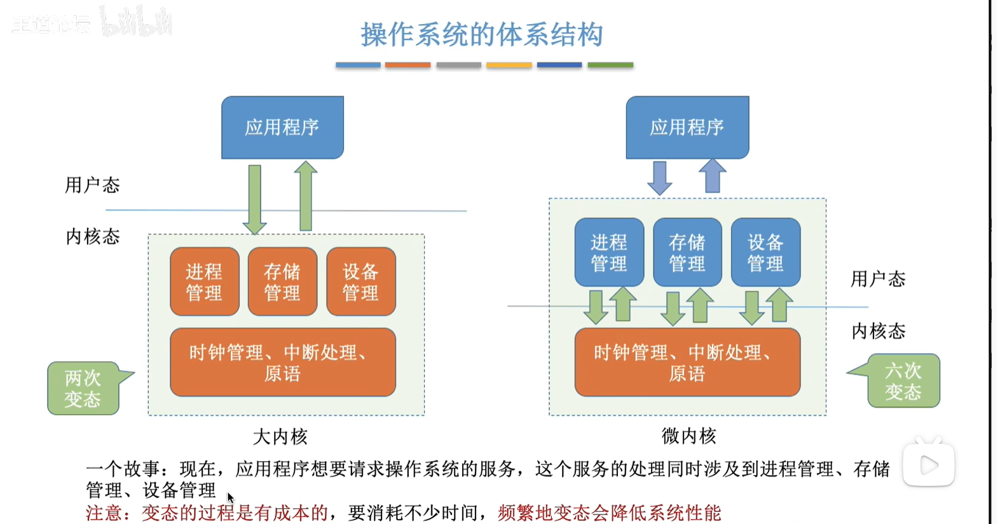

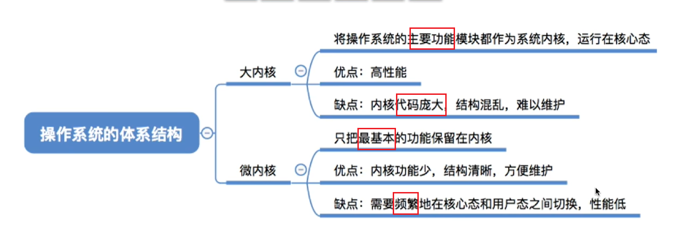

### 分层结构/模块化/外核

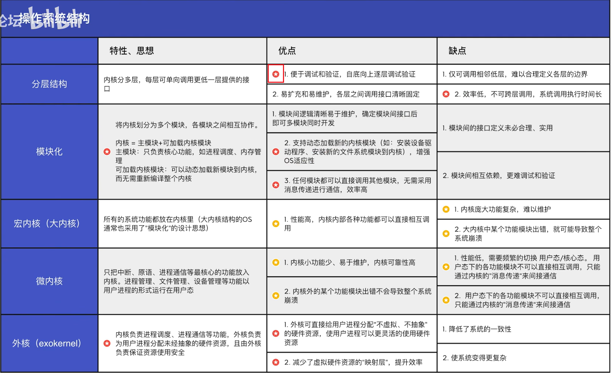

## 操作系统引导

操作系统引导（boot）--开机的时候怎么让操作系统运行起来？

磁盘

- 主引导记录（MBR）包含：磁盘引导程序和分区表（DS，说明每个盘的大小，范围）
- C：盘
  - 引导记录PBR（负责找到"启动管理器"）
  - 根目录
  - 其他
- D：盘
- E：盘
- F：盘

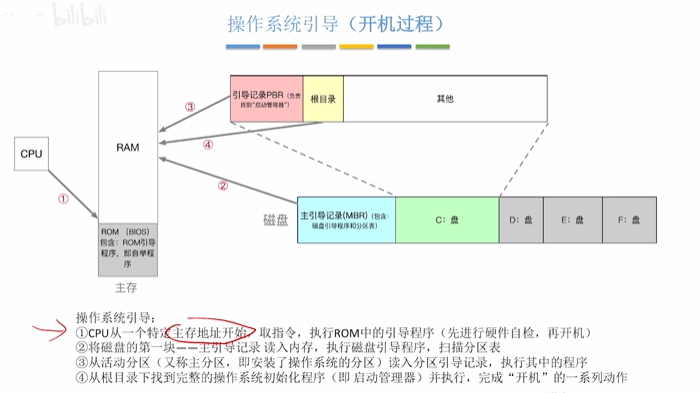

## 虚拟机

> - 没有任何软件支持的计算机称为`裸机`
> - 覆盖了软件的机器称为`扩充机器或虚拟机`

虚拟机：使用虚拟化技术，将一台物理机器虚拟化为多台虚拟机器（Virtual Machine，VM），每个虚拟机器都可以独立运行一个操作系统
同义术语：虚拟机管理程序/虚拟机监控程序/Virtual Machine Monitor/Hypervisor

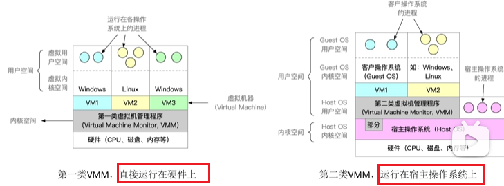

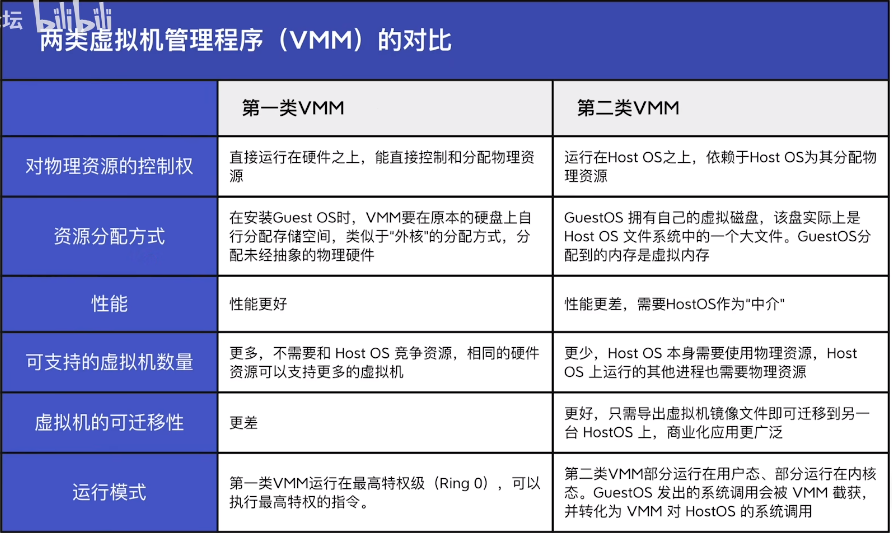

# 基础

## 发展

### 手工

主要缺点：用户独占全机、人机速度矛盾导致资源利用率极低

### 批处理阶段-单道批处理系统

引入脱机输入/输出技术（用外围机+磁带完成），并由监督程序（操作系统的雏形）负责控制作业的输入输出

主要优点：缓解了一定程度的人机速度矛盾，资源利用率有所提升。

主要缺点：内存中仅能有一道程序运行，只有该程序运行结束之后才能调入下一道程序。CPU有大量的时间是在空闲等待**1/0**完成。资源利用率依然很低。

### 批处理阶段-多道批处理系统

操作系统正式诞生，用于支持多道程序并发运行，**即在运行程序的过程中同步执行下一个输入程序**

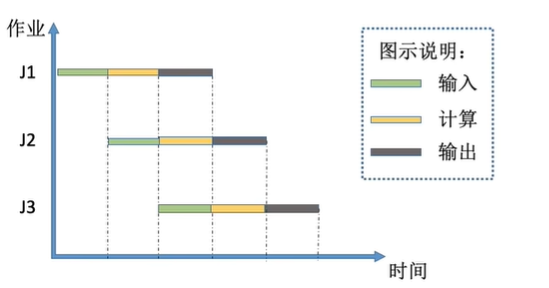

主要优点：多道程序并发执行，共享计算机资源。资源利用率大幅提升，CPU和其他资源更能保持“忙碌”状态，系统吞吐量增大。

主要缺点：用户响应时间长，没有人机交互功能（用户提交自己的作业之后就只能等待计算机处理完成，中间不能控制自己的作业执行。eg：无法调试程序/无法在程序运行过程中输入一些参数）

### 分时操作系统

分时操作系统：计算机以**时间片**为单位轮流为各个用户/作业服务，各个用户可通过终端与计算机进行交互。

主要优点：**用户请求可以被即时响应，解决了人机交互问题**。允许**多个用户**同时使用一台计算机，并且用户对计算机的操作相互独立，感受不到别人的存在。

主要缺点：不能**优先**处理一些紧急任务。操作系统对各个用户/作业都是完全公平的，循环地为每个用户/作业服务一个时间片，不区分任务的紧急性。

### 实时操作系统

实时操作系统：主要优点：能够优先响应一些紧急任务，某些紧急任务不需时间片排队。
在实时操作系统的控制下，计算机系统接收到外部信号后及时进行处理，并且要在严格的时限内处理完事件。实时操作系统的主要特点是**及时性和可靠性**

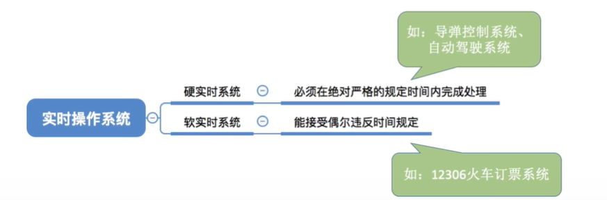

### 其他几种操作系统

- 网络操作系统：是伴随着计算机网络的发展而诞生的，能把网络中各个计算机有机地结合起来，实现数据传送等功能，实现网络中各种资源的共享（如文件共享）和各台计算机之间的通信。（如：Windows NT就是一种典型的网络操作系统，网站服务器就可以使用）
- 分布式操作系统：主要特点是分布性和并行性。系统中的各台计算机地位相同，任何工作都可以分布在这些计算机上，由它们并行、协同完成这个任务。
- 个人计算机操作系统：如Windows XP、Macos，方便个人使用。

## 特征


重要考点：

- 理解并发和并行的区别
- 并发和共享互为存在条件
- 没有并发和共享，就谈不上虚拟和异步，因此并发和共享是操作系统的两个最基本的特征

### 并发

- 并发：两个或多个事件在同一时间间隔内发生，这些事件在宏观上是同时发生的，在微观上是交替发生的， 操作系统的并发性指系统中同时存在着多个运行的程序

  > 一个单核(CPU)同一时刻只能执行一个程序，因此操作系统会协调多个程序使他们交替进行（这些程序在宏观上是同时发生的，在微观上是交替进行的）

- 并行：两个或多个事件在同一时刻发生

  > 在如今的计算机中，一般都是多核cpu的，即在同一时刻可以并行执行多个程序，比如我的计算机是8核的，我的计算机可以在同一时刻并行执行8个程序，但是事实上我们计算机执行的程序并不止8个，因此并发技术是必须存在的，并发性必不可少。

- 操作系统是伴随着“多道程序技术出现的”，因此**操作系统和并发是一同诞生的**

### 共享

- 资源共享即共享，是指系统中的资源可以供内存中**多个并发执行的进程**共同使用
- 共享分为两类：互斥共享和同时共享

（1）互斥共享

- 计算机中的某个资源在一段时间内只能允许一个进程访问，别的进程没有使用权
- 临界资源(独占资源)：在一段时间内只允许一个进程访问的资源，计算机中大多数物理设备及某些软件中的栈、变量和表格都属于临界资源，它们被要求互斥共享
- 举个例子：比如QQ和微信视频。同一段时间内摄像头只能分配给其中一个进程

（2）同时共享

- 计算机中的某个资源在在一段时间内可以同时允许多个进程访问
- 同时共享通常要求一个请求分为几个时间片段间隔的完成，即交替进行，“分时共享”

- 这里的同时指在宏观上是同时的，在微观上是交替进行访问的，只是cpu处理速度很快，我们感觉不到，在宏观上感觉是在同时进行
- 举个例子：比如QQ在发送文件A，微信在发送文件B，宏观上两个进程A和B都在访问磁盘，在我们看来是同时进行的，但是在微观上两个进程A和B是交替进行访问磁盘的，只是时间太短，cpu处理速度太快，我们感觉不到。

（3）**并发性和共享性互为存在条件**


### 虚拟

- 虚拟是把一个物理上的实体变为若干逻辑上的对应物。

- 操作系统的虚拟技术科归纳为：

  - 时分复用技术：如处理器的分时共享

  - 空间复用技术：如虚拟存储器


### 异步

- 异步：多道程序环境允许多个程序并发执行，但由于资源有限，如cpu只有一个，进程的执行并不是一贯到底的，而是走走停停的，它以不可预知的速度向前推进。
- 比如A进程正在占用CPU计算，B进程这时也想占用CPU计算，B进程只有等，等A进程算完了，A进程去访问磁盘资源了，这时B进程再占用CPU进行计算，B进程还没计算完，A进程从磁盘取出资源了，A进程发现B这时在占用CPU，这时A进程就需要等待，等B算完后再继续到CPU中进行计算。由于每个进程占用资源的时间不固定，所以进程的执行以不可预知的速度前进

**只有系统拥有并发性，才有可能导致异步性，如果失去并发性，系统只能串行执行**

## 运行机制

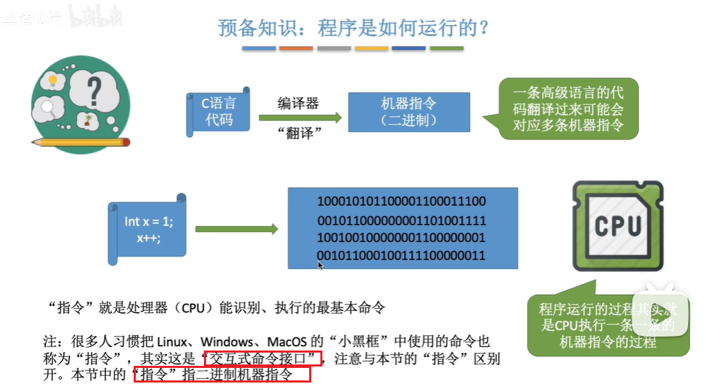

- 应用程序：普通程序员写的程序就是“应用程序”

- 内核程序：微软、苹果有一帮人负责实现操作系统，他们写的是“内核程序”

- 由很多内核程序组成了“操作系统内核”，或简称“**内核（Kernel）**”

  内核是操作系统最重要最核心的部分，也是最接近硬件的部分甚至可以说，一个操作系统只要有内核就够了（eg：Docker->仅需Linux内核）

### CPU状态

CPU有两种状态，“内核态”和“用户态”。别名：内核态-核心态=管态；用户态=目态

- 处于内核态时，说明此时正在运行的是内核程序，此时可以执行**特权指令**
- 处于用户态时，说明此时正在运行的是应用程序，此时**只能**执行**非特权指令**

> 拓展：CPU 能判断出指令类型，但是它怎么区分此时正在运行的是内核程序 or 应用程序？
>
> CPU中有一个寄存器叫**程序状态字寄存器（PSW）**，其中有个二进制位，1表示“内核态”，0表示“用户态”

### 内核态-用户态的切换

内核态→用户态：

- 执行一条特权指令—-修改PSW的标志位为“用户态”，这个动作意味着操作系统将主动让出CPU使用权

用户态→内核态：

- **由“中断”引发**，外设完成用户请求后（如完成读写操作），发出中断信号，CPU会发出一个软中断（软件中断）暂停执行下一条要执行的指令，而去执行中断处理程序，通过在**中断向量表**中查找相应的系统调用处理程序地址并跳转至其执行。该中断会把当前进程挂起，将控制权转交给内核。
- 异常：如非法使用特权指令，发生缺页异常等，同样会切换到内核态进行处理。
- **系统调用：用户态主动要求切换到内核态(通过内陷指令)**，从而使用内核提供的各项服务。比如，Linux创建进程时中用户态的`fork()`会调用到内核态的`sys_fork()`和`do_fork()`等。

## 中断和异常

### 中断的作用

CPU上会运行两种程序，一种是操作系统内核程序，一种是应用程序

**“中断”是让操作系统内核夺回CPU使用权的唯一途径**

如果没有“中断”机制，那么一旦应用程序上CPU运行，CPU就会一直运行这个应用程序。**没有中断，何来“并发”！？**

### 中断的类型

- 根据中断的来源（中断源），可以分：

  - 外部中断源（硬中断）：
    - 由外部硬件产生的信号，如键盘、打印机的中断信号
      - 时钟中断——由时钟部件发来的中断信号
      - 1/0中断—-由输入/输出设备发来的中断信号
    - 软中断（softirq）：对于一些处理时间较长的硬件中断，为了保证 CPU 关中断的时间很短，所以将中断分为上半部分和下半部分，下半部分也被称为软中断。

  - 内部中断源（软件中断，也称"异常"）：由程序错误等产生的中断，如溢出、除 0 等。

- 根据中断的产生时期，可以分为同步(synchronous)中断和异步(asynchronous)中断：

  - 同步中断是当指令执行时由 CPU 控制单元产生，比如系统调用，发生时，CPU 在执行下一条指令前一定会进入中断服务程序。


  - 异步中断是指由其他硬件设备产生的中断，产生的时刻不确定，且与 CPU 的执行无关，也称外部中断。

- 根据中断源，可以将中断分为中断（Interrupt，来自 IO 设备）和异常（Exception，来自程序或 CPU 指令）。

  - 其中，异常可以进一步分为陷阱（trap，有意的异常，如系统调用）、故障（fault，潜在可恢复的错误）、终止（abort，不可恢复的错误）三种。

    有时候应用程序想请求操作系统内核的服务，此时会执行一条**特殊的指令--陷入指令**，该指令会引发一个内部中断信号

    执行“陷入指令”，意味着应用程序**主动**地将CPU控制权还给操作系统内核。**“系统调用”就是通过陷入指令完成**

- 根据中断是否可以被屏蔽，分为可屏蔽中断和不可屏蔽中断。异常都是不可屏蔽中断，而硬中断中有一部分是可屏蔽中断。

### 中断机制

不同的中断信号，需要用不同的中断处理程序来处理。当CPU检测到中断信号后，会根据中断信号的类型去查询“**中断向量表**”，以此来找到相应的中断处理程序在内存中的存放位置。

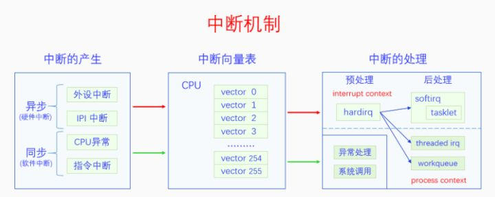

## 系统调用

### 接口类型

为了让用户方便、快捷、可靠的操作计算机硬件并执行自己的程序，操作系统提供了用户接口

操作系统提供的接口分为两类：`命令接口和程序接口`

- `命令接口`：用户可以`直接`使用的，利用这些操作命令来组织和控制作业的执行
- `程序接口`：用户通过程序`间接`使用的，编程人员可以使用它们来请求操作系统服务
  

#### 命令接口

命令接口分为两类：联机命令接口和脱机命令接口，**用户可以`直接`调用**

- `联机命令接口`：又称交互式命令接口，适用于分时或实时系统的接口，由一组键盘操作命令组成。用户输入一条指令，操作系统就执行一条指令；
  

- **脱机命令接口：又称批处理接口**，使用于批处理系统，由一组作业控制命令组成。用户输入一堆指令，操作系统运行一堆指令。在操作系统运行这些命令时用户不可干预。

  > 批处理(Batch)，也称为批处理脚本。顾名思义，批处理就是对某对象进行批量的处理，通常被认为是一种简化的脚本语言，它应用于DOS和Windows系统中。批处理文件的扩展名为bat 。

#### 程序接口

- 程序接口：由一组`系统调用（也称广义指令）`组成
- 程序员通过在程序中使用这些系统调用(列如C语言库函数)来请求操作系统为其提供服务，只能通过用户程序`间接`调用
- 如使用各种外部设备、申请分配和回收内存及其它各种要求
  

> 动态链接库英文为DLL，是Dynamic Link Library的缩写。DLL是一个包含可由多个程序，同时使用的代码和数据的库。

- 比如常见的图形用户界面程序接口GUI
  

### 系统调用概念

操作系统作为用户和计算机硬件之间的接口，需要向上提供一些简单易用的服务。**主要包括命令接口和程序接口。其中，程序接口由一组系统调用组成。**

“系统调用”是操作系统提供给应用程序（程序员/编程人员）使用的接口，可以理解为一种可供程序调用的特殊函数，**应用程序可以通过系统调用来请求获得操作系统内核的服务**

- 小例子：为什么系统调用是必须的？

  生活场景：去学校打印店打印论文，你按下了wPs的“打印”选项，打印机开始工作。

  你的论文打印到一半时，另一位同学按下了Word的“打印”按钮，开始打印他自己的论文。

  思考：如果两个进程可以随意地、并发地共享打印机资源，会发生什么情况？

  两个进程并发运行，打印机设备交替地收到WPS 和 Word两个进程发来的打印请求，结果两篇论文的内容混杂在一起了...

  解决方法：由操作系统内核对共享资源进行统一的管理，并向上提供“系统调用”，用户进程想要使用打印机这种共享资源，只能通过系统调用向操作系统内核发出请求。内核会对各个请求进行协调处理。

- 什么功能要用系统调用实现？

  应用程序通过系统调用请求操作系统的服务。而系统中的各种**共享资源都由操作系统内核统一掌管**，因此凡是与**共享资源**有关的操作（如存储分配、10操作、文件管理等），都必须通过系统调用的方式向操作系统内核提出服务请求，由操作系统内核代为完成，这样可以**保证系统的稳定性和安全性，防止用户进行非法操作**。

  

### 系统调用的过程

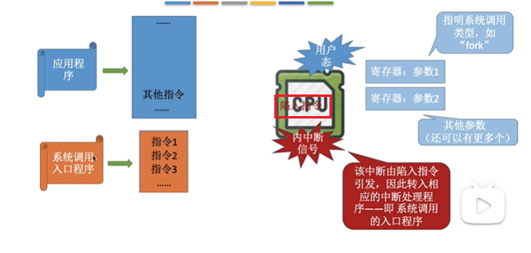

通过陷入指令引发内中断，因此转入相应的中断处理程序——即系统调用的入口程序

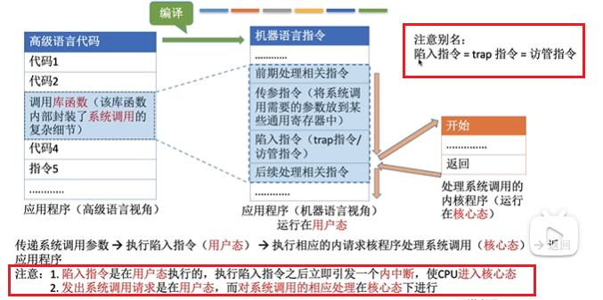

**注意：**

**1.陷入指令是在用户态执行的，执行陷入指令之后立即引发一个内中断，使CPU进入核心态**

**2发出系统调用请求是在用户态，而对系统调用的相应处理在核心态下进行**


### 系统调用和库函数区别

#### 1、替换性不同

系统调用通常不可替换，而库函数通常可替换。普通的库函数调用由函数库或用户自己提供，因此库函数是可以替换的。例如，对于存储空间分配函数malloc，如果不习惯它的操作方式，我们完全可以定义自己的malloc函数。

#### 2、调用接口不同

系统调用通常提供最小接口，而库函数通常提供较复杂功能。例如sbrk系统调用分配一块空间给进程，而malloc则在用户层次对这以空间进行管理。

#### 3、运行空间不同

系统调用运行在内核空间，而库函数运行在用户空间。因为系统调用属于内核，和库函数不属于内核。因此，如果当用户态进程调用一个系统调用时，CPU需要将其切换到内核态，并执行一个内核函数。

#### 4、返回值不同

内核调用都返回一个整数值，而库函数并非一定如此。在内核中，整数或0表示系统调用成功结束，而负数表示一个出错条件。而出错时，内核不会将其设置在errno，而是由库函数从系统调用返回后对其进行设置或使用。

#### 5、移值性区别

POSIX 标准针对库函数而不是系统调用，判断一个系统是否与POSIX需要看它是否提供一组合适的应用程序接口，而不管其对应的函数是如何实现的。因此从移值性来讲，使用库函数的移植性较系统调用更好。

#### 6、运行时间区别

系统调用运行时间属于系统时间，库函数运行时间属于用户时间。

#### 7、调用开销区别

调用系统调用开销相对库函数来说更大。很多库函数本身都调用了系统调用，那为什么直接调用系统调用的开销较大呢？这得益于双缓冲的实现，在用户态和内核态，都应用了缓冲技术，对于文件读写来说，调用库函数，可以大大减少调用系统调用的次数。而用户进程调用系统调用需要在用户空间和内核空间进行上下文切换，开销较大。如此以来，库函数的开销也就会比直接调用系统调用小了。另外一方面，库函数同样会对系统调用的性能进行优化


# 内存管理

## 概念

内存可存放数据。程序执行前需要先放到内存中才能被CPU处理--缓和CPU与硬盘之间的速度矛盾（cpu读写数据很快，而硬盘读写慢）

> 思考：在多道程序环境下，系统中会有多个程序并发执行，也就是说会有多个程序的数据需要同时放到内存中。那么，如何区分各个程序的数据是放在什么地方的呢？
>
> 给内存的存储单元编地址


## 基本原理

从写程序到程序运行

- 编辑源代码文件
- 编译 由源代码文件生成目标模块（高级语言"翻译"为机器语言）

- 链接 由目标模块生成装入模块，链接后形成完整的逻辑地址
- 装入 将装入模块装入内存，装入后形成物理地址

### 指令的工作原理

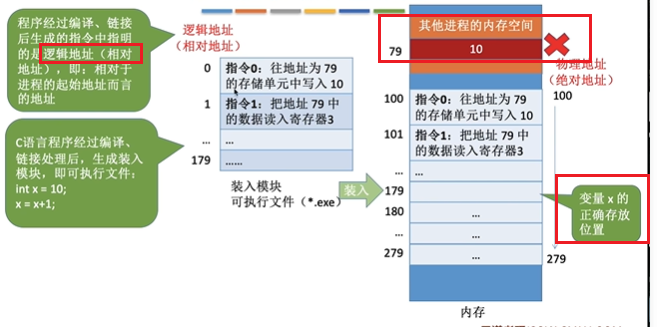

- 绝对装入：在编译时，如果知道程序将放到内存中的哪个位置，编译程序将产生绝对地址的目标代码。装入程序按照装入模块中的地址，将程序和数据装入内存。
  Eg：如果知道装入模块要从地址为100的地方开始存放...

  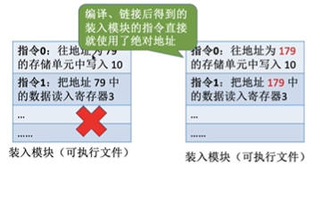

  绝对装入**只适用于单道程序环境**，若换一个电脑地址100是被占用的，那么就无法存放程序

- 可重定位装入（静态重定位）

  静态重定位：又称可重定位装入。**编译、链接后的装入模块的地址都是从0开始的**，指令中使用的地址、数据存放的地址都是**相对于起始地址**而言的逻辑地址。可根据内存的当前情况，将装入模块装入到内存的适当位置。装入时对地址进行“重定位”，将逻辑地址变换为物理地址（地址变换是在装入时一次完成的）。

  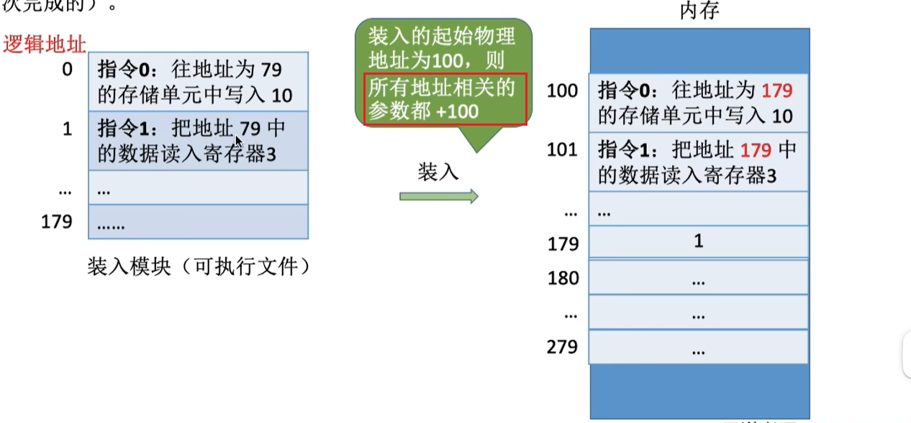

  静态重定位的特点是在一个作业装入内存时，**必须分配其要求的全部内存空间**，如果没有足够的内存，就不能装入该作业。作业一旦进入内存后，在运行期间就不能再移动（位置已经写死），也不能再申请内存空间。

  用于早期的多道批处理操作系统

- 动态运行时装入（动态重定位）

  动态重定位：又称动态运行时装入。编译、链接后的装入模块的地址都是从0开始的。装入程序把装入模块装入内存后，并不会立即把逻辑地址转换为物理地址，而是把地址转换**推迟**到程序真正要执行时才进行。因此装入内存后所有的地址依然是逻辑地址。这种方式需要一个**重定位寄存器**的支持。

  重定位寄存器：存放装入模块存放的起始位置

  采用动态重定位时允许程序在内存中发生移动。并且可将程序分配到不连续的存储区中；在程序运行前只需装入它的**部分代码**即可投入运行，然后在程序运行期间，根据需要动态申请分配内存；便于程序段的共享，可以向用户提供一个比存储空间大得多的地址空间。


### 从写程序到程序运行的过程

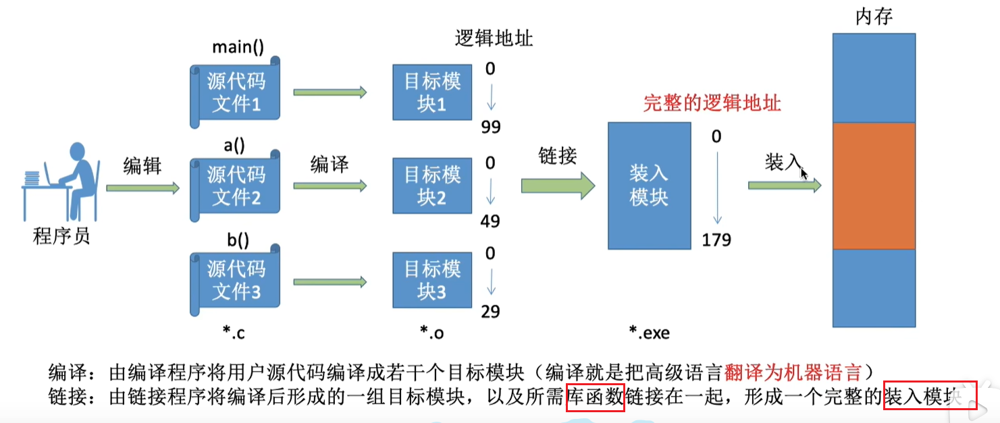

链接的三种方式：

- 静态链接：在程序运行之前，先将各目标模块及它们所需的库函数连接成一个完整的可执行文件（装入模块），之后不再拆开。
- 装入时动态链接：将各目标模块装入内存时，边装入边链接的链接方式。
- 运行时动态链接：在程序执行中需要该目标模块时，才对它进行链接。其优点是便于修改和更新，便于实现对目标模块的共享。

### 局部性原理

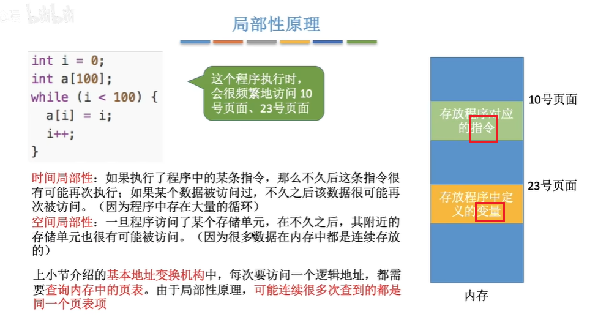

## 内存管理

> 操作系统要怎么记录哪些内存区域已经被分配出去了，哪些又还空闲？
>
> 当进程运行结束之后，如何将进程占用的内存空间回收？

- 1.操作系统负责内存空间的分配与回收

- 2.操作系统需要提供某种技术从逻辑上对内存空间进行扩充(虚拟内存)

- 逻辑地址到物理地址的转换（3种装入）

  为了使编程更方便，程序员写程序时应该只需要关注指令、数据的逻辑地址。而逻辑地址到物理地址的转换（这个过程称为地址重定位）应该由操作系统负责，这样就保证了程序员写程序时不需要关注物理内存的实际情况。

### 内存保护

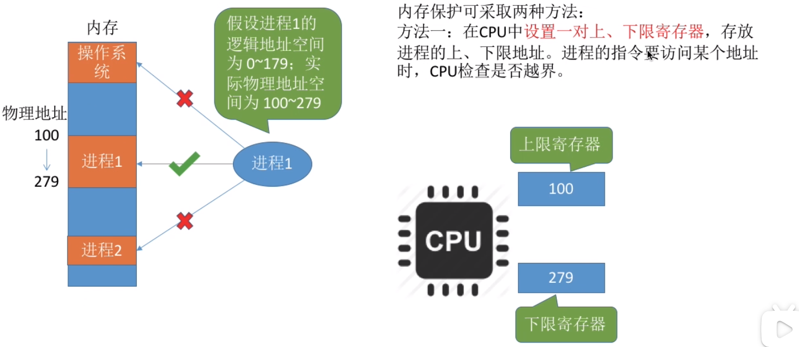

方法二：采用重定位寄存器（又称基址寄存器）和界地址寄存器（又称限长寄存器）进行越界检查。重定位寄存器中存放的是进程的**起始物理地址**。界地址寄存器中存放的是进程的**最大逻辑地址**。

### 覆盖与交换

#### 覆盖

引入了覆盖技术，用来解决“程序大小超过物理内存总和”的问题

覆盖技术的思想：将程序分为多个段（多个模块）。常用的段常驻内存，不常用的段在需要时调入内存。

**内存中分为一个“固定区”和若干个“覆盖区”**。需要常驻内存的段放在“固定区”中，调入后就不再调出（除非运行结束）不常用的段放在“覆盖区”，需要用到时调入内存，用不到时调出内存

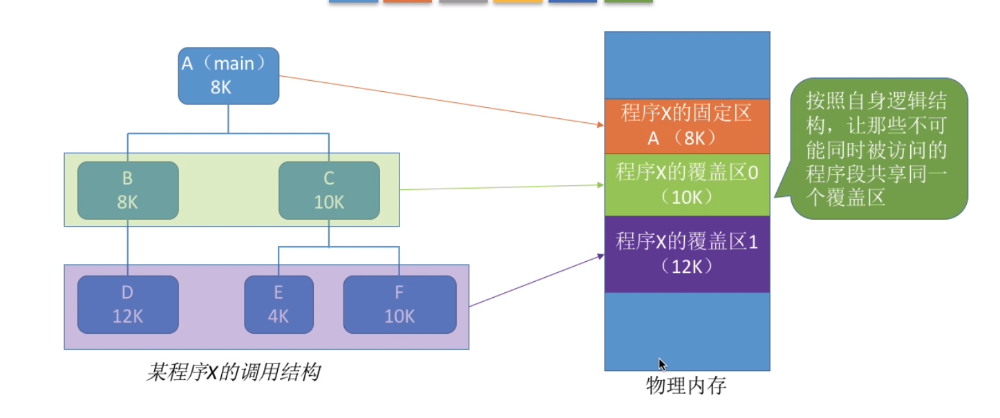

必须由程序员声明覆盖结构，操作系统完成自动覆盖。缺点：**对用户不透明，增加了用户编程负担**。

#### 交换

> 类似与进程的调度

交换（对换）技术的设计思想：内存空间紧张时，系统将内存中某些进程暂时换出外存，把外存中某些已具备运行条件的进程换入内存（进程在内存与磁盘间动态调度）

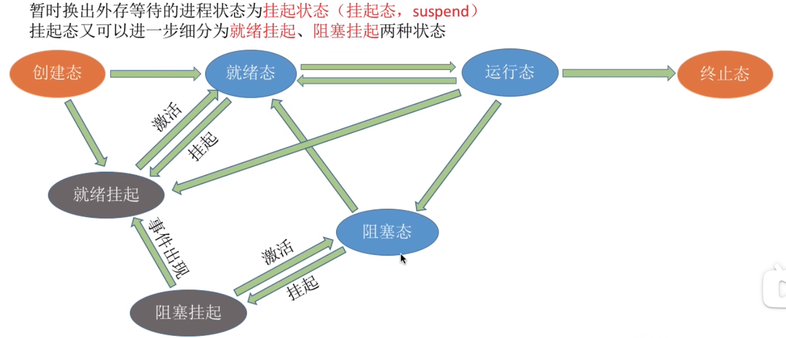

- 1.应该在外存（磁盘）的什么位置保存被换出的进程？

  具有对换功能的操作系统中，通常把磁盘空间分为文件区和对换区两部分。文件区主要用于存放文件，主要追求存储空间的**利用率**，因此对文件区空间的管理采用**离散分配**方式；对换区空间只占磁盘空间的小部分，被换出的进程数据就存放在对换区。由于对换的速度直接影响到系统的整体速度，因此对换区空间的管理主要**追求换入换出速度**，因此通常对换区采用**连续分配**方式（学过文件管理章节后即可理解）。总之，对换区的1/0速度比文件区的更快。

- 2.什么时候应该交换？

  交换通常在许多进程运行且内存吃紧时进行，而系统负荷降低就暂停。例如：在发现许多进程运行时经常发生缺页，就说明内存紧张，此时可以换出一些进程；如果缺页率明显下降，就可以暂停换出

- 3.应该换出哪些进程？

  可优先换出阻塞进程；可换出优先级低的进程；为了防止优先级低的进程在被调入内存后很快又被换出，有的系统还会考虑进程在内存的驻留时间…..

### 连续分配管理

#### 连续分配管理方式

连续分配：指为用户进程分配的必须是一个连续的内存空间

- 单一连续分配

  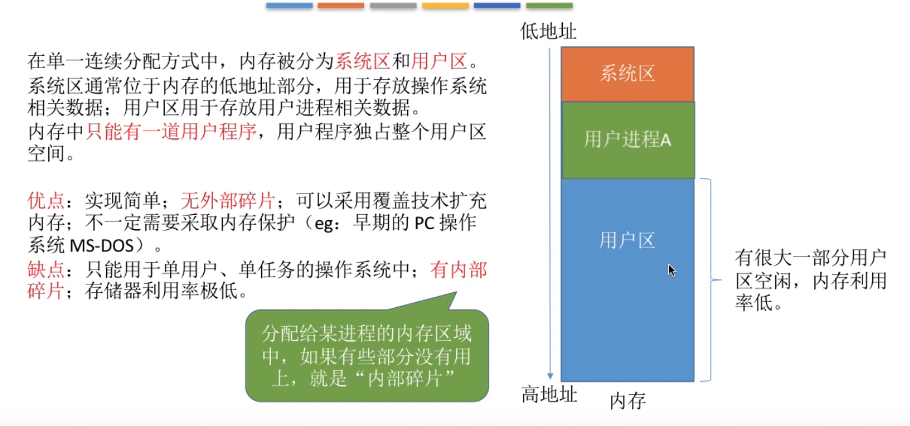

- 固定分区分配

  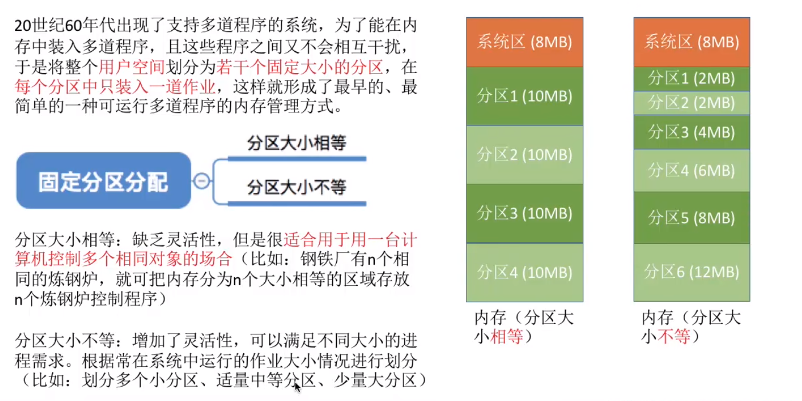

  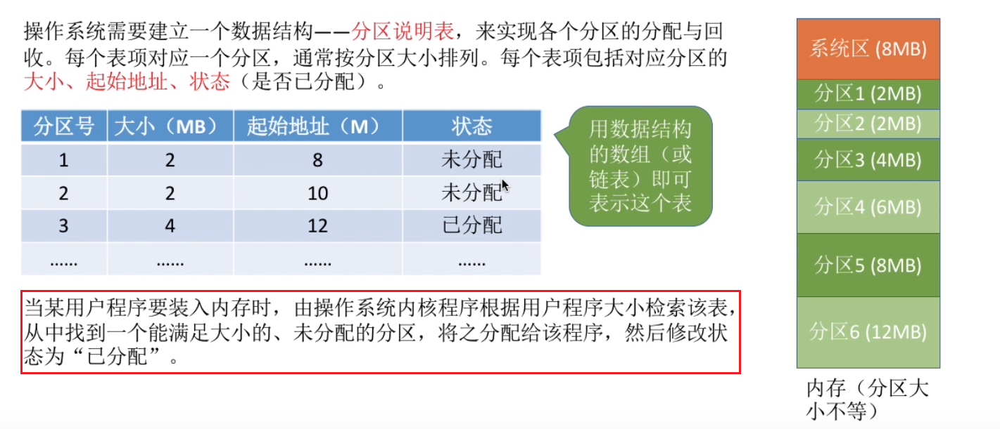

  优点：实现简单，无外部碎片。
  缺点：a.当用户程序太大时，可能所有的分区都不能满足需求，此时不得不采用**覆盖技术**来解决，但这又会降低性能；b.会产生内部碎片，内存利用率低。

- 动态分区分配

  > 动态分区分配又称为可变分区分配。这种分配方式不会预先划分内存分区，而是在进程装入内存时，根据进程的大小动态地建立分区，并使分区的大小正好适合进程的需要。因此系统分区的大小和数目是可变的。
  > **动态分区分配没有内部碎片，但是有外部碎片。**
  > 外部碎片，是指内存中的某些空闲分区由于太小而难以利用。
  > 内部碎片，分配给某进程的内存区域中，如果有些部分没有用上。
  >
  > 如果内存中空闲空间的总和本来可以满足某进程的要求，但由于进程需要的是一整块连续的内存空间，因此这些“碎片”不能满足进程的需求。
  > 可以通过**紧凑（拼凑，Compaction）技术**来解决外部碎片。

  动态分区分配又称为可变分区分配。这种分配方式**不会预先划分内存分区**，而是在进程装入内存时，根据进程的大小动态地建立分区，并使分区的大小正好适合进程的需要。因此系统分区的大小和数目是可变的。（eg：假设某计算机内存大小为 64MB，系统区 8MB，用户区共 56 MB...）

  - 系统要用什么样的数据结构记录内存的使用情况？

    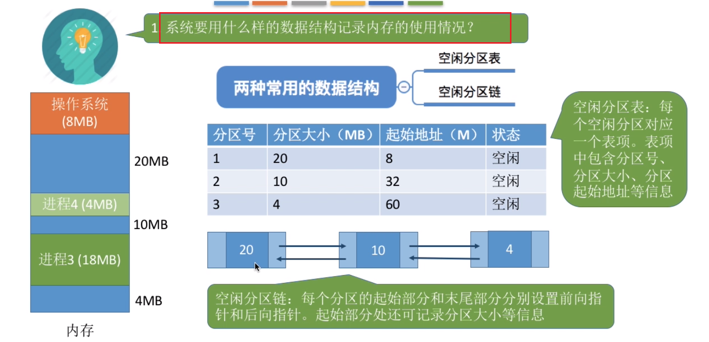

  

  - 当很多个空闲分区都能满足需求时，应该选择哪个分区进行分配？应该用最大的分区进行分配？还是用最小的分区进行分配？又或是用地址最低的部分进行分配？动态分区分配算法会介绍
  - 如何进行分区的分配与回收操作？假设系统采用的数据结构是“空闲分区表”
    - 分配
    - 回收：
      - 回收区的后面有一个相邻的空闲分区，两个相邻的空闲分区合并为一个
      - 回收区的前面有一个相邻的空闲分区，两个相邻的空闲分区合并为一个
      - 回收区的前、后各有一个相邻的空闲分区，三个相邻的空闲分区合并为一个
      - 回收区的前、后都没有相邻的空闲分区，新增一个表项

##### 动态分区分配算法

- 首次适应算法（First Fit）每次都从低地址开始查找，找到第一个能满足大小的空闲分区。

  如何实现：**空闲分区以地址递增的次序排列。**每次分配内存时顺序查找空闲分区链（或空闲分区表），找到大小能满足要求的第一个空闲分区。

- 最佳适应算法（Best Fit）

  算法思想：由于动态分区分配是一种**连续分配方式**，为各进程分配的**空间必须是连续**的一整片区域。因此为了保证当“大进程”到来时能有连续的大片空间，可以尽可能多地留下大片的空闲区，即，**优先使用更小的空闲区**。
  如何实现：**空闲分区按容量递增次序链接**。每次分配内存时顺序查找空闲分区链（或空闲分区表），找到大小能满足要求的第一个空闲分区。

  缺点：每次都选最小的分区进行分配，会留下越来越多的、很小的、难以利用的内存块。因此这种方法会产生很多的外部碎片。

- 最坏适应算法（Worst Fit）

  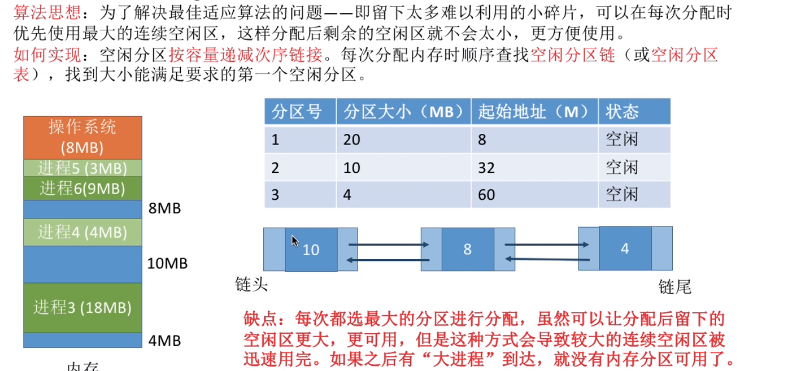

- 邻近适应算法（Next Fit）

  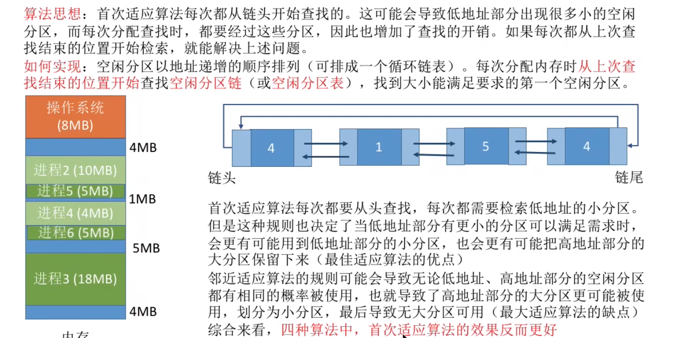

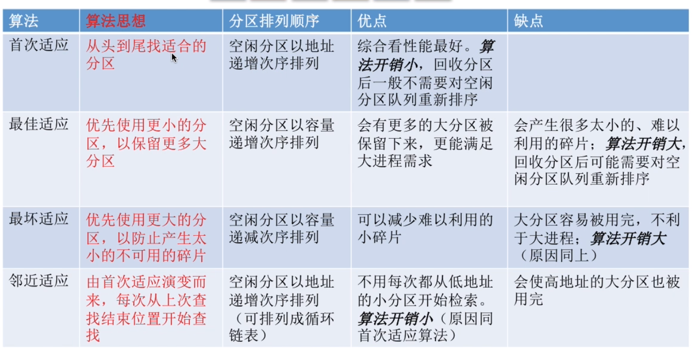

#### 非连续分配管理方式	

##### **基本分页存储管理**

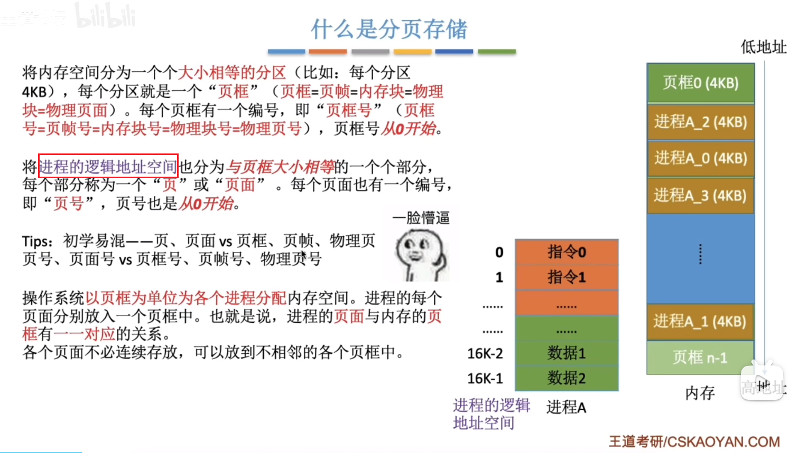

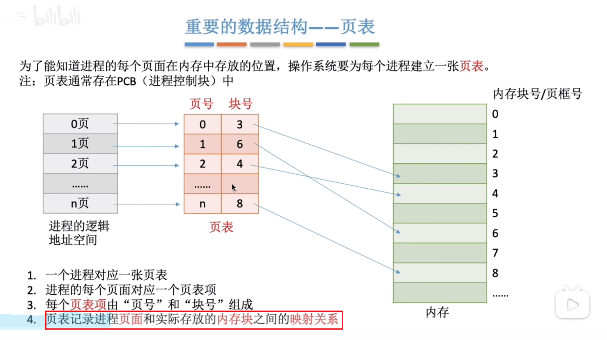

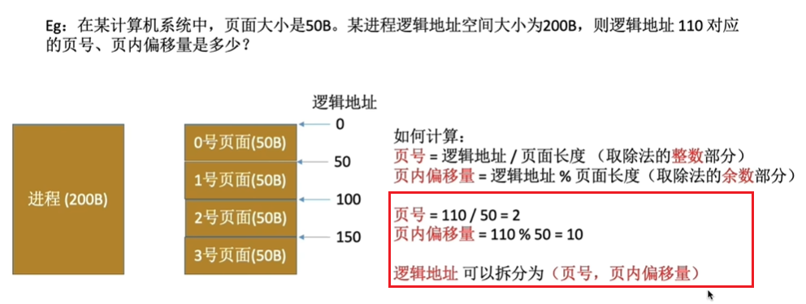

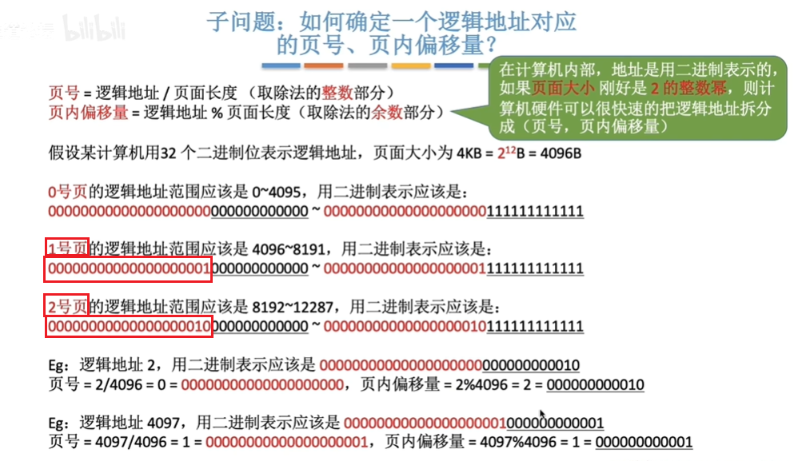


页号=进程的逻辑地址/页面长度（取除法的整数部分）

页内偏移量=逻辑地址%页面长度（取除法的余数部分）

结论：如果每个页面大小为 $2^KB$ ，用二进制数表示逻辑地址，则末尾 K位即为页内偏移量，其余部分就是页号。因此，如果让每个页面的大小为2 的整数幂，计算机硬件就可以很方便地得出一个逻辑地址对应的页号和页内偏移量，而无需进行除法运算，从而提升了运行速度。

**物理地址的计算**更加迅速--根据逻辑地址得到页号，根据页号查询**页表**从而找到页面存放的内存块号，将二进制表示的内存块号和页内偏移量拼接起来，就可以得到最终的物理地址。


###### 基本地址变换机构

基本地址变换机构可以借助进程的页表将逻辑地址转换为物理地址。
通常会在系统中设置一个页表寄存器（PTR），存放页表在内存中的起始地址F和页表长度M进程未执行时，页表的始址和页表长度放在进程控制块（PCB）中，当进程被调度时，"操作系统内核会把它们放到页表寄存器中。

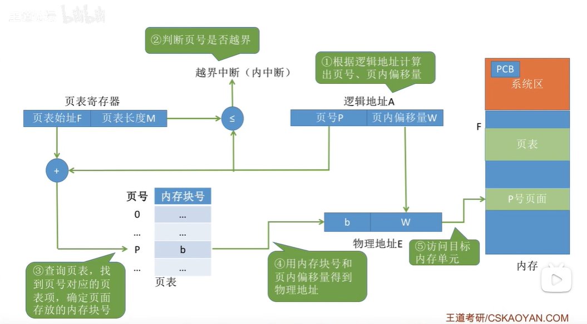

注意：页面大小是2的整数幂
设页面大小为L，逻辑地址A到物理地址E的变换过程如下：

- ①计算页号P和页内偏移量W（如果用十进制数手算，则P=A/L，W=A%L；但是在计算机实际运行时，逻辑地址结构是固定不变的，因此计算机硬件可以更快地得到二进制表示的页号、页内偏移量）

- ②比较页号P和页表长度M，若P2M，则产生越界中断，否则继续执行。（注意：页号是从0开始的，而页表长度至少是1，因此P=M时也会越界）

- 3页表中页号P对应的页表项地址=页表起始地址F+页号P*页表项长度，取出该页表项内容b，即为内存块号。（注意区分页表项长度、页表长度、页面大小的区别。页表长度指的是这个页表中总共有几个页表项，即总共有几个页；页表项长度指的是每个页表项占多大的存储空间；页面大小指的是一个页面占多大的存储空间）

- ④**计算E=b*L+W**，用得到的物理地址E去访存。（如果内存块号、页面偏移量是用二进制表示的，那么把二者拼接起来就是最终的物理地址了）

  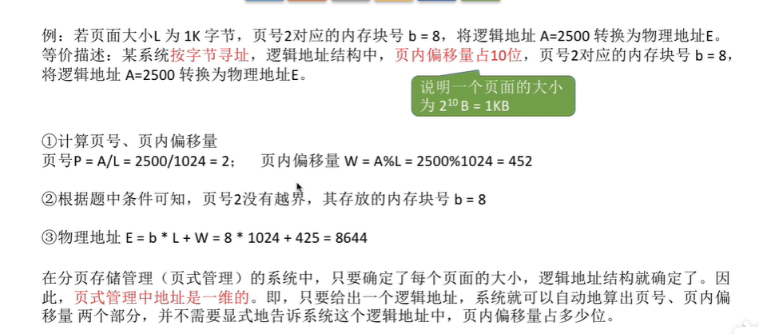

###### 具有快表的地址变换机构

快表，又称联想寄存器（TLB，translation lookaside buffer），是一种访问速度**比内存**快很多的**高速缓存**（TLB不是内存！），用来存放最近访问的页表项的副本，可以加速地址变换的速度。与此对应，内存中的页表常称为慢表。


引入快表后，地址的变换过程

1. CPU给出逻辑地址，由某个硬件算得页号、页内偏移量，将页号与快表中的所有页号进行比较。

2. 如果找到匹配的页号，说明要访问的页表项在快表中有副本，则直接从中取出该页对应的内存块号，再将内存块号与页内偏移量拼接形成物理地址，最后，访问该物理地址对应的内存单元。因此，若**快表命中**，则访问某个逻辑地址仅需**一次访存**即可。

3. 如果没有找到匹配的页号，则需要**访问内存中的页表**，找到对应页表项，得到页面存放的内存块号，再将内存块号与页内偏移量拼接形成物理地址，最后，访问该物理地址对应的内存单元。因此，若**快表未命中**，则访问某个逻辑地址需要**两次访存**（注意：在找到页表项后，应同时将其存入快表，以便后面可能的再次访问。但若快表已满，则必须按照一定的算法对旧的页表项进行替换）

   

由于查询快表的速度比查询页表的速度快很多，因此只要快表命中，就可以节省很多时间。因为**局部性原理**，一般来说快表的命中率可以达到90%以上。


例：某系统使用基本分页存储管理，并采用了具有快表的地址变换机构。访问一次快表耗时1us，访问一次内存耗时100us。若快表的命中率为90%，那么访问一个逻辑地址的平均耗时是多少？
（1+100）* 0.9 +（1+100+100）* 0.1 = 111 us

- 先查快表1us，命中，一次访存100us
- 先查快表1us，未命中，访问慢表100us，再访问最终的地址也是100us。**两次访存**

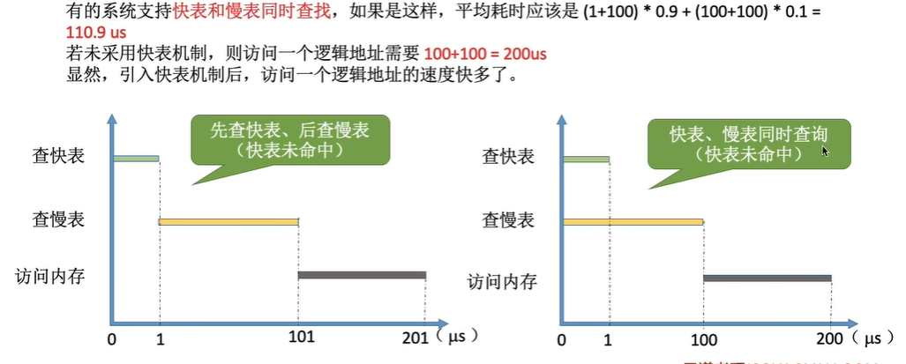

###### 总结

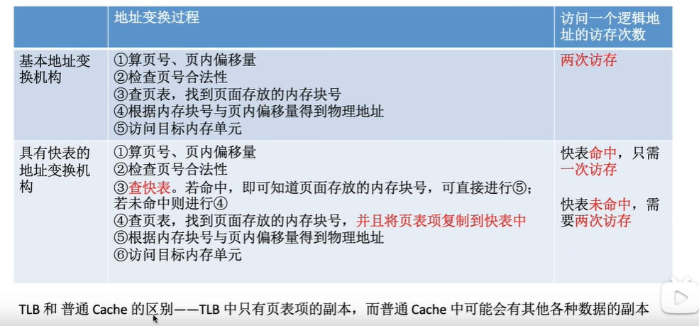

###### 两级页表

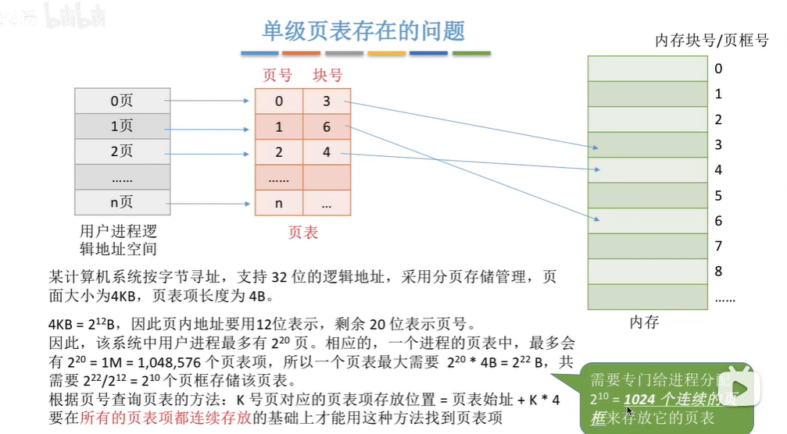

两级页表的**访存**次数分析（假设没有快表机构）
第一次访存：访问内存中的页目录表
第二次访存：访问内存中的二级页表
第三次访存：访问目标内存单元

> 如何解决单级页表的问题
>
> 问题一：页表必须**连续**存放，因此当页表很大时，需要占用很多个连续的页框。
> 问题二：没有必要让整个页表常驻内存，因为进程在一段时间内可能只需要访问某几个特定的页面。
>
> 可将长长的页表进行分组，使每个内存块刚好可以放入一个分组（比如上个例子中，页面大小4KB，每个页表项4B，每个页面可存放1K个页表项，因此每1K个连续的页表项为一组，每组刚好占一个内存块，再讲各组离散地放到各个内存块中）
>
> 另外，要为离散分配的页表再建立一张页表，称为**页目录表**，或称外层页表，或称顶层页表

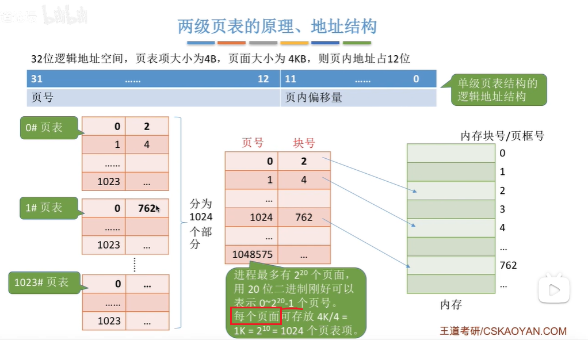


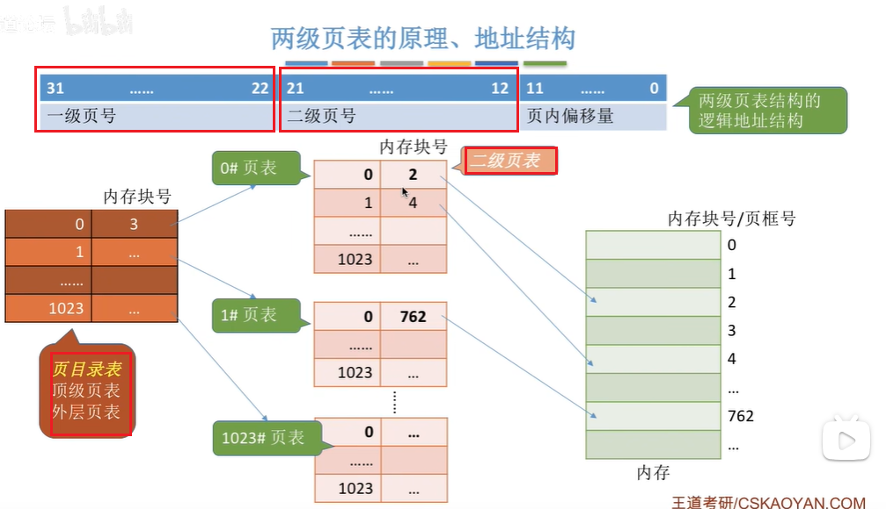

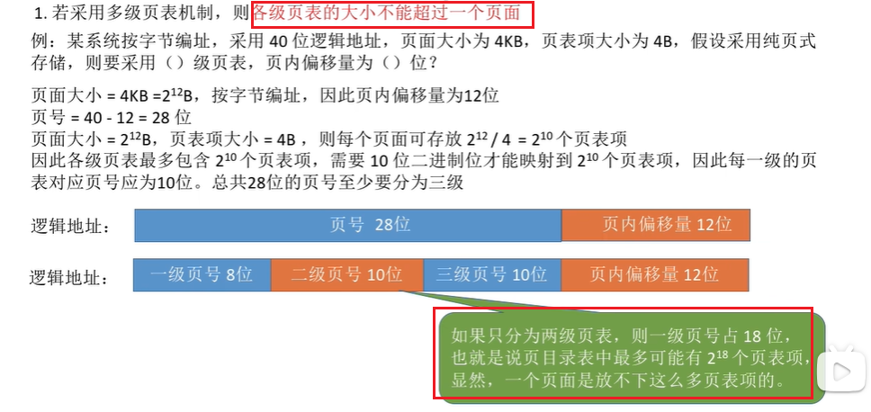

##### 基本分段存储管理 

进程的地址空间：按照**程序自身的逻辑**关系划分为若干个段，每个段都有一个段名（在低级语言中，程序员使用段名来编程），每段从0开始编址

内存分配规则：以段为单位进行分配，**每个段在内存中占据连续空间，但各段之间可以不相邻。**

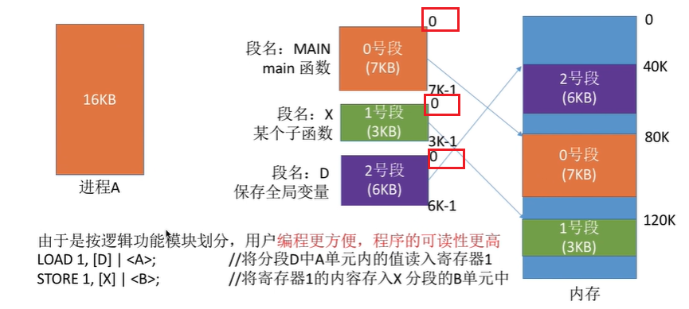

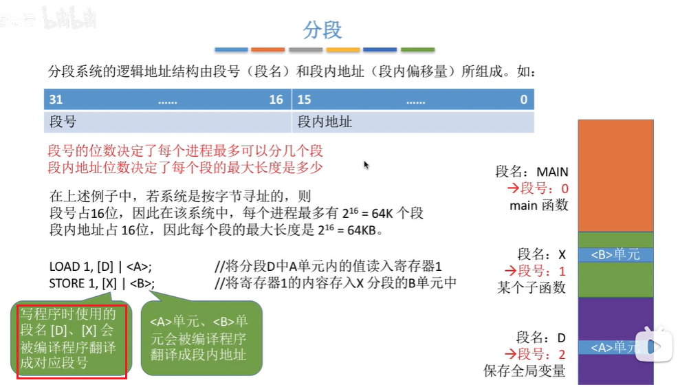

问题：程序分多个段，各段离散地装入内存，为了保证程序能正常运行，就必须能从物理内存中找到各个逻辑段的存放位置。为此，需为每个进程建立一张段映射表，简称“段表”。

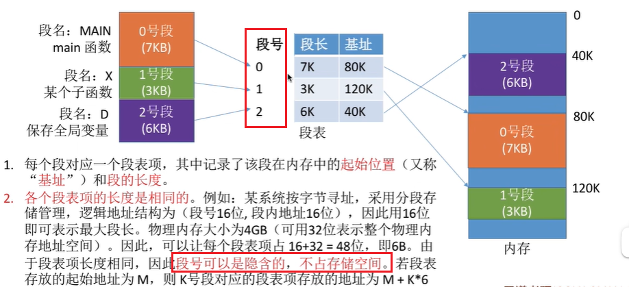

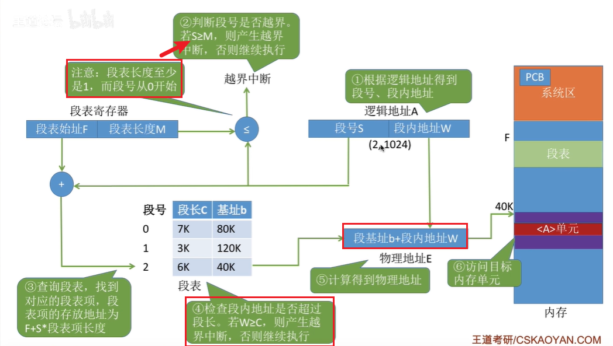

需要对比段内地址W和段长C的大小，防止越界。

##### 页和段

页是信息的物理单位。分页的主要目的是为了实现离散分配，提高内存利用率。分页仅仅是系统管理上的需要，完全是系统行为，**对用户是不可见的。**

段是信息的逻辑单位。分段的主要目的是更好地满足用户需求。一个段通常包含着一组属于一个逻辑模块的信息。**分段对用户是可见的**，用户编程时需要显式地给出段名。

页的大小固定且由系统决定。段的长度却不固定，决定于用户编写的程序。

分页的用户进程地址空间是一维的，程序员只需给出一个记忆符即可表示一个地址。

分段的用户进程地址空间是二维的，程序员在标识一个地址时，既要给出段名，也要给出段内地址。


分段比分页更容易实现信息的共享和保护。
**不能被修改的代码**称为纯代码或可重入代码（不属于临界资源），这样的代码是可以共享的。可修改的代码是不能共享的（比如，有一个代码段中有很多变量，各进程并发地同时访问可能造成数据不一致）

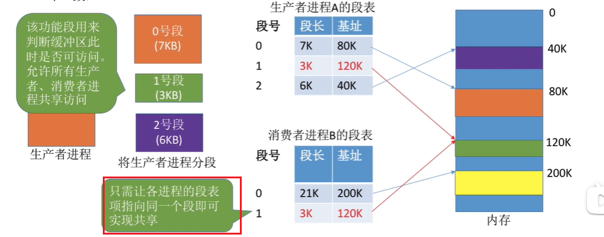

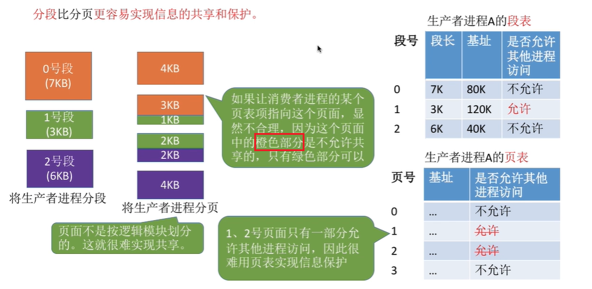

访问一个逻辑地址需要几次访存？

分页（单级页表）：第一次访存——查内存中的页表，第二次访存——访问目标内存单元。总共两次访存

分段：第一次访存——查内存中的段表，第二次访存——访问目标内存单元。总共两次访存

与分页系统类似，分段系统中也可以引入快表机构，将近期访问过的段表项放到**快表**中，这样可以少一次访问，加快地址变换速度。

##### 段页式存储管理

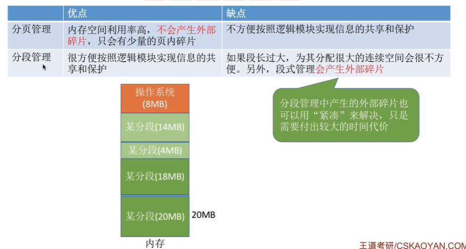

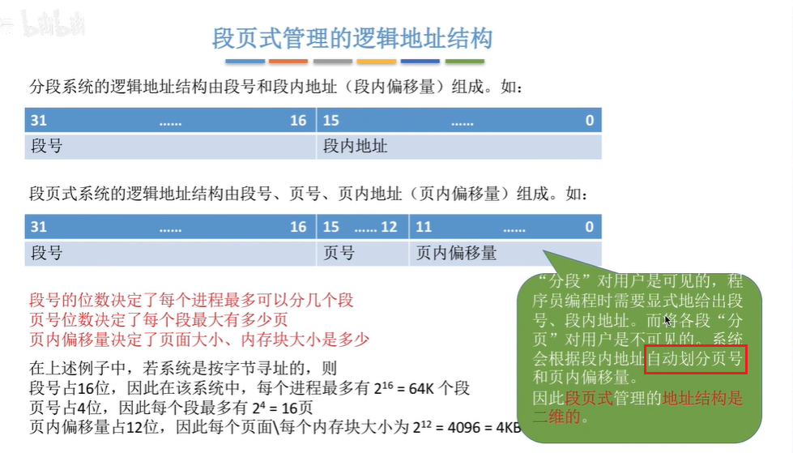

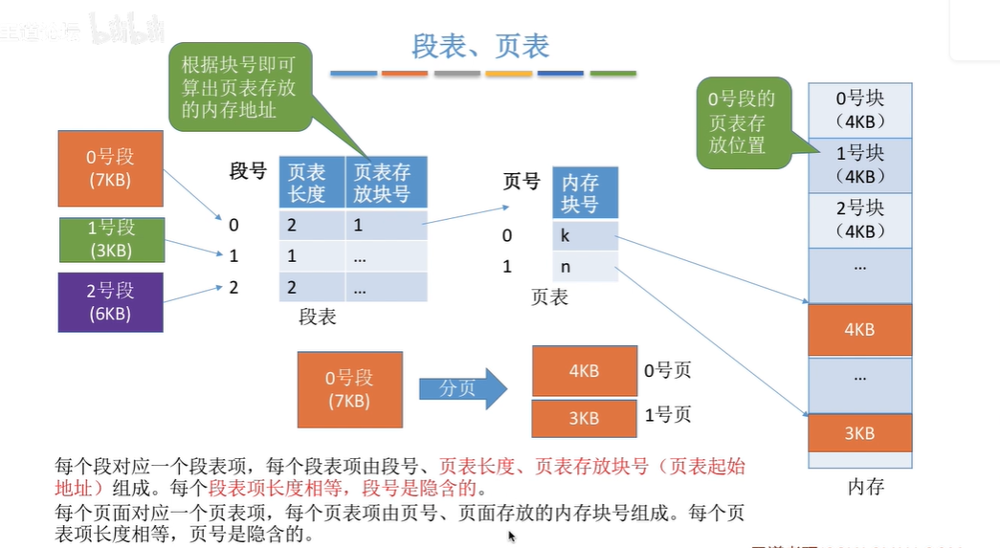

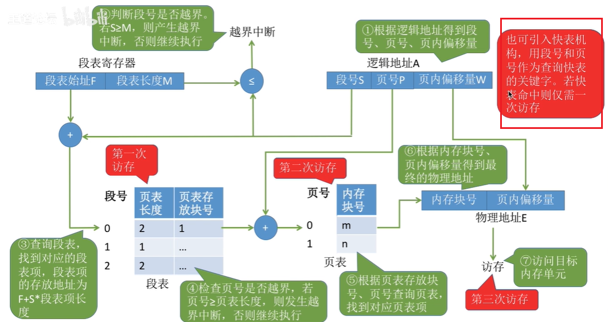

## 虚拟内存

> 传统存储管理方式的特征、缺点
>
> 一次性：作业必须一次性全部装入内存后才能开始运行。这会造成两个问题：作业很大时，不能全部装入内存，导致大作业无法运行；2当大量作业要求运行时，由于内存无法容纳所有作业，因此只有少量作业能运行，导致多道程序并发度下降。
> 驻留性：一旦作业被装入内存，就会一直驻留在内存中，直至作业运行结束。事实上，在一个时间段内，只需要访问作业的一小部分数据即可正常运行，这就导致了内存中会驻留大量的、暂时用不到的数据，浪费了宝贵的内存资源。

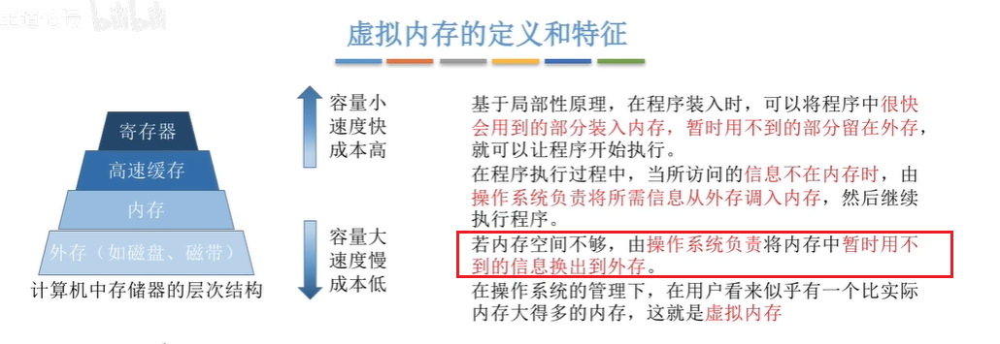

虚拟内存有一下三个主要特征：

对换性：在作业运行时无需一直常驻内存，而是允许在作业运行过程中，将作业换入、换出。

多次性：无需在作业运行时一次性全部装入内存，而是允许被分成多次调入内存。

虚拟性：从逻辑上扩充了内存的容量，使用户看到的内存容量，远大于实际的容量。

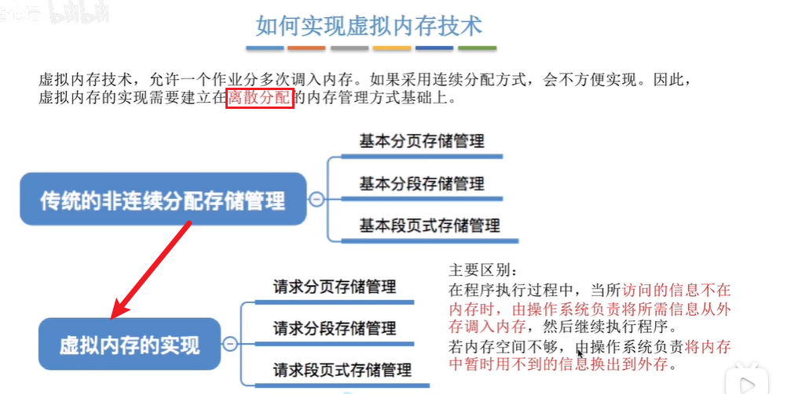

## 请求分页管理方式

请求分页存储管理与基本分页存储管理的主要区别：
在程序执行过程中，当所访问的信息不在内存时，由操作系统负责将所需信息从外存调入内存**(操作系统要提供请求调页功能，将缺失页面从外存调入内存)**，然后继续执行程序。
若内存空间不够，由操作系统负责将内存中暂时用不到的信息换出到外存**(操作系统要提供页面置换的功能，将暂时用不到的页面换出外存)**。

### 请求分页管理方式

#### 页表机制

与基本分页管理相比，请求分页管理中，为了实现“**请求调页**”，操作系统需要知道每个页面是否已经调入内存；如果还没调入，那么也需要知道该页面在外存中存放的位置。

当内存空间不够时，要实现“**页面置换**”，操作系统需要通过某些指标来决定到底换出哪个页面；有的页面没有被修改过，就不用再浪费时间写回外存。有的页面修改过，就需要将外存中的旧数据覆盖，因此，**操作系统也需要记录各个页面是否被修改的信息。**

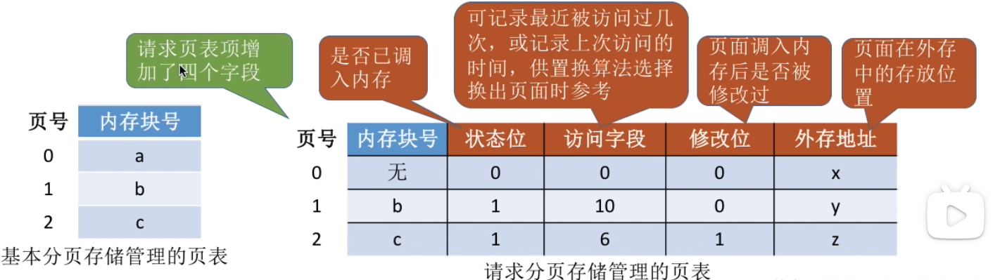

#### 缺页中断机构

假设此时要访问逻辑地址=（页号，页内偏移量）=（0，1024）

在请求分页系统中，每当要**访问的页面不在内存时**，便产生一个**缺页中断**，然后由**操作系统的缺页中断处理程序**处理中断。

- 此时缺页的进程阻塞，放入阻塞队列，调页完成后再将其唤醒，放回就绪队列。如果内存中有空闲块，则为进程分配一个空闲块，将所缺页面装入该块，并修改页表中相应的页表项。

- 如果内存中没有空闲块，则由页面置换算法选择一个页面淘汰，若该页面在内存期间被修改过，则要将其写回外存。未修改过的页面不用写回外存。

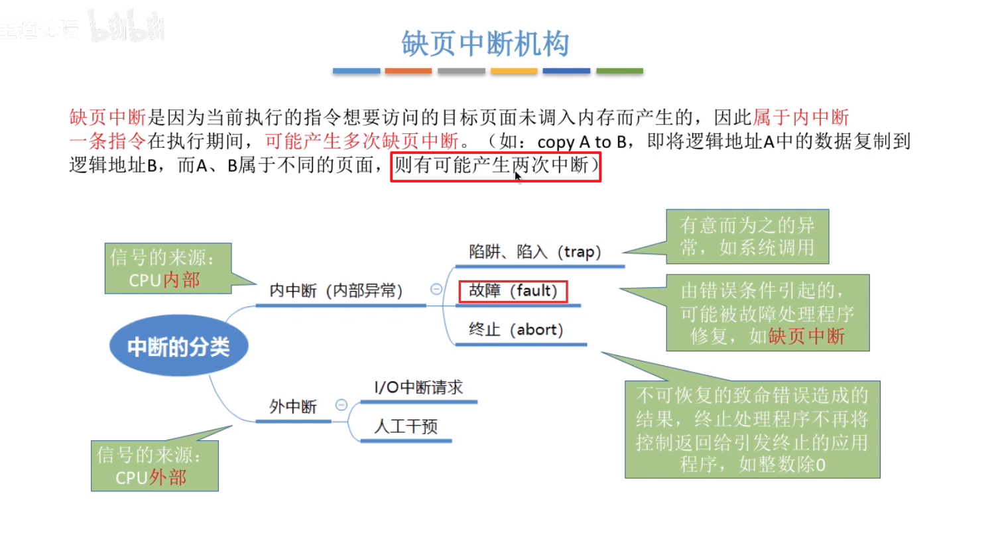


#### 地址变换机构

> - 找到页表项是需要检查页面是否在內存中
> - 若页面不再内存中，需要请求调页
> - 若内存空间不够，还需换出页面页面
> - 调入内存后，需要修改相应页表项

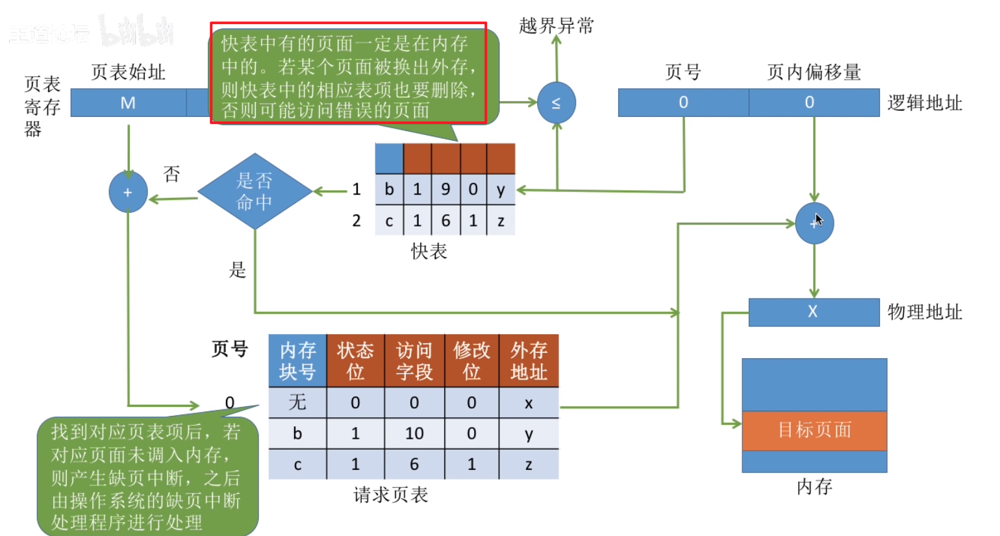

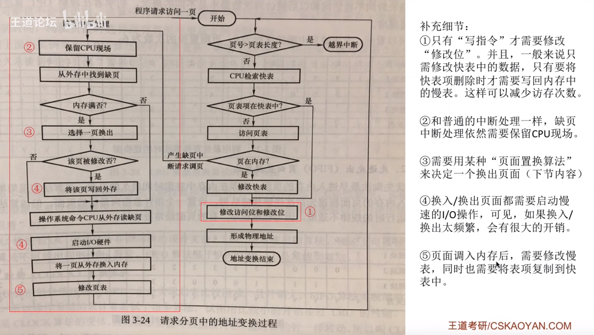


细节五：在具有快表机构的请求分页系统中，访问一个逻辑地址时，若发生缺页，则地址变换步骤是：

查快表（未命中）——查慢表（发现未调入内存）——调页（调入的页面对应的表项会直接加入快表）—— **查快表**（命中）——访问目标内存单元

### 页面置換算法

> 页面的换入、换出需要磁盘1/O，会有较大的开销，因此好的页面置换算法应该追求更少的缺页率

#### 最佳置换算法（OPT）

最佳置换算法（OPT，Optimal）：每次选择淘汰的页面将是以后永不使用，或者在**最长时间内不再被访问的页面**，这样可以保证最低的缺页率。

缺页率 = 9/20 = 45%

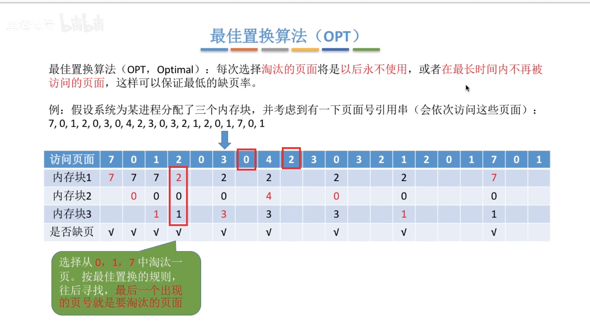

> 缺页率 = (页面置换次数+分配给该进程的物理块数)/要访问的页面总数
>
> 注意：整个过程缺页中断发生了9次，页面置换发生了6次。缺页时未必发生页面置换。若还有可用的空闲内存块，就不用进行页面置换。
>
> 开始访问页面时701只是却也但还有可用的空闲内存块

最佳置换算法可以保证最低的缺页率，但实际上，只有在进程执行的过程中才能知道接下来会访问到的是哪个页面。**操作系统无法提前预判页面访问序列。因此，最佳置换算法是无法实现的。**

#### 先进先出置换算法（FIFO）

先进先出置换算法（FIFO）：每次选择淘汰的页面是最早进入内存的页面

实现方法：把调入内存的页面根据调入的先后顺序排成一个队列，需要换出页面时选择队头页面即可。队列的最大长度取决于系统为进程分配了多少个内存块。

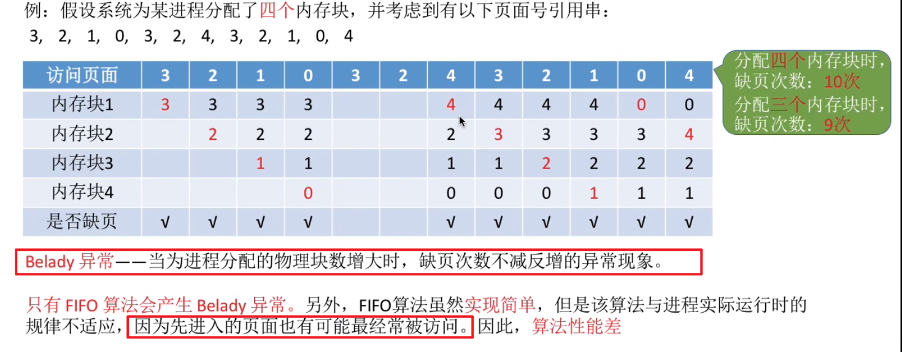

#### 最近最久未使用置换算法（LRU）

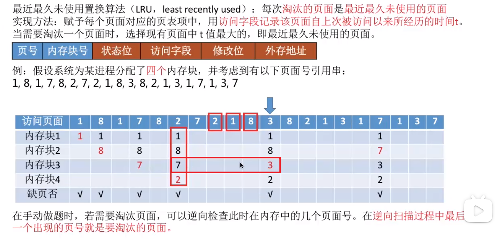

**该算法的实现需要专门的硬件支持，虽然算法性能好，但是实现困难，开销大**

#### 时钟置换算法（CLOCK）

最佳置换算法性能最好，但无法实现；先进先出置换算法实现简单，但算法性能差；最近最久未使用置换算法性能好，是最接近OPT算法性能的，但是实现起来需要专门的硬件支持，算法开销大。

时钟置换算法是一种性能和开销较均衡的算法，又称CLOCK算法，或最近未用算法（NRU，Not Recently Used）

简单的CLOCK算法实现方法：为每个页面设置一个访问位，再将内存中的页面都通过链接指针链接成一个循环队列。

当某页被访问时，其访问位置为1。当需要**淘汰一个页面**时，只需检查页的访问位。如果是0，就选择该页换出；如果是1，则将它置为0，**暂不换出**，继续检查下一个页面，**若第一轮扫描中所有页面都是1，则将这些页面的访问位依次置为0后**，再进行第二轮扫描（第二轮扫描中一定会有访问位为0的页面，因此简单的CLOCK算法选择一个淘汰页面**最多会经过两轮扫描**）

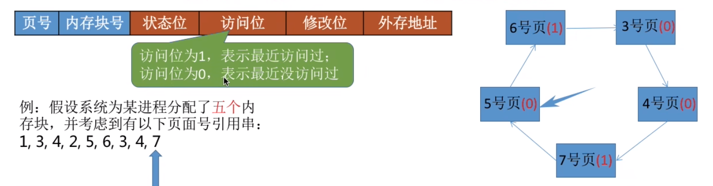

#### 改进型的时钟置换算法

简单的时钟置换算法仅考虑到一个页面最近是否被访问过。事实上，如果被淘汰的页面没有被修改过，就不需要执行1/0操作写回外存。只有被淘汰的页面被修改过时，才需要写回外存。

因此，除了考虑一个页面最近有没有被访问过之外，操作系统还应考虑页面有没有被修改过。**在其他条件都相同时，应优先淘汰没有修改过的页面，避免1/0操作。**这就是改进型的时钟置换算法的思想。

修改位=0，表示页面没有被修改过；修改位=1，表示页面被修改过。

为方便讨论，用（访问位，修改位）的形式表示各页面状态。如（1，1）表示一个页面近期被访问过，且被修改过。
算法规则：将所有可能被置换的页面排成一个循环队列

- 第一轮：从当前位置开始扫描到第一个（0，0）的帧用于替换。本轮扫描不修改任何标志位
- 第二轮：若第一轮扫描失败，则重新扫描，查找第一个（0，1）的帧用于替换。本轮将所有扫描过的帧访问位设为0
- 第三轮：若第二轮扫描失败，则重新扫描，查找第一个（0，0）的帧用于替换。本轮扫描不修改任何标志位
- 第四轮：若第三轮扫描失败，则重新扫描，查找第一个（0，1）的帧用于替换。

由于第二轮已将所有帧的访问位设为0，因此经过第三轮、第四轮扫描一定会有一个帧被选中，因此改进型CLOCK置换算法选择一个淘汰页面最多会进行四轮扫描

### 总结

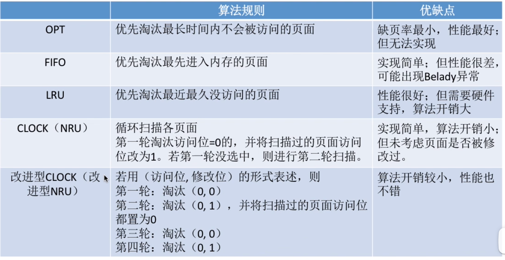

## 页面分配策略

### 驻留集

驻留集：指请求分页存储管理中给进程分配的物理块的集合。在采用了虚拟存储技术的系统中，驻留集大小一般小于进程的总大小。

若驻留集太小，会导致缺页频繁，系统要花大量的时间来处理缺页，实际用于进程推进的时间很少；驻留集太大，又会导致多道程序并发度下降，资源利用率降低。所以应该选择一个合适的驻留集大小。

### 页面分配、置换策略

- 固定分配：操作系统为每个进程分配一组固定数目的物理块，在进程运行期间不再改变。即，驻留集大小不变
- 可变分配：先为每个进程分配一定数目的物理块，在进程运行期间，可根据情况做适当的增加或减少。即，驻留集大小可变

- 局部置换：发生缺页时只能选进程自己的物理块进行置换。
- 全局置换：可以将操作系统保留的空闲物理块分配给缺页进程，也可以将别的进程持有的物理块置换到外存，再分配给缺页进程。


- 固定分配局部置换：系统为每个进程分配一定数量的物理块，在整个运行期间都不改变。若进程在运行中发生缺页，则只能从该进程在内存中的页面中选出一页换出，然后再调入需要的页面。这种策略的缺点是：很难在刚开始就确定应为每个进程分配多少个物理块才算合理。（采用这种策略的系统可以根据进程大小、优先级、或是根据程序员给出的参数来确定为一个进程分配的内存块数）

- 可变分配全局置换：刚开始会为每个进程分配一定数量的物理块。操作系统会保持一个空闲物理块队列。当某进程发生缺页时，从空闲物理块中取出一块分配给该进程；若已无空闲物理块，则可选择一个**未锁定**`（系统会锁定一些页面，这些页面中的内容不能置换出外存（如：重要的内核数据可以设为“锁定”））`的页面换出外存，再将该物理块分配给缺页的进程。采用这种策略时，**只要某进程发生缺页，都将获得新的物理块**，仅当空闲物理块用完时，系统才选择一个未锁定的页面调出。被选择调出的页可能是系统中任何一个进程中的页，因此这个**被选中的进程拥有的物理块会减少，缺页率会增加。**
- 可变分配局部置换：刚开始会为每个进程分配一定数量的物理块。当某进程发生缺页时，只允许从该进程自己的物理块中选出一个进行换出外存。如果进程在运行中频繁地缺页，系统会为该进程多分配几个物理块，直至该进程缺页率趋势适当程度；反之，如果进程在运行中缺页率特别低，则可适当减少分配给该进程的物理块。

### 调入页面的时机

1. 预调页策略：**根据局部性原理**，一次调入若干个相邻的页面可能比一次调入一个页面更高效。但如果提前调入的页面中大多数都没被访问过，则又是低效的。因此可以预测不久之后可能访问到的页面，将它们预先调入内存，但目前预测成功率只有50%左右。故这种策略**主要用于进程的首次调入**，由程序员指出应该先调入哪些部分。
2. 请求调页策略：进程在**运行期间**发现缺页时才将所缺页面调入内存。由这种策略调入的页面一定会被访问到，但由于每次只能调入一页，而每次调页都要磁盘1/0操作，因此1/0开销较大。

### 从何处调页

UNIX方式：运行之前进程有关的数据全部放在文件区，故未使用过的页面，都可从文件区调入。若被使用过的页面需要换出，则写回对换区，下次需要时从对换区调入。

### **抖动（颠簸）现象**

刚刚换出的页面马上又要换入内存，刚刚换入的页面马上又要换出外存，这种频繁的页面调度行为称为抖动，或颠簸。产生抖动的**主要原因是进程频繁访问的页面数目高于可用的物理块数**（分配给进程的物理块不够）

 

### 工作集


## 内存映射文件

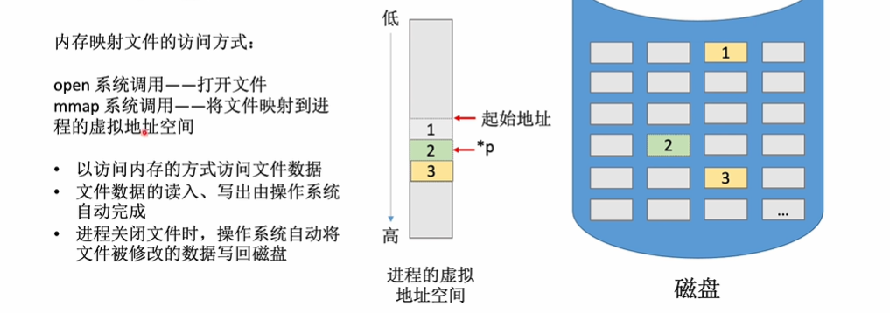

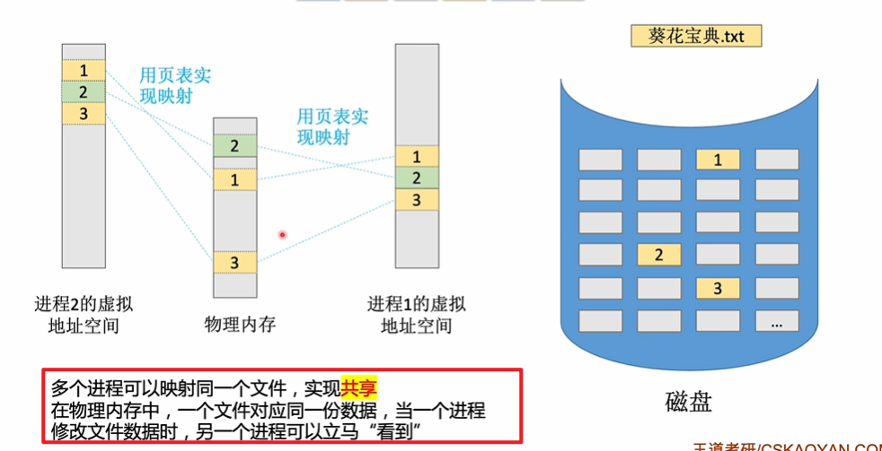


- 特性
  - 进程可使用系统调用，请求操作系统将文件映射到进程的虚拟地址空间
  - 以访问内存的方式读写文件
  - 进程关闭文件时，操作系统负责将文件数据写回磁盘，并解除内存映射
  - 多个进程可以映射同一个文件，方便共享
- 优点
  - 程序员编程更简单，已建立映射的文件，只需按访问内存的方式读写即可
  - 文件数据的读入/写出完全由操作系统负责，1/O效率可以由操作系统负责优化

# 进程

## 进程的概念

- 程序：**是静态的**，就是个存放在磁盘里的可执行文件，就是一系列的指令集合。

- 进程（Process）：是动态的，是运行在内存中的程序的执行实例。同一个程序多次执行会对应多个进程

  eg:qq可以启动多个


> 程序是一些指令的有序集合，而进程是程序执行的过程，进程是程序的一次执行过程。
>
> 进程的状态是变化的，其包括进程的创建、调度和消亡。
>
> 只要程序运行，此时就是进程，程序每运行一次，就会创建一个进程

引入线程前：**进程是进程实体的运行过程，是系统进行资源分配和调度的基本单位。**

引入线程后：**进程是进程实体的运行过程，是系统进行资源分配的基本单位，线程是调度的基本单位。**


### 进程的特征

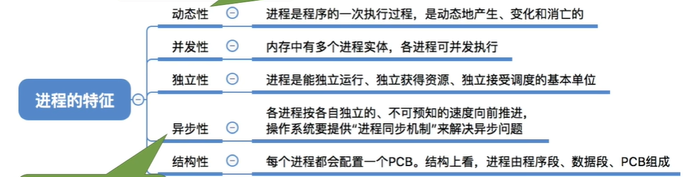

### 进程的状态

- 创建态、就绪态

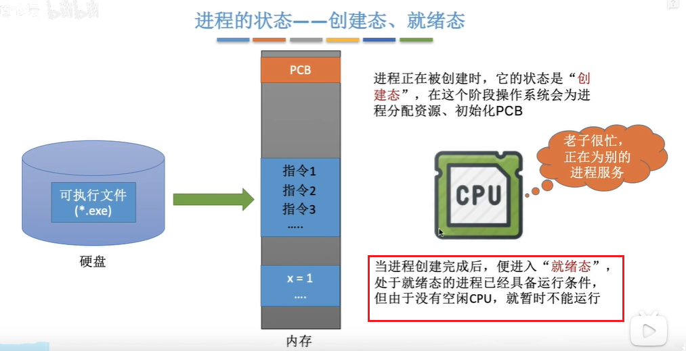

- 阻塞态

  在进程运行的过程中，可能会请求等待某个事件的发生（如等待某种系统资源的分配，或者等待其他进程的响应）。

  在这个事件发生之前，进程无法继续往下执行，此时操作系统会让这个进程下CPU，并让它进入“阻塞态”

  当CPU空闲时，又会选择另一个“就绪态”进程上CPU运行

- 终止态

  一个进程可以执行exit系统调用，请求操作系统终止该进程。此时该进程会进入“终止态”，操作系统会让该进程下CPU，并回收内存空间等资源，最后还要回收该进程的PCB.

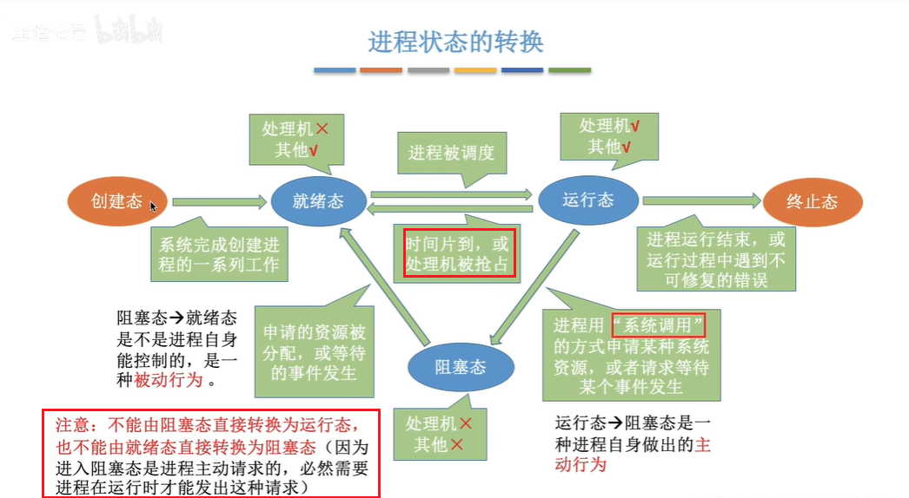

7状态

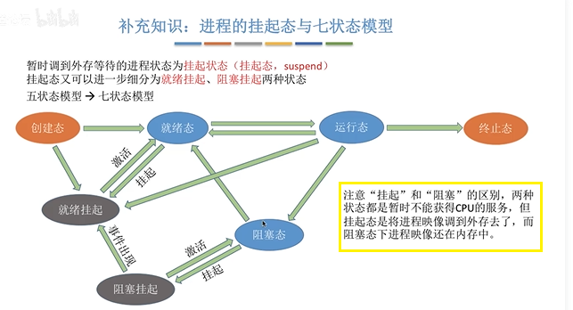

## 进程和内存

https://blog.csdn.net/u012138730/article/details/90273751

### 进程的组成

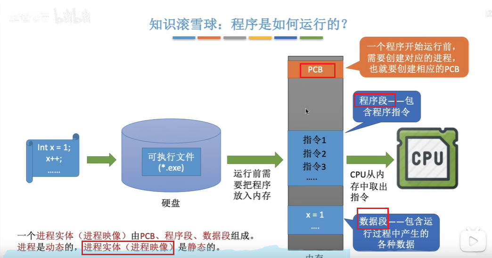


#### 进程控制块PCB

数据结构PCB（Process Control Block）中，即进程控制块。PCB是进程存在的唯一标志，当进程被创建时，操作系统为其创建PCB，当进程结束时，会回收其PCB。

操作系统对进程进行管理工作所需的信息都存在PCB中

- 基本的进程描述信息，可以让操作系统区分各个进程

  - PID（Process ID，进程ID）当进程被创建时，操作系统会为该进程分配一个唯一的、不重复的“身份证号”——

  - 进程所属用户ID（UID）

- 进程控制和管理信息

  - CPU、磁盘、网络流量使用情况统计
  - 进程当前状态：就绪态/阻塞态/运行态

- 资源分配清单

  - 正在使用哪些文件
  - 正在使用哪些内存区域
  - 正在使用哪些1/O设备

- 处理机相关信息

  如PSW、PC等等各种寄存器的值（用于实现进程切换）

#### 程序段

程序的代码（指令序列）

> 同时挂三个QQ号，会对应三个QQ进程，它们的PCB、数据段各不相同，但**程序段的内容都是相同的**（都是运行着相同的QQ程序）

#### 数据段

运行过程中产生的各种数据（如：程序中定义的变量）

### 物理内存-虚拟内存

#### 概念

- 物理内存就是内存条，实实在在的内存，即RAM。

- 虚拟内存是内存管理中的一个概念，是操作系统**管理每个进程的内存空间**的一个概念。**虚拟内存空间**实际上并不存在的，需要的只是虚拟内存空间到物理内存空间的**映射关系的一种数据结构。**当然有时候并不是都映射到物理内存中

  对于一个进程来说，虚拟内存是进程运行时所有内存空间的总和，包括共享的，非共享的、存在物理内存中，存在分页内存中、提交的，未提交的。

  进程运行起来以后，虚拟内存映射=物理空间（PP）+硬盘空间（DP）+ 未使用使用映射的

#### 映射表

映射表的设计有**一级页表**和**二级页表**结构。

这个映射表肯定加载在物理内存中，理想上，这个映射表是设计得当然是越小越好了，因为每个进程都需要这么一个**映射表**

#### 4G虚拟内存

系统只要创建一个进程，就会给当前进程分配4G的虚拟内存（32位操作系统），**这里说的分配4GB的虚拟内存并不是分配4GB的空间，而是创建一个映射表。虚拟内存和物理内存之间存在映射关系**

> 为什么是分配一个4GB的虚拟地址空间，因为在32位操作系统下一个32位的程序的一个指针长度是 4 字节，（指针即为地址，指针里面存储的数值被解释成为内存里的一个地址。64位程序指针是64位，寻址能力2^64-1）
>
> 那么4 字节指针（地址）的寻址能力是从 0x00000000~0xFFFFFFFF ，最大值 0xFFFFFFFF 表示的即为 4GB 大小的容量。

**4G的虚拟内存分为3G的用户空间（0\~3G）和1G（3~4G）的内核空间**

- 用户空间是进程所私有的，每一个进程的用户空间只能自己访问和使用，我们之前说的**栈区、堆区、数据区、代码区等都是用户空间的区域**

- 内核区是所有进程共享的，称为系统地址空间。
  内核区保存的是系统线程调度、内存管理、设备驱动等数据，这部分数据供所有的进程共享以及操作系统的使用——程序在运行的时候处于操作系统的监管下，监管进程的虚拟空间，当进程进行非法访问时强制结束程序。

  进程只能使用操作系统分配给进程的虚拟空间。错误提示“进程因非法操作需要关闭”就是访问了未经允许的地址。
  


## 进程控制

进程控制的主要功能是对系统中的所有进程实施有效的管理，它具有创建新进程、撤销已有进程、实现进程状态转换等功能。

**进程控制就是要实现进程状态转换**

### 如何实现进程控制？

> 用“原语”实现，原语的执行具有“原子性”，一气呵成
>
> 思考：为何进程控制（状态转换）的过程要“一气呵成”？状态转换的过程不能中断，必须强制执行完

原语的执行具有原子性，即执行过程只能一气呵成，期间不允许被中断。
可以用“关中断指令”和“开中断指令”这两个**特权指令**实现原子性

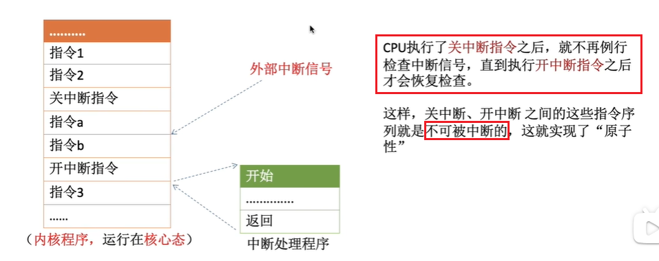

### 相关原语

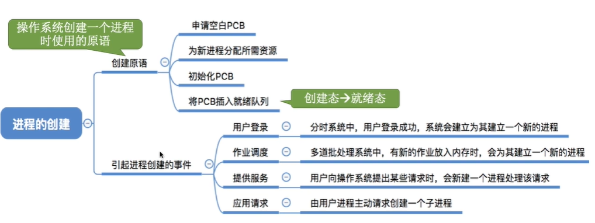

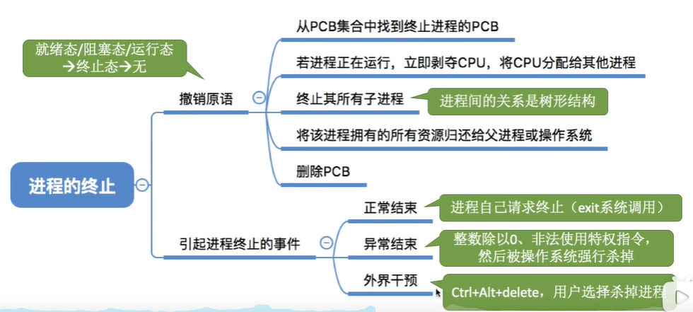

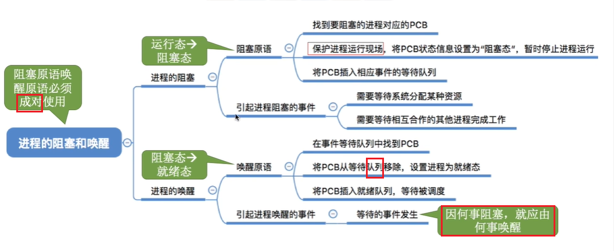

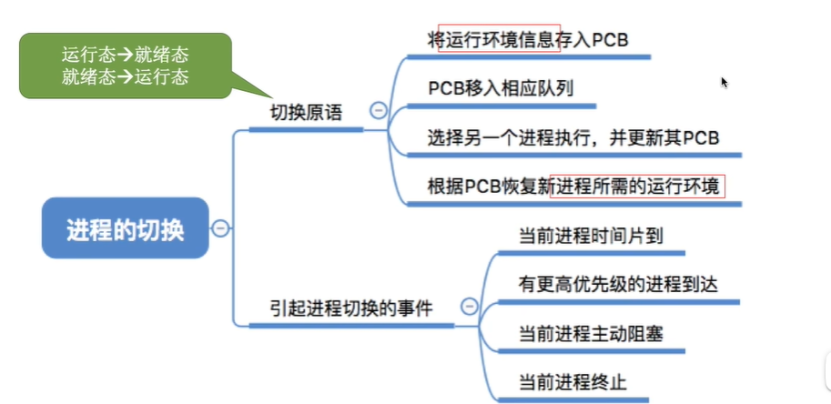

进程切换执行的过程

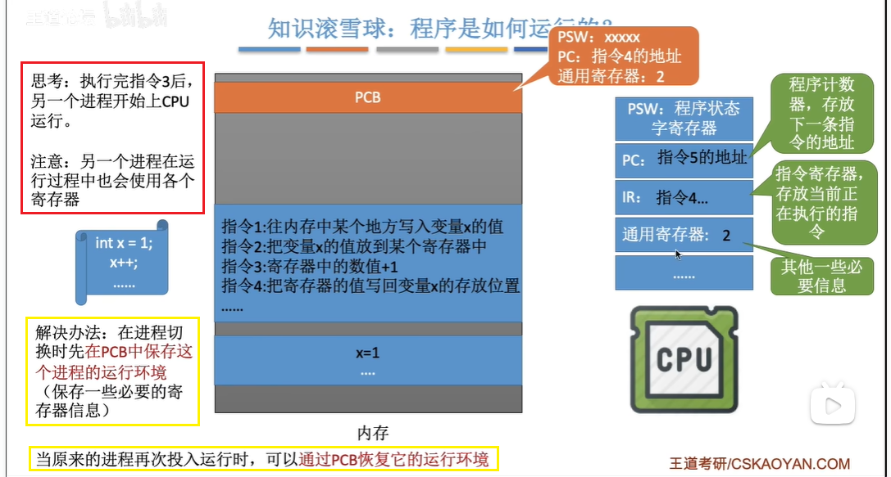

## 进程之间的通信方式

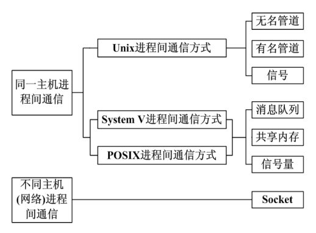

进程间通信(IPC:Inter Processes Communication)，进程是一个独立的资源分配单元，不同进程（这里所说的进程通常指的是用户进程）之间的资源是独立的，没有关联，不能在一个进程中直接访问另一个进程的资源（例如打开的文件描述符）。

进程不是孤立的，不同的进程需要进行信息的交互和状态的传递等，因此需要进程间通信

进程间通信功能：

- 数据传输：一个进程需要将它的数据发送给另一个进程。
- 资源共享：多个进程之间共享同样的资源。
- 通知事件：一个进程需要向另一个或一组进程发送消息，通知它们发生了某种事件。
- 进程控制：有些进程希望完全控制另一个进程的执行（如Debug进程），此时控制进程希望能够拦截另一个进程的所有操作，并能够及时知道它的状态改变。

**特殊的进程间通信方式：**

- socket通信可以实现不同主机的进程间通信，其他六个只能在一台主机的多个进程间通信
- 信号通信是唯一的一种异步通信机制
- 共享内存是所有进程间通信方式中效率最高的，他是直接对物理内存进行操作

#### 信号量通信

共享内存最大的问题就是多进程竞争内存的问题，就像类似于线程安全问题。我们可以使用信号量来解决这个问题。信号量的本质就是一个计数器，用来实现进程之间的互斥与同步。例如信号量的初始值是 1，然后 a 进程来访问内存1的时候，我们就把信号量的值设为 0，然后进程b 也要来访问内存1的时候，看到信号量的值为 0 就知道已经有进程在访问内存1了，这个时候进程 b 就会访问不了内存1。所以说，信号量也是进程之间的一种通信方式。

#### 信号通信

信号（Signals ）是Unix系统中使用的最古老的进程间通信的方法之一。操作系统通过信号来通知进程系统中发生了某种预先规定好的事件（一组事件中的一个），它也是用户进程之间通信和同步的一种原始机制

#### 管道通信

管道是一种最基本的进程间通信机制。**管道是一种最基本的进程间通信机制。管道就是操作系统在内核中开辟的一段缓冲区，进程1可以将需要交互的数据拷贝到这段缓冲区，进程2就可以读取了**。

管道的特点：
● 只能单向通信
● 只能血缘关系的进程进行通信
● 依赖于文件系统
● [生命周期](https://so.csdn.net/so/search?q=生命周期&spm=1001.2101.3001.7020)随进程
● 面向字节流的服务
● 管道内部提供了同步机制

“管道”是一个特殊的共享文件，又名pipe文件。其实就是在内存中开辟一个大小固定的**内存缓冲区**（循环队列），存取数据只能按照队列的形式存取

> 修正：
>
> 写进程往管道写数据，即便管道没被写满，**只要管道没空，读进程就可以从管道读数据**
>
> 读进程从管道读数据，即便管道没被读空，**只要管道没满，写进程就可以往管道写数据**

#### [消息队列](https://so.csdn.net/so/search?q=消息队列&spm=1001.2101.3001.7020)通信

消息队列就是一个消息的列表。用户可以在消息队列中添加消息、读取消息等。消息队列提供了一种从一个进程向另一个进程发送一个数据块的方法。 每个数据块都被认为含有一个类型，接收进程可以独立地接收含有不同类型的数据结构。可以通过发送消息来避免命名管道的同步和阻塞问题。但是消息队列与命名管道一样，每个数据块都有一个最大长度的限制。
使用消息队列进行进程间通信，可能会收到数据块最大长度的限制约束等，这也是这种通信方式的缺点。如果频繁的发生进程间的通信行为，那么进程需要频繁地读取队列中的数据到内存，相当于间接地从一个进程拷贝到另一个进程，这需要花费时间。


#### 共享内存通信

共享内存就是映射一段能被其他进程所访问的内存，这段共享内存由一个进程创建，但多个进程都可以访问（使多个进程可以访问同一块内存空间）。共享内存是最快的 IPC 方式，它是针对其他进程间通信方式运行效率低而专门设计的。它往往与其他通信机制，如信号量，配合使用，来实现进程间的同步和通信。


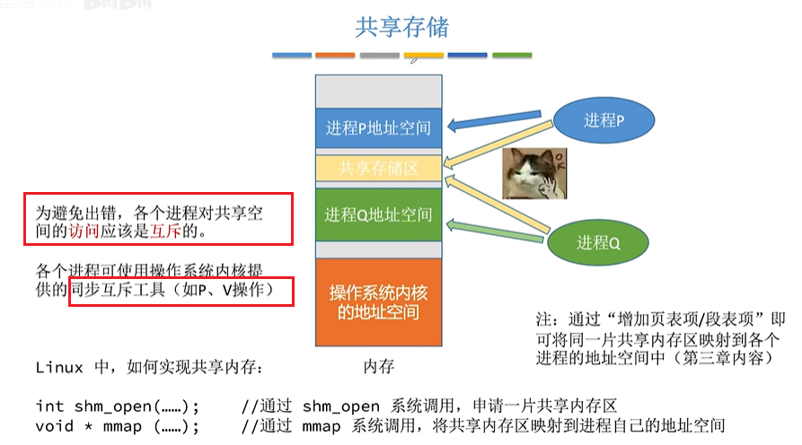

- 基于数据结构的共享：比如共享空间里只能放一个长度为10的数组。这种共享方式速度慢、限制多，是一种低级通信方式
- 基于存储区的共享：操作系统在内存中划出一块共享存储区，数据的形式、存放位置都由通信进程控制，而不是操作系统。这种共享方式速度很快，是一种高级通信方式。

#### 套接字通信

上面我们说的共享内存、管道、信号量、消息队列，他们都是多个进程在一台主机之间的通信，那两个相隔几千里的进程能够进行通信吗？答是必须的，这个时候 Socket 这家伙就派上用场了，例如我们平时通过浏览器发起一个 http 请求，然后服务器给你返回对应的数据，这种就是采用 Socket 的通信方式了。

## 进程的同步/互斥


进程互斥

进程的“并发”需要“共享”的支持。各个并发执行的进程不可避免的需要共享一些系统资源（比如内存，又比如打印机、摄像头这样的1/0设备）

- 互斥共享方式

  系统中的某些资源，虽然可以提供给多个进程使用，但一个时间段内只允许一个进程访问该资源

- 同时共享方式

  系统中的某些资源，允许一个时间段内由多个进程“同时”对它们进行访问

我们把**一个时间段内只允许一个进程使用的资源称为临界资源**。许多物理设备（比如摄像头、打印机）都属于临界资源。此外还有许多变量、数据、内存缓冲区等都属于临界资源。

对临界资源的访问，必须互斥地进行。互斥，亦称间接制约关系。进程互斥指当一个进程访问某临界资源时，另一个想要访问该临界资源的进程必须等待。当前访问临界资源的进程访问结束，释放该资源之后，另一个进程才能去访问临界资源。

```js
对临界资源的互斥访问，可以在逻辑上分为如下四个部分：
do{
entry section；//进入区
critical section；//临界区
exit section；//退出区
remainder section；//剩余区
}while（true）
```

- 进入区：负责检查是否可进入临界区，若可进入，则应设置正在访问临界资源的标志（可理解为“**上锁**"），以阻止其他进程同时进入临界区
- 临界区：访问临界资源的那段代码
- 退出区：负责解除正在访问临界资源的标志（可理解为“**解锁**”）
- 剩余区：做其他处理

注意：

- 临界区是进程中访问临界资源的代码段。
- 进入区和退出区是负责实现互斥的代码段。
- 临界区也可称为“临界段”。

为了实现对临界资源的互斥访问，同时保证系统整体性能，需要遵循以下原则：

- 1，空闲让进。临界区空闲时，可以允许一个请求进入临界区的进程立即进入临界区；
- 2，忙则等待。当已有进程进入临界区时，其他试图进入临界区的进程必须等待；
- 3，有限等待。对请求访问的进程，应保证能在**有限时间内进入临界区**（保证不会饥饿）；
- 4，**让权等待。当进程不能进入临界区时，应立即释放处理机，防止进程忙等待。**

### 进程互斥的软件实现方法

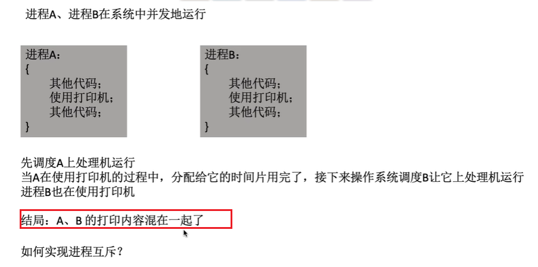


#### 单标志法

算法思想：两个进程在访问完临界区后会把使用临界区的权限转交给另一个进程。也就是说每个进程进入临界区的权限只能被另一个进程赋予

```
int turn = 0；//turn 表示当前允许进入临界区的进程号
P0 进程：
while（turn！= 0）；critical section；turn = 1；remainder section；
P1进程：
while（turn！= 1）；critical section；turn = 0；remainder section；
```

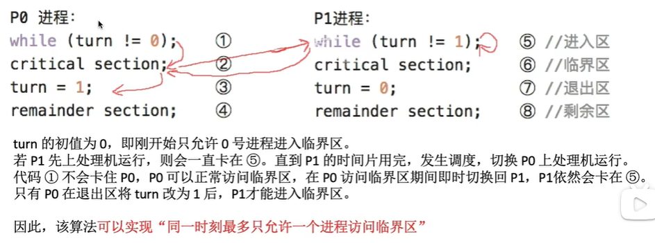

**单标志法存在的主要问题是：违背“空闲让进”原则。**

#### 双标志先检查

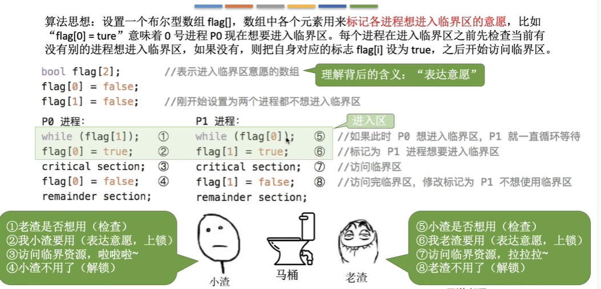

若按照①⑤②⑥③⑦…(并发)的顺序执行，PO和P1将会同时访问临界区。

因此，双标志先检查法的主要问题是：**违反“忙则等待”原则。**

原因在于，进入区的“检查”和“上锁”两个处理不是一气呵成的。“检查”后，“上锁”前可能发生**进程切换**。

#### 双标志后检查


若按照①⑤②⑥…..的顺序执行，PO 和P1 将都无法进入临界区

因此，双标志后检查法虽然解决了“忙则等待”的问题，但是又**违背了“空闲让进”和“有限等待”**

原则，会因各进程都长期无法访问临界资源而**产生“饥饿”**现象。

#### Peterson算法

算法思想：结合**双标志法、单标志法**的思想。如果双方都争着想进入临界区，那可以让进程尝试“孔融让梨”（谦让）。做一个有礼貌的进程。

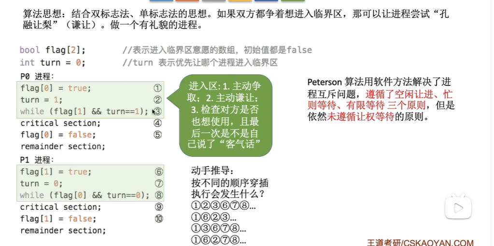


### 进程互斥的硬件实现方法

#### 中断屏蔽方法

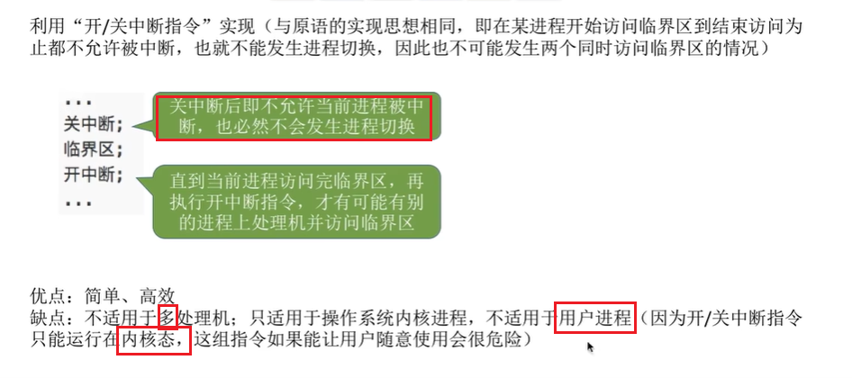

#### TestAndSet（TS指令/TSL指令）

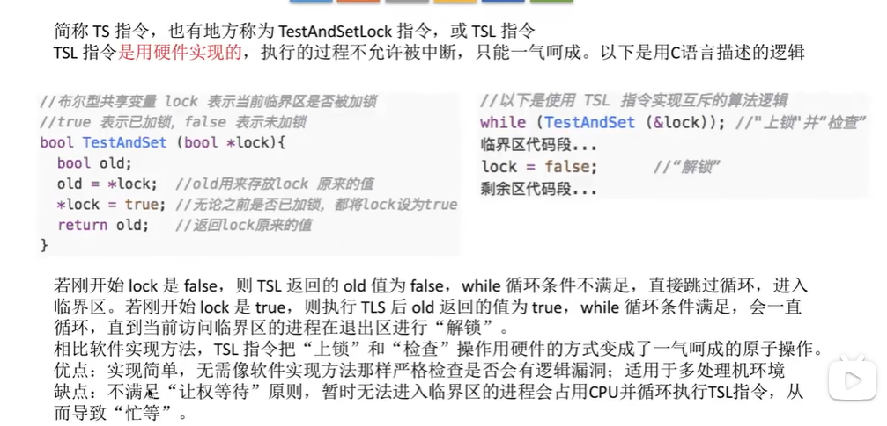

#### Swap指令（XCHG指令）

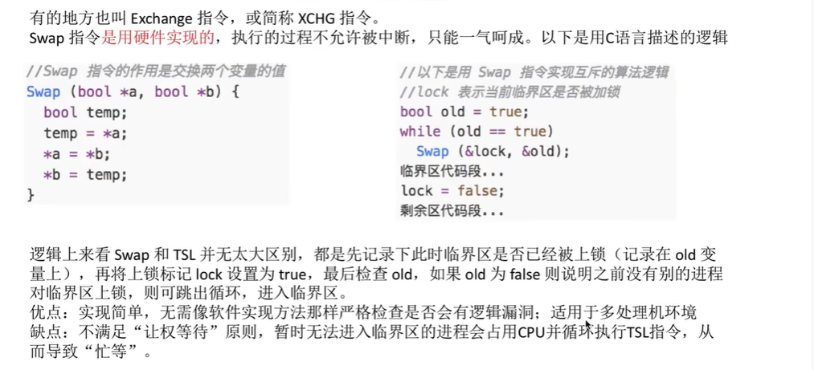

### 互斥锁

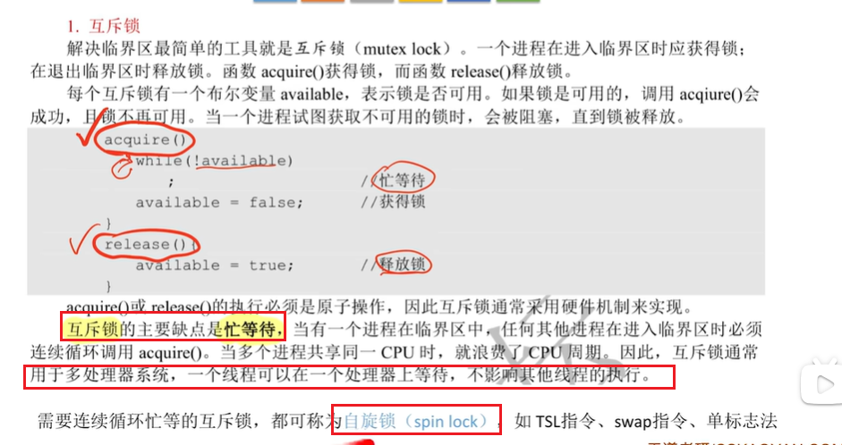

## 信号量机制

用户进程可以通过使用操作系统提供的**一对原语**来对信号量进行操作，从而很方便的实现了进程互斥、进程同步。
**信号量**其实就是一个变量（可以是一个整数，也可以是更复杂的记录型变量），可以用一个信号量来**表示系统中某种资源的数量**，比如：系统中只有一台打印机，就可以设置一个初值为1的信号量。

原语是一种特殊的程序段，其**执行只能一气呵成，不可被中断**。**原语是由关中断/开中断指令实现的**。**软件解决方案的主要问题是由“进入区的各种操作无法一气呵成”**，因此如果能把进入区、退出区的操作都用“原语”实现，使这些操作能“一气呵成”就能避免问题。

一对原语：**wait（S）原语和signal（S）原语**，可以把原语理解为我们自己写的函数，函数名分别为wait和 signal，括号里的信号量S其实就是函数调用时传入的一个参数。

wait、signal原语常简称为P、V操作（来自荷兰语proberen和verhogen）。因此，做题的时候常wait（S）、signal（S）两个操作分别写为P（S）、V（S）


### 信号量机制——整型信号量

用一个整数型的变量作为信号量，用来表示系统中某种资源的数量。

与普通整数变量的区别：对信号量的操作只有三种，即 初始化、P操作、V操作

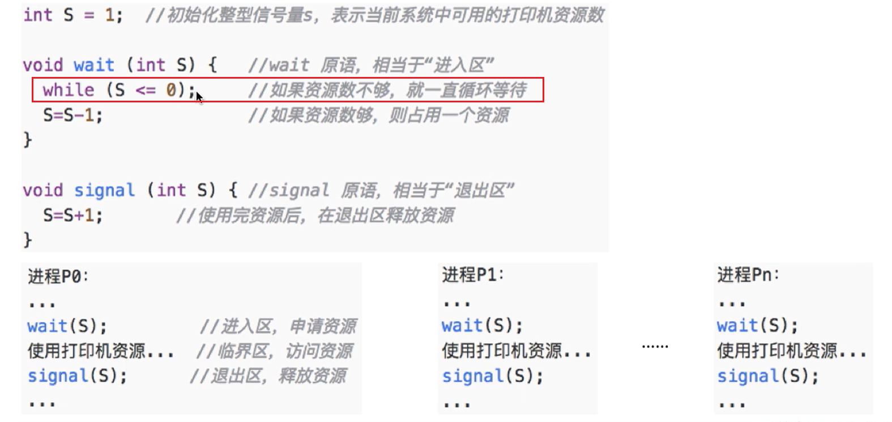

**存在的问题：不满足“让权等待”原则，会发生“忙等”**

### 信号量机制——记录型信号量

整型信号量的缺陷是存在“忙等”问题，因此人们又提出了“记录型信号量”，即用记录型数据结构表示的信号量。


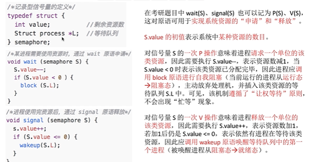

### 同步互斥

#### 实现进程互斥

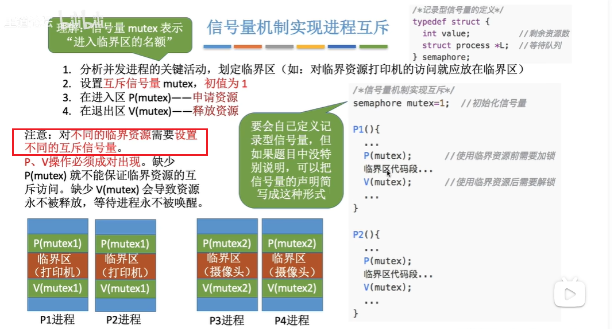

#### 实现进程同步

同步问题，信号量初值为0

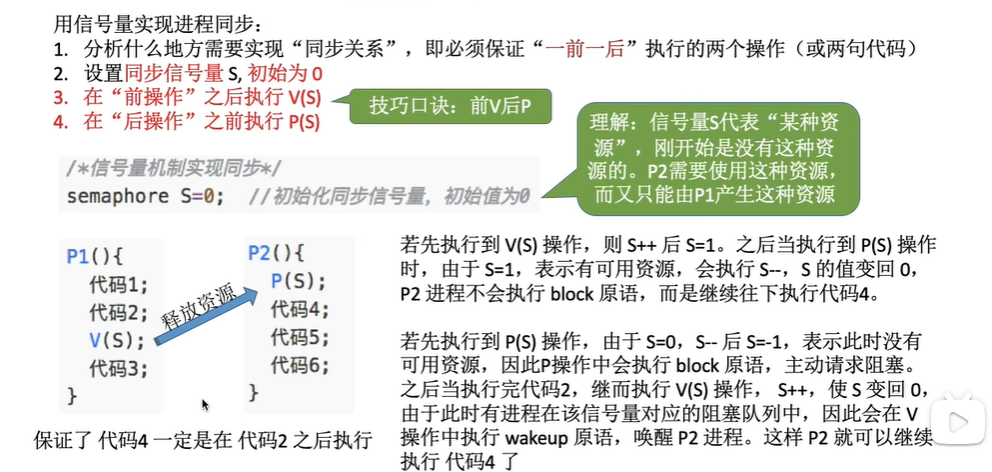

#### 实现进程的前驱关系

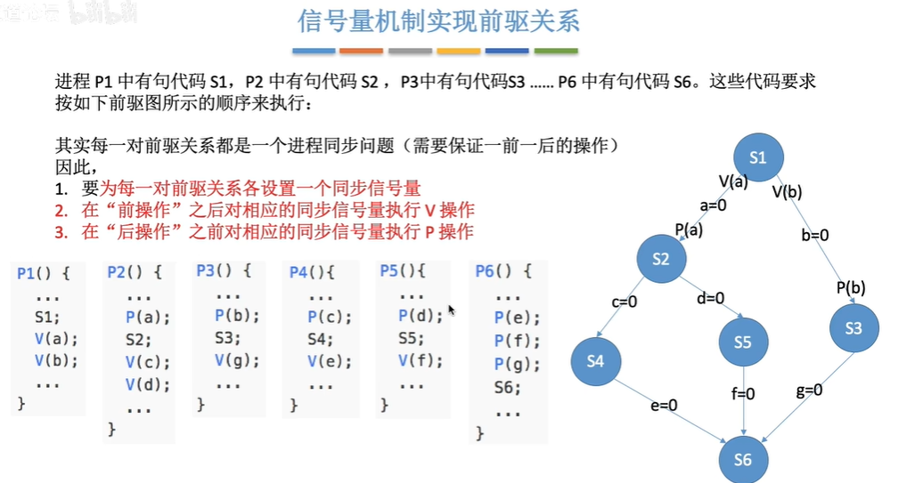

### 生产者和消费者

```
semaphore mutex = 1；//互斥信号量，实现对缓冲区的互斥访问semaphore empty = n；//同步信号量，表示空闲缓冲区的数量semaphore full=0；//同步信号量，表示产品的数量，也即非空缓冲区的数量
```

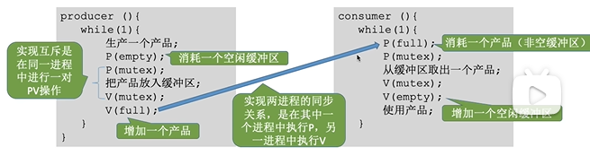

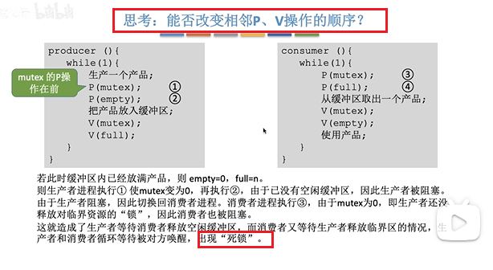

因此，实现互斥的P操作一定要在实现同步的P操作之后。
V操作不会导致进程阻塞，因此两个v操作顺序可以交换。

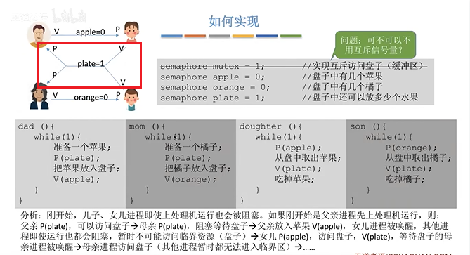

### 抽烟者

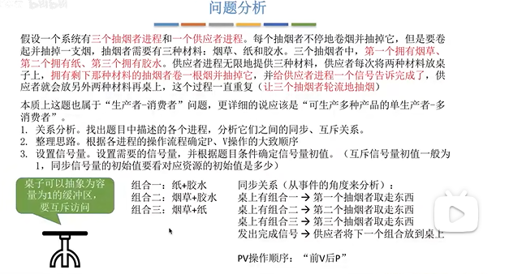

### 读者写者

有读者和写者两组并发进程，共享一个文件，当两个或两个以上的读进程同时访问共享数据时不会产生副作用，但若某个写进程和其他进程（读进程或写进程）同时访问共享数据时则可能导致数据不一致的错误。因此要求：

①允许多个读者可以同时对文件执行读操作

2只允许一个写者往文件中写信息；

③任一写者在完成写操作之前不允许其他读者或写者工作；

④写者执行写操作前，应让已有的读者和写者全部退出。

**互斥关系：写进程一写进程、写进程一读进程。读进程与读进程不存在互斥问题。**rw对读写进程的互斥

**通过count，rw由第一个读进程负责加锁，由最后一个读进程负责解锁，实现读进程同时访问**

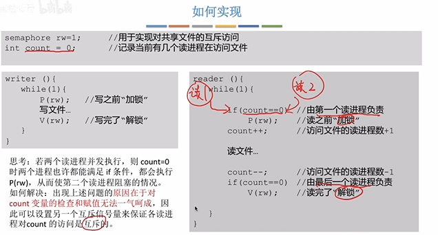

思考：

- 若不是并发的执行，进程1就会对rw加锁，并且count++。进程2判断count是否等于0，此时不等于0，则跳过加锁

- 若两个读进程并发执行，则count=0时两个进程也许都能满足if条件，都会执行P（rw），从而使第二个读进程阻塞的情况。

解决：mutex用于保证对count变量的互斥访问

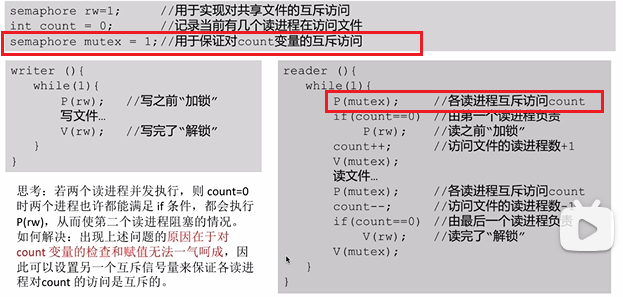

潜在的问题：只要有读进程还在读，写进程就要一直阻塞等待，可能“饿死”。因此，**这种算法中，读进程是优先的**

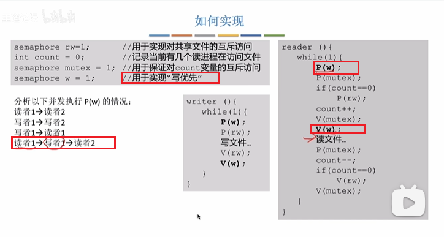

读者1->写者1->读者2

- 读者1先执行P(w)为0，p(mutex)为0，P(rw)为0，
  - 写者1会堵塞在p(w),读者2会堵塞在p(mutex)
- 读者1执行v(mutex)为1，v(w)为1
  - 写者1执行p(w)为0，会堵塞在p(rw)
  - 读者2会堵塞在p(w)
- 写者1执行v(w)为1
  - 读者2就能执行

总结

读者-写者问题为我们解决复杂的互斥问题提供了一个参考思路。
其核心思想在于设置了一个计数器count用来记录当前正在访问共享文件的读进程数。我们可以用count的值来判断当前进入的进程是否是第一个/最后一个读进程，从而做出不同的处理。
另外，对count变量的检查和赋值不能一气呵成导致了一些错误，如果需要实现“一气呵成），自然应该想到用互斥信号派

最后，还要认真体会我们是如何解决“写进程饥饿”问题的。

### 哲学家进餐

每个哲学家进程需要**同时持有两个临界资源才能开始吃饭**。如何避免临界资源分配不当造成的**死锁**现象，是哲学家问题的精髓。

 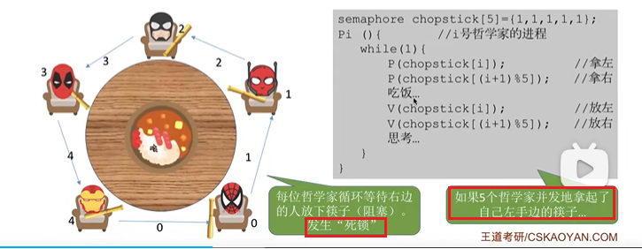

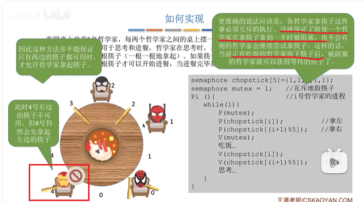


## 管程

背景：信号量机制存在的问题：编写程序困难、易出错

管程是一种特殊的软件模块，有这些部分组成：类似类，封装的思想

- 1.局部于管程的共享数据结构说明；
- 2.对该数据结构进行操作的一组过程；**“过程”其实就是“函数”**
- 3.对局部于管程的共享数据设置初始值的语句
- 4.管程有一个名字。

管程的基本特征：

- 局部于管程的数据只能被局部于管程的过程所访问；
- **一个进程只有通过调用管程内的过程才能进入管程访问共享数据；**
- **每次仅允许一个进程在管程内执行某个内部过程。**

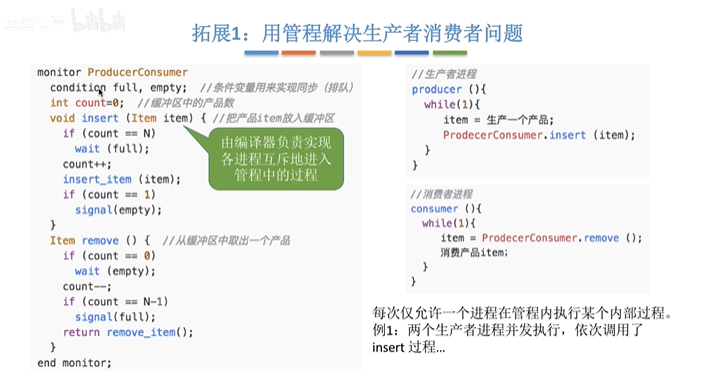

引入管程的目的无非就是要更方便地实现进程互斥和同步。

- 1，需要在管程中定义共享数据（如生产者消费者问题的缓冲区）
- 2.需要在管程中定义用于访问这些共享数据的“入口”-—其实就是一些函数（如生产者消费者问题中，可以定义一个函数用于将产品放入缓冲区，再定义一个函数用于从缓冲区取出产品）
- 3.只有**通过这些特定的“入口”才能访问共享数据**
- 4，管程中有很多“入口”，但是**每次只能开放其中一个“入口”**，并且**只能让一个进程或线程进入**（如生产者消费者问题中，各进程需要互斥地访问共享缓冲区。管程的这种特性即可保证一个时间段内最多只会有一个进程在访问缓冲区。**注意：这种互斥特性是由编译器负责实现的，程序员不用关心）**
- 5，可在管程中设置**条件变量及等待/唤醒操作以解决同步问题**，可以让一个进程或线程在条件变量上等待（此时，该进程应先释放管程的使用权，也就是让出“入口”）；可以通过唤醒操作将等待在条件变量上的进程或线程唤醒。

程序员可以用某种特殊的语法定义一个管程（比如：monitor ProducerConsumer.end monitor；）
之后其他程序员就可以使用这个管程提供的特定“入口”很方便地使用实现进程同步/互斥了。

## 死锁

### 什么是死锁

### 进程死锁、饥饿、死循环的区别

- 死锁：各进程互相等待对方手里的资源，导致各进程都阻塞，无法向前推进的现象。
- 饥饿：由于长期得不到想要的资源，某进程无法向前推进的现象。比如：在短进程优先（SPF）算法中，若有源源不断的短进程到来，则长进程将一直得不到处理机，从而发生长进程“饥饿”。
- 死循环：某进程执行过程中一直跳不出某个循环的现象。有时是因为程序逻辑bug导致的，有时是程序员故意设计的。

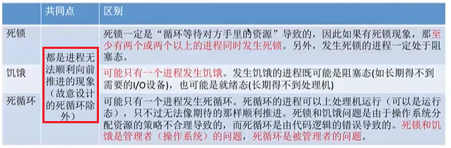

### 死锁产生的必要条件

产生死锁必须同时满足一下四个条件，只要其中任一条件不成立，死锁就不会发生。

- 互斥条件：只有对必须互斥使用的资源的争抢才会导致死锁（如哲学家的筷子、打印机设备）像内存、扬声器这样可以同时让多个进程使用的资源是不会导致死锁的（因为进程不用阻塞等待这种资源）。
- 不剥夺条件：进程所获得的资源在未使用完之前，不能由其他进程强行夺走，只能主动释放。
- 请求和保持条件：进程已经保持了至少一个资源，但又提出了新的资源请求，而该资源又被其他进程占有，此时请求进程被阻塞，但又对自己已有的资源保持不放。

注意！发生死锁时一定有循环等待，但是发生循环等待时未必死锁（循环等待是死锁的必要不充分条件）

如果同类资源数大于1，则即使有循环等待，也未必发生死锁。但如果系统中每类资源都只有一个，那循环等待就是死锁的充分必要条件了。

### 什么时候会发生死锁

1，对系统资源的竞争。各进程对不可剥夺的资源（如打印机）的竞争可能引起死锁，对可剥夺的资源（CPU）的竞争是不会引起死锁的
2，进程推进顺序非法。请求和释放资源的顺序不当，也同样会导致死锁。例如，并发执行的进程P1、P2分别申请并占有了资源R1、R2，之后进程P1又紧接着申请资源R2，而进程P2又申请资源R1，两者会因为申请的资源被对方占有而阻塞，从而发生死锁。
3，信号量的使用不当也会造成死锁。如生产者-消费者问题中，如果实现互斥的P操作在实现同步的P操作之前，就有可能导致死锁。（可以把互斥信号量、同步信号量也看做是一种抽象的系统资源）

### 死锁的处理策略

1.预防死锁。破坏死锁产生的四个必要条件中的一个或几个。
2.避免死锁。用某种方法防止系统进入不安全状态，从而避免死锁（银行家算法）
3，死锁的检测和解除。允许死锁的发生，不过操作系统会负责检测出死锁的发生，然后采取某种措施解除死锁。

#### 预防死锁

- 破坏互斥条件：

  互斥条件：只有对必须互斥使用的资源的争抢才会导致死锁。

  该策略的缺点：并不是所有的资源都可以改造成可共享使用的资源。并且为了系统安全，很多地方还必须保护这种互斥性。因此，**很多时候都无法破坏互斥条件。**

- 破坏不剥夺条件

  不剥夺条件：进程所获得的资源在未使用完之前，不能由其他进程强行夺走，只能主动释放。

  - 方案一：当某个进程请求新的资源得不到满足时，它必须立即释放保持的所有资源，待以后需要时再重新申请。也就是说，即使某些资源尚未使用完，也需要主动释放，从而破坏了不可剥夺条件。
  - 方案二：当某个进程需要的资源被其他进程所占有的时候，可以由操作系统协助，将想要的资源强行剥夺。这种方式一般需要考虑各进程的优先级（比如：剥夺调度方式，就是将处理机资源强行剥夺给优先级更高的进程使用）

  该策略的缺点：
  1，实现起来比较复杂。
  2.释放已获得的资源可能造成前一阶段工作的失效。因此这种方法一般只适用于易保存和恢复状态的资源，如CPU。

  3.反复地申请和释放资源会增加系统开销，降低系统吞吐量。
  4，若采用方案一，意味着只要暂时得不到某个资源，之前获得的那些资源就都需要放弃，以后再重新申请。如果一直发生这样的情况，就会导致进程饥饿。

- 破坏请求和保持条件

  请求和保持条件：进程已经保持了至少一个资源，但又提出了新的资源请求，而该资源又被其他进程占有，此时请求进程被阻塞，但又对自己已有的资源保持不放。

  可以采用静态分配方法，即进程在运行前一次申请完它所需要的全部资源，在它的资源未满足前，不让它投入运行。一旦投入运行后，这些资源就一直归它所有，该进程就不会再请求别的任何资源了。

  该策略实现起来简单，但也有明显的缺点：
  有些资源可能只需要用很短的时间，因此如果进程的整个运行期间都一直保持着所有资源，就会造成严重的资源浪费，资源利用率极低。另外，该策略也有可能导致**某些进程饥饿**。

- 破坏循环等待条件

  循环等待条件：存在一种进程资源的循环等待链，链中的每一个进程已获得的资源同时被下一个进程所请求。
  可采用顺序资源分配法。首先给系统中的资源编号，规定每个进程必须按编号递增的顺序请求资源，同类资源（即编号相同的资源）一次申请完。

  原理分析：一个进程只有已占有小编号的资源时，才有资格申请更大编号的资源。按此规则，已持有大编号资源的进程不可能逆向地回来申请小编号的资源，从而就不会产生循环等待的现象。

  > 在任何一个时刻，总有一个进程拥有的资源编号是最大的，那这个进程申请之后的资源必然畅通无阻。因此，不可能出现所有进程都阻塞的死锁现象

  该策略的缺点：
  1.不方便增加新的设备，因为可能需要重新分配所有的编号；
  2.进程实际使用资源的顺序可能和编号递增顺序不一致，会导致资源浪费；

  3，必须按规定次序申请资源，用户编程麻烦。

#### 避免死锁

银行家算法

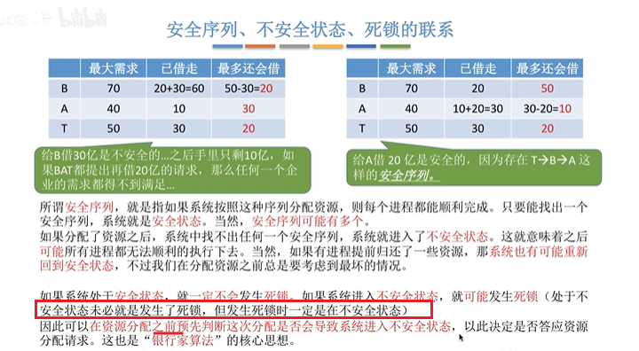

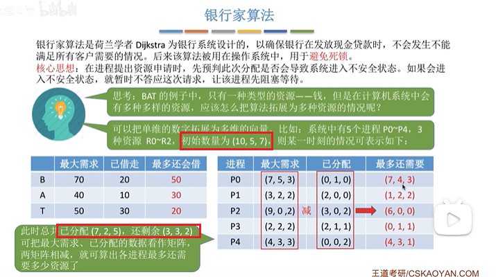

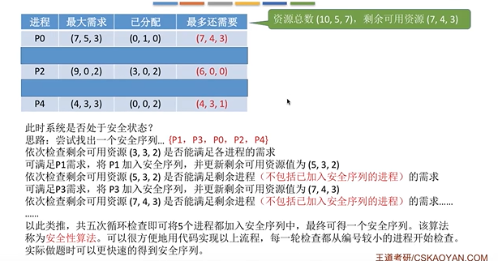


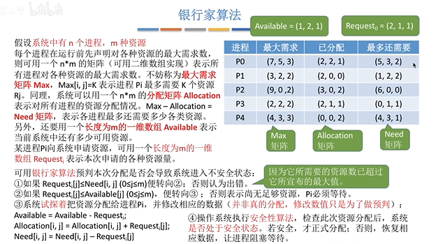

数据结构：
长度为m的一维数组Available表示还有多少可用资源

n * m矩阵Max表示各进程对资源的最大需求数

n*m 矩阵 Allocation 表示已经给各进程分配了多少资源

Max-Allocation=Need矩阵表示各进程最多还需要多少资源

用长度为m的一位数组Request表示进程此次申请的各种资源数

银行家算法步骤：
①检查此次申请是否超过了之前声明的最大需求数
②检查此时系统剩余的可用资源是否还能满足这次请求
③试探着分配，更改各数据结构
④用安全性算法检查此次分配是否会导致系统进入不安全状态

安全性算法步骤：
检查当前的剩余可用资源是否能满足某个进程的最大需求，如果可以，就把该进程加入安全序列，并把该进程持有的资源全部回收。
不断重复上述过程，看最终是否能让所有进程都加入安全序列。

**系统处于不安全状态未必死锁，但死锁时一定处于不安全状态。系统处于安全状态一定不会死锁。**

#### 死锁的检测和解除

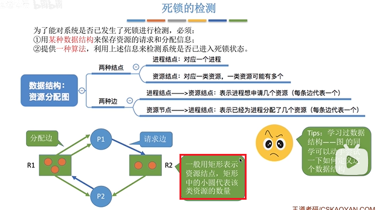

如果按上述过程分析，最终能消除所有边，就称这个图是可完全简化的。此时一定没有发生死锁（相当于能找到一个安全序列）

如果最终不能消除所有边，那么此时就是发生了死锁。

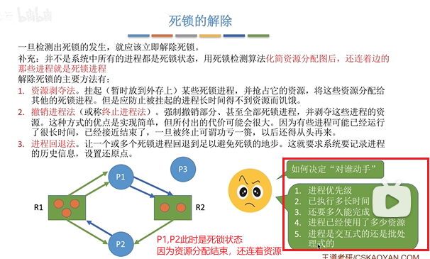

# 线程

## 概念

线程是一个基本的CPU执行单元，也是程序执行流的最小单位。

引入线程之后，不仅是**进程之间**可以并发，**进程内的各线程之间**也可以并发，从而进一步提升了系统的并发度，使得一个进程内也可以并发处理各种任务（如QQ视频、文字聊天、传文件）引入线程后，进程只作为除CPU之外的系统资源的分配单元（如打印机、内存地址空间等都是分配给进程的）。


## 线程实现方式

### 用户级线程


- 1，用户级线程由应用程序通过线程库实现，所有的线程管理工作都由应用程序负责（包括线程切换）

- 2.用户级线程中，线程切换可以在用户态下即可完成，无需操作系统干预。

- 3，在用户看来，是有多个线程。但是在操作系统内核看来，并意识不到线程的存在。“用户级线程”就是“从用户视角看能看到的线程”

- 4.优缺点
  优点：用户级线程的切换在用户空间即可完成，不需要切换到核心态，线程管理的系统开销小，效率高

  缺点：当一个用户级线程被**阻塞后**，整个进程都会被阻塞，并发度不高。多个线程不可在多核处理机上并行运行（进程是资源分配的基本单位）。


### 内核级线程


  - 1.内核级线程的管理工作由操作系统内核完成。

  - 2，线程调度、切换等工作都由内核负责，因此内核级线程的切换必然需要在核心态下才能完成。

  - 3.操作系统会为每个内核级线程建立相应的TCB（Thread Control Block，线程控制块），通过TCB对线程进行管理。“内核级线程”就是“从操作系统内核视角看能看到的线程”

  - 4.优缺点
    优点：当一个线程被**阻塞**后，别的线程还可以继续执行，并发能力强。**多线程可在多核处理机上并行执行。**

    缺点：一个用户进程会占用多个内核级线程，线程切换由操作系统内核完成，需要切换到核心态，因此线程管理的成本高，开销大。

​	

### 多线程模型


## 线程的状态与转换


# 处理机调度

## 基本概念

### 三个层次

> 一个进程是一个程序对某个数据集的执行过程，是分配资源的基本单位。作业是**用户需要计算机完成的某项任务**。一个作业的完成要经过作业提交、作业收容、作业执行和作业完成四个阶段。而进程是对已提交完毕的**程序所执行过程的描述**。其主要区别如下：
>
> - **作业是用户向计算机提交任务的任务实体。**在用户向计算机提交作业作业后，系统将它放入外存中的作业等待队列中等待执行。
>
>   **进程则是完成用户任务的执行实体**，是向系统申请分配资源的基本单位。任一进程，只要它被创建，总有相应的部分存在于内存中。
>
> - 一个作业可由多个进程组成，且必须至少由一个进程组成，反过来不成立。
>
> - 作业的概念主要用在批处理系统中，像UNIX这样的分时系统中就没有作业的概念。而进程的概念则用在几乎所有的多道程序系统中。

#### 高级调度（作业调度）

作业：一个具体的任务
用户向系统提交一个作业=用户让操作系统启动一个程序（来处理一个具体的任务）


#### 中级调度（内存调度）


#### 低级调度（进程调度）

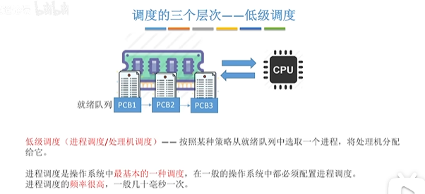

#### 三层调度的联系、对比

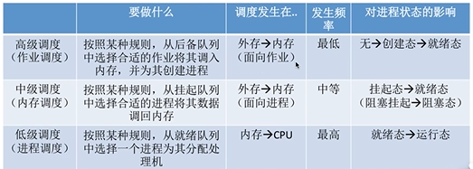

### 进程的“挂起态”和7状态模型

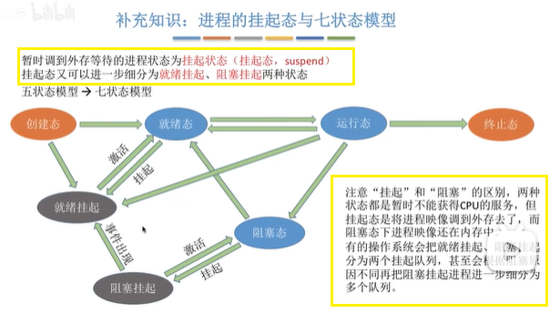

## 进程调度的时机和切换方式

### 时机

- 进程调度（低级调度），就是按照某种算法从就绪队列中选择一个进程为其分配处理机。


> 进程在操作**系统内核程序临界区**中不能进行调度与切换。
>
> 普通临界区访问的临界资源不会直接影响操作系统内核的理工作。因此在访问**普通临界区时可以进行调度与切换。**
>
> - 临界资源：一个时间段内只允许一个进程使用的资源。各进程需要**互斥地**访问临界资源。
> - 临界区：访问临界资源的那段代码。
> - **内核程序临界区**一般是用来访问某种**内核数据结构**的，比如进程的就绪队列（由各就绪进程的PCB组成） 


### 进程调度的方式

- 非剥夺调度方式，又称非抢占方式。即，只允许进程主动放弃处理机。在运行过程中即便有更紧迫的任务到达，当前进程依然会继续使用处理机，直到该进程终止或主动要求进入阻塞态。

  实现简单，系统开销小但是无法及时处理紧急任务，适合于早期的批处理系统

- 剥夺调度方式，又称抢占方式。当一个进程正在处理机上执行时，如果有一个更重要或更紧迫的进程需要使用处理机，则立即暂停正在执行的进程，将处理机分配给更重要紧迫的那个进程。

  可以优先处理更紧急的进程，也可实现让各进程按时间片轮流执行的功能（通过时钟中断）。适合于分时操作系统、实时操作系统

### 进程切换/过程

- “狭义的进程调度”与“进程切换”的区别：

  狭义的进程调度指的是从就绪队列中选中一个要运行的进程。（这个进程可以是刚刚被暂停执行的进程，也可能是另一个进程，后一种情况就需要进程切换）

- 广义的进程调度包含了选择一个进程和进程切换两个步骤。
  进程切换的过程主要完成了：
  1，对原来运行进程各种数据的保存
  2，对新的进程各种数据的恢复
  （如：程序计数器、程序状态字、各种数据寄存器等处理机现场信息，这些信息一般保存在进程控制块）

  注意：进程切换是有代价的，因此如果过于频繁的进行进程调度、切换，必然会使整个系统的效率降低，使系统大部分时间都花在了进程切换上，而真正用于执行进程的时间减少。

## 调度器/调度程序（scheduler）

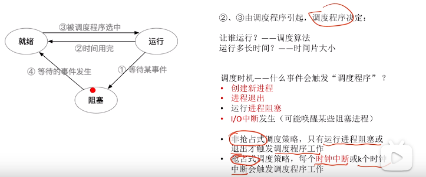

- 不支持内核级线程的操作系统，调度程序的处理对象是进程
- 支持内核级线程的操作系统，调度程序的处理对象是内核线程（线程是调度的最小单位）


闲逛进程

调度程序永远的备胎，没有其他就绪进程时，运行闲逛进程（idle）

闲逛进程的特性：

- 优先级最低
- 可以是0地址指令，占一个完整的指令周期（指令周期末尾例行检查中断，检查其他就绪进程是否上处理机，有的话闲逛进程就下处理机）
- 能耗低

## 调度算法的评价指标

### CPU利用率

指CPU“忙碌”的时间占总时间的比例

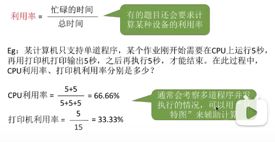

### 系统吞吐量

对于计算机来说，希望能用尽可能少的时间处理完尽可能多的作业

系统吞吐量：单位时间内完成作业的数量

$系统吞吐量=\frac{总共完成了多少道作业}{总共花了多少时间}$

### 周转时间/平均周转时间

周转时间，是指从作业被提交给系统开始，到作业完成为止的这段时间间隔。

它包括四个部分：

- 作业在外存后备队列上**等待作业调度**（高级调度）的时间
- 进程在就绪队列上**等待进程调度**（低级调度）的时间
- 进程在CPU上执行的时间
- 进程等待1/0操作完成的时间。
- 后三项在一个作业的整个处理过程中，可能发生多次。

对于**计算机的用户**来说，他很关心**自己的作业**从**提交到完成**花了多少时间。

- （作业）周转时间=作业完成时间-作业提交时间

对于**操作系统**来说，更关心系统的整体表现，因此更关心所有作业周转时间的平均值

- $平均周转时间=\frac{各作业周转时间之和}{作业数}$

#### 带权周转时间、平均带权周转时间

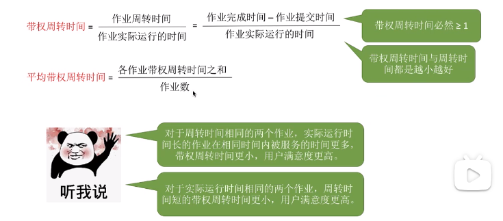

### 等待时间

计算机的用户希望自己的作业尽可能少的等待处理机

等待时间，指进程/作业处于等待处理机状态时间之和，等待时间越长，用户满意度越低。

等待时间=周转时间-运行时间

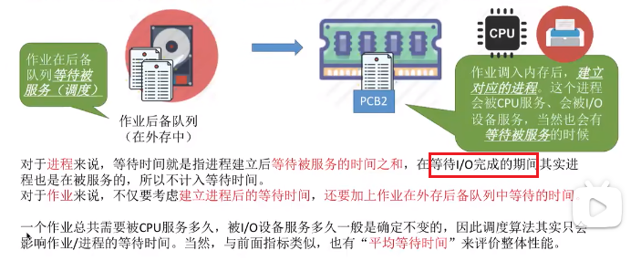

### 响应时间

从用户提交请求到首次产生响应所用的时间

## 调度算法

> Tips：各种调度算法的学习思路
>
> - 1.算法思想
> - 2.算法规则
> - 3这种调度算法是用于作业调度还是进程调度？
> - 4.抢占式？非抢占式？
> - 5.优点和缺点
> - 6.是否会导致饥饿 某进程/作业长期得不到服务

### 先来先服务（FCFS）

- 1.算法思想

  主要从“公平”的角度考虑（类似于我们生活中排队买东西的例子）

- 2.算法规则

  按照作业/进程到达的先后顺序进行服务

- 3这种调度算法是用于作业调度还是进程调度？

  用于作业调度时，考虑的是哪个作业先到达后备队列；用于进程调度时，考虑的是哪个进程先到达就绪队列

- 4.抢占式？非抢占式？

  非抢占式的算法

- 5.优点和缺点

  优点：公平、算法实现简单
  缺点：排在长作业（进程）后面的短作业需要等待很长时间，**带权周转时间很大**，对短作业来说用户体验不好。即，FCFS算法对长作业有利，对短作业不利（Eg：排队买奶茶...）

- 6.是否会导致饥饿 某进程/作业长期得不到服务

  不会

  

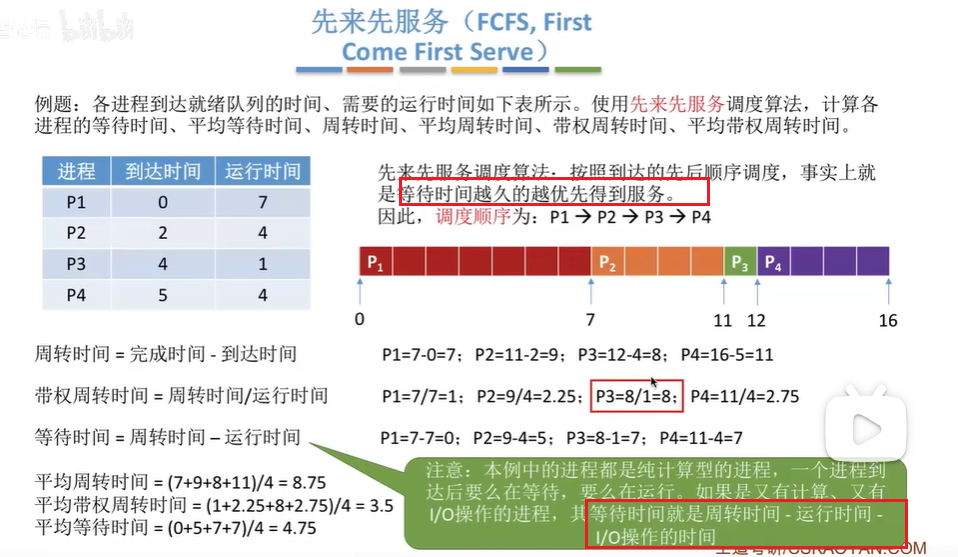

### 短作业优先（SJF）

> 注意几个小细节：
> 1.如果题目中未特别说明，所提到的“短作业/进程优先算法”默认是非抢占式的
>
> 2，很多书上都会说"SJF调度算法的平均等待时间、平均周转时间最少”
>
> 严格来说，这个表述是错误的，不严谨的。之前的例子表明，最短剩余时间优先算法得到的平均等待时间、平均周转时间还要更少。应该加上一个条件“在所有进程同时可运行时，采用SJF调度算法的平均等待时间、平均周转时间最少；或者说“在所有进程都几乎同时到达时，采用SJF调度算法的平均等待时间、平均周转时间最少”；

- 1.算法思想

  追求最少的平均等待时间，最少的平均周转时间、最少的平均平均带权周转时间

- 2.算法规则

  最短的作业/进程优先得到服务（所谓“最短”，是指要求服务时间最短）

- 3这种调度算法是用于作业调度还是进程调度？

  即可用于作业调度，也可用于进程调度。用于进程调度时称为“短进程优先（SPF，Shortest Process First）算法”

- 4.抢占式？非抢占式？

  SJF和SPF是非抢占式的算法。但是也有抢占式的版本——**最短剩余时间优先算法**（SRTN，Shortest Remaining Time Next）

- 5.优点和缺点

  优点：“最短的”平均等待时间、平均周转时间缺点：不公平。**对短作业有利，对长作业不利。可能产生饥饿现象。**另外，作业/进程的运行时间是由用户提供的，并不一定真实，不一定能做到真正的短作业优先

- 6.是否会导致饥饿 某进程/作业长期得不到服务

  会。如果源源不断地有短作业/进程到来，可能使长作业/进程长时间得不到服务，产生“饥饿”现象。如果一直得不到服务，则称为“饿死”

  

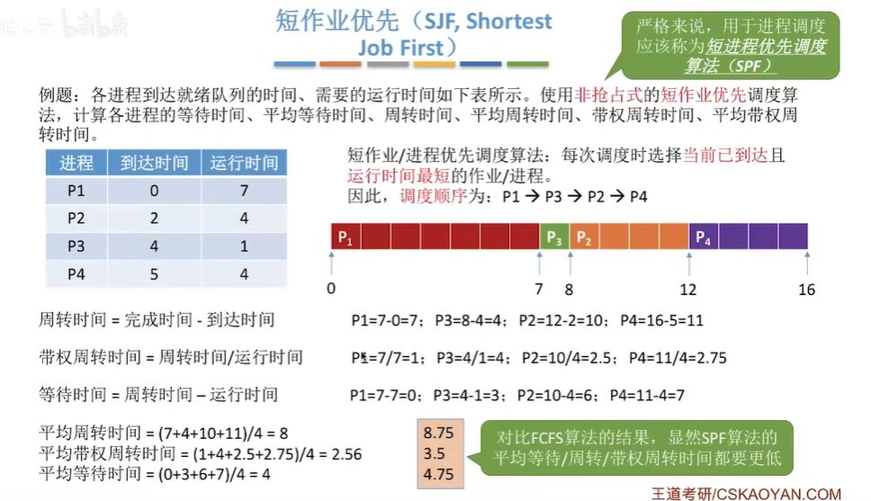

最短剩余时间优先算法：每当有进程加入**就绪队列改变时就需要调度**，如果新到达的进程**剩余时间比当前运行的进程剩余时间更短**，则由新进程**抢占**处理机，当前运行进程重新回到就绪队列。另外，**当一个进程完成时也需要调度**

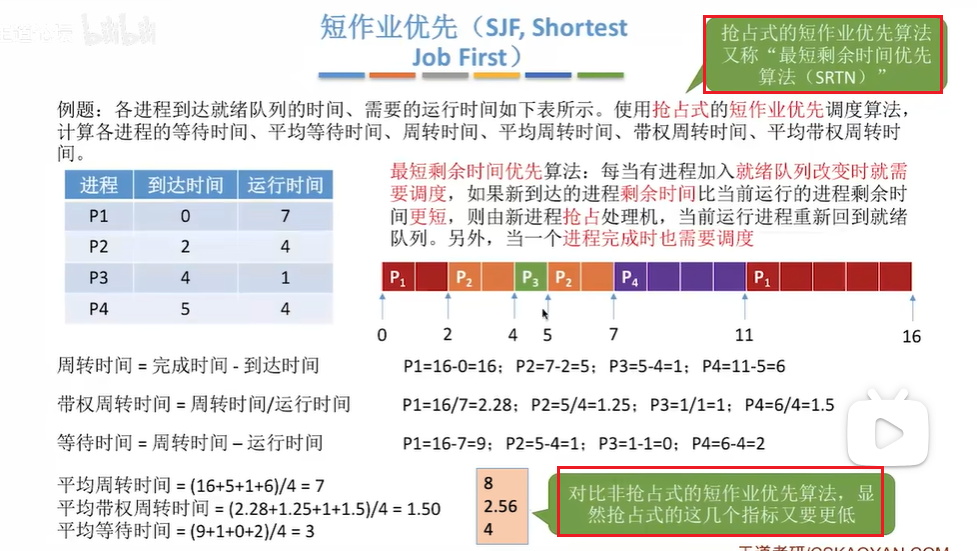

### 高响应比优先（HRRN）

- 1.算法思想

  要综合考虑作业/进程的等待时间和要求服务的时间

- 2.算法规则

  在每次调度时先计算各个作业/进程的响应比，选择响应比最高的作业/进程为其服务

  $响应比 = \frac{等待时间+要求服务时间}{要求服务时间} (响应比 >= 1)$

- 3这种调度算法是用于作业调度还是进程调度？

  即可用于作业调度，也可用于进程调度

- 4.抢占式？非抢占式？

  非抢占式的算法。因此尽有当前运行的作业/进程主动放弃处理机时，才需要调度，才需要计算响应比

- 5.优点和缺点

  综合考虑了等待时间和运行时间（要求服务时间）

  等待时间相同时，要求服务时间短的优先（SJF的优点）

  要求服务时间相同时，等待时间长的优先（FCFS的优点）

  对于长作业来说，随着等待时间越来越久，其响应比也会越来越大，从而避免了长作业饥饿的问题

- 6.是否会导致饥饿 某进程/作业长期得不到服务

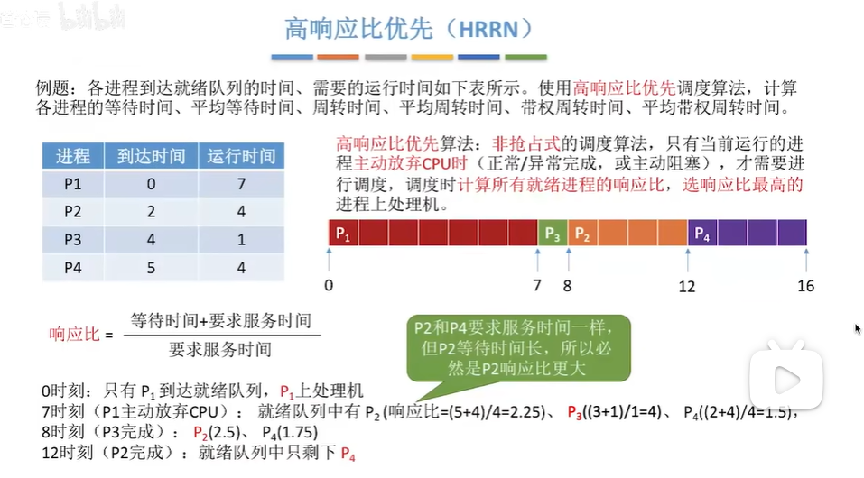

### 总结

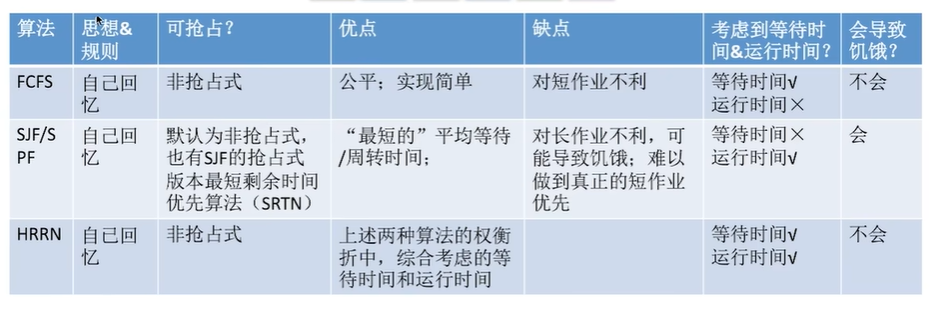


### 时间片轮转调度算法（RR）

- 1.算法思想

  公平地、轮流地为各个进程服务，让每个进程在一定时间间隔内都可以得到响应
  
- 2.算法规则

  按照各进程到达就绪队列的顺序，轮流让各个进程执行一个时间片（如100ms）。若进程未在一个时间片内执行完，则剥夺处理机，将进程重新放到就绪队列队尾重新排队。

- 3这种调度算法是用于作业调度还是进程调度？

  用于进程调度（只有作业放入内存建立了相应的进程后，才能被分配处理机时间片）

- 4.抢占式？非抢占式？

  若进程未能在时间片内运行完，将被强行剥夺处理机使用权，因此时间片轮转调度算法属于抢占式的算法。由时钟装置发出时钟中断来通知CPU时间片已到

- 5.优点和缺点

  - 优点：公平；响应快，适用于分时操作系统；

  - 缺点：

    如果**时间片太大**，使得每个进程都可以在一个时间片内就完成，则**时间片轮转调度算法退化为先来先服务调度算法**，并且会**增大进程响应时间**。因此时间片不能太大。

    另一方面，进程调度、切换是有时间代价的（保存、恢复运行环境），因此如果**时间片太小**，会导致进程切换过于频繁，系统会花大量的时间来处理进程切换，从而导致实际用于进程执行的时间比例减少。可见时间片也不能太小。

- 6.是否会导致饥饿 某进程/作业长期得不到服务

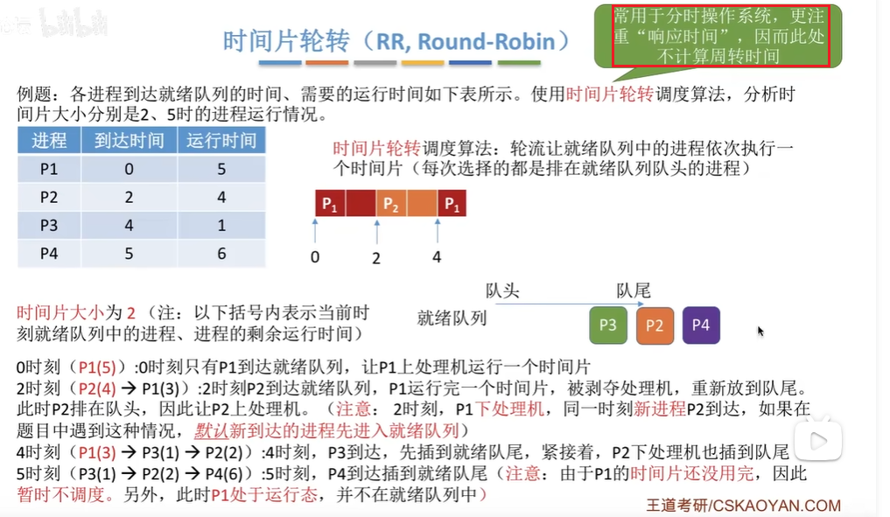

### 优先级调度算法

- 1.算法思想

  随着计算机的发展，特别是实时操作系统的出现，越来越多的应用场景需要根据任务的紧急程度来决定处理顺序

- 2.算法规则

  每个作业/进程有各自的优先级，调度时选择优先级最高的作业/进程

- 3这种调度算法是用于作业调度还是进程调度？

  既可用于作业调度，也可用于进程调度。甚至，还会用于在之后会学习的1/O调度中

- 4.抢占式？非抢占式？

  抢占式、非抢占式都有。做题时的区别在于：非抢占式只需在进程主动放弃处理机时进行调度即可，而抢占式还需在就绪队列变化时，检查是否会发生抢占。

- 5.优点和缺点

  优点：用优先级区分紧急程度、重要程度，适用于实时操作系统。可灵活地调整对各种作业/进程的偏好程度。

  缺点：若源源不断地有高优先级进程到来，**则可能导致饥饿**

- 6.是否会导致饥饿 某进程/作业长期得不到服务

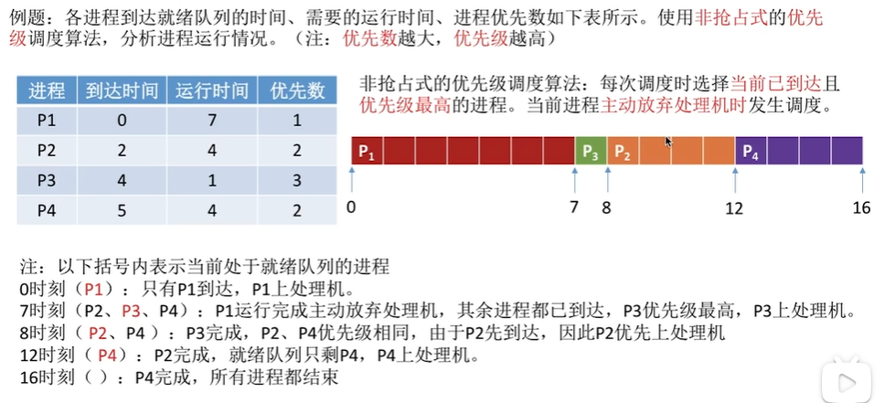

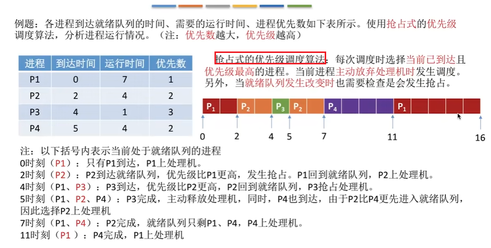

补充：

- 就绪队列未必只有一个，可以按照不同优先级来组织。另外，也可以把优先级高的进程排在更靠近队头的位置
- 根据优先级是否可以动态改变，可将优先级分为静态优先级和动态优先级两种。
- 静态优先级：创建进程时确定，之后一直不变。
- 动态优先级：创建进程时有一个初始值，之后会根据情况动态地调整优先级。

如何合理地设置各类进程的优先级？通常：

- 系统进程优先级高于用户进程
- 前台进程优先级高于后台进程

- 操作系统更偏好1/0型进程（或称1/0繁忙型进程）

  注：与1/0型进程相对的是计算型进程（或称CPU繁忙型进程）

  **I/O设备和CPU可以并行工作。如果优先让1/0繁忙型进程优先运行的话，则越有可能让I/O设备尽早地投入工作，则资源利用率、系统吞吐量都会得到提升**

如果采用的是动态优先级，什么时候应该调整？

可以从追求公平、提升资源利用率等角度考虑如果某进程在就绪队列中等待了很长时间，则可以适当提升其优先级

如果某进程占用处理机运行了很长时间，则可适当降低其优先级

**如果发现一个进程频繁地进行1/0操作，则可适当提升其优先级**

###  多级反馈队列调度算法

- 1.算法思想

  对其他调度算法的折中权衡
  
- 2.算法规则

  1，设置多级就绪队列，各级队列优先级从高到低，时间片从小到大

  2.新进程到达时先进入第1级队列，按FCFS原则排队等待被分配时间片，若用完时间片进程还未结束，则进程进入下一级队列队尾。

  如果此时已经是在最下级的队列，则重新放回该队列队尾3.只有第k级队列为空时，才会为k+1级队头的进程分配时间片

- 3这种调度算法是用于作业调度还是进程调度？

  用于进程调度

- 4.抢占式？非抢占式？

  抢占式的算法。在k级队列的进程运行过程中，若更上级的队列（1~k-1级）中进入了一个新进程，则由于新进程处于优先级更高的队列中，因此新进程会抢占处理机，原来运行的进程放回k级队列队尾。

- 5.优点和缺点

  对各类型进程相对公平（FCFS的优点）；每个新到达的进程都可以很快就得到响应（RR的优点）；短进程只用较少的时间就可完成
  （SPF的优点）；不必实现估计进程的运行时间（避免用户作假）；可灵活地调整对各类进程的偏好程度，比如CPU密集型进程、1/0密集型进程（拓展：**可以将因1/0而阻塞的进程重新放回原队列，这样1/0型进程就可以保持较高优先级**）

- 6.是否会导致饥饿 某进程/作业长期得不到服务 

  会

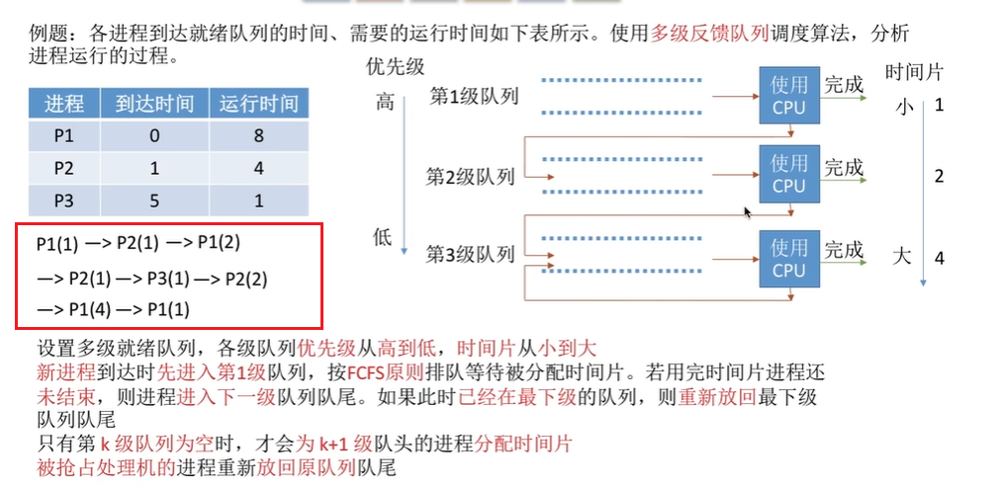

### 总结


注：比起早期的批处理操作系统来说，由于计算机造价大幅降低，因此之后出现的交互式操作系统（包括分时操作系统、实时操作系统等）更注重系统的响应时间、公平性、平衡性等指标。而这几种算法恰好也能较好地满足交互式系统的需求。因此这三种算法适合用于交互式系统。（比如UNIx使用的就是多级反馈队列调度算法）

### 多级队列调度算法

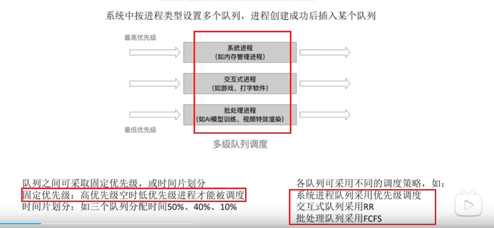

# 文件管理

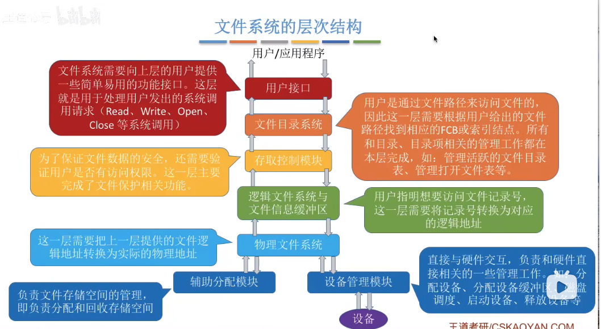

- 用户接口:文件的基本操作
- 文件目录系统：文件目录
- 存取控制模块：文件保护
- 逻辑文件系统与文件信息缓冲区：文件的逻辑结构
- 物理文件系统：文件的物理结构
- 辅助分配模块：文件的存储空间管理
- 设备管理模块

> 用一个例子来辅助记忆文件系统的层次结构：假设某用户请求删除文件"D:/工作目录/学生信息.xlsx"的最后100条记录。
>
> - 1，用户需要通过操作系统提供的接口发出上述请求--用户接口
> - 2，由于用户提供的是文件的存放路径，因此需要操作系统一层一层地查找目录，找到对应的目录项——文件目录系统
> - 3·不同的用户对文件有不同的操作权限，因此为了保证安全，需要检查用户是否有访问权限-一存取控制模块（存取控制验证层）
> - 4.验证了用户的访问权限之后，需要把用户提供的“记录号”转变为对应的逻辑地址——逻辑文件系统与文件信息缓冲区
> - 5.知道了目标记录对应的逻辑地址后，还需要转换成实际的物理地址——物理文件系统
> - 6，要删除这条记录，必定要对磁盘设备发出请求--设备管理程序模块7.删除这些记录后，会有一些盘块空闲，因此要将这些空闲盘块回收——辅助分配模块

## 文件的属性

- 文件名：由创建文件的用户决定文件名，主要是为了方便用户找到文件，**同一目录下不允许有重名文件。**
- 标识符：一个系统内的各文件标识符唯一，对用户来说毫无可读性，因此标识符只是操作系统用于区分各个文件的一种内部名称。
- 类型：指明文件的类型
- 位置：文件存放的路径（让用户使用）、在外存中的地址（操作系统使用，对用户不可见）
- 大小：指明文件大小创建时间、上次修改时间文件所有者信息
- 保护信息：对文件进行保护的访问控制信息

## 操作系统应该向上提供哪些功能

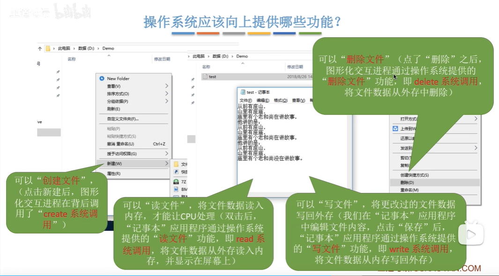

- 创建文件（create系统调用）
- 删除文件（delete系统调用）
- 读文件（read系统调用）
- 写文件（write系统调用）
- 打开文件（open系统调用）
- 关闭文件（close系统调用）


## 文件的逻辑结构

> 所谓的“逻辑结构”，就是指在用户看来，文件内部的数据应该是如何组织起来的。而“物理结构”指的是在操作系统看来，文件的数据是如何存放在外存中的。

### 无结构文件

无结构文件：文件内部的数据就是一系列二进制流或字符流组成。又称“流式文件”。如：Windows操作系统中的.txt文件。

### 有结构文件

有结构文件：由一组相似的记录组成，又称**“记录式文件”**。每条记录又若干个数据项组成。如：数据库表文件。一般来说，每条记录有一个数据项可作为**关键字**（作为识别不同记录的1D）。根据各条记录的长度（占用的存储空间）是否相等，又可分为**定长记录和可变长记录**两种。

#### 顺序文件

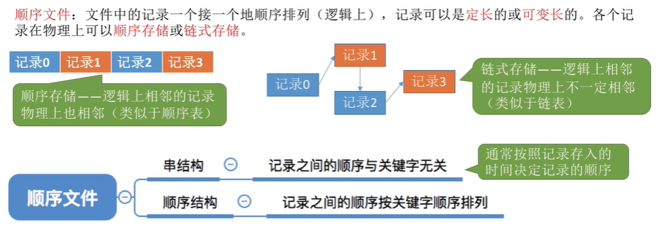

> 假设：已经知道了文件的起始地址（也就是第一个记录存放的位置）
> 思考1：能否快速找到第i个记录对应的地址？（即能否实现随机存取）
> 思考2：能否快速找到某个关键字对应的记录存放的位置？

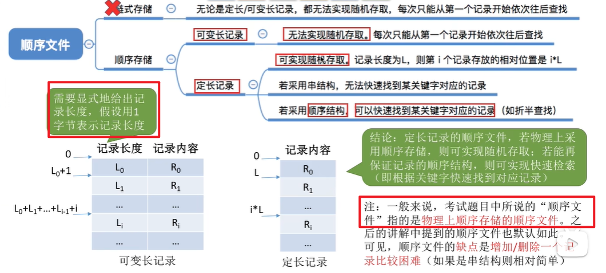

#### 索引文件

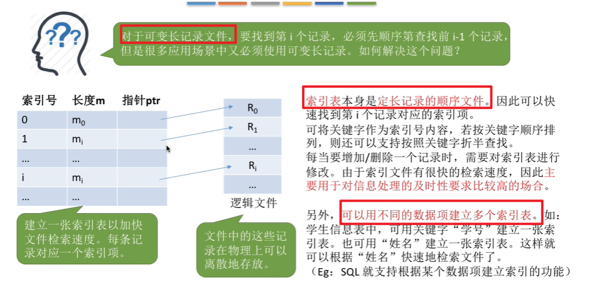

#### 索引顺序文件

索引顺序文件是索引文件和顺序文件思想的结合。索引顺序文件中，同样会为文件建立一张索引表，但不同的是：并不是每个记录对应一个索引表项，而是**一组记录**对应一个索引表项。


**多级索引顺序文件**

为了进一步提高检索效率，可以为顺序文件建立多级索引表。例如，对于一个含106个记录的文件，可先为该文件建立一张低级索引表，每100个记录为一组，故低级索引表中共有10000个表项（即10000个定长记录），再把这10000个定长记录分组，每组100个，为其建立顶级索引表，故顶级索引表中共有100个表项。

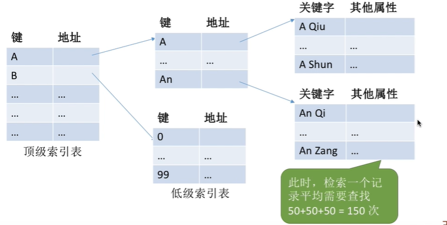

## 文件目录

### 文件控制块（实现文件目录的关键数据结构）

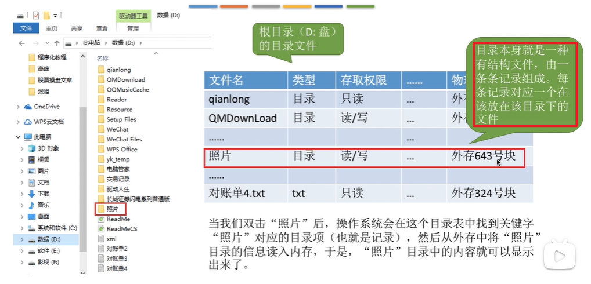


需要对目录进行哪些操作？

- 搜索：当用户要使用一个文件时，系统要根据文件名搜索目录，找到该文件对应的目录项

- 创建文件：创建一个新文件时，需要在其所属的目录中增加一个目录项
- 删除文件：当删除一个文件时，需要在目录中删除相应的目录项
- 显示目录：用户可以请求显示目录的内容，如显示该目录中的所有文件及相应属性
- 修改目录：某些文件属性保存在目录中，因此这些属性变化时需要修改相应的目录项（如：文件重命名）

### 目录结构

#### 单级目录结构

> 不允许文件重名。

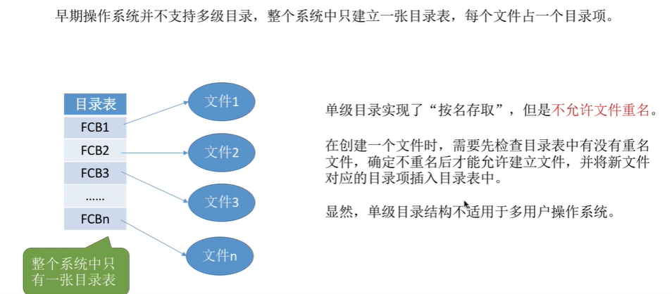

#### 两级目录结构

> 不同用户的文件可以重名，但不能对文件进行分类

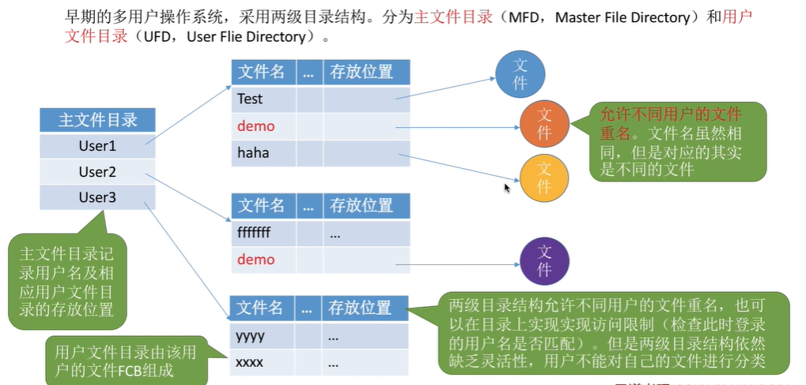

#### 多级目录结构（树形目录结构）

> 不便于实现文件的共享

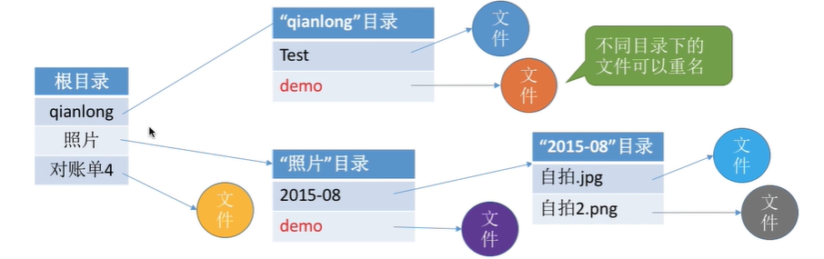

用户（或用户进程）要访问某个文件时要用文件路径名标识文件，文件路径名是个字符串。各级目录之间用"/”隔开。**从根目录出发的路径称为绝对路径**。例如：自拍jpg的绝对路径是"/照片/2015-08/自拍.jpg"
**每次都从根目录开始查找，是很低效的。因此可以设置一个“当前目录”。例如，此时已经打开了“照片”的目录文件，也就是说，这张目录表已调入内存，那么可以把它设置为“当前**

**目录”。当用户想要访问某个文件时，可以使用从当前目录出发的“相对路径”。**

在Linux中，".”表示当前目录，因此如果“照片”是当前目录，则”自拍.jpg”的相对路径为：“./2015-08/自拍jpg”。

树形目录结构可以很方便地对文件进行分类，层次结构清晰，也能够更有效地进行文件的管理和保护。但是，树形结构**不便于实现文件的共享**。为此，提出了“无环图目录结构”。

#### 无环图目录结构

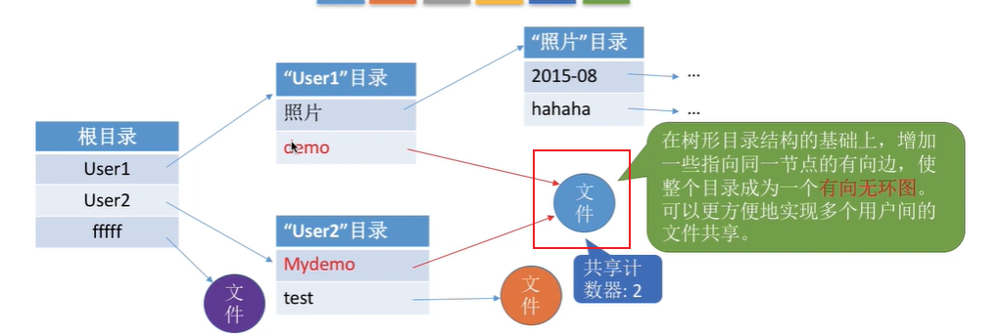

**可以用不同的文件名指向同一个文件**，甚至可以指向同一个目录（共享同一目录下的所有内容）。
需要为每个共享结点设置一个**共享计数器**，用于记录此时有多少个地方在共享该结点。用户提出删除结点的请求时，只是删除该用户的FCB、并使共享计数器减1，并不会直接删除共享结点。

**只有共享计数器减为0时，才删除结点。**

注意：共享文件不同于复制文件。在共享文件中，由于各用户指向的是同一个文件，因此只要其中一个用户修改了文件数据，那么所有用户都可以看到文件数据的变化。

### 索引结点（对文件控制块的优化）

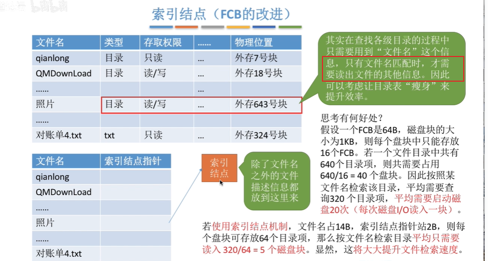

## 文件的物理结构

> 即：文件数据应该怎样存放在外存中？

### 文件块、磁盘块

在内存管理中，进程的逻辑地址空间被分为一个一个页面同样的，在外存管理中，为了方便对文件数据的管理，文件的逻辑地址空间也被分为了一个一个的文件“块”。于是文件的**逻辑地址**也可以表示为（逻辑块号，块内地址）的形式。

用户通过逻辑地址来操作自己的文件，操作系统要负责实现从逻辑地址到物理地址的映射

### 连续分配

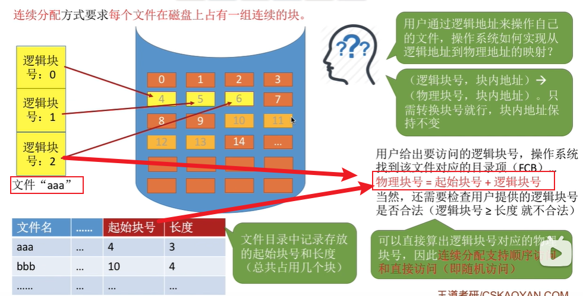

连续分配方式要求每个文件在磁盘上占有一组连续的块。**连续分配的文件在顺序读/写时速度最快**

缺点

- 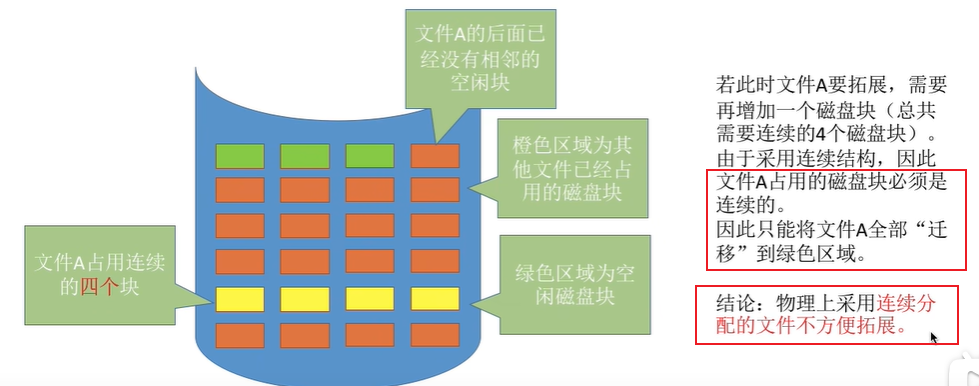
- 结论：物理上采用连续分配，存储空间利用率低，会产生难以利用的磁盘碎片。可以用紧凑来处理碎片，但是需要耗费很大的时间代价。

### 链接分配

#### 隐式链接

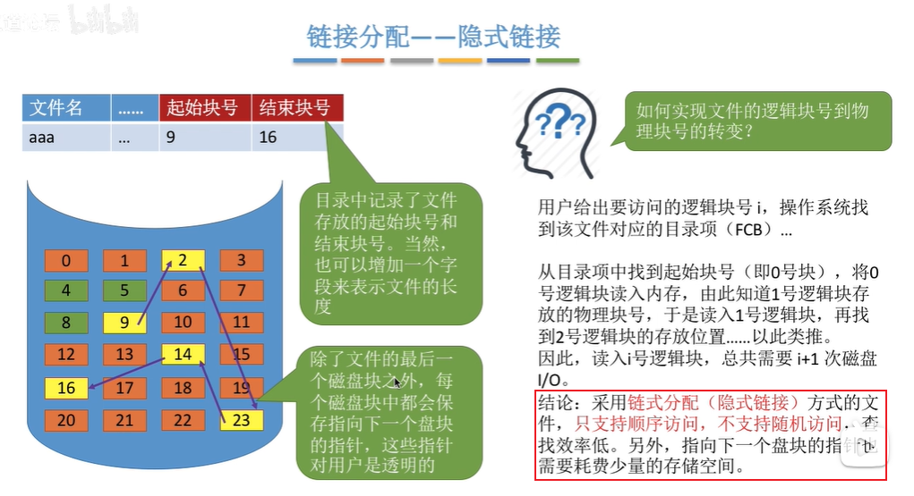

隐式链接——除文件的最后一个盘块之外，每个盘块中都存有指向下一个盘块的指针。文件目录包括文件第一块的指针和最后一块的指针。
优点：很方便文件拓展，不会有碎片问题，外存利用率高。
缺点：只支持顺序访问，不支持随机访问，查找效率低，指向下一个盘块的指针也需要耗费少量的存储空间。


#### 显式链接

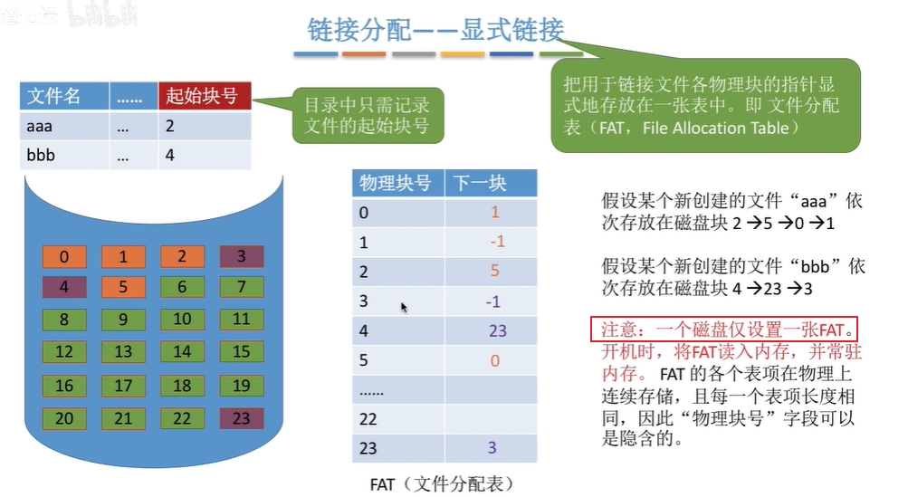


显式链接——把用于链接文件各物理块的指针显式地存放在一张表中，即 文件分配表（FAT，File Allocation Table）。一个磁盘只会建立一张文件分配表。开机时文件分配表放入内存，并常驻内存。
优点：很方便文件拓展，不会有碎片问题，外存利用率高，并且支持随机访问。相比于隐式链接来说，地址转换时不需要访问磁盘，因此文件的访问效率更高。
缺点：文件分配表的需要占用一定的存储空间。

### 索引分配

索引分配允许文件离散地分配在各个磁盘块中，系统会为每个文件建立一张索引表，索引表中**记录了文件的各个逻辑块对应的物理块**（索引表的功能类似于内存管理中的页表——建立逻辑页面到物理页之间的映射关系）。索引表存放的磁盘块称为**索引块**。文件数据存放的磁盘块称为**数据块**。

> 注：在显式链接的链式分配方式中，**文件分配表FAT 是一个磁盘对应一张**。而索引分配方式中，索引表是一个文件对应一张。


假设磁盘总容量为$1TB=2^{40}B$，磁盘块大小为1KB，则共有$2^{30}$个磁盘块，则可用4B（32位）表示**一个磁盘块号**，因此，索引表中的“逻辑块号”可以是隐含的。


若每个磁盘块1KB，一个索引表项4B，则一个磁盘块只能存放 256 个索引项。
如果一个文件的大小超过了256块，那么一个磁盘块是装不下文件的整张索引表的，如何解决这个问题？

- 链接方案：如果索引表太大，一个索引块装不下，那么可以将**多个索引块链接**起来存放。

  假设磁盘块大小为1KB，一个索引表项占4B，则一个磁盘块只能存放256个索引项。
  若一个文件大小为256 * 256KB =65，536 KB= 64MB该文件共有256 * 256个块，也就对应256 * 256个索引项，也就需要 256个索引块来存储，这些索引块用链接方案连起来。

  若想要访问文件的最后一个逻辑块，就必须找到最后一个索引块（第256个索引块），而各个索引块之间是用指针链接起来的，因此必须先**顺序**地读入前 255 个索引块。

- 多层索引：建立多层索引（原理类似于多级页表）。使第一层索引块指向第二层的索引块。还可根据文件大小的要求再建立第三层、第四层索引块。

  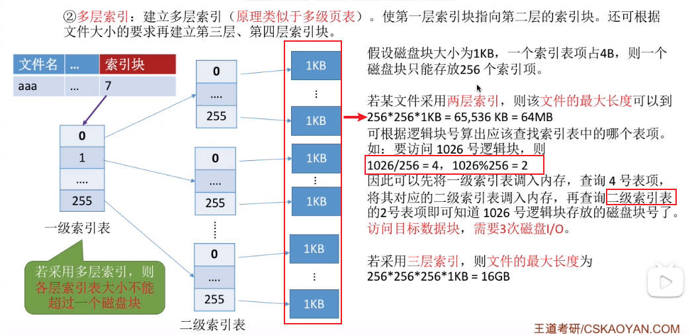

- ③混合索引：多种索引分配方式的结合。例如，一个文件的顶级索引表中，既包含直接地址索引（直接指向数据块），又包含一级间接索引（指向单层索引表）、还包含两级间接索引（指向两层索引表）。

  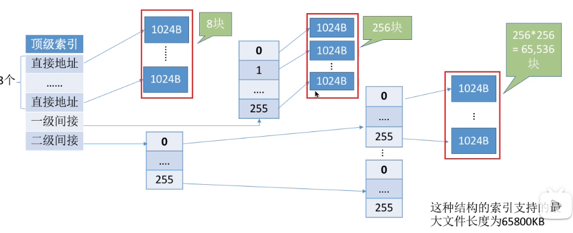

  若顶级索引表还没读入内存

  访问 0~7 号逻辑块：两次读磁盘

  访问 8~263：三次读磁盘

  访问 264~ 65799：四次读磁盘

总结

索引分配允许文件离散地分配在各个磁盘块中，系统会为每个文件建立一张索引表，索引表中记录了文件的各个逻辑块对应的物理块（索引表的功能类似于内存管理中的页表-—建立逻辑页面到物理页之间的映射关系）。索引表存放的磁盘块称为索引块。文件数据存放的磁盘块称为数据块。

若文件太大，索引表项太多，可以采取以下三种方法解决：

- ①链接方案：如果索引表太大，一个索引块装不下，那么可以将多个索引块链接起来存放。缺点：若文件很大，索引表很长，就需要将很多个索引块链接起来。想要找到i号索引块，必须先依次读入0~i-1号索引块，这就导致磁盘1/0次数过多，查找效率低下。

- ②多层索引：建立多层索引（原理类似于多级页表）。使第一层索引块指向第二层的索引块。还可根据文件大小的要求再建立第三层、第四层索引块。采用K层索引结构，且**顶级索引表未调入内存**，则访问一个数据块只需要**K+1次读磁盘**操作。缺点：即使是小文件，访问一个数据块依然需要K+1次读磁盘。
- ③混合索引：多种索引分配方式的结合。例如，一个文件的顶级索引表中，既包含直接地址索引（直接指向数据块），又包含一级间接索引（指向单层索引表）、还包含两级间接索引（指向两层索引表）。
  优点：对于小文件来说，访问一个数据块所需的读磁盘次数更少。

超级超级超级重要考点：

- ①要会根据多层索引、混合索引的结构计算出文件的最大长度（Key：各级索引表最大不能超过一个块）；
- 2要能自己分析访问某个数据块所需要的读磁盘次数（Key：FCB中会存有指向顶级索引块的指针，因此可以根据FCB读入顶级索引块。每次读入下一级的索引块都需要一次读磁盘操作。另外，要注意题目条件——顶级索引块是否已调入内存）

## 逻辑结构VS物理结构

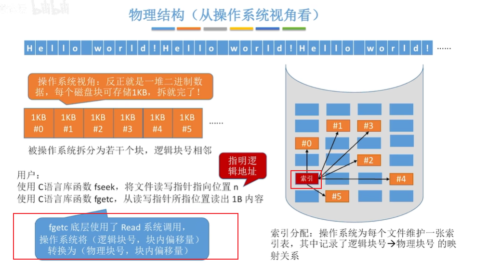

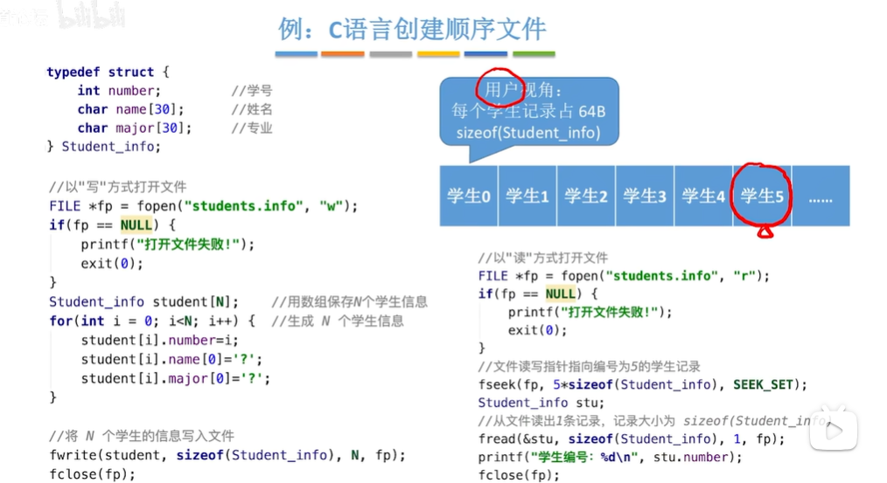

- 顺序文件采用顺序存储/链式存储

- 链式存储的顺序文件采用链接分配

  - 文件内部各条记录链式存储：由创建文件的用户自己设计的
  - 文件整体用链接分配：由操作系统决定

- 索引文件采用索引分配

  - 索引文件的索引表：用户自己建立的，映射：关键字→记录存放的逻辑地址
  - 索引分配的索引表：操作系统建立的，映射：逻辑块号→物理块号

  

## 文件的存储空间管理


### 存储空间的划分与初始化

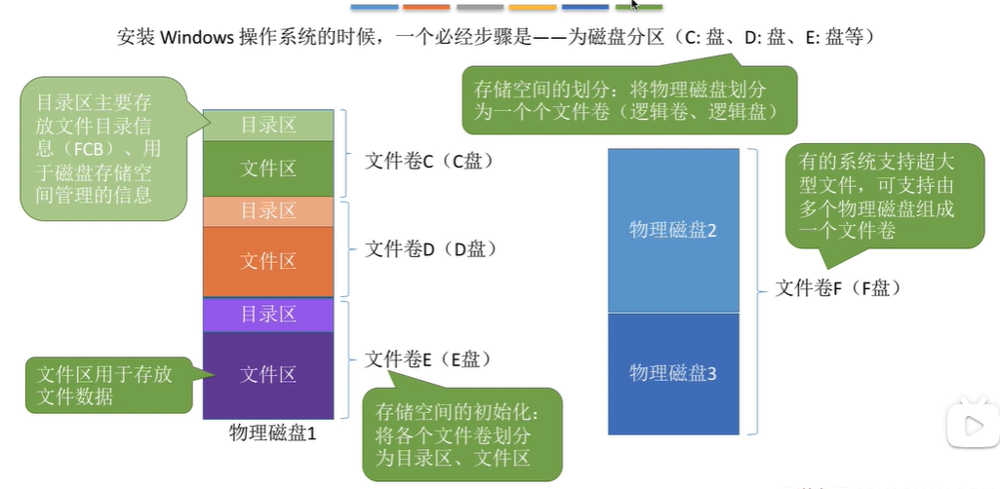

#### 文件卷（逻辑卷）的概念

#### 目录区与文件区


### 几种管理方法

#### 空闲表法

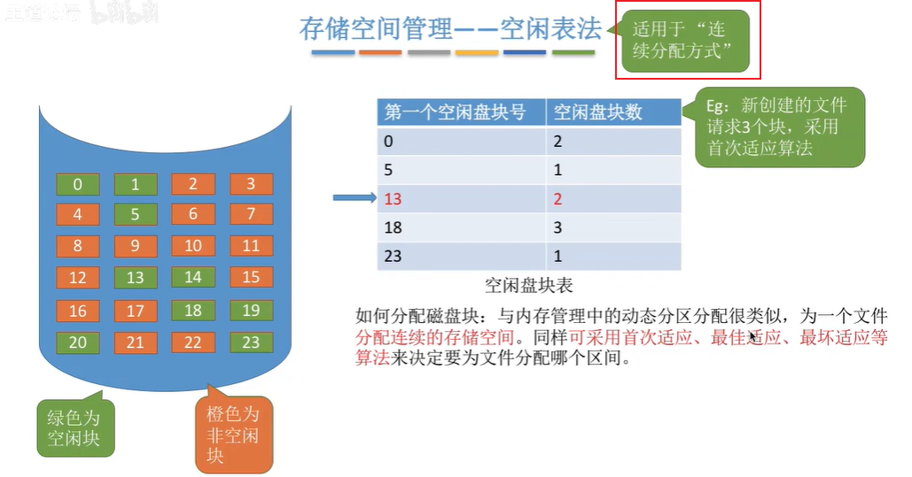

如何回收磁盘块：与内存管理中的动态分区分配很类似，当回收某个存储区时需要有四种情况——①回收区的前后都没有相邻空闲区；②回收区的前后都是空闲区；③回收区前面是空闲区；4回收区后面是空闲区。**总之，回收时需要注意表项的合并问题。**

#### 空闲链表法

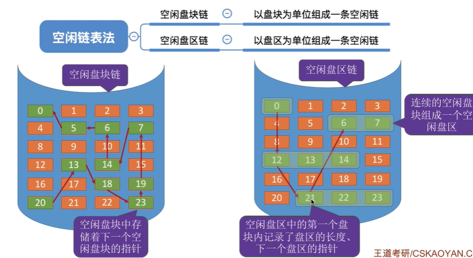

##### 空闲盘块链

##### 空闲盘区链

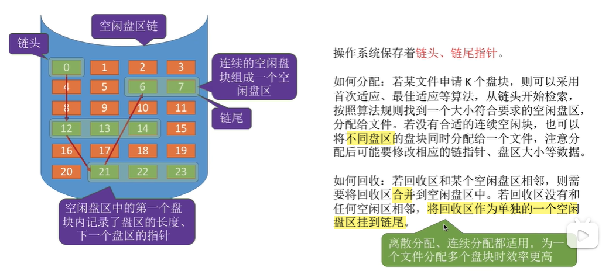

#### 位示图法

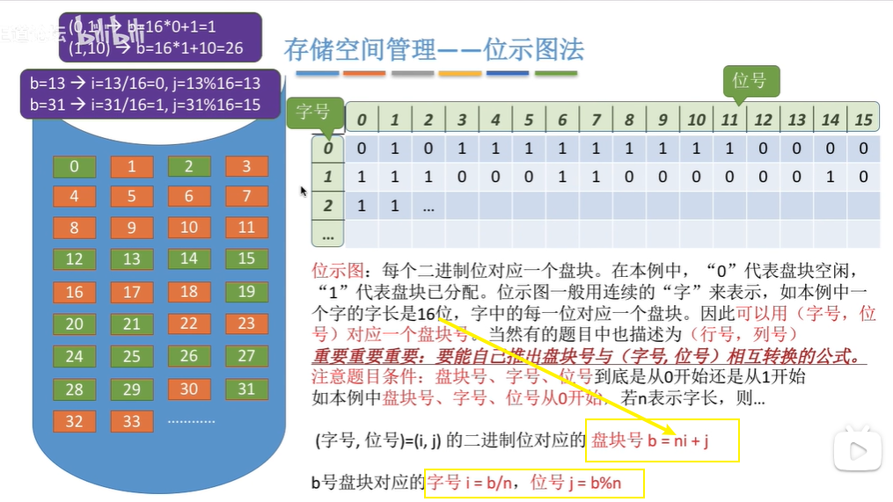

#### **成组链接法:m:**

空闲表法、空闲链表法不适用于大型文件系统，因为空闲表或空闲链表可能过大。UNIX系统中采用了成组链接法**对磁盘空闲块**进行管理。

**文件卷的目录区**中专门用一个磁盘块作为“超级块”，当系统启动时需要**将超级块读入内存**。并且要保证**内存与外存中的“超级块”数据一致。**

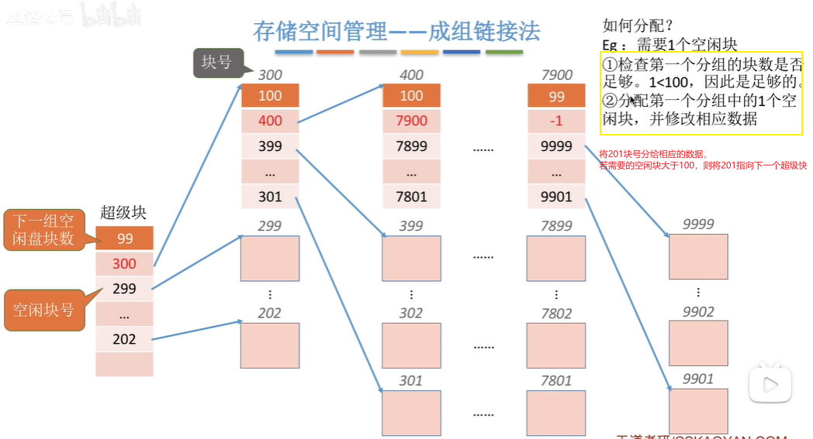

## 文件的基本操作

### Create 

进行 Create 系统调用时，需要提供的几个主要参数：

- 1.所需的外存空间大小（如：一个盘块，即1KB）
- 2.文件存放路径（"D:/Demo"）
- 3.文件名（这个地方默认为“新建文本文档.txt”）

操作系统在处理Create系统调用时，主要做了两件事：

1. 在外存中找到文件所需的空间（结合上小节学习的空闲链表法、位示图、成组链接法等管理策略，找到空闲空间）
2. 根据文件存放路径的信息找到该目录对应的目录文件（此处就是D:/Demo目录），在目录中创建该文件对应的目录项。目录项中包含了文件名、文件在外存中的存放位置等信息。

### Delete 

进行 Delete 系统调用时，需要提供的几个主要参数：

- 1.文件存放路径（"D:/Demo"）
- 2.文件名（“test.txt”）

操作系统在处理Delete系统调用时，主要做了几件事：

1. 根据文件存放路径找到相应的目录文件，从目录中**找到文件名对应的目录项**。

2. 根据该目录项记录的文件在外存的存放位置、文件大小等信息，回收文件占用的磁盘块。

   （回收磁盘块时，根据空闲表法、空闲链表法、位图法等管理策略的不同，需要做不同的处理）

3. 从目录表中删除文件对应的目录项。

### **open**

在很多操作系统中，在对文件进行操作之前，要求用户先使用open系统调用“打开文件”，需要提供的几个主要参数：

- 1，文件存放路径（"D:/Demo"）
- 2.文件名（"test.txt"）
- 3，要对文件的操作类型（如：r只读；rw 读写等）

操作系统在处理open系统调用时，主要做了几件事：

1. 根据文件存放路径找到相应的目录文件，从目录中**找到文件名对应的的目录项**，并检查该用户是否有指定的**操作权限。**
2. **将目录项复制到内存中的"打开文件表”中**。并将**对应表目的编号**返回给用户。之后用户使用打开文件表的编号来指明要操作的文件。

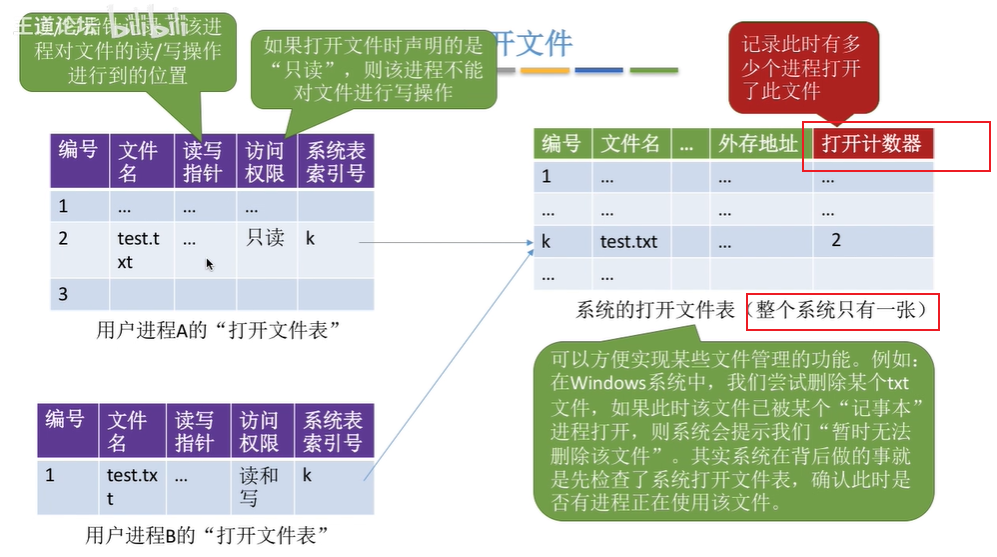

### 关闭文件

进程使用完文件后，要“关闭文件”。操作系统在处理Close系统调用时，主要做了几件事：

1. 1，将进程的打开文件表相应表项删除
2. 2.回收分配给该文件的内存空间等资源3，系统打开文件表的打开计数器count减1，若count=0，则删除对应表项。

### 读文件

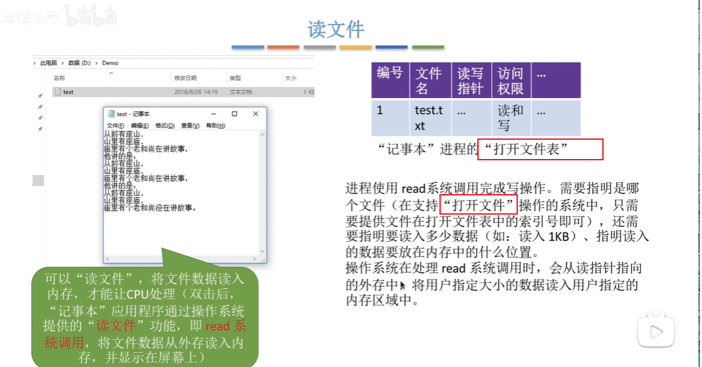

### 写文件

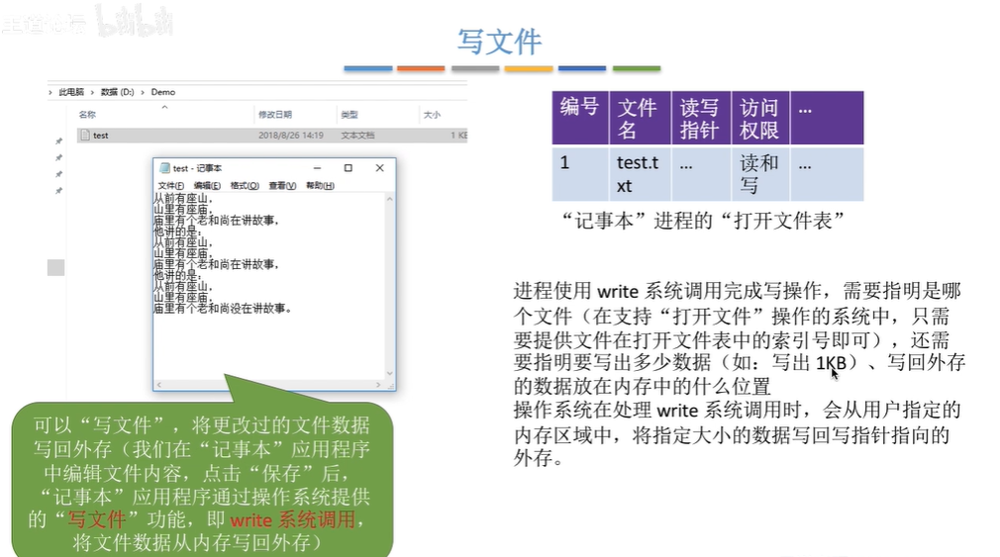

## 文件共享

> 注意：多个用户共享同一个文件，意味着系统中只有“一份”文件数据。并且只要某个用户修改了该文件的数据，其他用户也可以看到文件数据的变化。

### 基于索引结点的共享方式（硬链接）

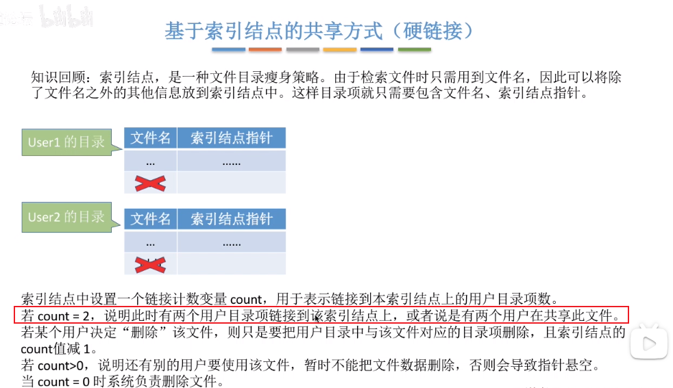

### 基于符号链的共享方式《软链接）

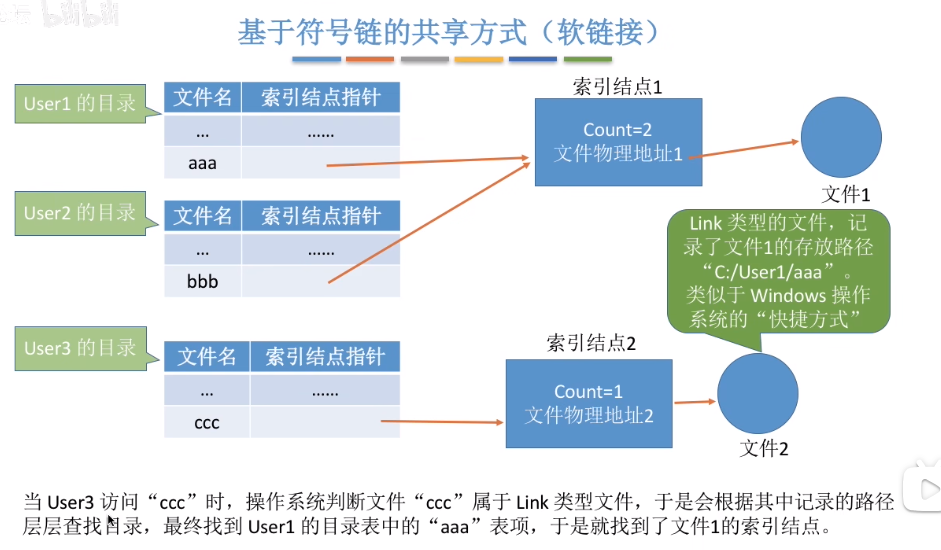

## 文件保护

### 口令保护

为文件设置一个“口令”（如：abc112233），用户请求访问该文件时必须提供“口令”。

口令存放在文件对应的 FCB 或索引结点中。用户访问文件前需要先输入“口令”，操作系统会将用户提供的口令与FCB中存储的口令进行对比，如果正确，则允许该用户访问文件

优点：保存口令的空间开销不多，验证口令的时间开销也很小。

缺点：正确的“口令”存放在系统内部，不够安全。

### 加密保护

使用某个“密码”对文件进行加密，在访问文件时需要提供正确的“密码”才能对文件进行正确的解密。

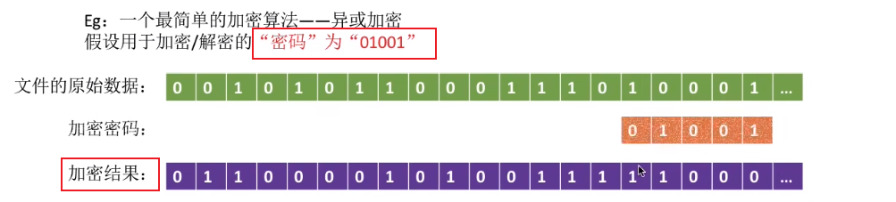

优点：保密性强，不需要在系统中存储“密码”
缺点：编码/译码，或者说加密/解密要花费一定时间。

### 访问控制

在每个文件的FCB（或索引结点）中增加一个访问控制列表（Access-Control List，ACL），该表中记录了各个用户可以对该文件执行哪些操作。

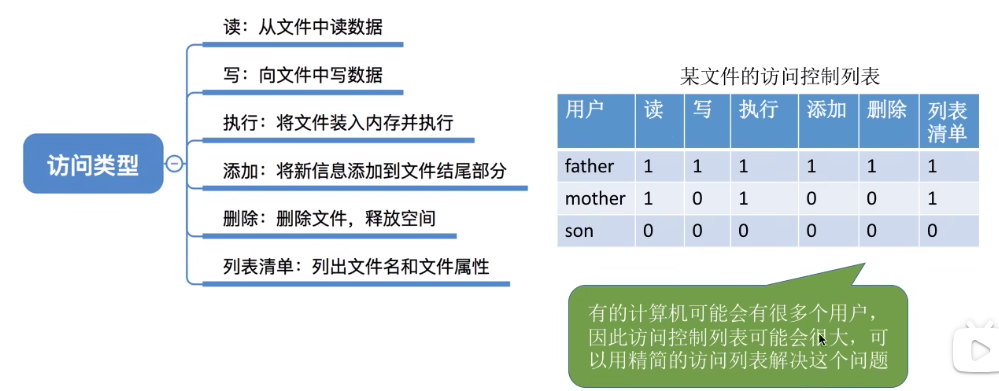

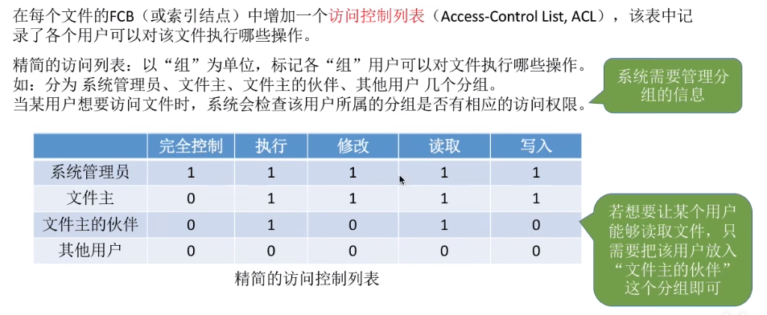

## 文件系统的全局结构

- 物理格式化，即低级格式化——划分扇区，检测坏扇区，并用备用扇区替换坏扇区

- 逻辑格式化后

  逻辑格式化后，磁盘分区（分卷 Volume），完成各分区的文件系统初始化。注：逻辑格式化后，灰色部分就有实际数据了，白色部分还没有数据

  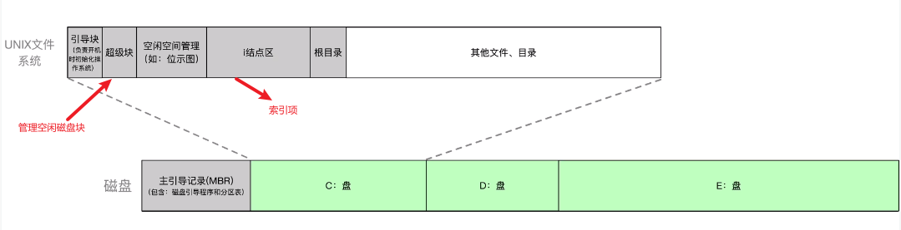

### 文件系统在内存中的结构

> 注：近期访问过的目录文件会缓存在内存中，不用每次都从磁盘读入，这样可以加快目录检索速度

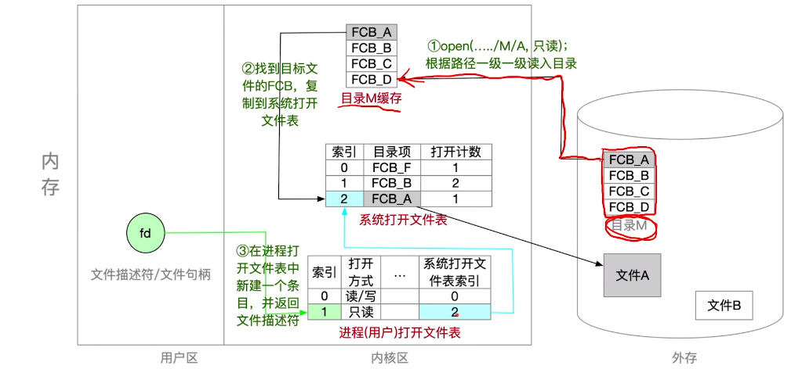

通过read接口传入fd指针，fd通过进程打开文件表知道在系统打开文件表的索引，从而拿到外存中文件信息

## 虚拟文件系统

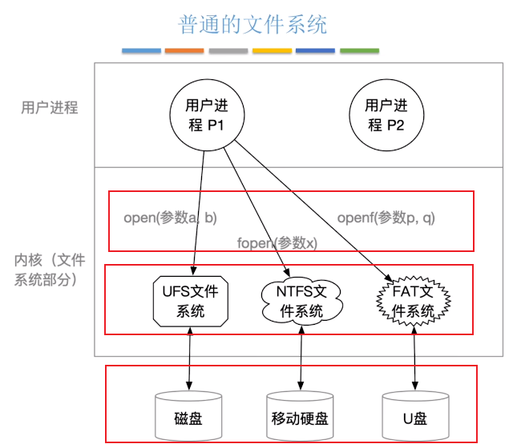

不同的设备有不同的文件系统，不同的格式

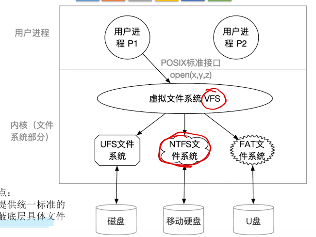

虚拟文件系统的特点：
①向上层用户进程提供统一标准的系统调用接口，屏蔽底层具体文件系统的实现差异

②VFS要求下层的文件系统必须实现某些规定的函数功能，如：open/read/write一个新的文件系统想要在某操作系统上被使用，就必须满足该操作系统VFS的要求


存在的问题：不同的文件系统，表示文件数据结构各不相同。打开文件后，其在内存中的表示就不同

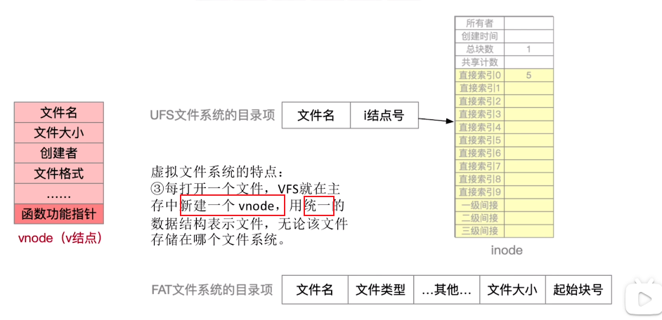

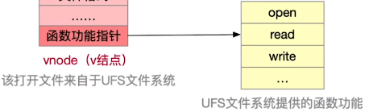

**注意：vnode只存在于主存中，而 inode 既会被调入主存，也会在外存中存储**

### 文件系统挂载

文件系统挂载（mounting），即文件系统安装/装载——如何将一个文件系统挂载到操作系统

文件系统挂载要做的事：
①在VFS中注册新挂载的文件系统。**内存**中的挂载表（mount table）包含每个文件系统的相关信息，包括文件系统类型、容量大小等。
②新挂载的文件系统，要向VFS提供一个**函数地址列表**
③将新文件系统加到**挂载点**（mount point），也就是将新文件系统挂载在某个父目录下

# 设备管理

## 基本概念

### 什么是1/0设备

"1/0”就是“输入/输出”（Input/Output）

1/0设备就是可以将数据输入到计算机，或者可以接收计算机输出数据的外部设备，属于计算机中的硬件部件。

### 1/0设备的分类

- 按使用特性

  - 人机交互类外部设备
  - 存储设备
  - 网络通信设备


- 传输速率分类
- 按信息交换的单位分类
  - 块设备
  - 字符设备

  

## I/O控制器

CPU无法直接控制1/0设备的机械部件，因此1/O设备还要有一个电子部件作为CPU和1/O设备机械部件之间的“中介”，用于实现CPU对设备的控制。

这个电子部件就是1/0控制器，又称设备控制器。CPU可控制10控制器，又由/0控制器来控制设备的机械部件。

**1/O控制器的功能**

- 接受和识别CPU发出的命令

  如CPU发来的 read/write 命令，1/O控制器中会有相应的**控制寄存器**来存放命令和参数

- 向CPU报告设备的状态

  1/0控制器中会有相应的**状态寄存器**，用于记录1/0设备的当前状态。如：1表示空闲，0表示忙碌

- 数据交换

  1/0控制器中会设置相应的**数据寄存器**。输出时，数据寄存器用于暂存CPU发来的数据，之后再由控制器传送设备。输入时，数据寄存器用于暂存设备发来的数据，之后CPU从数据寄存器中取走数据。

- 地址识别

  类似于内存的地址，为了区分设备控制器中的各个寄存器，也需要给各个寄存器设置一个特定的“地址”。1/0控制器通过CPU提供的“地址”来判断CPU要读/写的是哪个寄存器


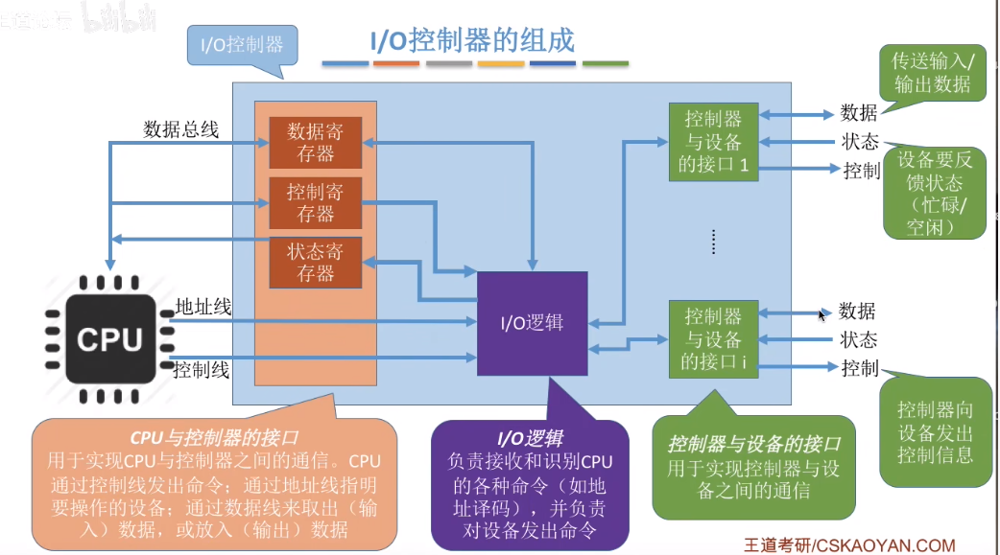

值得注意的小细节：

①一个1/0控制器可能会对应多个设备；
②数据寄存器、控制寄存器、状态寄存器可能有**多个**（如：每个控制/状态寄存器对应一个具体的设备），且这些寄存器都要有相应的地址，才能方便CPU操作。有的计算机会让这些寄存器占用内存地址的一部分，称为内存映像1/0；另一些计算机则采用1/0专用地址，即寄存器独立编址。


两种寄存器编址方式 

- 内存映射1/O
  - 控制器中的寄存器与内存统一编制
  - 可以采用对内存进行操作的指令来对控制器进行操作

- 寄存器独立编制
  - 控制器中的寄存器独立编制
  - 需要设置专门的指令来操作控制器


## IO控制方式

> 需要注意的问题：1.完成一次读/写操作的流程；
> 2.CPU干预的频率；
> 3.数据传送的单位；
> 4.数据的流向；
> 5.主要缺点和主要优点。

### 程序直接控制方式

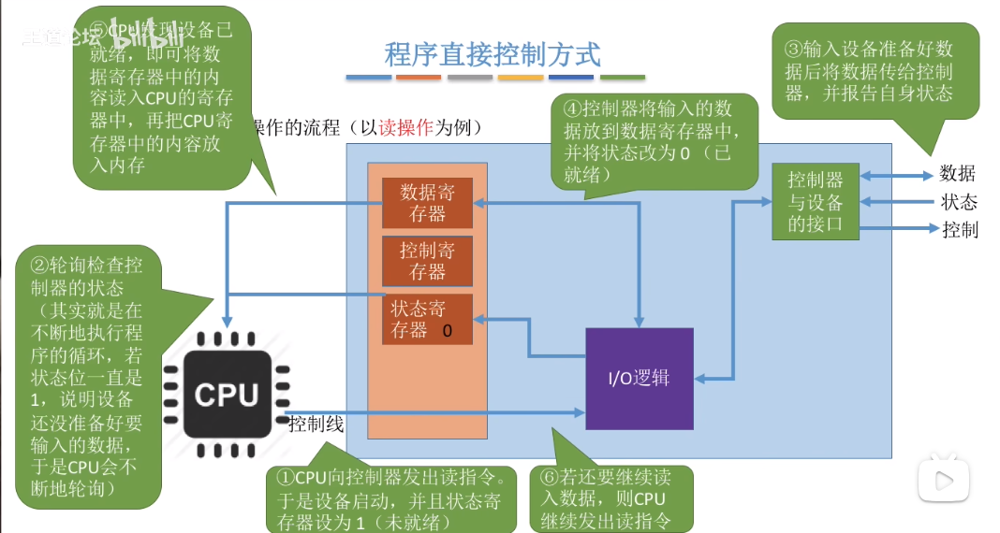

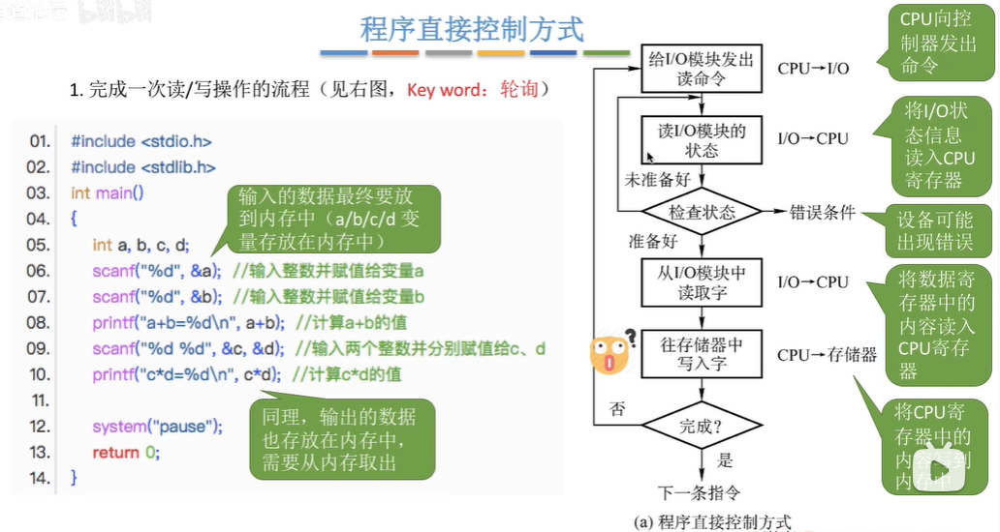

- 完成一次读/写操作的流程（见右图，Key word：轮询）

- CPU干预的频率

  很频繁，1/0操作开始之前、完成之后需要CPU介入，并且在等待1/O完成的过程中CPU需要不断地轮询检查。

- 数据传送的单位

  每次读/写一个字

- 数据的流向

  读操作（数据输入）：I/O设备→CPU（指的是CPU的寄存器）→内存

  写操作（数据输出）：内存→CPU→I/O设备每个字的读/写都需要CPU的帮助

- 主要缺点和主要优点

  优点：实现简单。在读/写指令之后，加上实现循环检查的一系列指令即可（因此才称为“程序直接控制方式”）

  缺点：CPU和I/O设备只能串行工作，CPU需要一直轮询检查，长期处于“忙等”状态，CPU利用率低。

### 中断驱动方式

引入**中断机制**。由于1/0设备速度很慢，因此在CPU发出读/写命令后，可将等待**1/0的进程阻塞**，先切换到别的进程执行。当1/0完成后，控制器会向CPU发出一个中断信号，CPU**检测到中断信号后**，会保存当前进程的运行环境信息，转去执行中断处理程序处理该中断。处理中断的过程中，CPU从1/0控制器读一个字的数据传送到CPU寄存器，再写入主存。接着，**CPU恢复等待I/O的进程（或其他进程）的运行环境，然后继续执行。**

①CPU会在每个指令周期的末尾检查中断；
②中断处理过程中需要保存、恢复进程的运行环境，这个过程是需要一定时间开销的。可见，如果中断发生的频率太高，也会降低系统性能。

- 完成一次读/写操作的流程（见右图，Key word：中断）

- CPU干预的频率

  每次1/0操作开始之前、完成之后需要CPU介入。

  等待1/0完成的过程中CPU可以切换到别的进程执行。

- 数据传送的单位

  每次读/写一个字

- 数据的流向

  读操作（数据输入）：I/O设备→**CPU**→内存

  写操作（数据输出）：内存→**CPU**→I/O设备

- 主要缺点和主要优点

  优点：与“程序直接控制方式”相比，在“中断驱动方式”中，1/0控制器会通过中断信号主动报告1/O已完成，CPU不再需要不停地轮询。

  CPU和1/O设备可并行工作，CPU利用率得到明显提升。

  缺点：每个字在1/O设备与内存之间的传输，**都需要经过CPU**。而频繁的中断处理会消耗较多的CPU时间。

### DMA方式

与“中断驱动方式”相比，DMA方式（Direct Memory Access，直接存储器存取。主要用于块设备的1/0控制）有这样几个改进：

①**数据的传送单位是“块”。不再是一个字、一个字的传送；**

②数据的流向是从设备直接放入内存，或者从内存直接到设备。**不再需要CPU作为“快递小哥”。**

③仅在传送一个或多个数据块的开始和结束时，才需要CPU干预。


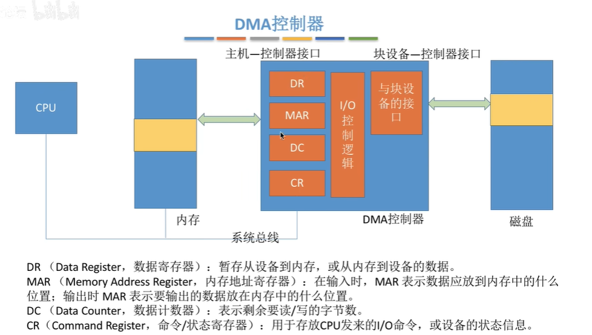

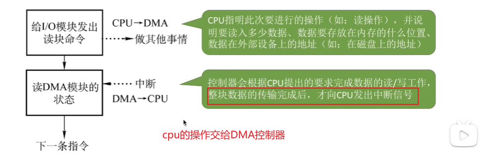

1.完成一次读/写操作的流程（见右图）

2.CPU干预的频率

仅在传送一个或多个数据块的开始和结束时，才需要CPU干预。

3.数据传送的单位

每次读/写一个或多个块（注意：每次读写的只能是**连续**的多个块，且这些块读入内存后在内存中也**必须是连续的**

4，数据的流向（不再需要经过CPU）

读操作（数据输入）：1/0设备→内存

写操作（数据输出）：内存→1/0设备

5，主要缺点和主要优点

优点：数据传输以“块”为单位，CPU介入频率进一步降低。数据的传输不再需要先经过CPU再写入内存，数据传输效率进一步增加。CPU和1/O设备的并行性得到提升。

**缺点：CPU每发出一条1/0指令，只能读/写一个或多个连续的数据块。如果要读/写多个离散存储的数据块，或者要将数据分别写到不同的内存区域时，CPU要分别发出多条1/0指令，进行多次中断处理才能完成。**

### 通道控制方式

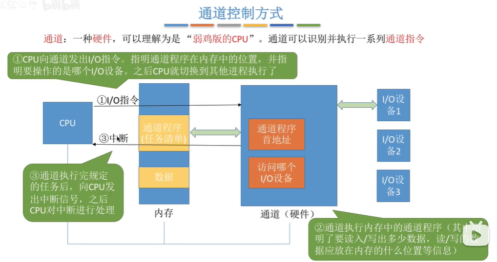

通道：一种硬件，可以理解为是“弱鸡版的CPU”。通道可以识别并执行一系列通道指令

与CPU相比，通道可以执行的指令很单一，并且通道程序是放在主机内存中的，也就是说通道与CPU共享内存

**完成一次读/写操作的流程和DMA类似**

- CPU干预的频率

  极低，通道会根据CPU的指示执行相应的通道程序，只有完成一组数据块的读/写后才需要发出中断信号，请求CPU干预。

- 数据传送的单位

  每次读/写一组数据块

- 数据的流向（在通道的控制下进行）读操作（数据输入）：1/0设备→内存写操作（数据输出）：内存→1/0设备

- 主要缺点和主要优点

  缺点：实现复杂，需要**专门的通道硬件**支持

  优点：CPU、通道、1/0设备可并行工作，资源利用率很高。

### 总结

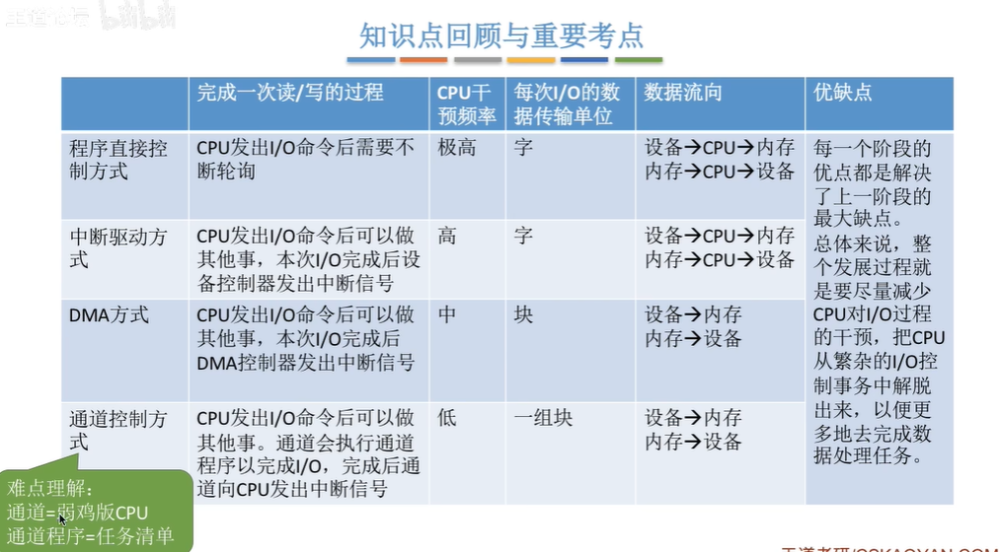

## I-O软件层次结构

### 用户层软件

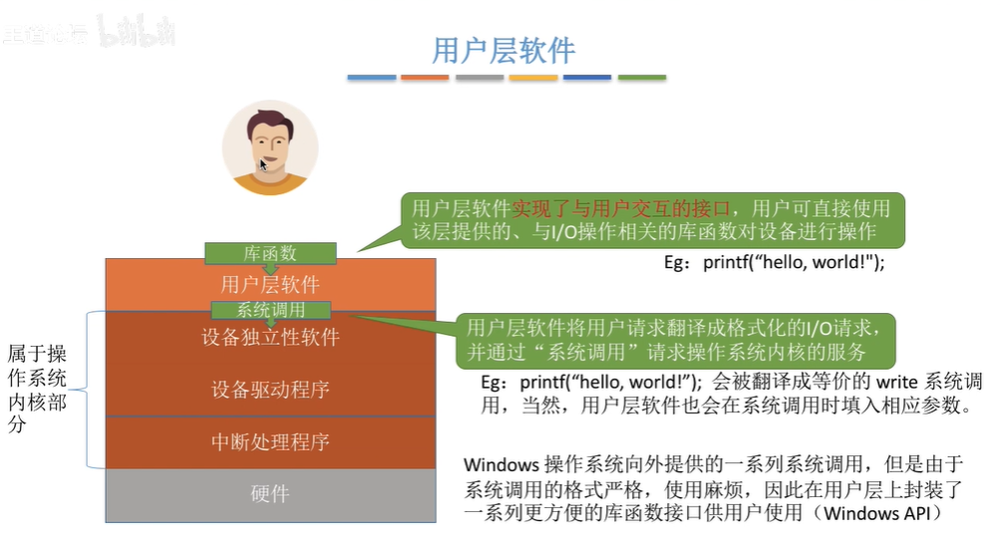

### 设备独立性软件

设备独立性软件，又称设备无关性软件。与设备的硬件特性无关的功能几乎都在这一层实现。

主要实现的功能：

①向上层提供统一的调用接口（如 read/write 系统调用）

②设备的保护

原理类似与文件保护。设备被看做是一种特殊的文件，不同用户对各个文件的访问权限是不一样的，同理，对设备的访问权限也不一样。

③差错处理

设备独立性软件需要对一些设备的错误进行处理

④设备的分配与回收

⑤数据缓冲区管理

可以通过缓冲技术**屏蔽**设备之间数据交换单位大小和传输速度的差异

⑥建立逻辑设备名到物理设备名的映射关系；根据设备类型选择调用相应的驱动程序

操作系统系统可以采用两种方式管理逻辑设备表（LUT）：第一种方式，整个系统只设置一张LUT，这就意味着所有用户不能使用相同的逻辑设备名，因此这种方式只适用于单用户操作系统。

第二种方式，为每个用户设置一张LUT，各个用户使用的逻辑设备名可以重复，适用于多用户操作系统。系统会在用户登录时为其建立一个用户管理进程，而LUT就存放在用户管理进程的PCB中。

### 设备驱动程序

> 思考：为什么不同类型的1/0设备需要有不同的驱动程序处理？
>
> 
>
> 

不同的1/0设备有不同的硬件特性，具体细节只有设备的厂家才知道。因此厂家需要根据设备的硬件特性设计并提供相应的驱动程序。

主要负责对硬件设备的具体控制，将上层发出的一系列命令（如read/write）转化成特定设备“能听得懂”的一系列操作。包括设置设备寄存器；检查设备状态等

注：驱动程序一般会以一个**独立进程**的方式存在。

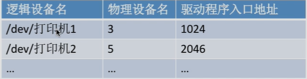

### 中断处理程序

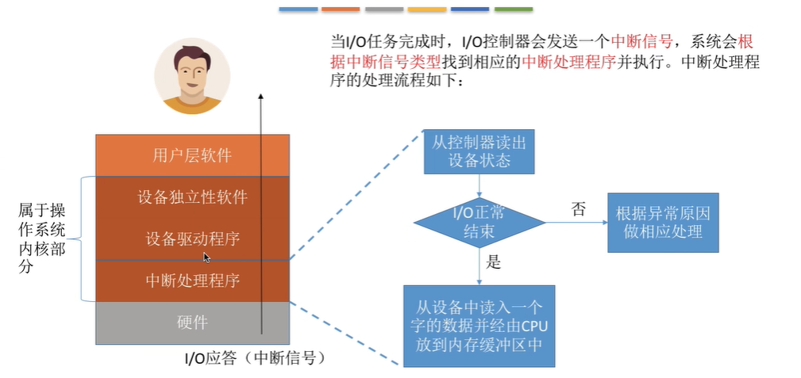

## 输入/输出应用程序接口&设备驱动程序接口

### 输入/输出应用程序接口

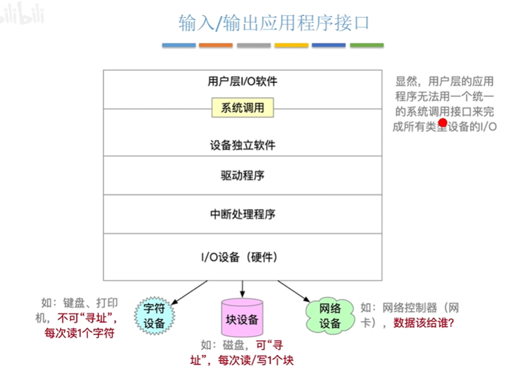

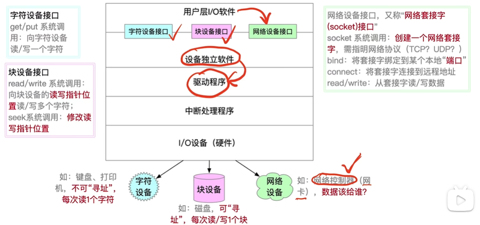

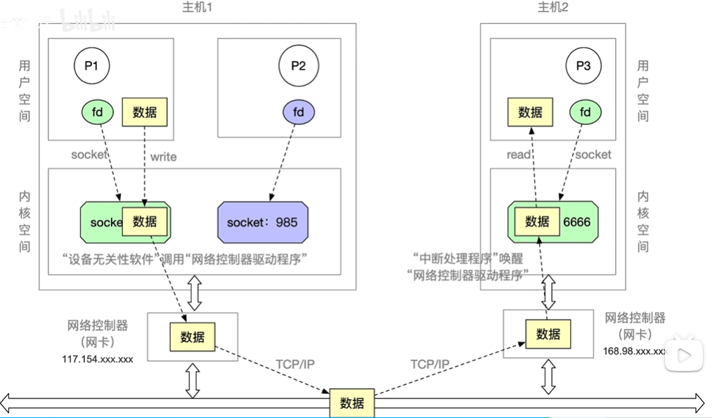

### 阻塞/非阻塞I/O

阻塞1/O：应用程序发出1/0系统调用，进程需转为阻塞态等待。
eg：字符设备接口——从键盘读一个字符 get,scanf

非阻塞1/0：应用程序发出1/0系统调用，系统调用可迅速返回，进程无需阻塞等待。
eg：块设备接口--往磁盘写数据 write

### 设备驱动程序接口

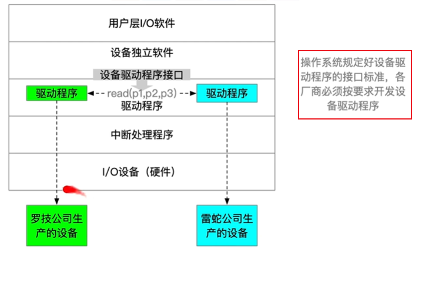

## I/O核心子系统

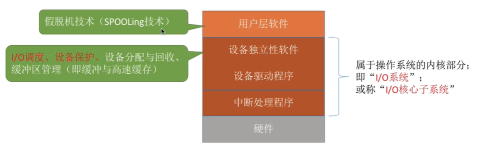

### 假脱机技术

#### 脱机技术概念

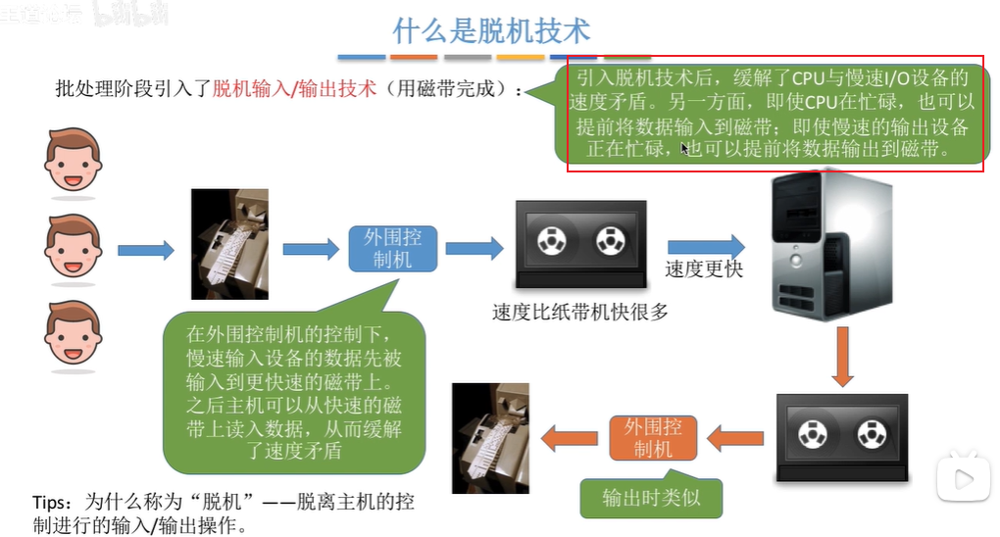

#### 实现原理

“假脱机技术”，又称"SPOOLing技术”，用软件的方式模拟脱机技术。SPOOLing系统的组成如下：

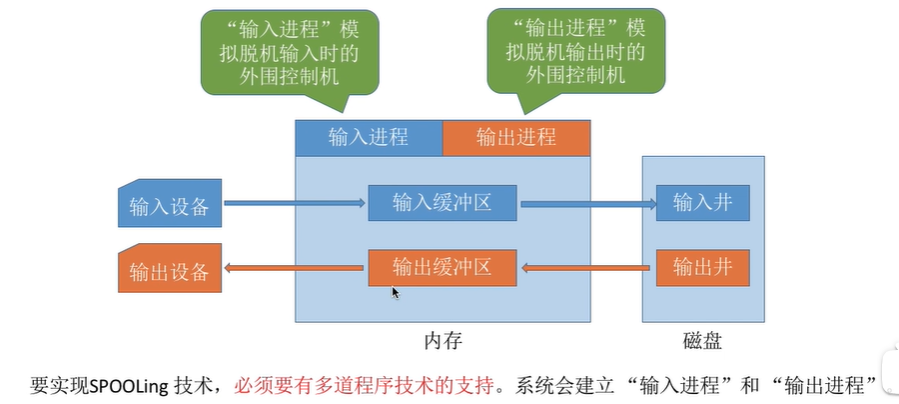

“输入井”模拟脱机输入时的磁带，用于收容1/0设备输入的数据

“输出井”模拟脱机输出时的磁带，用于收容用户进程输出的数据

- 在输入进程的控制下，“输入缓冲区”用于暂存从输入设备输入的数据，之后再转存到输入井中 。
- 在输出进程的控制下，“输出缓冲区”用于暂存从输出井送来的数据，之后再传送到输出设备上

注意，输入缓冲区和输出缓冲区是在内存中的缓冲区

#### 共享打印机的原理分析

独占式设备——只允许各个进程串行使用的设备。一段时间内只能满足一个进程的请求。

共享设备--允许多个进程“同时”使用的设备（宏观上同时使用，微观上可能是交替使用）。可以同时满足多个进程的使用请求。

**打印机是种“独占式设备”，但是可以用SPOOLing 技术改造成“共享设备”**

独占式设备的例子：若进程1 正在使用打印机，则进程2请求使用打印机时必然阻塞等待

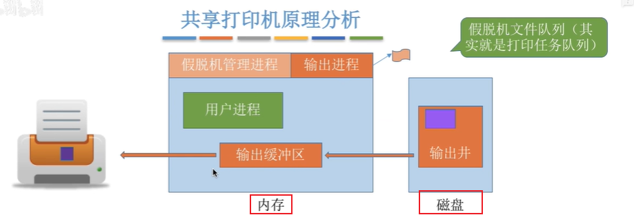

当多个用户进程提出输出打印的请求时，系统会答应它们的请求，但是并不是真正把打印机分配给他们，而是由假脱机管理进程为每个进程做两件事：

（1）在磁盘输出井中为进程申请一个空闲缓冲区（也就是说，这个缓冲区是在磁盘上的），并将要打印的数据送入其中；
（2）为用户进程申请一张空白的打印请求表，并将用户的打印请求填入表中（其实就是用来说明用户的打印数据存放位置等信息的），再将该表挂到假脱机文件队列上。

当打印机空闲时，输出进程会从文件队列的队头取出一张打印请求表，并根据表中的要求将要打印的数据从输出井传送到输出缓冲区，再输出到打印机进行打印。用这种方式可依次处理完全部的打印任务

虽然系统中只有一个台打印机，但每个进程提出打印请求时，系统都会为在输出井中为其分配一个存储区（相当于分配了一个逻辑设备），使每个用户进程都觉得自己在独占一台打印机，从而实现对打印机的共享。

### 设备的分配与回收

#### 设备分配时应考虑的因素

- 设备的固有属性

  设备的固有属性可分为三种：独占设备、共享设备、虚拟设备。

  虚拟设备--采用SPOOLing技术将独占设备改造成虚拟的共享设备，可同时分配给多个进程使用（如采用SPOOLing技术实现的共享打印机）

- 设备分配算法

  先来先服务

  优先级高者优先

  短任务优先

- 设备分配中的安全性

  - 安全分配方式：为进程分配一个设备后就将进程阻塞，本次1/0完成后才将进程唤醒。（eg：考虑进程请求打印机打印输出的例子）

    一个时段内每个进程只能使用一个设备

    - 优点：破坏了“请求和保持”条件，不会死锁

    - 缺点：对于一个进程来说，CPU和I/O设备只能串行工作

  - 不安全分配方式：进程发出1/0请求后，系统为其分配1/0设备，进程可继续执行，之后还可以发出新的1/0请求。只有某个1/0请求得不到满足时才将进程阻塞。

    一个进程可以同时使用多个设备
    优点：进程的计算任务和1/0任务可以并行处理，使进程迅速推进缺点：有可能发生死锁（死锁避免、死锁的检测和解除）

#### 静态分配与动态分配

静态分配：进程运行前为其分配全部所需资源，运行结束后归还资源

动态分配：进程运行过程中动态申请设备资源

#### 设备分配管理中的数据结构

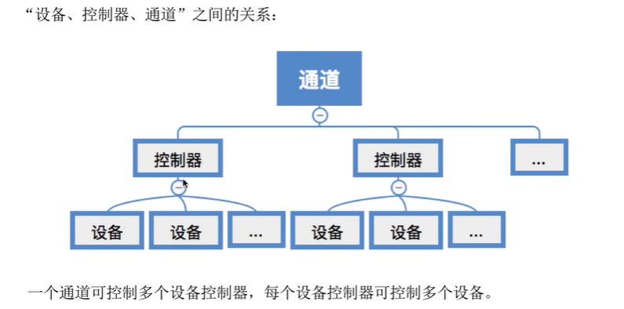

##### DCT

设备控制表（DCT）：系统为每个设备配置一张DCT，用于记录设备情况

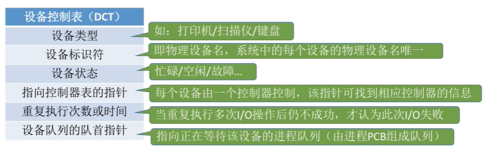

注：“进程管理”章节中曾经提到过“系统会根据阻塞原因不同，将进程PCB挂到不同的阻塞队列中”

##### COCT

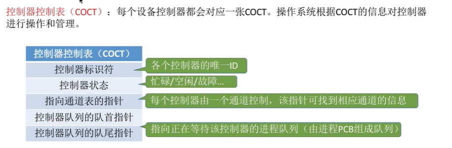

##### CHCT

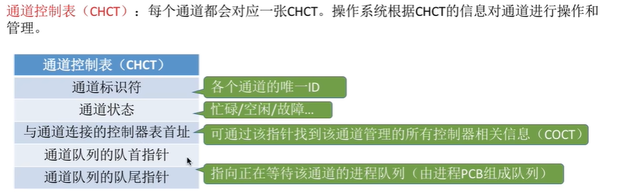

##### SDT

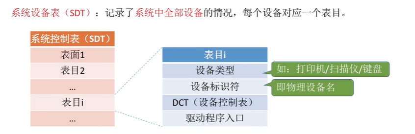


#### 设备分配的步骤

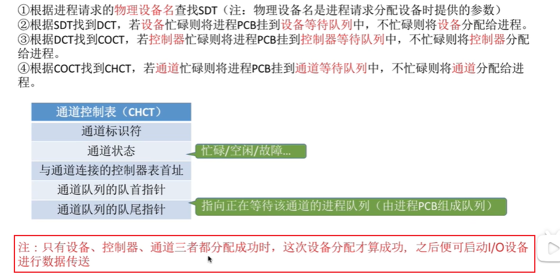

缺点：
①用户编程时必须使用“物理设备名”，底层细节对用户不透明，不方便编程
②若换了一个物理设备，则程序无法运行
③若进程请求的物理设备正在忙碌，则即使系统中还有同类型的设备，进程也必须阻塞等待

#### 设备分配步骤的改进方法

改进方法：建立逻辑设备名与物理设备名的映射机制，用户编程时只需提供逻辑设备名

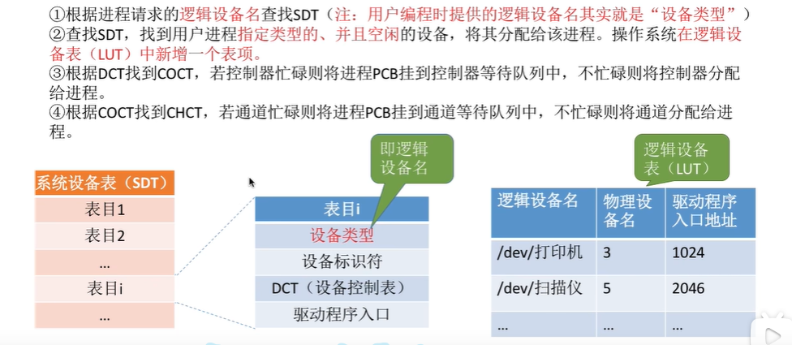

**逻辑设备表（LUT）建立了逻辑设备名与物理设备名之间的映射关系。**
某用户进程第一次使用设备时使用逻辑设备名向操作系统发出请求，操作系统根据用户进程指定的设备类型（逻辑设备名）查找系统设备表，找到一个空闲设备分配给进程，并在LUT中增加相应表项。
**如果之后用户进程再次通过相同的逻辑设备名请求使用设备，则操作系统通过LUT表即可知道用户进程实际要使用的是哪个物理设备了，并且也能知道该设备的驱动程序入口地址。**

逻辑设备表的设置问题：

整个系统只有一张LUT：各用户所用的逻辑设备名不允许重复，适用于单用户操作系统

每个用户一张LUT：不同用户的逻辑设备名可重复，适用于多用户操作系统

### 缓冲区管理

#### 什么是缓冲区？有什么作用？

缓冲区是一个存储区域，可以由专门的硬件寄存器组成，也可利用内存作为缓冲区。
使用**硬件作为缓冲区的成本较高，容量也较小**，一般仅用在对速度要求非常高的场合（如存储器管理中所用的联想寄存器，由于对页表的访问频率极高，因此使用速度很快的联想寄存器来存放页表项的副本）

一般情况下，更多的是**利用内存作为缓冲区**，“设备独立性软件”的缓冲区管理就是要组织管理好这些缓冲区

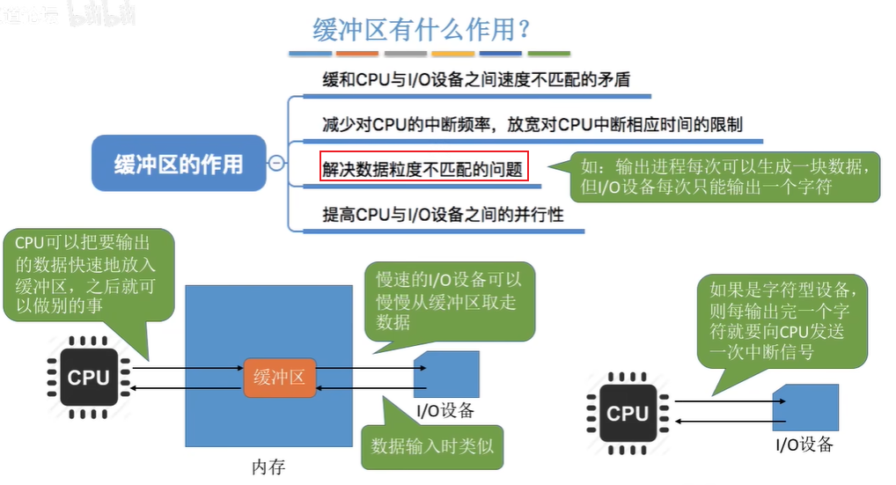

#### 单缓冲双缓冲

假设某用户进程请求某种块设备读入若干块的数据。若采用单缓冲的策略，操作系统会在主存中为其分配一个缓冲区（若题目中没有特别说明，一个缓冲区的大小就是一个块）。
注意：当缓冲区数据非空时，不能往缓冲区冲入数据，只能从缓冲区把数据传出；当缓冲区为空时，可以往缓冲区冲入数据，但必须把缓冲区充满以后，才能从缓冲区把数据传出。

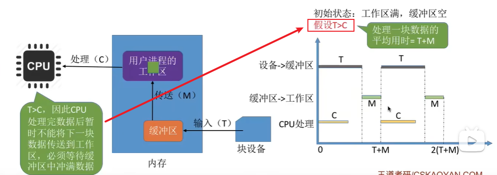

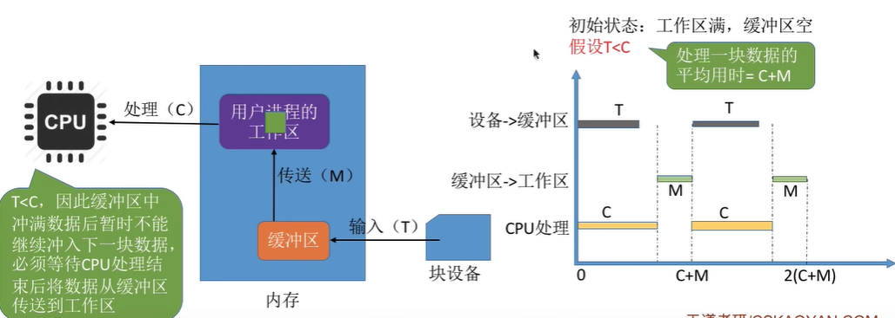

**结论：采用单缓冲策略，处理一块数据平均耗时 Max（C，T）+M**


假设某用户进程请求某种块设备读入若干块的数据。若采用双缓冲的策略，操作系统会在主存中为其分配两个缓冲区（若题目中没有特别说明，一个缓冲区的大小就是一个块）

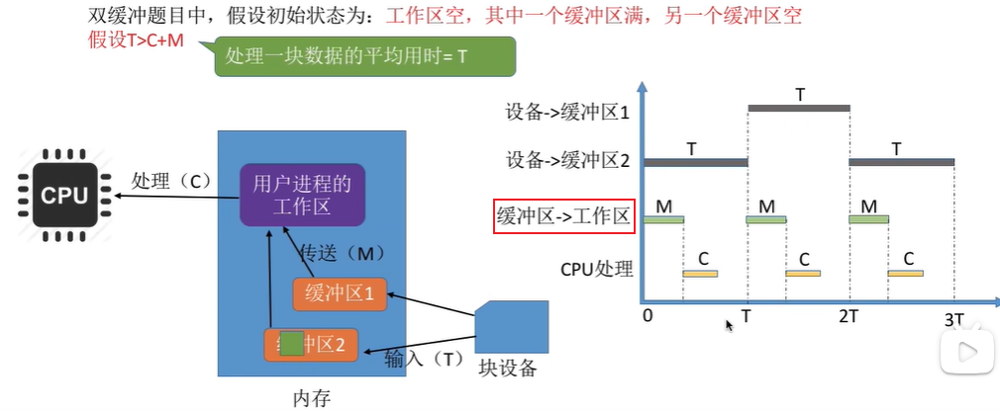

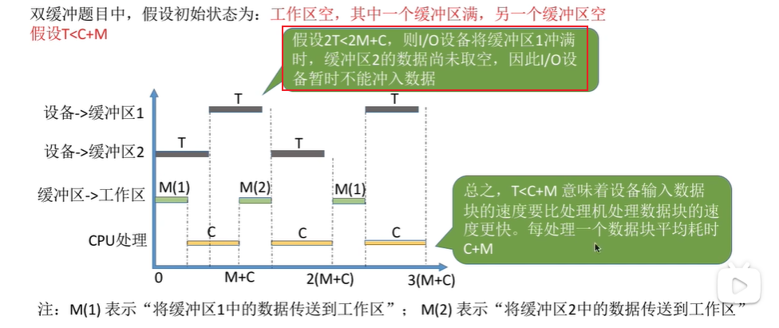

结论：采用双缓冲策略，处理一个数据块的平均耗时为Max(T，C+M)

#### 循环缓冲

将多个大小相等的缓冲区链接成一个循环队列。
注：以下图示中，橙色表示已充满数据的缓冲区，绿色表示空缓冲区。

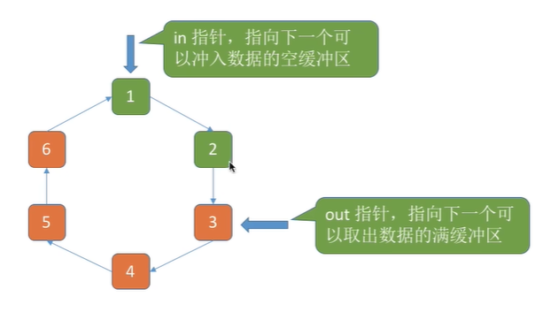

#### 缓冲池

缓冲池由系统中共用的缓冲区组成。这些缓冲区按使用状况可以分为：

空缓冲队列、装满输入数据的缓冲队列（输入队列）、装满输出数据的缓冲队列（输出队列）。

另外，根据一个缓冲区在实际运算中扮演的功能不同，又设置了四种工作缓冲区：

- 用于收容输入数据的工作缓冲区（hin）、
- 用于提取输入数据的工作缓冲区（sin）、
- 用于收容输出数据的工作缓冲区（hout）、
- 用于提取输出数据的工作缓冲区（sout）

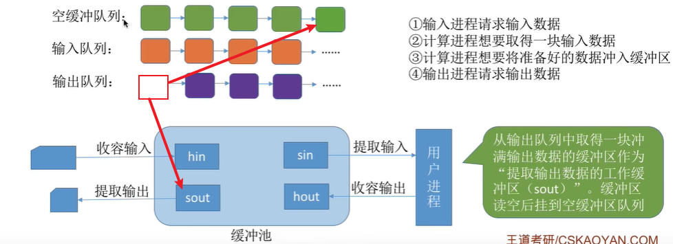

## 磁盘

### 磁盘、磁道、扇区

磁盘的表面由一些磁性物质组成，可以用这些磁性物质来记录二进制数据

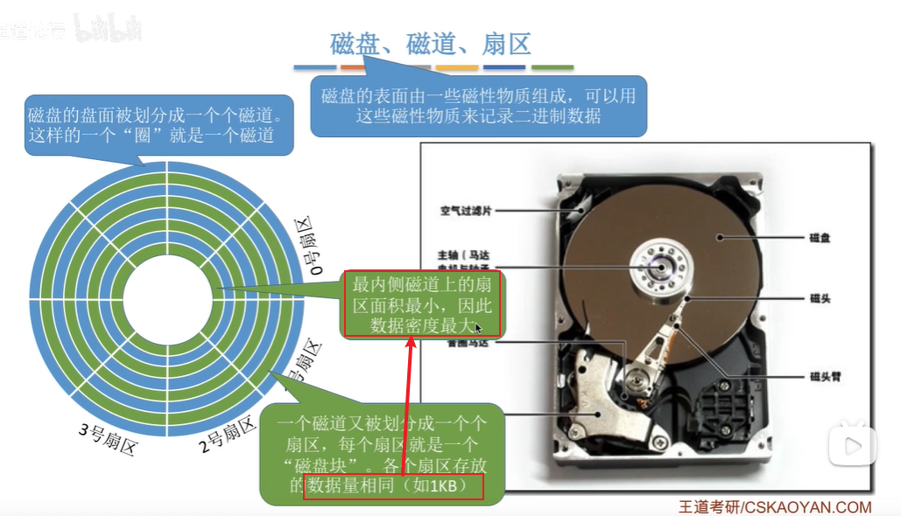

**每个磁道的存储大小是一样的**

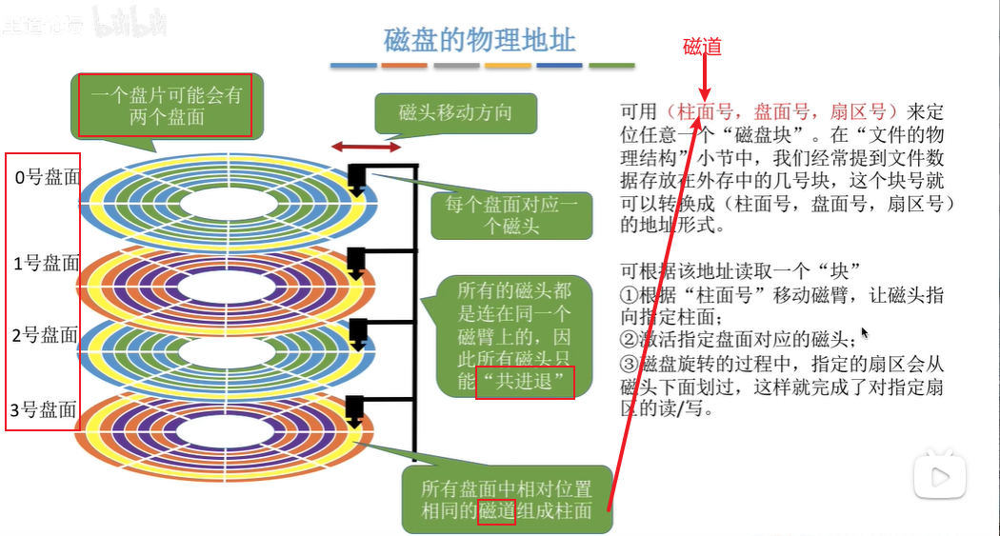

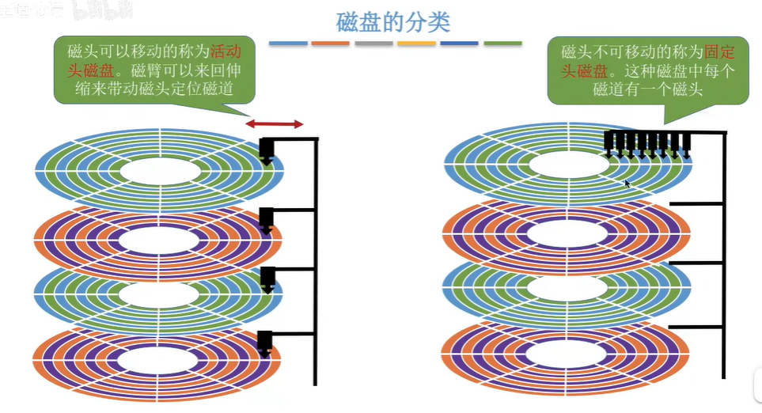

### **磁盘调度算法**

#### 一次磁盘读/写操作需要的时间


一次磁盘读/写操作需要的时间

- 寻找时间（寻道时间）：启动磁臂、移动磁头所花的时间
- 延迟时间：将目标扇区转到磁头下面所花的时间
- 传输时间：读/写 数据花费的时间

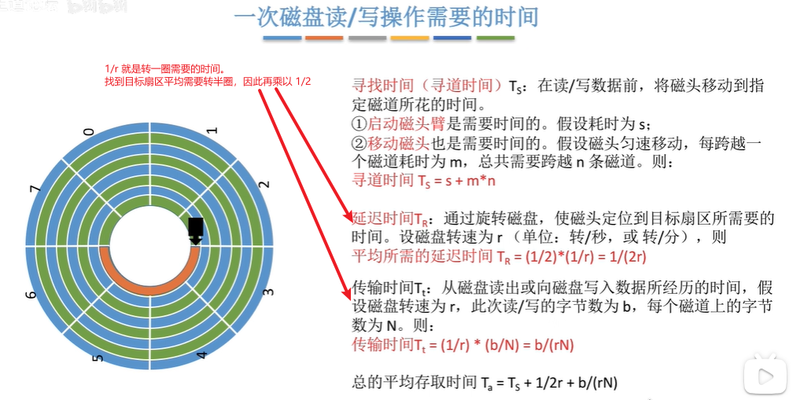

延迟时间和传输时间都与磁盘转速相关，且为线性相关。而转速是硬件的固有属性，操作系统也无法优化延迟时间和传输

时间。但是操作系统的磁盘调度算法会直接影响寻道时间

#### 磁盘调度算法

##### 先来先服务（FCFS）

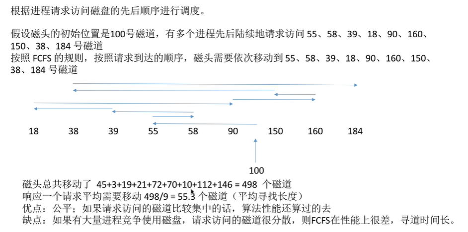

##### 最短寻找时间优先（SSTF）

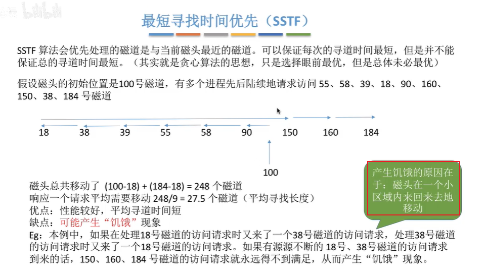

##### 扫描算法（SCAN）

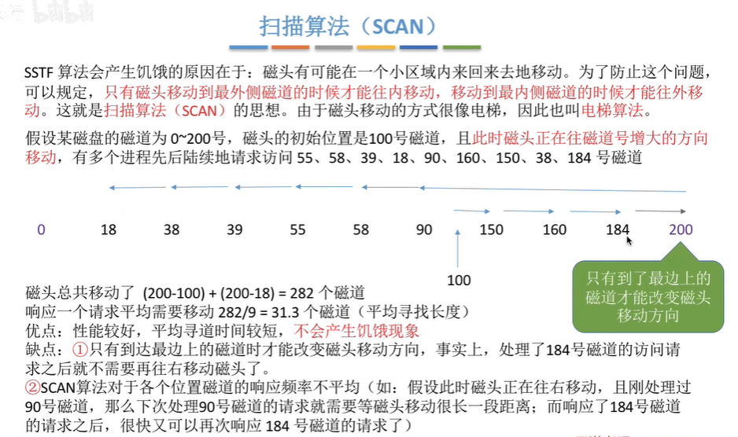

- 缺点1

  

- 缺点2

  循环扫描算法（C-SCAN）

  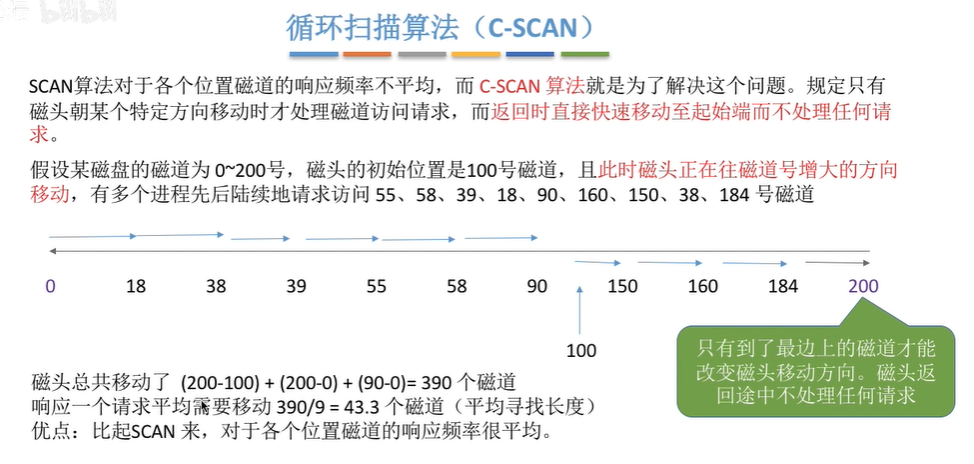

  优点：比起SCAN来，对于各个位置磁道的响应频率很平均。
  缺点：只有到达最边上的磁道时才能改变磁头移动方向，事实上，处理了184号磁道的访问请求之后就不需要再往右移动磁头了；并且，磁头返回时其实只需要返回到18号磁道即可，不需要返回到最边缘的磁道。另外，比起SCAN算法来，平均寻道时间更长。

  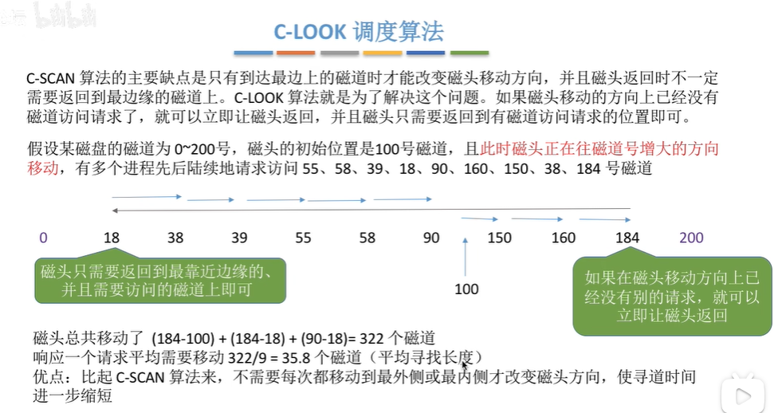


### 减少磁盘延迟时间的方法

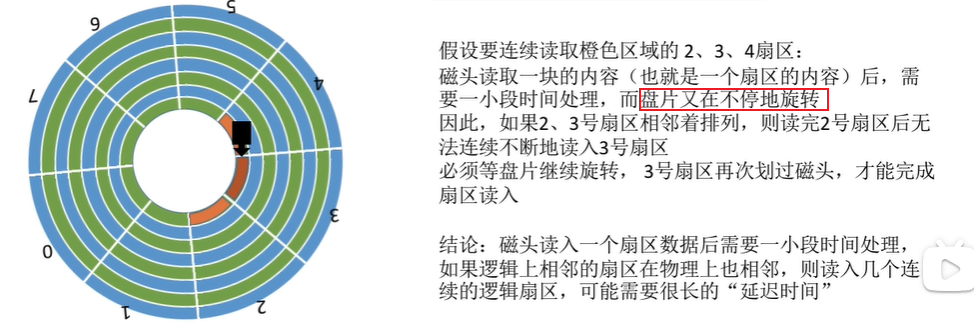

若采用交替编号的策略，即让逻辑上相邻的扇区在物理上有一定的间隔，可以使读取连续的逻辑扇区所需要的延迟时间更小。


### 磁盘地址结构的设计

思考：为什么？
磁盘的物理地址是（柱面号，盘面号，扇区号）而不是（盘面号，柱面号，扇区号）

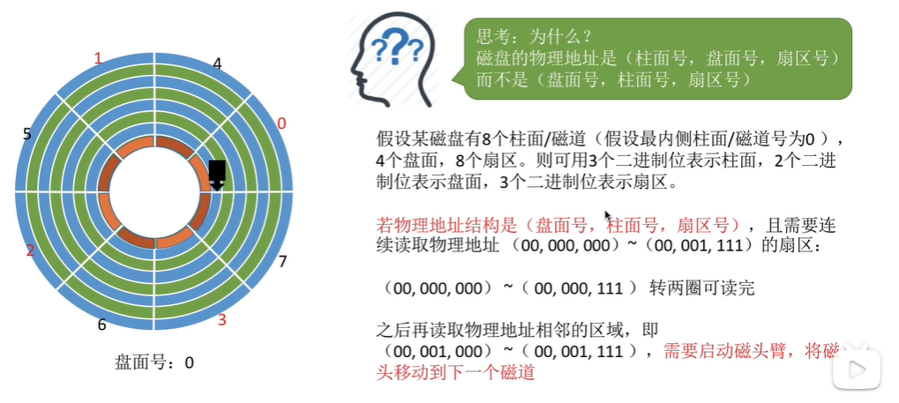

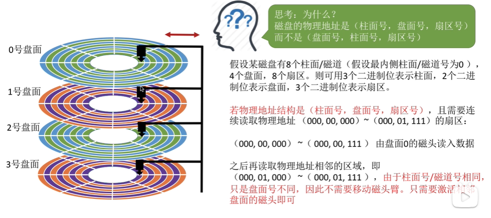

### 磁盘管理

#### 磁盘初始化

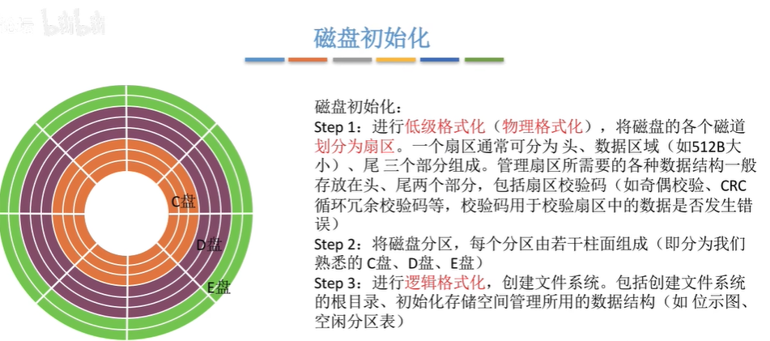

#### 引导块


#### 坏块的管理

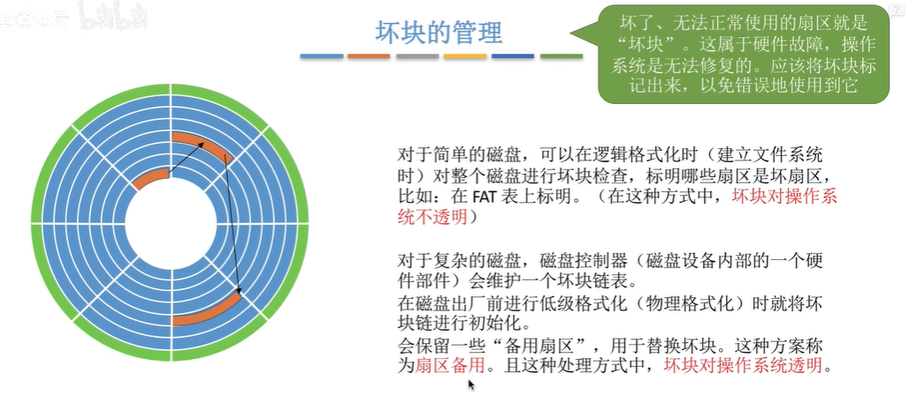

### 固态硬盘SSD

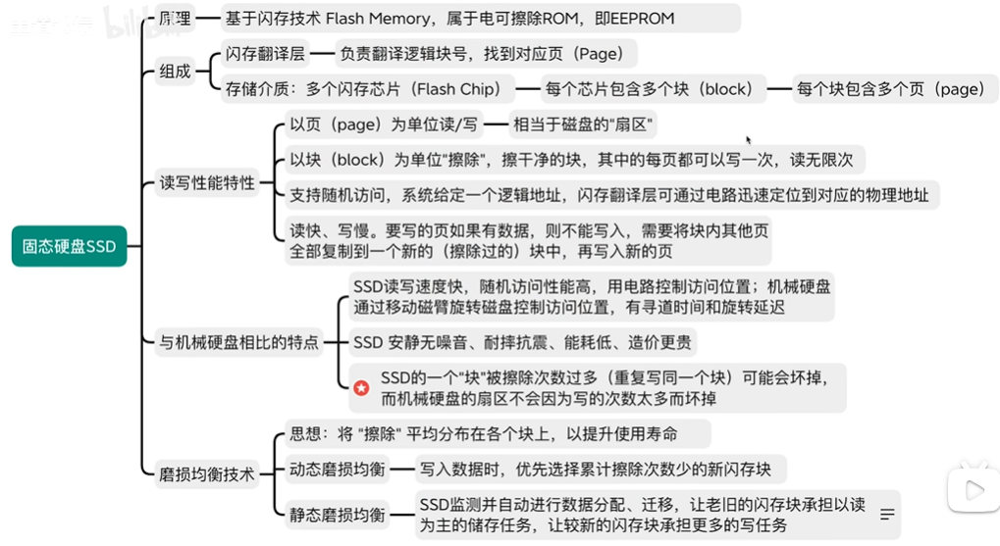
